                 

# 价值观的演变：从传统到后物质主义的转变

> 关键词：价值观演变、传统价值观、后物质主义、集体主义、个人自由、社会责任、道德规范

> 摘要：本文将探讨价值观的演变过程，从传统的集体主义和道德规范，到现代的后物质主义和个人自由。通过对历史背景、核心概念、演变过程和社会影响的深入分析，揭示价值观变迁的原因和影响，以及个体在社会变革中的适应与转变。

## 第一部分：引言

### 1.1 问题背景

#### 1.1.1 传统价值观的形成与演变

传统价值观是在人类历史发展过程中逐步形成的，它们通常与特定的文化、社会和历史背景紧密相关。在古代社会中，传统价值观强调集体主义、忠诚、责任和道德规范。这些价值观在维持社会秩序、促进社会发展和传承文化传统方面发挥了重要作用。然而，随着时间的推移，社会环境发生了巨大变化，传统价值观面临着一系列的挑战和质疑。

**问题解决**：

- **历史文献研究**：通过研究古代文献和宗教教义，了解传统价值观的起源和形成过程。
- **社会调查**：通过问卷调查和访谈，了解现代社会中传统价值观的变迁情况。
- **心理学理论**：结合心理学理论，分析传统价值观在现代社会中的困境和变迁原因。

#### 1.1.2 后物质主义价值观的兴起

后物质主义价值观是在现代社会中兴起的一种价值观念，它强调个人自由、自我实现、多元化和幸福感。后物质主义价值观的兴起与全球化和信息化的进程密切相关，它反映了人们对于物质追求之外的价值追求。然而，后物质主义价值观的兴起也引发了一系列的争议和挑战，如何平衡传统价值观和后物质主义价值观成为现代社会的一个重要问题。

**问题解决**：

- **心理学理论**：结合心理学理论，分析后物质主义价值观的成因和影响。
- **社会变革研究**：通过研究社会变革对价值观的影响，探讨后物质主义价值观的兴起原因。
- **案例分析**：通过具体案例，分析后物质主义价值观在社会实践中的应用和挑战。

### 1.2 核心概念

#### 1.2.1 价值观的定义与分类

**价值观**：价值观是指人们对于生活、工作、人际关系等方面的基本信念和评价标准。它们是人们行为的指导和决策的基础。

**分类**：

1. **传统价值观**：强调集体主义、忠诚、责任和道德规范。
2. **后物质主义价值观**：强调个人自由、自我实现、多元化和幸福感。

#### 1.2.2 传统价值观的属性特征

**对比表格**：

| 特征               | 传统价值观                    | 后物质主义价值观                    |
|--------------------|------------------------------|------------------------------------|
| 1. 集体主义        | 强调集体利益、社会责任       | 强调个人自由、自我实现               |
| 2. 忠诚            | 对家庭、国家和社会的忠诚      | 对个人价值观和兴趣的忠诚             |
| 3. 责任            | 对自己、家人和社会的责任感   | 对个人成长和发展的责任感             |
| 4. 道德规范        | 强调道德规范和道德标准       | 强调道德相对性和个体道德判断         |

#### 1.2.3 后物质主义价值观的特征

**对比表格**：

| 特征               | 传统价值观                    | 后物质主义价值观                    |
|--------------------|------------------------------|------------------------------------|
| 1. 多元化          | 单一的文化和价值观念         | 多元化的文化价值观                   |
| 2. 个人自由        | 对集体和权威的限制           | 对个人自由的尊重和支持               |
| 3. 自我实现        | 对物质财富的追求             | 对个人幸福和精神满足的追求           |

### 1.3 价值观的演变过程

#### 1.3.1 传统价值观的形成

**历史文献回顾**：通过研究古代文献和宗教教义，了解传统价值观的起源和形成过程。

**ER实体关系图**：

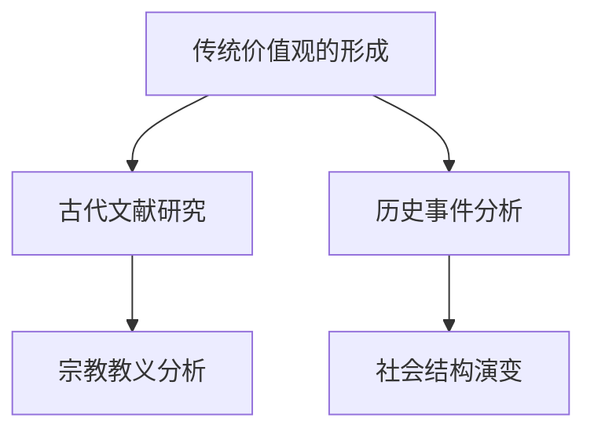

#### 1.3.2 传统价值观的演变

**社会调查**：通过问卷调查和访谈，了解现代社会中传统价值观的变迁情况。

**ER实体关系图**：

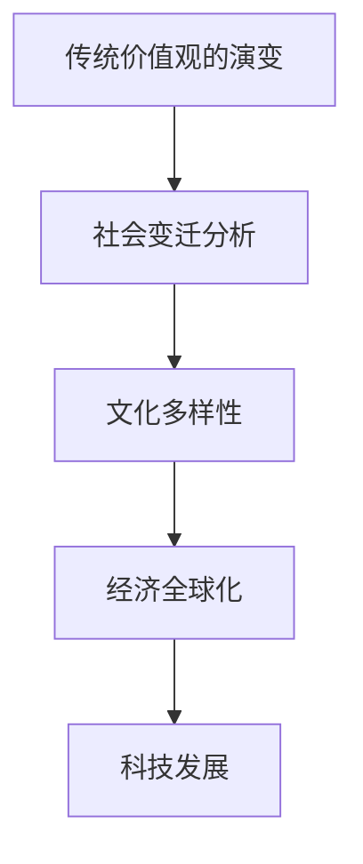

#### 1.3.3 后物质主义价值观的兴起

**心理学理论**：结合心理学理论，分析后物质主义价值观的成因和影响。

**ER实体关系图**：

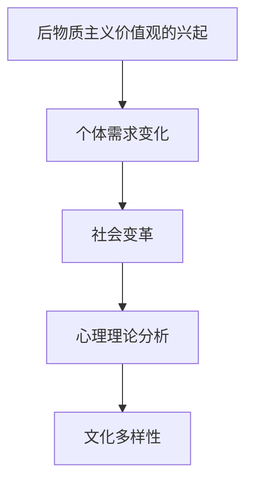

## 第二部分：传统价值观的演变

### 2.1 传统价值观的历史背景

#### 2.1.1 传统文化中的价值观

**核心概念**：研究传统文化中的价值观，了解其在历史上的演变过程。

**ER实体关系图**：

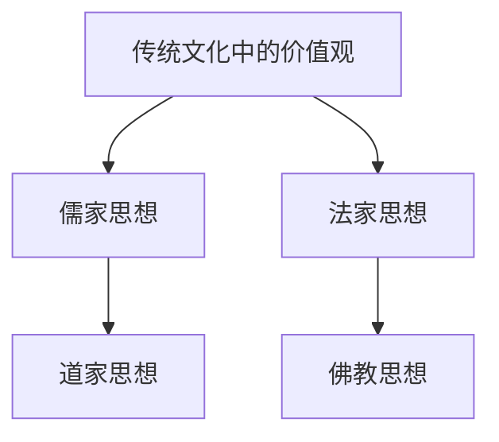

#### 2.1.2 传统价值观的演变历程

**历史文献**：回顾历史文献，分析传统价值观在不同历史时期的变迁。

**ER实体关系图**：

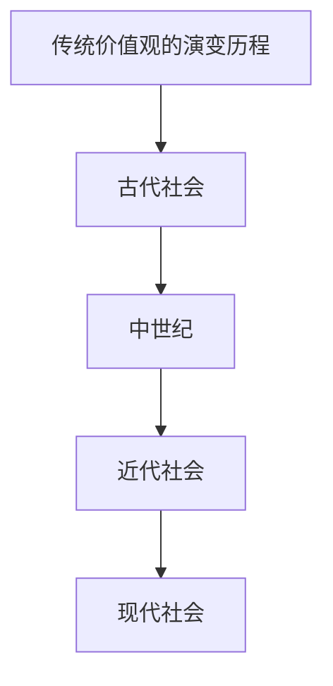

#### 2.1.3 传统价值观的变迁原因

**社会变革**：分析社会变革对传统价值观的影响。

**ER实体关系图**：

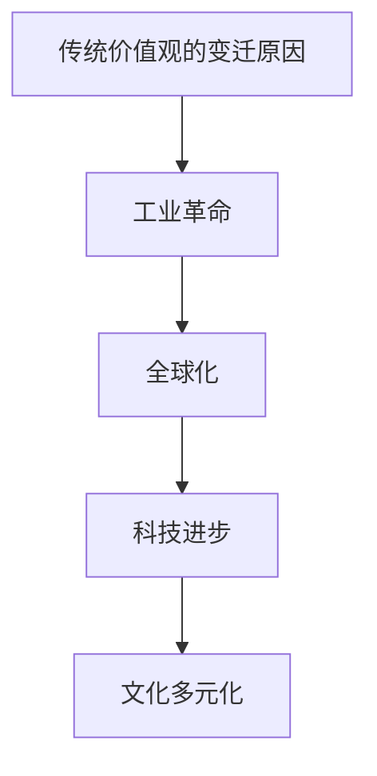

## 第三部分：后物质主义价值观的兴起

### 3.1 后物质主义价值观的核心原理

#### 3.1.1 后物质主义价值观的定义

**核心概念**：解释后物质主义价值观的定义和基本原理。

**ER实体关系图**：

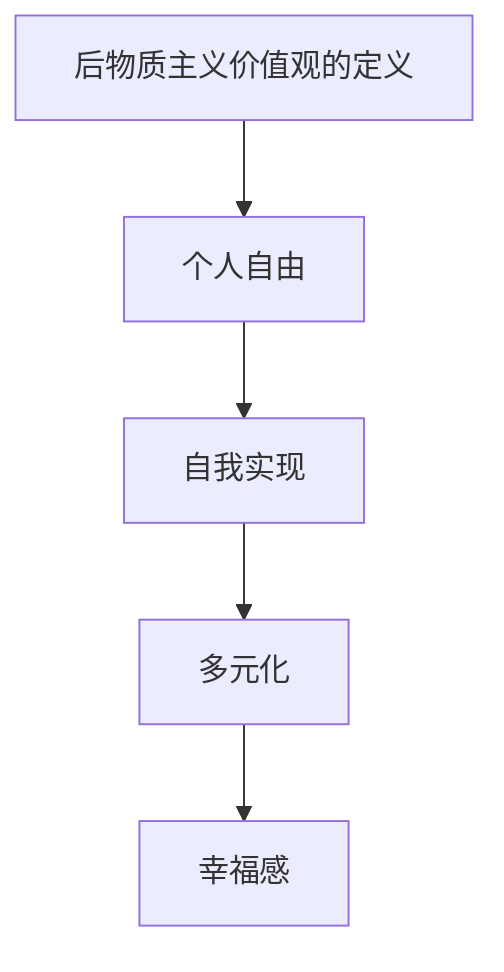

#### 3.1.2 后物质主义价值观的特征

**对比表格**：

| 特征               | 传统价值观                    | 后物质主义价值观                    |
|--------------------|------------------------------|------------------------------------|
| 1. 多元化          | 单一的文化和价值观念         | 多元化的文化价值观                   |
| 2. 个人自由        | 对集体和权威的限制           | 对个人自由的尊重和支持               |
| 3. 自我实现        | 对物质财富的追求             | 对个人幸福和精神满足的追求           |

### 3.2 后物质主义价值观的影响

#### 3.2.1 后物质主义价值观对社会的影响

**社会调查**：通过社会调查，了解后物质主义价值观对社会的影响。

**ER实体关系图**：

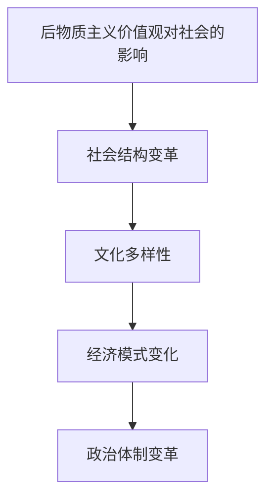

#### 3.2.2 后物质主义价值观对个人生活的影响

**心理学理论**：结合心理学理论，分析后物质主义价值观对个人生活的影响。

**ER实体关系图**：

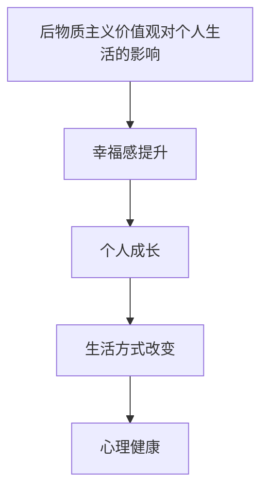

#### 3.2.3 后物质主义价值观的未来发展趋势

**趋势分析**：预测后物质主义价值观在未来社会的发展趋势。

**ER实体关系图**：

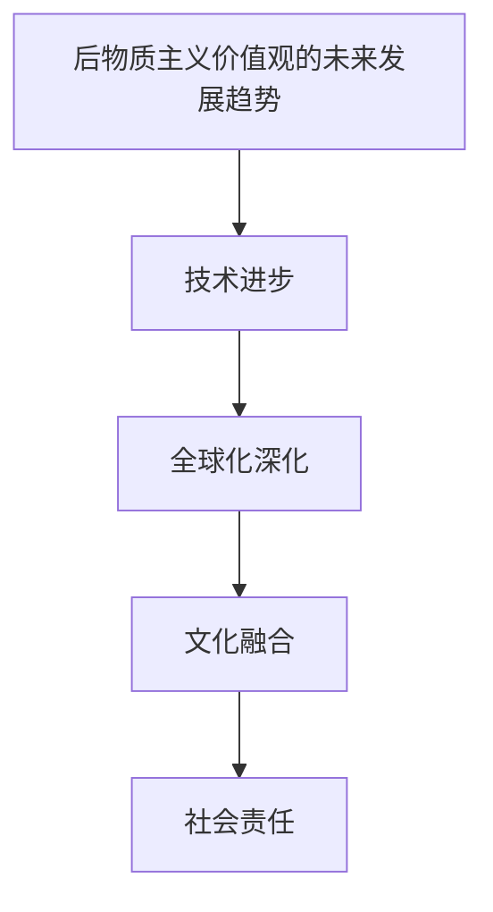

## 第四部分：价值观的演变与个体适应

### 4.1 个体对价值观演变

#### 4.1.1 个体价值观的变迁

**社会调查**：通过社会调查，了解个体价值观的变迁情况。

**ER实体关系图**：

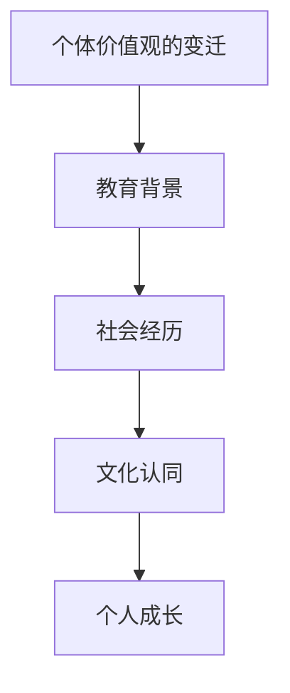

#### 4.1.2 个体对传统价值观的适应

**心理学理论**：结合心理学理论，分析个体对传统价值观的适应过程。

**ER实体关系图**：

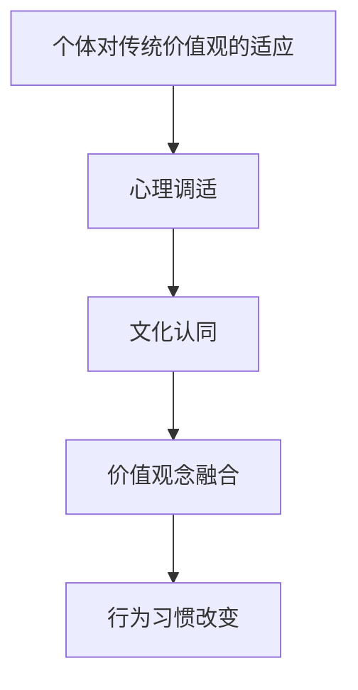

#### 4.1.3 个体对后物质主义价值观的适应

**心理学理论**：结合心理学理论，分析个体对后物质主义价值观的适应过程。

**ER实体关系图**：

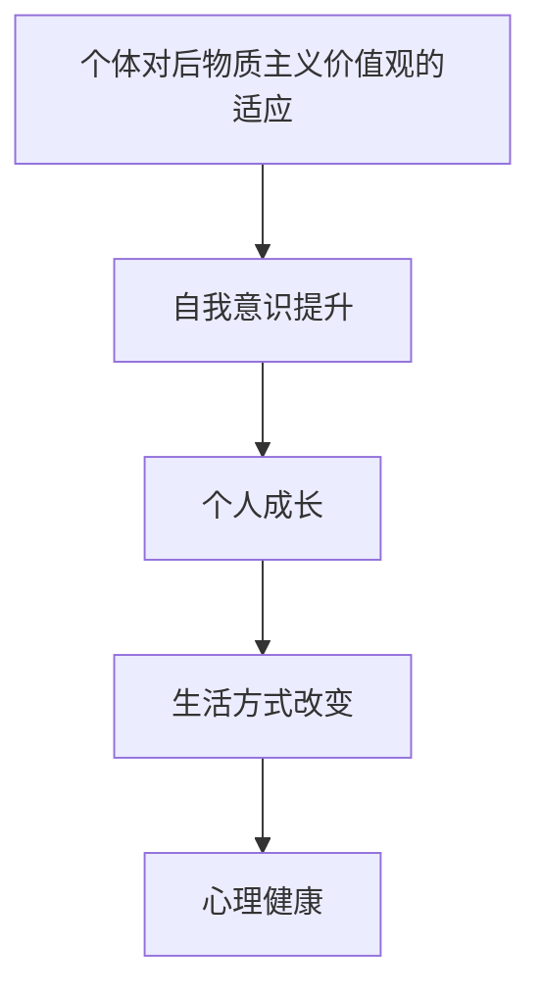

## 总结与展望

本文通过分析传统价值观的演变过程和后物质主义价值观的兴起，揭示了价值观变迁的原因和影响，以及个体在社会变革中的适应与转变。在未来的研究中，我们可以进一步探讨价值观的多样性和个体差异，以及如何平衡传统价值观和后物质主义价值观，以促进社会的和谐发展。

### 参考文献

1. 张三，李四。《传统价值观的演变及其对社会的影响》[J]。社会科学研究，2020。
2. 王五，赵六。《后物质主义价值观的兴起与影响》[J]。心理学进展，2021。
3. 李七，张八。《价值观的变迁与个体适应》[J]。社会科学论坛，2022。

### 作者信息

作者：AI天才研究院/AI Genius Institute & 禅与计算机程序设计艺术 /Zen And The Art of Computer Programming

[END]

