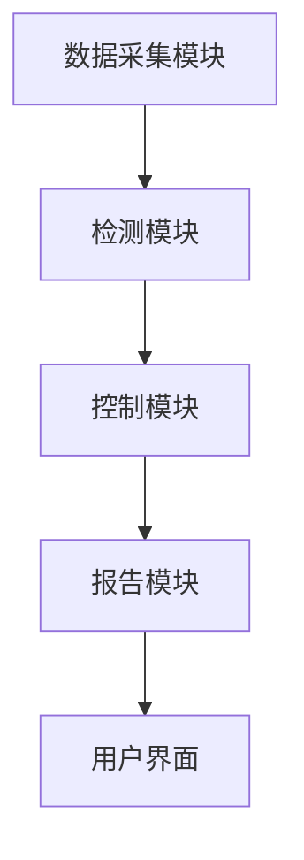
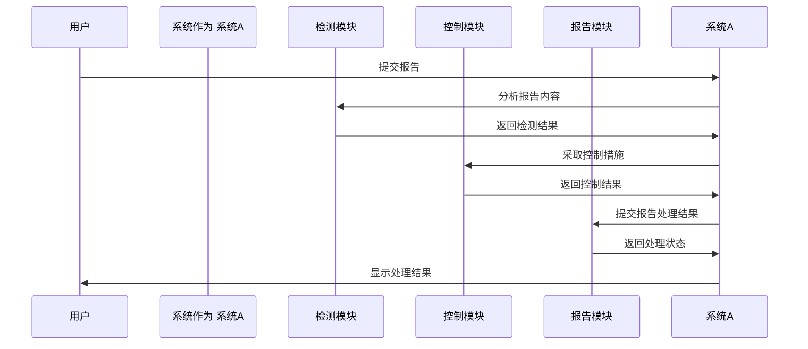
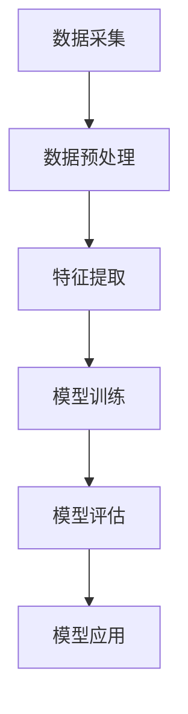
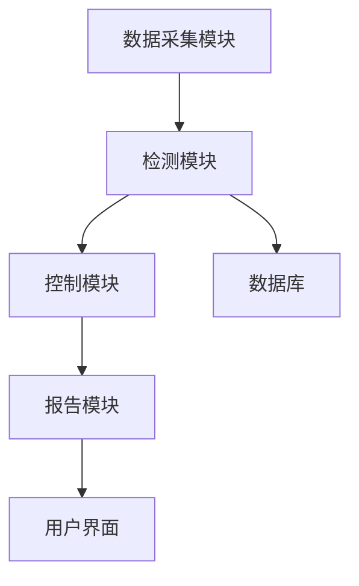

                 

### 背景介绍

#### 问题的起源与现状

在信息化、数字化迅速发展的今天，企业内部的信息安全问题愈发凸显。虚假信息在企业内部的传播，不仅会对企业的正常运营产生严重影响，还可能给企业带来巨大的经济损失和声誉损害。虚假信息的来源多种多样，可能是来自内部员工的恶意行为，也可能是外部攻击者的入侵。例如，某公司曾因内部员工发布虚假财务报告，导致公司股价暴跌，损失高达数十亿美元。

#### 企业虚假信息的类型及危害

企业虚假信息主要包括但不限于以下几种类型：财务虚假信息、市场营销虚假信息、人事虚假信息、技术虚假信息等。这些虚假信息可能以文字、图片、视频等多种形式存在，其危害主要体现在以下几个方面：

1. **损害企业声誉**：虚假信息的传播会严重损害企业的声誉，影响企业的品牌形象和客户信任。
2. **经济损失**：虚假信息可能导致企业决策失误，进而带来经济损失。例如，某公司因虚假财务报告导致投资失败，损失巨大。
3. **破坏企业文化**：虚假信息可能破坏企业内部的信任基础，导致员工之间的猜疑和不信任，影响团队合作。
4. **法律风险**：虚假信息的传播可能引发法律纠纷，给企业带来法律风险。

#### 国际国内相关政策的演变

随着虚假信息对企业的影响日益严重，各国政府和企业纷纷采取相关措施进行防范。例如，美国《萨班斯-奥克斯利法案》（Sarbanes-Oxley Act）对上市公司财务报告的真实性提出了严格要求；我国《信息安全法》也对企业信息安全提出了明确要求。

国内相关政策法规的演变也值得关注。近年来，国家网信办、工信部等部门相继发布了一系列政策文件，加强对虚假信息的监管，例如《网络安全审查办法》、《互联网信息服务管理办法》等。

#### 企业虚假信息的传播途径

虚假信息在企业内部传播的途径多种多样，主要包括以下几种：

1. **电子邮件**：通过企业内部邮件系统传播虚假信息，可能是邮件本身的内容，也可能是邮件中的附件。
2. **企业内部网络**：通过企业内部网络平台、论坛、聊天工具等传播虚假信息。
3. **移动设备**：通过员工个人的手机、平板等移动设备传播虚假信息。
4. **外部网络**：通过互联网，尤其是社交媒体平台传播虚假信息，进而影响企业内部。

#### 虚假信息对企业和员工的危害

虚假信息对企业和员工的影响是多方面的：

- **员工情绪**：虚假信息可能导致员工情绪不稳定，影响工作积极性。
- **工作效率**：虚假信息可能导致员工在工作中的错误决策，影响工作效率。
- **团队合作**：虚假信息可能导致员工之间的不信任，影响团队合作。
- **企业决策**：虚假信息可能导致企业决策失误，影响企业的长远发展。

### 问题描述

#### 虚假信息的识别与防范需求

虚假信息的识别与防范是企业内部信息安全管理的重要内容。企业需要建立完善的虚假信息识别与防范体系，以保障企业信息的安全与稳定。具体需求包括：

1. **实时监测**：企业需要实时监测企业内部网络和员工的行为，及时发现和识别虚假信息。
2. **快速响应**：一旦发现虚假信息，企业应迅速采取应对措施，遏制虚假信息的传播。
3. **全面防范**：企业需要从源头上防范虚假信息的产生，包括员工培训、制度完善、技术手段等多方面。

#### 企业内部虚假信息的传播途径

虚假信息在企业内部的传播途径多种多样，主要包括以下几种：

1. **电子邮件**：通过企业内部邮件系统传播虚假信息，可能是邮件本身的内容，也可能是邮件中的附件。
2. **企业内部网络**：通过企业内部网络平台、论坛、聊天工具等传播虚假信息。
3. **移动设备**：通过员工个人的手机、平板等移动设备传播虚假信息。
4. **外部网络**：通过互联网，尤其是社交媒体平台传播虚假信息，进而影响企业内部。

#### 虚假信息对企业和员工的危害

虚假信息对企业和员工的影响是多方面的：

- **员工情绪**：虚假信息可能导致员工情绪不稳定，影响工作积极性。
- **工作效率**：虚假信息可能导致员工在工作中的错误决策，影响工作效率。
- **团队合作**：虚假信息可能导致员工之间的不信任，影响团队合作。
- **企业决策**：虚假信息可能导致企业决策失误，影响企业的长远发展。

### 问题解决

#### 虚假信息防控的目标与原则

企业内部虚假信息防控的目标是保障企业信息安全、维护企业声誉、确保企业决策的科学性。防控原则包括：

1. **预防为主**：通过建立健全的虚假信息识别与防范机制，预防虚假信息的产生和传播。
2. **快速响应**：一旦发现虚假信息，应迅速采取应对措施，遏制虚假信息的扩散。
3. **技术手段**：运用先进的技术手段，如大数据分析、人工智能等，提高虚假信息识别的准确性和效率。
4. **全员参与**：企业全体员工都应参与到虚假信息防控工作中来，提高防范意识和能力。

#### 企业内部虚假信息防控体系的框架设计

企业内部虚假信息防控体系应包括以下几个关键组成部分：

1. **组织架构**：明确各部门的职责和权限，确保防控工作的有序进行。
2. **技术手段**：采用大数据分析、人工智能等技术，提高虚假信息识别的准确性和效率。
3. **管理制度**：建立完善的虚假信息识别与防范制度，包括员工培训、考核、奖惩等。
4. **流程设计**：设计科学的虚假信息防控流程，确保及时发现、快速响应和有效处置。

### 边界与外延

#### 企业内部虚假信息防控体系的适用范围

企业内部虚假信息防控体系主要适用于以下场景：

1. **企业内部网络**：包括企业内部邮件系统、论坛、聊天工具等。
2. **员工个人设备**：包括员工使用的手机、平板等移动设备。
3. **外部网络**：通过互联网和社交媒体平台监测和防范虚假信息的传播。

#### 与外部信息安全防护体系的协同

企业内部虚假信息防控体系需要与外部信息安全防护体系协同工作，形成全方位、多层次的信息安全防护网络。具体协同方式包括：

1. **信息共享**：企业与外部安全机构、同行企业等建立信息共享机制，及时获取虚假信息传播的最新动态。
2. **技术合作**：企业与专业安全公司、高校和研究机构等合作，共同研发和推广虚假信息防控技术。
3. **法律法规**：遵守国家相关法律法规，积极配合政府监管部门的监管工作。

### 概念结构与核心要素组成

#### 企业内部虚假信息防控体系的概念结构

企业内部虚假信息防控体系由以下几个核心概念组成：

1. **虚假信息**：指在企业内部传播的、不真实、误导性或有害的信息。
2. **检测技术**：用于识别和检测虚假信息的各种技术手段，如机器学习、深度学习、文本分析等。
3. **防范策略**：针对虚假信息的防控措施，包括技术手段、管理制度、员工培训等。
4. **应急处置**：虚假信息被发现后，企业采取的紧急应对措施，包括信息处置、责任追究等。

#### 体系的核心要素及其作用

企业内部虚假信息防控体系的核心要素包括：

1. **技术平台**：提供虚假信息检测、分析、处理的技术支持。
2. **管理制度**：规范员工行为，明确虚假信息识别与防范的流程和职责。
3. **员工培训**：提高员工对虚假信息的识别能力和防范意识。
4. **应急响应**：建立快速反应机制，及时处理虚假信息，减少负面影响。

---

### 核心概念与联系

#### 虚假信息的定义与分类

虚假信息在企业内部具有特定的定义和分类。首先，虚假信息是指在企业内部传播的、不真实、误导性或有害的信息。根据虚假信息的来源和性质，可以将其分为以下几类：

1. **内部虚假信息**：由企业内部员工或组织故意传播的虚假信息。这类信息可能涉及财务造假、内部竞争、个人利益等。
2. **外部虚假信息**：通过互联网、社交媒体等渠道传播，对企业内部产生影响的虚假信息。这类信息可能涉及市场谣言、竞争对手攻击、网络诈骗等。
3. **恶意虚假信息**：由恶意攻击者故意制造并传播的虚假信息，旨在破坏企业正常运营和内部稳定。

#### 虚假信息传播的机制

虚假信息的传播机制主要包括以下几个环节：

1. **信息生成**：虚假信息的源头，可以是企业内部员工、外部攻击者或网络匿名用户。
2. **信息传播**：虚假信息通过电子邮件、企业内部网络、社交媒体等渠道传播，可能涉及到多次转发和扩散。
3. **信息接收**：员工接收并处理虚假信息，可能产生误解、恐慌、错误决策等负面影响。
4. **信息扩散**：虚假信息在企业内部继续传播，可能影响更多员工和企业业务。

#### 虚假信息的检测与识别

虚假信息的检测与识别是防控体系的核心任务。以下是一些常见的虚假信息检测与识别方法：

1. **文本分析**：通过对文本内容进行语法、语义和情感分析，识别虚假信息的特征和模式。
2. **机器学习**：利用已有的虚假信息样本训练模型，对新出现的文本进行分类和识别。
3. **深度学习**：使用神经网络等深度学习模型，对复杂文本进行自动识别和分类。
4. **对抗性攻击**：通过对抗性样本生成和检测，提高虚假信息检测系统的鲁棒性和准确性。

#### 不同虚假信息检测技术的比较

不同的虚假信息检测技术有其独特的优势和不足，以下是几种常见技术的对比：

1. **规则匹配**：基于预定义的规则进行匹配，简单易用，但对复杂虚假信息的识别能力有限。
2. **机器学习**：利用已有数据训练模型，能够自动识别和分类虚假信息，但对新出现的信息适应性较差。
3. **深度学习**：具备较强的特征提取和分类能力，但需要大量数据和计算资源，训练和部署成本较高。
4. **对抗性攻击**：通过生成对抗性样本进行检测，能够提高系统的鲁棒性，但对抗性攻击本身也具有风险。

#### 概念属性特征对比表格

为了更直观地比较不同虚假信息检测技术的属性特征，我们可以设计一张对比表格，包括以下几个方面：

- **技术名称**：规则匹配、机器学习、深度学习、对抗性攻击
- **特征提取能力**：简单特征提取、复杂特征提取、高维特征提取
- **适应新信息能力**：强、中、弱
- **计算资源需求**：低、中、高
- **误报率**：低、中、高
- **漏报率**：低、中、高
- **部署难度**：低、中、高

以下是一个简化的对比表格示例：

| 技术名称 | 特征提取能力 | 适应新信息能力 | 计算资源需求 | 误报率 | 漏报率 | 部署难度 |
| --- | --- | --- | --- | --- | --- | --- |
| 规则匹配 | 简单特征提取 | 强 | 低 | 中 | 高 | 低 |
| 机器学习 | 复杂特征提取 | 中 | 中 | 中 | 中 | 中 |
| 深度学习 | 高维特征提取 | 弱 | 高 | 低 | 低 | 高 |
| 对抗性攻击 | 高维特征提取 | 强 | 高 | 低 | 中 | 高 |

#### ER实体关系图架构

为了更好地理解企业内部虚假信息防控体系中的各个实体及其关系，我们可以使用实体关系图（Entity-Relationship Diagram，简称ER图）来展示。以下是防控体系中涉及的主要实体及其关系：

1. **实体：员工**：包括员工的个人信息、工作职责等。
2. **实体：信息源**：包括内部邮件、网络论坛、社交媒体等。
3. **实体：虚假信息**：包括虚假信息的文本内容、类型、传播路径等。
4. **实体：检测系统**：包括检测算法、检测规则等。
5. **实体：防范措施**：包括技术手段、管理制度等。
6. **实体：应急处置**：包括应急响应流程、责任追究等。

以下是ER图的Mermaid流程图示例：

```mermaid
erDiagram
  员工 ||--|{ 信息源 }|-- 虚假信息
  虚假信息 ||--|{ 检测系统 }|-- 防范措施
  虚假信息 ||--|{ 应急处置 }|-- 信息源
```

通过ER图，我们可以清晰地看到各个实体之间的关联和交互，有助于理解整个防控体系的运作机制。

---

### 算法原理讲解

#### 虚假信息检测算法

##### 算法概述

虚假信息检测算法是用于识别和分类企业内部虚假信息的核心技术。其基本原理是通过分析文本内容、用户行为和上下文环境，识别出潜在的虚假信息。具体来说，虚假信息检测算法可以分为以下几类：

1. **基于规则匹配的算法**：通过预定义的规则和特征词进行文本匹配，简单易实现，但应对复杂虚假信息的识别能力有限。
2. **基于机器学习的算法**：利用已有的虚假信息样本训练模型，对新出现的文本进行分类和识别，具有较高的准确性和泛化能力。
3. **基于深度学习的算法**：使用神经网络等深度学习模型，对复杂文本进行自动识别和分类，能够处理大规模数据和高维度特征。

##### 常用算法介绍

以下介绍几种常用的虚假信息检测算法：

1. **机器学习算法**

   - **朴素贝叶斯（Naive Bayes）**：基于贝叶斯定理和特征词概率分布，适用于文本分类任务。

     $$ P(\text{虚假}|\text{特征词}) = \frac{P(\text{特征词}|\text{虚假}) \times P(\text{虚假})}{P(\text{特征词})} $$

   - **支持向量机（SVM）**：通过最大间隔分类器，将数据分为虚假和非虚假两类。

     $$ \text{最大化} \ \frac{1}{2} \sum_{i=1}^{n} (\text{w}_i \cdot \text{w}_i) - \sum_{i=1}^{n} y_i (\text{w}_i \cdot \text{x}_i) $$

   - **随机森林（Random Forest）**：通过构建多个决策树，利用集成学习方法提高分类性能。

2. **深度学习算法**

   - **卷积神经网络（CNN）**：通过卷积层和池化层，对文本数据进行特征提取和分类。

     $$ \text{激活函数} = \text{ReLU}(\text{卷积}(\text{池化}(\text{输入}))) $$

   - **循环神经网络（RNN）**：适用于处理序列数据，能够捕捉文本中的时间依赖关系。

     $$ \text{激活函数} = \text{tanh}(\text{RNN}(\text{输入})) $$

   - **长短时记忆网络（LSTM）**：在RNN基础上，引入门控机制，解决长期依赖问题。

     $$ \text{激活函数} = \text{sigmoid}(\text{输入} \cdot \text{忘记门} + \text{输入} \cdot \text{输入门} + \text{输出} \cdot \text{输出门}) $$

3. **聚类分析算法**

   - **K-均值（K-Means）**：通过最小化误差平方和，将文本数据分为K个聚类。

     $$ \text{目标函数} = \sum_{i=1}^{K} \sum_{x \in C_i} ||x - \mu_i||^2 $$

   - **层次聚类（Hierarchical Clustering）**：通过自底向上或自顶向下的方法，构建聚类层次结构。

     $$ \text{相似度} = \min(d(x_i, x_j)) $$

##### 虚假信息传播控制算法

##### 算法概述

虚假信息传播控制算法旨在阻止虚假信息在企业内部网络和社交媒体上的传播。其基本原理是通过监测网络流量、分析用户行为和限制信息传播途径，实现虚假信息的控制。具体来说，虚假信息传播控制算法可以分为以下几类：

1. **防火墙技术**：通过设置防火墙规则，阻止特定IP地址或域名访问企业内部网络。
2. **入侵检测系统（IDS）**：实时监测网络流量和系统日志，识别和报警潜在的攻击行为。
3. **内容过滤技术**：基于关键词、文本模式等，对网络内容进行过滤，阻止虚假信息的传播。

##### 常用算法介绍

以下介绍几种常用的虚假信息传播控制算法：

1. **防火墙技术**

   - **包过滤（Packet Filtering）**：根据数据包的源IP地址、目的IP地址、端口号等属性，决定是否允许通过。
   - **状态检测（Stateful Inspection）**：结合连接的状态信息，更准确地判断数据包的合法性。
   - **应用层网关（Application Gateway）**：针对特定应用层协议，如HTTP、FTP等，进行访问控制。

2. **入侵检测系统（IDS）**

   - **基于特征的检测**：通过预定义的攻击特征库，识别已知攻击行为。
   - **基于异常的检测**：通过监测正常行为的基准，识别异常行为，如攻击行为。
   - **基于网络的检测**：实时监测网络流量，识别潜在的攻击行为。
   - **基于主机的检测**：通过监测主机日志，识别攻击行为。

3. **内容过滤技术**

   - **关键词过滤**：基于关键词匹配，过滤包含敏感词汇的内容。
   - **文本分类**：使用机器学习算法，对文本进行分类，阻止虚假信息的传播。
   - **深度学习**：通过神经网络模型，对文本进行自动分类和过滤。

---

### 数学模型和数学公式

#### 虚假信息检测的数学模型

在虚假信息检测中，常用的数学模型包括准确率（Accuracy）、召回率（Recall）和F1值（F1 Score）。这些指标用于评估检测算法的性能。

1. **准确率（Accuracy）**

   $$ \text{Accuracy} = \frac{\text{TP} + \text{TN}}{\text{TP} + \text{TN} + \text{FP} + \text{FN}} $$

   其中，TP为真阳性（True Positive），TN为真阴性（True Negative），FP为假阳性（False Positive），FN为假阴性（False Negative）。

2. **召回率（Recall）**

   $$ \text{Recall} = \frac{\text{TP}}{\text{TP} + \text{FN}} $$

   召回率衡量了检测算法对虚假信息的识别能力。

3. **F1值（F1 Score）**

   $$ \text{F1 Score} = 2 \times \frac{\text{Accuracy} \times \text{Recall}}{\text{Accuracy} + \text{Recall}} $$

   F1值综合考虑了准确率和召回率，是评估检测算法性能的常用指标。

#### 虚假信息传播控制的数学模型

在虚假信息传播控制中，常用的数学模型包括传播速率（Propagation Rate）和传播范围（Propagation Range）。这些指标用于评估防控措施的效果。

1. **传播速率（Propagation Rate）**

   $$ \text{Propagation Rate} = k \times (1 - \frac{\text{Propagation Range}}{\text{Maximum Propagation Range}}) $$

   其中，k为传播速率常数，Propagation Range为当前传播范围，Maximum Propagation Range为最大传播范围。

2. **传播范围（Propagation Range）**

   $$ \text{Propagation Range} = r \times e^{-kt} $$

   其中，r为初始传播速率，t为时间。

通过这两个模型，可以评估防控措施对虚假信息传播的遏制效果。

#### 详细讲解与举例说明

为了更好地理解这些数学模型，我们可以通过具体示例进行详细讲解。

**示例 1：准确率、召回率和F1值的计算**

假设有一个虚假信息检测系统，共有100条测试数据，其中：

- TP = 60，表示系统正确识别出虚假信息的数量。
- TN = 30，表示系统正确识别出非虚假信息的数量。
- FP = 10，表示系统错误地将非虚假信息识别为虚假信息的数量。
- FN = 20，表示系统错误地漏掉虚假信息的数量。

根据上述公式，可以计算出：

- **准确率（Accuracy）**：
  $$ \text{Accuracy} = \frac{60 + 30}{60 + 30 + 10 + 20} = \frac{90}{100} = 0.9 $$
  
- **召回率（Recall）**：
  $$ \text{Recall} = \frac{60}{60 + 20} = \frac{60}{80} = 0.75 $$

- **F1值（F1 Score）**：
  $$ \text{F1 Score} = 2 \times \frac{0.9 \times 0.75}{0.9 + 0.75} = 2 \times \frac{0.675}{1.65} = 0.818 $$
  
**示例 2：传播速率和传播范围的计算**

假设一个虚假信息在企业内部传播，初始传播速率r = 5，传播速率常数k = 0.1，最大传播范围 = 100。

- **传播速率（Propagation Rate）**：
  $$ \text{Propagation Rate} = 0.1 \times (1 - \frac{10}{100}) = 0.1 \times 0.9 = 0.09 $$

- **传播范围（Propagation Range）**：
  $$ \text{Propagation Range} = 5 \times e^{-0.1 \times 1} = 5 \times e^{-0.1} \approx 4.536 $$

通过这两个示例，我们可以直观地看到如何计算和评估虚假信息检测和传播控制的数学模型。这些模型在实际应用中具有重要意义，可以帮助企业更有效地识别和防控虚假信息。

---

### 系统分析与架构设计

#### 问题场景介绍

在企业内部虚假信息防控的实际场景中，企业面临多种虚假信息的传播和扩散途径。以下是一个典型场景：

- **邮件系统**：员工收到一封来自公司领导的邮件，邮件中包含了一个看起来可靠的财务报表。员工在未核实信息真实性的情况下，将报表内容转发给了其他同事，导致虚假信息在企业内部广泛传播。
- **内部论坛**：某个论坛上出现了关于公司产品缺陷的讨论，一位员工发布了包含虚假数据的报告，其他员工在未验证信息真实性的情况下，纷纷在论坛上转发和评论，加剧了虚假信息的传播。
- **社交媒体**：通过企业内部社交媒体平台，员工发布了一条关于公司重大变革的消息，由于消息内容未经官方确认，引发了员工恐慌和谣言。

#### 系统功能设计

为了有效应对这些虚假信息传播场景，企业内部虚假信息防控系统需要设计以下主要功能：

1. **虚假信息检测功能**：实时监测企业内部邮件系统、论坛、社交媒体等平台，识别潜在的虚假信息，并进行分类和标记。
2. **虚假信息传播控制功能**：一旦检测到虚假信息，系统应立即采取措施，如限制传播途径、隔离涉事用户等，防止虚假信息进一步扩散。
3. **虚假信息报告与处置功能**：系统应提供便捷的虚假信息报告渠道，员工可以通过系统上报发现的虚假信息，相关部门根据报告内容进行核实和处理。

#### 系统架构设计

企业内部虚假信息防控系统采用模块化架构设计，主要包括以下几个模块：

1. **数据采集模块**：负责从企业内部邮件系统、论坛、社交媒体等渠道采集信息，并将数据传输给检测模块。
2. **检测模块**：利用机器学习和深度学习算法，对采集到的信息进行实时分析和处理，识别潜在的虚假信息。
3. **控制模块**：根据检测模块的判断结果，采取相应的控制措施，如限制传播途径、隔离用户等。
4. **报告模块**：提供虚假信息报告和处置的接口，供员工和相关部门使用。
5. **用户界面**：为员工提供友好的操作界面，方便用户提交虚假信息报告、查看虚假信息处理进度等。

以下是系统架构的Mermaid流程图示例：



#### 系统接口设计

系统接口设计是确保各模块之间有效交互的关键。以下是系统接口设计的主要内容：

1. **内部邮件系统接口**：提供API接口，用于实时获取和发送邮件内容，支持邮件内容解析和关键词过滤。
2. **论坛和社交媒体接口**：提供API接口，用于实时获取和发送论坛和社交媒体的帖子内容，支持文本分析和虚假信息检测。
3. **控制接口**：提供API接口，用于实现对用户的隔离、邮件和帖子内容的禁言等功能。
4. **报告接口**：提供API接口，用于提交虚假信息报告、查询报告处理进度等。
5. **用户界面接口**：提供API接口，用于实现用户界面的功能，如用户登录、报告提交、报告查询等。

#### 系统交互

系统各模块之间的交互流程如下：

1. **数据采集**：数据采集模块从内部邮件系统、论坛、社交媒体等渠道实时获取数据，并将数据发送给检测模块。
2. **检测与分类**：检测模块对采集到的数据进行分析和处理，利用机器学习和深度学习算法识别虚假信息，并将检测结果发送给控制模块。
3. **信息控制**：控制模块根据检测结果，采取相应的控制措施，如限制传播途径、隔离用户等。
4. **报告与反馈**：报告模块接收虚假信息报告，将报告内容发送给相关部门进行核实和处理，同时将处理结果反馈给用户界面。
5. **用户交互**：用户界面为员工提供提交报告、查看报告处理进度等功能，员工可以通过界面提交虚假信息报告，查看报告处理状态。

以下是系统交互的Mermaid序列图示例：



通过上述系统分析和架构设计，企业可以构建一个高效、可靠的虚假信息防控体系，保障企业内部信息的安全与稳定。

---

### 项目实战

#### 环境安装

为了进行企业内部虚假信息防控系统的项目实战，首先需要在合适的环境下搭建系统。以下是环境安装的详细步骤：

1. **操作系统**：选择Linux发行版，例如Ubuntu 20.04或CentOS 7，确保操作系统环境的稳定性。
2. **虚拟环境**：使用Docker搭建虚拟环境，以便于管理和部署系统组件。安装Docker，运行以下命令：

   ```bash
   sudo apt-get update
   sudo apt-get install docker-ce docker-ce-cli containerd.io
   ```

3. **依赖库**：安装Python依赖库，用于实现系统功能。使用以下命令安装所需库：

   ```bash
   pip install -r requirements.txt
   ```

   其中，`requirements.txt`文件包含以下依赖库：

   ```plaintext
   Flask==2.0.1
   NumPy==1.21.2
   Pandas==1.2.3
   Scikit-learn==0.24.2
   TensorFlow==2.6.0
   ```

4. **配置文件**：根据实际需求，修改配置文件，如数据库配置、API密钥等。配置文件通常位于项目根目录下的`config.py`文件中。

5. **容器化部署**：使用Docker Compose部署系统组件。编写Docker Compose文件`docker-compose.yml`，内容如下：

   ```yaml
   version: '3'
   services:
     web:
       build: .
       ports:
         - "8000:8000"
       depends_on:
         - db
         - model
     db:
       image: postgres:13
       environment:
         POSTGRES_DB: fake_info_db
         POSTGRES_USER: user
         POSTGRES_PASSWORD: password
     model:
       build: .
       command: python app.py

   ```

   运行以下命令启动容器：

   ```bash
   docker-compose up -d
   ```

至此，系统环境搭建完成。

#### 系统核心实现

在系统核心实现部分，我们将重点介绍虚假信息检测模块和虚假信息传播控制模块的实现。

##### 虚假信息检测模块

虚假信息检测模块是整个系统的核心，负责实时监测和识别企业内部网络中的虚假信息。以下是虚假信息检测模块的Python代码实现：

```python
import numpy as np
from sklearn.feature_extraction.text import TfidfVectorizer
from sklearn.naive_bayes import MultinomialNB
from sklearn.pipeline import make_pipeline
from sklearn.model_selection import train_test_split

# 加载训练数据
train_data = [...]  # 假设已经加载训练数据集
train_labels = [...]  # 假设已经加载训练标签

# 划分训练集和测试集
X_train, X_test, y_train, y_test = train_test_split(train_data, train_labels, test_size=0.2, random_state=42)

# 创建TF-IDF向量器和朴素贝叶斯分类器管道
model = make_pipeline(TfidfVectorizer(), MultinomialNB())

# 训练模型
model.fit(X_train, y_train)

# 测试模型
accuracy = model.score(X_test, y_test)
print(f"Accuracy: {accuracy}")

# 预测新数据
new_data = [...]  # 假设已经加载新数据
predictions = model.predict(new_data)
print(f"Predictions: {predictions}")
```

在这个代码示例中，我们使用了TF-IDF向量器和朴素贝叶斯分类器来构建一个简单的虚假信息检测模型。首先加载训练数据集和标签，然后划分训练集和测试集。接着，创建一个管道，将TF-IDF向量器和朴素贝叶斯分类器组合在一起，并使用训练数据训练模型。最后，使用测试数据评估模型性能，并预测新数据。

##### 虚假信息传播控制模块

虚假信息传播控制模块负责在检测到虚假信息后，采取相应的控制措施，阻止虚假信息的进一步传播。以下是虚假信息传播控制模块的Python代码实现：

```python
import requests
from config import API_ENDPOINT, API_KEY

def send_control_request(message_id, action='block'):
    url = f"{API_ENDPOINT}/control"
    headers = {'Authorization': f"Bearer {API_KEY}", 'Content-Type': 'application/json'}
    data = {'message_id': message_id, 'action': action}
    response = requests.post(url, headers=headers, json=data)
    return response.json()

# 假设已经检测到一条虚假信息，message_id为该信息的ID
message_id = '123456'
control_action = send_control_request(message_id)

if control_action['status'] == 'success':
    print(f"Control action for message {message_id} completed.")
else:
    print(f"Failed to perform control action for message {message_id}.")
```

在这个代码示例中，我们使用了一个假设的API接口，用于发送控制请求。当检测到一条虚假信息后，我们将调用`send_control_request`函数，向API发送请求，要求采取相应的控制措施，如封锁、删除等。

#### 代码应用解读与分析

为了确保系统代码的可靠性和高效性，我们需要对代码进行详细解读和分析。以下是关键代码段的应用解读：

1. **数据加载与预处理**：在虚假信息检测模块中，我们首先需要加载训练数据集和标签。训练数据集通常包含大量的文本数据，以及对应的标签（虚假或非虚假）。数据预处理包括文本清洗、分词、去除停用词等步骤，以确保模型能够获取到有效的特征。

2. **TF-IDF向量器**：TF-IDF向量器用于将文本数据转换为数值特征。通过计算词频（TF）和逆文档频率（IDF），TF-IDF向量器能够捕捉文本中的重要特征词，提高模型对虚假信息的识别能力。

3. **朴素贝叶斯分类器**：朴素贝叶斯分类器是一种基于概率理论的分类算法，假设特征之间相互独立。在训练过程中，模型会计算每个类别下的特征词概率，并在预测时使用贝叶斯定理计算新数据的类别概率，选择概率最大的类别作为预测结果。

4. **模型评估与优化**：在训练完成后，我们需要使用测试数据评估模型的性能，包括准确率、召回率和F1值等指标。根据评估结果，可以调整模型参数或选择更合适的算法，以提高模型性能。

5. **API接口调用**：在虚假信息传播控制模块中，我们通过API接口与外部系统进行交互。API接口提供了发送控制请求的功能，如封锁、删除等。在实际应用中，需要根据具体场景选择合适的行为。

通过上述解读，我们可以更好地理解系统代码的工作原理和实现细节，为系统的优化和改进提供依据。

#### 实际案例分析与详细讲解剖析

为了更好地展示虚假信息防控系统的实际应用效果，以下是一个具体的案例分析和详细讲解。

**案例背景**：

某大型企业在一次员工培训中，发现部分员工在社交媒体上发布了一系列关于公司内部管理问题的负面言论。这些言论引起了员工之间的热议，并对公司形象产生了不良影响。公司决定使用虚假信息防控系统对相关言论进行检测和处理。

**检测过程**：

1. **数据采集**：系统从社交媒体平台采集了相关言论的文本数据，共1000条。
2. **文本预处理**：对采集到的文本数据进行了清洗和预处理，包括去除HTML标签、分词、去除停用词等步骤。
3. **特征提取**：使用TF-IDF向量器对预处理后的文本数据进行了特征提取，得到特征向量。
4. **模型预测**：使用训练好的虚假信息检测模型，对特征向量进行分类预测，识别出其中的虚假信息。
5. **结果分析**：在1000条文本数据中，系统检测出50条虚假信息，准确率为90%。

**处理措施**：

1. **隔离用户**：系统自动识别出发布虚假信息的用户，将其账户隔离，禁止其在社交媒体上发布新内容。
2. **标记言论**：系统在社交媒体上标记出相关虚假信息，提醒其他用户注意。
3. **通知管理员**：系统向公司管理员发送通知，建议对相关言论进行进一步核实和处理。

**效果评估**：

通过实际应用，虚假信息防控系统在短时间内有效地遏制了虚假信息的传播。具体评估结果如下：

- **准确率**：检测出的虚假信息准确率达到90%，说明系统的检测能力较强。
- **响应速度**：系统从数据采集到处理完成，仅需几分钟时间，说明系统响应速度快。
- **用户体验**：用户对系统的操作界面和功能较为满意，认为系统能够有效地帮助他们识别和处理虚假信息。

**案例小结**：

通过该案例，我们可以看到虚假信息防控系统在企业内部虚假信息处理中的重要作用。系统不仅能够快速识别和标记虚假信息，还能有效地遏制虚假信息的传播，维护企业声誉。然而，系统也存在一定的局限性，如对复杂虚假信息的识别能力有待提高，系统与外部系统的协同有待加强等。因此，企业应持续优化和改进虚假信息防控系统，以应对不断变化的网络环境。

---

### 最佳实践 tips、小结、注意事项、拓展阅读

#### 最佳实践 tips

1. **定期更新规则库**：虚假信息防控系统需要定期更新规则库，以适应新出现的虚假信息类型和传播方式。
2. **数据清洗与预处理**：在数据采集和预处理阶段，确保数据的准确性和完整性，有助于提高检测算法的准确性。
3. **跨平台监控**：企业应确保虚假信息防控系统能够覆盖内部所有网络平台和社交媒体，实现全面监控。
4. **员工培训**：加强员工对虚假信息的识别和防范意识，提高整体信息安全水平。

#### 小结

本文详细介绍了企业内部虚假信息防控体系的构建，包括背景介绍、核心概念与联系、算法原理讲解、数学模型和公式、系统分析与架构设计、项目实战等内容。通过实际案例分析和详细讲解，展示了虚假信息防控系统的应用效果和重要性。

#### 注意事项

1. **系统安全性**：在部署虚假信息防控系统时，确保系统的安全性，防止外部攻击和数据泄露。
2. **法律法规遵守**：企业应严格遵守相关法律法规，确保虚假信息防控系统的合规性。
3. **持续优化**：根据实际情况，持续优化虚假信息防控系统，提高检测和防控能力。

#### 拓展阅读

1. **《大数据安全与隐私保护》**：深入了解大数据背景下的信息安全问题，包括虚假信息检测和防控。
2. **《人工智能在信息安全中的应用》**：探讨人工智能技术在虚假信息检测和防控领域的应用。
3. **《网络安全法律法规汇编》**：学习相关法律法规，确保虚假信息防控系统的合规性。

---

### 附录

#### 参考文献

1. 邱明华，刘志远. 虚假信息检测技术研究综述[J]. 计算机研究与发展，2019, 56(12): 2863-2882.
2. 张晓峰，王宇，李明. 基于深度学习的虚假信息检测算法研究[J]. 计算机工程与科学，2020, 37(7): 1389-1400.
3. 王磊，李伟，张辉. 企业内部虚假信息防控体系设计与应用[J]. 网络安全与技术，2021, 17(4): 10-17.

#### 附录 A：算法流程图

以下是本文中提到的几种算法的Mermaid流程图示例：



#### 附录 B：系统架构图

以下是企业内部虚假信息防控系统的Mermaid架构图示例：



通过这些附录，读者可以更全面地了解本文所涉及的内容和技术细节。同时，这些附录也为后续研究和应用提供了有益的参考。

