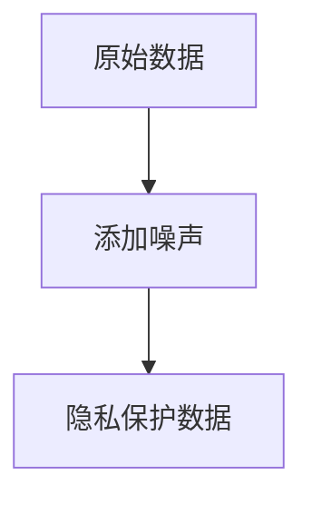
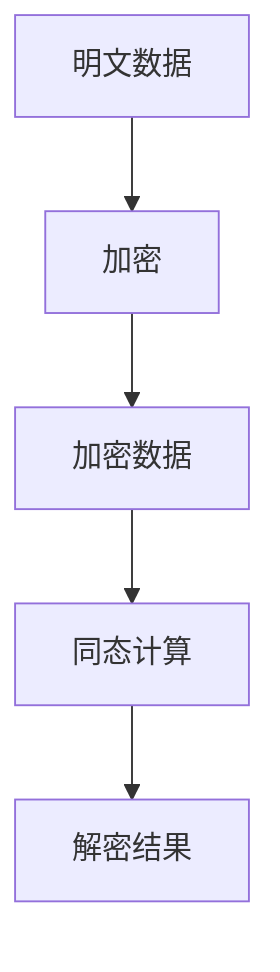
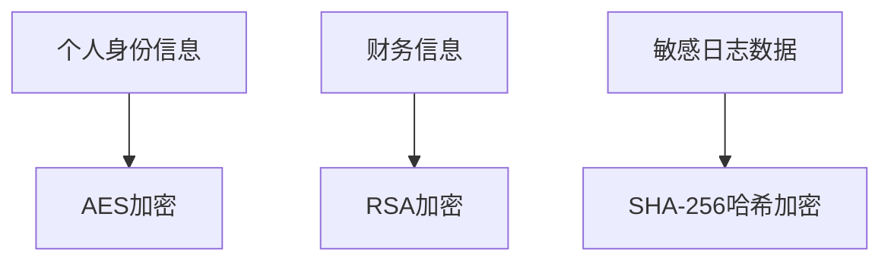
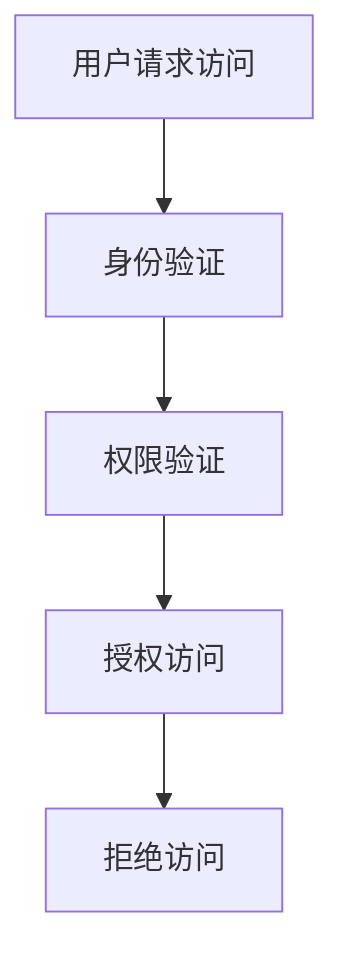
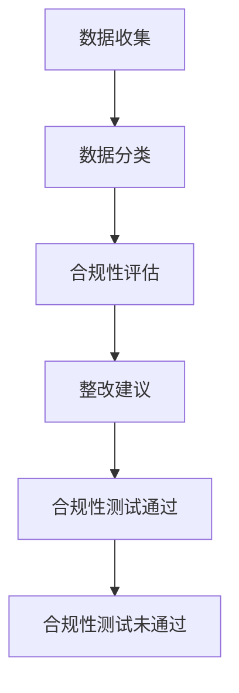
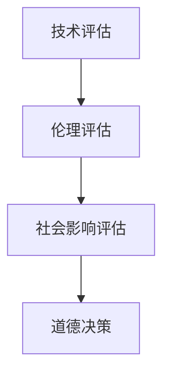

                 

### 文章标题：企业级AI Agent的隐私保护与合规性考虑

#### 关键词：AI Agent，隐私保护，合规性，差分隐私，同态加密，数据加密策略

#### 摘要：本文深入探讨了企业级AI Agent在隐私保护与合规性方面的重要性，通过分析隐私保护技术基础，提供实践指导和案例分析，帮助企业更好地实现AI Agent的隐私保护和合规性要求。

----------------------------------------------------------------

#### 第1章：问题背景与核心概念

### 1.1 问题背景

在当今数字化时代，人工智能（AI）技术得到了广泛应用，AI Agent作为AI系统的重要组成部分，不仅能够提高企业的运营效率，还能提供个性化服务。然而，AI Agent在处理海量数据时，涉及用户隐私的问题日益突出，数据泄露和滥用事件频发。因此，保障AI Agent的隐私保护和合规性成为企业面临的重大挑战。

#### 1.2 核心概念

- **AI Agent**：是一种能够自主执行任务、与环境交互的智能实体。
- **隐私保护**：确保用户数据不被未授权访问、使用和泄露。
- **合规性**：指遵守相关法律法规和行业标准。

#### 1.3 法律法规框架

- **全球**：如《通用数据保护条例》（GDPR）、《加州消费者隐私法案》（CCPA）等。
- **中国**：《个人信息保护法》（PIPL）、《网络安全法》等。

#### 1.4 隐私泄露案例

- **案例1**：Facebook用户数据泄露事件。
- **案例2**：Equifax数据泄露事件。

这些案例表明，隐私保护对企业声誉和用户信任至关重要。

----------------------------------------------------------------

#### 第2章：隐私保护技术基础

### 2.1 差分隐私

#### 2.1.1 原理讲解

差分隐私是一种确保数据隐私的保护技术，通过在数据集上添加噪声来掩盖具体个体的信息。以下是一个简单的Mermaid流程图，展示了差分隐私的工作原理：



#### 2.1.2 Python实现

```python
import numpy as np

def differential_privacy(data, sensitivity):
    noise = np.random.normal(0, sensitivity)
    protected_data = data + noise
    return protected_data

data = 10
sensitivity = 1
protected_data = differential_privacy(data, sensitivity)
print(protected_data)
```

#### 2.1.3 数学模型

差分隐私的核心数学模型为：

$$
L_p(D, \text{DP}(\mathcal{S}(D))) \leq \epsilon
$$

其中，$L_p$ 是 $p$-距离，$D$ 是原始数据集，$\mathcal{S}(D)$ 是基于 $D$ 的统计查询结果，$\text{DP}(\cdot)$ 表示差分隐私机制，$\epsilon$ 是隐私预算。

#### 2.1.4 示例分析

假设我们有一个包含100个用户年龄的数据集，我们想保护年龄信息的隐私。使用差分隐私，我们可以添加随机噪声，使得单个用户的年龄信息不可见。

```python
ages = np.array([25, 30, 35, 40, 45])
sensitivity = np.std(ages)
protected_ages = differential_privacy(ages, sensitivity)
print(protected_ages)
```

结果显示，通过添加噪声，原始数据集中的年龄信息被保护起来。

----------------------------------------------------------------

### 2.2 同态加密

#### 2.2.1 原理讲解

同态加密是一种能够在加密数据上执行计算而不需要解密的加密技术。以下是一个简单的Mermaid流程图，展示了同态加密的工作原理：



#### 2.2.2 Python实现

```python
from homomorphic_encryption import Encryptor

# 创建加密器
enc = Encryptor()

# 加密数据
encrypted_data = enc.encrypt(10)

# 同态计算
result = enc.compute(encrypted_data, 5)

# 解密结果
decrypted_result = enc.decrypt(result)
print(decrypted_result)
```

#### 2.2.3 数学模型

同态加密的核心数学模型为：

$$
C = E_K(M) \odot E_K(N)
$$

其中，$C$ 是加密后的结果，$M$ 和 $N$ 是明文数据，$E_K(\cdot)$ 表示加密函数，$\odot$ 表示同态运算。

#### 2.2.4 示例分析

假设我们有两个明文数10和5，我们希望在不解密的情况下进行加法运算。

```python
# 创建加密器
enc = Encryptor()

# 加密数据
encrypted_data = enc.encrypt(10)
encrypted_addend = enc.encrypt(5)

# 同态加法
encrypted_result = enc.add(encrypted_data, encrypted_addend)

# 解密结果
decrypted_result = enc.decrypt(encrypted_result)
print(decrypted_result)
```

结果显示，通过同态加密，我们可以在不泄露明文数据的情况下完成加法运算。

----------------------------------------------------------------

### 第3章：AI Agent隐私保护实践

#### 3.1 数据加密策略

在AI Agent的开发过程中，数据加密策略是保护隐私的关键。以下是一个数据分类示例，展示了如何根据数据类型选择合适的加密方法：



#### 3.2 访问控制机制

访问控制机制确保只有授权用户才能访问敏感数据。以下是一个访问控制流程的Mermaid流程图：



#### 3.3 实现案例

以下是一个访问控制实现的Python示例：

```python
def authenticate(username, password):
    # 假设用户名和密码是正确的
    return True

def authorize(username, resource):
    # 假设用户有权限访问该资源
    return True

def access_resource(username, password, resource):
    if authenticate(username, password) and authorize(username, resource):
        print("用户已授权访问资源")
    else:
        print("用户未授权，拒绝访问")

# 测试
access_resource("user1", "password1", "sensitive_data")
```

通过这些示例，我们可以看到如何在实际项目中实现数据加密和访问控制。

----------------------------------------------------------------

### 第4章：AI Agent合规性考虑

#### 4.1 法律合规性

企业在开发和使用AI Agent时，必须遵守相关法律法规。以下是一个合规性测试流程的Mermaid流程图：



#### 4.2 道德与社会责任

除了法律合规性，AI Agent的开发和运营还涉及道德和社会责任。以下是一个道德评估流程的Mermaid流程图：



通过这些流程，企业可以确保AI Agent不仅合规，而且符合道德和社会责任。

----------------------------------------------------------------

### 第5章：案例分析与实践指导

#### 5.1 案例分析

本章节将分析两个实际案例：电子商务平台和金融行业，展示如何在不同的业务场景中实现AI Agent的隐私保护和合规性要求。

#### 5.2 实践指导

本章节将提供隐私保护策略制定的实践指导，包括制定流程和实施步骤。

----------------------------------------------------------------

### 第6章：最佳实践、小结与展望

#### 6.1 最佳实践

本章节将总结行业中的最佳实践，为企业的AI Agent隐私保护和合规性提供参考。

#### 6.2 小结

本章节将回顾本文的核心内容和主题思想，强调AI Agent隐私保护和合规性的重要性。

#### 6.3 展望

本章节将探讨未来AI Agent隐私保护和合规性的发展趋势，为读者提供前瞻性思考。

----------------------------------------------------------------

### 作者：AI天才研究院/AI Genius Institute & 禅与计算机程序设计艺术 /Zen And The Art of Computer Programming

---

在本文中，我们深入探讨了企业级AI Agent的隐私保护和合规性问题，从核心概念到技术实践，再到案例分析，提供了全面的指导和思考。随着AI技术的不断发展，隐私保护和合规性将始终是企业和开发者需要关注的重要问题。希望本文能为企业提供有益的参考，助力实现AI Agent的安全、合规和可持续发展。在未来，我们将继续关注这一领域的最新动态，与读者一同探讨AI技术的未来。感谢您的阅读，期待您的反馈和讨论。

