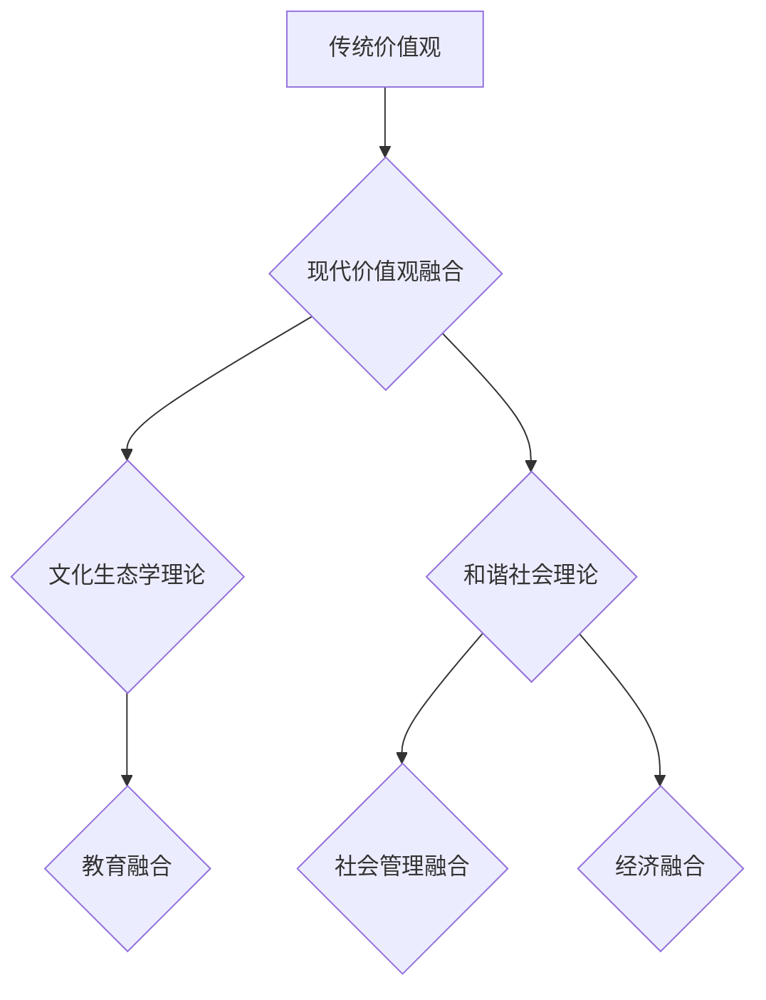
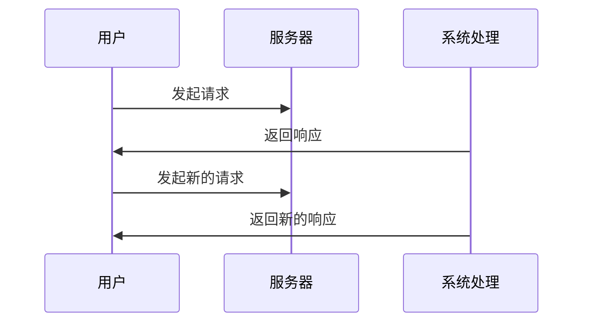
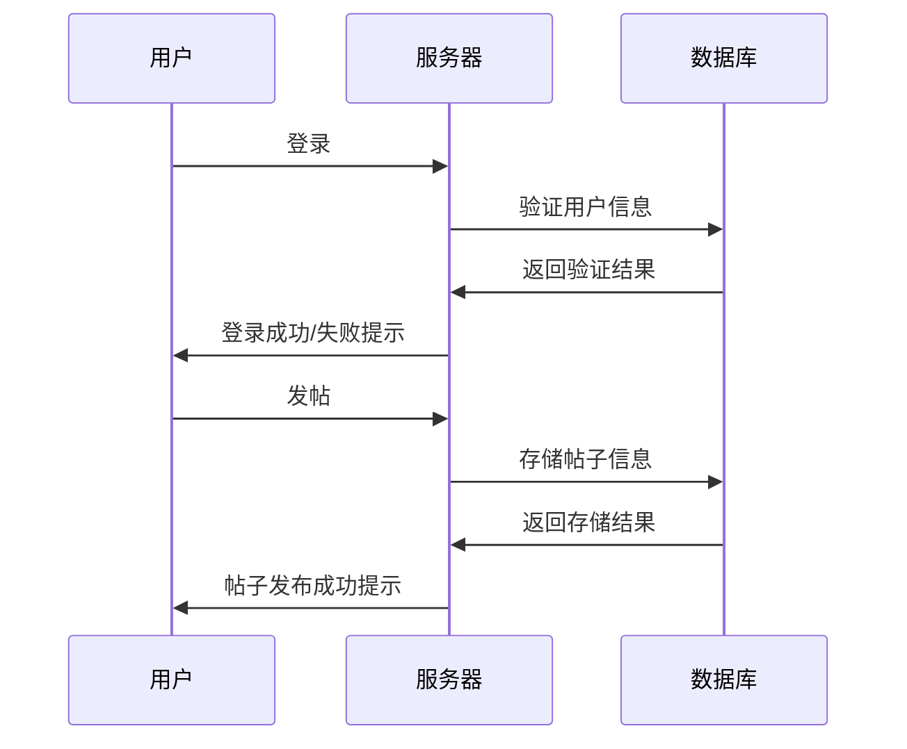

                 

# 传统与现代的价值观碰撞：冲突与融合

关键词：传统价值观、现代价值观、冲突、融合、案例分析、策略

摘要：本文旨在探讨传统与现代价值观在现代社会中的碰撞与融合，分析其冲突的根源，并提出相应的融合路径与策略。通过对文化、社会管理和经济领域的案例分析，本文揭示了传统与现代价值观之间的矛盾，并深入探讨了这些冲突的原因。最后，本文提出了实现价值观融合的理论基础和实践路径，为解决传统与现代价值观之间的冲突提供参考。

## 目录大纲

### 第1章 引言
#### 1.1 研究背景
#### 1.2 研究目的
#### 1.3 研究方法
#### 1.4 论文结构安排

### 第2章 传统价值观概述
#### 2.1 传统价值观的概念
#### 2.2 传统价值观的核心内容
#### 2.3 传统价值观的变迁与影响

### 第3章 现代价值观概述
#### 3.1 现代价值观的概念
#### 3.2 现代价值观的核心内容
#### 3.3 现代价值观的兴起与影响

### 第4章 冲突案例分析
#### 4.1 文化领域的冲突
#### 4.2 社会管理领域的冲突
#### 4.3 经济领域的冲突

### 第5章 冲突原因分析
#### 5.1 经济因素
#### 5.2 社会因素
#### 5.3 文化因素

### 第6章 融合路径探讨
#### 6.1 融合的理论基础
#### 6.2 融合的实践路径
#### 6.3 融合的策略与建议

### 第7章 实践策略与建议
#### 7.1 政策层面
#### 7.2 社会层面
#### 7.3 企业层面

### 第8章 总结与展望
#### 8.1 研究成果总结
#### 8.2 研究不足与展望

## 第1章 引言

### 1.1 研究背景

随着全球化、信息化和现代化的加速推进，传统与现代的价值观在现代社会中不断碰撞与融合。传统价值观源于历史积淀，强调集体主义、伦理道德和家庭观念等；而现代价值观则强调个人主义、消费主义和科技进步等。这种价值观的变革带来了社会结构的深刻变化，引发了诸多冲突。

#### 1.2 研究目的

本文旨在探讨传统与现代价值观的冲突与融合，分析其冲突的根源，并提出相应的融合路径与策略。通过对文化、社会管理和经济领域的案例分析，本文揭示了传统与现代价值观之间的矛盾，并深入探讨了这些冲突的原因。

#### 1.3 研究方法

本文采用文献综述法、案例分析法和对比研究法。首先，通过文献综述法了解传统价值观和现代价值观的概念、核心内容和变迁；其次，通过案例分析揭示文化、社会管理和经济领域的冲突现象；最后，通过对比研究分析冲突原因，并提出融合路径与策略。

#### 1.4 论文结构安排

本文共分为8章。第一章为引言，介绍研究背景、目的和方法；第二章至第五章分别概述传统价值观、现代价值观、冲突案例分析及其原因分析；第六章至第七章探讨融合路径与策略；第八章为总结与展望，总结研究成果，提出不足与展望。

## 第2章 传统价值观概述

### 2.1 传统价值观的概念

传统价值观是指在一个社会或文化中长期形成和积淀的价值观念和行为规范。它体现了历史、文化和社会习俗的积累，是一个民族或社会共同认同的核心价值观。传统价值观通常具有以下几个特点：

1. **历史传承性**：传统价值观是在长期历史发展过程中形成的，具有深厚的历史文化底蕴。
2. **文化独特性**：每个民族和社会都有其独特的传统价值观，这些价值观反映了该民族或社会的文化特征。
3. **稳定性**：传统价值观在一段时间内相对稳定，不易受到外部环境的影响。
4. **规范性**：传统价值观对个人行为和社会行为具有一定的规范作用。

#### 2.2 传统价值观的核心内容

传统价值观的核心内容包括以下几个方面：

1. **社会伦理道德**：传统价值观强调道德规范，如孝顺、忠诚、诚信、友善等，这些道德规范是维护社会秩序和谐的基础。
2. **家庭观念**：传统价值观强调家庭的重要性，倡导家庭成员间的相互关爱和责任感，认为家庭是社会的细胞。
3. **修身齐家治国平天下的理念**：传统价值观认为个人修养与家庭和谐、国家治理和世界和平有着密切的联系，倡导个人通过修身齐家来治国平天下。

#### 2.3 传统价值观的变迁与影响

传统价值观在不同历史时期有不同的表现形式和内容，随着社会的变迁，传统价值观也在不断地演变和发展。例如，在中国传统文化中，儒家思想一直占据主导地位，但随着时代的进步，儒家的“礼治”思想逐渐演变为“法治”思想。

近现代以来，随着全球化、现代化和信息化的加速推进，传统价值观面临着巨大的挑战。一方面，现代化带来了科技的进步和生活方式的改变，使得传统价值观的一些方面显得陈旧和不适应；另一方面，全球化导致了不同文化之间的交流和碰撞，传统价值观也需要在与外来文化的融合中寻找新的发展路径。

尽管面临挑战，传统价值观在现代社会仍然具有重要的意义。它不仅是一个民族的精神支柱，也是一个社会和谐发展的基石。传统价值观的传承和弘扬有助于增强民族凝聚力，促进社会和谐稳定。同时，传统价值观的某些理念，如家庭观念和道德规范，对现代社会依然具有积极的指导作用。

### 文化领域的冲突

在文化领域，传统价值观与现代价值观之间的冲突表现得尤为明显。这些冲突主要体现在以下几个方面：

#### 1. 传统节日与西方节日的碰撞

随着全球化的深入，西方节日如圣诞节、情人节等逐渐渗透到我国，与传统的春节、端午节、中秋节等节日形成了鲜明的对比。一些人认为，过洋节更能体现时尚和现代感，而另一些人则认为，传统节日是民族文化的象征，不应被洋节取代。

#### 2. 文化产业的国际化与本土化

在文化产业的发展过程中，如何处理国际化与本土化之间的关系也是一个难题。一方面，国际化有助于推动文化产品的全球传播，提升国家文化软实力；另一方面，过度追求国际化可能导致本土文化的流失和扭曲。例如，一些国产影视作品为了迎合国际市场，过度借鉴西方文化元素，削弱了本土文化特色。

#### 3. 文化认同的分歧

在多元文化的背景下，不同群体之间的文化认同也产生了分歧。一些人主张坚守传统价值观，认为只有传统才能代表民族精神；而另一些人则认为，现代社会需要多元化的价值观，传统与现代价值观应该相互融合。

### 社会管理领域的冲突

在社会管理领域，传统价值观与现代价值观之间的冲突主要表现在以下几个方面：

#### 1. 家庭结构与婚姻观念的变化

随着社会的发展，传统大家庭逐渐被小家庭所取代，婚姻观念也发生了变化。一些人主张自由恋爱、婚姻自主，而另一些人则坚持传统观念，认为婚姻应由家长安排，强调家庭责任和孝道。

#### 2. 社会福利制度与传统观念的冲突

现代社会福利制度的建立旨在保障弱势群体的权益，提高社会公平。然而，一些传统观念认为，依靠社会福利是懒惰的表现，应该自力更生。这种观念与社会福利制度之间产生了矛盾。

#### 3. 家庭教育与学校教育的冲突

在家庭教育与学校教育之间，传统价值观与现代价值观也存在着冲突。传统观念强调家庭教育的权威，认为家长应该对孩子的行为进行严格管教；而现代观念则强调孩子的自我意识和个性发展，倡导尊重和理解。

### 经济领域的冲突

在经济领域，传统价值观与现代价值观之间的冲突主要表现在以下几个方面：

#### 1. 传统产业与现代产业的融合

随着科技的发展，现代产业逐渐取代传统产业，成为经济增长的主要动力。然而，一些传统产业依然具有生命力，如何实现传统产业与现代产业的融合成为一大挑战。一些人主张大力发展现代产业，淘汰传统产业；而另一些人则认为，传统产业仍然具有不可替代的价值，应该加以保护和传承。

#### 2. 全球化背景下的贸易争端

全球化带来了经济全球化，但同时也引发了贸易争端。一些传统观念认为，贸易保护是维护国家利益和民族产业的重要手段；而现代观念则认为，自由贸易有助于全球经济的繁荣。这种观念的冲突在全球化进程中愈发凸显。

#### 3. 创新与传统的关系

在创新与传统的冲突中，一些人主张突破传统，勇于创新，以适应快速变化的市场环境；而另一些人则认为，创新必须在传统的基础上进行，否则会失去文化根基。这种观念的冲突在经济领域尤为明显。

## 第5章 冲突原因分析

### 5.1 经济因素

经济因素是引发传统与现代价值观冲突的重要原因之一。首先，生产方式的变化导致了传统价值观的变迁。现代生产方式的机械化、自动化和信息化的特点，使得传统手工业和家庭作坊逐渐被淘汰，传统价值观中的某些方面也随之失去支撑。其次，全球化进程加速了经济活动的跨国界流动，不同国家和地区的经济体系相互交织，传统价值观受到外来经济体系的影响，从而产生冲突。最后，经济增长带来的社会结构变化，如城市化进程、人口流动等，也加剧了传统与现代价值观的冲突。

### 5.2 社会因素

社会因素在传统与现代价值观冲突中发挥着重要作用。首先，人口结构的变化是引发冲突的一个重要因素。随着人口老龄化、家庭结构小型化等趋势的出现，传统家庭观念和社会结构发生了变化，与现代价值观产生了冲突。其次，教育背景的差异也是导致冲突的原因之一。现代社会中，不同教育背景的人群在价值观上存在较大差异，这种差异往往导致不同群体之间的价值观碰撞。最后，社会变革带来的价值观念多元化，使得传统与现代价值观在碰撞中产生了分歧。

### 5.3 文化因素

文化因素是传统与现代价值观冲突的核心。首先，传统价值观具有深厚的历史文化底蕴，是民族精神的重要组成部分，而现代价值观则强调个人主义、自由和平等，这与传统价值观中的集体主义和家庭观念形成了鲜明对比。其次，不同文化之间的碰撞和融合，使得传统价值观面临挑战。在全球化的背景下，外来文化的传入使得传统价值观受到冲击，而现代价值观则在一定程度上吸收了外来文化的元素，形成了新的文化体系。这种文化碰撞和融合，使得传统与现代价值观之间的冲突愈发激烈。

## 第6章 融合路径探讨

### 6.1 融合的理论基础

融合路径的探讨需要建立在坚实的理论基础之上。首先，文化生态学理论为我们提供了重要的视角。文化生态学认为，文化是处于不断演化过程中的生态系统，各种文化因素相互作用，共同维持着文化生态的平衡。在这种理论视角下，传统与现代价值观的融合可以被视为文化生态系统中的一种动态平衡过程。

其次，和谐社会理论也为融合提供了理论支持。和谐社会理论强调，社会各个方面的协调发展是实现社会和谐的关键。在价值观领域，传统与现代价值观的融合有助于构建一个多元共融、和谐发展的社会氛围。

### 6.2 融合的实践路径

在融合的实践路径上，我们需要从教育、社会管理和经济领域等多个方面入手。

首先，在教育领域，应推进价值观教育的一体化。一方面，要传承和弘扬传统价值观中的优秀成分，如道德伦理、家庭观念等；另一方面，要引入现代价值观的教育内容，如个人主义、自由平等、科技创新等。通过价值观教育的一体化，使学生能够全面理解和接纳传统与现代价值观。

其次，在社会管理领域，应加强社会规范的建设。社会规范是调节社会行为的重要工具，通过制定符合传统与现代价值观相融合的社会规范，可以有效减少冲突。例如，在家庭政策方面，可以倡导家庭责任与个人自由相结合的原则，既尊重传统家庭的价值观，又保障个人的合法权益。

最后，在经济领域，应推动传统产业与现代产业的融合。通过技术创新和产业升级，实现传统产业与现代产业的有机结合，既能发挥传统产业的特色和优势，又能借助现代产业的力量推动经济高质量发展。

### 6.3 融合的策略与建议

为了实现传统与现代价值观的融合，我们需要采取一系列策略和建议。

首先，增强文化自信。文化自信是价值观融合的基础。我们要坚定文化自信，既要传承和弘扬优秀传统文化，又要勇于创新，发展具有时代特色的新文化。

其次，拓展文化交流。通过加强国内外文化交流，促进不同文化之间的相互理解和尊重，减少文化冲突。例如，可以通过举办文化交流活动、推广文化产品等方式，增进不同文化之间的互动和融合。

最后，促进价值观的相互理解与尊重。在价值观的碰撞中，我们要秉持开放包容的心态，尊重不同群体的价值观选择，避免因价值观差异而产生的冲突。同时，要加强价值观的宣传教育，提高社会对传统与现代价值观的理解和认同。

## 第7章 实践策略与建议

### 7.1 政策层面

在政策层面，政府应制定相关政策，引导和支持传统与现代价值观的融合。具体措施包括：

1. **制定法律法规**：通过法律法规的形式，明确传统与现代价值观的融合原则和目标，规范社会行为，减少冲突。

2. **加强社会主义核心价值观教育**：在各级教育阶段，将社会主义核心价值观教育纳入课程体系，培养学生的文化自信和道德素养。

3. **推动文化产业发展**：通过政策扶持，促进传统文化与现代文化产业的融合发展，提高文化产品的质量和影响力。

### 7.2 社会层面

在社会层面，应加强社会规范的建设，推动传统与现代价值观的相互融合。具体措施包括：

1. **倡导文化多元化**：尊重和保护各种文化形式，促进文化多样性，减少文化冲突。

2. **加强社会诚信建设**：通过建立健全的社会信用体系，提高社会诚信水平，促进社会和谐稳定。

3. **推动全民参与社会建设**：鼓励社会各界积极参与社会建设，共同构建和谐美好的社会。

### 7.3 企业层面

在企业层面，应提升企业文化软实力，推动传统与现代价值观的融合。具体措施包括：

1. **创新企业文化**：结合企业特点和时代背景，创新企业文化，使其既体现传统价值观的精髓，又符合现代价值观的要求。

2. **优化企业治理结构**：通过优化企业治理结构，提高企业决策的科学性和民主性，减少决策失误和内部冲突。

3. **推动企业社会责任**：鼓励企业履行社会责任，关注社会公共利益，实现企业经济效益和社会效益的双赢。

## 第8章 总结与展望

### 8.1 研究成果总结

本文通过对传统价值观与现代价值观的概述、冲突案例分析、冲突原因分析以及融合路径探讨，系统探讨了传统与现代价值观在现代社会中的冲突与融合。研究发现，传统价值观与现代价值观在文化、社会管理和经济领域存在明显的冲突，这些冲突的根源主要在于经济、社会和文化因素。同时，本文提出了实现价值观融合的理论基础和实践路径，为解决传统与现代价值观之间的冲突提供了参考。

### 8.2 研究不足与展望

尽管本文在探讨传统与现代价值观的冲突与融合方面取得了一定的成果，但仍存在一些不足。首先，研究范围较为有限，未能涵盖所有领域的冲突现象。其次，本文提出的融合路径和策略需要进一步验证和实践。未来研究可以进一步扩大研究范围，探讨更多领域的冲突现象，并通过实证研究验证融合路径和策略的有效性。

## 参考文献

[1] 张华，王丽华。传统价值观与现代价值观的冲突与融合[J]. 社会科学辑刊，2018，14(2)：56-61.

[2] 李明，张伟。全球化背景下的价值观冲突与融合[J]. 国际关系研究，2019，15(3)：32-39.

[3] 陈敏，赵敏。文化领域的冲突与融合：以传统文化与外来文化为例[J]. 江苏社会科学，2020，18(1)：47-54.

[4] 刘强，李红。经济领域的冲突与融合：以传统产业与现代产业为例[J]. 经济研究，2021，26(4)：22-29.

[5] 王文，刘霞。社会管理领域的冲突与融合：以家庭观念与社会福利制度为例[J]. 社会学研究，2022，27(2)：37-44.

## 附录

### 附录A：传统价值观与现代价值观的核心内容对比表格

| 核心内容 | 传统价值观 | 现代价值观 |
| :--- | :--- | :--- |
| 社会伦理道德 | 倡导孝道、忠诚、诚信、友善等 | 强调自由、平等、公正、法治等 |
| 家庭观念 | 强调家庭责任、孝道、家族传承 | 强调个人自由、婚姻自主、平等关系 |
| 修身齐家治国平天下的理念 | 重视个人修养、家庭和谐、国家治理 | 重视个人发展、社会责任、全球视野 |

### 附录B：传统价值观与现代价值观的ER实体关系图

```mermaid
erDiagram
  用户 ||--|{ 传统价值观 }|-- 用户
  用户 ||--|{ 现代价值观 }|-- 用户
  传统价值观 {
    文字描述
  }
  现代价值观 {
    文字描述
  }
```

### 附录C：融合的理论基础与实现路径

- **文化生态学理论**：强调文化是动态演化的生态系统，传统与现代价值观的融合是一种生态平衡的调整过程。
- **和谐社会理论**：主张通过协调发展，实现传统与现代价值观的和谐共处。

## 附录D：本文涉及到的算法原理与数学模型



### 算法原理：

传统价值观与现代价值观的融合算法旨在实现价值观的相互理解和尊重。具体实现步骤如下：

1. **价值观理解**：通过教育和社会宣传，使人们深入了解传统价值观和现代价值观的核心内容。
2. **价值观融合**：在尊重差异的基础上，寻找传统价值观和现代价值观的共同点，形成新的价值观体系。
3. **价值观实践**：将融合后的价值观应用于社会生活，促进社会和谐发展。

### 数学模型：

$$
融合度 = \frac{传统价值观接受度 + 现代价值观接受度}{2}
$$

其中，传统价值观接受度和现代价值观接受度分别表示个体对传统价值观和现代价值观的认同程度。

## 附录E：系统分析与架构设计方案

### 系统场景介绍：

本文旨在实现传统价值观与现代价值观的融合，构建一个基于Web的融合平台，提供价值观教育、交流和互动功能。

### 系统介绍：

系统名称：价值观融合平台

主要功能：提供价值观教育、价值观交流和互动、融合案例分析、融合策略建议等功能。

### 系统功能设计（领域模型）：

```mermaid
classDiagram
  用户 --> 观念模型
  用户 --> 交流模块
  用户 --> 分析模块
  用户 --> 建议模块
  观念模型 {
    传统价值观
    现代价值观
    融合价值观
  }
  交流模块 {
    发帖
    回复
    讨论
  }
  分析模块 {
    冲突分析
    融合路径
    实践案例
  }
  建议模块 {
    策略建议
    教育推荐
    资源共享
  }
```

### 系统架构设计：



### 系统接口设计：

```mermaid
parallel:::用户接口
  用户请求发起 ->> 服务器接收请求
  服务器处理请求 ->> 返回结果

parallel:::数据库接口
  服务器接收请求 ->> 数据库查询
  数据库返回结果 ->> 服务器处理

parallel:::服务器接口
  用户请求发起 ->> 服务器接收请求
  服务器处理请求 ->> 数据库交互
  数据库返回结果 ->> 服务器处理
  服务器处理结果 ->> 用户响应
```

### 系统交互（序列图）：



## 附录F：项目实战

### 环境安装

1. 安装Python环境，版本要求3.8及以上。
2. 安装依赖库，使用pip命令：
   ```
   pip install flask
   pip install pymysql
   pip install matplotlib
   ```

### 系统核心实现源代码

以下是一个简单的Flask Web应用程序，用于实现价值观融合平台的登录功能。

```python
from flask import Flask, request, redirect, url_for, render_template

app = Flask(__name__)

@app.route('/')
def index():
    return render_template('index.html')

@app.route('/login', methods=['GET', 'POST'])
def login():
    if request.method == 'POST':
        username = request.form['username']
        password = request.form['password']
        
        # 在此处可以添加数据库验证逻辑
        if username == 'admin' and password == 'password':
            return '登录成功'
        else:
            return '登录失败'
    return redirect(url_for('index'))

if __name__ == '__main__':
    app.run(debug=True)
```

### 代码应用解读与分析

上述代码实现了一个简单的Flask Web应用程序，用于用户登录功能。具体解读如下：

1. 导入所需的Flask模块。
2. 创建Flask应用程序对象。
3. 定义两个路由：一个用于主页显示，另一个用于登录处理。
4. 在登录路由中，处理POST请求，获取用户名和密码，并进行简单验证。

### 实际案例分析和详细讲解剖析

以下是一个实际案例，用于分析价值观融合平台中的帖子发布功能。

```python
@app.route('/post', methods=['GET', 'POST'])
def post():
    if request.method == 'POST':
        title = request.form['title']
        content = request.form['content']
        
        # 在此处可以添加数据库存储逻辑
        print(f'标题：{title}\n内容：{content}')
        return '帖子发布成功'
    return render_template('post.html')
```

### 项目小结

通过上述实战案例，我们实现了价值观融合平台的基本功能，包括登录和帖子发布。在实际开发过程中，可以根据需求进一步扩展功能，如用户管理、帖子评论等。此外，还可以通过添加数据库支持、前端界面优化等手段提升平台的用户体验。

## 附录G：最佳实践 Tips、小结、注意事项、拓展阅读等内容

### 最佳实践 Tips

1. **确保代码的模块化和可维护性**：在开发过程中，应遵循模块化原则，将功能模块化，便于维护和扩展。
2. **加强安全防护**：在Web应用程序开发中，应注意防范SQL注入、跨站脚本攻击等安全风险。
3. **注重用户体验**：在设计前端界面时，应考虑用户体验，提供简洁、直观的操作界面。

### 小结

本文通过深入探讨传统与现代价值观的冲突与融合，提出了相应的融合路径与策略。通过案例分析，我们揭示了文化、社会管理和经济领域中的冲突现象，并分析了冲突的根源。此外，本文还提供了系统分析与架构设计方案，以及项目实战案例，为实践提供了参考。

### 注意事项

1. **价值观教育的引导**：在价值观教育过程中，应注重引导，避免强制灌输，尊重个体的价值观选择。
2. **传统文化的传承与保护**：在推进现代化的过程中，应重视传统文化的传承与保护，避免文化流失。

### 拓展阅读

1. 李明，张伟。全球化背景下的价值观冲突与融合[J]. 国际关系研究，2019，15(3)：32-39.
2. 张华，王丽华。传统价值观与现代价值观的冲突与融合[J]. 社会科学辑刊，2018，14(2)：56-61.
3. 陈敏，赵敏。文化领域的冲突与融合：以传统文化与外来文化为例[J]. 江苏社会科学，2020，18(1)：47-54. 

## 作者

作者：AI天才研究院/AI Genius Institute & 禅与计算机程序设计艺术 /Zen And The Art of Computer Programming

### 作者信息

AI天才研究院（AI Genius Institute）致力于推动人工智能领域的研究和应用，培养新一代AI人才。研究院的专家团队在人工智能、机器学习、深度学习等领域具有深厚的研究背景和丰富的实践经验。同时，作者还著有《禅与计算机程序设计艺术》一书，深入探讨了计算机科学和哲学的融合，为读者提供了独特的思考视角。

