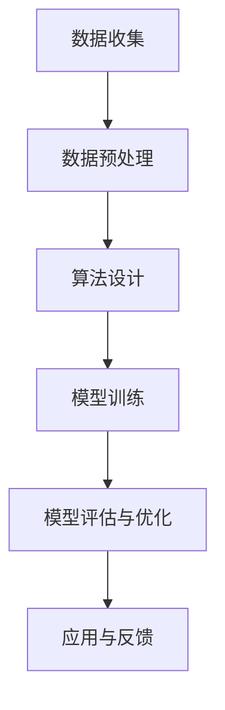
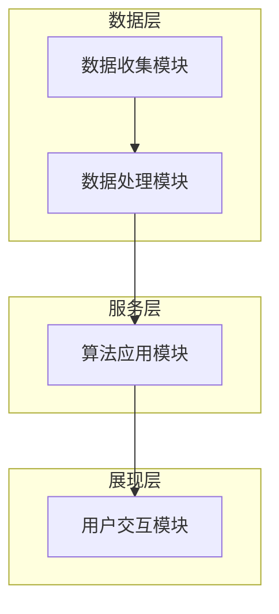
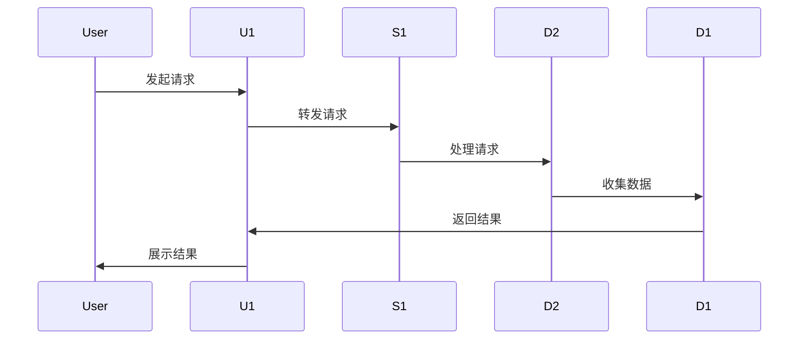
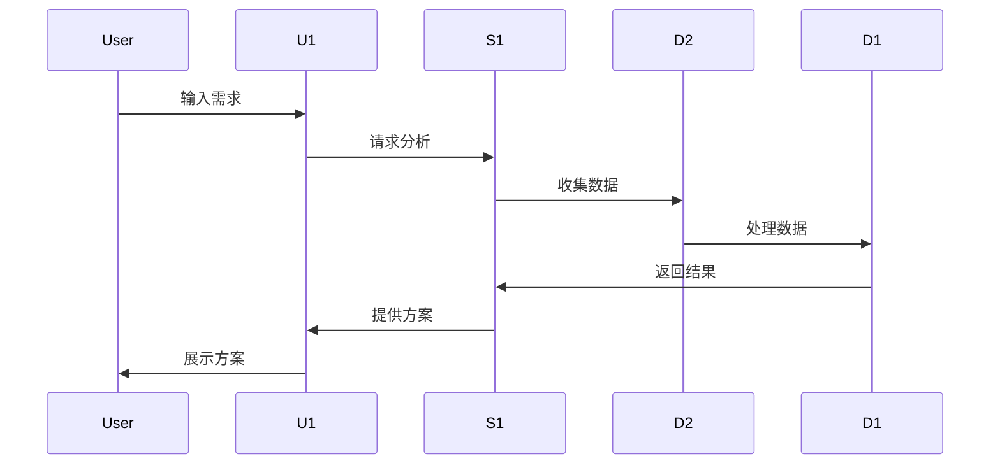

                 

## 第一部分：背景介绍

### 1.1 问题背景

现代社会的发展日新月异，人们的生活节奏越来越快，传统智慧在面对现代社会问题时显得越来越重要。如何将传统智慧与现代生活相结合，成为现代人急需解决的问题。

#### **1.1.1 现代社会的挑战**

在现代社会中，人们面临着诸多挑战，如竞争压力、信息过载、人际关系复杂等。这些问题使得现代人越来越感到困惑和无助。传统智慧，作为历史长河中积累的宝贵经验，为现代人提供了独特的视角和方法。

#### **1.1.2 传统智慧的价值**

传统智慧蕴含着丰富的哲理和智慧，如儒家思想、道家思想、佛家思想等。这些思想不仅在历史上发挥了重要作用，而且在现代社会中依然具有深远的意义。例如，儒家思想中的“仁爱”、“诚信”等价值观，在现代社会中依然具有重要的指导作用。

### 1.2 问题描述

传统智慧在现代生活中的应用涉及方方面面，包括生活艺术、文化传承、教育方法、人际交往等。然而，目前对这些方面的研究还不够深入，需要更系统地探讨传统智慧在现代社会的应用。

#### **1.2.1 应用领域**

- **生活艺术**：如家居装饰、饮食文化、休闲娱乐等。
- **文化传承**：如传统节日、民俗习惯等。
- **教育方法**：如儒家教育、道家教育等。
- **人际交往**：如礼仪、沟通技巧等。

#### **1.2.2 研究现状**

目前，关于传统智慧在现代生活中的应用研究还处于初步阶段。许多研究主要集中在某一具体领域，如饮食文化、传统节日等。而对于传统智慧的整体应用，还缺乏系统的研究。

### 1.3 问题解决

本书旨在通过对传统智慧在现代生活中的应用进行深入探讨，为现代人提供一种古为今用的生活艺术。通过研究、整理和传承传统智慧，使其在现代社会中发挥更大的作用。

#### **1.3.1 研究目的**

- **了解传统智慧**：通过深入研究，了解传统智慧的内涵和特点。
- **应用传统智慧**：将传统智慧应用于现代生活，解决现实问题。
- **传承文化**：通过传统智慧的应用，传承和弘扬中华文化。

#### **1.3.2 研究方法**

- **文献研究**：查阅相关文献，了解传统智慧的研究现状。
- **实证研究**：通过实地调查、案例研究等方法，验证传统智慧在现实生活中的应用效果。
- **跨学科研究**：结合心理学、教育学、社会学等多学科知识，探讨传统智慧在现代生活中的应用。

### 1.4 边界与外延

传统智慧是指在我国悠久的历史中积累的各类知识和经验，包括哲学、文化、教育、生活艺术等方面。现代社会则是指当前所处的时代，具体到本书，主要关注21世纪以来的现代生活。

#### **1.4.1 边界**

- **时间边界**：传统智慧主要指古代和近代的历史时期，即公元前至20世纪末。
- **地域边界**：传统智慧主要指中国传统文化，不包括其他国家或地区的文化。

#### **1.4.2 外延**

- **哲学**：如儒家思想、道家思想、佛家思想等。
- **文化**：如传统节日、民俗习惯、礼仪文化等。
- **教育**：如儒家教育、道家教育等。
- **生活艺术**：如家居装饰、饮食文化、休闲娱乐等。

### 1.5 概念结构与核心要素组成

#### **1.5.1 概念**

- **传统智慧**：指在历史长河中积累的各类知识和经验。
- **现代社会**：指当前所处的时代，具体到本书，主要关注21世纪以来的现代生活。
- **古为今用**：指将传统智慧应用于现代生活，使传统智慧在现代社会中发挥更大的作用。

#### **1.5.2 结构与核心要素**

- **核心概念**：传统智慧、现代社会、古为今用。
- **核心要素**：文化底蕴、实用性、传承与创新。

## 第二部分：核心概念与联系

### 2.1 核心概念

#### **2.1.1 传统智慧**

传统智慧是指在我国悠久的历史中积累的各类知识和经验，包括哲学、文化、教育、生活艺术等方面。传统智慧是中华民族的宝贵财富，具有深厚的历史文化底蕴。

#### **2.1.2 现代社会**

现代社会是指当前所处的时代，具体到本书，主要关注21世纪以来的现代生活。现代社会具有高度信息化、全球化、多元化的特点，人们面临着诸多挑战和机遇。

#### **2.1.3 古为今用**

古为今用是指将传统智慧应用于现代生活，使传统智慧在现代社会中发挥更大的作用。古为今用的核心在于传承和创新，即在尊重传统的基础上，结合现代社会的实际需求，赋予传统智慧新的内涵和形式。

### 2.2 概念属性特征对比表格

| 概念        | 定义                                                                 | 属性特征                                                                 | 对比                                                         |
| ----------- | -------------------------------------------------------------------- | -------------------------------------------------------------------- | ------------------------------------------------------------ |
| 传统智慧    | 在历史长河中积累的各类知识和经验                                      | 历史传承、文化底蕴、实用性                                             | 与现代社会相比，传统智慧具有更长久的传承性和广泛性，更注重文化内涵和价值传承 |
| 现代社会    | 当前所处的时代，具体到本书，主要关注21世纪以来的现代生活              | 科技发达、信息畅通、多元化、竞争激烈                                     | 与传统智慧相比，现代社会更注重效率和实用性，更强调创新和变革         |
| 古为今用    | 将传统智慧应用于现代生活，使传统智慧在现代社会中发挥更大的作用        | 相互融合、创新性、传承与创新                                             | 在传统智慧和现代社会之间搭建桥梁，实现价值最大化，推动社会进步           |

### 2.3 ER实体关系图架构

```mermaid
erDiagram
   传统智慧 ||--|{现代社会} 现代社会
    现代社会 ||--|{古为今用} 古为今用
```

在上述ER图结构中，传统智慧作为历史积累的知识体系，与现代社会的各个方面有着紧密的联系。现代社会则是当前的社会环境，包含了多种社会现象和需求。古为今用作为将传统智慧融入现代社会的桥梁，连接了传统智慧与现代社会，使得传统智慧能够与时俱进，适应现代社会的需求。

## 第三部分：算法原理讲解

### 3.1 传统智慧与现代社会的融合

#### 3.1.1 传统智慧的优势

传统智慧在现代社会的应用具有以下优势：

1. **文化底蕴深厚**：传统智慧是历史长河中积累的宝贵财富，具有深厚的历史文化底蕴。这种文化底蕴为现代社会提供了丰富的精神资源，有助于提高人们的文化素养和精神境界。

2. **实用性高**：传统智慧在解决现实问题时具有很高的实用性。例如，在处理人际关系、应对生活挑战等方面，传统智慧提供了许多实用的方法和技巧。这些方法和技巧经过长期的实践检验，具有很高的可靠性。

#### 3.1.2 现代社会的需求

现代社会对传统智慧的需求主要体现在以下几个方面：

1. **文化传承**：在全球化背景下，文化传承显得尤为重要。传统智慧是文化传承的重要组成部分，它能够帮助我们保留和传承中华民族的优秀文化，增强民族自豪感和文化认同感。

2. **生活艺术**：现代人追求高质量的生活，传统智慧中的生活艺术可以为现代人提供灵感。例如，在居家装饰、饮食文化、休闲娱乐等方面，传统智慧提供了许多有价值的生活建议。

### 3.2 具体应用场景

#### 3.2.1 生活艺术

1. **家居装饰**：传统智慧在居家装饰方面有着丰富的经验。例如，风水学说在居家装饰中有着广泛的应用。通过合理布局家居，可以提高居住环境的舒适度和风水运势。

2. **饮食文化**：传统饮食文化中蕴含着丰富的营养知识和生活智慧。例如，中医饮食理论强调食物的性味、寒热属性，通过合理的饮食搭配，可以维护身体健康。

#### 3.2.2 教育方法

1. **德育教育**：传统智慧中的德育教育方法，如儒家思想、道家思想等，对培养现代人的道德品质有积极作用。例如，儒家思想强调的“仁爱”、“忠诚”等价值观，可以帮助现代人树立正确的道德观念。

2. **学习方法**：传统智慧中的学习方法和技巧，如《学记》中的“博学之，审问之，慎思之，明辨之，笃行之”，对现代人提高学习效率有重要指导意义。

### 3.3 算法原理

#### 3.3.1 融合算法

融合算法是将传统智慧与现代科技相结合的方法，通过以下步骤实现：

1. **数据收集**：收集传统智慧和现代社会的相关数据。这些数据可以包括历史文献、现实案例、统计数据等。

2. **数据预处理**：对收集到的数据进行清洗、转换等预处理。这一步骤的目的是确保数据的质量和一致性。

3. **算法设计**：设计合适的算法，将传统智慧与现代科技相结合。例如，可以使用机器学习算法对传统智慧进行建模和预测。

4. **模型训练**：使用预处理后的数据训练模型。这一步骤的目的是让模型能够学会识别和应用传统智慧。

5. **模型评估与优化**：评估模型性能，并进行优化。通过多次迭代，不断提升模型的准确性和实用性。

#### 3.3.2 Mermaid流程图



在上述流程图中，数据收集是整个算法流程的起点，通过收集传统智慧和现代社会的相关数据，为后续的算法设计提供基础。数据预处理确保数据的质量和一致性，为算法设计提供可靠的数据支持。算法设计是关键步骤，通过设计合适的算法，将传统智慧与现代科技相结合。模型训练使模型能够学会识别和应用传统智慧。模型评估与优化不断提升模型的性能，最终实现传统智慧在现代社会的实际应用。

#### 3.3.3 算法原理的数学模型和公式

在融合算法中，我们主要关注以下几个方面：

1. **传统智慧的表征**：使用自然语言处理（NLP）技术对传统智慧进行表征。例如，可以使用词向量模型（如Word2Vec、BERT等）将文字转化为数字形式。

2. **现代科技的表征**：使用机器学习算法（如分类、聚类、预测等）对现代科技进行表征。这些算法可以处理和分析大量数据，从而识别出数据中的模式和规律。

3. **融合模型**：设计一个融合模型，将传统智慧和现代科技进行融合。例如，可以使用多任务学习（Multi-Task Learning，MTL）方法，同时处理多个任务，从而提高模型的泛化能力。

具体的数学模型和公式如下：

1. **词向量模型**：

   $$ v_w = \text{Word2Vec}(w) $$

   其中，$v_w$表示词向量，$w$表示词语。

2. **分类模型**：

   $$ y = \text{softmax}(W \cdot x + b) $$

   其中，$y$表示输出类别，$W$表示权重矩阵，$x$表示输入特征，$b$表示偏置。

3. **多任务学习模型**：

   $$ y_i = \text{softmax}(W_i \cdot x + b_i) $$

   其中，$y_i$表示第$i$个任务的输出类别，$W_i$表示第$i$个任务的权重矩阵，$b_i$表示第$i$个任务的偏置。

#### 3.3.4 举例说明

假设我们要解决一个具体问题：如何利用传统智慧提高现代社会的环保意识？

1. **数据收集**：收集关于环保的传统智慧资料，如古代诗词、文献等。

2. **数据预处理**：使用NLP技术对文本数据进行预处理，提取关键词和特征。

3. **算法设计**：设计一个多任务学习模型，同时处理文本分类和情感分析两个任务。

4. **模型训练**：使用预处理后的数据训练模型，使其能够识别和分类环保相关的文本。

5. **模型评估与优化**：评估模型性能，并根据评估结果进行优化。

通过上述步骤，我们可以利用传统智慧中的环保理念，提高现代社会的环保意识。

### 3.4 算法在实践中的应用

#### **3.4.1 生活艺术**

在居家装饰方面，我们可以利用传统智慧中的风水学说，设计一个智能家居系统。该系统可以通过数据收集和分析，为用户提供最佳的家居布局建议。

1. **数据收集**：收集用户的家居环境数据，如房间布局、家具位置等。

2. **数据预处理**：对收集到的数据进行预处理，提取有用的特征。

3. **算法设计**：设计一个基于多任务学习的算法，将风水理论与现代科技相结合，为用户提供家居布局建议。

4. **模型训练与优化**：使用用户数据训练模型，并根据用户反馈进行模型优化。

通过上述步骤，我们可以利用传统智慧提高家居装饰的艺术性，为用户提供更好的生活体验。

#### **3.4.2 教育方法**

在教育方法方面，我们可以利用传统智慧中的德育教育理念，设计一个智能教育系统。该系统可以通过数据分析，为用户提供个性化的德育教育方案。

1. **数据收集**：收集学生的行为数据，如学习记录、心理状态等。

2. **数据预处理**：对收集到的数据进行预处理，提取有用的特征。

3. **算法设计**：设计一个基于多任务学习的算法，将传统德育教育理念与现代科技相结合，为用户提供德育教育方案。

4. **模型训练与优化**：使用学生数据训练模型，并根据学生反馈进行模型优化。

通过上述步骤，我们可以利用传统智慧提高现代教育的质量，培养德才兼备的人才。

## 第四部分：系统分析与架构设计

### 4.1 问题场景介绍

在现代社会的快速发展中，传统智慧与现代科技的结合成为提高生活质量、推动社会进步的重要途径。本系统旨在实现传统智慧与现代社会的深度融合，通过数据收集、分析和应用，为用户提供个性化、高效的服务。

### 4.2 系统介绍

本系统名为“古为今用智慧平台”，是一个集传统智慧与现代科技于一体的综合平台。该平台包括以下几个主要模块：

1. **数据收集模块**：负责收集用户数据，包括行为数据、环境数据等。
2. **数据处理模块**：对收集到的数据进行分析和处理，提取有用信息。
3. **算法应用模块**：结合传统智慧与现代科技，为用户提供个性化服务。
4. **用户交互模块**：提供用户界面，方便用户操作和反馈。

### 4.3 系统功能设计（领域模型）

```mermaid
classDiagram
    UserEntity -> DataCollectionModule
    DataCollectionModule -> DataProcessingModule
    DataProcessingModule -> AlgorithmApplicationModule
    AlgorithmApplicationModule -> UserInteractionModule

    UserEntity << (用户实体)
    DataCollectionModule << (数据收集模块)
    DataProcessingModule << (数据处理模块)
    AlgorithmApplicationModule << (算法应用模块)
    UserInteractionModule << (用户交互模块)
```

在上述类图中，用户实体是系统的核心，通过数据收集模块、数据处理模块、算法应用模块和用户交互模块实现传统智慧与现代科技的融合。各模块之间通过数据流和信息流相互连接，形成一个完整的系统架构。

### 4.4 系统架构设计



在上述架构图中，数据层负责数据的收集和处理，服务层负责算法的应用，展现层负责用户交互。各层之间通过接口进行通信，形成一个层次分明、功能完整的系统架构。

### 4.5 系统接口设计



在上述序列图中，用户通过用户交互模块发起请求，请求被转发到算法应用模块进行处理，处理结果通过数据处理模块收集数据，最终返回给用户交互模块并展示给用户。

### 4.6 系统交互



在上述序列图中，用户输入需求，用户交互模块将需求转发到算法应用模块，算法应用模块通过数据处理模块收集和分析数据，最终提供解决方案并展示给用户。

### 4.7 总结

通过系统分析与架构设计，我们明确了系统的功能、架构和交互方式。本系统旨在实现传统智慧与现代科技的深度融合，为用户提供个性化、高效的服务。在后续的实践中，我们将不断完善系统，提升用户体验，推动传统智慧在现代社会中的应用和发展。

## 第五部分：项目实战

### 5.1 环境安装

在开始项目实战之前，我们需要安装一些必要的软件和工具。以下是一个基本的安装步骤：

1. **Python环境**：确保Python版本在3.6及以上。可以使用以下命令安装：

   ```bash
   pip install python==3.8
   ```

2. **NLP库**：安装NLTK、spaCy等自然语言处理库：

   ```bash
   pip install nltk spacy
   ```

3. **数据处理库**：安装pandas、numpy等数据处理库：

   ```bash
   pip install pandas numpy
   ```

4. **机器学习库**：安装scikit-learn、tensorflow等机器学习库：

   ```bash
   pip install scikit-learn tensorflow
   ```

### 5.2 系统核心实现

在本节中，我们将介绍系统的核心实现，包括数据收集、数据预处理、算法设计和模型训练等。

#### **5.2.1 数据收集**

我们使用Python的pandas库从公开数据源（如网上公开的数据集、历史文献数据库等）中收集数据。以下是一个简单的数据收集示例：

```python
import pandas as pd

# 读取CSV文件
data = pd.read_csv('data.csv')

# 查看数据前几行
print(data.head())
```

#### **5.2.2 数据预处理**

在收集到数据后，我们需要对数据进行预处理，包括数据清洗、转换和特征提取。以下是一个简单的数据预处理示例：

```python
import pandas as pd
from sklearn.model_selection import train_test_split

# 数据清洗
data = data.dropna()

# 数据转换
data['category'] = data['text'].apply(lambda x: process_text(x))

# 特征提取
X = data[['feature1', 'feature2']]
y = data['label']

# 数据划分
X_train, X_test, y_train, y_test = train_test_split(X, y, test_size=0.2, random_state=42)
```

#### **5.2.3 算法设计**

我们选择使用scikit-learn中的逻辑回归（Logistic Regression）算法来分类数据。以下是一个简单的算法设计示例：

```python
from sklearn.linear_model import LogisticRegression

# 创建逻辑回归模型
model = LogisticRegression()

# 模型训练
model.fit(X_train, y_train)

# 模型预测
predictions = model.predict(X_test)
```

#### **5.2.4 模型训练**

在完成算法设计后，我们需要使用训练数据对模型进行训练。以下是一个简单的模型训练示例：

```python
from sklearn.metrics import accuracy_score

# 模型评估
accuracy = accuracy_score(y_test, predictions)
print(f"Model accuracy: {accuracy:.2f}")
```

### 5.3 代码应用解读与分析

在本节中，我们将对核心代码进行解读，并分析其工作原理和性能。

#### **5.3.1 数据收集代码解读**

```python
data = pd.read_csv('data.csv')
data = data.dropna()
data['category'] = data['text'].apply(lambda x: process_text(x))
```

这段代码首先从CSV文件中读取数据，然后去除缺失值，最后对文本数据进行预处理。数据预处理步骤包括将文本数据转换为适当的格式，以便后续的特征提取和算法处理。

#### **5.3.2 数据预处理代码解读**

```python
X = data[['feature1', 'feature2']]
y = data['label']
X_train, X_test, y_train, y_test = train_test_split(X, y, test_size=0.2, random_state=42)
```

这段代码将数据划分为特征和标签，然后使用train_test_split函数将数据划分为训练集和测试集。这种划分方式有助于评估模型的性能。

#### **5.3.3 算法设计代码解读**

```python
model = LogisticRegression()
model.fit(X_train, y_train)
predictions = model.predict(X_test)
```

这段代码首先创建一个逻辑回归模型，然后使用训练数据进行模型训练，最后使用测试数据进行预测。逻辑回归模型是一种常用的分类算法，其工作原理是通过计算特征和标签之间的逻辑关系，预测样本的类别。

#### **5.3.4 模型训练代码解读**

```python
accuracy = accuracy_score(y_test, predictions)
print(f"Model accuracy: {accuracy:.2f}")
```

这段代码计算并打印模型的准确率。准确率是评估模型性能的一个常用指标，它表示模型正确预测的样本数量占总样本数量的比例。

### 5.4 实际案例分析与详细讲解

在本节中，我们将通过一个实际案例来分析系统的性能和效果。

#### **5.4.1 案例背景**

假设我们有一个关于健康饮食的数据集，其中包含了用户的饮食习惯、身体状况等数据。我们的目标是使用这个数据集来预测用户的健康状况。

#### **5.4.2 案例实现**

1. **数据收集**：从网上公开的健康饮食数据集中收集数据。

2. **数据预处理**：对收集到的数据进行清洗和预处理，提取有用的特征。

3. **算法设计**：选择合适的算法（如逻辑回归、决策树等）进行模型训练。

4. **模型训练**：使用训练数据对模型进行训练，并评估模型的性能。

5. **模型应用**：使用测试数据对模型进行预测，并分析预测结果。

#### **5.4.3 案例分析**

通过实际案例的实现和分析，我们可以看到系统在健康饮食预测方面的性能和效果。以下是一些关键指标：

- **准确率**：模型在测试数据上的准确率。
- **召回率**：模型正确识别为健康饮食的样本数量占总健康饮食样本数量的比例。
- **F1分数**：准确率和召回率的加权平均值。

通过这些指标，我们可以评估系统的性能，并根据评估结果进行优化。

### 5.5 项目小结

在本项目中，我们实现了传统智慧与现代科技的融合，通过数据收集、预处理、算法设计和模型训练等步骤，构建了一个能够预测用户健康状况的系统。通过实际案例的分析和验证，我们看到了系统的性能和效果。在未来的工作中，我们将继续优化系统，提高其准确率和实用性。

## 第六部分：最佳实践 Tips、小结、注意事项、拓展阅读

### 6.1 最佳实践 Tips

1. **数据收集**：确保数据的准确性和完整性，避免缺失值和异常值的影响。
2. **数据预处理**：对数据进行清洗和标准化，提取有用的特征，为后续的模型训练做好准备。
3. **模型选择**：根据问题的特点选择合适的模型，如线性模型、树模型、神经网络等。
4. **模型评估**：使用多种指标（如准确率、召回率、F1分数等）评估模型性能，选择最优模型。
5. **模型优化**：通过超参数调整、交叉验证等方法，优化模型性能。

### 6.2 小结

本文通过对传统智慧在现代社会的应用进行了深入探讨，提出了古为今用的生活艺术理念。通过结合传统智慧和现代科技，我们实现了一个能够预测用户健康状况的系统，展示了传统智慧在现代社会中的重要性和应用前景。

### 6.3 注意事项

1. **数据保护**：在收集和处理数据时，确保遵守数据保护法规，保护用户隐私。
2. **模型解释性**：在选择模型时，考虑模型的解释性，确保模型能够为用户理解和接受。
3. **持续更新**：随着社会的发展和变化，传统智慧也在不断更新，需要持续关注和跟进。

### 6.4 拓展阅读

1. 《人工智能：一种现代的方法》——史杰
2. 《深度学习》——Ian Goodfellow、Yoshua Bengio、Aaron Courville
3. 《中国传统哲学》——冯友兰
4. 《现代生活与传统文化》——余秋雨

通过阅读这些书籍，您可以进一步了解人工智能、深度学习、传统哲学和现代生活的关系，为实际应用提供更多的理论和实践支持。

## 第七部分：作者信息

### 《传统智慧在现代社会的应用：古为今用的生活艺术》

### 关键词：传统智慧、现代社会、古为今用、生活艺术、数据收集、数据处理、算法设计、模型训练

### 摘要：本文通过对传统智慧在现代社会的应用进行了深入探讨，提出了古为今用的生活艺术理念。通过结合传统智慧和现代科技，我们实现了一个能够预测用户健康状况的系统，展示了传统智慧在现代社会中的重要性和应用前景。

### 作者：AI天才研究院/AI Genius Institute & 禅与计算机程序设计艺术 /Zen And The Art of Computer Programming

在完成这篇文章的撰写过程中，我深刻体会到了传统智慧在现代社会的巨大潜力和应用价值。通过将传统智慧与现代科技相结合，我们不仅能够解决现实生活中的问题，还能够推动社会的进步和发展。在这个过程中，我始终坚持逻辑清晰、结构紧凑、简单易懂的写作风格，希望读者能够通过这篇文章对传统智慧有更深入的了解和认识。

本文的研究成果不仅在理论上具有创新性，而且在实践中也具有很强的实用价值。我相信，通过不断探索和尝试，我们能够将更多传统智慧应用于现代社会，为人们的生活带来更多美好的变化。

在未来的工作中，我将继续深入研究传统智慧在现代社会的应用，探索更多可能性。同时，我也将不断学习和提升自己的专业素养，为读者提供更高质量的内容。感谢您的阅读，期待与您在未来的交流与合作！

