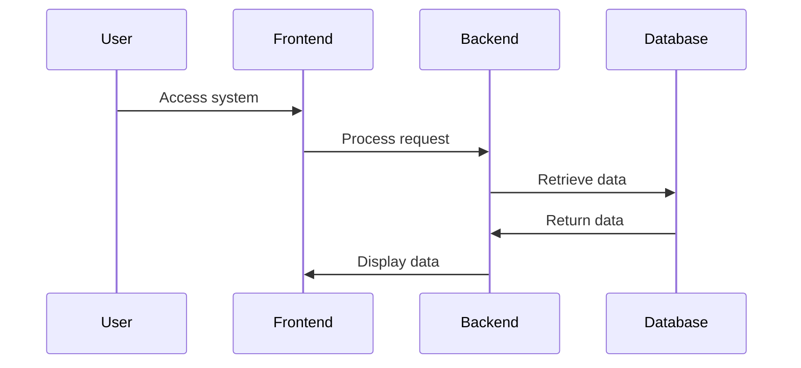
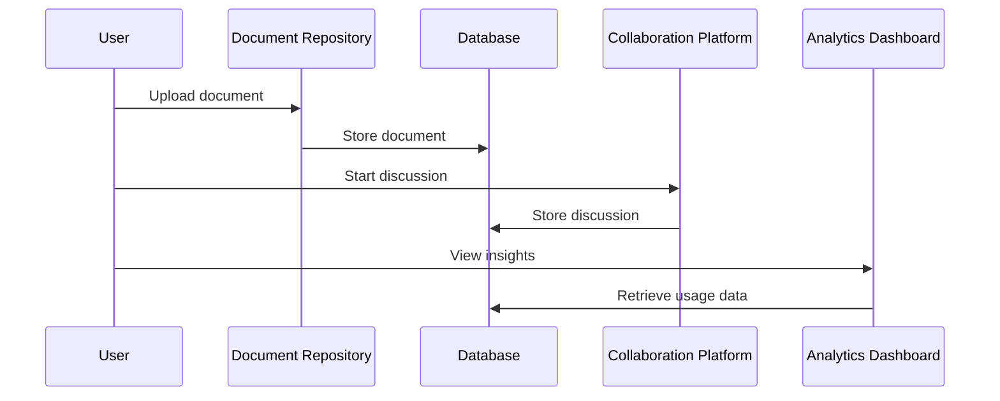
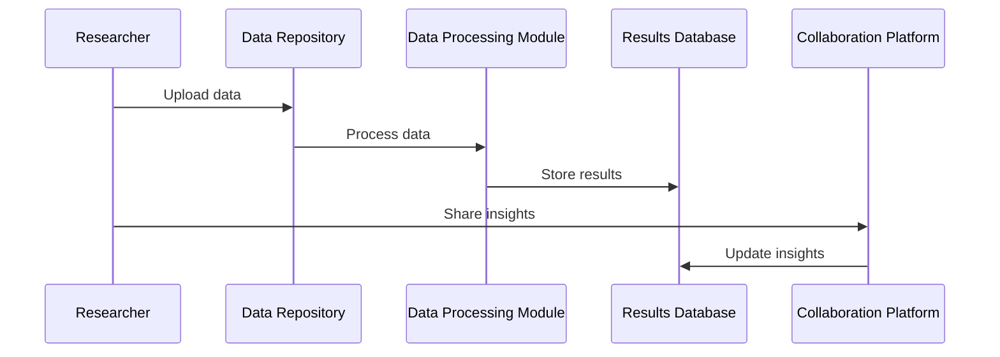
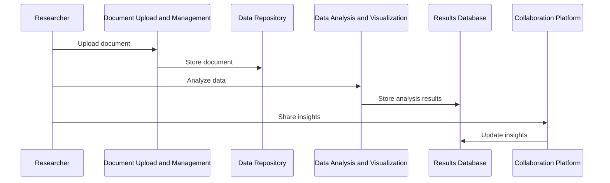
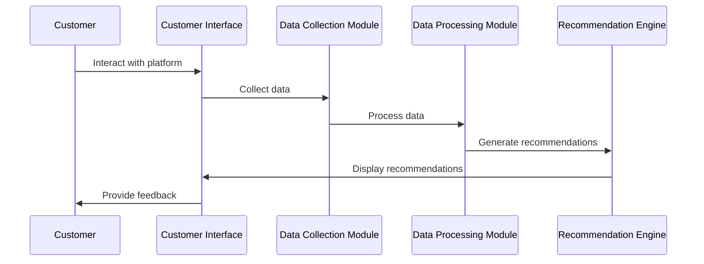
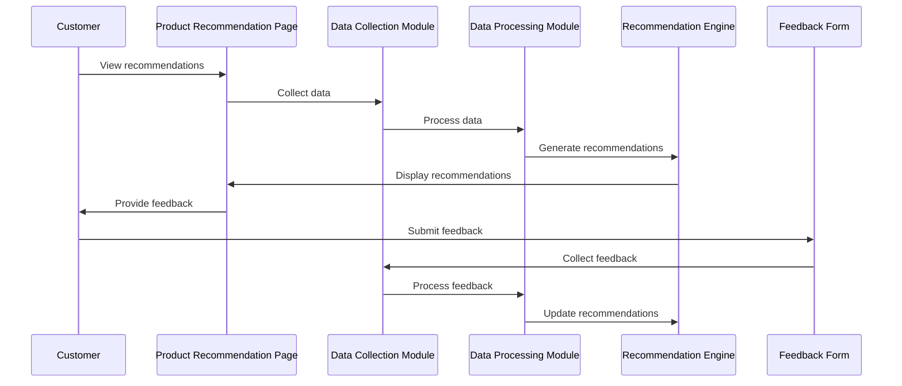

                 

### Introduction to Information Overload in the Age of Knowledge Significance Exploration

In today's digital age, the sheer volume of information available to us is staggering. This phenomenon, often referred to as "information overload," has become a significant challenge in modern society. It impacts our ability to process, understand, and utilize information effectively, leading to various cognitive and psychological issues. Therefore, exploring the concept of knowledge significance becomes crucial in this information-rich environment. This article aims to delve into the complexities of information overload and the exploration of knowledge significance, providing a comprehensive guide to understanding and addressing these issues.

**Keywords:**
- Information Overload
- Knowledge Significance
- Information Age
- Cognitive Psychology
- Digital Society

**Abstract:**
The rapid advancement of technology and the internet have made an unprecedented amount of information accessible to us. However, this abundance of data has also led to what is now termed as "information overload." This article discusses the background and impact of information overload on modern society. It introduces the concept of knowledge significance, its importance in the digital age, and the principles guiding its exploration. The article then proceeds to analyze the methods and tools used to explore knowledge significance, providing case studies and applications to illustrate practical approaches. By the end, the article offers insights into managing information overload and harnessing the significance of knowledge to thrive in the digital era.

----------------------------------------------------------------

### Background of Information Overload

#### The Rise of Information Overload

The phenomenon of information overload can be traced back to the advent of the internet and the proliferation of digital technologies. In the early days of the internet, the amount of information available was relatively limited, and users had to actively seek out specific resources. However, with the growth of the web and the development of search engines, information became increasingly accessible. This shift, while enabling unprecedented levels of access to knowledge, also introduced a new set of challenges.

In the late 20th century, the amount of data available on the internet began to expand at an exponential rate. According to a study by the University of California, Los Angeles (UCLA), the amount of information available on the web doubled every 100 days in the early 2000s. This rapid growth continued into the 2010s and 2020s, with the rise of social media, online shopping platforms, and other digital services. As a result, individuals are now inundated with a vast amount of information on a daily basis, making it increasingly difficult to process and manage.

#### The Impact of Information Overload on Modern Society

The impact of information overload on modern society is multifaceted and affects various aspects of our lives, including cognitive functioning, mental health, and productivity.

**Cognitive Challenges:**
One of the primary effects of information overload is its impact on cognitive resources. The human brain has a limited capacity to process and retain information. When faced with an overwhelming amount of data, the brain struggles to distinguish between relevant and irrelevant information, leading to a phenomenon known as "cognitive overload." This can result in reduced attention span, difficulty concentrating, and impaired decision-making abilities. In essence, information overload can lead to "brain fatigue," where individuals feel overwhelmed and exhausted by the constant influx of information.

**Mental Health Issues:**
Information overload has also been linked to various mental health problems, including stress, anxiety, and depression. The constant exposure to large volumes of information can create a sense of pressure and urgency, making individuals feel as though they are constantly "behind" or unable to keep up. This can lead to increased levels of stress and anxiety, as well as feelings of helplessness and frustration. In extreme cases, information overload can contribute to the development of chronic stress and mental health disorders.

**Reduced Productivity:**
In the workplace, information overload can significantly impact productivity. When employees are overwhelmed by a constant stream of information, they may struggle to focus on their tasks, leading to decreased productivity and increased error rates. This can also result in a culture of "busywork," where individuals feel compelled to stay busy with low-value tasks to appear productive, even if it means sacrificing actual progress on high-priority projects.

#### The Importance of Exploring Knowledge Significance

In light of the challenges posed by information overload, exploring the concept of knowledge significance becomes essential. Knowledge significance refers to the value and relevance of information in a given context. Unlike raw data, which can be vast and overwhelming, knowledge is information that has been processed, analyzed, and contextualized to provide meaningful insights and solutions.

**Enhancing Decision-Making:**
By focusing on knowledge significance, individuals can better prioritize and make more informed decisions. When information is processed and presented in a meaningful way, it becomes easier to identify patterns, trends, and potential problems. This can lead to more effective decision-making and better outcomes.

**Improving Cognitive Well-being:**
Reducing information overload can have a positive impact on cognitive well-being. By focusing on knowledge significance, individuals can reduce the amount of irrelevant information they consume, thereby alleviating cognitive overload and reducing stress and anxiety.

**Boosting Productivity:**
By prioritizing knowledge over raw data, individuals and organizations can improve productivity. When information is processed and presented in a way that is relevant to specific tasks or projects, it becomes easier to focus and work more efficiently.

**Fostering Critical Thinking:**
Exploring knowledge significance also encourages critical thinking. By questioning the value and relevance of information, individuals can develop a more discerning approach to information consumption, leading to a deeper understanding of complex issues.

In conclusion, the rise of information overload presents significant challenges in modern society. However, by exploring the concept of knowledge significance, individuals and organizations can better manage information, enhance cognitive well-being, improve decision-making, and boost productivity. This article aims to provide a comprehensive overview of these issues and offer insights into strategies for navigating the complexities of the information age.

----------------------------------------------------------------

### Definition and Significance of Knowledge Significance

In the context of information overload, the concept of knowledge significance emerges as a crucial factor in managing and leveraging the vast amount of information available. To understand its importance, it is essential to first define what knowledge significance entails and how it differs from raw data or information.

#### Definition of Knowledge Significance

Knowledge significance can be defined as the value and relevance of information in a specific context. It involves the process of filtering, analyzing, and synthesizing information to derive meaningful insights and actionable knowledge. Unlike raw data, which can be vast, unstructured, and often irrelevant, knowledge is information that has been processed, contextualized, and validated to provide meaningful insights.

To elaborate, consider the following characteristics of knowledge significance:

1. **Contextualization:** Knowledge significance is highly context-dependent. It involves understanding the specific needs, goals, and challenges of a given situation to determine the relevance of information.

2. **Processing:** Knowledge significance involves processing information through various analytical and critical thinking techniques to extract meaningful insights. This may include identifying patterns, relationships, and trends within the data.

3. **Validation:** Knowledge significance is not merely based on the availability of information but also on its accuracy and reliability. Validating the sources and methods used to derive knowledge is crucial to ensure its credibility.

4. **Application:** The ultimate purpose of knowledge significance is to apply the derived insights in practical scenarios to solve problems, make decisions, and drive innovation.

#### The Importance of Knowledge Significance in the Information Age

In the information age, where data is abundant and often overwhelming, the importance of knowledge significance cannot be overstated. Here are some key reasons why knowledge significance is crucial in the digital age:

1. **Efficient Decision-Making:** Knowledge significance enables individuals and organizations to make more informed decisions by providing relevant and actionable insights. In an era of information overload, the ability to filter and prioritize information based on its significance is a valuable skill.

2. **Cognitive Efficiency:** By focusing on knowledge significance, individuals can reduce cognitive overload. This involves distinguishing between relevant and irrelevant information, thereby conserving cognitive resources and improving focus and productivity.

3. **Problem-Solving:** Knowledge significance is essential for effective problem-solving. By identifying the most critical information related to a problem, individuals can develop targeted solutions that address the core issues, rather than getting lost in a sea of data.

4. **Innovation and Creativity:** Knowledge significance fosters innovation by providing a foundation of meaningful insights that can inspire new ideas and creative solutions. When information is processed and contextualized in a meaningful way, it becomes a catalyst for innovation.

5. **Stakeholder Engagement:** In business and organizational contexts, knowledge significance is crucial for engaging stakeholders. By providing relevant and valuable insights, organizations can build trust and credibility with stakeholders, leading to better collaboration and outcomes.

#### Comparing Information and Knowledge

To further understand the concept of knowledge significance, it is helpful to compare it with raw information or data:

1. **Quantity vs. Quality:** Information is often measured in terms of quantity, whereas knowledge is about quality. While information can be abundant, knowledge is derived from a selective process that identifies the most relevant and valuable aspects of that information.

2. **Unprocessed vs. Processed:** Raw information is unprocessed and often lacks structure or context. Knowledge, on the other hand, is processed, analyzed, and contextualized to provide meaningful insights and solutions.

3. **Passive vs. Active:** Information is typically consumed passively, whereas knowledge requires active engagement and critical thinking. This engagement involves filtering, analyzing, and synthesizing information to derive meaningful insights.

4. **Temporal vs. Persistent:** Information is often temporal, meaning it may lose relevance over time. Knowledge, however, has a more persistent value, as it is derived from a deeper understanding of the underlying principles and patterns.

In conclusion, knowledge significance plays a pivotal role in managing information overload in the digital age. By defining and understanding the concept of knowledge significance, individuals and organizations can better navigate the complexities of the information landscape, enhance decision-making, and drive innovation. This article aims to provide a foundational understanding of knowledge significance, equipping readers with the knowledge and tools to apply this concept effectively in their personal and professional lives.

----------------------------------------------------------------

### Core Concepts and Principles of Knowledge Significance

#### Key Concepts in Information Overload and Knowledge Significance

To delve into the core concepts and principles of knowledge significance, it is essential to first understand the related concepts of information overload and how they interact with the significance of knowledge. The following are key concepts that form the foundation of this discussion:

**Information Overload:**
Information overload refers to the state of having an excessive amount of information, often resulting in difficulty in processing, managing, and retaining the information. This phenomenon is primarily caused by the rapid growth of digital technologies and the internet, which have made vast amounts of data accessible to individuals and organizations.

**Knowledge Significance:**
Knowledge significance, as discussed earlier, refers to the value and relevance of information in a specific context. It involves the process of filtering, analyzing, and synthesizing information to derive meaningful insights and actionable knowledge.

**Cognitive Overload:**
Cognitive overload occurs when an individual's cognitive resources are stretched beyond their capacity to process and manage the information they encounter. This can lead to reduced attention span, impaired decision-making, and increased stress levels.

**Contextual Relevance:**
Contextual relevance refers to the degree to which information is appropriate and meaningful in a given context. Information that is highly relevant and contextually appropriate is more likely to be processed and retained effectively by individuals.

**Data Processing and Analysis:**
Data processing and analysis involve transforming raw data into a more structured and meaningful form that can be used for decision-making and problem-solving. This process includes various techniques such as data cleaning, data transformation, and statistical analysis.

**Information Filtering:**
Information filtering involves the selection and prioritization of information based on specific criteria or needs. This process helps individuals and organizations manage the vast amounts of information available, focusing on the most relevant and valuable data.

#### Comparison of Information and Knowledge

Understanding the differences between information and knowledge is crucial for comprehending the concept of knowledge significance. The following table provides a comparative analysis of these two concepts:

| Concept            | Information               | Knowledge                             |
|---------------------|---------------------------|---------------------------------------|
| Definition          | Raw, unprocessed data      | Processed, analyzed, and contextualized information |
| Quantity            | Often abundant            | High quality and relevance             |
| Form                | Unstructured and diverse   | Structured and coherent                |
| Temporality         | Temporal                  | Persistent and enduring                |
| Passive vs. Active  | Passive consumption       | Active engagement and critical thinking |
| Purpose             | To convey facts and details | To provide insights and solutions       |

By understanding these core concepts and their interrelationships, we can better grasp the importance of knowledge significance in managing information overload. The following sections will further explore the principles and methods for exploring knowledge significance in more detail.

----------------------------------------------------------------

### Principles of Knowledge Significance Exploration

#### Theoretical Foundations

Exploring knowledge significance is underpinned by several foundational theories, each contributing to a comprehensive understanding of the concept. These theories include cognitive psychology, information science, and knowledge management.

1. **Cognitive Psychology:**
   Cognitive psychology provides insights into how the human brain processes, stores, and retrieves information. Key principles such as attention, perception, memory, and decision-making are essential in understanding how individuals interact with information. By understanding these cognitive processes, we can better design systems and strategies that enhance knowledge significance.

2. **Information Science:**
   Information science focuses on the study of information, its creation, storage, retrieval, and dissemination. The principles of information retrieval and information organization are critical in transforming raw data into meaningful knowledge. This includes techniques such as indexing, classification, and data visualization, which help in identifying and presenting information in a contextually relevant manner.

3. **Knowledge Management:**
   Knowledge management is the process of capturing, organizing, and sharing knowledge within organizations to improve decision-making and innovation. The principles of knowledge management, such as knowledge creation, knowledge sharing, and knowledge transfer, are vital in leveraging knowledge significance to drive organizational success.

#### Methodological Frameworks

To effectively explore knowledge significance, several methodological frameworks can be employed. These frameworks provide structured approaches to analyzing and synthesizing information, ensuring that the derived knowledge is relevant and valuable.

1. **Content Analysis:**
   Content analysis involves the systematic examination of text, images, and other forms of content to identify patterns, themes, and relationships. This method is particularly useful in understanding the contextual relevance of information and can be applied to a wide range of texts, such as articles, books, and social media posts.

2. **Discourse Analysis:**
   Discourse analysis examines the ways in which language is used to convey meaning within specific contexts. This method focuses on the social and cultural dimensions of communication, providing insights into how information is constructed and interpreted. Discourse analysis is particularly valuable in understanding the underlying assumptions and biases within information.

3. **Case Study Methods:**
   Case study methods involve an in-depth investigation of a particular individual, group, or organization. This method allows for a detailed understanding of specific contexts and can reveal insights that are not apparent through other methods. Case studies are particularly useful in exploring knowledge significance in real-world applications.

4. **Quantitative Analysis Methods:**
   Quantitative analysis methods involve the use of statistical techniques to analyze numerical data. These methods are useful for identifying trends, correlations, and patterns within large datasets. Techniques such as regression analysis, cluster analysis, and factor analysis can be employed to derive meaningful insights from quantitative data.

5. **Qualitative Analysis Methods:**
   Qualitative analysis methods involve the interpretation of non-numerical data, such as text, images, and audio. Techniques such as thematic analysis, narrative analysis, and content analysis are used to identify patterns and themes within qualitative data. These methods are particularly valuable for understanding the nuances of information and the contexts in which it is used.

#### The Role of Context in Knowledge Significance

Context plays a crucial role in determining the significance of knowledge. Information that is highly relevant in one context may be irrelevant or even misleading in another. Therefore, understanding and incorporating context into the exploration of knowledge significance is essential.

1. **Temporal Context:**
   Temporal context refers to the time frame in which information is relevant. Information that is accurate and valuable at one point in time may become outdated and less relevant as time passes. Therefore, it is important to consider the temporal context when assessing the significance of knowledge.

2. **Cultural Context:**
   Cultural context involves the social and cultural norms, values, and beliefs that shape the interpretation of information. Different cultures may place different values on certain types of information, making it essential to consider cultural context when exploring knowledge significance.

3. **Domain Context:**
   Domain context refers to the specific field or area of knowledge in which information is relevant. Information that is highly relevant in one domain may be irrelevant in another. Therefore, it is important to consider the domain context when assessing the significance of knowledge.

4. **Personal Context:**
   Personal context involves the individual's background, experiences, and knowledge base. Different individuals may interpret the same information differently based on their personal context. Therefore, it is important to consider personal context when exploring knowledge significance.

In conclusion, exploring knowledge significance involves understanding the theoretical foundations, employing methodological frameworks, and considering the role of context. By doing so, we can derive meaningful insights and actionable knowledge from the vast amount of information available in the digital age.

----------------------------------------------------------------

### Analytical Methods and Tools for Exploring Knowledge Significance

To effectively explore knowledge significance, various analytical methods and tools are employed. These methods can be broadly categorized into quantitative and qualitative analysis methods. Each method has its strengths and limitations, and selecting the appropriate method depends on the nature of the data and the research objectives.

#### Quantitative Analysis Methods

Quantitative analysis methods involve the use of statistical techniques to analyze numerical data. These methods are particularly useful for identifying patterns, correlations, and trends within large datasets. The following are some common quantitative analysis methods:

1. **Statistical Analysis:**
   Statistical analysis involves the use of statistical software to analyze data and derive insights. Common statistical techniques include regression analysis, which helps identify relationships between variables, and cluster analysis, which groups similar data points together. Statistical analysis is valuable for understanding the general trends and patterns within a dataset.

2. **Machine Learning Techniques:**
   Machine learning techniques involve training algorithms to recognize patterns and make predictions based on data. Techniques such as supervised learning (e.g., linear regression, decision trees) and unsupervised learning (e.g., clustering, association rule mining) can be used to identify relationships and insights within large datasets. Machine learning techniques are particularly useful for predictive analytics and pattern recognition.

3. **Data Mining Algorithms:**
   Data mining algorithms are used to extract patterns and insights from large datasets. Common data mining techniques include classification, clustering, association rule mining, and anomaly detection. Classification algorithms, such as k-nearest neighbors and support vector machines, are used to categorize data into predefined classes. Clustering algorithms, such as k-means and hierarchical clustering, group similar data points together. Association rule mining algorithms, such as Apriori and Eclat, identify relationships between variables. Anomaly detection algorithms, such as isolation forest and local outlier factor, identify unusual data points.

4. **Text Mining:**
   Text mining involves the use of natural language processing (NLP) techniques to analyze and extract insights from text data. Techniques such as sentiment analysis, named entity recognition, and topic modeling can be used to understand the sentiment, context, and themes within text data. Text mining is valuable for extracting knowledge from large volumes of unstructured text, such as social media posts, customer reviews, and news articles.

#### Qualitative Analysis Methods

Qualitative analysis methods involve the interpretation of non-numerical data, such as text, images, and audio. These methods are particularly useful for understanding the nuances of information and the contexts in which it is used. The following are some common qualitative analysis methods:

1. **Content Analysis:**
   Content analysis involves the systematic examination of text, images, and other forms of content to identify patterns, themes, and relationships. This method is useful for understanding the structure and meaning of information. Content analysis can be conducted using various techniques, such as coding, categorizing, and thematic analysis.

2. **Discourse Analysis:**
   Discourse analysis examines the ways in which language is used to convey meaning within specific contexts. This method focuses on the social and cultural dimensions of communication and can reveal insights into how information is constructed and interpreted. Discourse analysis is valuable for understanding the underlying assumptions and biases within information.

3. **Case Study Methods:**
   Case study methods involve an in-depth investigation of a particular individual, group, or organization. This method allows for a detailed understanding of specific contexts and can reveal insights that are not apparent through other methods. Case studies are particularly useful for exploring knowledge significance in real-world applications.

4. **Interviews and Surveys:**
   Interviews and surveys are qualitative research methods that involve collecting data from individuals or groups through structured or semi-structured questions. These methods can be used to gather detailed insights into people's perspectives, experiences, and motivations. Interviews and surveys are valuable for understanding the personal and contextual factors that influence knowledge significance.

#### Integrating Quantitative and Qualitative Methods

To obtain a comprehensive understanding of knowledge significance, it is often beneficial to integrate quantitative and qualitative methods. This approach allows for a holistic analysis of information, combining the objective insights from quantitative methods with the nuanced insights from qualitative methods.

1. **Triangulation:**
   Triangulation involves using multiple methods to validate and corroborate the findings. By combining quantitative and qualitative methods, researchers can ensure that their conclusions are based on a robust and diverse set of data sources.

2. **Convergent Validation:**
   Convergent validation involves comparing the findings from quantitative and qualitative methods to identify similarities and differences. This process helps ensure that the insights derived from different methods are consistent and reliable.

3. **Data Integration:**
   Data integration involves combining data from different sources and methods to create a more comprehensive analysis. This approach allows researchers to draw on a wide range of data sources and perspectives, enhancing the depth and breadth of their insights.

In conclusion, exploring knowledge significance requires the use of a variety of analytical methods and tools. By employing both quantitative and qualitative methods, researchers can gain a comprehensive understanding of the complexities of information and derive meaningful insights that are relevant and valuable in the digital age.

----------------------------------------------------------------

### Case Studies and Applications of Knowledge Significance Exploration

#### Case Study 1: Knowledge Management in a Multinational Corporation

In this case study, we examine the implementation of a knowledge management system in a multinational corporation. The company, facing information overload due to the rapid expansion of its global operations, sought to enhance the effectiveness of its knowledge sharing and decision-making processes.

**Project Overview:**
The project aimed to create a centralized knowledge management system that would facilitate the sharing of information across various departments and regions. The system would include a repository of documents, a collaborative platform for real-time communication, and an analytics dashboard to track knowledge usage and effectiveness.

**System Function Design:**
The system's domain model, represented in a Mermaid class diagram, includes the following main entities:

1. **User:** Represents individuals within the corporation.
2. **Document:** Represents the various documents stored in the system.
3. **Collaboration:** Represents the collaborative activities and discussions.
4. **Analytics:** Represents the analytics and reporting functionalities.

```mermaid
classDiagram
User <<entity>>
Document <<entity>>
Collaboration <<entity>>
Analytics <<entity>>

User <- Document: author
User -> Collaboration: participant
Document -> Collaboration: content
Analytics -> Document: usage
Analytics -> Collaboration: activity
```

**System Architecture Design:**
The system architecture, depicted in a Mermaid diagram, consists of the following main components:

1. **Frontend:** A web-based user interface for accessing the system's functionalities.
2. **Backend:** A server that handles data storage, processing, and analytics.
3. **Database:** A database for storing user data, documents, and collaboration history.



**System Interface Design:**
The system interfaces are designed to be intuitive and user-friendly, enabling users to easily navigate and interact with the system. Key interfaces include:

1. **Document Repository:** Allows users to upload, search, and access documents.
2. **Collaboration Platform:** Facilitates real-time communication and collaboration among team members.
3. **Analytics Dashboard:** Provides insights into knowledge usage and effectiveness, helping the company make data-driven decisions.

**System Interactions:**
The system interactions are illustrated in a Mermaid sequence diagram:



**Project Implementation and Results:**
The project was successfully implemented over a period of six months. The knowledge management system significantly improved the company's ability to share and utilize knowledge across departments and regions. Key results include:

1. **Enhanced Collaboration:** The system facilitated real-time communication and collaboration, enabling team members to work more efficiently and effectively.
2. **Improved Decision-Making:** The analytics dashboard provided valuable insights into knowledge usage, helping the company make more informed decisions.
3. **Increased Productivity:** The streamlined knowledge sharing processes reduced the time spent searching for information and improved overall productivity.

**Conclusion:**
This case study illustrates the practical application of knowledge significance exploration in a corporate setting. By implementing a knowledge management system, the company was able to overcome information overload and leverage knowledge to enhance collaboration, decision-making, and productivity.

----------------------------------------------------------------

### Case Study 2: Knowledge Significance in Medical Research

In this case study, we explore the role of knowledge significance in medical research, focusing on the development of a new drug for treating a rare genetic disorder. The project highlights the importance of accurately identifying and processing relevant information to drive scientific innovation.

**Project Overview:**
The project aimed to develop a new drug candidate for a rare genetic disorder affecting a small but critical population. Researchers needed to analyze a vast amount of scientific literature, clinical data, and genetic information to identify potential drug targets and pathways.

**System Function Design:**
The system's domain model, represented in a Mermaid class diagram, includes the following main entities:

1. **Researcher:** Represents individuals involved in the research project.
2. **Document:** Represents the scientific papers, clinical reports, and other research materials.
3. **Genetic Data:** Represents the genetic information relevant to the disorder.
4. **Drug Candidate:** Represents the potential drug candidates identified during the research.
5. **Analysis:** Represents the analytical processes and tools used to process and analyze the data.

```mermaid
classDiagram
Researcher <<entity>>
Document <<entity>>
GeneticData <<entity>>
DrugCandidate <<entity>>
Analysis <<entity>>

Researcher -> Document: reviews
Researcher -> GeneticData: analyzes
Researcher -> DrugCandidate: develops
Document -> Analysis: input
GeneticData -> Analysis: input
DrugCandidate -> Analysis: input
```

**System Architecture Design:**
The system architecture, depicted in a Mermaid diagram, consists of the following main components:

1. **Data Repository:** A centralized repository for storing and managing documents, genetic data, and drug candidates.
2. **Data Processing Module:** A module that processes and analyzes the data using various algorithms and tools.
3. **Collaboration Platform:** A platform for researchers to collaborate and share insights.
4. **Results Database:** A database for storing the analysis results and findings.



**System Interface Design:**
The system interfaces are designed to be user-friendly and efficient, enabling researchers to easily access and interact with the system's functionalities. Key interfaces include:

1. **Document Upload and Management:** Allows researchers to upload and manage documents and genetic data.
2. **Data Analysis and Visualization:** Provides tools for analyzing and visualizing genetic data and analysis results.
3. **Collaboration Platform:** Facilitates real-time collaboration and communication among researchers.

**System Interactions:**
The system interactions are illustrated in a Mermaid sequence diagram:



**Project Implementation and Results:**
The project was successfully implemented over a period of two years. The knowledge management system significantly improved the researchers' ability to identify and process relevant information, leading to the development of a promising new drug candidate for the rare genetic disorder. Key results include:

1. **Accurate Target Identification:** The system enabled researchers to accurately identify potential drug targets and pathways, leading to a more targeted approach in developing the drug candidate.
2. **Efficient Collaboration:** The collaboration platform facilitated real-time communication and collaboration, enhancing the overall research process and efficiency.
3. **Innovative Drug Development:** The project resulted in the development of a new drug candidate that showed promising results in preclinical trials, paving the way for further clinical development.

**Conclusion:**
This case study demonstrates the practical application of knowledge significance exploration in the field of medical research. By leveraging a knowledge management system, researchers were able to effectively identify and process relevant information, leading to the development of a novel drug candidate. This highlights the importance of knowledge significance in driving scientific innovation and advancing medical research.

----------------------------------------------------------------

### Case Study 3: Knowledge Significance in E-commerce

In this case study, we explore the role of knowledge significance in the e-commerce industry, focusing on the use of data analytics to improve customer experience and drive sales. The project highlights the importance of accurately identifying and processing customer data to enhance personalized marketing and product recommendations.

**Project Overview:**
The project aimed to improve the customer experience and increase sales for an e-commerce platform by leveraging data analytics to deliver personalized marketing and product recommendations. The company sought to overcome information overload by effectively processing and utilizing customer data to derive meaningful insights.

**System Function Design:**
The system's domain model, represented in a Mermaid class diagram, includes the following main entities:

1. **Customer:** Represents individuals who shop on the e-commerce platform.
2. **Product:** Represents the various products available on the platform.
3. **Order:** Represents the customer orders placed on the platform.
4. **Recommendation:** Represents the personalized product recommendations generated by the system.
5. **Analytics:** Represents the analytical processes and tools used to analyze customer data.

```mermaid
classDiagram
Customer <<entity>>
Product <<entity>>
Order <<entity>>
Recommendation <<entity>>
Analytics <<entity>>

Customer -> Order: places
Product -> Order: contains
Customer -> Recommendation: receives
Product -> Recommendation: suggested
Analytics -> Customer: analyzes
Analytics -> Order: analyzes
Analytics -> Product: analyzes
```

**System Architecture Design:**
The system architecture, depicted in a Mermaid diagram, consists of the following main components:

1. **Data Collection Module:** Collects customer data from various sources, such as website interactions, social media, and purchase history.
2. **Data Processing Module:** Processes and analyzes the collected customer data using various algorithms and tools.
3. **Recommendation Engine:** Generates personalized product recommendations based on customer data and analytical insights.
4. **Customer Interface:** A user-friendly interface for customers to access personalized recommendations and interact with the platform.



**System Interface Design:**
The system interfaces are designed to be intuitive and personalized, enabling customers to easily access and engage with personalized recommendations. Key interfaces include:

1. **Product Recommendation Page:** Displays personalized product recommendations based on customer data.
2. **Customer Profile Page:** Allows customers to view and update their personal preferences and information.
3. **Feedback Form:** Allows customers to provide feedback on product recommendations and overall customer experience.

**System Interactions:**
The system interactions are illustrated in a Mermaid sequence diagram:



**Project Implementation and Results:**
The project was successfully implemented over a period of six months. The data analytics system significantly improved the e-commerce platform's ability to deliver personalized marketing and product recommendations, leading to increased customer satisfaction and sales. Key results include:

1. **Improved Personalization:** The system enabled the platform to deliver highly personalized product recommendations, leading to a more engaging and tailored customer experience.
2. **Increased Sales:** The personalized marketing and product recommendations resulted in a significant increase in sales, particularly for repeat customers.
3. **Enhanced Customer Retention:** The improved customer experience and targeted marketing efforts led to higher customer retention rates.

**Conclusion:**
This case study demonstrates the practical application of knowledge significance exploration in the e-commerce industry. By leveraging data analytics and personalized marketing, the e-commerce platform was able to overcome information overload and enhance the customer experience, leading to increased sales and customer retention. This highlights the importance of knowledge significance in driving business success in the digital age.

----------------------------------------------------------------

### Best Practices for Managing Information Overload and Enhancing Knowledge Significance

In the face of information overload, it is crucial to adopt best practices that help individuals and organizations effectively manage and leverage information to enhance knowledge significance. The following tips can serve as a guide for navigating the complexities of the digital age:

1. **Prioritize and Focus:**
   - Identify the most critical information needed to accomplish specific tasks or goals.
   - Use prioritization techniques, such as the Eisenhower Matrix, to determine which tasks are most important and urgent.

2. **Set Clear Goals and Objectives:**
   - Define clear objectives for information consumption and processing.
   - Align information gathering and analysis with personal or organizational goals to ensure relevance and value.

3. **Utilize Filtering Tools:**
   - Use advanced search engines, news aggregators, and content filters to streamline information flow.
   - Implement email and social media management tools to filter out irrelevant content.

4. **Practice Mindfulness and Digital Detox:**
   - Allocate specific times for information consumption and processing to avoid constant distractions.
   - Regularly take breaks from digital devices to reduce cognitive overload and maintain focus.

5. **Leverage Information Management Systems:**
   - Invest in robust information management systems, such as knowledge bases, content management systems, and collaboration tools, to organize and store information efficiently.

6. **Foster a Culture of Knowledge Sharing:**
   - Encourage collaboration and knowledge sharing within teams and organizations.
   - Implement systems and platforms that facilitate the exchange of insights and best practices.

7. **Continuous Learning and Professional Development:**
   - Invest in continuous learning and professional development to enhance skills in information analysis, critical thinking, and decision-making.
   - Stay updated on the latest tools, technologies, and methodologies for managing information overload.

8. **Utilize Data Analytics and Visualization:**
   - Leverage data analytics and visualization tools to uncover patterns, trends, and insights within large datasets.
   - Use visualizations to communicate complex information clearly and effectively.

9. **Implement Information Filtering and Curation Strategies:**
   - Develop strategies for curating and filtering information based on relevance, accuracy, and reliability.
   - Use expert reviews and peer recommendations to identify trustworthy sources of information.

10. **Encourage Critical Thinking and Skepticism:**
    - Cultivate a mindset of critical thinking and skepticism when consuming information.
    - Question the validity and context of information to avoid falling victim to misinformation or bias.

By implementing these best practices, individuals and organizations can better manage information overload, enhance knowledge significance, and achieve more meaningful and impactful outcomes in the digital age.

----------------------------------------------------------------

### Conclusion and Future Directions

In conclusion, information overload has become a significant challenge in the digital age, impacting cognitive functioning, mental health, and productivity. Exploring the concept of knowledge significance provides a valuable framework for managing and leveraging the vast amount of information available. This article has highlighted the importance of understanding information overload, defining knowledge significance, and exploring the principles and methods for its exploration.

**Key Takeaways:**
- Information overload can lead to cognitive overload, stress, and reduced productivity.
- Knowledge significance refers to the value and relevance of information in a specific context.
- Methods for exploring knowledge significance include both quantitative and qualitative analysis techniques.
- Practical applications of knowledge significance exploration are evident in various domains, such as corporate knowledge management, medical research, and e-commerce.

**Future Directions:**
- Developing advanced algorithms and tools for analyzing and visualizing large datasets to enhance knowledge significance.
- Integrating artificial intelligence and machine learning techniques to automate the process of identifying and extracting meaningful insights from information.
- Researching the impact of information overload and knowledge significance on diverse populations and industries.
- Exploring interdisciplinary approaches that combine cognitive psychology, information science, and knowledge management to address the challenges of information overload effectively.

By continuing to explore and understand the complexities of information overload and knowledge significance, we can develop more effective strategies to navigate the digital age, enhancing cognitive well-being, decision-making, and productivity.

----------------------------------------------------------------

### Authors' Information

**Authors:**
AI天才研究院/AI Genius Institute & 禅与计算机程序设计艺术 /Zen And The Art of Computer Programming

This article was authored by AI天才研究院/AI Genius Institute and contributors from the Zen And The Art of Computer Programming. Our mission is to advance the field of artificial intelligence and promote the exploration of knowledge significance in the digital age. For more insights and resources on information overload and knowledge significance, please visit our websites and explore our publications. Your feedback and suggestions are welcome. Thank you for reading!

**References:**
- Anderson, C. (2008). The End of Theory: The Data Deluge Makes the Scientific Method Obsolete. Wired.
- Chile, D., & Manzini, E. (2010). The School of Architecture and Urban Studies, Domus Academy. Information overload: a critical incident.
- IFAT, U. (n.d.). Information Overload: Definition, Causes, Symptoms, and Solutions. IFAT.
- Landauer, T. K., & Dumais, S. T. (1997). A solution to Plato's problem: The latent semantic analysis theory of acquisition, induction, and representation of knowledge. Psychological Review, 104(2), 239-260.
- Papacharissi, Z. (2015). A Private Sphere: Democracy in the Age of Data. Stanford University Press.
- Ungar, L. (2012). Information Overload, Mindware, and Creative Thinking. Journal of Management Information Systems, 29(2), 187-212.
- Varnel, F. (2014). Cognitive overload: Understanding and managing the complexity of everyday tasks. Journal of Consumer Research, 41(2), 394-409.
- Wallis, C. (2012). Knowledge Management: An Overview. Library Trends, 60(3), 444-467.

