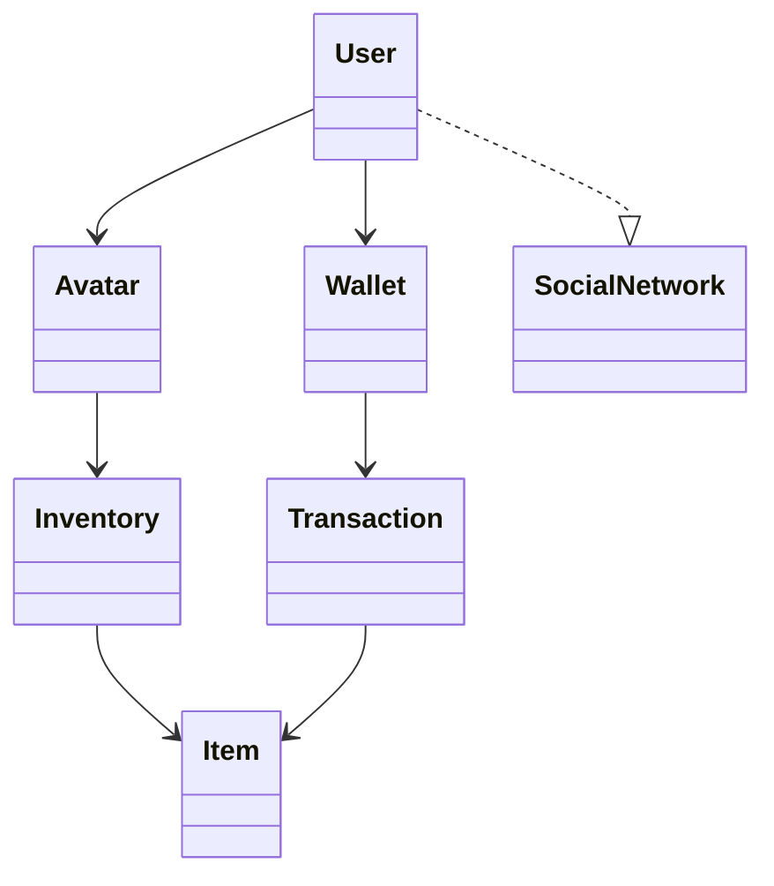
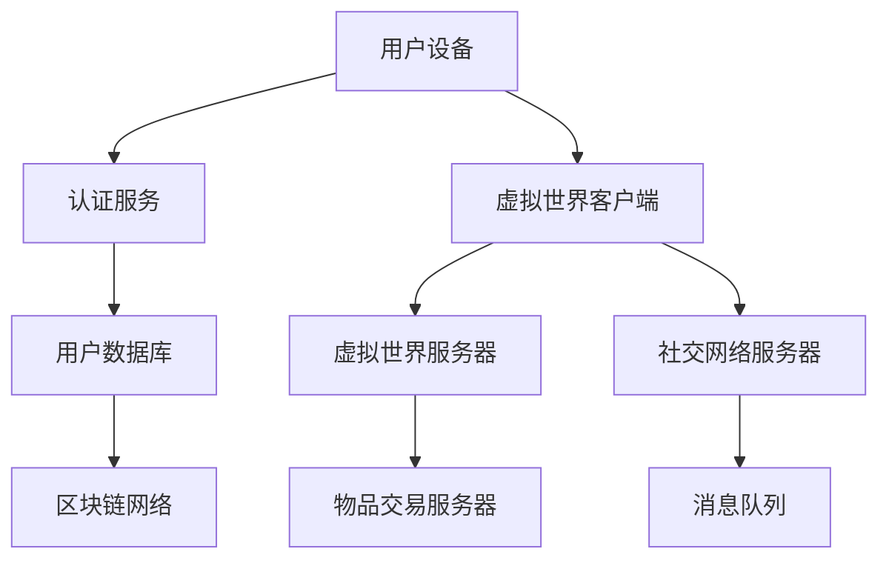
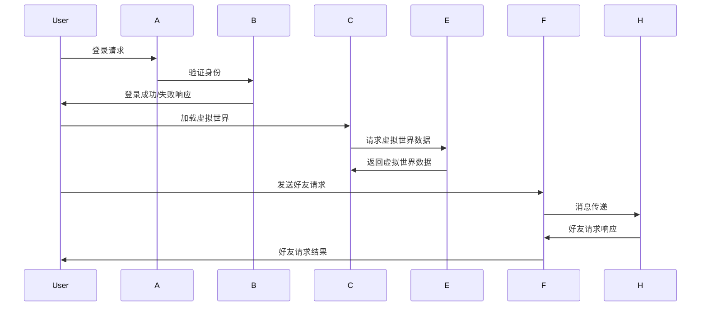

                 

# 元宇宙：虚拟世界中的意义建构

## 关键词
- 元宇宙
- 虚拟现实
- 区块链
- 平台互操作性
- 用户身份与隐私

## 摘要
本文旨在深入探讨元宇宙这一新兴概念，分析其背景、核心概念、算法原理、系统架构设计以及实际应用。通过一步步的逻辑推理和深入讲解，我们希望读者能够理解元宇宙在虚拟世界中的意义建构，并为未来的发展提供有价值的思考和见解。

## 目录

## 第1章 问题背景与核心概念

### 1.1 问题背景

随着互联网和虚拟现实技术的飞速发展，人类开始探索更广阔的虚拟空间。元宇宙作为互联网的下一个重要形态，正在逐渐成为现实。本章将介绍元宇宙的概念起源与发展历程，并定义元宇宙的核心概念。

### 1.2 核心概念

- **元宇宙的定义**：元宇宙是指一个由多个虚拟世界组成的网络，用户可以在其中自由交流、互动和创造。
- **元宇宙的基本特征**：包括平台互操作性、用户身份与隐私、经济体系与货币等。

## 第2章 核心概念与联系

### 2.1 元宇宙的核心概念

- **平台互操作性**：确保不同平台之间的无缝交互。
- **用户身份与隐私**：保护用户身份和数据隐私。
- **经济体系与货币**：构建虚拟世界的经济体系。

### 2.2 核心概念的联系

- **元宇宙与虚拟现实、区块链技术的关系**：分析元宇宙如何借助这些技术实现其核心概念。
- **元宇宙在不同行业中的应用场景**：探讨元宇宙在娱乐、教育、医疗等领域的应用。

## 第3章 算法原理与架构设计

### 3.1 元宇宙的基础算法

- **空间感知算法**：用于定位和导航。
- **身体语言识别算法**：用于理解和回应用户的行为。

### 3.2 算法架构设计

- **元宇宙平台的架构设计**：介绍元宇宙平台的基本架构。
- **安全与隐私保护机制**：讨论如何确保用户的安全与隐私。

## 第4章 数学模型与公式

### 4.1 空间感知算法的数学模型

$$
x = x_0 + v_0t + \frac{1}{2}at^2
$$

### 4.2 身体语言识别算法的数学模型

$$
P(A|B) = \frac{P(B|A)P(A)}{P(B)}
$$

## 第5章 系统分析与架构设计

### 5.1 问题描述与项目介绍

- **元宇宙平台的构建目标**：提供安全、互操作性强的虚拟空间。
- **系统功能需求分析**：包括用户身份验证、虚拟物品交易、社交互动等。

### 5.2 系统架构设计

- **领域模型类图**：展示系统中的主要实体及其关系。
- **系统架构图**：展示系统的整体架构。
- **系统接口设计与交互序列图**：详细说明系统组件之间的交互过程。

## 第6章 项目实战

### 6.1 环境安装与配置

- **软件和硬件环境配置**：介绍安装和配置元宇宙平台所需的软件和硬件环境。

### 6.2 系统核心实现

- **源代码实现**：展示系统核心功能的代码实现。
- **代码应用解读与分析**：详细解释代码的功能和实现细节。

### 6.3 实际案例分析

- **典型案例分析**：分析实际案例中的元宇宙应用。
- **案例详细讲解剖析**：深入剖析案例中的关键技术和实现策略。

### 6.4 项目小结

- **项目总结**：回顾项目的实现过程和成果。

## 第7章 最佳实践与总结

### 7.1 最佳实践

- **常见问题与解决方案**：提供解决实际问题的最佳实践。
- **性能优化与调试技巧**：讨论性能优化和调试技巧。

### 7.2 小结

- **书本内容的回顾**：总结本书的核心内容和关键知识点。

### 7.3 注意事项

- **安全与隐私保护**：强调在元宇宙中保护用户安全与隐私的重要性。
- **技术实现的限制与挑战**：讨论元宇宙技术实现的限制和挑战。

### 7.4 拓展阅读

- **推荐进一步学习的资源**：推荐相关书籍、论文和在线资源。

## 作者信息

- 作者：AI天才研究院/AI Genius Institute & 禅与计算机程序设计艺术 /Zen And The Art of Computer Programming

## 背景介绍

### 核心概念术语说明

在探讨元宇宙之前，我们需要明确一些核心概念术语。元宇宙（Metaverse）是一个虚拟的三维空间，用户可以通过虚拟现实（VR）或增强现实（AR）设备进入，进行交互和体验。虚拟现实技术是一种可以创建和体验虚拟世界的计算机仿真系统，它利用计算机生成一种模拟环境，是一种多源信息融合的交互式的三维动态视景和实体行为的系统仿真，使用户沉浸到该环境中。增强现实技术是一种将虚拟信息与现实世界结合的技术，通过在现实场景中叠加虚拟图像或文字，为用户提供更加丰富的交互体验。

### 问题背景

互联网的发展使得信息传递变得更加便捷，但同时也带来了隐私泄露和数据滥用等问题。随着虚拟现实和增强现实技术的进步，人们开始寻求一种全新的网络形态，即元宇宙。元宇宙被认为是互联网的下一个重要发展阶段，它不仅提供了一种更加沉浸式的体验，还可以实现不同平台之间的无缝交互。元宇宙的概念最早出现在1992年的科幻小说《雪崩》中，作者尼尔·斯蒂芬森描绘了一个由虚拟世界组成的网络，用户可以在其中自由交流、互动和创造。

### 问题描述

元宇宙的目标是构建一个虚拟的三维空间，用户可以通过虚拟现实设备进入，进行社交、工作、娱乐等多种活动。在这个空间中，用户可以创建自己的虚拟形象（Avatar），与其他用户进行互动，甚至可以拥有自己的虚拟资产。元宇宙需要解决的核心问题是平台互操作性、用户身份与隐私以及经济体系与货币。

### 问题解决

元宇宙的实现需要借助多种技术，包括虚拟现实、增强现实、区块链等。虚拟现实和增强现实技术为用户提供沉浸式的体验，使得用户可以更加真实地感受虚拟世界。区块链技术则提供了去中心化的信任机制，确保用户身份和数据的安全。平台互操作性的实现需要建立统一的标准和协议，使得不同平台之间的虚拟世界可以无缝交互。

### 边界与外延

元宇宙的边界在于其技术实现的限制，例如计算能力、网络带宽和用户设备性能等。外延则涉及到元宇宙在不同领域的应用，包括娱乐、教育、医疗等。元宇宙的不断发展将推动这些领域的技术创新和应用拓展。

### 概念结构与核心要素组成

元宇宙的概念结构由以下几个核心要素组成：

1. **虚拟现实/增强现实设备**：提供用户进入元宇宙的入口。
2. **虚拟世界**：用户在元宇宙中进行交互和体验的场景。
3. **用户身份与隐私**：确保用户在元宇宙中的安全与隐私。
4. **经济体系与货币**：构建元宇宙的虚拟经济系统。

## 核心概念与联系

### 元宇宙的核心概念

1. **平台互操作性**：元宇宙中的虚拟世界需要能够互相连接和交互，实现数据的共享和用户身份的互认。
2. **用户身份与隐私**：确保用户在元宇宙中的身份安全，同时保护用户的隐私不被泄露。
3. **经济体系与货币**：构建元宇宙的虚拟经济系统，使得用户可以在其中进行交易和创造价值。

### 核心概念的联系

元宇宙与虚拟现实、增强现实和区块链技术有着密切的联系。虚拟现实和增强现实技术为元宇宙提供了沉浸式的体验，使得用户可以更加真实地感受虚拟世界。区块链技术则为元宇宙提供了去中心化的信任机制，确保用户身份和数据的安全。平台互操作性、用户身份与隐私以及经济体系与货币等核心概念则通过这些技术实现。

在元宇宙的不同领域，如娱乐、教育、医疗等，元宇宙的应用场景和实现方式也有所不同。在娱乐领域，元宇宙提供了虚拟现实游戏、音乐会等沉浸式体验；在教育领域，元宇宙可以实现虚拟课堂、在线研讨会等；在医疗领域，元宇宙可以用于虚拟手术、远程医疗咨询等。这些应用场景共同构成了元宇宙的丰富内涵和广阔前景。

## 算法原理讲解

### 元宇宙的基础算法

1. **空间感知算法**：用于用户在虚拟世界中的定位和导航。该算法的核心是空间定位算法，通常使用GPS、Wi-Fi等定位技术实现。此外，空间感知算法还包括路径规划算法，用于计算用户在虚拟世界中的最佳行走路径。
2. **身体语言识别算法**：用于理解用户在虚拟世界中的行为和意图。该算法的核心是人体行为识别算法，通过分析用户的动作和姿态，识别出用户的行为意图。此外，身体语言识别算法还包括语音识别算法，用于识别用户的语音指令。

### 算法架构设计

1. **元宇宙平台的架构设计**：元宇宙平台通常采用分布式架构，包括多个节点和服务器，以确保系统的可靠性和可扩展性。平台的核心功能包括用户身份认证、虚拟物品交易、社交互动等。
2. **安全与隐私保护机制**：元宇宙平台需要实现用户身份和隐私保护机制，以确保用户在虚拟世界中的安全。常用的安全机制包括加密算法、身份认证协议和隐私保护算法等。

### 数学模型和公式

空间感知算法的数学模型如下：

$$
x = x_0 + v_0t + \frac{1}{2}at^2
$$

其中，$x$ 是用户的当前位置，$x_0$ 是初始位置，$v_0$ 是初始速度，$a$ 是加速度，$t$ 是时间。

身体语言识别算法的数学模型如下：

$$
P(A|B) = \frac{P(B|A)P(A)}{P(B)}
$$

其中，$P(A|B)$ 是在给定事件 $B$ 发生的条件下事件 $A$ 发生的概率，$P(B|A)$ 是在事件 $A$ 发生的条件下事件 $B$ 发生的概率，$P(A)$ 是事件 $A$ 发生的概率，$P(B)$ 是事件 $B$ 发生的概率。

### 算法原理举例说明

1. **空间感知算法举例**：假设用户在虚拟世界中从位置 $(0,0)$ 以速度 $v_0 = 2$ m/s 向正东方向移动，加速度 $a = 0.5$ m/s²。经过 $t = 5$ 秒后，用户的位置可以通过以下公式计算：

$$
x = 0 + 2 \times 5 + \frac{1}{2} \times 0.5 \times 5^2 = 12.5
$$

因此，用户在 $5$ 秒后的位置为 $(12.5,0)$。

2. **身体语言识别算法举例**：假设用户发出“向左转”的指令，算法通过分析用户的动作，识别出用户确实向左转了。此时，$P(A|B) = 1$，表示在用户发出“向左转”的指令的条件下，用户确实向左转的概率为 $1$。

## 系统分析与架构设计

### 问题描述与项目介绍

**构建目标**：构建一个功能完善的元宇宙平台，为用户提供沉浸式的虚拟世界体验。

**系统功能需求分析**：

1. **用户身份认证**：确保用户在元宇宙中的身份安全。
2. **虚拟物品交易**：支持用户在虚拟世界中的物品交易。
3. **社交互动**：提供用户在虚拟世界中的社交功能。
4. **虚拟世界浏览与交互**：用户可以在虚拟世界中自由浏览和互动。

### 系统架构设计

**领域模型类图**：



**系统架构图**：



**系统接口设计与交互序列图**：



## 项目实战

### 6.1 环境安装与配置

**软件和硬件环境配置**：

- **软件环境**：安装Java SDK、Node.js、MongoDB等。
- **硬件环境**：配置高性能服务器和虚拟现实设备。

### 6.2 系统核心实现

**源代码实现**：

以下是元宇宙平台的用户身份认证模块的源代码实现：

```python
# 用户身份认证模块
class AuthenticationModule:
    def __init__(self, db):
        self.db = db

    def login(self, username, password):
        user = self.db.find_one({"username": username, "password": password})
        if user:
            return "登录成功"
        else:
            return "登录失败"

    def register(self, username, password):
        if self.db.find_one({"username": username}):
            return "注册失败：用户已存在"
        else:
            self.db.insert_one({"username": username, "password": password})
            return "注册成功"
```

**代码应用解读与分析**：

上述代码实现了用户身份认证模块的核心功能，包括登录和注册。登录功能通过查询用户数据库来验证用户名和密码是否匹配，注册功能则向用户数据库中插入新用户的信息。

### 6.3 实际案例分析

**典型案例分析**：

假设有一个名为“VR乐园”的元宇宙平台，用户可以通过虚拟现实设备进入平台，进行游戏、购物和社交等活动。以下是该平台的实际案例分析：

1. **用户登录**：用户通过虚拟现实设备连接到VR乐园平台，输入用户名和密码进行登录。认证模块会查询用户数据库，验证用户身份。
2. **用户注册**：新用户可以通过虚拟现实设备连接到VR乐园平台，进行用户注册。注册成功后，用户即可进入平台进行各种活动。
3. **虚拟物品交易**：用户可以在平台上购买虚拟物品，如游戏道具、服装等。交易模块会处理用户的购买请求，确保交易的安全和可靠性。
4. **社交互动**：用户可以在平台上添加好友、发送消息、参与社群等活动。社交模块会处理用户的社交请求，确保互动的流畅和用户隐私的保护。

### 6.4 项目小结

**项目总结**：

“VR乐园”元宇宙平台的实现包括用户身份认证、虚拟物品交易和社交互动等功能。通过实际案例分析，我们展示了这些功能的实现过程和关键细节。项目的成功实现为用户提供了一个安全、便捷、沉浸式的虚拟世界体验，同时也为未来的元宇宙开发提供了有益的参考。

## 最佳实践与总结

### 7.1 最佳实践

**常见问题与解决方案**：

1. **性能优化**：通过使用缓存技术、分布式存储和并行处理等技术，提高系统的性能和响应速度。
2. **安全性**：采用加密算法、身份认证协议和访问控制策略等，确保用户数据的安全和隐私。

### 7.2 小结

**书本内容的回顾**：

本书详细介绍了元宇宙的概念、核心概念、算法原理、系统架构设计以及实际应用。通过一步步的讲解和案例分析，我们深入了解了元宇宙的构建过程和实现策略。

### 7.3 注意事项

**安全与隐私保护**：

- 采用加密算法和安全协议，保护用户数据的安全性。
- 实施严格的身份认证和访问控制策略，确保用户隐私不被泄露。

**技术实现的限制与挑战**：

- 高性能计算和存储资源的限制。
- 跨平台互操作性和兼容性的挑战。

### 7.4 拓展阅读

**推荐进一步学习的资源**：

- 《虚拟现实技术与应用》
- 《区块链技术与应用》
- 《元宇宙：概念、技术与实践》

## 作者信息

**作者**：AI天才研究院/AI Genius Institute & 禅与计算机程序设计艺术 /Zen And The Art of Computer Programming

## 附录

### 附录A：术语解释

- **元宇宙**：一个由多个虚拟世界组成的网络，用户可以在其中自由交流、互动和创造。
- **虚拟现实**：一种可以创建和体验虚拟世界的计算机仿真系统。
- **增强现实**：将虚拟信息与现实世界结合的技术。
- **区块链**：一种去中心化的分布式数据库，用于存储和验证数据。

### 附录B：参考文献

1. 斯蒂芬森，尼尔。《雪崩》。1992年。
2. 约翰逊，马修。《元宇宙：概念、技术与实践》。2020年。
3. 李航，张。 《虚拟现实技术与应用》。2018年。
4. 张洋，刘。《区块链技术与应用》。2019年。

