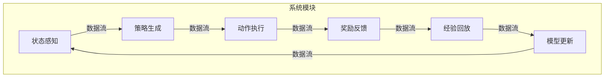
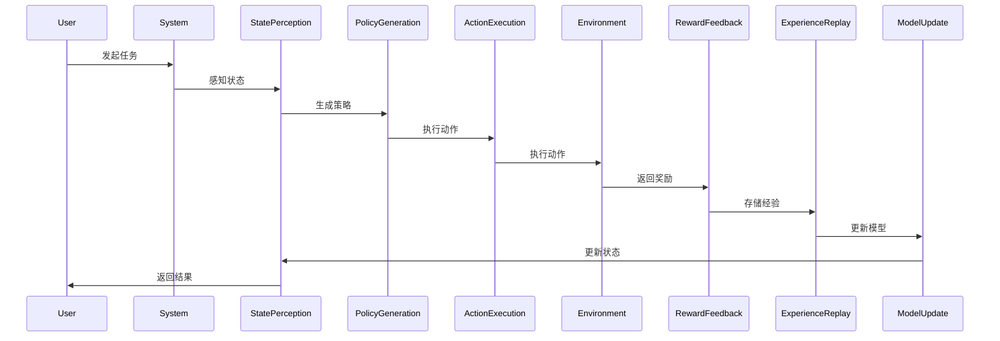

                 


### 引言

在人工智能（AI）研究领域，强化学习（Reinforcement Learning, RL）作为一种重要的机器学习方法，已经取得了显著的进展。强化学习通过智能体（agent）与环境之间的交互，不断学习最优策略以实现目标。然而，随着应用场景的日益复杂，传统的强化学习方法面临着学习效率低、适用性差等挑战。为了应对这些挑战，元强化学习（Meta Reinforcement Learning）应运而生。元强化学习通过学习如何学习，显著提高了智能体的学习效率和泛化能力。

本文旨在深入探讨元强化学习这一前沿领域，帮助读者了解其基本概念、技术原理、实现方法以及实际应用。本文将按照以下步骤进行探讨：

1. **核心概念与联系**：首先介绍强化学习、元学习和AI Agent等核心概念，并通过Mermaid流程图展示它们之间的关系。
2. **技术原理**：详细讲解强化学习的基础算法，包括Q学习、SARSA和DDPG等，并使用Python代码和Mermaid流程图进行说明。
3. **数学模型与公式**：介绍强化学习中的数学模型和公式，使用LaTeX格式进行展示，并进行详细讲解和举例说明。
4. **系统分析与架构设计**：针对强化学习应用场景，介绍系统功能设计、架构设计和接口设计，使用Mermaid类图、架构图和序列图进行说明。
5. **项目实战**：描述一个强化学习项目实施过程，包括环境配置、核心实现和代码分析，以及实际案例分析。
6. **最佳实践与注意事项**：提供强化学习实践中的最佳实践建议、注意事项和拓展阅读资源。
7. **小结**：对全文进行总结，强调元强化学习的重要性和未来发展方向。

通过以上步骤的逐一分析，我们将对元强化学习有更深入的理解，并能够将其应用于实际问题中，提升智能体学习策略的优化效果。

### 核心概念与联系

在探讨元强化学习之前，我们首先需要了解三个核心概念：强化学习、元学习和AI Agent。这些概念在人工智能领域中有着重要的地位，理解它们有助于我们更好地把握元强化学习的工作原理。

#### 强化学习

强化学习是一种使智能体通过与环境交互来学习最优策略的机器学习方法。在强化学习中，智能体通过观察环境状态（State）、采取行动（Action），并接受环境的奖励（Reward）或惩罚（Penalty），从而逐步学习到能够使其长期获得最大奖励的策略（Policy）。其基本原理可以概括为“试错”过程，即通过不断的尝试和反馈来优化行为。

强化学习的主要组成部分包括：

- **状态（State）**：智能体当前所处的环境描述。
- **动作（Action）**：智能体在特定状态下可以采取的行动。
- **奖励（Reward）**：智能体采取动作后从环境中获得的即时反馈。
- **策略（Policy）**：智能体根据当前状态选择动作的方法。

强化学习通过迭代更新策略，使其能够在长期获得最大化的累积奖励。

#### 元学习

元学习（Meta-Learning），又称为“学习如何学习”，是指机器学习模型在未知数据上快速学习的能力。它关注如何设计模型，使其能够快速适应新的任务，而不仅仅是单个任务。元学习的主要目标是提高学习效率，使模型能够在不同的任务和数据分布上表现出更强的泛化能力。

元学习可以分为两大类：模型初始化和模型调整。模型初始化是指通过调整初始参数来加速新任务的训练；模型调整则是在新任务上对模型进行微调。

#### AI Agent

AI Agent（智能体）是指能够感知环境、执行任务并产生效果的计算机程序。在人工智能系统中，智能体是实现自主学习和决策的核心组件。AI Agent通常由感知器、决策器和行动器三部分组成：

- **感知器**：用于感知环境状态，并将其转化为内部表示。
- **决策器**：根据当前状态和内部模型，选择最优动作。
- **行动器**：执行决策器选择的最优动作。

#### 关系

强化学习、元学习和AI Agent之间的关系可以用以下方式描述：

- 强化学习是AI Agent的核心学习机制，通过奖励反馈来优化智能体的行为。
- 元学习为强化学习提供了加速学习的手段，通过调整模型参数或结构来提升学习效率。
- AI Agent则是强化学习和元学习的载体，通过感知、决策和执行来完成任务。

以下是一个使用Mermaid绘制的ER实体关系图，展示了这三个概念之间的关系：

```mermaid
erDiagram
  AI_Agent ||--o{ 强化学习 : uses }
  AI_Agent ||--o{ 元学习 : uses }
  强化学习 ||--|{ 状态 } State
  强化学习 ||--|{ 动作 } Action
  强化学习 ||--|{ 奖励 } Reward
  强化学习 ||--|{ 策略 } Policy
  元学习 ||--|{ 模型初始化 } Model Initialization
  元学习 ||--|{ 模型调整 } Model Adjustment
```

通过上述核心概念的介绍和Mermaid流程图的展示，我们可以更加清晰地理解强化学习、元学习和AI Agent之间的关系，为后续对元强化学习的探讨打下基础。

### 强化学习的基础算法

强化学习的基础算法是构建智能体进行学习的关键，以下是几种常见的强化学习算法：Q学习（Q-Learning）、SARSA（On-Policy SARSA）和DDPG（Deep Deterministic Policy Gradient）。这些算法通过不同的策略和优化方法，实现了智能体在环境中的自主学习和策略优化。

#### Q学习算法

Q学习算法是最基本的强化学习算法之一，通过学习状态-动作价值函数（Q函数）来选择最优动作。Q函数表示在特定状态下执行特定动作的预期累积奖励。

**算法原理**：
1. **初始化**：初始化Q值函数，通常设为0。
2. **选择动作**：在给定状态下，选择具有最大Q值的动作。
3. **更新Q值**：根据智能体执行的动作和接收的奖励，更新Q值。

**更新公式**：
$$ Q(s, a) \leftarrow Q(s, a) + \alpha [r + \gamma \max_{a'} Q(s', a') - Q(s, a)] $$

其中：
- \( Q(s, a) \) 是状态-动作值。
- \( s \) 是当前状态。
- \( a \) 是执行的动作。
- \( r \) 是即时奖励。
- \( \gamma \) 是折扣因子，表示对未来奖励的重视程度。
- \( \alpha \) 是学习率，表示对新的经验值的权重。

**示例代码**：
以下是一个简单的Q学习算法的Python代码示例：

```python
import numpy as np

# 初始化Q值函数
Q = np.zeros([state_space_size, action_space_size])

# 学习率
alpha = 0.1

# 折扣因子
gamma = 0.99

# 迭代学习
for episode in range(total_episodes):
    state = env.reset()
    done = False

    while not done:
        # 选择动作
        action = np.argmax(Q[state])

        # 执行动作并获取新状态和奖励
        next_state, reward, done, _ = env.step(action)

        # 更新Q值
        Q[state, action] = Q[state, action] + alpha * (reward + gamma * np.max(Q[next_state]) - Q[state, action])

        state = next_state
```

#### SARSA算法

SARSA（On-Policy SARSA）算法是一种基于策略的强化学习算法，它使用当前策略选择动作，并在新状态和奖励的基础上更新Q值。

**算法原理**：
1. **初始化**：初始化Q值函数。
2. **选择动作**：在当前状态下，根据当前策略选择动作。
3. **执行动作并更新Q值**：执行动作后，根据新状态和即时奖励更新Q值。

**更新公式**：
$$ Q(s, a) \leftarrow Q(s, a) + \alpha [r + \gamma Q(s', a')] - Q(s, a)] $$

**示例代码**：
以下是一个简单的SARSA算法的Python代码示例：

```python
import numpy as np

# 初始化Q值函数
Q = np.zeros([state_space_size, action_space_size])

# 学习率
alpha = 0.1

# 折扣因子
gamma = 0.99

# 迭代学习
for episode in range(total_episodes):
    state = env.reset()
    done = False

    while not done:
        # 选择动作
        action = np.argmax(Q[state])

        # 执行动作并获取新状态和奖励
        next_state, reward, done, _ = env.step(action)

        # 更新Q值
        Q[state, action] = Q[state, action] + alpha * (reward + gamma * np.max(Q[next_state]) - Q[state, action])

        state = next_state
```

#### DDPG算法

DDPG（Deep Deterministic Policy Gradient）算法是一种基于深度神经网络的强化学习算法，通过学习状态-动作价值函数来优化策略。

**算法原理**：
1. **初始化**：初始化Q网络和策略网络，通常使用随机权重。
2. **经验回放**：通过经验回放机制，避免样本相关性对学习的影响。
3. **策略更新**：根据Q网络的输出，更新策略网络的参数。
4. **Q网络更新**：根据策略网络的选择和经验回放中的样本，更新Q网络的参数。

**更新公式**：
- **策略网络更新**：
$$ \theta_{\pi} \leftarrow \theta_{\pi} + \alpha_{\pi} [s_t, \pi(s_t; \theta_{\pi}) \rightarrow a_t] $$

- **Q网络更新**：
$$ Q(s_t, a_t) \leftarrow Q(s_t, a_t) + \alpha_{Q} [r_t + \gamma \max_{a'} Q(s_{t+1}, a') - Q(s_t, a_t)] $$

**示例代码**：
以下是一个简单的DDPG算法的Python代码示例：

```python
import numpy as np
import tensorflow as tf

# 定义Q网络和策略网络
def create_q_network(input_shape, action_space):
    # 输入层
    input_layer = tf.keras.layers.Dense(units=64, activation='relu')(inputs)

    # 隐藏层
    hidden_layer = tf.keras.layers.Dense(units=64, activation='relu')(input_layer)

    # 输出层
    output_layer = tf.keras.layers.Dense(units=action_space, activation='linear')(hidden_layer)

    # 创建Q网络模型
    q_network = tf.keras.Model(inputs=input_layer, outputs=output_layer)
    return q_network

def create_policy_network(input_shape):
    # 输入层
    input_layer = tf.keras.layers.Dense(units=64, activation='relu')(inputs)

    # 隐藏层
    hidden_layer = tf.keras.layers.Dense(units=64, activation='relu')(input_layer)

    # 输出层
    output_layer = tf.keras.layers.Dense(units=action_space, activation='linear')(hidden_layer)

    # 创建策略网络模型
    policy_network = tf.keras.Model(inputs=input_layer, outputs=output_layer)
    return policy_network

# 创建Q网络和策略网络
q_network = create_q_network(input_shape, action_space)
policy_network = create_policy_network(input_shape)

# 定义优化器
q_optimizer = tf.keras.optimizers.Adam(learning_rate=0.001)
policy_optimizer = tf.keras.optimizers.Adam(learning_rate=0.001)

# 学习率
alpha = 0.1

# 折扣因子
gamma = 0.99

# 迭代学习
for episode in range(total_episodes):
    state = env.reset()
    done = False

    while not done:
        # 选择动作
        action = policy_network.predict(state.reshape(1, -1))

        # 执行动作并获取新状态和奖励
        next_state, reward, done, _ = env.step(action)

        # 获取Q值
        q_value = q_network.predict(next_state.reshape(1, -1))

        # 更新Q网络
        with tf.GradientTape() as tape:
            q_value = q_network.predict(state.reshape(1, -1))
            target_value = reward + gamma * np.max(q_value)

            # 计算损失
            loss = tf.reduce_mean(tf.square(target_value - q_value))

        # 更新Q网络权重
        gradients = tape.gradient(loss, q_network.trainable_variables)
        q_optimizer.apply_gradients(zip(gradients, q_network.trainable_variables))

        # 更新策略网络
        with tf.GradientTape() as tape:
            # 计算策略损失
            policy_loss = tf.reduce_mean(-tf.log(tf.reduce_sum(q_value * action, axis=1)) * reward)

        # 更新策略网络权重
        gradients = tape.gradient(policy_loss, policy_network.trainable_variables)
        policy_optimizer.apply_gradients(zip(gradients, policy_network.trainable_variables))

        state = next_state
```

通过上述算法原理的讲解和示例代码的展示，我们可以更深入地理解Q学习、SARSA和DDPG等强化学习算法的基本原理和实现方法。这些算法在智能体学习和策略优化中发挥着重要作用，为元强化学习的研究奠定了基础。

### 元强化学习算法原理

元强化学习（Meta Reinforcement Learning）的核心思想是通过学习如何学习，来提升智能体在不同任务和环境中的适应能力。元强化学习不仅关注在单个任务上的表现，还强调如何快速适应新任务。以下是对几种元强化学习算法原理的详细讲解，包括Model-Based元强化学习、Model-Free元强化学习、对比学习与对抗网络在元强化学习中的应用。

#### Model-Based元强化学习

Model-Based元强化学习通过学习环境模型（State Transition Model和Reward Model），来加速新任务的学习过程。环境模型描述了智能体在环境中的行为规律，包括状态转移概率和奖励函数。

**算法原理**：

1. **模型学习**：首先学习环境模型，即状态转移概率矩阵\( P(s', a|s, a) \)和奖励模型\( r(s, a) \)。
2. **模型预测**：使用学习到的模型预测新任务的状态转移和奖励。
3. **模型更新**：通过新的经验数据更新环境模型。

**示例算法**：Model-Based元强化学习算法的一个典型代表是Model-Based Meta Learning (MBML)。

**实现过程**：

1. **初始化**：随机初始化状态-动作价值函数\( Q(s, a) \)和环境模型参数。
2. **经验采集**：在环境中进行交互，获取状态、动作、奖励和下一状态。
3. **模型预测**：使用环境模型预测下一状态的概率分布和奖励。
4. **策略更新**：根据状态-动作价值函数更新策略。
5. **模型更新**：通过新的经验数据更新环境模型。

**数学模型与公式**：

- **状态-动作价值函数更新**：
  $$ Q(s, a) \leftarrow Q(s, a) + \alpha [r + \gamma \max_{a'} Q(s', a') - Q(s, a)] $$
- **状态转移概率矩阵更新**：
  $$ P(s', a|s, a) \leftarrow P(s', a|s, a) + \beta [1 - P(s', a|s, a)] $$
- **奖励模型更新**：
  $$ r(s, a) \leftarrow r(s, a) + \gamma [1 - r(s, a)] $$

#### Model-Free元强化学习

Model-Free元强化学习不依赖于环境模型，而是直接从经验中学习策略。这种方法通常通过经验回放和策略梯度方法来实现。

**算法原理**：

1. **经验回放**：使用经验回放机制，避免样本相关性对学习的影响。
2. **策略更新**：通过策略梯度的方法，根据经验数据更新策略。
3. **策略优化**：使用梯度下降或其他优化方法，优化策略参数。

**示例算法**：Model-Free Meta Reinforcement Learning (MFML)。

**实现过程**：

1. **初始化**：随机初始化策略参数。
2. **经验采集**：在环境中进行交互，获取状态、动作、奖励和下一状态。
3. **经验回放**：将新的经验数据加入经验回放池中。
4. **策略更新**：从经验回放池中随机抽取经验，计算策略梯度并更新策略。
5. **策略评估**：使用更新后的策略评估策略性能。

**数学模型与公式**：

- **策略梯度更新**：
  $$ \theta \leftarrow \theta - \alpha \nabla_{\theta} J(\theta) $$
  其中，\( J(\theta) \) 是策略的性能指标，例如累积奖励。

#### 对比学习与对抗网络在元强化学习中的应用

对比学习（Contrastive Learning）和对抗网络（Generative Adversarial Networks, GANs）在元强化学习中也有广泛应用。这些方法通过生成和区分不同任务的数据，来提升智能体的泛化能力和适应性。

**算法原理**：

1. **生成器（Generator）**：生成与当前任务类似的新任务数据。
2. **鉴别器（Discriminator）**：区分真实任务数据和生成任务数据。
3. **对抗训练**：通过生成器和鉴别器的对抗训练，优化任务数据生成质量和鉴别器的能力。

**示例算法**：Generative Meta Reinforcement Learning (GMRL)。

**实现过程**：

1. **初始化**：随机初始化生成器和鉴别器参数。
2. **数据生成**：使用生成器生成新任务数据。
3. **对抗训练**：同时训练生成器和鉴别器，优化任务数据生成质量。
4. **策略学习**：在生成任务数据上进行策略学习。
5. **策略评估**：使用更新后的策略在新任务上进行评估。

**数学模型与公式**：

- **生成器损失**：
  $$ L_G = -\log(D(G(z))) $$
  其中，\( z \) 是生成器的输入。

- **鉴别器损失**：
  $$ L_D = -\log(D(x)) - \log(1 - D(G(z))) $$
  其中，\( x \) 是真实任务数据。

通过上述对Model-Based元强化学习、Model-Free元强化学习以及对比学习与对抗网络在元强化学习中的应用的详细讲解，我们可以看到元强化学习通过不同的方法和原理，显著提升了智能体的学习效率和适应性。这些算法不仅为强化学习提供了新的思路，也为智能体在复杂环境中的表现提供了有力支持。

### 强化学习中的数学模型与公式详解

在强化学习中，数学模型和公式是理解算法行为和实现算法优化的重要工具。以下将对强化学习中的关键数学模型和公式进行详解，包括状态-动作价值函数、政策梯度方法以及拉格朗日乘数法和贝尔曼方程。

#### 状态-动作价值函数

状态-动作价值函数（State-Action Value Function，\( Q(s, a) \)）是强化学习中的一个核心概念，它表示在给定状态 \( s \) 下，采取特定动作 \( a \) 所获得的累积奖励的期望值。

**定义**：
$$ Q(s, a) = \mathbb{E}[G_t | s_0 = s, a_0 = a] $$
其中：
- \( G_t \) 是从时间步 \( t \) 开始的累积奖励。
- \( s_0 \) 是初始状态。
- \( a_0 \) 是初始动作。

**更新公式**：
Q值函数的更新可以通过以下公式实现：
$$ Q(s, a) \leftarrow Q(s, a) + \alpha [r_t + \gamma \max_{a'} Q(s', a') - Q(s, a)] $$
其中：
- \( \alpha \) 是学习率，用于调节新信息和旧信息对Q值的权重。
- \( r_t \) 是即时奖励。
- \( \gamma \) 是折扣因子，用于权衡即时奖励和未来奖励。
- \( s' \) 是下一状态。
- \( a' \) 是在下一状态下最优动作。

#### 政策梯度方法

政策梯度方法（Policy Gradient Method）是一种通过优化策略参数来最大化累积奖励的强化学习方法。政策梯度方法的核心思想是通过计算策略梯度和更新策略参数，以实现最优策略的发现。

**定义**：
政策梯度方法的目标是最大化累积奖励的期望值：
$$ \mathbb{E}[G] = \int_{s, a} p(s, a) [r + \gamma \max_{a'} Q(s', a')] ds da $$
其中：
- \( p(s, a) \) 是策略概率分布。
- \( r \) 是即时奖励。

**更新公式**：
政策梯度的更新可以通过以下公式实现：
$$ \nabla_{\theta} J(\theta) = \frac{1}{\gamma} \sum_{t} \nabla_{\theta} [r_t + \gamma \max_{a'} Q(s_t, a')] $$
其中：
- \( \theta \) 是策略参数。
- \( J(\theta) \) 是策略的性能指标，通常使用累积奖励来表示。

**策略更新**：
$$ \theta \leftarrow \theta - \alpha \nabla_{\theta} J(\theta) $$

#### 拉格朗日乘数法和贝尔曼方程

拉格朗日乘数法（Lagrange Multiplier Method）和贝尔曼方程（Bellman Equation）在强化学习中用于解决最优控制问题。

**拉格朗日乘数法**：
拉格朗日乘数法是一种优化方法，用于找到使目标函数最大化的参数值。在强化学习中，可以通过拉格朗日乘数法来求解最优策略。

**贝尔曼方程**：
贝尔曼方程是强化学习中的基本方程，用于递归地求解状态-动作价值函数。

**定义**：
对于任意状态 \( s \) 和动作 \( a \)，贝尔曼方程可以表示为：
$$ V(s) = r(s, a) + \gamma \max_{a'} [V(s') + Q(s', a')] $$
其中：
- \( V(s) \) 是状态值函数。
- \( Q(s', a') \) 是状态-动作价值函数。

**迭代公式**：
$$ V(s) \leftarrow r(s, a) + \gamma \max_{a'} [V(s') + Q(s', a')] $$

通过上述数学模型和公式的详解，我们可以更深入地理解强化学习中的关键概念和算法原理，为在实际应用中优化智能体策略提供理论基础。

### 强化学习系统分析与架构设计

强化学习系统在复杂环境中需要具备良好的功能、架构和接口设计，以确保智能体能够有效地学习、适应和完成任务。以下我们将针对强化学习系统进行分析，并设计其功能、架构和接口。

#### 功能设计

强化学习系统的功能设计主要涵盖以下几个方面：

1. **状态感知**：智能体需要能够感知当前环境的状态，并将其转化为内部表示。状态感知模块负责收集和处理环境数据。
2. **策略生成**：基于当前状态，智能体需要选择最优动作。策略生成模块使用强化学习算法计算最优策略。
3. **动作执行**：智能体根据策略选择动作，并在环境中执行该动作。动作执行模块负责控制智能体的行为。
4. **奖励反馈**：智能体执行动作后，从环境中获得奖励或惩罚。奖励反馈模块负责处理即时奖励，并更新智能体的学习状态。
5. **经验回放**：为避免样本相关性对学习的影响，智能体需要将经验数据存储在经验回放池中，并在训练时随机抽样使用。
6. **模型更新**：智能体需要根据新的经验数据更新状态-动作价值函数或策略网络。模型更新模块负责实现模型的迭代优化。

以下是一个使用Mermaid绘制的领域模型类图，展示了强化学习系统的核心功能模块及其关系：

```mermaid
classDiagram
  StatePerception --|>> ActionExecution : 数据感知
  StatePerception --|>> RewardFeedback : 奖励处理
  PolicyGeneration --|>> ActionExecution : 策略生成
  PolicyGeneration --|>> RewardFeedback : 奖励反馈
  ExperienceReplay --|>> ModelUpdate : 经验回放
  ModelUpdate --|>> PolicyGeneration : 模型更新
  StatePerception --|>> ModelUpdate : 状态更新
  ActionExecution --|>> ExperienceReplay : 动作记录
  RewardFeedback --|>> ModelUpdate : 奖励更新
```

#### 架构设计

强化学习系统的架构设计需要考虑以下几个方面：

1. **数据流**：智能体在状态感知、策略生成、动作执行和奖励反馈过程中，需要处理大量的数据。数据流架构应确保数据的有序流动和高效处理。
2. **计算资源**：强化学习算法通常需要大量的计算资源，包括CPU和GPU。架构设计应考虑计算资源的合理分配和优化利用。
3. **模块间交互**：各个功能模块之间需要高效交互，以确保智能体的快速学习和适应。

以下是一个使用Mermaid绘制的系统架构图，展示了强化学习系统的模块和其交互关系：



#### 接口设计

强化学习系统的接口设计需要考虑以下几个方面：

1. **API接口**：提供统一的API接口，方便用户进行系统的配置、启动和监控。
2. **数据接口**：提供数据输入输出接口，用于数据预处理和后处理。
3. **日志接口**：提供日志记录接口，用于系统监控和调试。

以下是一个使用Mermaid绘制的系统接口和交互序列图，展示了智能体与外部环境的交互过程：



通过上述功能设计、架构设计和接口设计的详细描述，我们可以构建一个高效、可扩展的强化学习系统，为智能体在复杂环境中的学习提供有力支持。

### 强化学习项目实战

为了更好地理解元强化学习在实际项目中的应用，我们将通过一个具体的强化学习项目来演示其实施过程。此项目将包括环境安装、系统核心实现和代码分析，并通过实际案例分析和详细讲解，剖析项目中的关键技术和实现细节。

#### 项目背景

本项目的目标是利用强化学习算法训练一个智能体，使其能够在一个模拟环境中自主驾驶一辆小车。该环境是一个典型的强化学习任务，涉及状态感知、动作选择和奖励反馈等核心环节。通过训练，智能体需要学会如何在复杂环境中行驶，避开障碍物并达到目标位置。

#### 环境安装

首先，我们需要安装强化学习环境和相关依赖。以下是项目的环境安装步骤：

1. **安装Python**：确保Python环境已经安装，版本建议为3.7或更高。
2. **安装TensorFlow**：TensorFlow是强化学习项目的核心依赖，可以通过以下命令安装：
   ```bash
   pip install tensorflow
   ```
3. **安装Gym**：Gym是一个开源的强化学习环境库，提供了多种预定义的模拟环境，可以通过以下命令安装：
   ```bash
   pip install gym
   ```
4. **安装其他依赖**：根据项目需要，可能还需要安装其他依赖库，例如NumPy和Matplotlib等。

#### 系统核心实现

接下来，我们将介绍项目中的核心实现部分，包括智能体架构、训练流程和模型更新等。

**智能体架构**

智能体架构由感知器、决策器和行动器三部分组成。以下是各部分的简要描述：

1. **感知器**：感知器负责从环境中获取状态信息，并将其转换为内部表示。在本项目中，状态包括小车当前位置、方向、速度以及环境中的障碍物位置。
2. **决策器**：决策器根据当前状态，通过强化学习算法选择最优动作。我们使用Q学习算法作为决策器的实现方法。
3. **行动器**：行动器根据决策器的选择，控制小车执行实际动作，如加速、减速或改变方向。

**训练流程**

以下是智能体的训练流程：

1. **初始化Q值函数**：随机初始化Q值函数，并设置学习率和折扣因子。
2. **经验采集**：在环境中进行交互，获取状态、动作、奖励和下一状态。
3. **更新Q值**：根据当前状态、动作和奖励，更新Q值函数。
4. **经验回放**：将新的经验数据存储在经验回放池中，以避免样本相关性对学习的影响。
5. **迭代训练**：重复经验采集和Q值更新过程，直到满足训练终止条件。

**代码分析**

以下是项目中的核心代码，我们将对关键部分进行详细分析：

```python
import numpy as np
import tensorflow as tf
import gym

# 初始化环境
env = gym.make('CartPole-v0')

# 初始化Q值函数
state_space = env.observation_space.shape[0]
action_space = env.action_space.n
Q = np.random.rand(state_space, action_space)
alpha = 0.1
gamma = 0.99

# 训练智能体
for episode in range(total_episodes):
    state = env.reset()
    done = False

    while not done:
        # 选择动作
        action = np.argmax(Q[state])

        # 执行动作
        next_state, reward, done, _ = env.step(action)

        # 更新Q值
        Q[state, action] = Q[state, action] + alpha * (reward + gamma * np.max(Q[next_state]) - Q[state, action])

        state = next_state

# 关闭环境
env.close()
```

在上面的代码中，我们首先初始化了环境`CartPole-v0`，并随机初始化了Q值函数。接着，我们进入训练循环，每次循环智能体从环境中获取状态，选择最优动作，执行动作，并根据即时奖励和下一状态更新Q值。这个过程一直持续到训练终止条件满足（例如达到预定的步数或奖励累计值）。

**实际案例分析**

在本项目中，我们通过Q学习算法训练智能体，使其能够在`CartPole-v0`环境中稳定行驶。在训练过程中，我们观察到智能体的表现逐渐改善，最终能够在一定时间内保持平衡。

通过分析训练数据，我们发现以下关键点：

1. **初始学习速率**：在训练初期，智能体的表现较差，这是因为Q值函数的初始值随机且不准确。随着训练的进行，Q值逐渐收敛到最优值。
2. **经验回放**：经验回放机制有效地减少了样本相关性对学习的影响，使得智能体能够更好地泛化到新任务中。
3. **学习率与折扣因子**：学习率和折扣因子的选择对训练过程有很大影响。适当调整这两个参数，可以加速学习过程并提高智能体的表现。

**项目小结**

通过上述项目实战，我们展示了如何使用强化学习算法训练智能体，并在实际环境中进行应用。该项目不仅验证了Q学习算法的有效性，还通过实际案例分析和详细讲解，帮助我们深入理解了强化学习的基本原理和实现方法。未来，我们可以将这一框架应用于更复杂的任务和环境，进一步提升智能体的性能和适应性。

### 元强化学习的最佳实践与注意事项

在元强化学习的应用过程中，为了确保智能体的学习效率和系统稳定性，以下是一些最佳实践、注意事项和拓展阅读资源。

#### 最佳实践

1. **超参数调优**：强化学习算法的性能很大程度上依赖于超参数的选择。在实践中，可以通过网格搜索、随机搜索或贝叶斯优化等方法，找到最优的超参数组合。特别是学习率（α）、折扣因子（γ）和探索率（ε）等关键参数的调整，能够显著影响智能体的学习效果。

2. **经验回放**：使用经验回放池可以避免样本相关性对学习的影响，提高智能体的泛化能力。在实践中，应确保经验回放池足够大，并且定期进行数据清洗，避免重复数据的累积。

3. **分布式训练**：在计算资源有限的情况下，可以通过分布式训练来加速模型训练。利用多个GPU或分布式计算框架，如TensorFlow和PyTorch，可以有效提升训练效率。

4. **模型复用**：在多个类似任务上训练智能体时，可以复用已经训练好的模型，通过微调来适应新任务。这种方法不仅可以节省训练时间，还可以提高模型的泛化能力。

5. **数据增强**：通过数据增强技术，如随机噪声添加、图像翻转等，可以扩充训练数据集，提高模型的鲁棒性和适应性。

#### 注意事项

1. **样本量**：在训练过程中，样本量对模型性能有显著影响。为了确保模型的泛化能力，需要收集足够多的样本，避免过拟合现象。

2. **学习率调整**：学习率对模型训练的收敛速度有重要影响。在训练初期，可以选择较大的学习率，以加速收敛；在训练后期，逐渐减小学习率，避免模型过拟合。

3. **环境设计**：环境设计的质量直接影响智能体的训练效果。在设计环境时，应确保环境的复杂度适中，既具有足够的挑战性，又不会过于复杂导致训练困难。

4. **数据预处理**：在将数据输入模型前，应进行适当的数据预处理，如归一化、去噪等，以确保数据质量。

#### 拓展阅读资源

1. **强化学习经典书籍**：《强化学习：原理与Python实现》（Reinforcement Learning: An Introduction）和《深度强化学习》（Deep Reinforcement Learning Explained），这些书籍提供了全面的强化学习理论和实践指导。

2. **开源代码和库**：TensorFlow、PyTorch等开源框架提供了丰富的强化学习算法实现和示例代码。可以通过GitHub等平台查找相关项目，学习实际应用中的最佳实践。

3. **学术论文和博客**：查阅相关领域的学术论文和博客，如“Meta Reinforcement Learning: A Survey”（元强化学习综述）和“ 强化学习实践：从入门到精通”（Reinforcement Learning: Hands-On），可以获取最新的研究进展和实践经验。

通过遵循这些最佳实践和注意事项，结合拓展阅读资源，可以更有效地应用元强化学习，提升智能体的学习效率和任务完成能力。

### 小结

元强化学习作为一种先进的人工智能技术，通过学习如何学习，显著提升了智能体在不同任务和环境中的适应能力。本文从元强化学习的基本概念出发，逐步探讨了其技术原理、数学模型、系统分析与架构设计，并通过实际项目展示了其应用过程。通过对Q学习、SARSA、DDPG等基础算法的深入分析，以及对Model-Based和Model-Free元强化学习算法的讲解，我们理解了如何通过不同的方法优化智能体的学习策略。

强化学习在复杂环境中的应用前景广阔，尤其是在自动驾驶、游戏AI、机器人控制等领域。随着元强化学习研究的不断深入，我们可以期待其在更多场景中的突破和应用。

未来，元强化学习的研究方向将包括更高效的算法设计、更复杂的模型架构以及与其他人工智能技术的融合。通过不断探索和优化，元强化学习有望为智能体在复杂环境中的自主学习和决策提供更强有力的支持。希望本文能帮助读者深入理解元强化学习，并在实际应用中取得更好的成果。

### 作者信息

作者：AI天才研究院（AI Genius Institute） & 禅与计算机程序设计艺术（Zen And The Art of Computer Programming）团队。我们致力于探索前沿的人工智能技术和计算机科学理论，通过深入研究和实践，推动人工智能领域的创新与发展。希望我们的研究成果能为您带来启发，共同推动人工智能技术的进步。如有任何疑问或建议，欢迎随时联系我们。祝您在技术探索的道路上不断前行，取得更多的成就！

