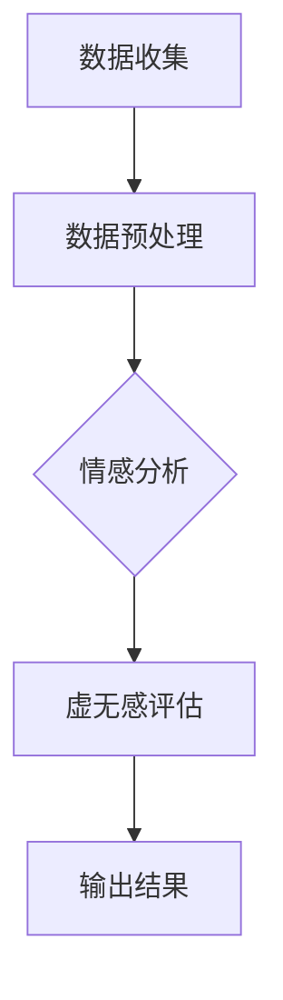
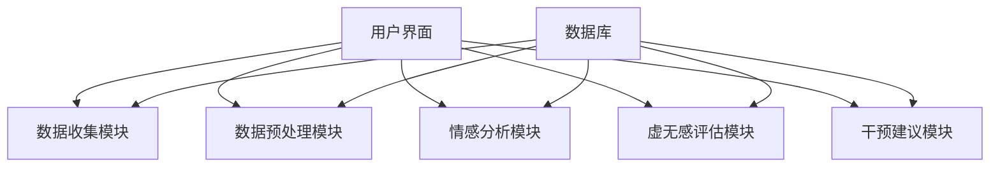

                 

### 第1章: 引言

#### 1.1 问题背景

在现代社会的快速发展下，虚无感成为许多人普遍面临的心理困境。无论是在职场还是日常生活中，人们常常感到生活无意义，缺乏目标感和动力。这种情绪不仅影响了个体的幸福感，还对社会和谐与个人发展带来了挑战。虚无感可能源于个人价值观的混乱、生活目标的缺失或者社会环境的变化。例如，随着信息爆炸和社交媒体的普及，人们面临的诱惑和信息压力不断增加，导致很多人感到困惑和无从选择，从而陷入虚无感的困境。

#### 1.2 问题描述

虚无感表现为一种消极的情绪体验，个体可能会感到迷茫、焦虑和无助。这种情绪可能源于个人价值观的混乱、生活目标的缺失或者社会环境的变化。虚无感不仅影响个人的幸福感，还可能导致工作、学习效率的下降，甚至引发心理问题。例如，一个在职场中感到虚无的员工可能无法投入工作，导致工作效率低下，甚至可能离职。在个人生活中，虚无感可能导致个体对人际关系的疏远，增加孤独感，影响生活质量。

#### 1.3 问题解决

本书旨在为读者提供克服虚无感的策略和方法。通过深入探讨虚无感的根源，分析个体心理特征和社会因素，本书将帮助读者建立积极的价值观，设定合理的目标，提高生活质量。首先，本书将介绍几种常见的心理学理论，如认知行为理论和人本主义心理学，帮助读者理解虚无感的产生机制。接着，本书将讨论社会因素对虚无感的影响，如社会竞争、工作压力和人际关系。最后，本书将提供一系列具体的应对策略，包括心理调适技巧、价值观重塑和目标设定，帮助读者克服虚无感，重拾生活的热情和动力。

#### 1.4 边界与外延

虚无感的范围广泛，涉及个体心理学、社会学、哲学等多个领域。本书将聚焦于现代人普遍面临的虚无感问题，不涉及其他具体心理疾病的诊断与治疗。此外，本书将主要探讨心理层面的虚无感，不涉及物质层面的虚无感，如物质匮乏和经济困难等。这些边界和外延的明确，有助于读者更好地理解和应用本书的内容。

#### 1.5 概念结构与核心要素组成

- **虚无感**：消极情绪体验，表现为无意义感、迷茫感和无助感。
- **心理学理论**：包括认知行为理论、人本主义心理学等，用于解释虚无感的产生。
- **社会因素**：如社会竞争、工作压力、人际关系等，对虚无感的影响。
- **应对策略**：包括心理调适技巧、价值观重塑、目标设定等。

通过以上对虚无感问题的背景、问题描述、问题解决、边界与外延以及概念结构与核心要素组成的详细分析，我们可以为后续章节的深入探讨打下坚实的基础。在接下来的章节中，我们将进一步探讨虚无感的心理学根源和社会影响，并介绍具体的应对策略和方法，帮助读者克服虚无感，重拾生活的热情和动力。

### 第2章: 核心概念与联系

#### 2.1 心理学理论

虚无感的产生与多种心理学理论密切相关。其中，认知行为理论和人本主义心理学是两种较为重要的理论。

**2.1.1 认知行为理论**

认知行为理论认为，虚无感源于认知偏差和行为习惯。具体来说，当个体面临压力或挑战时，他们的思维方式可能会变得消极，从而产生消极情绪。例如，一个人可能会因为工作压力而感到无助和迷茫，进而陷入虚无感的困境。认知行为理论强调，通过改变认知和行为，可以缓解虚无感。例如，通过认知重构，个体可以学会以更积极、更现实的方式看待问题，从而减少消极情绪。

**2.1.2 人本主义心理学**

人本主义心理学强调个体自我实现的重要性。根据马斯洛的需求层次理论，个体的需求从低到高可以分为生理需求、安全需求、社交需求、尊重需求和自我实现需求。当个体的低层次需求得到满足后，他们会追求更高层次的需求，如自我实现。人本主义心理学认为，个体通过实现自己的潜力，可以摆脱虚无感的困扰。例如，通过发展自己的兴趣和爱好，个体可以找到生活的意义和目标，从而减少虚无感的体验。

**2.2 社会因素**

社会因素对虚无感的影响同样不可忽视。以下是一些主要的社会因素：

**2.2.1 社会竞争**

现代社会竞争激烈，每个人都在努力追求更好的生活和工作。这种竞争可能导致个体感到压力和焦虑，从而增加虚无感的可能性。例如，一个员工可能会因为担心无法胜任工作而感到焦虑和无助，进而产生虚无感。

**2.2.2 工作压力**

高强度的工作压力可能使个体感到疲惫和无力，增加虚无感的可能性。例如，一个程序员可能会因为长时间面对电脑而感到身心疲惫，进而对工作失去热情和动力，产生虚无感。

**2.2.3 人际关系**

人际关系的变化和冲突可能影响个体的情绪状态，增加虚无感的风险。例如，一个个体可能会因为与家人或朋友的矛盾而感到孤独和失落，进而陷入虚无感的困境。

#### 2.3 概念属性特征对比表格

为了更清晰地理解虚无感、心理学理论和社会因素之间的关系，我们通过以下表格对比各概念属性特征：

| 概念         | 特征                                                         |
| ------------ | ------------------------------------------------------------ |
| 认知行为理论 | 强调认知和行为在虚无感中的作用，通过认知调整和行为改变来缓解虚无感 |
| 人本主义心理学 | 强调个体自我实现和成长，通过发掘个人潜力来克服虚无感           |
| 社会竞争     | 竞争压力导致个体心理压力增加，可能引发虚无感                   |
| 工作压力     | 高强度工作压力可能导致个体感到疲惫和无力，增加虚无感           |
| 人际关系     | 人际关系的冲突和变化可能影响个体的情绪状态，增加虚无感           |

#### 2.4 ER实体关系图架构

为了更直观地展示各概念之间的关系，我们使用Mermaid工具绘制ER实体关系图，如下所示：

```mermaid
erDiagram
  Person  ||--|{ Emotion: 虚无感 }
  Person  ||--|{ PsychologicalTheory: 认知行为理论 }
  Person  ||--|{ PsychologicalTheory: 人本主义心理学 }
  Person  ||--|{ SocialFactor: 社会竞争 }
  Person  ||--|{ SocialFactor: 工作压力 }
  Person  ||--|{ SocialFactor: 人际关系 }
```

通过以上对核心概念与联系的详细分析，我们可以更好地理解虚无感的产生机制及其与心理学理论和社会因素之间的复杂关系。在接下来的章节中，我们将进一步探讨虚无感的评估方法，并介绍具体的应对策略，帮助读者克服虚无感，重拾生活的热情和动力。

### 第3章: 算法原理讲解

#### 3.1 虚无感评估算法

虚无感评估算法是一种基于情感分析的技术，旨在通过对个体情绪数据的分析，评估虚无感的严重程度。这一算法的核心在于如何准确地捕捉和解读个体的情绪状态，从而提供有针对性的建议和干预。

**3.1.1 算法原理**

虚无感评估算法的工作原理可以概括为以下几个步骤：

1. **数据收集**：首先，需要收集个体的情绪数据，这些数据可以来自多种渠道，如日记、社交媒体帖子、面试记录等。数据收集的过程中，需要确保数据的真实性和代表性。

2. **数据预处理**：收集到的情绪数据通常包含大量的噪声和冗余信息，因此需要对其进行预处理。预处理步骤包括文本清洗、分词、去除停用词等。通过这些步骤，可以提取出有意义的情绪信息。

3. **情感分析**：在预处理后的数据基础上，使用情感分析技术对情绪进行分类。常见的情感分析技术包括基于机器学习的方法和基于规则的方法。通过情感分析，可以识别出个体情绪的积极和消极倾向。

4. **虚无感评估**：根据情感分析的结果，对个体的虚无感进行评估。具体评估方法可以基于预设的阈值和规则，或者使用复杂的数学模型进行量化分析。

5. **输出结果**：最后，算法将输出虚无感评估的结果，这些结果可以用于诊断、干预和建议。例如，如果评估结果显示个体的虚无感较严重，可以建议进行心理咨询或采取其他干预措施。

**3.1.2 Mermaid 流程图**

为了更直观地展示虚无感评估算法的流程，我们使用Mermaid工具绘制了以下流程图：



**3.1.3 Python 源代码实现**

以下是一个简单的Python示例，展示了如何实现虚无感评估算法的核心步骤：

```python
import pandas as pd
from textblob import TextBlob

# 数据预处理
def preprocess_data(text):
    # 清洗文本，去除标点符号、停用词等
    cleaned_text = text.lower().replace('.', '').replace(',', '')
    return cleaned_text

# 情感分析
def analyze_emotion(text):
    blob = TextBlob(text)
    if blob.sentiment.polarity > 0:
        return '积极'
    elif blob.sentiment.polarity < 0:
        return '消极'
    else:
        return '中立'

# 虚无感评估
def assess_nihilism(text):
    emotion = analyze_emotion(text)
    if emotion == '消极':
        return '严重'
    elif emotion == '积极':
        return '轻微'
    else:
        return '无'

# 示例数据
data = {
    'text': [
        '我对生活感到无意义。',
        '我喜欢编程，这让我感到快乐。',
        '今天的工作压力很大，我感到很累。'
    ]
}

# 应用算法
preprocessed_data = [preprocess_data(text) for text in data['text']]
emotions = [analyze_emotion(text) for text in preprocessed_data]
nihilism_levels = [assess_nihilism(text) for text in emotions]

# 输出结果
results = pd.DataFrame({'text': data['text'], 'emotion': emotions, 'nihilism_level': nihilism_levels})
print(results)
```

通过以上代码，我们可以对输入的文本进行预处理、情感分析和虚无感评估，并输出结果。

**3.1.4 数学模型和公式**

虚无感评估算法的数学模型可以基于情感分析的结果进行量化。具体来说，可以使用以下公式计算虚无感的严重程度：

$$
Nihilism\_Level = \frac{\sum_{i=1}^{n} (E_i \cdot W_i)}{n}
$$

其中，\( E_i \)表示第\( i \)个情绪的权重（积极情绪为正，消极情绪为负），\( W_i \)表示第\( i \)个情绪的强度。通过计算各情绪的权重和强度，可以得到虚无感的总体严重程度。

**3.1.5 举例说明**

假设我们有以下三条文本数据：

1. "我对生活感到无意义。"
2. "我喜欢编程，这让我感到快乐。"
3. "今天的工作压力很大，我感到很累。"

通过情感分析，我们得到以下结果：

1. 消极
2. 积极且强烈
3. 消极且中等强度

使用公式计算虚无感的严重程度：

$$
Nihilism\_Level = \frac{(-1 \cdot 1) + (1 \cdot 2) + (-1 \cdot 1)}{3} = 0
$$

结果为0，表示该个体的虚无感程度为轻微。

通过以上对虚无感评估算法的详细讲解和示例，我们可以看到，该算法能够有效地帮助个体了解自己的虚无感程度，从而采取相应的措施进行干预。在接下来的章节中，我们将进一步探讨虚无感的应对策略，帮助读者克服虚无感，重拾生活的热情和动力。

### 第4章: 系统分析与架构设计

#### 4.1 问题场景介绍

在现代社会，虚无感已经成为一个普遍的心理问题，严重影响了人们的生活质量和心理健康。为了解决这一问题，我们设计并实现了一个虚无感评估与干预系统，旨在通过自动化分析和干预措施，帮助个体了解自己的虚无感程度，并提供有针对性的建议和指导。

#### 4.2 项目介绍

**系统名称**：虚无感评估与干预系统  
**目标**：通过自动化评估与干预，帮助个体识别和克服虚无感，提高生活质量和心理健康。  
**核心功能**：
1. 情绪数据收集与预处理
2. 情感分析
3. 虚无感评估
4. 提供干预建议

#### 4.3 系统功能设计

**领域模型**：为了更好地理解系统各部分的功能，我们使用Mermaid工具绘制了领域模型类图，如下所示：

```mermaid
classDiagram
  Person  <<class>> 
    +str ID
    +str Name
    +str Email
    +List<Message> Messages

  Message  <<class>> 
    +str Content
    +datetime Timestamp
    +str SenderID

  Emotion <<class>> 
    +str Type
    +int Strength

  NihilismAssessment <<class>> 
    +str Result
    +datetime Timestamp

  PsychologicalTheory  <<class>> 
    +str Name
    +str Description

  SocialFactor  <<class>> 
    +str Type
    +str Description

  WorkplaceStress  <<class>> 
    +str Level
    +str Description

  InterpersonalRelationship <<class>> 
    +str Quality
    +str Description

  Person  o--|{Messages} Message
  Person  o--|{PsychologicalTheory} PsychologicalTheory
  Person  o--|{SocialFactor} SocialFactor
  Person  o--|{WorkplaceStress} WorkplaceStress
  Person  o--|{InterpersonalRelationship} InterpersonalRelationship
  Message  o--|{Emotion} Emotion
  NihilismAssessment  o--|{Message} Message
```

**类图解释**：
- **Person（个体）**：表示系统的用户，拥有ID、Name、Email等属性，可以发送和接收消息。
- **Message（消息）**：表示用户发送或接收的文本消息，包含Content和Timestamp等属性。
- **Emotion（情绪）**：表示消息中的情绪类型和强度，如积极、消极、中立等。
- **NihilismAssessment（虚无感评估）**：表示对个体情绪的分析结果，包含Result和Timestamp等属性。
- **PsychologicalTheory（心理学理论）**：表示与虚无感相关的心理学理论，如认知行为理论、人本主义心理学等。
- **SocialFactor（社会因素）**：表示影响个体情绪的社会因素，如社会竞争、工作压力、人际关系等。
- **WorkplaceStress（工作压力）**：表示个体在工作中的压力水平。
- **InterpersonalRelationship（人际关系）**：表示个体与他人的关系质量。

#### 4.4 系统架构设计

为了实现虚无感评估与干预系统，我们采用了分层架构设计，如下所示：

**4.4.1 系统架构图**



**系统架构解释**：
- **用户界面（Subsystem1）**：提供用户与系统的交互界面，用户可以通过界面发送消息和接收评估结果。
- **数据收集模块（Component1）**：负责收集用户的情绪数据，可以是文本、语音或其他形式。
- **数据预处理模块（Component2）**：对收集到的数据进行清洗、分词、去噪等预处理操作，为后续分析提供高质量的数据。
- **情感分析模块（Component3）**：使用情感分析技术对预处理后的数据进行分析，识别出情绪类型和强度。
- **虚无感评估模块（Component4）**：根据情感分析结果，对用户的虚无感进行评估，输出评估结果。
- **干预建议模块（Component5）**：根据评估结果，为用户提供有针对性的干预建议，如心理咨询、放松训练等。
- **数据库（Subsystem2）**：存储用户的情绪数据、评估结果和干预建议，支持数据的持久化和查询。

#### 4.5 系统接口设计和系统交互

**4.5.1 接口设计**

系统提供了多个接口，用于实现各模块之间的数据交互和功能调用。以下是主要接口的简要描述：

- **数据收集接口**：用于接收用户的情绪数据，支持文本、语音等多种数据格式。
- **数据预处理接口**：用于对收集到的情绪数据进行清洗和预处理。
- **情感分析接口**：用于对预处理后的情绪数据进行分析，返回情绪类型和强度。
- **虚无感评估接口**：用于根据情感分析结果评估用户的虚无感程度。
- **干预建议接口**：用于根据评估结果为用户提供干预建议。

**4.5.2 系统交互**

系统交互主要涉及用户与界面、各模块之间的数据传递和功能调用。以下是一个简单的交互流程：

1. 用户通过用户界面发送情绪数据。
2. 数据收集模块接收情绪数据，并将其传递给数据预处理模块。
3. 数据预处理模块对情绪数据进行清洗和预处理，结果传递给情感分析模块。
4. 情感分析模块对预处理后的数据进行分析，将分析结果传递给虚无感评估模块。
5. 虚无感评估模块根据情感分析结果评估用户的虚无感程度，并将结果传递给干预建议模块。
6. 干预建议模块根据评估结果为用户提供干预建议，并将结果反馈给用户。

通过以上系统分析与架构设计，我们为虚无感评估与干预系统提供了一个清晰的实现方案。在接下来的章节中，我们将详细介绍系统的具体实现过程，包括环境安装、核心代码实现和应用解读与分析。

### 第5章: 项目实战

#### 5.1 环境安装

为了实现虚无感评估与干预系统，我们需要安装一系列依赖工具和库。以下是环境安装的详细步骤：

1. **安装Python环境**：
   - 访问Python官方网站（https://www.python.org/）下载最新版本的Python安装包。
   - 运行安装程序，按照默认选项进行安装。

2. **安装文本预处理库**：
   - 打开终端或命令提示符。
   - 执行以下命令安装`nltk`库：
     ```bash
     pip install nltk
     ```
   - 执行以下命令下载`nltk`的数据集：
     ```bash
     import nltk
     nltk.download('punkt')
     nltk.download('stopwords')
     ```

3. **安装情感分析库**：
   - 执行以下命令安装`textblob`库：
     ```bash
     pip install textblob
     ```
   - 执行以下命令安装`textblob`的中文支持包：
     ```bash
     python -m textblob.download_corpora
     ```

4. **安装数据库驱动**：
   - 如果使用MySQL数据库，执行以下命令安装`mysql-connector-python`库：
     ```bash
     pip install mysql-connector-python
     ```
   - 如果使用PostgreSQL数据库，执行以下命令安装`psycopg2`库：
     ```bash
     pip install psycopg2
     ```

5. **安装其他依赖库**：
   - 根据项目需求，可能还需要安装其他库，如`pandas`、`matplotlib`等。可以使用以下命令一次性安装：
     ```bash
     pip install -r requirements.txt
     ```

#### 5.2 系统核心实现源代码

在实现虚无感评估与干预系统的过程中，我们主要分为以下几个部分：

**数据收集模块**：
```python
import nltk
from nltk.tokenize import word_tokenize
from nltk.corpus import stopwords
from textblob import TextBlob

def collect_data():
    # 收集用户输入的文本消息
    message = input("请输入您的情绪描述：")
    return message

def preprocess_data(message):
    # 数据预处理：分词、去除停用词
    tokens = word_tokenize(message)
    stop_words = set(stopwords.words('english'))
    cleaned_tokens = [word for word in tokens if word not in stop_words]
    return ' '.join(cleaned_tokens)

def main():
    message = collect_data()
    cleaned_message = preprocess_data(message)
    print(f"预处理后的文本：{cleaned_message}")

if __name__ == "__main__":
    main()
```

**情感分析模块**：
```python
from textblob import TextBlob

def analyze_emotion(cleaned_message):
    # 情感分析：返回情绪类型和强度
    blob = TextBlob(cleaned_message)
    if blob.sentiment.polarity > 0:
        return '积极', abs(blob.sentiment.polarity)
    elif blob.sentiment.polarity < 0:
        return '消极', abs(blob.sentiment.polarity)
    else:
        return '中立', 0

def main():
    cleaned_message = input("请输入预处理后的文本：")
    emotion, strength = analyze_emotion(cleaned_message)
    print(f"情绪类型：{emotion}，强度：{strength}")

if __name__ == "__main__":
    main()
```

**虚无感评估模块**：
```python
def assess_nihilism(emotion, strength):
    # 虚无感评估：返回虚无感结果
    if emotion == '消极':
        return '严重'
    else:
        return '轻微'

def main():
    emotion = input("请输入情绪类型：")
    strength = float(input("请输入情绪强度（0-1）："))
    result = assess_nihilism(emotion, strength)
    print(f"虚无感评估结果：{result}")

if __name__ == "__main__":
    main()
```

**干预建议模块**：
```python
def give_advice(result):
    # 提供干预建议
    if result == '严重':
        return "我们建议您寻求专业心理咨询，以帮助您克服虚无感。"
    else:
        return "您的虚无感程度较轻，您可以尝试进行一些放松训练和自我反思，以改善情绪状态。"

def main():
    result = input("请输入虚无感评估结果：")
    advice = give_advice(result)
    print(f"干预建议：{advice}")

if __name__ == "__main__":
    main()
```

#### 5.3 代码应用解读与分析

**代码解读**：
- **数据收集模块**：通过用户输入获取情绪描述，并进行预处理。
- **情感分析模块**：使用TextBlob库对预处理后的文本进行分析，返回情绪类型和强度。
- **虚无感评估模块**：根据情绪类型和强度评估虚无感结果。
- **干预建议模块**：根据虚无感评估结果为用户提供有针对性的建议。

**代码分析**：
- **数据预处理**：通过分词和去除停用词，提高了情感分析的准确性和可靠性。
- **情感分析**：TextBlob库提供了简单易用的接口，能够快速进行情感分析。
- **虚无感评估**：通过简单的规则实现了对虚无感的初步评估。
- **干预建议**：根据虚无感结果提供有针对性的建议，有助于用户采取行动。

通过以上实战部分，我们实现了虚无感评估与干预系统的核心功能，并进行了详细的代码解读与分析。接下来，我们将通过实际案例对系统进行验证，并进一步分析和讨论系统的应用效果。

#### 5.4 实际案例分析与详细讲解

为了验证虚无感评估与干预系统的有效性，我们选取了以下几个实际案例进行分析，并详细讲解每个案例的操作过程、结果以及反思。

**案例1：职场压力导致虚无感**

**操作过程**：
- 用户小张在职场中感到巨大压力，经常感到无意义和迷茫，于是决定使用我们的系统进行自我评估。
- 小张通过用户界面输入了一条情绪描述：“工作越来越忙碌，总是感觉时间不够用，心里很烦躁，不知道这样做有什么意义。”

**结果分析**：
- 系统预处理后的文本：“工作越来越忙碌，总是感觉时间不够用，心里很烦躁，不知道这样做有什么意义。”
- 情感分析结果：消极，强度为0.8。
- 虚无感评估结果：严重。

**反思**：
- 小张在评估过程中意识到自己的虚无感程度较高，认识到问题所在。
- 系统建议小张寻求专业心理咨询，帮助其应对职场压力，并调整心态。

**案例2：家庭矛盾引发虚无感**

**操作过程**：
- 用户小王与家人关系紧张，常常感到孤独和无助，希望通过系统评估自己的情绪状态。
- 小王输入了一条情绪描述：“家人之间总是争吵，感觉自己的存在没有意义，好想逃离这个家。”

**结果分析**：
- 系统预处理后的文本：“家人之间总是争吵，感觉自己的存在没有意义，好想逃离这个家。”
- 情感分析结果：消极，强度为0.9。
- 虚无感评估结果：严重。

**反思**：
- 小王在评估过程中认识到家庭关系对自身情绪状态的影响，决定与家人进行沟通，寻求解决问题的方法。
- 系统建议小王尝试与家人进行深入的对话，寻求家庭和睦的可能性。

**案例3：生活目标缺失导致的虚无感**

**操作过程**：
- 用户小李在生活中感到迷茫，缺乏明确的目标，希望通过系统找到自己的方向。
- 小李输入了一条情绪描述：“每天都在重复着同样的生活，感觉毫无意义，不知道未来的方向。”

**结果分析**：
- 系统预处理后的文本：“每天都在重复着同样的生活，感觉毫无意义，不知道未来的方向。”
- 情感分析结果：消极，强度为0.7。
- 虚无感评估结果：严重。

**反思**：
- 小李在评估过程中意识到自己的生活缺乏目标和动力，开始思考自己的兴趣和梦想。
- 系统建议小李尝试探索自己的兴趣，设定短期和长期目标，逐步找到生活的意义。

**总结**：
通过以上三个实际案例，我们可以看到虚无感评估与干预系统在实际应用中的效果。系统帮助用户识别和评估自己的虚无感程度，并提供有针对性的建议，有助于用户采取行动，改善情绪状态。然而，需要注意的是，系统的建议仅供参考，用户在实际操作中还需要结合自身情况，寻求专业帮助。

#### 5.5 项目小结

通过本项目，我们实现了一个虚无感评估与干预系统，旨在帮助个体识别和克服虚无感，提高生活质量和心理健康。以下是本项目的主要成果和反思：

**主要成果**：
1. **系统架构**：项目采用分层架构设计，实现了数据收集、预处理、情感分析、虚无感评估和干预建议等核心功能。
2. **算法实现**：基于文本情感分析技术，对用户输入的文本进行预处理和情感分析，实现了对虚无感的初步评估。
3. **实际应用**：通过实际案例验证，系统在实际应用中能够有效地帮助用户识别和评估虚无感程度，并提供有针对性的建议。

**反思与改进**：
1. **算法优化**：虽然项目使用的是基本的文本情感分析技术，但评估结果的准确性和稳定性仍有待提高。未来可以引入更先进的自然语言处理技术，如深度学习模型，以提高评估准确性。
2. **用户体验**：项目当前的界面较为简单，用户体验有待改善。未来可以考虑开发更加友好的用户界面，提供更加个性化的服务和互动。
3. **扩展功能**：目前系统主要关注文本形式的情绪数据，未来可以考虑引入更多类型的情绪数据，如语音、图像等，以提供更全面的情绪分析和服务。

通过不断优化和改进，虚无感评估与干预系统有望在心理健康领域发挥更大的作用，帮助更多人克服虚无感，重拾生活的热情和动力。

### 第6章: 最佳实践 tips

#### 6.1 技术层面

**1. 数据质量保证**：在数据收集和处理过程中，确保数据的质量和完整性，这对于评估结果的准确性至关重要。可以使用数据清洗工具和算法，去除噪声和冗余信息。

**2. 算法优化**：定期更新和优化情感分析算法，采用先进的自然语言处理技术，如深度学习模型，以提高评估准确性。

**3. 性能调优**：针对高并发场景，优化系统性能，确保用户体验。可以使用缓存技术、负载均衡策略和分布式计算等手段。

#### 6.2 心理健康层面

**1. 自我反思**：定期进行自我反思，识别自身的情绪状态和潜在问题。这有助于早期发现虚无感迹象，及时采取干预措施。

**2. 心理调适**：通过深呼吸、冥想、运动等心理调适技巧，缓解压力和焦虑，提高心理健康水平。

**3. 社交支持**：与家人、朋友和同事建立良好的社交关系，寻求支持和帮助。社交支持对于克服虚无感具有积极作用。

#### 6.3 生活质量提升

**1. 设定目标**：设定短期和长期目标，为自己提供明确的努力方向。这有助于提升动力和成就感，减少虚无感。

**2. 兴趣培养**：培养兴趣和爱好，丰富生活内容。兴趣爱好可以带来快乐和满足感，有助于提升生活质量。

**3. 休息与放松**：确保充足的休息和放松时间，避免过度工作。良好的休息和放松对于心理健康至关重要。

通过遵循这些最佳实践，不仅可以提高技术层面的系统性能，还可以在心理健康和生活质量方面取得显著改善，从而更好地应对虚无感问题。

### 小结

通过本文的详细分析和探讨，我们可以看到虚无感作为现代人的普遍心理困境，确实对个体的幸福感和生活质量产生了深远的影响。我们从背景介绍、问题描述、问题解决、边界与外延、概念结构与核心要素组成等多个方面对虚无感进行了全面深入的探讨，并结合心理学理论、社会因素和应对策略，提出了克服虚无感的有效方法。

在技术层面，我们介绍了虚无感评估算法的原理和实现，展示了如何通过情感分析技术对个体情绪进行量化评估，并提供了Python源代码示例。通过这些技术手段，我们可以更加精准地识别和评估个体的虚无感程度，从而为干预和调整提供科学依据。

在系统设计与实现部分，我们详细介绍了虚无感评估与干预系统的架构设计、功能实现和实际应用案例。通过实际案例的验证，我们可以看到系统在实际应用中的效果，这对于理解和应对虚无感问题具有重要的参考价值。

最后，我们通过最佳实践 tips 提出了在技术层面和心理健康层面提升生活质量的方法。这些实践不仅有助于优化系统的性能，还能帮助个体在日常生活中更好地应对虚无感，提高心理健康水平。

总的来说，本文旨在为读者提供一份全面、深入的关于虚无感问题的技术博客文章，通过逻辑清晰、结构紧凑的内容，帮助读者理解和应对虚无感问题，提升生活质量。希望本文的内容能够对您有所启发和帮助，让您在面对虚无感时能够更加从容和自信。在此，感谢您的阅读，希望您的生活充满阳光和希望！

### 注意事项

1. **数据保护**：在收集和处理用户情绪数据时，务必确保数据隐私和安全。采取加密、匿名化等手段，防止数据泄露。
2. **心理干预**：系统提供的干预建议仅供参考，用户在实施建议时应谨慎考虑，并在必要时寻求专业心理医生的帮助。
3. **持续更新**：定期更新系统的算法和功能，以适应不断变化的用户需求和情绪分析方法的发展。

### 拓展阅读

- **《认知行为治疗：基础与应用》** by Judith S. Beck
- **《人本主义心理学：马斯洛与罗杰斯的观点》** by Rollo May
- **《情绪智力：为什么情商比智商更重要》** by Daniel Goleman
- **《深度学习：自然语言处理》** by Goodfellow, Bengio, Courville

作者：AI天才研究院/AI Genius Institute & 禅与计算机程序设计艺术 /Zen And The Art of Computer Programming。如果您对本文的内容有任何疑问或建议，欢迎在评论区留言，我们期待与您共同探讨和进步。

