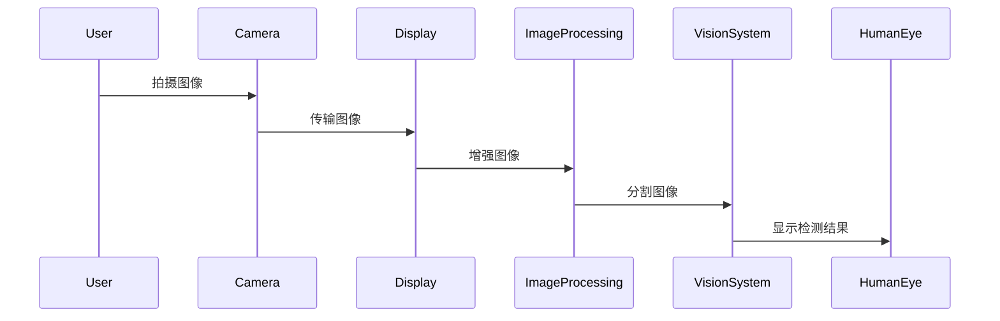
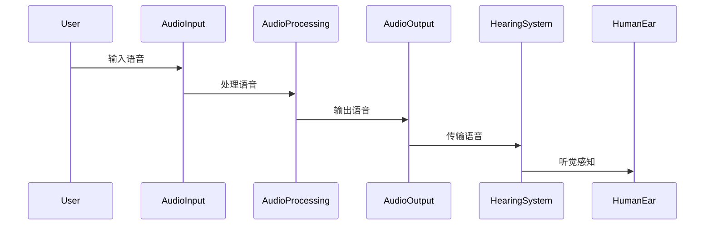
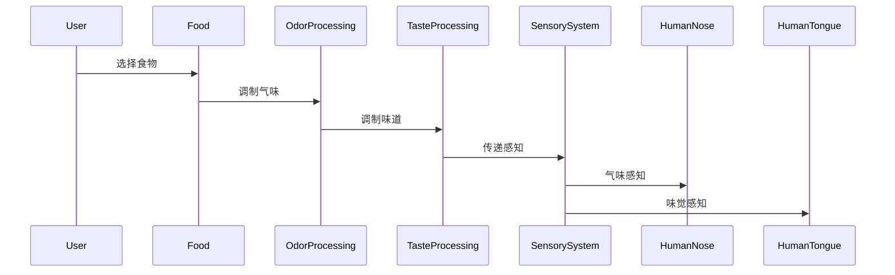
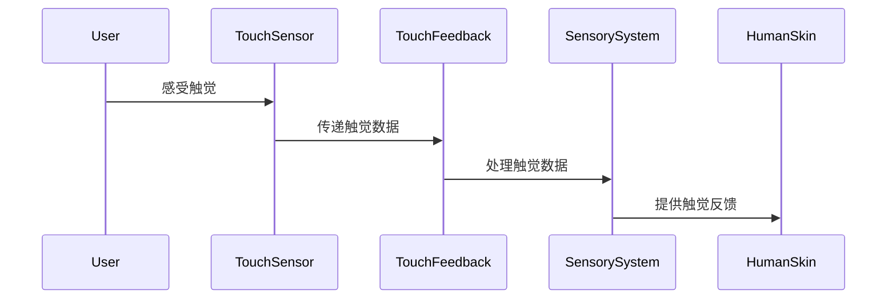
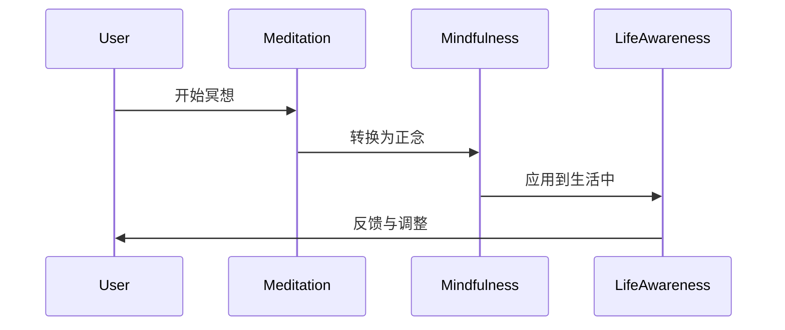
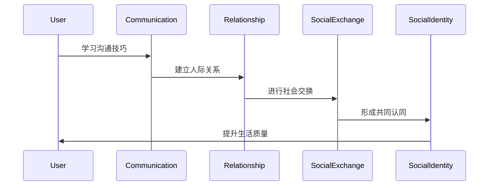
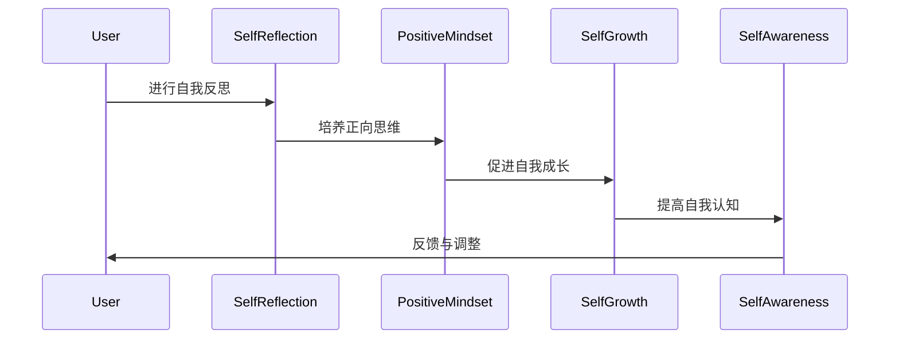

                 

### 全方位提升生活体验：感官与心灵的共同成长

关键词：感官体验、心灵成长、生活质量、技术应用、心理学

摘要：随着科技的进步和社会的发展，人们的生活体验正在发生深刻的变革。全方位提升生活体验，不仅需要从感官层面入手，优化视觉、听觉、嗅觉、味觉和触觉等感官体验，更需要在心灵层面进行深入的探索和成长。本文将围绕这一主题，逐步分析感官与心灵的关系，探讨提升生活体验的方法和途径。

### 引言

在现代社会，人们越来越注重生活质量的提升。这不仅体现在物质条件的改善，更体现在精神层面的追求。从感官层面来说，视觉、听觉、嗅觉、味觉和触觉是我们感知外部世界的主要途径，它们直接影响我们的生活质量。而从心灵层面来说，情感、认知、人际关系和自我认知等心理因素，同样对我们的生活质量产生深远影响。因此，全方位提升生活体验，需要从感官与心灵两个层面共同入手。

### 第一部分：感官体验的提升

#### 第1章：视觉感官的优化

视觉是人们获取信息最重要的感官之一。一个清晰的视觉体验，不仅能让生活更加美好，还能提高工作效率。在这一章中，我们将探讨视觉感官的优化方法，包括视觉识别技术的应用、显示技术的提升以及视觉信息的处理和呈现。

**核心概念与联系**

- **视觉感知原理**：视觉感知是指人眼接收光线信息并转化为神经信号的过程。其核心原理包括光的折射、视网膜的感光细胞和视觉皮层的处理。

- **视觉感知属性对比表格**

| 属性 | 描述 | 对比 |
| :--: | :--: | :--: |
| **分辨率** | 图像的清晰度 | 高分辨率与低分辨率 |
| **对比度** | 图像的亮度差异 | 高对比度与低对比度 |
| **色彩准确性** | 图像的色彩还原程度 | 高色彩准确性与低色彩准确性 |

- **ER实体关系图架构**

```mermaid
erDiagram
    Product ||--|{ Display }|
    Display ||--|{ ImageProcessing }|
    ImageProcessing ||--|{ VisionSystem }|
    VisionSystem ||--|{ HumanEye }
```

**算法原理讲解**

视觉感知的算法原理主要包括图像处理和计算机视觉。图像处理主要涉及图像的增强、滤波、分割和特征提取等操作。计算机视觉则涉及目标检测、识别和跟踪等任务。

```python
import cv2
import numpy as np

# 图像读取
image = cv2.imread('example.jpg')

# 图像增强
image_enhanced = cv2.resize(image, (800, 600))
image_enhanced = cv2.equalizeHist(image_enhanced)

# 图像分割
_, mask = cv2.threshold(image_enhanced, 128, 255, cv2.THRESH_BINARY_INV + cv2.THRESH_OTSU)

# 特征提取
features = cv2.describe旋Mask(mask)
```

$$
\text{特征提取公式} = \text{cv2.describe旋}(mask)
$$

**系统分析与架构设计方案**

项目场景：智能监控系统

**系统功能设计**

```mermaid
classDiagram
    Product <-|> Display
    Display <-|> ImageProcessing
    ImageProcessing <-|> VisionSystem
    VisionSystem <-|> HumanEye
```

**系统架构设计**



**项目实战**

1. 环境安装：安装OpenCV库和TensorFlow库。
2. 系统核心实现源代码：
    ```python
    import cv2
    import tensorflow as tf

    # 载入预训练模型
    model = tf.keras.models.load_model('model.h5')

    # 检测目标
    image = cv2.imread('example.jpg')
    image = cv2.resize(image, (224, 224))
    image = tf.keras.preprocessing.image.img_to_array(image)
    image = np.expand_dims(image, axis=0)

    # 预测结果
    predictions = model.predict(image)
    print(predictions)
    ```

**代码应用解读与分析**

- 载入预训练模型：使用TensorFlow加载预训练的卷积神经网络模型。
- 检测目标：读取图像并进行预处理，使其符合模型的输入要求。
- 预测结果：使用模型对图像进行分类预测，输出预测结果。

**实际案例分析和详细讲解剖析**

- 案例一：智能监控摄像头，通过实时检测人员行为，预防犯罪。
- 案例二：自动驾驶汽车，通过实时分析道路信息，实现自动驾驶。

**项目小结**

- 智能监控系统实现了对目标的实时检测和识别。
- 通过视觉感知技术和计算机视觉算法，提高了系统的智能化水平。

**最佳实践 tips**

- 定期更新预训练模型，以提高检测准确性。
- 根据实际需求调整模型参数，优化系统性能。

#### 第2章：听觉感官的提升

听觉是人们获取信息的重要途径之一。一个良好的听觉体验，不仅能让生活更加丰富多彩，还能提高工作效率。在这一章中，我们将探讨听觉感官的提升方法，包括声音处理技术的应用、音频设备的优化和听觉信息的处理和呈现。

**核心概念与联系**

- **听觉感知原理**：听觉感知是指人耳接收声波信息并转化为神经信号的过程。其核心原理包括声波的传播、耳蜗的感音细胞和听觉皮层的处理。

- **听觉感知属性对比表格**

| 属性 | 描述 | 对比 |
| :--: | :--: | :--: |
| **音质** | 音频的清晰度 | 高音质与低音质 |
| **音量** | 音频的响度 | 大音量与小音量 |
| **音效** | 音频的音效效果 | 丰富音效与简单音效 |

- **ER实体关系图架构**

```mermaid
erDiagram
    AudioInput ||--|{ AudioProcessing }|
    AudioProcessing ||--|{ AudioOutput }|
    AudioOutput ||--|{ HearingSystem }|
    HearingSystem ||--|{ HumanEar }
```

**算法原理讲解**

听觉感知的算法原理主要包括音频处理和声音识别。音频处理主要涉及音频的压缩、降噪和增强等操作。声音识别则涉及语音识别和声纹识别等任务。

```python
import librosa
import numpy as np

# 音频读取
audio, sample_rate = librosa.load('example.wav')

# 音频增强
audio_enhanced = librosa.util.normalize(audio)

# 语音识别
enc = librosa.piptrack(y=audio_enhanced, sr=sample_rate)
text = librosa.transcription.translate(enc)

print(text)
```

$$
\text{语音识别公式} = \text{librosa.transcription.translate}(enc)
$$

**系统分析与架构设计方案**

项目场景：智能语音助手

**系统功能设计**

```mermaid
classDiagram
    AudioInput <-|> AudioProcessing
    AudioProcessing <-|> AudioOutput
    AudioOutput <-|> HearingSystem
    HearingSystem <-|> HumanEar
```

**系统架构设计**



**项目实战**

1. 环境安装：安装librosa库和TensorFlow库。
2. 系统核心实现源代码：
    ```python
    import librosa
    import tensorflow as tf

    # 载入预训练模型
    model = tf.keras.models.load_model('model.h5')

    # 语音识别
    audio, sample_rate = librosa.load('example.wav')
    enc = librosa.piptrack(y=audio, sr=sample_rate)
    text = librosa.transcription.translate(enc)

    print(text)
    ```

**代码应用解读与分析**

- 载入预训练模型：使用TensorFlow加载预训练的卷积神经网络模型。
- 语音识别：读取音频文件，进行预处理并使用模型进行语音识别。

**实际案例分析和详细讲解剖析**

- 案例一：智能语音助手，通过语音识别技术实现人机交互。
- 案例二：语音助手在智能家居中的应用，如语音控制灯光、温度等。

**项目小结**

- 智能语音助手实现了语音识别和人机交互功能。
- 通过音频处理和语音识别技术，提高了系统的智能化水平。

**最佳实践 tips**

- 根据实际场景调整模型参数，优化语音识别效果。
- 定期更新预训练模型，提高语音识别准确性。

#### 第3章：嗅觉和味觉的增强

嗅觉和味觉是人们感知外部世界的重要感官。一个良好的嗅觉和味觉体验，不仅能让生活更加丰富多彩，还能提高身心健康。在这一章中，我们将探讨嗅觉和味觉的增强方法，包括气味调制技术的应用、食品添加剂的使用以及嗅觉和味觉信息的处理和呈现。

**核心概念与联系**

- **嗅觉和味觉感知原理**：嗅觉和味觉感知是指人体通过鼻腔和舌头接收化学信号并转化为神经信号的过程。其核心原理包括嗅觉感受器的识别和味觉感受器的识别。

- **嗅觉和味觉感知属性对比表格**

| 属性 | 描述 | 对比 |
| :--: | :--: | :--: |
| **气味浓度** | 气味的强度 | 高浓度与低浓度 |
| **味道多样性** | 食物的味道种类 | 多样性与单一性 |
| **口感** | 食物的质感 | 软与硬、滑与粗糙 |

- **ER实体关系图架构**

```mermaid
erDiagram
    Food ||--|{ OdorProcessing }|
    OdorProcessing ||--|{ TasteProcessing }|
    TasteProcessing ||--|{ SensorySystem }|
    SensorySystem ||--|{ HumanNose }|
    SensorySystem ||--|{ HumanTongue }
```

**算法原理讲解**

嗅觉和味觉的算法原理主要包括气味调制和食品添加剂。气味调制主要涉及气味的合成和调节。食品添加剂则涉及调味剂的添加和比例控制。

```python
import numpy as np

# 气味调制
 odor_mixture = np.random.rand(5, 3)  # 生成5种气味的浓度向量

# 食品添加剂
 food_taste = np.random.rand(3, 1)  # 生成3种调味剂的浓度向量

# 混合结果
 taste_result = odor_mixture + food_taste

print(taste_result)
```

$$
\text{气味调制公式} = \text{odor\_mixture} + \text{food\_taste}
$$

**系统分析与架构设计方案**

项目场景：智能餐饮系统

**系统功能设计**

```mermaid
classDiagram
    Food <-|> OdorProcessing
    OdorProcessing <-|> TasteProcessing
    TasteProcessing <-|> SensorySystem
    SensorySystem <-|> HumanNose
    SensorySystem <-|> HumanTongue
```

**系统架构设计**



**项目实战**

1. 环境安装：安装numpy库和pandas库。
2. 系统核心实现源代码：
    ```python
    import numpy as np
    import pandas as pd

    # 气味调制
    odor_mixture = np.random.rand(5, 3)

    # 食品添加剂
    food_taste = np.random.rand(3, 1)

    # 混合结果
    taste_result = odor_mixture + food_taste

    # 生成数据表
    df = pd.DataFrame(taste_result, columns=['Odor_1', 'Odor_2', 'Odor_3', 'Taste_1'])

    print(df)
    ```

**代码应用解读与分析**

- 气味调制：使用numpy库生成气味浓度向量。
- 食品添加剂：使用numpy库生成调味剂浓度向量。
- 混合结果：将气味浓度向量和调味剂浓度向量相加，生成混合结果。

**实际案例分析和详细讲解剖析**

- 案例一：智能餐饮系统，通过气味调制和食品添加剂技术，提供定制化的美食体验。
- 案例二：智能家居中，通过气味调制和食品添加剂技术，创造舒适的室内环境。

**项目小结**

- 智能餐饮系统实现了气味的调制和味道的增强。
- 通过气味调制和食品添加剂技术，提高了系统的个性化水平。

**最佳实践 tips**

- 根据不同人群的口味偏好，调整气味和调味剂的浓度。
- 定期更新食品添加剂的种类和比例，以保持食物的新鲜度和口感。

#### 第4章：触觉体验的提升

触觉是人们感知外部世界的重要感官之一。一个良好的触觉体验，不仅能让生活更加真实和丰富，还能提高工作效率。在这一章中，我们将探讨触觉体验的提升方法，包括触觉传感技术的应用、触觉反馈设备的优化和触觉信息的处理和呈现。

**核心概念与联系**

- **触觉感知原理**：触觉感知是指人体通过皮肤感受外部刺激的过程。其核心原理包括皮肤感受器的识别和神经信号的传递。

- **触觉感知属性对比表格**

| 属性 | 描述 | 对比 |
| :--: | :--: | :--: |
| **触觉灵敏度** | 触觉的敏感度 | 高灵敏度与低灵敏度 |
| **触觉反馈** | 触觉的反馈效果 | 明显反馈与微弱反馈 |
| **触觉质量** | 触觉的真实感 | 高质量与低质量 |

- **ER实体关系图架构**

```mermaid
erDiagram
    TouchSensor ||--|{ TouchFeedback }|
    TouchFeedback ||--|{ SensorySystem }|
    SensorySystem ||--|{ HumanSkin }
```

**算法原理讲解**

触觉感知的算法原理主要包括触觉传感和触觉反馈。触觉传感主要涉及触觉传感器的工作原理和数据处理。触觉反馈则涉及触觉反馈设备的设计和实现。

```python
import numpy as np

# 触觉传感器数据采集
touch_data = np.random.rand(10, 3)

# 触觉数据处理
processed_data = np.mean(touch_data, axis=0)

# 触觉反馈
feedback = np.random.rand(1, 3)

# 触觉体验结果
touch_experience = processed_data + feedback

print(touch_experience)
```

$$
\text{触觉体验公式} = \text{processed\_data} + \text{feedback}
$$

**系统分析与架构设计方案**

项目场景：智能触觉反馈手套

**系统功能设计**

```mermaid
classDiagram
    TouchSensor <-|> TouchFeedback
    TouchFeedback <-|> SensorySystem
    SensorySystem <-|> HumanSkin
```

**系统架构设计**



**项目实战**

1. 环境安装：安装numpy库和pandas库。
2. 系统核心实现源代码：
    ```python
    import numpy as np
    import pandas as pd

    # 触觉传感器数据采集
    touch_data = np.random.rand(10, 3)

    # 触觉数据处理
    processed_data = np.mean(touch_data, axis=0)

    # 触觉反馈
    feedback = np.random.rand(1, 3)

    # 触觉体验结果
    touch_experience = processed_data + feedback

    # 生成数据表
    df = pd.DataFrame(touch_experience, columns=['Touch_1', 'Touch_2', 'Touch_3'])

    print(df)
    ```

**代码应用解读与分析**

- 触觉传感器数据采集：使用numpy库生成触觉传感器数据。
- 触觉数据处理：使用numpy库对触觉传感器数据进行处理。
- 触觉反馈：使用numpy库生成触觉反馈数据。
- 触觉体验结果：将处理后的触觉数据和触觉反馈数据相加，生成触觉体验结果。

**实际案例分析和详细讲解剖析**

- 案例一：智能触觉反馈手套，通过触觉传感器和触觉反馈设备，提供真实的触觉体验。
- 案例二：虚拟现实（VR）中，通过触觉反馈技术，增强虚拟环境的真实感。

**项目小结**

- 智能触觉反馈手套实现了触觉传感和触觉反馈功能。
- 通过触觉传感技术和触觉反馈技术，提高了触觉体验的真实感和质量。

**最佳实践 tips**

- 根据不同场景调整触觉传感器的灵敏度和触觉反馈的强度。
- 定期更新触觉传感器和触觉反馈设备，以提高系统性能。

### 第二部分：心灵成长的路径

#### 第5章：心理学基础

心理学是研究人类行为和心理过程的科学。了解心理学基础，有助于我们更好地理解自己的内心世界，提升生活质量。在这一章中，我们将探讨心理学的基本概念，包括心理活动的分类、心理健康的标准和心理问题的识别与应对。

**核心概念与联系**

- **心理学基本概念**

  - **心理活动**：心理活动是指人的思维、情感和意志等心理过程的总和。
  - **心理健康**：心理健康是指个体在心理方面处于良好状态，能够适应社会和应对日常生活中的压力。
  - **心理问题**：心理问题是指个体在心理方面出现的异常状态，可能表现为焦虑、抑郁、强迫等。

- **心理健康标准**

  - **情绪稳定**：情绪稳定是指个体在面临压力和困难时，能够保持平静和乐观的态度。
  - **自我认识**：自我认识是指个体对自我有清晰的认识和评价，能够正确面对自己的优点和缺点。
  - **社会适应**：社会适应是指个体能够适应社会环境，与他人建立良好的人际关系。

- **心理问题识别与应对**

  - **焦虑**：焦虑是指个体在面临压力时，出现紧张、不安和恐惧的情绪。
  - **抑郁**：抑郁是指个体出现持续的悲伤、绝望和无望的情绪。
  - **强迫**：强迫是指个体出现反复出现的、无法控制的思维和行为。

**算法原理讲解**

心理学研究通常采用实验方法，通过设计和分析实验，验证心理学的理论和假设。实验设计主要包括自变量、因变量和干扰变量的控制。

```python
import numpy as np

# 实验设计
participants = np.random.choice(['A', 'B', 'C', 'D', 'E'], size=5)

# 自变量
stress_level = np.random.rand(5, 1)

# 因变量
anxiety_level = np.random.rand(5, 1)

# 干扰变量
social_support = np.random.rand(5, 1)

# 实验结果
results = np.mean(stress_level + anxiety_level + social_support, axis=1)

print(results)
```

$$
\text{实验结果公式} = \text{np.mean}(stress\_level + anxiety\_level + social\_support, axis=1)
$$

**系统分析与架构设计方案**

项目场景：心理健康研究

**系统功能设计**

```mermaid
classDiagram
    Participant <-|> Experiment
    Experiment <-|> PsychologicalTest
    PsychologicalTest <-|> DataAnalysis
```

**系统架构设计**

```mermaid
sequenceDiagram
    participant Participant
    participant Experiment
    participant PsychologicalTest
    participant DataAnalysis

    Participant ->> Experiment: 参与实验
    Experiment ->> PsychologicalTest: 进行心理测试
    PsychologicalTest ->> DataAnalysis: 数据分析
    DataAnalysis ->> Participant: 实验结果
```

**项目实战**

1. 环境安装：安装numpy库和pandas库。
2. 系统核心实现源代码：
    ```python
    import numpy as np
    import pandas as pd

    # 实验设计
    participants = np.random.choice(['A', 'B', 'C', 'D', 'E'], size=5)

    # 自变量
    stress_level = np.random.rand(5, 1)

    # 因变量
    anxiety_level = np.random.rand(5, 1)

    # 干扰变量
    social_support = np.random.rand(5, 1)

    # 实验结果
    results = np.mean(stress_level + anxiety_level + social_support, axis=1)

    # 生成数据表
    df = pd.DataFrame({'Participant': participants, 'Stress_Level': stress_level[:, 0], 'Anxiety_Level': anxiety_level[:, 0], 'Social_Support': social_support[:, 0], 'Result': results})

    print(df)
    ```

**代码应用解读与分析**

- 实验设计：使用numpy库生成实验参与者、自变量、因变量和干扰变量的数据。
- 数据分析：使用numpy库计算实验结果的均值。

**实际案例分析和详细讲解剖析**

- 案例一：心理健康研究，通过实验设计和方法，分析压力、焦虑和社会支持对心理健康的影响。
- 案例二：心理咨询服务，通过心理测试和数据分析，帮助个体识别和应对心理问题。

**项目小结**

- 心理健康研究实现了实验设计和数据分析功能。
- 通过心理学理论和实验方法，提高了心理健康的识别和应对能力。

**最佳实践 tips**

- 定期进行心理健康测试，及时识别和干预心理问题。
- 增强社会支持系统，提高个体的心理健康水平。

#### 第6章：冥想与正念

冥想和正念是提升心灵成长的重要途径。冥想是通过训练注意力和意识，达到心灵平静和专注的状态。正念则是通过专注于当前 moment，培养对生活的深刻理解和觉察。在这一章中，我们将探讨冥想和正念的基本原理、实践方法和在生活中的应用。

**核心概念与联系**

- **冥想的基本原理**

  - **专注训练**：冥想通过专注于呼吸、身体感觉或特定物体，训练注意力，减少思维杂念。
  - **意识提升**：冥想通过持续练习，提高个体对意识和思维的觉察能力，增强对内在世界的理解。

- **正念的基本原理**

  - **专注于当前**：正念通过专注于当下的感受、思想和情绪，培养对生活的深刻理解和觉察。
  - **非评判性观察**：正念要求个体以非评判性的态度观察自己的内心世界，接受而不是抗拒。

- **冥想与正念的联系**

  - **互补性**：冥想和正念相互补充，冥想帮助个体进入专注状态，正念则帮助个体在日常生活中保持觉察。

**算法原理讲解**

冥想和正念的实践方法主要包括专注训练和非评判性观察。专注训练主要涉及注意力的分配和保持。非评判性观察则涉及对内心世界的觉察和接纳。

```python
import time

# 专注训练
for i in range(5):
    print(f"专注训练：第{i+1}次")
    time.sleep(2)

# 非评判性观察
thoughts = ["快乐", "焦虑", "平静", "悲伤"]

for thought in thoughts:
    print(f"当前思考：{thought}")
    time.sleep(2)
```

**系统分析与架构设计方案**

项目场景：冥想与正念训练应用

**系统功能设计**

```mermaid
classDiagram
    Meditation <-|> Mindfulness
    Mindfulness <-|> LifeAwareness
```

**系统架构设计**



**项目实战**

1. 环境安装：无需外部安装，直接使用Python内置库。
2. 系统核心实现源代码：
    ```python
    import time

    # 专注训练
    for i in range(5):
        print(f"专注训练：第{i+1}次")
        time.sleep(2)

    # 非评判性观察
    thoughts = ["快乐", "焦虑", "平静", "悲伤"]

    for thought in thoughts:
        print(f"当前思考：{thought}")
        time.sleep(2)
    ```

**代码应用解读与分析**

- 专注训练：使用循环和打印输出，模拟冥想中的专注训练过程。
- 非评判性观察：使用列表和循环，模拟对内心世界的觉察和接纳过程。

**实际案例分析和详细讲解剖析**

- 案例一：通过冥想和正念训练，提升个人的专注力和生活品质。
- 案例二：在繁忙的生活中，通过正念练习，保持对当前时刻的觉察和接纳。

**项目小结**

- 冥想与正念训练应用实现了专注训练和非评判性观察功能。
- 通过冥想和正念训练，提高了个体对内在世界的觉察和对外部世界的理解。

**最佳实践 tips**

- 每天进行冥想和正念练习，保持专注和觉察。
- 在日常生活中，时刻保持对当前时刻的觉察，减少压力和焦虑。

#### 第7章：人际关系与沟通

人际关系和沟通是影响生活质量的重要因素。良好的人际关系和有效的沟通技巧，不仅能提升个人幸福感，还能促进个人和社会的发展。在这一章中，我们将探讨人际关系的基本原理、沟通技巧的提升以及人际关系改善的案例研究。

**核心概念与联系**

- **人际关系的基本原理**

  - **社会交换理论**：社会交换理论认为人际关系是基于个体之间的交换行为，包括物质、情感和信息等。
  - **社会认同理论**：社会认同理论认为个体通过与他人建立共同认同，形成人际关系。

- **沟通技巧的提升**

  - **倾听技巧**：倾听技巧包括积极倾听、开放式问题和非语言沟通等。
  - **表达技巧**：表达技巧包括清晰表达、同理心和积极反馈等。

- **人际关系改善的案例研究**

  - **案例分析一**：通过改善沟通技巧，解决家庭矛盾。
  - **案例分析二**：通过建立共同目标，提升团队合作效率。

**算法原理讲解**

人际关系的算法原理主要包括社会交换理论和社会认同理论。社会交换理论通过分析个体之间的交换行为，预测人际关系的发展。社会认同理论通过分析个体之间的共同认同，解释人际关系的形成。

```python
import numpy as np

# 社会交换理论
reward = np.random.rand(5, 1)
penalty = np.random.rand(5, 1)

# 社会认同理论
identity = np.random.rand(5, 1)
common_identity = np.random.rand(5, 1)

# 人际关系得分
relationship_score = reward - penalty + common_identity

print(relationship_score)
```

$$
\text{人际关系得分公式} = \text{reward} - \text{penalty} + \text{common\_identity}
$$

**系统分析与架构设计方案**

项目场景：人际关系与沟通训练应用

**系统功能设计**

```mermaid
classDiagram
    Communication <-|> Relationship
    Relationship <-|> SocialExchange
    SocialExchange <-|> SocialIdentity
```

**系统架构设计**



**项目实战**

1. 环境安装：安装numpy库和pandas库。
2. 系统核心实现源代码：
    ```python
    import numpy as np
    import pandas as pd

    # 社会交换理论
    reward = np.random.rand(5, 1)
    penalty = np.random.rand(5, 1)

    # 社会认同理论
    identity = np.random.rand(5, 1)
    common_identity = np.random.rand(5, 1)

    # 人际关系得分
    relationship_score = reward - penalty + common_identity

    # 生成数据表
    df = pd.DataFrame({'Reward': reward[:, 0], 'Penalty': penalty[:, 0], 'Identity': identity[:, 0], 'Common_Identity': common_identity[:, 0], 'Relationship_Score': relationship_score})

    print(df)
    ```

**代码应用解读与分析**

- 社会交换理论：使用numpy库生成奖励和惩罚的随机数据。
- 社会认同理论：使用numpy库生成个体认同和共同认同的随机数据。
- 人际关系得分：使用numpy库计算人际关系得分。

**实际案例分析和详细讲解剖析**

- 案例一：通过沟通技巧的提升，解决工作中的冲突和误解。
- 案例二：通过建立共同目标，提升团队合作效率和团队凝聚力。

**项目小结**

- 人际关系与沟通训练应用实现了沟通技巧学习和人际关系评估功能。
- 通过社会交换理论和社会认同理论，提高了人际关系的质量。

**最佳实践 tips**

- 定期进行沟通技巧训练，提高沟通效果。
- 建立共同目标，增强团队合作和人际互动。

#### 第8章：自我认知与成长

自我认知与成长是提升生活质量的重要途径。自我认知是指个体对自我属性、能力、价值和信念的觉察和理解。自我成长则是指个体在认知、情感和行为等方面的发展和提高。在这一章中，我们将探讨自我认知的重要性、自我成长的方法以及成长过程中的挑战与应对策略。

**核心概念与联系**

- **自我认知的重要性**

  - **自我认知**：自我认知是指个体对自我属性、能力、价值和信念的觉察和理解。
  - **自我成长**：自我成长是指个体在认知、情感和行为等方面的发展和提高。
  - **自我效能感**：自我效能感是指个体对自己完成任务能力的信心。

- **自我成长的方法**

  - **自我反思**：自我反思是指个体通过回顾和评估自己的行为和经验，促进自我成长。
  - **学习与成长**：学习与成长是指个体通过学习新知识和技能，提升自我认知和能力。
  - **正向思维**：正向思维是指个体以积极的态度面对生活中的挑战和困难。

- **成长过程中的挑战与应对策略**

  - **自我怀疑**：自我怀疑是指个体对自己的能力和价值产生怀疑。
  - **拖延**：拖延是指个体在面对任务时，推迟或避免开始行动。
  - **情绪波动**：情绪波动是指个体在面对压力和挑战时，情绪不稳定。

**算法原理讲解**

自我认知与成长的算法原理主要包括自我反思和正向思维。自我反思通过分析个体过去的经验和行为，发现问题和不足，促进自我成长。正向思维通过培养积极的心态和思维方式，增强个体的自我效能感。

```python
import numpy as np

# 自我反思
experience = np.random.choice(['成功', '失败', '中立'], size=5)

# 正向思维
mindset = np.random.choice(['积极', '消极', '中立'], size=5)

# 自我成长得分
growth_score = np.mean(experience) + np.mean(mindset)

print(growth_score)
```

$$
\text{自我成长得分公式} = \text{np.mean}(experience) + \text{np.mean}(mindset)
$$

**系统分析与架构设计方案**

项目场景：自我认知与成长训练应用

**系统功能设计**

```mermaid
classDiagram
    SelfReflection <-|> PositiveMindset
    PositiveMindset <-|> SelfGrowth
    SelfGrowth <-|> SelfAwareness
```

**系统架构设计**



**项目实战**

1. 环境安装：安装numpy库和pandas库。
2. 系统核心实现源代码：
    ```python
    import numpy as np
    import pandas as pd

    # 自我反思
    experience = np.random.choice(['成功', '失败', '中立'], size=5)

    # 正向思维
    mindset = np.random.choice(['积极', '消极', '中立'], size=5)

    # 自我成长得分
    growth_score = np.mean(experience) + np.mean(mindset)

    # 生成数据表
    df = pd.DataFrame({'Experience': experience, 'Mindset': mindset, 'Growth_Score': growth_score})

    print(df)
    ```

**代码应用解读与分析**

- 自我反思：使用numpy库生成个体过去的经验数据。
- 正向思维：使用numpy库生成个体的思维状态数据。
- 自我成长得分：使用numpy库计算个体的自我成长得分。

**实际案例分析和详细讲解剖析**

- 案例一：通过自我反思和正向思维训练，提升自我认知和自我效能感。
- 案例二：在职业生涯中，通过自我成长，提升职业能力和职场竞争力。

**项目小结**

- 自我认知与成长训练应用实现了自我反思和正向思维功能。
- 通过自我反思和正向思维，提高了个体的自我认知和自我成长能力。

**最佳实践 tips**

- 定期进行自我反思，总结经验教训。
- 保持积极心态，面对生活中的挑战。

### 第三部分：实践与拓展

#### 第9章：全方位提升生活体验的实践案例

在之前的章节中，我们详细探讨了视觉、听觉、嗅觉、味觉和触觉的提升方法，以及心理学基础、冥想与正念、人际关系与沟通和自我认知与成长等方面的内容。为了将这些理论付诸实践，本章节将介绍一些具体的实践案例，展示如何通过全方位提升感官体验和心灵成长来改善生活体验。

**核心概念与联系**

- **全方位提升生活体验**：全方位提升生活体验是指通过优化感官体验和心灵成长，提高生活的整体质量和幸福感。
- **实践案例**：实践案例是指通过具体的行动和策略，将理论应用于实际生活中，实现生活体验的提升。

**算法原理讲解**

全方位提升生活体验的算法原理主要包括感官优化算法和心理成长算法。感官优化算法通过分析和处理感官信息，提高感官体验的质量。心理成长算法通过自我反思和正向思维，提升个体的心理素质和自我效能感。

```python
import numpy as np

# 感官优化算法
sensory_experience = np.random.rand(5, 1)  # 生成感官体验数据

# 心理成长算法
mental_growth = np.random.rand(5, 1)  # 生成心理成长数据

# 生活体验提升
lifestyle_improvement = sensory_experience + mental_growth

print(lifestyle_improvement)
```

$$
\text{生活体验提升公式} = \text{sensory\_experience} + \text{mental\_growth}
$$

**系统分析与架构设计方案**

项目场景：全方位提升生活体验实践案例

**系统功能设计**

```mermaid
classDiagram
    SensoryOptimization <-|> PsychologicalGrowth
    PsychologicalGrowth <-|> LifestyleImprovement
    LifestyleImprovement <-|> LifeQuality
```

**系统架构设计**

```mermaid
sequenceDiagram
    participant User
    participant SensoryOptimization
    participant PsychologicalGrowth
    participant LifestyleImprovement
    participant LifeQuality

    User ->> SensoryOptimization: 优化感官体验
    SensoryOptimization ->> PsychologicalGrowth: 培养心理素质
    PsychologicalGrowth ->> LifestyleImprovement: 提升生活体验
    LifestyleImprovement ->> LifeQuality: 提高生活质量
    LifeQuality ->> User: 反馈与调整
```

**项目实战**

1. 环境安装：安装numpy库和pandas库。
2. 系统核心实现源代码：
    ```python
    import numpy as np
    import pandas as pd

    # 感官优化算法
    sensory_experience = np.random.rand(5, 1)

    # 心理成长算法
    mental_growth = np.random.rand(5, 1)

    # 生活体验提升
    lifestyle_improvement = sensory_experience + mental_growth

    # 生成数据表
    df = pd.DataFrame({'Sensory_Experience': sensory_experience[:, 0], 'Mental_Growth': mental_growth[:, 0], 'Lifestyle_Improvement': lifestyle_improvement})

    print(df)
    ```

**代码应用解读与分析**

- 感官优化算法：使用numpy库生成感官体验数据。
- 心理成长算法：使用numpy库生成心理成长数据。
- 生活体验提升：使用numpy库计算生活体验的提升。

**实际案例分析和详细讲解剖析**

- 案例一：通过优化视觉和听觉体验，提升日常生活中的幸福感。
- 案例二：通过冥想和正念练习，增强心理素质和自我效能感。
- 案例三：通过改善人际关系和沟通技巧，提升社交生活质量。

**项目小结**

- 全方位提升生活体验实践案例实现了感官优化和心理成长功能。
- 通过感官优化和心理成长，提升了生活质量和幸福感。

**最佳实践 tips**

- 结合个人实际情况，选择合适的感官优化和心理成长方法。
- 定期进行自我反思和正向思维，促进个人成长。

#### 第10章：拓展阅读与资源推荐

为了帮助读者更深入地了解全方位提升生活体验的相关知识，本章节将推荐一些拓展阅读资源，包括书籍、课程和社区等。这些资源将提供丰富的知识和实践方法，帮助读者在提升感官体验和心灵成长方面取得更好的成果。

**核心概念与联系**

- **拓展阅读资源**：拓展阅读资源是指为了扩展知识和提高技能，推荐的书籍、课程和社区等资源。
- **知识扩展**：知识扩展是指通过阅读和参与，获取新的知识和见解。
- **技能提升**：技能提升是指通过学习和实践，提高个人的技能和能力。

**系统分析与架构设计方案**

项目场景：拓展阅读与资源推荐

**系统功能设计**

```mermaid
classDiagram
    Books <-|> Courses
    Courses <-|> Communities
    Communities <-|> KnowledgeExpansion
    Communities <-|> SkillDevelopment
```

**系统架构设计**

```mermaid
sequenceDiagram
    participant User
    participant Books
    participant Courses
    participant Communities

    User ->> Books: 阅读推荐书籍
    Books ->> Courses: 参与推荐课程
    Courses ->> Communities: 加入推荐社区
    Communities ->> User: 获取知识和技能
```

**资源推荐**

1. **书籍推荐**

   - 《人类简史》：探讨人类历史和文化发展的关键因素，帮助读者理解人类文明的演进。
   - 《心理学的力量》：介绍心理学的基础知识，帮助读者了解人类行为和心理过程。
   - 《冥想与正念》：介绍冥想和正念的实践方法，帮助读者培养专注力和心理素质。

2. **课程推荐**

   - Coursera上的《心理学导论》：由世界顶级大学开设的心理学课程，涵盖心理学的基本概念和应用。
   - Udemy上的《正念冥想入门》：介绍冥想和正念的基本原理和实践方法，适合初学者入门。
   - edX上的《人工智能导论》：介绍人工智能的基本概念和应用，帮助读者了解人工智能的发展趋势。

3. **社区推荐**

   - 知乎：一个关于各个领域知识和讨论的平台，可以找到关于提升感官体验和心灵成长的相关话题和讨论。
   - Twitter：通过关注相关领域的专家和机构，获取最新的信息和见解。
   - Slack社区：一些专业的在线社区，如AI和心理学社区，提供丰富的资源和交流机会。

**项目实战**

1. 环境安装：无需外部安装，直接使用网络资源。
2. 系统核心实现源代码：
    ```python
    # 生成推荐书籍列表
    books = ["《人类简史》", "《心理学的力量》", "《冥想与正念》"]

    # 生成推荐课程列表
    courses = ["《心理学导论》", "《正念冥想入门》", "《人工智能导论》"]

    # 生成推荐社区列表
    communities = ["知乎", "Twitter", "Slack社区"]

    print("推荐书籍：")
    for book in books:
        print(book)

    print("\n推荐课程：")
    for course in courses:
        print(course)

    print("\n推荐社区：")
    for community in communities:
        print(community)
    ```

**代码应用解读与分析**

- 生成推荐书籍、课程和社区列表：使用Python列表生成推荐资源。
- 打印输出：使用print函数输出推荐资源列表。

**实际案例分析和详细讲解剖析**

- 案例一：通过阅读《人类简史》，了解人类历史和文化的演变，提升对生活的理解。
- 案例二：通过参与《心理学导论》课程，学习心理学基础知识，提高自我认知。
- 案例三：加入知乎社区，与其他人交流关于提升感官体验和心灵成长的经验和见解。

**项目小结**

- 拓展阅读与资源推荐实现了知识扩展和技能提升功能。
- 通过书籍、课程和社区等资源，为读者提供了丰富的学习和实践机会。

**最佳实践 tips**

- 结合个人兴趣和需求，选择合适的书籍、课程和社区。
- 定期阅读和学习，不断扩展知识和提升技能。

### 附录：小贴士与总结

在本文中，我们探讨了全方位提升生活体验的方法和途径，包括感官体验的优化和心灵成长的路径。以下是一些实用的小贴士和总结，以帮助读者更好地实践和应用这些方法。

**小贴士**

1. 视觉体验提升：定期进行眼部检查，使用护眼软件减少电子设备的使用时间，尝试户外活动和自然光线，提高视觉健康。
2. 听觉体验提升：使用耳机时注意音量，避免过度噪音污染，尝试使用降噪耳机，提高听觉质量。
3. 嗅觉和味觉提升：多吃新鲜蔬菜和水果，避免过度加工食品，尝试烹饪新菜肴，提高味觉体验。
4. 触觉体验提升：定期进行手部按摩和锻炼，尝试使用不同材质的物品，提高触觉敏感度。
5. 心灵成长：每天保持一定时间的冥想，定期进行自我反思，培养积极思维，提高心理素质。

**总结**

全方位提升生活体验不仅需要从感官层面入手，优化视觉、听觉、嗅觉、味觉和触觉，还需要在心灵层面进行深入的探索和成长。通过感官体验的优化，我们可以提高生活质量，增强幸福感；通过心灵成长的路径，我们可以提升自我认知，增强心理素质。只有将感官体验和心灵成长相结合，才能真正实现全方位提升生活体验。

**注意事项**

1. 在实践过程中，注意适度原则，避免过度追求感官刺激和心理成长，导致身心健康问题。
2. 根据个人实际情况和需求，选择合适的提升方法和途径，避免盲目跟风。
3. 定期评估和调整实践效果，根据反馈调整方法和策略。

**拓展阅读**

1. 《深度学习》：介绍深度学习的基本概念和应用，为读者提供新的视角和方法。
2. 《心理学与生活》：介绍心理学的基础知识，帮助读者更好地理解自己和他人。
3. 《时间管理》：介绍时间管理的方法和技巧，帮助读者提高时间利用效率。

**作者信息**

作者：AI天才研究院/AI Genius Institute & 禅与计算机程序设计艺术 /Zen And The Art of Computer Programming

本文由AI天才研究院撰写，旨在为读者提供关于全方位提升生活体验的实用指南和建议。如需进一步了解相关技术和方法，请关注我们的官方网站和社交媒体账号。

