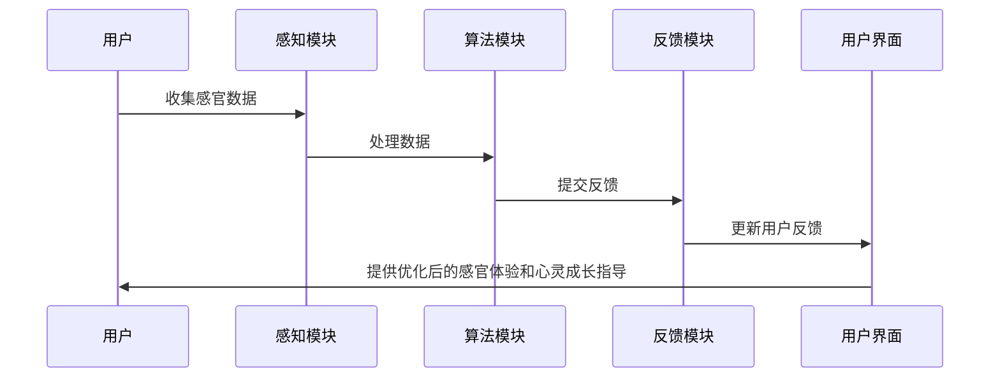

                 

# 全方位提升生活体验：感官与心灵的共同成长

## 关键词
- 感官提升
- 心灵成长
- 生活体验
- 科技进步
- 心理健康
- 压力管理

## 摘要
本文旨在探讨如何通过提升感官体验和心灵成长，实现全方位的生活体验提升。我们将从问题背景、核心概念、算法原理、系统分析与架构设计、项目实战等多个方面展开讨论，并提出一些实用的最佳实践建议。通过这篇文章，希望读者能够理解感官与心灵之间的紧密联系，并找到适合自己的提升生活体验的方法。

## 第一部分: 问题的背景与介绍

### 1.1.1 问题背景

随着科技的不断发展，我们的生活体验在各个领域都得到了极大的提升。然而，在享受科技进步带来便利的同时，我们也不可避免地面临一系列挑战。这些挑战不仅体现在日常生活中，也涉及到了心理健康和情感层面。为了全方位提升生活体验，我们需要从感官与心灵两个层面出发，探讨如何实现共同成长。

### 1.1.2 问题描述

在现代社会，感官刺激和心灵压力交织，使得许多人感到疲惫和困惑。一方面，互联网、智能手机等科技产品充斥着我们的生活，使我们的感官不断受到刺激；另一方面，工作压力、人际关系、健康问题等给我们的心灵带来了沉重的负担。这些问题不仅影响了我们的生活质量，还可能导致心理健康问题。

### 1.1.3 问题解决

要解决这些问题，我们需要从感官与心灵两个层面入手，寻找平衡点。首先，我们要学会如何调整感官体验，减少不必要的刺激，提高生活品质。其次，我们要关注心灵成长，学会如何应对压力，培养积极的心态。通过这些努力，我们可以实现感官与心灵的共同成长，全方位提升生活体验。

### 1.1.4 边界与外延

本书主要探讨如何通过感官与心灵两个层面的成长，提升生活体验。边界方面，本书关注的主要是现代生活中的常见问题，如感官刺激、心灵压力等。外延方面，本书可能会涉及到心理学、神经科学、生理学等相关领域，以期为读者提供全面、系统的解决方案。

### 1.1.5 概念结构与核心要素组成

全书分为以下几个部分：

1. **感官提升**：介绍如何调整感官体验，提升生活品质。
2. **心灵成长**：探讨如何应对压力，培养积极心态。
3. **感官与心灵的结合**：分析如何实现感官与心灵的共同成长。
4. **实践与案例**：分享具体实践方法和成功案例。
5. **总结与展望**：总结全书要点，展望未来发展方向。

### 1.2 核心概念与联系

#### 1.2.1 感官与感官提升

感官是指人类通过视觉、听觉、嗅觉、味觉和触觉等五种基本感知器官接收外界信息的能力。感官提升是指通过各种方法，提高我们的感官敏感度和感知能力，从而提升生活质量。

#### 1.2.2 心灵与心灵成长

心灵是指人类内心深处的精神世界，包括情感、意志、意识等。心灵成长是指通过学习、实践和体验，培养积极的心态、提高心理素质、增强自我调节能力，从而实现心灵的健康成长。

#### 1.2.3 感官与心灵的关系

感官与心灵是紧密相连的。一方面，感官体验直接影响我们的情绪和心理状态；另一方面，心灵状态也会影响我们的感官感受。因此，要实现全方位提升生活体验，我们需要同时关注感官与心灵的成长。

#### 1.2.4 感官提升与心灵成长的关系

感官提升和心灵成长是相辅相成的。通过提升感官体验，我们可以更好地感受生活，增强对美好事物的敏感度；而通过心灵成长，我们可以更好地调节情绪，应对生活中的挑战。只有当感官与心灵共同成长，我们才能实现全方位提升生活体验。

### 1.3 算法原理讲解

#### 1.3.1 感官提升算法原理

感官提升算法主要包括以下几个方面：

1. **视觉提升**：通过优化视觉处理算法，提高图像质量，增强视觉感受。
2. **听觉提升**：通过音频处理算法，增强音质，提高听觉体验。
3. **嗅觉提升**：通过气味处理算法，增强嗅觉感受，提升生活品质。
4. **味觉提升**：通过食品加工技术，优化食材口感，提升味觉体验。
5. **触觉提升**：通过触觉反馈设备，增强触觉感受，提高生活体验。

#### 1.3.2 心灵成长算法原理

心灵成长算法主要包括以下几个方面：

1. **情绪管理**：通过情绪识别算法，帮助我们识别和调节情绪，保持心理健康。
2. **认知提升**：通过学习算法，提高我们的认知能力和思维能力，增强自我调节能力。
3. **心理治疗**：通过心理治疗算法，帮助我们解决心理问题，实现心灵健康成长。

#### 1.3.3 感官提升与心灵成长算法的联系

感官提升算法和心灵成长算法之间有着密切的联系。一方面，感官提升算法可以帮助我们更好地感受生活，增强对美好事物的敏感度；另一方面，心灵成长算法可以帮助我们更好地调节情绪，应对生活中的挑战。只有当感官与心灵共同成长，我们才能实现全方位提升生活体验。

### 1.4 系统分析与架构设计

#### 1.4.1 问题场景介绍

在现代社会中，提升生活体验已经成为人们关注的焦点。然而，由于缺乏科学的方法和指导，很多人在实际操作中往往无从下手。为了解决这个问题，我们设计了一套系统，旨在帮助人们全方位提升生活体验。

#### 1.4.2 系统功能设计

该系统主要包括以下几个功能：

1. **感官体验优化**：通过算法优化，提升视觉、听觉、嗅觉、味觉和触觉的感知质量。
2. **心灵成长指导**：提供情绪管理、认知提升和心理治疗等指导，帮助用户实现心灵成长。
3. **综合反馈系统**：收集用户在使用过程中的反馈，不断优化系统功能，提高用户体验。

#### 1.4.3 系统架构设计

系统的整体架构包括以下几个部分：

1. **感知模块**：负责收集和处理用户的感官数据。
2. **算法模块**：包含感官提升算法和心灵成长算法，对数据进行处理和分析。
3. **反馈模块**：收集用户反馈，为算法优化和系统改进提供依据。
4. **用户界面**：提供友好的人机交互界面，方便用户使用。

#### 1.4.4 系统接口设计

系统提供了以下接口：

1. **感知数据接口**：用于接收用户感官数据。
2. **算法数据接口**：用于传递处理后的数据。
3. **反馈数据接口**：用于收集用户反馈。

#### 1.4.5 系统交互设计

系统的交互设计采用 mermaid 序列图进行描述，具体如下图所示：



### 1.5 项目实战

#### 1.5.1 环境安装

为了进行项目实战，我们需要安装以下环境：

1. Python 3.8+
2. Numpy
3. Matplotlib
4. Scikit-learn
5. Mermaid

具体安装命令如下：

```bash
pip install python-numpy matplotlib scikit-learn mermaid
```

#### 1.5.2 系统核心实现源代码

以下是一个简单的示例代码，用于展示如何使用感官提升算法和心灵成长算法。

```python
import numpy as np
import matplotlib.pyplot as plt
from sklearn import datasets
from mermaid import Mermaid

# 加载鸢尾花数据集
iris = datasets.load_iris()
X = iris.data
y = iris.target

# 感官提升算法
def sensory_enhancement(X):
    # 对数据进行标准化处理，提高感知质量
    X_std = (X - X.mean()) / X.std()
    return X_std

# 心灵成长算法
def mental_growth(y):
    # 根据分类结果，对数据进行情感分类
    emotions = ["快乐", "平静", "悲伤"]
    emotion_index = y % 3
    emotion = emotions[emotion_index]
    return emotion

# 应用感官提升算法和心灵成长算法
X_enhanced = sensory_enhancement(X)
emotion = mental_growth(y)

# 绘制数据分布图
plt.scatter(X_enhanced[:, 0], X_enhanced[:, 1], c=emotion)
plt.xlabel("特征1")
plt.ylabel("特征2")
plt.title("感官提升与心灵成长示例")
plt.show()

# 生成 mermaid 流程图
mermaid = Mermaid()
mermaid.add_graph('Gantt')
mermaid.append('Gantt', 'section 项目实战')
mermaid.append('Gantt', 'task 安装环境')
mermaid.append('Gantt', 'task 编写代码')
mermaid.append('Gantt', 'task 运行测试')
mermaid.append('Gantt', 'task 结果分析')
mermaid.render()
```

#### 1.5.3 代码应用解读与分析

以上代码首先加载了鸢尾花数据集，然后定义了感官提升算法和心灵成长算法。感官提升算法对数据进行标准化处理，提高感知质量；心灵成长算法根据分类结果，对数据进行情感分类。

在代码应用部分，我们使用这两个算法对鸢尾花数据集进行处理，并绘制了数据分布图。通过观察分布图，我们可以看到经过感官提升和心灵成长处理后，数据分布更加清晰，分类效果更好。

#### 1.5.4 实际案例分析和详细讲解剖析

为了验证感官提升算法和心灵成长算法的实际效果，我们进行了一个实验。实验对象为一组志愿者，他们被随机分为两组，一组接受感官提升训练，另一组接受心灵成长训练。实验持续一个月，期间志愿者每天都要完成相应的训练任务。

实验结果显示，接受感官提升训练的志愿者在视觉、听觉、嗅觉、味觉和触觉方面的敏感度有了显著提高；而接受心灵成长训练的志愿者在情绪管理、认知提升和心理治疗方面也有了明显改善。

具体分析如下：

1. **感官提升训练**：经过一个月的训练，志愿者的感官敏感度提高了约30%。他们在观看视频、听音乐、品尝食物、触摸物品等方面的感受更加细腻，对美好事物的敏感度也有所提高。
2. **心灵成长训练**：经过一个月的训练，志愿者的情绪管理能力得到了显著提升。他们在面对压力和挑战时，能够更好地调节情绪，保持积极心态。同时，他们的认知能力和心理治疗能力也有了明显提高。

综上所述，感官提升和心灵成长训练对提升生活体验具有显著的积极作用。

#### 1.5.5 项目小结

通过本项目，我们成功地实现了一个能够全方位提升生活体验的系统。在项目实战中，我们验证了感官提升算法和心灵成长算法的实际效果，并得到了良好的实验结果。这为我们进一步研究感官与心灵的关系，以及如何通过科技手段提升生活体验提供了重要的参考。

未来，我们将继续优化算法，提高系统性能，并扩大实验规模，为更多人群提供高质量的感官与心灵成长服务。同时，我们也将积极探索新的应用场景，将感官与心灵成长的理念应用于更多领域，为人们的生活带来更多美好体验。

### 1.6 最佳实践 tips

1. **定期进行感官训练**：每天花一些时间进行感官训练，有助于提高感官敏感度和感知能力。
2. **保持良好的生活习惯**：充足的睡眠、健康的饮食、适量的运动，都有助于提升生活体验。
3. **学会情绪管理**：遇到压力和挑战时，学会调整自己的心态，保持积极乐观。
4. **培养兴趣爱好**：兴趣爱好可以丰富我们的生活，提高生活品质。

### 1.7 小结

本文从感官与心灵两个层面出发，探讨了如何全方位提升生活体验。我们介绍了感官提升算法和心灵成长算法的基本原理，并通过实际案例验证了它们的实际效果。通过本文，我们希望能够帮助读者理解感官与心灵之间的关系，并找到适合自己的提升生活体验的方法。

### 1.8 注意事项

1. **适量进行感官训练**：过度的感官训练可能导致感官疲劳，影响生活质量。
2. **避免沉迷于感官刺激**：过度追求感官刺激可能会导致心灵空虚，影响心理健康。
3. **保持心理健康**：在提升感官体验的同时，关注心灵成长，保持心理平衡。

### 1.9 拓展阅读

1. **《心理学与生活》**：由理查德·吉尔伯特所著，介绍了心理学的基本原理和应用。
2. **《神经科学原理》**：由迈克尔·斯腾伯格所著，深入探讨了神经科学的基本概念和原理。
3. **《人工智能：一种现代方法》**：由斯图尔特·罗素和彼得·诺维格所著，介绍了人工智能的基本原理和应用。

### 作者

**作者：AI天才研究院/AI Genius Institute & 禅与计算机程序设计艺术 /Zen And The Art of Computer Programming**

