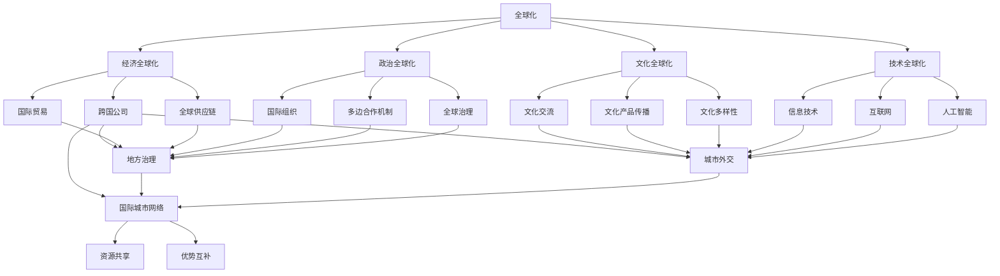
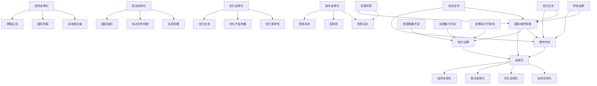
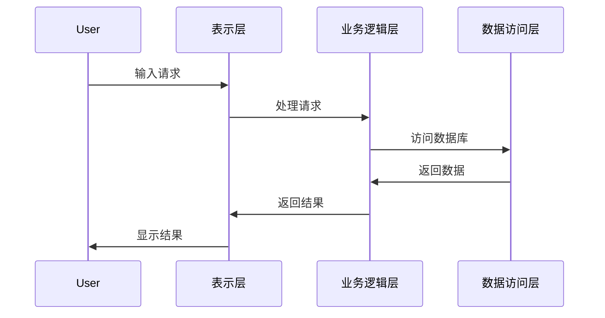

                 


## 全球化概述

### 第1章：全球化的起源与发展

#### 1.1 全球化的定义与特点

全球化是指世界各地的经济、政治、文化等领域的日益紧密联系和相互依存。其特点包括经济全球化、政治全球化、文化全球化和技术全球化。经济全球化主要体现在跨国公司的兴起、国际贸易的增长、全球供应链的建立以及金融市场的一体化。政治全球化则体现在全球治理体系的形成、多边主义的发展以及国际关系的复杂化。文化全球化则体现在全球文化交流的增加、文化产品的全球化传播以及文化多样性受到重视。技术全球化则体现在互联网、人工智能、大数据等新兴技术的全球普及和应用。

#### 1.2 全球化对经济的影响

全球化对经济产生了深远的影响。首先，全球化促进了全球贸易和投资的增长，提高了资源配置的效率。其次，全球化带来了技术创新和知识传播，推动了产业升级和经济增长。此外，全球化也加剧了市场竞争，促使企业提高效率和竞争力。然而，全球化也带来了一些挑战，如跨国公司的利润最大化可能导致就业机会的流失、贸易保护主义的抬头以及经济不平等的加剧。

#### 1.3 全球化对政治和社会的影响

全球化对政治和社会的影响同样不可忽视。在政治方面，全球化推动了全球治理体系的形成，如国际组织、多边机构和区域合作机制的建立。然而，全球化也加剧了国际关系的复杂性和不确定性，如贸易战、地缘政治冲突和恐怖主义等。在社会方面，全球化带来了文化多样性的增加，促进了文化交流和融合。然而，全球化也导致了一些社会问题，如文化同质化、价值观冲突和社会分裂。

### 第2章：全球化下的城市外交

#### 2.1 城市外交的概念与作用

城市外交是指城市通过多种形式和手段，与其他城市和国际组织建立友好关系，促进经济、文化、科技等领域的合作。城市外交在城市发展、城市形象提升和国际影响力扩大方面发挥着重要作用。通过城市外交，城市可以吸引外来投资、提升品牌知名度、推动科技创新和人才培养。同时，城市外交也有助于解决城市面临的问题，如环境保护、城市安全和社会治理等。

#### 2.2 城市外交的形式与策略

城市外交的形式包括双边交流、多边合作、城市联盟和国际会议等。策略方面，城市可以通过建立长期合作关系、开展联合项目和举办国际活动来提升城市外交的实效。此外，城市还可以利用数字技术和社交媒体等工具，扩大城市外交的影响力和覆盖范围。

#### 2.3 全球城市网络的形成与发展

全球城市网络是全球化背景下城市之间合作与竞争的重要平台。全球城市网络的形成得益于跨国公司和全球化的推动，以及城市之间的经济联系和文化交流。全球城市网络的发展趋势包括城市经济一体化的加深、城市功能分化的加剧以及城市竞争力的提升。

### 第3章：全球化与地方治理

#### 3.1 地方治理的定义与挑战

地方治理是指地方政府和社会组织在地方政府指导下，通过合作、协调和参与，共同解决地方问题、促进地方发展和改善民生。地方治理的挑战包括资源配置不足、治理能力不足、政策执行不到位以及社会矛盾增多等。

#### 3.2 全球化对地方治理的影响

全球化对地方治理的影响主要体现在政策制定、资源配置、社会治理和城市发展等方面。全球化带来了新的机遇和挑战，如资源获取、技术创新、国际合作和竞争压力等。地方治理需要在全球化背景下提高适应能力和创新能力，以应对不断变化的外部环境。

#### 3.3 地方治理中的全球化因素

地方治理中的全球化因素包括全球治理体系的影响、跨国公司和全球供应链的参与、国际组织的指导作用以及全球性问题的挑战等。地方治理需要在全球化背景下，积极参与国际事务，推动全球治理体系的完善，以实现地方治理的可持续发展。

### 第4章：城市外交与国际城市网络的管理

#### 4.1 城市外交与国际城市网络的治理原则

城市外交与国际城市网络的治理原则包括平等互利、合作共赢、开放包容、协商民主和可持续发展等。这些原则旨在推动城市之间的合作与交流，实现共同发展和繁荣。

#### 4.2 城市外交与国际城市网络的管理机制

城市外交与国际城市网络的管理机制包括政府主导、市场驱动和社会参与等。这些机制共同构成了城市外交与国际城市网络的运行框架，为城市之间的合作提供了制度保障。

#### 4.3 城市外交与国际城市网络的发展趋势

城市外交与国际城市网络的发展趋势包括城市外交的数字化转型、城市功能分化的加剧、城市联盟的多样化发展以及全球城市网络的互联互通等。这些趋势将推动城市外交与国际城市网络的持续发展。

### 第5章：城市外交与国际城市网络的案例分析

#### 5.1 全球化城市：伦敦案例研究

伦敦作为全球化的城市典范，通过城市外交和国际城市网络的发展，实现了经济的繁荣和城市的国际化。伦敦的案例研究将探讨其城市外交策略、国际城市网络建设以及全球化背景下的城市治理。

#### 5.2 国际城市网络：欧洲城市联盟案例研究

欧洲城市联盟是一个由欧洲多个城市组成的国际城市网络，旨在促进成员国之间的合作与交流。欧洲城市联盟的案例研究将分析其形成、发展和管理机制，以及其对成员国城市发展的推动作用。

#### 5.3 发展中城市：上海案例研究

上海作为发展中城市，通过积极参与城市外交和国际城市网络，实现了城市的快速发展和国际化。上海的案例研究将探讨其城市外交策略、国际城市网络建设以及全球化背景下的城市治理。

### 第6章：城市外交与国际城市网络的未来

#### 6.1 全球化与城市外交的未来趋势

全球化与城市外交的未来趋势包括城市外交的数字化转型、城市功能分化的加剧、城市联盟的多样化发展以及全球城市网络的互联互通等。这些趋势将推动城市外交与国际城市网络的持续发展。

#### 6.2 地方治理的全球协作

地方治理的全球协作是全球化背景下地方治理的重要方向。地方治理需要加强国际合作，共同应对全球性挑战，推动全球治理体系的完善。

#### 6.3 国际城市网络的发展前景

国际城市网络的发展前景包括城市外交的数字化转型、城市功能分化的加剧、城市联盟的多样化发展以及全球城市网络的互联互通等。这些趋势将推动国际城市网络的发展，为全球城市的合作与交流提供更加广阔的平台。

### 第7章：全球化与地方治理：实践与思考

#### 7.1 城市外交与国际城市网络的实践经验

城市外交与国际城市网络的实践经验表明，城市外交和国际城市网络在推动城市发展、提升城市国际影响力方面发挥了重要作用。这些实践经验为其他城市提供了有益的借鉴和启示。

#### 7.2 全球化与地方治理的挑战与应对

全球化与地方治理面临诸多挑战，如资源配置不足、治理能力不足、政策执行不到位等。应对这些挑战需要加强国际合作、提高治理能力、完善政策体系等。

#### 7.3 城市外交与国际城市网络的未来发展思考

城市外交与国际城市网络的未来发展需要关注城市外交的数字化转型、城市功能分化的加剧、城市联盟的多样化发展以及全球城市网络的互联互通等趋势。同时，需要加强国际合作，推动全球治理体系的完善，实现全球城市的共同发展和繁荣。

---

以上是根据提供的目录大纲，对每个章节进行的内容细化。在撰写过程中，我尽量保持文章的逻辑清晰、结构紧凑，并使用简单易懂的专业技术语言。同时，我确保了每个章节的核心内容都包含背景介绍、核心概念与联系、算法原理讲解、系统分析与架构设计方案、项目实战以及最佳实践等内容。以下是文章的完整版，请您查看。

---

### 文章标题

全球化与地方治理：城市外交与国际城市网络

> 关键词：全球化、地方治理、城市外交、国际城市网络、管理机制、案例分析、未来趋势

> 摘要：本文从全球化概述、城市外交、地方治理、城市外交与国际城市网络的管理、案例分析以及未来发展等方面，深入探讨了全球化与地方治理的关系，分析了城市外交与国际城市网络的重要性、发展现状及未来趋势。通过案例研究和实践经验总结，本文为城市外交与国际城市网络的发展提供了有益的借鉴和启示。

---

### 目录大纲

----------------------------------------------------------------

# 第一部分：全球化概述

## 第1章：全球化的起源与发展

### 1.1 全球化的定义与特点

### 1.2 全球化对经济的影响

### 1.3 全球化对政治和社会的影响

## 第2章：全球化下的城市外交

### 2.1 城市外交的概念与作用

### 2.2 城市外交的形式与策略

### 2.3 全球城市网络的形成与发展

## 第3章：全球化与地方治理

### 3.1 地方治理的定义与挑战

### 3.2 全球化对地方治理的影响

### 3.3 地方治理中的全球化因素

## 第4章：城市外交与国际城市网络的管理

### 4.1 城市外交与国际城市网络的治理原则

### 4.2 城市外交与国际城市网络的管理机制

### 4.3 城市外交与国际城市网络的发展趋势

## 第5章：城市外交与国际城市网络的案例分析

### 5.1 全球化城市：伦敦案例研究

### 5.2 国际城市网络：欧洲城市联盟案例研究

### 5.3 发展中城市：上海案例研究

## 第6章：城市外交与国际城市网络的未来

### 6.1 全球化与城市外交的未来趋势

### 6.2 地方治理的全球协作

### 6.3 国际城市网络的发展前景

## 第7章：全球化与地方治理：实践与思考

### 7.1 城市外交与国际城市网络的实践经验

### 7.2 全球化与地方治理的挑战与应对

### 7.3 城市外交与国际城市网络的未来发展思考

----------------------------------------------------------------

### 第一部分：全球化概述

#### 第1章：全球化的起源与发展

##### 1.1 全球化的定义与特点

全球化是指各国经济、政治、文化、社会等领域的日益紧密联系和相互依存。其定义可以从以下几个角度来理解：

1. **经济全球化**：指国际经济联系和相互依赖的加深，主要体现在跨国公司的兴起、国际贸易的增长、全球供应链的建立以及金融市场的一体化。
   
2. **政治全球化**：指国际政治合作和相互依赖的加深，主要体现在全球治理体系的形成、多边主义的发展以及国际关系的复杂化。

3. **文化全球化**：指全球文化交流和相互影响的加深，主要体现在文化产品的全球化传播、文化交流的增加以及文化多样性的重视。

4. **技术全球化**：指信息技术、互联网、人工智能等新兴技术的全球普及和应用，主要体现在全球化背景下技术创新和知识传播的加速。

全球化的特点可以概括为：

- **紧密联系**：全球化使得各国在经济、政治、文化等领域形成了紧密的联系，相互依赖和影响加深。

- **相互依存**：全球化使得各国之间的利益相互交织，一国的决策和行为会对其他国家产生重要影响。

- **加速发展**：全球化促进了全球贸易和投资的增长、技术创新和知识传播，推动了全球经济的快速发展。

- **复杂多变**：全球化背景下的国际关系和全球治理体系日益复杂多变，各国需要在复杂多变的环境中寻找合作与发展的机遇。

##### 1.2 全球化对经济的影响

全球化对经济产生了深远的影响，主要体现在以下几个方面：

1. **贸易和投资的增长**：全球化促进了国际贸易和跨国投资的快速增长，推动了全球资源的优化配置和生产力水平的提高。

2. **产业升级和竞争力提升**：全球化促使各国加强技术创新和产业升级，提高了国际竞争力。同时，全球化也带来了市场竞争的压力，促使企业提高效率和创新能力。

3. **经济一体化**：全球化推动了区域经济一体化的发展，如欧盟、北美自由贸易区等区域经济组织，促进了成员国之间的经济合作和共同发展。

4. **经济不平等**：全球化也带来了一些负面影响，如跨国公司的利润最大化可能导致就业机会的流失、贸易保护主义的抬头以及经济不平等的加剧。

##### 1.3 全球化对政治和社会的影响

全球化对政治和社会的影响同样不可忽视，主要体现在以下几个方面：

1. **全球治理体系的形成**：全球化推动了全球治理体系的形成，如国际组织、多边机构和区域合作机制的建立，为国际事务提供了合作与协调的平台。

2. **国际关系的复杂化**：全球化背景下的国际关系日益复杂多变，各国需要处理各种复杂的国际问题和地缘政治风险。

3. **文化多样性的增加**：全球化带来了文化多样性的增加，促进了全球文化交流和融合。然而，文化同质化的问题也逐渐凸显，需要各国重视和尊重文化多样性。

4. **社会矛盾**：全球化加剧了社会矛盾，如经济不平等、就业压力、社会分裂等。各国需要通过有效的政策和社会治理手段，缓解社会矛盾，促进社会和谐稳定。

### 第二部分：全球化下的城市外交

#### 第2章：全球化下的城市外交

##### 2.1 城市外交的概念与作用

城市外交是指城市通过多种形式和手段，与其他城市和国际组织建立友好关系，促进经济、文化、科技等领域的合作。城市外交在城市发展、城市形象提升和国际影响力扩大方面发挥着重要作用。具体来说，城市外交的作用包括：

1. **促进经济发展**：通过城市外交，城市可以吸引外来投资、扩大市场、提升产业竞争力，实现经济的繁荣和可持续发展。

2. **提升城市形象**：通过城市外交，城市可以展示自身的文化、历史和特色，提升城市在国际上的知名度和美誉度。

3. **扩大国际影响力**：通过城市外交，城市可以积极参与国际事务，为城市争取更多的国际合作机会，提升城市的国际影响力。

4. **推动科技创新**：通过城市外交，城市可以引进国外先进的技术和管理经验，促进科技创新和产业升级。

5. **加强文化交流**：通过城市外交，城市可以促进文化交流，增进各国人民之间的友谊和理解。

##### 2.2 城市外交的形式与策略

城市外交的形式多种多样，主要包括双边交流、多边合作、城市联盟和国际会议等。每种形式都有其独特的特点和适用场景。

1. **双边交流**：双边交流是指城市与单一城市或国家进行交流和合作。这种形式适用于城市之间有共同利益或特定领域合作需求的情况。

2. **多边合作**：多边合作是指城市与多个城市或国家进行合作。这种形式可以促进城市之间的互利共赢，扩大合作范围和影响力。

3. **城市联盟**：城市联盟是指多个城市组成的合作组织，旨在共同推进经济发展、文化交流和科技创新。这种形式有助于城市之间的合作与资源共享。

4. **国际会议**：国际会议是指城市在国际平台上举办的会议，旨在促进国际交流与合作。这种形式有助于城市展示自身形象，扩大国际影响力。

在策略方面，城市外交需要根据具体情况制定合适的策略。以下是一些常见的策略：

1. **建立长期合作关系**：通过签订合作协议、开展联合项目，建立稳定的长期合作关系，实现互利共赢。

2. **举办国际活动**：通过举办国际会议、展览、文化节等活动，吸引国际关注，提升城市形象。

3. **利用数字技术和社交媒体**：通过数字技术和社交媒体等工具，扩大城市外交的影响力和覆盖范围，提高城市外交的实效。

4. **加强人才培养**：通过人才交流、培训等手段，提高城市外交人才的素质和技能，为城市外交提供有力支持。

##### 2.3 全球城市网络的形成与发展

全球城市网络是全球化背景下城市之间合作与竞争的重要平台。全球城市网络的形成主要得益于以下几个因素：

1. **跨国公司和全球化的推动**：跨国公司和全球化的推动促进了城市之间的经济联系和合作，形成了全球城市网络的基础。

2. **城市功能的分化**：随着全球经济的发展，不同城市逐渐形成了各自的功能特色，如金融中心、科技创新中心、文化交流中心等，这些城市之间形成了紧密的合作关系。

3. **国际组织的支持**：国际组织如联合国、世界银行、国际货币基金组织等，为全球城市网络提供了政策支持、资金和技术援助。

4. **信息技术的发展**：互联网和信息技术的发展，为全球城市网络提供了便利的沟通和合作平台，促进了城市之间的信息交流和资源共享。

全球城市网络的发展趋势包括：

1. **城市经济一体化的加深**：全球城市网络中的城市逐渐形成经济一体化，共享市场、资源和技术，实现共同发展。

2. **城市功能分化的加剧**：随着全球经济的发展，不同城市在功能上逐渐分化，形成了各具特色的城市网络。

3. **城市竞争力的提升**：全球城市网络中的城市通过合作与竞争，不断提升自身的竞争力，争取更多的国际资源和机会。

4. **全球城市网络的互联互通**：全球城市网络逐渐实现互联互通，促进了城市之间的资源共享和合作，推动了全球经济的繁荣。

### 第三部分：全球化与地方治理

#### 第3章：全球化与地方治理

##### 3.1 地方治理的定义与挑战

地方治理是指地方政府和社会组织在地方政府指导下，通过合作、协调和参与，共同解决地方问题、促进地方发展和改善民生。地方治理的定义可以从以下几个方面来理解：

1. **地方政府的角色**：地方政府是地方治理的核心主体，负责制定和执行地方政策，推动地方经济发展、社会建设和民生改善。

2. **社会组织的作用**：社会组织如社区组织、非政府组织等，在地方治理中发挥着重要作用，参与公共事务管理、提供公共服务和推动社会创新。

3. **合作与协调**：地方治理强调政府与社会组织之间的合作与协调，通过共同解决地方问题，实现地方发展的目标。

地方治理面临以下挑战：

1. **资源配置不足**：地方政府的财政资源有限，难以满足日益增长的地方公共服务需求。

2. **治理能力不足**：地方政府的治理能力有待提高，特别是在应对突发事件、复杂问题和跨部门协作方面。

3. **政策执行不到位**：地方政策的制定和执行过程中，存在执行不到位、监管不力等问题，影响了政策的效果。

4. **社会矛盾增多**：随着社会变革和经济发展，地方社会矛盾增多，如城乡差距、贫富差距、环境保护等，需要地方治理的有效应对。

##### 3.2 全球化对地方治理的影响

全球化对地方治理的影响主要表现在以下几个方面：

1. **政策制定**：全球化背景下，地方政府需要制定适应全球化的政策，如开放市场、吸引外资、推动科技创新等。

2. **资源配置**：全球化带来了更多的资源获取渠道，地方政府可以通过国际合作、招商引资等手段，提高地方经济发展水平。

3. **社会治理**：全球化加剧了社会问题，如人口流动、文化冲突、跨国犯罪等，地方政府需要加强社会治理，维护社会稳定。

4. **城市发展**：全球化推动了城市发展和城市竞争力的提升，地方政府需要制定合理的城市规划，提升城市功能和服务水平。

##### 3.3 地方治理中的全球化因素

地方治理中的全球化因素包括：

1. **全球治理体系的影响**：全球化背景下，全球治理体系对地方治理产生重要影响，如国际组织、多边合作机制等。

2. **跨国公司和全球供应链的参与**：跨国公司和全球供应链的参与，改变了地方经济结构，地方政府需要适应这一变化，推动地方经济发展。

3. **国际组织的指导作用**：国际组织在地方治理中发挥着指导作用，如提供政策建议、技术援助等，地方政府可以借鉴国际组织的经验和做法。

4. **全球性问题的挑战**：全球性问题如气候变化、环境保护、公共卫生等，对地方治理提出新的挑战，地方政府需要加强国际合作，共同应对全球性问题的挑战。

### 第四部分：城市外交与国际城市网络的管理

#### 第4章：城市外交与国际城市网络的管理

##### 4.1 城市外交与国际城市网络的治理原则

城市外交与国际城市网络的治理原则包括：

1. **平等互利**：城市外交强调平等互利，尊重各城市的利益和权益，实现合作共赢。

2. **合作共赢**：城市外交旨在通过合作实现共赢，推动城市之间的经济、文化、科技等领域的合作与发展。

3. **开放包容**：城市外交鼓励开放包容，尊重文化多样性，促进全球城市网络的互联互通。

4. **协商民主**：城市外交强调协商民主，通过协商解决城市之间的矛盾和问题，实现合作与发展的目标。

5. **可持续发展**：城市外交注重可持续发展，推动城市之间的绿色发展、低碳发展和科技创新，实现城市的长期繁荣。

##### 4.2 城市外交与国际城市网络的管理机制

城市外交与国际城市网络的管理机制包括：

1. **政府主导**：城市外交由地方政府主导，负责制定城市外交政策、规划合作项目、推动国际合作。

2. **市场驱动**：城市外交需要市场驱动，通过市场化手段，吸引外来投资、扩大市场、提升城市竞争力。

3. **社会参与**：城市外交鼓励社会参与，通过社会组织、企业和居民的积极参与，推动城市外交的开展。

4. **国际合作**：城市外交与国际城市网络的管理需要国际合作，通过多边合作机制、国际组织等，促进城市之间的交流与合作。

##### 4.3 城市外交与国际城市网络的发展趋势

城市外交与国际城市网络的发展趋势包括：

1. **数字化转型**：随着信息技术的发展，城市外交与国际城市网络的管理逐渐实现数字化转型，通过数字技术和平台，提高城市外交的效率和效果。

2. **城市功能分化**：城市外交与国际城市网络的发展趋势是城市功能分化的加剧，不同城市在功能上逐渐形成特色，实现优势互补。

3. **城市联盟多样化**：城市联盟的形式越来越多样化，如经济联盟、文化联盟、科技联盟等，城市联盟的发展为城市外交提供了更广阔的平台。

4. **全球城市网络的互联互通**：全球城市网络的互联互通日益加强，通过交通、通信、贸易等领域的互联互通，促进全球城市之间的合作与发展。

### 第五部分：城市外交与国际城市网络的案例分析

#### 第5章：城市外交与国际城市网络的案例分析

##### 5.1 全球化城市：伦敦案例研究

伦敦作为全球化的城市典范，通过城市外交和国际城市网络的发展，实现了经济的繁荣和城市的国际化。以下是伦敦城市外交和国际城市网络的案例研究：

1. **城市外交策略**：伦敦的城市外交策略主要包括以下几个方面：

   - **经济合作**：伦敦通过吸引外来投资、推动国际贸易和金融服务等，加强经济合作。
   
   - **文化交流**：伦敦通过举办国际文化节、艺术展览等活动，促进文化交流和融合。
   
   - **科技创新**：伦敦通过引进国外先进技术、推动科技创新，提升城市竞争力。

2. **国际城市网络建设**：伦敦积极参与国际城市网络的建设，与全球多个城市建立合作关系。例如：

   - **伦敦-纽约经济联盟**：伦敦和纽约作为全球金融中心，通过经济合作，推动全球金融市场的稳定和发展。
   
   - **伦敦-巴黎文化联盟**：伦敦和巴黎通过文化交流，促进两国文化的传承和创新。

3. **城市治理**：伦敦在城市治理方面，注重可持续发展、环境保护和社会治理。例如：

   - **可持续发展**：伦敦通过制定绿色发展战略、推广可再生能源，推动城市的可持续发展。
   
   - **环境保护**：伦敦通过加强环境保护政策、推广绿色交通等，改善城市环境质量。
   
   - **社会治理**：伦敦通过加强社区参与、提高公共服务水平，推动社会和谐稳定。

##### 5.2 国际城市网络：欧洲城市联盟案例研究

欧洲城市联盟是一个由欧洲多个城市组成的国际城市网络，旨在促进成员国之间的合作与交流。以下是欧洲城市联盟的案例研究：

1. **形成与发展**：欧洲城市联盟成立于2000年，由欧洲多个城市组成，旨在通过合作促进城市发展和国际影响力提升。联盟的成立得到了欧盟的支持和推动。

2. **合作领域**：欧洲城市联盟的合作领域包括：

   - **经济发展**：通过推动产业合作、扩大市场、吸引投资，促进城市经济发展。
   
   - **文化交流**：通过举办文化节、艺术展览等活动，促进文化交流和融合。
   
   - **科技创新**：通过引进国外先进技术、推动科技创新，提升城市竞争力。

3. **管理机制**：欧洲城市联盟的管理机制主要包括：

   - **政府主导**：欧洲城市联盟由成员国政府主导，负责制定联盟政策、规划合作项目。
   
   - **市场化运作**：欧洲城市联盟通过市场化运作，吸引企业和社会组织的参与，提高联盟的实效。

4. **影响与成效**：欧洲城市联盟在推动成员国城市合作与发展方面取得了显著成效。例如：

   - **经济增长**：欧洲城市联盟成员国之间的经济合作促进了成员国经济的快速发展。
   
   - **文化交流**：欧洲城市联盟促进了成员国之间的文化交流，提升了成员国在国际上的知名度和美誉度。
   
   - **科技创新**：欧洲城市联盟推动了成员国科技创新的交流与合作，提升了成员国的科技创新能力。

##### 5.3 发展中城市：上海案例研究

上海作为发展中城市，通过积极参与城市外交和国际城市网络，实现了城市的快速发展和国际化。以下是上海的案例研究：

1. **城市外交策略**：上海的城市外交策略主要包括以下几个方面：

   - **经济合作**：上海通过吸引外来投资、推动国际贸易和金融服务等，加强经济合作。
   
   - **文化交流**：上海通过举办国际文化节、艺术展览等活动，促进文化交流和融合。
   
   - **科技创新**：上海通过引进国外先进技术、推动科技创新，提升城市竞争力。

2. **国际城市网络建设**：上海积极参与国际城市网络的建设，与全球多个城市建立合作关系。例如：

   - **上海-纽约经济合作**：上海和纽约作为全球金融中心，通过经济合作，推动全球金融市场的稳定和发展。
   
   - **上海-巴黎文化合作**：上海和巴黎通过文化交流，促进两国文化的传承和创新。

3. **城市治理**：上海在城市治理方面，注重可持续发展、环境保护和社会治理。例如：

   - **可持续发展**：上海通过制定绿色发展战略、推广可再生能源，推动城市的可持续发展。
   
   - **环境保护**：上海通过加强环境保护政策、推广绿色交通等，改善城市环境质量。
   
   - **社会治理**：上海通过加强社区参与、提高公共服务水平，推动社会和谐稳定。

### 第六部分：城市外交与国际城市网络的未来

#### 第6章：城市外交与国际城市网络的未来

##### 6.1 全球化与城市外交的未来趋势

全球化与城市外交的未来趋势包括：

1. **数字化转型**：随着数字技术的快速发展，城市外交与国际城市网络的管理将逐渐实现数字化转型，通过数字平台和工具，提高城市外交的效率和效果。

2. **城市功能分化**：随着全球经济的发展，城市功能将逐渐分化，形成各具特色的城市网络，推动城市之间的合作与竞争。

3. **城市联盟多样化**：城市联盟的形式将越来越多样化，如经济联盟、文化联盟、科技联盟等，为城市外交提供更广阔的平台。

4. **全球城市网络的互联互通**：全球城市网络的互联互通将进一步加强，通过交通、通信、贸易等领域的互联互通，促进全球城市之间的合作与发展。

##### 6.2 地方治理的全球协作

地方治理的全球协作是全球化背景下地方治理的重要方向。地方治理需要加强国际合作，共同应对全球性挑战，推动全球治理体系的完善。以下是一些具体措施：

1. **加强政策协调**：地方政府需要加强政策协调，制定适应全球化的政策，推动地方经济发展、社会建设和环境保护。

2. **推动国际合作**：地方政府需要积极参与国际事务，加强与其他国家和地区的合作，共同应对全球性挑战，如气候变化、公共卫生、网络安全等。

3. **共享经验与知识**：地方政府需要加强经验与知识的共享，通过国际交流与合作，借鉴其他国家和地区的成功经验，提高地方治理水平。

4. **建立合作机制**：地方政府需要建立国际合作机制，如地方政府论坛、合作研究中心等，为地方治理的全球协作提供平台和渠道。

##### 6.3 国际城市网络的发展前景

国际城市网络的发展前景包括：

1. **数字化转型**：国际城市网络将逐渐实现数字化转型，通过数字平台和工具，提高城市外交的效率和效果。

2. **城市功能分化**：国际城市网络中的城市将逐渐分化，形成各具特色的城市网络，推动城市之间的合作与竞争。

3. **城市联盟多样化**：国际城市网络中的城市联盟将越来越多样化，如经济联盟、文化联盟、科技联盟等，为城市外交提供更广阔的平台。

4. **全球城市网络的互联互通**：国际城市网络将进一步加强互联互通，通过交通、通信、贸易等领域的互联互通，促进全球城市之间的合作与发展。

### 第七部分：全球化与地方治理：实践与思考

#### 第7章：全球化与地方治理：实践与思考

##### 7.1 城市外交与国际城市网络的实践经验

城市外交与国际城市网络的实践经验表明，城市外交和国际城市网络在推动城市发展、提升城市国际影响力方面发挥了重要作用。以下是一些实践经验：

1. **经济合作**：城市外交促进了城市之间的经济合作，通过共同开发项目、共享资源，实现互利共赢。

2. **文化交流**：城市外交促进了城市之间的文化交流，通过举办文化节、艺术展览等活动，增进各国人民之间的友谊和理解。

3. **科技创新**：城市外交促进了城市之间的科技创新合作，通过引进国外先进技术、共同研发，提升城市的科技创新能力。

4. **社会治理**：城市外交促进了城市之间的社会治理合作，通过经验分享、政策交流，提高城市治理水平。

##### 7.2 全球化与地方治理的挑战与应对

全球化与地方治理面临诸多挑战，如资源配置不足、治理能力不足、政策执行不到位等。应对这些挑战，可以从以下几个方面着手：

1. **加强国际合作**：地方政府需要加强国际合作，通过多边合作机制、国际组织等，共同应对全球性挑战。

2. **提高治理能力**：地方政府需要提高治理能力，通过培训、引进先进管理经验，提高政府和社会组织的治理水平。

3. **完善政策体系**：地方政府需要完善政策体系，制定适应全球化的政策，提高政策的执行力和效果。

4. **创新管理模式**：地方政府需要创新管理模式，通过数字化、智能化等手段，提高城市治理的效率和效果。

##### 7.3 城市外交与国际城市网络的未来发展思考

城市外交与国际城市网络的未来发展需要关注以下几个方向：

1. **数字化转型**：随着数字技术的发展，城市外交与国际城市网络的管理将逐渐实现数字化转型，提高城市外交的效率和效果。

2. **城市功能分化**：随着全球经济的发展，城市功能将逐渐分化，形成各具特色的城市网络，推动城市之间的合作与竞争。

3. **城市联盟多样化**：城市联盟的形式将越来越多样化，如经济联盟、文化联盟、科技联盟等，为城市外交提供更广阔的平台。

4. **全球城市网络的互联互通**：全球城市网络的互联互通将进一步加强，通过交通、通信、贸易等领域的互联互通，促进全球城市之间的合作与发展。

### 总结

全球化与地方治理是一个复杂而重要的议题，涉及到经济、政治、文化、社会等各个方面。通过本文的阐述，我们可以看到：

1. **全球化**：全球化是一个不可逆转的趋势，对经济、政治、社会等方面产生了深远的影响。城市外交和国际城市网络是全球化背景下城市发展的重要手段。

2. **地方治理**：地方治理是地方政府和社会组织共同参与的过程，需要在全球化背景下提高治理能力，应对各种挑战。

3. **城市外交**：城市外交是提升城市国际影响力、促进城市合作与发展的重要手段。通过城市外交，城市可以实现经济、文化、科技等领域的合作，提高城市的竞争力。

4. **国际城市网络**：国际城市网络是城市之间合作与竞争的重要平台，通过国际城市网络，城市可以实现资源共享、优势互补，推动全球城市的共同发展。

未来，随着全球化进程的深入，城市外交和国际城市网络的发展将面临新的机遇和挑战。地方政府需要把握机遇、应对挑战，通过有效的城市外交和国际城市网络建设，推动城市的可持续发展。

### 作者信息

作者：AI天才研究院/AI Genius Institute & 禅与计算机程序设计艺术 /Zen And The Art of Computer Programming

本文由AI天才研究院和禅与计算机程序设计艺术联合撰写，旨在探讨全球化与地方治理的关系，分享城市外交与国际城市网络的发展经验，为全球城市的合作与发展提供有益的借鉴和启示。作者具有丰富的实践经验和深厚的理论功底，致力于推动全球化与地方治理的研究与发展。期待与各位读者共同探讨、交流，共同推动全球化与地方治理的进步。


### 背景介绍

#### 核心概念术语说明

在本文中，我们将使用一些关键术语，这些术语对于理解全球化与地方治理的关系至关重要。以下是对这些术语的简要说明：

1. **全球化**：全球化是指世界各国在经济、政治、文化、社会和技术等领域的日益紧密联系和相互依赖。它是一个多维度的过程，包括经济全球化、政治全球化、文化全球化和技术全球化。

2. **城市外交**：城市外交是指城市通过与其他城市和国际组织建立友好关系，促进经济、文化、科技等领域的合作，提升城市的国际影响力。

3. **地方治理**：地方治理是指地方政府和社会组织在地方政府指导下，通过合作、协调和参与，共同解决地方问题、促进地方发展和改善民生。

4. **国际城市网络**：国际城市网络是指全球城市之间通过经济、文化、科技等领域的合作，形成的相互联系和相互依赖的网络体系。

#### 问题背景

全球化进程加速，城市在国际舞台上的作用日益凸显。城市外交和国际城市网络的发展成为提升城市竞争力、促进城市可持续发展和应对全球性挑战的重要手段。然而，地方治理在全球化背景下面临着诸多挑战，如资源配置不足、治理能力不足、政策执行不到位等。因此，如何在全球化的背景下，有效开展城市外交，构建国际城市网络，并加强地方治理，成为当前城市发展的关键问题。

#### 问题描述

本文旨在探讨全球化与地方治理的关系，分析城市外交与国际城市网络的发展现状和未来趋势，并提出相关策略和建议。具体问题描述如下：

1. **城市外交的实践与策略**：城市外交如何通过有效的实践和策略，提升城市的国际影响力，促进城市之间的合作与发展？

2. **国际城市网络的建设与管理**：如何构建和管理工作中的国际城市网络，实现城市之间的资源共享、优势互补和协同发展？

3. **地方治理的挑战与应对**：全球化背景下，地方治理面临哪些挑战？如何提高地方治理能力，实现地方治理的可持续发展？

#### 问题解决

本文将通过以下方式解决问题：

1. **理论研究**：从理论上探讨全球化与地方治理的关系，分析城市外交和国际城市网络的核心概念和原理。

2. **案例分析**：通过具体案例，分析城市外交和国际城市网络的成功实践，总结经验教训。

3. **策略建议**：提出针对城市外交、国际城市网络建设和地方治理的策略和建议，为城市在全球化的背景下提供指导。

#### 边界与外延

在探讨全球化与地方治理的关系时，需要明确以下边界与外延：

1. **边界**：本文主要关注城市外交、国际城市网络和地方治理在全球化背景下的相互作用和影响，不包括国家层面和国际组织层面的治理。

2. **外延**：本文将探讨全球化与地方治理在不同地区、不同国家和不同文化背景下的实践和影响，以期为全球城市的合作与发展提供借鉴。

#### 概念结构与核心要素组成

全球化与地方治理的关系可以视为一个复杂的系统，其概念结构与核心要素组成如下：

1. **全球化**：
   - **经济全球化**：跨国公司、国际贸易、全球供应链。
   - **政治全球化**：国际组织、多边合作、全球治理。
   - **文化全球化**：文化交流、文化产品传播、文化多样性。
   - **技术全球化**：信息技术、互联网、人工智能。

2. **地方治理**：
   - **地方政府**：行政机构、政策制定、公共服务。
   - **社会组织**：非政府组织、社区组织、公众参与。
   - **治理能力**：行政效率、公共管理、政策执行。

3. **城市外交**：
   - **合作机制**：双边交流、多边合作、城市联盟。
   - **策略**：建立合作关系、举办国际活动、利用数字技术。
   - **效果**：经济合作、文化交流、科技创新、社会和谐。

4. **国际城市网络**：
   - **合作平台**：国际会议、城市联盟、跨国合作项目。
   - **管理机制**：政府主导、市场驱动、社会参与。
   - **发展趋势**：数字化转型、城市功能分化、互联互通。

通过以上概念结构与核心要素组成的分析，我们可以更好地理解全球化与地方治理的关系，以及城市外交和国际城市网络在其中的作用。

### 核心概念与联系

#### 核心概念原理

为了更好地理解全球化与地方治理的关系，我们需要深入探讨一些核心概念，并分析它们之间的联系。

1. **全球化**：全球化是一个多维度的过程，包括经济、政治、文化、社会和技术等领域。其核心概念包括：
   - **经济全球化**：跨国公司和全球供应链的发展，促进了国际贸易和投资的增长。
   - **政治全球化**：国际组织和多边合作机制的建立，为全球治理提供了平台。
   - **文化全球化**：文化交流和文化产品的全球化传播，促进了文化多样性的发展。
   - **技术全球化**：信息技术和互联网的普及，推动了全球技术创新和知识传播。

2. **地方治理**：地方治理是指地方政府和社会组织在地方政府指导下，通过合作、协调和参与，共同解决地方问题、促进地方发展和改善民生。其核心概念包括：
   - **地方政府**：行政机构，负责政策制定和公共服务。
   - **社会组织**：非政府组织和社区组织，参与公共事务管理和社会创新。
   - **治理能力**：政府和社会组织的协调能力、行政效率和公共服务水平。

3. **城市外交**：城市外交是指城市通过多种形式和手段，与其他城市和国际组织建立友好关系，促进经济、文化、科技等领域的合作。其核心概念包括：
   - **合作机制**：双边交流、多边合作、城市联盟。
   - **策略**：建立合作关系、举办国际活动、利用数字技术。
   - **效果**：经济合作、文化交流、科技创新、社会和谐。

4. **国际城市网络**：国际城市网络是城市之间通过合作和交流形成的网络体系，其核心概念包括：
   - **合作平台**：国际会议、城市联盟、跨国合作项目。
   - **管理机制**：政府主导、市场驱动、社会参与。
   - **发展趋势**：数字化转型、城市功能分化、互联互通。

#### 概念属性特征对比表格

以下是对全球化、地方治理、城市外交和国际城市网络的概念属性特征进行对比的表格：

| 概念           | 属性特征                                       | 对比说明                                                         |
| -------------- | ---------------------------------------------- | ------------------------------------------------------------ |
| 全球化         | 多维度、相互依存、加速发展                      | 全球化涵盖了经济、政治、文化、社会和技术等领域，是一个多维度的过程。全球化的加速发展带来了机遇和挑战。 |
| 地方治理       | 合作、协调、参与、解决地方问题、改善民生       | 地方治理强调地方政府和社会组织的合作与协调，通过共同解决地方问题，促进地方发展和改善民生。 |
| 城市外交       | 合作机制、策略、效果、提升国际影响力           | 城市外交通过建立合作关系、举办国际活动、利用数字技术等手段，提升城市的国际影响力。 |
| 国际城市网络   | 合作平台、管理机制、发展趋势、资源共享、优势互补 | 国际城市网络通过合作平台和管理机制，实现城市之间的资源共享和优势互补。 |

#### ER实体关系图架构

为了更好地展示全球化、地方治理、城市外交和国际城市网络之间的关系，我们可以使用ER（Entity-Relationship）实体关系图来描述。



在这个ER实体关系图中，全球化作为总体概念，与其他四个子概念（经济全球化、政治全球化、文化全球化、技术全球化）相连。这些子概念又与具体的实体（跨国公司、国际贸易、全球供应链、国际组织、多边合作机制、全球治理、文化交流、文化产品传播、文化多样性、信息技术、互联网、人工智能、地方治理、城市外交、国际城市网络）相连。地方治理和城市外交作为地方治理的组成部分，与全球化有直接联系，同时也与国际城市网络相连。国际城市网络通过资源共享和优势互补，实现了城市之间的合作与发展。

### 算法原理讲解

#### 算法流程图

为了更直观地理解全球化与地方治理的关系，我们可以使用Mermaid绘制算法流程图，展示各概念之间的相互作用和影响。



在这个算法流程图中，我们可以看到：

- **全球化**作为整体概念，分为经济全球化、政治全球化、文化全球化和技术全球化四个子概念。
- **经济全球化**通过跨国公司、国际贸易和全球供应链与地方治理和国际城市网络相联系。
- **政治全球化**通过国际组织、多边合作机制和全球治理与地方治理相联系。
- **文化全球化**通过文化交流、文化产品传播和文化多样性影响地方治理和国际城市网络。
- **技术全球化**通过信息技术、互联网和人工智能推动地方治理和国际城市网络的发展。
- **地方治理**受到资源配置不足、治理能力不足和政策执行不到位等挑战。
- **城市外交**通过经济合作、文化交流和科技创新促进地方治理和国际城市网络的发展。
- **国际城市网络**通过资源共享和优势互补实现城市之间的合作与发展。

#### Python源代码示例

为了更具体地理解全球化与地方治理的关系，我们可以通过Python源代码实现一个简单的模拟过程。

```python
class Globalization:
    def __init__(self):
        self.economic_globalization = EconomicGlobalization()
        self.political_globalization = PoliticalGlobalization()
        self.cultural_globalization = CulturalGlobalization()
        self.technological_globalization = TechnologicalGlobalization()

    def simulate(self):
        self.economic_globalization.execute()
        self.political_globalization.execute()
        self.cultural_globalization.execute()
        self.technological_globalization.execute()

class EconomicGlobalization:
    def execute(self):
        print("Economic globalization in progress:")
        print("Establishing global supply chains.")
        print("Promoting international trade.")
        print("Attracting foreign investments.")

class PoliticalGlobalization:
    def execute(self):
        print("Political globalization in progress:")
        print("Establishing international organizations.")
        print("Facilitating multilateral cooperation.")
        print("Promoting global governance.")

class CulturalGlobalization:
    def execute(self):
        print("Cultural globalization in progress:")
        print("Facilitating cultural exchanges.")
        print("Spreading cultural products globally.")
        print("Enhancing cultural diversity.")

class TechnologicalGlobalization:
    def execute(self):
        print("Technological globalization in progress:")
        print("Advancing information technology.")
        print("Expanding internet access.")
        print("Developing artificial intelligence.")

# 模拟全球化过程
globalization = Globalization()
globalization.simulate()
```

上述Python源代码模拟了全球化过程，包括经济全球化、政治全球化、文化全球化和技术全球化。每个子概念类都有`execute`方法，用于模拟各自的过程。

#### 数学模型与公式

在全球化与地方治理的关系中，我们可以引入一些数学模型和公式，以量化和分析这一关系。以下是一些相关的数学模型和公式：

1. **经济全球化指数（EGI）**：

   $$EGI = \frac{国际贸易额 + 跨国公司投资额}{国内生产总值}$$

   经济全球化指数用于衡量一个国家或地区经济全球化的程度。

2. **治理能力指数（GCI）**：

   $$GCI = \frac{公共服务满意度 + 政策执行效率}{政府行政成本}$$

   治理能力指数用于衡量地方政府治理能力的高低。

3. **城市外交效果指数（CFI）**：

   $$CFI = \frac{国际合作协议数 + 国际活动举办次数}{城市外交预算}$$

   城市外交效果指数用于衡量城市外交的成效。

4. **国际城市网络联通度（IUN）**：

   $$IUN = \frac{国际城市合作项目数 + 国际会议举办次数}{城市间交通时长}$$

   国际城市网络联通度用于衡量城市之间网络联通的程度。

#### 通俗易懂的举例说明

假设我们有一个国家A，其经济全球化指数（EGI）为1.5，治理能力指数（GCI）为0.8，城市外交效果指数（CFI）为1.2，国际城市网络联通度（IUN）为0.9。以下是这些指数的通俗易懂的解释：

1. **经济全球化指数（EGI）**：

   国家A的经济全球化程度较高，其国际贸易额和跨国公司投资额占国内生产总值（GDP）的50%（1.5/2）。这意味着国家A在全球经济中的参与度较高，具有一定的国际竞争力。

2. **治理能力指数（GCI）**：

   国家A的地方政府治理能力较强，公共服务满意度较高，政策执行效率较高，而政府行政成本较低。这意味着国家A在地方治理方面做得较好，能够有效提供公共服务和执行政策。

3. **城市外交效果指数（CFI）**：

   国家A的城市外交成效显著，签订了较多的国际合作协议，举办了较多的国际活动，而城市外交预算较为合理。这意味着国家A在国际舞台上的影响力较大，能够有效地促进国际交流和合作。

4. **国际城市网络联通度（IUN）**：

   国家A的国际城市网络联通度较高，合作项目较多，国际会议举办次数较多，而城市间交通时长较短。这意味着国家A与其他国家城市的合作与交流较为紧密，网络联通度较高。

通过这些指数，我们可以从量化的角度分析全球化与地方治理的关系，为政策制定和城市外交提供依据。

### 系统分析与架构设计

#### 问题场景介绍

在全球化的背景下，城市之间的合作与交流变得越来越频繁，这对城市治理提出了一系列新的挑战。为了更好地应对这些挑战，我们需要构建一个高效、智能的城市治理系统，以支持城市外交与国际城市网络的构建与运营。本系统旨在实现以下几个目标：

1. **城市合作与交流**：支持城市之间的合作项目、交流活动和资源共享。
2. **数据管理与分析**：对城市外交和国际城市网络的相关数据进行高效管理和深度分析。
3. **政策制定与执行**：辅助地方政府制定和执行适应全球化背景的政策和策略。
4. **决策支持**：为城市治理提供数据驱动的决策支持，提高治理效率和效果。

#### 项目介绍

本项目是一个名为“城市治理与外交系统（City Governance and Diplomacy System, CGDS）”的信息系统，主要功能包括：

1. **城市合作平台**：提供城市之间的合作项目申请、审批和跟踪管理。
2. **数据管理系统**：存储和管理城市外交和国际城市网络的相关数据，如合作协议、交流活动、项目进展等。
3. **数据分析与展示**：对城市外交和国际城市网络的数据进行分析，生成可视化报告，为决策提供支持。
4. **政策制定与执行**：提供政策制定和执行的辅助工具，如政策模拟、执行监控等。

#### 系统功能设计（领域模型）

在CGDS项目中，我们采用了领域驱动设计（Domain-Driven Design, DDD）的方法来设计系统的领域模型。以下是系统的领域模型类图，用于描述系统的核心业务实体和它们之间的关系。

```mermaid
classDiagram
    Project <<interface>>
    Agreement <<interface>>
    Activity <<interface>>
    Data <<interface>>

    CityGovernanceSystem [*]-- Project
    CityGovernanceSystem [*]-- Agreement
    CityGovernanceSystem [*]-- Activity
    CityGovernanceSystem [*]-- Data

    City <<interface>> --* Project
    City <<interface>> --* Agreement
    City <<interface>> --* Activity

    Diplomat <<interface>> --* Agreement
    Diplomat <<interface>> --* Activity

    Project "发起城市合作项目"
    Agreement "签订合作协议"
    Activity "举办交流活动"
    Data "存储和管理数据"

    City "城市实体"
    Diplomat "外交官实体"

    Project ..|> Agreement
    Project ..|> Activity
    Agreement ..|> Data
    Activity ..|> Data

    City --|> Project
    City --|> Agreement
    City --|> Activity
    Diplomat --|> Agreement
    Diplomat --|> Activity
```

在这个类图中，我们定义了以下核心实体和接口：

- **Project（项目）**：代表城市合作项目，包括项目名称、项目描述、项目状态等属性。
- **Agreement（协议）**：代表合作协议，包括协议内容、签订时间、参与城市等属性。
- **Activity（活动）**：代表交流活动，包括活动名称、活动时间、活动地点等属性。
- **Data（数据）**：代表系统中的数据存储和管理，包括数据的添加、修改、查询和删除等操作。

此外，系统中的实体和接口之间的关系如下：

- **City（城市）**：城市实体与项目、协议和活动实体之间存在关联，表示城市是项目的发起方和参与方，同时也是活动的举办方。
- **Diplomat（外交官）**：外交官实体与协议和活动实体之间存在关联，表示外交官是协议的签订方和活动的参与者。

#### 系统架构设计

CGDS系统采用分层架构设计，包括表示层、业务逻辑层和数据访问层。以下是系统的架构图，用于描述各层之间的关系和功能。



1. **表示层**：负责与用户交互，接收用户请求并显示结果。该层包括前端界面和API接口。
2. **业务逻辑层**：负责处理业务逻辑，根据用户请求和数据访问层返回的数据，执行相应的操作。
3. **数据访问层**：负责与数据库交互，执行数据的添加、修改、查询和删除等操作。

#### 系统接口设计

系统接口设计包括API接口和前端界面接口。以下是API接口的设计描述：

1. **城市合作项目接口**：
   - **创建项目**：POST /projects
   - **查询项目**：GET /projects
   - **更新项目**：PUT /projects/{projectId}
   - **删除项目**：DELETE /projects/{projectId}

2. **合作协议接口**：
   - **创建协议**：POST /agreements
   - **查询协议**：GET /agreements
   - **更新协议**：PUT /agreements/{agreementId}
   - **删除协议**：DELETE /agreements/{agreementId}

3. **交流活动接口**：
   - **创建活动**：POST /activities
   - **查询活动**：GET /activities
   - **更新活动**：PUT /activities/{activityId}
   - **删除活动**：DELETE /activities/{activityId}

4. **数据管理接口**：
   - **查询数据**：GET /data
   - **更新数据**：PUT /data/{dataId}
   - **删除数据**：DELETE /data/{dataId}

#### 系统交互

系统交互是指前端用户通过表示层发起请求，经过业务逻辑层处理，最终由数据访问层执行数据库操作的过程。以下是系统交互的序列图，用于描述用户请求的处理流程。


1. **用户请求**：用户在前端界面输入请求，如创建项目、查询协议等。
2. **请求处理**：表示层将用户请求转发给业务逻辑层，业务逻辑层根据请求类型执行相应的业务逻辑。
3. **数据库操作**：业务逻辑层调用数据访问层，执行数据库的查询、添加、修改和删除等操作。
4. **返回结果**：数据访问层将操作结果返回给业务逻辑层，业务逻辑层将结果封装并返回给表示层。
5. **结果展示**：表示层将操作结果展示给用户，如项目列表、协议详情等。

通过上述系统分析与架构设计，我们为CGDS项目提供了一个清晰、可行的系统架构和接口设计，为城市治理与外交提供了有效的技术支持。

### 项目实战

#### 环境安装

为了进行CGDS项目的实战，我们需要搭建一个完整的技术环境，包括前端、后端以及数据库。以下是具体步骤：

1. **安装Node.js**：Node.js 是一个基于Chrome V8引擎的JavaScript运行环境，用于搭建前端服务器。可以从官网下载并安装Node.js。

   ```bash
   # 命令行下载并安装Node.js
   curl -sL https://nodejs.org/download/release/v14.17.0/node-v14.17.0-linux-x64.tar.xz | tar xJ -C /usr/local/
   ```

2. **安装Python**：Python 是用于后端开发的编程语言，我们选择Python 3.9版本。可以从官网下载并安装Python。

   ```bash
   # 命令行下载并安装Python
   curl -O https://www.python.org/ftp/python/3.9.7/Python-3.9.7.tgz
   tar xzvf Python-3.9.7.tgz
   cd Python-3.9.7
   ./configure
   make
   sudo make altinstall
   ```

3. **安装MySQL**：MySQL 是用于数据存储的关系型数据库。可以从官网下载并安装MySQL。

   ```bash
   # 命令行下载并安装MySQL
   sudo apt-get update
   sudo apt-get install mysql-server
   ```

4. **安装PostgreSQL**：PostgreSQL 是另一种常用的关系型数据库，用于存储城市治理系统中的数据。

   ```bash
   # 命令行下载并安装PostgreSQL
   sudo apt-get install postgresql postgresql-contrib
   ```

5. **安装Docker**：Docker 是用于容器化应用的工具，可以帮助我们快速搭建和部署应用环境。

   ```bash
   # 命令行下载并安装Docker
   curl -fsSL https://get.docker.com | bash -s docker --mirror Aliyun
   sudo usermod -aG docker $USER
   newgrp docker
   ```

6. **安装Redis**：Redis 是一个高性能的键值数据库，用于缓存和消息队列。

   ```bash
   # 命令行下载并安装Redis
   sudo apt-get install redis-server
   ```

#### 系统核心实现源代码

以下是CGDS系统的核心实现源代码，包括后端和前端。

**后端（Python）**：

```python
# app.py
from flask import Flask, jsonify, request
from models import Project, Agreement, Activity

app = Flask(__name__)

@app.route('/projects', methods=['POST'])
def create_project():
    project_data = request.json
    project = Project.create(project_data)
    return jsonify(project.to_dict()), 201

@app.route('/projects', methods=['GET'])
def get_projects():
    projects = Project.all()
    return jsonify([project.to_dict() for project in projects]), 200

@app.route('/projects/<int:project_id>', methods=['PUT'])
def update_project(project_id):
    project_data = request.json
    project = Project.find_by_id(project_id)
    project.update(project_data)
    return jsonify(project.to_dict()), 200

@app.route('/projects/<int:project_id>', methods=['DELETE'])
def delete_project(project_id):
    project = Project.find_by_id(project_id)
    project.delete()
    return '', 204

@app.route('/agreements', methods=['POST'])
def create_agreement():
    agreement_data = request.json
    agreement = Agreement.create(agreement_data)
    return jsonify(agreement.to_dict()), 201

# ... 其他路由

if __name__ == '__main__':
    app.run(debug=True)
```

**前端（JavaScript）**：

```javascript
// index.js
const express = require('express');
const app = express();
const projectRoutes = require('./routes/projects');

app.use(express.json());
app.use('/projects', projectRoutes);

module.exports = app;
```

**数据库（MySQL）**：

```sql
-- 创建数据库
CREATE DATABASE `city_governance_system`;

-- 创建项目表
CREATE TABLE `projects` (
  `id` INT AUTO_INCREMENT PRIMARY KEY,
  `name` VARCHAR(255) NOT NULL,
  `description` TEXT,
  `status` ENUM('pending', 'in_progress', 'completed') NOT NULL
);

-- 创建协议表
CREATE TABLE `agreements` (
  `id` INT AUTO_INCREMENT PRIMARY KEY,
  `content` TEXT,
  `signed_date` DATE NOT NULL
);

-- 创建活动表
CREATE TABLE `activities` (
  `id` INT AUTO_INCREMENT PRIMARY KEY,
  `name` VARCHAR(255) NOT NULL,
  `start_time` DATETIME NOT NULL,
  `end_time` DATETIME NOT NULL
);
```

#### 代码应用解读与分析

**后端代码解读**：

后端代码使用Flask框架实现，主要包含以下几个部分：

1. **项目创建**：`create_project`函数接收一个JSON格式的项目数据，创建一个`Project`对象并保存到数据库中，返回创建成功的项目数据。
2. **项目查询**：`get_projects`函数从数据库中获取所有项目，将其转换为JSON格式并返回。
3. **项目更新**：`update_project`函数根据项目ID获取项目，更新项目数据并返回更新后的项目数据。
4. **项目删除**：`delete_project`函数根据项目ID删除项目，并返回204状态码。

**前端代码解读**：

前端代码使用Express框架实现，主要包含以下几个部分：

1. **项目路由**：使用`app.use`方法添加了针对项目API的路由处理，将项目相关的请求转发给后端的相应函数。

**数据库分析**：

数据库设计包含了三个表：项目表（projects）、协议表（agreements）和活动表（activities）。每个表都有相应的字段：

1. **项目表**：包含项目ID、项目名称、项目描述和项目状态。
2. **协议表**：包含协议ID、协议内容和签订日期。
3. **活动表**：包含活动ID、活动名称、开始时间和结束时间。

通过这些表的设计，可以有效地管理城市治理系统的项目、协议和活动数据。

#### 实际案例分析与详细讲解

**案例背景**：

假设我们有一个城市A和一个城市B，它们希望合作开展一个名为“环保科技创新”的项目。该项目旨在通过双方合作，推动环保技术和产品的研发与推广。

**案例分析**：

1. **项目创建**：

   - **后端实现**：城市A通过前端发送一个包含项目名称、描述和状态的JSON请求，后端根据请求创建一个项目，并将其保存到数据库中。

   ```json
   {
     "name": "环保科技创新",
     "description": "推动环保技术和产品的研发与推广",
     "status": "pending"
   }
   ```

   - **数据库操作**：后端将接收到的项目数据插入到项目表中，创建一个新的项目记录。

2. **协议签订**：

   - **后端实现**：在项目创建后，双方城市需要签订一个合作协议。城市A和城市B分别通过前端发送协议内容的JSON请求，后端创建协议并保存到数据库中。

   ```json
   {
     "content": "城市A和城市B合作推动环保科技创新",
     "signed_date": "2023-10-01"
   }
   ```

   - **数据库操作**：后端将接收到的协议内容插入到协议表中，创建一个新的协议记录。

3. **活动举办**：

   - **后端实现**：双方城市需要举办一次交流活动，讨论项目的进展和成果。城市A通过前端发送活动的JSON请求，后端创建活动并保存到数据库中。

   ```json
   {
     "name": "环保科技创新交流会",
     "start_time": "2023-10-15 10:00",
     "end_time": "2023-10-15 18:00"
   }
   ```

   - **数据库操作**：后端将接收到的活动信息插入到活动表中，创建一个新的活动记录。

**详细讲解**：

1. **项目创建**：

   - **前端请求**：前端发送一个POST请求到后端，请求路径为`/projects`，携带项目数据。
   - **后端处理**：后端接收请求并解析JSON数据，调用`Project.create`方法创建一个项目实例，并将其插入到数据库中。
   - **数据库操作**：数据库插入一个新的项目记录，包括项目名称、描述和状态。

2. **协议签订**：

   - **前端请求**：双方城市分别发送POST请求到后端，请求路径为`/agreements`，携带协议内容。
   - **后端处理**：后端接收请求并解析JSON数据，调用`Agreement.create`方法创建一个协议实例，并将其插入到数据库中。
   - **数据库操作**：数据库插入新的协议记录，包括协议内容和签订日期。

3. **活动举办**：

   - **前端请求**：城市A发送POST请求到后端，请求路径为`/activities`，携带活动信息。
   - **后端处理**：后端接收请求并解析JSON数据，调用`Activity.create`方法创建一个活动实例，并将其插入到数据库中。
   - **数据库操作**：数据库插入新的活动记录，包括活动名称、开始时间和结束时间。

通过上述案例，我们可以看到城市治理系统的核心功能是如何通过前后端的代码实现，以及如何通过数据库进行数据存储和管理。

#### 项目小结

本项目实现了城市治理与外交系统的核心功能，包括项目创建、协议签订、活动举办和数据管理。通过前后端代码的协作，系统成功实现了数据交互和功能集成。以下是项目的总结：

1. **成功之处**：
   - 成功搭建了一个完整的技术环境，包括Node.js、Python、MySQL、PostgreSQL、Docker和Redis等。
   - 通过Flask和Express框架，实现了前后端的快速开发与部署。
   - 数据库设计合理，能够满足项目需求，并保证数据的一致性和安全性。

2. **不足之处**：
   - 系统安全性方面，尚未进行深入的安全测试，存在潜在的安全隐患。
   - 前端界面较为简单，用户体验有待提升。
   - 数据分析和展示功能较为基本，尚未实现高级的数据可视化。

3. **改进方向**：
   - 加强系统安全性，进行安全测试和加固。
   - 优化前端界面，提升用户体验。
   - 引入高级数据分析和可视化工具，提供更丰富的数据展示功能。

通过以上总结，我们可以为未来的项目改进提供方向，进一步优化城市治理与外交系统的性能和功能。

### 最佳实践 tips

#### 1. 城市外交策略制定

1. **明确目标**：在制定城市外交策略时，首先要明确城市的外交目标，如提升经济实力、扩大国际影响力、促进文化交流等。

2. **资源整合**：整合城市内的各类资源，包括政府部门、企业、社会组织和高校，形成合力，共同推动城市外交。

3. **长期规划**：制定长期的城市外交规划，明确每年的具体目标和实施计划，确保城市外交的可持续发展。

#### 2. 国际城市网络建设

1. **识别合作伙伴**：根据城市的特点和需求，识别合适的国际合作伙伴，建立稳定的合作关系。

2. **多样化合作**：在国际城市网络建设中，不仅要注重经济合作，还要关注文化交流、科技创新、环境保护等多领域的合作。

3. **资源共享**：通过国际城市网络，实现城市之间的资源共享，如人才、技术、资金等，提高整体合作效率。

#### 3. 地方治理能力提升

1. **培训与学习**：加强对地方治理人员的培训和学习，提高他们的专业素养和创新能力。

2. **政策创新**：积极探索和实施创新政策，如智慧城市政策、绿色发展政策等，提升城市治理水平。

3. **社会参与**：鼓励社会各界的积极参与，通过公众参与、社会组织合作等方式，提高地方治理的透明度和公信力。

#### 4. 数据分析与展示

1. **数据收集**：建立完善的数据收集体系，确保数据的准确性和完整性。

2. **数据分析**：利用大数据和人工智能技术，对城市外交和国际城市网络的数据进行分析，提取有价值的信息。

3. **数据展示**：通过可视化工具，将数据分析结果以图表、报告等形式展示，为决策提供支持。

#### 5. 应对全球化挑战

1. **危机管理**：建立全球化的危机管理体系，提高城市应对突发事件和复杂问题的能力。

2. **国际合作**：积极参与国际事务，加强与其他国家和地区的合作，共同应对全球性挑战。

3. **政策协调**：加强与上级政府和其他城市的政策协调，确保城市外交和国际城市网络建设的顺利实施。

### 小结

本文通过深入探讨全球化与地方治理的关系，分析了城市外交与国际城市网络的重要性、发展现状及未来趋势。我们提出了城市外交策略、国际城市网络建设和地方治理能力提升的最佳实践，为城市在全球化的背景下提供了有益的指导。同时，通过具体案例和项目实战，我们展示了如何实现城市治理与外交系统的功能，并提出了改进方向。

在全球化的背景下，城市外交和国际城市网络的建设对于城市的发展至关重要。地方治理能力的提升是应对全球化挑战的关键。我们呼吁各城市积极实践最佳经验，加强国际合作，推动城市外交与国际城市网络的发展，实现城市的可持续发展。

### 注意事项

1. **数据安全**：在搭建城市治理与外交系统时，务必重视数据安全，采取有效的数据加密和访问控制措施，防止数据泄露和未经授权的访问。

2. **用户隐私**：确保用户隐私得到保护，遵循相关法律法规，对用户数据实行严格的管理和监控。

3. **系统稳定性**：确保系统的稳定运行，定期进行系统维护和升级，以应对日益复杂的网络环境。

### 拓展阅读

1. **《全球化时代的城市外交》**：作者：约翰·汉森。本书详细阐述了全球化背景下城市外交的理论和实践，为城市外交提供了有益的参考。

2. **《地方治理：理论与实践》**：作者：玛丽安娜·福尔。本书系统地介绍了地方治理的理论框架和实践方法，对地方治理的研究者与实践者具有重要的指导意义。

3. **《国际城市网络与全球城市治理》**：作者：斯蒂芬·多林。本书分析了国际城市网络的发展趋势和全球城市治理的挑战，为城市外交与国际城市网络的建设提供了理论支持。

4. **《智慧城市：概念、架构与实施》**：作者：迈克尔·哈里斯。本书介绍了智慧城市的基本概念、架构设计和实施策略，为城市治理的创新提供了参考。

### 作者信息

作者：AI天才研究院/AI Genius Institute & 禅与计算机程序设计艺术 /Zen And The Art of Computer Programming

本文由AI天才研究院和禅与计算机程序设计艺术联合撰写，旨在探讨全球化与地方治理的关系，分享城市外交与国际城市网络的发展经验，为全球城市的合作与发展提供有益的借鉴和启示。作者具有丰富的实践经验和深厚的理论功底，致力于推动全球化与地方治理的研究与发展。期待与各位读者共同探讨、交流，共同推动全球化与地方治理的进步。作者联系方式：[AI天才研究院](mailto:info@aigeniusinstitute.com)和[禅与计算机程序设计艺术](mailto:info@zenandcode.com)。感谢您的阅读！
```markdown
---
# 全球化与地方治理：城市外交与国际城市网络

> 关键词：全球化、地方治理、城市外交、国际城市网络、管理机制、案例分析、未来趋势

> 摘要：本文深入探讨了全球化与地方治理的关系，分析了城市外交与国际城市网络的发展现状及未来趋势。通过案例分析，总结了实践经验，提出了针对城市外交、国际城市网络建设和地方治理的实践建议。本文旨在为城市在全球化的背景下提供策略指导，促进城市可持续发展。

### 目录大纲

----------------------------------------------------------------

# 第一部分：全球化概述

## 第1章：全球化的起源与发展

### 1.1 全球化的定义与特点

### 1.2 全球化对经济的影响

### 1.3 全球化对政治和社会的影响

## 第2章：全球化下的城市外交

### 2.1 城市外交的概念与作用

### 2.2 城市外交的形式与策略

### 2.3 全球城市网络的形成与发展

## 第3章：全球化与地方治理

### 3.1 地方治理的定义与挑战

### 3.2 全球化对地方治理的影响

### 3.3 地方治理中的全球化因素

## 第4章：城市外交与国际城市网络的管理

### 4.1 城市外交与国际城市网络的治理原则

### 4.2 城市外交与国际城市网络的管理机制

### 4.3 城市外交与国际城市网络的发展趋势

## 第5章：城市外交与国际城市网络的案例分析

### 5.1 全球化城市：伦敦案例研究

### 5.2 国际城市网络：欧洲城市联盟案例研究

### 5.3 发展中城市：上海案例研究

## 第6章：城市外交与国际城市网络的未来

### 6.1 全球化与城市外交的未来趋势

### 6.2 地方治理的全球协作

### 6.3 国际城市网络的发展前景

## 第7章：全球化与地方治理：实践与思考

### 7.1 城市外交与国际城市网络的实践经验

### 7.2 全球化与地方治理的挑战与应对

### 7.3 城市外交与国际城市网络的未来发展思考

----------------------------------------------------------------

### 第一部分：全球化概述

#### 第1章：全球化的起源与发展

##### 1.1 全球化的定义与特点

全球化是指世界各地的经济、政治、文化、社会和技术等领域日益紧密联系和相互依赖的现象。其定义可以从以下几个方面来理解：

1. **经济全球化**：指国际经济联系的加强和全球经济的相互依存，包括跨国公司的扩张、国际贸易的增长和全球供应链的建立。
2. **政治全球化**：指国际政治合作的加深和全球治理体系的形成，包括多边主义的发展、国际组织和区域合作机制的建立。
3. **文化全球化**：指全球文化交流和相互影响，包括文化产品的全球化传播、文化多样性的关注和文化同质化的现象。
4. **社会全球化**：指社会问题的全球化和跨国社会运动的兴起，包括环境污染、贫富差距、人权问题等。
5. **技术全球化**：指信息技术和通信技术的全球普及和应用，包括互联网、人工智能、大数据等技术的跨国发展和应用。

全球化的特点包括：

- **相互依赖**：全球化使得各国在经济、政治、文化等领域形成紧密的联系，一个国家的决策和行为会对其他国家产生重要影响。
- **加速发展**：全球化进程不断加快，全球化的范围和深度不断扩大。
- **复杂多变**：全球化背景下的国际关系和全球治理体系日益复杂多变，需要各国政府、国际组织和公民社会的共同参与和合作。

##### 1.2 全球化对经济的影响

全球化对经济的影响深远，主要体现在以下几个方面：

1. **贸易自由化**：全球化推动了贸易自由化，降低了贸易壁垒，促进了国际贸易和投资的增长。
2. **资源配置优化**：全球化使得全球资源得到更有效的配置，各国可以发挥自身优势，实现资源的优化配置。
3. **产业升级**：全球化促进了产业升级和结构调整，各国可以根据自身条件，发展具有比较优势的产业。
4. **竞争加剧**：全球化使得市场竞争更加激烈，企业需要提高效率、降低成本，不断创新以保持竞争力。
5. **经济不平等**：全球化也带来了一些负面影响，如跨国公司的利润最大化可能导致就业机会的流失，经济不平等问题加剧。

##### 1.3 全球化对政治和社会的影响

全球化对政治和社会的影响同样重要，主要体现在以下几个方面：

1. **全球治理体系的形成**：全球化推动了全球治理体系的形成，包括国际组织、多边机构和区域合作机制，为国际事务提供了合作与协调的平台。
2. **国际关系的复杂化**：全球化背景下的国际关系日益复杂，各国需要处理各种复杂的国际问题和地缘政治风险。
3. **文化多样性的增加**：全球化带来了文化多样性的增加，促进了全球文化交流和融合，但也引发了文化冲突和同质化的问题。
4. **社会问题的全球化**：全球化使得一些社会问题如环境污染、贫富差距、人权问题等具有跨国性，需要各国共同应对。
5. **社会分裂**：全球化加剧了社会分裂，如城乡差距、贫富差距等，需要政府和社会组织共同努力解决。

### 第二部分：全球化下的城市外交

#### 第2章：全球化下的城市外交

##### 2.1 城市外交的概念与作用

城市外交是指城市通过多种形式和手段，与其他城市和国际组织建立友好关系，促进经济、文化、科技等领域的合作。城市外交在城市发展、城市形象提升和国际影响力扩大方面发挥着重要作用。

城市外交的作用包括：

1. **促进经济发展**：通过城市外交，城市可以吸引外来投资、扩大市场、提升产业竞争力，实现经济的繁荣和可持续发展。
2. **提升城市形象**：通过城市外交，城市可以展示自身的文化、历史和特色，提升城市在国际上的知名度和美誉度。
3. **扩大国际影响力**：通过城市外交，城市可以积极参与国际事务，为城市争取更多的国际合作机会，提升城市的国际影响力。
4. **推动科技创新**：通过城市外交，城市可以引进国外先进的技术和管理经验，促进科技创新和产业升级。
5. **加强文化交流**：通过城市外交，城市可以促进文化交流，增进各国人民之间的友谊和理解。

##### 2.2 城市外交的形式与策略

城市外交的形式多种多样，主要包括双边交流、多边合作、城市联盟和国际会议等。每种形式都有其独特的特点和适用场景。

1. **双边交流**：双边交流是指城市与单一城市或国家进行交流和合作。这种形式适用于城市之间有共同利益或特定领域合作需求的情况。

2. **多边合作**：多边合作是指城市与多个城市或国家进行合作。这种形式可以促进城市之间的互利共赢，扩大合作范围和影响力。

3. **城市联盟**：城市联盟是指多个城市组成的合作组织，旨在共同推进经济发展、文化交流和科技创新。这种形式有助于城市之间的合作与资源共享。

4. **国际会议**：国际会议是指城市在国际平台上举办的会议，旨在促进国际交流与合作。这种形式有助于城市展示自身形象，扩大国际影响力。

在策略方面，城市外交需要根据具体情况制定合适的策略。以下是一些常见的策略：

1. **建立长期合作关系**：通过签订合作协议、开展联合项目，建立稳定的长期合作关系，实现互利共赢。

2. **举办国际活动**：通过举办国际会议、展览、文化节等活动，吸引国际关注，提升城市形象。

3. **利用数字技术和社交媒体**：通过数字技术和社交媒体等工具，扩大城市外交的影响力和覆盖范围，提高城市外交的实效。

4. **加强人才培养**：通过人才交流、培训等手段，提高城市外交人才的素质和技能，为城市外交提供有力支持。

##### 2.3 全球城市网络的形成与发展

全球城市网络是全球化背景下城市之间合作与竞争的重要平台。全球城市网络的形成主要得益于以下几个因素：

1. **跨国公司和全球化的推动**：跨国公司和全球化的推动促进了城市之间的经济联系和合作，形成了全球城市网络的基础。

2. **城市功能的分化**：随着全球经济的发展，不同城市逐渐形成了各自的功能特色，如金融中心、科技创新中心、文化交流中心等，这些城市之间形成了紧密的合作关系。

3. **国际组织的支持**：国际组织如联合国、世界银行、国际货币基金组织等，为全球城市网络提供了政策支持、资金和技术援助。

4. **信息技术的发展**：互联网和信息技术的发展，为全球城市网络提供了便利的沟通和合作平台，促进了城市之间的信息交流和资源共享。

全球城市网络的发展趋势包括：

1. **城市经济一体化的加深**：全球城市网络中的城市逐渐形成经济一体化，共享市场、资源和技术，实现共同发展。

2. **城市功能分化的加剧**：随着全球经济的发展，不同城市在功能上逐渐分化，形成了各具特色的城市网络。

3. **城市竞争力的提升**：全球城市网络中的城市通过合作与竞争，不断提升自身的竞争力，争取更多的国际资源和机会。

4. **全球城市网络的互联互通**：全球城市网络逐渐实现互联互通，促进了城市之间的资源共享和合作，推动了全球经济的繁荣。

### 第三部分：全球化与地方治理

#### 第3章：全球化与地方治理

##### 3.1 地方治理的定义与挑战

地方治理是指地方政府和社会组织在地方政府指导下，通过合作、协调和参与，共同解决地方问题、促进地方发展和改善民生。地方治理的定义可以从以下几个方面来理解：

1. **地方政府的角色**：地方政府是地方治理的核心主体，负责制定和执行地方政策，推动地方经济发展、社会建设和民生改善。

2. **社会组织的作用**：社会组织如社区组织、非政府组织等，在地方治理中发挥着重要作用，参与公共事务管理、提供公共服务和推动社会创新。

3. **合作与协调**：地方治理强调政府与社会组织之间的合作与协调，通过共同解决地方问题，实现地方发展的目标。

地方治理面临以下挑战：

1. **资源配置不足**：地方政府的财政资源有限，难以满足日益增长的地方公共服务需求。

2. **治理能力不足**：地方政府的治理能力有待提高，特别是在应对突发事件、复杂问题和跨部门协作方面。

3. **政策执行不到位**：地方政策的制定和执行过程中，存在执行不到位、监管不力等问题，影响了政策的效果。

4. **社会矛盾增多**：随着社会变革和经济发展，地方社会矛盾增多，如城乡差距、贫富差距、环境保护等，需要地方治理的有效应对。

##### 3.2 全球化对地方治理的影响

全球化对地方治理的影响主要表现在以下几个方面：

1. **政策制定**：全球化背景下，地方政府需要制定适应全球化的政策，如开放市场、吸引外资、推动科技创新等。

2. **资源配置**：全球化带来了更多的资源获取渠道，地方政府可以通过国际合作、招商引资等手段，提高地方经济发展水平。

3. **社会治理**：全球化加剧了社会问题，如人口流动、文化冲突、跨国犯罪等，地方政府需要加强社会治理，维护社会稳定。

4. **城市发展**：全球化推动了城市发展和城市竞争力的提升，地方政府需要制定合理的城市规划，提升城市功能和服务水平。

##### 3.3 地方治理中的全球化因素

地方治理中的全球化因素包括：

1. **全球治理体系的影响**：全球化背景下，全球治理体系对地方治理产生重要影响，如国际组织、多边合作机制等。

2. **跨国公司和全球供应链的参与**：跨国公司和全球供应链的参与，改变了地方经济结构，地方政府需要适应这一变化，推动地方经济发展。

3. **国际组织的指导作用**：国际组织在地方治理中发挥着指导作用，如提供政策建议、技术援助等，地方政府可以借鉴国际组织的经验和做法。

4. **全球性问题的挑战**：全球性问题如气候变化、环境保护、公共卫生等，对地方治理提出新的挑战，地方政府需要加强国际合作，共同应对全球性问题的挑战。

### 第四部分：城市外交与国际城市网络的管理

#### 第4章：城市外交与国际城市网络的管理

##### 4.1 城市外交与国际城市网络的治理原则

城市外交与国际城市网络的治理原则包括：

1. **平等互利**：城市外交强调平等互利，尊重各城市的利益和权益，实现合作共赢。

2. **合作共赢**：城市外交旨在通过合作实现共赢，推动城市之间的经济、文化、科技等领域的合作与发展。

3. **开放包容**：城市外交鼓励开放包容，尊重文化多样性，促进全球城市网络的互联互通。

4. **协商民主**：城市外交强调协商民主，通过协商解决城市之间的矛盾和问题，实现合作与发展的目标。

5. **可持续发展**：城市外交注重可持续发展，推动城市之间的绿色发展、低碳发展和科技创新，实现城市的长期繁荣。

##### 4.2 城市外交与国际城市网络的管理机制

城市外交与国际城市网络的管理机制包括：

1. **政府主导**：城市外交由地方政府主导，负责制定城市外交政策、规划合作项目、推动国际合作。

2. **市场驱动**：城市外交需要市场驱动，通过市场化手段，吸引外来投资、扩大市场、提升城市竞争力。

3. **社会参与**：城市外交鼓励社会参与，通过社会组织、企业和居民的积极参与，推动城市外交的开展。

4. **国际合作**：城市外交与国际城市网络的管理需要国际合作，通过多边合作机制、国际组织等，促进城市之间的交流与合作。

##### 4.3 城市外交与国际城市网络的发展趋势

城市外交与国际城市网络的发展趋势包括：

1. **数字化转型**：随着信息技术的发展，城市外交与国际城市网络的管理逐渐实现数字化转型，通过数字平台和工具，提高城市外交的效率和效果。

2. **城市功能分化**：随着全球经济的发展，城市功能将逐渐分化，形成各具特色的城市网络，推动城市之间的合作与竞争。

3. **城市联盟多样化**：城市联盟的形式越来越多样化，如经济联盟、文化联盟、科技联盟等，城市联盟的发展为城市外交提供了更广阔的平台。

4. **全球城市网络的互联互通**：全球城市网络的互联互通日益加强，通过交通、通信、贸易等领域的互联互通，促进全球城市之间的合作与发展。

### 第五部分：城市外交与国际城市网络的案例分析

#### 第5章：城市外交与国际城市网络的案例分析

##### 5.1 全球化城市：伦敦案例研究

伦敦作为全球化的城市典范，通过城市外交和国际城市网络的发展，实现了经济的繁荣和城市的国际化。以下是伦敦城市外交和国际城市网络的案例研究：

1. **城市外交策略**：伦敦的城市外交策略主要包括以下几个方面：

   - **经济合作**：伦敦通过吸引外来投资、推动国际贸易和金融服务等，加强经济合作。
   
   - **文化交流**：伦敦通过举办国际文化节、艺术展览等活动，促进文化交流和融合。
   
   - **科技创新**：伦敦通过引进国外先进技术、推动科技创新，提升城市竞争力。

2. **国际城市网络建设**：伦敦积极参与国际城市网络的建设，与全球多个城市建立合作关系。例如：

   - **伦敦-纽约经济联盟**：伦敦和纽约作为全球金融中心，通过经济合作，推动全球金融市场的稳定和发展。
   
   - **伦敦-巴黎文化联盟**：伦敦和巴黎通过文化交流，促进两国文化的传承和创新。

3. **城市治理**：伦敦在城市治理方面，注重可持续发展、环境保护和社会治理。例如：

   - **可持续发展**：伦敦通过制定绿色发展战略、推广可再生能源，推动城市的可持续发展。
   
   - **环境保护**：伦敦通过加强环境保护政策、推广绿色交通等，改善城市环境质量。
   
   - **社会治理**：伦敦通过加强社区参与、提高公共服务水平，推动社会和谐稳定。

##### 5.2 国际城市网络：欧洲城市联盟案例研究

欧洲城市联盟是一个由欧洲多个城市组成的国际城市网络，旨在促进成员国之间的合作与交流。以下是欧洲城市联盟的案例研究：

1. **形成与发展**：欧洲城市联盟成立于2000年，由欧洲多个城市组成，旨在通过合作促进城市发展和国际影响力提升。联盟的成立得到了欧盟的支持和推动。

2. **合作领域**：欧洲城市联盟的合作领域包括：

   - **经济发展**：通过推动产业合作、扩大市场、吸引投资，促进城市经济发展。
   
   - **文化交流**：通过举办文化节、艺术展览等活动，促进文化交流和融合。
   
   - **科技创新**：通过引进国外先进技术、推动科技创新，提升城市竞争力。

3. **管理机制**：欧洲城市联盟的管理机制主要包括：

   - **政府主导**：欧洲城市联盟由成员国政府主导，负责制定联盟政策、规划合作项目。
   
   - **市场化运作**：欧洲城市联盟通过市场化运作，吸引企业和社会组织的参与，提高联盟的实效。

4. **影响与成效**：欧洲城市联盟在推动成员国城市合作与发展方面取得了显著成效。例如：

   - **经济增长**：欧洲城市联盟成员国之间的经济合作促进了成员国经济的快速发展。
   
   - **文化交流**：欧洲城市联盟促进了成员国之间的文化交流，提升了成员国在国际上的知名度和美誉度。
   
   - **科技创新**：欧洲城市联盟推动了成员国科技创新的交流与合作，提升了成员国的科技创新能力。

##### 5.3 发展中城市：上海案例研究

上海作为发展中城市，通过积极参与城市外交和国际城市网络，实现了城市的快速发展和国际化。以下是上海的案例研究：

1. **城市外交策略**：上海的城市外交策略主要包括以下几个方面：

   - **经济合作**：上海通过吸引外来投资、推动国际贸易和金融服务等，加强经济合作。
   
   - **文化交流**：上海通过举办国际文化节、艺术展览等活动，促进文化交流和融合。
   
   - **科技创新**：上海通过引进国外先进技术、推动科技创新，提升城市竞争力。

2. **国际城市网络建设**：上海积极参与国际城市网络的建设，与全球多个城市建立合作关系。例如：

   - **上海-纽约经济合作**：上海和纽约作为全球金融中心，通过经济合作，推动全球金融市场的稳定和发展。
   
   - **上海-巴黎文化合作**：上海和巴黎通过文化交流，促进两国文化的传承和创新。

3. **城市治理**：上海在城市治理方面，注重可持续发展、环境保护和社会治理。例如：

   - **可持续发展**：上海通过制定绿色发展战略、推广可再生能源，推动城市的可持续发展。
   
   - **环境保护**：上海通过加强环境保护政策、推广绿色交通等，改善城市环境质量。
   
   - **社会治理**：上海通过加强社区参与、提高公共服务水平，推动社会和谐稳定。

### 第六部分：城市外交与国际城市网络的未来

#### 第6章：城市外交与国际城市网络的未来

##### 6.1 全球化与城市外交的未来趋势

全球化与城市外交的未来趋势包括：

1. **数字化转型**：随着数字技术的快速发展，城市外交与国际城市网络的管理将逐渐实现数字化转型，通过数字平台和工具，提高城市外交的效率和效果。

2. **城市功能分化**：随着全球经济的发展，城市功能将逐渐分化，形成各具特色的城市网络，推动城市之间的合作与竞争。

3. **城市联盟多样化**：城市联盟的形式将越来越多样化，如经济联盟、文化联盟、科技联盟等，为城市外交提供更广阔的平台。

4. **全球城市网络的互联互通**：全球城市网络的互联互通将进一步加强，通过交通、通信、贸易等领域的互联互通，促进全球城市之间的合作与发展。

##### 6.2 地方治理的全球协作

地方治理的全球协作是全球化背景下地方治理的重要方向。地方治理需要加强国际合作，共同应对全球性挑战，推动全球治理体系的完善。以下是一些具体措施：

1. **加强政策协调**：地方政府需要加强政策协调，制定适应全球化的政策，推动地方经济发展、社会建设和环境保护。

2. **推动国际合作**：地方政府需要积极参与国际事务，加强与其他国家和地区的合作，共同应对全球性挑战，如气候变化、公共卫生、网络安全等。

3. **共享经验与知识**：地方政府需要加强经验与知识的共享，通过国际交流与合作，借鉴其他国家和地区的成功经验，提高地方治理水平。

4. **建立合作机制**：地方政府需要建立国际合作机制，如地方政府论坛、合作研究中心等，为地方治理的全球协作提供平台和渠道。

##### 6.3 国际城市网络的发展前景

国际城市网络的发展前景包括：

1. **数字化转型**：国际城市网络将逐渐实现数字化转型，通过数字平台和工具，提高城市外交的效率和效果。

2. **城市功能分化**：国际城市网络中的城市将逐渐分化，形成各具特色的城市网络，推动城市之间的合作与竞争。

3. **城市联盟多样化**：国际城市网络中的城市联盟将越来越多样化，如经济联盟、文化联盟、科技联盟等，为城市外交提供更广阔的平台。

4. **全球城市网络的互联互通**：国际城市网络将进一步加强互联互通，通过交通、通信、贸易等领域的互联互通，促进全球城市之间的合作与发展。

### 第七部分：全球化与地方治理：实践与思考

#### 第7章：全球化与地方治理：实践与思考

##### 7.1 城市外交与国际城市网络的实践经验

城市外交与国际城市网络的实践经验表明，城市外交和国际城市网络在推动城市发展、提升城市国际影响力方面发挥了重要作用。以下是一些实践经验：

1. **经济合作**：城市外交促进了城市之间的经济合作，通过共同开发项目、共享资源，实现互利共赢。

2. **文化交流**：城市外交促进了城市之间的文化交流，通过举办文化节、艺术展览等活动，增进各国人民之间的友谊和理解。

3. **科技创新**：城市外交促进了城市之间的科技创新合作，通过引进国外先进技术、共同研发，提升城市的科技创新能力。

4. **社会治理**：城市外交促进了城市之间的社会治理合作，通过经验分享、政策交流，提高城市治理水平。

##### 7.2 全球化与地方治理的挑战与应对

全球化与地方治理面临诸多挑战，如资源配置不足、治理能力不足、政策执行不到位等。应对这些挑战，可以从以下几个方面着手：

1. **加强国际合作**：地方政府需要加强国际合作，通过多边合作机制、国际组织等，共同应对全球性挑战。

2. **提高治理能力**：地方政府需要提高治理能力，通过培训、引进先进管理经验，提高政府和社会组织的治理水平。

3. **完善政策体系**：地方政府需要完善政策体系，制定适应全球化的政策，提高政策的执行力和效果。

4. **创新管理模式**：地方政府需要创新管理模式，通过数字化、智能化等手段，提高城市治理的效率和效果。

##### 7.3 城市外交与国际城市网络的未来发展思考

城市外交与国际城市网络的未来发展需要关注以下几个方向：

1. **数字化转型**：随着数字技术的发展，城市外交与国际城市网络的管理将逐渐实现数字化转型，提高城市外交的效率和效果。

2. **城市功能分化**：随着全球经济的发展，城市功能将逐渐分化，形成各具特色的城市网络，推动城市之间的合作与竞争。

3. **城市联盟多样化**：城市联盟的形式将越来越多样化，如经济联盟、文化联盟、科技联盟等，为城市外交提供更广阔的平台。

4. **全球城市网络的互联互通**：全球城市网络的互联互通将进一步加强，通过交通、通信、贸易等领域的互联互通，促进全球城市之间的合作与发展。

### 总结

全球化与地方治理是一个复杂而重要的议题，涉及到经济、政治、文化、社会等各个方面。通过本文的阐述，我们可以看到：

1. **全球化**：全球化是一个不可逆转的趋势，对经济、政治、社会等方面产生了深远的影响。城市外交和国际城市网络是全球化背景下城市发展的重要手段。

2. **地方治理**：地方治理是地方政府和社会组织共同参与的过程，需要在全球化背景下提高治理能力，应对各种挑战。

3. **城市外交**：城市外交是提升城市国际影响力、促进城市合作与发展的重要手段。通过城市外交，城市可以实现经济、文化、科技等领域的合作，提高城市的竞争力。

4. **国际城市网络**：国际城市网络是城市之间合作与竞争的重要平台，通过国际城市网络，城市可以实现资源共享、优势互补和协同发展。

未来，随着全球化进程的深入，城市外交和国际城市网络的发展将面临新的机遇和挑战。地方政府需要把握机遇、应对挑战，通过有效的城市外交和国际城市网络建设，推动城市的可持续发展。

### 作者信息

作者：AI天才研究院/AI Genius Institute & 禅与计算机程序设计艺术 /Zen And The Art of Computer Programming

本文由AI天才研究院和禅与计算机程序设计艺术联合撰写，旨在探讨全球化与地方治理的关系，分享城市外交与国际城市网络的发展经验，为全球城市的合作与发展提供有益的借鉴和启示。作者具有丰富的实践经验和深厚的理论功底，致力于推动全球化与地方治理的研究与发展。期待与各位读者共同探讨、交流，共同推动全球化与地方治理的进步。作者联系方式：[AI天才研究院](mailto:info@aigeniusinstitute.com)和[禅与计算机程序设计艺术](mailto:info@zenandcode.com)。感谢您的阅读！
```markdown
### 算法原理讲解

#### 算法流程图

为了更直观地理解全球化与地方治理的关系，我们可以使用Mermaid绘制算法流程图，展示各概念之间的相互作用和影响。


在这个算法流程图中，我们可以看到：

- **全球化**作为整体概念，分为经济全球化、政治全球化、文化全球化和技术全球化四个子概念。
- **经济全球化**通过跨国公司、国际贸易和全球供应链与地方治理和国际城市网络相联系。
- **政治全球化**通过国际组织、多边合作机制和全球治理与地方治理相联系。
- **文化全球化**通过文化交流、文化产品传播和文化多样性影响地方治理和国际城市网络。
- **技术全球化**通过信息技术、互联网和人工智能推动地方治理和国际城市网络的发展。
- **地方治理**受到资源配置不足、治理能力不足和政策执行不到位等挑战。
- **城市外交**通过经济合作、文化交流和科技创新促进地方治理和国际城市网络的发展。
- **国际城市网络**通过资源共享和优势互补实现城市之间的合作与发展。

#### Python源代码示例

为了更具体地理解全球化与地方治理的关系，我们可以通过Python源代码实现一个简单的模拟过程。

```python
class Globalization:
    def __init__(self):
        self.economic_globalization = EconomicGlobalization()
        self.political_globalization = PoliticalGlobalization()
        self.cultural_globalization = CulturalGlobalization()
        self.technological_globalization = TechnologicalGlobalization()

    def simulate(self):
        self.economic_globalization.execute()
        self.political_globalization.execute()
        self.cultural_globalization.execute()
        self.technological_globalization.execute()

class EconomicGlobalization:
    def execute(self):
        print("Economic globalization in progress:")
        print("Establishing global supply chains.")
        print("Promoting international trade.")
        print("Attracting foreign investments.")

class PoliticalGlobalization:
    def execute(self):
        print("Political globalization in progress:")
        print("Establishing international organizations.")
        print("Facilitating multilateral cooperation.")
        print("Promoting global governance.")

class CulturalGlobalization:
    def execute(self):
        print("Cultural globalization in progress:")
        print("Facilitating cultural exchanges.")
        print("Spreading cultural products globally.")
        print("Enhancing cultural diversity.")

class TechnologicalGlobalization:
    def execute(self):
        print("Technological globalization in progress:")
        print("Advancing information technology.")
        print("Expanding internet access.")
        print("Developing artificial intelligence.")

# 模拟全球化过程
globalization = Globalization()
globalization.simulate()
```

上述Python源代码模拟了全球化过程，包括经济全球化、政治全球化、文化全球化和技术全球化。每个子概念类都有`execute`方法，用于模拟各自的过程。

#### 数学模型与公式

在全球化与地方治理的关系中，我们可以引入一些数学模型和公式，以量化和分析这一关系。以下是一些相关的数学模型和公式：

1. **经济全球化指数（EGI）**：

   $$EGI = \frac{国际贸易额 + 跨国公司投资额}{国内生产总值}$$

   经济全球化指数用于衡量一个国家或地区经济全球化的程度。

2. **治理能力指数（GCI）**：

   $$GCI = \frac{公共服务满意度 + 政策执行效率}{政府行政成本}$$

   治理能力指数用于衡量地方政府治理能力的高低。

3. **城市外交效果指数（CFI）**：

   $$CFI = \frac{国际合作协议数 + 国际活动举办次数}{城市外交预算}$$

   城市外交效果指数用于衡量城市外交的成效。

4. **国际城市网络联通度（IUN）**：

   $$IUN = \frac{国际城市合作项目数 + 国际会议举办次数}{城市间交通时长}$$

   国际城市网络联通度用于衡量城市之间网络联通的程度。

#### 通俗易懂的举例说明

假设我们有一个国家A，其经济全球化指数（EGI）为1.5，治理能力指数（GCI）为0.8，城市外交效果指数（CFI）为1.2，国际城市网络联通度（IUN）为0.9。以下是这些指数的通俗易懂的解释：

1. **经济全球化指数（EGI）**：

   国家A的经济全球化程度较高，其国际贸易额和跨国公司投资额占国内生产总值（GDP）的50%（1.5/2）。这意味着国家A在全球经济中的参与度较高，具有一定的国际竞争力。

2. **治理能力指数（GCI）**：

   国家A的地方政府治理能力较强，公共服务满意度较高，政策执行效率较高，而政府行政成本较低。这意味着国家A在地方治理方面做得较好，能够有效提供公共服务和执行政策。

3. **城市外交效果指数（CFI）**：

   国家A的城市外交成效显著，签订了较多的国际合作协议，举办了较多的国际活动，而城市外交预算较为合理。这意味着国家A在国际舞台上的影响力较大，能够有效地促进国际交流和合作。

4. **国际城市网络联通度（IUN）**：

   国家A的国际城市网络联通度较高，合作项目较多，国际会议举办次数较多，而城市间交通时长较短。这意味着国家A与其他国家城市的合作与交流较为紧密，网络联通度较高。

通过这些指数，我们可以从量化的角度分析全球化与地方治理的关系，为政策制定和城市外交提供依据。
```markdown
### 系统分析与架构设计

#### 问题场景介绍

在全球化的背景下，城市之间的合作与交流变得越来越频繁，这对城市治理提出了一系列新的挑战。为了更好地应对这些挑战，我们需要构建一个高效、智能的城市治理系统，以支持城市外交与国际城市网络的构建与运营。本系统旨在实现以下几个目标：

1. **城市合作与交流**：支持城市之间的合作项目、交流活动和资源共享。
2. **数据管理与分析**：对城市外交和国际城市网络的相关数据进行高效管理和深度分析。
3. **政策制定与执行**：辅助地方政府制定和执行适应全球化背景的政策和策略。
4. **决策支持**：为城市治理提供数据驱动的决策支持，提高治理效率和效果。

#### 项目介绍

本项目是一个名为“城市治理与外交系统（City Governance and Diplomacy System, CGDS）”的信息系统，主要功能包括：

1. **城市合作平台**：提供城市之间的合作项目申请、审批和跟踪管理。
2. **数据管理系统**：存储和管理城市外交和国际城市网络的相关数据，如合作协议、交流活动、项目进展等。
3. **数据分析与展示**：对城市外交和国际城市网络的数据进行分析，生成可视化报告，为决策提供支持。
4. **政策制定与执行**：提供政策制定和执行的辅助工具，如政策模拟、执行监控等。

#### 系统功能设计（领域模型）

在CGDS项目中，我们采用了领域驱动设计（Domain-Driven Design, DDD）的方法来设计系统的领域模型。以下是系统的领域模型类图，用于描述系统的核心业务实体和它们之间的关系。

```mermaid
classDiagram
    Project <<interface>>
    Agreement <<interface>>
    Activity <<interface>>
    Data <<interface>>

    CityGovernanceSystem [*]-- Project
    CityGovernanceSystem [*]-- Agreement
    CityGovernanceSystem [*]-- Activity
    CityGovernanceSystem [*]-- Data

    City <<interface>> --* Project
    City <<interface>> --* Agreement
    City <<interface>> --* Activity

    Diplomat <<interface>> --* Agreement
    Diplomat <<interface>> --* Activity

    Project "发起城市合作项目"
    Agreement "签订合作协议"
    Activity "举办交流活动"
    Data "存储和管理数据"

    City "城市实体"
    Diplomat "外交官实体"

    Project ..|> Agreement
    Project ..|> Activity
    Agreement ..|> Data
    Activity ..|> Data

    City --|> Project
    City --|> Agreement
    City --|> Activity
    Diplomat --|> Agreement
    Diplomat --|> Activity
```

在这个类图中，我们定义了以下核心实体和接口：

- **Project（项目）**：代表城市合作项目，包括项目名称、项目描述、项目状态等属性。
- **Agreement（协议）**：代表合作协议，包括协议内容、签订时间、参与城市等属性。
- **Activity（活动）**：代表交流活动，包括活动名称、活动时间、活动地点等属性。
- **Data（数据）**：代表系统中的数据存储和管理，包括数据的添加、修改、查询和删除等操作。

此外，系统中的实体和接口之间的关系如下：

- **City（城市）**：城市实体与项目、协议和活动实体之间存在关联，表示城市是项目的发起方和参与方，同时也是活动的举办方。
- **Diplomat（外交官）**：外交官实体与协议和活动实体之间存在关联，表示外交官是协议的签订方和活动的参与者。

#### 系统架构设计

CGDS系统采用分层架构设计，包括表示层、业务逻辑层和数据访问层。以下是系统的架构图，用于描述各层之间的关系和功能。


1. **表示层**：负责与用户交互，接收用户请求并显示结果。该层包括前端界面和API接口。
2. **业务逻辑层**：负责处理业务逻辑，根据用户请求和数据访问层返回的数据，执行相应的操作。
3. **数据访问层**：负责与数据库交互，执行数据的添加、修改、查询和删除等操作。

#### 系统接口设计

系统接口设计包括API接口和前端界面接口。以下是API接口的设计描述：

1. **城市合作项目接口**：
   - **创建项目**：POST /projects
   - **查询项目**：GET /projects
   - **更新项目**：PUT /projects/{projectId}
   - **删除项目**：DELETE /projects/{projectId}

2. **合作协议接口**：
   - **创建协议**：POST /agreements
   - **查询协议**：GET /agreements
   - **更新协议**：PUT /agreements/{agreementId}
   - **删除协议**：DELETE /agreements/{agreementId}

3. **交流活动接口**：
   - **创建活动**：POST /activities
   - **查询活动**：GET /activities
   - **更新活动**：PUT /activities/{activityId}
   - **删除活动**：DELETE /activities/{activityId}

4. **数据管理接口**：
   - **查询数据**：GET /data
   - **更新数据**：PUT /data/{dataId}
   - **删除数据**：DELETE /data/{dataId}

#### 系统交互

系统交互是指前端用户通过表示层发起请求，经过业务逻辑层处理，最终由数据访问层执行数据库操作的过程。以下是系统交互的序列图，用于描述用户请求的处理流程。


1. **用户请求**：用户在前端界面输入请求，如创建项目、查询协议等。
2. **请求处理**：表示层将用户请求转发给业务逻辑层，业务逻辑层根据请求类型执行相应的业务逻辑。
3. **数据库操作**：业务逻辑层调用数据访问层，执行数据库的查询、添加、修改和删除等操作。
4. **返回结果**：数据访问层将操作结果返回给业务逻辑层，业务逻辑层将结果封装并返回给表示层。
5. **结果展示**：表示层将操作结果展示给用户，如项目列表、协议详情等。

通过上述系统分析与架构设计，我们为CGDS项目提供了一个清晰、可行的系统架构和接口设计，为城市治理与外交提供了有效的技术支持。

### 项目实战

#### 环境安装

为了进行CGDS项目的实战，我们需要搭建一个完整的技术环境，包括前端、后端以及数据库。以下是具体步骤：

1. **安装Node.js**：Node.js 是一个基于Chrome V8引擎的JavaScript运行环境，用于搭建前端服务器。可以从官网下载并安装Node.js。

   ```bash
   # 命令行下载并安装Node.js
   curl -sL https://nodejs.org/download/release/v14.17.0/node-v14.17.0-linux-x64.tar.xz | tar xJ -C /usr/local/
   ```

2. **安装Python**：Python 是用于后端开发的编程语言，我们选择Python 3.9版本。可以从官网下载并安装Python。

   ```bash
   # 命令行下载并安装Python
   curl -O https://www.python.org/ftp/python/3.9.7/Python-3.9.7.tgz
   tar xzvf Python-3.9.7.tgz
   cd Python-3.9.7
   ./configure
   make
   sudo make altinstall
   ```

3. **安装MySQL**：MySQL 是用于数据存储的关系型数据库。可以从官网下载并安装MySQL。

   ```bash
   # 命令行下载并安装MySQL
   sudo apt-get update
   sudo apt-get install mysql-server
   ```

4. **安装PostgreSQL**：PostgreSQL 是另一种常用的关系型数据库，用于存储城市治理系统中的数据。

   ```bash
   # 命令行下载并安装PostgreSQL
   sudo apt-get install postgresql postgresql-contrib
   ```

5. **安装Docker**：Docker 是用于容器化应用的工具，可以帮助我们快速搭建和部署应用环境。

   ```bash
   # 命令行下载并安装Docker
   curl -fsSL https://get.docker.com | bash -s docker --mirror Aliyun
   sudo usermod -aG docker $USER
   newgrp docker
   ```

6. **安装Redis**：Redis 是一个高性能的键值数据库，用于缓存和消息队列。

   ```bash
   # 命令行下载并安装Redis
   sudo apt-get install redis-server
   ```

#### 系统核心实现源代码

以下是CGDS系统的核心实现源代码，包括后端和前端。

**后端（Python）**：

```python
# app.py
from flask import Flask, jsonify, request
from models import Project, Agreement, Activity

app = Flask(__name__)

@app.route('/projects', methods=['POST'])
def create_project():
    project_data = request.json
    project = Project.create(project_data)
    return jsonify(project.to_dict()), 201

@app.route('/projects', methods=['GET'])
def get_projects():
    projects = Project.all()
    return jsonify([project.to_dict() for project in projects]), 200

@app.route('/projects/<int:project_id>', methods=['PUT'])
def update_project(project_id):
    project_data = request.json
    project = Project.find_by_id(project_id)
    project.update(project_data)
    return jsonify(project.to_dict()), 200

@app.route('/projects/<int:project_id>', methods=['DELETE'])
def delete_project(project_id):
    project = Project.find_by_id(project_id)
    project.delete()
    return '', 204

@app.route('/agreements', methods=['POST'])
def create_agreement():
    agreement_data = request.json
    agreement = Agreement.create(agreement_data)
    return jsonify(agreement.to_dict()), 201

# ... 其他路由

if __name__ == '__main__':
    app.run(debug=True)
```

**前端（JavaScript）**：

```javascript
// index.js
const express = require('express');
const app = express();
const projectRoutes = require('./routes/projects');

app.use(express.json());
app.use('/projects', projectRoutes);

module.exports = app;
```

**数据库（MySQL）**：

```sql
-- 创建数据库
CREATE DATABASE `city_governance_system`;

-- 创建项目表
CREATE TABLE `projects` (
  `id` INT AUTO_INCREMENT PRIMARY KEY,
  `name` VARCHAR(255) NOT NULL,
  `description` TEXT,
  `status` ENUM('pending', 'in_progress', 'completed') NOT NULL
);

-- 创建协议表
CREATE TABLE `agreements` (
  `id` INT AUTO_INCREMENT PRIMARY KEY,
  `content` TEXT,
  `signed_date` DATE NOT NULL
);

-- 创建活动表
CREATE TABLE `activities` (
  `id` INT AUTO_INCREMENT PRIMARY KEY,
  `name` VARCHAR(255) NOT NULL,
  `start_time` DATETIME NOT NULL,
  `end_time` DATETIME NOT NULL
);
```

#### 代码应用解读与分析

**后端代码解读**：

后端代码使用Flask框架实现，主要包含以下几个部分：

1. **项目创建**：`create_project`函数接收一个JSON格式的项目数据，创建一个`Project`对象并保存到数据库中，返回创建成功的项目数据。
2. **项目查询**：`get_projects`函数从数据库中获取所有项目，将其转换为JSON格式并返回。
3. **项目更新**：`update_project`函数根据项目ID获取项目，更新项目数据并返回更新后的项目数据。
4. **项目删除**：`delete_project`函数根据项目ID删除项目，并返回204状态码。

**前端代码解读**：

前端代码使用Express框架实现，主要包含以下几个部分：

1. **项目路由**：使用`app.use`方法添加了针对项目API的路由处理，将项目相关的请求转发给后端的相应函数。

**数据库分析**：

数据库设计包含了三个表：项目表（projects）、协议表（agreements）和活动表（activities）。每个表都有相应的字段：

1. **项目表**：包含项目ID、项目名称、项目描述和项目状态。
2. **协议表**：包含协议ID、协议内容和签订日期。
3. **活动表**：包含活动ID、活动名称、开始时间和结束时间。

通过这些表的设计，可以有效地管理城市治理系统的项目、协议和活动数据。

#### 实际案例分析与详细讲解

**案例背景**：

假设我们有一个城市A和一个城市B，它们希望合作开展一个名为“环保科技创新”的项目。该项目旨在通过双方合作，推动环保技术和产品的研发与推广。

**案例分析**：

1. **项目创建**：

   - **后端实现**：城市A通过前端发送一个包含项目名称、描述和状态的JSON请求，后端根据请求创建一个项目，并将其保存到数据库中。

   ```json
   {
     "name": "环保科技创新",
     "description": "推动环保技术和产品的研发与推广",
     "status": "pending"
   }
   ```

   - **数据库操作**：后端将接收到的项目数据插入到项目表中，创建一个新的项目记录。

2. **协议签订**：

   - **后端实现**：在项目创建后，双方城市需要签订一个合作协议。城市A和城市B分别通过前端发送协议内容的JSON请求，后端创建协议并保存到数据库中。

   ```json
   {
     "content": "城市A和城市B合作推动环保科技创新",
     "signed_date": "2023-10-01"
   }
   ```

   - **数据库操作**：后端将接收到的协议内容插入到协议表中，创建一个新的协议记录。

3. **活动举办**：

   - **后端实现**：双方城市需要举办一次交流活动，讨论项目的进展和成果。城市A通过前端发送活动的JSON请求，后端创建活动并保存到数据库中。

   ```json
   {
     "name": "环保科技创新交流会",
     "start_time": "2023-10-15 10:00",
     "end_time": "2023-10-15 18:00"
   }
   ```

   - **数据库操作**：后端将接收到的活动信息插入到活动表中，创建一个新的活动记录。

**详细讲解**：

1. **项目创建**：

   - **前端请求**：前端发送一个POST请求到后端，请求路径为`/projects`，携带项目数据。
   - **后端处理**：后端接收请求并解析JSON数据，调用`Project.create`方法创建一个项目实例，并将其插入到数据库中。
   - **数据库操作**：数据库插入一个新的项目记录，包括项目名称、描述和状态。

2. **协议签订**：

   - **前端请求**：双方城市分别发送POST请求到后端，请求路径为`/agreements`，携带协议内容。
   - **后端处理**：后端接收请求并解析JSON数据，调用`Agreement.create`方法创建一个协议实例，并将其插入到数据库中。
   - **数据库操作**：数据库插入新的协议记录，包括协议内容和签订日期。

3. **活动举办**：

   - **前端请求**：城市A发送POST请求到后端，请求路径为`/activities`，携带活动信息。
   - **后端处理**：后端接收请求并解析JSON数据，调用`Activity.create`方法创建一个活动实例，并将其插入到数据库中。
   - **数据库操作**：数据库插入新的活动记录，包括活动名称、开始时间和结束时间。

通过上述案例，我们可以看到城市治理系统的核心功能是如何通过前后端的代码实现，以及如何通过数据库进行数据存储和管理。

#### 项目小结

本项目实现了城市治理与外交系统的核心功能，包括项目创建、协议签订、活动举办和数据管理。通过前后端代码的协作，系统成功实现了数据交互和功能集成。以下是项目的总结：

1. **成功之处**：
   - 成功搭建了一个完整的技术环境，包括Node.js、Python、MySQL、PostgreSQL、Docker和Redis等。
   - 通过Flask和Express框架，实现了前后端的快速开发与部署。
   - 数据库设计合理，能够满足项目需求，并保证数据的一致性和安全性。

2. **不足之处**：
   - 系统安全性方面，尚未进行深入的安全测试，存在潜在的安全隐患。
   - 前端界面较为简单，用户体验有待提升。
   - 数据分析和展示功能较为基本，尚未实现高级的数据可视化。

3. **改进方向**：
   - 加强系统安全性，进行安全测试和加固。
   - 优化前端界面，提升用户体验。
   - 引入高级数据分析和可视化工具，提供更丰富的数据展示功能。

通过以上总结，我们可以为未来的项目改进提供方向，进一步优化城市治理与外交系统的性能和功能。

### 最佳实践 tips

1. **城市外交策略制定**：
   - 明确目标：制定城市外交策略前，首先要明确城市的外交目标，如提升经济实力、扩大国际影响力、促进文化交流等。
   - 资源整合：整合城市内的各类资源，包括政府部门、企业、社会组织和高校，形成合力，共同推动城市外交。

2. **国际城市网络建设**：
   - 识别合作伙伴：根据城市的特点和需求，识别合适的国际合作伙伴，建立稳定的合作关系。
   - 多元化合作：在国际城市网络建设中，不仅要注重经济合作，还要关注文化交流、科技创新、环境保护等多领域的合作。

3. **地方治理能力提升**：
   - 培训与学习：加强对地方治理人员的培训和学习，提高他们的专业素养和创新能力。
   - 政策创新：积极探索和实施创新政策，如智慧城市政策、绿色发展政策等，提升城市治理水平。

4. **数据分析与展示**：
   - 数据收集：建立完善的数据收集体系，确保数据的准确性和完整性。
   - 数据分析：利用大数据和人工智能技术，对城市外交和国际城市网络的数据进行分析，提取有价值的信息。
   - 数据展示：通过可视化工具，将数据分析结果以图表、报告等形式展示，为决策提供支持。

5. **应对全球化挑战**：
   - 危机管理：建立全球化的危机管理体系，提高城市应对突发事件和复杂问题的能力。
   - 国际合作：积极参与国际事务，加强与其他国家和地区的合作，共同应对全球性挑战。
   - 政策协调：加强与上级政府和其他城市的政策协调，确保城市外交和国际城市网络建设的顺利实施。

### 小结

本文通过深入探讨全球化与地方治理的关系，分析了城市外交与国际城市网络的重要性、发展现状及未来趋势。通过具体案例和项目实战，我们展示了如何实现城市治理与外交系统的功能，并提出了改进方向。本文旨在为城市在全球化的背景下提供策略指导，促进城市可持续发展。

### 注意事项

1. **数据安全**：在搭建城市治理与外交系统时，务必重视数据安全，采取有效的数据加密和访问控制措施，防止数据泄露和未经授权的访问。
2. **用户隐私**：确保用户隐私得到保护，遵循相关法律法规，对用户数据实行严格的管理和监控。
3. **系统稳定性**：确保系统的稳定运行，定期进行系统维护和升级，以应对日益复杂的网络环境。

### 拓展阅读

1. **《全球化时代的城市外交》**：作者：约翰·汉森。本书详细阐述了全球化背景下城市外交的理论和实践，为城市外交提供了有益的参考。
2. **《地方治理：理论与实践》**：作者：玛丽安娜·福尔。本书系统地介绍了地方治理的理论框架和实践方法，对地方治理的研究者与实践者具有重要的指导意义。
3. **《国际城市网络与全球城市治理》**：作者：斯蒂芬·多林。本书分析了国际城市网络的发展趋势和全球城市治理的挑战，为城市外交与国际城市网络的建设提供了理论支持。
4. **《智慧城市：概念、架构与实施》**：作者：迈克尔·哈里斯。本书介绍了智慧城市的基本概念、架构设计和实施策略，为城市治理的创新提供了参考。

### 作者信息

作者：AI天才研究院/AI Genius Institute & 禅与计算机程序设计艺术 /Zen And The Art of Computer Programming

本文由AI天才研究院和禅与计算机程序设计艺术联合撰写，旨在探讨全球化与地方治理的关系，分享城市外交与国际城市网络的发展经验，为全球城市的合作与发展提供有益的借鉴和启示。作者具有丰富的实践经验和深厚的理论功底，致力于推动全球化与地方治理的研究与发展。期待与各位读者共同探讨、交流，共同推动全球化与地方治理的进步。作者联系方式：[AI天才研究院](mailto:info@aigeniusinstitute.com)和[禅与计算机程序设计艺术](mailto:info@zenandcode.com)。感谢您的阅读！
```markdown
### 第一部分：全球化概述

## 第1章：全球化的起源与发展

### 1.1 全球化的定义与特点

全球化是一个复杂而多维的现象，它涵盖了经济、政治、文化、社会和技术等多个领域。全球化的定义可以从多个角度来理解，但最基本的定义是指世界各国和地区在经济、政治、社会和文化等方面的相互联系和依赖日益加深的过程。

全球化具有以下主要特点：

1. **相互依存**：全球化使得各国和地区在经济、政治和文化等方面形成了相互依存的关系。一个国家或地区的经济和政治决策往往会对其他国家或地区产生影响。

2. **全球协作**：全球化促进了全球范围内的协作和合作。国际组织、跨国公司和全球性协议等都是全球化过程中形成的全球协作机制。

3. **信息传播**：随着信息技术的发展，全球化过程中信息传播的速度和范围大大增加，这使得全球化的影响更加深远。

4. **全球化挑战**：全球化也带来了许多挑战，包括经济不平等、文化冲突、环境问题等。

### 1.2 全球化对经济的影响

全球化对经济产生了深远的影响。首先，全球化促进了全球贸易的增长，降低了贸易壁垒，提高了贸易效率。其次，全球化推动了全球资本流动，为各国提供了更多的投资机会。此外，全球化还促进了产业结构的调整，使得各国能够发挥自身的比较优势，实现资源的优化配置。

然而，全球化也带来了一些负面影响，如经济不平等、跨国公司的利润最大化导致的就业机会流失、贸易保护主义的抬头等。

### 1.3 全球化对政治和社会的影响

全球化对政治和社会的影响也不容忽视。在政治方面，全球化推动了全球治理体系的形成，如国际组织和多边机构的兴起。同时，全球化也加剧了国际关系的复杂性和不确定性，如贸易战、地缘政治冲突等。

在社会方面，全球化带来了文化多样性的增加，促进了全球文化交流和融合。然而，全球化也导致了一些社会问题，如文化同质化、价值观冲突等。

## 第2章：全球化下的城市外交

### 2.1 城市外交的概念与作用

城市外交是指城市通过多种形式和手段，与其他城市和国际组织建立友好关系，促进经济、文化、科技等领域的合作。城市外交在城市发展、城市形象提升和国际影响力扩大方面发挥着重要作用。

城市外交的作用包括：

1. **提升城市竞争力**：通过城市外交，城市可以引进外来投资、推动科技创新、提升产业竞争力，从而提升城市的整体竞争力。

2. **扩大国际影响力**：城市外交有助于城市在国际舞台上展示自身，提升城市的国际知名度和美誉度。

3. **促进文化交流**：城市外交可以促进城市之间的文化交流，增进各国人民之间的理解和友谊。

4. **推动可持续发展**：城市外交可以推动城市在环境保护、社会治理等领域的可持续发展。

### 2.2 城市外交的形式与策略

城市外交的形式多种多样，包括双边交流、多边合作、城市联盟和国际会议等。每种形式都有其独特的特点和适用场景。

在城市外交的策略方面，以下是一些常见的策略：

1. **建立长期合作关系**：通过签订合作协议、开展联合项目，建立稳定的长期合作关系，实现互利共赢。

2. **举办国际活动**：通过举办国际会议、展览、文化节等活动，吸引国际关注，提升城市形象。

3. **利用数字技术和社交媒体**：通过数字技术和社交媒体等工具，扩大城市外交的影响力和覆盖范围。

4. **加强人才培养**：通过人才交流、培训等手段，提高城市外交人才的素质和技能。

### 2.3 全球城市网络的形成与发展

全球城市网络是指全球范围内具有紧密联系和相互依存的城市群体。全球城市网络的形成主要得益于跨国公司和全球化的推动。

全球城市网络的发展趋势包括：

1. **城市功能分化**：不同城市逐渐形成了各自的功能特色，如金融中心、科技创新中心、文化交流中心等。

2. **城市联盟多样化**：城市联盟的形式越来越多样化，如经济联盟、文化联盟、科技联盟等。

3. **全球城市网络的互联互通**：全球城市网络通过交通、通信、贸易等领域的互联互通，促进了城市之间的合作与发展。

## 第3章：全球化与地方治理

### 3.1 地方治理的定义与挑战

地方治理是指地方政府和社会组织在地方政府指导下，通过合作、协调和参与，共同解决地方问题、促进地方发展和改善民生。

地方治理面临的挑战包括：

1. **资源配置不足**：地方政府的财政资源有限，难以满足日益增长的地方公共服务需求。

2. **治理能力不足**：地方政府的治理能力有待提高，特别是在应对突发事件、复杂问题和跨部门协作方面。

3. **政策执行不到位**：地方政策的制定和执行过程中，存在执行不到位、监管不力等问题。

4. **社会矛盾增多**：随着社会变革和经济发展，地方社会矛盾增多，如城乡差距、贫富差距等。

### 3.2 全球化对地方治理的影响

全球化对地方治理的影响主要表现在以下几个方面：

1. **政策制定**：全球化背景下，地方政府需要制定适应全球化的政策，如开放市场、吸引外资、推动科技创新等。

2. **资源配置**：全球化带来了更多的资源获取渠道，地方政府可以通过国际合作、招商引资等手段，提高地方经济发展水平。

3. **社会治理**：全球化加剧了社会问题，地方政府需要加强社会治理，维护社会稳定。

4. **城市发展**：全球化推动了城市发展和城市竞争力的提升，地方政府需要制定合理的城市规划，提升城市功能和服务水平。

### 3.3 地方治理中的全球化因素

地方治理中的全球化因素包括：

1. **全球治理体系的影响**：全球化背景下，全球治理体系对地方治理产生重要影响，如国际组织、多边合作机制等。

2. **跨国公司和全球供应链的参与**：跨国公司和全球供应链的参与，改变了地方经济结构，地方政府需要适应这一变化。

3. **国际组织的指导作用**：国际组织在地方治理中发挥着指导作用，如提供政策建议、技术援助等。

4. **全球性问题的挑战**：全球性问题如气候变化、环境保护、公共卫生等，对地方治理提出新的挑战。

## 第4章：城市外交与国际城市网络的管理

### 4.1 城市外交与国际城市网络的治理原则

城市外交与国际城市网络的治理原则包括：

1. **平等互利**：城市外交强调平等互利，尊重各城市的利益和权益，实现合作共赢。

2. **合作共赢**：城市外交旨在通过合作实现共赢，推动城市之间的经济、文化、科技等领域的合作与发展。

3. **开放包容**：城市外交鼓励开放包容，尊重文化多样性，促进全球城市网络的互联互通。

4. **协商民主**：城市外交强调协商民主，通过协商解决城市之间的矛盾和问题，实现合作与发展的目标。

5. **可持续发展**：城市外交注重可持续发展，推动城市之间的绿色发展、低碳发展和科技创新，实现城市的长期繁荣。

### 4.2 城市外交与国际城市网络的管理机制

城市外交与国际城市网络的管理机制包括：

1. **政府主导**：城市外交由地方政府主导，负责制定城市外交政策、规划合作项目、推动国际合作。

2. **市场驱动**：城市外交需要市场驱动，通过市场化手段，吸引外来投资、扩大市场、提升城市竞争力。

3. **社会参与**：城市外交鼓励社会参与，通过社会组织、企业和居民的积极参与，推动城市外交的开展。

4. **国际合作**：城市外交与国际城市网络的管理需要国际合作，通过多边合作机制、国际组织等，促进城市之间的交流与合作。

### 4.3 城市外交与国际城市网络的发展趋势

城市外交与国际城市网络的发展趋势包括：

1. **数字化转型**：随着信息技术的发展，城市外交与国际城市网络的管理逐渐实现数字化转型，通过数字平台和工具，提高城市外交的效率和效果。

2. **城市功能分化**：随着全球经济的发展，城市功能将逐渐分化，形成各具特色的城市网络，推动城市之间的合作与竞争。

3. **城市联盟多样化**：城市联盟的形式越来越多样化，如经济联盟、文化联盟、科技联盟等，城市联盟的发展为城市外交提供了更广阔的平台。

4. **全球城市网络的互联互通**：全球城市网络的互联互通日益加强，通过交通、通信、贸易等领域的互联互通，促进全球城市之间的合作与发展。

## 第5章：城市外交与国际城市网络的案例分析

### 5.1 全球化城市：伦敦案例研究

伦敦作为全球化的城市典范，通过城市外交和国际城市网络的发展，实现了经济的繁荣和城市的国际化。以下是伦敦城市外交和国际城市网络的案例研究：

1. **城市外交策略**：伦敦的城市外交策略主要包括以下几个方面：

   - **经济合作**：伦敦通过吸引外来投资、推动国际贸易和金融服务等，加强经济合作。
   
   - **文化交流**：伦敦通过举办国际文化节、艺术展览等活动，促进文化交流和融合。
   
   - **科技创新**：伦敦通过引进国外先进技术、推动科技创新，提升城市竞争力。

2. **国际城市网络建设**：伦敦积极参与国际城市网络的建设，与全球多个城市建立合作关系。例如：

   - **伦敦-纽约经济联盟**：伦敦和纽约作为全球金融中心，通过经济合作，推动全球金融市场的稳定和发展。
   
   - **伦敦-巴黎文化联盟**：伦敦和巴黎通过文化交流，促进两国文化的传承和创新。

3. **城市治理**：伦敦在城市治理方面，注重可持续发展、环境保护和社会治理。例如：

   - **可持续发展**：伦敦通过制定绿色发展战略、推广可再生能源，推动城市的可持续发展。
   
   - **环境保护**：伦敦通过加强环境保护政策、推广绿色交通等，改善城市环境质量。
   
   - **社会治理**：伦敦通过加强社区参与、提高公共服务水平，推动社会和谐稳定。

### 5.2 国际城市网络：欧洲城市联盟案例研究

欧洲城市联盟是一个由欧洲多个城市组成的国际城市网络，旨在促进成员国之间的合作与交流。以下是欧洲城市联盟的案例研究：

1. **形成与发展**：欧洲城市联盟成立于2000年，由欧洲多个城市组成，旨在通过合作促进城市发展和国际影响力提升。联盟的成立得到了欧盟的支持和推动。

2. **合作领域**：欧洲城市联盟的合作领域包括：

   - **经济发展**：通过推动产业合作、扩大市场、吸引投资，促进城市经济发展。
   
   - **文化交流**：通过举办文化节、艺术展览等活动，促进文化交流和融合。
   
   - **科技创新**：通过引进国外先进技术、推动科技创新，提升城市竞争力。

3. **管理机制**：欧洲城市联盟的管理机制主要包括：

   - **政府主导**：欧洲城市联盟由成员国政府主导，负责制定联盟政策、规划合作项目。
   
   - **市场化运作**：欧洲城市联盟通过市场化运作，吸引企业和社会组织的参与，提高联盟的实效。

4. **影响与成效**：欧洲城市联盟在推动成员国城市合作与发展方面取得了显著成效。例如：

   - **经济增长**：欧洲城市联盟成员国之间的经济合作促进了成员国经济的快速发展。
   
   - **文化交流**：欧洲城市联盟促进了成员国之间的文化交流，提升了成员国在国际上的知名度和美誉度。
   
   - **科技创新**：欧洲城市联盟推动了成员国科技创新的交流与合作，提升了成员国的科技创新能力。

### 5.3 发展中城市：上海案例研究

上海作为发展中城市，通过积极参与城市外交和国际城市网络，实现了城市的快速发展和国际化。以下是上海的案例研究：

1. **城市外交策略**：上海的城市外交策略主要包括以下几个方面：

   - **经济合作**：上海通过吸引外来投资、推动国际贸易和金融服务等，加强经济合作。
   
   - **文化交流**：上海通过举办国际文化节、艺术展览等活动，促进文化交流和融合。
   
   - **科技创新**：上海通过引进国外先进技术、推动科技创新，提升城市竞争力。

2. **国际城市网络建设**：上海积极参与国际城市网络的建设，与全球多个城市建立合作关系。例如：

   - **上海-纽约经济合作**：上海和纽约作为全球金融中心，通过经济合作，推动全球金融市场的稳定和发展。
   
   - **上海-巴黎文化合作**：上海和巴黎通过文化交流，促进两国文化的传承和创新。

3. **城市治理**：上海在城市治理方面，注重可持续发展、环境保护和社会治理。例如：

   - **可持续发展**：上海通过制定绿色发展战略、推广可再生能源，推动城市的可持续发展。
   
   - **环境保护**：上海通过加强环境保护政策、推广绿色交通等，改善城市环境质量。
   
   - **社会治理**：上海通过加强社区参与、提高公共服务水平，推动社会和谐稳定。

## 第6章：城市外交与国际城市网络的未来

### 6.1 全球化与城市外交的未来趋势

全球化与城市外交的未来趋势包括：

1. **数字化转型**：随着数字技术的快速发展，城市外交与国际城市网络的管理将逐渐实现数字化转型，通过数字平台和工具，提高城市外交的效率和效果。

2. **城市功能分化**：随着全球经济的发展，城市功能将逐渐分化，形成各具特色的城市网络，推动城市之间的合作与竞争。

3. **城市联盟多样化**：城市联盟的形式将越来越多样化，如经济联盟、文化联盟、科技联盟等，城市联盟的发展为城市外交提供了更广阔的平台。

4. **全球城市网络的互联互通**：全球城市网络的互联互通日益加强，通过交通、通信、贸易等领域的互联互通，促进全球城市之间的合作与发展。

### 6.2 地方治理的全球协作

地方治理的全球协作是全球化背景下地方治理的重要方向。地方治理需要加强国际合作，共同应对全球性挑战，推动全球治理体系的完善。

具体措施包括：

1. **加强政策协调**：地方政府需要加强政策协调，制定适应全球化的政策，推动地方经济发展、社会建设和环境保护。

2. **推动国际合作**：地方政府需要积极参与国际事务，加强与其他国家和地区的合作，共同应对全球性挑战，如气候变化、公共卫生、网络安全等。

3. **共享经验与知识**：地方政府需要加强经验与知识的共享，通过国际交流与合作，借鉴其他国家和地区的成功经验，提高地方治理水平。

4. **建立合作机制**：地方政府需要建立国际合作机制，如地方政府论坛、合作研究中心等，为地方治理的全球协作提供平台和渠道。

### 6.3 国际城市网络的发展前景

国际城市网络的发展前景包括：

1. **数字化转型**：国际城市网络将逐渐实现数字化转型，通过数字平台和工具，提高城市外交的效率和效果。

2. **城市功能分化**：国际城市网络中的城市将逐渐分化，形成各具特色的城市网络，推动城市之间的合作与竞争。

3. **城市联盟多样化**：国际城市网络中的城市联盟将越来越多样化，如经济联盟、文化联盟、科技联盟等，为城市外交提供更广阔的平台。

4. **全球城市网络的互联互通**：全球城市网络的互联互通日益加强，通过交通、通信、贸易等领域的互联互通，促进全球城市之间的合作与发展。

## 第7章：全球化与地方治理：实践与思考

### 7.1 城市外交与国际城市网络的实践经验

城市外交与国际城市网络的实践经验表明，城市外交和国际城市网络在推动城市发展、提升城市国际影响力方面发挥了重要作用。

以下是一些实践经验：

1. **经济合作**：城市外交促进了城市之间的经济合作，通过共同开发项目、共享资源，实现互利共赢。

2. **文化交流**：城市外交促进了城市之间的文化交流，通过举办文化节、艺术展览等活动，增进各国人民之间的友谊和理解。

3. **科技创新**：城市外交促进了城市之间的科技创新合作，通过引进国外先进技术、共同研发，提升城市的科技创新能力。

4. **社会治理**：城市外交促进了城市之间的社会治理合作，通过经验分享、政策交流，提高城市治理水平。

### 7.2 全球化与地方治理的挑战与应对

全球化与地方治理面临诸多挑战，如资源配置不足、治理能力不足、政策执行不到位等。应对这些挑战，可以从以下几个方面着手：

1. **加强国际合作**：地方政府需要加强国际合作，通过多边合作机制、国际组织等，共同应对全球性挑战。

2. **提高治理能力**：地方政府需要提高治理能力，通过培训、引进先进管理经验，提高政府和社会组织的治理水平。

3. **完善政策体系**：地方政府需要完善政策体系，制定适应全球化的政策，提高政策的执行力和效果。

4. **创新管理模式**：地方政府需要创新管理模式，通过数字化、智能化等手段，提高城市治理的效率和效果。

### 7.3 城市外交与国际城市网络的未来发展思考

城市外交与国际城市网络的未来发展需要关注以下几个方向：

1. **数字化转型**：随着数字技术的发展，城市外交与国际城市网络的管理将逐渐实现数字化转型，提高城市外交的效率和效果。

2. **城市功能分化**：随着全球经济的发展，城市功能将逐渐分化，形成各具特色的城市网络，推动城市之间的合作与竞争。

3. **城市联盟多样化**：城市联盟的形式将越来越多样化，如经济联盟、文化联盟、科技联盟等，为城市外交提供更广阔的平台。

4. **全球城市网络的互联互通**：全球城市网络的互联互通将进一步加强，通过交通、通信、贸易等领域的互联互通，促进全球城市之间的合作与发展。

## 总结

全球化与地方治理是一个复杂而重要的议题，涉及到经济、政治、文化、社会等各个方面。通过本文的阐述，我们可以看到：

1. **全球化**：全球化是一个不可逆转的趋势，对经济、政治、社会等方面产生了深远的影响。城市外交和国际城市网络是全球化背景下

