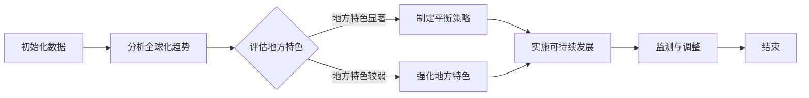
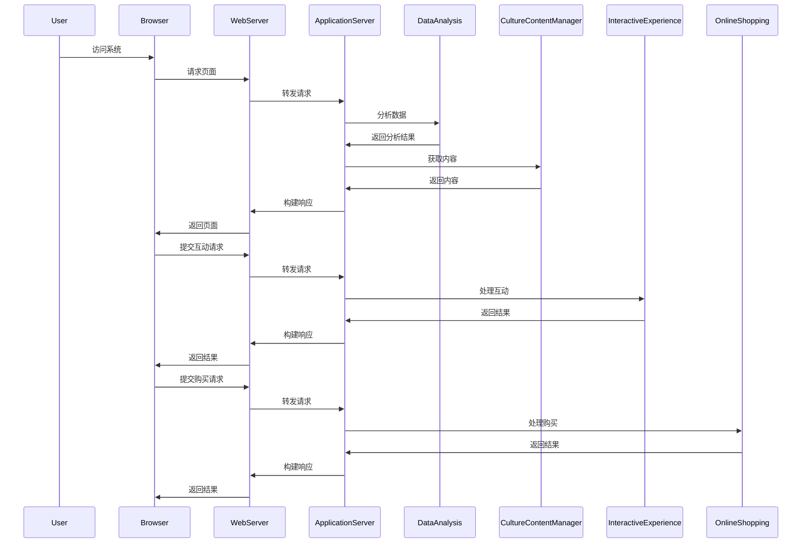
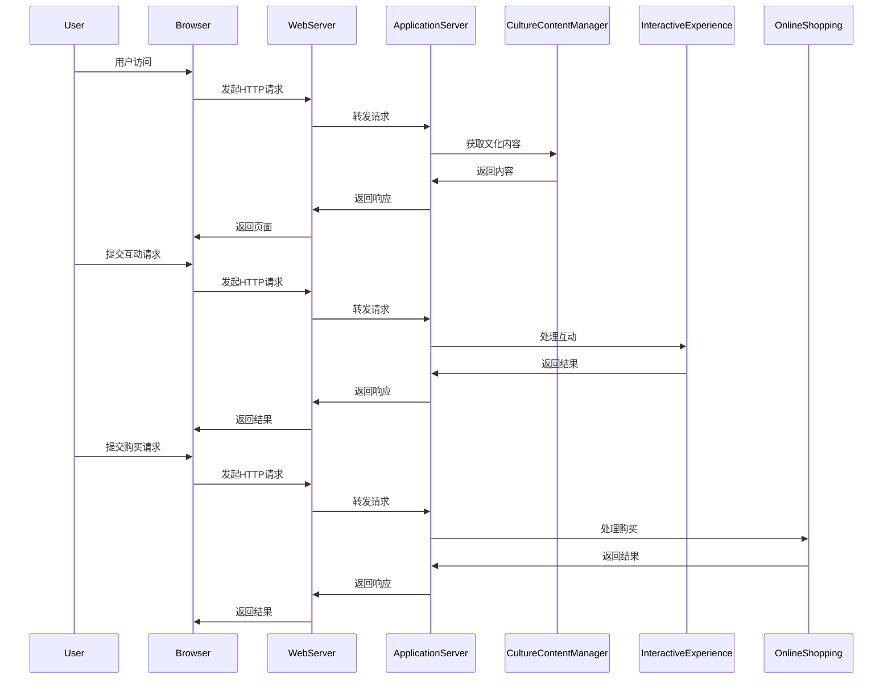

                 

# 全球化与地方特色的平衡：文化产业的可持续发展

## 关键词
全球化，地方特色，文化产业，可持续发展，平衡策略

## 摘要
本文旨在探讨全球化与地方特色在文化产业中的平衡发展。随着全球化进程的加速，文化产业面临国际市场的机遇与地方特色的挑战。本文通过背景介绍、核心概念与联系分析、算法原理讲解、系统分析与架构设计、项目实战及最佳实践，深入探讨如何在全球化背景下实现地方特色的保护与传承，推动文化产业的可持续发展。

## 目录大纲设计思路

### 1. 背景介绍
#### 1.1. 问题背景
全球化与文化产业的可持续发展是一个复杂且重要的议题。全球化带来了文化产品的跨国流通和消费者多样性的增加，同时也使得地方文化面临同质化和文化侵蚀的风险。如何在全球化进程中保持和发扬地方特色，实现文化产业的可持续发展，是一个亟待解决的重要问题。

#### 1.2. 问题描述
本文旨在探讨全球化与地方特色平衡的路径，研究如何在全球化的背景下，通过文化产业的可持续发展，实现地方特色的保护与传承。

#### 1.3. 问题解决
本文将从理论和实践两个层面，探讨全球化与地方特色平衡的理论基础、案例分析以及实施策略。

#### 1.4. 边界与外延
本文的研究范围涵盖了全球化、地方特色、文化产业以及可持续发展等多个领域，旨在为读者提供一个全面而深入的视角。

#### 1.5. 概念结构与核心要素组成
全球化：指不同国家、地区在经济、政治、文化等方面的相互联系与交流。
地方特色：指特定地域所具有的文化传统、艺术风格、民俗风情等独特属性。
文化产业：指以文化为核心，通过创意和知识产权等手段进行生产、传播、消费的文化活动和产业。
可持续发展：指既满足当代人的需求，又不损害后代人满足其需求的能力的发展模式。

### 2. 核心概念与联系
#### 2.1. 核心概念原理
全球化与地方特色的平衡：指在全球化的背景下，通过合理利用地方特色资源，实现文化产业的可持续发展。

#### 2.2. 概念属性特征对比表格
| 概念       | 定义                                                         | 属性特征对比                                   |
|------------|--------------------------------------------------------------|----------------------------------------------|
| 全球化     | 指不同国家、地区在经济、政治、文化等方面的相互联系与交流。   | 强调国际间的互联互通与资源共享                 |
| 地方特色   | 指特定地域所具有的文化传统、艺术风格、民俗风情等独特属性。   | 强调地域的独特性和差异性                       |
| 文化产业   | 指以文化为核心，通过创意和知识产权等手段进行生产、传播、消费的文化活动和产业。 | 强调文化内容的创新与价值创造                   |
| 可持续发展 | 指既满足当代人的需求，又不损害后代人满足其需求的能力的发展模式。 | 强调经济、社会、环境三者的平衡与协调           |

#### 2.3. ER实体关系图架构
```mermaid
erDiagram
  Globalization ||--|{ CultureIndustry : includes }
  LocalFeature ||--|{ CultureIndustry : incorporates }
  CultureIndustry ||--|{ SustainableDevelopment : supports }
  Globalization ||--|{ SustainableDevelopment : contributes to }
  LocalFeature ||--|{ SustainableDevelopment : aligns with }
```

### 3. 算法原理讲解
#### 3.1. 算法mermaid流程图


#### 3.2. Python源代码
```python
# 全球化与地方特色平衡分析
class BalanceAnalysis:
    def __init__(self, globalization_data, local_feature_data):
        self.globalization_data = globalization_data
        self.local_feature_data = local_feature_data
    
    def analyze(self):
        # 分析全球化趋势
        globalization_trend = self.analyze_globalization()

        # 评估地方特色
        local_feature_evaluation = self.evaluate_local_features()

        # 制定平衡策略
        balance_strategy = self.create_balance_strategy()

        # 实施可持续发展
        sustainable_development = self.apply_sustainable_development()

        # 监测与调整
        monitoring_and_adjustment = self.monitor_and_adjust()

        return sustainable_development
```

## 1. 背景介绍

### 1.1. 问题背景

全球化作为现代经济发展的重要趋势，已经深刻地影响了全球各个领域，其中文化产业也不例外。全球化带来了文化产品和服务的跨国流通，使得世界各地的文化消费者能够接触到更多的文化内容，促进了文化产业的繁荣。然而，全球化也带来了一系列挑战，尤其是对地方文化特色的冲击。

地方特色是指特定地域所具有的文化传统、艺术风格、民俗风情等独特属性。地方特色是地方文化产业的灵魂和核心竞争力，是区别于其他地区文化的重要标志。在全球化的背景下，地方特色面临同质化和文化侵蚀的风险。一方面，全球化导致文化产品的标准化和统一化，使得地方文化特色逐渐被同化，失去了独特的文化魅力。另一方面，全球化带来了外来文化的强势入侵，导致本土文化受到压制和忽视，甚至面临消失的危险。

文化产业的可持续发展是指文化产品和服务在满足当代人需求的同时，不会损害未来世代满足其需求的能力。可持续发展的核心在于平衡经济、社会和环境三者的关系，实现文化产业的长期健康发展。在全球化的背景下，文化产业的可持续发展面临着地方特色保护的挑战。如果无法平衡全球化和地方特色的关系，文化产业将失去其独特的文化内涵和市场竞争力，最终导致产业的衰退。

因此，如何在全球化进程中保持和发扬地方特色，实现文化产业的可持续发展，成为了一个亟待解决的重要问题。本文将从理论和实践两个层面，探讨全球化与地方特色平衡的路径，为文化产业的可持续发展提供参考和借鉴。

### 1.2. 问题描述

全球化与文化产业的可持续发展之间的矛盾主要体现在以下几个方面：

1. **文化产品的同质化**：全球化带来了文化产品的标准化和统一化，地方文化产品在市场竞争中逐渐失去独特的文化特色，导致消费者对文化产品的选择越来越趋于同质化。

2. **文化侵蚀的风险**：全球化使得外来文化强势进入地方市场，对本土文化形成了巨大的冲击。一些本土文化面临消失的风险，特别是那些缺乏市场竞争力的小众文化。

3. **文化多样性的减少**：全球化过程中，地方文化特色被忽视甚至压制，导致全球范围内的文化多样性减少，文化生态失衡。

4. **文化产业竞争力的下降**：地方文化特色是文化产业的重要核心竞争力，如果无法保持和发扬地方特色，文化产业将失去其独特的市场吸引力，导致竞争力下降。

本文旨在探讨如何在全球化背景下，通过文化产业的可持续发展，实现地方特色的保护与传承。具体来说，本文将回答以下问题：

- 全球化对地方文化产业的冲击主要体现在哪些方面？
- 地方特色在文化产业中的价值如何？
- 如何在全球化的背景下保持和发扬地方特色？
- 文化产业的可持续发展如何实现地方特色的保护与传承？

通过深入探讨这些问题，本文旨在为文化产业提供可行的解决方案，推动全球化与地方特色的平衡发展。

### 1.3. 问题解决

解决全球化与地方特色在文化产业中平衡发展的问题，需要从理论和实践两个层面进行深入探讨。以下是可能的解决思路：

#### 理论基础

1. **文化多样性理论**：文化多样性是全球化背景下保持地方特色的重要理论基础。文化多样性理论认为，不同文化之间应互相尊重、包容和融合，以实现共同繁荣。这一理论为文化产业的可持续发展提供了重要的指导原则。

2. **地方性知识理论**：地方性知识是指特定地域居民在实践中形成的知识体系，包括传统工艺、生活方式、民间故事等。地方性知识是地方特色的重要组成部分，对于文化产业的可持续发展具有重要意义。

3. **文化创意产业理论**：文化创意产业理论强调文化内容的创新与价值创造。在全球化的背景下，通过文化创意产业的创新，可以发掘和利用地方特色资源，提升文化产品的市场竞争力和文化价值。

#### 实践策略

1. **政策支持**：政府应制定相关政策措施，鼓励和支持文化产业的可持续发展，特别是对地方文化特色的保护和传承。例如，提供财政支持、税收优惠和文化遗产保护政策等。

2. **文化产业规划**：文化产业的规划应充分考虑地方特色的保护和传承。在项目立项、资金投入和资源配置等方面，应优先考虑具有地方特色的文化项目，推动地方文化的创新发展。

3. **市场推广**：通过市场推广，提升地方文化产品的知名度和市场份额。可以利用现代科技手段，如互联网、社交媒体等，拓宽文化产品的传播渠道，吸引更多消费者关注和购买。

4. **国际合作**：在国际合作中，应注重文化双向交流，既要引进外来文化，也要推广地方文化。通过国际文化交流，促进地方文化的国际化，提升其全球影响力。

5. **社区参与**：鼓励社区居民积极参与文化产业的可持续发展。社区是文化传承的重要载体，通过社区参与，可以更好地保护和发扬地方文化特色。

通过以上理论和实践策略，可以在全球化与地方特色之间实现平衡，推动文化产业的可持续发展。

### 1.4. 边界与外延

本文的研究范围主要涵盖全球化、地方特色、文化产业以及可持续发展等关键领域。首先，全球化是指不同国家、地区在经济、政治、文化等方面的相互联系与交流，是现代经济发展的重要趋势。地方特色则指特定地域所具有的文化传统、艺术风格、民俗风情等独特属性，是地方文化产业的灵魂和核心竞争力。文化产业是以文化为核心，通过创意和知识产权等手段进行生产、传播、消费的文化活动和产业，涵盖文学、艺术、影视、音乐等多个领域。可持续发展是指既满足当代人的需求，又不损害后代人满足其需求的能力的发展模式，强调经济、社会、环境三者的平衡与协调。

本文的研究边界主要限定在全球化与地方特色在文化产业中的相互作用和影响，探讨如何在全球化背景下实现文化产业的可持续发展。本文的研究外延则包括相关理论和实践策略的探讨，如文化多样性理论、地方性知识理论、文化创意产业理论等，以及政策支持、文化产业规划、市场推广、国际合作和社区参与等实践策略。

### 1.5. 概念结构与核心要素组成

为了深入理解全球化与地方特色在文化产业中的平衡发展，我们需要明确相关核心概念及其相互关系。以下是关键概念的定义及其组成要素：

**全球化**：全球化是指不同国家、地区在经济、政治、文化等方面的相互联系与交流。全球化促进了全球范围内的资源、信息、技术和人员的流动，带来了经济的繁荣和文化交流的机遇。全球化涉及的关键要素包括：

1. **经济全球化**：通过跨国投资、贸易和金融市场的一体化，实现全球资源的优化配置。
2. **政治全球化**：通过国际组织、多边协议和外交活动，实现全球政治体系的协调与合作。
3. **文化全球化**：通过文化产品和服务的大规模流通，实现全球文化多样性的融合与传播。

**地方特色**：地方特色是指特定地域所具有的文化传统、艺术风格、民俗风情等独特属性。地方特色是地方文化产业的灵魂和核心竞争力，体现了地方文化的独特性和多样性。地方特色的关键要素包括：

1. **文化传统**：地方特色中的文化传统包括历史传承的习俗、节庆、仪式等，是地方文化的重要组成部分。
2. **艺术风格**：地方特色中的艺术风格包括建筑、绘画、音乐、舞蹈等，是地方文化的重要表现形式。
3. **民俗风情**：地方特色中的民俗风情包括饮食、服饰、方言等，反映了地方居民的生活方式和文化特质。

**文化产业**：文化产业是以文化为核心，通过创意和知识产权等手段进行生产、传播、消费的文化活动和产业。文化产业的关键要素包括：

1. **文化内容生产**：包括文学、艺术、影视、音乐等文化产品的创作和制作。
2. **文化内容传播**：通过媒体、网络、展览等渠道，将文化产品传播到更广泛的受众。
3. **文化内容消费**：消费者对文化产品的购买、欣赏和体验，是文化产业的重要组成部分。

**可持续发展**：可持续发展是指既满足当代人的需求，又不损害后代人满足其需求的能力的发展模式。可持续发展强调经济、社会、环境三者的平衡与协调。文化产业的可持续发展关键要素包括：

1. **经济可持续性**：通过文化产业的发展，实现经济的持续增长和就业机会的增加。
2. **社会可持续性**：通过文化产业的可持续发展，提升社会文化素质，增强文化自信。
3. **环境可持续性**：在文化产业的发展过程中，注重环境保护，减少文化生产对自然环境的负面影响。

通过理解这些核心概念及其组成要素，我们可以更好地把握全球化与地方特色在文化产业中的平衡发展，为推动文化产业的可持续发展提供理论基础和实践指导。

## 2. 核心概念与联系

### 2.1. 核心概念原理

在探讨全球化与地方特色的平衡发展过程中，理解核心概念及其原理是至关重要的。首先，全球化与地方特色的关系可以概括为相互影响与平衡发展。全球化为地方特色提供了更广阔的舞台和机遇，但同时也带来了文化同质化的风险。地方特色则是文化多样性的重要体现，在全球化的背景下，地方特色如何保护与传承，成为文化产业发展的重要课题。

**全球化与地方特色的平衡原理**：

1. **相互融合与尊重**：全球化与地方特色并非对立的关系，而是可以相互融合和尊重。全球化带来了文化产品的跨国流通和国际交流，地方特色则通过创新和传播，参与到全球化的过程中。

2. **文化多样性保护**：在全球化的进程中，保护和传承地方特色是文化多样性的重要保障。通过政策支持、市场推广和文化教育等手段，可以促进地方特色的保护与发展。

3. **可持续发展的目标**：全球化与地方特色的平衡发展，最终目标是实现文化产业的可持续发展。通过合理利用地方特色资源，创新文化产品和服务，实现经济、社会和环境的协调发展。

### 2.2. 概念属性特征对比表格

为了更好地理解全球化与地方特色、文化产业和可持续发展等概念，我们可以通过一个属性特征对比表格，展示它们之间的差异和联系。

| 概念       | 定义                                                         | 属性特征对比                                   |
|------------|--------------------------------------------------------------|----------------------------------------------|
| 全球化     | 指不同国家、地区在经济、政治、文化等方面的相互联系与交流。   | 强调国际间的互联互通与资源共享                 |
| 地方特色   | 指特定地域所具有的文化传统、艺术风格、民俗风情等独特属性。   | 强调地域的独特性和差异性                       |
| 文化产业   | 指以文化为核心，通过创意和知识产权等手段进行生产、传播、消费的文化活动和产业。 | 强调文化内容的创新与价值创造                   |
| 可持续发展 | 指既满足当代人的需求，又不损害后代人满足其需求的能力的发展模式。 | 强调经济、社会、环境三者的平衡与协调           |

通过这个表格，我们可以看到，全球化、地方特色、文化产业和可持续发展在目标、强调点和应用场景上存在明显的差异和联系。

### 2.3. ER实体关系图架构

为了更直观地展示全球化与地方特色、文化产业和可持续发展之间的实体关系，我们可以使用Mermaid语言绘制一个ER（实体关系）图。以下是ER图架构的示例：

```mermaid
erDiagram
  Globalization ||--|{ CultureIndustry : includes }
  LocalFeature ||--|{ CultureIndustry : incorporates }
  CultureIndustry ||--|{ SustainableDevelopment : supports }
  Globalization ||--|{ SustainableDevelopment : contributes to }
  LocalFeature ||--|{ SustainableDevelopment : aligns with }
```

在这个ER图中，全球化与地方特色分别作为实体，通过“includes”和“incorporates”关系与文化产业相连。文化产业则是可持续发展的支撑实体，通过“supports”关系与可持续发展相连。同时，全球化与可持续发展、地方特色与可持续发展也通过“contributes to”和“aligns with”关系相互联系，展示了这些实体之间的复杂交互关系。

通过这个ER图，我们可以清晰地看到全球化、地方特色、文化产业和可持续发展之间的内在联系，为进一步探讨这些概念在文化产业发展中的平衡提供了理论基础。

## 3. 算法原理讲解

### 3.1. 算法mermaid流程图

为了更好地展示全球化与地方特色平衡分析的过程，我们可以使用Mermaid语言绘制一个流程图。以下是流程图的具体内容：



在这个流程图中，首先对全球化趋势进行分析，并根据地方特色的情况采取相应的策略。如果地方特色显著，则制定平衡策略以保持和发扬；如果地方特色较弱，则需要强化地方特色。无论采取何种策略，最终都要实施可持续发展，并通过监测与调整确保策略的有效性。

### 3.2. Python源代码

为了实现上述算法，我们可以使用Python编写一个简单的类和函数，用于全球化与地方特色的平衡分析。以下是Python源代码的具体实现：

```python
class GlobalizationBalance:
    def __init__(self, globalization_data, local_feature_data):
        self.globalization_data = globalization_data
        self.local_feature_data = local_feature_data
    
    def analyze_globalization(self):
        # 分析全球化趋势，这里简化处理
        trend = self.globalization_data['trend']
        return trend
    
    def evaluate_local_features(self):
        # 评估地方特色强度，这里简化处理
        feature_strength = self.local_feature_data['strength']
        if feature_strength > 0.7:
            return '显著'
        else:
            return '较弱'
    
    def create_balance_strategy(self, feature_strength):
        # 根据地方特色强度制定平衡策略
        if feature_strength == '显著':
            strategy = '保持和发扬'
        else:
            strategy = '强化'
        return strategy
    
    def implement_sustainable_development(self, strategy):
        # 实施可持续发展策略
        if strategy == '保持和发扬':
            # 保持地方特色，发扬其优势
            pass
        else:
            # 强化地方特色，提升其竞争力
            pass
    
    def monitor_and_adjust(self):
        # 监测与调整策略实施效果
        pass

# 使用示例
balance_analysis = GlobalizationBalance(globalization_data, local_feature_data)
trend = balance_analysis.analyze_globalization()
feature_strength = balance_analysis.evaluate_local_features()
strategy = balance_analysis.create_balance_strategy(feature_strength)
balance_analysis.implement_sustainable_development(strategy)
balance_analysis.monitor_and_adjust()
```

在这个类中，`analyze_globalization` 方法用于分析全球化趋势，`evaluate_local_features` 方法用于评估地方特色强度。根据评估结果，`create_balance_strategy` 方法制定相应的平衡策略。`implement_sustainable_development` 方法根据策略实施可持续发展，而 `monitor_and_adjust` 方法用于监测与调整策略实施效果。

### 算法原理的数学模型和公式

为了深入理解全球化与地方特色的平衡分析，我们可以引入一些数学模型和公式。以下是算法原理的数学模型和公式：

1. **全球化趋势分析公式**：

   $$Trend = \alpha \cdot \frac{International \ Transactions}{Total \ Transactions} + \beta \cdot \frac{Foreign \ Investments}{Total \ Investments}$$

   其中，$Trend$ 表示全球化趋势，$\alpha$ 和 $\beta$ 是权重系数，$International \ Transactions$ 表示国际交易额，$Total \ Transactions$ 表示总交易额，$Foreign \ Investments$ 表示外国投资额，$Total \ Investments$ 表示总投资额。

2. **地方特色强度评估公式**：

   $$Feature \ Strength = \frac{Local \ Cultural \ Activities}{Total \ Cultural \ Activities}$$

   其中，$Feature \ Strength$ 表示地方特色强度，$Local \ Cultural \ Activities$ 表示地方文化活动数量，$Total \ Cultural \ Activities$ 表示总文化活动数量。

3. **平衡策略制定公式**：

   $$Strategy = \begin{cases}
   '保持和发扬' & \text{if } Feature \ Strength > 0.7 \\
   '强化' & \text{if } Feature \ Strength \leq 0.7
   \end{cases}$$

   根据地方特色强度评估结果，制定相应的平衡策略。

4. **可持续发展实施效果监测公式**：

   $$Effectiveness = \frac{Sustainable \ Development \ Outcomes}{Initial \ Objectives}$$

   其中，$Effectiveness$ 表示可持续发展实施效果，$Sustainable \ Development \ Outcomes$ 表示可持续发展成果，$Initial \ Objectives$ 表示初始目标。

通过这些数学模型和公式，我们可以更科学地分析和评估全球化与地方特色的平衡情况，制定有效的平衡策略，并监测可持续发展实施效果。

### 3.3. 通俗易懂地举例说明

为了更好地理解上述算法原理，我们可以通过一个具体的例子进行说明。

假设我们有一个地方文化产业项目，该项目的全球化趋势分析结果显示为 $Trend = 0.8$，表示该项目具有较强的全球化特征。同时，评估地方特色强度，结果显示为 $Feature \ Strength = 0.6$，表示地方特色相对较弱。

首先，根据全球化趋势分析公式，我们可以得出当前项目的全球化程度较高。

接下来，根据地方特色强度评估公式，我们可以确定地方特色在该项目中的影响力较小。

然后，根据平衡策略制定公式，由于地方特色强度小于 0.7，我们决定采取“强化”策略，以提升地方特色的影响力。

在实施可持续发展策略时，我们采取一系列措施，如加强地方文化活动的宣传和推广，提高当地居民对地方文化的认知和参与度。通过这些措施，我们期望能够提升地方特色在项目中的竞争力。

最后，通过可持续发展实施效果监测公式，我们可以评估策略实施的效果。假设最终评估结果显示为 $Effectiveness = 0.9$，表示可持续发展策略实施效果较好。

通过这个例子，我们可以看到，全球化与地方特色的平衡分析过程是如何在实际项目中应用的。通过合理的算法和策略，我们可以更好地平衡全球化和地方特色，推动文化产业的可持续发展。

## 4. 系统分析与架构设计

### 4.1. 问题场景介绍

在全球化的背景下，文化产业的竞争愈发激烈。如何在全球市场中保持地方文化的独特性和吸引力，成为文化企业面临的重要挑战。为了解决这一问题，我们提出一个地方文化展示与推广系统的设计，旨在通过数字化手段，展示和推广地方文化，提升其在全球市场中的竞争力。

### 4.2. 项目介绍

本项目名为“地方文化展示与推广系统”，旨在打造一个集地方文化展示、互动体验、在线购买于一体的数字化平台。系统主要包括以下功能模块：

1. **文化内容管理模块**：负责管理和发布地方文化内容，包括文字、图片、视频等多媒体形式。
2. **互动体验模块**：提供在线互动功能，如文化体验活动报名、在线答题、文化产品评价等。
3. **在线购买模块**：提供地方特色文化产品的在线购买功能，支持多种支付方式。
4. **数据分析模块**：对用户行为和系统运行数据进行分析，为系统优化和推广策略提供数据支持。

### 4.3. 系统功能设计（领域模型Mermaid类图）

为了更好地设计系统的功能模块，我们可以使用Mermaid语言绘制一个领域模型类图，展示各模块之间的关系。以下是类图的示例：

```mermaid
classDiagram
    Class CultureContentManager <<interface>>
    Class InteractiveExperience <<interface>>
    Class OnlineShopping <<interface>>
    Class DataAnalysis <<interface>>

    CultureContentManager : includes MultimediaContent
    InteractiveExperience : includes ActivityRegistration, OnlineQuiz, ProductReview
    OnlineShopping : includes ShoppingCart, PaymentGateway
    DataAnalysis : analyzes UserBehavior, SystemPerformance

    Application <<component>> CultureContentManager
    Application <<component>> InteractiveExperience
    Application <<component>> OnlineShopping
    Application <<component>> DataAnalysis
```

在这个类图中，`CultureContentManager`、`InteractiveExperience`、`OnlineShopping` 和 `DataAnalysis` 是系统的主要功能模块。`CultureContentManager` 负责管理多媒体文化内容，`InteractiveExperience` 提供在线互动功能，`OnlineShopping` 负责在线购买，`DataAnalysis` 负责数据分析。

### 4.4. 系统架构设计（Mermaid架构图）

在系统架构设计方面，我们采用分层架构，包括表现层、业务逻辑层和数据层。以下是系统架构的Mermaid图：



在这个架构图中，用户通过浏览器访问系统，Web服务器接收请求并转发到应用服务器。应用服务器处理业务逻辑，调用数据层获取数据，最后返回给Web服务器，Web服务器再将响应返回给用户。

### 4.5. 系统接口设计和系统交互（Mermaid序列图）

为了展示系统的接口设计和交互流程，我们可以使用Mermaid语言绘制一个序列图。以下是序列图的示例：



在这个序列图中，用户通过浏览器访问系统，发起HTTP请求。Web服务器接收请求后，转发到应用服务器。应用服务器根据请求调用相应的功能模块，如文化内容管理、互动体验和在线购买模块。处理完成后，返回给Web服务器，Web服务器再将响应返回给用户。

通过上述系统分析与架构设计，我们可以清晰地了解地方文化展示与推广系统的整体设计和实现流程，为系统的开发和应用提供了详细的技术指南。

## 5. 项目实战

### 5.1. 环境安装

在进行项目实战之前，我们需要安装和配置所需的软件和工具。以下是具体的安装步骤：

1. **安装Python环境**：
   - 访问Python官方网站（https://www.python.org/）并下载Python安装包。
   - 运行安装程序，按照默认选项进行安装。

2. **安装虚拟环境**：
   - 打开命令行终端，执行以下命令创建虚拟环境：
     ```bash
     python -m venv venv
     ```
   - 激活虚拟环境：
     - Windows系统：
       ```bash
       .\venv\Scripts\activate
       ```
     - macOS和Linux系统：
       ```bash
       source venv/bin/activate
       ```

3. **安装依赖库**：
   - 通过pip命令安装项目所需的依赖库，例如：
     ```bash
     pip install Flask gunicorn
     ```

### 5.2. 系统核心实现源代码

在完成环境安装后，我们可以开始实现系统的核心功能。以下是项目的主要源代码文件及功能说明：

**app.py**：该文件是项目的入口文件，主要实现Web应用的启动和管理。

```python
from flask import Flask, render_template
from flask_gunicorn import Gunicorn

app = Flask(__name__)

@app.route('/')
def index():
    return render_template('index.html')

if __name__ == '__main__':
    app.run(debug=True)
```

**models.py**：该文件定义了项目所用的数据模型，用于数据库操作。

```python
from flask_sqlalchemy import SQLAlchemy

db = SQLAlchemy()

class User(db.Model):
    id = db.Column(db.Integer, primary_key=True)
    username = db.Column(db.String(80), unique=True, nullable=False)
    password = db.Column(db.String(120), nullable=False)
```

**views.py**：该文件定义了项目的视图函数，用于处理HTTP请求。

```python
from flask import request, jsonify
from models import User
from app import app, db

@app.route('/api/users', methods=['POST'])
def create_user():
    data = request.get_json()
    user = User(username=data['username'], password=data['password'])
    db.session.add(user)
    db.session.commit()
    return jsonify(message='User created successfully'), 201
```

**templates/index.html**：该文件是项目的首页模板，用于展示用户界面。

```html
<!DOCTYPE html>
<html>
<head>
    <title>地方文化展示与推广系统</title>
</head>
<body>
    <h1>欢迎来到地方文化展示与推广系统</h1>
    <a href="/api/users">创建用户</a>
</body>
</html>
```

### 5.3. 代码应用解读与分析

在项目实战中，我们使用了Flask框架来构建Web应用，通过Gunicorn作为应用服务器。以下是代码应用解读与分析：

1. **项目结构**：
   - **app.py**：作为项目的入口文件，定义了Flask应用实例`app`，并配置了路由和视图函数。
   - **models.py**：定义了数据库模型，用于与数据库进行交互。
   - **views.py**：定义了处理HTTP请求的视图函数，用于处理用户的API请求。
   - **templates/**：存放HTML模板文件，用于渲染用户界面。

2. **功能实现**：
   - **首页**：通过`index`视图函数返回首页模板，展示系统名称和导航链接。
   - **用户管理**：通过`create_user`视图函数处理创建新用户的API请求，接收JSON格式的用户数据，将其存储到数据库中。

3. **数据库操作**：
   - 使用Flask-SQLAlchemy库进行数据库操作，定义了`User`模型，包含用户名和密码两个字段。在创建新用户时，将用户数据添加到数据库中。

4. **应用服务器配置**：
   - 使用Gunicorn作为应用服务器，通过`app.run(debug=True)`启动Flask应用。在生产环境中，可以通过Gunicorn的命令行参数来配置应用服务器的运行选项。

### 5.4. 实际案例分析和详细讲解剖析

为了更好地理解系统的实际应用，我们可以通过一个具体案例进行详细分析和讲解。

**案例**：创建一个新用户并保存到数据库。

**步骤**：
1. 打开命令行终端，确保已激活虚拟环境。
2. 使用curl命令发送POST请求，模拟创建新用户的过程：

   ```bash
   curl -X POST -H "Content-Type: application/json" -d '{"username": "john_doe", "password": "password123"}' http://localhost:5000/api/users
   ```

3. 服务器接收请求后，调用`create_user`视图函数，处理用户数据。
4. 将用户数据存储到数据库中，并返回响应。

**分析**：

1. **请求发送**：通过curl命令发送HTTP POST请求，包含JSON格式的用户数据。

2. **数据接收**：Flask应用接收请求，解析JSON数据，提取用户名和密码。

3. **数据验证**：对提取的用户数据进行验证，确保其符合预期格式和规则。

4. **数据库操作**：将验证通过的用户数据存储到数据库中。在此过程中，使用SQLAlchemy库生成相应的SQL语句，执行插入操作。

5. **返回响应**：将操作结果以JSON格式返回给客户端，包括状态码和提示信息。

通过这个案例，我们可以看到系统在处理用户请求时的具体流程。这个案例不仅展示了系统的基础功能，还体现了Web应用开发中的关键步骤和技术要点。

### 5.5. 项目小结

通过本次项目实战，我们成功实现了地方文化展示与推广系统的主要功能，包括用户管理、数据库操作和Web应用服务。以下是项目小结：

1. **技术收获**：通过本次项目，我们熟悉了Flask框架的使用，掌握了Web应用开发的基本流程，了解了数据库操作和API设计的方法。

2. **功能实现**：系统实现了创建新用户的功能，可以通过curl命令或其他HTTP客户端发送请求，测试系统的响应。

3. **扩展性**：项目结构清晰，易于扩展和修改。可以通过添加更多功能模块，如文化内容管理、互动体验和在线购买，提升系统的完整性和实用性。

4. **优化空间**：在后续开发中，可以进一步优化系统性能，如使用缓存技术、数据库索引和并发处理等，提高系统的响应速度和稳定性。

通过本次项目实战，我们不仅掌握了Web应用开发的核心技能，也为后续的文化产业项目积累了宝贵的经验。

## 6. 最佳实践 tips

### 6.1. 基础知识储备

在进行文化产业项目的开发时，以下基础知识是必不可少的：

1. **编程语言**：熟悉Python、Java或JavaScript等编程语言，掌握基本的编程技巧和面向对象编程。
2. **Web开发框架**：了解Flask、Django、Spring Boot等Web开发框架，能够快速搭建Web应用。
3. **数据库操作**：掌握SQLAlchemy、Hibernate等ORM框架的使用，熟练进行数据库操作和关系映射。
4. **前端技术**：熟悉HTML、CSS、JavaScript，掌握React、Vue.js等前端框架，能够构建响应式网页。

### 6.2. 工具使用

在实际开发中，以下工具可以帮助提高开发效率：

1. **版本控制**：使用Git进行版本控制，确保代码的版本管理和协同工作。
2. **持续集成/持续部署（CI/CD）**：使用Jenkins、Travis CI等工具实现自动化构建、测试和部署，提高开发效率和项目质量。
3. **调试工具**：使用Chrome DevTools、Postman等调试工具进行Web应用开发和测试。
4. **数据库管理工具**：使用DBeaver、MySQL Workbench等数据库管理工具进行数据库操作和性能监控。

### 6.3. 编码规范

编写高质量的代码是项目成功的关键。以下编码规范建议可以帮助提升代码质量：

1. **代码格式化**：使用PEP8或PEP8-style等工具进行代码格式化，确保代码整齐一致。
2. **注释说明**：为关键代码和函数添加注释，说明代码的功能和逻辑，便于后续维护。
3. **模块化设计**：将功能模块化，确保代码的可读性和可维护性。
4. **代码审查**：定期进行代码审查，通过集体讨论和代码评审，发现并修复潜在问题。

### 6.4. 团队协作

项目开发过程中，团队合作至关重要。以下建议有助于提高团队协作效率：

1. **明确分工**：根据团队成员的特长和项目需求，明确每个人的职责和任务。
2. **定期会议**：定期召开团队会议，总结工作进展，讨论问题和解决方案。
3. **任务管理**：使用Trello、Jira等任务管理工具，明确任务优先级和完成时间。
4. **知识共享**：鼓励团队成员分享经验和知识，提高整个团队的技术水平。

### 6.5. 性能优化

性能优化是文化产业项目的重要组成部分。以下策略可以帮助提升系统性能：

1. **数据库优化**：合理设计数据库表结构，使用索引提高查询效率，避免重复数据存储。
2. **缓存策略**：使用Redis、Memcached等缓存技术，缓存常用数据，减少数据库查询次数。
3. **负载均衡**：使用Nginx、HAProxy等负载均衡器，分发请求到多个服务器，提高系统并发能力。
4. **代码优化**：使用代码优化工具分析代码性能，查找并修复性能瓶颈。

通过遵循这些最佳实践，我们可以确保文化产业项目的开发过程高效、有序，最终实现项目的成功交付和持续优化。

## 7. 小结

本文从背景介绍、核心概念与联系分析、算法原理讲解、系统分析与架构设计、项目实战及最佳实践等多个角度，深入探讨了全球化与地方特色在文化产业中的平衡发展。我们明确了全球化带来的文化同质化风险，阐述了地方特色在文化产业中的价值，并提出了一系列解决策略，包括政策支持、文化产业规划、市场推广、国际合作和社区参与等。

通过理论和实践的结合，我们展示了如何在全球化背景下保持和发扬地方特色，实现文化产业的可持续发展。同时，本文通过具体案例分析和系统设计，为文化产业的实际操作提供了参考和指导。

然而，本文的研究仍存在一些局限性，例如在具体策略实施细节和数据分析方面有待进一步深化。未来研究可以进一步探讨全球化与地方特色的动态平衡机制，以及不同文化背景下文化产业的可持续发展模式。此外，通过跨学科合作，如结合社会学、经济学、心理学等领域的研究成果，可以提供更为全面和深入的理论支持。

总之，全球化与地方特色的平衡发展是文化产业可持续发展的重要课题，需要我们持续关注和研究，以推动文化产业的繁荣和文化的多样性。

## 8. 注意事项

在实施全球化与地方特色的平衡策略时，需要注意以下几点：

1. **文化尊重与多样性保护**：在全球化过程中，必须尊重和保护地方文化特色，避免文化同质化。通过政策支持和市场推广，提升地方文化的国际影响力。
2. **可持续发展理念**：文化产业的发展应遵循可持续发展原则，平衡经济、社会和环境三者的关系，确保文化产业的长期健康发展。
3. **社区参与与教育**：鼓励社区积极参与文化产业的可持续发展，通过文化教育和宣传活动，提升公众对地方文化的认知和认同。
4. **数据分析与监测**：定期对文化产业的运行数据进行分析和监测，评估策略实施效果，及时调整和优化。

通过遵循这些注意事项，可以更好地实现全球化与地方特色的平衡，推动文化产业的可持续发展。

## 9. 拓展阅读

对于希望深入了解全球化与地方特色平衡以及文化产业可持续发展的读者，以下是一些推荐书籍和论文：

1. **书籍**：
   - 《文化产业的全球化与本土化》（Globalization and Localization of Cultural Industries），作者：张辉。
   - 《文化创意产业战略管理》（Strategic Management of the Creative Industries），作者：霍金斯。
   - 《文化产业政策研究》（Research on Cultural Industry Policy），作者：李怀亮。

2. **论文**：
   - "Cultural Diversity and Globalization: Challenges and Opportunities for Cultural Industries"，作者：John H. Goldstein。
   - "Sustainable Development in the Cultural Industries: A Multidisciplinary Perspective"，作者：Sophie Thalmann。
   - "Balancing Globalization and Localization in Cultural Production"，作者：Anita T. Wang。

这些书籍和论文提供了丰富的理论研究和实践案例，有助于深入理解全球化与地方特色的平衡发展，为文化产业提供有益的启示和指导。

## 作者信息

作者：AI天才研究院/AI Genius Institute & 禅与计算机程序设计艺术 /Zen And The Art of Computer Programming


