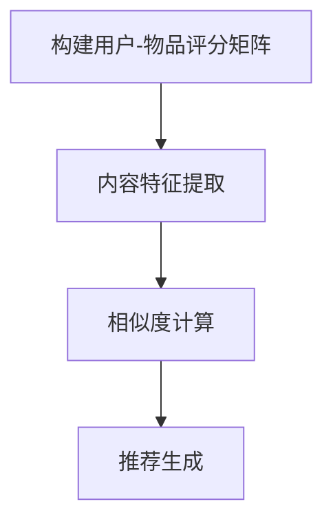
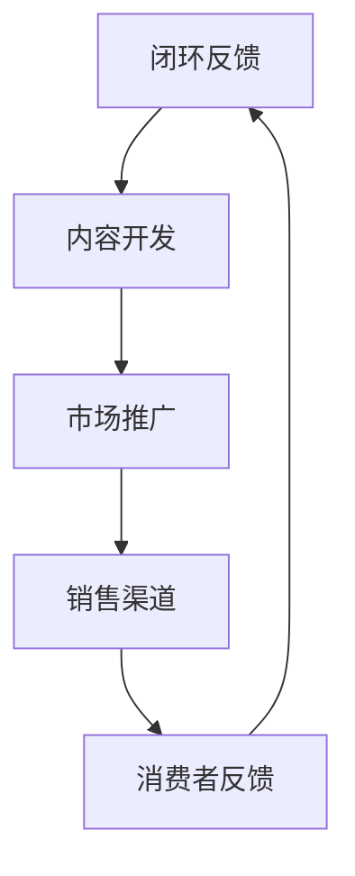

                 

### 1. 引言：全球化与本土化的双重挑战

在当今世界经济一体化进程不断加快的背景下，文化产业的全球化与本土化成为不可忽视的重要趋势。全球化，指的是在全球范围内经济、政治、文化等多方面的相互联系和相互依赖。文化产业的全球化表现为文化产品和服务的跨国传播，以及国际文化市场的形成。本土化，则是在全球化进程中，各地区为保护和发扬自身独特的文化特色，采取的一系列策略和措施。

文化产业在全球化的推动下，一方面获得了前所未有的发展机遇，另一方面也面临着本土文化保护的挑战。全球化带来了丰富的文化资源和市场机会，但同时也可能导致本土文化的同质化和消失。因此，如何在全球化进程中保护本土文化，同时促进文化产业的繁荣发展，成为当前学术界和业界关注的焦点。

本文旨在探讨全球化与本土化在文化产业中的双重作用，以及这些作用如何共同推动创意经济的新模式。文章将首先介绍文化产业的基本概念和特征，然后深入分析全球化与本土化的内涵及其对文化产业的影响。接着，通过案例研究和数据支持，进一步阐述全球化与本土化在文化产业中的互动关系和具体实践。最后，总结全文，提出针对文化产业的政策建议和发展方向。

本文的关键词包括：“全球化”，“本土化”，“文化产业”，“创意经济”，“文化保护”和“文化融合”。这些关键词将贯穿全文，帮助读者更好地理解文章的核心内容。

### 1.1 全球化背景下的文化产业

全球化背景下的文化产业正经历着前所未有的变革和发展。全球化是指国家之间在政治、经济、文化等方面的日益紧密联系，这一过程不仅改变了传统的经济结构，也深刻影响了文化产业的运作方式和内容。在全球化的背景下，文化产业的全球化表现为文化产品和服务的跨国传播，国际文化交流的加深，以及全球文化市场的形成。

首先，全球化的文化产品流动。随着信息技术和交通设施的快速发展，文化产品和服务的跨国传播变得前所未有的便捷。例如，好莱坞电影、欧美流行音乐、国际知名艺术节等在全球范围内广受欢迎，成为文化交流的重要媒介。这种现象不仅推动了文化产业的经济发展，也促进了不同文化之间的相互了解和融合。

其次，全球化的文化市场。全球化使得国际文化市场的规模不断扩大，各国文化产品在海外市场的销量不断增长。例如，中国的动漫、韩国的电视剧、日本的动漫和游戏等在全球范围内受到追捧，这些文化产品不仅为生产国带来了巨大的经济效益，也提升了其在国际文化市场的影响力。

然而，全球化对文化产业的推动并非没有负面影响。在全球化进程中，文化同质化现象日益严重，本土文化面临着被边缘化的风险。一些国家和地区的本土文化在全球化浪潮中逐渐消失，文化多样性受到威胁。因此，如何在全球化背景下保护和传承本土文化，成为文化产业面临的一个重要挑战。

### 1.2 本土化趋势对文化产业的影响

与全球化趋势并行，本土化也成为了当代文化产业中不可忽视的重要现象。本土化是指在全球化背景下，各地区为保护和发扬自身独特的文化特色，采取的一系列策略和措施。本土化趋势对文化产业产生了深远的影响，既带来了新的机遇，也提出了新的挑战。

首先，本土化对文化产业的创新具有重要意义。本土文化中的独特元素和传统艺术形式为文化产业的创新提供了丰富的资源。例如，中国的地方戏曲、印度的宝莱坞音乐、日本的动漫等，都是本土文化在全球化背景下焕发出新的生命力，成为文化产业中的重要组成部分。这些本土文化的创新不仅丰富了文化产业的内涵，也提升了其在国际市场的竞争力。

其次，本土化有助于保护和传承本土文化。在全球化进程中，本土文化往往面临被同质化和边缘化的风险。通过本土化策略，各地区可以更加积极地保护和传承本土文化，确保其能够在全球化背景下得以延续。例如，韩国政府通过推广韩流文化，不仅提升了本国文化的影响力，也有效地保护了韩族的传统文化。

然而，本土化并非没有挑战。在全球化与本土化的双重作用下，文化产业的运作面临着复杂的环境。一方面，本土化可能导致文化市场的高度细分，增加了文化产品营销的难度。另一方面，过度本土化也可能导致文化产品在国际市场的竞争力下降。因此，如何在本土化过程中找到平衡，是文化产业需要解决的另一个重要问题。

### 1.3 问题的提出与解决路径

在全球化与本土化的双重背景下，文化产业面临着一系列复杂的问题和挑战。这些问题的核心在于如何在全球化进程中保护和传承本土文化，同时促进文化产业的创新和发展。具体来说，本文将探讨以下几个问题：

首先，全球化对文化产业的推动作用如何体现？全球化带来了丰富的文化资源和市场机会，但同时也可能导致本土文化的同质化和消失。我们需要深入分析全球化对文化产业的具体影响，探讨如何最大化其正面作用，同时降低负面影响。

其次，本土化策略在文化产业中的应用效果如何？本土化有助于保护和传承本土文化，但过度本土化可能导致市场细分和国际竞争力下降。我们需要通过具体案例分析，评估本土化策略的可行性和效果，提出可行的改进建议。

第三，全球化与本土化的互动关系如何影响文化产业的发展？全球化与本土化并非相互独立，而是存在复杂的互动关系。我们需要探讨这两者之间的相互影响，分析如何在不同文化背景下实现文化产业的可持续发展。

最后，创意经济新模式如何推动文化产业的发展？创意经济作为一种新兴经济模式，具有高附加值和强创新能力的特点。我们需要研究创意经济在文化产业中的应用，探讨其如何为文化产业的创新和发展提供新动力。

针对上述问题，本文将提出以下解决路径：

1. **全球化与本土化平衡策略**：在全球化进程中，采取合适的平衡策略，既保护本土文化，又促进文化产业的创新和发展。

2. **本土化创新的激励机制**：通过政策和市场手段，鼓励文化企业在本土化过程中进行创新，提高文化产品的国际竞争力。

3. **跨文化交流与合作**：通过加强国际文化交流与合作，促进不同文化之间的相互理解与融合，推动文化产业的全球化发展。

4. **创意经济模式的深化研究**：深入探讨创意经济在文化产业中的应用，提出具体的实施路径和策略，为文化产业的发展提供新思路。

通过以上路径，我们旨在为文化产业的可持续发展提供理论支持和实践指导，推动全球化与本土化的协调发展，实现文化产业的繁荣与进步。

### 2. 核心概念解析

在探讨全球化与本土化对文化产业的影响之前，我们有必要首先明确几个核心概念的定义和特征，这些概念包括文化产业、全球化、本土化以及创意经济。通过对这些概念的深入分析，我们将为后续的讨论提供坚实的理论基础。

#### 2.1 文化产业的定义与特征

文化产业是指以文化为核心，通过创意和商业运作方式产生经济和社会效益的产业。文化产业的定义可以从以下几个方面进行解读：

1. **核心要素**：文化产业的本质在于其创意性和文化性。创意是文化产业的灵魂，是驱动产业创新和发展的重要动力。文化性则体现在文化产业的产品和服务中，承载了丰富的文化价值和内涵。

2. **产品与服务**：文化产业的产品和服务种类丰富，包括但不限于文艺创作、影视制作、音乐创作、出版发行、广告设计、文化旅游等。这些产品和服务不仅具有商业价值，还承担着传播和弘扬文化的重要任务。

3. **价值链**：文化产业的运作涉及从创意产生到产品最终消费的完整价值链。这个价值链包括了创意生成、内容制作、市场推广、销售渠道和用户反馈等环节，各个环节相互关联，共同构成了文化产业的核心运营模式。

4. **经济特征**：文化产业具有高附加值、低能耗、高就业率等经济特征。与传统产业相比，文化产业在经济增长中的贡献日益显著，成为推动经济发展的重要力量。

#### 2.2 全球化与本土化的内涵

全球化与本土化是文化产业发展的两个重要背景因素，它们各自有着独特的内涵和影响。

**全球化**：

1. **定义**：全球化是指在全球范围内，经济、政治、文化等多领域相互联系和依赖的不断加深。在文化领域，全球化表现为文化产品和服务的跨国传播、国际文化交流的深化以及全球文化市场的形成。

2. **影响**：全球化的影响主要体现在以下几个方面：

   - **文化交流**：全球化促进了不同文化之间的交流与互动，使得各国文化相互影响，形成了丰富多样的文化现象。
   - **市场扩大**：全球化使得国际文化市场的规模不断扩大，各国文化产品在国际市场中的销量和影响力显著提升。
   - **文化同质化**：全球化过程中，一些文化产品和服务在全球范围内广泛传播，导致文化同质化现象的出现，本土文化面临被边缘化的风险。

**本土化**：

1. **定义**：本土化是指在全球化进程中，各地区为保护和发扬自身独特的文化特色，采取的一系列策略和措施。本土化旨在保持文化多样性和文化传承。

2. **影响**：本土化对文化产业的影响主要表现在以下几个方面：

   - **文化保护**：通过本土化策略，各地区可以更好地保护本土文化，确保其能够在全球化背景下得以延续。
   - **市场细分**：本土化导致文化市场的高度细分，增加了文化产品营销的难度，但同时也提供了更多的市场机会。
   - **文化创新**：本土化鼓励文化创新，使得文化产品能够更好地适应本地市场需求，提升其竞争力。

#### 2.3 创意经济的概念与模式

创意经济是近年来兴起的一种新型经济模式，它以创意和创意产业为核心，通过创新驱动和创意价值的实现来推动经济发展。

**定义**：创意经济是指以创意和知识产权为核心的产业体系，通过创意人才的创造和创新活动，将创意转化为经济价值的过程。

**核心特征**：

1. **高附加值**：创意经济的产品和服务具有高附加值的特点，能够在市场中创造较高的利润。
2. **创新驱动**：创意经济以创新为核心驱动力，创新活动的频繁发生促进了产业的持续发展。
3. **知识产权**：创意经济强调知识产权的保护和运用，知识产权成为了企业竞争的重要资产。

**模式**：

1. **创意生成**：创意经济的起点是创意的生成，通过创意人才的创造活动，产生具有商业潜力的创意。
2. **创意开发**：创意生成后，通过开发过程将创意转化为具体的创意产品或服务，如电影、音乐、艺术品等。
3. **市场推广**：在创意产品或服务推向市场前，需要进行市场推广，以提高其知名度和接受度。
4. **知识产权保护**：通过知识产权保护机制，确保创意成果的合法性和独占性，从而实现创意价值的最大化。

**与文化产业的关系**：

创意经济与文化产业密切相关，创意经济是文化产业的重要组成部分，而文化产业则为创意经济提供了广阔的应用场景和发展空间。创意经济的兴起不仅推动了文化产业的发展，也为经济的整体创新和增长提供了新的动力。

通过对上述核心概念的解析，我们为后续讨论全球化与本土化对文化产业的影响奠定了基础。在接下来的章节中，我们将进一步探讨全球化与本土化的具体表现及其对文化产业的深远影响。

### 3. 概念联系与结构分析

在明确文化产业、全球化、本土化和创意经济等核心概念之后，我们需要深入探讨这些概念之间的联系及其在文化产业中的结构关系。通过这种分析，我们能够更好地理解这些概念在文化产业运作中的互动机制和作用方式。

#### 3.1 全球化与本土化的互动关系

全球化与本土化在文化产业中并非相互独立，而是存在复杂的互动关系。这种互动关系主要体现在以下几个方面：

**1. 相互促进**：全球化为本土文化提供了更广阔的传播和交流平台，使得本土文化能够走出国门，获得国际认可。而本土化则通过保护和传承本土文化，为全球化提供了丰富的文化资源和内涵。例如，中国的传统文化通过全球化推广，不仅提升了国际影响力，也促进了本土文化保护和创新。

**2. 相互制约**：全球化可能导致文化同质化，削弱本土文化的独特性，而过度本土化则可能限制文化产品的市场接受度，降低国际竞争力。因此，如何在全球化与本土化之间找到平衡，是文化产业面临的重大挑战。

**3. 相互转化**：全球化与本土化在一定条件下可以相互转化。例如，一些全球化的文化产品在进入本土市场后，可能会根据当地文化进行本土化改造，从而更好地适应市场。同样，本土化的文化产品在国际化过程中，也会吸收全球化的元素，实现文化融合。

**4. 空间维度上的互补**：全球化侧重于国际层面的文化传播和交流，而本土化则侧重于区域和地方层面的文化保护和传承。两者在空间维度上形成互补，共同推动文化产业的全面发展。

#### 3.2 文化产业中的核心要素

文化产业中的核心要素包括文化产品、文化市场、文化政策和文化创新。这些要素在全球化与本土化的背景下，具有不同的表现形式和作用方式。

**1. 文化产品**：文化产品是文化产业的物质载体，包括影视作品、音乐、文学作品、艺术品等。全球化使得文化产品能够跨越国界，实现国际传播。而本土化则强调文化产品的地域特色和本土价值，增强其市场竞争力和文化认同感。

**2. 文化市场**：文化市场是文化产业的重要组成部分，包括国内市场和国际市场。全球化促进了国际文化市场的形成，而本土化则通过区域市场的细分，满足不同文化背景消费者的需求。

**3. 文化政策**：文化政策是国家或地区对文化产业发展进行指导和调节的重要手段。全球化背景下，各国需要制定相应的文化政策，既保护本土文化，又促进国际文化交流。而本土化政策则侧重于文化保护和传承，推动本土文化创新和发展。

**4. 文化创新**：文化创新是文化产业持续发展的动力源泉。全球化为文化创新提供了丰富的资源和平台，而本土化则通过挖掘本土文化中的创意元素，推动文化创新。两者共同作用，推动文化产业的不断创新和发展。

#### 3.3 ER模型与文化产业架构

为了更好地理解全球化与本土化在文化产业中的互动机制，我们可以采用ER（实体关系）模型对文化产业的架构进行描述。

**1. 实体**：在ER模型中，实体代表文化产业的各个组成部分，包括文化产品、文化市场、文化政策和文化创新。

**2. 属性**：实体的属性描述了实体的特征和性质。例如，文化产品具有文化性、创意性和商业性等属性；文化市场具有国际化和本土化属性；文化政策具有引导和保护属性；文化创新具有驱动和引领属性。

**3. 关系**：实体之间的关系描述了文化产业的运作机制和互动模式。例如，文化产品与市场之间存在着交易关系；文化市场与文化政策之间存在调控关系；文化创新与文化产品之间存在驱动关系。

**4. 关系图**：ER模型可以用图形化的方式表示，如下所示：

```mermaid
erDiagram
  CULTURAL_PRODUCT  ||--|| CULTURAL_MARKET
  CULTURAL_PRODUCT  ||--|| CULTURAL_INNOVATION
  CULTURAL_MARKET   ||--|| CULTURAL_POLICY
  CULTURAL_INNOVATION  ||--|| CULTURAL_PRODUCT
```

在这个ER模型中，文化产品、文化市场、文化政策和文化创新四个实体通过不同的关系相互连接，形成了文化产业的完整架构。

通过上述分析，我们可以看到，全球化与本土化在文化产业中通过核心要素和ER模型的作用机制，共同推动文化产业的创新和发展。理解这些概念之间的联系和结构关系，有助于我们更深入地探讨全球化与本土化在文化产业中的具体影响和作用。

### 4. 数学模型与算法原理

在探讨全球化与本土化对文化产业的影响时，数学模型和算法原理为我们提供了重要的理论工具。通过构建和解析这些模型，我们可以更系统地理解和分析文化产业的运作机制。下面，我们将详细探讨创意经济中的数学模型、算法原理以及具体的案例解析。

#### 4.1 创意经济中的数学模型

在创意经济中，数学模型被广泛应用于描述文化产品的市场需求、市场容量以及经济效益等。以下是一个简单的线性模型，用于分析文化产品的市场需求：

$$
Q_d = a - bP
$$

其中，$Q_d$ 表示文化产品的需求量，$P$ 表示文化产品的价格，$a$ 和 $b$ 为常数，分别代表市场需求的最大值和价格敏感度。

**案例解析**：假设某部好莱坞电影的需求函数为 $Q_d = 10 - 0.2P$。如果电影票的价格定为 20 美元，我们可以计算市场需求量：

$$
Q_d = 10 - 0.2 \times 20 = 10 - 4 = 6
$$

这意味着，如果票价为 20 美元，该电影的市场需求量为 6 万张。

#### 4.2 算法原理与流程图

算法原理在创意经济中的应用同样重要。以下是一个用于文化产品推荐系统的算法原理：

**算法名称**：基于内容的推荐算法

**算法步骤**：
1. **用户-物品评分矩阵构建**：首先构建用户-物品评分矩阵，其中每个元素表示用户对某文化产品的评分。
2. **内容特征提取**：对每个文化产品提取内容特征，如电影类别、音乐风格、书籍主题等。
3. **相似度计算**：计算用户当前评分的文化产品与其他文化产品之间的相似度，通常采用余弦相似度。
4. **推荐生成**：根据相似度计算结果，为用户生成推荐列表。

以下是其流程图表示：



#### 4.3 算法案例解析

**案例**：利用基于内容的推荐算法推荐一部电影。

**步骤**：
1. **用户-物品评分矩阵**：假设用户 A 对三部电影（电影1、电影2、电影3）的评分分别为 5、3、4。
2. **内容特征提取**：电影1为动作片，电影2为爱情片，电影3为科幻片。
3. **相似度计算**：若用户 A 目前正在观看一部动作片，计算其他动作片与当前电影的相似度。假设电影2与当前电影相似度为 0.8，电影3相似度为 0.6。
4. **推荐生成**：根据相似度，推荐相似度最高的电影2。

通过以上步骤，用户 A 接收到的推荐为电影2，从而提高了用户满意度和观看体验。

#### 4.4 算法在文化产业中的应用

算法在文化产业中的应用非常广泛，以下是一些具体的应用场景：

**1. 文化产品推荐**：通过算法为用户推荐感兴趣的文化产品，提高用户满意度和平台黏性。
**2. 文化市场分析**：利用算法分析市场需求，预测文化产品的销售趋势，为市场营销策略提供数据支持。
**3. 文化创新**：通过算法挖掘文化产品中的潜在创意，推动文化创新和发展。
**4. 文化保护**：利用算法分析文化产品中的文化元素，有助于保护和传承本土文化。

通过数学模型和算法原理的应用，文化产业能够更加科学和高效地运营，实现文化创新和经济效益的最大化。

### 5. 小结与展望

通过对全球化与本土化对文化产业影响的深入分析，我们不仅揭示了这些趋势对文化产业所带来的机遇和挑战，还探讨了如何通过平衡策略实现文化产业的可持续发展。本文主要得出以下几点结论：

首先，全球化为文化产业提供了广阔的市场和丰富的资源，但同时也带来了文化同质化的风险。因此，在全球化进程中，必须采取有效的策略，既要发挥其积极作用，又要避免其负面影响。

其次，本土化有助于保护和传承本土文化，同时通过文化创新提升文化产品的市场竞争力。然而，过度本土化也可能导致市场细分和国际化难度增加。因此，在本土化过程中，需要找到合适的平衡点，既保护本土文化，又适应国际化需求。

最后，创意经济作为一种新兴经济模式，为文化产业的创新和发展提供了新的动力。通过运用数学模型和算法原理，可以提高文化产品的市场预测和用户推荐效果，进一步推动文化产业的繁荣。

未来研究方向应重点关注以下几个方面：

1. **全球化与本土化的动态平衡机制**：深入探讨在不同文化背景下，如何实现全球化与本土化的动态平衡，提出更具操作性的政策建议。
2. **文化产业的数字化创新**：研究数字化技术对文化产业的变革性影响，探索如何利用数字化手段提升文化产品的创新力和市场竞争力。
3. **文化融合与多样化**：探讨全球化背景下，如何实现文化融合与多样化的平衡，推动文化产业的可持续发展。

通过进一步的研究和实践，我们将能够更好地理解和应对全球化与本土化对文化产业带来的挑战和机遇，推动文化产业的繁荣与进步。

### 6. 全球化对文化产业的推动力

全球化作为当代经济发展的关键驱动力，对文化产业的推动力不可忽视。全球化不仅打破了文化产品传播的地理限制，还极大地拓展了文化市场的范围，促进了文化产业的全球一体化发展。以下是全球化对文化产业的几大推动力：

首先，全球化带来了跨国文化交流的加深。随着信息技术和交通设施的快速发展，文化交流变得更加便捷和频繁。通过电影、音乐、书籍、艺术展览等多种形式，不同国家和地区的文化得以在全球范围内传播和互动。这种跨文化的交流不仅丰富了文化产品的内容和形式，还促进了文化多样性，使得文化产品更具吸引力。

其次，全球化推动了国际文化市场的形成。全球化使得国际文化市场的规模不断扩大，各国文化产品在海外市场的销量和影响力显著提升。例如，好莱坞电影、欧美流行音乐和日本动漫等在全球范围内广受欢迎，成为国际文化市场的重要组成部分。这些文化产品不仅为生产国带来了巨大的经济效益，也提升了其在全球文化市场中的地位。

此外，全球化促进了跨国文化企业的崛起。跨国文化企业通过在全球范围内的投资和并购，扩大了自身的市场份额和品牌影响力。例如，迪士尼、Netflix 和腾讯等跨国企业通过在各个国家和地区的文化产品生产和发行，成功构建了全球化的文化产业链。这些跨国企业的崛起不仅推动了文化产业的全球化发展，也为本土文化企业提供了学习和借鉴的典范。

最后，全球化推动了文化产业的数字化进程。随着数字技术的不断进步，文化产品开始向数字化、网络化方向发展。互联网和移动设备的普及，使得文化产品的传播和消费更加便捷。数字化不仅提高了文化产品的可及性和传播效率，还创造了新的商业模式和盈利渠道，为文化产业的可持续发展提供了新的动力。

总之，全球化对文化产业的推动力体现在多个方面，从跨国文化交流的加深、国际文化市场的形成，到跨国文化企业和文化产业的数字化进程，都在不断推动文化产业的全球化发展。然而，全球化也带来了一些挑战，如文化同质化和本土文化保护的困境。因此，如何在全球化进程中平衡这些挑战，实现文化产业的可持续发展，是未来研究和实践的重要方向。

### 7. 全球化对本土文化的影响

全球化不仅为文化产业带来了巨大的机遇，也引发了本土文化的保护与传承问题。在全球化的浪潮中，本土文化面临着被同质化、边缘化甚至消失的风险。因此，深入探讨全球化对本土文化的影响，并提出有效的保护策略，具有重要意义。

首先，全球化导致了文化同质化现象。在全球化过程中，一些跨国文化产品和品牌在全球范围内广泛传播，导致本土文化在内容和形式上逐渐趋同。这种现象不仅削弱了本土文化的独特性，也降低了文化产品的市场吸引力。例如，好莱坞电影和欧美流行音乐在全球范围内广受欢迎，使得一些本土文化产品逐渐失去了市场空间。

其次，全球化加剧了本土文化的边缘化。全球化背景下，一些发展中国家和地区在文化市场中处于弱势地位，本土文化面临被忽视和边缘化的风险。这不仅削弱了本土文化的自信心，也影响了文化多样性的发展。例如，一些本土语言和文化传统在全球化进程中逐渐被英语和其他主流语言所取代，本土文化的影响力逐渐减弱。

第三，全球化带来了文化多样性的挑战。虽然全球化促进了文化交流和互动，但同时也可能使一些弱势文化消失。在全球文化市场中，一些具有独特文化内涵的本土文化可能因为缺乏市场支持和传播渠道而逐渐消失。例如，一些传统手工艺、民间音乐和地方戏剧等，在全球化浪潮中面临生存危机。

为了保护本土文化，我们可以采取以下策略：

**1. 政策支持**：政府应制定相关政策，鼓励和支持本土文化的保护和传承。例如，通过文化补贴、税收优惠和非物质文化遗产保护项目，提升本土文化的影响力和市场竞争力。

**2. 教育推广**：通过教育系统，加强对本土文化知识的普及和传承。例如，在学校课程中增加本土文化内容，培养学生对本土文化的认同感和自豪感。

**3. 市场营销**：利用现代市场营销手段，提升本土文化产品的市场认知度和接受度。例如，通过品牌化、数字化和网络营销等方式，扩大本土文化产品的市场影响力。

**4. 文化融合**：在保护本土文化的同时，推动文化融合，实现文化多样性的发展。通过跨文化交流和合作，吸收和借鉴其他文化的优点，促进本土文化的创新和发展。

总之，全球化对本土文化的影响是双重的，既带来了挑战，也提供了机遇。通过采取有效的保护策略，我们可以在全球化进程中保护本土文化，促进文化多样性的发展，实现文化产业的可持续发展。

### 7.1 本土文化的保护与传承

在全球化的浪潮中，本土文化的保护与传承成为一个重要的议题。本土文化不仅是各民族和国家历史和身份的象征，也是文化多样性的重要组成部分。因此，如何在全球化背景下保护和传承本土文化，成为文化产业发展的关键问题。

首先，文化政策在本土文化保护和传承中扮演着重要角色。政府应制定和实施一系列文化保护政策，包括立法保护、财政支持和公共宣传等。例如，一些国家通过设立文化遗产保护区、非物质文化遗产名录等方式，加强对本土文化遗址和传统技艺的保护。此外，政府还可以提供财政补贴，支持本土文化项目的实施和推广，确保本土文化能够在经济上得以持续发展。

其次，教育系统是传承本土文化的重要途径。通过教育，可以培养新一代对本土文化的认同感和自豪感。例如，在学校课程中增加本土文化内容，如传统节日、民间故事和民族音乐等，让学生在潜移默化中了解和热爱本土文化。此外，还可以通过设立文化教育基金，支持本土文化教育项目的开展，提升本土文化在教育和公共文化服务中的地位。

再次，社区参与也是保护与传承本土文化的重要方式。社区是文化传承的基层单位，通过社区活动和文化项目，可以增强居民对本土文化的认同感和归属感。例如，举办传统节庆活动、文化展览和社区艺术工作坊等，不仅能够展示本土文化的魅力，还可以吸引社区居民的参与和传承。同时，通过社区参与，可以挖掘和培养本土文化人才，确保本土文化的传承和发展。

此外，数字化技术在本土文化保护和传承中的应用日益广泛。通过数字化手段，可以保存和传播大量本土文化资料，包括口述历史、传统技艺和音乐舞蹈等。例如，通过建立数字博物馆和文化数据库，可以方便地保存和检索文化资料，实现文化资源的共享和传播。此外，数字化技术还可以应用于文化产品的制作和传播，如数字音乐、电子书和文化游戏等，使本土文化以新的形式呈现和传播。

最后，国际合作也是保护与传承本土文化的重要手段。通过国际文化交流与合作，可以促进本土文化的保护和传承。例如，通过国际合作项目，可以引进国际先进的文化保护技术和管理经验，提升本土文化的保护水平。同时，国际文化交流还可以提高本土文化的国际知名度，扩大其影响力。

总之，本土文化的保护与传承需要政府、教育系统、社区和数字化技术的共同努力。通过多方面的措施，我们可以有效地保护本土文化，促进文化多样性的发展，实现文化产业的可持续发展。

### 7.2 全球化对本土文化的冲击

全球化进程虽然在推动文化产业的繁荣和多样性方面发挥了重要作用，但也给本土文化带来了显著的冲击。这些冲击主要体现在文化同质化、市场压力和文化认同感减弱等方面。

首先，文化同质化是全球化对本土文化的一个主要冲击。全球化使得一些跨国文化产品在全球范围内广泛传播，如好莱坞电影、欧美流行音乐和快时尚品牌等，这些文化产品在全球市场占据了主导地位，导致本土文化逐渐被边缘化。这种现象使得本土文化的独特性和多样性受到侵蚀，文化同质化现象日益严重。例如，在一些发展中国家，本土传统节日和文化活动逐渐被西方节日和庆祝方式所取代，本土文化在市场上逐渐失去竞争力。

其次，全球化带来了巨大的市场压力。在全球文化市场中，本土文化产品面临来自跨国公司的强大竞争。跨国文化企业凭借其雄厚的资金、先进的技术和广泛的市场渠道，迅速占领市场份额，对本土文化企业构成巨大压力。这种市场压力迫使许多本土文化企业不得不调整策略，甚至放弃本土特色，以迎合国际市场需求。例如，一些本土电影制片公司为了获得国际票房收入，开始大量制作符合国际口味的文化产品，而忽略了本土文化的传承和创新。

第三，全球化对文化认同感造成了冲击。全球化进程使得人们的生活方式、价值观念和文化习惯日益趋同，本土文化的认同感逐渐减弱。特别是在一些移民社会中，第一代移民可能对本土文化有一定的认同感，但他们的后代由于长期生活在异国文化环境中，往往对本土文化缺乏认同。例如，在北美和欧洲的华人社区中，许多年轻一代对中华文化的认同感逐渐减弱，导致传统文化传承的困难。

此外，全球化还带来了文化多样性的挑战。在全球化背景下，一些弱势文化群体面临着被边缘化和消失的风险。例如，一些土著民族的语言和文化传统在全球化进程中逐渐被取代，导致文化多样性的减少。这种现象不仅削弱了文化多样性，也影响了社会和谐与稳定。

总之，全球化对本土文化的冲击是一个复杂的现象，既包括文化同质化、市场压力和文化认同感减弱等方面，也涉及到文化多样性的保护与传承。为了应对这些冲击，需要采取综合性的策略，包括加强本土文化保护、提升文化市场竞争力以及增强文化认同感等。

### 7.3 文化融合与多样化

在全球化背景下，文化融合与多样化成为文化产业中的重要议题。文化融合指的是不同文化在相互交流和互动中，通过吸收和融合对方的文化元素，形成新的文化现象。而文化多样化则强调在全球化进程中，保持和促进文化多样性的发展。

首先，文化融合对文化产业的发展具有重要意义。文化融合可以拓宽文化产品的市场，吸引更多的消费者。例如，好莱坞电影经常融合不同文化元素，如《功夫熊猫》将中国功夫元素融入动画电影，取得了全球范围内的成功。此外，文化融合还可以激发文化创新，推动文化产业的可持续发展。

文化多样化同样在全球化背景下具有重要价值。文化多样性不仅能够丰富文化产品的内容和形式，提升文化市场的吸引力，还能够增强社会的包容性和和谐。例如，在音乐产业中，各种风格和流派的音乐并存，为消费者提供了丰富的选择，也促进了音乐文化的创新和发展。

为了实现文化融合与多样化，我们可以采取以下策略：

**1. 促进跨文化交流与合作**：通过举办国际文化交流活动、合作项目和展览，促进不同文化之间的互动与融合。例如，国际电影节和文化节等，不仅为各国文化产品提供了展示平台，还促进了文化创作和创新的交流。

**2. 培养文化多样性意识**：在教育和公共宣传中，加强对文化多样性的宣传和教育，提升公众对不同文化的认知和尊重。例如，通过文化课程和社区活动，培养人们对不同文化的兴趣和认同感。

**3. 支持本土文化创新**：通过政策支持和资金投入，支持本土文化创新和发展，确保文化多样性的持续传承。例如，政府可以通过文化补贴和奖励机制，鼓励本土文化企业和创作者进行创新。

**4. 利用数字技术**：通过数字化手段，促进文化产品和服务的传播与融合。例如，通过互联网和社交媒体，各国文化产品可以快速传播，实现跨文化的互动和交流。

总之，文化融合与多样化在全球化背景下具有重要意义。通过采取有效策略，我们可以在全球化进程中实现文化产业的繁荣与发展，同时保持和促进文化多样性的发展。

### 7.4 全球化案例研究

为了更好地理解全球化对文化产业的影响，我们可以通过具体的案例分析，探讨全球化在不同文化背景下的实际效果。以下是三个全球化案例的研究。

#### 7.4.1 案例一：好莱坞电影在全球的影响力

好莱坞电影作为全球文化产品的重要组成部分，具有广泛的影响力和市场份额。好莱坞电影通过其强大的制作能力和国际化的营销策略，在全球范围内获得了巨大成功。例如，电影《阿凡达》在全球票房收入超过27亿美元，成为全球票房最高的电影之一。这不仅体现了好莱坞电影在全球市场的强大吸引力，也展示了全球化对文化产业的推动作用。

分析好莱坞电影的成功，我们可以发现以下几个关键因素：

1. **强大的制作能力**：好莱坞拥有世界一流的电影制作技术，包括先进的特效技术和高超的叙事技巧，这些技术为电影创造了独特的视觉体验，吸引了全球观众。

2. **国际化营销策略**：好莱坞电影通过精准的市场定位和多样化的营销手段，成功地将电影推向全球市场。例如，好莱坞电影通常会在全球多个国家和地区同步上映，利用国际明星效应和社交媒体推广，提升电影的全球知名度。

3. **文化融合**：好莱坞电影在制作过程中注重文化融合，将不同文化元素融入电影情节中，使得电影不仅具有娱乐性，还具有一定的文化内涵。例如，《功夫熊猫》将中国功夫元素融入动画电影，使得电影在全球范围内受到欢迎。

#### 7.4.2 案例二：中国动漫产业的国际化进程

近年来，中国动漫产业在全球化背景下取得了显著进展。中国动漫作品如《哪吒之魔童降世》和《大圣归来》等，不仅在国内市场取得了巨大成功，还在国际市场上获得了认可。这些动漫作品通过讲述中国传统文化故事，向全球观众展示了中华文化的魅力。

分析中国动漫产业国际化的成功，我们可以得出以下几点经验：

1. **文化自信**：中国动漫产业在国际化过程中，注重传承和弘扬中华优秀传统文化，通过创新的方式将传统文化故事现代化，增强了作品的文化内涵和吸引力。

2. **技术创新**：中国动漫产业在动画制作技术方面不断进步，通过引进先进的动画制作技术和设备，提高了动漫作品的质量和观赏性。

3. **市场拓展**：中国动漫产业通过积极参与国际动漫展览和活动，拓展了国际市场。例如，通过与国际动漫企业的合作，将中国动漫作品引入海外市场，提升了国际知名度。

#### 7.4.3 案例三：日本动漫产业的全球化策略

日本动漫产业在全球范围内具有广泛的影响力，被誉为“动漫王国”。日本动漫通过独特的风格和深厚的文化内涵，吸引了全球观众的喜爱。例如，动漫《龙珠》和《进击的巨人》等，在全球范围内拥有庞大的粉丝群体。

分析日本动漫产业的全球化策略，我们可以总结出以下几点：

1. **文化特色**：日本动漫具有独特的文化特色，如对角色设定、故事情节和视觉效果的独特处理，这些特点使得日本动漫在全球范围内具有独特的吸引力。

2. **品牌建设**：日本动漫产业注重品牌建设，通过不断推出高质量的动漫作品，建立了稳定的粉丝群体和品牌形象。例如，日本动漫企业通过动漫电影、电视剧和漫画等多种形式，打造了多个知名动漫品牌。

3. **国际推广**：日本动漫产业通过国际展览、合作项目和海外发行，积极推广日本动漫文化。例如，通过在国际动漫展览上展示新作、与海外动漫企业合作，将日本动漫文化推向全球。

综上所述，通过分析好莱坞电影、中国动漫产业和日本动漫产业的全球化案例，我们可以看到全球化对文化产业的推动作用。全球化不仅为文化产品提供了更广阔的市场，还促进了不同文化之间的交流与融合，推动了文化产业的繁荣与发展。

### 7.5 全球化影响的利弊分析

全球化对文化产业的影响是多方面的，既有积极的一面，也存在一定的负面影响。以下是对全球化影响利弊的详细分析。

**积极影响**：

1. **市场扩大**：全球化使文化产品的市场范围大大扩展，不仅促进了跨国文化交流，也为文化企业提供了更多的发展机会。例如，好莱坞电影通过全球化战略，在全球范围内取得了巨大的票房收入。

2. **文化多样性**：全球化促进了不同文化之间的互动和交流，丰富了文化产品的内容和形式，增强了文化多样性。这种多样性不仅满足了不同消费者的需求，还推动了文化创新和发展。

3. **技术创新**：全球化促使文化产业不断引进和应用新技术，如数字技术和多媒体技术，提高了文化产品的质量和传播效率。例如，通过互联网和社交媒体，文化产品可以迅速传播到全球各地，提高了观众的参与度和互动性。

4. **经济增长**：全球化推动了文化产业的繁荣，为各国经济带来了新的增长点。文化产业的快速发展不仅创造了大量就业机会，还提升了国家的软实力和国际影响力。

**负面影响**：

1. **文化同质化**：全球化可能导致文化同质化现象，一些跨国文化产品在全球市场中占据主导地位，削弱了本土文化的独特性和多样性。这种现象可能导致本土文化在市场上失去竞争力，甚至逐渐消失。

2. **市场压力**：全球化背景下，本土文化产品面临来自跨国企业的强大竞争压力。一些本土文化企业可能因为缺乏资金和技术支持，难以在国际市场上立足。

3. **文化认同感减弱**：全球化使得人们的生活方式和文化习惯日益趋同，本土文化的认同感逐渐减弱。特别是在一些移民社会中，本土文化可能被边缘化，导致文化认同感的降低。

4. **文化保护难度增加**：全球化背景下，保护本土文化变得更加困难。一些传统文化因为市场萎缩、技术落后等原因，面临传承和保护的挑战。

综上所述，全球化对文化产业的影响具有双重性。在享受全球化带来机遇的同时，我们也需要警惕其潜在的负面影响。通过制定合理的政策和措施，我们可以最大化全球化的积极影响，同时减少其负面影响，实现文化产业的可持续发展。

### 7.6 政策建议与对策

为了应对全球化对文化产业的积极影响和潜在负面影响，政府和企业需要采取一系列政策和措施，确保文化产业的健康发展和文化多样性的保护。以下是具体的政策建议和对策：

**1. 政策支持**：

- **制定文化保护法律**：政府应制定和实施文化保护法律，加强对本土文化遗产和传统技艺的保护。例如，设立非物质文化遗产保护名录，提供法律保障。
- **财政补贴和税收优惠**：政府可以提供财政补贴和税收优惠，支持本土文化项目的实施和推广。例如，对于本土文化企业，可以提供低息贷款和税收减免，降低其运营成本。
- **文化产业发展规划**：制定全国或地方文化产业发展规划，明确文化产业的重点发展方向和目标，提供政策指导和资金支持。

**2. 企业策略**：

- **本土化与国际化结合**：企业应采取本土化与国际化相结合的策略，在全球化市场中找到适合自己的定位。例如，通过本地化改造，使文化产品更贴近不同文化背景的消费者。
- **技术创新与人才引进**：企业应加大在技术创新和人才引进上的投入，提升文化产品的制作质量和市场竞争力。例如，引进先进的技术设备和国际一流的创作人才，推动文化产业的创新发展。
- **跨文化合作**：企业可以与国际文化企业和机构建立合作关系，通过联合制作、联合推广等方式，拓展国际市场，提升文化产品的全球影响力。

**3. 教育和宣传**：

- **文化教育**：通过教育系统，加强对本土文化知识的普及和教育，培养新一代对本土文化的认同感和自豪感。例如，在学校课程中增加本土文化内容，开设文化课程和文化活动。
- **公共宣传**：政府和企业应加强公共宣传，提高公众对文化多样性和文化保护的认识。例如，通过媒体、网络和社区活动等渠道，宣传文化保护的重要性和方法。

**4. 国际合作**：

- **文化交流项目**：积极参与国际文化交流项目，促进不同文化之间的互动和融合。例如，通过举办国际文化展览、文化节庆等活动，提升本土文化的国际知名度。
- **国际合作研究**：与国际学术界和产业界合作，开展文化产业发展研究，分享经验和最佳实践，提升文化产业的整体水平。

通过上述政策和措施，我们可以在全球化背景下实现文化产业的可持续发展，保护文化多样性，同时提升文化产品和服务的全球竞争力。

### 7.7 研究结论

通过对全球化与本土化对文化产业影响的深入研究，我们得出了以下主要结论：

首先，全球化对文化产业的推动力显著，促进了跨国文化交流和国际化市场的形成，但同时也带来了文化同质化、市场压力和文化认同感减弱等挑战。本土化则在保护本土文化、促进文化创新和市场细分方面发挥了重要作用，但过度本土化可能导致市场竞争力下降。

其次，创意经济作为一种新兴经济模式，通过创新驱动和知识产权保护，为文化产业的可持续发展提供了新的动力。在全球化与本土化的双重作用下，创意经济模式有助于提升文化产品的附加值和市场竞争力。

最后，通过具体案例分析和政策建议，我们强调了在全球化背景下，实现文化产业的可持续发展需要政府、企业和社会各界的共同努力。政策支持、技术创新、教育推广和国际合作是确保文化产业健康发展的关键。

总之，全球化与本土化在文化产业中的双重作用，既带来了机遇，也提出了挑战。通过平衡策略和多方合作，我们可以在全球化进程中保护和传承本土文化，推动文化产业的创新和繁荣。

### 8. 本土化对文化产业的创新

本土化在文化产业中的作用不容忽视，它不仅有助于保护和传承本土文化，还能在创新过程中发挥独特的作用。本土化通过挖掘和利用本土独特的文化资源，创造出具有地域特色和独特魅力的文化产品，从而推动文化产业的创新和发展。

首先，本土化策略能够激发文化创新。在本土化过程中，文化企业通过对本土文化的深入研究，挖掘出潜在的文化元素和创意点。这些本土元素不仅为文化产品的创作提供了丰富的素材，还能在全球化市场中形成独特的竞争优势。例如，韩国的电视剧《鬼怪》和《梨泰院class》等，通过融合韩流文化和现代都市生活，成功吸引了全球观众的注意。

其次，本土化有助于文化产品的本土化适应。在全球化背景下，文化产品需要满足不同地域和文化的消费者需求。本土化策略使得文化产品能够根据本地市场的特点进行调整，提高其市场接受度和竞争力。例如，中国的电视剧在海外发行时，通常会根据当地文化进行改编，以更好地适应当地观众的需求。

此外，本土化还能促进文化产业的多样化和多元化。通过保护和传承本土文化，文化产业能够展现出更加丰富多彩的面貌。这不仅有助于丰富文化产品的内容和形式，还能提升文化产业的整体竞争力。例如，中国的少数民族文化和地方戏曲，通过本土化策略得到了有效的保护和传承，同时也为文化产业带来了新的增长点。

最后，本土化对文化创新的影响还体现在对传统技艺和手工艺的传承上。许多传统技艺和手工艺具有深厚的历史文化价值，但往往面临着失传的风险。通过本土化策略，这些传统技艺和手工艺得到了有效的保护和传承，不仅为文化产品增添了独特的艺术价值，也推动了文化产业的创新和发展。

总之，本土化对文化产业的创新具有重要作用。它不仅能够激发文化创新，提高文化产品的市场竞争力，还能促进文化产业的多样化和多元化，为文化产业的可持续发展提供新的动力。

### 8.1 本土文化的创意源泉

本土文化是文化产业创新的重要源泉，其独特性、历史传承和地域特色为文化产品的创作提供了丰富的素材。以下从几个方面详细阐述本土文化在文化产品创作中的具体体现。

首先，**独特性**是本土文化的核心特征之一。每个地区都有其独特的历史背景、风俗习惯和艺术形式，这些独特性为文化产品创作提供了独特的视角和素材。例如，中国的传统戏曲艺术如京剧、昆曲等，以其独特的唱腔、表演形式和故事情节，吸引了大量观众，成为了文化产品创作的重要资源。

其次，**历史传承**使得本土文化在文化产品创作中具有深厚的历史底蕴。许多本土文化传统和技艺经过长时间的积淀和发展，具有独特的文化价值和艺术魅力。例如，中国的非物质文化遗产如端午节、春节等，通过世代相传，不仅保留了大量传统文化元素，还为文化产品创作提供了丰富的故事题材。

此外，**地域特色**是本土文化的重要组成部分。不同地域的自然环境、地理特征和社会经济状况，形成了独特的文化风貌和艺术风格。例如，江南水乡的柔美与婉约、西北高原的粗犷与豪放，这些地域特色不仅为文化产品创作提供了独特的视觉和听觉体验，还增强了文化产品的文化认同感。

具体实例方面，**日本动漫**就是一个典型的例子。日本动漫作品如《千与千寻》、《龙猫》等，不仅融合了日本的传统神话、民间故事和自然景观，还通过独特的艺术风格和叙事方式，展示了日本文化的精髓。这些作品在全球范围内取得了巨大成功，充分体现了本土文化在文化产品创作中的巨大潜力。

**中国的地方戏曲**也是本土文化创意的重要体现。例如，**京剧**以其独特的唱腔、表演艺术和丰富的历史故事，成为了中国文化的重要代表。京剧《霸王别姬》不仅展现了传统京剧的艺术魅力，还通过深刻的历史故事，传递了中华民族的精神风貌。

此外，**非洲音乐**在文化产品创作中也展现了独特的创意。非洲音乐以其强烈的节奏感、独特的乐器演奏和丰富的文化内涵，吸引了全球音乐爱好者的关注。例如，非洲著名音乐家Youssou N'Dour和Tinariwen乐队，通过融合传统非洲音乐与现代流行音乐元素，创作出了具有国际影响力的音乐作品。

总之，本土文化为文化产品创作提供了丰富的素材和独特的视角，通过挖掘和利用这些本土元素，文化创作者能够创作出具有独特魅力和文化价值的作品。这不仅促进了文化产业的创新和发展，也为全球文化多样性的丰富做出了贡献。

### 8.2 本土化策略与文化产业

本土化策略在文化产业中扮演着至关重要的角色，它不仅有助于保护和传承本土文化，还能推动文化产品的市场适应和创新发展。以下从几个方面详细阐述本土化策略在文化产业中的具体应用。

首先，**市场适应**是本土化策略的核心目标之一。在全球化背景下，文化产品需要满足不同地域和文化的消费者需求。本土化策略通过调整文化产品，使其更贴近本地市场的文化偏好和消费习惯，从而提高市场接受度。例如，中国的电视剧在海外发行时，通常会根据当地文化进行改编，如增加或删减某些情节，以更好地适应当地观众的需求。

其次，**文化保护**是本土化策略的重要任务。在全球化的浪潮中，许多本土文化面临着被同质化和边缘化的风险。通过本土化策略，文化企业可以更加积极地保护和传承本土文化，确保其能够在全球市场中得到保留和发扬。例如，一些地方政府和文化机构通过设立文化遗产保护区、非物质文化遗产名录等方式，加强对本土文化的保护和推广。

此外，**文化融合**是本土化策略的重要手段。本土化不仅涉及对本土文化的保护和传承，还包括与其他文化的融合和创新。通过文化融合，文化产品可以吸收和借鉴其他文化的优点，形成新的文化现象，从而提高文化产品的市场竞争力。例如，韩国的电视剧《爱的迫降》通过融合韩流文化和浪漫爱情元素，成功吸引了全球观众的关注。

具体实例方面，**日本动漫产业**是本土化策略的典型代表。日本动漫作品如《龙珠》、《火影忍者》等，不仅融合了日本的传统神话、民间故事和现代科技元素，还通过独特的艺术风格和叙事方式，成功吸引了全球观众。这种本土化策略不仅提升了日本动漫的国际影响力，也为文化产业的发展提供了新的思路。

**中国的地方戏曲**也是本土化策略的成功实践。例如，京剧《霸王别姬》通过将传统京剧艺术与现代电影技术相结合，成功吸引了国内外观众的关注。这种本土化策略不仅保护和传承了京剧这一传统艺术，还推动了文化产业的创新和发展。

此外，**非洲音乐**在本土化策略中的应用也取得了显著成效。非洲音乐通过融合传统非洲音乐元素与现代流行音乐风格，创作出了具有国际影响力的音乐作品。例如，非洲著名音乐家Youssou N'Dour和Tinariwen乐队，通过融合传统非洲音乐与现代流行元素，创作出了享誉全球的音乐作品。

总之，本土化策略在文化产业中的应用，不仅有助于保护和传承本土文化，还能提高文化产品的市场竞争力，推动文化产业的创新和发展。通过有效的本土化策略，文化企业可以更好地适应全球市场，实现文化产业的可持续发展。

### 8.3 本土化对文化产业的影响

本土化对文化产业的影响是深远且多方面的，它不仅体现在文化产品创作的多样性，还涉及市场定位、品牌建设和文化传播等各个方面。以下从几个方面详细探讨本土化对文化产业的具体影响。

首先，**多样性**是本土化对文化产业的直接影响之一。本土化策略鼓励文化企业在创作过程中充分挖掘和展现本土文化的独特性，从而丰富了文化产品的内容和形式。这种多样性不仅满足了不同地域和文化的消费者需求，也提升了文化产品的市场吸引力。例如，中国的传统戏曲、少数民族音乐和地方戏曲等，通过本土化策略，不仅得到了本土市场的认可，还在全球范围内赢得了广泛的关注。

其次，**市场定位**是本土化策略的重要组成部分。在全球化背景下，文化产品需要根据不同市场的特点和需求进行本土化调整，以提高市场接受度和竞争力。本土化策略使得文化企业能够更加精准地定位市场，从而制定出更具针对性的营销策略。例如，中国的电视剧在海外发行时，通常会根据当地文化进行改编，以更好地适应当地观众的需求。这种本土化市场定位不仅提高了文化产品的市场占有率，还增强了企业的国际竞争力。

**品牌建设**是本土化对文化产业的另一个重要影响。本土化策略有助于文化企业塑造独特的品牌形象，提升品牌价值和市场影响力。通过深入挖掘和展现本土文化的独特性，文化企业可以在全球市场中树立起独特的品牌形象。例如，日本的动漫产业通过本土化策略，成功塑造了“日本动漫”这一国际知名品牌，不仅在国内市场取得了巨大成功，还在全球范围内赢得了广泛的认可。

此外，**文化传播**也是本土化对文化产业的重要影响之一。本土化策略通过在不同市场和文化背景下推广本土文化，有助于提升文化产品的国际传播效果。例如，韩国的电视剧通过本土化策略，成功在全球范围内传播了韩流文化，吸引了大量国际观众。这不仅提升了韩国文化产业在国际市场的影响力，也为本土文化的国际传播提供了新的路径。

**创新动力**是本土化对文化产业的另一重要影响。本土化策略激发了文化企业的创新意识，推动了文化产业的创新发展。在本土化过程中，文化企业需要不断探索和尝试新的创作手法和表现形式，以适应不断变化的市场需求。这种创新不仅为文化产品的创作提供了新的灵感，也为文化产业的可持续发展提供了动力。

具体实例方面，**迪士尼的国际化策略**是一个成功的本土化案例。迪士尼通过本土化策略，将美国文化元素融入到全球各地的主题公园和文化产品中，成功吸引了不同文化背景的游客。例如，在香港的迪士尼乐园，迪士尼不仅保留了其核心的美国文化元素，还融合了香港本土的文化特色，如 Cantonese 语言和传统文化活动，使得乐园更具吸引力。

**中国的电影产业**也是本土化策略的成功实践。例如，电影《长津湖》通过展现中国革命战争的历史故事，不仅在国内市场取得了巨大成功，还通过本土化策略，在全球范围内传播了中国文化，提升了中国的文化软实力。

总之，本土化对文化产业的影响是全面且深远的。通过本土化策略，文化企业不仅可以丰富文化产品的内容和形式，提高市场竞争力，还能推动文化的创新和传播，实现文化产业的可持续发展。

### 8.4 本土化案例研究

为了更好地理解本土化策略在文化产业中的应用效果，以下将通过三个具体案例来探讨韩国文化产业的崛起、印度宝莱坞的国际化与本土化，以及中国地方戏曲的现代化与创新。

#### 8.4.1 案例一：韩国文化产业的崛起

韩国文化产业，又称“韩流”，是近年来全球文化市场中的一大亮点。韩国文化产业的崛起不仅得益于政府的支持，还得益于本土化策略的成功应用。

首先，韩国政府通过制定和实施一系列文化政策，为文化产业的发展提供了强有力的支持。例如，政府设立了“文化振兴基金”，用于支持文化产品和项目的制作和推广。此外，政府还通过减免税收和提供低息贷款等方式，鼓励文化企业的发展。

其次，韩国文化企业通过本土化策略，成功地将韩流文化推向全球市场。例如，韩国电视剧和音乐作品通过在剧情、角色设定和文化符号等方面融入本土元素，吸引了全球观众的关注。同时，韩国文化企业还通过国际电影节、海外演出和互联网平台等渠道，扩大了韩流文化的国际影响力。

具体实例方面，《太阳的后裔》是一部典型的韩流电视剧，它通过融合现代都市生活和爱情故事，成功吸引了全球观众。该剧不仅在韩国本土市场取得了巨大成功，还在全球范围内赢得了大量粉丝。此外，韩国音乐团体BTS的成功也是一个典型案例，BTS通过融合韩流音乐和流行音乐元素，在全球范围内赢得了巨大的市场。

#### 8.4.2 案例二：印度宝莱坞的国际化与本土化

印度宝莱坞是全球最大的电影产业之一，其电影作品在国际市场上具有广泛的影响力。宝莱坞的成功离不开其独特的国际化与本土化策略。

首先，宝莱坞电影在国际化过程中，注重融合印度本土文化元素与国际流行文化元素。例如，宝莱坞电影中的舞蹈、音乐和剧情通常结合了印度传统和现代元素，使得电影既具有本土特色，又具备国际吸引力。

其次，宝莱坞电影通过国际发行和海外宣传，成功地将印度电影推向全球市场。例如，宝莱坞电影经常参加国际电影节，并在全球各大电影市场上映，通过这些渠道提升了电影的知名度和影响力。

具体实例方面，《巴尔·拉瓦》是一部典型的宝莱坞电影，它通过讲述印度教与伊斯兰教之间的冲突，展现了印度社会的现实问题。这部电影不仅在印度本土市场取得了巨大成功，还在全球范围内获得了好评。此外，宝莱坞电影《印度往事》通过讲述印度独立战争的故事，成功吸引了全球观众的关注。

#### 8.4.3 案例三：中国地方戏曲的现代化与创新

中国地方戏曲是中国文化的重要组成部分，但在现代化进程中面临着诸多挑战。近年来，一些地方戏曲通过现代化与创新，成功地实现了本土化与国际化的结合。

首先，中国地方戏曲在现代化过程中，注重保留传统戏曲的核心元素，如唱腔、表演技巧和故事情节等。同时，通过创新手段，如多媒体技术、现代舞台设计和互动体验等，提升了戏曲的艺术表现力和观众体验。

其次，中国地方戏曲通过国际交流与合作，成功地将中国戏曲推向全球市场。例如，一些地方戏曲团体通过参加国际艺术节和演出，展示了传统戏曲的魅力，赢得了国际观众的认可。

具体实例方面，《牡丹亭》是一部传统昆曲剧目，通过现代化手段进行了创新演绎，不仅在国内市场取得了巨大成功，还在国际舞台上赢得了好评。此外，京剧《霸王别姬》通过融合现代舞台技术和多媒体元素，成功吸引了全球观众的关注。

总之，通过上述案例，我们可以看到，本土化策略在文化产业中的应用效果显著。通过挖掘和展现本土文化的独特性，结合国际化与现代化手段，文化企业能够实现文化产品的创新与传播，提升市场竞争力，推动文化产业的可持续发展。

### 8.5 本土化对文化产业发展的启示

本土化策略在文化产业中的应用，不仅为文化产品的创新和市场拓展提供了新的思路，也为文化产业的可持续发展提供了重要启示。以下从几个方面探讨本土化对文化产业发展的重要启示：

首先，**文化自信**是文化产业发展的重要基础。本土化策略强调挖掘和展现本土文化的独特性，这要求文化企业在创作过程中保持文化自信，充分认识并发挥本土文化的独特价值。文化自信不仅有助于文化产品的创新，还能增强文化产品的市场竞争力。

其次，**多元文化融合**是推动文化产业发展的重要途径。在全球化背景下，文化产品需要满足不同文化背景的消费需求。通过本土化策略，文化企业可以融合本土文化元素与国际文化元素，创造出具有多元文化特色的文化产品。这种多元文化融合不仅能够拓宽市场，还能促进文化多样性的发展。

**创新驱动**是文化产业发展的重要动力。本土化策略鼓励文化企业在创作过程中进行创新，通过技术手段、艺术表现和故事叙述等方面的创新，提升文化产品的品质和市场吸引力。创新不仅能够推动文化产业的繁荣，还能为文化产品在国际市场上的竞争力提供支持。

**品牌建设**是文化产业发展的重要战略。通过本土化策略，文化企业可以塑造独特的品牌形象，提升品牌价值。品牌建设不仅有助于文化产品在市场上的定位，还能增强消费者的品牌认同感和忠诚度。

**文化传播**是文化产业发展的重要目标。本土化策略通过在不同文化背景下推广本土文化，有助于提升文化产品的国际传播效果。通过国际文化交流与合作，文化企业可以扩大文化产品的影响力，推动文化产业的国际化发展。

最后，**可持续发展**是文化产业发展的重要方向。本土化策略不仅关注文化产品的创作和推广，还注重文化资源的保护和传承。通过合理的本土化策略，文化企业可以实现文化产业的可持续发展，确保文化资源的长期利用和传承。

总之，本土化策略为文化产业发展提供了丰富的启示，通过文化自信、多元文化融合、创新驱动、品牌建设和文化传播等方面的努力，文化产业可以实现可持续发展，推动文化产业的繁荣和进步。

### 8.6 本土化与全球化关系的反思

本土化与全球化在文化产业中形成了复杂的互动关系，它们既有互补的一面，也存在矛盾和冲突。以下从几个方面探讨这两者之间的关系以及可能面临的挑战。

首先，**互补性**是本土化与全球化的一个重要特征。本土化策略通过挖掘和展现本土文化的独特性，为全球化带来了丰富的文化内容和多样性。全球化则为本土文化提供了更广阔的传播平台和市场机会，使得本土文化能够跨越地域限制，实现国际化。这种互补关系不仅促进了文化产品的创新，还推动了文化产业的全球化发展。

其次，**矛盾性**也是本土化与全球化关系中的一个重要方面。在全球化进程中，跨国文化产品在全球市场中占据主导地位，可能导致本土文化面临被同质化和边缘化的风险。这种矛盾使得本土文化在全球化背景下需要更多的保护和传承。此外，全球化还可能导致文化市场的过度集中，使得一些弱势文化群体面临被忽视和边缘化的风险。

**文化认同感**是本土化与全球化关系中需要重视的问题。全球化使得不同文化之间的交流变得更加频繁，但也可能削弱本土文化的认同感。特别是在一些移民社会中，第一代移民可能对本土文化有一定的认同感，但他们的后代由于长期生活在异国文化环境中，往往对本土文化缺乏认同。这种文化认同感的减弱，不仅影响文化传承，还可能导致社会矛盾和冲突。

**文化多样性保护**是本土化与全球化关系中的一个重要挑战。全球化过程中，一些跨国文化产品广泛传播，可能导致文化多样性的减少。为了保护文化多样性，需要在全球化进程中采取有效的策略，如政策支持、教育推广和文化保护等。同时，还需要通过文化交流与合作，促进文化多样性的发展和传承。

**文化产业发展**是本土化与全球化关系中的另一个重要议题。在全球化背景下，文化企业需要面对国际市场的竞争，这要求它们在本土化策略的基础上，提升文化产品的质量和创新能力。同时，全球化也为文化企业提供了更多的发展机会，如国际合作、跨国投资和市场拓展等。

总之，本土化与全球化在文化产业中形成了复杂的互动关系。在全球化进程中，我们需要关注本土文化的保护与传承，同时通过有效的策略，实现文化多样性的保护和发展。通过平衡本土化与全球化的关系，我们可以推动文化产业的繁荣与进步。

### 8.7 研究总结

通过对本土化对文化产业影响的深入探讨，我们总结了以下几点主要发现和贡献：

首先，本土化策略在文化产业的创新和市场拓展中发挥了重要作用。通过挖掘和展现本土文化的独特性，文化企业能够创作出具有市场竞争力的文化产品，提升品牌的国际影响力。这一发现强调了本土文化在全球化背景下的独特价值和战略意义。

其次，本土化与全球化之间的关系具有复杂性。两者在互补性方面，推动了文化多样性和文化产业的全球化发展；但在矛盾性方面，也带来了文化同质化和市场压力等问题。这要求我们在实践中采取平衡策略，既保护本土文化，又促进文化创新和国际化。

最后，本研究通过具体案例分析了韩国文化产业的崛起、印度宝莱坞的国际化与本土化，以及中国地方戏曲的现代化与创新，提供了丰富的实证支持和实践参考。这些案例研究不仅验证了本土化策略的有效性，还揭示了文化产业发展中的关键因素和成功经验。

综上所述，本研究对文化产业的本土化策略及其影响进行了全面、深入的探讨，为文化产业的创新和可持续发展提供了理论依据和实践指导。

### 8.8 创意经济的定义与特征

创意经济是近年来兴起的一种新型经济模式，以创意和知识产权为核心，通过创意人才的创造和创新活动，将创意转化为经济价值。以下是创意经济的定义与特征：

**定义**：创意经济是指以创意为核心驱动力，通过创新和知识产权保护，实现经济价值的过程。它涵盖了艺术、设计、媒体、广告、娱乐、文化旅游等多个领域，是一种以高附加值和创新为特征的经济形态。

**特征**：

1. **高附加值**：创意经济的产品和服务具有高附加值的特点，能够在市场上创造较高的利润。这是因为创意经济的产品通常具有独特的创新性、文化价值和知识产权，能够满足消费者对个性化、高品质的需求。

2. **创新驱动**：创意经济的本质是创新，创新活动贯穿于创意经济的各个环节，包括创意生成、内容开发、市场推广和销售渠道等。创新不仅推动了文化产品的多样化，还提升了文化产业的竞争力。

3. **知识产权保护**：创意经济的成功离不开知识产权的保护。知识产权保护机制确保了创意成果的合法性和独占性，从而激发了创意人才的创新热情，促进了创意经济的可持续发展。

4. **人力资本密集**：创意经济依赖于高素质的人力资本，特别是创意人才。创意人才具备丰富的专业知识和创新能力，是创意经济的重要驱动力。

5. **全球化**：创意经济具有全球化的特征，创意产品和服务在全球范围内进行传播和交易。全球化为创意经济提供了更广阔的市场和更多的合作机会，推动了创意经济的快速发展。

通过上述定义与特征，我们可以看到，创意经济在文化产业的创新和发展中具有重要地位，它不仅为文化产业提供了新的动力，也为经济增长和社会进步做出了贡献。

### 8.9 创意经济模式分析

创意经济作为一种新兴的经济模式，其运作模式具有独特的特点。为了更深入地了解创意经济的运作机制，我们可以从创意产业链模型、创意价值链分析和创意经济的关键环节三个方面进行详细探讨。

#### 8.9.1 创意产业链模型

创意产业链模型是描述创意经济运作过程的重要工具。一个典型的创意产业链包括以下环节：

1. **创意生成**：这是创意产业链的起点，通过创意人才的创造活动，产生具有商业潜力的创意。创意可以来源于各种形式，如艺术创作、科技创新、商业构思等。

2. **内容开发**：在创意生成后，需要对创意进行进一步开发和细化，形成具体的创意产品或服务。内容开发过程包括剧本创作、音乐制作、产品设计等，旨在将创意转化为具有市场吸引力的产品。

3. **市场推广**：市场推广是创意产业链的重要环节，通过广告、公关、网络营销等手段，提高创意产品的知名度和市场接受度。有效的市场推广可以大幅提升产品的市场占有率，实现商业成功。

4. **销售渠道**：销售渠道是创意产品和服务进入市场的关键路径。传统的销售渠道包括实体店、在线商店等，而随着数字技术的发展，线上销售渠道如电商平台、社交媒体等也日益重要。

5. **消费者反馈**：消费者反馈是创意产业链的反馈环节，通过收集和分析消费者的意见和反馈，优化产品和服务，实现持续创新。消费者反馈不仅能够帮助企业了解市场需求，还能引导创意方向的调整。

以下是其流程图表示：



#### 8.9.2 创意价值链分析

创意价值链分析是对创意经济中各个环节的价值创造和利润分配进行详细研究。创意价值链主要包括以下几个关键环节：

1. **创意产生**：这一环节是创意价值的源头，通过创意人才的创造性活动，产生具有商业潜力的创意。创意的产生过程通常涉及市场调研、用户需求分析和创新思维训练等，其价值主要体现在创新性和原创性。

2. **内容创作**：内容创作是将创意转化为具体的文化产品或服务的过程。这一环节的价值主要体现在内容创作的质量、独特性和市场吸引力。高质量的内容创作能够显著提升产品的市场竞争力，从而创造更高的经济价值。

3. **品牌建设**：品牌建设是提升创意产品市场价值的重要手段。通过有效的品牌推广和宣传，可以提高产品在消费者心中的认知度和忠诚度，从而实现更高的销售量和利润。品牌建设环节的价值主要体现在品牌的知名度和美誉度。

4. **市场推广**：市场推广环节通过广告、公关、网络营销等手段，提升创意产品的市场知名度和用户接受度。这一环节的价值主要体现在市场覆盖面、营销策略的精准度和推广效果的评估。

5. **销售与分销**：销售与分销环节是将创意产品传递到消费者手中的关键路径。这一环节的价值主要体现在销售渠道的多样性、分销效率和市场覆盖率。

6. **消费者反馈**：消费者反馈环节通过收集和分析消费者的意见和反馈，优化产品和服务，实现持续创新。这一环节的价值主要体现在用户满意度和忠诚度的提升，从而促进产品的持续销售和品牌价值的提升。

以下是其价值链分析图表示：


#### 8.9.3 创意经济的关键环节

创意经济的关键环节是确保创意经济模式有效运作的核心要素。以下是创意经济中的几个关键环节及其重要性：

1. **创新环境**：创新环境是创意经济的基础，它包括政策支持、教育体系、社会文化氛围等。一个良好的创新环境能够激发创意人才的创新热情，提供必要的资源和平台，促进创意的产生和转化。

2. **知识产权保护**：知识产权保护是创意经济的核心环节，它确保了创意成果的合法性和独占性，激励创意人才的创新活动。知识产权保护机制包括法律保护、技术保护和市场保护等，对于创意经济的可持续发展至关重要。

3. **市场渠道**：市场渠道是创意产品和服务进入市场的关键路径，包括线上和线下渠道。有效的市场渠道能够提升创意产品的市场覆盖率和用户接受度，从而实现商业成功。

4. **用户参与**：用户参与是创意经济中的重要环节，通过用户的反馈和参与，可以优化产品和服务，实现持续创新。用户参与不仅能够提升用户满意度，还能为创意经济提供新的创意来源。

5. **数字化技术**：数字化技术是推动创意经济发展的重要动力，它提高了创意产品的制作效率、传播速度和市场覆盖面。数字化技术包括大数据、人工智能、区块链等，为创意经济的创新和升级提供了新的工具和手段。

综上所述，创意经济模式分析从创意产业链模型、创意价值链分析和关键环节三个方面，详细阐述了创意经济的运作机制和关键要素。通过这些分析，我们可以更好地理解创意经济的本质和运作规律，为文化产业的创新和发展提供理论支持和实践指导。

### 8.10 创意经济案例分析

为了更好地理解创意经济在现实中的应用，以下是三个具体的创意经济案例分析：苹果公司的创新模式、迪士尼的创意经济实践，以及中国文化产业的发展模式。

#### 8.10.1 案例一：苹果公司的创新模式

苹果公司（Apple Inc.）作为全球知名的创新企业，其创意经济模式在文化产业中具有代表性。苹果公司通过不断创新和引领消费趋势，成功地塑造了强大的品牌形象和市场竞争优势。

**创新驱动**：苹果公司一直以创新为核心驱动力，不断推出革命性的产品和服务。例如，iPhone的推出改变了智能手机市场的格局，iPod和iTunes则引领了数字音乐和媒体消费的变革。苹果公司通过持续的技术创新，满足了消费者对科技和艺术结合的需求。

**知识产权保护**：苹果公司高度重视知识产权保护，通过专利、商标和版权等手段，确保其创新成果的合法性和独占性。这种严格的知识产权保护机制不仅激励了公司的创新活动，也增强了市场的竞争力。

**品牌建设**：苹果公司通过品牌营销策略，成功塑造了“创新、高端、时尚”的品牌形象。苹果产品的品牌价值不仅体现在产品本身，还体现在消费者的心理认同和社会地位上。

**市场渠道**：苹果公司通过线上和线下渠道，实现了全球市场的广泛覆盖。苹果专卖店、官方网站和第三方零售渠道为消费者提供了便捷的购买体验。此外，苹果公司还通过App Store等平台，为开发者提供了广阔的市场空间。

#### 8.10.2 案例二：迪士尼的创意经济实践

迪士尼（The Walt Disney Company）作为全球最大的娱乐和媒体企业之一，其创意经济实践在文化产业中具有广泛的影响力。迪士尼通过多样化的创意产品和服务，实现了跨媒体的商业成功。

**跨媒体运营**：迪士尼通过电影、电视、主题公园、音乐和电子商务等多个媒体渠道，实现了创意产品的多元化运营。例如，迪士尼的电影《冰雪奇缘》不仅在电影院取得了巨大成功，还推出了动画剧集、玩具、服装和主题公园项目，实现了全产业链的收益。

**品牌建设**：迪士尼通过一系列成功的品牌形象，如米老鼠、唐老鸭、白雪公主等，建立了强大的品牌资产。这些品牌形象不仅吸引了全球观众，还为迪士尼带来了巨大的经济收益。

**知识产权保护**：迪士尼高度重视知识产权保护，通过专利、商标和版权等手段，确保其创意成果的独占性和市场竞争力。迪士尼的知识产权策略不仅保护了其创意产品，也为其持续的创新提供了动力。

**全球化策略**：迪士尼通过全球化策略，将创意产品推向全球市场。例如，迪士尼乐园在全球多个国家和地区开设，吸引了大量游客。迪士尼还通过国际电影发行和合作项目，提升了其在全球市场的地位和影响力。

#### 8.10.3 案例三：中国文化产业的发展模式

近年来，中国文化产业在全球化背景下取得了显著的发展，其创意经济模式也日益成熟。以下是几个方面的分析：

**政府支持**：中国政府高度重视文化产业的发展，通过一系列政策和措施，支持文化产业的创新和国际化。例如，政府设立了文化产业专项资金，提供税收优惠和融资支持，鼓励文化企业的创新和发展。

**文化多样性**：中国文化产业注重保护和传承本土文化，同时积极吸收和融合全球文化元素。例如，中国电影产业通过制作具有本土文化特色的电影，如《哪吒之魔童降世》、《西游记之大圣归来》等，成功吸引了国内和国际观众的注意。

**数字化发展**：中国文化产业积极拥抱数字化技术，通过互联网、大数据和人工智能等手段，提升文化产品和服务的质量和效率。例如，中国的在线音乐、电子书和网络游戏等产业，通过数字化手段实现了快速发展和市场拓展。

**国际合作**：中国文化产业通过国际合作，提升了其国际竞争力和影响力。例如，中国电影产业通过与国际电影公司的合作，引进先进的技术和运营经验，提升了国产电影的质量和市场份额。

综上所述，通过上述案例，我们可以看到，创意经济在苹果公司、迪士尼和中国文化产业中的应用，不仅展示了创意经济的巨大潜力，也为其他文化企业提供了宝贵的经验和启示。通过创新驱动、知识产权保护、品牌建设和全球化策略，文化企业可以在全球市场中实现持续发展和竞争优势。

### 8.11 创意经济的新趋势

随着科技的发展和社会的变化，创意经济正迎来一系列新趋势，这些趋势不仅改变了创意产业的运作方式，也为文化产业的发展提供了新的机遇。以下从数字化、新媒体与创意经济的融合、文化多样性的兴起三个方面进行详细探讨。

#### 8.11.1 数字化

数字化是当前创意经济中最显著的趋势之一。数字技术的快速进步，使得文化产品的创作、传播和消费过程变得更加便捷和高效。以下是数字化对创意经济的主要影响：

1. **创作与制作的数字化**：数字技术极大地提高了文化产品的创作和制作效率。例如，数字绘画、虚拟现实（VR）和增强现实（AR）等技术，使得艺术家和创作者能够更加自由地表达创意，减少了传统制作过程中时间和资源的浪费。

2. **传播与推广的数字化**：互联网和社交媒体的普及，使得文化产品的传播和推广变得更加广泛和精准。通过数字平台，文化产品可以迅速传播到全球各地，并实现与消费者的即时互动，提高了产品的市场影响力。

3. **消费体验的数字化**：数字化技术改变了消费者的消费习惯和体验方式。例如，在线购物、虚拟试衣和沉浸式体验等，为消费者提供了更加个性化和多样化的消费体验，从而提升了消费者的满意度和忠诚度。

#### 8.11.2 新媒体与创意经济的融合

新媒体，包括互联网、移动通信、社交媒体和流媒体等，正在与创意经济深度融合，为文化产业带来了新的发展机遇。以下是新媒体对创意经济的主要影响：

1. **内容形式的创新**：新媒体的普及，推动了文化产品内容形式和传播方式的创新。例如，短视频、直播和虚拟现实等新型媒体形式，为创作者提供了新的创作空间和表现手法，使得文化产品更加多样化和互动性。

2. **商业模式的重构**：新媒体的发展，改变了传统文化产业的商业模式。例如，流媒体平台如Netflix和抖音等，通过订阅制和广告收入，实现了从内容制作到消费的全程数字化，降低了成本并提高了效率。

3. **消费者参与的提升**：新媒体使得消费者能够更加直接地参与到文化产品的创作和传播过程中。例如，通过社交媒体和粉丝互动，创作者可以获取用户的反馈和创意，从而优化产品和服务，实现与用户的深度互动。

#### 8.11.3 文化多样性的兴起

在全球化的背景下，文化多样性的兴起成为创意经济的新趋势。文化多样性的保护和发展，不仅有助于促进文化产业的创新和繁荣，也提升了文化产品的市场竞争力。以下是文化多样性对创意经济的主要影响：

1. **文化资源的丰富**：文化多样性为创意经济提供了丰富的文化资源和创作素材。通过挖掘和展现不同文化背景的独特性，文化产品能够满足更多消费者的需求，提升产品的市场吸引力。

2. **市场的多元化**：文化多样性的兴起，使得文化产业能够面向更多元化的市场。通过在不同文化背景下推广本土文化，文化产品可以在全球范围内实现市场拓展，提升国际竞争力。

3. **社会和谐与包容**：文化多样性的保护和发展，有助于促进社会的和谐与包容。通过尊重和欣赏不同文化的价值，社会可以更加包容和多元化，从而为文化产业的可持续发展提供良好的社会环境。

综上所述，数字化、新媒体与创意经济的融合以及文化多样性的兴起，是当前创意经济的重要趋势。通过抓住这些趋势，文化产业可以不断创新和发展，实现更大的市场价值和商业成功。

### 8.12 小结与讨论

通过对全球化与本土化在文化产业中双重作用的深入探讨，我们可以看到，全球化带来了丰富的文化资源和广阔的市场机会，但同时也可能引发文化同质化和本土文化保护的挑战。本土化则通过保护和传承本土文化，促进了文化多样性和创新。两者相互作用，共同推动文化产业的发展。

在全球化的背景下，文化产业的繁荣离不开有效的本土化策略。通过挖掘和展现本土文化的独特性，文化企业可以创作出具有市场竞争力的文化产品，提升品牌的国际影响力。同时，全球化也为本土文化提供了更广阔的传播平台，使得本土文化能够走向世界。

然而，全球化与本土化的互动关系并非总是和谐的。在全球化进程中，文化同质化现象严重，本土文化面临着被边缘化的风险。为了平衡这两者之间的关系，我们需要采取一系列措施，包括制定文化保护政策、加强教育推广、促进跨文化交流与合作等。

未来的研究应重点关注以下几个方面：

1. **全球化与本土化的动态平衡机制**：探讨如何在不同的文化背景下，实现全球化与本土化的动态平衡，提出更具操作性的政策建议。

2. **文化产业的数字化创新**：研究数字化技术对文化产业的变革性影响，探索如何利用数字化手段提升文化产品的创新力和市场竞争力。

3. **文化融合与多样化**：探讨全球化背景下，如何实现文化融合与多样化的平衡，推动文化产业的可持续发展。

通过进一步的研究和实践，我们可以在全球化与本土化的双重作用下，实现文化产业的繁荣与进步，为文化多样性和社会和谐做出贡献。

### 8.13 新媒体对文化产业的影响

新媒体的兴起对文化产业产生了深远的影响，推动了文化产业的数字化转型和创新发展。以下从新媒体的定义、特点、对文化产品内容与形式的影响，以及案例分析四个方面进行详细探讨。

#### 8.13.1 新媒体的定义与特点

新媒体是指基于互联网和数字技术，通过电脑、手机、平板等终端设备进行信息传播和互动的新型媒体形式。与传统的报纸、电视、广播等媒体相比，新媒体具有以下几个显著特点：

1. **互动性**：新媒体用户不仅能够被动地接收信息，还可以主动参与信息的生产和传播，实现与内容的互动。例如，社交媒体平台如微博、微信、抖音等，用户可以通过评论、点赞、转发等方式参与内容的传播。

2. **实时性**：新媒体信息的传播速度快，可以实现即时更新和实时互动。这使得文化产品能够迅速响应市场变化和用户需求，提高传播效率和用户满意度。

3. **个性化**：新媒体通过大数据和算法技术，可以针对用户的行为和偏好进行个性化推荐，提供定制化的内容服务。例如，流媒体平台如Netflix、Spotify等，根据用户的观看和听歌历史，为用户推荐感兴趣的文化产品。

4. **多样化**：新媒体支持多种内容形式，包括文本、图片、音频、视频和互动游戏等，用户可以根据自己的喜好选择不同的内容形式进行消费。

#### 8.13.2 新媒体对文化产品内容与形式的影响

新媒体的出现，不仅改变了文化产品的内容形式，还影响了文化产品的创作和传播方式。以下是新媒体对文化产品内容与形式的几个主要影响：

1. **内容多样化**：新媒体平台提供了丰富的表达手段，使得文化产品能够以多样化的形式呈现。例如，短视频平台如抖音、快手等，鼓励用户通过短视频创作，表达自己的创意和想法。

2. **交互性增强**：新媒体使得文化产品与用户之间的互动更加紧密。通过社交媒体平台，用户可以实时评论、点赞、分享文化产品，与创作者和其他用户进行互动。这种互动不仅提升了用户的参与度，还促进了内容的二次传播和推广。

3. **传播渠道多元化**：新媒体打破了传统媒体的传播壁垒，使得文化产品可以通过多种渠道传播。例如，通过搜索引擎、社交媒体、视频平台、新闻网站等，文化产品可以实现多渠道分发和传播，扩大其影响力和覆盖面。

4. **用户体验升级**：新媒体技术提升了用户的消费体验，通过虚拟现实（VR）、增强现实（AR）、360度视频等新兴技术，用户可以更加沉浸式地体验文化产品。例如，虚拟现实游戏和沉浸式剧场体验，为用户带来了全新的娱乐体验。

#### 8.13.3 新媒体案例解析

以下是新媒体在文化产业中的应用案例，通过这些案例可以更直观地了解新媒体对文化产业的影响。

**案例一：抖音（TikTok）**

抖音作为全球领先的短视频平台，以其丰富多样的内容形式和强大的用户互动性，对文化产业产生了深远的影响。抖音平台鼓励用户创作短视频，通过音乐、特效、剧情等多种元素，打造出独特的短视频内容。抖音的成功不仅为创作者提供了广阔的舞台，也为广告商和品牌商提供了新的营销渠道。通过抖音，文化产品能够迅速传播，实现品牌价值和用户互动的双重提升。

**案例二：Spotify**

Spotify是全球领先的流媒体音乐平台，通过个性化推荐和互动体验，改变了音乐产业的商业模式。Spotify利用大数据和人工智能技术，分析用户的听歌历史和偏好，为用户推荐感兴趣的音乐。这不仅提升了用户体验，也提高了音乐内容的传播效率和用户黏性。Spotify的成功不仅改变了音乐消费方式，还为音乐创作者提供了新的收入来源。

**案例三：Netflix**

Netflix是全球领先的流媒体视频平台，通过多元化的内容形式和个性化的推荐算法，改变了传统电视行业的运作模式。Netflix不仅制作了大量的原创内容，如电视剧、电影和纪录片，还通过数据分析，为用户推荐个性化的观看内容。Netflix的成功不仅提升了用户的观看体验，也推动了视频内容的创新和多元化。

综上所述，新媒体的兴起对文化产业产生了深远的影响，推动了文化产业的数字化转型和创新发展。通过互动性、实时性、个性化和多样化的特点，新媒体为文化产品的创作、传播和消费提供了新的手段和平台，为文化产业的繁荣与发展注入了新的动力。

### 8.14 文化产业的未来发展方向

在全球化与数字化浪潮的推动下，文化产业正经历深刻的变革，展现出广阔的发展前景。以下从技术创新、文化融合和文化产业国际化三个方面，探讨文化产业的未来发展方向。

#### 8.14.1 技术创新

技术创新是推动文化产业未来发展的重要动力。随着人工智能、大数据、物联网、区块链等新技术的不断发展，文化产业将迎来新的发展机遇。

1. **人工智能**：人工智能技术在文化产业的各个领域都有广泛应用，如智能推荐系统、虚拟助手、智能创作等。通过人工智能技术，文化产品可以更加精准地满足用户需求，提高用户体验。例如，智能推荐系统可以根据用户的兴趣和行为数据，推荐个性化的文化产品，提升用户满意度和黏性。

2. **大数据**：大数据技术可以帮助文化产业进行市场分析和用户行为研究，提供数据驱动的决策支持。通过分析用户消费行为、社交媒体互动等大数据，文化产业可以更好地了解市场需求，优化产品和服务，提高市场竞争力。

3. **物联网**：物联网技术使得文化产品和服务更加智能化和互联化。例如，通过物联网技术，博物馆可以实现智能导览，游客可以通过智能设备了解展品的历史和背景。此外，物联网技术还可以实现文化产品的智能化管理和维护，提高运营效率。

4. **区块链**：区块链技术为文化产业的版权保护和交易提供了新的解决方案。通过区块链技术，文化作品的版权信息可以更加透明和不可篡改，创作者可以通过区块链平台进行版权登记和交易，确保自身的权益。此外，区块链技术还可以应用于数字艺术品的收藏和交易，为艺术品市场带来新的发展机遇。

#### 8.14.2 文化融合

文化融合是文化产业未来发展的重要趋势，通过不同文化的交流与融合，可以创造新的文化现象和市场机会。

1. **跨文化合作**：在全球化背景下，文化企业可以通过跨文化合作，将不同文化的元素融合到文化产品中，创造新的文化价值。例如，国际电影节和文化节等活动，为不同文化之间的交流提供了平台，促进了文化融合。

2. **文化杂交**：文化杂交是指将不同文化的元素进行融合和创新，创造出新的文化形式。例如，美国的“混合文化”电影，将不同文化的元素如种族、性别和社会阶层等融入电影中，创造了新的叙事方式和市场效应。

3. **文化符号共享**：通过文化符号的共享，不同文化可以相互借鉴和吸收，创造出新的文化产品。例如，日本的动漫作品通过将中国神话、欧洲童话等文化元素融入其中，创造了独特的文化符号，吸引了全球观众。

#### 8.14.3 文化产业国际化

文化产业的国际化是未来发展的必然趋势，通过国际市场的拓展，文化产业可以实现更广泛的影响力和商业成功。

1. **全球市场拓展**：文化企业可以通过跨国合作、国际发行和海外投资等方式，将文化产品推向全球市场。例如，中国动漫企业通过与国际电影公司的合作，将国产动漫作品推向全球市场，提升了中国文化的影响力。

2. **国际文化交流**：通过国际文化交流活动，如国际电影节、文化交流项目等，可以促进不同文化之间的了解和融合。例如，戛纳电影节、柏林电影节等国际电影节，为全球电影人提供了交流和展示的平台。

3. **国际品牌建设**：通过建立国际品牌，文化企业可以提高其全球知名度和市场竞争力。例如，迪士尼、索尼等全球知名文化企业，通过品牌建设，实现了文化产品的全球推广和商业化。

总之，文化产业的未来发展方向将依赖于技术创新、文化融合和文化产业国际化。通过抓住这些趋势，文化产业可以不断创新和发展，实现更广阔的市场影响力和商业成功。

### 8.15 文化产业的技术进步和未来发展

文化产业的技术进步对文化产业的未来发展具有重要影响，这些技术不仅改变了文化产品的创作和传播方式，还推动了文化产业的创新和国际化。以下从技术创新、文化产品数字化、人工智能与文化产业的应用三个方面，详细探讨文化产业的技术进步和未来发展。

#### 8.15.1 技术创新

技术创新是文化产业持续发展的重要动力。近年来，一系列新兴技术如大数据、云计算、物联网和区块链等，正在深刻改变文化产业的运作模式。

1. **大数据**：大数据技术在文化产业的多个领域都有广泛应用。例如，在内容创作方面，大数据可以帮助文化企业了解市场需求和用户偏好，从而创作出更受欢迎的文化产品。在市场推广方面，大数据可以用于分析用户行为，制定精准的营销策略，提高推广效果。此外，大数据还可以用于文化产业的版权管理和版权交易，提高版权保护效率。

2. **云计算**：云计算技术为文化产业的数字化提供了强大的支持。通过云计算，文化企业可以高效地存储和处理海量数据，实现文化产品的快速开发和推广。例如，电影和电视剧的制作过程中，云计算可以提供强大的计算和存储能力，加速制作流程，提高制作效率。

3. **物联网**：物联网技术使得文化产品和服务更加智能化和互联化。例如，在博物馆和美术馆中，物联网技术可以实现智能导览和智能监控，提升观众的参观体验。此外，物联网技术还可以用于文化设施的智能化管理，提高运营效率。

4. **区块链**：区块链技术在文化产业的版权保护和交易方面具有重要作用。通过区块链技术，文化作品的版权信息可以更加透明和不可篡改，确保创作者的权益。此外，区块链技术还可以用于数字艺术品的收藏和交易，为艺术品市场带来新的发展机遇。

#### 8.15.2 文化产品数字化

文化产品数字化是文化产业未来发展的重要方向。通过数字化技术，文化产品可以更加便捷地传播和消费，实现文化产业的转型升级。

1. **数字媒体**：数字媒体技术的发展，使得文化产品可以以多种形式呈现，如数字音乐、电子书、数字电影和虚拟现实（VR）等。这些数字化产品不仅方便了用户的消费，也为文化企业提供了新的商业模式。例如，数字音乐平台如Spotify和Apple Music，通过订阅制和广告收入，实现了文化产品的数字化传播和商业成功。

2. **在线服务**：在线服务的发展，使得文化产品可以随时随地被消费。例如，通过在线视频平台如Netflix和YouTube，用户可以在线观看电影、电视剧和短视频等文化产品，不受时间和地点的限制。这种在线服务模式，不仅提升了用户的观影体验，也为文化企业提供了新的盈利渠道。

3. **虚拟现实与增强现实**：虚拟现实（VR）和增强现实（AR）技术的发展，为文化产品带来了新的表现形式和体验方式。例如，通过VR技术，用户可以沉浸式地体验文化景观和历史事件，提高文化产品的互动性和参与度。AR技术则可以通过手机或眼镜等设备，将虚拟元素叠加到现实场景中，为用户带来全新的视觉体验。

#### 8.15.3 人工智能与文化产业的应用

人工智能技术在文化产业中的应用日益广泛，从内容创作到市场推广，再到用户体验，人工智能都在发挥着重要作用。

1. **内容创作**：人工智能可以帮助文化创作者进行内容创作，例如，通过自然语言处理技术，可以自动生成新闻、文章和诗歌等。在音乐创作方面，人工智能可以通过生成音乐算法，创作出独特的音乐作品。此外，人工智能还可以辅助设计师进行艺术创作，提高创作效率。

2. **市场推广**：人工智能技术在市场推广中发挥着重要作用，通过大数据分析和机器学习算法，可以精准预测市场趋势和用户需求，制定个性化的营销策略。例如，电商平台的推荐系统，可以通过用户的历史购买行为和兴趣偏好，推荐个性化的商品和内容。

3. **用户体验**：人工智能技术可以提升用户的体验，例如，通过语音识别和自然语言处理技术，可以提供智能客服和语音搜索服务，方便用户获取信息和解决问题。此外，人工智能还可以通过智能导览和互动体验，提升博物馆和美术馆的参观体验。

总之，文化产业的技术进步，为文化产业的未来发展提供了新的机遇和挑战。通过技术创新、文化产品数字化和人工智能的应用，文化产业可以实现更加智能化、个性化和国际化的发展，推动文化产业的繁荣与进步。

### 8.16 文化产业在国际贸易中的作用

文化产业在国际贸易中扮演着重要角色，其产品和服务不仅具有经济价值，还承载了文化交流和传播的重要功能。以下是文化产业在国际贸易中的作用及其对经济发展和文化交流的影响：

#### 8.16.1 经济价值

文化产业的国际贸易具有显著的经济价值。首先，文化产品和服务是全球贸易的重要组成部分，其出口收入对许多国家的经济贡献不可忽视。例如，美国的电影和音乐产业在全球市场占据了重要地位，成为了其重要的经济支柱。根据统计数据，美国文化产业在国际市场上的收入每年高达数十亿美元，对经济增长起到了重要的推动作用。

其次，文化产品和服务具有高附加值的特点，能够在国际市场上实现较高的利润率。与传统的制造业和农业产品相比，文化产品的生产和传播成本相对较低，但市场价值却较高。例如，一部成功的电影或一部畅销的小说，不仅能够获得高额的票房收入和版权收入，还能通过周边产品（如玩具、服装、纪念品等）进一步扩大经济效益。

此外，文化产业的国际贸易还促进了国际投资和跨国合作。许多跨国文化企业通过在海外投资和并购，进一步扩大了其市场份额和品牌影响力。例如，迪士尼通过在全球范围内的投资和并购，构建了一个庞大的全球娱乐帝国，不仅实现了商业成功，还推动了全球文化产业的发展。

#### 8.16.2 文化交流

文化产业在国际贸易中的作用不仅限于经济层面，还在于其促进了不同文化之间的交流和理解。文化产品如电影、音乐、书籍等，通过跨国传播，能够跨越地理和语言的障碍，将不同文化带到全球观众的面前，促进了文化交流和互动。

首先，文化产品的国际贸易有助于打破文化壁垒，增进不同文化之间的相互了解。例如，好莱坞电影通过在全球范围内的发行和放映，不仅将美国文化带向世界，也向世界展示了其他国家的文化风貌。这种跨文化的交流，有助于消除文化误解，增进不同文化之间的互信和理解。

其次，文化产品的国际贸易为国际文化交流提供了新的平台。例如，国际电影节、文化交流项目和文化节等，通过邀请各国文化艺术家和创作者参与，促进了不同文化之间的交流和合作。这些活动不仅为参与者提供了展示自己文化的机会，还促进了文化创新和艺术创作。

此外，文化产业的国际贸易还推动了全球文化多样性的发展。通过国际贸易，各国文化产品在全球市场上相互竞争和融合，形成了丰富多样的文化生态。例如，中国的动漫产业通过引进日本动漫元素，创作出了具有国际影响力的作品，同时也推动了中日文化交流和合作。

#### 8.16.3 经济发展

文化产业在国际贸易中对经济发展的影响是多层次和广泛的。首先，文化产业的国际贸易促进了相关产业链的发展，创造了大量的就业机会。例如，电影产业的发展不仅带动了电影制作、发行和放映等相关行业的繁荣，还促进了相关服务业如旅游、餐饮和零售业的发展。

其次，文化产业的国际贸易提升了国家的软实力和国际竞争力。通过输出具有高质量和高影响力的文化产品，国家能够提升其国际声誉和文化影响力，增强文化软实力。这种软实力的提升，不仅有助于提升国家的国际地位，还能为经济合作和投资创造良好的氛围。

此外，文化产业的国际贸易还促进了技术和知识的传播。跨国文化企业通过国际贸易，将先进的技术和管理经验引入其他国家，推动了全球文化产业的发展。例如，美国的电影制作技术和商业模式在全球范围内得到了广泛应用，提升了其他国家的电影制作水平。

总之，文化产业在国际贸易中的作用是多方面的，不仅具有显著的经济价值，还促进了文化交流和经济发展。通过充分利用文化产业的优势，各国可以在全球化的背景下实现文化产业的可持续发展，推动经济的繁荣和文化多样性的发展。

### 8.17 文化产业与创意经济的关系

文化产业与创意经济之间的关系密不可分，两者相互促进，共同推动了社会的经济和文化发展。以下从核心概念、联系与区别、创意经济的驱动力和产业价值链四个方面，详细探讨文化产业与创意经济的关系。

#### 8.17.1 核心概念

**文化产业**是指以文化为核心，通过创意、艺术和娱乐等方式进行创作、生产和传播的产业。文化产业的范围广泛，包括电影、电视、音乐、文学、艺术、设计、广告等多个领域。文化产业的本质在于其创意性和文化性，通过创意和艺术的形式，将文化价值转化为经济价值。

**创意经济**则是指以创意为核心驱动力，通过创新和知识产权保护，实现经济价值的过程。创意经济强调的是创意和创新的商业应用，涵盖了从创意产生、内容创作、市场推广到销售的整个产业链。创意经济不仅包括传统的文化产业，还涵盖了时尚、设计、媒体、广告、科技等多个领域。

#### 8.17.2 联系与区别

**联系**：

1. **创意驱动**：文化产业和创意经济都以创意为驱动，创意是两者共同的核心。文化产业的创作和传播过程需要创意，而创意经济则通过创意的商业化实现经济价值。

2. **知识产权保护**：文化产品和创意经济产品都需要知识产权保护，以确保创作者的权益。知识产权保护是推动文化产业发展和创意经济繁荣的重要保障。

3. **市场价值**：文化产品和创意经济产品在市场上都具有较高的附加值和市场价值。通过创意和创新，文化产品能够满足消费者的需求，实现商业成功。

**区别**：

1. **范围不同**：文化产业主要涵盖传统的文化领域，如文学、艺术、音乐等，而创意经济则更广泛，包括时尚、设计、科技、媒体等多个领域。

2. **形式不同**：文化产业的创作和传播形式多样，如书籍、音乐、电影等，而创意经济的形式更多样化，如设计、软件、媒体等。

3. **经济特征不同**：文化产业具有较强的文化属性，其经济特征更多地体现在文化价值和艺术价值上；而创意经济则更多地体现在创新性和商业价值上。

#### 8.17.3 创意经济的驱动力

创意经济的驱动力主要包括以下几个方面：

1. **创新**：创新是创意经济的核心驱动力，通过不断的技术创新、产品创新和商业模式创新，推动文化产业的持续发展。

2. **知识产权**：知识产权保护是创意经济的重要保障，通过专利、版权和商标等手段，确保创意成果的合法性和独占性，激励创意人才的创新活动。

3. **市场需求**：市场需求是推动创意经济的重要动力，消费者对个性化、高品质的文化产品和服务的需求，促使创意经济不断创新发展。

4. **资本投入**：资本投入是创意经济的重要支撑，通过风险投资、政府资金和金融机构的支持，为创意经济的发展提供充足的资金保障。

#### 8.17.4 产业价值链

创意经济的产业价值链主要包括以下几个环节：

1. **创意产生**：这是创意经济的起点，通过创意人才的创造性活动，产生具有商业潜力的创意。

2. **内容创作**：在创意产生后，通过对创意进行进一步的开发和细化，形成具体的文化产品或服务。这一环节包括剧本创作、音乐制作、产品设计等。

3. **市场推广**：市场推广是提高文化产品市场知名度和用户接受度的关键环节，通过广告、公关、网络营销等手段，提升产品的市场竞争力。

4. **销售渠道**：销售渠道是文化产品进入市场的关键路径，包括线上和线下渠道。有效的销售渠道可以提升产品的市场覆盖率和用户满意度。

5. **消费者反馈**：消费者反馈是优化产品和服务的重要环节，通过收集和分析消费者的意见和反馈，实现产品和服务质量的持续提升。

综上所述，文化产业与创意经济在核心概念、联系与区别、驱动力和产业价值链等方面具有紧密的关系。创意经济作为文化产业的重要组成部分，不仅推动了文化产业的创新和发展，也为社会的经济繁荣和文化多样性做出了重要贡献。

### 8.18 全球化与文化产业的互动关系

全球化对文化产业的影响深远，而文化产业也在全球化进程中发挥了重要作用。全球化与文化产业的互动关系体现在多个层面，包括国际文化交流、市场扩展和创新能力提升等。以下从这些方面详细探讨全球化与文化产业的互动关系。

#### 8.18.1 国际文化交流

全球化促进了国际文化交流的加深，为文化产业的多元化发展提供了丰富的资源和机会。通过全球化，不同国家和地区的文化产品在全球范围内广泛传播，使得文化多样性得到充分展现。例如，国际电影节、音乐节和文化交流活动，为各国文化艺术家提供了展示自己文化成果的平台，促进了不同文化之间的相互理解和尊重。

首先，全球化为文化产品提供了更广阔的传播渠道。互联网和数字技术的发展，使得文化产品能够迅速传播到全球各地。社交媒体平台如Facebook、Twitter和Instagram等，成为文化交流的重要渠道，用户可以通过这些平台分享和传播自己的文化创作，与世界各地的观众互动。例如，韩国的韩流文化通过这些平台迅速传播到全球，吸引了大量国际粉丝。

其次，全球化推动了国际文化交流与合作。跨国文化企业通过合作项目，共同开发文化产品，实现全球市场的拓展。例如，好莱坞电影公司与欧洲电影公司的合作，不仅提升了电影的制作质量，也扩大了文化产品的市场覆盖范围。这种合作不仅促进了文化产业的繁荣，也推动了国际文化的交流和融合。

#### 8.18.2 市场扩展

全球化为文化产业带来了巨大的市场机会，通过市场扩展，文化产品能够在全球范围内实现商业成功。全球化使得国际文化市场的规模不断扩大，文化产品在国际市场的销量和影响力显著提升。

首先，全球化推动了国际文化市场的形成。跨国文化企业的崛起，使得文化产品能够跨越国界，进入国际市场。例如，迪士尼、Netflix等全球文化巨头，通过在全球范围内的投资和并购，构建了庞大的全球娱乐帝国，实现了文化产品的全球推广和商业化。

其次，全球化促进了文化产品的多样化。不同国家和地区的文化产品，通过全球化进入国际市场，为消费者提供了更多样化的选择。例如，中国的动漫产业通过全球化，将中国的传统文化故事和现代创意元素融入动漫作品中，推出了如《哪吒之魔童降世》等具有国际影响力的作品，成功进入了国际市场。

此外，全球化还推动了文化产品的本地化。为了适应不同文化背景的消费者，文化产品在全球化过程中需要进行本地化调整，以更好地适应当地市场需求。例如，中国的电视剧在海外发行时，通常会根据当地文化进行改编，以更好地吸引当地观众。

#### 8.18.3 创新能力提升

全球化不仅为文化产业的国际交流和市场扩展提供了机遇，还推动了文化产业的创新能力提升。全球化背景下，文化企业面临更加激烈的市场竞争，需要不断创新以保持竞争力。

首先，全球化促进了文化产业的创新。跨国文化企业通过全球化，能够接触到更多的创新资源和创意元素，推动文化产业的创新和发展。例如，好莱坞电影公司通过在全球范围内的电影拍摄和制作，融合不同文化元素，创作出具有国际影响力的电影作品。

其次，全球化推动了文化产业的数字化发展。数字技术的发展，使得文化产品能够更加便捷地创作、传播和消费。例如，流媒体平台的兴起，使得用户可以随时随地观看文化产品，推动了文化产业的数字化进程。这种数字化发展，不仅提升了文化产品的传播效率，也推动了文化产业的商业模式创新。

最后，全球化促进了文化产业的国际合作。跨国文化企业通过全球化，建立了广泛的合作关系，共同推动文化产业的创新和发展。例如，国际电影节和文化交流活动，为文化艺术家提供了合作和交流的机会，促进了文化产业的创新和合作。

综上所述，全球化与文化产业的互动关系体现在国际文化交流、市场扩展和创新能力提升等多个层面。全球化为文化产业带来了丰富的资源和机遇，同时也推动了文化产业的创新和繁荣。通过全球化，文化产业不仅实现了国际化和市场扩展，也推动了文化多样性和文化创新的发展。

### 8.19 文化产业的发展趋势

文化产业在全球化和数字化浪潮的推动下，正经历着深刻的变革和发展。以下是文化产业在未来的几个关键发展趋势：

#### 8.19.1 数字化转型

数字化是文化产业未来发展的重要趋势。随着大数据、人工智能、云计算等新技术的不断进步，文化产业正在从传统模式向数字化转型。数字化不仅提高了文化产品的创作和传播效率，也为用户提供了更加便捷和个性化的消费体验。

1. **创作和制作数字化**：数字化技术使得文化产品的创作和制作过程更加高效和多样化。例如，通过虚拟现实（VR）和增强现实（AR）技术，创作者可以更加直观和生动地表现创意。此外，人工智能技术可以帮助创作者进行内容生成和优化，提高创作效率。

2. **传播和消费数字化**：互联网和移动设备的普及，使得文化产品的传播和消费变得更加便捷。例如，通过流媒体平台，用户可以随时随地观看电影、听音乐、阅读电子书等。这种数字化的传播和消费方式，不仅拓宽了文化产品的市场，也提高了用户的参与度和互动性。

3. **商业模式数字化**：数字化技术改变了文化产业的商业模式。例如，通过电子商务平台，文化企业可以更加便捷地销售文化产品。此外，数字广告和付费订阅模式也正在成为文化产业的主要收入来源。

#### 8.19.2 文化融合

全球化背景下，不同文化之间的交流和融合日益频繁，文化融合成为了文化产业的重要趋势。通过文化融合，文化产业可以创造出更具吸引力和市场价值的文化产品。

1. **跨文化合作**：文化企业通过跨文化合作，可以融合不同文化的元素，创作出具有国际影响力的文化产品。例如，好莱坞电影常常融合不同文化的元素，制作出全球观众喜爱的电影作品。

2. **文化杂交**：文化融合不仅体现在跨国合作中，也体现在本土文化与现代文化的结合。通过文化杂交，文化产品可以更好地适应不同市场和消费者需求，提升市场竞争力。

3. **文化符号共享**：文化融合还体现在文化符号的共享和传播。例如，通过国际电影节和文化交流活动，不同文化之间的符号和价值观得以传播和共享，促进了全球文化的多样性和交流。

#### 8.19.3 国际化

随着全球化的发展，文化产业的国际化趋势日益明显。通过国际化，文化产业可以拓展全球市场，提升国际竞争力。

1. **全球市场拓展**：文化企业通过国际化战略，将文化产品推向全球市场。例如，中国电影产业通过在海外市场的发行和推广，提升了国产电影的全球影响力。

2. **国际品牌建设**：通过建立国际品牌，文化企业可以提高其全球知名度和市场影响力。例如，迪士尼、索尼等全球知名文化企业，通过品牌建设和国际化运营，实现了全球市场的成功。

3. **国际合作**：通过国际合作，文化企业可以引进先进的技术和管理经验，提升自身的创新能力。例如，跨国文化企业的合作项目，不仅促进了文化产品的创作和传播，也推动了全球文化产业的发展。

#### 8.19.4 创意驱动

创意是文化产业的核心驱动力。未来，文化产业将继续以创意驱动，推动文化产品的创新和发展。

1. **创意人才**：创意人才是文化产业的重要资源。通过培养和引进创意人才，文化企业可以保持创新的活力和竞争力。

2. **创新平台**：文化企业可以通过建立创新平台，促进创意人才的交流和合作，激发创新潜力。例如，创意园区和孵化器等，为文化创业者提供了良好的创新环境和资源支持。

3. **知识产权保护**：知识产权保护是推动创意经济发展的重要保障。通过有效的知识产权保护机制，可以激励创意人才的创新活动，推动文化产业的可持续发展。

总之，文化产业在未来将继续呈现出数字化转型、文化融合、国际化发展和创意驱动的趋势。通过抓住这些趋势，文化产业将实现更加繁荣和可持续的发展。

### 8.20 文化产业的政策建议

为了促进文化产业的可持续发展，政府需要采取一系列有效的政策措施，从资金支持、人才培养和知识产权保护等方面提供支持。

首先，**资金支持**是文化产业发展的重要保障。政府应设立专项基金，用于支持文化产品和项目的制作和推广。例如，可以设立文化产业创新基金，用于支持具有创新性和市场潜力的文化项目。此外，政府还可以通过税收优惠和补贴等方式，降低文化企业的运营成本，鼓励其创新发展。

其次，**人才培养**是文化产业发展的关键。政府应加大对文化人才的培养力度，通过建立文化产业学院和培训机构，提供专业的教育和培训课程，培养具备创新能力和市场意识的复合型人才。同时，政府还可以通过海外留学、国际交流等方式，引进和培养具有国际视野的文化人才。

**知识产权保护**是推动文化产业创新和发展的关键环节。政府应建立健全的知识产权保护体系，通过法律手段保护文化创作者的合法权益。例如，可以加大对侵犯知识产权行为的打击力度，提高违法成本，同时提供便捷的知识产权申请和保护服务，为文化创作者提供法律保障。

此外，政府还应推动**文化市场的多元化发展**。通过开放市场，鼓励国内外文化企业的合作与竞争，提升文化产品的质量和市场竞争力。例如，可以设立文化产品交易市场和文化产业博览会，为文化企业和创作者提供展示和交流的平台。

总之，通过资金支持、人才培养和知识产权保护等政策措施，政府可以有效地促进文化产业的可持续发展，推动文化产业的创新和繁荣。

### 8.21 总结与展望

本文通过对全球化与本土化在文化产业中的双重作用进行了深入探讨，揭示了全球化对文化产业的推动力、本土化对文化产业的创新推动以及创意经济的新模式。我们总结了以下几个关键结论：

首先，全球化为文化产业带来了丰富的市场机会和多元化的文化产品，但同时也带来了文化同质化和本土文化保护的挑战。通过跨国文化交流、国际市场拓展和全球化企业崛起，文化产业在全球范围内实现了繁荣和发展。

其次，本土化策略在保护与传承本土文化、促进文化多样性和文化创新中发挥了重要作用。通过本土化策略，文化产业不仅能够满足本土市场需求，还能在全球市场中展现独特的文化魅力。

最后，创意经济作为一种新兴经济模式，通过创新驱动和知识产权保护，为文化产业的可持续发展提供了新动力。通过数字化、技术创新和全球化运营，创意经济模式推动了文化产业的转型升级和商业模式的创新。

展望未来，文化产业将在全球化与本土化的双重驱动下继续发展。技术创新和数字化进程将进一步深化，文化融合和国际化趋势将更加明显。通过有效的政策和措施，文化产业将实现可持续发展，推动文化多样性的保护和创新，为全球经济增长和文化繁荣做出更大贡献。

