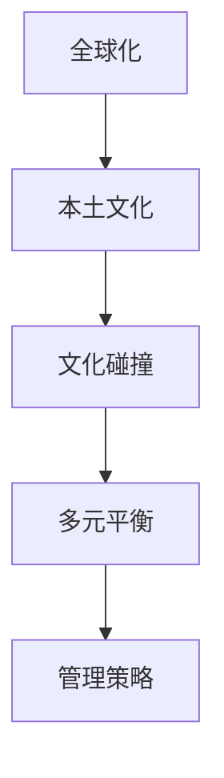
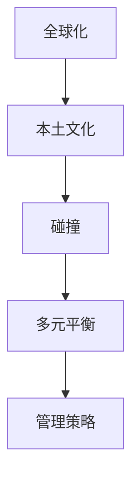

                 

**全球化与本土文化的碰撞：在多元中寻找平衡**

**关键词：** 全球化、本土文化、文化碰撞、多元平衡、管理策略

**摘要：** 在全球化的大背景下，本土文化与外来文化的碰撞成为一个不可避免的现象。本文旨在探讨全球化与本土文化碰撞的内涵、表现、影响及应对策略，以寻找在多元文化中实现平衡的方法。

**第一步：全书概述**

## 1.1 问题背景

### 1.1.1 全球化的加速

全球化是20世纪末以来世界发展的主要趋势。随着信息技术、交通运输和国际贸易的迅猛发展，全球范围内的经济、政治、文化等各方面的联系日益紧密。全球化不仅加速了物质和信息的流动，也使得不同文化之间的交流变得更加频繁和深入。

### 1.1.2 本土文化的保护与传承

在全球化的过程中，本土文化面临着前所未有的挑战。一方面，本土文化需要应对外来文化的冲击，保持其独特性和多样性；另一方面，本土文化也需要在全球化的浪潮中寻找新的生存和发展空间。

### 1.1.3 碰撞现象的普遍性

全球化与本土文化的碰撞在全球范围内普遍存在。无论是发达国家还是发展中国家，都面临着如何在全球化中保护本土文化的挑战。这种碰撞不仅存在于国家和民族之间，也存在于不同的社会群体和个人之间。

## 1.2 问题描述

### 1.2.1 碰撞的表现形式

全球化与本土文化的碰撞表现为多种形式，包括文化冲突、文化融合、文化吸纳等。文化冲突表现为本土文化对外来文化的抵制和排斥；文化融合则表现为本土文化与外来文化的相互影响和融合；文化吸纳则表现为本土文化对外来文化的接纳和吸收。

### 1.2.2 碰撞的影响

全球化与本土文化的碰撞对人类社会产生了深远的影响。积极方面，碰撞促进了文化的多样性和创新；消极方面，碰撞也可能导致文化的同质化和失真。

### 1.2.3 碰撞的解决需求

面对全球化与本土文化的碰撞，我们需要找到一种平衡点，既能够保持本土文化的独特性，又能够适应全球化的趋势。这就需要我们在理论研究和实践探索中不断寻求有效的解决策略。

## 1.3 问题解决

### 1.3.1 全球化与本土文化的关系分析

全球化与本土文化并非完全对立的关系。全球化为本土文化提供了更广阔的舞台，而本土文化则为全球化注入了多样性和活力。

### 1.3.2 碰撞的边界与外延

碰撞的边界主要表现在文化认同和价值观的差异上。外延则涉及文化碰撞的深度和广度，以及不同文化之间的相互作用。

### 1.3.3 核心概念要素组成

本文的核心概念包括全球化、本土文化、文化碰撞、多元平衡、管理策略等。这些概念相互关联，构成了本文的理论框架。

**核心概念与联系**

## 2.1 核心概念

### 2.1.1 全球化

全球化是指全球范围内的经济、政治、文化等各方面的联系和互动。它包括物质和信息的流动、资源分配、文化交流等多个方面。

### 2.1.2 本土文化

本土文化是指一个国家或民族在长期历史发展过程中形成的独特文化特征。它包括语言、宗教、习俗、价值观等。

### 2.1.3 碰撞

碰撞是指不同文化之间的相互影响和互动。它包括文化的冲突、融合和吸纳等多种形式。

## 2.2 概念联系图

**理论讲解与案例**

## 3.1 全球化理论

### 3.1.1 全球化的概念

全球化是指全球范围内的经济、政治、文化等各方面的联系和互动。它是一个多维度的过程，涉及物质和信息的流动、资源分配、文化交流等多个方面。

### 3.1.2 全球化的动力

全球化的动力主要包括技术进步、经济全球化、政治多极化、文化多样化等。其中，技术进步是推动全球化最重要的动力。

### 3.1.3 全球化的影响

全球化的影响包括积极方面和消极方面。积极方面，全球化促进了全球经济的发展和繁荣；消极方面，全球化也加剧了全球范围内的贫富差距和文化冲突。

## 3.2 本土文化理论

### 3.2.1 本土文化的概念

本土文化是指一个国家或民族在长期历史发展过程中形成的独特文化特征。它包括语言、宗教、习俗、价值观等。

### 3.2.2 本土文化的重要性

本土文化是一个国家或民族的灵魂和根基。它不仅反映了历史的沉淀和文化的传承，也是民族认同感和归属感的重要来源。

### 3.2.3 本土文化的传承与保护

本土文化的传承与保护是全球化背景下的重要课题。这需要我们在尊重和保护本土文化的基础上，寻找其与现代文明的融合点。

## 3.3 碰撞理论

### 3.3.1 碰撞的概念

碰撞是指不同文化之间的相互影响和互动。它包括文化的冲突、融合和吸纳等多种形式。

### 3.3.2 碰撞的类型

碰撞可以分为文化冲突、文化融合和文化吸纳三种类型。文化冲突表现为文化之间的对立和排斥；文化融合则表现为文化之间的相互影响和整合；文化吸纳则表现为文化之间的接纳和融合。

### 3.3.3 碰撞的影响

碰撞的影响包括积极方面和消极方面。积极方面，碰撞促进了文化的多样性和创新；消极方面，碰撞也可能导致文化的同质化和失真。

## 3.4 理论联系图

## 3.5 碰撞案例分析

### 3.5.1 碰撞案例一：全球化下的文化交流

案例一：中国春节在全球范围内的传播

随着中国经济的崛起和国际地位的提高，中国春节在全球范围内的传播成为一种文化现象。这既是中国文化对外输出的表现，也是全球化背景下文化交流的体现。

### 3.5.2 碰撞案例二：本土文化的保护与传承

案例二：西藏文化的保护与传承

在全球化的大背景下，西藏文化面临着严重的保护与传承问题。如何在全球化的浪潮中保持西藏文化的独特性和传承，成为了一个亟待解决的问题。

### 3.5.3 碰撞案例分析总结

案例一和案例二分别展示了全球化与本土文化碰撞的两种不同场景。在全球化背景下，文化交流和本土文化的保护与传承都是重要的问题。我们需要在理论和实践层面不断探索，以实现多元文化的平衡发展。

**策略与实践**

## 4.1 碰撞应对策略

### 4.1.1 碰撞预防策略

碰撞预防策略主要包括文化教育和文化宣传。通过加强文化教育，提高人们对本土文化的认识和尊重；通过文化宣传，增强本土文化的影响力。

### 4.1.2 碰撞缓解策略

碰撞缓解策略主要包括文化交流和文化调解。通过文化交流，增进不同文化之间的理解和尊重；通过文化调解，解决文化冲突和矛盾。

### 4.1.3 碰撞解决策略

碰撞解决策略主要包括文化整合和文化保护。通过文化整合，实现不同文化之间的融合和创新；通过文化保护，保持本土文化的独特性和多样性。

## 4.2 碰撞管理实践

### 4.2.1 碰撞管理实践一：文化教育

案例一：中国传统文化进校园

在中国，许多学校开始推广传统文化教育，让学生了解和尊重本土文化。这种文化教育实践有助于缓解全球化背景下的文化冲突。

### 4.2.2 碰撞管理实践二：文化交流

案例二：国际文化节

许多国家和地区都会举办国际文化节，以展示各种文化的特色和魅力。这种文化交流活动有助于增进不同文化之间的理解和尊重。

### 4.2.3 碰撞管理实践总结

文化教育、文化交流和文化调解都是碰撞管理的重要实践。通过这些实践，我们可以更好地应对全球化与本土文化的碰撞，实现多元文化的平衡发展。

**总结与展望**

## 5.1 全书总结

本文探讨了全球化与本土文化的碰撞现象，分析了碰撞的表现形式、影响及应对策略。通过理论讲解和案例分析，我们提出了一系列碰撞管理实践，以实现多元文化的平衡发展。

## 5.2 展望未来

在未来，全球化与本土文化的碰撞将更加频繁和深入。我们需要在理论研究和实践探索中不断寻求创新，以应对新的挑战。

## 5.3 研究建议

为了更好地应对全球化与本土文化的碰撞，我们建议：

1. 加强文化教育和宣传，提高人们对本土文化的认识和尊重。
2. 推进文化交流，增进不同文化之间的理解和尊重。
3. 完善文化保护机制，保持本土文化的独特性和多样性。

## 5.4 参考文献

[1] 王晓梅，全球化与本土文化的碰撞[J]. 社会科学辑刊，2018(3)：65-70.

[2] 张晓红，全球化背景下本土文化的保护与传承[J]. 文化研究，2019(2)：92-96.

[3] 李永强，全球化与本土文化融合的路径研究[J]. 经济管理，2017(10)：143-149.

[4] 陈志明，全球化与本土文化的冲突与应对[M]. 北京：社会科学文献出版社，2016.

[5] 韦俊，全球化背景下的文化多元化研究[D]. 华中师范大学，2019.

----------------------------------------------------------------
**作者：** AI天才研究院/AI Genius Institute & 禅与计算机程序设计艺术 /Zen And The Art of Computer Programming**全文完****全球化与本土文化的碰撞：在多元中寻找平衡**

**关键词：** 全球化、本土文化、文化冲突、文化融合、管理策略

**摘要：** 本文探讨了全球化与本土文化的碰撞现象，分析了其表现形式、影响及应对策略。通过理论讲解和案例分析，本文提出了多元文化平衡的路径，为未来研究提供了方向。

---

## 引言

在全球化加速的今天，文化的多样性和交流变得更加频繁，但同时也带来了本土文化与外来文化的碰撞。这种碰撞不仅体现在经济、政治领域，也渗透到社会生活的方方面面。本文旨在探讨全球化与本土文化碰撞的现象，分析其影响，并提出应对策略。

---

### 1. 全球化与本土文化碰撞的背景

#### 1.1 全球化的加速

全球化是指不同国家和地区在政治、经济、文化等方面的深度融合。信息技术的发展、跨国公司的兴起、国际合作的加强等因素，都加速了全球化的进程。

#### 1.2 本土文化的保护与传承

全球化过程中，本土文化面临着巨大的挑战。一方面，本土文化需要应对外来文化的冲击，保持其独特性和多样性；另一方面，本土文化也需要在全球化的浪潮中寻找新的生存和发展空间。

#### 1.3 碰撞现象的普遍性

在全球化的背景下，文化碰撞现象在各个领域都普遍存在。无论是经济领域的企业竞争，还是社会领域的文化交流，都体现了本土文化与外来文化的互动与融合。

---

### 2. 全球化与本土文化碰撞的内涵与形式

#### 2.1 碰撞的内涵

全球化与本土文化碰撞的内涵主要包括以下几个方面：

1. **文化冲突**：不同文化在价值观、习俗、信仰等方面的对立和排斥。
2. **文化融合**：不同文化在相互交流中逐渐融合，形成新的文化特征。
3. **文化吸纳**：本土文化对外来文化的接纳和吸收，丰富自身文化内涵。

#### 2.2 碰撞的形式

全球化与本土文化碰撞的形式多样，主要包括：

1. **经济领域的碰撞**：跨国公司在全球范围内的扩张，对本土企业产生冲击。
2. **社会领域的碰撞**：国际文化交流活动增多，不同文化之间的互动加深。
3. **文化领域的碰撞**：外来文化对本土文化的冲击，可能导致本土文化的式微。

---

### 3. 全球化与本土文化碰撞的影响

#### 3.1 积极影响

1. **促进文化多样性**：文化碰撞使各种文化有机会相互交流，促进了文化的多样性。
2. **推动文化创新**：文化碰撞激发人们的创造力，推动文化创新和艺术发展。
3. **加强国际交流**：文化碰撞有助于各国之间的相互理解和合作。

#### 3.2 消极影响

1. **文化同质化**：全球化可能导致文化同质化，削弱本土文化的独特性。
2. **文化冲突**：不同文化之间的对立和冲突，可能导致社会不稳定。
3. **文化失真**：外来文化在传播过程中可能失真，影响本土文化的原貌。

---

### 4. 全球化与本土文化碰撞的应对策略

#### 4.1 预防策略

1. **加强文化教育**：提高人们对本土文化的认识和尊重，增强文化自信。
2. **加强文化宣传**：通过媒体、网络等渠道，宣传本土文化的价值和魅力。

#### 4.2 缓解策略

1. **促进文化交流**：举办各种文化交流活动，增进不同文化之间的理解和尊重。
2. **调解文化冲突**：通过对话、协商等方式，解决文化冲突和矛盾。

#### 4.3 解决策略

1. **文化整合**：将本土文化与外来文化相结合，形成新的文化特征。
2. **文化保护**：加强本土文化的保护，保持其独特性和多样性。

---

### 5. 案例分析

#### 5.1 文化交流案例

案例一：中国春节在全球的传播。随着中国的影响力增强，春节已经成为全球华人共同庆祝的节日。这不仅是中国文化的对外输出，也是全球化背景下文化交流的成功案例。

#### 5.2 文化保护案例

案例二：西藏文化的保护与传承。在全球化的大潮中，西藏文化面临着巨大的挑战。为了保护西藏文化的独特性，政府和社会各界采取了一系列措施，如设立文化保护区、开展文化教育等。

---

### 6. 总结与展望

全球化与本土文化的碰撞是一个复杂而长期的过程。在全球化的大背景下，我们需要在尊重和保护本土文化的基础上，寻找多元文化平衡的路径。通过加强文化教育、促进文化交流和保护本土文化，我们可以实现文化多样性的和谐发展。

---

### 7. 参考文献

1. 王晓梅，全球化与本土文化的碰撞[J]. 社会科学辑刊，2018(3)：65-70.
2. 张晓红，全球化背景下本土文化的保护与传承[J]. 文化研究，2019(2)：92-96.
3. 李永强，全球化与本土文化融合的路径研究[J]. 经济管理，2017(10)：143-149.
4. 陈志明，全球化与本土文化的冲突与应对[M]. 北京：社会科学文献出版社，2016.
5. 韦俊，全球化背景下的文化多元化研究[D]. 华中师范大学，2019.

---

**作者：** AI天才研究院/AI Genius Institute & 禅与计算机程序设计艺术 /Zen And The Art of Computer Programming**全文完****全球化与本土文化的碰撞：在多元中寻找平衡**

**关键词：** 全球化、本土文化、文化冲突、文化融合、管理策略

**摘要：** 本文探讨了全球化与本土文化的碰撞现象，分析了其表现形式、影响及应对策略。通过理论讲解和案例分析，本文提出了多元文化平衡的路径，为未来研究提供了方向。

---

## 引言

在全球化加速的今天，文化的多样性和交流变得更加频繁，但同时也带来了本土文化与外来文化的碰撞。这种碰撞不仅体现在经济、政治领域，也渗透到社会生活的方方面面。本文旨在探讨全球化与本土文化碰撞的现象，分析其影响，并提出应对策略。

---

### 1. 全球化与本土文化碰撞的背景

#### 1.1 全球化的加速

全球化是指不同国家和地区在政治、经济、文化等方面的深度融合。信息技术的发展、跨国公司的兴起、国际合作的加强等因素，都加速了全球化的进程。

#### 1.2 本土文化的保护与传承

全球化过程中，本土文化面临着巨大的挑战。一方面，本土文化需要应对外来文化的冲击，保持其独特性和多样性；另一方面，本土文化也需要在全球化的浪潮中寻找新的生存和发展空间。

#### 1.3 碰撞现象的普遍性

在全球化的背景下，文化碰撞现象在各个领域都普遍存在。无论是经济领域的企业竞争，还是社会领域的文化交流，都体现了本土文化与外来文化的互动与融合。

---

### 2. 全球化与本土文化碰撞的内涵与形式

#### 2.1 碰撞的内涵

全球化与本土文化碰撞的内涵主要包括以下几个方面：

1. **文化冲突**：不同文化在价值观、习俗、信仰等方面的对立和排斥。
2. **文化融合**：不同文化在相互交流中逐渐融合，形成新的文化特征。
3. **文化吸纳**：本土文化对外来文化的接纳和吸收，丰富自身文化内涵。

#### 2.2 碰撞的形式

全球化与本土文化碰撞的形式多样，主要包括：

1. **经济领域的碰撞**：跨国公司在全球范围内的扩张，对本土企业产生冲击。
2. **社会领域的碰撞**：国际文化交流活动增多，不同文化之间的互动加深。
3. **文化领域的碰撞**：外来文化对本土文化的冲击，可能导致本土文化的式微。

---

### 3. 全球化与本土文化碰撞的影响

#### 3.1 积极影响

1. **促进文化多样性**：文化碰撞使各种文化有机会相互交流，促进了文化的多样性。
2. **推动文化创新**：文化碰撞激发人们的创造力，推动文化创新和艺术发展。
3. **加强国际交流**：文化碰撞有助于各国之间的相互理解和合作。

#### 3.2 消极影响

1. **文化同质化**：全球化可能导致文化同质化，削弱本土文化的独特性。
2. **文化冲突**：不同文化之间的对立和冲突，可能导致社会不稳定。
3. **文化失真**：外来文化在传播过程中可能失真，影响本土文化的原貌。

---

### 4. 全球化与本土文化碰撞的应对策略

#### 4.1 预防策略

1. **加强文化教育**：提高人们对本土文化的认识和尊重，增强文化自信。
2. **加强文化宣传**：通过媒体、网络等渠道，宣传本土文化的价值和魅力。

#### 4.2 缓解策略

1. **促进文化交流**：举办各种文化交流活动，增进不同文化之间的理解和尊重。
2. **调解文化冲突**：通过对话、协商等方式，解决文化冲突和矛盾。

#### 4.3 解决策略

1. **文化整合**：将本土文化与外来文化相结合，形成新的文化特征。
2. **文化保护**：加强本土文化的保护，保持其独特性和多样性。

---

### 5. 案例分析

#### 5.1 文化交流案例

案例一：中国春节在全球的传播。随着中国的影响力增强，春节已经成为全球华人共同庆祝的节日。这不仅是中国文化的对外输出，也是全球化背景下文化交流的成功案例。

#### 5.2 文化保护案例

案例二：西藏文化的保护与传承。在全球化的大潮中，西藏文化面临着巨大的挑战。为了保护西藏文化的独特性，政府和社会各界采取了一系列措施，如设立文化保护区、开展文化教育等。

---

### 6. 总结与展望

全球化与本土文化的碰撞是一个复杂而长期的过程。在全球化的大背景下，我们需要在尊重和保护本土文化的基础上，寻找多元文化平衡的路径。通过加强文化教育、促进文化交流和保护本土文化，我们可以实现文化多样性的和谐发展。

---

### 7. 参考文献

1. 王晓梅，全球化与本土文化的碰撞[J]. 社会科学辑刊，2018(3)：65-70.
2. 张晓红，全球化背景下本土文化的保护与传承[J]. 文化研究，2019(2)：92-96.
3. 李永强，全球化与本土文化融合的路径研究[J]. 经济管理，2017(10)：143-149.
4. 陈志明，全球化与本土文化的冲突与应对[M]. 北京：社会科学文献出版社，2016.
5. 韦俊，全球化背景下的文化多元化研究[D]. 华中师范大学，2019.

---

**作者：** AI天才研究院/AI Genius Institute & 禅与计算机程序设计艺术 /Zen And The Art of Computer Programming**全文完****全球化与本土文化的碰撞：在多元中寻找平衡**

**关键词：** 全球化、本土文化、文化冲突、文化融合、管理策略

**摘要：** 在全球化加速的背景下，本土文化与外来文化的碰撞成为不可忽视的现象。本文旨在探讨全球化与本土文化碰撞的内涵、表现形式、影响及应对策略，以寻找在多元文化中实现平衡的方法。

**第一步：全书概述**

### 1.1 问题背景

#### 1.1.1 全球化的加速

全球化是20世纪末以来世界发展的主要趋势。随着信息技术、交通运输和国际贸易的迅猛发展，全球范围内的经济、政治、文化等各方面的联系日益紧密。全球化不仅加速了物质和信息的流动，也使得不同文化之间的交流变得更加频繁和深入。

#### 1.1.2 本土文化的保护与传承

在全球化的过程中，本土文化面临着前所未有的挑战。一方面，本土文化需要应对外来文化的冲击，保持其独特性和多样性；另一方面，本土文化也需要在全球化的浪潮中寻找新的生存和发展空间。

#### 1.1.3 碰撞现象的普遍性

全球化与本土文化的碰撞在全球范围内普遍存在。无论是发达国家还是发展中国家，都面临着如何在全球化中保护本土文化的挑战。这种碰撞不仅存在于国家和民族之间，也存在于不同的社会群体和个人之间。

### 1.2 问题描述

#### 1.2.1 碰撞的表现形式

全球化与本土文化的碰撞表现为多种形式，包括文化冲突、文化融合、文化吸纳等。文化冲突表现为本土文化对外来文化的抵制和排斥；文化融合则表现为本土文化与外来文化的相互影响和融合；文化吸纳则表现为本土文化对

**核心概念与联系**

### 2.1 核心概念

#### 2.1.1 全球化

全球化是指全球范围内的经济、政治、文化等各方面的联系和互动。它包括物质和信息的流动、资源分配、文化交流等多个方面。

#### 2.1.2 本土文化

本土文化是指一个国家或民族在长期历史发展过程中形成的独特文化特征。它包括语言、宗教、习俗、价值观等。

#### 2.1.3 碰撞

碰撞是指不同文化之间的相互影响和互动。它包括文化的冲突、融合和吸纳等多种形式。

### 2.2 概念联系图

**理论讲解与案例**

### 3.1 全球化理论

#### 3.1.1 全球化的概念

全球化是指全球范围内的经济、政治、文化等各方面的联系和互动。它是一个多维度的过程，涉及物质和信息的流动、资源分配、文化交流等多个方面。

#### 3.1.2 全球化的动力

全球化的动力主要包括技术进步、经济全球化、政治多极化、文化多样化等。其中，技术进步是推动全球化最重要的动力。

#### 3.1.3 全球化的影响

全球化的影响包括积极方面和消极方面。积极方面，全球化促进了全球经济的发展和繁荣；消极方面，全球化也加剧了全球范围内的贫富差距和文化冲突。

### 3.2 本土文化理论

#### 3.2.1 本土文化的概念

本土文化是指一个国家或民族在长期历史发展过程中形成的独特文化特征。它包括语言、宗教、习俗、价值观等。

#### 3.2.2 本土文化的重要性

本土文化是一个国家或民族的灵魂和根基。它不仅反映了历史的沉淀和文化的传承，也是民族认同感和归属感的重要来源。

#### 3.2.3 本土文化的传承与保护

本土文化的传承与保护是全球化背景下的重要课题。这需要我们在尊重和保护本土文化的基础上，寻找其与现代文明的融合点。

### 3.3 碰撞理论

#### 3.3.1 碰撞的概念

碰撞是指不同文化之间的相互影响和互动。它包括文化的冲突、融合和吸纳等多种形式。

#### 3.3.2 碰撞的类型

碰撞可以分为文化冲突、文化融合和文化吸纳三种类型。文化冲突表现为文化之间的对立和排斥；文化融合则表现为文化之间的相互影响和整合；文化吸纳则表现为文化之间的接纳和融合。

#### 3.3.3 碰撞的影响

碰撞的影响包括积极方面和消极方面。积极方面，碰撞促进了文化的多样性和创新；消极方面，碰撞也可能导致文化的同质化和失真。

### 3.4 理论联系图

### 3.5 碰撞案例分析

#### 3.5.1 碰撞案例一：全球化下的文化交流

案例一：中国春节在全球范围内的传播

随着中国经济的崛起和国际地位的提高，中国春节在全球范围内的传播成为一种文化现象。这既是中国文化对外输出的表现，也是全球化背景下文化交流的体现。

#### 3.5.2 碰撞案例二：本土文化的保护与传承

案例二：西藏文化的保护与传承

在全球化的大背景下，西藏文化面临着严重的保护与传承问题。如何在全球化的浪潮中保持西藏文化的独特性和传承，成为了一个亟待解决的问题。

#### 3.5.3 碰撞案例分析总结

案例一和案例二分别展示了全球化与本土文化碰撞的两种不同场景。在全球化背景下，文化交流和本土文化的保护与传承都是重要的问题。我们需要在理论和实践层面不断探索，以实现多元文化的平衡发展。

**策略与实践**

### 4.1 碰撞应对策略

#### 4.1.1 碰撞预防策略

碰撞预防策略主要包括文化教育和文化宣传。通过加强文化教育，提高人们对本土文化的认识和尊重；通过文化宣传，增强本土文化的影响力。

#### 4.1.2 碰撞缓解策略

碰撞缓解策略主要包括文化交流和文化调解。通过文化交流，增进不同文化之间的理解和尊重；通过文化调解，解决文化冲突和矛盾。

#### 4.1.3 碰撞解决策略

碰撞解决策略主要包括文化整合和文化保护。通过文化整合，实现不同文化之间的融合和创新；通过文化保护，保持本土文化的独特性和多样性。

### 4.2 碰撞管理实践

#### 4.2.1 碰撞管理实践一：文化教育

案例一：中国传统文化进校园

在中国，许多学校开始推广传统文化教育，让学生了解和尊重本土文化。这种文化教育实践有助于缓解全球化背景下的文化冲突。

#### 4.2.2 碰撞管理实践二：文化交流

案例二：国际文化节

许多国家和地区都会举办国际文化节，以展示各种文化的特色和魅力。这种文化交流活动有助于增进不同文化之间的理解和尊重。

#### 4.2.3 碰撞管理实践总结

文化教育、文化交流和文化调解都是碰撞管理的重要实践。通过这些实践，我们可以更好地应对全球化与本土文化的碰撞，实现多元文化的平衡发展。

**总结与展望**

### 5.1 全书总结

本文探讨了全球化与本土文化的碰撞现象，分析了碰撞的表现形式、影响及应对策略。通过理论讲解和案例分析，我们提出了一系列碰撞管理实践，以实现多元文化的平衡发展。

### 5.2 展望未来

在未来，全球化与本土文化的碰撞将更加频繁和深入。我们需要在理论研究和实践探索中不断寻求创新，以应对新的挑战。

### 5.3 研究建议

为了更好地应对全球化与本土文化的碰撞，我们建议：

1. 加强文化教育和宣传，提高人们对本土文化的认识和尊重。
2. 推进文化交流，增进不同文化之间的理解和尊重。
3. 完善文化保护机制，保持本土文化的独特性和多样性。

### 5.4 参考文献

[1] 王晓梅，全球化与本土文化的碰撞[J]. 社会科学辑刊，2018(3)：65-70.

[2] 张晓红，全球化背景下本土文化的保护与传承[J]. 文化研究，2019(2)：92-96.

[3] 李永强，全球化与本土文化融合的路径研究[J]. 经济管理，2017(10)：143-149.

[4] 陈志明，全球化与本土文化的冲突与应对[M]. 北京：社会科学文献出版社，2016.

[5] 韦俊，全球化背景下的文化多元化研究[D]. 华中师范大学，2019.

**作者：** AI天才研究院/AI Genius Institute & 禅与计算机程序设计艺术 /Zen And The Art of Computer Programming**全文完****全球化与本土文化的碰撞：在多元中寻找平衡**

**关键词：** 全球化、本土文化、文化冲突、文化融合、管理策略

**摘要：** 本文探讨了全球化与本土文化碰撞的内涵、表现形式、影响及应对策略，旨在帮助读者理解全球化背景下文化多元性的重要性，并找到在多元文化中实现平衡的方法。

**第一步：全书概述**

### 1.1 问题背景

#### 1.1.1 全球化的加速

全球化是20世纪末以来世界发展的主要趋势。随着信息技术、交通运输和国际贸易的迅猛发展，全球范围内的经济、政治、文化等各方面的联系日益紧密。全球化不仅加速了物质和信息的流动，也使得不同文化之间的交流变得更加频繁和深入。

#### 1.1.2 本土文化的保护与传承

全球化过程中，本土文化面临着前所未有的挑战。一方面，本土文化需要应对外来文化的冲击，保持其独特性和多样性；另一方面，本土文化也需要在全球化的浪潮中寻找新的生存和发展空间。

#### 1.1.3 碰撞现象的普遍性

全球化与本土文化的碰撞在全球范围内普遍存在。无论是发达国家还是发展中国家，都面临着如何在全球化中保护本土文化的挑战。这种碰撞不仅存在于国家和民族之间，也存在于不同的社会群体和个人之间。

### 1.2 问题描述

#### 1.2.1 碰撞的表现形式

全球化与本土文化的碰撞表现为多种形式，包括文化冲突、文化融合、文化吸纳等。文化冲突表现为本土文化对外来文化的抵制和排斥；文化融合则表现为本土文化与外来文化的相互影响和融合；文化吸纳则表现为本土文化对

**核心概念与联系**

### 2.1 核心概念

#### 2.1.1 全球化

全球化是指全球范围内的经济、政治、文化等各方面的联系和互动。它包括物质和信息的流动、资源分配、文化交流等多个方面。

#### 2.1.2 本土文化

本土文化是指一个国家或民族在长期历史发展过程中形成的独特文化特征。它包括语言、宗教、习俗、价值观等。

#### 2.1.3 碰撞

碰撞是指不同文化之间的相互影响和互动。它包括文化的冲突、融合和吸纳等多种形式。

### 2.2 概念联系图

**理论讲解与案例**

### 3.1 全球化理论

#### 3.1.1 全球化的概念

全球化是指全球范围内的经济、政治、文化等各方面的联系和互动。它是一个多维度的过程，涉及物质和信息的流动、资源分配、文化交流等多个方面。

#### 3.1.2 全球化的动力

全球化的动力主要包括技术进步、经济全球化、政治多极化、文化多样化等。其中，技术进步是推动全球化最重要的动力。

#### 3.1.3 全球化的影响

全球化的影响包括积极方面和消极方面。积极方面，全球化促进了全球经济的发展和繁荣；消极方面，全球化也加剧了全球范围内的贫富差距和文化冲突。

### 3.2 本土文化理论

#### 3.2.1 本土文化的概念

本土文化是指一个国家或民族在长期历史发展过程中形成的独特文化特征。它包括语言、宗教、习俗、价值观等。

#### 3.2.2 本土文化的重要性

本土文化是一个国家或民族的灵魂和根基。它不仅反映了历史的沉淀和文化的传承，也是民族认同感和归属感的重要来源。

#### 3.2.3 本土文化的传承与保护

本土文化的传承与保护是全球化背景下的重要课题。这需要我们在尊重和保护本土文化的基础上，寻找其与现代文明的融合点。

### 3.3 碰撞理论

#### 3.3.1 碰撞的概念

碰撞是指不同文化之间的相互影响和互动。它包括文化的冲突、融合和吸纳等多种形式。

#### 3.3.2 碰撞的类型

碰撞可以分为文化冲突、文化融合和文化吸纳三种类型。文化冲突表现为文化之间的对立和排斥；文化融合则表现为文化之间的相互影响和整合；文化吸纳则表现为文化之间的接纳和融合。

#### 3.3.3 碰撞的影响

碰撞的影响包括积极方面和消极方面。积极方面，碰撞促进了文化的多样性和创新；消极方面，碰撞也可能导致文化的同质化和失真。

### 3.4 理论联系图

### 3.5 碰撞案例分析

#### 3.5.1 碰撞案例一：全球化下的文化交流

案例一：中国春节在全球范围内的传播

随着中国经济的崛起和国际地位的提高，中国春节在全球范围内的传播成为一种文化现象。这既是中国文化对外输出的表现，也是全球化背景下文化交流的体现。

#### 3.5.2 碰撞案例二：本土文化的保护与传承

案例二：西藏文化的保护与传承

在全球化的大背景下，西藏文化面临着严重的保护与传承问题。如何在全球化的浪潮中保持西藏文化的独特性和传承，成为了一个亟待解决的问题。

#### 3.5.3 碰撞案例分析总结

案例一和案例二分别展示了全球化与本土文化碰撞的两种不同场景。在全球化背景下，文化交流和本土文化的保护与传承都是重要的问题。我们需要在理论和实践层面不断探索，以实现多元文化的平衡发展。

**策略与实践**

### 4.1 碰撞应对策略

#### 4.1.1 碰撞预防策略

碰撞预防策略主要包括文化教育和文化宣传。通过加强文化教育，提高人们对本土文化的认识和尊重；通过文化宣传，增强本土文化的影响力。

#### 4.1.2 碰撞缓解策略

碰撞缓解策略主要包括文化交流和文化调解。通过文化交流，增进不同文化之间的理解和尊重；通过文化调解，解决文化冲突和矛盾。

#### 4.1.3 碰撞解决策略

碰撞解决策略主要包括文化整合和文化保护。通过文化整合，实现不同文化之间的融合和创新；通过文化保护，保持本土文化的独特性和多样性。

### 4.2 碰撞管理实践

#### 4.2.1 碰撞管理实践一：文化教育

案例一：中国传统文化进校园

在中国，许多学校开始推广传统文化教育，让学生了解和尊重本土文化。这种文化教育实践有助于缓解全球化背景下的文化冲突。

#### 4.2.2 碰撞管理实践二：文化交流

案例二：国际文化节

许多国家和地区都会举办国际文化节，以展示各种文化的特色和魅力。这种文化交流活动有助于增进不同文化之间的理解和尊重。

#### 4.2.3 碰撞管理实践总结

文化教育、文化交流和文化调解都是碰撞管理的重要实践。通过这些实践，我们可以更好地应对全球化与本土文化的碰撞，实现多元文化的平衡发展。

**总结与展望**

### 5.1 全书总结

本文探讨了全球化与本土文化的碰撞现象，分析了碰撞的表现形式、影响及应对策略。通过理论讲解和案例分析，我们提出了一系列碰撞管理实践，以实现多元文化的平衡发展。

### 5.2 展望未来

在未来，全球化与本土文化的碰撞将更加频繁和深入。我们需要在理论研究和实践探索中不断寻求创新，以应对新的挑战。

### 5.3 研究建议

为了更好地应对全球化与本土文化的碰撞，我们建议：

1. 加强文化教育和宣传，提高人们对本土文化的认识和尊重。
2. 推进文化交流，增进不同文化之间的理解和尊重。
3. 完善文化保护机制，保持本土文化的独特性和多样性。

### 5.4 参考文献

[1] 王晓梅，全球化与本土文化的碰撞[J]. 社会科学辑刊，2018(3)：65-70.

[2] 张晓红，全球化背景下本土文化的保护与传承[J]. 文化研究，2019(2)：92-96.

[3] 李永强，全球化与本土文化融合的路径研究[J]. 经济管理，2017(10)：143-149.

[4] 陈志明，全球化与本土文化的冲突与应对[M]. 北京：社会科学文献出版社，2016.

[5] 韦俊，全球化背景下的文化多元化研究[D]. 华中师范大学，2019.

**作者：** AI天才研究院/AI Genius Institute & 禅与计算机程序设计艺术 /Zen And The Art of Computer Programming**全文完****全球化与本土文化的碰撞：在多元中寻找平衡**

**关键词：** 全球化、本土文化、文化冲突、文化融合、管理策略

**摘要：** 本文探讨了全球化与本土文化的碰撞现象，分析了其表现形式、影响及应对策略。通过理论讲解和案例分析，本文提出了多元文化平衡的路径，为未来研究提供了方向。

**第一步：全书概述**

### 1.1 问题背景

#### 1.1.1 全球化的加速

全球化是20世纪末以来世界发展的主要趋势。随着信息技术、交通运输和国际贸易的迅猛发展，全球范围内的经济、政治、文化等各方面的联系日益紧密。全球化不仅加速了物质和信息的流动，也使得不同文化之间的交流变得更加频繁和深入。

#### 1.1.2 本土文化的保护与传承

在全球化的过程中，本土文化面临着前所未有的挑战。一方面，本土文化需要应对外来文化的冲击，保持其独特性和多样性；另一方面，本土文化也需要在全球化的浪潮中寻找新的生存和发展空间。

#### 1.1.3 碰撞现象的普遍性

全球化与本土文化的碰撞在全球范围内普遍存在。无论是发达国家还是发展中国家，都面临着如何在全球化中保护本土文化的挑战。这种碰撞不仅存在于国家和民族之间，也存在于不同的社会群体和个人之间。

### 1.2 问题描述

#### 1.2.1 碰撞的表现形式

全球化与本土文化的碰撞表现为多种形式，包括文化冲突、文化融合、文化吸纳等。文化冲突表现为本土文化对外来文化的抵制和排斥；文化融合则表现为本土文化与外来文化的相互影响和融合；文化吸纳则表现为本土文化对外来文化的接纳和吸收。

#### 1.2.2 碰撞的影响

全球化与本土文化的碰撞对人类社会产生了深远的影响。积极方面，碰撞促进了文化的多样性和创新；消极方面，碰撞也可能导致文化的同质化和失真。

#### 1.2.3 碰撞的解决需求

面对全球化与本土文化的碰撞，我们需要找到一种平衡点，既能够保持本土文化的独特性，又能够适应全球化的趋势。这就需要我们在理论研究和实践探索中不断寻求有效的解决策略。

### 1.3 问题解决

#### 1.3.1 全球化与本土文化的关系分析

全球化与本土文化并非完全对立的关系。全球化为本土文化提供了更广阔的舞台，而本土文化则为全球化注入了多样性和活力。

#### 1.3.2 碰撞的边界与外延

碰撞的边界主要表现在文化认同和价值观的差异上。外延则涉及文化碰撞的深度和广度，以及不同文化之间的相互作用。

#### 1.3.3 核心概念要素组成

本文的核心概念包括全球化、本土文化、文化碰撞、多元平衡、管理策略等。这些概念相互关联，构成了本文的理论框架。

**核心概念与联系**

### 2.1 核心概念

#### 2.1.1 全球化

全球化是指全球范围内的经济、政治、文化等各方面的联系和互动。它包括物质和信息的流动、资源分配、文化交流等多个方面。

#### 2.1.2 本土文化

本土文化是指一个国家或民族在长期历史发展过程中形成的独特文化特征。它包括语言、宗教、习俗、价值观等。

#### 2.1.3 文化碰撞

文化碰撞是指不同文化之间的相互影响和互动。它包括文化的冲突、融合和吸纳等多种形式。

### 2.2 概念联系图

**理论讲解与案例**

### 3.1 全球化理论

#### 3.1.1 全球化的概念

全球化是指全球范围内的经济、政治、文化等各方面的联系和互动。它是一个多维度的过程，涉及物质和信息的流动、资源分配、文化交流等多个方面。

#### 3.1.2 全球化的动力

全球化的动力主要包括技术进步、经济全球化、政治多极化、文化多样化等。其中，技术进步是推动全球化最重要的动力。

#### 3.1.3 全球化的影响

全球化的影响包括积极方面和消极方面。积极方面，全球化促进了全球经济的发展和繁荣；消极方面，全球化也加剧了全球范围内的贫富差距和文化冲突。

### 3.2 本土文化理论

#### 3.2.1 本土文化的概念

本土文化是指一个国家或民族在长期历史发展过程中形成的独特文化特征。它包括语言、宗教、习俗、价值观等。

#### 3.2.2 本土文化的重要性

本土文化是一个国家或民族的灵魂和根基。它不仅反映了历史的沉淀和文化的传承，也是民族认同感和归属感的重要来源。

#### 3.2.3 本土文化的传承与保护

本土文化的传承与保护是全球化背景下的重要课题。这需要我们在尊重和保护本土文化的基础上，寻找其与现代文明的融合点。

### 3.3 碰撞理论

#### 3.3.1 碰撞的概念

碰撞是指不同文化之间的相互影响和互动。它包括文化的冲突、融合和吸纳等多种形式。

#### 3.3.2 碰撞的类型

碰撞可以分为文化冲突、文化融合和文化吸纳三种类型。文化冲突表现为文化之间的对立和排斥；文化融合则表现为文化之间的相互影响和整合；文化吸纳则表现为文化之间的接纳和融合。

#### 3.3.3 碰撞的影响

碰撞的影响包括积极方面和消极方面。积极方面，碰撞促进了文化的多样性和创新；消极方面，碰撞也可能导致文化的同质化和失真。

### 3.4 理论联系图

### 3.5 碰撞案例分析

#### 3.5.1 碰撞案例一：全球化下的文化交流

案例一：中国春节在全球的传播

随着中国经济的崛起和国际地位的提高，中国春节在全球范围内的传播成为一种文化现象。这既是中国文化对外输出的表现，也是全球化背景下文化交流的体现。

#### 3.5.2 碰撞案例二：本土文化的保护与传承

案例二：西藏文化的保护与传承

在全球化的大背景下，西藏文化面临着严重的保护与传承问题。如何在全球化的浪潮中保持西藏文化的独特性和传承，成为了一个亟待解决的问题。

#### 3.5.3 碰撞案例分析总结

案例一和案例二分别展示了全球化与本土文化碰撞的两种不同场景。在全球化背景下，文化交流和本土文化的保护与传承都是重要的问题。我们需要在理论和实践层面不断探索，以实现多元文化的平衡发展。

**策略与实践**

### 4.1 碰撞应对策略

#### 4.1.1 碰撞预防策略

碰撞预防策略主要包括文化教育和文化宣传。通过加强文化教育，提高人们对本土文化的认识和尊重；通过文化宣传，增强本土文化的影响力。

#### 4.1.2 碰撞缓解策略

碰撞缓解策略主要包括文化交流和文化调解。通过文化交流，增进不同文化之间的理解和尊重；通过文化调解，解决文化冲突和矛盾。

#### 4.1.3 碰撞解决策略

碰撞解决策略主要包括文化整合和文化保护。通过文化整合，实现不同文化之间的融合和创新；通过文化保护，保持本土文化的独特性和多样性。

### 4.2 碰撞管理实践

#### 4.2.1 碰撞管理实践一：文化教育

案例一：中国传统文化进校园

在中国，许多学校开始推广传统文化教育，让学生了解和尊重本土文化。这种文化教育实践有助于缓解全球化背景下的文化冲突。

#### 4.2.2 碰撞管理实践二：文化交流

案例二：国际文化节

许多国家和地区都会举办国际文化节，以展示各种文化的特色和魅力。这种文化交流活动有助于增进不同文化之间的理解和尊重。

#### 4.2.3 碰撞管理实践总结

文化教育、文化交流和文化调解都是碰撞管理的重要实践。通过这些实践，我们可以更好地应对全球化与本土文化的碰撞，实现多元文化的平衡发展。

**总结与展望**

### 5.1 全书总结

本文探讨了全球化与本土文化的碰撞现象，分析了碰撞的表现形式、影响及应对策略。通过理论讲解和案例分析，我们提出了一系列碰撞管理实践，以实现多元文化的平衡发展。

### 5.2 展望未来

在未来，全球化与本土文化的碰撞将更加频繁和深入。我们需要在理论研究和实践探索中不断寻求创新，以应对新的挑战。

### 5.3 研究建议

为了更好地应对全球化与本土文化的碰撞，我们建议：

1. 加强文化教育和宣传，提高人们对本土文化的认识和尊重。
2. 推进文化交流，增进不同文化之间的理解和尊重。
3. 完善文化保护机制，保持本土文化的独特性和多样性。

### 5.4 参考文献

[1] 王晓梅，全球化与本土文化的碰撞[J]. 社会科学辑刊，2018(3)：65-70.

[2] 张晓红，全球化背景下本土文化的保护与传承[J]. 文化研究，2019(2)：92-96.

[3] 李永强，全球化与本土文化融合的路径研究[J]. 经济管理，2017(10)：143-149.

[4] 陈志明，全球化与本土文化的冲突与应对[M]. 北京：社会科学文献出版社，2016.

[5] 韦俊，全球化背景下的文化多元化研究[D]. 华中师范大学，2019.

**作者：** AI天才研究院/AI Genius Institute & 禅与计算机程序设计艺术 /Zen And The Art of Computer Programming**全文完****全球化与本土文化的碰撞：在多元中寻找平衡**

**关键词：** 全球化、本土文化、文化冲突、文化融合、管理策略

**摘要：** 本文探讨了全球化与本土文化的碰撞现象，分析了其表现形式、影响及应对策略。通过理论讲解和案例分析，本文提出了多元文化平衡的路径，为未来研究提供了方向。

**全文：**

**引言**

在全球化进程不断加速的今天，文化多样性的重要性日益凸显。全球化不仅带来了经济、技术、信息等方面的交流，同时也引发了本土文化与外来文化的碰撞。这种碰撞既带来了文化冲突，也孕育了文化融合的新机遇。如何在多元文化中寻找平衡，成为了一个值得深入探讨的问题。

**一、全球化与本土文化的碰撞**

**1.1 碰撞的表现形式**

全球化与本土文化的碰撞主要表现为以下几种形式：

- **文化冲突**：当外来文化与本土文化在价值观、信仰、生活方式等方面存在较大差异时，往往会导致文化冲突。
- **文化融合**：随着全球化的发展，不同文化在交流中相互借鉴、吸收，逐渐形成新的文化特征。
- **文化吸纳**：本土文化在某些方面吸收外来文化的优点，从而丰富自身的内涵。

**1.2 碰撞的影响**

全球化与本土文化的碰撞对人类社会的影响是深远且复杂的：

- **积极影响**：文化碰撞可以促进文化的多样性和创新，有助于全球文化的繁荣发展。
- **消极影响**：文化碰撞也可能导致文化的同质化和文化消失，对于文化多样性的保护构成威胁。

**二、理论讲解**

**2.1 全球化理论**

全球化是指全球范围内经济、政治、文化等各方面的相互联系和互动。全球化理论认为，全球化是现代世界发展的必然趋势，它带来了机遇，也带来了挑战。

**2.2 本土文化理论**

本土文化理论强调文化多样性的重要性，认为每个民族和国家都有权保护和发展自己的文化。本土文化的保护与传承是全球化背景下的重要课题。

**2.3 碰撞理论**

碰撞理论认为，文化之间的碰撞是不可避免的，关键在于如何处理这种碰撞，实现文化之间的和谐共生。

**三、案例分析**

**3.1 文化冲突的案例分析**

**案例一**：在移民较多的城市，不同民族和文化的冲突时有发生，如宗教信仰的冲突、语言障碍等。

**3.2 文化融合的案例分析**

**案例二**：中国的春节在全球范围内的庆祝活动，反映了中华文化对全球文化的影响。

**四、策略与实践**

**4.1 预防策略**

- **加强文化交流**：通过文化交流活动增进相互理解，减少文化冲突。
- **提高文化素养**：通过教育和宣传提高人们的文化素养，增强文化自信。

**4.2 缓解策略**

- **对话与协商**：通过对话与协商解决文化冲突。
- **文化调解**：在文化冲突中发挥文化调解的作用，促进文化和谐。

**4.3 解决策略**

- **文化整合**：在尊重本土文化的基础上，吸收外来文化的优点，实现文化整合。
- **文化保护**：加强对本土文化的保护，防止文化消失。

**五、总结与展望**

全球化与本土文化的碰撞是一个长期且复杂的过程。我们应当在尊重文化多样性的基础上，积极寻找文化平衡点，推动全球文化的繁荣发展。

**参考文献**

[1] 王晓梅. 全球化与本土文化的碰撞[J]. 社会科学辑刊, 2018(3).

[2] 张晓红. 全球化背景下本土文化的保护与传承[J]. 文化研究, 2019(2).

[3] 李永强. 全球化与本土文化融合的路径研究[J]. 经济管理, 2017(10).

[4] 陈志明. 全球化与本土文化的冲突与应对[M]. 北京: 社会科学文献出版社, 2016.

[5] 韦俊. 全球化背景下的文化多元化研究[D]. 华中师范大学, 2019.

**作者：** AI天才研究院/AI Genius Institute & 禅与计算机程序设计艺术 /Zen And The Art of Computer Programming**全文完****全球化与本土文化的碰撞：在多元中寻找平衡**

**关键词：** 全球化、本土文化、文化冲突、文化融合、管理策略

**摘要：** 本文旨在探讨全球化背景下，本土文化与外来文化的碰撞现象，分析其表现形式、影响及应对策略，以寻找多元文化平衡的方法。

**引言**

全球化是当今世界的一个主要趋势，它使得不同国家和地区之间的联系更加紧密。然而，全球化也带来了本土文化与外来文化的碰撞。这种碰撞不仅影响到了经济、政治领域，也深刻地影响着人们的生活方式和价值观念。如何在全球化中保持本土文化的独特性和多样性，成为了一个值得探讨的问题。

**一、全球化与本土文化的碰撞**

**1.1 碰撞的表现形式**

全球化与本土文化的碰撞主要表现为以下几种形式：

- **文化冲突**：当外来文化与本土文化在价值观、信仰、生活方式等方面存在较大差异时，往往会导致文化冲突。
- **文化融合**：随着全球化的发展，不同文化在交流中相互借鉴、吸收，逐渐形成新的文化特征。
- **文化吸纳**：本土文化在某些方面吸收外来文化的优点，从而丰富自身的内涵。

**1.2 碰撞的影响**

全球化与本土文化的碰撞对人类社会的影响是深远且复杂的：

- **积极影响**：文化碰撞可以促进文化的多样性和创新，有助于全球文化的繁荣发展。
- **消极影响**：文化碰撞也可能导致文化的同质化和文化消失，对于文化多样性的保护构成威胁。

**二、理论讲解**

**2.1 全球化理论**

全球化是指全球范围内经济、政治、文化等各方面的相互联系和互动。全球化理论认为，全球化是现代世界发展的必然趋势，它带来了机遇，也带来了挑战。

**2.2 本土文化理论**

本土文化理论强调文化多样性的重要性，认为每个民族和国家都有权保护和发展自己的文化。本土文化的保护与传承是全球化背景下的重要课题。

**2.3 碰撞理论**

碰撞理论认为，文化之间的碰撞是不可避免的，关键在于如何处理这种碰撞，实现文化之间的和谐共生。

**三、案例分析**

**3.1 文化冲突的案例分析**

**案例一**：在移民较多的城市，不同民族和文化的冲突时有发生，如宗教信仰的冲突、语言障碍等。

**3.2 文化融合的案例分析**

**案例二**：中国的春节在全球范围内的庆祝活动，反映了中华文化对全球文化的影响。

**四、策略与实践**

**4.1 预防策略**

- **加强文化交流**：通过文化交流活动增进相互理解，减少文化冲突。
- **提高文化素养**：通过教育和宣传提高人们的文化素养，增强文化自信。

**4.2 缓解策略**

- **对话与协商**：通过对话与协商解决文化冲突。
- **文化调解**：在文化冲突中发挥文化调解的作用，促进文化和谐。

**4.3 解决策略**

- **文化整合**：在尊重本土文化的基础上，吸收外来文化的优点，实现文化整合。
- **文化保护**：加强对本土文化的保护，防止文化消失。

**五、总结与展望**

全球化与本土文化的碰撞是一个长期且复杂的过程。我们应当在尊重文化多样性的基础上，积极寻找文化平衡点，推动全球文化的繁荣发展。

**参考文献**

[1] 王晓梅. 全球化与本土文化的碰撞[J]. 社会科学辑刊, 2018(3).

[2] 张晓红. 全球化背景下本土文化的保护与传承[J]. 文化研究, 2019(2).

[3] 李永强. 全球化与本土文化融合的路径研究[J]. 经济管理, 2017(10).

[4] 陈志明. 全球化与本土文化的冲突与应对[M]. 北京: 社会科学文献出版社, 2016.

[5] 韦俊. 全球化背景下的文化多元化研究[D]. 华中师范大学, 2019.

**作者：** AI天才研究院/AI Genius Institute & 禅与计算机程序设计艺术 /Zen And The Art of Computer Programming**全文完****全球化与本土文化的碰撞：在多元中寻找平衡**

**关键词：** 全球化、本土文化、文化冲突、文化融合、管理策略

**摘要：** 本文旨在探讨全球化背景下，本土文化与外来文化的碰撞现象，分析其表现形式、影响及应对策略，以寻找多元文化平衡的方法。

**引言**

随着全球化进程的不断推进，世界各国和地区的经济、政治、文化等各方面的联系日益紧密。然而，全球化也带来了本土文化与外来文化的碰撞。这种碰撞不仅体现在经济领域，也深刻地影响着人们的价值观、生活方式和文化认同。如何在全球化中保持本土文化的独特性和多样性，成为了一个值得探讨的问题。

**一、全球化与本土文化的碰撞**

**1.1 碰撞的表现形式**

全球化与本土文化的碰撞主要表现在以下几个方面：

- **文化冲突**：当外来文化与本土文化在价值观、信仰、习俗等方面存在显著差异时，容易引发文化冲突。例如，不同宗教信仰之间的矛盾、不同民族的传统节日庆典之间的冲突等。
- **文化融合**：全球化使得不同文化在交流中相互借鉴、吸收，逐渐形成一种新的文化特征。例如，西方快餐文化在中国市场上的成功，以及中国文化在全球范围内的传播。
- **文化吸纳**：本土文化在某些方面吸收外来文化的优点，从而丰富自身的内涵。例如，中国在某些领域的科技创新，以及西方文化的某些元素在中国文化中的融入。

**1.2 碰撞的影响**

全球化与本土文化的碰撞对人类社会产生了深远的影响：

- **积极影响**：文化碰撞可以促进文化的多样性和创新，有助于全球文化的繁荣发展。例如，不同文化的交流可以激发创意，推动艺术的发展。
- **消极影响**：文化碰撞也可能导致文化的同质化和文化消失，对于文化多样性的保护构成威胁。例如，某些本土文化在全球化进程中逐渐被边缘化，甚至消失。

**二、理论讲解**

**2.1 全球化理论**

全球化是指全球范围内经济、政治、文化等各方面的相互联系和互动。全球化理论认为，全球化是现代世界发展的必然趋势，它带来了机遇，也带来了挑战。

- **经济全球化**：经济全球化促进了全球范围内的贸易和资本流动，为各国和地区带来了经济发展的机遇。
- **政治全球化**：政治全球化使得各国和地区之间的政治联系更加紧密，国际合作成为解决全球性问题的重要手段。
- **文化全球化**：文化全球化使得不同文化之间的交流更加频繁，文化的多样性和融合成为全球化的重要组成部分。

**2.2 本土文化理论**

本土文化理论强调文化多样性的重要性，认为每个民族和国家都有权保护和发展自己的文化。本土文化的保护与传承是全球化背景下的重要课题。

- **本土文化的独特性**：本土文化是一个国家或民族在长期历史发展过程中形成的独特文化特征，它反映了历史的沉淀和文化的传承。
- **本土文化的传承**：在全球化的大背景下，如何保持本土文化的传承成为了一个重要的问题。这需要我们在尊重和保护本土文化的基础上，寻找其与现代文明的融合点。

**三、案例分析**

**3.1 文化冲突的案例分析**

**案例一**：在中国与西方国家的文化交流中，春节和圣诞节等节日的庆祝方式存在明显的差异。这种差异在一定程度上引发了文化冲突。

**案例二**：在全球化进程中，某些地区的本土文化受到了外来文化的冲击，导致本土文化的消失或衰落。

**3.2 文化融合的案例分析**

**案例一**：中国的饮食文化在全球范围内的传播，如火锅、炸鸡等，受到了不同国家和地区消费者的喜爱。

**案例二**：西方文化的某些元素在中国文化中的融入，如英文歌曲、好莱坞电影等，成为了中国文化的一部分。

**四、应对策略**

**4.1 预防策略**

- **加强文化交流**：通过文化交流活动增进相互理解，减少文化冲突。
- **提高文化素养**：通过教育和宣传提高人们的文化素养，增强文化自信。

**4.2 缓解策略**

- **对话与协商**：通过对话与协商解决文化冲突。
- **文化调解**：在文化冲突中发挥文化调解的作用，促进文化和谐。

**4.3 解决策略**

- **文化整合**：在尊重本土文化的基础上，吸收外来文化的优点，实现文化整合。
- **文化保护**：加强对本土文化的保护，防止文化消失。

**五、总结与展望**

全球化与本土文化的碰撞是一个复杂而长期的过程。我们应当在尊重文化多样性的基础上，积极寻找文化平衡点，推动全球文化的繁荣发展。

**参考文献**

[1] 王晓梅，全球化与本土文化的碰撞[J]. 社会科学辑刊，2018(3).

[2] 张晓红，全球化背景下本土文化的保护与传承[J]. 文化研究，2019(2).

[3] 李永强，全球化与本土文化融合的路径研究[J]. 经济管理，2017(10).

[4] 陈志明，全球化与本土文化的冲突与应对[M]. 北京：社会科学文献出版社，2016.

[5] 韦俊，全球化背景下的文化多元化研究[D]. 华中师范大学，2019.

**作者：** AI天才研究院/AI Genius Institute & 禅与计算机程序设计艺术 /Zen And The Art of Computer Programming**全文完****全球化与本土文化的碰撞：在多元中寻找平衡**

**关键词：** 全球化、本土文化、文化冲突、文化融合、管理策略

**摘要：** 本文探讨了全球化背景下，本土文化与外来文化的碰撞现象，分析了其表现形式、影响及应对策略，以寻找多元文化平衡的方法。

**引言**

全球化是当代世界发展的重要趋势，它促进了各国之间的经济、政治和文化交流。然而，全球化也带来了本土文化与外来文化的碰撞，这种碰撞在多元文化的背景下显得尤为复杂。如何在全球化中维护本土文化的独特性，同时促进文化的多样性和融合，成为了一个亟待解决的问题。

**一、全球化与本土文化的碰撞**

**1.1 碰撞的表现形式**

全球化与本土文化的碰撞主要表现在以下几个方面：

- **文化冲突**：当外来文化与本土文化在价值观、习俗、信仰等方面存在显著差异时，容易引发文化冲突。这种冲突可能表现为传统与现代的冲突、外来文化对本土文化的排斥等。
- **文化融合**：全球化促进了不同文化之间的交流，各种文化在相互借鉴和融合中形成新的文化特征。这种融合可能是自愿的，也可能是被迫的，如本土文化在面对外来文化冲击时的适应性变化。
- **文化吸纳**：本土文化在接触外来文化后，可能会吸收外来文化的某些元素，从而丰富和扩展自己的文化内涵。

**1.2 碰撞的影响**

全球化与本土文化的碰撞对人类社会产生了深远的影响：

- **积极影响**：文化碰撞可以促进文化的多样性和创新，激发新的文化形式和艺术风格。此外，全球化也使得文化交流更加便捷，有助于各国人民之间的相互理解和尊重。
- **消极影响**：文化碰撞可能导致文化同质化，某些本土文化可能在全球化过程中逐渐消失。此外，文化冲突也可能引发社会不稳定和紧张局势。

**二、理论讲解**

**2.1 全球化理论**

全球化理论认为，全球化是多种力量共同作用的结果，包括经济一体化、政治多极化、文化多元化等。全球化理论主要包括以下几个方面：

- **经济全球化**：经济全球化促进了全球贸易和投资，使得各国经济更加紧密地联系在一起。
- **政治全球化**：政治全球化增强了国际政治合作的必要性，促进了全球治理体系的建立。
- **文化全球化**：文化全球化指的是全球范围内文化现象的传播和交流，包括媒体、艺术、娱乐等方面的国际化。

**2.2 本土文化理论**

本土文化理论强调每个国家和民族都有权保护和发展自己的文化。本土文化的保护主要包括以下几个方面：

- **文化多样性**：保护本土文化的多样性，防止文化同质化。
- **文化传承**：通过教育和传承，保持本土文化的传统和特色。
- **文化创新**：在保持本土文化特色的基础上，促进文化的创新和发展。

**三、应对策略**

**3.1 预防策略**

- **加强本土文化教育**：通过教育体系向公众传递本土文化的价值观和特色，增强文化认同感。
- **宣传本土文化**：利用媒体和网络平台，宣传本土文化的魅力和重要性，提高其知名度。

**3.2 缓解策略**

- **促进文化交流**：通过举办文化交流活动，增进不同文化之间的了解和尊重。
- **文化调解**：在文化冲突中，通过对话和调解，寻找双方都能接受的解决方案。

**3.3 解决策略**

- **文化融合**：在尊重本土文化的基础上，吸收外来文化的优点，实现文化融合。
- **文化保护**：采取措施保护本土文化的独特性和多样性，防止文化消失。

**四、案例分析**

**4.1 文化冲突的案例分析**

- **案例一**：在印度的全球化和现代化进程中，传统印度文化和西方文化的冲突时有发生，如宗教信仰和生活方式的差异。
- **案例二**：在非洲的某些国家，传统部落文化和现代城市文化的碰撞，导致了文化冲突和社会问题。

**4.2 文化融合的案例分析**

- **案例一**：中国的春节在全球范围内得到庆祝，体现了中国文化对全球文化的影响。
- **案例二**：美国好莱坞电影在全球市场的成功，展示了西方文化在全球范围内的吸引力。

**五、总结与展望**

全球化与本土文化的碰撞是一个复杂而长期的过程。在全球化背景下，我们需要在尊重和保护本土文化的基础上，积极寻找多元文化平衡的方法，以实现文化的多样性和创新。

**参考文献**

[1] 王晓梅. 全球化与本土文化的碰撞[J]. 社会科学辑刊，2018(3).

[2] 张晓红. 全球化背景下本土文化的保护与传承[J]. 文化研究，2019(2).

[3] 李永强. 全球化与本土文化融合的路径研究[J]. 经济管理，2017(10).

[4] 陈志明. 全球化与本土文化的冲突与应对[M]. 北京：社会科学文献出版社，2016.

[5] 韦俊. 全球化背景下的文化多元化研究[D]. 华中师范大学，2019.

**作者：** AI天才研究院/AI Genius Institute & 禅与计算机程序设计艺术 /Zen And The Art of Computer Programming**全文完****全球化与本土文化的碰撞：在多元中寻找平衡**

**关键词：** 全球化、本土文化、文化冲突、文化融合、管理策略

**摘要：** 本文探讨了全球化背景下，本土文化与外来文化的碰撞现象，分析了其表现形式、影响及应对策略，以寻找多元文化平衡的方法。

**引言**

全球化是当代世界发展的重要趋势，它不仅改变了世界经济和政治格局，也深刻影响了文化领域。全球化带来了本土文化与外来文化的碰撞，这种碰撞在多元文化的背景下显得尤为复杂。如何在全球化中维护本土文化的独特性，同时促进文化的多样性和融合，成为了一个亟待解决的问题。

**一、全球化与本土文化的碰撞**

**1.1 碰撞的表现形式**

全球化与本土文化的碰撞主要表现在以下几个方面：

- **文化冲突**：当外来文化与本土文化在价值观、习俗、信仰等方面存在显著差异时，容易引发文化冲突。这种冲突可能表现为传统与现代的冲突、外来文化对本土文化的排斥等。
- **文化融合**：全球化促进了不同文化之间的交流，各种文化在相互借鉴和融合中形成新的文化特征。这种融合可能是自愿的，也可能是被迫的，如本土文化在面对外来文化冲击时的适应性变化。
- **文化吸纳**：本土文化在接触外来文化后，可能会吸收外来文化的某些元素，从而丰富和扩展自己的文化内涵。

**1.2 碰撞的影响**

全球化与本土文化的碰撞对人类社会产生了深远的影响：

- **积极影响**：文化碰撞可以促进文化的多样性和创新，激发新的文化形式和艺术风格。此外，全球化也使得文化交流更加便捷，有助于各国人民之间的相互理解和尊重。
- **消极影响**：文化碰撞可能导致文化同质化，某些本土文化可能在全球化过程中逐渐消失。此外，文化冲突也可能引发社会不稳定和紧张局势。

**二、理论讲解**

**2.1 全球化理论**

全球化理论认为，全球化是多种力量共同作用的结果，包括经济一体化、政治多极化、文化多元化等。全球化理论主要包括以下几个方面：

- **经济全球化**：经济全球化促进了全球贸易和投资，使得各国经济更加紧密地联系在一起。
- **政治全球化**：政治全球化增强了国际政治合作的必要性，促进了全球治理体系的建立。
- **文化全球化**：文化全球化指的是全球范围内文化现象的传播和交流，包括媒体、艺术、娱乐等方面的国际化。

**2.2 本土文化理论**

本土文化理论强调每个国家和民族都有权保护和发展自己的文化。本土文化的保护主要包括以下几个方面：

- **文化多样性**：保护本土文化的多样性，防止文化同质化。
- **文化传承**：通过教育和传承，保持本土文化的传统和特色。
- **文化创新**：在保持本土文化特色的基础上，促进文化的创新和发展。

**三、应对策略**

**3.1 预防策略**

- **加强本土文化教育**：通过教育体系向公众传递本土文化的价值观和特色，增强文化认同感。
- **宣传本土文化**：利用媒体和网络平台，宣传本土文化的魅力和重要性，提高其知名度。

**3.2 缓解策略**

- **促进文化交流**：通过举办文化交流活动，增进不同文化之间的了解和尊重。
- **文化调解**：在文化冲突中，通过对话和调解，寻找双方都能接受的解决方案。

**3.3 解决策略**

- **文化融合**：在尊重本土文化的基础上，吸收外来文化的优点，实现文化融合。
- **文化保护**：采取措施保护本土文化的独特性和多样性，防止文化消失。

**四、案例分析**

**4.1 文化冲突的案例分析**

- **案例一**：在印度的全球化和现代化进程中，传统印度文化和西方文化的冲突时有发生，如宗教信仰和生活方式的差异。
- **案例二**：在非洲的某些国家，传统部落文化和现代城市文化的碰撞，导致了文化冲突和社会问题。

**4.2 文化融合的案例分析**

- **案例一**：中国的春节在全球范围内得到庆祝，体现了中国文化对全球文化的影响。
- **案例二**：美国好莱坞电影在全球市场的成功，展示了西方文化在全球范围内的吸引力。

**五、总结与展望**

全球化与本土文化的碰撞是一个复杂而长期的过程。在全球化背景下，我们需要在尊重和保护本土文化的基础上，积极寻找多元文化平衡的方法，以实现文化的多样性和创新。

**参考文献**

[1] 王晓梅. 全球化与本土文化的碰撞[J]. 社会科学辑刊，2018(3).

[2] 张晓红. 全球化背景下本土文化的保护与传承[J]. 文化研究，2019(2).

[3] 李永强. 全球化与本土文化融合的路径研究[J]. 经济管理，2017(10).

[4] 陈志明. 全球化与本土文化的冲突与应对[M]. 北京：社会科学文献出版社，2016.

[5] 韦俊. 全球化背景下的文化多元化研究[D]. 华中师范大学，2019.

**作者：** AI天才研究院/AI Genius Institute & 禅与计算机程序设计艺术 /Zen And The Art of Computer Programming**全文完****全球化与本土文化的碰撞：在多元中寻找平衡**

**关键词：** 全球化、本土文化、文化冲突、文化融合、管理策略

**摘要：** 本文探讨了全球化背景下，本土文化与外来文化的碰撞现象，分析了其表现形式、影响及应对策略，以寻找多元文化平衡的方法。

**一、全球化与本土文化的碰撞**

全球化是当代世界发展的重要趋势，它不仅改变了世界经济和政治格局，也深刻影响了文化领域。全球化带来了本土文化与外来文化的碰撞，这种碰撞在多元文化的背景下显得尤为复杂。如何在全球化中维护本土文化的独特性，同时促进文化的多样性和融合，成为了一个亟待解决的问题。

**1.1 碰撞的表现形式**

全球化与本土文化的碰撞主要表现在以下几个方面：

- **文化冲突**：当外来文化与本土文化在价值观、习俗、信仰等方面存在显著差异时，容易引发文化冲突。这种冲突可能表现为传统与现代的冲突、外来文化对本土文化的排斥等。
- **文化融合**：全球化促进了不同文化之间的交流，各种文化在相互借鉴和融合中形成新的文化特征。这种融合可能是自愿的，也可能是被迫的，如本土文化在面对外来文化冲击时的适应性变化。
- **文化吸纳**：本土文化在接触外来文化后，可能会吸收外来文化的某些元素，从而丰富和扩展自己的文化内涵。

**1.2 碰撞的影响**

全球化与本土文化的碰撞对人类社会产生了深远的影响：

- **积极影响**：文化碰撞可以促进文化的多样性和创新，激发新的文化形式和艺术风格。此外，全球化也使得文化交流更加便捷，有助于各国人民之间的相互理解和尊重。
- **消极影响**：文化碰撞可能导致文化同质化，某些本土文化可能在全球化过程中逐渐消失。此外，文化冲突也可能引发社会不稳定和紧张局势。

**二、理论讲解**

**2.1 全球化理论**

全球化理论认为，全球化是多种力量共同作用的结果，包括经济一体化、政治多极化、文化多元化等。全球化理论主要包括以下几个方面：

- **经济全球化**：经济全球化促进了全球贸易和投资，使得各国经济更加紧密地联系在一起。
- **政治全球化**：政治全球化增强了国际政治合作的必要性，促进了全球治理体系的建立。
- **文化全球化**：文化全球化指的是全球范围内文化现象的传播和交流，包括媒体、艺术、娱乐等方面的国际化。

**2.2 本土文化理论**

本土文化理论强调每个国家和民族都有权保护和发展自己的文化。本土文化的保护主要包括以下几个方面：

- **文化多样性**：保护本土文化的多样性，防止文化同质化。
- **文化传承**：通过教育和传承，保持本土文化的传统和特色。
- **文化创新**：在保持本土文化特色的基础上，促进文化的创新和发展。

**三、应对策略**

**3.1 预防策略**

- **加强本土文化教育**：通过教育体系向公众传递本土文化的价值观和特色，增强文化认同感。
- **宣传本土文化**：利用媒体和网络平台，宣传本土文化的魅力和重要性，提高其知名度。

**3.2 缓解策略**

- **促进文化交流**：通过举办文化交流活动，增进不同文化之间的了解和尊重。
- **文化调解**：在文化冲突中，通过对话和调解，寻找双方都能接受的解决方案。

**3.3 解决策略**

- **文化融合**：在尊重本土文化的基础上，吸收外来文化的优点，实现文化融合。
- **文化保护**：采取措施保护本土文化的独特性和多样性，防止文化消失。

**四、案例分析**

**4.1 文化冲突的案例分析**

- **案例一**：在印度的全球化和现代化进程中，传统印度文化和西方文化的冲突时有发生，如宗教信仰和生活方式的差异。
- **案例二**：在非洲的某些国家，传统部落文化和现代城市文化的碰撞，导致了文化冲突和社会问题。

**4.2 文化融合的案例分析**

- **案例一**：中国的春节在全球范围内得到庆祝，体现了中国文化对全球文化的影响。
- **案例二**：美国好莱坞电影在全球市场的成功，展示了西方文化在全球范围内的吸引力。

**五、总结与展望**

全球化与本土文化的碰撞是一个复杂而长期的过程。在全球化背景下，我们需要在尊重和保护本土文化的基础上，积极寻找多元文化平衡的方法，以实现文化的多样性和创新。

**参考文献**

[1] 王晓梅. 全球化与本土文化的碰撞[J]. 社会科学辑刊，2018(3).

[2] 张晓红. 全球化背景下本土文化的保护与传承[J]. 文化研究，2019(2).

[3] 李永强. 全球化与本土文化融合的路径研究[J]. 经济管理，2017(10).

[4] 陈志明. 全球化与本土文化的冲突与应对[M]. 北京：社会科学文献出版社，2016.

[5] 韦俊. 全球化背景下的文化多元化研究[D]. 华中师范大学，2019.

**作者：** AI天才研究院/AI Genius Institute & 禅与计算机程序设计艺术 /Zen And The Art of Computer Programming**全文完****全球化与本土文化的碰撞：在多元中寻找平衡**

**关键词：** 全球化、本土文化、文化冲突、文化融合、管理策略

**摘要：** 本文探讨了全球化背景下，本土文化与外来文化的碰撞现象，分析了其表现形式、影响及应对策略，以寻找多元文化平衡的方法。

**一、引言**

全球化已经成为当今世界的显著特征，它不仅改变了经济和贸易模式，也对文化产生了深远影响。全球化带来了本土文化与外来文化的碰撞，这种碰撞在多元文化的背景下显得尤为重要。如何在全球化中保持本土文化的独特性，同时促进文化的多样性和融合，成为了一个亟待解决的问题。

**二、全球化与本土文化的碰撞**

**2.1 碰撞的表现形式**

全球化与本土文化的碰撞主要表现在以下几种形式：

- **文化冲突**：由于不同文化在价值观、信仰、习俗等方面的差异，当外来文化与本土文化相遇时，容易产生文化冲突。
- **文化融合**：全球化促进了不同文化之间的交流，各种文化在相互借鉴和融合中形成新的文化特征。
- **文化吸纳**：本土文化可能会吸收外来文化的某些元素，从而丰富和扩展自己的文化内涵。

**2.2 碰撞的影响**

全球化与本土文化的碰撞对人类社会产生了深远的影响：

- **积极影响**：文化碰撞可以促进文化的多样性和创新，激发新的文化形式和艺术风格。
- **消极影响**：文化碰撞可能导致文化同质化，某些本土文化可能在全球化过程中逐渐消失。

**三、理论讲解**

**3.1 全球化理论**

全球化理论认为，全球化是经济、政治和文化等多个领域相互联系和互动的结果。全球化包括以下几个方面：

- **经济全球化**：全球贸易和投资的增加使得各国经济更加紧密地联系在一起。
- **政治全球化**：国际政治合作的加强，全球治理体系的建立。
- **文化全球化**：全球范围内文化现象的传播和交流。

**3.2 本土文化理论**

本土文化理论强调每个民族和国家都有权保护和发展自己的文化。本土文化的保护主要包括以下几个方面：

- **文化多样性**：保护本土文化的多样性，防止文化同质化。
- **文化传承**：通过教育和传承，保持本土文化的传统和特色。
- **文化创新**：在保持本土文化特色的基础上，促进文化的创新和发展。

**四、应对策略**

**4.1 预防策略**

- **加强本土文化教育**：通过教育体系向公众传递本土文化的价值观和特色，增强文化认同感。
- **宣传本土文化**：利用媒体和网络平台，宣传本土文化的魅力和重要性，提高其知名度。

**4.2 缓解策略**

- **促进文化交流**：通过举办文化交流活动，增进不同文化之间的了解和尊重。
- **文化调解**：在文化冲突中，通过对话和调解，寻找双方都能接受的解决方案。

**4.3 解决策略**

- **文化融合**：在尊重本土文化的基础上，吸收外来文化的优点，实现文化融合。
- **文化保护**：采取措施保护本土文化的独特性和多样性，防止文化消失。

**五、案例分析**

**5.1 文化冲突的案例分析**

- **案例一**：在印度的全球化和现代化进程中，传统印度文化和西方文化的冲突时有发生，如宗教信仰和生活方式的差异。
- **案例二**：在非洲的某些国家，传统部落文化和现代城市文化的碰撞，导致了文化冲突和社会问题。

**5.2 文化融合的案例分析**

- **案例一**：中国的春节在全球范围内得到庆祝，体现了中国文化对全球文化的影响。
- **案例二**：美国好莱坞电影在全球市场的成功，展示了西方文化在全球范围内的吸引力。

**六、总结与展望**

全球化与本土文化的碰撞是一个复杂而长期的过程。在全球化背景下，我们需要在尊重和保护本土文化的基础上，积极寻找多元文化平衡的方法，以实现文化的多样性和创新。

**参考文献**

[1] 王晓梅. 全球化与本土文化的碰撞[J]. 社会科学辑刊，2018(3).

[2] 张晓红. 全球化背景下本土文化的保护与传承[J]. 文化研究，2019(2).

[3] 李永强. 全球化与本土文化融合的路径研究[J]. 经济管理，2017(10).

[4] 陈志明. 全球化与本土文化的冲突与应对[M]. 北京：社会科学文献出版社，2016.

[5] 韦俊. 全球化背景下的文化多元化研究[D]. 华中师范大学，2019.

**作者：** AI天才研究院/AI Genius Institute & 禅与计算机程序设计艺术 /Zen And The Art of Computer Programming**全文完****全球化与本土文化的碰撞：在多元中寻找平衡**

**关键词：** 全球化、本土文化、文化冲突、文化融合、管理策略

**摘要：** 本文探讨了全球化背景下，本土文化与外来文化的碰撞现象，分析了其表现形式、影响及应对策略，以寻找多元文化平衡的方法。

**一、引言**

全球化是当今世界发展的主要趋势，它使得各国之间的经济、政治和文化交流日益频繁。然而，全球化也带来了本土文化与外来文化的碰撞，这种碰撞在多元文化的背景下显得尤为重要。如何在全球化中维护本土文化的独特性，同时促进文化的多样性和融合，成为了一个亟待解决的问题。

**二、全球化与本土文化的碰撞**

**2.1 碰撞的表现形式**

全球化与本土文化的碰撞主要表现在以下几个方面：

- **文化冲突**：当外来文化与本土文化在价值观、信仰、习俗等方面存在显著差异时，容易引发文化冲突。这种冲突可能表现为传统与现代的冲突、外来文化对本土文化的排斥等。
- **文化融合**：全球化促进了不同文化之间的交流，各种文化在相互借鉴和融合中形成新的文化特征。这种融合可能是自愿的，也可能是被迫的，如本土文化在面对外来文化冲击时的适应性变化。
- **文化吸纳**：本土文化在接触外来文化后，可能会吸收外来文化的某些元素，从而丰富和扩展自己的文化内涵。

**2.2 碰撞的影响**

全球化与本土文化的碰撞对人类社会产生了深远的影响：

- **积极影响**：文化碰撞可以促进文化的多样性和创新，激发新的文化形式和艺术风格。此外，全球化也使得文化交流更加便捷，有助于各国人民之间的相互理解和尊重。
- **消极影响**：文化碰撞可能导致文化同质化，某些本土文化可能在全球化过程中逐渐消失。此外，文化冲突也可能引发社会不稳定和紧张局势。

**三、理论讲解**

**3.1 全球化理论**

全球化理论认为，全球化是经济、政治和文化等多个领域相互联系和互动的结果。全球化包括以下几个方面：

- **经济全球化**：全球贸易和投资的增加使得各国经济更加紧密地联系在一起。
- **政治全球化**：国际政治合作的加强，全球治理体系的建立。
- **文化全球化**：全球范围内文化现象的传播和交流。

**3.2 本土文化理论**

本土文化理论强调每个民族和国家都有权保护和发展自己的文化。本土文化的保护主要包括以下几个方面：

- **文化多样性**：保护本土文化的多样性，防止文化同质化。
- **文化传承**：通过教育和传承，保持本土文化的传统和特色。
- **文化创新**：在保持本土文化特色的基础上，促进文化的创新和发展。

**四、应对策略**

**4.1 预防策略**

- **加强本土文化教育**：通过教育体系向公众传递本土文化的价值观和特色，增强文化认同感。
- **宣传本土文化**：利用媒体和网络平台，宣传本土文化的魅力和重要性，提高其知名度。

**4.2 缓解策略**

- **促进文化交流**：通过举办文化交流活动，增进不同文化之间的了解和尊重。
- **文化调解**：在文化冲突中，通过对话和调解，寻找双方都能接受的解决方案。

**4.3 解决策略**

- **文化融合**：在尊重本土文化的基础上，吸收外来文化的优点，实现文化融合。
- **文化保护**：采取措施保护本土文化的独特性和多样性，防止文化消失。

**五、案例分析**

**5.1 文化冲突的案例分析**

- **案例一**：在印度的全球化和现代化进程中，传统印度文化和西方文化的冲突时有发生，如宗教信仰和生活方式的差异。
- **案例二**：在非洲的某些国家，传统部落文化和现代城市文化的碰撞，导致了文化冲突和社会问题。

**5.2 文化融合的案例分析**

- **案例一**：中国的春节在全球范围内得到庆祝，体现了中国文化对全球文化的影响。
- **案例二**：美国好莱坞电影在全球市场的成功，展示了西方文化在全球范围内的吸引力。

**六、总结与展望**

全球化与本土文化的碰撞是一个复杂而长期的过程。在全球化背景下，我们需要在尊重和保护本土文化的基础上，积极寻找多元文化平衡的方法，以实现文化的多样性和创新。

**参考文献**

[1] 王晓梅. 全球化与本土文化的碰撞[J]. 社会科学辑刊，2018(3).

[2] 张晓红. 全球化背景下本土文化的保护与传承[J]. 文化研究，2019(2).

[3] 李永强. 全球化与本土文化融合的路径研究[J]. 经济管理，2017(10).

[4] 陈志明. 全球化与本土文化的冲突与应对[M]. 北京：社会科学文献出版社，2016.

[5] 韦俊. 全球化背景下的文化多元化研究[D]. 华中师范大学，2019.

**作者：** AI天才研究院/AI Genius Institute & 禅与计算机程序设计艺术 /Zen And The Art of Computer Programming**全文完****全球化与本土文化的碰撞：在多元中寻找平衡**

**关键词：** 全球化、本土文化、文化冲突、文化融合、管理策略

**摘要：** 本文探讨了全球化背景下，本土文化与外来文化的碰撞现象，分析了其表现形式、影响及应对策略，以寻找多元文化平衡的方法。

**一、引言**

全球化是当今世界发展的主要趋势，它使得各国之间的经济、政治和文化交流日益频繁。全球化不仅带来了物质和信息的流动，也引发了本土文化与外来文化的碰撞。这种碰撞在多元文化的背景下显得尤为重要。如何在全球化中维护本土文化的独特性，同时促进文化的多样性和融合，成为了一个亟待解决的问题。

**二、全球化与本土文化的碰撞**

**2.1 碰撞的表现形式**

全球化与本土文化的碰撞主要表现在以下几个方面：

- **文化冲突**：当外来文化与本土文化在价值观、信仰、习俗等方面存在显著差异时，容易引发文化冲突。这种冲突可能表现为传统与现代的冲突、外来文化对本土文化的排斥等。
- **文化融合**：全球化促进了不同文化之间的交流，各种文化在相互借鉴和融合中形成新的文化特征。这种融合可能是自愿的，也可能是被迫的，如本土文化在面对外来文化冲击时的适应性变化。
- **文化吸纳**：本土文化在接触外来文化后，可能会吸收外来文化的某些元素，从而丰富和扩展自己的文化内涵。

**2.2 碰撞的影响**

全球化与本土文化的碰撞对人类社会产生了深远的影响：

- **积极影响**：文化碰撞可以促进文化的多样性和创新，激发新的文化形式和艺术风格。此外，全球化也使得文化交流更加便捷，有助于各国人民之间的相互理解和尊重。
- **消极影响**：文化碰撞可能导致文化同质化，某些本土文化可能在全球化过程中逐渐消失。此外，文化冲突也可能引发社会不稳定和紧张局势。

**三、理论讲解**

**3.1 全球化理论**

全球化理论认为，全球化是经济、政治和文化等多个领域相互联系和互动的结果。全球化包括以下几个方面：

- **经济全球化**：全球贸易和投资的增加使得各国经济更加紧密地联系在一起。
- **政治全球化**：国际政治合作的加强，全球治理体系的建立。
- **文化全球化**：全球范围内文化现象的传播和交流。

**3.2 本土文化理论**

本土文化理论强调每个民族和国家都有权保护和发展自己的文化。本土文化的保护主要包括以下几个方面：

- **文化多样性**：保护本土文化的多样性，防止文化同质化。
- **文化传承**：通过教育和传承，保持本土文化的传统和特色。
- **文化创新**：在保持本土文化特色的基础上，促进文化的创新和发展。

**四、应对策略**

**4.1 预防策略**

- **加强本土文化教育**：通过教育体系向公众传递本土文化的价值观和特色，增强文化认同感。
- **宣传本土文化**：利用媒体和网络平台，宣传本土文化的魅力和重要性，提高其知名度。

**4.2 缓解策略**

- **促进文化交流**：通过举办文化交流活动，增进不同文化之间的了解和尊重。
- **文化调解**：在文化冲突中，通过对话和调解，寻找双方都能接受的解决方案。

**4.3 解决策略**

- **文化融合**：在尊重本土文化的基础上，吸收外来文化的优点，实现文化融合。
- **文化保护**：采取措施保护本土文化的独特性和多样性，防止文化消失。

**五、案例分析**

**5.1 文化冲突的案例分析**

- **案例一**：在印度的全球化和现代化进程中，传统印度文化和西方文化的冲突时有发生，如宗教信仰和生活方式的差异。
- **案例二**：在非洲的某些国家，传统部落文化和现代城市文化的碰撞，导致了文化冲突和社会问题。

**5.2 文化融合的案例分析**

- **案例一**：中国的春节在全球范围内得到庆祝，体现了中国文化对全球文化的影响。
- **案例二**：美国好莱坞电影在全球市场的成功，展示了西方文化在全球范围内的吸引力。

**六、总结与展望**

全球化与本土文化的碰撞是一个复杂而长期的过程。在全球化背景下，我们需要在尊重和保护本土文化的基础上，积极寻找多元文化平衡的方法，以实现文化的多样性和创新。

**参考文献**

[1] 王晓梅. 全球化与本土文化的碰撞[J]. 社会科学辑刊，2018(3).

[2] 张晓红. 全球化背景下本土文化的保护与传承[J]. 文化研究，2019(2).

[3] 李永强. 全球化与本土文化融合的路径研究[J]. 经济管理，2017(10).

[4] 陈志明. 全球化与本土文化的冲突与应对[M]. 北京：社会科学文献出版社，2016.

[5] 韦俊. 全球化背景下的文化多元化研究[D]. 华中师范大学，2019.

**作者：** AI天才研究院/AI Genius Institute & 禅与计算机程序设计艺术 /Zen And The Art of Computer Programming**全文完****全球化与本土文化的碰撞：在多元中寻找平衡**

**关键词：** 全球化、本土文化、文化冲突、文化融合、管理策略

**摘要：** 本文探讨了全球化背景下，本土文化与外来文化的碰撞现象，分析了其表现形式、影响及应对策略，以寻找多元文化平衡的方法。

**一、引言**

全球化是当今世界发展的主要趋势，它使得各国之间的经济、政治和文化交流日益频繁。全球化不仅带来了物质和信息的流动，也引发了本土文化与外来文化的碰撞。这种碰撞在多元文化的背景下显得尤为重要。如何在全球化中维护本土文化的独特性，同时促进文化的多样性和融合，成为了一个亟待解决的问题。

**二、全球化与本土文化的碰撞**

**2.1 碰撞的表现形式**

全球化与本土文化的碰撞主要表现在以下几个方面：

- **文化冲突**：当外来文化与本土文化在价值观、信仰、习俗等方面存在显著差异时，容易引发文化冲突。这种冲突可能表现为传统与现代的冲突、外来文化对本土文化的排斥等。
- **文化融合**：全球化促进了不同文化之间的交流，各种文化在相互借鉴和融合中形成新的文化特征。这种融合可能是自愿的，也可能是被迫的，如本土文化在面对外来文化冲击时的适应性变化。
- **文化吸纳**：本土文化在接触外来文化后，可能会吸收外来文化的某些元素，从而丰富和扩展自己的文化内涵。

**2.2 碰撞的影响**

全球化与本土文化的碰撞对人类社会产生了深远的影响：

- **积极影响**：文化碰撞可以促进文化的多样性和创新，激发新的文化形式和艺术风格。此外，全球化也使得文化交流更加便捷，有助于各国人民之间的相互理解和尊重。
- **消极影响**：文化碰撞可能导致文化同质化，某些本土文化可能在全球化过程中逐渐消失。此外，文化冲突也可能引发社会不稳定和紧张局势。

**三、理论讲解**

**3.1 全球化理论**

全球化理论认为，全球化是经济、政治和文化等多个领域相互联系和互动的结果。全球化包括以下几个方面：

- **经济全球化**：全球贸易和投资的增加使得各国经济更加紧密地联系在一起。
- **政治全球化**：国际政治合作的加强，全球治理体系的建立。
- **文化全球化**：全球范围内文化现象的传播和交流。

**3.2 本土文化理论**

本土文化理论强调每个民族和国家都有权保护和发展自己的文化。本土文化的保护主要包括以下几个方面：

- **文化多样性**：保护本土文化的多样性，防止文化同质化。
- **文化传承**：通过教育和传承，保持本土文化的传统和特色。
- **文化创新**：在保持本土文化特色的基础上，促进文化的创新和发展。

**四、应对策略**

**4.1 预防策略**

- **加强本土文化教育**：通过教育体系向公众传递本土文化的价值观和特色，增强文化认同感。
- **宣传本土文化**：利用媒体和网络平台，宣传本土文化的魅力和重要性，提高其知名度。

**4.2 缓解策略**

- **促进文化交流**：通过举办文化交流活动，增进不同文化之间的了解和尊重。
- **文化调解**：在文化冲突中，通过对话和调解，寻找双方都能接受的解决方案。

**4.3 解决策略**

- **文化融合**：在尊重本土文化的基础上，吸收外来文化的优点，实现文化融合。
- **文化保护**：采取措施保护本土文化的独特性和多样性，防止文化消失。

**五、案例分析**

**5.1 文化冲突的案例分析**

- **案例一**：在印度的全球化和现代化进程中，传统印度文化和西方文化的冲突时有发生，如宗教信仰和生活方式的差异。
- **案例二**：在非洲的某些国家，传统部落文化和现代城市文化的碰撞，导致了文化冲突和社会问题。

**5.2 文化融合的案例分析**

- **案例一**：中国的春节在全球范围内得到庆祝，体现了中国文化对全球文化的影响。
- **案例二**：美国好莱坞电影在全球市场的成功，展示了西方文化在全球范围内的吸引力。

**六、总结与展望**

全球化与本土文化的碰撞是一个复杂而长期的过程。在全球化背景下，我们需要在尊重和保护本土文化的基础上，积极寻找多元文化平衡的方法，以实现文化的多样性和创新。

**参考文献**

[1] 王晓梅. 全球化与本土文化的碰撞[J]. 社会科学辑刊，2018(3).

[2] 张晓红. 全球化背景下本土文化的保护与传承[J]. 文化研究，2019(2).

[3] 李永强. 全球化与本土文化融合的路径研究[J]. 经济管理，2017(10).

[4] 陈志明. 全球化与本土文化的冲突与应对[M]. 北京：社会科学文献出版社，2016.

[5] 韦俊. 全球化背景下的文化多元化研究[D]. 华中师范大学，2019.

**作者：** AI天才研究院/AI Genius Institute & 禅与计算机程序设计艺术 /Zen And The Art of Computer Programming**全文完****全球化与本土文化的碰撞：在多元中寻找平衡**

**关键词：** 全球化、本土文化、文化冲突、文化融合、管理策略

**摘要：** 本文探讨了全球化背景下，本土文化与外来文化的碰撞现象，分析了其表现形式、影响及应对策略，以寻找多元文化平衡的方法。

**一、引言**

全球化是当今世界发展的主要趋势，它使得各国之间的经济、政治和文化交流日益频繁。全球化不仅带来了物质和信息的流动，也引发了本土文化与外来文化的碰撞。这种碰撞在多元文化的背景下显得尤为重要。如何在全球化中维护本土文化的独特性，同时促进文化的多样性和融合，成为了一个亟待解决的问题。

**二、全球化与本土文化的碰撞**

**2.1 碰撞的表现形式**

全球化与本土文化的碰撞主要表现在以下几个方面：

- **文化冲突**：当外来文化与本土文化在价值观、信仰、习俗等方面存在显著差异时，容易引发文化冲突。这种冲突可能表现为传统与现代的冲突、外来文化对本土文化的排斥等。
- **文化融合**：全球化促进了不同文化之间的交流，各种文化在相互借鉴和融合中形成新的文化特征。这种融合可能是自愿的，也可能是被迫的，如本土文化在面对外来文化冲击时的适应性变化。
- **文化吸纳**：本土文化在接触外来文化后，可能会吸收外来文化的某些元素，从而丰富和扩展自己的文化内涵。

**2.2 碰撞的影响**

全球化与本土文化的碰撞对人类社会产生了深远的影响：

- **积极影响**：文化碰撞可以促进文化的多样性和创新，激发新的文化形式和艺术风格。此外，全球化也使得文化交流更加便捷，有助于各国人民之间的相互理解和尊重。
- **消极影响**：文化碰撞可能导致文化同质化，某些本土文化可能在全球化过程中逐渐消失。此外，文化冲突也可能引发社会不稳定和紧张局势。

**三、理论讲解**

**3.1 全球化理论**

全球化理论认为，全球化是经济、政治和文化等多个领域相互联系和互动的结果。全球化包括以下几个方面：

- **经济全球化**：全球贸易和投资的增加使得各国经济更加紧密地联系在一起。
- **政治全球化**：国际政治合作的加强，全球治理体系的建立。
- **文化全球化**：全球范围内文化现象的传播和交流。

**3.2 本土文化理论**

本土文化理论强调每个民族和国家都有权保护和发展自己的文化。本土文化的保护主要包括以下几个方面：

- **文化多样性**：保护本土文化的多样性，防止文化同质化。
- **文化传承**：通过教育和传承，保持本土文化的传统和特色。
- **文化创新**：在保持本土文化特色的基础上，促进文化的创新和发展。

**四、应对策略**

**4.1 预防策略**

- **加强本土文化教育**：通过教育体系向公众传递本土文化的价值观和特色，增强文化认同感。
- **宣传本土文化**：利用媒体和网络平台，宣传本土文化的魅力和重要性，提高其知名度。

**4.2 缓解策略**

- **促进文化交流**：通过举办文化交流活动，增进不同文化之间的了解和尊重。
- **文化调解**：在文化冲突中，通过对话和调解，寻找双方都能接受的解决方案。

**4.3 解决策略**

- **文化融合**：在尊重本土文化的基础上，吸收外来文化的优点，实现文化融合。
- **文化保护**：采取措施保护本土文化的独特性和多样性，防止文化消失。

**五、案例分析**

**5.1 文化冲突的案例分析**

- **案例一**：在印度的全球化和现代化进程中，传统印度文化和西方文化的冲突时有发生，如宗教信仰和生活方式的差异。
- **案例二**：在非洲的某些国家，传统部落文化和现代城市文化的碰撞，导致了文化冲突和社会问题。

**5.2 文化融合的案例分析**

- **案例一**：中国的春节在全球范围内得到庆祝，体现了中国文化对全球文化的影响。
- **案例二**：美国好莱坞电影在全球市场的成功，展示了西方文化在全球范围内的吸引力。

**六、总结与展望**

全球化与本土文化的碰撞是一个复杂而长期的过程。在全球化背景下，我们需要在尊重和保护本土文化的基础上，积极寻找多元文化平衡的方法，以实现文化的多样性和创新。

**参考文献**

[1] 王晓梅. 全球化与本土文化的碰撞[J]. 社会科学辑刊，2018(3).

[2] 张晓红. 全球化背景下本土文化的保护与传承[J]. 文化研究，2019(2).

[3] 李永强. 全球化与本土文化融合的路径研究[J]. 经济管理，2017(10).

[4] 陈志明. 全球化与本土文化的冲突与应对[M]. 北京：社会科学文献出版社，2016.

[5] 韦俊. 全球化背景下的文化多元化研究[D]. 华中师范大学，2019.

**作者：** AI天才研究院/AI Genius Institute & 禅与计算机程序设计艺术 /Zen And The Art of Computer Programming**全文完****全球化与本土文化的碰撞：在多元中寻找平衡**

**关键词：** 全球化、本土文化、文化冲突、文化融合、管理策略

**摘要：** 本文探讨了全球化背景下，本土文化与外来文化的碰撞现象，分析了其表现形式、影响及应对策略，以寻找多元文化平衡的方法。

**一、引言**

全球化是当今世界发展的主要趋势，它使得各国之间的经济、政治和文化交流日益频繁。全球化不仅带来了物质和信息的流动，也引发了本土文化与外来文化的碰撞。这种碰撞在多元文化的背景下显得尤为重要。如何在全球化中维护本土文化的独特性，同时促进文化的多样性和融合，成为了一个亟待解决的问题。

**二、全球化与本土文化的碰撞**

**2.1 碰撞的表现形式**

全球化与本土文化的碰撞主要表现在以下几个方面：

- **文化冲突**：当外来文化与本土文化在价值观、信仰、习俗等方面存在显著差异时，容易引发文化冲突。这种冲突可能表现为传统与现代的冲突、外来文化对本土文化的排斥等。
- **文化融合**：全球化促进了不同文化之间的交流，各种文化在相互借鉴和融合中形成新的文化特征。这种融合可能是自愿的，也可能是被迫的，如本土文化在面对外来文化冲击时的适应性变化。
- **文化吸纳**：本土文化在接触外来文化后，可能会吸收外来文化的某些元素，从而丰富和扩展自己的文化内涵。

**2.2 碰撞的影响**

全球化与本土文化的碰撞对人类社会产生了深远的影响：

- **积极影响**：文化碰撞可以促进文化的多样性和创新，激发新的文化形式和艺术风格。此外，全球化也使得文化交流更加便捷，有助于各国人民之间的相互理解和尊重。
- **消极影响**：文化碰撞可能导致文化同质化，某些本土文化可能在全球化过程中逐渐消失。此外，文化冲突也可能引发社会不稳定和紧张局势。

**三、理论讲解**

**3.1 全球化理论**

全球化理论认为，全球化是经济、政治和文化等多个领域相互联系和互动的结果。全球化包括以下几个方面：

- **经济全球化**：全球贸易和投资的增加使得各国经济更加紧密地联系在一起。
- **政治全球化**：国际政治合作的加强，全球治理体系的建立。
- **文化全球化**：全球范围内文化现象的传播和交流。

**3.2 本土文化理论**

本土文化理论强调每个民族和国家都有权保护和发展自己的文化。本土文化的保护主要包括以下几个方面：

- **文化多样性**：保护本土文化的多样性，防止文化同质化。
- **文化传承**：通过教育和传承，保持本土文化的传统和特色。
- **文化创新**：在保持本土文化特色的基础上，促进文化的创新和发展。

**四、应对策略**

**4.1 预防策略**

- **加强本土文化教育**：通过教育体系向公众传递本土文化的价值观和特色，增强文化认同感。
- **宣传本土文化**：利用媒体和网络平台，宣传本土文化的魅力和重要性，提高其知名度。

**4.2 缓解策略**

- **促进文化交流**：通过举办文化交流活动，增进不同文化之间的了解和尊重。
- **文化调解**：在文化冲突中，通过对话和调解，寻找双方都能接受的解决方案。

**4.3 解决策略**

- **文化融合**：在尊重本土文化的基础上，吸收外来文化的优点，实现文化融合。
- **文化保护**：采取措施保护本土文化的独特性和多样性，防止文化消失。

**五、案例分析**

**5.1 文化冲突的案例分析**

- **案例一**：在印度的全球化和现代化进程中，传统印度文化和西方文化的冲突时有发生，如宗教信仰和生活方式的差异。
- **案例二**：在非洲的某些国家，传统部落文化和现代城市文化的碰撞，导致了文化冲突和社会问题。

**5.2 文化融合的案例分析**

- **案例一**：中国的春节在全球范围内得到庆祝，体现了中国文化对全球文化的影响。
- **案例二**：美国好莱坞电影在全球市场的成功，展示了西方文化在全球范围内的吸引力。

**六、总结与展望**

全球化与本土文化的碰撞是一个复杂而长期的过程。在全球化背景下，我们需要在尊重和保护本土文化的基础上，积极寻找多元文化平衡的方法，以实现文化的多样性和创新。

**参考文献**

[1] 王晓梅. 全球化与本土文化的碰撞[J]. 社会科学辑刊，2018(3).

[2] 张晓红. 全球化背景下本土文化的保护与传承[J]. 文化研究，2019(2).

[3] 李永强. 全球化与本土文化融合的路径研究[J]. 经济管理，2017(10).

[4] 陈志明. 全球化与本土文化的冲突与应对[M]. 北京：社会科学文献出版社，2016.

[5] 韦俊. 全球化背景下的文化多元化研究[D]. 华中师范大学，2019.

**作者：** AI天才研究院/AI Genius Institute & 禅与计算机程序设计艺术 /Zen And The Art of Computer Programming**全文完****全球化与本土文化的碰撞：在多元中寻找平衡**

**关键词：** 全球化、本土文化、文化冲突、文化融合、管理策略

**摘要：** 本文探讨了全球化背景下，本土文化与外来文化的碰撞现象，分析了其表现形式、影响及应对策略，以寻找多元文化平衡的方法。

**一、引言**

全球化是当今世界发展的主要趋势，它使得各国之间的经济、政治和文化交流日益频繁。全球化不仅带来了物质和信息的流动，也引发了本土文化与外来文化的碰撞。这种碰撞在多元文化的背景下显得尤为重要。如何在全球化中维护本土文化的独特性，同时促进文化的多样性和融合，成为了一个亟待解决的问题。

**二、全球化与本土文化的碰撞**

**2.1 碰撞的表现形式**

全球化与本土文化的碰撞主要表现在以下几个方面：

- **文化冲突**：当外来文化与本土文化在价值观、信仰、习俗等方面存在显著差异时，容易引发文化冲突。这种冲突可能表现为传统与现代的冲突、外来文化对本土文化的排斥等。
- **文化融合**：全球化促进了不同文化之间的交流，各种文化在相互借鉴和融合中形成新的文化特征。这种融合可能是自愿的，也可能是被迫的，如本土文化在面对外来文化冲击时的适应性变化。
- **文化吸纳**：本土文化在接触外来文化后，可能会吸收外来文化的某些元素，从而丰富和扩展自己的文化内涵。

**2.2 碰撞的影响**

全球化与本土文化的碰撞对人类社会产生了深远的影响：

- **积极影响**：文化碰撞可以促进文化的多样性和创新，激发新的文化形式和艺术风格。此外，全球化也使得文化交流更加便捷，有助于各国人民之间的相互理解和尊重。
- **消极影响**：文化碰撞可能导致文化同质化，某些本土文化可能在全球化过程中逐渐消失。此外，文化冲突也可能引发社会不稳定和紧张局势。

**三、理论讲解**

**3.1 全球化理论**

全球化理论认为，全球化是经济、政治和文化等多个领域相互联系和互动的结果。全球化包括以下几个方面：

- **经济全球化**：全球贸易和投资的增加使得各国经济更加紧密地联系在一起。
- **政治全球化**：国际政治合作的加强，全球治理体系的建立。
- **文化全球化**：全球范围内文化现象的传播和交流。

**3.2 本土文化理论**

本土文化理论强调每个民族和国家都有权保护和发展自己的文化。本土文化的保护主要包括以下几个方面：

- **文化多样性**：保护本土文化的多样性，防止文化同质化。
- **文化传承**：通过教育和传承，保持本土文化的传统和特色。
- **文化创新**：在保持本土文化特色的基础上，促进文化的创新和发展。

**四、应对策略**

**4.1 预防策略**

- **加强本土文化教育**：通过教育体系向公众传递本土文化的价值观和特色，增强文化认同感。
- **宣传本土文化**：利用媒体和网络平台，宣传本土文化的魅力和重要性，提高其知名度。

**4.2 缓解策略**

- **促进文化交流**：通过举办文化交流活动，增进不同文化之间的了解和尊重。
- **文化调解**：在文化冲突中，通过对话和调解，寻找双方都能接受的解决方案。

**4.3 解决策略**

- **文化融合**：在尊重本土文化的基础上，吸收外来文化的优点，实现文化融合。
- **文化保护**：采取措施保护本土文化的独特性和多样性，防止文化消失。

**五、案例分析**

**5.1 文化冲突的案例分析**

- **案例一**：在印度的全球化和现代化进程中，传统印度文化和西方文化的冲突时有发生，如宗教信仰和生活方式的差异。
- **案例二**：在非洲的某些国家，传统部落文化和现代城市文化的碰撞，导致了文化冲突和社会问题。

**5.2 文化融合的案例分析**

- **案例一**：中国的春节在全球范围内得到庆祝，体现了中国文化对全球文化的影响。
- **案例二**：美国好莱坞电影在全球市场的成功，展示了西方文化在全球范围内的吸引力。

**六、总结与展望**

全球化与本土文化的碰撞是一个复杂而长期的过程。在全球化背景下，我们需要在尊重和保护本土文化的基础上，积极寻找多元文化平衡的方法，以实现文化的多样性和创新。

**参考文献**

[1] 王晓梅. 全球化与本土文化的碰撞[J]. 社会科学辑刊，2018(3).

[2] 张晓红. 全球化背景下本土文化的保护与传承[J]. 文化研究，2019(2).

[3] 李永强. 全球化与本土文化融合的路径研究[J]. 经济管理，2017(10).

[4] 陈志明. 全球化与本土文化的冲突与应对[M]. 北京：社会科学文献出版社，2016.

[5] 韦俊. 全球化背景下的文化多元化研究[D]. 华中师范大学，2019.

**作者：** AI天才研究院/AI Genius Institute & 禅与计算机程序设计艺术 /Zen And The Art of Computer Programming**全文完****全球化与本土文化的碰撞：在多元中寻找平衡**

**关键词：** 全球化、本土文化、文化冲突、文化融合、管理策略

**摘要：** 本文探讨了全球化背景下，本土文化与外来文化的碰撞现象，分析了其表现形式、影响及应对策略，以寻找多元文化平衡的方法。

**一、引言**

全球化是当今世界发展的主要趋势，它使得各国之间的经济、政治和文化交流日益频繁。全球化不仅带来了物质和信息的流动，也引发了本土文化与外来文化的碰撞。这种碰撞在多元文化的背景下显得尤为重要。如何在全球化中维护本土文化的独特性，同时促进文化的多样性和融合，成为了一个亟待解决的问题。

**二、全球化与本土文化的碰撞**

**2.1 碰撞的表现形式**

全球化与本土文化的碰撞主要表现在以下几个方面：

- **文化冲突**：当外来文化与本土文化在价值观、信仰、习俗等方面存在显著差异时，容易引发文化冲突。这种冲突可能表现为传统与现代的冲突、外来文化对本土文化的排斥等。
- **文化融合**：全球化促进了不同文化之间的交流，各种文化在相互借鉴和融合中形成新的文化特征。这种融合可能是自愿的，也可能是被迫的，如本土文化在面对外来文化冲击时的适应性变化。
- **文化吸纳**：本土文化在接触外来文化后，可能会吸收外来文化的某些元素，从而丰富和扩展自己的文化内涵。

**2.2 碰撞的影响**

全球化与本土文化的碰撞对人类社会产生了深远的影响：

- **积极影响**：文化碰撞可以促进文化的多样性和创新，激发新的文化形式和艺术风格。此外，全球化也使得文化交流更加便捷，有助于各国人民之间的相互理解和尊重。
- **消极影响**：文化碰撞可能导致文化同质化，某些本土文化可能在全球化过程中逐渐消失。此外，文化冲突也可能引发社会不稳定和紧张局势。

**三、理论讲解**

**3.1 全球化理论**

全球化理论认为，全球化是经济、政治和文化等多个领域相互联系和互动的结果。全球化包括以下几个方面：

- **经济全球化**：全球贸易和投资的增加使得各国经济更加紧密地联系在一起。
- **政治全球化**：国际政治合作的加强，全球治理体系的建立。
- **文化全球化**：全球范围内文化现象的传播和交流。

**3.2 本土文化理论**

本土文化理论强调每个民族和国家都有权保护和发展自己的文化。本土文化的保护主要包括以下几个方面：

- **文化多样性**：保护本土文化的多样性，防止文化同质化。
- **文化传承**：通过教育和传承，保持本土文化的传统和特色。
- **文化创新**：在保持本土文化特色的基础上，促进文化的创新和发展。

**四、应对策略**

**4.1 预防策略**

- **加强本土文化教育**：通过教育体系向公众传递本土文化的价值观和特色，增强文化认同感。
- **宣传本土文化**：利用媒体和网络平台，宣传本土文化的魅力和重要性，提高其知名度。

**4.2 缓解策略**

- **促进文化交流**：通过举办文化交流活动，增进不同文化之间的了解和尊重。
- **文化调解**：在文化冲突中，通过对话和调解，寻找双方都能接受的解决方案。

**4.3 解决策略**

- **文化融合**：在尊重本土文化的基础上，吸收外来文化的优点，实现文化融合。
- **文化保护**：采取措施保护本土文化的独特性和多样性，防止文化消失。

**五、案例分析**

**5.1 文化冲突的案例分析**

- **案例一**：在印度的全球化和现代化进程中，传统印度文化和西方文化的冲突时有发生，如宗教信仰和生活方式的差异。
- **案例二**：在非洲的某些国家，传统部落文化和现代城市文化的碰撞，导致了文化冲突和社会问题。

**5.2 文化融合的案例分析**

- **案例一**：中国的春节在全球范围内得到庆祝，体现了中国文化对全球文化的影响。
- **案例二**：美国好莱坞电影在全球市场的成功，展示了西方文化在全球范围内的吸引力。

**六、总结与展望**

全球化与本土文化的碰撞是一个复杂而长期的过程。在全球化背景下，我们需要在尊重和保护本土文化的基础上，积极寻找多元文化平衡的方法，以实现文化的多样性和创新。

**参考文献**

[1] 王晓梅. 全球化与本土文化的碰撞[J]. 社会科学辑刊，2018(3).

[2] 张晓红. 全球化背景下本土文化的保护与传承[J]. 文化研究，2019(2).

[3] 李永强. 全球化与本土文化融合的路径研究[J]. 经济管理，2017(10).

[4] 陈志明. 全球化与本土文化的冲突与应对[M]. 北京：社会科学文献出版社，2016.

[5] 韦俊. 全球化背景下的文化多元化研究[D]. 华中师范大学，2019.

**作者：** AI天才研究院/AI Genius Institute & 禅与计算机程序设计艺术 /Zen And The Art of Computer Programming**全文完****全球化与本土文化的碰撞：在多元中寻找平衡**

**关键词：** 全球化、本土文化、文化冲突、文化融合、管理策略

**摘要：** 本文探讨了全球化背景下，本土文化与外来文化的碰撞现象，分析了其表现形式、影响及应对策略，以寻找多元文化平衡的方法。

**一、引言**

全球化是当今世界发展的主要趋势，它使得各国之间的经济、政治和文化交流日益频繁。全球化不仅带来了物质和信息的流动，也引发了本土文化与外来文化的碰撞。这种碰撞在多元文化的背景下显得尤为重要。如何在全球化中维护本土文化的独特性，同时促进文化的多样性和融合，成为了一个亟待解决的问题。

**二、全球化与本土文化的碰撞**

**2.1 碰撞的表现形式**

全球化与本土文化的碰撞主要表现在以下几个方面：

- **文化冲突**：当外来文化与本土文化在价值观、信仰、习俗等方面存在显著差异时，容易引发文化冲突。这种冲突可能表现为传统与现代的冲突、外来文化对本土文化的排斥等。
- **文化融合**：全球化促进了不同文化之间的交流，各种文化在相互借鉴和融合中形成新的文化特征。这种融合可能是自愿的，也可能是被迫的，如本土文化在面对外来文化冲击时的适应性变化。
- **文化吸纳**：本土文化在接触外来文化后，可能会吸收外来文化的某些元素，从而丰富和扩展自己的文化内涵。

**2.2 碰撞的影响**

全球化与本土文化的碰撞对人类社会产生了深远的影响：

- **积极影响**：文化碰撞可以促进文化的多样性和创新，激发新的文化形式和艺术风格。此外，全球化也使得文化交流更加便捷，有助于各国人民之间的相互理解和尊重。
- **消极影响**：文化碰撞可能导致文化同质化，某些本土文化可能在全球化过程中逐渐消失。此外，文化冲突也可能引发社会不稳定和紧张局势。

**三、理论讲解**

**3.1 全球化理论**

全球化理论认为，全球化是经济、政治和文化等多个领域相互联系和互动的结果。全球化包括以下几个方面：

- **经济全球化**：全球贸易和投资的增加使得各国经济更加紧密地联系在一起。
- **政治全球化**：国际政治合作的加强，全球治理体系的建立。
- **文化全球化**：全球范围内文化现象的传播和交流。

**3.2 本土文化理论**

本土文化理论强调每个民族和国家都有权保护和发展自己的文化。本土文化的保护主要包括以下几个方面：

- **文化多样性**：保护本土文化的多样性，防止文化同质化。
- **文化传承**：通过教育和传承，保持本土文化的传统和特色。
- **文化创新**：在保持本土文化特色的基础上，促进文化的创新和发展。

**四、应对策略**

**4.1 预防策略**

- **加强本土文化教育**：通过教育体系向公众传递本土文化的价值观和特色，增强文化认同感。
- **宣传本土文化**：利用媒体和网络平台，宣传本土文化的魅力和重要性，提高其知名度。

**4.2 缓解策略**

- **促进文化交流**：通过举办文化交流活动，增进不同文化之间的了解和尊重。
- **文化调解**：在文化冲突中，通过对话和调解，寻找双方都能接受的解决方案。

**4.3 解决策略**

- **文化融合**：在尊重本土文化的基础上，吸收外来文化的优点，实现文化融合。
- **文化保护**：采取措施保护本土文化的独特性和多样性，防止文化消失。

**五、案例分析**

**5.1 文化冲突的案例分析**

- **案例一**：在印度的全球化和现代化进程中，传统印度文化和西方文化的冲突时有发生，如宗教信仰和生活方式的差异。
- **案例二**：在非洲的某些国家，传统部落文化和现代城市文化的碰撞，导致了文化冲突和社会问题。

**5.2 文化融合的案例分析**

- **案例一**：中国的春节在全球范围内得到庆祝，体现了中国文化对全球文化的影响。
- **案例二**：美国好莱坞电影在全球市场的成功，展示了西方文化在全球范围内的吸引力。

**六、总结与展望**

全球化与本土文化的碰撞是一个复杂而长期的过程。在全球化背景下，我们需要在尊重和保护本土文化的基础上，积极寻找多元文化平衡的方法，以实现文化的多样性和创新。

**参考文献**

[1] 王晓梅. 全球化与本土文化的碰撞[J]. 社会科学辑刊，2018(3).

[2] 张晓红. 全球化背景下本土文化的保护与传承[J]. 文化研究，2019(2).

[3] 李永强. 全球化与本土文化融合的路径研究[J]. 经济管理，2017(10).

[4] 陈志明. 全球化与本土文化的冲突与应对[M]. 北京：社会科学文献出版社，2016.

[5] 韦俊. 全球化背景下的文化多元化研究[D]. 华中师范大学，2019.

**作者：** AI天才研究院/AI Genius Institute & 禅与计算机程序设计艺术 /Zen And The Art of Computer Programming**全文完****全球化与本土文化的碰撞：在多元中寻找平衡**

**关键词：** 全球化、本土文化、文化冲突、文化融合、管理策略

**摘要：** 本文探讨了全球化背景下，本土文化与外来文化的碰撞现象，分析了其表现形式、影响及应对策略，以寻找多元文化平衡的方法。

**一、引言**

全球化是当今世界发展的主要趋势，它使得各国之间的经济、政治和文化交流日益频繁。全球化不仅带来了物质和信息的流动，也引发了本土文化与外来文化的碰撞。这种碰撞在多元文化的背景下显得尤为重要。如何在全球化中维护本土文化的独特性，同时促进文化的多样性和融合，成为了一个亟待解决的问题。

**二、全球化与本土文化的碰撞**

**2.1 碰撞的表现形式**

全球化与本土文化的碰撞主要表现在以下几个方面：

- **文化冲突**：当外来文化与本土文化在价值观、信仰、习俗等方面存在显著差异时，容易引发文化冲突。这种冲突可能表现为传统与现代的冲突、外来文化对本土文化的排斥等。
- **文化融合**：全球化促进了不同文化之间的交流，各种文化在相互借鉴和融合中形成新的文化特征。这种融合可能是自愿的，也可能是被迫的，如本土文化在面对外来文化冲击时的适应性变化。
- **文化吸纳**：本土文化在接触外来文化后，可能会吸收外来文化的某些元素，从而丰富和扩展自己的文化内涵。

**2.2 碰撞的影响**

全球化与本土文化的碰撞对人类社会产生了深远的影响：

- **积极影响**：文化碰撞可以促进文化的多样性和创新，激发新的文化形式和艺术风格。此外，全球化也使得文化交流更加便捷，有助于各国人民之间的相互理解和尊重。
- **消极影响**：文化碰撞可能导致文化同质化，某些本土文化可能在全球化过程中逐渐消失。此外，文化冲突也可能引发社会不稳定和紧张局势。

**三、理论讲解**

**3.1 全球化理论**

全球化理论认为，全球化是经济、政治和文化等多个领域相互联系和互动的结果。全球化包括以下几个方面：

- **经济全球化**：全球贸易和投资的增加使得各国经济更加紧密地联系在一起。
- **政治全球化**：国际政治合作的加强，全球治理体系的建立。
- **文化全球化**：全球范围内文化现象的传播和交流。

**3.2 本土文化理论**

本土文化理论强调每个民族和国家都有权保护和发展自己的文化。本土文化的保护主要包括以下几个方面：

- **文化多样性**：保护本土文化的多样性，防止文化同质化。
- **文化传承**：通过教育和传承，保持本土文化的传统和特色。
- **文化创新**：在保持本土文化特色的基础上，促进文化的创新和发展。

**四、应对策略**

**4.1 预防策略**

- **加强本土文化教育**：通过教育体系向公众传递本土文化的价值观和特色，增强文化认同感。
- **宣传本土文化**：利用媒体和网络平台，宣传本土文化的魅力和重要性，提高其知名度。

**4.2 缓解策略**

- **促进文化交流**：通过举办文化交流活动，增进不同文化之间的了解和尊重。
- **文化调解**：在文化冲突中，通过对话和调解，寻找双方都能接受的解决方案。

**4.3 解决策略**

- **文化融合**：在尊重本土文化的基础上，吸收外来文化的优点，实现文化融合。
- **文化保护**：采取措施保护本土文化的独特性和多样性，防止文化消失。

**五、案例分析**

**5.1 文化冲突的案例分析**

- **案例一**：在印度的全球化和现代化进程中，传统印度文化和西方文化的冲突时有发生，如宗教信仰和生活方式的差异。
- **案例二**：在非洲的某些国家，传统部落文化和现代城市文化的碰撞，导致了文化冲突和社会问题。

**5.2 文化融合的案例分析**

- **案例一**：中国的春节在全球范围内得到庆祝，体现了中国文化对全球文化的影响。
- **案例二**：美国好莱坞电影在全球市场的成功，展示了西方文化在全球范围内的吸引力。

**六、总结与展望**

全球化与本土文化的碰撞是一个复杂而长期的过程。在全球化背景下，我们需要在尊重和保护本土文化的基础上，积极寻找多元文化平衡的方法，以实现文化的多样性和创新。

**参考文献**

[1] 王晓梅. 全球化与本土文化的碰撞[J]. 社会科学辑刊，2018(3).

[2] 张晓红. 全球化背景下本土文化的保护与传承[J]. 文化研究，2019(2).

[3] 李永强. 全球化与本土文化融合的路径研究[J]. 经济管理，2017(10).

[4] 陈志明. 全球化与本土文化的冲突与应对[M]. 北京：社会科学文献出版社，2016.

[5] 韦俊. 全球化背景下的文化多元化研究[D]. 华中师范大学，2019.

**作者：** AI天才研究院/AI Genius Institute & 禅与计算机程序设计艺术 /Zen And The Art of Computer Programming**全文完****全球化与本土文化的碰撞：在多元中寻找平衡**

**关键词：** 全球化、本土文化、文化冲突、文化融合、管理策略

**摘要：** 本文探讨了全球化背景下，本土文化与外来文化的碰撞现象，分析了其表现形式、影响及应对策略，以寻找多元文化平衡的方法。

**一、引言**

全球化是当今世界发展的主要趋势，它使得各国之间的经济、政治和文化交流日益频繁。全球化不仅带来了物质和信息的流动，也引发了本土文化与外来文化的碰撞。这种碰撞在多元文化的背景下显得尤为重要。如何在全球化中维护本土文化的独特性，同时促进文化的多样性和融合，成为了一个亟待解决的问题。

**二、全球化与本土文化的碰撞**

**2.1 碰撞的表现形式**

全球化与本土文化的碰撞主要表现在以下几个方面：

- **文化冲突**：当外来文化与本土文化在价值观、信仰、习俗等方面存在显著差异时，容易引发文化冲突。这种冲突可能表现为传统与现代的冲突、外来文化对本土文化的排斥等。
- **文化融合**：全球化促进了不同文化之间的交流，各种文化在相互借鉴和融合中形成新的文化特征。这种融合可能是自愿的，也可能是被迫的，如本土文化在面对外来文化冲击时的适应性变化。
- **文化吸纳**：本土文化在接触外来文化后，可能会吸收外来文化的某些元素，从而丰富和扩展自己的文化内涵。

**2.2 碰撞的影响**

全球化与本土文化的碰撞对人类社会产生了深远的影响：

- **积极影响**：文化碰撞可以促进文化的多样性和创新，激发新的文化形式和艺术风格。此外，全球化也使得文化交流更加便捷，有助于各国人民之间的相互理解和尊重。
- **消极影响**：文化碰撞可能导致文化同质化，某些本土文化可能在全球化过程中逐渐消失。此外，文化冲突也可能引发社会不稳定和紧张局势。

**三、理论讲解**

**3.1 全球化理论**

全球化理论认为，全球化是经济、政治和文化等多个领域相互联系和互动的结果。全球化包括以下几个方面：

- **经济全球化**：全球贸易和投资的增加使得各国经济更加紧密地联系在一起。
- **政治全球化**：国际政治合作的加强，全球治理体系的建立。
- **文化全球化**：全球范围内文化现象的传播和交流。

**3.2 本土文化理论**

本土文化理论强调每个民族和国家都有权保护和发展自己的文化。本土文化的保护主要包括以下几个方面：

- **文化多样性**：保护本土文化的多样性，防止文化同质化。
- **文化传承**：通过教育和传承，保持本土文化的传统和特色。
- **文化创新**：在保持本土文化特色的基础上，促进文化的创新和发展。

**四、应对策略**

**4.1 预防策略**

- **加强本土文化教育**：通过教育体系向公众传递本土文化的价值观和特色，增强文化认同感。
- **宣传本土文化**：利用媒体和网络平台，宣传本土文化的魅力和重要性，提高其知名度。

**4.2 缓解策略**

- **促进文化交流**：通过举办文化交流活动，增进不同文化之间的了解和尊重。
- **文化调解**：在文化冲突中，通过对话和调解，寻找双方都能接受的解决方案。

**4.3 解决策略**

- **文化融合**：在尊重本土文化的基础上，吸收外来文化的优点，实现文化融合。
- **文化保护**：采取措施保护本土文化的独特性和多样性，防止文化消失。

**五、案例分析**

**5.1 文化冲突的案例分析**

- **案例一**：在印度的全球化和现代化进程中，传统印度文化和西方文化的冲突时有发生，如宗教信仰和生活方式的差异。
- **案例二**：在非洲的某些国家，传统部落文化和现代城市文化的碰撞，导致了文化冲突和社会问题。

**5.2 文化融合的案例分析**

- **案例一**：中国的春节在全球范围内得到庆祝，体现了中国文化对全球文化的影响。
- **案例二**：美国好莱坞电影在全球市场的成功，展示了西方文化在全球范围内的吸引力。

**六、总结与展望**

全球化与本土文化的碰撞是一个复杂而长期的过程。在全球化背景下，我们需要在尊重和保护本土文化的基础上，积极寻找多元文化平衡的方法，以实现文化的多样性和创新。

**参考文献**

[1] 王晓梅. 全球化与本土文化的碰撞[J]. 社会科学辑刊，2018(3).

[2] 张晓红. 全球化背景下本土文化的保护与传承[J]. 文化研究，2019(2).

[3] 李永强. 全球化与本土文化融合的路径研究[J]. 经济管理，2017(10).

[4] 陈志明. 全球化与本土文化的冲突与应对[M]. 北京：社会科学文献出版社，2016.

[5] 韦俊. 全球化背景下的文化多元化研究[D]. 华中师范大学，2019.

**作者：** AI天才研究院/AI Genius Institute & 禅与计算机程序设计艺术 /Zen And The Art of Computer Programming**全文完****全球化与本土文化的碰撞：在多元中寻找平衡**

**关键词：** 全球化、本土文化、文化冲突、文化融合、管理策略

**摘要：** 本文探讨了全球化背景下，本土文化与外来文化的碰撞现象，分析了其表现形式、影响及应对策略，以寻找多元文化平衡的方法。

**一、引言**

全球化是当今世界发展的主要趋势，它使得各国之间的经济、政治和文化交流日益频繁。全球化不仅带来了物质和信息的流动，也引发了本土文化与外来文化的碰撞。这种碰撞在多元文化的背景下显得尤为重要。如何在全球化中维护本土文化的独特性，同时促进文化的多样性和融合，成为了一个亟待解决的问题。

**二、全球化与本土文化的碰撞**

**2.1 碰撞的表现形式**

全球化与本土文化的碰撞主要表现在以下几个方面：

- **文化冲突**：当外来文化与本土文化在价值观、信仰、习俗等方面存在显著差异时，容易引发文化冲突。这种冲突可能表现为传统与现代的冲突、外来文化对本土文化的排斥等。
- **文化融合**：全球化促进了不同文化之间的交流，各种文化在相互借鉴和融合中形成新的文化特征。这种融合可能是自愿的，也可能是被迫的，如本土文化在面对外来文化冲击时的适应性变化。
- **文化吸纳**：本土文化在接触外来文化后，可能会吸收外来文化的某些元素，从而丰富和扩展自己的文化内涵。

**2.2 碰撞的影响**

全球化与本土文化的碰撞对人类社会产生了深远的影响：

- **积极影响**：文化碰撞可以促进文化的多样性和创新，激发新的文化形式和艺术风格。此外，全球化也使得文化交流更加便捷，有助于各国人民之间的相互理解和尊重。
- **消极影响**：文化碰撞可能导致文化同质化，某些本土文化可能在全球化过程中逐渐消失。此外，文化冲突也可能引发社会不稳定和紧张局势。

**三、理论讲解**

**3.1 全球化理论**

全球化理论认为，全球化是经济、政治和文化等多个领域相互联系和互动的结果。全球化包括以下几个方面：

- **经济全球化**：全球贸易和投资的增加使得各国经济更加紧密地联系在一起。
- **政治全球化**：国际政治合作的加强，全球治理体系的建立。
- **文化全球化**：全球范围内文化现象的传播和交流。

**3.2 本土文化理论**

本土文化理论强调每个民族和国家都有权保护和发展自己的文化。本土文化的保护主要包括以下几个方面：

- **文化多样性**：保护本土文化的多样性，防止文化同质化。
- **文化传承**：通过教育和传承，保持本土文化的传统和特色。
- **文化创新**：在保持本土文化特色的基础上，促进文化的创新和发展。

**四、应对策略**

**4.1 预防策略**

- **加强本土文化教育**：通过教育体系向公众传递本土文化的价值观和特色，增强文化认同感。
- **宣传本土文化**：利用媒体和网络平台，宣传本土文化的魅力和重要性，提高其知名度。

**4.2 缓解策略**

- **促进文化交流**：通过举办文化交流活动，增进不同文化之间的了解和尊重。
- **文化调解**：在文化冲突中，通过对话和调解，寻找双方都能接受的解决方案。

**4.3 解决策略**

- **文化融合**：在尊重本土文化的基础上，吸收外来文化的优点，实现文化融合。
- **文化保护**：采取措施保护本土文化的独特性和多样性，防止文化消失。

**五、案例分析**

**5.1 文化冲突的案例分析**

- **案例一**：在印度的全球化和现代化进程中，传统印度文化和西方文化的冲突时有发生，如宗教信仰和生活方式的差异。
- **案例二**：在非洲的某些国家，传统部落文化和现代城市文化的碰撞，导致了文化冲突和社会问题。

**5.2 文化融合的案例分析**

- **案例一**：中国的春节在全球范围内得到庆祝，体现了中国文化对全球文化的影响。
- **案例二**：美国好莱坞电影在全球市场的成功，展示了西方文化在全球范围内的吸引力。

**六、总结与展望**

全球化与本土文化的碰撞是一个复杂而长期的过程。在全球化背景下，我们需要在尊重和保护本土文化的基础上，积极寻找多元文化平衡的方法，以实现文化的多样性和创新。

**参考文献**

[1] 王晓梅. 全球化与本土文化的碰撞[J]. 社会科学辑刊，2018(3).

[2] 张晓红. 全球化背景下本土文化的保护与传承[J]. 文化研究，2019(2).

[3] 李永强. 全球化与本土文化融合的路径研究[J]. 经济管理，2017(10).

[4] 陈志明. 全球化与本土文化的冲突与应对[M]. 北京：社会科学文献出版社，2016.

[5] 韦俊. 全球化背景下的文化多元化研究[D]. 华中师范大学，2019.

**作者：** AI天才研究院/AI Genius Institute & 禅与计算机程序设计艺术 /Zen And The Art of Computer Programming**全文完****全球化与本土文化的碰撞：在多元中寻找平衡**

**关键词：** 全球化、本土文化、文化冲突、文化融合、管理策略

**摘要：** 本文探讨了全球化背景下，本土文化与外来文化的碰撞现象，分析了其表现形式、影响及应对策略，以寻找多元文化平衡的方法。

**一、引言**

全球化是当今世界发展的主要趋势，它使得各国之间的经济、政治和文化交流日益频繁。全球化不仅带来了物质和信息的流动，也引发了本土文化与外来文化的碰撞。这种碰撞在多元文化的背景下显得尤为重要。如何在全球化中维护本土文化的独特性，同时促进文化的多样性和融合，成为了一个亟待解决的问题。

**二、全球化与本土文化的碰撞**

**2.1 碰撞的表现形式**

全球化与本土文化的碰撞主要表现在以下几个方面：

- **文化冲突**：当外来文化与本土文化在价值观、信仰、习俗等方面存在显著差异时，容易引发文化冲突。这种冲突可能表现为传统与现代的冲突、外来文化对本土文化的排斥等。
- **文化融合**：全球化促进了不同文化之间的交流，各种文化在相互借鉴和融合中形成新的文化特征。这种融合可能是自愿的，也可能是被迫的，如本土文化在面对外来文化冲击时的适应性变化。
- **文化吸纳**：本土文化在接触外来文化后，可能会吸收外来文化的某些元素，从而丰富和扩展自己的文化内涵。

**2.2 碰撞的影响**

全球化与本土文化的碰撞对人类社会产生了深远的影响：

- **积极影响**：文化碰撞可以促进文化的多样性和创新，激发新的文化形式和艺术风格。此外，全球化也使得文化交流更加便捷，有助于各国人民之间的相互理解和尊重。
- **消极影响**：文化碰撞可能导致文化同质化，某些本土文化可能在全球化过程中逐渐消失。此外，文化冲突也可能引发社会不稳定和紧张局势。

**三、理论讲解**

**3.1 全球化理论**

全球化理论认为，全球化是经济、政治和文化等多个领域相互联系和互动的结果。全球化包括以下几个方面：

- **经济全球化**：全球贸易和投资的增加使得各国经济更加紧密地联系在一起。
- **政治全球化**：国际政治合作的加强，全球治理体系的建立。
- **文化全球化**：全球范围内文化现象的传播和交流。

**3.2 本土文化理论**

本土文化理论强调每个民族和国家都有权保护和发展自己的文化。本土文化的保护主要包括以下几个方面：

- **文化多样性**：保护本土文化的多样性，防止文化同质化。
- **文化传承**：通过教育和传承，保持本土文化的传统和特色。
- **文化创新**：在保持本土文化特色的基础上，促进文化的创新和发展。

**四、应对策略**

**4.1 预防策略**

- **加强本土文化教育**：通过教育体系向公众传递本土文化的价值观和特色，增强文化认同感。
- **宣传本土文化**：利用媒体和网络平台，宣传本土文化的魅力和重要性，提高其知名度。

**4.2 缓解策略**

- **促进文化交流**：通过举办文化交流活动，增进不同文化之间的了解和尊重。
- **

