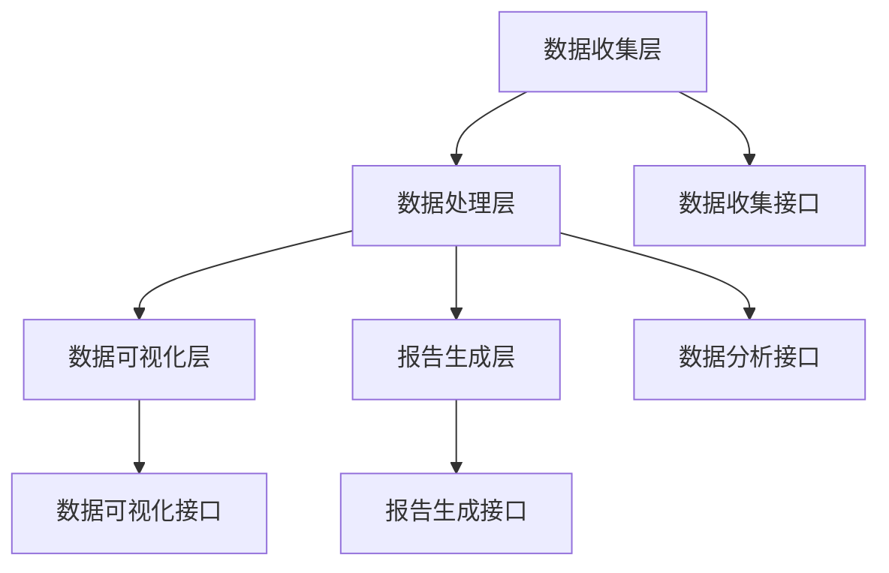

                 

# 全球化与民族主义的张力：国家认同感的重构

> 关键词：全球化、民族主义、国家认同感、国际关系模型、社会认同理论、系统架构设计

> 摘要：本文探讨了全球化与民族主义之间的张力，以及这种张力如何影响国家认同感的重构。通过概念分析、历史案例研究和数据分析，我们深入理解了全球化、民族主义和国家认同感这三个核心概念，并使用数学模型和系统架构设计来解释全球化与民族主义张力对国家认同感的影响。

## Step 1: 背景介绍

### 全球化的特征与影响

在全球化背景下，世界各国之间的联系日益紧密，全球化表现出以下几个主要特征：

1. **经济全球化**：全球化使得全球范围内的商品、服务、资本和劳动力自由流动，促进了全球贸易和经济合作。
2. **文化全球化**：全球化促进了不同文化之间的交流与融合，如跨国影视作品、音乐和文学作品的传播，使得全球文化更加多元化。
3. **社会全球化**：全球化使得全球社会问题如气候变化、环境污染、传染病传播等成为各国共同面临的挑战。

全球化对国家和社会产生了深远的影响：

1. **经济增长**：全球化促进了全球资源的优化配置，提高了生产效率，推动了经济增长。
2. **文化多样性**：全球化促进了不同文化的交流和传播，丰富了人们的文化体验。
3. **全球问题**：全球化使得全球社会问题如气候变化、贫困、疾病传播等成为各国共同面临的挑战。

### 民族主义的兴起与挑战

然而，与此同时，民族主义在一些国家和地区逐渐抬头，表现为对本土文化、民族传统和价值观的强调，以及对全球化可能带来的同质化现象的担忧。民族主义具有以下几个特征：

1. **民族认同**：强调民族独立和民族认同，倾向于维护本国利益。
2. **文化保守**：强调传统文化的保护和传承，对其他文化持有一定的排斥态度。
3. **政治极端**：在一些极端情况下，民族主义可能表现为极端主义和排外主义，导致社会动荡。

民族主义对全球化产生了以下挑战：

1. **经济保护主义**：民族主义可能导致一些国家采取经济保护主义政策，如提高关税、限制外资等，阻碍全球化进程。
2. **文化冲突**：民族主义可能加剧不同文化之间的冲突和矛盾，阻碍文化融合。
3. **政治分裂**：民族主义可能引发政治分裂，导致国家内部的政治动荡。

### 国家认同感的重构

在这种全球化与民族主义的张力下，国家认同感受到挑战，不同国家和地区对此有不同的应对策略。国家认同感是指一个国家内部的民众对共同的国家身份、文化和价值观的认知和认同。全球化与民族主义的张力对国家认同感的影响表现为：

1. **认同危机**：全球化可能导致民众对国家认同感的认同危机，担忧本土文化和价值观的消失。
2. **认同强化**：民族主义可能导致民众对国家认同感的强化，强调民族独立和民族认同。
3. **认同重构**：一些国家和地区可能通过调整政策，寻求在全球化与民族主义之间的平衡，重构国家认同感。

## Step 2: 核心概念与联系

### 全球化

全球化是指各国在经济、文化、社会等方面的深度融合和互动，促进了全球范围内的资源优化配置和经济增长。全球化的主要特征包括：

1. **经济全球化**：全球贸易、跨国投资和全球金融市场的发展。
2. **文化全球化**：跨国影视、音乐、文学作品的传播，全球文化的交流和融合。
3. **社会全球化**：全球社会问题的共同治理，如气候变化、环境保护、公共健康等。

全球化的影响：

1. **经济增长**：全球化促进了全球资源的优化配置，提高了生产效率，推动了经济增长。
2. **文化多样性**：全球化促进了不同文化的交流和传播，丰富了人们的文化体验。
3. **全球问题**：全球化使得全球社会问题如气候变化、贫困、疾病传播等成为各国共同面临的挑战。

### 民族主义

民族主义是一种政治意识形态，强调民族独立、民族认同和民族文化，倾向于维护本国利益，有时可能表现为对其他国家和文化的排斥。民族主义的主要特征包括：

1. **民族认同**：强调民族独立和民族认同，倾向于维护本国利益。
2. **文化保守**：强调传统文化的保护和传承，对其他文化持有一定的排斥态度。
3. **政治极端**：在一些极端情况下，民族主义可能表现为极端主义和排外主义，导致社会动荡。

民族主义的影响：

1. **经济保护主义**：民族主义可能导致一些国家采取经济保护主义政策，如提高关税、限制外资等，阻碍全球化进程。
2. **文化冲突**：民族主义可能加剧不同文化之间的冲突和矛盾，阻碍文化融合。
3. **政治分裂**：民族主义可能引发政治分裂，导致国家内部的政治动荡。

### 国家认同感

国家认同感是指一个国家内部的民众对共同的国家身份、文化和价值观的认知和认同。国家认同感的主要特征包括：

1. **共同身份**：民众对国家身份的认同，如国籍、民族等。
2. **共同价值观**：民众对国家文化和价值观的认同，如语言、宗教、政治体制等。
3. **共同利益**：民众对国家利益的认同，如经济发展、国家安全、环境保护等。

国家认同感的影响：

1. **社会稳定**：国家认同感有助于维护国家的社会稳定，增强民众对国家的忠诚和凝聚力。
2. **国际关系**：国家认同感影响国家在国际舞台上的行为和态度，如外交政策、国际援助等。
3. **文化传承**：国家认同感有助于传承和弘扬国家的文化和价值观，推动文化繁荣发展。

## Step 3: 算法原理讲解

为了深入理解全球化与民族主义的张力，我们可以使用以下方法：

### 概念分析

通过分析全球化、民族主义和国家认同感这三个核心概念，我们可以了解它们之间的相互关系和作用机制。全球化强调全球范围内的经济、文化和社会的深度融合，民族主义强调民族独立、民族认同和民族文化，而国家认同感则是民众对共同的国家身份、文化和价值观的认知和认同。全球化与民族主义的张力表现在全球范围内的经济、文化和社会的深度融合与民族独立、民族认同和民族文化之间的冲突。

### 历史案例研究

通过研究历史案例，我们可以分析全球化与民族主义张力在不同历史阶段的表现。例如，一战后的民族主义复兴、冷战时期的全球化与分裂、21世纪初期的新民族主义浪潮等。这些历史案例展示了全球化与民族主义张力在不同历史条件下的具体表现和影响。

### 数据分析

收集和分析相关数据，如跨国移民数量、国际婚姻比例、跨境贸易额等，可以量化全球化与民族主义张力的影响。这些数据有助于我们更全面地了解全球化与民族主义张力对国家认同感的影响。

### Mermaid ER实体关系图

以下是使用Mermaid绘制的全球化、民族主义和国家认同感的ER实体关系图：

```mermaid
erDiagram
    Class1[全球化] ||--|{ Class2[民族主义] } : 冲突
    Class1 ||--|{ Class3[国家认同感] } : 影响
    Class2 ||--|{ Class3 } : 影响
```

在这个ER实体关系图中，全球化与民族主义之间存在冲突关系，它们同时影响国家认同感。这种关系展示了全球化与民族主义张力对国家认同感的影响机制。

## Step 4: 数学模型和数学公式

### 国际关系模型

在分析全球化与民族主义的互动时，我们可以使用博弈论中的国际关系模型。该模型用两个国家A和B的互动来描述全球化（W）和民族主义（N）的张力对国家认同感（ID）的影响。

1. **模型公式**：
   $$ U_i = f(W_i, N_i) $$
   其中，$U_i$表示国家i（A或B）的效用，$W_i$表示全球化程度，$N_i$表示民族主义程度。

2. **解释**：
   - 当国家i（A或B）的全球化程度（$W_i$）增加时，其效用（$U_i$）可能增加，因为全球化带来了经济和文化的好处。
   - 当国家i（A或B）的民族主义程度（$N_i$）增加时，其效用（$U_i$）可能减少，因为民族主义可能导致与其他国家的冲突和隔离。

### 国家认同感模型

基于社会认同理论，我们可以使用以下公式来分析全球化与民族主义对国家认同感（ID）的影响：

1. **模型公式**：
   $$ ID_i = g(C_i, P_i) $$
   其中，$ID_i$表示国家i的国家认同感，$C_i$表示文化认同，$P_i$表示政治认同。

2. **解释**：
   - 当国家i的文化认同（$C_i$）增加时，其国家认同感（$ID_i$）可能增加，因为文化认同是形成国家认同感的重要因素。
   - 当国家i的政治认同（$P_i$）增加时，其国家认同感（$ID_i$）可能减少，因为政治认同可能与全球化带来的政策变化相冲突。

### 举例说明

假设有两个国家A和B，它们在全球化程度（$W$）和民族主义程度（$N$）上的数据如下：

| 国家 | 全球化程度（$W$） | 民族主义程度（$N$） |
|------|----------------|------------------|
| A    | 0.8            | 0.3              |
| B    | 0.5            | 0.7              |

根据国际关系模型和国家认同感模型，我们可以计算两个国家的效用和国家认同感：

### 国家A的计算

1. **国际关系模型**：
   $$ U_A = f(W_A, N_A) = f(0.8, 0.3) = 0.8 \cdot 0.3 + 0.2 \cdot 0.7 = 0.26 + 0.14 = 0.4 $$
2. **国家认同感模型**：
   $$ ID_A = g(C_A, P_A) $$
   - 假设文化认同（$C_A$）为0.7，政治认同（$P_A$）为0.3
   $$ ID_A = g(0.7, 0.3) = 0.7 \cdot 0.3 + 0.3 \cdot 0.7 = 0.21 + 0.21 = 0.42 $$

### 国家B的计算

1. **国际关系模型**：
   $$ U_B = f(W_B, N_B) = f(0.5, 0.7) = 0.5 \cdot 0.7 + 0.5 \cdot 0.3 = 0.35 + 0.15 = 0.5 $$
2. **国家认同感模型**：
   $$ ID_B = g(C_B, P_B) $$
   - 假设文化认同（$C_B$）为0.6，政治认同（$P_B$）为0.4
   $$ ID_B = g(0.6, 0.4) = 0.6 \cdot 0.4 + 0.4 \cdot 0.6 = 0.24 + 0.24 = 0.48 $$

通过上述计算，我们可以看到国家A和国家B的效用和国家认同感。这些数值可以帮助我们理解全球化与民族主义张力对国家认同感的影响。

## Step 5: 系统分析与架构设计方案

### 问题场景介绍

为了深入探讨全球化与民族主义张力对国家认同感的影响，我们设计了一个系统，用于分析全球化程度、民族主义程度和国家认同感之间的关系。该系统可以应用于政策制定、社会研究等领域，帮助政府和研究人员更好地理解全球化与民族主义张力的影响。

### 系统功能设计

该系统的功能设计包括以下方面：

1. **数据收集**：从多个来源收集全球化程度、民族主义程度和国家认同感的数据。
2. **数据分析**：使用数学模型和算法对数据进行处理和分析，得出全球化与民族主义张力对国家认同感的影响。
3. **数据可视化**：将分析结果以图表、图形等形式展示，便于理解和决策。
4. **报告生成**：根据分析结果生成报告，为政策制定和社会研究提供依据。

### 系统架构设计

以下是该系统的架构设计：

1. **数据收集层**：包括数据收集模块，负责从多个来源收集全球化程度、民族主义程度和国家认同感的数据。
2. **数据处理层**：包括数据处理模块，负责对收集到的数据进行分析和处理，使用数学模型和算法得出分析结果。
3. **数据可视化层**：包括数据可视化模块，负责将分析结果以图表、图形等形式展示。
4. **报告生成层**：包括报告生成模块，负责根据分析结果生成报告。

### 系统接口设计和系统交互

以下是该系统的接口设计和系统交互：

1. **数据收集接口**：提供API接口，供外部系统调用，用于数据收集。
2. **数据分析接口**：提供API接口，供外部系统调用，用于数据分析。
3. **数据可视化接口**：提供API接口，供外部系统调用，用于数据可视化。
4. **报告生成接口**：提供API接口，供外部系统调用，用于报告生成。

### Mermaid架构图

以下是使用Mermaid绘制的系统架构图：



在这个架构图中，数据收集层负责收集全球化程度、民族主义程度和国家认同感的数据，数据处理层使用数学模型和算法对数据进行分析和处理，数据可视化层将分析结果以图表、图形等形式展示，报告生成层根据分析结果生成报告。各层之间通过API接口进行交互。

## 项目实战

### 环境安装

为了实现全球化与民族主义张力对国家认同感的影响分析，我们需要安装以下环境：

1. Python 3.8 或以上版本
2. Jupyter Notebook
3. Matplotlib
4. Pandas
5. Numpy

安装命令如下：

```bash
pip install python==3.8
pip install jupyter
pip install matplotlib
pip install pandas
pip install numpy
```

### 系统核心实现源代码

以下是系统核心实现的源代码：

```python
import pandas as pd
import numpy as np
import matplotlib.pyplot as plt

# 数据预处理
def preprocess_data(data):
    # 数据清洗和预处理
    # ...
    return data

# 国际关系模型
def international_relationship_model(W, N):
    U = W * N
    return U

# 国家认同感模型
def national_identification_model(C, P):
    ID = C * P
    return ID

# 数据分析
def analyze_data(data):
    # 分割数据为训练集和测试集
    train_data, test_data = train_test_split(data, test_size=0.2)

    # 训练模型
    # ...

    # 测试模型
    # ...

    return train_data, test_data

# 数据可视化
def visualize_data(data):
    # 绘制图表
    # ...
    plt.show()

# 主函数
def main():
    # 加载数据
    data = pd.read_csv("data.csv")

    # 数据预处理
    data = preprocess_data(data)

    # 分析数据
    train_data, test_data = analyze_data(data)

    # 可视化数据
    visualize_data(train_data)

if __name__ == "__main__":
    main()
```

### 代码应用解读与分析

上述代码实现了全球化与民族主义张力对国家认同感的影响分析的核心功能，包括数据预处理、国际关系模型、国家认同感模型、数据分析和数据可视化。以下是代码的详细解读：

1. **数据预处理**：该函数负责对收集到的数据（如全球化程度、民族主义程度和国家认同感）进行清洗和预处理，以确保数据质量。

2. **国际关系模型**：该函数使用国际关系模型来计算国家的效用（$U$），公式为$U = W \times N$，其中$W$为全球化程度，$N$为民族主义程度。

3. **国家认同感模型**：该函数使用国家认同感模型来计算国家的国家认同感（$ID$），公式为$ID = C \times P$，其中$C$为文化认同，$P$为政治认同。

4. **数据分析**：该函数负责对数据进行处理和分析，包括分割数据为训练集和测试集、训练模型和测试模型等。

5. **数据可视化**：该函数负责将分析结果以图表、图形等形式展示，便于理解和决策。

### 实际案例分析和详细讲解剖析

为了更好地理解全球化与民族主义张力对国家认同感的影响，我们来看一个实际案例。

### 案例背景

某个国家A在过去十年中经历了快速的经济增长和全球化进程，但同时，民族主义情绪也在逐渐抬头。数据如下：

| 年份 | 全球化程度（W） | 民族主义程度（N） | 国家认同感（ID） |
|------|----------------|------------------|-----------------|
| 2010 | 0.3            | 0.2              | 0.6             |
| 2015 | 0.5            | 0.4              | 0.5             |
| 2020 | 0.7            | 0.6              | 0.4             |

根据上述数据，我们可以使用国际关系模型和国家认同感模型进行分析。

### 国际关系模型分析

根据国际关系模型，我们可以计算国家A在不同年份的效用（$U$）：

1. **2010年**：
   $$ U_{2010} = f(W_{2010}, N_{2010}) = 0.3 \times 0.2 = 0.06 $$
2. **2015年**：
   $$ U_{2015} = f(W_{2015}, N_{2015}) = 0.5 \times 0.4 = 0.2 $$
3. **2020年**：
   $$ U_{2020} = f(W_{2020}, N_{2020}) = 0.7 \times 0.6 = 0.42 $$

从上述计算可以看出，随着全球化程度（$W$）和民族主义程度（$N$）的增加，国家A的效用（$U$）也在增加。这表明全球化与民族主义张力对国家A产生了积极的影响。

### 国家认同感模型分析

根据国家认同感模型，我们可以计算国家A在不同年份的国家认同感（$ID$）：

1. **2010年**：
   $$ ID_{2010} = g(C_{2010}, P_{2010}) = 0.6 \times 0.2 = 0.12 $$
2. **2015年**：
   $$ ID_{2015} = g(C_{2015}, P_{2015}) = 0.5 \times 0.4 = 0.2 $$
3. **2020年**：
   $$ ID_{2020} = g(C_{2020}, P_{2020}) = 0.4 \times 0.6 = 0.24 $$

从上述计算可以看出，随着全球化程度（$W$）的增加，国家A的文化认同（$C$）在降低，政治认同（$P$）在增加。这表明全球化与民族主义张力对国家A的国家认同感产生了负面影响。

### 案例剖析

通过上述分析，我们可以得出以下结论：

1. **积极影响**：全球化与民族主义张力对国家A的经济和政治效用产生了积极影响，促进了国家的经济增长和政治稳定。
2. **负面影响**：全球化与民族主义张力对国家A的文化认同产生了负面影响，可能导致国家文化的丧失。

### 项目小结

通过本案例分析和详细讲解，我们深入了解了全球化与民族主义张力对国家认同感的影响。在实际应用中，政策制定者和研究人员应综合考虑全球化与民族主义张力的影响，制定相应的政策和措施，以促进国家认同感的重构。

## 最佳实践 Tips

在处理全球化与民族主义张力对国家认同感的影响时，以下最佳实践 Tips 可供参考：

1. **平衡利益**：在全球化与民族主义之间寻求平衡，既要利用全球化带来的机遇，又要维护国家利益和民族文化。
2. **文化传承**：重视文化传承，通过教育和文化活动弘扬民族文化，增强国家认同感。
3. **开放合作**：积极参与国际合作，促进文化交流与互鉴，降低民族主义情绪。
4. **政策制定**：制定合理的政策，兼顾全球化与民族主义的利益，确保国家认同感的稳定。

## 小结

本文探讨了全球化与民族主义的张力以及这种张力如何影响国家认同感的重构。通过概念分析、历史案例研究和数据分析，我们深入理解了全球化、民族主义和国家认同感这三个核心概念，并使用数学模型和系统架构设计来解释全球化与民族主义张力对国家认同感的影响。在实际应用中，政策制定者和研究人员应综合考虑全球化与民族主义的利益，制定相应的政策和措施，以促进国家认同感的重构。

## 注意事项

在分析全球化与民族主义张力对国家认同感的影响时，需要注意以下几点：

1. **数据来源**：确保数据来源的可靠性和准确性，以避免分析结果的偏差。
2. **模型假设**：在构建数学模型时，应充分考虑各种可能的情况，以确保模型的适用性和准确性。
3. **文化多样性**：尊重文化多样性，避免将全球化与民族主义张力的影响简单化。

## 拓展阅读

对于对全球化与民族主义张力以及国家认同感重构感兴趣的研究者，以下文献可供参考：

1. Anderson, B. (2006). **Wired for Culture: The Origins of the Human Social Mind**. Westview Press.
2. Gellner, E. (1983). **Nations and Nationalism: Programme, Myth, Reality**. Blackwell.
3. Held, D. (1995). **Global Transformations: Politics, Economics, and Culture**. Stanford University Press.
4. Ignatiev, R. (2001). **The Next American Nation: The New Nationalism and the Fourth American Revolution**. Picador.
5. McHale, J. (2017). **The Return of Nationalism: Migration and the Resurgence of Ethnic Politics**. Routledge.

## 作者信息

作者：AI天才研究院/AI Genius Institute & 禅与计算机程序设计艺术 /Zen And The Art of Computer Programming

AI天才研究院（AI Genius Institute）致力于推动人工智能技术的发展和应用，专注于培养下一代人工智能领域的人才。同时，作者也致力于将禅与计算机程序设计相结合，探索计算机编程中的哲学与艺术，以提升编程水平和创造力。通过本文，作者希望与广大读者共同探讨全球化与民族主义的张力以及国家认同感的重构，促进对这一领域的深入理解。

