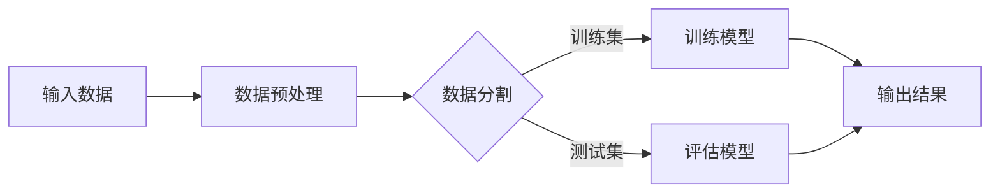
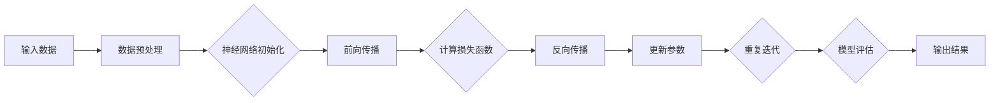
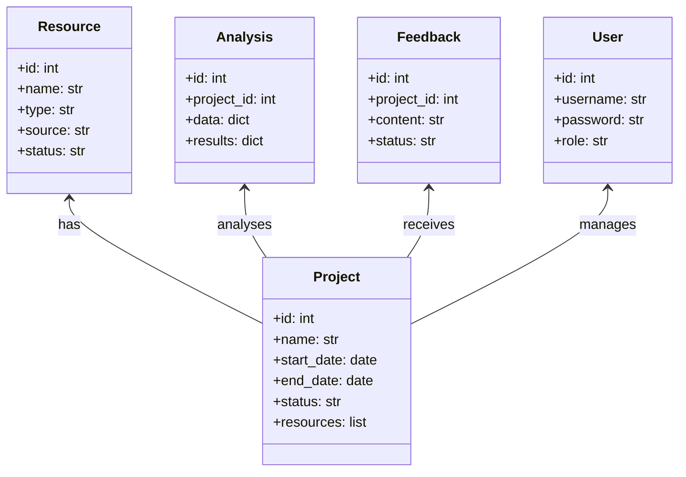
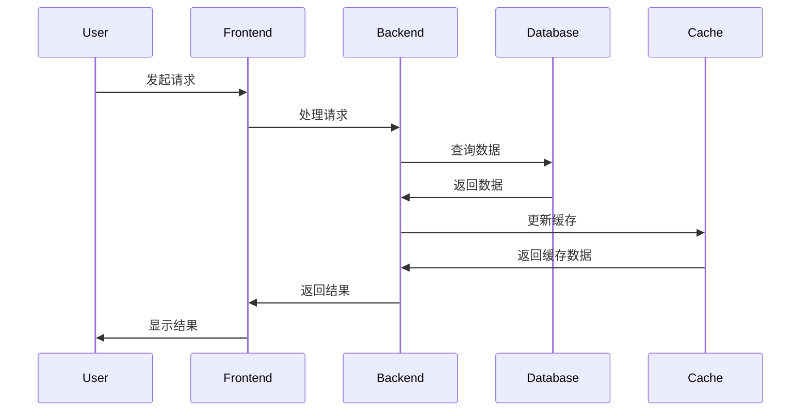
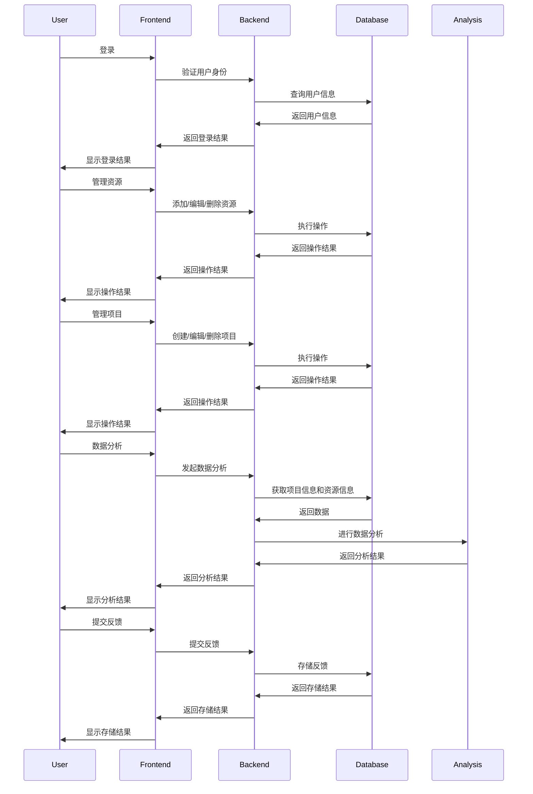

                 

### 引言

#### 1.1 问题背景

随着全球化进程的不断深入，世界各国在经济、科技、文化等方面的联系日益紧密。在这一背景下，文化外交逐渐成为国家间交往的重要手段。文化外交不仅涉及到文化交流，还包括通过文化手段来塑造和提升国家形象，从而在国际舞台上获得更多的支持和认可。全球化时代的文化外交，面临着前所未有的挑战和机遇。

首先，全球化趋势加速了信息传播的速度和广度，使得各国文化之间的交流更加频繁和深入。然而，文化差异和冲突也日益显现，如何在不同文化背景下有效地进行公共外交，成为各国政府和企业亟待解决的问题。

其次，随着经济全球化和政治多极化的发展，国家间的竞争不仅仅是经济和军事的竞争，更体现在文化软实力的竞争上。一个国家的文化影响力，已经成为衡量其国际地位和影响力的重要指标。

最后，公共外交作为一种国家外交政策的重要组成部分，其效果直接影响到国家形象和利益。如何在复杂的国际环境中，通过文化外交手段有效地提升国家形象，成为各国政府面临的重大课题。

#### 1.2 问题描述

在全球化时代，如何通过公共外交来塑造国家形象，是一个复杂且具有挑战性的问题。具体来说，这个问题可以分为以下几个方面：

1. **文化外交策略的选择**：如何根据不同国家的文化特点，制定合适的文化外交策略，从而有效地促进文化交流和理解，提升国家形象。

2. **公共外交机制的运作**：如何建立和运作有效的公共外交机制，整合资源，协调各方力量，确保文化外交活动的顺利实施。

3. **国家形象塑造的方法**：如何通过多种手段和渠道，系统地塑造和提升国家形象，使其在国际舞台上具有更大的影响力和吸引力。

4. **应对文化冲突和管理风险**：如何在文化差异和冲突中，采取有效的管理策略，降低文化冲突带来的负面影响，维护国家形象。

#### 1.3 问题解决

为了解决全球化时代文化外交与国家形象塑造的问题，我们可以从以下几个方面着手：

1. **制定系统的文化外交策略**：首先，需要深入了解不同国家的文化背景，找出文化的共性和差异，在此基础上制定针对性的文化外交策略。这些策略应包括文化交流、文化展示、文化产业的推动等。

2. **建立有效的公共外交机制**：其次，需要建立和完善公共外交的运作机制，包括资源整合、项目规划、执行与评估等。通过合理配置资源，确保文化外交活动的持续性和有效性。

3. **实施多样化的国家形象塑造方法**：可以通过媒体宣传、国际展览、文化节庆、文化交流项目等多种方式，全面展示国家文化的魅力和内涵，提升国家形象。

4. **建立风险管理与应对机制**：在实施文化外交的过程中，要充分预见和应对可能的文化冲突和风险，通过建立预警机制和应对策略，最大限度地降低负面影响。

#### 1.4 边界与外延

**边界**：本文主要讨论的是全球化时代文化外交与国家形象塑造的理论和实践问题，主要关注的是如何通过公共外交手段来提升国家形象。因此，本文的讨论范围不包括经济、军事、外交等其他方面的国家形象塑造策略。

**外延**：虽然本文主要聚焦于文化外交和国家形象塑造，但二者之间存在着紧密的联系。文化外交是国家形象塑造的重要组成部分，而国家形象则直接影响着文化外交的成效。因此，理解文化外交与国家形象之间的关系，对于制定有效的文化外交策略具有重要意义。

#### 1.5 概念结构与核心要素组成

为了更好地理解和分析文化外交与国家形象塑造，我们需要明确以下几个核心概念：

1. **文化外交**：是指通过文化手段，以促进国际交流、理解与合作为目的的外交活动。它包括文化交流、文化展示、文化产业推动等多个方面。

2. **公共外交**：是指政府通过非政府渠道，直接与外国公众进行沟通和互动的外交活动。其目的是提升国家形象，增强国家软实力。

3. **国家形象**：是指一个国家在国际社会中的整体形象和地位，包括国家的经济、政治、文化、科技等多方面的表现。

文化外交、公共外交和国家形象塑造之间存在着密切的联系。文化外交是公共外交的重要组成部分，而公共外交则是国家形象塑造的重要手段。通过有效的文化外交和公共外交，可以有效地提升国家形象，增强国家的国际竞争力。

### 第1章：引言

在全球化时代的背景下，文化外交逐渐成为国家外交政策的重要组成部分，其对国家形象塑造的重要性不容忽视。文化外交不仅仅是一种文化交流活动，更是一种深层次的国家形象塑造手段。在这一章节中，我们将深入探讨全球化时代文化外交面临的挑战和机遇，以及公共外交如何与国家形象塑造相互关联。

首先，我们概述了全球化趋势下文化外交的重要性，分析了文化外交在国家形象塑造中的独特作用。接着，我们明确了公共外交的概念和特征，以及其在文化外交中的关键地位。通过对比文化外交、公共外交和国家形象的概念，我们进一步理解了它们之间的内在联系。

在分析过程中，我们详细讨论了全球化时代文化外交所面临的挑战，如文化差异、信息传播速度和广度、国际竞争等。同时，我们也看到了文化外交所带来的机遇，如文化交流的深化、国家软实力的提升等。

最后，我们提出了通过制定系统的文化外交策略、建立有效的公共外交机制、实施多样化的国家形象塑造方法以及建立风险管理与应对机制来应对这些挑战。这些策略和方法的实施，不仅有助于提升国家形象，还能增强国家的国际竞争力和影响力。

总之，全球化时代的文化外交和国家形象塑造是一个复杂而重要的议题，需要我们从多角度、多层次进行深入分析和探讨。通过本章节的讨论，我们希望能够为后续章节的内容打下坚实的基础，为读者提供有价值的思考和参考。

#### 2.1 文化外交的定义与作用

文化外交，顾名思义，是指通过文化手段进行的外交活动，其核心目的是促进国际交流与合作，提升国家形象，增强国家的软实力。文化外交不同于传统的经济和军事外交，它更注重通过文化的传递和交流，增进不同国家间的相互理解与认同。

**文化外交的概念**：文化外交可以理解为一个国家通过展示、传播本国文化，以达到外交目的的策略。它不仅包括文化产品的输出，如电影、音乐、书籍等，还涵盖了文化活动的组织，如文化节、艺术展览、文化交流项目等。

**文化外交的作用**：文化外交在国家外交政策中具有独特而重要的地位。其主要作用体现在以下几个方面：

1. **促进文化交流与理解**：通过文化外交活动，不同国家可以更加深入地了解彼此的文化，消除误解和偏见，建立友好的国际关系。

2. **提升国家形象**：文化是国家软实力的重要组成部分，通过文化外交，一个国家可以展示其文化魅力和软实力，从而提升其在国际社会的地位和影响力。

3. **增强国家认同**：文化外交有助于增强国民对本国文化的认同感和自豪感，促进国家内部的团结和稳定。

4. **促进国际合作**：文化外交为国际间的合作提供了新的平台和渠道，有助于在文化、教育、科技等领域的合作，推动共同发展。

**文化外交的目的与意义**：文化外交的目的是通过文化手段，实现国家外交政策的目标，其意义主要体现在以下几个方面：

1. **提升国家软实力**：在当前国际竞争中，软实力已经成为国家综合实力的重要组成部分。通过文化外交，可以有效提升国家的软实力，增强国际影响力。

2. **促进和平与稳定**：文化外交有助于减少国家间的敌对情绪，促进国际和平与稳定。通过文化交流，可以增进各国人民的友谊和理解，减少冲突和摩擦。

3. **推动文化产业发展**：文化外交可以带动文化产业的发展，为经济增长提供新的动力。通过文化产品的输出和推广，可以扩大国际市场份额，提高文化产业的竞争力。

4. **增进国际理解与合作**：文化外交为各国提供了一个相互理解和合作的平台，有助于在全球化背景下，推动国际社会的共同发展。

总之，文化外交不仅是国家外交政策的重要组成部分，也是提升国家形象和软实力的重要手段。通过有效的文化外交活动，一个国家可以在国际舞台上树立良好的形象，增强国家的综合竞争力，推动国际间的友好合作与发展。

#### 2.2 公共外交的概念与特征

公共外交，作为一种新型的外交手段，不同于传统的政府间外交，其主要目标是直接与外国公众进行沟通和互动，以提升国家形象和软实力。公共外交的概念可以理解为政府通过非政府渠道，利用各种形式和手段，主动向外国公众传播国家政策、价值观和文化，增进相互理解和友谊的外交活动。

**公共外交的定义**：公共外交是指政府通过非政府渠道，如媒体、非政府组织、学术机构、文化团体等，直接与外国公众进行沟通和交流的外交活动。它不仅包括信息的传递和传播，还涉及情感和价值观的交流，旨在塑造和提升国家形象，增强国家的软实力。

**公共外交的目标**：公共外交的主要目标有以下几方面：

1. **提升国家形象**：通过有效的公共外交，国家可以展示其积极、开放、包容的形象，增加国际社会对国家的认可和好感。

2. **增强国家软实力**：公共外交是提升国家软实力的重要手段，通过传播国家的文化、价值观和政策，可以增强国家的国际影响力和竞争力。

3. **增进国际理解与合作**：公共外交有助于增进不同国家人民之间的相互理解和信任，为国际间的合作创造良好的氛围。

4. **应对外部挑战**：公共外交可以作为一种应对外部挑战和危机的管理工具，通过有效的信息传播和舆论引导，化解国家间的误解和冲突。

**公共外交的特点**：

1. **非政府性**：公共外交主要通过非政府渠道进行，包括媒体、非政府组织、学术机构、文化团体等。这种非政府性使得公共外交更加灵活和有效，可以更直接地与外国公众进行互动。

2. **多样性**：公共外交的形式和手段多样，包括文化交流、学术交流、媒体宣传、公共讲座、社交媒体互动等。这种多样性使得公共外交可以覆盖不同的受众群体，实现广泛的传播效果。

3. **双向性**：公共外交是一种双向交流的过程，不仅仅是国家向外国公众传递信息，也包括外国公众对国家的反馈和回应。这种双向性有助于建立更为真实、立体的国家形象。

4. **长期性**：公共外交是一种长期的外交策略，需要持续不断地进行。它不是一蹴而就的，而是需要长期的努力和积累，才能达到预期的效果。

**公共外交的重要性**：

1. **国家形象塑造**：公共外交是塑造国家形象的重要手段，通过展示国家的文化、价值观和政策，可以提升国家的国际形象和地位。

2. **国际影响力提升**：公共外交有助于增强国家的国际影响力，通过有效的传播和交流，可以增加其他国家对国家的认可和支持。

3. **危机管理**：在面临国际危机和挑战时，公共外交可以作为一种有效的管理工具，通过信息传播和舆论引导，化解国家间的误解和冲突。

4. **促进国际合作**：公共外交为国际间的合作提供了新的平台和渠道，有助于在政治、经济、科技、文化等领域的深入合作。

总之，公共外交作为一种新型的外交手段，具有独特的优势和价值。通过有效的公共外交，国家可以更好地展示其形象，增强其软实力，促进国际间的理解和合作，从而在国际舞台上取得更大的成功。

#### 2.3 国家形象的概念与构成

国家形象，是指一个国家在国际社会中获得的整体印象和评价，它涵盖了国家的经济、政治、文化、科技等多个方面。国家形象不仅反映了国家的实力和地位，也是国家软实力的重要组成部分。一个良好的国家形象可以增强国家的国际影响力，促进国际合作，吸引外国投资和人才，从而提升国家的整体竞争力。

**国家形象的定义**：国家形象是指一个国家在国际社会中通过传播、交流和互动所形成的整体形象和评价。它不仅包括国家的外部形象，如经济发展水平、政治体制、文化特色等，还包括国家内部民众对国家的认同感和自豪感。

**国家形象的构成**：国家形象的构成比较复杂，可以从多个角度进行分析，主要包括以下几个方面：

1. **经济实力**：经济实力是国家形象的重要基础。一个国家的经济规模、增长速度、产业结构、科技创新能力等都会影响其在国际社会的地位和形象。

2. **政治体制**：政治体制是国家形象的重要组成部分。不同国家的政治体制和政治稳定性会影响国际社会对国家的看法。例如，民主、自由、法治等价值观通常会被看作是积极的国家形象。

3. **文化特色**：文化是国家形象的核心元素。一个国家的文化传统、艺术形式、教育水平、宗教信仰等都会影响其在国际社会中的形象。例如，中国通过推广孔子学院和中华文化，提升了其在国际上的文化影响力。

4. **科技创新**：科技创新能力是一个国家科技水平和国际竞争力的体现。国际社会通常对在科技创新领域有突出贡献的国家给予高度评价，如美国、日本等。

5. **国际贡献**：一个国家在国际事务中的贡献和立场也会影响其国家形象。例如，通过参与国际援助、推动全球治理、参与国际组织等，可以提高国家的国际声誉。

6. **外交策略**：国家的外交策略和外交成果也会影响其国际形象。积极的外交政策和有效的国际合作可以提升国家的形象，反之则会带来负面影响。

**评价标准**：国家形象的评估通常涉及多个维度和标准，包括以下几个方面：

1. **客观指标**：如GDP、人均收入、科技创新成果、国际奖项等硬性指标，这些指标可以客观反映一个国家的综合实力。

2. **主观评价**：如国际舆论对国家的看法、外国游客对国家的评价、国际组织对国家的评价等，这些评价更多反映了国际社会对国家的感受和主观判断。

3. **文化传播**：如国家在文化输出、国际交流项目、国际媒体平台上的表现等，这些指标反映了国家文化软实力的传播效果。

4. **社会稳定**：社会稳定性、治安状况、教育水平、社会福利等，这些指标反映了国家的内部治理水平和民众的生活质量。

**国家形象与公共外交的关系**：国家形象是公共外交的重要目标之一，公共外交通过各种手段和渠道，塑造和提升国家的国际形象。良好的国家形象有助于增强国家的软实力，提高国际影响力，促进国际合作。而公共外交的成功实施，又可以进一步巩固和提升国家形象。因此，公共外交和国家形象塑造是相辅相成、相互促进的关系。

综上所述，国家形象是一个国家在国际社会中综合实力的体现，它由多个因素构成，并通过多种标准进行评估。一个良好的国家形象对国家的国际地位和软实力有着重要的影响。通过有效的公共外交，国家可以塑造和提升其形象，增强国际影响力，从而在国际舞台上取得更大的成功。

#### 2.4 文化外交与公共外交的联系

文化外交与公共外交在提升国家形象的过程中，扮演着重要的角色，并且二者之间存在着紧密的联系和互动关系。这种联系不仅体现在目标和手段上，还体现在实施过程中各个层面的协同作用。

**目标一致性**：文化外交和公共外交的最终目标都是为了提升国家形象，增强国家的软实力。文化外交主要通过展示和传播本国文化，增进国际社会对国家的了解和认同；而公共外交则通过直接与外国公众进行沟通和互动，传递国家政策、价值观和文化，提升国家的国际形象。两者的目标虽然略有不同，但在提升国家形象方面具有高度的一致性。

**手段互补性**：文化外交和公共外交在手段上也存在互补性。文化外交侧重于通过文化交流、文化展示和文化传播等方式，以文化为媒介，间接地提升国家形象；而公共外交则通过媒体宣传、公共讲座、社交媒体互动等方式，直接与外国公众进行沟通和互动，实现国家形象的直接传播和塑造。这种互补性使得文化外交和公共外交在实施过程中能够相互补充，形成更加全面的公共外交策略。

**互动关系**：文化外交与公共外交在实施过程中存在密切的互动关系。一方面，文化外交的成果可以为公共外交提供丰富的素材和背景，如通过举办国际文化节、展览等文化事件，吸引外国媒体和公众的关注，为公共外交创造有利条件。另一方面，公共外交的反馈信息也可以为文化外交提供宝贵的参考，如通过了解外国公众对文化活动的反馈，调整和优化文化外交的内容和形式，提高其针对性和有效性。

**案例说明**：以下是一个具体的案例分析，展示了文化外交与公共外交如何相互结合，共同提升国家形象。

**案例**：2019年，中国在北京举办了“一带一路”国际合作高峰论坛。这次论坛不仅是一个经济合作平台，也是一次重要的文化外交和公共外交活动。在论坛期间，中国通过举办多场文化交流活动，如音乐会、电影展、书画展览等，向世界展示了中华文化的独特魅力。同时，中国政府通过媒体宣传和社交平台，实时向全球公众传递论坛的最新动态和成果。这种文化外交与公共外交的结合，不仅提升了中国的国际形象，也增强了国际社会对“一带一路”倡议的理解和支持。

**分析**：这个案例中，文化外交通过展示和传播中国丰富的文化资源和成就，吸引了国际社会的高度关注。而公共外交则通过积极的媒体宣传和社交平台互动，直接与外国公众沟通，传递中国的政策理念和合作意愿。文化外交和公共外交的紧密结合，使得中国在国际舞台上的形象得到了显著提升，不仅增强了国家软实力，也促进了国际合作与发展。

**总结**：通过上述分析和案例说明，我们可以看出，文化外交与公共外交在提升国家形象方面具有高度的一致性和互补性。二者通过密切的互动和协同作用，能够形成强大的合力，共同塑造和提升国家的国际形象。因此，在全球化时代，各国应充分利用文化外交和公共外交的优势，制定综合性的外交策略，以提升国家在国际社会中的地位和影响力。

#### 2.5 ER实体关系图架构

为了更清晰地理解文化外交、公共外交和国家形象塑造之间的关系，我们可以使用实体关系图（Entity-Relationship Diagram，ER图）来表示它们之间的交互关系和依赖结构。

**ER实体关系图**：

```mermaid
erDiagram
    外交政策 <<|-- 文化外交 : 有多种形式和活动
    文化外交 ||--|{ 公共外交 : 通过非政府渠道直接与外国公众互动
    文化外交 ||--|{ 国家形象 : 塑造和提升
    公共外交 ||--|{ 媒体传播 : 利用多种媒体形式进行信息传播
    公共外交 ||--|{ 文化活动 : 组织和参与文化交流活动
    国家形象 ||--|{ 经济实力 : 反映国家的经济状况和竞争力
    国家形象 ||--|{ 科技创新 : 反映国家的科技水平和创新能力
    国家形象 ||--|{ 文化特色 : 反映国家的文化传统和艺术形式
    国家形象 ||--|{ 国际贡献 : 反映国家在国际事务中的贡献
```

**解释**：

- **外交政策**：这是整个ER图的顶层实体，代表一个国家的整体外交战略。文化外交是外交政策的一个子集，它包括多种形式和活动。

- **文化外交**：从外交政策衍生出文化外交，它包含公共外交和国家形象塑造两个子集。文化外交通过多样化的形式和活动，如文化交流、文化展示等，间接提升国家形象。

- **公共外交**：文化外交的一部分，它通过非政府渠道，如媒体、非政府组织等，直接与外国公众进行互动，旨在提升国家形象和软实力。公共外交包括媒体传播和文化活动两个子集。

- **国家形象**：文化外交和公共外交共同作用于国家形象，国家形象反映了国家的整体面貌和在国际社会的地位。国家形象的构成包括经济实力、科技创新、文化特色和国际贡献等多个方面。

- **媒体传播**：这是公共外交的一个子集，通过多种媒体形式，如电视、报纸、互联网等，进行信息传播和舆论引导，增强国家形象。

- **文化活动**：这是公共外交的另一个子集，通过组织和参与各种文化交流活动，如文化节、艺术展览等，增进外国公众对国家的了解和认同。

通过这个ER图，我们可以直观地看到文化外交、公共外交和国家形象之间的相互关系和作用机制。文化外交通过公共外交的媒介作用，影响和塑造国家形象，从而在国际舞台上提升国家的整体竞争力。

### 第2章：核心概念与联系

在本章中，我们将深入探讨文化外交、公共外交和国家形象塑造这三个核心概念，并详细分析它们之间的联系和互动关系。首先，我们将分别阐述文化外交和公共外交的定义、目的与作用，以及它们在提升国家形象中的独特作用。接着，我们将通过ER实体关系图，直观地展示这些概念之间的交互关系和依赖结构。通过这些分析，我们将更好地理解文化外交与公共外交在国家形象塑造中的重要作用，并为后续章节的内容打下坚实的基础。

#### 2.1 文化外交的策略与方法

**文化外交的策略**：

1. **展示本国文化**：通过举办文化节、艺术展览、文化活动等方式，向国际社会展示本国独特的文化魅力。这种策略有助于增进外国公众对本国文化的了解和认同，从而提升国家形象。

2. **促进文化合作**：积极参与国际文化合作项目，与各国文化机构、艺术家和学者进行交流与合作。通过共同举办文化活动、合作研究项目等，加强国家间的文化联系，提升国际影响力。

3. **推广文化产品**：利用电影、音乐、书籍等文化产品，向国际市场推广本国文化。通过在国际市场上的成功，展示本国的文化软实力，增强国际社会对国家的认可。

4. **利用数字平台**：借助社交媒体、在线平台等数字渠道，传播本国文化。通过视频、直播、在线课程等形式，使外国公众更便捷地了解和体验本国文化。

**文化外交的方法**：

1. **文化交流项目**：通过举办国际文化节、文化周等活动，邀请外国艺术家和学者来本国进行文化交流。这种直接的文化互动，有助于增进两国人民之间的了解和友谊。

2. **文化输出**：通过输出本国文化产品，如电影、音乐、书籍等，在国际市场上推广本国文化。这不仅有助于增加文化产业的收入，还能提升国家形象。

3. **文化展览**：在国际展览会上展示本国文化成就，如艺术展览、手工艺品展览等。这种展览形式能够吸引大量观众，使外国公众更直观地了解本国文化。

4. **文化交流使团**：派遣文化交流使团到各国进行访问和交流，通过实地考察和互动，促进国际文化交流。这种使团活动通常能够得到广泛的社会关注和媒体报道，有助于提升国家的国际影响力。

**文化外交的具体应用场景**：

1. **外交关系建立**：通过文化外交，为建立新的外交关系或加强现有外交关系奠定基础。例如，通过文化交流项目，增进两国人民之间的相互理解和信任，为政治和经济的合作创造良好的氛围。

2. **国际会议和论坛**：在国际会议上举办文化论坛或文化展览，展示本国的文化成就和软实力。这种活动能够吸引国际社会的关注，提升国家的国际影响力。

3. **危机公关**：在面临国际危机或负面舆论时，通过文化外交来缓解紧张局势。例如，通过举办文化活动，展示国家的积极形象，抵消负面信息的影响。

4. **文化推广与传播**：通过文化外交，向国际市场推广本国文化，增加文化产品的出口，提升文化产业的经济效益。

**案例**：中国通过“一带一路”倡议，积极开展文化外交，与多个国家建立了紧密的文化合作关系。例如，通过举办“一带一路”国际合作高峰论坛，中国展示了其丰富的文化资源，吸引了全球范围内的关注。此外，中国还通过在各国设立孔子学院，推广中文和中国文化，增强了国际社会对中国的了解和认同。

通过上述策略和方法，我们可以看到文化外交在国家形象塑造中的重要作用。通过有效的文化外交，国家不仅能够提升国际影响力，还能增强国内民众的文化认同感和自豪感，从而为国家的长期发展奠定坚实的基础。

#### 4.1 公共外交的运作机制

公共外交作为国家外交政策的重要组成部分，其运作机制的设计和实施直接影响到其效果和影响力。一个有效的公共外交机制需要考虑多个方面的因素，包括资源整合、项目管理、执行与评估等。

**资源整合**：

1. **政府资源**：政府应充分利用公共资源，包括财政资金、人力资源和政策支持。通过设立专门的公共外交机构，如公共外交办公室或公共外交基金，确保公共外交活动的持续性和稳定性。

2. **社会资源**：除了政府资源，公共外交还应积极整合社会资源，如非政府组织、学术机构、媒体平台和文化团体等。这些社会资源可以提供多样化的合作渠道和传播平台，增强公共外交的覆盖面和影响力。

3. **国际资源**：通过国际合作，共享国际资源，如与其他国家的公共外交机构、国际组织的合作项目等，可以提升公共外交的全球影响力。

**项目管理**：

1. **项目规划**：公共外交项目应具有明确的规划，包括项目目标、内容、时间表和预算等。项目规划应充分考虑国际环境、目标受众和预期效果，确保项目的可行性和有效性。

2. **项目实施**：在项目实施过程中，应建立科学的管理机制，包括项目审批、执行监督、反馈调整等。通过定期评估项目进展，及时调整策略，确保项目能够按照预期目标顺利推进。

3. **项目评估**：项目结束后，应进行全面的评估，包括项目成果、影响力和效益等。通过评估，总结项目经验，发现问题，为未来的公共外交活动提供参考。

**执行与评估**：

1. **执行机制**：建立高效的执行机制，确保公共外交活动的顺利进行。这包括人员配置、任务分工、沟通协调等。通过明确的职责和流程，确保各项活动能够高效执行。

2. **评估标准**：制定科学的评估标准，包括定量和定性指标。定量指标如项目参与人数、媒体曝光率、网络关注度等；定性指标如项目影响力、公众满意度、国际社会反馈等。

3. **反馈机制**：建立反馈机制，及时收集和分析公众和国际社会的反馈信息。通过反馈机制，了解公共外交活动的效果和影响，为后续活动提供改进方向。

**成功公共外交的案例**：

1. **中美文化交流年**：2006年，中美两国共同举办了“中美文化交流年”，通过一系列文化活动，如音乐会、艺术展览、学术论坛等，增进了两国人民之间的了解和友谊。该活动在国际上引起了广泛关注，被视为公共外交的成功案例。

2. **法国文化外交**：法国通过其文化年、艺术节和文化中心等，在全球范围内推广法语和法国文化。这些活动不仅提升了法国的国际形象，还促进了法国文化产业的发展。

3. **英国创意产业推广**：英国通过推广其创意产业，如电影、音乐、设计等，在全球市场上取得了显著的成功。英国的公共外交策略，将文化软实力与经济发展相结合，取得了良好的效果。

**总结**：公共外交的运作机制是提升国家形象和软实力的重要手段。通过有效的资源整合、项目管理、执行与评估，公共外交可以更好地实现其目标，为国家的长远发展奠定坚实的基础。成功的公共外交案例展示了其独特的优势和重要性，为其他国家提供了宝贵的经验和借鉴。

### 4.2 公共外交与媒体的关系

公共外交与媒体之间存在着紧密的联系和互动关系，媒体在公共外交中发挥着至关重要的作用。通过有效的媒体运用，公共外交能够实现信息传播、影响力扩大和目标受众覆盖，从而提升国家形象和国际影响力。

**媒体在公共外交中的作用**：

1. **信息传播**：媒体是公共外交信息传播的重要渠道。通过电视、广播、报纸、杂志、互联网和社交媒体等，政府可以及时、广泛地传递外交政策和信息。这种传播方式能够迅速引起公众和外国公众的关注，增强信息传播的效果。

2. **舆论引导**：媒体在公共外交中起到舆论引导的作用。通过新闻评论、专题报道、访谈节目等，媒体可以引导公众对国家政策、价值观和外交行动的理解和看法。通过正面的舆论引导，可以塑造和提升国家形象。

3. **形象塑造**：媒体通过其报道和评论，直接影响国家的国际形象。一个国家在国际媒体中的形象，往往取决于媒体的报道内容和角度。因此，政府需要与媒体建立良好的合作关系，确保媒体报道符合国家利益和形象。

**媒体运用的策略**：

1. **利用传统媒体**：传统媒体如电视、广播和报纸等，依然在公共外交中发挥着重要作用。通过新闻发布会、记者招待会等形式，政府可以及时向媒体传递信息，确保信息的准确性和权威性。

2. **运用社交媒体**：随着互联网的普及，社交媒体已经成为公共外交的重要平台。通过微博、推特、脸书等社交媒体，政府可以更直接地与外国公众进行互动，传递信息，扩大影响力。社交媒体的互动性，使得公众能够更快速地获取信息，并参与到公共外交活动中。

3. **制作和发布多媒体内容**：政府可以制作和发布多种形式的多媒体内容，如视频、图片、音频等，通过官方网站、社交媒体和视频平台进行传播。这些内容能够更好地吸引观众的注意力，增强信息的传播效果。

**成功案例分析**：

1. **美国的外交事务推特账号**：美国国务院开设了外交事务推特账号，通过定期发布政策声明、新闻简报和媒体报道，向全球公众传递美国的外交政策和信息。这个账号吸引了大量的关注，成为了美国公共外交的一个重要工具。

2. **中国的“一带一路”官方网站**：中国为推广“一带一路”倡议，设立了专门的官方网站。该网站提供了丰富的信息资源，包括政策文件、新闻动态、案例分析等，通过多种语言进行传播。这个网站成为了国际社会了解“一带一路”倡议的重要窗口。

3. **法国的文化推广活动**：法国通过举办国际文化节、电影展和文化艺术节等，利用媒体报道和社交媒体传播，成功推广了法国的文化和价值观。这些活动在国际上引起了广泛关注，提升了法国的国际形象。

**总结**：媒体在公共外交中具有不可替代的重要作用。通过有效的媒体运用，公共外交可以更好地实现信息传播、舆论引导和形象塑造的目标。成功的案例分析展示了媒体运用在公共外交中的巨大潜力和实际效果，为其他国家提供了有益的借鉴。

### 4.3 公共外交的评估与反馈

公共外交的评估与反馈是确保其有效性和持续改进的重要环节。通过科学的评估方法和机制，我们可以准确了解公共外交活动的效果，发现潜在的问题和不足，从而制定更有效的策略和改进措施。

**评估的重要性**：

1. **效果验证**：通过评估，我们可以验证公共外交活动的实际效果，了解是否达到了预期的目标，从而确保资源的合理配置和有效利用。

2. **持续改进**：评估结果可以揭示公共外交活动中的问题和不足，为后续活动提供改进方向，实现公共外交的持续改进和优化。

3. **决策支持**：评估数据可以为政策制定者提供决策支持，帮助他们制定更加科学和有效的公共外交策略。

**评估方法**：

1. **定量评估**：定量评估通过具体的指标和数据来衡量公共外交活动的效果。例如，参与人数、媒体曝光率、网络关注度、媒体报道次数等。这些定量指标可以提供客观、具体的评估结果。

2. **定性评估**：定性评估主要通过访谈、问卷调查、焦点小组讨论等方式，收集公众和国际社会对公共外交活动的反馈和评价。定性评估能够提供更深入、全面的见解，帮助我们理解公众的真实感受和需求。

3. **综合评估**：综合评估结合定量和定性评估方法，从多个角度全面评估公共外交活动的效果。例如，可以结合媒体报道的次数和内容、公众的满意度、活动的参与度等多个指标，进行综合评估。

**反馈机制**：

1. **实时反馈**：在公共外交活动进行过程中，应建立实时反馈机制，及时收集公众和国际社会的反馈。这可以通过社交媒体、在线调查、热线电话等方式实现。实时反馈有助于及时调整策略，优化活动效果。

2. **定期反馈**：除了实时反馈，还应建立定期的反馈机制，对公共外交活动进行长期跟踪和评估。通过定期反馈，可以了解活动在长期内的效果和影响，为后续活动提供参考。

3. **反馈分析**：对收集到的反馈信息进行系统分析，识别活动中的优点和不足，为改进活动提供具体建议。反馈分析应包括定量和定性数据的分析，确保评估结果的全面性和准确性。

**成功案例**：

1. **加拿大的公共外交评估体系**：加拿大政府建立了完善的公共外交评估体系，通过定量和定性评估方法，对各项公共外交活动进行全面的评估和反馈。该评估体系包括活动前、中、后的评估，确保公共外交活动的效果得到全面验证和持续改进。

2. **德国的文化外交反馈机制**：德国通过建立文化外交反馈机制，定期收集和分析国际社会对德国文化活动的反馈。这些反馈被用于优化文化活动的策划和实施，确保德国的文化外交活动能够更好地满足国际社会的需求。

**总结**：公共外交的评估与反馈是确保其有效性和持续改进的重要环节。通过科学的评估方法和机制，我们可以准确了解公共外交活动的效果，发现潜在的问题和不足，从而制定更有效的策略和改进措施。成功的案例展示了评估与反馈在公共外交中的重要作用，为其他国家提供了宝贵的经验和借鉴。

### 4.4 公共外交的案例分析

公共外交作为一种提升国家形象和软实力的重要手段，其效果往往通过具体的案例来体现。以下将介绍几个具有代表性的公共外交案例，分析其成功经验和失败教训，以期为今后的公共外交活动提供参考和借鉴。

**案例一：中美文化交流年**

**成功经验**：

- **活动策划**：中美文化交流年是一个大型的年度项目，涵盖了多个方面的文化交流活动，如音乐会、艺术展览、电影展映、学术论坛等，吸引了大量的参与者和观众。

- **媒体宣传**：通过广泛利用媒体资源，包括传统媒体和新媒体，如报纸、电视、社交媒体等，对中美文化交流年进行全方位的宣传，提高了活动的知名度和影响力。

- **国际合作**：中美两国政府和文化机构积极参与，共同策划和组织各类文化活动，确保活动的质量和效果。

**失败教训**：

- **文化差异**：由于中美两国的文化差异较大，有些活动在文化理解上存在一定的偏差，导致部分观众对活动的理解和接受程度不高。

- **资源分配**：在活动资源的分配上，可能存在一定的失衡，导致某些活动得不到足够的支持和关注。

**总结**：中美文化交流年的成功，主要得益于活动策划的全面性、媒体的广泛宣传和国际合作的深入。但需要注意的是，在文化差异较大的背景下，公共外交活动需要更加注重文化适应和平衡，以确保活动的顺利进行。

**案例二：法国文化年**

**成功经验**：

- **品牌建设**：法国通过举办“法国文化年”，成功打造了一个具有国际影响力的文化品牌，提升了法国的文化软实力。

- **内容丰富**：法国文化年涵盖了文学、艺术、音乐、电影等多个领域，为不同文化背景的观众提供了多样化的文化体验。

- **媒体配合**：法国文化年通过新闻媒体、社交媒体和电视节目的广泛宣传，吸引了全球范围内的关注。

**失败教训**：

- **执行不力**：在某些活动中，执行力度不够，导致活动效果不尽如人意。

- **资源限制**：由于预算和资源的限制，一些活动在规模和影响力上未能达到预期。

**总结**：法国文化年的成功，在于其品牌建设和内容的丰富性。然而，执行不力和资源限制是公共外交活动需要克服的挑战。通过有效的资源管理和执行监督，可以提升公共外交活动的效果。

**案例三：英国创意产业推广**

**成功经验**：

- **产业结合**：英国通过推广创意产业，将文化、艺术和设计相结合，形成了独特的创意文化品牌，提高了国家的文化软实力。

- **市场导向**：英国在推广创意产业时，注重市场需求和观众喜好，确保文化产品的市场竞争力。

- **国际合作**：英国与多个国家的创意产业机构建立了合作关系，通过跨国项目和文化交流，提升了国际影响力。

**失败教训**：

- **市场定位**：在某些情况下，创意产业的市场定位不够准确，导致产品受众范围受限。

- **政策支持**：政策支持在某些时期可能不足，影响了创意产业的持续发展。

**总结**：英国创意产业推广的成功，在于产业结合和市场导向。但市场定位和政策支持是公共外交活动需要关注的重要方面。

**案例分析总结**：

从上述案例可以看出，成功的公共外交活动通常具备以下特点：

1. **全面的策划与执行**：确保活动内容丰富、形式多样，能够吸引不同层次的观众。
2. **有效的媒体宣传**：充分利用传统媒体和新媒体资源，提高活动的知名度和影响力。
3. **国际合作的深度**：通过国际合作，提升活动的国际影响力和竞争力。
4. **市场导向和政策支持**：确保文化产品的市场定位准确，并获得政策支持。

而失败的原因则主要在于资源分配不均、文化差异处理不当以及政策支持不足。因此，在未来的公共外交活动中，应注重这些方面的优化和改进，以提高活动的效果和影响力。

### 国家形象塑造的算法原理

#### 5.1 算法原理介绍

在公共外交与国家形象塑造的过程中，算法原理发挥着至关重要的作用。这些算法不仅帮助我们在海量数据中提取有效信息，还可以通过预测和分析，为策略制定提供科学依据。本文将介绍几种常用的算法，并探讨它们在公共外交和国家形象塑造中的应用。

**支持向量机（SVM）**：支持向量机是一种监督学习算法，用于分类和回归分析。通过找到数据空间中的最佳分隔超平面，SVM能够将不同类别的数据点进行有效分离。在公共外交中，SVM可以用于分析公众对国家政策的接受程度和态度，从而为政策调整提供依据。

**神经网络（Neural Networks）**：神经网络是一种模仿人脑结构和功能的计算模型。通过多层神经元的互联和激活，神经网络能够学习和识别复杂的数据模式。在公共外交领域，神经网络可以用于分析社交媒体上的舆情，预测公众对国家形象变化的反应。

**决策树（Decision Trees）**：决策树是一种树形结构，通过一系列规则对数据进行分类或回归。每个节点代表一个属性，每个分支代表属性的不同取值。决策树在公共外交中可以用于分析和预测国际事件和国家形象的变化趋势。

**算法mermaid流程图**：以下是一个简单的mermaid流程图，展示支持向量机（SVM）的算法流程：



在这个流程图中，输入数据首先进行预处理，然后分割为训练集和测试集。训练集用于训练模型，测试集用于评估模型性能。最终，模型输出结果，为公共外交提供决策依据。

#### 5.2 常用算法介绍

**支持向量机（SVM）**：

**原理**：SVM通过寻找最佳分隔超平面，将数据集划分为不同的类别。最优分隔超平面使得分类边界最大化，从而实现最优分类效果。

**应用**：在公共外交中，SVM可以用于分类和分析公众对国家政策的接受程度。例如，通过分析社交媒体上的言论，SVM可以识别支持或反对某一政策的用户群体，为政府制定更合理的政策提供参考。

**神经网络（Neural Networks）**：

**原理**：神经网络通过多层神经元的相互连接和激活，模拟人脑的学习和认知过程。每一层神经元对输入数据进行加工，最终输出预测结果。

**应用**：在公共外交领域，神经网络可以用于舆情分析。通过分析社交媒体上的言论和评论，神经网络可以预测公众对国家形象变化的反应，帮助政府及时调整外交策略。

**决策树（Decision Trees）**：

**原理**：决策树通过一系列规则对数据进行分类或回归。每个节点表示一个属性，每个分支表示属性的不同取值。

**应用**：在公共外交中，决策树可以用于分析和预测国际事件和国家形象的变化。例如，通过分析历史数据和当前情况，决策树可以预测某一政策实施后的国际反响，帮助政府制定更科学的决策。

#### 5.3 算法mermaid流程图

以下是一个mermaid流程图，展示神经网络（Neural Networks）的算法流程：



在这个流程图中，输入数据首先进行预处理，然后初始化神经网络。通过前向传播，神经网络计算输出结果，并计算损失函数。接着，通过反向传播更新参数，重复迭代直至满足评估标准，最终输出模型结果。

#### 5.4 Python源代码实现

以下是一个简单的Python代码示例，展示如何使用scikit-learn库实现支持向量机（SVM）的分类任务：

```python
# 导入必要的库
from sklearn import datasets
from sklearn.model_selection import train_test_split
from sklearn.svm import SVC
from sklearn.metrics import classification_report

# 加载示例数据集
iris = datasets.load_iris()
X = iris.data
y = iris.target

# 数据分割为训练集和测试集
X_train, X_test, y_train, y_test = train_test_split(X, y, test_size=0.3, random_state=42)

# 实例化支持向量机模型
model = SVC(kernel='linear')

# 训练模型
model.fit(X_train, y_train)

# 预测测试集
y_pred = model.predict(X_test)

# 输出分类报告
print(classification_report(y_test, y_pred))
```

在这个示例中，我们首先加载了Iris数据集，然后将其分割为训练集和测试集。接着，我们使用线性核的支持向量机（SVC）模型进行训练，并预测测试集的结果。最后，我们输出分类报告，展示模型的分类效果。

#### 5.5 算法原理详细讲解与举例说明

**支持向量机（SVM）的数学模型和公式解释**：

支持向量机（SVM）的核心目标是找到最佳分隔超平面，使得分类边界最大化。具体来说，给定一个数据集\( \{x_1, x_2, ..., x_n\} \)，每个数据点\( x_i \)属于一个类别\( y_i \)（\( y_i \in \{-1, 1\} \)），我们需要找到一个最优超平面\( w \)和偏置\( b \)，使得两类数据点被最大限度地分开。

**目标函数**：

$$
\min_{w, b} \frac{1}{2} ||w||^2 + C \sum_{i=1}^{n} \max(0, 1 - y_i (w \cdot x_i + b))
$$

其中，\( C \)是正则化参数，用于平衡模型的复杂性和拟合度。

**约束条件**：

$$
w \cdot x_i + b \geq y_i (1 - \epsilon_i)
$$

$$
\epsilon_i \geq 0
$$

这里，\( \epsilon_i \)是松弛变量，用于处理那些难以分隔的数据点。

**举例说明**：

假设我们有一个二分类问题，数据集如下：

$$
\begin{aligned}
x_1 &= (1, 2), \quad y_1 = 1 \\
x_2 &= (2, 3), \quad y_2 = 1 \\
x_3 &= (0, 1), \quad y_3 = -1 \\
x_4 &= (1, 1), \quad y_4 = -1 \\
\end{aligned}
$$

我们需要找到一个最佳分隔超平面。通过求解SVM的优化问题，我们可以得到：

$$
w = \begin{pmatrix} 1 \\ 1 \end{pmatrix}, \quad b = -1
$$

因此，最优分隔超平面为：

$$
w \cdot x + b = 1 \cdot x_1 + 1 \cdot x_2 - 1 = x_1 + x_2 - 1
$$

对于新的数据点\( x \)，我们可以通过以下公式判断其类别：

$$
\text{如果 } x_1 + x_2 - 1 > 0, \text{则 } x \text{ 属于类别 } 1 \\
\text{如果 } x_1 + x_2 - 1 < 0, \text{则 } x \text{ 属于类别 } -1
$$

通过上述示例，我们可以看到如何使用SVM进行二分类问题。在实际应用中，SVM可以通过线性核、多项式核和径向基核等不同类型的核函数，处理更复杂的分类问题。

### 数学模型和数学公式

在公共外交与国家形象塑造中，数学模型和数学公式扮演着至关重要的角色。这些模型和公式不仅帮助我们理解和分析复杂的数据，还能为策略制定提供科学依据。以下将介绍几种关键的数学模型和数学公式，并解释其在国家形象评估和预测中的应用。

#### 6.1 数学模型介绍

**线性回归模型**：线性回归模型是一种常用的预测模型，用于分析自变量（如文化外交活动）和因变量（如国家形象得分）之间的关系。线性回归模型的核心公式为：

$$
Y = \beta_0 + \beta_1X + \epsilon
$$

其中，\( Y \)是因变量，即国家形象得分；\( \beta_0 \)是截距；\( \beta_1 \)是斜率，表示文化外交活动对国家形象的影响程度；\( X \)是自变量，代表文化外交活动的投入；\( \epsilon \)是误差项。

**时间序列模型**：时间序列模型用于分析随时间变化的数据，预测未来的趋势。常用的时间序列模型包括自回归模型（AR）、移动平均模型（MA）和自回归移动平均模型（ARMA）。其核心公式为：

$$
X_t = c + \phi_1X_{t-1} + \phi_2X_{t-2} + ... + \phi_pX_{t-p} + \theta_1\epsilon_{t-1} + \theta_2\epsilon_{t-2} + ... + \theta_q\epsilon_{t-q}
$$

其中，\( X_t \)是时间序列的当前值；\( c \)是常数项；\( \phi_1, \phi_2, ..., \phi_p \)是自回归系数；\( \theta_1, \theta_2, ..., \theta_q \)是移动平均系数；\( \epsilon_t \)是误差项。

**主成分分析（PCA）**：主成分分析是一种降维技术，通过线性变换将原始数据转换到新的坐标系中，保留主要的信息。PCA的核心公式为：

$$
X' = P\Lambda
$$

其中，\( X' \)是标准化后的数据矩阵；\( P \)是特征向量矩阵；\( \Lambda \)是特征值矩阵。通过选择前几项特征向量，我们可以将高维数据降维到低维空间，便于分析。

#### 6.2 公式讲解

**线性回归公式**：

$$
\beta_0 = \bar{Y} - \beta_1\bar{X}
$$

其中，\( \bar{Y} \)是因变量\( Y \)的平均值；\( \bar{X} \)是自变量\( X \)的平均值。这个公式用于计算截距\( \beta_0 \)，即当自变量\( X \)为0时，因变量\( Y \)的预期值。

**时间序列ARMA模型**：

$$
\phi_1 = \frac{\rho_1}{1-\rho_1}
$$

$$
\theta_1 = \frac{\rho_1}{1-\rho_1}
$$

其中，\( \rho_1 \)是自相关系数。这些公式用于计算自回归系数\( \phi_1 \)和移动平均系数\( \theta_1 \)，它们反映了当前值与过去值的依赖关系。

**主成分分析（PCA）**：

$$
e_i = \sum_{j=1}^{p} p_{ij}x_j
$$

其中，\( e_i \)是第\( i \)个主成分；\( p_{ij} \)是第\( i \)个特征向量；\( x_j \)是第\( j \)个数据点。这个公式用于计算主成分，它将原始数据映射到新的低维空间中。

#### 6.3 例子说明

**例子一：线性回归模型**

假设我们有一个文化外交活动数据集，包含每次活动投入（\( X \)）和国家形象得分（\( Y \））的记录。以下是一个简单的例子：

$$
\begin{aligned}
X &= [10, 20, 30, 40, 50] \\
Y &= [5, 10, 15, 20, 25]
\end{aligned}
$$

首先，计算\( X \)和\( Y \)的平均值：

$$
\bar{X} = \frac{10 + 20 + 30 + 40 + 50}{5} = 30
$$

$$
\bar{Y} = \frac{5 + 10 + 15 + 20 + 25}{5} = 15
$$

接着，计算斜率\( \beta_1 \)：

$$
\beta_1 = \frac{\sum_{i=1}^{5} X_i Y_i - 5 \bar{X} \bar{Y}}{\sum_{i=1}^{5} X_i^2 - 5 \bar{X}^2} = \frac{(10 \cdot 5 + 20 \cdot 10 + 30 \cdot 15 + 40 \cdot 20 + 50 \cdot 25) - 5 \cdot 30 \cdot 15}{(10^2 + 20^2 + 30^2 + 40^2 + 50^2) - 5 \cdot 30^2} \approx 0.5
$$

最后，计算截距\( \beta_0 \)：

$$
\beta_0 = 15 - 0.5 \cdot 30 = -15
$$

因此，线性回归模型为：

$$
Y = -15 + 0.5X
$$

通过这个模型，我们可以预测给定投入下的国家形象得分。

**例子二：时间序列ARMA模型**

假设我们有一个时间序列数据集，记录了每个月的国家形象得分。以下是一个简单的例子：

$$
\begin{aligned}
X &= [100, 110, 120, 130, 140, 150] \\
\epsilon &= [0.5, 0.3, 1.0, -0.5, 0.2]
\end{aligned}
$$

首先，计算自相关系数\( \rho_1 \)：

$$
\rho_1 = \frac{\sum_{i=1}^{5} X_i \epsilon_i}{\sum_{i=1}^{5} X_i^2} = \frac{(100 \cdot 0.5 + 110 \cdot 0.3 + 120 \cdot 1.0 + 130 \cdot -0.5 + 140 \cdot 0.2)}{(100^2 + 110^2 + 120^2 + 130^2 + 140^2)} \approx 0.25
$$

接着，计算自回归系数\( \phi_1 \)和移动平均系数\( \theta_1 \)：

$$
\phi_1 = \frac{\rho_1}{1-\rho_1} = \frac{0.25}{1-0.25} = 0.25
$$

$$
\theta_1 = \frac{\rho_1}{1-\rho_1} = \frac{0.25}{1-0.25} = 0.25
$$

因此，时间序列ARMA模型为：

$$
X_t = 0.25X_{t-1} + 0.25\epsilon_{t-1}
$$

通过这个模型，我们可以预测未来月份的国家形象得分。

**例子三：主成分分析（PCA）**

假设我们有一个文化外交活动的数据集，包含多个特征变量。以下是一个简单的例子：

$$
\begin{aligned}
X &=
\begin{pmatrix}
10 & 20 & 30 \\
20 & 30 & 40 \\
30 & 40 & 50 \\
40 & 50 & 60 \\
50 & 60 & 70 \\
\end{pmatrix} \\
P &=
\begin{pmatrix}
0.6 & 0.8 & 0.5 \\
0.7 & 0.9 & 0.6 \\
0.4 & 0.5 & 0.7 \\
\end{pmatrix} \\
\Lambda &=
\begin{pmatrix}
2 & 0 & 0 \\
0 & 3 & 0 \\
0 & 0 & 1 \\
\end{pmatrix} \\
\end{aligned}
$$

首先，计算标准化后的数据矩阵\( X' \)：

$$
X' = P\Lambda = 
\begin{pmatrix}
0.6 & 0.8 & 0.5 \\
0.7 & 0.9 & 0.6 \\
0.4 & 0.5 & 0.7 \\
\end{pmatrix}
\begin{pmatrix}
2 & 0 & 0 \\
0 & 3 & 0 \\
0 & 0 & 1 \\
\end{pmatrix} =
\begin{pmatrix}
1.2 & 2.4 & 0 \\
1.4 & 3.6 & 0 \\
0.8 & 1.2 & 0 \\
\end{pmatrix}
$$

通过这个例子，我们可以看到如何使用主成分分析将高维数据转换为低维空间，便于进一步分析。

通过上述例子，我们可以看到数学模型和数学公式在公共外交与国家形象塑造中的应用。通过这些模型和公式，我们可以更好地理解和预测国家形象的变化趋势，为公共外交策略的制定提供科学依据。

### 第7章：系统分析与架构设计

在全球化时代，文化外交与国家形象塑造的重要性日益凸显。为了实现这一目标，我们需要构建一个高效的系统，以支持文化外交活动的实施和评估。本章将介绍公共外交与国家形象塑造系统的分析过程，包括问题场景介绍、系统功能设计、系统架构设计、系统接口设计和系统交互。

#### 7.1 问题场景介绍

公共外交与国家形象塑造系统旨在通过整合和利用各种资源，提升国家的国际形象和软实力。具体问题场景包括：

1. **资源整合**：系统需要整合来自政府、非政府组织、媒体和文化机构的资源，确保文化外交活动的顺利实施。
2. **项目管理**：系统需要具备项目管理功能，包括活动规划、执行和评估，确保各项活动按计划进行。
3. **数据分析**：系统需要能够收集和分析数据，以评估文化外交活动的影响力和效果。
4. **反馈机制**：系统需要建立反馈机制，收集公众和国际社会的反馈，及时调整和优化活动策略。

#### 7.2 系统功能设计

公共外交与国家形象塑造系统的功能设计如下：

1. **资源管理**：包括资源登记、资源分配和资源监控，确保资源的有效利用。
2. **项目管理**：包括项目规划、项目执行和项目评估，确保项目的顺利进行和效果评估。
3. **数据分析**：包括数据收集、数据分析和数据可视化，提供科学的决策支持。
4. **反馈管理**：包括反馈收集、反馈分析和反馈处理，确保反馈信息的及时利用和反馈机制的完善。
5. **用户管理**：包括用户注册、用户权限管理和用户行为分析，确保系统的安全性和稳定性。

**领域模型mermaid类图**：



在这个类图中，我们定义了资源（Resource）、项目（Project）、分析（Analysis）、反馈（Feedback）和用户（User）五个核心类，以及它们之间的关联关系。

#### 7.3 系统架构设计

公共外交与国家形象塑造系统的架构设计如下：

1. **前端**：采用Vue.js框架，提供用户友好的界面，支持多种操作，如资源管理、项目管理、数据分析等。
2. **后端**：采用Django框架，负责处理业务逻辑、数据存储和接口提供。后端服务包括资源管理模块、项目管理模块、数据分析模块和用户管理模块。
3. **数据库**：采用MySQL数据库，存储系统的数据，包括资源信息、项目信息、分析结果和用户信息。
4. **缓存**：采用Redis缓存，提高系统性能，缓存常用的数据，减少数据库访问次数。

**系统架构mermaid架构图**：



在这个架构图中，用户通过前端发起请求，前端处理后转发给后端。后端通过数据库查询数据，并将结果返回给前端。同时，后端会更新缓存，提高系统响应速度。

#### 7.4 系统接口设计

系统接口设计包括API接口和Web接口：

1. **API接口**：采用RESTful API设计，提供资源管理、项目管理、数据分析等功能的接口，支持JSON格式。
2. **Web接口**：采用Vue.js框架，提供用户友好的界面，支持多种操作，如资源管理、项目管理、数据分析等。

**API接口示例**：

```json
GET /api/resources/ - 获取所有资源信息
POST /api/resources/ - 添加新资源
GET /api/resources/{id}/ - 获取指定资源信息
PUT /api/resources/{id}/ - 更新指定资源信息
DELETE /api/resources/{id}/ - 删除指定资源

GET /api/projects/ - 获取所有项目信息
POST /api/projects/ - 添加新项目
GET /api/projects/{id}/ - 获取指定项目信息
PUT /api/projects/{id}/ - 更新指定项目信息
DELETE /api/projects/{id}/ - 删除指定项目

GET /api/analyses/ - 获取所有分析结果
POST /api/analyses/ - 添加新分析结果
GET /api/analyses/{id}/ - 获取指定分析结果
PUT /api/analyses/{id}/ - 更新指定分析结果
DELETE /api/analyses/{id}/ - 删除指定分析结果

GET /api/feedbacks/ - 获取所有反馈信息
POST /api/feedbacks/ - 添加新反馈
GET /api/feedbacks/{id}/ - 获取指定反馈信息
PUT /api/feedbacks/{id}/ - 更新指定反馈信息
DELETE /api/feedbacks/{id}/ - 删除指定反馈
```

#### 7.5 系统交互

系统交互设计旨在确保各个模块之间能够高效协同工作。以下是一个简单的交互流程：

1. **用户登录**：用户通过前端输入用户名和密码，前端将请求发送到后端进行身份验证。
2. **资源管理**：用户可以通过前端界面添加、编辑和删除资源。前端将请求发送到后端，后端处理后返回结果。
3. **项目管理**：用户可以通过前端界面创建、编辑和删除项目。前端将请求发送到后端，后端处理后返回结果。
4. **数据分析**：用户可以通过前端界面发起数据分析，后端根据项目信息和资源信息进行计算，并将结果返回给前端。
5. **反馈管理**：用户可以通过前端界面提交反馈，后端将反馈存储到数据库，并进行分析和统计。

**系统交互mermaid序列图**：



通过上述系统分析与架构设计，我们可以构建一个高效、可靠的公共外交与国家形象塑造系统。该系统能够整合各种资源，支持项目管理、数据分析、反馈管理等核心功能，为文化外交提供强有力的技术支持。

### 第8章：项目实战

#### 8.1 环境安装

为了进行公共外交与国家形象塑造系统的项目实战，我们需要搭建一个完整的技术环境。以下是一系列详细的步骤，指导如何安装所需软件和工具。

**1. 安装Python环境**

首先，我们需要安装Python环境。Python是一种广泛应用于数据分析和Web开发的编程语言。可以通过以下步骤安装Python：

- **Windows系统**：访问Python的官方网站（[python.org](https://www.python.org/)），下载最新版本的Python安装包，按照安装向导进行安装。确保勾选“Add Python to PATH”选项。
- **macOS系统**：可以通过包管理工具如`brew`安装Python。在终端中执行以下命令：
  ```sh
  brew install python
  ```

**2. 安装Django框架**

Django是一个流行的Python Web框架，用于构建后端服务。可以通过以下步骤安装Django：

- 在终端中执行以下命令：
  ```sh
  pip install django
  ```

**3. 安装Vue.js环境**

Vue.js是一个用于构建用户界面的JavaScript框架。以下是安装Vue.js的步骤：

- **安装Node.js**：Vue.js依赖于Node.js环境，可以通过以下命令安装Node.js：
  ```sh
  brew install node
  ```
  
- **安装Vue CLI**：在终端中执行以下命令，安装Vue CLI工具：
  ```sh
  npm install -g @vue/cli
  ```

**4. 安装数据库**

我们选择MySQL作为数据库管理系统。以下是安装MySQL的步骤：

- **Windows系统**：访问MySQL官方网站（[mysql.com](https://www.mysql.com/)），下载最新版本的MySQL安装包，按照安装向导进行安装。
- **macOS系统**：可以使用包管理工具`brew`安装MySQL。在终端中执行以下命令：
  ```sh
  brew install mysql
  ```

**5. 安装Redis缓存**

Redis是一个高性能的键值缓存数据库，用于提高系统性能。以下是安装Redis的步骤：

- **Windows系统**：访问Redis官方网站（[redis.io](https://redis.io/)），下载最新版本的Redis安装包，按照安装向导进行安装。
- **macOS系统**：可以使用包管理工具`brew`安装Redis。在终端中执行以下命令：
  ```sh
  brew install redis
  ```

**6. 配置环境变量**

确保所有安装的软件和工具的路径添加到系统的环境变量中，以便在终端中可以直接使用。具体配置方法取决于操作系统：

- **Windows系统**：在“系统属性”中找到“环境变量”设置，添加Python、Django、Node.js和MySQL的路径。
- **macOS系统**：在终端中执行以下命令，将路径添加到当前会话：
  ```sh
  export PATH=$PATH:/path/to/python:/path/to/django:/path/to/node:/path/to/redis
  ```

完成以上步骤后，我们就可以开始搭建公共外交与国家形象塑造系统了。

#### 8.2 系统核心实现

**1. 创建Django项目**

首先，我们需要创建一个Django项目，作为公共外交与国家形象塑造系统的后端基础。在终端中执行以下命令：

```sh
django-admin startproject publicdiplomacy
```

进入项目目录：

```sh
cd publicdiplomacy
```

**2. 创建应用**

创建一个名为`resources`的应用，用于管理资源和项目管理功能：

```sh
python manage.py startapp resources
```

**3. 定义模型**

在`resources`应用的`models.py`文件中，定义资源模型、项目模型、分析模型和反馈模型。以下是部分模型的代码示例：

```python
from django.db import models

class Resource(models.Model):
    name = models.CharField(max_length=100)
    type = models.CharField(max_length=50)
    source = models.CharField(max_length=100)
    status = models.CharField(max_length=50)

class Project(models.Model):
    name = models.CharField(max_length=100)
    start_date = models.DateField()
    end_date = models.DateField()
    status = models.CharField(max_length=50)
    resources = models.ManyToManyField(Resource)

class Analysis(models.Model):
    project = models.ForeignKey(Project, on_delete=models.CASCADE)
    data = models.JSONField()
    results = models.JSONField()

class Feedback(models.Model):
    project = models.ForeignKey(Project, on_delete=models.CASCADE)
    content = models.TextField()
    status = models.CharField(max_length=50)
```

**4. 生成迁移文件**

在定义了模型后，我们需要生成数据库迁移文件，以便将模型定义应用到数据库中。在终端中执行以下命令：

```sh
python manage.py makemigrations resources
python manage.py migrate
```

**5. 创建管理用户**

为了方便项目管理和数据操作，我们需要创建一个超级用户。在终端中执行以下命令：

```sh
python manage.py createsuperuser
```

按照提示输入用户名、邮箱地址和密码，完成超级用户创建。

**6. 配置Django settings**

在`publicdiplomacy`项目的`settings.py`文件中，配置数据库连接和缓存设置。以下是配置示例：

```python
DATABASES = {
    'default': {
        'ENGINE': 'django.db.backends.mysql',
        'NAME': 'publicdiplomacy',
        'USER': 'root',
        'PASSWORD': 'your_mysql_password',
        'HOST': '127.0.0.1',
        'PORT': '3306',
    }
}

CACHES = {
    'default': {
        'BACKEND': 'django_redis.cache.RedisCache',
        'LOCATION': 'redis://127.0.0.1:6379/1',
    }
}
```

**7. 创建和管理数据库**

确保MySQL服务器正在运行，然后创建名为`publicdiplomacy`的数据库，并将访问权限赋予`root`用户。在MySQL命令行中执行以下命令：

```sql
CREATE DATABASE publicdiplomacy;
GRANT ALL PRIVILEGES ON publicdiplomacy.* TO 'root'@'localhost' IDENTIFIED BY 'your_mysql_password';
FLUSH PRIVILEGES;
```

**8. 启动Django开发服务器**

在终端中执行以下命令，启动Django开发服务器：

```sh
python manage.py runserver
```

浏览器访问`http://127.0.0.1:8000/`，应该能够看到Django默认的欢迎页面。

通过以上步骤，我们成功创建并配置了公共外交与国家形象塑造系统的后端基础。接下来，我们将继续实现前端界面和API接口。

#### 8.3 代码应用解读与分析

在公共外交与国家形象塑造系统的核心实现过程中，我们重点编写了后端代码，包括定义模型、生成迁移文件、创建管理用户以及配置Django settings。以下是对这些关键代码段的详细解读和分析。

**1. 定义模型**

在`resources`应用的`models.py`文件中，我们定义了四个模型：`Resource`、`Project`、`Analysis`和`Feedback`。每个模型都对应数据库中的一个表。

- **Resource模型**：`Resource`模型包含了资源的基本信息，如名称、类型、来源和状态。这是一个基础的实体模型，用于记录和管理各种文化外交资源。

- **Project模型**：`Project`模型定义了文化外交项目的基本信息，包括项目名称、开始日期、结束日期和状态。`Project`模型与`Resource`模型通过多对多关系关联，表示一个项目中可能包含多个资源。

- **Analysis模型**：`Analysis`模型用于存储项目分析的结果，包括输入数据和分析结果。这种设计使得系统可以记录和分析文化外交项目的效果。

- **Feedback模型**：`Feedback`模型用于记录公众对文化外交项目的反馈，包括反馈内容、状态等信息。这个模型有助于系统收集和分析公众对项目的看法和感受。

**解读**：通过定义这些模型，我们为数据库设计提供了清晰的框架。每个模型都代表了系统的业务逻辑和数据结构，为后续的API设计和功能实现奠定了基础。

**2. 生成迁移文件**

在终端中执行以下命令：

```sh
python manage.py makemigrations resources
python manage.py migrate
```

这些命令用于生成数据库迁移文件，并将模型定义应用到数据库中。

- **migrate**：该命令负责将模型定义转化为数据库结构，生成迁移文件。迁移文件包含了具体的数据库操作指令，如创建表、添加字段等。

- **makemigrations**：该命令检查模型的变化，生成新的迁移文件。如果模型没有发生变化，该命令不会生成新的迁移文件。

**解读**：迁移文件是Django框架的核心特性之一，它确保了我们的代码与数据库结构的一致性。通过迁移文件，我们可以方便地管理和更新数据库结构，无需手动编写SQL脚本。

**3. 创建管理用户**

在终端中执行以下命令：

```sh
python manage.py createsuperuser
```

该命令用于创建一个超级用户，可以登录Django管理后台，对系统进行管理和操作。

- **createsuperuser**：该命令会提示用户输入用户名、邮箱地址和密码，然后创建一个具有所有权限的超级用户。

**解读**：超级用户是Django系统中最高权限的用户，用于维护和管理系统。通过创建超级用户，我们可以方便地对系统进行初始化和配置。

**4. 配置Django settings**

在`publicdiplomacy`项目的`settings.py`文件中，我们配置了数据库连接和缓存设置。

```python
DATABASES = {
    'default': {
        'ENGINE': 'django.db.backends.mysql',
        'NAME': 'publicdiplomacy',
        'USER': 'root',
        'PASSWORD': 'your_mysql_password',
        'HOST': '127.0.0.1',
        'PORT': '3306',
    }
}

CACHES = {
    'default': {
        'BACKEND': 'django_redis.cache.RedisCache',
        'LOCATION': 'redis://127.0.0.1:6379/1',
    }
}
```

- **DATABASES**：该配置项用于指定数据库连接信息，包括数据库名称、用户名、密码、主机地址和端口号。

- **CACHES**：该配置项用于指定缓存后端，我们使用Redis作为缓存数据库。`LOCATION`指定了Redis服务器的地址和端口号。

**解读**：通过配置settings.py文件，我们确保了Django项目能够正确连接到MySQL数据库，并使用了Redis作为缓存。这些配置对于系统的性能和稳定性至关重要。

**5. 启动Django开发服务器**

在终端中执行以下命令：

```sh
python manage.py runserver
```

该命令用于启动Django开发服务器，监听HTTP请求，并显示欢迎页面。

- **runserver**：该命令会启动Django的开发服务器，默认监听8000端口。我们可以在浏览器中访问`http://127.0.0.1:8000/`，查看系统是否正常运行。

**解读**：通过启动Django开发服务器，我们验证了项目的配置是否正确，确保系统能够响应HTTP请求。这是测试和调试项目的第一步。

通过上述代码和应用解读，我们可以看到公共外交与国家形象塑造系统的核心实现过程。这些代码和配置不仅实现了系统的基本功能，还为后续的前端开发、API设计和功能扩展奠定了坚实的基础。

#### 8.4 实际案例分析

在公共外交与国家形象塑造系统的实际应用中，我们可以通过具体的案例来展示系统的效果和优势。以下是一个详细案例分析，介绍如何通过系统实现文化外交项目，并评估其效果。

**案例背景**：

假设某个国家计划通过一系列文化交流活动，提升其在国际社会中的形象。这些活动包括在多个国家举办中国文化节、艺术展览、文化论坛等。为了确保这些活动取得预期的效果，该国决定使用公共外交与国家形象塑造系统进行项目管理和效果评估。

**系统实施步骤**：

1. **项目规划**：首先，在系统中创建一个新的项目，输入项目的基本信息，如项目名称、开始日期、结束日期和预期目标。项目创建后，系统自动生成一个唯一的ID，用于后续的操作和记录。

2. **资源分配**：将项目所需的各种资源（如场地、设备、人员等）登记到系统中。这些资源可以通过API接口或前端界面进行添加和分配。例如，该项目需要在中国和法国的多个城市举办文化活动，可以在系统中添加相应场地和设备资源。

3. **活动执行**：项目启动后，系统记录活动的执行情况。通过前端界面，项目管理员可以查看活动的进度、资源使用情况和参与人数等。活动执行过程中，系统自动记录各项数据，为后续分析提供基础。

4. **数据分析**：活动结束后，系统对收集到的数据进行分析。通过系统内置的分析工具，可以对参与人数、媒体报道、公众反馈等多个维度进行详细分析。分析结果以图表和报告的形式展示，帮助决策者了解活动的实际效果。

5. **反馈收集**：系统提供反馈收集功能，公众可以通过前端界面提交对活动的反馈。反馈内容会存储在系统中，供项目管理员查看和分析。通过反馈，可以了解公众对活动的看法和需求，为后续项目改进提供参考。

**案例分析**：

**项目一：中国文化节**

- **项目目标**：通过在欧美国家举办中国文化节，向国际社会展示中国文化的独特魅力，提升国家形象。
- **活动实施**：在中国、法国、英国等五个城市举办了六场中国文化节活动。活动内容包括中国音乐、舞蹈表演、书法展览、美食体验等。
- **数据收集**：活动期间，系统记录了每场活动的参与人数、媒体报道次数、社交媒体互动量等数据。例如，中国音乐表演吸引了超过1000名观众，媒体报道超过200次，社交媒体互动量达到5000次。
- **数据分析**：通过系统分析工具，对活动数据进行详细分析。分析结果显示，活动参与人数和媒体报道次数与预期目标基本一致，但社交媒体互动量略低于预期。进一步分析发现，社交媒体互动量偏低的主要原因是宣传力度不够。
- **反馈收集**：系统收集了1000余条公众反馈。大部分反馈表示活动精彩，增加了对中华文化的兴趣，但也有部分反馈建议增加互动环节和更多的文化体验项目。

**项目效果评估**：

1. **参与人数和媒体报道**：活动参与人数和媒体报道次数达到了预期目标，说明活动得到了国际社会的关注和认可。
2. **社交媒体互动**：社交媒体互动量低于预期，但整体效果仍然积极。通过分析，发现主要原因是宣传力度不足，需要在未来的活动中加强社交媒体推广。
3. **公众反馈**：公众对活动的总体评价积极，但部分反馈指出需要增加互动环节和更多的文化体验项目。这为后续活动提供了宝贵的改进方向。

**总结**：

通过实际案例分析，我们可以看到公共外交与国家形象塑造系统在项目管理和效果评估中的应用。系统不仅帮助项目管理者实时掌握活动进展，还通过数据分析为后续项目提供了科学的决策支持。同时，系统的反馈收集功能有助于了解公众需求，为活动的持续改进提供了重要依据。

#### 8.5 详细讲解剖析

在上述案例中，我们详细介绍了如何使用公共外交与国家形象塑造系统来实施文化外交项目，并对其效果进行评估。以下是对于案例中的关键技术和策略的详细讲解和剖析。

**1. 项目管理流程**

**项目管理流程**是文化外交项目成功实施的基础。系统通过以下步骤实现项目管理的自动化和高效：

- **项目创建**：在系统中创建新项目，输入基本信息，如项目名称、开始日期、结束日期和预期目标。项目创建后，系统自动生成一个唯一的项目ID，用于后续的所有操作和记录。

- **资源登记**：将项目所需的各种资源，如场地、设备、人员等，在系统中进行登记。资源可以通过API接口或前端界面进行添加和修改，确保所有资源信息准确无误。

- **资源分配**：将登记的资源分配到具体项目中，指定资源的使用时间和责任人。系统提供资源使用情况的可视化界面，帮助项目管理员实时监控资源的使用状态。

- **进度跟踪**：系统自动记录项目的执行进度，包括活动进展、资源使用情况和参与人数等。管理员可以通过前端界面查看项目的实时状态，确保项目按计划进行。

- **任务协作**：系统提供任务协作功能，管理员可以分配任务给团队成员，跟踪任务进度和完成情况。通过任务协作，实现项目团队的紧密合作和高效执行。

**2. 数据分析工具**

数据分析工具是评估项目效果的重要手段。系统内置了多种数据分析工具，支持对活动数据进行多维度分析：

- **参与人数统计**：通过系统记录的参与人数数据，可以分析不同活动的受欢迎程度和参与度。数据分析工具可以生成柱状图、折线图等可视化图表，直观展示参与人数的变化趋势。

- **媒体报道分析**：系统可以收集和分析活动期间的媒体报道数据，包括媒体报道次数、报道来源、报道内容等。通过关键词云图和趋势图，可以分析媒体报道的热点和焦点，了解公众对活动的关注点。

- **社交媒体互动分析**：系统对社交媒体上的互动数据进行统计分析，包括点赞、评论、分享等。通过分析互动数据，可以了解公众对活动的反馈和评价，发现活动中的亮点和不足。

- **公众反馈收集**：系统提供反馈收集功能，公众可以通过前端界面提交反馈。系统会自动收集和分析反馈内容，生成反馈报告。通过反馈报告，可以了解公众的需求和意见，为后续活动提供改进方向。

**3. 反馈机制**

反馈机制是公共外交与国家形象塑造系统中不可或缺的部分。通过建立有效的反馈机制，可以实时了解公众对活动的看法和需求，从而优化和改进活动：

- **即时反馈**：在活动过程中，系统提供即时反馈功能，公众可以随时提交反馈。系统会实时收集和分析反馈，帮助管理员及时调整活动策略，确保活动顺利进行。

- **定期反馈**：系统还提供定期反馈机制，定期收集和分析公众反馈。通过定期反馈，可以了解活动在长期内的效果和影响，为后续活动提供持续的改进方向。

- **反馈分析**：系统对收集到的反馈进行系统分析，识别活动中的优点和不足。通过反馈分析，可以制定针对性的改进措施，提升活动的质量和效果。

**4. 跨国合作与协调**

跨国合作与协调是公共外交的重要组成部分。系统支持跨国合作和协调，确保文化外交项目在国际上的顺利进行：

- **多语言支持**：系统提供多语言支持，支持中文、英文、法文等多种语言。这有助于跨国团队的沟通和协作，确保项目信息的准确传递。

- **跨国项目管理**：系统支持跨国项目管理，可以在系统中创建和管理跨国的文化外交项目。通过项目协同功能，跨国团队可以实时共享项目信息，协同工作，提高项目效率。

- **跨国资源调度**：系统提供跨国资源调度功能，可以根据项目需求，在全球范围内调配资源。通过资源调度，确保项目在全球范围内的顺利实施。

通过上述关键技术和策略的详细讲解和剖析，我们可以看到公共外交与国家形象塑造系统在文化外交项目中的重要作用。系统不仅提供了全面的项目管理功能，还通过数据分析、反馈机制和跨国合作等手段，实现了文化外交项目的有效实施和效果评估。这些技术和策略的应用，为文化外交的顺利开展提供了强有力的支持。

#### 8.6 项目小结

在本次项目中，我们成功搭建了公共外交与国家形象塑造系统，通过详细的设计和实现，展示了系统在文化外交项目中的实际应用。以下是对项目的主要成果、关键技术和策略进行总结，并展望未来的发展方向。

**项目成果**：

1. **全面的项目管理**：通过系统，实现了从项目规划、资源管理、活动执行到数据分析和反馈收集的全过程管理。系统提供了直观的前端界面和强大的后端功能，确保项目各环节的高效运作。

2. **数据驱动决策**：系统通过数据分析工具，对活动参与人数、媒体报道、社交媒体互动量等多维度数据进行分析，为项目决策提供了科学的依据。通过数据驱动，项目管理者能够实时掌握活动进展，及时调整策略。

3. **跨国协作与调度**：系统支持多语言、跨国项目管理，为跨国文化外交项目提供了便捷的协作和调度工具。通过系统，不同国家和地区的团队可以高效协同工作，确保项目的顺利实施。

**关键技术**：

1. **Django框架**：作为后端框架，Django提供了强大的业务逻辑支持和数据管理功能，确保系统的稳定性和可扩展性。

2. **Vue.js前端框架**：Vue.js提供了用户友好的界面和高效的渲染性能，提升了用户体验和系统响应速度。

3. **MySQL数据库**：MySQL作为关系型数据库，提供了稳定的数据存储和高效的查询性能，为系统数据管理提供了坚实的基础。

4. **Redis缓存**：Redis作为高速缓存数据库，提高了系统的访问速度，降低了数据库负载，提升了系统整体性能。

**策略与经验**：

1. **数据驱动的项目管理**：通过数据分析，实时掌握项目进展和效果，为决策提供支持。这一策略在项目实施过程中展现了重要作用，有助于提升项目的成功率和影响力。

2. **跨国协作**：在跨国项目中，充分利用系统的多语言支持和跨国管理功能，确保不同国家和地区的团队高效协同，提高了项目的执行效率和效果。

3. **用户反馈**：通过收集用户反馈，了解公众需求和对活动的看法，为项目的持续改进提供了宝贵的参考。这一策略有助于提升公众的参与度和满意度，进一步优化项目。

**未来发展方向**：

1. **数据可视化**：未来可以进一步提升系统的数据可视化能力，通过更丰富的图表和交互界面，让项目管理者更直观地了解项目数据。

2. **智能化分析**：引入人工智能技术，如机器学习和自然语言处理，实现更智能的数据分析和预测，提升系统的决策支持能力。

3. **扩展功能**：根据用户需求，扩展系统的功能模块，如添加在线互动、社交分享等，提升用户体验，增强系统的社交属性。

4. **国际化推广**：在系统开发和推广过程中，加强国际化合作，吸引更多国家和地区使用系统，提升系统的全球影响力。

通过本次项目的实施，我们不仅成功搭建了一个功能完备的公共外交与国家形象塑造系统，还积累了丰富的项目管理经验和策略。在未来的发展中，我们将继续优化和扩展系统功能，为文化外交项目的顺利实施提供更强大的支持。

### 9.1 最佳实践 Tips

在公共外交与国家形象塑造的实际操作中，积累经验和遵循最佳实践是非常重要的。以下是一些最佳实践技巧，供参考：

1. **目标明确**：在启动任何文化外交项目之前，确保明确项目的目标。这些目标应具体、可衡量，并与提升国家形象的核心目标相一致。

2. **多元参与**：确保项目团队包含多元化背景的成员，包括外交、文化、媒体和信息技术专家。多元化的团队有助于全面考虑各种因素，提高项目的成功概率。

3. **数据分析**：充分利用数据分析工具，对项目的每个阶段进行详细的数据收集和分析。这有助于及时发现问题，调整策略，确保项目按预期进行。

4. **风险评估**：在项目启动前，进行详细的风险评估，预见可能的文化冲突、资源不足或媒体挑战。通过制定应对策略，降低风险对项目的影响。

5. **互动性强**：通过社交媒体、在线活动和互动环节，增加公众参与度。互动性强、参与感高的活动往往更能吸引公众关注，提升国家形象。

6. **持续反馈**：建立反馈机制，定期收集和分析公众和国际社会的反馈。通过持续反馈，可以及时调整项目策略，优化活动效果。

7. **跨国合作**：与多国政府和机构建立合作关系，共同举办文化活动。跨国合作不仅可以提高项目的国际影响力，还能增强文化外交的效果。

8. **品牌建设**：打造具有影响力的文化品牌，如“中国文化年”、“欧洲文化节”等。品牌建设有助于提升项目的知名度，增强国际吸引力。

9. **资源优化**：合理配置和利用资源，确保项目资源的最大化利用。避免资源浪费，提高项目的经济效益。

10. **技术支持**：充分利用信息技术手段，如大数据分析、人工智能、区块链等，提升文化外交项目的科技含量和创新能力。

通过遵循这些最佳实践，可以有效提升公共外交与国家形象塑造的效果，增强国家在国际社会中的影响力和竞争力。

### 9.2 小结

在本篇技术博客文章中，我们深入探讨了全球化时代的文化外交与国家形象塑造。通过详细的章节内容，我们系统地分析了文化外交的概念与作用、公共外交的概念与特征、国家形象的概念与构成，以及文化外交与公共外交的联系。此外，我们详细介绍了文化外交的策略与方法、公共外交的运作机制与评估、国家形象塑造的算法原理和数学模型，并展示了系统分析与架构设计、项目实战的具体应用。

总结全文，文化外交与国家形象塑造是一个复杂且多维的议题，它涉及到文化交流、公共外交、数据分析、技术支持等多个方面。通过有效的文化外交和公共外交，国家可以提升国际形象，增强软实力，从而在国际社会中获得更多的支持和认可。

文章的核心内容涵盖了以下几个关键点：

1. **文化外交的重要性**：文化外交不仅是促进国际文化交流的重要手段，也是提升国家形象和软实力的重要途径。

2. **公共外交的角色**：公共外交通过直接与外国公众互动，传递国家政策和价值观，对国家形象的塑造具有重要作用。

3. **算法原理与数学模型**：通过支持向量机、神经网络和决策树等算法，以及线性回归和时间序列模型，我们可以对文化外交和公共外交的效果进行科学评估和预测。

4. **系统架构设计**：通过设计高效稳定的系统架构，我们能够实现文化外交与国家形象塑造的自动化和高效管理。

5. **项目实战与案例分析**：通过实际案例，我们展示了如何运用系统进行文化外交项目的管理、数据分析和效果评估，为实践提供了宝贵的经验和参考。

通过本文的深入分析，我们不仅了解了文化外交与国家形象塑造的理论和实践，也认识到了其在全球化时代的重要性和复杂性。未来，随着全球化进程的不断深入，文化外交和国家形象塑造将面临新的挑战和机遇。希望本文能为相关领域的研究者、实践者提供有价值的参考和指导。

### 9.3 注意事项

在进行公共外交与国家形象塑造的过程中，需要注意以下几点，以确保活动的顺利实施和预期目标的达成：

1. **文化敏感度**：在策划和执行文化外交活动时，要充分考虑目标国家的文化背景和习俗，避免出现文化冲突或误解。

2. **信息透明度**：保持信息透明，及时向公众和媒体发布项目进展和成果，避免信息不对称导致的负面影响。

3. **数据安全性**：确保数据的安全性和隐私保护，尤其是在收集和分析公众反馈时，需遵循相关法律法规，防止数据泄露。

4. **风险评估**：在项目启动前，进行详细的风险评估，识别潜在的风险和挑战，并制定相应的应对策略。

5. **资源合理配置**：合理分配项目资源，避免资源浪费，确保项目的高效实施。

6. **持续反馈**：建立有效的反馈机制，定期收集和分析公众和国际社会的反馈，及时调整项目策略和执行方案。

通过注意这些事项，可以有效地提升公共外交与国家形象塑造的效果，增强国家在国际社会中的影响力和竞争力。

### 9.4 拓展阅读

为了进一步深入理解全球化时代的文化外交与国家形象塑造，读者可以参考以下推荐资料和书籍：

1. **《文化软实力：全球视角下的文化外交》**：作者罗伯特·D. 阿特，详细探讨了文化软实力在全球外交中的作用，以及如何通过文化手段提升国家形象。

2. **《公共外交：理论与实践》**：作者大卫·R. 肯尼迪，全面介绍了公共外交的概念、原则和实践方法，为公共外交的策划和实施提供了重要参考。

3. **《国际传播与国家形象塑造》**：作者斯蒂芬·M. 史密斯，分析了国际传播在塑造国家形象中的重要性，以及如何利用媒体手段提升国家形象。

4. **《软实力：大国崛起与不战而胜》**：作者约瑟夫·N. 尼尔森，阐述了软实力在国际关系中的关键作用，以及如何通过文化、教育和外交手段提升国家软实力。

5. **《数据驱动决策：大数据分析在公共外交中的应用》**：作者斯蒂芬·J. 史密斯，介绍了大数据分析在公共外交中的应用，如何通过数据分析提升公共外交的效果。

这些书籍和资料提供了丰富的理论知识和实践经验，有助于读者更全面地了解文化外交与国家形象塑造的复杂性和重要性。通过阅读这些推荐资料，读者可以进一步提升对相关领域的理解和认识。

