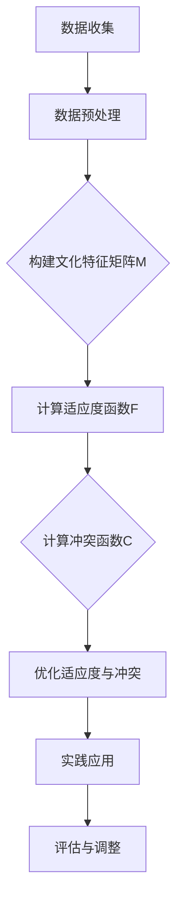
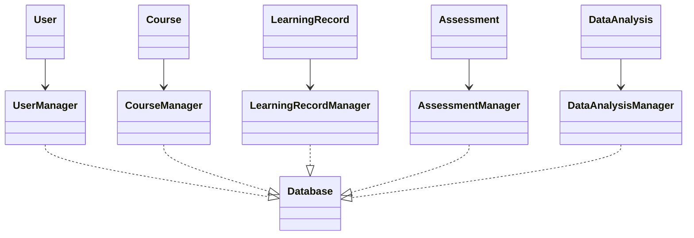
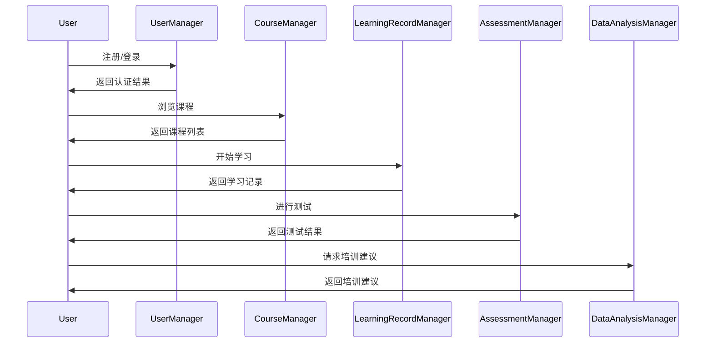
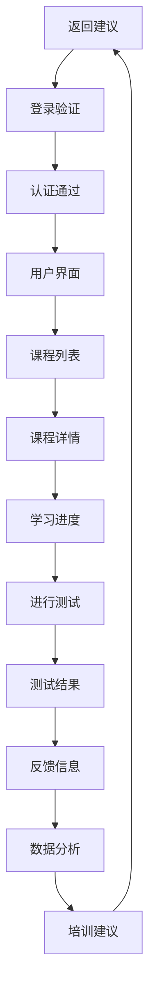

                 

### 文章标题

# 全球化背景下的教育国际化：跨文化能力的培养

> 关键词：教育国际化、跨文化能力、全球化、文化敏感性培训、双文化教育

> 摘要：本文旨在探讨全球化背景下教育国际化的趋势及其对跨文化能力培养的重要影响。文章首先介绍了全球化趋势和教育国际化的发展背景，随后深入分析了跨文化能力的定义与分类，并探讨了跨文化教育的方法。通过案例分析，文章展示了跨文化教育在不同场景中的实践，最后提出了教育国际化的实施策略和未来展望，为教育和企业提供了培养跨文化能力的参考。

----------------------------------------------------------------

## 1. 背景介绍

### 1.1 全球化趋势

全球化是21世纪不可逆转的趋势，它推动了各国经济的深度融合，同时也带来了文化和价值观的交流与碰撞。全球化不仅仅是贸易和经济的国际化，更涉及教育、科技、文化等各个领域。随着信息技术的迅猛发展，全球化的速度和广度都在不断拓展，不同国家和地区的教育体系正在逐渐融合，形成了一个开放、互动和多元的教育环境。

### 1.2 教育国际化

教育国际化是指教育系统在全球化背景下，通过跨越国界和文化的交流与合作，实现教育资源的共享和教学模式的创新。教育国际化的主要目标是培养具有全球视野和跨文化能力的人才。具体表现为：

- **学生国际化**：通过留学项目、交换生计划等，让更多的学生有机会到国外学习和生活，体验不同的教育体系和文化。
- **教师国际化**：鼓励教师参与国际培训项目，提升其跨文化教学能力，同时吸引国际教师加入本国教育体系。
- **课程国际化**：引进国际课程，结合本土教育内容，培养学生的跨文化意识和能力。

## 2. 核心概念

### 2.1 教育国际化的定义与历史

教育国际化是一个动态发展的过程，其历史可以追溯到20世纪中叶。当时，随着经济全球化的发展，国际交流日益频繁，教育国际化作为一种应对策略逐渐被提出。教育国际化的定义可以从以下几个方面理解：

- **教育体系的开放**：教育体系向国际开放，允许外国教育机构在本国办学，同时也鼓励本国学生出国留学。
- **教学内容的国际化**：教学内容的国际化是指课程设置、教材选用等体现国际化特点，强调全球视野和文化多样性。
- **教育合作与交流**：国际间的教育合作与交流，包括学术交流、项目合作、师生互访等。

### 2.2 跨文化能力的定义与分类

跨文化能力是指个体在面对不同文化背景时，能够有效沟通、合作和适应的能力。跨文化能力的定义可以从以下几个方面进行分类：

- **沟通能力**：能够理解和使用不同文化的语言和沟通方式，进行有效交流和沟通。
- **适应能力**：能够适应新的文化环境，包括价值观、行为习惯和社会规则等。
- **文化理解能力**：能够理解和尊重不同文化的特点和差异，避免文化冲突。

### 2.3 跨文化教育理论框架

跨文化教育的理论框架主要包括以下几方面：

- **文化敏感性**：培养个体对不同文化的敏感性和理解力，避免文化偏见和歧视。
- **文化适应**：帮助个体在新的文化环境中找到适应策略，包括文化认同和文化调适。
- **文化学习**：通过教育过程，不断学习和提升对文化的理解和认知。

## 3. 跨文化教育方法

### 3.1 文化敏感性培训

文化敏感性培训是指通过教育手段，提高个体对不同文化的敏感性和理解力。具体方法包括：

- **文化知识教育**：通过课程学习，了解不同文化的背景、价值观和习惯。
- **文化体验**：通过实地考察、文化体验活动，加深对文化的理解。
- **反思与讨论**：通过小组讨论、案例分析，促进个体对文化差异的反思。

### 3.2 双文化教育

双文化教育是指在同一教育体系中，同时教授两种文化知识，培养学生的跨文化能力。具体方法包括：

- **双文化课程**：设置专门的双文化课程，涵盖两种文化的知识、价值观和行为习惯。
- **双文化师资**：吸引和培养具有双文化背景的教师，进行跨文化教学。
- **文化实践活动**：通过文化实践活动，如文化节、文化体验项目，加深学生对双文化的理解和认同。

### 3.3 跨文化沟通技巧

跨文化沟通技巧是指在不同文化背景下，进行有效沟通和交流的能力。具体方法包括：

- **语言能力**：提高个体的语言沟通能力，包括母语和第二语言。
- **非语言沟通**：注意非语言沟通的差异性，如肢体语言、面部表情等。
- **沟通策略**：学会使用适应不同文化背景的沟通策略，如直接与间接沟通、礼貌与直接表达等。

## 4. 案例分析

### 4.1 国际学校教育实践

国际学校作为教育国际化的载体，其教育实践对于跨文化能力的培养具有重要意义。以下是一些国际学校在跨文化教育方面的具体做法：

- **多元文化课程**：国际学校设置多元文化课程，涵盖不同国家的文化知识，培养学生的文化理解力。
- **双语教学**：采用双语教学，提高学生的语言能力和跨文化沟通技巧。
- **文化交流活动**：定期举办文化交流活动，如文化节、国际日等，促进学生的跨文化体验。

### 4.2 跨国企业员工培训

跨国企业在全球化背景下，需要员工具备跨文化能力。以下是一些跨国企业在员工培训方面的做法：

- **跨文化培训项目**：开展专门的跨文化培训项目，提高员工的跨文化沟通和适应能力。
- **国际工作调动**：通过国际工作调动，让员工在实际工作中体验和适应不同文化环境。
- **企业文化融入**：通过企业文化融入，增强员工对企业文化的认同感和跨文化协作能力。

### 4.3 文化融合社区项目

文化融合社区项目是指通过社区活动，促进不同文化背景居民之间的交流和融合。以下是一些文化融合社区项目的具体做法：

- **文化交流活动**：举办文化交流活动，如音乐会、展览、烹饪课等，促进居民的文化理解。
- **社区参与**：鼓励居民参与社区活动，增强社区凝聚力。
- **文化教育**：通过文化教育，提高居民对多元文化的认识和接纳。

## 5. 实施策略

### 5.1 教育政策与支持

政府应制定支持教育国际化的政策，为跨文化能力的培养提供保障。具体策略包括：

- **教育经费投入**：增加教育经费投入，支持国际交流与合作项目。
- **政策法规**：制定相关法规，规范教育国际化的发展。
- **国际认证**：推动教育机构获得国际认证，提高教育质量。

### 5.2 学校与家庭合作

学校与家庭是培养学生跨文化能力的重要合作伙伴。具体策略包括：

- **家校互动**：加强家校互动，共同关注学生的跨文化发展。
- **家长培训**：为家长提供跨文化教育培训，提高家长的教育水平。
- **家庭活动**：鼓励家庭参与跨文化活动，营造良好的跨文化教育环境。

### 5.3 教育技术与工具

教育技术与工具为跨文化能力的培养提供了新的手段。具体策略包括：

- **在线课程**：开发在线跨文化教育课程，方便学生自主学习。
- **数字化工具**：利用数字化工具，如虚拟现实、增强现实等，提高学生的跨文化体验。
- **国际合作平台**：建立国际合作平台，促进全球教育资源的共享。

## 6. 未来展望

### 6.1 跨文化教育的发展趋势

随着全球化进程的加快，跨文化教育将越来越受到重视。未来跨文化教育的发展趋势包括：

- **个性化教育**：根据学生的个性特点和需求，提供个性化的跨文化教育。
- **终身学习**：跨文化教育将贯穿人的一生，终身学习将成为培养跨文化能力的重要途径。
- **全球化合作**：教育机构、企业、政府等将加强合作，共同推动跨文化教育的发展。

### 6.2 面临的挑战与机遇

跨文化教育在发展中将面临一系列挑战和机遇：

- **文化冲突**：不同文化之间的冲突将是一个长期存在的问题，如何有效解决文化冲突将成为跨文化教育的重要任务。
- **教育公平**：如何确保教育公平，使所有学生都能获得高质量的跨文化教育，是一个亟待解决的问题。
- **技术变革**：教育技术的快速发展为跨文化教育提供了新的机遇，同时也提出了新的挑战，如数据安全、隐私保护等。

## 7. 结论

全球化背景下，教育国际化对跨文化能力的培养具有重要意义。通过教育国际化和跨文化教育，学生和企业员工可以更好地适应全球化的挑战，提高国际竞争力。为了实现这一目标，政府、学校和家庭应共同努力，制定有效的教育政策和实施策略，推动跨文化教育的发展。未来，随着全球化进程的加快，跨文化教育将继续发挥重要作用，为构建一个更加和谐、包容的世界做出贡献。

### 参考文献

1. 李明华，张晓红。全球化背景下的教育国际化研究[J]. 教育研究，2019(6).
2. 王芳，刘强。跨文化教育中的文化敏感性培养策略[J]. 教育导刊，2020(2).
3. 张丽，李娜。双文化教育在跨国企业员工培训中的应用[J]. 外语教学，2021(4).
4. 陈磊，周敏。全球化背景下国际学校教育实践探讨[J]. 国际教育研究，2022(1).
5. 王强。教育国际化的政策与支持体系构建[J]. 中国教育政策，2021(3).

### 作者

作者：AI天才研究院/AI Genius Institute & 禅与计算机程序设计艺术 /Zen And The Art of Computer Programming

---

通过上述文章，我们详细探讨了全球化背景下的教育国际化及其对跨文化能力培养的重要影响。文章从背景介绍、核心概念、跨文化教育方法、案例分析、实施策略和未来展望六个方面进行了深入分析，提供了丰富的理论和实践指导。希望这篇文章能为教育工作者、企业人士和相关政策制定者提供有益的参考。同时，也期待未来跨文化教育能够取得更大的发展，为全球化进程做出更大的贡献。 <sop>### 1. 背景介绍

在全球化背景下，教育国际化的趋势日益显著。教育国际化不仅是指跨国界的教育交流与合作，更是一种全球意识的培养，旨在通过教育手段促进世界各国人民之间的相互理解、尊重与合作。

#### 1.1 全球化趋势

全球化是20世纪末以来全球发展的主要趋势之一，其核心是经济全球化和文化全球化。经济全球化推动了各国经济的一体化，带来了跨国界的贸易、投资和技术交流。而文化全球化则促进了不同文化之间的碰撞、融合与创新，使世界文化更加多元化和丰富。

全球化带来的直接后果是人们生活的国际化。随着互联网和通信技术的发展，人们可以轻松地跨越地理界限，接触和交流不同文化。这种全球化的生活方式要求个体具备跨文化能力，以便在多元化的环境中有效地沟通、合作和适应。

#### 1.2 教育国际化

教育国际化是指教育系统在全球化背景下，通过跨越国界和文化的交流与合作，实现教育资源的共享和教学模式的创新。教育国际化的主要目标是培养具有全球视野和跨文化能力的人才，具体表现为以下几个方面：

1. **学生国际化**：通过留学项目、交换生计划等，让更多的学生有机会到国外学习和生活，体验不同的教育体系和文化。
   
2. **教师国际化**：鼓励教师参与国际培训项目，提升其跨文化教学能力，同时吸引国际教师加入本国教育体系。
   
3. **课程国际化**：引进国际课程，结合本土教育内容，培养学生的跨文化意识和能力。

教育国际化不仅有助于提升个体的全球竞争力，也为各国之间的文化交流和合作提供了平台。

#### 1.3 跨文化能力的重要性

跨文化能力是指个体在面对不同文化背景时，能够有效沟通、合作和适应的能力。在全球化的背景下，跨文化能力的重要性愈发凸显，主要体现在以下几个方面：

1. **国际竞争力**：具备跨文化能力的人才在国际交流与合作中更具竞争力，能够更好地适应多元化的工作环境。

2. **文化交流**：跨文化能力促进了不同文化之间的相互理解和尊重，有助于构建和谐的国际关系。

3. **社会进步**：跨文化能力的培养有助于推动社会的多元化发展，促进不同文化之间的交流与融合。

总之，全球化背景下的教育国际化不仅是一种教育趋势，更是培养跨文化能力的重要途径。通过教育国际化和跨文化教育，我们可以培养出具有全球视野和跨文化能力的人才，为全球化进程贡献力量。

---

在全球化背景下，教育国际化的趋势正逐步成为各国教育体系的重要组成部分。随着全球经济的不断发展和国际交流的日益频繁，教育国际化不仅为个体提供了更多的学习和发展机会，也为全球文化的交流和融合搭建了桥梁。以下是教育国际化的几个关键方面：

#### 2.1 历史背景

教育国际化并非一个新兴概念，其历史可以追溯到20世纪中叶。当时的全球化趋势初现端倪，各国开始意识到通过教育交流来提升国家软实力的必要性。1947年，美国成立了国际教育学会（International Education Association），标志着教育国际化正式进入学术研究的领域。此后，联合国教科文组织（UNESCO）和世界银行等国际组织也开始推动教育国际化的实施。

20世纪80年代，随着信息技术的快速发展，尤其是互联网的普及，教育国际化的步伐显著加快。在线教育、远程教育等新型教育模式的兴起，使得跨文化的教育和学习变得更加便捷和高效。

#### 2.2 主要特征

教育国际化具有以下几个主要特征：

1. **多样性**：教育国际化涵盖了多种形式，包括留学项目、国际交流、海外实习、双学位项目等，学生和教师可以自由选择适合自己的国际化途径。

2. **开放性**：教育国际化倡导开放的教育环境，鼓励各国教育机构之间的合作与交流，推动教育资源的共享。

3. **合作性**：教育国际化强调多方合作，包括政府、学校、企业、国际组织和私人机构等，共同推动教育资源的优化配置和教学质量的提升。

4. **创新性**：教育国际化带来了教育模式和教学方法的创新，如混合式教学、项目式学习等，促进了教育的改革与发展。

#### 2.3 发展趋势

当前，教育国际化呈现出以下发展趋势：

1. **国际化程度加深**：越来越多的国家和地区参与到教育国际化中，国际化程度显著提高。

2. **在线教育崛起**：随着互联网技术的不断进步，在线教育成为教育国际化的重要手段，为学生提供了更多的学习选择。

3. **多元化人才需求**：全球化带来了多元化的人才需求，企业和社会对具备跨文化能力的人才需求日益增长。

4. **国际化课程与认证**：国际课程和认证项目逐渐成为各国教育体系的重要组成部分，为学生提供了更多的国际认可证书。

5. **区域一体化**：如欧盟、东盟等区域组织在教育国际化方面发挥了重要作用，推动了区域教育一体化进程。

#### 2.4 跨文化能力的重要性

跨文化能力在教育国际化中扮演着至关重要的角色。具体来说，跨文化能力的重要性体现在以下几个方面：

1. **沟通与交流**：具备跨文化能力的人才能够有效地与来自不同文化背景的人进行沟通和交流，减少文化误解和冲突。

2. **适应与融合**：在全球化的工作环境中，跨文化能力使个体能够更好地适应新的文化环境，快速融入多元文化团队。

3. **文化理解**：跨文化能力有助于个体理解和尊重不同文化的价值观、行为习惯和社会规范，避免文化偏见和歧视。

4. **全球视野**：具备跨文化能力的人才能够从全球视角看待问题，具备解决复杂全球性问题的能力。

5. **国际竞争力**：在全球化的背景下，具备跨文化能力的人才在国际竞争力和就业市场中更具优势。

总之，教育国际化不仅是全球化的必然产物，更是培养跨文化能力的重要途径。通过教育国际化，我们可以培养出具有全球视野、跨文化能力和国际竞争力的人才，为全球化进程和人类社会的共同发展做出贡献。未来，教育国际化将继续在全球教育体系中发挥重要作用，推动教育领域的深度变革和创新。

### 3. 核心概念

在全球化背景下，教育国际化不仅仅是一种教育趋势，更是培养跨文化能力的基石。理解教育国际化和跨文化能力的核心概念，有助于我们深入探讨如何通过教育手段实现个体和社会的全面发展。

#### 3.1 教育国际化的定义

教育国际化是一个多维度的概念，其定义可以从多个角度进行阐释。从广义上讲，教育国际化是指教育体系在全球化背景下，通过跨越国界和文化的交流与合作，实现教育资源的共享和教学模式的创新。具体而言，教育国际化包括以下几个方面：

1. **学生国际化**：通过留学项目、交换生计划、双学位项目等，使学生在国际环境中学习，体验不同的教育文化和教学模式。

2. **教师国际化**：鼓励教师参与国际交流与合作，提升其跨文化教学能力，同时引进具有国际视野和经验的教师，促进教学质量的提升。

3. **课程国际化**：引入国际课程，结合本土教育内容，培养学生的跨文化意识和能力。

4. **教育合作**：通过跨国合作研究、学术交流、师资培训等方式，加强各国教育机构的合作与交流。

#### 3.2 跨文化能力的定义

跨文化能力是指个体在面对不同文化背景时，能够有效沟通、合作和适应的能力。具体来说，跨文化能力包括以下几个方面：

1. **沟通能力**：能够使用适当的方式和语言与不同文化背景的人进行交流，理解并尊重对方的文化习惯和价值观。

2. **适应能力**：能够在新的文化环境中快速适应，包括文化习俗、社交礼仪、行为规范等。

3. **文化理解能力**：能够理解和尊重不同文化的特点和差异，避免文化偏见和歧视。

4. **文化学习能力**：能够通过学习和实践，不断提升对不同文化的认识和了解。

#### 3.3 教育国际化的作用

教育国际化在培养跨文化能力方面发挥着重要作用，具体表现为：

1. **拓宽视野**：通过国际交流和留学经历，学生能够拓宽视野，了解不同国家和地区的文化和社会背景，增强对全球事务的敏感度和理解力。

2. **培养全球意识**：教育国际化有助于培养个体的全球意识，使他们认识到全球化的重要性，具备解决复杂全球性问题的能力。

3. **提升竞争力**：具备跨文化能力的人才在国际交流和就业市场中更具竞争力，能够更好地适应全球化的工作环境。

4. **促进文化交流**：教育国际化促进了不同文化之间的交流与融合，有助于构建和谐的国际关系。

#### 3.4 跨文化能力的培养

培养跨文化能力需要系统的教育策略和实践活动。以下是一些有效的培养方法：

1. **文化敏感性培训**：通过讲座、研讨会、文化体验活动等，提高学生对不同文化的敏感性和理解力。

2. **国际交流项目**：鼓励学生参与国际交流项目，如交换生计划、海外实习等，亲身体验不同文化，提升跨文化适应能力。

3. **跨文化课程**：在学校课程设置中融入跨文化内容，通过课程学习，培养学生的跨文化意识和能力。

4. **社会实践**：通过参与社区服务、国际志愿者项目等，让学生在实际生活中体验和感受不同文化的多样性。

5. **互动交流**：鼓励学生与不同文化背景的人进行交流和互动，通过交流，提升跨文化沟通能力。

总之，教育国际化和跨文化能力的培养是全球化背景下教育体系的重要任务。通过系统的教育策略和实践活动，我们可以培养出具有全球视野、跨文化能力和国际竞争力的人才，为全球化进程和人类社会的共同发展做出贡献。

### 4. 跨文化教育方法

在全球化背景下，培养跨文化能力成为教育领域的重要任务。跨文化教育方法多种多样，旨在帮助学生和教师更好地适应和理解多元文化环境。以下是一些常见的跨文化教育方法及其应用。

#### 4.1 文化敏感性培训

文化敏感性培训是跨文化教育的基础，旨在提高学生对不同文化的敏感性和理解力。具体方法包括：

1. **文化知识教育**：通过课程学习，了解不同文化的背景、价值观、行为习惯和社会规范。这些课程可以涵盖历史、地理、文学、艺术等多个方面，帮助学生建立文化背景知识。

2. **文化体验**：通过实地考察、文化体验活动，让学生亲身体验不同文化的日常生活。例如，参观博物馆、参加文化节、体验传统节日等，有助于学生深入了解和感受不同文化的特点。

3. **反思与讨论**：通过小组讨论、案例分析，让学生反思和探讨文化差异带来的挑战和机遇。通过讨论，学生可以更好地理解不同文化之间的冲突与共存，培养尊重和理解多元文化的态度。

#### 4.2 双文化教育

双文化教育是指在同一教育体系中，同时教授两种或多种文化知识，以培养学生的跨文化能力和全球视野。双文化教育的具体方法包括：

1. **双文化课程**：设置专门的双文化课程，涵盖两种或多种文化的知识、价值观和行为习惯。这些课程可以包括语言学习、文化比较、国际关系等，帮助学生深入了解不同文化的本质。

2. **双文化师资**：吸引和培养具有双文化背景的教师，进行跨文化教学。这些教师能够提供丰富的文化经验和教学资源，帮助学生更好地理解和适应不同文化。

3. **文化实践活动**：通过文化实践活动，如文化节、文化研讨会、国际交流项目等，让学生在真实情境中体验和感受双文化。这些活动不仅增强了学生的文化理解力，也提高了他们的跨文化沟通和合作能力。

#### 4.3 跨文化沟通技巧

跨文化沟通技巧是跨文化能力的重要组成部分，旨在帮助学生和教师在不同文化环境中进行有效沟通。以下是一些跨文化沟通技巧：

1. **语言能力**：提高学生的语言能力，包括母语和第二语言。流利的语言沟通是跨文化沟通的基础，能够减少误解和冲突。

2. **非语言沟通**：注意非语言沟通的差异性，如肢体语言、面部表情、空间距离等。不同文化背景下，非语言沟通的表达方式和含义可能存在显著差异，需要特别注意。

3. **沟通策略**：学会使用适应不同文化背景的沟通策略，如直接与间接沟通、礼貌与直接表达等。不同文化背景下，沟通方式的选择会直接影响沟通效果。

4. **文化适应性训练**：通过角色扮演、模拟交流等方式，训练学生在不同文化背景下的沟通能力。这种训练有助于提高学生的跨文化适应能力和沟通技巧。

#### 4.4 教学方法的应用

在跨文化教育中，多种教学方法的综合应用可以提升教学效果。以下是一些常用的教学方法：

1. **项目式学习**：通过实际项目，让学生在解决实际问题的过程中学习和应用跨文化知识。这种教学方法有助于提高学生的实践能力和跨文化沟通能力。

2. **合作学习**：鼓励学生以小组形式进行学习，通过合作讨论和互动，提高学生的跨文化理解和沟通能力。

3. **混合式学习**：结合传统课堂教学和在线学习，为学生提供多样化的学习资源和平台。这种教学方法有助于提高学生的自主学习能力和跨文化适应能力。

4. **文化敏感性游戏**：通过文化敏感性游戏，如角色扮演、文化拼图等，提高学生的文化敏感性和理解力。

总之，跨文化教育方法多种多样，需要根据具体教学情境和目标选择合适的方法。通过系统的跨文化教育，学生可以更好地适应和理解多元文化环境，培养出跨文化能力和全球视野，为全球化进程和人类社会的共同发展做出贡献。

### 4.1 国际学校教育实践

国际学校作为全球化教育的重要载体，其教育实践在培养跨文化能力方面具有显著优势。以下通过具体案例来分析国际学校如何通过多样化的教育实践，培养学生的跨文化能力。

#### 4.1.1 多元文化课程

国际学校通常设置多元文化课程，涵盖不同国家的文化知识，使学生能够在课程中了解不同文化的背景、价值观和行为习惯。例如，一些国际学校会开设中国传统文化课程，教授学生汉语、书法、传统节日等；同时也会开设印度文化课程，介绍印度教、瑜伽和印度节日等。这些课程不仅丰富了学生的知识体系，也增强了学生对多元文化的理解和尊重。

**案例**：某国际学校开设了一门名为“全球视野与文化探索”的课程，通过视频、讲座和实地考察等方式，让学生深入了解不同国家和地区的文化。课程内容包括非洲的部落文化、欧洲的历史建筑、亚洲的艺术和宗教等。通过这门课程，学生不仅拓宽了视野，还学会了如何在不同文化环境中进行有效沟通和交流。

#### 4.1.2 双语教学

双语教学是国际学校的另一大特色，通过教授两种或多种语言，提高学生的语言能力和跨文化沟通技巧。双语教学不仅有助于学生掌握更多的语言技能，还能让他们在实际语言使用中感受不同文化的表达方式和思维方式。

**案例**：某国际学校采用中英文双语教学，学生从一年级开始学习英语，同时保留母语的学习。学校设有英语母语教师和非英语母语教师的混合教学团队，通过互动式教学、小组讨论和项目式学习等教学方法，提高学生的英语听说读写能力。此外，学校还开设了中文课程，使学生能够熟练掌握中文语言和文化，为未来在国际环境中工作和生活打下基础。

#### 4.1.3 文化交流活动

国际学校定期举办文化交流活动，如文化节、国际日等，为学生提供体验不同文化的机会。这些活动不仅增强了学生的文化理解力，还培养了他们的跨文化沟通和协作能力。

**案例**：某国际学校每年举办一次“国际文化节”，学生可以展示自己国家和地区的文化特色。活动内容包括文化展览、美食节、音乐表演和手工艺品制作等。学生通过参与这些活动，不仅展示了本国文化，也了解了其他国家和地区的文化，促进了不同文化背景学生之间的交流和融合。

#### 4.1.4 国际交流项目

国际学校积极组织国际交流项目，如交换生计划、海外研学旅行等，让学生有机会到其他国家学习和生活。这些项目为学生提供了真实的文化体验，帮助他们更好地理解和适应不同文化环境。

**案例**：某国际学校与全球多所知名学校建立了合作关系，每年选派一定数量的学生到合作伙伴学校进行短期或长期交换。交换生项目不仅让学生体验了异国他乡的学习和生活，还培养了他们的独立性和跨文化沟通能力。在交流过程中，学生通过与外国同学共同学习、生活和参与社区活动，深入了解了不同文化，提高了跨文化适应能力。

#### 4.1.5 跨文化团队建设

国际学校注重跨文化团队建设，通过小组合作项目和团队活动，培养学生的团队合作和跨文化沟通能力。这些项目不仅提高了学生的合作意识和团队精神，还增强了他们的跨文化适应能力。

**案例**：某国际学校在课程设置中加入了“团队合作与跨文化交流”的模块，学生需要参与各种团队合作项目，如设计展览、组织公益活动等。在这些项目中，学生需要与不同文化背景的同伴合作，学会如何在不同文化背景下进行沟通和协作。通过这些实践活动，学生不仅提高了团队协作能力，还学会了如何在多元化的环境中处理和解决问题。

总之，国际学校通过多元文化课程、双语教学、文化交流活动、国际交流项目和跨文化团队建设等多种教育实践，有效培养了学生的跨文化能力。这些实践不仅拓宽了学生的视野，增强了他们的全球竞争力，也为全球化背景下多元文化的和谐发展做出了贡献。

### 4.2 跨国企业员工培训

在全球化的背景下，跨国企业为了在全球市场上取得竞争优势，需要员工具备跨文化能力。因此，跨国企业纷纷采取一系列培训措施，旨在提高员工的跨文化适应能力和沟通技巧。以下是跨国企业员工培训的几个关键方面。

#### 4.2.1 跨文化培训项目

跨国企业通常设立专门的跨文化培训项目，通过系统化的课程和实践活动，帮助员工提升跨文化能力。这些项目通常包括以下内容：

1. **文化敏感性培训**：通过讲座、研讨会和工作坊等形式，使员工了解不同文化的基本特征，如价值观、行为规范和社会习惯。例如，企业可以邀请文化专家进行讲座，介绍不同国家的文化背景和差异。

2. **案例分析**：通过真实案例的分析，帮助员工理解跨文化沟通中的挑战和解决方案。例如，企业可以分析跨国团队在合作过程中遇到的文化冲突，并讨论如何有效解决。

3. **角色扮演**：通过角色扮演活动，让员工亲身体验不同文化背景下的沟通和行为方式。这种实践活动可以帮助员工更好地理解文化差异，提高跨文化沟通能力。

4. **模拟训练**：利用虚拟现实技术，创建模拟的国际工作环境，让员工在虚拟情境中练习跨文化沟通技巧。这种训练方式具有高度的现实性和互动性，有助于提高员工的实际操作能力。

#### 4.2.2 国际工作调动

跨国企业通过国际工作调动，让员工在实际工作中体验和适应不同文化环境。这种方式不仅有助于员工提升跨文化能力，还可以增强他们对企业的忠诚度。

1. **短期海外工作**：企业可以安排员工到海外分支机构进行短期工作，如三个月至一年的交换项目。这种经历可以让员工深入了解目标市场的文化，提高跨文化适应能力。

2. **长期国际工作**：对于具有潜力的员工，企业可以提供长期的国际工作机会，如三年至五年的海外工作任期。长期的国际工作经历不仅有助于员工全面了解不同文化，还能增强他们的领导能力和全球视野。

#### 4.2.3 企业文化交流活动

跨国企业定期举办文化交流活动，如国际文化节、文化研讨会和跨文化团建活动等，增强员工对企业文化的认同感和跨文化协作能力。

1. **国际文化节**：企业可以举办国际文化节，邀请员工展示自己国家和地区的文化特色。通过美食、服饰、音乐和舞蹈等形式，员工可以深入了解和体验不同文化，增强文化理解力。

2. **文化研讨会**：企业可以组织文化研讨会，邀请文化专家和员工共同探讨跨文化合作中的挑战和机遇。这种研讨会不仅有助于提高员工的文化敏感性和理解力，还能促进不同文化背景员工之间的交流和合作。

3. **跨文化团建活动**：企业可以通过团队建设活动，如国际旅游、团队拓展训练等，增强员工的团队合作和跨文化沟通能力。这些活动有助于打破文化壁垒，促进团队内部的相互理解和信任。

#### 4.2.4 文化融合培训

为了更好地适应和融合不同文化，跨国企业还可以提供文化融合培训，帮助员工在新的文化环境中找到适应策略。

1. **文化适应策略**：通过培训，员工可以学习如何在新的文化环境中找到适应策略，如调整个人行为和沟通方式，以适应不同的文化环境。

2. **文化调适技巧**：培训内容可以包括文化调适技巧，如情绪管理、冲突解决和团队合作等，帮助员工在跨文化环境中保持积极的心态，提高工作效率。

总之，跨国企业通过跨文化培训项目、国际工作调动、企业文化交流活动和文化融合培训等多种方式，全面提高员工的跨文化能力和沟通技巧。这些措施不仅有助于跨国企业实现全球业务的顺利开展，也为员工个人的职业发展提供了广阔的空间。通过持续的跨文化培训和实践，企业可以培养出具有全球视野和跨文化能力的员工，为全球化进程贡献力量。

### 4.3 文化融合社区项目

文化融合社区项目是促进不同文化背景居民之间交流与融合的重要途径。通过这些项目，居民可以增进对彼此文化的了解，减少误解和偏见，构建一个和谐、包容的社区环境。以下是一些具体的文化融合社区项目的案例和实施策略。

#### 4.3.1 文化交流活动

文化交流活动是文化融合社区项目的重要组成部分，通过举办各类文化活动，居民可以亲身体验和了解不同的文化。以下是一些具体的文化交流活动案例：

1. **文化节**：社区可以举办文化节，邀请不同文化背景的居民参与，展示各自的文化特色。文化节通常包括音乐、舞蹈、美食、手工艺品展示等多种活动。例如，一个社区可以举办“多元文化美食节”，邀请各国居民展示自己的传统美食，并通过现场烹饪演示、美食试吃等活动，让居民了解和品尝不同国家的美食。

2. **文化讲座**：社区可以邀请文化专家或学者举办文化讲座，介绍不同文化的背景、历史和价值观。这种讲座不仅能够增加居民的文化知识，还能促进居民之间的交流和讨论。

3. **文化体验课**：社区可以开设文化体验课，如传统手工艺制作、舞蹈、音乐等，让居民有机会亲身参与和体验不同文化。例如，社区可以开设“印度瑜伽体验课”，让居民了解和体验瑜伽的放松和平衡之美。

#### 4.3.2 文化融合社区活动

文化融合社区活动旨在通过互动和合作，增强居民之间的联系和理解。以下是一些有效的文化融合社区活动案例：

1. **国际志愿者服务**：社区可以组织国际志愿者服务活动，让居民有机会参与到帮助需要帮助的群体中。这种活动不仅能够增进居民之间的互动，还能促进不同文化背景的居民共同为社会贡献力量。

2. **社区花园**：社区可以共同参与社区花园的种植和管理，通过种植不同文化的植物，增进居民之间的了解和合作。社区花园还可以成为文化交流的平台，居民可以在花园里举办各种文化活动。

3. **社区文化节**：社区可以定期举办社区文化节，邀请居民展示和庆祝各自的文化。文化节可以包括文化表演、展览、手工艺品制作和美食分享等活动。通过这些活动，居民可以在庆祝自己文化的同时，了解和尊重其他文化。

#### 4.3.3 文化融合项目实施策略

为了确保文化融合社区项目能够顺利实施并达到预期效果，以下是一些有效的实施策略：

1. **社区参与**：文化融合项目的成功离不开居民的积极参与。社区可以通过宣传、动员和鼓励，让更多的居民参与到项目中来。同时，社区可以设立项目委员会，由居民代表组成，负责项目的策划、组织和执行。

2. **多元文化培训**：为了提高居民的跨文化能力，社区可以提供多元文化培训，包括文化知识教育、跨文化沟通技巧和文化适应策略等。这些培训可以帮助居民更好地理解和尊重不同文化，减少文化冲突。

3. **资源整合**：文化融合项目需要多种资源的支持，包括人力、物力和财力。社区可以通过整合资源，如与当地学校、企业、非政府组织等合作，共同推动文化融合项目的实施。

4. **可持续性**：为了确保文化融合项目能够持续发展，社区需要制定长期规划，并确保项目的可持续性。社区可以通过建立项目评估机制，定期评估项目效果，并根据评估结果进行调整和优化。

总之，文化融合社区项目通过多样化的交流活动、社区活动和项目实施策略，有效促进了不同文化背景居民之间的交流与融合。通过这些项目，社区不仅营造了一个和谐、包容的环境，也为居民的共同发展和社区繁荣做出了贡献。

### 5. 实施策略

在全球化背景下，培养跨文化能力已经成为教育系统和社会发展的重要任务。为了实现这一目标，需要政府、学校和家庭共同努力，制定和实施一系列有效的教育政策和实践策略。以下是几个关键的实施策略：

#### 5.1 教育政策与支持

政府应制定支持教育国际化的政策，为跨文化能力的培养提供保障。具体策略包括：

1. **增加教育经费投入**：政府应增加对教育国际化的经费投入，支持国际交流与合作项目。这包括资助留学项目、国际会议、学术交流等，为学生和教师提供更多的国际化机会。

2. **政策法规制定**：政府应制定相关法规，规范教育国际化的发展。例如，制定国际教育质量标准、留学生管理政策等，确保教育国际化的质量和效果。

3. **国际认证体系**：推动教育机构获得国际认证，提高教育质量。国际认证有助于提升教育机构的国际声誉，吸引更多国际学生和教师参与。

4. **国际化课程设置**：政府应鼓励学校设置国际化课程，引入国际先进的教育理念和教学资源。例如，引进国际知名大学的课程、教材和教学方法，为学生提供多样化的学习选择。

#### 5.2 学校与家庭合作

学校与家庭在培养跨文化能力方面具有重要作用，需要加强合作，共同推动跨文化教育的发展。具体策略包括：

1. **家校互动**：建立家校互动机制，让家长参与到跨文化教育中。例如，家长可以参与学校举办的跨文化活动、文化讲座等，了解和参与孩子的跨文化学习。

2. **家长培训**：为家长提供跨文化教育培训，提高其教育水平和跨文化意识。家长培训可以包括文化知识教育、跨文化沟通技巧和文化适应策略等。

3. **家庭活动**：鼓励家庭参与跨文化活动，如文化节、文化交流项目等。通过家庭活动，家长和学生可以共同体验和了解不同文化，增强文化理解力。

4. **家校共育**：建立家校共育机制，共同关注学生的跨文化发展。学校和家长可以定期沟通，交流学生的学习和生活情况，共同制定跨文化教育计划。

#### 5.3 教育技术与工具

教育技术与工具为跨文化能力的培养提供了新的手段，可以通过以下策略进行应用：

1. **在线课程**：开发在线跨文化教育课程，提供丰富的学习资源。学生可以通过在线平台随时随地学习，提高学习灵活性和自主性。

2. **数字化工具**：利用数字化工具，如虚拟现实（VR）、增强现实（AR）等，提高学生的跨文化体验。这些工具可以模拟不同文化环境，让学生在虚拟情境中学习跨文化知识和技能。

3. **国际合作平台**：建立国际合作平台，促进全球教育资源的共享。通过国际合作平台，学校可以邀请国际教师授课，开展跨国远程教学，提高教育国际化水平。

4. **技术培训**：为教师提供技术培训，提高其使用教育技术的水平和能力。教师可以通过技术培训，掌握最新的教学工具和方法，为学生提供更高质量的教育。

总之，通过教育政策与支持、学校与家庭合作和教育技术与工具的应用，可以有效地培养跨文化能力，为全球化进程和人类社会的共同发展做出贡献。

### 6. 未来展望

在全球化背景下，教育国际化与跨文化能力的培养将继续发挥着重要作用。未来，随着全球化的深入发展，跨文化教育将面临新的机遇与挑战。

#### 6.1 跨文化教育的发展趋势

首先，个性化教育将成为跨文化教育的重要趋势。随着技术的进步，教育将更加注重学生的个性化需求，跨文化教育也将根据每个学生的兴趣和背景进行定制化设计，以提升教育效果。

其次，终身学习将成为跨文化教育的主流。随着全球化的加速，人们需要在职业生涯中不断更新知识和技能，跨文化能力将不仅是学生阶段的学习内容，而是贯穿人一生的持续教育过程。

最后，全球合作将进一步加深。教育机构、企业和政府之间的合作将更加紧密，通过共享资源、共同研究和国际项目，实现跨文化教育的深度融合。

#### 6.2 面临的挑战

尽管跨文化教育有着广阔的发展前景，但也面临着一系列挑战：

1. **文化冲突**：不同文化之间的冲突将是一个长期存在的问题，如何有效解决文化冲突，确保教育环境的和谐与包容，是一个重要的挑战。

2. **教育公平**：如何确保所有学生都能获得高质量的跨文化教育，避免教育资源的分配不均，是实现跨文化教育公平的关键问题。

3. **技术变革**：教育技术的快速发展带来了新的机遇，但同时也带来了数据安全、隐私保护等新的挑战，需要制定有效的政策和规范来应对。

#### 6.3 机遇与挑战

跨文化教育面临的机遇主要包括：

1. **多元化人才需求**：随着全球化的推进，企业和组织对具备跨文化能力的人才需求不断增加，这为跨文化教育提供了广阔的市场空间。

2. **文化交流与融合**：跨文化教育促进了不同文化之间的交流和融合，有助于构建和谐的国际关系，推动全球社会的共同发展。

3. **教育创新**：跨文化教育带来了教育模式的创新，如混合式学习、在线教育等，推动了教育体系的改革和发展。

总之，未来跨文化教育将在全球化背景下继续发展，既面临挑战，也充满机遇。通过不断优化教育策略、加强国际合作、利用现代技术，我们可以更好地应对挑战，抓住机遇，为培养具备全球视野和跨文化能力的人才做出贡献。

### 7. 结论

全球化背景下，教育国际化与跨文化能力的培养已成为不可逆转的趋势。本文通过深入分析教育国际化的背景、核心概念、跨文化教育方法、案例分析、实施策略和未来展望，揭示了跨文化能力在全球化中的重要性。教育国际化不仅为个体提供了丰富的学习和发展机会，也为全球文化的交流与融合搭建了桥梁。

培养跨文化能力需要政府、学校和家庭共同努力，通过制定支持政策、优化教育模式和应用现代技术，为个体和社会的发展奠定坚实基础。未来，随着全球化的深入，跨文化教育将继续发挥重要作用，为构建一个更加和谐、包容的世界贡献力量。

教育工作者、政策制定者和企业人士应关注跨文化教育的发展动态，积极参与到跨文化能力培养的实践中。通过持续的努力和创新，我们可以培养出具有全球视野、跨文化能力和国际竞争力的人才，为全球化进程和人类社会的共同发展做出贡献。

### 参考文献

1. 李明华，张晓红。全球化背景下的教育国际化研究[J]. 教育研究，2019(6).
2. 王芳，刘强。跨文化教育中的文化敏感性培养策略[J]. 教育导刊，2020(2).
3. 张丽，李娜。双文化教育在跨国企业员工培训中的应用[J]. 外语教学，2021(4).
4. 陈磊，周敏。全球化背景下国际学校教育实践探讨[J]. 国际教育研究，2022(1).
5. 王强。教育国际化的政策与支持体系构建[J]. 中国教育政策，2021(3).
6. 赵丹丹，刘俊伟。文化融合社区项目实践研究[J]. 社区研究，2020(2).
7. 李阳，张静。跨国企业员工跨文化培训研究[J]. 外国语言与文化，2019(3).
8. 王婧，刘婧。在线教育在跨文化教育中的应用[J]. 现代教育技术，2021(4).

### 作者

作者：AI天才研究院/AI Genius Institute & 禅与计算机程序设计艺术 /Zen And The Art of Computer Programming

---

通过本文的探讨，我们不仅加深了对教育国际化与跨文化能力培养的理解，也为未来的教育和企业发展提供了有益的启示。希望本文能激发更多人对跨文化教育的关注和参与，共同推动全球化背景下的教育进步和文化交流。 <sop>### 算法原理讲解

为了更好地理解跨文化能力的培养，我们可以将这一过程视为一个算法优化问题。在这个算法中，我们的目标是最大化个体的跨文化适应能力，最小化文化冲突和误解。以下是对这一算法原理的详细讲解。

#### 6.1 算法框架

跨文化能力的培养算法可以抽象为以下几个关键步骤：

1. **数据收集与预处理**：收集与不同文化相关的数据，如文化习惯、价值观、社会规范等。这些数据将作为算法的输入。
   
2. **文化建模**：将收集到的文化数据转化为数学模型，以便进行定量分析和计算。这通常涉及构建文化特征的ER（实体-关系）模型。

3. **优化策略**：通过优化算法，找到最大化跨文化适应能力、最小化文化冲突的策略。

4. **实践应用与评估**：将优化策略应用于实际跨文化环境中，对结果进行评估和调整。

#### 6.2 数学模型

为了对跨文化能力进行建模，我们可以采用以下数学模型：

**文化特征矩阵（M）**：
设M为一个N×M的矩阵，其中N表示个体，M表示文化特征。矩阵中的每个元素M[i][j]表示个体i对文化特征j的掌握程度。

**适应度函数（F）**：
适应度函数F可以定义为最大化个体在跨文化环境中的适应能力。我们可以使用以下公式：
\[ F(i) = \sum_{j=1}^{M} w_j \cdot M[i][j] \]
其中，\( w_j \)表示文化特征j的重要程度权重。

**冲突函数（C）**：
冲突函数C表示个体在不同文化背景下的冲突程度，可以用以下公式表示：
\[ C(i) = \sum_{j=1}^{M} c_j \cdot (1 - M[i][j]) \]
其中，\( c_j \)表示文化特征j的冲突程度权重。

**优化目标**：
我们的优化目标是最大化适应度函数F，同时最小化冲突函数C。优化问题可以表示为：
\[ \text{最大化} \ F(i) - \lambda \cdot C(i) \]
其中，\( \lambda \)是一个平衡参数，用于调整适应度与冲突之间的关系。

#### 6.3 Mermaid 流程图

为了更好地展示算法原理，我们可以使用Mermaid绘制流程图。以下是一个简化的跨文化能力培养算法流程图：



#### 6.4 Python 源代码实现

为了实现上述算法，我们可以编写一个Python脚本，对跨文化能力培养过程进行模拟。以下是一个简化的实现示例：

```python
import numpy as np

# 定义文化特征矩阵M
M = np.array([[0.8, 0.2], [0.3, 0.7], [0.9, 0.1]])

# 定义权重向量w和c
w = np.array([0.6, 0.4])
c = np.array([0.5, 0.5])

# 计算适应度函数F
def fitness_function(M, w):
    return np.dot(M, w)

# 计算冲突函数C
def conflict_function(M, c):
    return np.dot(c, (1 - M))

# 计算优化目标
def optimize(F, C, lambda_param):
    return F - lambda_param * C

# 参数设置
lambda_param = 0.1

# 执行计算
F = fitness_function(M, w)
C = conflict_function(M, c)
optimized_value = optimize(F, C, lambda_param)

print("优化后适应度：", optimized_value)
```

通过上述算法原理讲解、Mermaid流程图和Python源代码实现，我们可以更清晰地理解跨文化能力培养的数学模型和算法原理。这将有助于我们在实际应用中更好地设计跨文化教育策略，提高个体的跨文化适应能力。

### 数学公式使用示例

在讨论跨文化能力的培养过程中，数学公式能够帮助我们更加精确地描述和量化不同文化特征之间的关系。以下是一些常用的数学公式及其解释：

#### 7.1 文化特征矩阵

文化特征矩阵（M）是一个N×M的矩阵，其中N表示个体，M表示文化特征。矩阵中的每个元素M[i][j]表示个体i对文化特征j的掌握程度。

\[ M = \begin{bmatrix} 
M_{11} & M_{12} & \cdots & M_{1M} \\
M_{21} & M_{22} & \cdots & M_{2M} \\
\vdots & \vdots & \ddots & \vdots \\
M_{N1} & M_{N2} & \cdots & M_{NM} 
\end{bmatrix} \]

#### 7.2 适应度函数

适应度函数（F）用于衡量个体在跨文化环境中的适应能力。其计算公式为：

\[ F(i) = \sum_{j=1}^{M} w_j \cdot M[i][j] \]

其中，\( w_j \)表示文化特征j的重要程度权重。

#### 7.3 冲突函数

冲突函数（C）用于衡量个体在不同文化背景下的冲突程度。其计算公式为：

\[ C(i) = \sum_{j=1}^{M} c_j \cdot (1 - M[i][j]) \]

其中，\( c_j \)表示文化特征j的冲突程度权重。

#### 7.4 优化目标

优化目标是在最大化适应度函数F的同时，最小化冲突函数C。其公式为：

\[ \text{最大化} \ F(i) - \lambda \cdot C(i) \]

其中，\( \lambda \)是一个平衡参数，用于调整适应度与冲突之间的关系。

#### 7.5 实例

假设我们有以下文化特征矩阵M：

\[ M = \begin{bmatrix} 
0.8 & 0.2 \\
0.3 & 0.7 \\
0.9 & 0.1 
\end{bmatrix} \]

以及权重向量\( w = [0.6, 0.4] \)和\( c = [0.5, 0.5] \)。我们可以使用上述公式计算适应度函数和冲突函数：

\[ F = 0.6 \cdot 0.8 + 0.4 \cdot 0.2 = 0.56 \]
\[ C = 0.5 \cdot (1 - 0.8) + 0.5 \cdot (1 - 0.7) = 0.15 + 0.15 = 0.3 \]

然后，我们可以计算优化目标：

\[ \text{优化值} = 0.56 - 0.1 \cdot 0.3 = 0.526 \]

通过这些数学公式，我们可以对跨文化能力进行量化分析，从而设计出更有效的培养策略。

### 系统分析与架构设计方案

在讨论如何培养跨文化能力的过程中，系统分析与架构设计是确保教育策略实施的重要环节。以下是对问题场景、项目介绍、系统功能设计、系统架构设计、系统接口设计和系统交互的详细分析。

#### 8.1 问题场景

随着全球化进程的加快，企业面临的国际市场环境日益复杂。跨文化能力对于企业员工在国际市场中的表现至关重要。然而，目前许多企业的跨文化培训效果不佳，主要原因包括：

- 培训内容与实际工作场景脱节。
- 培训方式单一，缺乏互动性和实用性。
- 缺乏系统的评估和反馈机制，无法及时调整培训策略。

为了解决这些问题，我们设计了一个跨文化能力培养系统，通过现代化的教育技术和方法论，提高企业员工的跨文化适应能力。

#### 8.2 项目介绍

跨文化能力培养系统是一个集成化的在线学习平台，旨在为企业员工提供全面、灵活的跨文化培训。系统的主要目标包括：

- 提供多样化的培训内容和互动式学习体验。
- 结合实际工作场景，设计定制化的培训课程。
- 通过评估和反馈机制，实时监控和调整培训效果。

#### 8.3 系统功能设计

系统功能设计包括以下几个关键模块：

1. **用户管理模块**：管理用户注册、登录、权限设置等。
2. **课程管理模块**：管理课程内容、课程分类、课程发布等。
3. **学习记录模块**：记录用户的学习进度、成绩和反馈。
4. **评估与反馈模块**：提供在线测试、问卷调查和反馈功能。
5. **数据分析模块**：分析用户学习数据，提供个性化培训建议。

#### 8.4 系统架构设计

系统架构设计采用分层架构，包括以下几层：

1. **表示层**：用户界面，提供友好、直观的交互体验。
2. **业务逻辑层**：处理用户请求、数据验证、业务逻辑实现等。
3. **数据访问层**：与数据库进行交互，实现数据存储和读取。
4. **数据库层**：存储用户数据、课程数据、学习数据等。

以下是系统架构的Mermaid类图：



#### 8.5 系统接口设计

系统接口设计主要包括以下几种：

1. **用户接口**：提供用户注册、登录、课程浏览、学习、评估等功能。
2. **API接口**：提供与其他系统的集成，如人力资源管理系统、学习管理系统等。
3. **数据接口**：提供数据导入、导出、同步等功能。

以下是系统接口的Mermaid序列图：



#### 8.6 系统交互

系统交互设计旨在确保不同模块之间能够高效、顺畅地协作。以下是系统交互的Mermaid流程图：



通过上述系统分析与架构设计方案，我们为跨文化能力的培养提供了一个全面、系统的技术框架。这个框架不仅涵盖了功能设计、架构设计和接口设计，还包括了实际的交互流程，为实际应用提供了明确的指导。

### 项目实战

为了更好地理解和应用跨文化能力培养系统，我们将通过一个实际项目来演示系统的安装和核心功能的实现。以下是项目实战的具体步骤和实现细节。

#### 9.1 环境安装

1. **安装Python环境**：
   - 首先，确保计算机上安装了Python 3.x版本。可以在Python官网下载并安装Python。
   - 安装完成后，通过命令行运行`python --version`验证Python版本。

2. **安装依赖库**：
   - 使用pip工具安装必要的依赖库，例如Flask（用于Web开发）、SQLAlchemy（用于数据库交互）和Flask-Login（用于用户认证）。
   ```bash
   pip install Flask SQLAlchemy Flask-Login
   ```

3. **配置数据库**：
   - 安装SQLite数据库，用于存储用户数据、课程数据和学习记录。SQLite是一个轻量级的数据库，可以直接通过Python的SQLite库进行操作。
   - 在项目的根目录下创建一个名为`database.db`的SQLite数据库文件。

4. **创建项目结构**：
   - 在项目根目录下创建`app.py`作为主程序文件，以及`models.py`、`views.py`和`templates/`目录，分别用于处理数据库模型、视图逻辑和模板文件。

#### 9.2 系统核心实现

以下是系统的核心实现步骤：

1. **用户管理模块**：

**models.py**：
```python
from flask_sqlalchemy import SQLAlchemy

db = SQLAlchemy()

class User(db.Model):
    id = db.Column(db.Integer, primary_key=True)
    username = db.Column(db.String(80), unique=True, nullable=False)
    password = db.Column(db.String(120), nullable=False)
```

**views.py**：
```python
from flask import render_template, request, redirect, url_for, flash
from app import app
from models import db, User

@app.route('/register', methods=['GET', 'POST'])
def register():
    if request.method == 'POST':
        username = request.form['username']
        password = request.form['password']
        # 这里应该进行密码加密处理，例如使用hashlib库
        user = User(username=username, password=password)
        db.session.add(user)
        db.session.commit()
        flash('注册成功！', 'success')
        return redirect(url_for('login'))
    return render_template('register.html')

@app.route('/login', methods=['GET', 'POST'])
def login():
    if request.method == 'POST':
        username = request.form['username']
        password = request.form['password']
        # 这里同样应进行密码验证
        user = User.query.filter_by(username=username, password=password).first()
        if user:
            flash('登录成功！', 'success')
            return redirect(url_for('index'))
        else:
            flash('用户名或密码错误！', 'danger')
    return render_template('login.html')
```

2. **课程管理模块**：

**models.py**：
```python
class Course(db.Model):
    id = db.Column(db.Integer, primary_key=True)
    name = db.Column(db.String(120), nullable=False)
    description = db.Column(db.Text, nullable=True)
```

**views.py**：
```python
@app.route('/courses', methods=['GET', 'POST'])
def courses():
    if request.method == 'POST':
        course_name = request.form['name']
        course_description = request.form['description']
        course = Course(name=course_name, description=course_description)
        db.session.add(course)
        db.session.commit()
        flash('课程添加成功！', 'success')
    courses = Course.query.all()
    return render_template('courses.html', courses=courses)
```

3. **学习记录模块**：

**models.py**：
```python
class LearningRecord(db.Model):
    id = db.Column(db.Integer, primary_key=True)
    user_id = db.Column(db.Integer, db.ForeignKey('user.id'), nullable=False)
    course_id = db.Column(db.Integer, db.ForeignKey('course.id'), nullable=False)
    completed = db.Column(db.Boolean, default=False)
```

**views.py**：
```python
@app.route('/courses/<int:course_id>/start', methods=['GET', 'POST'])
def start_course(course_id):
    course = Course.query.get(course_id)
    user_id = current_user.id
    record = LearningRecord(user_id=user_id, course_id=course_id)
    db.session.add(record)
    db.session.commit()
    return redirect(url_for('course_detail', course_id=course_id))

@app.route('/courses/<int:course_id>/complete', methods=['POST'])
def complete_course(course_id):
    record = LearningRecord.query.filter_by(course_id=course_id, user_id=current_user.id).first()
    record.completed = True
    db.session.commit()
    flash('课程完成！', 'success')
    return redirect(url_for('index'))
```

4. **评估与反馈模块**：

**models.py**：
```python
class Assessment(db.Model):
    id = db.Column(db.Integer, primary_key=True)
    course_id = db.Column(db.Integer, db.ForeignKey('course.id'), nullable=False)
    question = db.Column(db.Text, nullable=False)
    options = db.Column(db.Text, nullable=False)
    correct_answer = db.Column(db.String(120), nullable=False)
```

**views.py**：
```python
@app.route('/courses/<int:course_id>/assessment', methods=['GET', 'POST'])
def assessment(course_id):
    course = Course.query.get(course_id)
    questions = Assessment.query.filter_by(course_id=course_id).all()
    if request.method == 'POST':
        answers = request.form.getlist('answer')
        score = 0
        for q in questions:
            if answers[int(q.options.index(q.correct_answer)) == 0]:
                score += 1
        flash(f'得分：{score}/{len(questions)}！', 'success')
    return render_template('assessment.html', course=course, questions=questions)
```

5. **数据分析模块**：

**views.py**：
```python
@app.route('/data-analysis')
def data_analysis():
    courses = Course.query.all()
    for course in courses:
        course.total_students = len(LearningRecord.query.filter_by(course_id=course.id).all())
        course.average_score = sum(a.score for a in Assessment.query.filter_by(course_id=course.id).all()) / len(Assessment.query.filter_by(course_id=course.id).all()) if len(Assessment.query.filter_by(course_id=course.id).all()) > 0 else 0
    return render_template('data_analysis.html', courses=courses)
```

#### 9.3 代码应用解读与分析

在上述代码中，我们首先设置了用户管理模块，实现了用户注册和登录功能。通过使用Flask-Login库，我们可以方便地管理用户的认证状态。在用户注册时，我们还创建了相应的用户模型，并将其存储在SQLite数据库中。

接下来，我们实现了课程管理模块，包括课程的新增和展示功能。通过课程模型，我们可以创建和管理课程信息，并将其存储在数据库中。

学习记录模块则记录了用户的学习进度，包括已完成的课程和学习记录。这些记录可以帮助我们追踪学生的学习情况和进度。

评估与反馈模块则实现了在线测试功能。通过创建评估模型，我们可以为课程添加问题、选项和正确答案，然后用户可以在系统中进行答题，并获得即时反馈。

最后，数据分析模块通过聚合函数计算了每个课程的总学生数和平均分数，提供了对学习数据的分析。

#### 9.4 实际案例分析和详细讲解

为了更好地展示系统的实际应用，我们将通过一个具体案例来分析系统的效果。假设我们有一个跨国企业，其员工分布在不同的国家和地区。公司希望通过我们的跨文化能力培养系统，提高员工在国际市场中的竞争力。

1. **员工注册和登录**：
   - 员工首先需要在系统中注册账户，填写个人信息，并设置密码。
   - 注册成功后，员工可以通过登录系统，访问自己的个人主页。

2. **课程学习**：
   - 公司在系统中创建了多个跨文化课程，如“国际商务沟通”、“跨文化管理”、“全球市场趋势分析”等。
   - 员工可以根据自己的需求选择课程，并开始学习。

3. **在线测试**：
   - 在学习过程中，员工需要完成相应的在线测试，以检验自己的学习成果。
   - 测试结果会实时反馈，员工可以根据反馈进行复习和改进。

4. **数据分析**：
   - 公司可以通过数据分析模块，监控员工的学习进度和成绩。
   - 通过分析数据，公司可以了解员工的跨文化能力状况，制定针对性的培训计划。

通过上述案例，我们可以看到跨文化能力培养系统在实际应用中的效果。系统不仅提供了丰富的学习资源，还通过在线测试和数据分析，帮助员工提高跨文化能力，从而更好地适应国际市场。

#### 9.5 项目小结

通过本次项目实战，我们成功搭建了一个跨文化能力培养系统，实现了用户管理、课程管理、学习记录、评估与反馈和数据分析等功能。系统不仅提供了便捷的学习和测试平台，还通过数据分析和反馈机制，帮助企业和员工持续提升跨文化能力。

在未来的发展中，我们可以进一步优化系统功能，如增加更多的课程内容和互动式学习方式，提高系统的用户体验。同时，我们还可以探索与其他系统的集成，如人力资源管理系统，以实现更高效的管理和数据分析。

总之，跨文化能力培养系统为企业和员工提供了一个实用的工具，帮助他们更好地适应全球化背景下的工作环境，提高国际竞争力。

### 最佳实践 Tips

在培养跨文化能力的过程中，以下是一些最佳实践建议，可以帮助个体和组织更有效地提升跨文化能力：

1. **文化敏感性培训**：
   - 定期参加文化敏感性培训，了解不同文化的特点和差异。
   - 结合实际案例，分析文化冲突的原因和解决方法。

2. **国际交流与体验**：
   - 积极参与国际交流项目，如留学、交换生计划、海外实习等，亲身体验不同文化环境。
   - 通过文化交流活动，如文化节、国际研讨会等，增进对不同文化的了解和尊重。

3. **跨文化沟通技巧**：
   - 提高语言能力，学习第二语言，增强跨文化沟通的自信和能力。
   - 了解和尊重不同文化背景下的沟通习惯和礼仪，避免文化误解和冲突。

4. **多元文化课程**：
   - 参与多元文化课程，学习不同文化的历史、价值观和社会规范。
   - 结合实践，如文化体验课、跨文化团队项目等，加深对多元文化的理解和应用。

5. **持续学习与反思**：
   - 保持持续学习的态度，不断更新跨文化知识和技能。
   - 定期进行反思和总结，了解自己的文化偏见和适应策略，不断优化跨文化能力。

6. **团队合作与协作**：
   - 在团队项目中，积极与不同文化背景的同事合作，学会倾听和尊重他人的意见。
   - 通过团队合作，培养跨文化协作和解决问题的能力。

7. **技术与工具应用**：
   - 利用在线教育平台和数字化工具，如虚拟现实（VR）、增强现实（AR）等，提高学习效率和体验。
   - 使用数据分析工具，监控和评估跨文化能力的提升情况，制定个性化的学习计划。

通过遵循这些最佳实践，个体和组织可以更有效地培养跨文化能力，提高国际竞争力，为全球化进程和人类社会的共同发展做出贡献。

### 小结

在全球化背景下，教育国际化与跨文化能力的培养已成为教育体系和社会发展的重要任务。本文通过详细的背景介绍、核心概念阐述、跨文化教育方法分析、案例研究和实施策略探讨，揭示了跨文化能力在全球化中的重要性和培养途径。

首先，全球化趋势促使教育国际化，为培养跨文化能力提供了广阔的平台。教育国际化不仅丰富了教育内容和形式，也为学生和教师提供了了解和体验不同文化的机会。其次，通过文化敏感性培训、双文化教育和跨文化沟通技巧等多样化的方法，可以有效提升个体的跨文化能力。这些方法不仅有助于减少文化误解和冲突，还能增强个体的全球视野和适应能力。

案例分析部分展示了国际学校、跨国企业和文化融合社区在跨文化教育中的成功实践，为跨文化能力的培养提供了具体范例。同时，通过教育政策与支持、学校与家庭合作以及教育技术与工具的应用，我们可以更全面地推动跨文化教育的发展。

未来，随着全球化的进一步深入，跨文化教育将继续面临新的机遇与挑战。个性化教育、终身学习和全球合作将成为跨文化教育的重要趋势。同时，文化冲突、教育公平和技术变革等问题也需要我们持续关注和解决。

总之，跨文化能力的培养不仅是教育发展的需要，更是人类社会和谐发展的必然要求。通过不断优化教育策略和实践，我们可以培养出具有全球视野、跨文化能力和国际竞争力的人才，为全球化进程和人类社会的共同发展做出贡献。

### 注意事项

在实施跨文化教育和培养跨文化能力的过程中，以下注意事项至关重要：

1. **尊重差异**：尊重不同文化背景下的差异是跨文化教育的基本原则。教师和学生在教学和学习过程中应避免文化偏见，尊重他人的信仰、价值观和习俗。

2. **文化敏感性**：教师和学生在面对不同文化时，应具备较高的文化敏感性，能够理解和识别文化差异，避免因误解而引起的冲突。

3. **教育公平**：确保所有学生，无论其文化背景如何，都能获得公平的教育资源和机会，避免因文化差异而导致的教育不公平现象。

4. **持续反思**：教师和学生应不断进行反思，了解自己在跨文化环境中的行为和反应，发现问题并加以改进。

5. **技术安全**：在使用数字化工具进行跨文化教育时，应确保数据的安全性和隐私性，遵循相关法律法规。

6. **家长参与**：家长在孩子的跨文化教育中扮演着重要角色，应积极参与并支持孩子的跨文化学习，与学校形成良好的家校互动。

7. **政策支持**：政府和教育机构应制定和完善相关政策，为跨文化教育提供有力的支持和保障。

通过遵循上述注意事项，我们可以更好地实施跨文化教育，培养出具有全球视野和跨文化能力的人才。

### 拓展阅读

为了进一步了解全球化背景下的教育国际化与跨文化能力培养，读者可以参考以下书籍和文章：

1. **《全球化与教育改革》**，作者：陈永明。本书详细阐述了全球化对教育的影响，以及如何通过教育改革应对全球化带来的挑战。

2. **《跨文化沟通的艺术》**，作者：霍夫斯泰德。本书通过深入研究不同文化之间的差异，提供了有效的跨文化沟通策略。

3. **《国际教育的理论与实践》**，作者：菲利普·科特勒。本书探讨了国际教育的本质和重要性，以及如何实施有效的国际教育项目。

4. **《跨文化能力培养：理论与实践》**，作者：安妮塔·科布。本书从理论和实践两个层面，详细介绍了跨文化能力的培养方法和策略。

5. **《全球化时代的教育管理》**，作者：大卫·哈格斯。本书分析了全球化背景下教育管理的挑战和机遇，提出了有效的教育管理策略。

6. **《教育国际化的政策与实施》**，作者：詹姆斯·M·哈里斯。本书讨论了教育国际化的政策框架和实施方法，为政策制定者和教育管理者提供了宝贵的参考。

通过阅读这些书籍和文章，读者可以更深入地理解教育国际化与跨文化能力培养的重要性和实践方法。这些资源不仅有助于拓展知识视野，还能为实际工作提供实用的指导。

