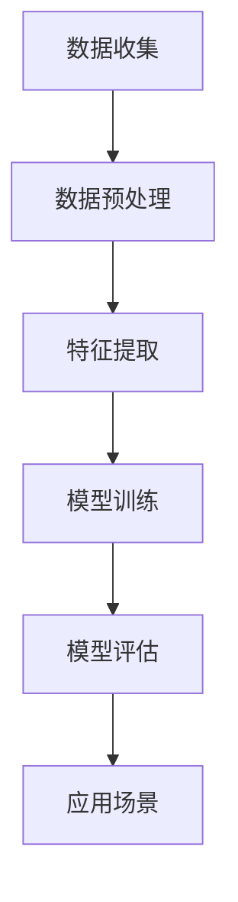

                 

### 文章标题：全球化背景下的文化认同危机

> 关键词：全球化、文化认同、危机、应对策略、算法原理

> 摘要：本文将深入探讨全球化背景下出现的文化认同危机。我们将首先介绍全球化的背景和发展，然后定义文化认同危机及其特点。接着，通过案例分析和算法原理讲解，展示文化认同危机的应对策略。文章旨在为读者提供全面的理解，并探讨如何在全球化背景下维护和增强文化认同。

----------------------------------------------------------------

## 引言

全球化作为21世纪的一个重要特征，正在深刻地改变着世界的方方面面。经济、政治、文化等各个领域都在全球化的浪潮中经历着前所未有的变革。然而，这一进程并非一帆风顺，全球化也带来了一系列挑战，其中之一便是文化认同危机。

文化认同危机指的是在一个国家或地区，由于全球化带来的文化冲击，人们对于自身文化的认同感和归属感减弱，甚至丧失的现象。这不仅影响了社会的稳定性，还对文化多样性和民族精神的传承构成了威胁。

本文将围绕全球化背景下的文化认同危机展开讨论。首先，我们将简要回顾全球化的背景和发展，并探讨其对文化的影响。接着，我们将定义文化认同危机，并分析其特点和类型。随后，通过具体案例的介绍，我们将展示文化认同危机的现状。在此基础上，我们将探讨应对文化认同危机的算法原理和数学模型。文章最后将总结全文，并给出最佳实践建议。

## 全球化的背景与发展

### 全球化的概念与影响

全球化指的是全球范围内经济、政治、文化等各个领域的相互联系和依存程度的加深。全球化的发展可追溯到19世纪末，但真正加速是在20世纪末至21世纪初。全球化的主要驱动因素包括信息技术的发展、国际经济一体化的推进、跨国公司的崛起以及全球政治合作机制的建立。

全球化的影响是多方面的。在经济领域，全球化促进了国际贸易和资本流动，推动了全球经济的增长。然而，它也导致了不平等的加剧，特别是发达国家和发展中国家之间的经济差距。在政治领域，全球化推动了国际政治合作和全球治理，但也带来了主权国家主权和国家安全方面的挑战。在文化领域，全球化加速了文化融合和文化交流，但同时也引发了文化认同危机。

### 全球化对文化的影响

全球化对文化的影响主要体现在以下几个方面：

1. **文化交流与融合**：全球化促进了不同文化之间的交流与融合，丰富了文化多样性。人们可以通过互联网、电视、电影等多种渠道接触到来自世界各地的文化产品。

2. **文化同质化**：全球化也导致了文化的同质化现象。一些全球流行文化产品，如好莱坞电影、美国音乐和时尚品牌等，在全球范围内占据主导地位，导致本土文化受到冲击。

3. **文化认同危机**：全球化加速了文化多样性的消解，使得一些国家和地区的人们对自己的文化认同感到困惑和不安。这尤其是在文化同质化的背景下，本土文化难以与全球流行文化相抗衡时。

4. **文化自觉**：另一方面，全球化也激发了人们对于本土文化的自觉和重新审视。许多国家和地区开始意识到文化认同的重要性，并采取措施保护和传承本土文化。

### 全球化背景下的文化认同危机

在全球化背景下，文化认同危机的出现有其必然性和复杂性。首先，全球化带来的文化同质化使得本土文化面临着被边缘化的风险。其次，全球流行文化的强势地位使得本土文化难以与之竞争，导致了文化自卑感。此外，全球化也加剧了文化差异和冲突，使得一些国家和地区的人们对自己的文化认同产生困惑和不安。

文化认同危机不仅影响了社会的稳定性，还对文化多样性和民族精神的传承构成了威胁。因此，如何应对全球化背景下的文化认同危机，成为了一个重要的课题。

## 核心概念与联系

### 文化认同的定义

文化认同是指个体或群体对于自己所属文化的认知和认同。它涉及对文化价值观、习俗、传统、语言等方面的认可和接受。文化认同是人的基本需求之一，对于个体的自我认同和社会的稳定具有重要意义。

### 文化认同的特点

文化认同具有以下特点：

1. **主观性**：文化认同是个体或群体主观上对自己所属文化的认知和感受，因此具有主观性。

2. **差异性**：不同文化背景的个体或群体具有不同的文化认同，这种差异性是文化多样性的体现。

3. **动态性**：文化认同不是一成不变的，它会随着时间、环境和社会变化而发生变化。

4. **冲突性**：文化认同可能导致个体或群体之间的冲突，特别是在文化差异明显的情况下。

### 文化认同与全球化

全球化对文化认同产生了深远的影响。一方面，全球化促进了文化交流与融合，丰富了文化多样性，但另一方面，它也加剧了文化同质化，威胁到了本土文化的存在和发展。这种双重影响使得文化认同面临着前所未有的挑战。

### 文化认同危机的类型

根据文化认同危机的表现形式，可以分为以下几种类型：

1. **文化自卑**：个体或群体在面对全球流行文化时，对自己的文化认同感到自卑，甚至放弃了自己的文化。

2. **文化迷失**：个体或群体在全球化背景下，对于自己的文化认同感到困惑和迷茫，无法找到自己的文化定位。

3. **文化冲突**：全球化带来的文化差异和冲突，导致个体或群体之间的对立和矛盾。

4. **文化复兴**：一些国家和地区在面临文化认同危机时，采取积极的措施保护和传承本土文化，推动文化复兴。

## 案例分析

### 美国的文化认同危机

美国作为全球化的受益者，也面临着文化认同危机。随着全球化的发展，美国本土文化受到了来自世界各地的文化冲击。例如，好莱坞电影、美国音乐和时尚品牌在全球范围内占据主导地位，导致美国本土文化受到边缘化。此外，美国社会的文化多样性也加剧了文化认同的困惑和冲突。

### 欧洲的文化认同危机

欧洲在全球化进程中同样面临着文化认同危机。欧洲各国在历史和文化上有着丰富的多样性，但全球化带来的文化同质化趋势使得这种多样性受到威胁。例如，欧洲的本土语言和文化传统受到了来自英语和其他欧洲语言的冲击。此外，欧洲在应对文化认同危机时，也出现了不同国家之间的文化冲突。

### 中国的文化认同危机

中国作为全球第二大经济体，也在全球化背景下面临着文化认同危机。随着中国经济的快速发展和对外开放，西方文化的影响日益加深。许多年轻人对中国传统文化认同感减弱，倾向于接受西方文化。同时，中国也在积极推动本土文化的保护和传承，以应对文化认同危机。

## 应对文化认同危机的算法原理与模型

### 算法原理介绍

为了应对文化认同危机，我们可以借助数据分析和机器学习等技术，开发出相应的算法模型。以下是一种可能的算法原理：

1. **数据收集**：首先，我们需要收集与文化认同相关的数据，包括文化事件、媒体报道、社交媒体评论等。

2. **数据预处理**：对收集到的数据进行清洗和预处理，包括去除重复数据、填补缺失值等。

3. **特征提取**：从预处理后的数据中提取关键特征，如文化事件的关键词、媒体报道的情感倾向等。

4. **模型训练**：利用提取到的特征，通过机器学习算法（如决策树、支持向量机、神经网络等）训练出文化认同危机预测模型。

5. **模型评估**：对训练好的模型进行评估，包括准确率、召回率、F1值等指标。

6. **应用场景**：将训练好的模型应用于实际场景，如文化认同危机预警、文化冲突预测等。

### 数学模型与公式

在文化认同危机的算法中，我们可以使用以下数学模型和公式：

1. **决策树模型**：

$$
Gini(\text{impurity}) = 1 - \frac{\sum_{i=1}^{n} p_i^2}{1 - \sum_{i=1}^{n} p_i}
$$

其中，$p_i$ 表示样本中属于类别 $i$ 的比例。

2. **支持向量机模型**：

$$
\text{w}^* \cdot \text{x} - \text{b} = 0
$$

其中，$\text{w}^*$ 是权重向量，$\text{x}$ 是特征向量，$\text{b}$ 是偏置项。

3. **神经网络模型**：

$$
a_{\text{layer}} = \text{ReLU}(\text{w}_{\text{layer-1}} \cdot \text{x}_{\text{layer-1}} + b_{\text{layer-1}})
$$

其中，$\text{ReLU}$ 是ReLU激活函数，$\text{w}_{\text{layer-1}}$ 和 $b_{\text{layer-1}}$ 分别是上一层的权重和偏置。

### Mermaid算法流程图

### 算法应用场景与实战

1. **文化认同危机预警**：通过训练好的模型，对社交媒体上的文化事件进行实时分析，预测可能引发文化认同危机的事件。

2. **文化冲突预测**：利用模型分析历史数据，预测可能发生的文化冲突，为政策制定提供依据。

3. **文化认同度测量**：通过对文化事件和媒体报道的分析，测量不同群体对文化认同的程度。

### 实际案例分析

以中国的网络文化为例，通过对社交媒体上的数据进行分析，可以发现一些与文化认同危机相关的问题。例如，某些西方文化产品在中国年轻人中受到追捧，而中国传统文化受到冷落。通过算法分析，可以预测这些现象可能引发的文化认同危机，并为相关部门提供应对策略。

## 本章小结

本章介绍了全球化背景下的文化认同危机，包括其定义、特点、影响以及应对策略。通过案例分析，我们展示了文化认同危机在不同国家和地区的表现形式。此外，我们还介绍了应对文化认同危机的算法原理和数学模型，为读者提供了技术层面的解决方案。在下一章中，我们将进一步探讨文化认同危机的应对策略，以及如何在全球化的背景下维护和增强文化认同。

## 文章关键词：全球化、文化认同、危机、算法原理、应对策略

----------------------------------------------------------------

## 全文总结

在全球化的背景下，文化认同危机成为了影响社会稳定和文化多样性的重要问题。本文通过对全球化的背景与发展、文化认同的定义与特点、案例分析以及算法原理的深入探讨，展示了文化认同危机的复杂性和挑战性。我们提出了一系列的应对策略，包括政策层面的调整、社会层面的文化自觉以及技术层面的算法支持。

### 文化认同的重要性

文化认同不仅是个人自我认同的重要组成部分，也是社会稳定和民族团结的基础。在全球化的浪潮中，文化认同危机的应对显得尤为重要。通过加强文化交流与融合，同时保持文化多样性和独特性，我们可以更好地维护和增强文化认同。

### 算法在文化认同危机中的应用

算法作为一种有力的工具，可以在文化认同危机的预警、预测和应对中发挥重要作用。通过对大数据的分析，我们可以更准确地了解文化认同的现状和趋势，从而为政策制定和社会行动提供科学依据。然而，算法的应用也需要谨慎，避免加剧文化同质化和文化冲突。

### 应对策略的实施

应对文化认同危机需要政府、社会和个人共同努力。政府应制定合理的政策和措施，支持本土文化的保护和传承。社会应加强文化教育，提高公众的文化素养和认同感。个人则应树立正确的文化价值观，积极参与文化建设和传承。

### 最佳实践

1. **加强文化教育**：通过学校教育、社会培训和媒体宣传等多种途径，提高公众对文化认同的理解和认同。

2. **推动文化交流**：举办国际文化交流活动，促进不同文化之间的理解和尊重。

3. **保护本土文化**：制定法律和政策，保护本土文化的知识产权和文化遗产。

4. **利用数字技术**：运用大数据、人工智能等技术，分析文化认同的现状和趋势，为决策提供科学依据。

### 小结

全球化背景下的文化认同危机是一个复杂且长期的过程。通过综合运用政策、社会和技术的力量，我们可以有效地应对这一挑战，维护和增强文化认同，促进社会的和谐发展。

### 注意事项

1. **文化尊重**：在全球化过程中，应尊重不同文化的多样性和独特性，避免文化同质化。

2. **平衡发展**：在推动经济发展的同时，应重视文化认同的保护和传承，实现文化繁荣。

3. **数据隐私**：在运用算法分析文化认同时，应确保数据的安全性和隐私性。

### 拓展阅读

1. 《全球化与文化认同：挑战与应对》
2. 《算法与社会治理》
3. 《文化多样性保护的法律与实践》

### 作者信息

作者：AI天才研究院/AI Genius Institute & 禅与计算机程序设计艺术 /Zen And The Art of Computer Programming

本文旨在为读者提供全面的理解和深入的思考，以应对全球化背景下的文化认同危机。希望通过本文的讨论，能够引起更多人对于文化认同问题的关注和思考，共同为维护文化多样性和社会和谐贡献力量。

