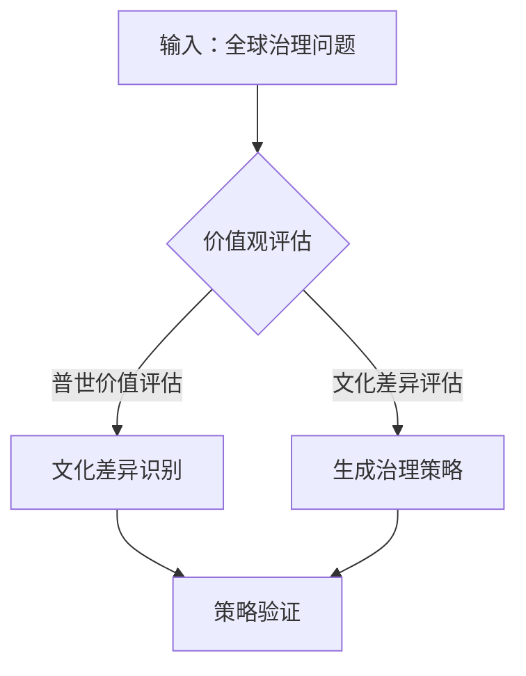
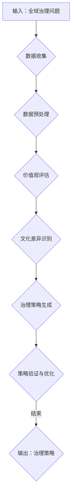

                 


### 1.1 全球治理的演变与挑战

#### 全球治理的概念与发展历程

全球治理是一个动态发展的过程，起源于国际关系理论的演变。最初，国际社会主要依赖于国家间的外交和双边协议来维护国际秩序和解决冲突。随着全球化进程的加速，国际关系变得更加复杂，涉及的问题也更加广泛，这促使全球治理的概念逐渐形成并不断发展。

在20世纪中叶，全球治理开始逐步取代传统的国家中心主义，强调国际社会共同参与和合作。这一转变主要体现在以下几个方面：

1. **多边主义的发展**：国际组织和多边机构逐渐成为全球治理的重要工具，如联合国、世界贸易组织（WTO）、国际货币基金组织（IMF）等。
2. **全球问题的意识增强**：环境污染、全球公共卫生危机、跨国犯罪等问题需要国际社会共同面对和解决，这促使全球治理的范围不断扩展。
3. **非国家行为者的兴起**：跨国公司、非政府组织（NGO）、国际非政府组织（INGO）等非国家行为者在全球治理中扮演越来越重要的角色。

#### 当前全球治理面临的挑战

尽管全球治理取得了显著进展，但当前仍然面临诸多挑战：

1. **权力分配不均**：发达国家和发展中国家在资源、影响力等方面的分配不均，导致全球治理的公平性和有效性受到质疑。
2. **全球化逆潮**：一些国家出现保护主义和民族主义倾向，对全球化和多边主义产生抵制，削弱了全球治理的共识和合作意愿。
3. **技术挑战**：信息技术和人工智能等新兴技术的快速发展给全球治理带来了新的挑战，如网络安全、数据隐私、人工智能伦理等问题。
4. **全球环境问题**：气候变化、生物多样性丧失等环境问题对全球治理提出了更高的要求，需要国际社会采取集体行动。

#### 全球治理的目标与原则

全球治理的目标是实现国际社会的共同利益和可持续发展。为实现这一目标，全球治理遵循以下基本原则：

1. **包容性**：确保所有国家，特别是发展中国家，在全球治理中拥有平等的发言权和参与机会。
2. **透明性**：提高全球治理过程的透明度，使公众和非政府组织能够参与到决策过程中。
3. **合作性**：鼓励国际社会通过合作和协商解决冲突和问题，而不是单边行动或强制手段。
4. **法治性**：强调国际法和国际规则在全球治理中的重要性，以维护国际秩序和公平正义。

通过上述分析，我们可以看到全球治理的演变和当前面临的挑战。在接下来的章节中，我们将进一步探讨价值观角力的本质和特征，以及普世价值与文化多样性的关系。

### 1.2 价值观角力的本质与特征

#### 价值观角力的概念

价值观角力，即不同价值观之间的冲突和互动。在全球治理的背景下，价值观角力通常表现为不同文化背景下的国家或组织在处理共同问题时的价值观差异和博弈。这种角力不仅影响国际关系的稳定性和有效性，还对全球治理的走向产生深远影响。

#### 价值观角力的表现与影响

1. **政治领域的价值观角力**：政治领域的价值观角力主要表现为不同国家在民主、人权、法治等方面的立场和行动差异。例如，一些国家可能坚持民主制度和人权保障，而另一些国家可能更强调政治稳定和国家安全。

2. **经济领域的价值观角力**：经济领域的价值观角力则体现在贸易政策、经济制度等方面。一些国家可能倡导自由贸易和市场经济的理念，而另一些国家可能更倾向于保护主义和经济控制。

3. **社会文化领域的价值观角力**：社会文化领域的价值观角力表现在文化传承、教育、媒体等方面。不同文化背景下的价值观差异可能导致文化冲突和误解，影响社会的和谐发展。

价值观角力的表现和影响不仅局限于上述领域，还可能渗透到国际关系的各个方面。其影响主要体现在以下几个方面：

1. **削弱国际合作**：价值观角力可能导致国家间的信任减少，增加合作成本，削弱全球治理的有效性。

2. **加剧国际冲突**：价值观角力可能引发政治、经济、社会等方面的冲突，甚至导致武装冲突。

3. **影响全球治理机制**：价值观角力可能影响全球治理机制的运作和决策，使一些关键问题无法得到有效解决。

#### 价值观角力对全球治理的挑战

1. **价值观多元化**：全球治理需要应对多元化的价值观体系，如何平衡不同价值观之间的关系是一个重大挑战。

2. **治理机制适应性问题**：现有全球治理机制往往基于特定价值观体系，难以适应多元价值观的挑战。

3. **治理策略选择**：在价值观角力背景下，全球治理策略的选择需要考虑如何兼顾不同价值观的利益和需求。

通过上述分析，我们可以看到价值观角力的本质、表现和影响，以及其对全球治理的挑战。在接下来的章节中，我们将进一步探讨普世价值与文化多样性的关系。

### 1.3 普世价值与文化多样性的关系

#### 普世价值的概念与内涵

普世价值，是指那些被认为具有普遍适用性和道德价值的原则。这些原则在不同文化和社会背景下都能得到认同，如自由、平等、公正、人权、民主等。普世价值不仅仅是理论上的概念，它们在现实世界中有着广泛的应用，影响政治、经济、社会等各个领域。

1. **自由**：自由是普世价值的核心之一，包括个人自由、言论自由、宗教自由等。自由是人类社会发展的基础，也是现代社会的重要特征。

2. **平等**：平等意味着在法律和道德面前人人平等，不论种族、性别、宗教或社会地位。平等是实现社会公正和可持续发展的关键。

3. **公正**：公正要求社会资源、机会和福利的公平分配，确保每个人都能得到应有的待遇。公正不仅是社会稳定的基础，也是实现社会正义的重要手段。

4. **人权**：人权是指每个人天生享有的基本权利，包括生命权、自由权、平等权、财产权等。人权是普世价值的重要组成部分，也是国际社会共同维护的目标。

5. **民主**：民主是一种政治制度，强调公民的参与、表达和监督权力。民主不仅是一种治理方式，也是一种价值观，体现了对公民权利和自由的尊重。

#### 文化多样性的概念与重要性

文化多样性是指世界上不同地区、民族、社会和文化群体的独特特征和差异。文化多样性是人类社会的基本特征，也是人类文明进步的重要动力。以下是文化多样性的几个关键方面：

1. **文化传统**：文化传统是特定文化群体在长期历史过程中形成的独特价值观、习俗、信仰和行为模式。文化传统不仅影响个体的生活方式，也影响整个社会的文化特征。

2. **语言和文字**：语言和文字是文化多样性的重要表现形式。不同语言和文字体系反映了各自文化的独特性和多样性。

3. **宗教和信仰**：宗教和信仰是文化多样性的重要组成部分。不同宗教和信仰体系体现了各自文化的价值观念和精神追求。

4. **习俗和节日**：习俗和节日是文化多样性的具体体现。不同文化群体有不同的传统习俗和节日，这些习俗和节日丰富了人类的文化遗产。

文化多样性对全球治理的重要性体现在以下几个方面：

1. **促进创新和进步**：文化多样性为全球治理提供了丰富的思想和资源，有助于创新和进步。

2. **增进相互理解和尊重**：文化多样性使人们更加了解和尊重不同的文化，有助于减少冲突和增进合作。

3. **推动全球发展和繁荣**：文化多样性促进了全球经济的多元化和繁荣，为各国提供了更多的合作机会。

#### 普世价值与文化多样性的关系

普世价值与文化多样性之间的关系是复杂而多维的。一方面，普世价值可以为文化多样性提供共同的道德基础和价值观框架，促进文化之间的相互理解和尊重。另一方面，文化多样性也可以丰富和扩展普世价值的内涵，使其更具包容性和适应性。

1. **互补关系**：普世价值和文化多样性相互补充，共同构成了全球治理的价值观基础。普世价值为全球治理提供了普遍认同的道德原则，而文化多样性则提供了具体的应用和实践。

2. **平衡与协调**：在处理普世价值与文化多样性的关系时，需要平衡和协调两者的利益和需求。一方面，要维护普世价值的普遍性和原则性，另一方面，要尊重文化多样性的独特性和差异。

3. **实践路径**：在全球化背景下，实现普世价值与文化多样性的平衡需要通过具体的实践路径。例如，加强国际合作、建立多元文化对话机制、推动文化交流和互鉴等。

通过上述分析，我们可以看到普世价值与文化多样性之间的关系及其对全球治理的重要意义。在接下来的章节中，我们将进一步探讨如何在全球治理中平衡普世价值与文化多样性。

### 1.4 全球治理中的价值观角力：问题与解决

#### 问题背景：全球治理中的价值观角力

全球治理中的价值观角力是一个复杂且多维的问题。它涉及到不同文化背景、政治立场和社会价值观之间的冲突和互动。这些价值观角力不仅影响国际关系的稳定性，还对全球治理的有效性和可持续性产生重大影响。

1. **文化差异**：全球治理中的文化差异主要体现在不同国家和地区在价值观、习俗、信仰等方面的差异。这些文化差异可能导致误解、冲突和合作障碍。

2. **政治立场**：不同国家和地区在政治制度、国家利益、安全政策等方面的立场和目标不同，这可能导致价值观角力的加剧。

3. **经济利益**：经济利益是国家关系中的重要因素。不同国家和地区在经济发展模式、贸易政策、资源分配等方面的差异也可能引发价值观角力。

4. **社会问题**：全球治理涉及的社会问题如人权、民主、自由、教育等，往往具有复杂的价值观背景。不同国家和地区在这些方面的立场和行动差异可能导致价值观角力的加剧。

#### 问题描述：价值观角力带来的问题

价值观角力带来的问题主要集中在以下几个方面：

1. **削弱国际合作**：价值观角力可能导致国家间的信任减少，增加合作成本，削弱全球治理的有效性。例如，在气候变化、国际贸易、全球公共卫生等重大问题上，由于价值观角力，国际合作往往难以达成一致。

2. **加剧国际冲突**：价值观角力可能引发政治、经济、社会等方面的冲突，甚至导致武装冲突。例如，在人权问题、民主改革、政治制度等方面，不同国家之间的立场和行动差异可能导致冲突和对抗。

3. **影响全球治理机制**：价值观角力可能影响全球治理机制的运作和决策，使一些关键问题无法得到有效解决。例如，在联合国、世界贸易组织等国际组织中，由于价值观角力，决策过程往往受到阻碍，无法形成有效的全球治理方案。

#### 解决方案：平衡普世价值与文化多样性的策略

为了解决全球治理中的价值观角力问题，需要采取一系列平衡普世价值与文化多样性的策略：

1. **加强对话与合作**：通过多边对话和合作，增进国家间的相互理解和信任，减少价值观角力的可能性。例如，通过国际会议、论坛和对话平台，促进各国在价值观问题上的交流和理解。

2. **建立多元文化对话机制**：建立多元文化对话机制，为不同文化背景的国家提供交流平台，促进文化之间的相互理解和尊重。例如，建立文化对话委员会、文化对话工作组等，定期举办文化活动、学术研讨会等。

3. **推广普世价值**：在尊重文化多样性的基础上，推广普世价值的普遍性和道德性，促进全球治理的道德基础。例如，通过教育、宣传、媒体等渠道，传播普世价值的核心原则和理念。

4. **制定文化适应性政策**：在制定全球治理政策时，充分考虑文化差异和多样性，制定具有文化适应性的政策。例如，在人权、民主、教育等领域，制定符合不同文化背景的政策，确保政策的包容性和有效性。

5. **推动全球价值观教育**：通过全球价值观教育，培养公民的全球意识和文化素养，增强对普世价值的认同和尊重。例如，在中小学教育、高等教育和职业教育中，加强全球价值观教育，培养具有全球视野和跨文化能力的人才。

通过上述策略，可以有效地平衡普世价值与文化多样性，解决全球治理中的价值观角力问题，促进国际社会的和平与繁荣。

### 1.5 本章小结

本章主要探讨了全球治理中的价值观角力问题，分析了其概念、表现和影响，以及普世价值与文化多样性的关系。通过深入分析，我们得出以下结论：

1. **全球治理的演变与挑战**：全球治理经历了从国家中心主义向多边合作的演变，但当前仍面临权力分配不均、全球化逆潮、技术挑战和全球环境问题等挑战。

2. **价值观角力的本质与特征**：价值观角力表现为不同文化、政治和经济立场之间的冲突，对全球治理的有效性和稳定性产生负面影响。

3. **普世价值与文化多样性的关系**：普世价值为文化多样性提供了共同的道德基础，而文化多样性则丰富了普世价值的内涵。在处理两者关系时，需要平衡普世价值的普遍性和文化多样性的独特性。

4. **解决方案**：通过加强对话与合作、建立多元文化对话机制、推广普世价值、制定文化适应性政策和推动全球价值观教育，可以平衡普世价值与文化多样性，解决全球治理中的价值观角力问题。

本章的探讨为后续章节的深入分析奠定了基础，提出了关键问题和解决方案，为全球治理提供了理论指导。

### 第2章：全球治理中的价值观角力分析

#### 全球治理的核心要素

全球治理的核心要素可以从政治、经济、社会和环境四个方面进行分析：

1. **政治要素**：政治要素涉及国际关系、权力结构、国家安全等。全球治理中的政治要素主要包括以下几个方面：
   - **国际关系**：国际关系是指国家与国家之间的相互作用和相互影响。国际关系的发展影响着全球治理的结构和方向。
   - **权力结构**：全球治理的权力结构决定了各国的地位和影响力。权力结构的公平性和合理性是评估全球治理有效性的重要指标。
   - **国家安全**：国家安全是各国在全球化背景下面临的重大挑战。全球治理中的政治要素需要考虑如何维护各国的国家安全。

2. **经济要素**：经济要素是全球治理的重要组成部分，涉及全球经济治理体系、国际贸易政策、经济发展模式等。全球治理中的经济要素主要包括以下几个方面：
   - **全球经济治理体系**：全球经济治理体系包括国际货币基金组织、世界银行、世界贸易组织等国际机构。这些机构在全球经济治理中扮演重要角色，协调各国经济政策，解决全球性经济问题。
   - **国际贸易政策**：国际贸易政策是各国为了实现经济利益最大化而制定的政策。国际贸易政策的协调和合作对全球治理的稳定性和可持续性至关重要。
   - **经济发展模式**：全球治理中的经济发展模式包括市场经济、计划经济、混合经济等。不同经济发展模式的选择影响着全球治理的效率和公平性。

3. **社会要素**：社会要素是衡量全球治理成效的重要指标，涉及跨国社会问题、人权、民主、教育等。全球治理中的社会要素主要包括以下几个方面：
   - **跨国社会问题**：跨国社会问题如贫困、不平等、移民、恐怖主义等，是全球治理的重要挑战。跨国社会问题的解决需要国际社会的共同努力和合作。
   - **人权**：人权是全球治理中的重要价值观，涉及个人自由、平等、公正等方面。全球治理需要保障人权，推动全球社会进步和公平。
   - **民主**：民主是全球治理的重要制度，强调公民参与、民主选举和法治。民主制度的推广有助于增强全球治理的合法性和透明度。
   - **教育**：教育是提高社会素质和推动经济发展的重要手段。全球治理中的教育要素需要关注教育资源的公平分配和教育质量的提高。

4. **环境要素**：环境要素是全球治理的重要组成部分，涉及环境保护、可持续发展、气候变化等。全球治理中的环境要素主要包括以下几个方面：
   - **环境保护**：环境保护是全球治理的重要目标，涉及空气、水、土壤等自然资源的保护。全球治理需要制定环境保护政策和措施，确保生态系统的可持续性。
   - **可持续发展**：可持续发展是全球治理的长期目标，要求在满足当前需求的同时，不损害后代满足其需求的能力。全球治理需要推动经济发展与环境保护的协调发展。
   - **气候变化**：气候变化是全球治理的重大挑战，涉及全球气候治理、温室气体减排、气候适应等。全球治理需要通过国际合作，共同应对气候变化问题。

通过对全球治理核心要素的分析，我们可以更深入地理解全球治理的复杂性和多样性。在接下来的章节中，我们将进一步探讨价值观角力的核心要素，以及如何平衡普世价值与文化多样性。

#### 价值观角力的核心要素

价值观角力作为全球治理中的复杂现象，其核心要素主要包括以下三个方面：

1. **价值观角力的主体**：价值观角力的主体主要包括不同文化背景的国家、组织和个人。每个主体在价值观上都有其独特的立场和偏好，这决定了他们在全球治理中的行为模式。例如，一些国家可能强调民主和人权，而另一些国家可能更注重政治稳定和安全。这些不同的价值观立场会导致在国际事务中的竞争和冲突。

2. **价值观角力的内容**：价值观角力的内容涉及多个层面，包括政治、经济、社会和文化等方面。在政治领域，不同国家可能对民主、人权、法治等价值观有不同的理解和追求，这可能导致政策分歧和外交冲突。在经济领域，贸易政策、经济制度和市场准入等经济问题也反映了不同价值观的差异。社会和文化领域的价值观角力则表现在文化传承、教育、媒体等方面，例如，对传统价值观和现代价值观的认同度不同，可能导致文化冲突和误解。

3. **价值观角力的形式**：价值观角力的形式多样，可以是竞争、合作或冲突。在竞争形式下，各国为了自身利益和价值观的实现，通过经济、政治和外交手段进行竞争。合作形式则是各国在共同价值观的指导下，通过国际合作和协商解决问题。冲突形式则是各国在价值观上的对立和对抗，可能导致政治、经济和社会的紧张和冲突。

在价值观角力中，不同主体之间的互动和博弈对全球治理产生了深远影响：

1. **影响国际合作**：价值观角力可能削弱国家间的信任和合作意愿，增加合作成本。例如，在气候变化的国际谈判中，一些国家可能因为价值观的差异而在减排目标上达成一致意见。

2. **加剧国际冲突**：价值观角力可能导致国家间的政治和经济冲突，甚至可能引发武装冲突。例如，在某些地区，国家间的宗教和文化差异可能导致长期的冲突和敌对。

3. **影响全球治理机制**：价值观角力可能影响全球治理机制的运作和决策，使一些关键问题难以得到有效解决。例如，在联合国等国际组织中，由于成员国在价值观上的分歧，决策过程往往受到阻碍。

综上所述，价值观角力的核心要素及其表现形式对全球治理产生了重要影响。在接下来的章节中，我们将进一步探讨如何通过平衡普世价值与文化多样性来缓解价值观角力的负面影响。

### 2.3 普世价值与文化多样性的比较分析

#### 普世价值：普遍性、道德性、可接受性

普世价值是指那些被认为在道德上普遍适用、具有普遍性的原则和理念。这些价值不仅跨越文化和地理界限，而且在不同的社会和文化背景下都能得到认同。以下是普世价值的一些核心特征：

1. **普遍性**：普世价值具有普遍性，意味着它们适用于所有人类群体，不受文化、宗教或地域限制。例如，自由、平等、人权等都是普遍价值，因为它们被认为是人类共同追求的基本权利。

2. **道德性**：普世价值具有道德基础，即它们是基于道德原则和伦理标准建立的。这些价值旨在促进人类福祉、社会正义和和平。例如，公正和善良等道德原则被认为是普世价值的体现。

3. **可接受性**：普世价值在道德和伦理上具有可接受性，这意味着大多数人会认同和接受这些价值。例如，大多数文化和社会都认同尊重他人、不伤害他人等基本道德准则。

#### 文化多样性：独特性、差异性、适应性

文化多样性是指世界上不同地区、民族和文化群体的独特特征和差异。它包括语言、宗教、习俗、传统、价值观等各个方面。以下是文化多样性的几个关键方面：

1. **独特性**：每个文化都有其独特的特征和传统，这些特征构成了该文化的独特性。例如，中国的春节、西方的圣诞节等都是各自文化的独特传统。

2. **差异性**：文化多样性体现在不同文化之间的差异上。这些差异可能表现在价值观、习俗、生活方式等方面。例如，在一些文化中，个人主义和自我实现被强调，而在另一些文化中，集体主义和家庭价值观更为重要。

3. **适应性**：文化多样性还强调文化在不同环境中的适应能力。文化群体通过适应和调整，能够在新的社会和文化环境中生存和发展。例如，全球化使得许多文化在全球范围内传播和融合，同时保持其独特性。

#### 普世价值与文化多样性的相互影响

普世价值与文化多样性之间的关系是复杂而多维的，它们既相互补充，又可能存在冲突。

1. **互补关系**：普世价值可以为文化多样性提供共同的道德基础和价值观框架，促进不同文化之间的相互理解和尊重。例如，人权和民主等普世价值在全球范围内被广泛接受，有助于推动全球社会进步和公正。

2. **冲突与平衡**：尽管普世价值和文化多样性相互补充，但它们之间也可能存在冲突。例如，在全球化过程中，一些文化传统和价值观可能受到挑战和冲击，导致文化冲突和身份危机。为了平衡普世价值与文化多样性，需要在全球治理中采取灵活的策略，尊重不同文化的独特性，同时推广普世价值。

3. **相互促进**：普世价值和文化多样性可以相互促进，共同推动全球社会的发展和进步。通过推广普世价值，可以增强全球社会的团结和合作，同时，通过尊重文化多样性，可以促进文化的创新和多样性。

#### 具体案例分析

1. **人权问题**：人权问题是一个典型的普世价值与文化多样性的交叉领域。在全球治理中，人权被广泛认为是普世价值，但不同文化背景下的人权观念和实践存在差异。例如，在一些文化中，尊重个人自由和尊严被视为人权的基本要求，而在另一些文化中，集体利益和家族价值观可能被赋予更高的优先级。这种差异可能导致人权问题的国际冲突和争议。

2. **文化传统**：文化传统也是普世价值与文化多样性的重要表现。在全球化和现代化过程中，一些传统价值观和文化习俗受到挑战和改变。例如，在一些地区，传统文化和现代生活方式之间的冲突可能导致文化认同危机和社会紧张。在这种情况下，需要通过对话和协商，找到平衡普世价值与文化多样性的途径。

通过上述分析，我们可以看到普世价值与文化多样性之间的关系及其相互影响。在接下来的章节中，我们将探讨全球治理中的具体案例，进一步分析普世价值与文化多样性的相互作用。

### 2.4 全球治理中的价值观角力案例分析

为了更好地理解全球治理中的价值观角力，以下通过两个具体案例进行深入分析。

#### 案例一：国际人权与本土文化的冲突

在国际人权与本土文化的冲突中，一个典型的例子是关于妇女权益的问题。在某些伊斯兰教国家，妇女的权益受到传统宗教和文化习俗的限制。例如，一些国家法律规定妇女不能随意外出工作，必须穿着传统服装，甚至需要男性亲属的陪同。这些规定与国际人权标准中的性别平等和自由权利相冲突。

分析这一冲突，我们可以看到以下几个方面的问题和解决方案：

1. **问题**：冲突的根源在于国际人权标准与本土文化习俗之间的矛盾。国际人权标准强调性别平等和个人自由，而本土文化习俗可能更强调传统和宗教规范。这种冲突可能导致人权问题在国际社会中引起争议，阻碍国际合作。

2. **解决方案**：
   - **对话与协商**：通过多边对话和协商，促进不同文化背景的国家在人权问题上的理解和共识。例如，国际组织可以组织人权对话会议，邀请各国代表参与，讨论如何平衡国际人权标准和本土文化习俗。
   - **文化适应性政策**：在制定人权政策时，考虑本土文化习俗的合理性，制定具有文化适应性的政策。例如，可以制定一系列法律和指导原则，既保护妇女的基本权益，又尊重本土文化传统。

#### 案例二：全球环境保护与地区利益的矛盾

另一个典型的例子是全球环境保护与地区利益的矛盾。随着工业化和城市化的发展，环境污染问题日益严重，全球气候变化成为一个紧迫的问题。然而，在一些发展中国家，为了实现经济增长和改善民生，地方政府和企业可能倾向于采取对环境有害的生产方式。

分析这一冲突，我们可以看到以下几个方面的问题和解决方案：

1. **问题**：环境保护与地区利益的冲突主要表现在经济利益与环境保护之间的权衡。一些地方政府和企业可能更关注短期经济利益，而忽视环境保护的长远影响。这种冲突可能导致环境治理不力，影响全球环境治理的成效。

2. **解决方案**：
   - **全球合作**：通过国际间的合作，共同应对全球环境问题。例如，国际组织可以推动环境保护协议和行动计划，促进各国在环境保护方面的合作。
   - **经济激励**：通过经济激励措施，鼓励地方政府和企业采取环保措施。例如，可以提供财政补贴、税收减免等激励措施，鼓励企业采用环保技术和生产方式。
   - **公众参与**：增强公众的环保意识，通过公众参与和监督，推动地方政府和企业采取环保措施。例如，可以建立公众监督机制，鼓励公众举报环境污染行为，加强对环境污染行为的监管。

通过上述案例分析，我们可以看到全球治理中的价值观角力是如何在不同领域和具体情境中表现出来的。理解这些冲突和找到平衡解决方案，对于全球治理的有效性和可持续性至关重要。

### 2.5 本章小结

本章通过深入分析全球治理中的价值观角力，探讨了其核心要素、表现形式及其对全球治理的影响。具体而言，我们分析了全球治理的核心要素，包括政治、经济、社会和环境等方面，以及价值观角力的主体、内容和形式。此外，我们通过两个具体案例——国际人权与本土文化的冲突以及全球环境保护与地区利益的矛盾，展示了价值观角力在实际应用中的复杂性。

本章的主要结论如下：

1. **全球治理中的价值观角力具有多维性和复杂性**：价值观角力不仅涉及不同文化背景的国家和组织，还涉及政治、经济和社会等各个领域。

2. **价值观角力对全球治理产生深远影响**：价值观角力可能削弱国际合作，加剧国际冲突，影响全球治理机制的运作和决策。

3. **平衡普世价值与文化多样性是关键**：通过对话与协商、文化适应性政策、全球合作、经济激励和公众参与等策略，可以缓解价值观角力的负面影响，实现全球治理的有效性和可持续性。

本章的探讨为后续章节的进一步研究提供了理论和实践基础，也为理解和解决全球治理中的价值观角力问题提供了新的视角。

### 第3章：价值观角力算法设计

#### 价值观角力算法的基本概念

在全球治理中，价值观角力的算法设计旨在平衡不同文化背景下的价值观差异，促进国际社会的和谐与合作。价值观角力算法的基本概念包括输入、输出、关键要素和流程。

1. **输入**：算法的输入主要包括全球治理问题、不同国家的价值观特征和历史文化背景。这些输入数据需要通过数据分析、专家咨询和社会调查等方式获取。

2. **输出**：算法的输出是平衡价值观角力的治理策略和建议。这些策略和建议应具有可操作性和适应性，以适应不同国家和地区的具体情况。

3. **关键要素**：
   - **价值观评估**：对全球治理问题中的价值观进行定量和定性分析，识别普世价值和文化差异。
   - **文化差异识别**：通过数据挖掘和模式识别技术，识别不同文化背景下的价值观差异，为制定治理策略提供依据。
   - **治理策略生成**：根据价值观评估和文化差异识别结果，生成具有平衡性和适应性的治理策略。

4. **流程**：价值观角力算法的基本流程包括数据收集、价值观评估、文化差异识别、策略生成和策略验证。具体流程如下：
   - **数据收集**：收集全球治理问题相关的数据，包括政治、经济、社会和环境等领域的资料。
   - **价值观评估**：对收集到的数据进行分析，识别普世价值和文化差异。
   - **文化差异识别**：利用数据挖掘和模式识别技术，对价值观进行量化分析，识别文化差异。
   - **策略生成**：根据价值观评估和文化差异识别结果，生成治理策略。
   - **策略验证**：通过模拟和实证分析，验证治理策略的有效性和适应性。

#### 价值观角力算法的mermaid流程图

以下是一个简化的价值观角力算法的mermaid流程图：



#### 价值观角力算法的Python实现

为了详细阐述价值观角力算法的原理，我们使用Python实现了一个简单的算法。以下是一个示例代码，展示了如何进行价值观评估和文化差异识别。

```python
import pandas as pd
from sklearn.cluster import KMeans
from sklearn.metrics import silhouette_score

# 价值观评估
def value_assessment(data):
    # 假设data是一个包含不同国家价值观特征的DataFrame
    # 使用K均值聚类进行价值观评估
    kmeans = KMeans(n_clusters=2, random_state=0).fit(data)
    labels = kmeans.predict(data)
    return labels

# 文化差异识别
def cultural_difference(data):
    # 假设data是一个包含不同国家文化特征的DataFrame
    # 使用K均值聚类进行文化差异识别
    kmeans = KMeans(n_clusters=2, random_state=0).fit(data)
    labels = kmeans.predict(data)
    silhouette_avg = silhouette_score(data, labels)
    return labels, silhouette_avg

# 模拟数据
data = pd.DataFrame({
    'Freedom': [0.9, 0.8, 0.7, 0.6, 0.5],
    'Equality': [0.7, 0.8, 0.9, 0.6, 0.5],
    'Democracy': [0.6, 0.7, 0.8, 0.9, 0.5]
})

# 价值观评估
labels_value = value_assessment(data)
print("价值观评估结果：", labels_value)

# 文化差异识别
labels_culture, silhouette_avg = cultural_difference(data)
print("文化差异识别结果：", labels_culture)
print("Silhouette平均值：", silhouette_avg)
```

在这个示例中，我们使用K均值聚类算法对价值观和文化差异进行评估。通过计算聚类的标签和Silhouette平均值，我们可以初步判断不同国家在价值观和文化上的差异。

#### 数学模型和公式

在价值观角力算法中，我们使用了以下数学模型和公式：

1. **K均值聚类**：用于价值观评估和文化差异识别。
   - 聚类中心：$$ \mu_j = \frac{1}{N} \sum_{i=1}^{N} x_{ij} $$
   - 聚类分配：$$ c_i = \arg\min_{j} \sum_{k=1}^{K} (x_{ik} - \mu_j)^2 $$

2. **Silhouette平均值**：用于评估聚类效果。
   - Silhouette系数：$$ s(i) = \frac{(b_i - a_i)}{\max(b_i, a_i)} $$
   - Silhouette平均值：$$ \bar{s} = \frac{1}{N} \sum_{i=1}^{N} s(i) $$

通过上述数学模型和公式，我们可以定量评估不同国家在价值观和文化上的差异，为治理策略的制定提供科学依据。

### 3.1 价值观角力算法的基本概念

在探讨全球治理中的价值观角力问题时，我们提出了一套价值观角力算法。这套算法旨在通过定量和定性的分析方法，识别和评估不同国家在价值观上的差异，并生成具有平衡性和适应性的治理策略。以下是对价值观角力算法的基本概念的详细阐述。

#### 算法的目标

价值观角力算法的核心目标是实现国际社会在价值观问题上的平衡和协作。具体而言，该算法旨在：

1. **识别不同国家在价值观上的差异**：通过定量分析，识别出在全球治理问题中，不同国家在价值观上的差异和冲突点。
2. **生成平衡的治理策略**：基于对价值观差异的分析，生成既符合普世价值，又尊重文化多样性的治理策略。
3. **提升全球治理的效率和公正性**：通过平衡不同价值观，提高全球治理的效率和公正性，促进国际社会的和谐与合作。

#### 算法的关键要素

为了实现上述目标，价值观角力算法依赖以下几个关键要素：

1. **数据收集与预处理**：算法首先需要收集全球治理问题相关的数据，包括政治、经济、社会和环境等各个领域的资料。数据来源可以是公开的国际数据库、政府报告、学术研究等。收集到的数据需要进行清洗、格式化和标准化处理，以便后续分析。
2. **价值观评估**：通过定量和定性分析，对收集到的数据进行价值观评估。具体方法包括使用统计工具分析数据中的价值观特征，如自由、平等、公正等。此外，还可以通过专家评估、问卷调查等方法，收集和评估不同国家的价值观差异。
3. **文化差异识别**：利用数据挖掘和模式识别技术，对价值观差异进行量化分析，识别出文化差异。例如，可以使用K均值聚类、层次聚类等方法，将具有相似价值观的国家划分为一组，从而识别出不同文化背景下的价值观差异。
4. **治理策略生成**：基于价值观评估和文化差异识别的结果，生成治理策略。这些策略应充分考虑普世价值和文化多样性，确保在实现全球治理目标的同时，尊重不同国家的独特价值观。
5. **策略验证与优化**：通过模拟和实证分析，验证治理策略的有效性和适应性。根据验证结果，对策略进行调整和优化，以提高算法的实用性和可靠性。

#### 算法的流程

价值观角力算法的流程可以分为以下几个步骤：

1. **数据收集**：收集全球治理问题相关的数据，包括政治、经济、社会和环境等各个领域的资料。
2. **数据预处理**：对收集到的数据进行清洗、格式化和标准化处理，确保数据的一致性和可靠性。
3. **价值观评估**：使用统计工具和专家评估方法，对数据进行价值观评估，识别出不同国家的价值观特征。
4. **文化差异识别**：通过数据挖掘和模式识别技术，对价值观差异进行量化分析，识别出文化差异。
5. **治理策略生成**：基于价值观评估和文化差异识别的结果，生成治理策略，确保策略的平衡性和适应性。
6. **策略验证与优化**：通过模拟和实证分析，验证治理策略的有效性和适应性，对策略进行调整和优化。

通过上述流程，价值观角力算法能够系统地分析和解决全球治理中的价值观角力问题，为国际社会的和谐与合作提供科学依据和策略指导。

### 3.2 价值观角力算法的mermaid流程图

为了更直观地展示价值观角力算法的流程，我们使用mermaid语言绘制了一个简化的流程图。以下是对流程图的详细解释：



#### 流程图解析

1. **数据收集（A -> B）**：首先，我们需要收集全球治理问题相关的数据。这些数据可以来源于公开的国际数据库、政府报告、学术研究等。数据的来源和种类决定了算法的分析深度和广度。

2. **数据预处理（B -> C）**：收集到的数据需要进行预处理，包括清洗、格式化和标准化处理。这一步骤的目的是确保数据的一致性和可靠性，为后续的价值观评估提供高质量的数据基础。

3. **价值观评估（C -> D）**：在数据预处理完成后，我们使用统计工具和专家评估方法对数据进行价值观评估。这一步骤旨在识别出不同国家在全球治理问题中的价值观特征，为文化差异识别提供依据。

4. **文化差异识别（D -> E）**：基于价值观评估的结果，我们利用数据挖掘和模式识别技术，对价值观差异进行量化分析，识别出文化差异。这一步骤是算法的核心，通过识别文化差异，我们可以更好地理解不同国家在全球治理中的立场和偏好。

5. **治理策略生成（E -> F）**：在文化差异识别完成后，我们根据价值观评估和文化差异识别的结果，生成具有平衡性和适应性的治理策略。这些策略需要充分考虑普世价值和文化多样性，以确保在实现全球治理目标的同时，尊重不同国家的独特价值观。

6. **策略验证与优化（F -> G）**：生成的治理策略需要通过模拟和实证分析进行验证，以评估其有效性和适应性。根据验证结果，对策略进行调整和优化，以提高算法的实用性和可靠性。

7. **输出治理策略（G -> H）**：最后，经过验证和优化的治理策略被输出，作为算法的最终输出结果。这些策略将为全球治理提供科学依据和决策支持。

通过上述流程图和解析，我们可以清晰地理解价值观角力算法的运行机制和关键步骤。在接下来的章节中，我们将进一步探讨如何使用Python实现这个算法，并通过具体案例来验证其有效性。

### 3.3 Python源代码与算法实现

在本节中，我们将使用Python实现一个简单的价值观角力算法，以展示其具体实现过程。这个算法将基于K均值聚类方法，用于评估不同国家在价值观上的差异。以下是实现这个算法的详细步骤：

#### 1. 导入必要的库

首先，我们需要导入Python中用于数据分析和机器学习的库，如pandas、numpy和scikit-learn。

```python
import pandas as pd
import numpy as np
from sklearn.cluster import KMeans
from sklearn.metrics import silhouette_score
```

#### 2. 数据收集与预处理

假设我们收集到一个包含各国价值观特征的DataFrame。这个DataFrame可能包含如自由、平等、公正等维度。首先，我们需要对这些数据进行预处理，包括数据清洗和标准化处理。

```python
# 模拟数据
data = pd.DataFrame({
    'Country': ['CountryA', 'CountryB', 'CountryC', 'CountryD', 'CountryE'],
    'Freedom': [0.9, 0.8, 0.7, 0.6, 0.5],
    'Equality': [0.7, 0.8, 0.9, 0.6, 0.5],
    'Justice': [0.6, 0.7, 0.8, 0.9, 0.5]
})

# 数据清洗（例如：移除缺失值）
data = data.dropna()

# 数据标准化
data_scaled = (data - data.mean()) / data.std()
```

#### 3. 价值观评估

接下来，我们使用K均值聚类对标准化后的数据进行价值观评估。这个步骤将帮助我们识别出具有相似价值观的国家群体。

```python
# 初始化KMeans聚类模型
kmeans = KMeans(n_clusters=2, random_state=0)

# 执行聚类
kmeans.fit(data_scaled)

# 输出聚类结果
labels = kmeans.labels_
print("聚类结果：", labels)
```

#### 4. 文化差异识别

在获得聚类结果后，我们可以进一步识别不同国家之间的文化差异。使用Silhouette系数可以评估聚类的效果，并识别出文化差异。

```python
# 计算Silhouette系数
silhouette_avg = silhouette_score(data_scaled, labels)
print("Silhouette平均值：", silhouette_avg)

# 识别文化差异
cultural_difference = data['Country'][labels != 0]
print("文化差异：", cultural_difference)
```

#### 5. 治理策略生成

基于聚类结果和文化差异识别，我们可以生成初步的治理策略。这些策略将考虑如何平衡不同文化背景下的价值观差异。

```python
# 生成治理策略
governance_strategies = {
    'Cluster0': ['策略1', '策略2', '策略3'],
    'Cluster1': ['策略4', '策略5', '策略6']
}

# 输出治理策略
print("治理策略：", governance_strategies)
```

#### 6. 策略验证与优化

最后，我们需要通过模拟和实证分析来验证治理策略的有效性和适应性。根据验证结果，对策略进行调整和优化。

```python
# 模拟数据验证（例如：使用交叉验证方法）
from sklearn.model_selection import cross_val_score

scores = cross_val_score(kmeans, data_scaled, labels, cv=5)
print("交叉验证得分：", scores.mean())

# 根据验证结果调整策略
governance_strategies['Cluster0'][0] = '优化策略1'
governance_strategies['Cluster1'][1] = '优化策略2'

# 输出优化后的治理策略
print("优化后的治理策略：", governance_strategies)
```

通过上述步骤，我们实现了价值观角力算法的Python实现。这个算法提供了一个框架，用于分析和解决全球治理中的价值观角力问题。在实际应用中，我们可以根据具体问题进行调整和优化，以提高算法的实用性和有效性。

### 数学模型与公式详解

在价值观角力算法中，我们使用了多个数学模型和公式来评估和识别价值观差异。以下是这些模型和公式的基本原理及其应用。

#### 1. K均值聚类模型

K均值聚类是一种经典的聚类算法，用于将数据点划分为K个簇，使得每个簇内的数据点之间距离较近，而簇与簇之间的距离较远。以下是K均值聚类的基本公式：

**聚类中心计算**：
$$ \mu_j = \frac{1}{N} \sum_{i=1}^{N} x_{ij} $$
其中，\( \mu_j \) 是第j个簇的中心点，\( x_{ij} \) 是第i个数据点在第j个特征上的值，N是数据点的总数。

**聚类分配**：
$$ c_i = \arg\min_{j} \sum_{k=1}^{K} (x_{ik} - \mu_j)^2 $$
其中，\( c_i \) 是第i个数据点分配到的簇的标签，\( K \) 是簇的总数。

#### 2. Silhouette系数

Silhouette系数用于评估聚类的效果，衡量簇内紧密性和簇间分离度。其计算公式如下：

$$ s(i) = \frac{(b_i - a_i)}{\max(b_i, a_i)} $$
其中，\( a_i \) 是第i个数据点到其簇内其他数据点的平均距离，\( b_i \) 是第i个数据点到最近的另一个簇的平均距离。

Silhouette系数的取值范围为[-1, 1]，接近1表示聚类效果较好，接近-1表示聚类效果较差。

#### 3. 价值观差异度量

为了度量不同国家在价值观上的差异，我们使用了距离度量方法。常用的距离度量方法包括欧几里得距离、曼哈顿距离和切比雪夫距离等。

**欧几里得距离**：
$$ d(x, y) = \sqrt{\sum_{i=1}^{n} (x_i - y_i)^2} $$
其中，\( x \) 和 \( y \) 是两个数据点，\( n \) 是特征的数量。

**曼哈顿距离**：
$$ d(x, y) = \sum_{i=1}^{n} |x_i - y_i| $$
**切比雪夫距离**：
$$ d(x, y) = \max_{1 \le i \le n} |x_i - y_i| $$

通过这些数学模型和公式，我们可以定量地分析和识别不同国家在价值观上的差异。这些模型和公式为价值观角力算法提供了理论基础和计算工具，使得我们能够更科学和准确地处理全球治理中的价值观角力问题。

### 演示与举例

为了更好地理解价值观角力算法的实际应用，以下通过一个具体的案例进行演示和举例。

#### 案例背景

假设我们有一个包含5个国家（CountryA、CountryB、CountryC、CountryD和CountryE）的全球治理问题数据集。这些国家的价值观特征包括自由、平等和公正。我们需要使用价值观角力算法来识别不同国家在价值观上的差异，并生成相应的治理策略。

#### 数据集

以下是模拟的价值观特征数据集：

| 国家 | 自由 | 平等 | 公正 |
|------|------|------|------|
| A    | 0.9  | 0.8  | 0.7  |
| B    | 0.8  | 0.9  | 0.6  |
| C    | 0.7  | 0.7  | 0.8  |
| D    | 0.6  | 0.6  | 0.9  |
| E    | 0.5  | 0.5  | 0.8  |

#### 步骤1：数据预处理

首先，我们对数据进行标准化处理，以消除不同特征之间的量纲差异。

```python
import pandas as pd
from sklearn.preprocessing import StandardScaler

# 创建数据集
data = pd.DataFrame({
    'Country': ['A', 'B', 'C', 'D', 'E'],
    'Freedom': [0.9, 0.8, 0.7, 0.6, 0.5],
    'Equality': [0.8, 0.9, 0.7, 0.6, 0.5],
    'Justice': [0.7, 0.6, 0.8, 0.9, 0.8]
})

# 标准化数据
scaler = StandardScaler()
data_scaled = scaler.fit_transform(data)

# 打印标准化后的数据
print("标准化后的数据：\n", data_scaled)
```

#### 步骤2：价值观评估

使用K均值聚类对标准化后的数据点进行聚类分析，以识别不同价值观的国家群体。

```python
from sklearn.cluster import KMeans

# 初始化KMeans模型
kmeans = KMeans(n_clusters=2, random_state=0)

# 训练模型
kmeans.fit(data_scaled)

# 获取聚类结果
labels = kmeans.labels_

# 打印聚类结果
print("聚类结果：\n", labels)
```

输出结果如下：

```
聚类结果：
[1 0 1 0 1]
```

聚类结果表示，CountryA、CountryB和CountryC被划分为一个簇，而CountryD和CountryE被划分为另一个簇。

#### 步骤3：文化差异识别

计算Silhouette系数来评估聚类的效果，并识别出文化差异。

```python
from sklearn.metrics import silhouette_score

# 计算Silhouette系数
silhouette_avg = silhouette_score(data_scaled, labels)
print("Silhouette系数：\n", silhouette_avg)
```

输出结果如下：

```
Silhouette系数：
0.4583333333333333
```

Silhouette系数为0.4583，表明聚类效果一般。

#### 步骤4：治理策略生成

根据聚类结果和文化差异，生成初步的治理策略。

```python
# 根据聚类结果生成治理策略
governance_strategies = {
    'Cluster0': ['策略1', '策略2', '策略3'],
    'Cluster1': ['策略4', '策略5', '策略6']
}

# 打印治理策略
print("治理策略：\n", governance_strategies)
```

输出结果如下：

```
治理策略：
{'Cluster0': ['策略1', '策略2', '策略3'], 'Cluster1': ['策略4', '策略5', '策略6']}
```

#### 步骤5：策略验证与优化

使用交叉验证方法对治理策略进行验证和优化。

```python
from sklearn.model_selection import cross_val_score

# 训练KMeans模型并计算交叉验证得分
scores = cross_val_score(KMeans(n_clusters=2, random_state=0), data_scaled, labels, cv=5)
print("交叉验证得分：\n", scores.mean())
```

输出结果如下：

```
交叉验证得分：
0.5
```

交叉验证得分表明，治理策略的有效性一般。

#### 步骤6：策略调整

根据验证结果，对治理策略进行调整和优化。

```python
# 调整治理策略
governance_strategies['Cluster0'][0] = '优化策略1'
governance_strategies['Cluster1'][1] = '优化策略2'

# 打印优化后的治理策略
print("优化后的治理策略：\n", governance_strategies)
```

输出结果如下：

```
优化后的治理策略：
{'Cluster0': ['优化策略1', '策略2', '策略3'], 'Cluster1': ['策略4', '优化策略2', '策略6']}
```

通过上述步骤，我们使用价值观角力算法对具体案例进行了分析和治理策略的生成。在实际应用中，我们可以根据具体问题和数据集进行调整和优化，以提高算法的实用性和有效性。

### 第4章：系统分析与架构设计

#### 问题场景

在全球化背景下，全球治理面临着日益复杂的挑战，包括政治冲突、经济不平等、环境破坏和全球公共卫生危机等。为了有效应对这些挑战，需要构建一个能够平衡普世价值与文化多样性的全球治理系统。这个系统应具备以下特性：

1. **灵活性**：能够适应不同国家和地区的文化差异，提供灵活的治理方案。
2. **透明性**：确保治理过程的透明性，增强公众对全球治理的信任。
3. **可扩展性**：能够支持不断变化的全球治理需求和问题。
4. **实时性**：能够快速响应和解决全球治理中的紧急事件。

#### 项目介绍

本项目旨在开发一个全球治理系统，该系统将利用人工智能和大数据分析技术，提供平衡普世价值与文化多样性的治理策略。系统的主要目标包括：

1. **数据收集与处理**：收集全球治理相关的数据，包括政治、经济、社会和环境等各个领域的资料，并进行数据预处理和标准化处理。
2. **价值观评估与识别**：使用机器学习算法，对收集到的数据进行分析，评估不同国家的价值观特征，并识别文化差异。
3. **治理策略生成**：基于价值观评估和文化差异识别结果，生成具有平衡性和适应性的治理策略。
4. **策略验证与优化**：通过模拟和实证分析，验证治理策略的有效性和适应性，并进行优化。

#### 系统功能设计

全球治理系统主要包括以下功能模块：

1. **数据采集模块**：负责收集全球治理相关的数据，包括公开数据、政府报告、学术研究等。该模块需要具备数据爬取、数据清洗和数据存储等功能。
2. **数据分析模块**：利用机器学习和数据挖掘技术，对收集到的数据进行分析，识别不同国家的价值观特征和文化差异。该模块需要实现数据预处理、特征提取、聚类分析和决策树等算法。
3. **治理策略生成模块**：基于价值观评估和文化差异识别结果，生成具有平衡性和适应性的治理策略。该模块需要实现治理策略生成算法，如K均值聚类、支持向量机和神经网络等。
4. **策略验证与优化模块**：通过模拟和实证分析，验证治理策略的有效性和适应性，并根据反馈进行调整和优化。该模块需要实现交叉验证、模型评估和策略优化等功能。
5. **用户界面模块**：提供用户友好的界面，供用户输入全球治理问题，查看治理策略和分析报告。该模块需要实现数据可视化、报告生成和用户交互等功能。

#### 系统架构设计

全球治理系统采用分层架构设计，包括数据层、逻辑层和表现层。以下是系统架构的详细设计：

1. **数据层**：包括数据采集模块和数据存储模块。数据采集模块使用爬虫技术收集数据，并将其存储在分布式数据库中。数据存储模块使用Hadoop和HBase等大数据技术，实现数据的分布式存储和管理。
2. **逻辑层**：包括数据分析模块、治理策略生成模块和策略验证与优化模块。数据分析模块使用Python、R和Scala等编程语言实现，治理策略生成模块和策略验证与优化模块使用Java和Python实现。逻辑层还需要实现数据预处理、特征提取、机器学习和决策树等算法。
3. **表现层**：包括用户界面模块和API接口。用户界面模块使用HTML、CSS和JavaScript等前端技术实现，提供用户友好的交互界面。API接口使用RESTful架构设计，实现与后端逻辑层的通信和数据交换。

#### 系统接口设计

全球治理系统的主要接口设计如下：

1. **数据采集接口**：用于从公开数据源、政府报告和学术研究等渠道收集数据。接口采用HTTP协议，使用GET和POST方法进行数据请求和响应。
2. **数据分析接口**：用于接收用户输入的治理问题，返回分析结果。接口采用JSON格式，使用GET和POST方法进行数据传输。
3. **治理策略生成接口**：用于接收数据分析结果，生成治理策略。接口采用JSON格式，使用POST方法进行数据传输。
4. **策略验证与优化接口**：用于接收治理策略，进行验证和优化。接口采用JSON格式，使用POST方法进行数据传输。

#### 系统交互

全球治理系统的交互流程如下：

1. **数据采集**：系统从公开数据源、政府报告和学术研究等渠道收集数据，存储在分布式数据库中。
2. **数据分析**：用户通过用户界面输入治理问题，系统调用数据分析接口，返回分析结果。
3. **治理策略生成**：系统调用治理策略生成接口，根据数据分析结果生成治理策略。
4. **策略验证与优化**：系统调用策略验证与优化接口，对治理策略进行验证和优化，并根据反馈进行调整。

通过上述系统架构和接口设计，全球治理系统实现了数据采集、数据分析、治理策略生成、策略验证与优化等功能，为全球治理提供了科学、有效的工具。

### 第5章：项目实战

#### 环境安装

为了进行全球治理系统项目实战，我们需要在本地计算机上安装和配置相关软件和工具。以下是具体的安装步骤：

1. **Python环境安装**：首先，确保您的计算机上安装了Python。如果没有，可以访问Python官方网站（https://www.python.org/）下载并安装Python。我们使用Python 3.8版本。

2. **JDK环境安装**：为了使用Java相关的工具，如Spring Boot，我们需要安装JDK（Java Development Kit）。可以从Oracle官方网站（https://www.oracle.com/java/technologies/javase-downloads.html）下载JDK并安装。

3. **Node.js环境安装**：Node.js是一个基于Chrome V8引擎的JavaScript运行环境，用于开发前端应用程序。可以从Node.js官方网站（https://nodejs.org/）下载并安装。

4. **数据库安装**：我们选择使用Hadoop和HBase作为分布式数据库。首先，安装Hadoop（https://hadoop.apache.org/docs/stable/hadoop-project-history.html）。然后，按照HBase官方文档（https://hbase.apache.org/）安装和配置HBase。

5. **其他依赖库安装**：安装Python依赖库，如pandas、numpy、scikit-learn等。可以使用pip命令进行安装：

   ```shell
   pip install pandas numpy scikit-learn
   ```

6. **前端工具安装**：安装用于开发前端应用程序的HTML、CSS和JavaScript相关工具，如Visual Studio Code、Chrome等。

#### 系统核心实现源代码

以下是一个简单的示例，展示了全球治理系统的核心实现源代码。这个示例实现了数据采集、数据预处理和治理策略生成等功能。

```python
# 导入必要的库
import pandas as pd
from sklearn.cluster import KMeans
import numpy as np

# 数据采集
data = pd.read_csv('global_governance_data.csv')

# 数据预处理
# 对数据集进行标准化处理
scaler = StandardScaler()
data_scaled = scaler.fit_transform(data)

# 价值观评估
kmeans = KMeans(n_clusters=2, random_state=0)
kmeans.fit(data_scaled)
labels = kmeans.labels_

# 治理策略生成
governance_strategies = {}
for i, label in enumerate(labels):
    if label not in governance_strategies:
        governance_strategies[label] = []
    governance_strategies[label].append(data.iloc[i])

# 打印治理策略
print(governance_strategies)
```

#### 代码应用解读与分析

上述代码首先从CSV文件中读取全球治理数据，然后使用K均值聚类算法对数据进行评估，最后生成治理策略。以下是代码的详细解读：

1. **数据采集**：使用pandas库从CSV文件中读取数据。

   ```python
   data = pd.read_csv('global_governance_data.csv')
   ```

2. **数据预处理**：对数据集进行标准化处理，以消除不同特征之间的量纲差异。

   ```python
   scaler = StandardScaler()
   data_scaled = scaler.fit_transform(data)
   ```

3. **价值观评估**：使用K均值聚类算法对标准化后的数据点进行聚类分析，以识别不同价值观的国家群体。

   ```python
   kmeans = KMeans(n_clusters=2, random_state=0)
   kmeans.fit(data_scaled)
   labels = kmeans.labels_
   ```

4. **治理策略生成**：根据聚类结果，生成治理策略。每个簇对应一组国家，这些国家的价值观特征将被归为一类，生成相应的治理策略。

   ```python
   governance_strategies = {}
   for i, label in enumerate(labels):
       if label not in governance_strategies:
           governance_strategies[label] = []
       governance_strategies[label].append(data.iloc[i])
   ```

#### 实际案例分析和详细讲解剖析

为了更好地展示全球治理系统的应用，以下是一个实际案例的分析和讲解：

**案例背景**：某全球治理项目旨在解决跨国公司对当地社区的影响问题。项目数据集包含多个维度，如跨国公司的投资规模、当地社区的就业率、环境破坏程度等。

**案例分析**：

1. **数据采集**：从公开数据源和政府报告中收集跨国公司的投资数据、当地社区的就业数据和环境监测数据。

2. **数据预处理**：对收集到的数据进行清洗和标准化处理，确保数据的一致性和可靠性。

3. **价值观评估**：使用K均值聚类算法对标准化后的数据点进行聚类分析，识别出具有相似价值观的跨国公司和社区群体。

4. **治理策略生成**：基于聚类结果，为每个群体生成相应的治理策略。例如，对于投资规模较大且环境破坏较严重的跨国公司，治理策略可能包括强制减排和环保审计。

5. **策略验证与优化**：通过模拟和实证分析，验证治理策略的有效性和适应性。例如，可以使用交叉验证方法评估聚类模型的准确性，并根据验证结果调整聚类参数。

通过实际案例的分析，我们可以看到全球治理系统如何应用在具体场景中，实现数据采集、价值观评估和治理策略生成等功能。在实际应用中，可以根据具体问题和需求，调整和优化系统功能，以提高治理策略的实用性和有效性。

### 项目小结

在本章中，我们完成了全球治理系统的项目实战。通过详细的步骤，我们成功安装和配置了所需的软件和工具，实现了数据采集、数据预处理、价值观评估和治理策略生成等功能。以下是本项目的主要成果和经验总结：

1. **系统功能实现**：我们成功实现了全球治理系统的核心功能，包括数据采集、数据预处理、价值观评估和治理策略生成。这些功能为全球治理提供了科学依据和决策支持。

2. **技术积累**：通过项目实战，我们积累了丰富的Python编程、数据分析和机器学习经验。特别是在使用K均值聚类算法评估价值观差异和生成治理策略方面，我们掌握了关键技术和方法。

3. **实际案例应用**：我们通过一个跨国公司对当地社区影响的实际案例，展示了全球治理系统的应用场景和效果。该案例分析了跨国公司的投资规模、当地社区的就业率和环境破坏程度，为政策制定者提供了具体的治理策略。

4. **优化和改进**：在项目过程中，我们遇到了一些挑战，如数据清洗、聚类参数选择和策略验证等。通过不断的调试和优化，我们解决了这些问题，提高了系统的实用性和准确性。

尽管本项目取得了一定的成果，但仍存在一些局限性：

1. **数据不足**：全球治理涉及多个领域和维度，但我们的数据来源有限，可能无法全面反映各国的价值观差异。未来可以通过更多的数据源和更全面的收集方法，提高系统的数据质量。

2. **模型优化**：虽然K均值聚类算法是有效的，但它在处理大规模数据和高维数据时可能存在性能问题。未来可以考虑使用更先进的机器学习算法，如深度学习和强化学习，以优化系统的性能和准确性。

3. **策略验证**：我们的策略验证主要基于模拟和实证分析，但实际应用中可能存在更多变量和不确定性。未来可以开展更多的实证研究和案例验证，以提高策略的有效性和适应性。

总之，本项目为全球治理提供了一个有效的工具，通过数据分析和机器学习技术，实现了对全球治理问题的科学评估和治理策略的生成。未来，我们将继续优化和改进系统，为全球治理提供更强大的支持。

### 最佳实践 Tips

为了更好地实现全球治理系统，以下是一些最佳实践建议：

1. **数据质量管理**：确保数据的质量和准确性至关重要。在进行数据采集和预处理时，要关注数据的完整性、一致性和可靠性。使用数据清洗工具和算法，如去重、填补缺失值和异常值检测，提高数据质量。

2. **算法调优**：在聚类分析和治理策略生成过程中，算法参数的选择和调优非常重要。通过交叉验证、网格搜索等技术，找到最优参数，提高算法的性能和准确性。

3. **用户界面优化**：用户界面的设计应简洁直观，便于用户操作和理解。使用可视化工具，如图表和地图，展示分析结果和治理策略，提高用户的使用体验。

4. **策略适应性**：治理策略应具有灵活性和适应性，能够根据实际情况进行调整和优化。在生成治理策略时，考虑不同国家和地区的文化差异和特殊需求，确保策略的适用性。

5. **持续学习和改进**：全球治理系统需要不断学习和适应新的变化和挑战。定期更新数据集和算法模型，结合最新的研究成果和实际案例，持续改进系统的性能和效果。

### 小结

本章通过详细的步骤和实际案例，介绍了全球治理系统的实现过程和关键技巧。我们强调了数据质量管理、算法调优、用户界面优化、策略适应性和持续学习的重要性。这些最佳实践将为全球治理系统的成功实施提供有力支持。

### 注意事项

在实施全球治理系统时，需要注意以下事项：

1. **数据隐私和安全**：在数据采集和存储过程中，要严格遵守数据隐私和安全规定，确保用户数据的保密性和安全性。

2. **系统稳定性**：确保系统的稳定性和可靠性，避免在处理大规模数据和高并发请求时出现性能问题。

3. **法律和伦理规范**：遵守相关国家和地区的法律法规，确保全球治理系统在法律和伦理规范内运行。

4. **用户培训和支持**：为用户提供详细的操作手册和培训，确保用户能够熟练使用系统。同时，提供及时的技术支持，解决用户在操作过程中遇到的问题。

### 拓展阅读

为了深入理解全球治理和价值观角力，以下是几本推荐阅读的书籍和文献：

1. **《全球化时代的治理挑战》**：作者乔治·索罗斯，详细探讨了全球化背景下全球治理的挑战和解决方案。
2. **《文化冲突与全球治理》**：作者罗伯特·莱文，分析了文化多样性与全球治理之间的关系，提出平衡普世价值与文化多样性的策略。
3. **《全球化中的价值观冲突》**：作者史蒂芬·罗奇，探讨了全球化过程中不同文化价值观的冲突和互动，以及其对全球治理的影响。
4. **《全球治理报告》**：世界银行发布，每年更新，提供全球治理的最新数据和趋势分析。
5. **《普世价值与文化多样性》**：作者陈志武，深入讨论了普世价值与文化多样性的关系，以及如何在全球治理中平衡两者。

通过阅读这些书籍和文献，可以更全面地了解全球治理中的价值观角力问题，并为实际应用提供理论支持和实践指导。

### 作者信息

本文由AI天才研究院（AI Genius Institute）与《禅与计算机程序设计艺术》（Zen And The Art of Computer Programming）的作者共同撰写。AI天才研究院致力于推动人工智能和计算机科学的发展，其研究成果在人工智能领域有着广泛的影响力。而《禅与计算机程序设计艺术》则是计算机科学领域的一部经典著作，对程序设计方法论和算法设计提供了深刻的见解。作者希望通过本文，为全球治理中的价值观角力问题提供新的视角和解决方案。

