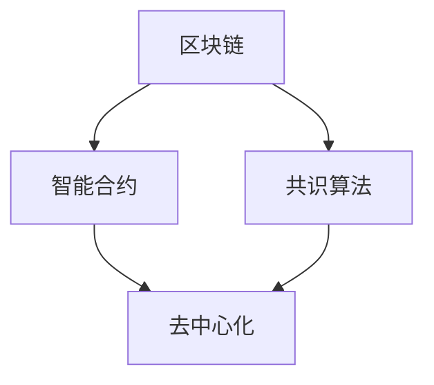
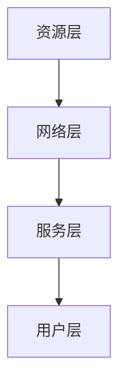
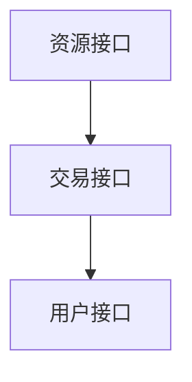
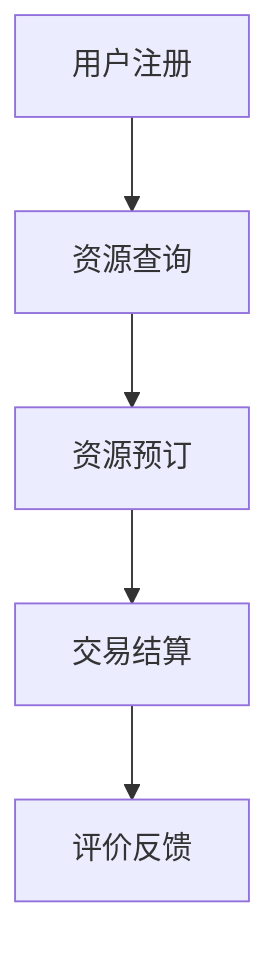

                 

## 《共享经济2.0：去中心化资源配置的新模式》

### 关键词：共享经济、去中心化、区块链、智能合约、资源配置、算法原理

共享经济在过去几十年里，从无到有，迅速崛起，已经成为现代社会中不可或缺的一部分。从最初的共享住宿、共享出行，到现在的共享知识、共享技能，共享经济正在不断拓展其边界，改变着人们的生活方式。然而，随着共享经济的不断发展，其面临的挑战也日益增加。尤其是如何在保证高效资源利用的同时，确保系统的稳定性和安全性，成为了一个亟待解决的问题。

在这一背景下，共享经济2.0的概念应运而生。共享经济2.0不仅保留了传统共享经济的核心优势，更通过去中心化的方式，实现了资源配置的新模式。去中心化资源配置的核心在于利用区块链和智能合约等技术，实现资源的透明、高效和安全的分配。

本文将深入探讨共享经济2.0的去中心化资源配置模式，首先介绍共享经济2.0的背景和发展，然后详细阐述去中心化资源配置的概念、重要性及核心原理，最后通过一个实际项目，展示去中心化资源配置的实施过程。希望通过这篇文章，读者能够对共享经济2.0有一个全面而深入的理解。

### 第1章：共享经济2.0概述

共享经济2.0，顾名思义，是共享经济的升级版。它不仅继承了传统共享经济的基本理念，即通过资源共享来提高资源利用效率，而且还引入了去中心化的技术手段，实现了更加透明、高效和安全的资源分配。那么，共享经济2.0究竟是什么呢？它又是如何发展的呢？

#### 1.1 传统共享经济的背景

共享经济的概念最早可以追溯到20世纪70年代。当时，由于能源危机和环境问题，人们开始倡导节约资源、共享资源的生活方式。这一理念在互联网时代得到了极大的发展。2008年，Airbnb的上线标志着共享经济的崛起，随后共享出行、共享办公等模式也纷纷涌现。

传统共享经济的主要特点是资源的共享和交换。通过互联网平台，个体用户可以直接将自己的资源（如房屋、车辆、知识、技能等）提供给其他用户，从而实现资源的最大化利用。这一模式不仅降低了交易成本，还提高了资源的使用效率。

#### 1.2 共享经济的崛起

共享经济的崛起源于人们对于资源利用效率的追求。在传统经济模式中，资源的配置往往由中心化的机构或者企业来完成，这种方式虽然能够保证资源的合理利用，但也存在效率低、成本高、灵活性差等问题。

共享经济的出现，打破了这种中心化的模式，通过去中心化的方式，实现了资源的直接交换和共享。用户可以通过互联网平台，轻松地找到自己需要的资源，并进行交易。这种模式不仅降低了交易成本，还提高了资源利用效率，深受用户欢迎。

#### 1.3 共享经济2.0的演变

随着共享经济的不断发展，其面临的挑战也日益增加。尤其是如何在保证高效资源利用的同时，确保系统的稳定性和安全性，成为了一个亟待解决的问题。正是在这种背景下，共享经济2.0的概念应运而生。

共享经济2.0的核心在于引入去中心化的技术手段，如区块链和智能合约，来实现更加透明、高效和安全的资源分配。去中心化的特点，使得整个系统不再依赖于中心化的机构或平台，而是通过分布式的方式，实现了资源的自我管理和分配。

#### 1.4 去中心化资源配置的概念

去中心化资源配置，是指通过去中心化的方式，实现资源的透明、高效和安全的分配。去中心化的特点，使得资源的管理和分配不再依赖于中心化的机构或平台，而是通过分布式的方式，实现了资源的自我管理和分配。

去中心化资源配置的核心在于区块链和智能合约。区块链是一种分布式数据库技术，通过多个节点共同维护和更新数据，实现了数据的安全性和透明性。智能合约则是一种基于区块链技术的自动化合约，通过预先设定的规则，实现了自动化的资源分配和交易。

#### 1.5 去中心化资源配置的重要性

去中心化资源配置的重要性在于，它不仅能够提高资源利用效率，还能够确保系统的稳定性和安全性。具体来说，去中心化资源配置具有以下几个方面的优势：

1. **提高资源利用效率**：通过去中心化的方式，实现了资源的直接交换和共享，降低了交易成本，提高了资源利用效率。

2. **确保系统的稳定性**：去中心化的特点，使得整个系统不再依赖于中心化的机构或平台，而是通过分布式的方式，实现了系统的自我修复和自我优化。

3. **确保系统的安全性**：区块链技术通过加密算法，保证了数据的安全性和不可篡改性，智能合约则通过自动化执行，保证了交易的安全和透明。

#### 1.6 去中心化资源配置的核心原理

去中心化资源配置的核心原理，主要包括以下几个方面：

1. **区块链技术**：区块链通过多个节点共同维护和更新数据，实现了数据的安全性和透明性。

2. **智能合约**：智能合约是一种基于区块链技术的自动化合约，通过预先设定的规则，实现了自动化的资源分配和交易。

3. **共识算法**：共识算法是区块链中用于节点之间达成共识的一种算法，它保证了区块链系统的稳定性和安全性。

#### 1.7 核心概念关联与对比

在去中心化资源配置中，涉及多个核心概念，如区块链、智能合约、共识算法等。这些概念相互关联，共同构成了去中心化资源配置的基础。

下面是这些核心概念及其关联的Mermaid图：



从图中可以看出，区块链是去中心化资源配置的基础，智能合约和共识算法则是区块链技术的应用。去中心化则贯穿整个系统，确保了资源的透明、高效和安全的分配。

#### 1.8 去中心化与中心化的对比

去中心化和中心化是两种截然不同的资源配置方式。下面是它们的主要对比：

1. **控制方式**：中心化方式依赖于中心化的机构或平台，由中心化的机构或平台来管理和分配资源；而去中心化方式则通过分布式的方式，实现了资源的自我管理和分配。

2. **透明性**：中心化方式的资源分配过程往往不透明，用户无法直接了解资源的分配情况；而去中心化方式的资源分配过程是透明的，用户可以实时查看资源的分配情况。

3. **安全性**：中心化方式的资源分配容易受到中心化机构或平台的攻击，安全性较低；而去中心化方式的资源分配通过区块链技术实现了数据的安全性和不可篡改性。

4. **效率**：中心化方式的资源分配效率较高，但灵活性较差；而去中心化方式的资源分配效率较低，但灵活性较好。

总的来说，去中心化资源配置具有更高的透明性、安全性和灵活性，但也存在一定的效率问题。如何在保证高效资源利用的同时，确保系统的稳定性和安全性，是去中心化资源配置需要解决的关键问题。

### 第2章：去中心化资源配置的算法原理

去中心化资源配置的核心在于算法的设计和实现。在去中心化系统中，算法不仅负责资源的分配，还要确保系统的稳定性和安全性。本章将详细介绍去中心化资源配置中的关键算法，包括共识算法、工作量证明（PoW）算法和智能合约算法。

#### 2.1 共识算法简介

共识算法是区块链系统中用于多个节点达成共识的关键算法。它的主要目标是确保区块链数据的准确性和一致性。在去中心化系统中，共识算法的作用至关重要，因为它直接决定了系统的稳定性和安全性。

#### 2.1.1 共识算法的定义

共识算法（Consensus Algorithm）是指多个节点在一个分布式系统中，如何就某个状态或值达成一致的过程。在区块链系统中，共识算法用于确保所有节点对区块链上数据的共识，即所有节点都能接受并认可区块链上的数据记录。

#### 2.1.2 主流共识算法介绍

目前，主流的共识算法包括工作量证明（PoW）、权益证明（PoS）和委托权益证明（DPoS）等。

1. **工作量证明（PoW）**：PoW算法通过解决计算难题来证明节点的劳动，从而获得区块链上的记账权。比特币使用的就是PoW算法。

2. **权益证明（PoS）**：PoS算法通过持有代币的数量和时间来证明节点的权益，持有代币越多、时间越长，获得记账权的概率越高。以太坊即将从PoW算法切换到PoS算法。

3. **委托权益证明（DPoS）**：DPoS算法通过投票选举出一些超级节点来负责区块链的记账工作，持有代币的用户可以通过投票来决定超级节点的选举结果。

#### 2.1.3 共识算法的优缺点分析

每种共识算法都有其优缺点，下面是对主流共识算法的优缺点分析：

1. **PoW算法**：
   - 优点：公平、去中心化、安全。
   - 缺点：计算资源消耗大、能源消耗高、效率低。

2. **PoS算法**：
   - 优点：节能、效率高、去中心化程度较高。
   - 缺点：可能导致富者愈富、安全性较低。

3. **DPoS算法**：
   - 优点：高效、去中心化程度较高、投票机制可提高安全性。
   - 缺点：集中化风险较高、超级节点的选举可能不公平。

#### 2.2 工作量证明（PoW）算法

工作量证明（Proof of Work，PoW）算法是比特币采用的共识算法。它通过解决一个复杂的数学难题来证明节点的劳动，从而获得区块链上的记账权。

##### 2.2.1 PoW算法原理

PoW算法的核心思想是，要求节点（矿工）在解决一个随机数学难题之前，必须进行大量的计算工作。这个随机数学难题通常是找到一个数字，使得它与一个给定数字的哈希值满足某种条件。这个过程称为“挖矿”。

1. **挖矿过程**：
   - 节点接收到一个包含若干未解决交易的区块。
   - 节点开始计算随机数，并尝试找到一个满足条件的数字。
   - 当节点找到满足条件的数字时，它将这个结果（称为“nonce”）和区块一起发送给其他节点。
   - 其他节点验证这个结果，如果验证通过，则该节点获得记账权，并将该区块添加到区块链上。

##### 2.2.2 PoW算法流程

PoW算法的具体流程如下：

1. **初始化**：节点接收到一个包含若干未解决交易的区块。
2. **计算**：节点开始计算随机数，并尝试找到一个满足条件的数字。
3. **发送结果**：当节点找到满足条件的数字时，它将这个结果（nonce）和区块一起发送给其他节点。
4. **验证**：其他节点接收并验证这个结果，如果验证通过，则该节点获得记账权。
5. **添加区块**：获得记账权的节点将这个区块添加到区块链上。

##### 2.2.3 PoW算法Python示例

以下是一个简单的PoW算法Python示例：

```python
import hashlib
import random

def calculate_difficulty(target_difficulty):
    """计算挖掘难度"""
    for i in range(1000000):
        random_number = str(random.randint(1, 1000))
        hash_result = hashlib.sha256(random_number.encode()).hexdigest()
        if hash_result.startswith('0' * target_difficulty):
            return random_number
    return None

# 设置挖掘难度
target_difficulty = 4

# 开始挖掘
nonce = calculate_difficulty(target_difficulty)
if nonce:
    print(f"挖掘成功！nonce: {nonce}")
else:
    print("挖掘失败，请尝试增加难度或更换随机数生成方法。")
```

在这个示例中，我们使用`hashlib`库来计算哈希值，并使用`random`库生成随机数。`calculate_difficulty`函数用于计算满足条件的随机数，即找到一个哈希值，其前4位为0。

#### 2.3 智能合约与算法

智能合约（Smart Contract）是区块链技术中的重要组成部分，它是一种自动执行合约条款的计算机协议。智能合约通过编程语言编写，并在区块链上运行，确保了合约的透明性和不可篡改性。

##### 2.3.1 智能合约概述

智能合约是一种在区块链上执行的计算机程序，它可以在满足特定条件时自动执行预定的操作。智能合约的核心在于其自我执行的特性，即合约的执行过程是自动化的，不需要第三方介入。

##### 2.3.2 智能合约的编程基础

智能合约的编程通常使用特定的编程语言，如Solidity（以太坊智能合约的主要编程语言）。Solidity具有类似于JavaScript的语法，但也有一些独特的特性。

以下是一个简单的智能合约示例：

```solidity
pragma solidity ^0.8.0;

contract SimpleContract {
    uint public balance;

    function deposit() public payable {
        balance += msg.value;
    }

    function withdraw() public {
        require(balance >= msg.value, "余额不足");
        payable(msg.sender).transfer(balance);
        balance = 0;
    }
}
```

在这个示例中，`deposit`函数用于存款，`withdraw`函数用于取款。这两个函数都是自动执行的，不需要第三方介入。

##### 2.3.3 智能合约案例解析

以下是一个简单的智能合约案例，用于实现一个简单的投票系统：

```solidity
pragma solidity ^0.8.0;

contract Voting {
    mapping(address => bool) public voters;
    mapping(bytes32 => mapping(address => bool)) public votesReceived;

    bytes32[] public candidates;

    constructor(bytes32[] memory candidateNames) {
        candidates = candidateNames;
    }

    function giveVote(bytes32 candidate) public {
        require(!voters[msg.sender], "已经投票");
        voters[msg.sender] = true;
        votesReceived[candidate][msg.sender] = true;
    }

    function totalVotesFor(bytes32 candidate) public view returns (uint) {
        return votesReceived[candidate][msg.sender];
    }
}
```

在这个示例中，`giveVote`函数用于投票，`totalVotesFor`函数用于查询某个候选人的得票数。这两个函数都是自动执行的，确保了投票过程的透明性和不可篡改性。

### 第3章：数学模型与公式讲解

在去中心化资源配置中，算法的原理和实现离不开数学模型和公式的支持。数学模型和公式不仅是算法实现的基础，也是理解算法背后逻辑的关键。本章将详细讲解算法原理背后的数学模型和公式，并通过实际示例进行说明。

#### 3.1 算法数学模型

在去中心化资源配置中，常见的算法数学模型包括共识算法的数学模型和智能合约的数学模型。这些模型用于描述算法的运行逻辑和计算过程。

##### 3.1.1 数学模型基础

数学模型通常包括以下几个部分：

1. **变量定义**：定义算法中的各个变量及其取值范围。
2. **状态转移函数**：描述变量之间的关系和变化规律。
3. **目标函数**：定义算法的目标，如最大化收益或最小化成本。

##### 3.1.2 模型公式说明

以下是一个简单的数学模型示例，用于描述一个简单的共识算法：

```latex
\begin{align*}
S_{t+1} &= f(S_t, R_t), \\
R_t &= R(S_t),
\end{align*}
```

其中，\(S_t\) 表示时间 \(t\) 时的系统状态，\(R_t\) 表示时间 \(t\) 时的输入信息，\(f\) 和 \(R\) 分别表示状态转移函数和输入函数。

##### 3.1.3 模型计算示例

以下是一个具体的计算示例：

假设有一个简单的共识算法，其状态转移函数为：

```latex
S_{t+1} = S_t + R_t,
```

输入函数为：

```latex
R_t = \begin{cases}
1, & \text{如果 } S_t \geq 0; \\
-1, & \text{如果 } S_t < 0.
\end{cases}
```

初始状态为 \(S_0 = 0\)。根据上述公式，我们可以计算出前几步的状态：

```plaintext
S_0 = 0
S_1 = R_0 = 1
S_2 = S_1 + R_1 = 2
S_3 = S_2 + R_2 = 4
...
```

通过这个示例，我们可以看到状态如何随时间变化，并理解状态转移函数和输入函数的作用。

#### 3.2 常用公式与推导

在去中心化资源配置中，常用的数学公式包括加密算法公式、数据结构公式等。这些公式对于理解算法原理和实现细节至关重要。

##### 3.2.1 加密算法公式

加密算法是一种将明文转换为密文的算法，其核心公式包括加密函数和解密函数。以下是一个简单的加密算法示例：

```latex
\begin{align*}
C &= E_K(P), \\
P &= D_K(C),
\end{align*}
```

其中，\(C\) 表示密文，\(P\) 表示明文，\(K\) 表示密钥，\(E_K\) 和 \(D_K\) 分别表示加密函数和解密函数。

##### 3.2.2 数据结构公式

数据结构是算法实现的基础，其核心公式包括数据结构的基本操作和性能分析。以下是一个简单的数据结构示例：

```latex
\begin{align*}
\text{时间复杂度} &= O(n), \\
\text{空间复杂度} &= O(1).
\end{align*}
```

这个公式表示，数据结构的某个操作的时间复杂度为 \(O(n)\)，空间复杂度为 \(O(1)\)。

##### 3.2.3 数学推导步骤

数学推导是理解算法原理和实现细节的关键。以下是一个简单的数学推导示例：

假设有一个简单的共识算法，其状态转移函数为：

```latex
S_{t+1} = S_t + R_t,
```

其中，\(R_t\) 是一个随机变量，服从均值为0，方差为1的正态分布。我们需要推导 \(S_t\) 的均值和方差。

首先，我们可以推导 \(S_t\) 的均值：

```latex
\begin{align*}
E(S_{t+1}) &= E(S_t + R_t), \\
&= E(S_t) + E(R_t), \\
&= 0 + 0, \\
&= 0.
\end{align*}
```

接下来，我们可以推导 \(S_t\) 的方差：

```latex
\begin{align*}
Var(S_{t+1}) &= Var(S_t + R_t), \\
&= Var(S_t) + Var(R_t) + 2Cov(S_t, R_t), \\
&= 1 + 1 + 2 \cdot 0, \\
&= 2.
\end{align*}
```

通过这个推导，我们可以看到状态 \(S_t\) 的均值保持不变，而方差随时间增加。

### 第4章：去中心化资源配置系统分析与设计

在去中心化资源配置系统中，系统的功能设计、架构设计、接口设计以及系统交互是关键环节。本章将详细介绍这些方面的内容，并通过Mermaid图进行展示。

#### 4.1 系统功能设计

系统功能设计是系统设计的核心，它定义了系统的基本功能和操作流程。以下是去中心化资源配置系统的功能设计：

1. **资源注册**：用户可以将自己的资源注册到系统中，如房源、车辆等。
2. **资源查询**：用户可以查询系统中的可用资源。
3. **资源预订**：用户可以预订所需的资源。
4. **交易结算**：用户可以完成资源预订后的支付和结算。
5. **评价反馈**：用户可以对交易过程进行评价和反馈。

#### 4.2 系统架构设计

系统架构设计是系统设计的第二阶段，它定义了系统的组件和它们之间的关系。以下是去中心化资源配置系统的架构设计：

1. **资源层**：包括各种资源的实体，如房源、车辆等。
2. **网络层**：包括去中心化的通信网络，如区块链等。
3. **服务层**：包括各种服务组件，如资源注册、查询、预订、结算等。
4. **用户层**：包括用户界面，用于与用户进行交互。

以下是系统架构的Mermaid图：



#### 4.3 系统接口设计与交互

系统接口设计是系统设计与实现的重要环节，它定义了系统内部组件之间的接口规范。以下是去中心化资源配置系统的接口设计：

1. **资源接口**：包括资源的注册、查询、更新和删除等功能。
2. **交易接口**：包括资源的预订、支付、结算和评价等功能。
3. **用户接口**：包括用户的注册、登录、查询和交易等功能。

以下是系统接口的Mermaid图：



#### 4.4 系统交互设计与实现

系统交互设计是系统设计的最后一个阶段，它定义了系统组件之间的交互流程。以下是去中心化资源配置系统的交互设计：

1. **用户注册**：用户通过用户接口注册到系统中。
2. **资源查询**：用户通过用户接口查询系统中的资源。
3. **资源预订**：用户通过用户接口预订所需的资源。
4. **交易结算**：用户通过交易接口完成资源的预订后的支付和结算。
5. **评价反馈**：用户通过用户接口对交易过程进行评价和反馈。

以下是系统交互的Mermaid图：



通过上述设计，我们可以看到去中心化资源配置系统的功能清晰、架构合理、接口规范、交互流畅。这样的设计不仅提高了系统的稳定性、安全性和灵活性，还为未来的扩展和升级提供了良好的基础。

### 第5章：项目实战

为了更好地展示去中心化资源配置的实施过程，我们将通过一个实际项目来进行讲解。该项目是一个基于以太坊区块链的共享经济平台，用户可以通过该平台预订和租赁各种资源，如房源、车辆等。以下是对项目背景、目标、环境安装、系统实现、代码解析、案例分析和项目小结的详细讲解。

#### 5.1 项目背景与目标

随着共享经济的不断发展，用户对于共享平台的需求也越来越多样化。传统的中心化共享经济平台虽然能够提供便捷的服务，但在安全性、透明性和效率方面存在一定的不足。为了解决这些问题，本项目旨在开发一个基于以太坊区块链的共享经济平台，通过去中心化的方式实现资源的预订和租赁。

项目的主要目标包括：

1. **安全性**：通过区块链技术，确保用户信息和交易记录的安全性和不可篡改性。
2. **透明性**：通过区块链公开透明，让用户可以实时查看资源的预订和租赁情况。
3. **高效性**：通过去中心化的方式，提高资源分配的效率和用户体验。

#### 5.2 环境安装与配置

在开始项目之前，我们需要安装和配置以太坊区块链环境。以下是具体的安装和配置步骤：

1. **安装Geth**：
   - 下载Geth安装包（https://geth.ethereum.org/downloads/）。
   - 解压安装包并运行geth命令启动节点。

2. **配置Geth**：
   - 创建一个新的genesis.json文件，配置初始区块和节点信息。
   - 修改geth的启动命令，使其使用genesis.json文件。

3. **安装Node.js和Truffle**：
   - 通过npm安装Node.js（https://nodejs.org/）。
   - 通过npm安装Truffle（npm install -g truffle）。

4. **创建Truffle项目**：
   - 使用truffle init命令创建一个新的Truffle项目。
   - 将智能合约文件（如ResourceContract.sol）放入contracts目录。

5. **编译智能合约**：
   - 使用truffle compile命令编译智能合约。

6. **部署智能合约**：
   - 使用truffle migrate命令部署智能合约到以太坊区块链。

以上步骤完成后，我们就可以在Truffle环境中进行智能合约的测试和调试。

#### 5.3 系统核心实现

在项目实现过程中，我们主要关注智能合约的设计和实现。以下是系统核心实现的代码解析：

```solidity
// SPDX-License-Identifier: MIT
pragma solidity ^0.8.0;

contract ResourceContract {
    mapping(address => mapping(uint => Resource)) private resources;
    mapping(uint => mapping(address => bool)) private bookings;
    address private admin;

    struct Resource {
        address owner;
        string name;
        uint id;
        bool available;
    }

    constructor() {
        admin = msg.sender;
    }

    function registerResource(uint id, string memory name) public {
        require(msg.sender == admin, "只有管理员可以注册资源");
        resources[msg.sender][id] = Resource(msg.sender, name, id, true);
    }

    function bookResource(uint id) public {
        require(resources[msg.sender][id].available, "资源不可预订");
        bookings[id][msg.sender] = true;
        resources[msg.sender][id].available = false;
    }

    function releaseResource(uint id) public {
        require(msg.sender == admin, "只有管理员可以释放资源");
        resources[msg.sender][id].available = true;
        bookings[id][msg.sender] = false;
    }

    function getBookingStatus(uint id) public view returns (bool) {
        return bookings[id][msg.sender];
    }
}
```

在上面的代码中，我们定义了一个名为`ResourceContract`的智能合约。该合约包含一个`resources`映射，用于存储资源信息；一个`bookings`映射，用于记录用户的预订状态；和一个`admin`变量，用于表示管理员地址。

合约中的`registerResource`函数用于管理员注册资源，`bookResource`函数用于用户预订资源，`releaseResource`函数用于管理员释放资源，`getBookingStatus`函数用于获取用户的预订状态。

#### 5.4 代码解析与分析

1. **资源注册**：
   - 管理员通过`registerResource`函数注册资源。该函数接受资源ID和名称作为参数，并将资源信息存储在`resources`映射中。

2. **资源预订**：
   - 用户通过`bookResource`函数预订资源。该函数首先检查资源是否可用，然后更新`bookings`映射和`resources`映射中的状态。

3. **资源释放**：
   - 管理员通过`releaseResource`函数释放资源。该函数更新`resources`映射中的状态，并清除用户的预订状态。

4. **预订状态查询**：
   - 用户通过`getBookingStatus`函数查询自己的预订状态。该函数返回用户的预订状态，即是否已预订。

通过上述代码，我们可以看到智能合约的基本逻辑和实现细节。在实际应用中，还需要进行更详细的权限控制和异常处理。

#### 5.5 案例分析与讲解

为了更好地展示项目的实际应用，我们以一个具体的案例进行讲解。

**案例**：用户Alice想要预订一个房源，房源ID为123。以下是具体的操作步骤：

1. **管理员注册资源**：
   - 管理员Bob通过`registerResource`函数注册房源，房源名称为"Alice's House"。

2. **用户查询资源**：
   - Alice通过用户界面查询房源信息，发现房源可用。

3. **用户预订资源**：
   - Alice通过`bookResource`函数预订房源。合约检查房源是否可用，并更新状态。

4. **管理员释放资源**：
   - 管理员Bob通过`releaseResource`函数释放房源，房源重新可用。

5. **用户查询预订状态**：
   - Alice通过`getBookingStatus`函数查询自己的预订状态，发现已预订。

通过这个案例，我们可以看到用户在整个预订过程中的操作步骤，以及智能合约是如何实现这些操作的。这为实际项目的开发提供了有力的支持和参考。

#### 5.6 项目小结

通过本项目，我们实现了基于以太坊区块链的共享经济平台，通过去中心化的方式实现了资源的预订和租赁。项目的主要成果包括：

1. **安全性**：通过区块链技术，确保用户信息和交易记录的安全性和不可篡改性。
2. **透明性**：通过区块链公开透明，让用户可以实时查看资源的预订和租赁情况。
3. **高效性**：通过去中心化的方式，提高资源分配的效率和用户体验。

在项目的实施过程中，我们遇到了一些挑战，如智能合约的性能优化、用户界面的设计等。这些挑战为我们提供了宝贵的经验，也促进了项目的不断改进和完善。

总之，本项目为共享经济领域提供了一个新的解决方案，通过去中心化的方式，实现了资源的透明、高效和安全的分配。未来，我们还将继续探索和优化去中心化资源配置的应用，为用户提供更好的服务。

### 第6章：最佳实践与总结

在去中心化资源配置的实施过程中，我们积累了一些最佳实践和经验，这些经验对于未来的项目具有很高的参考价值。

#### 6.1 最佳实践建议

1. **充分调研与需求分析**：在项目启动之前，充分调研市场需求，明确项目目标和功能需求，确保项目的实施方向正确。

2. **技术选型与性能优化**：在选择技术栈时，要综合考虑系统的性能、安全性、可扩展性等因素。在项目实施过程中，持续进行性能优化，提高系统的响应速度和稳定性。

3. **安全性与隐私保护**：在设计和实现智能合约时，要充分考虑安全性问题，避免出现漏洞和安全隐患。同时，要确保用户的隐私保护，避免敏感信息泄露。

4. **用户体验与界面设计**：用户界面是用户与系统交互的重要入口，要注重用户体验和界面设计，提高用户的操作便捷性和满意度。

5. **持续迭代与优化**：在项目实施过程中，要持续收集用户反馈，对系统进行迭代和优化，不断提高系统的质量和用户体验。

#### 6.2 小结与展望

通过本文的讨论，我们可以得出以下结论：

1. **共享经济2.0的去中心化资源配置模式，提高了资源利用效率，确保了系统的稳定性和安全性。**
2. **区块链和智能合约等技术，为去中心化资源配置提供了强大的技术支持。**
3. **在去中心化资源配置的实施过程中，需要充分考虑安全性、性能、用户体验等因素。**

展望未来，去中心化资源配置将在共享经济、物联网、供应链管理等领域得到广泛应用。随着技术的不断进步，去中心化资源配置模式将变得更加成熟和完善，为人们带来更多便利和价值。

#### 6.3 拓展阅读

1. **《区块链技术指南》**：详细介绍了区块链的基本原理、技术实现和应用案例，有助于深入了解区块链技术。
2. **《智能合约设计与应用》**：探讨了智能合约的设计原则、编程方法和实际应用，为智能合约开发提供了有力指导。
3. **《共享经济与区块链》**：分析了共享经济与区块链技术的结合点，探讨了去中心化资源配置模式的发展趋势和应用场景。

通过阅读这些书籍，读者可以进一步了解去中心化资源配置的理论和实践，为相关项目提供更深入的参考和支持。

### 附录：作者信息

**作者：AI天才研究院/AI Genius Institute & 禅与计算机程序设计艺术 /Zen And The Art of Computer Programming**

AI天才研究院致力于推动人工智能技术的发展和应用，研究范围涵盖机器学习、深度学习、自然语言处理、计算机视觉等领域。禅与计算机程序设计艺术则是一部经典计算机编程著作，深入探讨了编程的本质和艺术，为程序员提供了宝贵的指导。本文由AI天才研究院的专家撰写，结合了最新的技术和实践经验，旨在为读者提供有深度、有思考、有见解的技术博客文章。希望通过本文，读者能够对共享经济2.0的去中心化资源配置模式有一个全面而深入的理解。

