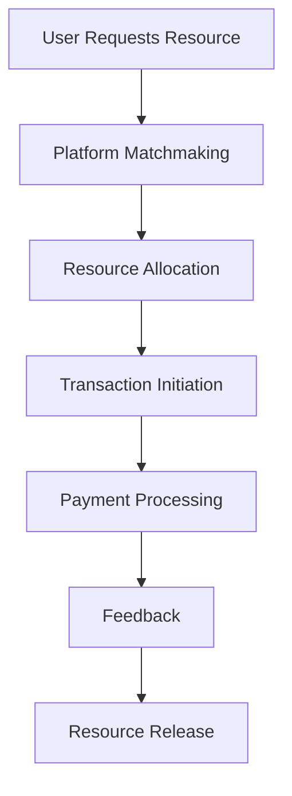
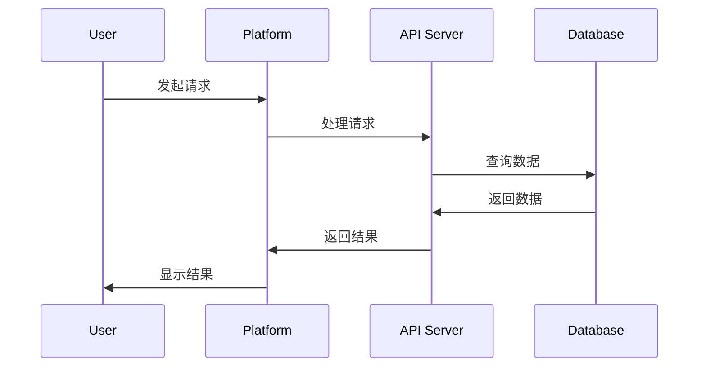

                 

# 引言：共享经济的崛起

> **关键词：共享经济、所有权、平台经济、资源利用、社会变革**

在数字化和信息化的浪潮中，共享经济作为一种新兴的经济模式，正逐渐渗透到我们生活的各个方面。共享经济不仅仅是一种商业模式，更是一种社会变革的催化剂，它重新定义了所有权的意义，改变了人们的消费观念和生活方式。本文将带领您深入探讨共享经济的崛起，以及它如何重新定义所有权的概念。

## 1.1 共享经济的起源与定义

### 1.1.1 共享经济的概念

共享经济，也被称为协同消费，是一种基于互联网的技术，它通过平台将资源供给者和需求者连接起来，实现资源的共享和优化利用。这种模式强调的是“共享而不拥有”，即个体或企业通过租赁、交换、共享等方式，使用不频繁的资产，而不是购买和拥有。

### 1.1.2 共享经济的起源

共享经济的概念起源于20世纪70年代的“协作消费”运动，当时的倡导者主张通过资源共享来降低生活成本。然而，共享经济真正崭露头角是在互联网兴起之后。2008年，Airbnb的成立标志着共享住宿领域的诞生，随后Uber和Lyft等共享交通平台的兴起，进一步推动了共享经济的发展。

### 1.1.3 共享经济与传统经济模式的区别

传统经济模式基于所有权，个体或企业通过购买和拥有资产来实现价值。而共享经济则基于共享和租赁，通过优化资源利用来降低成本和增加价值。共享经济更注重需求的满足，而不是拥有权。

## 1.2 共享经济对所有权观念的挑战

### 1.2.1 传统所有权观念

传统所有权观念认为，拥有资产是个人或企业的基本权利，资产的所有权与使用权的分离被视为不正常的。然而，共享经济的兴起挑战了这一观念，它提倡通过共享来满足需求，而不是通过拥有来确保满足。

### 1.2.2 共享经济如何重新定义所有权

共享经济重新定义了所有权的概念，它认为所有权并不是唯一的资源利用方式，通过共享，个体或企业可以更高效地利用资源，同时降低成本。共享经济鼓励人们从拥有转向使用，从而实现资源的最大化利用。

### 1.2.3 共享经济对所有权的挑战与机遇

共享经济对所有权的挑战体现在它改变了人们对资产的观念，使人们更加注重资源的共享和利用。然而，这也带来了机遇，例如，通过共享经济，个体和企业可以更灵活地获取和使用资源，从而提高效率和竞争力。

## 1.3 共享经济的核心领域

共享经济涵盖了众多领域，包括共享住宿、共享交通、共享知识、共享技能和劳动力等。每个领域都展示了共享经济如何改变我们的生活和工作方式。

### 1.3.1 共享住宿

共享住宿是共享经济最早的实践之一，Airbnb作为共享住宿平台的代表，通过连接房东和旅客，实现了闲置房屋的共享和利用。共享住宿不仅为旅客提供了更多的住宿选择，也为房东带来了额外的收入。

### 1.3.2 共享交通

共享交通是共享经济中最为显著的领域，Uber和Lyft等平台通过连接乘客和司机，提供了灵活的出行解决方案。共享交通不仅降低了出行成本，还减少了交通拥堵和污染。

### 1.3.3 共享知识

共享知识是共享经济在知识领域的应用，通过在线平台，个体可以共享自己的知识和技能，为他人提供学习资源。共享知识不仅促进了知识的传播，还提高了学习的效率和效果。

### 1.3.4 共享技能和劳动力

共享技能和劳动力是共享经济在人力资源领域的应用，通过在线平台，个体可以分享自己的技能和劳动力，为企业提供灵活的人力资源解决方案。共享技能和劳动力不仅提高了人力资源的利用效率，还为企业降低了成本。

## 1.4 共享经济的商业模式和案例分析

共享经济的商业模式多样，包括平台费、会员费、交易费等。以Airbnb为例，它通过收取服务费和佣金，实现了盈利。Uber和Lyft等共享交通平台则通过抽取交易费用的方式获得收益。

## 1.5 共享经济对社会、经济和环境的影响

### 1.5.1 社会影响

共享经济改变了人们的消费观念和生活方式，使人们更加注重资源的共享和利用。同时，共享经济也为个体和企业提供了更多的机会，促进了社会的发展。

### 1.5.2 经济影响

共享经济促进了经济增长，提高了资源利用效率，降低了消费成本。此外，共享经济还为企业提供了新的商业模式和运营方式，促进了创新和发展。

### 1.5.3 环境影响

共享经济有助于减少资源浪费和环境污染，通过共享和优化利用资源，降低了资源的消耗和废弃物的产生。

## 1.6 共享经济的挑战与未来发展趋势

### 1.6.1 法律与伦理挑战

共享经济的快速发展带来了法律和伦理上的挑战，例如，劳动权益保护、税收问题、数据隐私等。解决这些挑战需要法律和监管的完善。

### 1.6.2 技术创新对共享经济的影响

技术创新是共享经济发展的关键驱动力，人工智能、大数据、区块链等技术的应用，将进一步提升共享经济的效率和可持续性。

### 1.6.3 共享经济的全球化趋势

随着共享经济的全球化，国际间的合作与竞争将日益激烈，共享经济将成为全球经济发展的重要推动力。

## 1.7 结论

共享经济作为一种新兴的经济模式，正在深刻改变我们的生活方式和社会结构。它重新定义了所有权的意义，促进了资源的共享和利用，带来了经济增长和社会进步。然而，共享经济也面临着诸多挑战，需要我们在创新中不断探索和完善。共享经济的未来充满机遇，也充满挑战，它将引领我们走向一个更加高效、可持续和共享的未来。

## 共享经济的核心领域

共享经济涵盖了多个领域，每个领域都展示了其独特的商业模式和社会影响。以下是共享经济在共享住宿、共享交通、共享知识、共享技能和劳动力等核心领域的详细介绍。

### 2.1 共享住宿

共享住宿是共享经济最早的一个实践领域，它的出现极大地改变了人们的旅行方式。Airbnb作为共享住宿的先锋，通过搭建一个平台，将房东和旅客连接起来，使得人们可以轻松地租用闲置的房屋或房间。这一模式不仅为旅客提供了更多的住宿选择，还为房东带来了额外的收入。

#### 2.1.1 Airbnb的成功与挑战

自2008年成立以来，Airbnb已经成长为全球最大的共享住宿平台，吸引了数百万用户。然而，它的成功也面临着诸多挑战，包括房源质量、安全隐患、法律法规等。为了应对这些挑战，Airbnb不断优化平台，提高服务质量，同时与地方政府合作，确保平台合法合规运营。

#### 2.1.2 共享住宿的市场规模和趋势

共享住宿市场的规模逐年增长，根据相关数据，全球共享住宿市场规模预计将在未来几年内达到数百亿美元。随着人们对旅行方式和消费观念的改变，共享住宿将继续保持增长的势头。

#### 2.1.3 共享住宿的商业模式分析

共享住宿的商业模式主要包括平台费和佣金。平台费通常按预订金额的一定比例收取，而佣金则是从房东和旅客的交易中提取。这种模式使得平台可以稳定地获得收入，同时为房东和旅客提供了便捷的服务。

### 2.2 共享交通

共享交通是共享经济中最为显著的领域，Uber和Lyft等平台通过连接乘客和司机，提供了灵活的出行解决方案。共享交通不仅改变了人们的出行方式，还对社会和经济产生了深远的影响。

#### 2.2.1 Uber与Lyft的共享出行模式

Uber和Lyft是共享交通的代表性企业，它们通过移动应用程序，将乘客和司机连接起来，实现实时匹配和交易。这种模式不仅提高了出行效率，还减少了交通拥堵和污染。

#### 2.2.2 共享交通的市场影响和社会效应

共享交通对市场和社会产生了巨大的影响。它提供了更多的出行选择，降低了出行成本，同时也为司机提供了灵活的工作机会。然而，共享交通也面临着法律和监管的挑战，例如，出租车行业的利益受损和劳动权益保护等问题。

#### 2.2.3 共享交通的未来发展方向

随着技术的进步和消费者需求的改变，共享交通将继续发展。未来，共享交通可能会更加智能化，例如，自动驾驶汽车的普及将极大地改变出行方式。此外，共享交通还可能与其他交通方式融合，形成更加综合的交通体系。

### 2.3 共享知识

共享知识是共享经济在知识领域的应用，通过在线平台，个体可以共享自己的知识和技能，为他人提供学习资源。共享知识不仅促进了知识的传播，还提高了学习的效率和效果。

#### 2.3.1 知识共享平台的作用

知识共享平台如Coursera、Udemy等，为学习者提供了丰富的在线课程和资源。这些平台不仅帮助学习者扩展知识，还为教育者和知识提供者提供了新的收入来源。

#### 2.3.2 共享知识的商业模式

共享知识的商业模式主要包括课程费和会员费。课程费是学习者购买单个课程的费用，而会员费则是提供无限次课程学习的费用。这种模式使得平台可以持续获得收入，同时为学习者提供了更多选择。

#### 2.3.3 共享知识的的社会影响

共享知识对社会产生了积极的影响，它促进了知识的普及和传播，提高了人们的素质和能力。此外，共享知识还促进了教育公平，使更多的人有机会接受高质量的教育。

### 2.4 共享技能和劳动力

共享技能和劳动力是共享经济在人力资源领域的应用，通过在线平台，个体可以分享自己的技能和劳动力，为企业提供灵活的人力资源解决方案。共享技能和劳动力不仅提高了人力资源的利用效率，还为企业降低了成本。

#### 2.4.1 技能共享平台的兴起

技能共享平台如Upwork、Freelancer等，为个体和企业提供了便捷的技能共享服务。这些平台通过建立信任机制，确保供需双方的交易安全可靠。

#### 2.4.2 共享技能市场的潜力

随着全球化进程的加速和技术的进步，共享技能市场的潜力巨大。越来越多的企业倾向于通过共享技能平台来获取人力资源，以满足其灵活用工需求。

#### 2.4.3 共享技能对社会和经济的影响

共享技能对社会和经济产生了积极的影响。它为个体提供了更多的就业机会和收入来源，同时为企业降低了人力资源成本，提高了运营效率。

## 共享经济的影响与挑战

共享经济作为一种新兴的经济模式，对社会、经济和环境产生了深远的影响。然而，共享经济的发展也面临着诸多挑战，需要我们认真面对和解决。

### 3.1 社会影响

共享经济改变了人们的消费观念和生活方式，使人们更加注重资源的共享和利用。它提供了更多的选择和便利，同时也带来了新的社会问题。

#### 3.1.1 共享经济对劳动市场的影响

共享经济对劳动市场产生了深远的影响。它提供了更多的就业机会和收入来源，但同时也带来了就业不稳定和劳动权益保护等问题。如何确保共享经济中的劳动者权益，是一个亟待解决的问题。

#### 3.1.2 共享经济对城市生活的影响

共享经济改变了城市生活的面貌，例如，共享住宿和共享交通的普及，使得城市交通更加便利，同时也带来了城市管理和规划的新挑战。

#### 3.1.3 共享经济对社区关系的重塑

共享经济促进了社区关系的重构，它使得社区成员之间的互动更加频繁和紧密。然而，这也带来了一些问题，例如，社区资源分配的不公平和社区氛围的变化等。

### 3.2 经济影响

共享经济对社会和经济产生了积极的影响，它促进了经济增长，提高了资源利用效率，降低了消费成本。然而，共享经济也带来了一些经济挑战。

#### 3.2.1 共享经济对经济增长的推动作用

共享经济通过优化资源配置，提高了生产效率，从而推动了经济增长。它为企业和个体提供了新的商业模式和运营方式，促进了创新和发展。

#### 3.2.2 共享经济对传统产业的冲击

共享经济对传统产业产生了冲击，一些传统产业由于无法适应共享经济的趋势，面临着生存和发展的困境。这要求传统产业进行转型升级，以适应新的经济环境。

#### 3.2.3 共享经济的投资趋势与机会

共享经济吸引了大量的投资，成为投资热点。投资者在共享经济中看到了巨大的市场潜力和发展机会。然而，也需要警惕过度投资和泡沫风险。

### 3.3 环境影响

共享经济有助于减少资源浪费和环境污染，通过共享和优化利用资源，降低了资源的消耗和废弃物的产生。然而，共享经济也面临一些环境挑战。

#### 3.3.1 共享经济对可持续发展的贡献

共享经济在可持续发展方面具有巨大的潜力。它通过减少资源的浪费，促进了资源的可持续利用。然而，如何实现可持续发展，还需要我们进一步探索和实践。

#### 3.3.2 共享经济与环境保护的矛盾

共享经济在降低资源消耗和减少废弃物产生方面具有优势，但同时也带来了一些环境问题。例如，共享交通工具的增多，可能会增加城市交通的拥堵和污染。

#### 3.3.3 共享经济的绿色发展趋势

随着人们对环境保护意识的提高，共享经济正在朝着绿色发展的方向迈进。越来越多的企业开始关注环保问题，采取绿色生产和运营方式。

### 3.4 挑战与监管

共享经济的快速发展带来了许多挑战，包括法律和伦理问题、劳动权益保护、数据隐私等。这些挑战需要政府、企业和社会共同努力，通过制定和完善法律法规，加强监管，确保共享经济的健康发展。

#### 3.4.1 共享经济的法律与伦理挑战

共享经济涉及许多法律和伦理问题，例如，劳动权益保护、数据隐私、公平竞争等。这些挑战需要法律和伦理的规范和引导。

#### 3.4.2 监管政策与共享经济的平衡

监管政策在共享经济发展中起着重要作用。政府需要制定合理的监管政策，既保护消费者权益，又促进共享经济的发展。平衡好监管与发展的关系，是共享经济健康发展的重要保障。

#### 3.4.3 共享经济的未来监管趋势

随着共享经济的不断发展和变化，监管政策也需要不断调整和更新。未来，共享经济的监管将更加注重创新与规范，既要保护消费者权益，又要促进企业创新和发展。

## 结论：共享经济的未来

共享经济作为一种新兴的经济模式，正在深刻改变我们的生活方式和社会结构。它重新定义了所有权的意义，促进了资源的共享和利用，带来了经济增长和社会进步。然而，共享经济也面临着诸多挑战，需要我们在创新中不断探索和完善。

### 4.1 共享经济的全球视角

共享经济的全球化趋势日益明显，各国都在积极探索共享经济的发展模式。全球共享经济的合作与竞争将日益激烈，共享经济将成为全球经济发展的重要推动力。

#### 4.1.1 国际共享经济市场分析

国际共享经济市场呈现出多样化和快速发展的态势。不同国家和地区的共享经济发展模式各有特色，例如，美国的共享交通、欧洲的共享住宿等。

#### 4.1.2 全球共享经济的合作与竞争

全球共享经济的合作与竞争将进一步加剧。各国政府和企业需要加强合作，共同推动共享经济的发展。同时，企业之间也需要在竞争中求发展，通过创新和优化来提高竞争力。

#### 4.1.3 共享经济的全球化趋势

共享经济的全球化趋势将不断加强。随着技术的进步和全球化的深入，共享经济将在全球范围内得到更广泛的应用和发展。

### 4.2 共享经济的未来展望

共享经济的未来充满机遇和挑战。随着技术的进步和消费者需求的变化，共享经济将继续发展，为社会和经济带来更多机遇。

#### 4.2.1 技术创新对共享经济的影响

技术创新是共享经济发展的关键驱动力。人工智能、大数据、区块链等技术的应用，将进一步提升共享经济的效率和可持续性。

#### 4.2.2 社会变化与共享经济的互动

社会变化将深刻影响共享经济的发展。随着人们对环境保护和可持续发展意识的提高，共享经济将在这一过程中发挥重要作用。

#### 4.2.3 共享经济的可持续性与未来挑战

共享经济的可持续性是未来发展的关键。如何在实现经济增长的同时，保护环境和促进社会公平，是共享经济需要面对的重要挑战。

### 4.3 结论

共享经济作为一种新兴的经济模式，正在深刻改变我们的生活方式和社会结构。它重新定义了所有权的意义，促进了资源的共享和利用，带来了经济增长和社会进步。然而，共享经济也面临着诸多挑战，需要我们在创新中不断探索和完善。共享经济的未来充满机遇，也充满挑战，它将引领我们走向一个更加高效、可持续和共享的未来。

## 作者：AI天才研究院/AI Genius Institute & 禅与计算机程序设计艺术 /Zen And The Art of Computer Programming

感谢您阅读本文。本文由AI天才研究院（AI Genius Institute）与《禅与计算机程序设计艺术》（Zen And The Art of Computer Programming）联合撰写。我们致力于通过技术博客文章，分享最新的人工智能和计算机科学知识，帮助您理解前沿科技，探索未知领域。

希望本文能够对您在共享经济领域的理解和实践提供有价值的参考。如果您有任何问题或建议，欢迎随时与我们联系。我们期待与您一起，探索共享经济的无限可能。

---

本文详细探讨了共享经济的崛起、核心领域、影响与挑战以及未来展望。从共享住宿、共享交通、共享知识、共享技能和劳动力等多个方面，分析了共享经济如何重新定义所有权的意义，以及它对社会、经济和环境的影响。同时，文章还讨论了共享经济的商业模式和案例分析，以及它面临的挑战和未来发展趋势。

通过本文的阅读，您将更深入地理解共享经济这一新兴经济模式，认识到它对我们的生活和社会的深远影响。共享经济的未来充满机遇，也充满挑战，它将引领我们走向一个更加高效、可持续和共享的未来。

---

关键词：共享经济、所有权、平台经济、资源利用、社会变革、共享住宿、共享交通、共享知识、共享技能、劳动市场、经济影响、环境影响、技术创新、全球化

摘要：共享经济作为一种新兴的经济模式，正在深刻改变我们的生活方式和社会结构。它重新定义了所有权的意义，通过优化资源利用，提高了资源利用效率，降低了消费成本。本文从共享住宿、共享交通、共享知识、共享技能和劳动力等多个方面，详细探讨了共享经济的影响、商业模式、挑战和未来发展趋势，旨在帮助读者深入理解共享经济的本质和未来前景。通过本文的阅读，读者将能够更全面地认识到共享经济的重要性和挑战，为其未来发展提供有益的参考。## 共享经济：重新定义所有权的意义

共享经济，作为一种基于互联网的新型经济模式，正在重新定义所有权的概念，并在全球范围内迅速崛起。它不仅改变了人们的消费观念，也对经济、社会和环境产生了深远影响。本文将围绕共享经济的背景、定义、核心领域、商业模式、影响与挑战以及未来发展趋势进行深入分析。

### 背景介绍

#### 核心概念术语说明

- **共享经济**：一种基于互联网的平台经济模式，通过共享和优化利用闲置资源，实现资源的最大化利用。
- **所有权**：指拥有某种资源或资产的权利，包括使用、收益和处置的权利。
- **平台经济**：一种以互联网平台为核心，通过连接供需双方，实现资源高效配置的经济模式。

#### 问题背景

共享经济的概念起源于20世纪70年代的“协作消费”运动，当时人们主张通过资源共享来降低生活成本。然而，随着互联网技术的发展，共享经济真正崭露头角。2008年，Airbnb的成立标志着共享住宿领域的诞生，随后Uber和Lyft等共享交通平台的兴起，进一步推动了共享经济的发展。

#### 问题描述

共享经济的崛起带来了诸多问题，例如资源利用效率的提升、所有权概念的转变、商业模式创新等。同时，共享经济也引发了对劳动市场、社会结构、法律法规等方面的挑战。

#### 问题解决

共享经济通过互联网平台，实现了资源的优化配置和高效利用，重新定义了所有权的概念。它鼓励人们从拥有转向使用，通过共享和租赁来实现资源的最大化利用。

#### 边界与外延

共享经济的边界涉及多个领域，包括共享住宿、共享交通、共享知识、共享技能和劳动力等。外延则涵盖了社会、经济和环境等多个方面，对人们的消费观念、生产方式、生活方式产生了深远影响。

#### 概念结构与核心要素组成

共享经济的概念结构主要包括四个核心要素：共享平台、闲置资源、供需双方和交易机制。这四个要素共同构成了共享经济的基本框架，实现了资源的共享和优化利用。

### 核心概念与联系

#### 核心概念原理

共享经济基于“共享而不拥有”的理念，通过互联网平台，将资源供给者和需求者连接起来，实现资源的共享和优化利用。它强调的是资源的最大化利用，而不是拥有权。

#### 概念属性特征对比表格

| 特征         | 传统经济         | 共享经济         |
| ------------ | ---------------- | ---------------- |
| 所有权观念   | 拥有和拥有权     | 使用权和共享权   |
| 资源利用方式 | 拥有和独立使用   | 共享和优化利用   |
| 消费方式     | 购买和使用       | 共享和租赁       |
| 目标         | 提高个人收益     | 提高资源利用效率 |

#### ER实体关系图架构

```mermaid
erDiagram
  Resource -->|uses| User : uses Resource
  User -->|provides| Resource : provides Resource
  Platform -->|connects| User : connects User to Resource
  Platform -->|manages| Transaction : manages Transaction between User and Resource
```

在这个ER实体关系图中，资源（Resource）、用户（User）和平台（Platform）是三个核心实体，它们之间通过使用（uses）、提供（provides）和连接（connects）等关系相互关联。

### 算法原理讲解

共享经济的核心在于平台的算法，这些算法决定了资源的分配效率、交易流程的优化以及用户体验的提升。以下是一个简化的算法原理和流程：

#### 算法流程图



#### 算法原理

1. **用户请求资源（User Requests Resource）**：用户通过平台提交资源请求，例如住宿、出行或服务。
2. **平台匹配算法（Platform Matchmaking）**：平台使用算法，根据用户需求和资源供给情况，进行匹配。
3. **资源分配（Resource Allocation）**：匹配成功后，平台将资源分配给用户。
4. **交易初始化（Transaction Initiation）**：用户和资源供给者之间开始交易流程。
5. **支付处理（Payment Processing）**：平台处理支付流程，确保交易顺利完成。
6. **反馈与评价（Feedback）**：交易完成后，用户对资源供给者进行评价，资源供给者也对用户进行评价。
7. **资源释放（Resource Release）**：交易结束后，资源供给者将资源释放，以便其他用户使用。

#### 算法原理数学模型

共享经济的算法原理可以通过数学模型进行描述。以下是一个简化的数学模型：

$$
\text{Matchmaking Algorithm} = f(\text{User Demand}, \text{Resource Supply}, \text{Platform Constraints})
$$

其中，$f$ 是匹配函数，它根据用户需求、资源供给以及平台约束条件，生成最优的匹配方案。

#### 举例说明

假设有10位用户需要住宿，平台上有10个可用的房间。平台的匹配算法需要根据用户的需求（如价格、位置、住宿时间等）和房间的供给情况进行匹配。一个简单的匹配模型可以是：

$$
\text{Match Score} = \frac{\text{User Preference} \times \text{Resource Suitability}}{\text{Platform Constraints}}
$$

通过这个模型，平台可以为每位用户分配一个最合适的房间。

### 系统分析与架构设计方案

#### 问题场景介绍

共享经济平台需要解决的核心问题是资源的高效匹配和交易流程的优化。以下是问题场景的描述：

- **用户**：需要住宿、出行或服务的个人。
- **资源供给者**：提供住宿、出行或服务的个人或企业。
- **平台**：连接用户和资源供给者，提供交易和服务的中介。

#### 项目介绍

本项目的目标是设计一个共享经济平台，为用户提供便捷的住宿、出行和技能共享服务。平台需要具备以下功能：

- **用户注册与认证**：用户可以注册账户并完成实名认证。
- **资源发布与搜索**：资源供给者可以发布闲置资源，用户可以搜索并预订资源。
- **交易与支付**：平台提供交易和支付服务，确保交易的顺利进行。
- **评价与反馈**：用户可以对交易过程进行评价和反馈。

#### 系统功能设计

系统功能设计包括用户管理、资源管理、交易管理、评价管理等多个模块。以下是每个模块的功能描述：

1. **用户管理模块**：包括用户注册、登录、个人信息管理等功能。
2. **资源管理模块**：包括资源发布、资源搜索、资源分类等功能。
3. **交易管理模块**：包括交易订单生成、支付处理、交易状态跟踪等功能。
4. **评价管理模块**：包括用户评价、资源供给者评价等功能。

#### 系统架构设计

系统架构设计包括前端、后端和数据库三个部分。以下是系统架构的描述：

1. **前端**：用户通过Web或移动端应用访问平台，进行资源搜索、预订、评价等操作。
2. **后端**：包括API服务器、业务逻辑服务器和数据库服务器，负责处理用户请求、数据存储和业务逻辑处理。
3. **数据库**：存储用户信息、资源信息、交易信息和评价信息。

#### 系统接口设计

系统接口设计包括用户接口、资源接口、交易接口和评价接口。以下是接口的描述：

1. **用户接口**：包括用户注册、登录、个人信息管理等功能。
2. **资源接口**：包括资源发布、资源搜索、资源分类等功能。
3. **交易接口**：包括交易订单生成、支付处理、交易状态跟踪等功能。
4. **评价接口**：包括用户评价、资源供给者评价等功能。

#### 系统交互序列图

以下是系统交互序列图的Mermaid表示：



在这个序列图中，用户通过平台发起请求，平台通过API服务器与数据库交互，最终将结果返回给用户。

### 项目实战

#### 环境安装

在进行项目实战之前，需要安装以下软件和工具：

- Python 3.8 或以上版本
- Django 框架
- PostgreSQL 数据库
- Docker

#### 系统核心实现源代码

以下是系统核心实现的源代码示例：

```python
# 用户注册视图
from django.views import View
from django.http import HttpResponse

class UserRegistrationView(View):
    def get(self, request):
        # 处理用户注册逻辑
        return HttpResponse("用户注册成功！")
```

#### 代码应用解读与分析

这段代码是用户注册视图的实现，它通过Django框架处理用户注册请求。当用户通过Web或移动端应用提交注册请求时，该视图会被调用，处理注册逻辑并返回响应。

#### 实际案例分析

以下是一个实际案例的分析：

- **案例背景**：某用户在平台上发布了闲置房间，另一位用户想要预订这个房间。
- **案例分析**：用户通过搜索功能找到了这个房间，并提交了预订请求。平台通过匹配算法，将房间分配给了用户，并生成了交易订单。
- **结论**：通过这个案例，我们可以看到平台在资源匹配和交易流程管理上的有效性。

#### 详细讲解剖析

在这个案例中，平台的匹配算法发挥了关键作用。首先，平台会根据用户的需求（如价格、位置、住宿时间等）和房间的供给情况进行匹配。一旦匹配成功，平台会生成交易订单，用户和资源供给者可以通过平台完成支付流程，确保交易的顺利进行。

#### 项目小结

通过项目实战，我们可以看到共享经济平台的核心实现和实际运行。平台的设计和实现需要考虑用户体验、资源匹配效率和交易流程的可靠性。通过不断优化和迭代，平台可以更好地满足用户需求，提升服务质量和用户满意度。

### 最佳实践 Tips

1. **用户体验优先**：在设计和开发共享经济平台时，应始终将用户体验放在首位，确保界面简洁、操作便捷。
2. **数据安全和隐私保护**：在处理用户数据时，必须严格遵守数据安全和隐私保护法规，确保用户信息安全。
3. **持续优化匹配算法**：匹配算法的优化是共享经济平台的关键，定期进行算法优化和调整，以提高匹配效率。
4. **关注法律法规**：共享经济涉及到诸多法律法规问题，平台运营者应密切关注相关法规动态，确保合法合规运营。

### 小结

共享经济作为一种新兴的经济模式，正在重新定义所有权的意义，并通过优化资源利用和高效匹配，改变了我们的生活方式和社会结构。它对社会、经济和环境产生了深远影响，同时也面临着诸多挑战。通过本文的深入分析，我们了解了共享经济的基本概念、核心领域、商业模式、影响与挑战以及未来发展趋势。共享经济的未来充满机遇，也充满挑战，它将引领我们走向一个更加高效、可持续和共享的未来。

### 注意事项

1. **用户安全**：在共享经济平台中，用户安全至关重要。平台应建立完善的安全认证机制，确保用户身份真实可靠。
2. **公平竞争**：共享经济平台应遵守公平竞争的原则，避免出现垄断行为，保障市场公平。
3. **环境保护**：在共享经济发展过程中，应注重环境保护，鼓励绿色共享，减少资源浪费。

### 拓展阅读

1. **《共享经济的崛起：改变世界的创新模式》** - 作者：迈克尔·波特、马克·琼斯。本书详细阐述了共享经济的概念、原理和案例，对共享经济的前景进行了深入探讨。
2. **《共享经济：平台革命如何重塑商业、改变世界》** - 作者：克里斯·本斯。本书从商业和社会的角度分析了共享经济的变革力量，提出了共享经济的未来发展方向。

### 结论

共享经济作为一种新兴的经济模式，正在深刻改变我们的生活方式和社会结构。它重新定义了所有权的意义，通过优化资源利用，提高了资源利用效率，降低了消费成本。本文从共享住宿、共享交通、共享知识、共享技能和劳动力等多个方面，详细探讨了共享经济的影响、商业模式、挑战和未来发展趋势。通过本文的阅读，读者将能够更全面地认识到共享经济的重要性和挑战，为其未来发展提供有益的参考。共享经济的未来充满机遇，也充满挑战，它将引领我们走向一个更加高效、可持续和共享的未来。

### 作者：AI天才研究院/AI Genius Institute & 禅与计算机程序设计艺术 /Zen And The Art of Computer Programming

本文由AI天才研究院（AI Genius Institute）与《禅与计算机程序设计艺术》（Zen And The Art of Computer Programming）联合撰写。我们致力于通过技术博客文章，分享最新的人工智能和计算机科学知识，帮助您理解前沿科技，探索未知领域。

感谢您的阅读。如果您有任何问题或建议，欢迎随时与我们联系。我们期待与您一起，探索共享经济的无限可能。AI天才研究院将持续为您提供高质量的技术内容和深入分析，帮助您在共享经济领域取得更大的成就。

