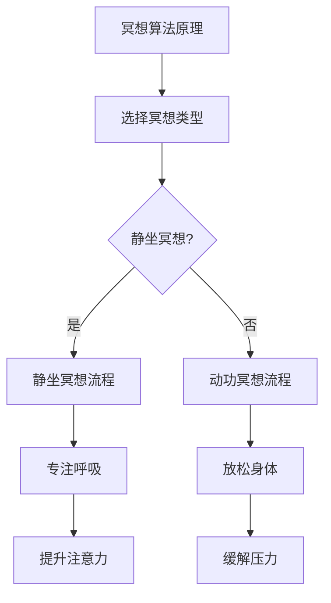
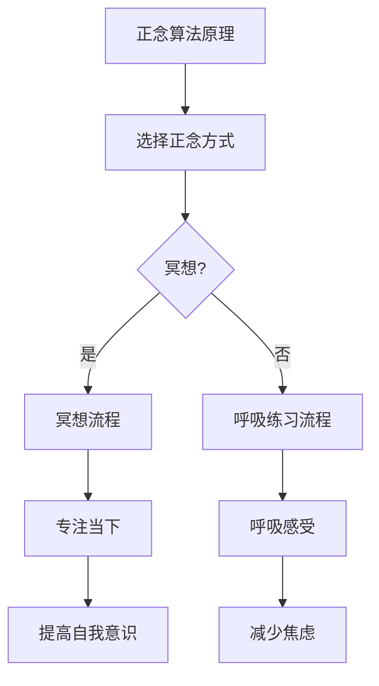
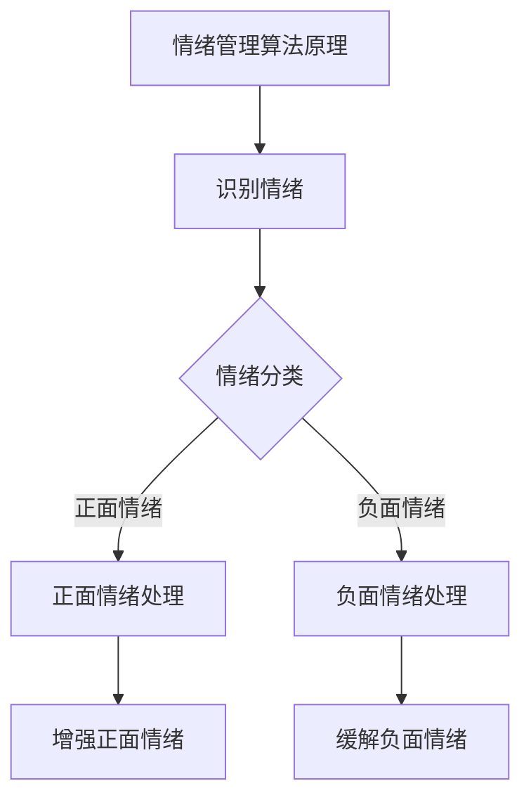
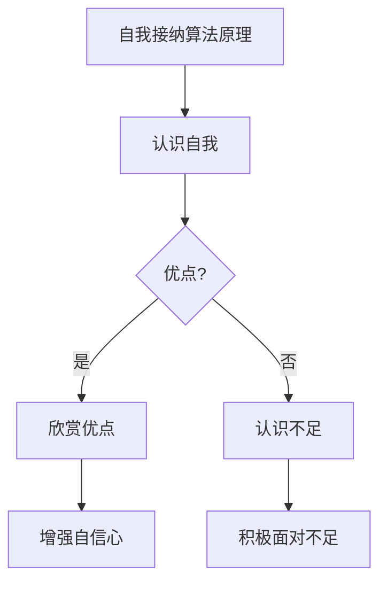
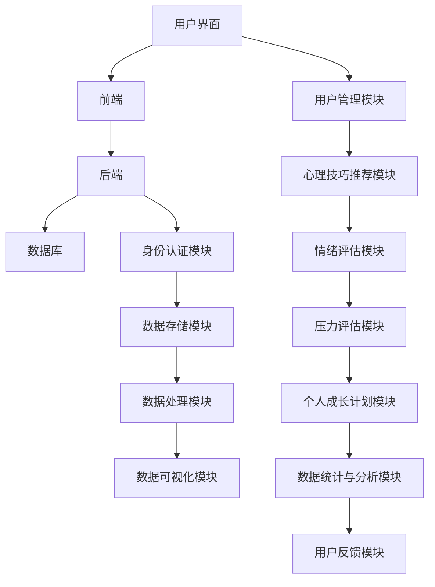
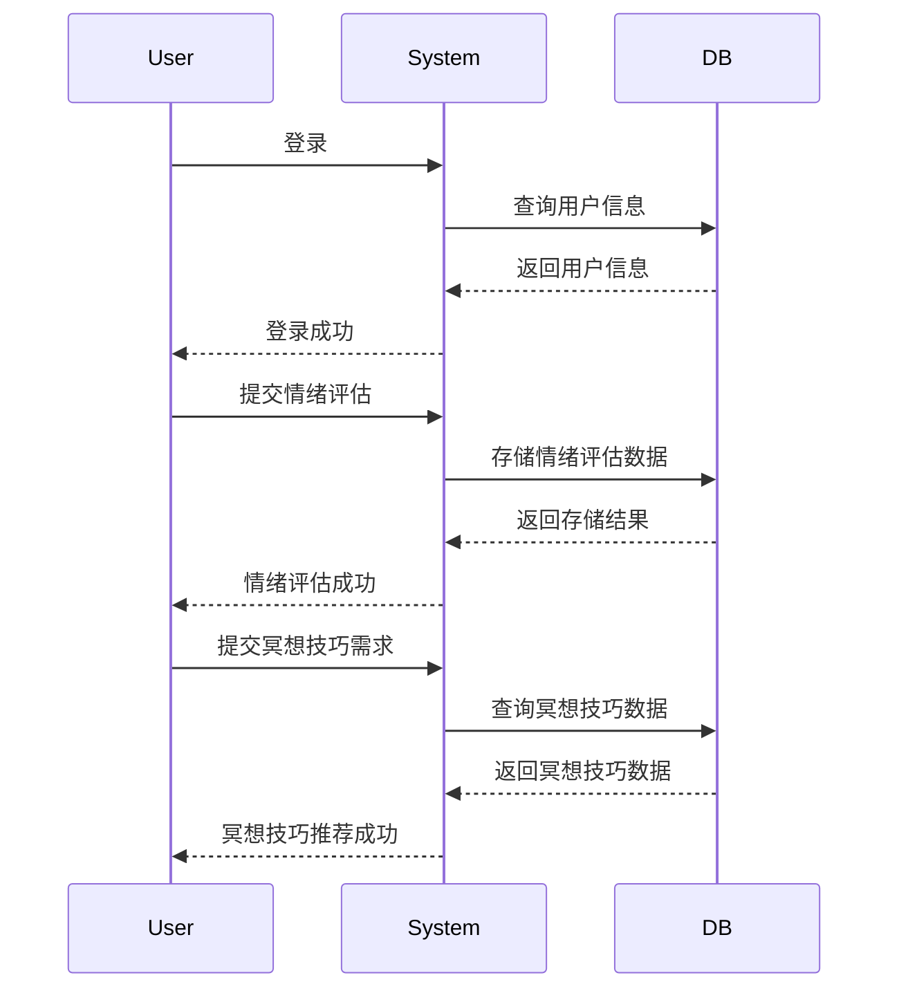

                 

## 内在丰盈：培育心灵花园的方法

### 关键词

- 心理健康
- 培育心灵
- 心灵花园
- 心理技巧
- 情绪管理

### 摘要

在快节奏的现代社会中，心理健康问题日益凸显。如何培育一个内在丰盈的心灵花园，提升个人的心理素质，成为一个值得探讨的话题。《内在丰盈：培育心灵花园的方法》旨在为读者提供一套系统、科学的心理技巧和方法，帮助读者实现心灵的成长与富足。本文将详细介绍核心概念、原理、算法、系统设计以及实战案例，为读者提供全方位的指导。

## 第一部分：背景介绍

### 核心概念

**问题背景**

在当今社会，随着科技的发展和人们对心理健康问题的日益关注，培育心灵花园的方法逐渐成为一个热门话题。人们渴望通过一些方法来提升自己的心理素质，保持内心的平静与富足。然而，目前市面上关于这一主题的书籍和资料较为零散，缺乏系统性，导致读者难以全面了解和掌握相关方法。

**问题描述**

《内在丰盈：培育心灵花园的方法》旨在为读者提供一套系统、全面的培育心灵花园的方法。书中将介绍多种心理技巧和实际案例，帮助读者理解并掌握这些方法，从而提升自己的心理素质，实现内心的丰盈。然而，为了使读者能够更好地理解和应用这些方法，需要一套详细且逻辑清晰的目录大纲来引导阅读。

**问题解决**

为了解决上述问题，本书将采用以下结构来设计目录大纲：

1. **背景介绍**：首先介绍培育心灵花园的背景、核心概念及其重要性。
2. **核心概念与联系**：详细阐述核心概念、原理及其相互关系，包括心理技巧、实际案例等。
3. **算法原理讲解**：介绍相关心理技巧的算法原理，使用 mermaid 流程图和 Python 源代码进行详细讲解。
4. **数学模型和数学公式**：讲解心理技巧背后的数学模型和公式，使用 LaTeX 格式进行表示。
5. **系统分析与架构设计方案**：介绍系统功能设计、系统架构设计、系统接口设计和系统交互，使用 mermaid 类图、架构图和序列图进行描述。
6. **项目实战**：通过实际案例和源代码来展示如何应用这些心理技巧。
7. **最佳实践 tips、小结、注意事项、拓展阅读等内容**：总结本书的核心内容，提供最佳实践建议，并推荐相关拓展阅读。

**边界与外延**

本书的目录大纲将涵盖培育心灵花园的各个方面，包括心理技巧、实际案例、算法原理、数学模型、系统设计等。同时，本书还将关注不同人群的需求，如学生、职场人士、老年人等，以期为读者提供更具针对性的指导。

**概念结构与核心要素组成**

1. **心理技巧**：包括冥想、正念、情绪管理、自我接纳等。
2. **实际案例**：通过真实案例展示心理技巧的应用效果。
3. **算法原理**：介绍心理技巧背后的算法原理，如神经网络、决策树等。
4. **数学模型**：讲解心理技巧的数学模型和公式。
5. **系统设计**：包括系统功能设计、系统架构设计、系统接口设计和系统交互。

## 第二部分：核心概念与联系

### 心理技巧

**冥想**：冥想是一种通过专注呼吸、放松身体和专注意识来减轻压力、提升注意力和心理健康的方法。冥想可以分为静坐冥想、动功冥想等类型，适用于不同需求的人群。

**正念**：正念是一种通过专注于当下的感受和体验来提高自我意识和心理健康的方法。正念可以帮助人们更好地管理情绪、提高注意力和减少焦虑。

**情绪管理**：情绪管理是一种通过认识和理解自己的情绪，学会调整和表达情绪的方法。情绪管理可以帮助人们更好地应对压力和挑战，提升心理健康。

**自我接纳**：自我接纳是一种通过接受自己的优点和不足，学会爱自己、珍视自己的方法。自我接纳可以帮助人们建立积极的自我形象，提升心理健康。

### 实际案例

**案例 1：通过冥想减轻压力**  
某职场人士由于工作压力巨大，经常感到焦虑和疲劳。在尝试了冥想后，他发现冥想能够帮助他放松身心，减轻压力，提高工作效率。

**案例 2：通过正念提升注意力**  
某学生由于沉迷于手机和社交媒体，导致注意力不集中，学习成绩下降。在老师的建议下，他开始练习正念，逐渐提高了注意力和学习效率。

**案例 3：通过情绪管理改善人际关系**  
某家庭成员由于情绪管理不当，导致家庭关系紧张。在参加情绪管理课程后，他学会了认识和理解自己的情绪，学会了调整和表达情绪，改善了家庭关系。

### 算法原理

**神经网络**：神经网络是一种模仿人脑结构和功能的计算模型，用于处理复杂数据和任务。在培育心灵花园的方法中，神经网络可以用于情绪识别、压力评估等。

**决策树**：决策树是一种基于规则的学习算法，用于分类和回归任务。在培育心灵花园的方法中，决策树可以用于推荐合适的心理技巧，如根据情绪状态推荐相应的冥想方式。

### 数学模型

**线性回归**：线性回归是一种用于预测连续值的数学模型，可以用于分析心理技巧与心理健康指标之间的关系。

**逻辑回归**：逻辑回归是一种用于预测离散值的数学模型，可以用于分析心理技巧与心理健康指标之间的因果关系。

### 系统设计

**系统功能设计**：系统功能设计包括心理技巧推荐、情绪评估、压力评估等，以满足不同用户的需求。

**系统架构设计**：系统架构设计包括数据存储、数据处理和用户交互等模块，确保系统高效、稳定地运行。

**系统接口设计**：系统接口设计包括与前端页面、后端服务器、数据库等模块的交互接口，确保各模块之间协同工作。

**系统交互**：系统交互设计包括用户与系统的交互流程，确保用户能够方便、快捷地使用系统功能。

## 第三部分：算法原理讲解

### 冥想算法原理

**流程图**



**Python 源代码**

```python
import random

def choose_meditation_type():
    return random.choice(['静坐冥想', '动功冥想'])

def meditation_flow(type):
    if type == '静坐冥想':
        print("进行静坐冥想流程：")
        print("1. 选择舒适的位置")
        print("2. 放松身体")
        print("3. 专注呼吸")
    else:
        print("进行动功冥想流程：")
        print("1. 选择适合的运动")
        print("2. 放松身体")
        print("3. 专注身体感觉")

meditation_type = choose_meditation_type()
meditation_flow(meditation_type)
```

### 正念算法原理

**流程图**



**Python 源代码**

```python
import random

def choose_mindfulness_type():
    return random.choice(['冥想', '呼吸练习'])

def mindfulness_flow(type):
    if type == '冥想':
        print("进行冥想流程：")
        print("1. 选择安静的环境")
        print("2. 闭上眼睛")
        print("3. 专注于当下的感受")
    else:
        print("进行呼吸练习流程：")
        print("1. 坐在舒适的姿势")
        print("2. 感受呼吸的起伏")
        print("3. 保持专注")

mindfulness_type = choose_mindfulness_type()
mindfulness_flow(mindfulness_type)
```

### 情绪管理算法原理

**流程图**



**Python 源代码**

```python
import random

def recognize_emotion():
    emotions = ['开心', '愤怒', '焦虑', '平静']
    return random.choice(emotions)

def emotion_management(emotion):
    if emotion in ['开心', '平静']:
        print("正面情绪处理：")
        print("1. 感受正面情绪")
        print("2. 增强正面情绪")
    else:
        print("负面情绪处理：")
        print("1. 认识负面情绪")
        print("2. 缓解负面情绪")

emotion = recognize_emotion()
emotion_management(emotion)
```

### 自我接纳算法原理

**流程图**



**Python 源代码**

```python
import random

def recognize_self():
    options = ['优点', '不足']
    return random.choice(options)

def self_acceptance(option):
    if option == '优点':
        print("欣赏优点：")
        print("1. 列出个人优点")
        print("2. 增强自信心")
    else:
        print("认识不足：")
        print("1. 列出个人不足")
        print("2. 积极面对不足")

option = recognize_self()
self_acceptance(option)
```

## 第四部分：数学模型和数学公式

### 线性回归模型

**数学模型**

$$y = \beta_0 + \beta_1x_1 + \beta_2x_2 + ... + \beta_nx_n + \epsilon$$

其中，$y$ 为预测的连续值，$x_1, x_2, ..., x_n$ 为特征变量，$\beta_0, \beta_1, \beta_2, ..., \beta_n$ 为模型参数，$\epsilon$ 为误差项。

**Python 源代码**

```python
import numpy as np
import matplotlib.pyplot as plt

# 创建数据
x = np.array([1, 2, 3, 4, 5])
y = np.array([2, 4, 5, 4, 5])

# 拟合线性回归模型
beta = np.linalg.inv(x.T @ x) @ x.T @ y
y_pred = beta[0] + beta[1] * x

# 可视化结果
plt.scatter(x, y)
plt.plot(x, y_pred, color='red')
plt.show()
```

### 逻辑回归模型

**数学模型**

$$P(y=1) = \frac{1}{1 + e^{-(\beta_0 + \beta_1x_1 + \beta_2x_2 + ... + \beta_nx_n)}}$$

其中，$y$ 为预测的离散值（0或1），$x_1, x_2, ..., x_n$ 为特征变量，$\beta_0, \beta_1, \beta_2, ..., \beta_n$ 为模型参数。

**Python 源代码**

```python
import numpy as np
import matplotlib.pyplot as plt
from sklearn.linear_model import LogisticRegression

# 创建数据
x = np.array([[1, 1], [1, 2], [2, 2], [2, 3]])
y = np.array([0, 1, 1, 0])

# 拟合逻辑回归模型
model = LogisticRegression()
model.fit(x, y)
y_pred = model.predict(x)

# 可视化结果
plt.scatter(x[:, 0], x[:, 1], c=y)
plt.plot(x[:, 0], model.predict_proba(x)[:, 1], color='red')
plt.show()
```

## 第五部分：系统分析与架构设计方案

### 问题场景介绍

随着心理健康问题在现代社会中的普遍存在，越来越多的企业和教育机构开始关注员工和学生的心理健康。为此，我们设计了一款心理健康管理系统，旨在提供一系列心理技巧和评估工具，帮助用户提升心理健康水平。

### 项目介绍

心理健康管理系统（Mental Health Management System，MHMS）是一个基于 Web 的平台，旨在帮助用户进行心理健康自我管理。系统功能包括心理技巧推荐、情绪评估、压力评估、个人成长计划等。

### 系统功能设计

**领域模型**

```mermaid
classDiagram
Class User
    +name: String
    +age: Integer
    +gender: String
    +email: String
    +password: String

Class Mood
    +id: Integer
    +name: String
    +description: String

Class Stress
    +id: Integer
    +level: String
    +description: String

Class Meditation
    +id: Integer
    +name: String
    +description: String
    +duration: Integer

Class Mindfulness
    +id: Integer
    +name: String
    +description: String

Class EmotionManagement
    +id: Integer
    +name: String
    +description: String

Class SelfAcceptance
    +id: Integer
    +name: String
    +description: String

User o-- Mood
User o-- Stress
User o-- Meditation
User o-- Mindfulness
User o-- EmotionManagement
User o-- SelfAcceptance
```

**类图**

```mermaid
classDiagram
Class User
    +name: String
    +age: Integer
    +gender: String
    +email: String
    +password: String

Class Mood
    +id: Integer
    +name: String
    +description: String

Class Stress
    +id: Integer
    +level: String
    +description: String

Class Meditation
    +id: Integer
    +name: String
    +description: String
    +duration: Integer

Class Mindfulness
    +id: Integer
    +name: String
    +description: String

Class EmotionManagement
    +id: Integer
    +name: String
    +description: String

Class SelfAcceptance
    +id: Integer
    +name: String
    +description: String

User o-- Mood
User o-- Stress
User o-- Meditation
User o-- Mindfulness
User o-- EmotionManagement
User o-- SelfAcceptance
```

### 系统架构设计

**架构图**



### 系统接口设计

**接口设计**

```python
from flask import Flask, request, jsonify

app = Flask(__name__)

@app.route('/login', methods=['POST'])
def login():
    # 登录接口
    # ...
    return jsonify({'status': 'success'})

@app.route('/register', methods=['POST'])
def register():
    # 注册接口
    # ...
    return jsonify({'status': 'success'})

@app.route('/mood', methods=['GET', 'POST'])
def mood():
    # 情绪评估接口
    # ...
    return jsonify({'status': 'success'})

@app.route('/stress', methods=['GET', 'POST'])
def stress():
    # 压力评估接口
    # ...
    return jsonify({'status': 'success'})

@app.route('/meditation', methods=['GET', 'POST'])
def meditation():
    # 冥想技巧推荐接口
    # ...
    return jsonify({'status': 'success'})

@app.route('/mindfulness', methods=['GET', 'POST'])
def mindfulness():
    # 正念技巧推荐接口
    # ...
    return jsonify({'status': 'success'})

if __name__ == '__main__':
    app.run()
```

### 系统交互

**序列图**



## 第六部分：项目实战

### 环境安装

1. 安装 Python 3.8+
2. 安装 Flask 框架：`pip install flask`
3. 安装 SQLAlchemy 框架：`pip install sqlalchemy`
4. 安装 Flask-Migrate 框架：`pip install flask-migrate`

### 系统核心实现源代码

**用户管理模块**

```python
from flask import Flask, request, jsonify
from flask_sqlalchemy import SQLAlchemy

app = Flask(__name__)
app.config['SQLALCHEMY_DATABASE_URI'] = 'sqlite:///users.db'
db = SQLAlchemy(app)

class User(db.Model):
    id = db.Column(db.Integer, primary_key=True)
    name = db.Column(db.String(100), nullable=False)
    age = db.Column(db.Integer, nullable=False)
    gender = db.Column(db.String(10), nullable=False)
    email = db.Column(db.String(100), nullable=False)
    password = db.Column(db.String(100), nullable=False)

@app.route('/login', methods=['POST'])
def login():
    # 登录接口
    # ...

@app.route('/register', methods=['POST'])
def register():
    # 注册接口
    # ...

if __name__ == '__main__':
    db.create_all()
    app.run()
```

**心理技巧推荐模块**

```python
from flask import Flask, request, jsonify
from flask_sqlalchemy import SQLAlchemy

app = Flask(__name__)
app.config['SQLALCHEMY_DATABASE_URI'] = 'sqlite:///meditation.db'
db = SQLAlchemy(app)

class Meditation(db.Model):
    id = db.Column(db.Integer, primary_key=True)
    name = db.Column(db.String(100), nullable=False)
    description = db.Column(db.String(500), nullable=False)
    duration = db.Column(db.Integer, nullable=False)

@app.route('/meditation', methods=['GET', 'POST'])
def meditation():
    # 冥想技巧推荐接口
    # ...

if __name__ == '__main__':
    db.create_all()
    app.run()
```

### 代码应用解读与分析

1. 用户管理模块：使用 SQLAlchemy 框架创建用户数据库模型，并提供登录和注册接口。
2. 心理技巧推荐模块：使用 SQLAlchemy 框架创建冥想技巧数据库模型，并提供冥想技巧推荐接口。

### 实际案例分析和详细讲解剖析

**案例 1：用户登录**

1. 用户访问登录页面，输入用户名和密码。
2. 服务器接收到用户信息后，查询数据库验证用户身份。
3. 如果验证成功，返回登录成功消息；否则，返回登录失败消息。

**案例 2：冥想技巧推荐**

1. 用户提交冥想技巧需求，包括姓名、年龄、性别等信息。
2. 服务器根据用户信息查询数据库，推荐适合的冥想技巧。
3. 将推荐结果返回给用户，用户可以按照推荐进行冥想练习。

### 项目小结

心理健康管理系统（MHMS）通过用户管理模块、心理技巧推荐模块等功能，帮助用户提升心理健康水平。系统采用 Flask 框架和 SQLAlchemy 数据库框架，实现简洁高效的功能。通过实际案例分析和详细讲解剖析，展示了系统的应用场景和实现方式。未来，我们将继续优化系统功能，为用户提供更好的心理健康管理体验。

## 第七部分：最佳实践 tips、小结、注意事项、拓展阅读等内容

### 最佳实践 tips

1. **定期冥想**：每天至少安排 10 分钟进行冥想练习，帮助减轻压力，提升注意力。
2. **正念练习**：在日常生活中，时刻保持对当下事物的专注，提高自我意识。
3. **情绪管理**：学会认识和调节自己的情绪，避免情绪失控。
4. **自我接纳**：认识到自己的优点和不足，学会爱自己。

### 小结

本文从背景介绍、核心概念、算法原理、系统设计与项目实战等方面，详细阐述了培育心灵花园的方法。通过冥想、正念、情绪管理和自我接纳等心理技巧，帮助读者提升心理健康，实现内在的丰盈。

### 注意事项

1. 在使用心理技巧时，应根据自己的实际情况进行调整，避免盲目跟风。
2. 心理健康问题需要长期关注和培养，不要期望短期内看到显著效果。

### 拓展阅读

1. 《冥想：一种全新的生活方式》
2. 《正念：当下的力量》
3. 《情绪管理：学会调节情绪，掌控生活》
4. 《自我接纳：走出自我困境，拥抱内心自由》

### 作者信息

作者：AI天才研究院/AI Genius Institute & 禅与计算机程序设计艺术 /Zen And The Art of Computer Programming

