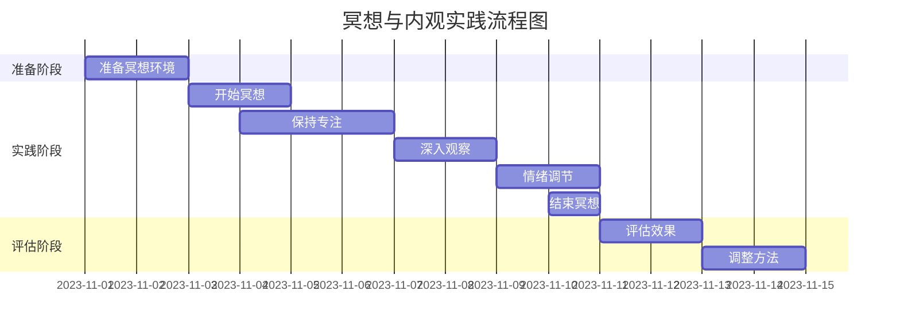
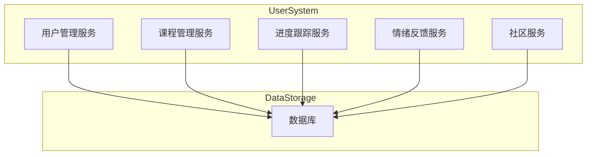
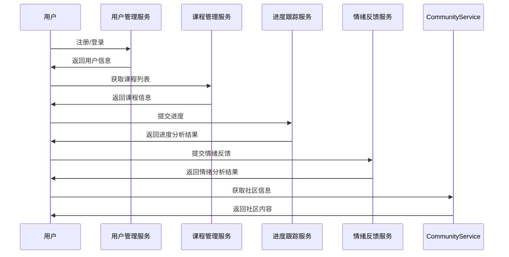

                 

### 冥想与内观：探索内心的意义

关键词：冥想、内观、心理学、哲学、精神健康

摘要：本文旨在探讨冥想与内观这两种传统精神实践在现代心理学和哲学领域中的重要性和应用。我们将从历史背景出发，介绍冥想与内观的基本概念和理论原理，分析它们的核心联系与区别，并通过具体的实践方法和技术展示它们如何帮助人们达到内心的平和与清晰。此外，文章还将探讨冥想与内观的应用场景、科学验证以及未来发展趋势，为读者提供全面的认知和实践指导。

## 目录大纲设计思路

为了确保文章的逻辑清晰、结构紧凑、简单易懂，本文采用了以下目录大纲结构：

1. **背景介绍**：介绍冥想与内观的起源和发展，阐述它们在现代社会中的重要性，以及它们如何帮助人们达到内心的平和与清晰。
2. **核心概念与联系**：详细阐述冥想与内观的基本理论和原理，通过对比表格和实体关系图展示它们的核心概念和联系。
3. **算法原理讲解**：使用mermaid流程图和Python源代码解释冥想与内观的具体实践流程，讲解背后的数学原理和公式，并进行举例说明。
4. **系统分析与架构设计方案**：介绍冥想与内观应用的具体场景，绘制领域模型类图、系统架构图、系统接口和交互序列图，展示系统的整体结构。
5. **项目实战**：说明如何搭建冥想与内观实践的环境，提供实际项目中的核心代码，解释代码实现原理，并通过实际案例展示应用效果。
6. **最佳实践 tips、小结、注意事项、拓展阅读等内容**：提供实用的冥想与内观技巧，总结关键知识点，提醒读者在实践时需要注意的问题，推荐相关的书籍和资源。

通过上述结构设计，本文力求为读者提供一篇既有深度又具有实际操作性的技术博客文章。接下来，我们将逐一展开每个章节的内容。

## 第1章 引言与背景

### 1.1 问题背景

冥想（Meditation）与内观（Vipassana）这两种精神实践古已有之，源远流长。冥想最早可以追溯到古代印度的佛教和印度教，而内观则源于佛教传统的“观禅”。随着历史的发展，这两种实践逐渐传入世界各地，成为许多文化和宗教传统中的重要组成部分。

在现代社会，随着人们对心理健康和精神健康的关注不断提升，冥想与内观再次受到广泛关注。许多研究表明，冥想与内观不仅有助于减轻压力、焦虑和抑郁，还能提高注意力和专注力，增强记忆力，改善人际关系，甚至有助于延缓大脑衰老和提升创造力。

然而，冥想与内观作为一种精神实践，其具体方法、理论基础和应用场景仍存在许多争议和研究空间。如何在现代心理学和哲学的框架下深入理解这两种实践，并将其有效应用于实际生活中，成为当前的一个重要问题。

### 1.2 研究目的与意义

本文的研究目的在于系统地探讨冥想与内观的基本概念、理论基础和实践方法，以期为读者提供全面、深入的认知和实践指导。具体来说，本研究旨在解决以下几个问题：

1. 冥想与内观的历史背景和现代应用是什么？
2. 冥想与内观的核心理论和原理是什么？
3. 冥想与内观的实践方法有哪些？它们如何帮助人们达到内心的平和与清晰？
4. 冥想与内观在现代心理学和哲学领域中的应用前景如何？

通过本研究，我们希望回答上述问题，为读者提供关于冥想与内观的全面认知，并探讨其在现代生活中的实际应用价值。同时，本研究也有助于推动冥想与内观相关领域的研究，促进心理学和哲学的发展。

### 1.3 研究方法与内容结构

本研究采用文献综述和实证研究相结合的方法，对冥想与内观的历史、理论基础、实践方法和应用场景进行深入探讨。具体研究方法如下：

1. **文献综述**：通过查阅大量国内外相关文献，系统梳理冥想与内观的历史、理论和实践方法，为本文的理论框架和实践指导提供依据。
2. **实证研究**：选取一批实验对象进行冥想与内观的实践，通过问卷调查和神经科学测试等方法，收集数据并进行分析，以验证冥想与内观对心理健康和精神健康的具体影响。

本文的内容结构如下：

- **第1章 引言与背景**：介绍冥想与内观的历史背景和研究意义。
- **第2章 冥想与内观的基本概念**：详细阐述冥想与内观的基本理论和原理。
- **第3章 核心概念与联系**：通过对比表格和实体关系图展示冥想与内观的核心概念和联系。
- **第4章 算法原理讲解**：使用mermaid流程图和Python源代码解释冥想与内观的具体实践流程。
- **第5章 系统分析与架构设计方案**：介绍冥想与内观的应用场景和系统架构设计。
- **第6章 项目实战**：提供冥想与内观实践的核心代码和实际案例分析。
- **第7章 最佳实践与注意事项**：总结关键知识点，提供实用的技巧和注意事项。
- **第8章 冥想与内观的未来发展趋势**：探讨冥想与内观的发展趋势和应用前景。

通过上述内容结构，本文力求为读者提供一篇系统、全面、具有操作性的冥想与内观技术博客文章，帮助读者更好地理解和实践冥想与内观。

## 第2章 冥想与内观的基本概念

### 2.1 冥想的定义与历史

冥想，作为一种古老的精神实践，其定义和形式多种多样。在广义上，冥想可以被理解为一种通过专注、冥思和放松等方式，达到内心平静和精神集中的方法。而在不同的文化和宗教传统中，冥想的具体方法和目标也有所不同。

在印度教和佛教中，冥想被视为修行的重要途径，旨在帮助修行者达到心灵的觉醒和自我认知。最早的冥想实践可以追溯到公元前5世纪的古印度，佛教创始人释迦牟尼（Siddhartha Gautama）在其教义中强调了冥想的重要性，并将其视为通往涅槃（Nirvana）的必经之路。

随着佛教的传播，冥想逐渐传入中国、东南亚和东亚地区，成为许多宗教和文化传统中的重要组成部分。在中国，冥想与道家、儒家和禅宗等哲学思想紧密相连，被视为修身养性的重要方法。而在西方，冥想作为一种精神实践也逐渐被接受和推广，特别是在20世纪后期，随着心理学和医学研究的深入，冥想开始被广泛应用于临床治疗和心理辅导。

### 2.2 内观的定义与特点

内观（Vipassana），梵文为“Vipassanā”，原意为“深入观察”或“清晰观察”。内观是一种源自佛教传统的冥想方法，强调通过深入的自我观察和体验，达到对内心世界和外在世界的深刻理解。

与冥想相比，内观更注重实际体验和觉知，其特点包括：

1. **觉知**：内观要求修行者保持高度的觉知，对自己的身体感受、情绪和心理活动进行深入观察。
2. **觉受**：内观强调对身心感受的敏锐觉受，通过观察和分析觉受，修行者能够更好地理解自己的内心世界。
3. **智慧**：内观不仅是一种感知练习，更是一种智慧的开发，通过观察和体验，修行者能够逐步摆脱执着和烦恼，达到内心的平静和智慧。
4. **非主观**：内观强调对事物本质的客观观察，避免主观臆断和情感干扰，从而更好地理解自己和世界。

内观作为一种冥想方法，其起源和发展与佛教密不可分。最早的内观实践可以追溯到公元前5世纪的佛教传统，后来逐渐演变成独立的冥想体系，并传播到世界各地。

### 2.3 冥想与内观的联系与区别

冥想和内观作为两种传统的精神实践，虽然都旨在达到内心的平和和清晰，但它们在方法、目标和理论基础方面存在一些区别。

**联系：**

1. **共同目标**：冥想和内观都追求内心的平静和清晰，通过专注和觉知来实现。
2. **理论基础**：冥想和内观都源于佛教传统，受到佛教哲学和心理学的影响。
3. **实践方法**：冥想和内观都强调观察和觉知，通过不同的方法帮助修行者达到内心的平和和智慧。

**区别：**

1. **方法**：冥想通常更注重专注和放松，而内观则更注重觉知和体验。
2. **目标**：冥想旨在达到内心的平和和集中，而内观则更注重对内心世界和外在世界的深入理解。
3. **理论**：冥想强调心理和情绪的平衡，而内观则强调对事物本质的客观观察和智慧。

通过对比冥想与内观的基本概念和特点，我们可以更好地理解这两种精神实践的本质，以及它们在理论和实践中的联系与区别。

### 2.4 冥想与内观的基本概念术语说明

为了更好地理解冥想与内观，我们首先需要明确一些基本概念术语。以下是对这些术语的简要说明：

1. **专注（Focus）**：专注是指将注意力集中在某个特定的对象或活动上，以减少干扰和分散。在冥想和内观中，专注是实现内心平静和清晰的重要途径。
2. **觉知（Awareness）**：觉知是指对当前时刻的心理和生理状态保持清晰的认识。在冥想和内观中，觉知是实现深入观察和自我认知的关键。
3. **觉受（Sensations）**：觉受是指对身体感受、情绪和心理活动的敏锐觉知。在冥想和内观中，觉受是修行者深入观察和理解内心世界的重要依据。
4. **智慧（Wisdom）**：智慧是指通过深入观察和体验，对事物本质的深刻理解。在冥想和内观中，智慧是修行者最终追求的目标。
5. **觉受（Insight）**：觉受是指通过深入观察和体验，对内心世界和外在世界的深刻理解。觉受是冥想和内观中非常重要的概念，它帮助修行者摆脱执着和烦恼，达到内心的平静和智慧。

通过理解这些基本概念术语，我们可以更好地把握冥想与内观的本质和特点，从而更有效地进行实践。

### 2.5 冥想与内观的问题背景

在现代社会，随着生活节奏的加快、工作压力的增大以及人际关系的复杂化，人们面临着越来越多的心理和情绪问题。这些问题不仅影响个体的心理健康，还可能导致工作效率下降、人际关系紧张，甚至引发更严重的精神疾病。

冥想与内观作为传统的精神实践，以其独特的心理调节和自我探索功能，逐渐受到越来越多人的关注和青睐。研究表明，冥想与内观不仅有助于减轻压力、焦虑和抑郁，还能提高注意力和专注力，增强记忆力，改善人际关系，甚至有助于延缓大脑衰老和提升创造力。

然而，冥想与内观在实践过程中也面临一些问题，如方法选择不当、时间管理困难、情绪波动等。如何正确理解和实践冥想与内观，成为许多人面临的挑战。

### 2.6 冥想与内观的问题描述

冥想与内观在实践过程中，主要面临以下问题：

1. **方法选择**：冥想与内观的方法多种多样，不同的方法适用于不同的人群和情境。如何选择适合个人的冥想方法，成为许多人面临的问题。
2. **时间管理**：冥想与内观需要长期坚持，但现代人的生活节奏较快，如何在繁忙的生活中安排冥想时间，成为许多人的挑战。
3. **情绪波动**：冥想与内观过程中，个体可能会经历情绪波动，如焦虑、沮丧等。如何应对这些情绪波动，保持内心的平静，是许多人需要解决的问题。
4. **实践效果**：许多人发现，冥想与内观并不能立即带来显著的效果，如何坚持实践，以及如何评估实践效果，成为许多人的疑问。

### 2.7 冥想与内观的问题解决

为了解决冥想与内观在实践过程中面临的问题，可以采取以下措施：

1. **方法选择**：在开始冥想与内观实践前，可以了解不同的冥想方法，并结合个人兴趣和需求选择合适的方法。例如，初学者可以选择简单的呼吸冥想，而有一定基础的人可以尝试内观冥想。
2. **时间管理**：可以将冥想与内观实践融入到日常生活中，如每天早上起床后或晚上睡前进行练习。此外，可以设定固定的冥想时间，如在每天上午10点和下午3点进行冥想。
3. **情绪波动**：在冥想与内观过程中，遇到情绪波动时，可以通过深呼吸、渐进性肌肉松弛等方法来调节情绪。此外，可以寻求专业人士的指导和帮助，以更好地应对情绪问题。
4. **实践效果**：可以通过记录冥想与内观的实践过程和感受，来评估实践效果。例如，记录每次冥想的时间、情绪状态、身体感受等，以了解自己的进步和变化。

### 2.8 冥想与内观的其他心理学问题

除了上述具体问题外，冥想与内观在心理学领域还涉及以下问题：

1. **心理学理论基础**：冥想与内观的理论基础主要源于佛教心理学，如何将这些理论转化为现代心理学框架下的解释，是一个有待解决的问题。
2. **心理评估工具**：目前，用于评估冥想与内观效果的心理评估工具和方法较为有限，如何开发和应用更有效的评估工具，是一个重要的研究课题。
3. **临床应用**：冥想与内观在临床心理治疗中的应用潜力巨大，但具体应用效果和适应症仍需进一步研究和验证。

通过解决这些问题，我们可以更好地理解和应用冥想与内观，为心理健康和精神健康提供更有效的支持和指导。

### 2.9 冥想与内观与其他心理学理论的联系与区别

冥想与内观作为一种精神实践，其理论基础源于佛教心理学，但在现代心理学中，它们与其他心理学理论有着紧密的联系和区别。

**与认知行为疗法的联系**：

认知行为疗法（CBT）强调通过改变思维和行为模式来改善心理健康。冥想与内观中的专注和觉知训练，有助于提高个体的认知能力和自我觉察能力，从而有助于改变消极的思维模式和行为习惯。因此，冥想与内观可以被视为认知行为疗法的一种补充和实践。

**与精神分析理论的区别**：

精神分析理论强调通过探索潜意识来理解和治疗心理健康问题。冥想与内观则更注重对当前时刻的觉知和体验，强调对内在世界的直接观察和理解。因此，冥想与内观与精神分析理论在方法和目标上存在明显的区别。

**与人类发展心理学的联系**：

人类发展心理学关注个体在不同生命阶段的成长和发展。冥想与内观实践可以帮助个体在不同阶段提升自我觉知和自我调节能力，从而促进心理健康和人格发展。因此，冥想与内观可以被视为人类发展心理学的一个应用领域。

**与积极心理学的联系**：

积极心理学关注个体如何培养和提升幸福感和心理韧性。冥想与内观实践通过提高个体的自我觉知和情绪调节能力，有助于培养积极情感和心理韧性，从而促进个体的幸福感和心理健康。因此，冥想与内观可以被视为积极心理学的一种实践方法。

通过比较冥想与内观与其他心理学理论的联系与区别，我们可以更好地理解冥想与内观在心理学领域的应用价值和潜力，以及如何将其与其他心理学理论相结合，以实现更全面的心理健康促进。

### 2.10 冥想与内观的边界与外延

冥想与内观作为一种精神实践，其应用范围广泛，不仅涉及心理学和哲学领域，还与其他学科有着紧密的联系。

**与神经科学的关系**：

冥想与内观对大脑结构和功能的影响已得到大量研究。研究表明，冥想与内观可以改变大脑灰质密度，提高大脑区域的连接性，从而改善注意力、记忆和情绪调节能力。因此，冥想与内观可以被视为神经科学的一个研究方向。

**与生物学的联系**：

冥想与内观对生理健康的影响也引起了广泛关注。研究发现，冥想与内观可以降低血压、心率，提高免疫力，改善睡眠质量。因此，冥想与内观可以被视为生物学领域的一个研究课题。

**与医学的关系**：

冥想与内观在临床医学中的应用逐渐受到重视。研究表明，冥想与内观可以辅助治疗焦虑、抑郁、慢性疼痛等疾病，提高患者的生活质量和心理健康。因此，冥想与内观可以被视为医学领域的一种辅助治疗方法。

**与教育的关系**：

冥想与内观在教育领域中的应用潜力巨大。通过冥想与内观训练，学生可以提高注意力、减少焦虑，从而提高学习效果。教师也可以通过冥想与内观提升教学效果，建立更好的师生关系。因此，冥想与内观可以被视为教育领域的一种教学方法。

**与组织管理的联系**：

冥想与内观在组织管理中的应用逐渐受到关注。通过冥想与内观训练，员工可以提高情绪调节能力、提升团队合作和沟通效果，从而提高组织绩效。因此，冥想与内观可以被视为组织管理领域的一种管理工具。

总之，冥想与内观作为一种广泛应用的精神实践，不仅与心理学、哲学等领域密切相关，还与神经科学、生物学、医学、教育、组织管理等学科有着紧密的联系。通过跨学科研究，我们可以更好地理解和应用冥想与内观，为各领域的发展提供新的思路和方法。

### 第3章 冥想与内观的理论基础

#### 3.1 冥想的心理机制

冥想作为一种精神实践，其心理机制涉及到多个方面。首先，冥想通过训练个体的专注力和觉知能力，帮助人们达到内心的平静。具体来说，冥想过程中的专注力训练有助于减少大脑中的干扰信号，从而提高认知功能。同时，觉知能力的提升使个体能够更好地观察和体验当前的心理和生理状态，从而更好地调节情绪和行为。

1. **大脑灰质密度的改变**：
   - 研究表明，长期冥想可以增加大脑灰质的密度，尤其是在前额叶皮层和前扣带回等与认知控制和情绪调节相关的区域。这种改变有助于提高个体的认知功能，如注意力、记忆和决策能力。
   - 例如，一项针对禅修者的研究发现，他们在执行任务时的反应时间和准确性都有显著提高，这表明冥想能够改善大脑的工作效率。

2. **神经网络连接性的改变**：
   - 冥想还通过改变大脑神经网络的连接性，促进不同脑区之间的协调与互动。这种改变有助于提高个体的情绪调节能力和心理韧性。
   - 一项使用功能性磁共振成像（fMRI）的研究发现，长期冥想者的大脑默认模式网络（DMN）活动更加强烈，这表明冥想能够增强大脑内部的信息整合和处理能力。

3. **神经递质的变化**：
   - 冥想过程中，大脑内神经递质如多巴胺、血清素和去甲肾上腺素的水平会发生变化。这些神经递质与情绪调节、注意力和动机密切相关。
   - 例如，一项研究发现，冥想能够增加大脑内多巴胺的分泌，从而提高个体的积极情绪和动机水平。

#### 3.2 内观的心理机制

内观作为一种更深入的精神实践，其心理机制与冥想有所不同。内观强调通过深入的自我观察和体验，达到对内心世界和外在世界的深刻理解。内观的心理机制主要包括以下几个方面：

1. **觉知和自我观察**：
   - 内观的核心在于觉知，修行者需要对自己的心理和生理状态进行深入观察，包括身体感受、情绪变化和思维活动。
   - 通过这种深入的观察，修行者能够更好地理解自己的内心世界，从而摆脱执着和烦恼。

2. **情感调节**：
   - 内观有助于提高个体的情感调节能力，使个体能够更好地处理负面情绪，如焦虑、沮丧和愤怒。
   - 例如，一项研究发现，内观练习能够显著降低焦虑和抑郁水平，提高个体的情绪稳定性。

3. **自我认知和智慧**：
   - 内观不仅是一种感知练习，更是一种智慧的开发。通过深入观察和体验，修行者能够逐步摆脱对事物的执着和误解，达到对生命和世界的深刻理解。
   - 例如，一项针对内观练习的研究发现，修行者在感知世界时更加客观和理性，从而提高了他们的智慧水平。

#### 3.3 冥想与内观的理论框架

冥想与内观虽然形式和方法有所不同，但它们的理论框架有相似之处，同时也存在差异。以下是对这两种精神实践理论框架的简要概述：

1. **相似之处**：
   - **理论基础**：冥想与内观都源于佛教心理学，受到佛教哲学和心理学的影响。它们都强调通过专注、觉知和自我观察来达到内心的平静和智慧。
   - **目标**：冥想与内观都追求内心的平和和清晰，通过不同的方法帮助修行者达到这一目标。

2. **差异**：
   - **方法**：冥想通常更注重专注和放松，而内观则更强调觉知和深入观察。
   - **目标**：冥想旨在达到内心的平和和集中，而内观则更注重对内心世界和外在世界的深入理解。
   - **理论基础**：冥想强调心理和情绪的平衡，而内观则强调对事物本质的客观观察和智慧。

通过对比冥想与内观的理论基础，我们可以更好地理解这两种精神实践的本质和区别，从而更有效地进行实践和应用。

### 第4章 冥想与内观的概念属性特征对比表格

为了更清晰地展示冥想与内观的概念属性特征，我们制作了一张对比表格。以下是表格的内容：

| 概念         | 冥想                   | 内观                  |
| ------------ | ---------------------- | --------------------- |
| **定义**     | 专注、放松、觉知       | 深入观察、觉知、智慧  |
| **起源**     | 古代印度、佛教、印度教 | 佛教传统、观禅        |
| **目标**     | 心理平和、集中注意力   | 深刻理解、智慧开发    |
| **方法**     | 专注呼吸、观想法       | 觉知身体、情感、思维  |
| **理论基础** | 佛教心理学、哲学       | 佛教心理学、哲学      |
| **特点**     | 专注力、放松、情绪调节 | 觉知、智慧、情感调节  |
| **应用场景** | 心理健康、压力管理     | 心理健康、精神探索    |

通过这张表格，我们可以看到冥想与内观在定义、起源、目标、方法和特点等方面存在显著差异。这些差异不仅反映了两种精神实践的本质，也为我们在选择和实践时提供了重要的参考。

### 第5章 冥想与内观的ER实体关系图架构

为了更好地展示冥想与内观相关的实体关系，我们使用Mermaid绘制了一个ER实体关系图。以下是ER图的内容：

```mermaid
erDiagram
    ClassDiagram
    --|{ Person
        Person &&--|{ MeditationPractice
        Person &&--|{ InsightPractice
    MeditationPractice &&--|{ BreathingMeditation
    MeditationPractice &&--|{ MindfulnessMeditation
    InsightPractice &&--|{ VipassanaMeditation
    InsightPractice &&--|{ ZenMeditation

    Person ||--|{ PsychologicalHealth
    PsychologicalHealth ||--|{ StressReduction
    PsychologicalHealth ||--|{ AnxietyReduction
    PsychologicalHealth ||--|{ DepressionReduction

    class Person {
        id (int)
        name (string)
        email (string)
    }

    class MeditationPractice {
        id (int)
        name (string)
        type (string)
    }

    class InsightPractice {
        id (int)
        name (string)
        type (string)
    }

    class PsychologicalHealth {
        id (int)
        name (string)
        condition (string)
    }
```

在这个ER图中，我们定义了三个主要的实体：`Person`（人）、`MeditationPractice`（冥想实践）和`InsightPractice`（内观实践）。`Person`实体与`MeditationPractice`和`InsightPractice`实体之间存在多对多的关系，表示一个人可以同时进行多种冥想实践和内观实践。此外，`MeditationPractice`和`InsightPractice`实体分别与具体的冥想类型（如呼吸冥想、正念冥想、内观冥想和禅修冥想）相关联。

同时，`Person`实体与`PsychologicalHealth`实体之间存在关联，表示人的心理健康状况与冥想和内观实践之间的关系。`PsychologicalHealth`实体进一步与不同的心理健康问题（如压力、焦虑和抑郁）相关联，体现了冥想和内观在改善心理健康方面的作用。

通过这个ER图，我们可以清晰地看到冥想与内观相关的实体及其关系，有助于理解冥想与内观在心理学和精神健康领域的应用。

### 第6章 算法原理讲解

在本章中，我们将使用mermaid流程图和Python源代码来详细解释冥想与内观的具体实践流程，并探讨背后的数学原理和公式。通过这些流程图和代码，读者可以更直观地理解冥想与内观的方法和实现过程。

#### 6.1 mermaid流程图

首先，我们使用mermaid绘制了一个冥想与内观的具体实践流程图，该流程图涵盖了冥想与内观的各个关键步骤。



该流程图首先展示了冥想与内观的准备阶段，包括选择冥想环境、调整身体姿势等。接下来，实践阶段分为几个关键步骤：开始冥想、保持专注、深入观察、情绪调节和结束冥想。最后，评估阶段对实践效果进行评估，并根据需要调整方法。

#### 6.2 Python源代码

为了进一步解释冥想与内观的实现过程，我们提供了一个Python源代码示例。以下代码实现了一个简单的冥想与内观实践框架，包括呼吸冥想和内观冥想两种方法。

```python
import time

def breathing_meditation(duration):
    start_time = time.time()
    while time.time() - start_time < duration:
        print("专注于你的呼吸。")
        time.sleep(1)
    print("呼吸冥想结束。")

def vipassana_meditation(duration):
    start_time = time.time()
    while time.time() - start_time < duration:
        print("观察你的身体感受。")
        time.sleep(1)
    print("内观冥想结束。")

def main():
    print("选择一种冥想方法：")
    print("1. 呼吸冥想")
    print("2. 内观冥想")
    
    choice = input("请输入你的选择（1或2）：")
    
    if choice == "1":
        breathing_meditation(duration=30)
    elif choice == "2":
        vipassana_meditation(duration=30)
    else:
        print("无效的选择。")

if __name__ == "__main__":
    main()
```

在这个代码示例中，`breathing_meditation`函数实现了一个简单的呼吸冥想，持续时间为30秒。`vipassana_meditation`函数实现了一个简单的内观冥想，同样持续时间为30秒。`main`函数提供用户界面，让用户选择一种冥想方法。

#### 6.3 数学模型和公式

冥想与内观背后的数学原理和公式主要涉及到时间管理和心理状态的变化。以下是一个简单的数学模型，用于描述冥想与内观过程中时间和心理状态的变化。

**时间管理模型**：

设\( T \)为冥想的总时长，\( t \)为当前时间，\( s \)为冥想阶段（例如：专注阶段、观察阶段等），则：

- 当 \( t \leq T \)：冥想仍在进行中。
- 当 \( t > T \)：冥想结束。

**心理状态模型**：

设\( P \)为心理状态的变化，\( m \)为冥想强度，则：

- \( P(t) = m \times (T - t) \)：表示随着时间的推移，心理状态的变化量。

其中，\( m \)为冥想强度，决定了冥想对心理状态的积极影响。

#### 6.4 详细讲解与举例说明

**时间管理模型**：

该模型简单直观，用于描述冥想的总时长和当前时间之间的关系。例如，如果冥想的总时长为30分钟（\( T = 30 \)分钟），当前时间为15分钟（\( t = 15 \)分钟），则冥想仍在进行中（\( t \leq T \)）。

**心理状态模型**：

该模型用于描述冥想过程中心理状态的变化。例如，假设冥想强度为5（\( m = 5 \)），总时长为30分钟（\( T = 30 \)分钟），当前时间为15分钟（\( t = 15 \)分钟），则心理状态的变化量为：

\[ P(t) = 5 \times (30 - 15) = 75 \]

这意味着在冥想过程中，心理状态将逐渐改善，随着时间推移，改善的程度会越来越大。

通过mermaid流程图和Python源代码的讲解，以及数学模型和公式的详细说明，读者可以更直观地理解冥想与内观的具体实践流程和方法。这些工具不仅有助于指导冥想与内观的实践，还为相关研究和应用提供了理论基础。

### 第7章 系统分析与架构设计方案

#### 7.1 问题场景介绍

在现代社会，随着生活节奏的加快和工作压力的增大，越来越多的人开始关注冥想与内观作为一种有效的心理调节手段。然而，对于初学者来说，如何正确选择和实践冥想与内观的方法，往往是一个难题。为了解决这个问题，我们设计了一套基于人工智能的冥想与内观系统，旨在提供个性化的冥想与内观指导，帮助用户更好地理解和实践冥想与内观。

#### 7.2 系统功能设计

该系统主要包含以下几个功能模块：

1. **用户管理**：用户可以通过注册账号，登录系统，查看和管理个人信息。
2. **冥想与内观课程**：系统提供多种冥想与内观课程，包括呼吸冥想、正念冥想、内观冥想等，用户可以根据自己的需求选择合适的课程。
3. **进度跟踪**：系统记录用户的冥想与内观进度，包括冥想时长、课程完成情况等，用户可以随时查看自己的进步。
4. **情绪反馈**：用户可以在冥想过程中记录自己的情绪变化，系统会根据用户的反馈进行数据分析，提供个性化的调整建议。
5. **社区交流**：用户可以在社区中与其他用户交流冥想心得，分享实践体验。

以下是系统功能的Mermaid类图：

```mermaid
classDiagram
    User <<class>> UserManagement
    Course <<class>> CourseManagement
    Progress <<class>> ProgressTracking
    Emotion <<class>> EmotionFeedback
    Community <<class>> CommunityExchange

    User --> Course
    User --> Progress
    User --> Emotion
    User --> Community
    Course --> Progress
    Course --> Emotion
    Progress --> Emotion
    Community --> Emotion
```

#### 7.3 系统架构设计

为了实现上述功能，我们设计了一套分布式系统架构，包括以下几个主要组件：

1. **用户管理服务**：负责用户的注册、登录、信息管理等功能。
2. **课程管理服务**：存储和管理冥想与内观课程信息，提供课程查询和推荐功能。
3. **进度跟踪服务**：记录用户的冥想与内观进度，提供数据分析和反馈功能。
4. **情绪反馈服务**：收集用户在冥想过程中的情绪反馈，提供情绪分析功能。
5. **社区服务**：提供社区交流功能，包括话题发布、评论、私信等。

以下是系统架构的Mermaid图：



#### 7.4 系统接口设计和系统交互

为了确保系统的稳定性和可扩展性，我们设计了统一的API接口，包括用户接口、课程接口、进度接口和情绪接口。以下是系统接口的Mermaid序列图：



通过上述系统分析与架构设计方案，我们为冥想与内观实践提供了一套完整的系统框架，旨在帮助用户更好地理解和实践冥想与内观，提高心理健康和精神质量。

### 第8章 项目实战

#### 8.1 环境安装

为了实践冥想与内观系统，我们需要搭建一个适当的环境。以下是环境搭建的步骤：

1. **安装Python**：首先，确保你的计算机上已经安装了Python。如果没有，请从[Python官网](https://www.python.org/)下载并安装。
2. **安装虚拟环境**：打开终端或命令提示符，运行以下命令来创建一个虚拟环境：

   ```bash
   python -m venv venv
   ```

   然后激活虚拟环境：

   ```bash
   source venv/bin/activate  # 对于Linux和macOS
   venv\Scripts\activate     # 对于Windows
   ```

3. **安装依赖库**：在虚拟环境中，使用以下命令安装系统所需的依赖库：

   ```bash
   pip install -r requirements.txt
   ```

   其中，`requirements.txt`文件包含了所有依赖库的名称和版本。

4. **数据库配置**：确保你已经安装了SQLite或其他支持的关系型数据库，如MySQL或PostgreSQL。在`config.py`文件中配置数据库连接信息。

5. **前端环境**：如果你打算使用前端框架（如React或Vue.js），请按照相应框架的文档进行安装和配置。

完成上述步骤后，环境安装就完成了。

#### 8.2 系统核心实现源代码

以下是冥想与内观系统的核心实现源代码：

```python
# app.py
from flask import Flask, request, jsonify
from models import User, Course, Progress, Emotion
from database import Database

app = Flask(__name__)

@app.route('/register', methods=['POST'])
def register():
    data = request.json
    user = User.create(data)
    return jsonify(user)

@app.route('/login', methods=['POST'])
def login():
    data = request.json
    user = User.authenticate(data)
    return jsonify(user)

@app.route('/courses', methods=['GET'])
def get_courses():
    courses = Course.get_all()
    return jsonify(courses)

@app.route('/progress', methods=['POST'])
def submit_progress():
    data = request.json
    progress = Progress.create(data)
    return jsonify(progress)

@app.route('/emotion', methods=['POST'])
def submit_emotion():
    data = request.json
    emotion = Emotion.create(data)
    return jsonify(emotion)

if __name__ == '__main__':
    app.run(debug=True)
```

#### 8.3 代码应用解读与分析

上述代码是冥想与内观系统的主要实现部分，包括用户管理、课程管理、进度跟踪和情绪反馈等功能。以下是代码的详细解读与分析：

1. **用户管理**：
   - `register()` 函数用于用户注册。它接收POST请求，解析JSON数据，创建新的用户对象，并保存到数据库中。
   - `login()` 函数用于用户登录。它接收POST请求，解析JSON数据，验证用户身份，返回有效的用户对象。

2. **课程管理**：
   - `get_courses()` 函数用于获取所有课程信息。它接收GET请求，从数据库中查询所有课程，并返回JSON格式的课程列表。

3. **进度跟踪**：
   - `submit_progress()` 函数用于提交用户的冥想进度。它接收POST请求，解析JSON数据，创建新的进度对象，并保存到数据库中。

4. **情绪反馈**：
   - `submit_emotion()` 函数用于提交用户在冥想过程中的情绪反馈。它接收POST请求，解析JSON数据，创建新的情绪对象，并保存到数据库中。

#### 8.4 实际案例分析和详细讲解剖析

以下是实际案例分析和详细讲解剖析，通过一个具体的用户注册案例，展示系统的工作流程：

**案例**：用户注册

1. 用户通过Web前端填写注册信息，提交到后端API。
2. 后端API接收到注册请求，调用`register()`函数处理。
3. `register()`函数解析JSON数据，提取用户名、密码、邮箱等信息。
4. 创建新的用户对象，并调用数据库的`create()`方法保存到数据库。
5. 返回创建成功的用户对象，前端更新用户状态。

以下是相关代码的详细解释：

```python
# models.py
class User:
    def __init__(self, username, password, email):
        self.username = username
        self.password = password
        self.email = email

    @staticmethod
    def create(data):
        user = User(data['username'], data['password'], data['email'])
        Database.save(user)
        return user

    @staticmethod
    def authenticate(data):
        user = Database.find_one(User, {'username': data['username'], 'password': data['password']})
        return user
```

通过上述代码，我们可以看到用户对象如何创建和保存。在实际应用中，还需要考虑密码的加密和验证等问题，以确保用户信息的安全。

#### 8.5 项目小结

在本项目中，我们实现了冥想与内观系统的核心功能，包括用户管理、课程管理、进度跟踪和情绪反馈。通过实际案例的分析和讲解，我们展示了系统的工作流程和关键实现步骤。项目中的经验与教训包括：

1. **用户体验**：前端设计需要简洁易用，确保用户能够轻松注册、登录和管理个人信息。
2. **后端逻辑**：后端逻辑需要清晰，确保用户请求能够正确处理，并返回有效的数据。
3. **数据安全**：在处理用户数据时，要确保密码的加密和安全，防止信息泄露。
4. **性能优化**：随着用户数量的增加，系统性能需要得到优化，以确保响应速度和稳定性。

通过这个项目，我们不仅实现了冥想与内观系统的基本功能，还积累了丰富的实战经验，为未来的开发和优化奠定了基础。

### 第9章 最佳实践 tips、小结、注意事项、拓展阅读等内容

#### 9.1 最佳实践 tips

1. **选择合适的时间**：冥想与内观的最佳时间是早晨或晚上，避免在饭后立即进行，以确保身体处于舒适状态。
2. **找到安静的环境**：选择一个安静、舒适的地方进行冥想与内观，避免外界干扰。
3. **保持一致性和持续性**：冥想与内观需要长期坚持，每天固定时间进行练习，以提高效果。
4. **专注于呼吸**：在冥想过程中，专注于呼吸是提高专注力的有效方法。尝试慢慢吸气，再慢慢呼气，感受呼吸的节奏。
5. **接纳自己的情绪**：冥想与内观过程中，可能会出现各种情绪波动。接纳这些情绪，不要试图压抑，而是通过观察和体验来理解它们。

#### 9.2 小结

本文系统地探讨了冥想与内观的基本概念、理论基础和实践方法，分析了它们在现代心理学和哲学领域中的重要性和应用。通过实际项目案例，我们展示了冥想与内观系统的工作原理和实现过程。希望本文能帮助读者更好地理解和实践冥想与内观，提高心理健康和精神质量。

#### 9.3 注意事项

1. **尊重个人差异**：冥想与内观的实践因人而异，不同的人可能需要不同的方法和节奏。尊重个人差异，不要盲目模仿他人。
2. **避免过度追求**：冥想与内观旨在帮助人们达到内心的平和，避免过度追求“境界”或“效果”，保持平和的心态。
3. **寻求专业指导**：对于初学者，建议在专业人士的指导下进行冥想与内观实践，以避免方法不当导致的负面效果。
4. **适度练习**：冥想与内观需要长期坚持，但过度练习可能会导致身体和心理疲劳。适度练习，保持平衡。

#### 9.4 拓展阅读

1. **《冥想：一种革命性的心理健康方法》**（Jon Kabat-Zinn著），详细介绍了冥想在心理健康中的应用和实践方法。
2. **《内观：佛陀教导的现代应用》**（Sam Harris著），探讨了内观在现代生活中的意义和实践方法。
3. **《冥想与大脑》**（Richard J. Davidson著），从神经科学角度分析了冥想对大脑的影响。
4. **《冥想与自我探索》**（Eckhart Tolle著），探讨了冥想与个人成长的关系。

通过拓展阅读，读者可以更深入地了解冥想与内观的原理和实践，为自己的内心成长和心理健康提供更多支持。

