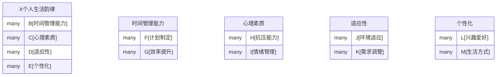

                 

# 创造个人生活韵律：找到最适合自己的节奏

## 关键词
- 个人生活韵律
- 生活节奏
- 自我评估
- 压力管理
- 生活平衡

## 摘要
本文旨在探讨如何创造个人生活韵律，找到最适合自己的节奏。我们将通过逐步分析，介绍个人生活韵律的核心概念、寻找个人生活韵律的方法、以及实践与应用策略。通过本文的探讨，读者将能够理解生活节奏的重要性，学会自我评估与诊断，掌握平衡生活与工作的技巧，从而实现个人生活韵律的维护与优化。

----------------------------------------------------------------

## 第一部分: 背景介绍

### 第1章: 问题背景与解决思路

### 1.1 问题描述

#### 1.1.1 生活节奏的定义与现状
生活节奏是指个体在日常生活中所遵循的时间规律和行为模式。在现代社会，人们的生活节奏普遍较快，工作压力较大，导致很多人感到焦虑和疲惫。这种现象在我国尤为明显，城市生活的快节奏使得许多人陷入忙碌而忽略了自己的内心需求。

#### 1.1.2 生活节奏不协调的问题表现
生活节奏不协调的表现主要包括：
- 时间管理不当，导致效率低下；
- 工作与生活界限模糊，影响生活质量；
- 心理健康问题，如焦虑、抑郁等；
- 身体健康问题，如失眠、肥胖等。

#### 1.1.3 生活节奏不协调的影响
生活节奏不协调会严重影响个体的生活质量，甚至危害身体健康。长期处于高压状态下，容易导致心理和生理疾病，影响工作效率和人际关系。因此，寻找个人生活韵律，调整生活节奏，显得尤为重要。

### 1.2 问题解决思路

#### 1.2.1 个人生活韵律的概念
个人生活韵律是指个体在日常生活中所形成的一种稳定、适应性强、具有个性化的时间规律和行为模式。它是人们适应环境、实现生活平衡的关键。

#### 1.2.2 个人生活韵律的重要性
个人生活韵律对个体的身心健康、工作效率和生活质量具有深远的影响。一个良好的生活韵律能够帮助人们更好地应对压力，保持心理健康，提高工作效率，享受生活。

#### 1.2.3 寻找个人生活韵律的方法
寻找个人生活韵律需要从自我评估、诊断和调整三个方面入手。首先，通过自我评估了解自己的生活习惯、时间管理能力和心理素质。然后，通过诊断找出生活节奏不协调的原因，并制定相应的调整策略。最后，通过实践和调整，逐步形成适合自己的生活韵律。

### 1.3 边界与外延

#### 1.3.1 生活节奏与工作节奏的关系
生活节奏与工作节奏密切相关。合理的工作节奏有助于提高工作效率，为生活留下更多时间。然而，过度追求工作效率可能导致生活节奏失衡，影响身心健康。

#### 1.3.2 个人生活韵律与家庭生活
家庭生活是个人生活的重要组成部分。一个良好的个人生活韵律有助于维护家庭和谐，增进家庭成员之间的感情。

#### 1.3.3 个人生活韵律与社会环境的关系
个人生活韵律需要适应社会环境的变化。在不同社会环境下，个人生活韵律可能会发生相应的调整，以适应新的环境需求。

### 1.4 核心概念与联系

#### 1.4.1 个人生活韵律的核心概念
个人生活韵律的核心概念包括：
- 时间管理能力：合理安排时间，提高工作效率；
- 心理素质：保持良好的心理状态，应对压力；
- 适应性：适应环境变化，调整生活节奏；
- 个性化：形成符合自己特点的生活模式。

#### 1.4.2 个人生活韵律的属性特征对比表格

| 属性特征       | 描述                                       |
| -------------- | ------------------------------------------ |
| 稳定性         | 生活节奏的稳定性，保持长期的规律性           |
| 灵活性         | 在保持生活节奏的基础上，适应突发事件的能力   |
| 自适应性与可持续性 | 随着环境变化和生活需求调整的能力           |
| 个体差异性     | 不同个体生活节奏的差异，因人而异             |

#### 1.4.3 个人生活韵律的ER实体关系图架构

### 1.5 本章小结
本章介绍了生活节奏不协调的问题背景和解决思路，阐述了个人生活韵律的概念、重要性以及寻找个人生活韵律的方法。同时，分析了生活节奏与工作节奏、个人生活韵律与家庭生活、个人生活韵律与社会环境的关系。通过对核心概念和属性特征的探讨，为后续章节的深入分析奠定了基础。

----------------------------------------------------------------

## 第二部分: 个人生活韵律的核心概念

### 第2章: 个人生活韵律的原理与特征

### 2.1 个人生活韵律的原理

#### 2.1.1 个人生活韵律的定义
个人生活韵律是指个体在日常生活中所形成的一种稳定、适应性强、具有个性化的时间规律和行为模式。它是人们在长期生活中，根据自身特点和需求，不断调整和优化的结果。

#### 2.1.2 个人生活韵律的形成机制
个人生活韵律的形成机制主要包括：
- 自我认知：个体了解自己的性格、兴趣、需求和价值观，为生活节奏的调整提供依据；
- 环境适应：个体根据外部环境的变化，调整生活节奏，以适应新的生活环境；
- 经验积累：个体在生活实践中，不断总结经验，形成适合自己的生活方式。

#### 2.1.3 个人生活韵律的演变过程
个人生活韵律的演变过程可以分为三个阶段：
1. 随机阶段：个体在年轻时期，生活节奏较为随意，缺乏明确的生活目标；
2. 稳定阶段：个体在经历一段时间的生活实践后，逐渐形成稳定的生活节奏，具有一定的规律性；
3. 优化阶段：个体在成熟时期，不断调整和完善生活节奏，使其更加适应自身需求和外部环境。

### 2.2 个人生活韵律的特征

#### 2.2.1 稳定性与灵活性
个人生活韵律具有稳定性和灵活性。稳定性表现为生活节奏的长期规律性，使个体能够保持高效的工作和生活状态。灵活性表现为在面对突发事件和外部环境变化时，个体能够快速调整生活节奏，以适应新的情况。

#### 2.2.2 自适应性与可持续性
个人生活韵律具有自适应性和可持续性。自适应性表现为个体能够根据自身需求和外部环境的变化，调整生活节奏，以保持良好的身心状态。可持续性表现为个人生活韵律的长期稳定，使个体能够持续享受生活。

#### 2.2.3 个体差异性
个人生活韵律具有个体差异性。不同个体的性格、兴趣、需求和价值观不同，导致他们的生活节奏各不相同。因此，个人生活韵律是个性化的，需要根据个体的特点进行调整。

### 2.3 个人生活韵律与工作生活的关系

#### 2.3.1 个人生活韵律对工作生活的影响
良好的个人生活韵律有助于提高工作效率和生活质量。稳定的作息时间、合理的休息安排和健康的生活习惯，能够使个体保持充沛的精力，提高工作效率。

#### 2.3.2 工作生活对个人生活韵律的影响
工作生活对个人生活韵律的影响主要体现在时间分配和心理健康方面。高强度的工作可能导致生活节奏失衡，影响身心健康。因此，个体需要合理安排工作与生活，保持良好的个人生活韵律。

#### 2.3.3 如何平衡个人生活韵律与工作生活
平衡个人生活韵律与工作生活的方法包括：
- 设定合理的工作目标，避免过度劳累；
- 优化时间管理，提高工作效率；
- 增加休息和娱乐时间，保持身心健康；
- 保持良好的沟通，缓解工作压力。

### 2.4 个人生活韵律与家庭生活的关系

#### 2.4.1 个人生活韵律对家庭生活的影响
良好的个人生活韵律有助于维护家庭和谐。稳定的作息时间、健康的生活习惯和积极的沟通方式，能够增进家庭成员之间的感情，促进家庭和谐。

#### 2.4.2 家庭生活对个人生活韵律的影响
家庭生活对个人生活韵律的影响主要体现在生活节奏的调整和情感支持方面。家庭和谐、关爱和支持，有助于个体保持良好的心理状态，调整生活节奏。

#### 2.4.3 家庭成员的个人生活韵律协调
家庭成员的个人生活韵律协调，有助于家庭和谐。家庭成员需要相互理解、尊重和包容，共同制定家庭生活规则，保持良好的生活节奏。

### 2.5 个人生活韵律与社会环境的关系

#### 2.5.1 社会环境对个人生活韵律的影响
社会环境对个人生活韵律的影响主要表现在文化、价值观和生活方式等方面。不同的社会环境，可能导致个体生活节奏的差异。因此，个体需要根据社会环境的特点，调整自己的生活韵律。

#### 2.5.2 个人生活韵律对社会环境的影响
个人生活韵律对社会环境的影响主要体现在生活方式的示范和引领方面。良好的个人生活韵律，有助于推动社会风气的改善，促进社会和谐发展。

#### 2.5.3 调整个人生活韵律以适应社会环境
调整个人生活韵律以适应社会环境的方法包括：
- 关注社会发展趋势，了解社会环境的变化；
- 树立正确的价值观，保持心理健康；
- 增强自我调节能力，适应社会环境的变化。

### 2.6 本章小结
本章介绍了个人生活韵律的原理和特征，分析了个人生活韵律与工作生活、家庭生活和社会环境的关系。通过本章的学习，读者将能够理解个人生活韵律的重要性，学会如何调整和优化自己的生活节奏，以实现身心健康和生活质量的双重提升。

----------------------------------------------------------------

## 第三部分: 寻找个人生活韵律

### 第3章: 自我评估与诊断

### 3.1 自我评估的重要性

#### 3.1.1 自我评估的作用
自我评估是寻找个人生活韵律的第一步，它有助于个体了解自己的生活习惯、时间管理能力和心理素质。通过自我评估，个体可以发现自己的优点和不足，为后续的调整提供依据。

#### 3.1.2 自我评估的步骤
自我评估的步骤主要包括：
1. 确定评估目标：明确自我评估的目的，如了解自己的生活习惯、时间管理能力等；
2. 收集评估信息：通过记录日记、填写问卷等方式，收集关于自己生活节奏的详细信息；
3. 分析评估结果：对收集到的信息进行分析，找出生活节奏不协调的原因；
4. 制定调整计划：根据评估结果，制定相应的调整计划，逐步改善生活节奏。

#### 3.1.3 自我评估的工具
常用的自我评估工具有：
- 日记法：通过记录日常生活，了解自己的生活习惯和时间分配；
- 问卷法：通过填写问卷，评估自己的时间管理能力和心理素质；
- 评估量表：使用专业的评估量表，如时间管理量表、心理健康量表等，对个人生活韵律进行评估。

### 3.2 诊断个人生活韵律

#### 3.2.1 诊断方法与技巧
诊断个人生活韵律的方法主要包括：
1. 观察法：观察自己的生活节奏，了解自己的行为模式和时间分配；
2. 访谈法：与朋友、家人或专业人士进行访谈，了解他们对自己生活节奏的看法；
3. 自我反思：反思自己的生活经历，分析自己的优点和不足。

诊断技巧包括：
1. 确定诊断目标：明确诊断的目的，如了解生活节奏不协调的原因；
2. 收集诊断信息：通过多种途径收集关于生活节奏的信息；
3. 分析诊断结果：对收集到的信息进行分析，找出生活节奏不协调的原因。

#### 3.2.2 生活节奏与健康的关系
生活节奏与健康密切相关。合理的生活节奏有助于保持身心健康，而生活节奏不协调可能导致各种健康问题，如焦虑、抑郁、失眠、肥胖等。因此，诊断个人生活韵律时，需要关注生活节奏与健康的关系。

#### 3.2.3 心理健康与生活节奏的关系
心理健康与生活节奏密切相关。良好的生活节奏有助于保持心理健康，而心理健康问题可能导致生活节奏失衡。因此，在诊断个人生活韵律时，需要关注心理健康与生活节奏的关系。

### 3.3 改善个人生活韵律

#### 3.3.1 改善策略
改善个人生活韵律的策略包括：
1. 调整作息时间：合理安排作息时间，保证充足的睡眠和休息；
2. 优化时间管理：提高工作效率，减少无效时间，合理分配时间；
3. 培养健康的生活习惯：坚持锻炼、健康饮食、定期休息等；
4. 保持心理健康：学会缓解压力，保持积极的心态，寻求专业帮助。

#### 3.3.2 实际案例分享
以下是一个改善个人生活韵律的案例：

案例：小张是一名程序员，工作压力大，生活节奏不协调，导致身体和心理都出现了问题。经过自我评估和诊断，小张发现了自己的问题，并制定了改善计划：
1. 调整作息时间：每天晚上10点上床睡觉，早上7点起床，保证充足的睡眠；
2. 优化时间管理：提高工作效率，将工作时间集中在上午，下午进行休息和娱乐；
3. 培养健康的生活习惯：每天进行1小时锻炼，健康饮食，保证营养均衡；
4. 保持心理健康：学习放松技巧，如冥想、深呼吸等，缓解压力。

经过一段时间的调整，小张的身体和心理状况明显改善，工作效率和生活质量都有了很大的提升。

#### 3.3.3 改善效果的评估
改善个人生活韵律的效果可以通过以下几个方面进行评估：
1. 身体状况：通过体检、健康状况指标等，评估身体改善的效果；
2. 心理健康：通过心理健康量表、自我感受等，评估心理改善的效果；
3. 工作效率：通过工作成果、任务完成情况等，评估工作效率改善的效果；
4. 生活质量：通过自我感受、满意度等，评估生活质量改善的效果。

### 3.4 本章小结
本章介绍了自我评估与诊断的重要性，以及诊断个人生活韵律的方法和技巧。通过实际案例分享，展示了改善个人生活韵律的策略和效果。通过本章的学习，读者将能够掌握自我评估和诊断的方法，为后续的调整和优化打下基础。

----------------------------------------------------------------

## 第四部分: 实践与应用

### 第4章: 个人生活韵律的实践策略

### 4.1 确立个人生活目标

#### 4.1.1 设定目标的步骤
确立个人生活目标是一项重要的任务，它有助于个体明确方向，实现生活目标。设定目标的步骤如下：
1. 自我反思：了解自己的兴趣爱好、价值观和人生目标，为设定目标提供依据；
2. 确定目标类型：根据个人需求和实际情况，设定短期、中期和长期目标；
3. 制定具体目标：将抽象的目标转化为具体的、可衡量的小目标；
4. 制定实现计划：为每个目标制定具体的实施计划，包括时间、资源和行动步骤；
5. 评估与调整：定期评估目标的实现情况，根据实际情况进行必要的调整。

#### 4.1.2 目标设定的原则
目标设定需要遵循以下原则：
1. 明确性：目标要明确、具体，避免模糊不清；
2. 可衡量性：目标要能够衡量，以便评估实现情况；
3. 可达性：目标要具有可行性，避免过高或过低；
4. 相关性：目标要与个人需求和价值观相关，有助于个人成长；
5. 时效性：目标要设定明确的时间节点，以便跟踪进度。

#### 4.1.3 目标实现的策略
实现目标需要制定具体的策略，以下是一些建议：
1. 制定行动计划：将目标分解为具体的行动计划，明确每个行动的步骤和时间；
2. 制定时间表：为每个目标制定时间表，确保按计划推进；
3. 坚持执行：克服拖延，坚持执行行动计划；
4. 检查进度：定期检查目标的实现进度，及时调整计划；
5. 寻求支持：在实现目标过程中，寻求家人、朋友或专业人士的支持和帮助。

### 4.2 制定个人生活计划

#### 4.2.1 计划的重要性
制定个人生活计划对于实现个人生活目标具有重要意义。一个明确的计划能够帮助个体更好地规划时间、资源，提高生活质量。通过制定计划，个体可以：
- 明确目标，提高执行力；
- 合理安排时间，提高效率；
- 调整生活习惯，保持健康；
- 提升心理健康，增强幸福感。

#### 4.2.2 计划的内容与结构
个人生活计划的内容和结构如下：

1. **总体目标**：
   - 确定个人生活计划的总体目标，如提升生活质量、实现职业发展等。

2. **年度计划**：
   - 根据总体目标，设定年度计划，包括关键成果和时间节点。

3. **季度计划**：
   - 将年度计划分解为季度计划，确保年度目标的实现。

4. **月度计划**：
   - 根据季度计划，制定月度计划，具体到每一天的行动。

5. **每周计划**：
   - 将月度计划细化到每周，确保每周目标的实现。

6. **每日计划**：
   - 根据每周计划，制定每日计划，包括具体任务和行动步骤。

#### 4.2.3 计划实施的步骤
实施个人生活计划需要遵循以下步骤：

1. **明确目标**：
   - 确定个人生活目标，并将其分解为具体的行动计划。

2. **制定时间表**：
   - 根据目标，制定详细的时间表，明确每个阶段的实施时间。

3. **分配资源**：
   - 确保计划实施所需的资源，如时间、资金、人力等。

4. **执行计划**：
   - 按照时间表和行动计划，逐一执行每项任务。

5. **监控进度**：
   - 定期检查计划的实施进度，确保按计划推进。

6. **调整计划**：
   - 根据实际情况，及时调整计划，确保目标的实现。

### 4.3 调整生活习惯

#### 4.3.1 检视现有生活习惯
调整生活习惯的第一步是检视现有习惯。以下是一些有用的方法：

1. **记录日记**：
   - 记录每天的日常活动，包括时间、地点、内容等。

2. **时间管理工具**：
   - 使用时间管理工具，如待办事项清单、时间追踪应用等，记录和评估时间分配。

3. **反思**：
   - 定期反思自己的生活习惯，分析哪些习惯有益，哪些习惯需要改变。

#### 4.3.2 调整生活习惯的策略
调整生活习惯的策略包括：

1. **设定具体目标**：
   - 为每个需要改变的习惯设定具体、可衡量的目标。

2. **逐步调整**：
   - 逐步调整不良习惯，避免一次性改变太多。

3. **替换习惯**：
   - 用积极的习惯替代消极的习惯，如用阅读替代看电视。

4. **建立激励机制**：
   - 给自己设定奖励，以激励自己坚持改变。

5. **寻求支持**：
   - 寻求家人、朋友或专业人士的支持，共同监督和鼓励。

#### 4.3.3 持续调整与适应
生活习惯的调整是一个持续的过程，需要时间和耐心。以下是一些建议：

1. **保持耐心**：
   - 改变习惯需要时间，不要期望一蹴而就。

2. **持续监控**：
   - 定期监控自己的生活习惯，评估调整效果。

3. **适应变化**：
   - 随着时间的推移，个体需要不断适应新的生活习惯。

4. **调整计划**：
   - 根据实际情况，不断调整调整策略，确保习惯的持续改善。

### 4.4 培养健康的生活态度

#### 4.4.1 健康生活态度的重要性
健康的生活态度对于个人生活韵律的维护和优化至关重要。一个积极、健康的生活态度能够帮助个体更好地应对挑战，保持身心健康，提高生活质量。以下是一些健康生活态度的重要性：

1. **积极应对压力**：
   - 积极的生活态度有助于个体更好地应对压力，减少焦虑和抑郁。

2. **保持心理健康**：
   - 健康的生活态度有助于个体保持良好的心理状态，提高心理健康水平。

3. **提高生活质量**：
   - 积极的生活态度能够提升个体的幸福感，提高生活质量。

#### 4.4.2 培养健康生活态度的方法
以下是一些培养健康生活态度的方法：

1. **积极思考**：
   - 尝试从积极的角度看待问题和挑战，学会感恩和欣赏。

2. **设定目标**：
   - 为自己设定短期和长期目标，保持动力和方向。

3. **培养乐观**：
   - 通过阅读、与他人交流、参与活动等方式，培养乐观的生活态度。

4. **寻求支持**：
   - 寻求家人、朋友或专业人士的支持和鼓励，共同成长。

5. **保持平衡**：
   - 保持工作、生活和休闲的平衡，避免过度劳累。

#### 4.4.3 健康生活态度的长期影响
健康的生活态度对个体的长期影响是显著的。以下是一些长期影响：

1. **提高抗压能力**：
   - 长期保持健康的生活态度，有助于个体提高抗压能力，更好地应对生活中的挑战。

2. **保持心理健康**：
   - 健康的生活态度有助于个体保持心理健康，降低心理问题的发生风险。

3. **提升生活质量**：
   - 长期保持健康的生活态度，能够显著提升个体的生活质量，使其更加幸福和满足。

### 4.5 本章小结
本章介绍了个人生活韵律的实践策略，包括确立个人生活目标、制定个人生活计划、调整生活习惯和培养健康的生活态度。通过本章的学习，读者将能够掌握这些实践策略，为自己的生活韵律的维护和优化提供指导。

----------------------------------------------------------------

## 第五部分: 个人生活韵律的维护与优化

### 第5章: 生活平衡与压力管理

### 5.1 生活平衡的概念

#### 5.1.1 生活平衡的重要性
生活平衡是指个体在生活各个领域（如工作、家庭、娱乐、自我发展等）之间的合理分配和协调。生活平衡对于个体的身心健康、工作绩效和生活满意度具有至关重要的意义。以下是生活平衡的重要作用：

1. **提高身心健康**：
   - 生活平衡有助于减轻身体和心理压力，降低患病风险。
   - 适当的休息和娱乐活动有助于缓解疲劳，提高免疫力。

2. **提升工作绩效**：
   - 生活平衡使个体能够更好地集中精力工作，提高工作效率。
   - 合理的时间分配有助于避免因过度劳累而导致的失误和错误。

3. **增进人际关系**：
   - 生活平衡有助于个体在家庭和社交关系中投入更多的时间和精力，增进亲密关系。
   - 和谐的家庭和社交环境有助于提高个体的生活满意度。

#### 5.1.2 生活平衡的要素
生活平衡包括以下几个关键要素：

1. **时间管理**：
   - 合理规划时间，确保工作和生活的每个方面都得到关注。
   - 学会优先级排序，将时间分配给最重要和最紧急的任务。

2. **工作与生活的平衡**：
   - 设定明确的工作时间，避免工作过度侵占个人时间。
   - 创造一个有利于工作和休息的办公环境。

3. **身心健康**：
   - 保持适当的锻炼，增强身体素质。
   - 关注心理健康，学会放松和减压。

4. **家庭与社交**：
   - 投入时间与家人共度时光，增进亲密关系。
   - 保持与朋友和同事的良好沟通，建立支持网络。

5. **个人发展**：
   - 为个人兴趣和职业发展留出时间，不断提升自己。

#### 5.1.3 生活平衡的评估方法
评估生活平衡的方法包括以下几种：

1. **自我评估问卷**：
   - 使用专门的生活平衡问卷，评估自己在各个领域的生活质量。
   - 根据问卷结果，分析自己在哪些方面需要改进。

2. **日志记录**：
   - 记录每天的活动和时间分配，分析自己在不同领域的时间投入。
   - 定期回顾日志，找出需要调整的地方。

3. **专业人士评估**：
   - 咨询心理咨询师或生活教练，获取专业的建议和指导。

### 5.2 压力管理的策略

#### 5.2.1 压力的来源与表现
压力的来源多种多样，常见的压力来源包括：

1. **工作压力**：
   - 高强度的工作要求、工作压力过大、工作不稳定等。

2. **生活压力**：
   - 家庭责任、经济压力、人际关系问题等。

3. **身心健康压力**：
   - 疾病、健康问题、心理疾病等。

压力的表现形式包括：

1. **身体表现**：
   - 疲劳、失眠、头痛、肌肉紧张等。

2. **心理表现**：
   - 情绪低落、焦虑、易怒、注意力不集中等。

3. **行为表现**：
   - 拖延、逃避问题、过度消费等。

#### 5.2.2 压力管理的策略

1. **认知行为疗法**：
   - 学会积极思考，调整对压力的看法。
   - 通过认知重构，减少对压力的过度反应。

2. **放松技巧**：
   - 学习深呼吸、冥想、瑜伽等放松技巧。
   - 定期进行放松训练，减轻身心压力。

3. **时间管理**：
   - 合理规划时间，避免过度劳累。
   - 学会优先处理重要和紧急的任务。

4. **运动与锻炼**：
   - 定期进行有氧运动，如跑步、游泳等。
   - 运动有助于释放压力，提高身心健康。

5. **寻求支持**：
   - 与家人、朋友分享压力，寻求支持和帮助。
   - 如有必要，寻求专业心理咨询师的帮助。

6. **健康饮食**：
   - 保持均衡的饮食，减少高糖、高脂肪食物的摄入。
   - 增加富含维生素和矿物质的食物，提高身体抵抗力。

#### 5.2.3 压力管理的实际案例

案例：小王是一名公司高管，由于工作繁忙，他常常感到压力巨大。为了缓解压力，他采取了一系列措施：

1. **时间管理**：
   - 设定工作时间，避免工作侵占个人时间。
   - 使用日程表和待办事项清单，合理安排工作和生活。

2. **放松技巧**：
   - 学习冥想和深呼吸，每天晚上进行放松训练。
   - 在工作间隙进行短暂的放松，提高工作效率。

3. **运动与锻炼**：
   - 每周进行三次有氧运动，如跑步、游泳等。
   - 运动后感到身体轻松，压力减轻。

4. **寻求支持**：
   - 与家人和朋友分享压力，获得情感支持。
   - 定期咨询心理咨询师，学习应对压力的方法。

经过一段时间的调整，小王的生活质量得到了显著提升，工作效率和心理健康状况都有了明显改善。

### 5.3 压力管理与生活平衡的关系

#### 5.3.1 压力对生活平衡的影响
压力是影响生活平衡的重要因素。长期承受压力会导致生活节奏失衡，影响身心健康。以下是一些压力对生活平衡的影响：

1. **工作与生活失衡**：
   - 长期工作压力可能导致工作侵占生活时间，影响家庭和休闲活动。

2. **身心健康问题**：
   - 压力可能导致身心健康问题，如失眠、焦虑、抑郁等。

3. **人际关系问题**：
   - 长期压力可能导致人际关系紧张，影响家庭和社交关系。

#### 5.3.2 生活平衡对压力管理的作用
生活平衡有助于减轻压力，提高压力管理的有效性。以下是一些生活平衡对压力管理的作用：

1. **减轻工作压力**：
   - 合理安排工作和生活时间，减轻工作压力。

2. **提升心理健康**：
   - 通过保持身心健康，提高对压力的应对能力。

3. **增强社交支持**：
   - 和谐的家庭和社交关系有助于减轻压力，提高生活质量。

#### 5.3.3 调整生活平衡以适应压力
为了更好地管理压力，个体需要调整生活平衡，以适应压力的变化。以下是一些建议：

1. **灵活调整**：
   - 根据压力的变化，灵活调整生活计划，确保生活平衡。

2. **优先级排序**：
   - 学会优先处理重要和紧急的任务，避免过度劳累。

3. **学会拒绝**：
   - 学会拒绝不合理的要求，为自己留出休息和放松的时间。

4. **寻求帮助**：
   - 在必要时，寻求家人、朋友或专业人士的帮助，共同应对压力。

### 5.4 本章小结
本章介绍了生活平衡的概念、重要性以及压力管理的策略。通过理解生活平衡和压力管理的关系，读者将能够更好地调整自己的生活平衡，减轻压力，实现身心健康和生活质量的提升。通过本章的学习，读者将能够掌握一些实用的方法和技巧，为自己的生活韵律的维护与优化提供指导。

----------------------------------------------------------------

## 总结与展望

通过本文的探讨，我们深入了解了个人生活韵律的概念、原理、特征及其与工作生活、家庭生活和社会环境的关系。我们提出了自我评估与诊断、寻找个人生活韵律的方法，以及实践与应用策略。同时，我们强调了生活平衡与压力管理的重要性，提供了具体的实践建议。

在未来的研究中，我们可以进一步探讨个人生活韵律的量化评估方法，开发更加科学和个性化的生活调整策略。此外，我们还可以结合人工智能技术，为个体提供智能化的生活指导，帮助他们更好地实现生活平衡和压力管理。

通过不断探索和实践，我们相信个人生活韵律的研究将为提升个体生活质量、促进社会和谐发展作出积极贡献。

## 最佳实践 Tips

1. **设定明确的目标**：明确的目标有助于个体更好地规划生活，提高执行力。
2. **合理分配时间**：合理安排时间，确保工作和生活的每个领域都得到关注。
3. **保持积极的心态**：积极的心态有助于个体更好地应对压力，提升生活质量。
4. **定期自我评估**：定期进行自我评估，了解自己的生活习惯和变化，及时调整。

## 小结

本文从多个角度探讨了个人生活韵律的创造与优化，提供了实用的策略和方法。通过理解并实践这些策略，读者可以找到最适合自己的生活节奏，实现身心健康和生活质量的提升。

## 注意事项

1. **个体差异**：在调整个人生活韵律时，要充分考虑个体差异，避免盲目模仿。
2. **持续调整**：生活节奏是一个动态的过程，需要个体持续调整和优化。
3. **平衡工作与生活**：保持工作与生活的平衡，避免过度劳累。

## 拓展阅读

1. 《时间管理的艺术》- 彼得·德鲁克
2. 《积极心理学》-马丁·塞利格曼
3. 《如何管理压力》- 约翰·米尔斯

## 作者信息

作者：AI天才研究院/AI Genius Institute & 禅与计算机程序设计艺术 /Zen And The Art of Computer Programming

