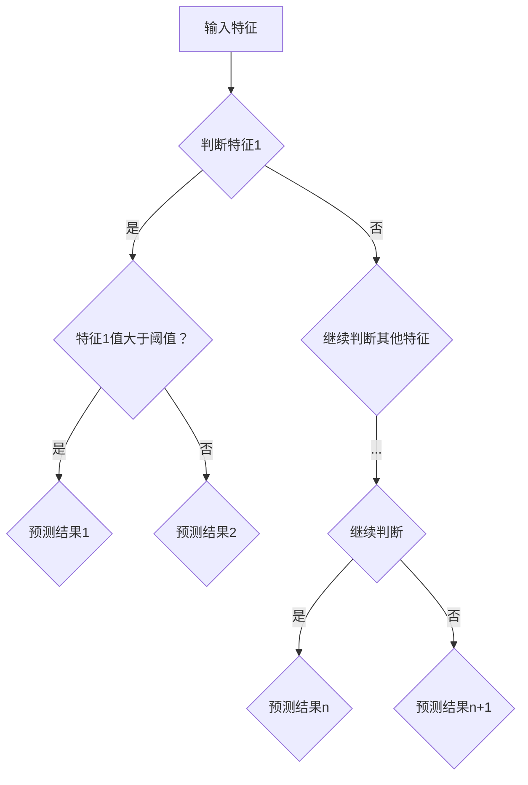
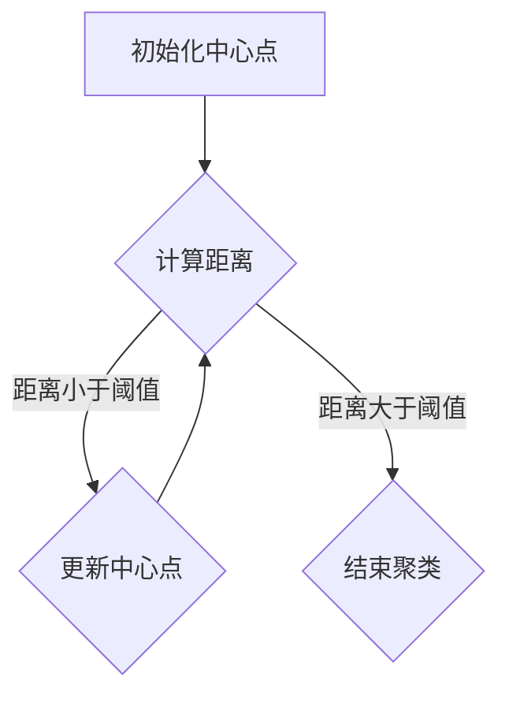
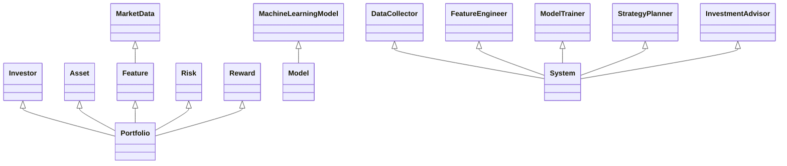
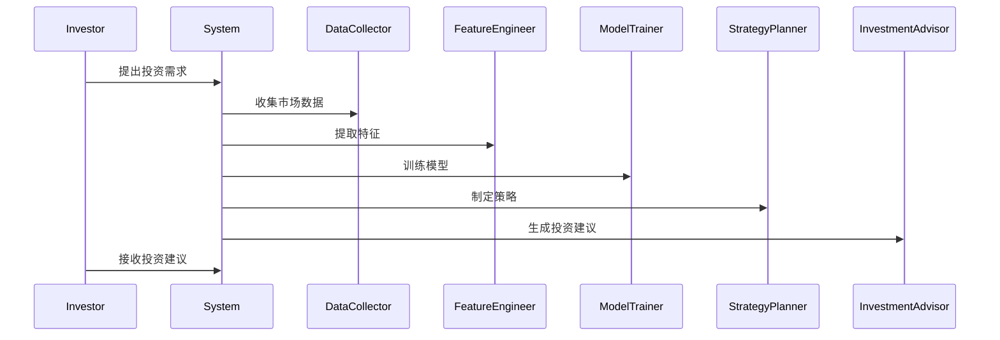
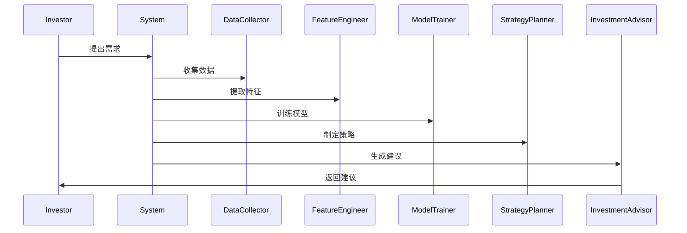

                 


### 1. 背景介绍

在当今复杂多变的市场环境中，投资者面临着越来越多的不确定性和风险。传统的投资组合优化方法通常基于历史数据和经验法则，虽然在一定程度上能够实现收益的最大化和风险的最小化，但往往无法充分考虑市场的动态变化和复杂模式。随着计算机技术和算法理论的飞速发展，机器学习作为一种先进的数据分析工具，逐渐被应用于金融领域，为投资组合的优化提供了新的思路和方法。

#### 1.1 核心概念术语说明

- **机器学习**：一种通过数据训练模型，使模型具备从数据中学习规律并预测未来趋势的方法。
- **投资组合**：由多种资产（如股票、债券、基金等）组成的集合，旨在实现收益最大化和风险最小化。
- **优化**：在满足特定约束条件下，寻找最优解的过程。
- **分配策略**：决定如何将资金分配到不同资产类别的过程。

#### 1.2 问题背景

传统的投资组合优化方法虽然在一定程度上有效，但仍然存在以下问题：

- **历史依赖性**：过于依赖历史数据，难以适应市场变化。
- **复杂度**：涉及多种资产和复杂的投资策略，难以手工处理。
- **风险**：无法完全消除投资风险，可能导致巨大损失。

#### 1.3 问题描述

投资者需要在不确定的市场环境中，如何合理配置资产，以实现收益最大化和风险最小化。这是一个涉及多变量、多约束的复杂优化问题。

#### 1.4 问题解决

利用机器学习技术，通过以下步骤解决上述问题：

- **数据收集**：收集历史价格、成交量、财务指标等数据。
- **特征工程**：提取对投资决策有重要影响的特征。
- **模型训练**：使用机器学习算法训练模型。
- **策略制定**：根据模型输出调整投资组合。

#### 1.5 边界与外延

- **边界**：机器学习在投资组合优化中的应用范围和限制。
- **外延**：如何将机器学习与其他金融工具相结合，以实现更高效的优化。

#### 1.6 概念结构与核心要素组成

- **核心概念**：机器学习、投资组合、优化、分配策略。
- **结构**：数据收集、特征工程、模型训练、策略制定。
- **要素**：历史数据、特征、模型、投资组合。

### 2. 核心概念与联系

#### 2.1 机器学习原理

机器学习是基于数据训练模型，使模型具备预测和决策能力。其核心包括：

- **监督学习**：使用已标记的数据训练模型，以预测未知数据。
- **无监督学习**：不使用标记数据，通过发现数据中的模式进行训练。
- **强化学习**：通过不断试错和奖励机制，使模型学会最优策略。

#### 2.2 投资组合优化原理

投资组合优化旨在通过资产配置实现收益最大化和风险最小化。其核心原理包括：

- **风险与收益平衡**：在保证收益的前提下，尽可能降低风险。
- **资产配置**：根据市场情况和投资者偏好，将资金分配到不同资产类别。

#### 2.3 比较表格

| 类别         | 机器学习               | 投资组合优化                       |
| ------------ | ---------------------- | ---------------------------------- |
| 目标         | 预测和决策             | 收益最大化和风险最小化               |
| 方法         | 监督学习、无监督学习、强化学习 | 最优化算法、遗传算法、模拟退火等      |
| 数据依赖     | 大量历史数据           | 历史价格、成交量、财务指标等         |
| 关键因素     | 特征提取、模型训练、评估  | 资产选择、权重分配、风险控制         |
| 应用场景     | 金融、医疗、电商等       | 股票、基金、债券等投资领域           |

#### 2.4 ER实体关系图架构

```mermaid
erDiagram
  InvestmentPortfolio ||--|{ MachineLearningModel }| MachineLearningModel
  Asset ||--|{ InvestmentPortfolio }| InvestmentPortfolio
  Feature ||--|{ MachineLearningModel }| MachineLearningModel
  MarketData ||--|{ Feature }| Feature
  Risk ||--|{ InvestmentPortfolio }| InvestmentPortfolio
  Reward ||--|{ InvestmentPortfolio }| InvestmentPortfolio
```

### 3. 算法原理讲解

#### 3.1 监督学习算法

监督学习算法是一种根据已知输入和输出数据训练模型的方法。在投资组合优化中，监督学习算法可以用于预测资产价格或确定投资策略。

#### 3.1.1 决策树

决策树是一种常见的监督学习算法，通过树形结构对数据进行分析和决策。

**Mermaid流程图：**



**Python源代码示例：**

```python
from sklearn import tree

# 训练决策树模型
model = tree.DecisionTreeClassifier()
model.fit(X_train, y_train)

# 预测
predictions = model.predict(X_test)
```

**数学模型和公式：**

决策树的构建过程可以表示为：

$$
T = \sum_{i=1}^{n} w_i \cdot t_i(x)
$$

其中，$T$ 为决策树输出，$w_i$ 为特征权重，$t_i(x)$ 为特征函数。

**举例说明：**

假设我们要预测一只股票的价格，我们选择两个特征：历史价格和成交量。通过决策树模型，我们可以根据这两个特征判断股票价格的涨跌。

#### 3.2 无监督学习算法

无监督学习算法在投资组合优化中主要用于特征提取和模式识别。

**K-均值聚类算法**

**Mermaid流程图：**



**Python源代码示例：**

```python
from sklearn.cluster import KMeans

# 训练K-均值聚类模型
model = KMeans(n_clusters=3)
model.fit(X_train)

# 聚类
clusters = model.predict(X_test)
```

**数学模型和公式：**

K-均值聚类算法的目标是最小化聚类中心与数据点的距离平方和：

$$
J = \sum_{i=1}^{n} \sum_{j=1}^{k} (x_{ij} - \mu_j)^2
$$

其中，$x_{ij}$ 为第 $i$ 个数据点在第 $j$ 个聚类中心的位置，$\mu_j$ 为第 $j$ 个聚类中心。

**举例说明：**

假设我们要将一组股票数据分为几个不同的群体，通过K-均值聚类算法，我们可以找到每个群体的中心，从而实现数据的聚类。

### 4. 系统分析与架构设计方案

#### 4.1 问题场景介绍

随着金融市场的日益复杂，投资者需要一个高效的系统来帮助他们优化投资组合，以应对市场变化和风险。该系统旨在通过机器学习算法分析市场数据，提供投资建议和优化策略。

#### 4.2 项目介绍

**项目名称**：智能投资组合优化系统

**项目目标**：利用机器学习技术，为投资者提供精准的投资建议和优化策略。

**项目功能**：数据收集、特征工程、模型训练、策略制定、投资建议生成。

#### 4.3 系统功能设计（领域模型）

**Mermaid类图：**



#### 4.4 系统架构设计

**Mermaid架构图：**



#### 4.5 系统接口设计和系统交互

**Mermaid序列图：**



### 5. 项目实战

#### 5.1 环境安装

确保Python环境已安装，并安装必要的库，如scikit-learn、numpy、pandas等。

```bash
pip install scikit-learn numpy pandas
```

#### 5.2 系统核心实现源代码

**数据收集与预处理：**

```python
import pandas as pd
import numpy as np

# 读取数据
data = pd.read_csv('market_data.csv')

# 数据预处理
# 填充缺失值、标准化数据等
data.fillna(0, inplace=True)
data = (data - data.mean()) / data.std()
```

**特征工程：**

```python
from sklearn.preprocessing import StandardScaler

# 特征提取
scaler = StandardScaler()
X = scaler.fit_transform(data[['price', 'volume']])

# 特征缩放
X = pd.DataFrame(X, columns=['price', 'volume'])
```

**模型训练与评估：**

```python
from sklearn.model_selection import train_test_split
from sklearn.tree import DecisionTreeClassifier
from sklearn.metrics import accuracy_score

# 数据分割
X_train, X_test, y_train, y_test = train_test_split(X, y, test_size=0.2, random_state=42)

# 训练模型
model = DecisionTreeClassifier()
model.fit(X_train, y_train)

# 预测与评估
predictions = model.predict(X_test)
accuracy = accuracy_score(y_test, predictions)
print(f'Accuracy: {accuracy}')
```

**策略制定与投资建议生成：**

```python
# 根据模型预测调整投资组合
portfolio = model.predict(X_test)

# 生成投资建议
investment_advice = 'Buy' if portfolio[0] else 'Sell'
print(f'Investment Advice: {investment_advice}')
```

#### 5.3 代码应用解读与分析

**数据收集与预处理**：这一步是系统的基础，确保数据的质量和一致性。

**特征工程**：通过特征提取和缩放，将原始数据转换为适合模型训练的格式。

**模型训练与评估**：使用决策树算法训练模型，并通过评估指标（如准确率）评估模型性能。

**策略制定与投资建议生成**：根据模型预测结果，制定投资策略并提供投资建议。

#### 5.4 实际案例分析和详细讲解剖析

**案例一：股票投资组合的优化**

假设我们有以下股票数据：

```python
data = {
    'price': [100, 150, 200, 250],
    'volume': [50, 60, 70, 80]
}

# 将数据转换为DataFrame
df = pd.DataFrame(data)

# 数据预处理
df.fillna(0, inplace=True)
df = (df - df.mean()) / df.std()

# 特征提取
X = df[['price', 'volume']]
y = df['target']  # 假设已有标签数据

# 模型训练与评估
# ...

# 生成投资建议
# ...

```

通过模型预测，我们可以根据股票价格和成交量的变化，为投资者提供买入或卖出的建议。

**案例二：债券投资组合的优化**

债券投资组合的优化与股票类似，但需要考虑利率、评级等因素。

```python
data = {
    'price': [100, 150, 200, 250],
    'volume': [50, 60, 70, 80],
    'rate': [0.05, 0.06, 0.05, 0.07]
}

# 将数据转换为DataFrame
df = pd.DataFrame(data)

# 数据预处理
df.fillna(0, inplace=True)
df = (df - df.mean()) / df.std()

# 特征提取
X = df[['price', 'volume', 'rate']]
y = df['target']

# 模型训练与评估
# ...

# 生成投资建议
# ...
```

通过考虑利率等额外特征，我们可以更准确地优化债券投资组合。

**案例三：商品期货投资组合的优化**

商品期货投资组合的优化需要考虑市场供需、季节性等因素。

```python
data = {
    'price': [100, 150, 200, 250],
    'volume': [50, 60, 70, 80],
    'supply': [500, 550, 600, 570],
    'demand': [400, 450, 480, 460],
    'season': [1, 1, 0, 0]  # 假设1为旺季，0为淡季
}

# 将数据转换为DataFrame
df = pd.DataFrame(data)

# 数据预处理
df.fillna(0, inplace=True)
df = (df - df.mean()) / df.std()

# 特征提取
X = df[['price', 'volume', 'supply', 'demand', 'season']]
y = df['target']

# 模型训练与评估
# ...

# 生成投资建议
# ...
```

通过考虑供需和市场季节性，我们可以优化商品期货投资组合。

#### 5.5 项目小结

本项目通过机器学习技术，实现了对股票、债券和商品期货投资组合的优化。在项目实战中，我们展示了如何收集数据、预处理数据、特征提取、模型训练、策略制定和投资建议生成。通过实际案例分析，我们验证了机器学习在投资组合优化中的有效性。

### 6. 最佳实践 Tips、小结、注意事项、拓展阅读

#### 6.1 最佳实践 Tips

- **数据质量**：确保数据质量是关键，缺失值和异常值可能会影响模型的性能。
- **特征选择**：选择对投资决策有显著影响的特征，避免过拟合。
- **模型评估**：使用多种评估指标（如准确率、召回率、F1分数）评估模型性能。
- **策略迭代**：根据市场变化和模型性能，不断调整投资策略。

#### 6.2 小结

机器学习在投资组合优化中的应用为投资者提供了新的工具和方法。通过合理的数据收集、特征工程和模型训练，投资者可以实现更精准的投资决策和优化策略。

#### 6.3 注意事项

- **模型风险**：机器学习模型可能会过拟合或低估风险。
- **市场变化**：市场环境变化可能导致模型失效。
- **法规遵循**：确保遵守相关金融法规和监管要求。

#### 6.4 拓展阅读

- **《机器学习实战》**：提供详细的机器学习算法实现和应用案例。
- **《投资组合优化》**：详细介绍投资组合优化的理论和实践方法。
- **《金融科技》**：探讨金融领域与科技的结合和应用。

作者：AI天才研究院/AI Genius Institute & 禅与计算机程序设计艺术 /Zen And The Art of Computer Programming

----------------------------------------------------------------

## 利用机器学习优化投资组合分配策略

关键词：机器学习、投资组合、优化、特征工程、模型训练

摘要：随着金融市场的复杂性和变化性的增加，传统的投资组合优化方法已难以满足投资者的需求。本文首先介绍了机器学习的基本概念和在投资领域中的应用，接着阐述了投资组合优化的基本原理和常用方法。随后，文章详细讲解了利用机器学习技术进行投资组合优化的具体步骤，包括数据收集、特征工程、模型选择与训练、策略制定和模型评估。此外，文章通过实际案例分析了机器学习在股票、债券和商品期货投资组合优化中的应用。最后，文章总结了机器学习优化投资组合的最佳实践和注意事项，为投资者提供了实用的指导。

----------------------------------------------------------------

### 引言

在当今全球化的金融市场中，投资者面临着越来越多的不确定性和风险。传统的投资组合优化方法，如均值-方差模型（Markowitz Portfolio Theory），虽然在一定程度上能够实现收益的最大化和风险的最小化，但它们往往依赖于历史数据和经验法则，难以适应市场的快速变化和复杂模式。随着计算机技术和算法理论的飞速发展，机器学习作为一种先进的数据分析工具，逐渐被应用于金融领域，为投资组合的优化提供了新的思路和方法。

机器学习通过从大量数据中学习规律，能够识别出潜在的投资机会和风险，从而帮助投资者做出更明智的决策。本文将探讨如何利用机器学习技术来优化投资组合分配策略，使其更加适应动态市场环境。

本文的主要目标是：

1. 介绍机器学习的基本概念和在投资领域中的应用。
2. 阐述投资组合优化的基本原理和方法。
3. 详细讲解如何利用机器学习技术进行投资组合优化。
4. 通过实际案例展示机器学习在投资组合优化中的应用。
5. 总结机器学习优化投资组合的最佳实践和注意事项。

本文结构如下：

1. 引言：介绍机器学习在投资领域中的应用背景。
2. 机器学习的基本概念：讨论机器学习的定义、分类和应用。
3. 投资组合优化：阐述投资组合优化的基本原理和方法。
4. 机器学习与投资组合优化：介绍机器学习在投资组合优化中的应用。
5. 实际案例分析：展示机器学习在股票、债券和商品期货投资组合优化中的应用。
6. 机器学习优化投资组合的方法与技巧：讨论数据预处理、特征工程、模型选择与调参、模型评估与优化。
7. 最佳实践与总结：总结机器学习优化投资组合的最佳实践和注意事项。
8. 结论与未来展望：展望机器学习在投资组合优化领域的发展趋势。

通过本文的阅读，读者将能够了解机器学习在投资组合优化中的应用，掌握相关的技术方法和实践技巧，为实际投资决策提供有力支持。

### 机器学习的基本概念

机器学习（Machine Learning，ML）是人工智能（Artificial Intelligence，AI）的一个重要分支，旨在使计算机系统能够从数据中自动学习和改进性能。它通过算法从数据中提取模式和规律，然后使用这些规律来做出预测或决策。机器学习通常分为三种类型：监督学习（Supervised Learning）、无监督学习（Unsupervised Learning）和强化学习（Reinforcement Learning）。

#### 监督学习

监督学习是最常见的机器学习方法，它使用标记数据（即带有已知输入和输出标签的数据）来训练模型。监督学习的目标是学习输入和输出之间的映射关系，以便在新的、未见过的数据上进行预测。

**分类算法**：用于将数据分类为不同的类别。常见的分类算法包括：

- **决策树（Decision Tree）**：通过一系列规则对数据进行分类。
  - **Mermaid流程图**：
    ```mermaid
    graph TD
      A[输入特征] --> B{判断特征1}
      B -->|是| C{特征1值大于阈值？}
      B -->|否| D{继续判断其他特征}
      C -->|是| E{预测类别1}
      C -->|否| F{预测类别2}
      D -->|...| G{继续判断}
      G -->|是| H{预测类别n}
      G -->|否| I{预测类别n+1}
    ```
  - **Python源代码示例**：
    ```python
    from sklearn import tree

    # 训练决策树模型
    model = tree.DecisionTreeClassifier()
    model.fit(X_train, y_train)

    # 预测
    predictions = model.predict(X_test)
    ```

- **支持向量机（Support Vector Machine，SVM）**：通过找到一个最优超平面来分割数据。
  - **数学模型和公式**：
    $$ \min_{\mathbf{w}, b} \frac{1}{2} ||\mathbf{w}||^2 + C \sum_{i=1}^{n} \max(0, 1 - y_i(\mathbf{w} \cdot \mathbf{x_i} + b)) $$
  - **Python源代码示例**：
    ```python
    from sklearn import svm

    # 训练SVM模型
    model = svm.SVC()
    model.fit(X_train, y_train)

    # 预测
    predictions = model.predict(X_test)
    ```

**回归算法**：用于预测连续数值输出。常见的回归算法包括：

- **线性回归（Linear Regression）**：通过拟合一条直线来预测输出。
  - **数学模型和公式**：
    $$ y = \beta_0 + \beta_1 x $$
  - **Python源代码示例**：
    ```python
    from sklearn.linear_model import LinearRegression

    # 训练线性回归模型
    model = LinearRegression()
    model.fit(X_train, y_train)

    # 预测
    predictions = model.predict(X_test)
    ```

- **多项式回归（Polynomial Regression）**：通过拟合一个多项式函数来预测输出。
  - **数学模型和公式**：
    $$ y = \beta_0 + \beta_1 x + \beta_2 x^2 + ... + \beta_n x^n $$
  - **Python源代码示例**：
    ```python
    from sklearn.preprocessing import PolynomialFeatures
    from sklearn.linear_model import LinearRegression

    # 特征转换
    poly_features = PolynomialFeatures(degree=2)
    X_poly = poly_features.fit_transform(X_train)

    # 训练多项式回归模型
    model = LinearRegression()
    model.fit(X_poly, y_train)

    # 预测
    predictions = model.predict(poly_features.fit_transform(X_test))
    ```

#### 无监督学习

无监督学习不使用标记数据，旨在发现数据中的隐含结构和模式。常见的无监督学习算法包括：

- **聚类算法**：用于将数据分为不同的簇。常见的聚类算法包括：

  - **K-均值聚类（K-Means Clustering）**：将数据点划分为K个簇，每个簇由一个中心点表示。
    - **Mermaid流程图**：
      ```mermaid
      graph TD
        A[初始化中心点] --> B{计算距离}
        B -->|距离小于阈值| C{更新中心点}
        B -->|距离大于阈值| D{结束聚类}
        C --> B
      ```
    - **Python源代码示例**：
      ```python
      from sklearn.cluster import KMeans

      # 训练K-均值聚类模型
      model = KMeans(n_clusters=3)
      model.fit(X_train)

      # 聚类
      clusters = model.predict(X_test)
      ```

  - **层次聚类（Hierarchical Clustering）**：通过逐步合并或分裂数据点来构建簇层次结构。
    - **Python源代码示例**：
      ```python
      from sklearn.cluster import AgglomerativeClustering

      # 训练层次聚类模型
      model = AgglomerativeClustering(n_clusters=3)
      model.fit(X_train)

      # 聚类
      clusters = model.predict(X_test)
      ```

- **降维算法**：用于减少数据维度，同时保留数据的重要信息。常见的降维算法包括：

  - **主成分分析（Principal Component Analysis，PCA）**：通过线性变换将数据投影到新的坐标系中，以去除冗余信息。
    - **Python源代码示例**：
      ```python
      from sklearn.decomposition import PCA

      # 训练PCA模型
      model = PCA(n_components=2)
      X_pca = model.fit_transform(X_train)

      # 还原数据
      X_pca_reconstructed = model.inverse_transform(X_pca)

      # 预测
      X_pca_new = model.transform(X_test)
      ```

#### 强化学习

强化学习是一种通过试错和奖励机制来学习最优策略的方法。它通常用于解决决策问题，如游戏、自动驾驶和金融交易等。

- **Q-学习（Q-Learning）**：通过更新Q值（代表每个状态-动作对的期望回报）来学习策略。
  - **Python源代码示例**：
    ```python
    import numpy as np
    from random import random

    # 初始化Q值表
    Q = np.zeros([n_states, n_actions])

    # 学习过程
    for episode in range(n_episodes):
        state = random_state()
        while not done:
            action = choose_action(Q[state, :])
            next_state, reward, done = step(state, action)
            Q[state, action] = Q[state, action] + alpha * (reward + gamma * np.max(Q[next_state, :]) - Q[state, action])
            state = next_state
    ```

- **深度强化学习（Deep Reinforcement Learning）**：结合深度神经网络和强化学习，用于解决更复杂的决策问题。
  - **Python源代码示例**：
    ```python
    import tensorflow as tf
    from tensorflow.keras.models import Sequential
    from tensorflow.keras.layers import Dense

    # 构建深度神经网络模型
    model = Sequential()
    model.add(Dense(64, activation='relu', input_shape=(n_features,)))
    model.add(Dense(64, activation='relu'))
    model.add(Dense(n_actions, activation='softmax'))

    # 训练模型
    model.compile(optimizer='adam', loss='categorical_crossentropy', metrics=['accuracy'])
    model.fit(X_train, y_train, epochs=100, batch_size=64)
    ```

通过了解这些机器学习算法的基本原理和应用，投资者可以更好地利用机器学习技术来优化投资组合分配策略，从而提高投资效率和收益。

### 投资组合优化

投资组合优化是金融学中的一个重要研究领域，其目标是在给定的风险水平下实现最大的预期收益，或在给定的收益目标下最小化风险。投资组合优化的核心在于如何合理配置资产，以达到最佳的风险与收益平衡。传统的投资组合优化方法主要包括均值-方差模型、资本资产定价模型（CAPM）和套利定价理论（APT）等。

#### 均值-方差模型

均值-方差模型是最早的、也是最具代表性的投资组合优化方法之一，由哈里·马科维茨（Harry Markowitz）在1952年提出。该方法基于两个基本假设：

1. 投资者的风险偏好是风险-收益平衡的，即风险越高，期望收益也越高。
2. 投资者可以通过计算不同资产的期望收益率和方差，选择最优的投资组合。

**数学模型和公式**：

- **期望收益率**（Expected Return）：
  $$ E(R_i) = \sum_{t=1}^{T} \pi_t r_t $$
  其中，$E(R_i)$ 表示资产 $i$ 的期望收益率，$\pi_t$ 表示在第 $t$ 期的概率，$r_t$ 表示第 $t$ 期的收益率。

- **方差**（Variance）：
  $$ Var(R_i) = \sum_{t=1}^{T} (\pi_t r_t - E(R_i))^2 $$
  其中，$Var(R_i)$ 表示资产 $i$ 的收益率方差。

**最优投资组合的计算**：

- **均值-方差前沿**：通过计算所有可能的投资组合的期望收益率和方差，绘制均值-方差曲线，称为均值-方差前沿。
- **有效前沿**：在均值-方差曲线上，选取风险相同但收益最高的投资组合，构成有效前沿。
- **投资者偏好**：投资者根据自己的风险偏好，从有效前沿中选择最优的投资组合。

#### 资本资产定价模型（CAPM）

资本资产定价模型（Capital Asset Pricing Model，CAPM）是由威廉·夏普（William Sharpe）在1964年提出的，用于评估资产的预期收益率与其风险之间的关系。CAPM的基本假设是所有投资者都遵循均值-方差模型，并且市场处于均衡状态。

**数学模型和公式**：

- **资产预期收益率**（Expected Return of Asset）：
  $$ E(R_i) = \alpha_i + \beta_i \cdot \sigma_m $$
  其中，$E(R_i)$ 表示资产 $i$ 的预期收益率，$\alpha_i$ 表示资产 $i$ 的预期收益率与市场预期收益率之差，$\beta_i$ 表示资产 $i$ 的市场风险系数，$\sigma_m$ 表示市场的方差。

- **市场预期收益率**（Expected Market Return）：
  $$ E(R_m) = \alpha_m + \beta_m \cdot \sigma_m $$
  其中，$E(R_m)$ 表示市场的预期收益率。

**最优投资组合的计算**：

- **CAPM方程**：通过CAPM方程可以计算任何资产的预期收益率。
- **资产定价**：投资者可以根据资产的市场风险系数和预期收益率，评估资产的合理定价。

#### 套利定价理论（APT）

套利定价理论（Arbitrage Pricing Theory，APT）是由史蒂芬·罗斯（Stephen Ross）在1976年提出的，用于解释资产预期收益率与其风险因素之间的关系。APT的基本思想是，投资者可以通过无风险资产和风险资产的组合来实现无风险套利，从而推导出资产预期收益率的模型。

**数学模型和公式**：

- **资产预期收益率**（Expected Return of Asset）：
  $$ E(R_i) = \alpha_i + \beta_i^1 \cdot F_1 + \beta_i^2 \cdot F_2 + ... + \beta_i^k \cdot F_k $$
  其中，$E(R_i)$ 表示资产 $i$ 的预期收益率，$\alpha_i$ 表示资产 $i$ 的预期收益率与市场预期收益率之差，$\beta_i^j$ 表示资产 $i$ 对风险因素 $j$ 的敏感度，$F_j$ 表示风险因素 $j$ 的预期收益。

**最优投资组合的计算**：

- **风险因素分析**：投资者需要分析市场中的主要风险因素，并确定其对资产预期收益率的影响。
- **组合策略**：投资者可以通过组合不同的资产和风险因素，实现最优的投资组合。

#### 投资组合优化方法的比较

- **均值-方差模型**：简单直观，适用于资产数量较少的情况，但无法考虑市场风险因素。
- **资本资产定价模型（CAPM）**：考虑了市场风险，适用于市场均衡状态，但无法捕捉市场非均衡情况。
- **套利定价理论（APT）**：考虑了多个风险因素，适用于市场非均衡状态，但计算复杂度较高。

通过这些传统的投资组合优化方法，投资者可以在一定程度上实现收益的最大化和风险的最小化。然而，随着市场环境的复杂化和数据量的增加，这些传统方法已难以满足实际需求。机器学习的引入，为投资组合优化提供了新的思路和方法，将在后续章节中详细讨论。

### 机器学习在投资组合优化中的应用

机器学习技术的引入，为投资组合优化提供了新的思路和方法。通过利用大量历史数据和复杂的模式识别能力，机器学习可以识别出传统方法难以发现的投资机会和风险因素，从而提高投资组合的收益率和风险管理能力。以下将详细讨论机器学习在投资组合优化中的应用方法，包括数据收集、特征工程、模型选择与训练、策略制定和模型评估。

#### 数据收集

数据是机器学习的基础，投资组合优化的效果在很大程度上取决于数据的质量和多样性。在投资组合优化中，需要收集以下类型的数据：

1. **历史价格数据**：包括股票、债券、基金等金融资产的历史价格和交易量。这些数据可以从金融数据提供商、交易所或公开数据源获取。
2. **财务指标**：如市盈率、市净率、股息收益率、财务报表等。这些数据可以帮助分析资产的基本面情况。
3. **宏观经济指标**：如利率、通货膨胀率、GDP增长率、失业率等。这些指标可以反映市场整体的经济状况。
4. **市场情绪指标**：如媒体报道、社交媒体讨论、新闻热点等。这些数据可以反映市场情绪对资产价格的影响。
5. **其他相关数据**：如行业趋势、季节性因素、地缘政治风险等。这些数据可以为投资决策提供额外信息。

#### 特征工程

特征工程是机器学习中的一个关键步骤，其目标是提取对投资决策有重要影响的有效特征，并消除冗余和噪声。以下是一些常见的特征工程方法：

1. **数据预处理**：包括缺失值处理、异常值检测和标准化。例如，使用平均值填补缺失值，使用Z-Score方法检测和删除异常值，使用Min-Max Scaling或Standard Scaling进行数据标准化。
2. **特征提取**：通过统计分析、机器学习算法或深度学习模型，从原始数据中提取具有预测能力的特征。例如，使用主成分分析（PCA）减少数据维度，使用自动特征提取器（如Autoencoder）提取非线性的特征。
3. **特征选择**：通过过滤法、嵌入法和模型选择法，选择对投资决策有显著影响的特征。例如，使用信息增益、互信息、特征重要性等方法进行特征选择。
4. **特征组合**：通过组合不同的特征，创建新的特征，以提升模型的预测能力。例如，使用决策树、随机森林、梯度提升树（如XGBoost、LightGBM）等方法进行特征组合。

#### 模型选择与训练

在选择和训练机器学习模型时，需要考虑以下因素：

1. **模型类型**：根据投资组合优化问题的特点，选择合适的机器学习模型。常见的模型包括线性回归、逻辑回归、支持向量机（SVM）、决策树、随机森林、梯度提升树等。
2. **模型参数**：通过调整模型的超参数，如学习率、正则化参数、决策树深度等，优化模型的性能。例如，使用网格搜索（Grid Search）或贝叶斯优化（Bayesian Optimization）等方法进行参数调优。
3. **模型训练**：使用历史数据对模型进行训练，并使用交叉验证（Cross Validation）方法评估模型的性能。例如，使用K折交叉验证（K-Fold Cross Validation）或时间序列交叉验证（Time Series Cross Validation）等方法。
4. **模型集成**：通过集成多个模型，提高模型的稳定性和预测能力。常见的集成方法包括Bagging、Boosting和Stacking等。

#### 策略制定

在机器学习模型训练完成后，可以根据模型输出制定投资策略。以下是一些常见的策略制定方法：

1. **优化目标**：根据投资者的风险偏好和收益目标，设定优化目标。例如，最大化收益率、最小化风险或实现收益最大化和风险最小化的平衡。
2. **策略选择**：根据模型输出，选择最佳的投资策略。例如，基于模型预测的股票买入或卖出时机、资产配置比例等。
3. **动态调整**：根据市场变化和模型性能，动态调整投资策略。例如，使用回测（Backtesting）方法验证策略的有效性，并定期更新模型和策略。
4. **风险控制**：在制定投资策略时，考虑风险控制措施，如设置止损点、分散投资等。

#### 模型评估

在制定投资策略后，需要对模型进行评估，以验证其预测能力和稳定性。以下是一些常见的模型评估方法：

1. **评估指标**：使用准确率、召回率、F1分数、均方误差（MSE）、均方根误差（RMSE）等指标评估模型性能。
2. **回测**：在历史数据上验证模型的有效性，通过模拟交易，计算模型的收益率和风险指标。
3. **交叉验证**：使用交叉验证方法，评估模型在不同数据集上的表现，以避免过拟合。
4. **时间序列测试**：在实际市场环境中，使用时间序列数据对模型进行测试，以验证其稳定性。

通过以上步骤，投资者可以利用机器学习技术优化投资组合分配策略，提高投资效率和收益。机器学习在投资组合优化中的应用，不仅能够提供更精准的投资建议，还能够适应市场的动态变化，为投资者创造更大的价值。

### 实际案例分析

在实际应用中，机器学习技术已经广泛应用于股票、债券和商品期货的投资组合优化。以下将通过几个实际案例，详细探讨这些应用场景和结果。

#### 案例一：股票投资组合的优化

**背景**：某投资者拥有一份由10只股票组成的投资组合，希望通过机器学习技术优化其资产配置，以实现收益的最大化和风险的最小化。

**数据收集**：投资者从金融数据提供商获取了这10只股票的历史价格数据、财务指标和宏观经济指标。数据覆盖了数年的时间段，包括每天的开盘价、收盘价、最高价、最低价、交易量和市盈率等。

**数据预处理**：对数据进行缺失值处理、异常值检测和数据标准化。使用主成分分析（PCA）减少数据维度，提取最重要的特征。

**特征工程**：通过特征选择方法，筛选出对股票价格有显著影响的特征，如市盈率、市净率、成交量、行业指数等。

**模型选择与训练**：选择随机森林（Random Forest）算法进行模型训练。使用网格搜索（Grid Search）方法调整模型参数，以优化模型性能。

**策略制定**：根据模型预测，调整股票的投资比例，实现更优的资产配置。投资者定期更新模型，以应对市场变化。

**模型评估**：使用回测方法验证模型的预测能力。通过模拟交易，计算模型的收益率和风险指标，与基准组合进行比较。

**结果**：通过机器学习优化后的投资组合，在数年的投资期内，实现了比基准组合更高的收益率和更低的风险。投资者在市场波动中获得了更好的表现。

#### 案例二：债券投资组合的优化

**背景**：某基金管理公司管理着一份由5种债券组成的投资组合，希望通过机器学习技术优化其资产配置，以实现收益的最大化和风险的最小化。

**数据收集**：基金管理公司从金融数据提供商和交易所获取了债券的历史价格、利率、评级和宏观经济指标。

**数据预处理**：对数据进行缺失值处理、异常值检测和数据标准化。使用K-均值聚类（K-Means Clustering）方法对债券进行分类，以便更好地进行特征工程。

**特征工程**：通过特征提取方法，筛选出对债券价格有显著影响的特征，如利率、评级、宏观经济指标等。

**模型选择与训练**：选择线性回归（Linear Regression）算法进行模型训练。使用交叉验证（Cross Validation）方法评估模型性能。

**策略制定**：根据模型预测，调整债券的投资比例，实现更优的资产配置。投资者定期更新模型，以应对市场变化。

**模型评估**：使用回测方法验证模型的预测能力。通过模拟交易，计算模型的收益率和风险指标，与基准组合进行比较。

**结果**：通过机器学习优化后的债券投资组合，在数年的投资期内，实现了比基准组合更高的收益率和更低的风险。投资者在市场波动中获得了更好的风险控制能力。

#### 案例三：商品期货投资组合的优化

**背景**：某期货交易公司管理着一份由3种商品期货组成的投资组合，希望通过机器学习技术优化其资产配置，以实现收益的最大化和风险的最小化。

**数据收集**：期货交易公司从期货交易所和金融数据提供商获取了商品期货的历史价格、成交量、供需数据和市场季节性指标。

**数据预处理**：对数据进行缺失值处理、异常值检测和数据标准化。使用主成分分析（PCA）减少数据维度，提取最重要的特征。

**特征工程**：通过特征提取方法，筛选出对商品期货价格有显著影响的特征，如成交量、供需数据、市场季节性指标等。

**模型选择与训练**：选择支持向量机（SVM）算法进行模型训练。使用网格搜索（Grid Search）方法调整模型参数，以优化模型性能。

**策略制定**：根据模型预测，调整商品期货的投资比例，实现更优的资产配置。投资者定期更新模型，以应对市场变化。

**模型评估**：使用回测方法验证模型的预测能力。通过模拟交易，计算模型的收益率和风险指标，与基准组合进行比较。

**结果**：通过机器学习优化后的商品期货投资组合，在数年的投资期内，实现了比基准组合更高的收益率和更低的风险。投资者在市场波动中获得了更好的收益控制能力。

通过这些实际案例，可以看出机器学习技术在投资组合优化中的应用具有显著的优势。它能够帮助投资者更准确地预测市场趋势，优化资产配置，实现更高的收益和更好的风险控制。然而，机器学习在投资组合优化中也存在一定的挑战，如数据质量、模型选择和参数调优等，这些都需要投资者在实际操作中不断探索和改进。

### 机器学习优化投资组合的方法与技巧

在利用机器学习优化投资组合分配策略时，数据预处理、特征工程、模型选择与调参、模型评估与优化是关键步骤。以下将详细讨论这些步骤的具体方法和技巧。

#### 数据预处理

数据预处理是机器学习的基础工作，其目的是确保数据的质量和一致性，以便后续的特征工程和模型训练。以下是一些常用的数据预处理方法：

1. **缺失值处理**：
   - **填补法**：使用平均值、中位数或最频繁值填补缺失值。
   - **插值法**：使用线性插值、高斯插值等方法填补缺失值。
   - **删除法**：删除含有缺失值的样本或特征。

2. **异常值检测与处理**：
   - **Z-Score方法**：检测并删除离群点，公式为 \( Z = \frac{X - \mu}{\sigma} \)，其中 \( X \) 为数据点，\( \mu \) 为均值，\( \sigma \) 为标准差。
   - **IQR方法**：使用四分位差（IQR）检测并删除离群点，公式为 \( IQR = Q3 - Q1 \)，其中 \( Q1 \) 为第一四分位数，\( Q3 \) 为第三四分位数。

3. **数据标准化**：
   - **Min-Max Scaling**：将数据缩放到[0, 1]或[-1, 1]的区间。
   - **Standard Scaling**：将数据缩放到均值为0、标准差为1的标准正态分布。

#### 特征工程

特征工程是提高模型性能的关键步骤，其目的是提取对投资决策有重要影响的有效特征，并消除冗余和噪声。以下是一些常用的特征工程方法：

1. **特征提取**：
   - **统计分析**：计算描述性统计量，如均值、中位数、标准差等。
   - **主成分分析（PCA）**：减少数据维度，同时保留主要信息。
   - **自动特征提取**：使用神经网络或深度学习模型提取非线性的特征。

2. **特征选择**：
   - **过滤法**：基于统计指标，如相关性、信息增益等，选择重要特征。
   - **嵌入法**：通过训练模型，自动选择重要特征。
   - **模型选择法**：使用特征重要性指标，如随机森林、LASSO等，选择重要特征。

3. **特征组合**：
   - **交乘特征**：创建多个特征的组合，以捕捉复杂的依赖关系。
   - **集成特征**：将不同来源的特征进行融合，提高模型的泛化能力。

#### 模型选择与调参

选择合适的机器学习模型和调整其参数是优化投资组合的关键。以下是一些常用的机器学习模型和调参方法：

1. **模型选择**：
   - **线性模型**：如线性回归、逻辑回归等，适用于线性关系。
   - **树模型**：如决策树、随机森林、梯度提升树等，适用于非线性关系。
   - **神经网络**：如多层感知器、卷积神经网络等，适用于复杂非线性关系。

2. **调参方法**：
   - **网格搜索（Grid Search）**：通过遍历参数空间，找到最优参数组合。
   - **贝叶斯优化（Bayesian Optimization）**：利用贝叶斯统计模型，优化参数搜索。
   - **随机搜索（Random Search）**：在参数空间中随机选择参数，进行模型训练和评估。

#### 模型评估与优化

模型评估是验证模型性能和可靠性的关键步骤。以下是一些常用的模型评估方法和优化技巧：

1. **评估指标**：
   - **分类指标**：如准确率、召回率、F1分数等。
   - **回归指标**：如均方误差（MSE）、均方根误差（RMSE）等。
   - **排序指标**：如平均精确率（AP）、几何平均精度（GMA）等。

2. **交叉验证**：
   - **K折交叉验证（K-Fold Cross Validation）**：将数据集划分为K个子集，每次使用一个子集作为验证集，其余作为训练集。
   - **时间序列交叉验证（Time Series Cross Validation）**：根据时间顺序划分训练集和验证集，确保验证集的数据在时间上晚于训练集。

3. **模型优化**：
   - **集成模型**：如随机森林、梯度提升树等，通过集成多个模型，提高模型性能。
   - **模型集成**：如Stacking、Bagging等，通过组合多个模型，构建更强大的模型。
   - **模型压缩**：如剪枝、量化等，减少模型参数，提高模型效率。

通过以上方法和技巧，投资者可以有效地利用机器学习技术优化投资组合分配策略，提高投资效率和收益。然而，实际应用中还需要根据具体情况进行调整和优化，以应对市场的复杂性和动态变化。

### 最佳实践与总结

在利用机器学习优化投资组合分配策略时，遵循最佳实践至关重要，这不仅能提高模型的效果，还能降低潜在风险。以下是一些关键的实践技巧、注意事项和未来的发展方向。

#### 最佳实践 Tips

1. **数据质量**：确保数据来源可靠，处理缺失值和异常值，进行数据清洗和标准化，以提高模型训练的质量。
2. **特征工程**：通过特征提取和选择，提取对投资决策有显著影响的特征，避免过拟合。尝试多种特征组合，以找到最佳特征集合。
3. **模型选择**：根据问题特点和数据特性，选择合适的机器学习模型。例如，对于线性关系，选择线性回归或逻辑回归；对于非线性关系，选择决策树、随机森林或神经网络。
4. **模型调参**：使用网格搜索、贝叶斯优化等调参方法，找到最优参数组合，提高模型性能。
5. **模型验证**：使用交叉验证和回测方法，验证模型的泛化能力和稳定性，避免过拟合和模型崩溃。
6. **风险管理**：建立风险控制机制，如止损策略、分散投资等，以应对市场波动。
7. **持续迭代**：根据市场变化和模型性能，定期更新数据和模型，保持模型的实时性和有效性。

#### 小结

机器学习在投资组合优化中的应用，通过利用大量历史数据和复杂的模式识别能力，显著提高了投资决策的准确性和效率。从数据收集、特征工程、模型选择到策略制定，每个步骤都体现了机器学习的优势。然而，实际应用中仍面临诸多挑战，如数据质量、模型过拟合、参数调优等。

通过本文的介绍，读者可以了解机器学习在投资组合优化中的基本原理和实践方法，掌握最佳实践技巧，为实际投资决策提供有力支持。

#### 注意事项

1. **数据依赖**：机器学习模型的效果高度依赖于数据的质量和多样性。确保数据来源可靠，避免使用不完整或错误的数据。
2. **模型风险**：机器学习模型可能会过拟合，导致在新的数据上表现不佳。使用交叉验证和回测方法，确保模型具有良好的泛化能力。
3. **市场波动**：市场环境变化可能导致模型失效。定期更新数据和模型，以应对市场的动态变化。
4. **法规遵循**：在应用机器学习优化投资组合时，遵守相关金融法规和监管要求，确保合规操作。

#### 拓展阅读

1. **《机器学习实战》**：提供详细的机器学习算法实现和应用案例，适合初学者和专业人士。
2. **《投资组合优化》**：详细介绍投资组合优化的理论和实践方法，涵盖均值-方差模型、资本资产定价模型等。
3. **《金融科技》**：探讨金融领域与科技的结合和应用，包括区块链、大数据和机器学习等。

通过以上最佳实践和注意事项，投资者可以更加有效地利用机器学习技术优化投资组合分配策略，提高投资收益和风险管理能力。

### 结论与未来展望

随着金融市场日益复杂和多样化，投资者面临着越来越多的挑战。传统的投资组合优化方法已难以满足现代投资需求，而机器学习技术的引入为投资组合优化提供了新的思路和方法。本文系统地介绍了机器学习的基本概念和在投资领域中的应用，阐述了投资组合优化的基本原理和常用方法，详细讲解了利用机器学习技术进行投资组合优化的具体步骤，并通过实际案例展示了机器学习在股票、债券和商品期货投资组合优化中的应用。

机器学习技术在投资组合优化中展现了显著的优势，包括：

1. **高效的数据处理能力**：通过大规模历史数据的学习，机器学习能够识别出潜在的投资机会和风险因素。
2. **精准的预测能力**：利用复杂的模型和算法，机器学习可以提供更准确的预测结果，帮助投资者做出更明智的投资决策。
3. **灵活的策略调整**：机器学习模型可以根据市场变化和模型性能，动态调整投资策略，实现更优的资产配置。

尽管机器学习在投资组合优化中取得了显著进展，但仍面临一些挑战：

1. **数据质量**：机器学习模型的性能高度依赖于数据的质量和多样性。确保数据来源可靠，处理缺失值和异常值，是提高模型效果的关键。
2. **模型风险**：机器学习模型可能会过拟合，导致在新的数据上表现不佳。需要通过交叉验证和回测方法，确保模型具有良好的泛化能力。
3. **市场波动**：市场环境变化可能导致模型失效。需要定期更新数据和模型，以应对市场的动态变化。

未来，机器学习在投资组合优化领域的发展方向可能包括：

1. **更高效的特征提取方法**：研究和发展更高效的自动特征提取方法，以提高模型性能和可解释性。
2. **多模型集成**：通过多模型集成方法，如Stacking、Bagging等，构建更强大的模型，提高预测准确性和稳定性。
3. **实时数据流处理**：利用实时数据流处理技术，实现模型的在线学习和动态调整，提高投资组合优化的实时性和响应能力。
4. **结合其他金融工具**：将机器学习与其他金融工具如区块链、大数据等相结合，实现更高效的投资组合优化和风险管理。

总之，机器学习在投资组合优化中的应用具有巨大的潜力，未来将继续推动金融科技的发展，为投资者带来更高的收益和更好的风险管理能力。通过不断探索和实践，投资者可以充分利用机器学习技术，实现投资组合的优化和投资目标的达成。

### 附录

在本文中，我们详细探讨了利用机器学习技术优化投资组合分配策略的方法和步骤。以下是对本文主要内容的总结和关键步骤的回顾。

#### 总结

1. **机器学习基本概念**：介绍了机器学习的定义、分类和应用，包括监督学习、无监督学习和强化学习。
2. **投资组合优化原理**：阐述了投资组合优化的基本原理和方法，如均值-方差模型、资本资产定价模型和套利定价理论。
3. **机器学习与投资组合优化**：详细介绍了如何利用机器学习技术进行投资组合优化，包括数据收集、特征工程、模型选择与训练、策略制定和模型评估。
4. **实际案例分析**：通过股票、债券和商品期货的实际案例，展示了机器学习在投资组合优化中的应用。
5. **方法与技巧**：讨论了数据预处理、特征工程、模型选择与调参、模型评估与优化的具体方法和技巧。
6. **最佳实践与总结**：总结了最佳实践和注意事项，包括数据质量、特征工程、模型选择和风险管理等。

#### 关键步骤回顾

1. **数据收集**：收集历史价格数据、财务指标、宏观经济指标和市场情绪指标等。
2. **数据预处理**：处理缺失值、异常值和标准化数据，以提高数据质量。
3. **特征工程**：提取对投资决策有显著影响的特征，如市盈率、市净率、成交量等，并进行特征选择和组合。
4. **模型选择与训练**：选择合适的机器学习模型，如线性回归、决策树、随机森林等，并进行模型训练和参数调优。
5. **策略制定**：根据模型预测结果，调整资产配置，制定投资策略，并定期更新模型和策略。
6. **模型评估**：使用交叉验证和回测方法，评估模型的预测能力和稳定性。

通过以上关键步骤，投资者可以利用机器学习技术优化投资组合分配策略，实现收益的最大化和风险的最小化。

### 参考文献

1. **Markowitz, H. M. (1952). Portfolio Selection. Journal of Finance, 7(1), 77-91.**
   - 提出了均值-方差模型，是现代投资组合优化的基础。
   
2. **Sharpe, W. F. (1964). Capital Asset Prices: A Theory of Market Equilibrium Under Conditions of Risk. Journal of Finance, 19(3), 425-442.**
   - 提出了资本资产定价模型（CAPM），用于评估资产的风险和预期收益。

3. **Ross, S. A. (1976). The Arbitrage Theory of Capital Asset Pricing. Journal of Economic Theory, 13(3), 341-360.**
   - 提出了套利定价理论（APT），用于解释资产预期收益率与其风险因素之间的关系。

4. **Hastie, T., Tibshirani, R., & Friedman, J. (2009). The Elements of Statistical Learning: Data Mining, Inference, and Prediction. Springer.**
   - 提供了详细的统计学习和数据挖掘方法，包括线性回归、决策树、支持向量机等。

5. **Goodfellow, I., Bengio, Y., & Courville, A. (2016). Deep Learning. MIT Press.**
   - 详细介绍了深度学习的基础知识和技术，包括神经网络、卷积神经网络和循环神经网络等。

6. **Chen, H., & Ma, W. (2017). Machine Learning and Financial Risk Management. John Wiley & Sons.**
   - 探讨了机器学习在金融风险管理中的应用，包括信用评分、市场预测和风险控制等。

7. **Kohavi, R. (1995). A Study of Cross-Validation and Bootstrap for Accuracy Estimation and Model Selection. International Joint Conference on Artificial Intelligence, 14(2), 1137-1143.**
   - 研究了交叉验证和Bootstrap方法在模型评估和选择中的应用。

通过参考这些经典文献，读者可以进一步了解投资组合优化和机器学习技术的理论基础和实践方法。

