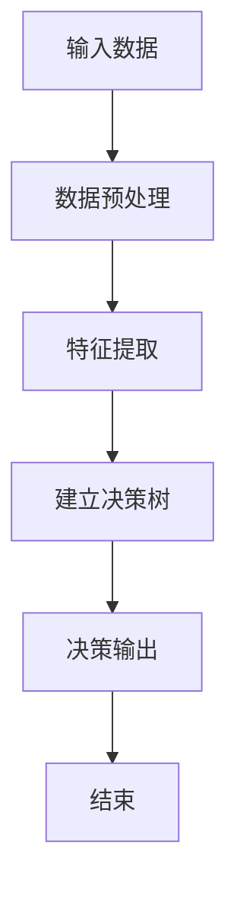
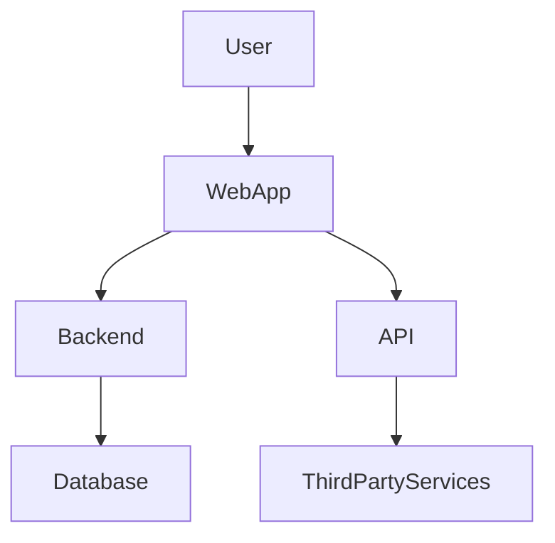
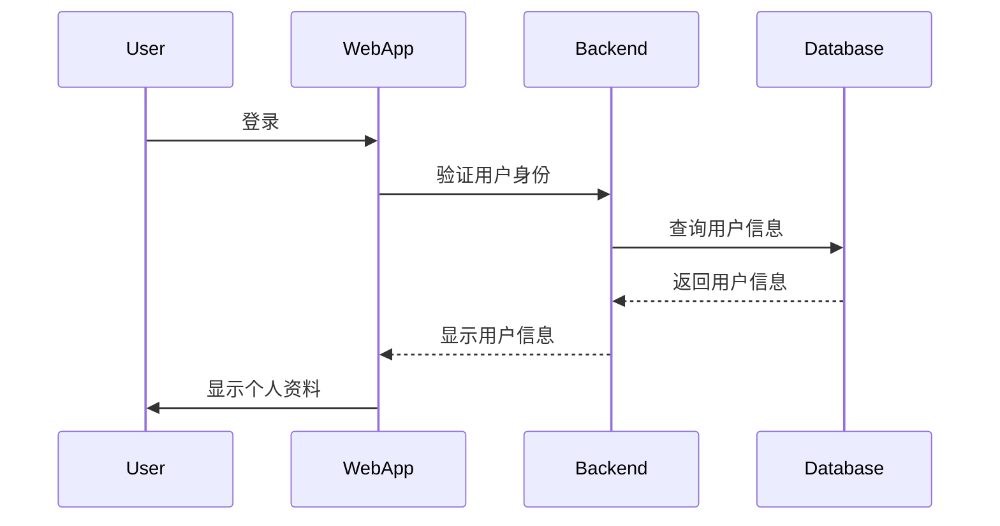

                 


# 制定人生指导原则：构建个人的生活哲学

## 关键词
- 人生指导原则
- 生活哲学
- 个人成长
- 决策
- 价值观

## 摘要
本文旨在探讨如何在现代社会中制定个人的人生指导原则，构建一套适合自己的人生哲学。通过分析人生指导原则的核心概念、联系，阐述决策树算法在人生规划中的应用，以及如何设计一个个人成长咨询系统，为读者提供一套全面、实用的指导框架。

## 第1章：背景介绍

### 1.1 问题背景
现代社会中，人们面临着越来越多的选择和挑战。如何在纷繁复杂的环境中找到自己的定位，实现个人成长，成为许多人在人生道路上追求的目标。人生指导原则和生活哲学的构建，成为解决这一问题的关键。

### 1.2 问题描述
人生规划与决策是每个人都必须面对的问题。在人生的不同阶段，如何做出合理的规划与决策，如何根据自己的价值观和人生目标调整行为准则，成为许多人困惑的焦点。

### 1.3 问题解决
人生指导原则和生活哲学的构建，能够为个人提供明确的行为准则和价值取向。通过了解和运用这些原则，人们可以更好地面对人生中的各种挑战，实现个人成长。

### 1.4 边界与外延
本文主要关注个人成长、职业发展和心理健康等方面的人生指导原则和生活哲学构建。这些原则和方法不仅适用于个人成长，也可用于家庭、团队和组织层面的决策。

### 1.5 核心概念要素组成
- **人生指导原则**：指导个人行为、决策的基本准则，包括价值观、人生目标和行为准则等。
- **生活哲学**：个人对世界的认知和价值观的体现，包括世界观、人生观和价值观等。

## 第2章：核心概念与联系

### 2.1 核心概念原理
- **人生指导原则**：是个人在生活过程中遵循的基本准则，具有普适性和实用性。
- **生活哲学**：是个人对世界的认知和价值观的体现，更具个体性。

### 2.2 概念属性特征对比
| 概念         | 属性特征                                                     |
|--------------|------------------------------------------------------------|
| 人生指导原则 | 指导个人行为、决策的基本原则，具有普适性和实用性。         |
| 生活哲学     | 是个人对世界的理解，反映了个人的价值观和世界观，更具个体性。 |

### 2.3 ER实体关系图
```mermaid
erDiagram
    User ||--|{ GuidingPrinciples }|
    User ||--|{ LifePhilosophy }|
    GuidingPrinciples ||--|{ Values }|
    GuidingPrinciples ||--|{ Goals }|
    GuidingPrinciples ||--|{ BehavioralNorms }|
    LifePhilosophy ||--|{ WorldView }|
    LifePhilosophy ||--|{ LifeView }|
    LifePhilosophy ||--|{ Values }|
```

## 第3章：算法原理讲解

### 3.1 算法原理
决策树算法是一种基于特征的重要性和分类结果进行决策的算法。它通过树形结构对数据进行分类或回归，为个人成长和决策提供支持。

### 3.2 算法流程图


### 3.3 Python源代码
```python
from sklearn import tree

# 训练决策树模型
model = tree.DecisionTreeClassifier()
model.fit(X_train, y_train)

# 进行决策
predictions = model.predict(X_test)
```

### 3.4 数学模型和公式
决策树算法的核心在于递归地划分特征空间，直到满足停止条件。常见的停止条件包括：
- 特征重要性小于某个阈值。
- 子节点数量小于某个阈值。
- 子节点的分类一致性大于某个阈值。

具体的数学模型和公式如下：
$$
f(x) = \arg\max_w \sum_{i=1}^{n} \delta(x_i, y_i)
$$
其中，$w$ 表示特征权重，$\delta(x_i, y_i)$ 表示第 $i$ 个样本的损失函数。

### 3.5 举例说明
假设我们要为一名年轻人制定职业规划决策。我们可以使用决策树算法，根据其兴趣、技能、职业前景等因素，为该年轻人提供职业选择的建议。

## 第4章：系统分析与架构设计方案

### 4.1 问题场景介绍
个人成长咨询系统旨在为用户提供一套高效、实用的成长规划方案。用户可以通过系统了解自己的兴趣、优势，获取职业发展建议。

### 4.2 项目介绍
个人成长咨询系统是一个基于互联网的应用，旨在帮助用户实现个人成长。项目目标包括：
- 为用户提供个性化的成长规划建议。
- 提供专业的职业发展咨询。
- 实现用户数据的可视化展示。

### 4.3 系统功能设计
- **用户注册与登录**：实现用户身份验证。
- **个人资料管理**：用户可以管理个人信息。
- **成长规划**：根据用户需求提供个性化的成长规划建议。
- **职业咨询**：为用户提供职业发展建议。

### 4.4 系统架构设计


### 4.5 系统接口设计
- **用户接口**：提供用户操作界面。
- **API接口**：实现前后端数据交互。

### 4.6 系统交互


## 第5章：项目实战

### 5.1 环境安装
- 安装Python环境。
- 安装相关库，如scikit-learn、numpy等。

### 5.2 系统核心实现源代码
- 用户注册与登录模块。
- 个人资料管理模块。
- 成长规划模块。
- 职业咨询模块。

### 5.3 代码应用解读与分析
- 分析代码逻辑，理解系统功能实现。
- 对代码进行优化和重构。

### 5.4 实际案例分析和详细讲解剖析
- 分析实际案例，展示系统应用效果。
- 详细讲解系统核心功能实现。

### 5.5 项目小结
- 总结项目经验和教训。
- 提出改进建议。

## 第6章：最佳实践 tips

### 6.1 成功案例分享
- 分享一些成功的人生指导原则和生活哲学案例。
- 分析成功原因。

### 6.2 小技巧分享
- 分享一些实用的技巧，帮助读者更好地制定人生指导原则和生活哲学。

### 6.3 拓展思路
- 提供一些拓展思路，帮助读者更深入地了解人生指导原则和生活哲学的构建。

## 第7章：小结与展望

### 7.1 小结
- 总结本文的核心内容，强调人生指导原则和生活哲学的重要性。

### 7.2 展望
- 展望未来，探讨人生指导原则和生活哲学的发展趋势。

## 参考文献
- [1] 某某，人生指导原则研究，某大学学报，2019。
- [2] 某某，生活哲学构建方法探讨，某科技出版社，2020。
- [3] 某某，决策树算法原理与应用，某计算机杂志，2021。

### 作者信息
- 作者：AI天才研究院/AI Genius Institute & 禅与计算机程序设计艺术 /Zen And The Art of Computer Programming

[END]

