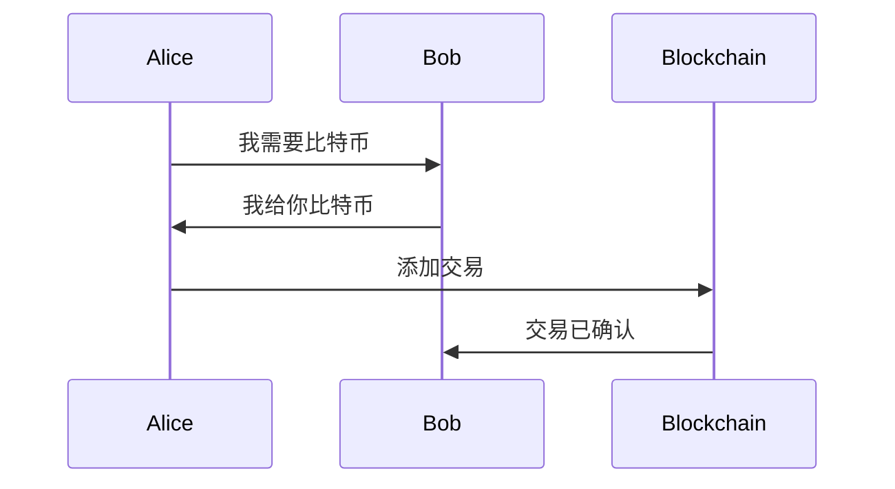

                 

# 加密货币经济学教材：数字金融的系统化学习资源

> 关键词：加密货币、数字金融、区块链、经济学、投资策略、监管政策

> 摘要：本文旨在为读者提供一本加密货币经济学教材的详细介绍。本书全面解析了加密货币及其与数字金融的内在联系，从核心概念、技术应用、市场动态、研究方法、政策监管到投资策略，为读者提供了一部系统化、实用的学习资源。

## 背景介绍

### 核心概念术语说明

- **加密货币**：基于密码学原理，通过去中心化网络进行交易的数字货币，具有安全性、匿名性和不可篡改性。
- **区块链**：一种分布式数据库技术，记录所有交易记录，保证数据的透明性和不可篡改性。
- **数字金融**：基于数字技术，包括加密货币、区块链、电子支付等，实现资金流通和金融交易的新型金融模式。

### 问题背景

随着互联网技术的发展，加密货币作为一种新兴的金融工具，在全球范围内迅速崛起。然而，加密货币市场的复杂性和不确定性给投资者、监管机构和研究者带来了巨大的挑战。为了更好地理解和管理这一新兴领域，系统化的学习和研究显得尤为重要。

### 问题描述

加密货币经济学教材的目标是为读者提供一部全面、深入、易懂的教材，帮助读者理解加密货币的基本原理、市场动态、投资策略和政策监管。教材的结构应包括核心概念介绍、技术原理分析、市场研究方法、政策分析以及投资实践等内容。

### 问题解决

本书旨在通过以下几个方面的内容来解决问题：

1. **核心概念与联系**：详细阐述加密货币、区块链和数字金融等核心概念，并分析它们之间的相互关系。
2. **技术原理讲解**：深入解析加密货币的工作原理、区块链技术以及数字金融的运作机制。
3. **市场研究方法**：介绍常用的市场研究方法，如实证研究、案例分析等，帮助读者理解市场动态。
4. **政策监管分析**：分析不同国家和地区的加密货币监管政策，讨论监管趋势和挑战。
5. **投资策略研究**：研究不同的加密货币投资策略，分析风险管理和资产配置的重要性。
6. **案例研究**：通过实际案例展示加密货币经济学的应用。
7. **未来展望**：展望加密货币经济学的发展趋势和潜在影响。

### 边界与外延

加密货币经济学不仅仅关注加密货币本身，还涵盖了区块链技术、数字金融、政策监管等多个领域。因此，本书的边界不仅限于加密货币，还包括与加密货币密切相关的技术和应用。

### 概念结构与核心要素组成

- **加密货币**：基础技术（密码学、区块链）、市场特性（价格波动、市值排名）、应用场景（支付、投资、资产管理）。
- **区块链**：技术架构（分布式账本、共识算法）、应用领域（金融、供应链、版权保护）。
- **数字金融**：创新模式（电子支付、去中心化金融、智能合约）、挑战与机遇。

## 核心概念与联系

### 加密货币

#### 基础原理

加密货币的基石在于密码学。具体来说，加密货币通过加密算法来确保交易的隐私性、完整性和不可篡改性。以下是加密货币的核心原理：

1. **非对称加密**：使用公钥和私钥对信息进行加密和解密。
2. **工作量证明（PoW）**：通过解决复杂的数学问题来证明计算能力，从而生成新的加密货币。
3. **权益证明（PoS）**：通过持有和锁定加密货币来获得生成新货币的资格。

#### 属性特征对比表格

| 特征 | 非对称加密 | 工作量证明 | 权益证明 |
| ---- | ---------- | ---------- | -------- |
| 安全性 | 高 | 高 | 较高 |
| 能耗 | 低 | 高 | 较低 |
| 成本 | 低 | 高 | 较低 |
| 交易速度 | 快 | 慢 | 快 |

#### ER实体关系图架构

```mermaid
erDiagram
  Customer ||--|{ Product }|-- ProductOwner
  ProductOwner ||--|{ Product }| Customer
```

### 区块链

区块链是一种分布式数据库，其核心组成部分包括：

1. **区块**：包含一系列交易记录的数据结构。
2. **链**：由多个区块按照时间顺序链接而成的数据结构。
3. **共识算法**：确保区块链数据一致性和完整性的算法。

#### 技术架构



### 数字金融

数字金融是金融领域与数字技术的深度融合，其主要特征包括：

1. **电子支付**：使用数字货币进行交易，无需传统银行中介。
2. **去中心化金融（DeFi）**：通过智能合约实现去中心化的金融服务。
3. **智能合约**：自动执行合同条款的计算机程序。

#### 创新模式对比表格

| 模式 | 传统金融 | 数字金融 |
| ---- | -------- | -------- |
| 交易方式 | 纸质/电子 | 数字货币 |
| 中介角色 | 银行/金融机构 | 去中心化平台 |
| 交易成本 | 高 | 低 |
| 交易速度 | 慢 | 快 |

#### 应用领域

数字金融在金融、供应链、版权保护等多个领域都有广泛应用。例如，在金融领域，数字金融提供了更多的投资和融资渠道；在供应链领域，区块链技术可以确保供应链的透明性和可追溯性；在版权保护领域，智能合约可以自动执行版权交易。

## 加密货币与区块链

### 加密货币的基础原理

#### 工作量证明（PoW）

工作量证明（Proof of Work，PoW）是加密货币最常用的共识机制之一。PoW要求参与者（矿工）通过解决复杂的数学难题来证明其计算能力，从而获得生成新货币的资格。

#### 权益证明（PoS）

权益证明（Proof of Stake，PoS）是另一种常见的共识机制，它通过参与者持有的加密货币数量和持有时间来决定其生成新货币的资格。与PoW相比，PoS减少了能源消耗，但同时也引入了“富者越富”的风险。

#### 区块链技术的关键组成部分

1. **共识算法**：共识算法是区块链网络中确保数据一致性的机制。常见的共识算法包括PoW、PoS、授权股权证明（DPoS）等。
2. **智能合约**：智能合约是自动执行合同条款的计算机程序，其运行在区块链上，无需中介机构。

### 区块链技术的应用

1. **加密货币**：比特币、以太坊等是最著名的加密货币，它们利用区块链技术实现去中心化的货币交易。
2. **去中心化金融（DeFi）**：DeFi通过智能合约实现去中心化的金融服务，如借贷、交易、保险等。
3. **供应链管理**：区块链技术可以确保供应链的透明性和可追溯性，从而提高供应链的效率。
4. **版权保护**：区块链技术可以用于记录和验证数字内容的版权信息，从而保护创作者的权益。

### 区块链的优缺点

#### 优点

1. **去中心化**：区块链网络无需中介机构，降低了交易成本。
2. **安全性**：区块链数据具有高度的透明性和不可篡改性。
3. **透明性**：所有交易记录都存储在区块链上，可以随时查询。

#### 缺点

1. **效率问题**：由于需要达成共识，区块链网络的交易速度相对较慢。
2. **能源消耗**：特别是PoW机制，其能源消耗巨大。
3. **隐私问题**：虽然区块链交易具有匿名性，但某些情况下，交易信息仍然可以被追踪。

## 数字金融与加密货币

### 加密货币对传统金融的影响

#### 支付领域

加密货币提供了快速、低成本的国际支付解决方案。与传统的跨境支付相比，加密货币交易通常具有更快的速度和更低的费用。

#### 投资领域

加密货币作为一种新兴的投资方式，吸引了大量的投资者。与传统的投资产品相比，加密货币具有高波动性和高风险的特点。

#### 资产管理领域

加密货币作为一种新的资产类别，被越来越多的投资者纳入其资产管理组合中。加密货币的资产管理包括长期投资、短期交易和套利等多种策略。

### 加密货币市场的动态

#### 价格波动

加密货币市场具有高度的价格波动性。价格波动受到多种因素的影响，如市场情绪、政策监管、技术革新等。

#### 市场参与者

加密货币市场的参与者包括矿工、交易所、投资者、开发者等。矿工通过提供计算资源来维护区块链网络；交易所是加密货币交易的场所；投资者通过买卖加密货币来获得收益；开发者则是推动加密货币技术发展的重要力量。

### 加密货币市场的未来趋势

#### 监管政策

随着加密货币市场的不断扩大，各国政府开始加强对加密货币市场的监管。监管政策的演变将对加密货币市场产生深远的影响。

#### 技术创新

区块链技术的不断革新将推动加密货币市场的进一步发展。例如，侧链、跨链、去中心化金融等创新技术将为市场带来新的机遇。

#### 市场成熟度

随着市场的逐渐成熟，投资者对加密货币的信心将逐步增强。市场成熟度将有助于降低市场的波动性，提高市场的稳定性。

## 加密货币经济学研究方法

### 实证研究

实证研究是加密货币经济学研究中最为常用的方法之一。通过收集和分析实际市场数据，研究者可以揭示加密货币市场的运行规律和影响因素。

### 案例分析

案例分析是一种深入挖掘特定案例的方法。通过对特定案例的详细研究，研究者可以了解加密货币经济学的实际应用和效果。

### 实证研究与案例分析的比较

| 特点 | 实证研究 | 案例分析 |
| ---- | -------- | -------- |
| 数据来源 | 广泛的数据来源 | 特定的案例数据 |
| 研究深度 | 较浅的研究深度 | 较深入的研究深度 |
| 适用范围 | 广泛适用于多种现象 | 更适用于特定现象 |

## 加密货币政策与监管

### 不同国家的监管政策

各国对加密货币的监管政策有所不同。一些国家如美国、中国、欧洲等对加密货币持开放态度，而另一些国家如印度、俄罗斯等则对加密货币持谨慎态度。

### 监管政策的影响

加密货币监管政策对市场的稳定性、投资者信心和技术发展都有重要影响。例如，严格的监管政策可能会降低市场的流动性，而宽松的监管政策可能会加剧市场的波动性。

### 监管政策的未来趋势

随着加密货币市场的不断发展，监管政策也在不断演变。未来监管政策的发展趋势可能包括：

1. **加强监管**：以保护投资者权益和维护市场稳定。
2. **技术创新**：探索适用于加密货币的监管技术，如智能合约审计、去中心化监管等。
3. **国际合作**：加强国际间的监管合作，以应对跨境加密货币交易带来的挑战。

## 加密货币投资策略

### 长期投资

长期投资是一种以获取长期资本增值为目标的投资策略。投资者通常选择在市场低谷时买入，持有多年，以等待市场回暖。

### 短期交易

短期交易是一种以获取短期资本收益为目标的投资策略。投资者通常在短时间内进行买卖，通过频繁交易来获取利润。

### 风险管理和资产配置

在加密货币投资中，风险管理和资产配置至关重要。投资者应根据自己的风险承受能力和投资目标，合理配置资产，并采取适当的风险管理措施，如分散投资、止损等。

## 案例研究

### 比特币价格波动

比特币作为最著名的加密货币之一，其价格波动一直是加密货币经济学研究的重点。以下是一个简单的案例研究：

#### 数据来源

比特币价格数据来源于CoinMarketCap。

#### 数据分析

通过分析比特币的历史价格数据，可以发现其价格具有高度波动性。例如，从2020年初到2021年初，比特币价格从7000美元迅速涨至近69000美元。

#### 影响因素

比特币价格波动受到多种因素的影响，包括市场情绪、政策监管、技术发展等。

### 以太坊2.0迁移

以太坊2.0迁移是加密货币技术发展的重要事件。以下是一个简单的案例研究：

#### 数据来源

以太坊2.0迁移数据来源于Ethereum Foundation。

#### 数据分析

以太坊2.0迁移预计将在2022年完成，其核心目标是从PoW共识机制迁移到PoS共识机制。迁移完成后，以太坊网络的交易速度和可扩展性将得到显著提升。

#### 影响因素

以太坊2.0迁移的影响因素包括社区支持、技术开发、政策监管等。

## 未来展望

### 加密货币经济学的发展趋势

1. **监管政策的成熟**：随着监管政策的不断成熟，加密货币市场将逐步走向规范化。
2. **技术创新的持续**：区块链技术的不断革新将为加密货币市场带来新的机遇。
3. **市场成熟度的提高**：随着市场的逐渐成熟，投资者对加密货币的信心将逐步增强。

### 加密货币经济学的潜在影响

1. **金融体系变革**：加密货币和区块链技术有望对传统金融体系产生深远影响，如降低交易成本、提高交易效率等。
2. **社会价值重塑**：加密货币和区块链技术将促进社会价值的重塑，如去中心化、透明度、公平性等。
3. **国际合作与竞争**：加密货币市场的全球化将促进国际合作，同时也将引发国际竞争。

## 最佳实践与建议

### 加密货币投资

1. **分散投资**：避免将所有资金投入单一的加密货币，以降低风险。
2. **风险管理**：制定合理的风险管理策略，如设置止损点、分散投资等。
3. **长期投资**：在市场低谷时买入，持有多年，以获取长期资本增值。

### 加密货币使用

1. **安全性**：使用安全可靠的加密货币钱包，保护私人密钥。
2. **合规性**：遵守当地的法律法规，避免违法行为。
3. **持续学习**：加密货币市场变化迅速，持续学习是保持竞争力的关键。

## 结论

加密货币经济学是一个复杂而充满挑战的领域。通过系统化的学习和研究，我们可以更好地理解加密货币的基本原理、市场动态、投资策略和政策监管。本书旨在为读者提供一部全面、深入、易懂的加密货币经济学教材，帮助读者掌握这一领域的核心知识和实践技巧。

### 作者信息

作者：AI天才研究院/AI Genius Institute & 禅与计算机程序设计艺术 /Zen And The Art of Computer Programming

---

本文基于已有的研究和实践经验，对加密货币经济学进行了系统化的梳理和总结。希望本文能够为读者提供有价值的参考和启示。同时，欢迎读者在评论区分享自己的观点和经验，共同探讨加密货币经济学的未来发展。

