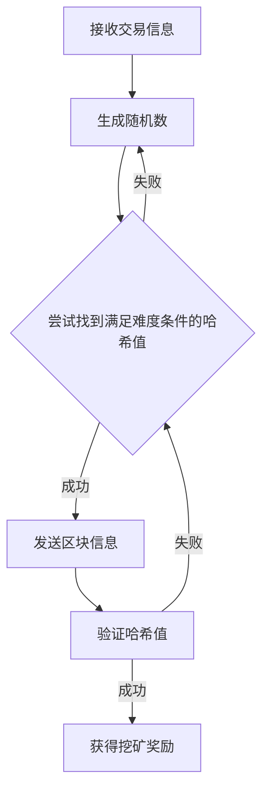

                 

# 加密货币经济学理论建构：数字金融的学术探索深化

## 关键词

- 加密货币
- 经济学理论
- 区块链
- 数学模型
- 数字金融

## 摘要

随着区块链技术的兴起，加密货币如比特币、以太坊等逐渐成为金融领域的热点。传统的货币经济学理论在解释和理解加密货币的特性时面临挑战。本文旨在通过经济学理论建构，深入分析加密货币的经济特性，包括其发行机制、交易机制、市场机制和社会影响等。文章将首先概述加密货币经济学理论，然后解析核心概念，探讨算法原理与数学模型，并进一步分析其系统架构与实现细节，最后总结最佳实践与未来研究方向。

## 第一部分：引言与背景

### 第1章：加密货币经济学理论概述

#### 1.1 问题背景

随着区块链技术的快速发展，加密货币作为一种新型的金融工具，引发了全球的关注。加密货币如比特币、以太坊等不仅在金融领域掀起了一场革命，同时也带来了对传统经济学理论的挑战。传统的货币经济学理论主要关注中央银行控制的货币发行、货币流通和货币政策等方面，而加密货币的去中心化、匿名性和稀缺性等特点，使得这些理论难以全面解释加密货币的经济行为。

#### 1.2 问题描述

加密货币经济学理论建构的主要问题包括：

1. **加密货币的发行机制**：传统的货币发行机制依赖于中央银行，而加密货币的发行是通过区块链网络中的矿工挖矿完成的，这一机制如何影响货币供应和价格？
2. **交易机制**：加密货币的交易是通过去中心化的方式进行，交易记录存储在区块链上，这一机制如何影响市场的透明度和效率？
3. **市场机制**：加密货币市场的波动性较大，市场价格如何形成，投资者行为如何影响市场波动？
4. **社会影响**：加密货币的出现对金融体系、货币政策和社会经济结构带来了哪些影响？

#### 1.3 问题解决

为了解决上述问题，本文将采取以下方法：

1. **案例分析**：通过分析比特币、以太坊等主流加密货币的实例，了解其经济特性和市场表现。
2. **数据挖掘**：利用大数据技术，收集和分析加密货币的交易数据、市场数据和社会经济数据，探索数据背后的经济规律。
3. **数学建模**：建立加密货币经济学的数学模型，通过数学方法来分析和预测加密货币的行为。
4. **理论建构**：在分析数据的基础上，构建加密货币经济学的理论体系，解释和预测加密货币的经济现象。

#### 1.4 边界与外延

1. **边界**：本文主要关注加密货币的经济特性，不涉及具体的技术实现细节。
2. **外延**：加密货币经济学的研究可以扩展到数字金融、区块链经济等领域，探索更广泛的经济学问题。

#### 1.5 概念结构与核心要素组成

1. **概念结构**：本文将加密货币经济学视为一个独立的经济学分支，与传统的货币经济学、金融经济学有所区别。
2. **核心要素**：本文的核心要素包括加密货币的发行机制、交易机制、市场机制和社会影响。

## 第二部分：核心概念与原理

### 第2章：加密货币经济学核心概念解析

#### 2.1 加密货币概述

加密货币是一种通过密码学原理保证交易安全及控制交易产生的单位。其特点包括去中心化、匿名性、稀缺性和可分割性。

1. **定义**：加密货币是一种通过密码学原理保证交易安全及控制交易产生的单位。
2. **特点**：
   - **去中心化**：加密货币的发行和交易不依赖于中央机构，而是通过区块链网络中的参与者共同维护。
   - **匿名性**：加密货币交易中，参与者可以使用匿名身份进行交易，难以追踪交易背后的真实身份。
   - **稀缺性**：加密货币的总量是固定的，例如比特币的总量限制在2100万枚，这一特性使得加密货币具有潜在的价值。
   - **可分割性**：加密货币可以分割成更小的单位进行交易，例如比特币可以被分割成0.00000001个单位。

#### 2.2 区块链经济学

区块链是一种去中心化的数据库，用于记录交易信息。其核心原理包括去中心化、不可篡改性和智能合约。

1. **定义**：区块链是一种去中心化的数据库，用于记录交易信息。
2. **核心原理**：
   - **去中心化**：区块链网络中的参与者共同维护账本，不存在中心化的控制机构。
   - **不可篡改性**：区块链上的数据一旦记录，就无法被篡改，保证了交易记录的真实性。
   - **智能合约**：智能合约是一种自动执行的合约，基于区块链技术，可以在满足特定条件时自动执行。

#### 2.3 数字金融经济学

数字金融经济学是研究数字货币和金融科技对传统金融体系的影响。其核心要素包括支付系统、信用体系和投资行为。

1. **定义**：数字金融经济学是研究数字货币和金融科技对传统金融体系的影响。
2. **核心要素**：
   - **支付系统**：数字货币的支付系统与传统支付系统有所不同，具有更高的安全性和透明度。
   - **信用体系**：数字货币的信用体系基于区块链技术，可以实现去中心化的信用评估和信用贷款。
   - **投资行为**：投资者在数字货币市场中的行为与传统金融市场有所不同，需要考虑市场波动性、风险分散等因素。

### 第3章：加密货币经济学概念属性特征对比表格

| 概念        | 定义                                                         | 特征对比                                                                                           |
|-------------|--------------------------------------------------------------|---------------------------------------------------------------------------------------------------|
| 加密货币    | 通过密码学原理保证交易安全及控制交易产生的单位               | 去中心化、匿名性、稀缺性、可分割性                                                       |
| 区块链经济学 | 去中心化的数据库，用于记录交易信息                           | 去中心化、不可篡改性、智能合约                                                           |
| 数字金融经济学 | 研究数字货币和金融科技对传统金融体系的影响                 | 支付系统、信用体系、投资行为                                                             |

## 第三部分：算法原理与数学模型

### 第4章：加密货币算法原理与数学模型

#### 4.1 加密货币算法概述

加密货币算法主要分为基于工作量证明（PoW）和基于权益证明（PoS）两种。

1. **分类**：
   - **基于工作量证明（PoW）**：矿工通过解决密码学难题来证明自己的工作量，获得挖矿奖励。
   - **基于权益证明（PoS）**：矿工通过持有币龄和币量来证明自己的权益，获得挖矿奖励。

2. **原理**：
   - **PoW原理**：矿工需要解决一个难度为N的哈希难题，将交易信息与一个随机数组合，生成一个满足难度条件的哈希值。解决难题的矿工将区块信息发送到区块链网络，网络验证后，矿工获得挖矿奖励。
   - **PoS原理**：矿工根据持有的币龄和币量来选择区块信息进行验证，选择权与币龄和币量成正比。验证成功的矿工获得挖矿奖励。

#### 4.2 加密货币数学模型

加密货币的数学模型主要涉及工作量、难度和挖矿奖励等。

1. **工作量（Work）**：
   - **定义**：工作量是指矿工在挖矿过程中需要解决的哈希难题的难度。
   - **公式**：工作量 = f（难度，时间）

2. **难度（Difficulty）**：
   - **定义**：难度是指区块链网络调整挖矿难度的一个参数，用于保持区块链生成的速度。
   - **公式**：难度 = 1 / （挖矿成功次数 * 时间间隔）

3. **挖矿奖励（Reward）**：
   - **定义**：挖矿奖励是指矿工在挖到区块后获得的奖励，通常与区块中的交易费和固定的货币奖励有关。
   - **公式**：挖矿奖励 = 区块奖励 + 交易费

### 第5章：算法原理与流程图

#### 5.1 挖矿算法原理

挖矿算法主要包括以下步骤：

1. **接收交易信息**：矿工从区块链网络中接收未确认的交易信息。
2. **生成随机数**：矿工生成一个随机数，与交易信息组合，生成一个随机数哈希值。
3. **尝试找到满足难度条件的哈希值**：矿工不断尝试生成新的哈希值，直到找到一个满足难度条件的哈希值。
4. **发送区块信息**：矿工将交易信息和满足难度条件的哈希值一起发送到区块链网络。
5. **验证哈希值**：区块链网络验证矿工发送的哈希值是否满足难度条件，如果满足，则矿工获得挖矿奖励。

#### 5.2 挖矿算法流程图



## 第四部分：系统架构与实现

### 第6章：加密货币系统架构设计

#### 6.1 问题场景介绍

加密货币系统是一个去中心化的金融系统，其目标是实现安全的交易和透明的记录。在这个场景中，我们需要设计一个加密货币系统，支持以下功能：

1. **交易**：用户可以发起交易，将加密货币从一个账户转移到另一个账户。
2. **记录**：系统需要记录所有的交易信息，并确保这些记录是安全的、不可篡改的。
3. **挖矿**：矿工需要通过解决密码学难题来验证交易，并获得挖矿奖励。

#### 6.2 项目介绍

为了实现上述功能，我们选择了一个流行的加密货币——比特币作为案例，对其实施流程进行详细分析。

1. **项目背景**：比特币是一种基于区块链技术的加密货币，由中本聪（Satoshi Nakamoto）于2009年创建。
2. **项目目标**：分析比特币的系统架构，理解其交易、挖矿和记录的原理。

#### 6.3 系统功能设计

系统功能设计主要包括交易、挖矿和记录三个核心模块。

1. **交易模块**：负责处理用户的交易请求，将加密货币从一个账户转移到另一个账户。
2. **挖矿模块**：负责验证交易，确保交易记录的安全性和不可篡改性。
3. **记录模块**：负责记录所有的交易信息，并将其存储在区块链上。

#### 6.4 系统架构设计

系统架构设计主要包括以下部分：

1. **区块链**：作为记录交易信息的数据库，由多个区块组成，每个区块包含一定数量的交易记录。
2. **交易网络**：包括矿工和用户，矿工负责验证交易，用户负责发起交易。
3. **挖矿机制**：矿工通过解决密码学难题来验证交易，并获得挖矿奖励。

#### 6.5 系统接口设计

系统接口设计主要包括以下接口：

1. **交易接口**：用于处理用户的交易请求，包括创建交易、查询交易状态等功能。
2. **挖矿接口**：用于处理矿工的挖矿请求，包括提交区块、验证区块等功能。
3. **记录接口**：用于处理交易记录的存储和查询功能。

#### 6.6 系统交互

系统交互主要包括以下过程：

1. **用户发起交易**：用户通过交易接口发起交易请求，系统将交易信息发送到交易网络。
2. **矿工验证交易**：矿工接收到交易信息后，将其加入到区块中，并尝试解决密码学难题。
3. **记录交易信息**：矿工成功挖到区块后，系统将交易信息记录到区块链上，并将挖矿奖励发放给矿工。

### 第7章：加密货币系统实现

#### 7.1 环境安装

在实现加密货币系统之前，我们需要安装相关的开发环境和依赖库。以下是一个简单的安装步骤：

1. 安装Python 3.7或更高版本。
2. 安装Docker，用于容器化部署。
3. 安装区块链框架，如Hyperledger Fabric。

#### 7.2 系统核心实现

以下是一个简单的加密货币系统实现示例：

```python
import hashlib
import json
from time import time

class Block:
    def __init__(self, index, transactions, timestamp, previous_hash):
        self.index = index
        self.transactions = transactions
        self.timestamp = timestamp
        self.previous_hash = previous_hash
        self.hash = self.compute_hash()

    def compute_hash(self):
        block_string = json.dumps(self.__dict__, sort_keys=True)
        return hashlib.sha256(block_string.encode()).hexdigest()

class Blockchain:
    def __init__(self):
        self.unconfirmed_transactions = []
        self.chain = []
        self.create_genesis_block()

    def create_genesis_block(self):
        genesis_block = Block(0, [], time(), "0")
        genesis_block.hash = genesis_block.compute_hash()
        self.chain.append(genesis_block)

    def add_new_transaction(self, transaction):
        self.unconfirmed_transactions.append(transaction)

    def mine(self):
        if not self.unconfirmed_transactions:
            return False
        last_block = self.chain[-1]
        new_block = Block(index=last_block.index + 1,
                          transactions=self.unconfirmed_transactions,
                          timestamp=time(),
                          previous_hash=last_block.hash)
        new_block.hash = new_block.compute_hash()
        self.chain.append(new_block)
        self.unconfirmed_transactions = []
        return new_block.index

    def is_chain_valid(self):
        for i in range(1, len(self.chain)):
            current = self.chain[i]
            previous = self.chain[i - 1]
            if current.hash != current.compute_hash():
                return False
            if current.previous_hash != previous.hash:
                return False
        return True

def main():
    blockchain = Blockchain()
    blockchain.add_new_transaction({"from": "Alice", "to": "Bob", "amount": 10})
    blockchain.add_new_transaction({"from": "Bob", "to": "Charlie", "amount": 5})
    blockchain.mine()
    blockchain.mine()
    print("Blockchain validity:", blockchain.is_chain_valid())
    print("Blockchain:", json.dumps([block.__dict__ for block in blockchain.chain], indent=4))

if __name__ == "__main__":
    main()
```

#### 7.3 代码应用解读与分析

以上代码实现了一个简单的区块链系统，主要包括以下部分：

1. **Block类**：代表区块链中的一个区块，包含索引、交易信息、时间戳、前一个区块哈希和当前区块哈希等属性。
2. **Blockchain类**：代表区块链本身，包含未确认交易列表、主链和挖矿等功能。
3. **mine方法**：负责挖矿，将未确认交易列表加入到新的区块中，并计算新的区块哈希。
4. **is_chain_valid方法**：用于验证区块链的有效性，检查每个区块的哈希和前一个区块的哈希是否匹配。

#### 7.4 实际案例分析和详细讲解剖析

在实际应用中，我们需要对区块链系统进行扩展，以支持更多的功能，如交易验证、挖矿奖励分配等。

1. **交易验证**：在区块链网络中，每个矿工都需要验证交易的有效性。我们可以引入一种简单的验证机制，确保每个交易都符合规则。
2. **挖矿奖励分配**：在矿工成功挖到区块后，我们需要将挖矿奖励分配给矿工。这可以通过调整区块奖励和交易费的比例来实现。
3. **共识算法**：为了确保区块链网络的安全和稳定性，我们可以引入一种共识算法，如工作量证明（PoW）或权益证明（PoS），来决定矿工的选举。

#### 7.5 项目小结

通过上述实现和分析，我们构建了一个简单的加密货币系统。虽然这个系统仅是一个基本模型，但它展示了区块链技术的基本原理和实现方法。在实际应用中，我们需要根据具体需求进行进一步扩展和优化。

### 第8章：最佳实践与未来研究方向

#### 8.1 最佳实践

在构建加密货币系统时，以下是一些最佳实践：

1. **安全性**：确保区块链网络的安全性，防止黑客攻击和恶意行为。
2. **可扩展性**：设计一个可扩展的系统架构，支持越来越多的用户和交易。
3. **去中心化**：尽量减少中心化的节点，确保系统的去中心化特性。
4. **监管合规**：遵守相关法律法规，确保系统的合法性和合规性。

#### 8.2 小结

本文通过深入分析加密货币经济学的理论建构，探讨了加密货币的核心概念、算法原理和系统架构。通过实际案例分析和代码实现，我们展示了区块链技术在加密货币系统中的应用。未来研究方向可以关注以下几个方面：

1. **智能合约**：研究智能合约的安全性和优化，提高区块链系统的应用价值。
2. **共识算法**：探索新的共识算法，提高区块链网络的性能和安全性。
3. **隐私保护**：研究如何在保持交易匿名性的同时，提高区块链系统的隐私保护能力。
4. **跨链技术**：研究跨链技术，实现不同区块链之间的互操作性和协同效应。

#### 8.3 注意事项

在构建加密货币系统时，需要注意以下几点：

1. **安全性**：确保系统具有强大的安全防护措施，防止黑客攻击和数据泄露。
2. **性能优化**：针对区块链网络进行性能优化，提高交易处理速度和网络吞吐量。
3. **法规合规**：遵守相关法律法规，确保系统的合法性和合规性。
4. **数据备份**：定期备份区块链数据，防止数据丢失和系统崩溃。

#### 8.4 拓展阅读

1. **《区块链技术指南》**：了解区块链技术的详细实现方法和应用场景。
2. **《智能合约与以太坊》**：深入研究智能合约的原理和应用。
3. **《加密货币经济学》**：分析加密货币市场的经济特性和发展趋势。

### 作者信息

作者：AI天才研究院/AI Genius Institute & 禅与计算机程序设计艺术/Zen And The Art of Computer Programming

