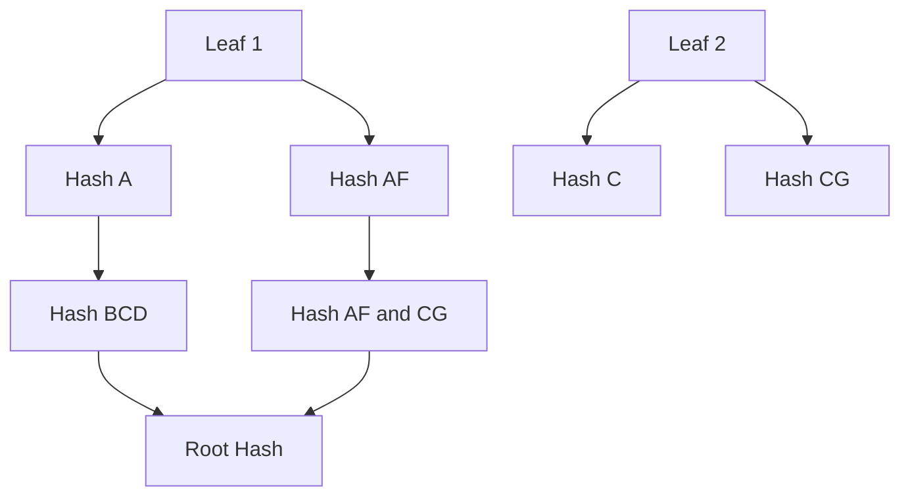

                 

### Introduction to Crypto Economics

Crypto economics is an interdisciplinary field that merges cryptography, economics, and computer science to study the creation, distribution, and use of digital assets, primarily cryptocurrencies. As the world increasingly transitions towards digital finance, understanding the economic principles behind cryptocurrencies is crucial for both investors and policymakers.

### Core Concepts and Their Relationships

#### Core Concepts

**Blockchain** is a decentralized ledger technology that ensures the integrity and security of transactions. Each block in the chain contains a timestamp and transaction data, forming an immutable and transparent record.

**Smart Contracts** are self-executing contracts with the terms of the agreement directly written into code. They are stored on the blockchain and automatically executed when predefined conditions are met.

**Decentralized Finance (DeFi)** refers to financial applications built on blockchain technology that operate independently of traditional financial institutions.

#### Attributes Comparison Table

| Attribute | Blockchain | Smart Contracts | DeFi |
| --- | --- | --- | --- |
| **Purpose** | Ensuring secure transactions | Automating agreements | Disintermediating traditional financial services |
| **Technology** | Distributed ledger | Programming code | Blockchain and smart contracts |
| **Scalability** | Limited (depending on consensus algorithm) | Varies based on programming | High scalability potential |
| **Transparency** | High (publicly accessible) | Medium (code transparency) | High (publicly accessible) |

#### Entity Relationship Diagram (ERD)

```mermaid
erDiagram
Blockchain ||--|{ Smart Contracts }|
Smart Contracts ||--|{ DeFi }|
DeFi ||--|{ Blockchain }|
```

### Core Concepts and Their Relationships

The interconnected nature of blockchain, smart contracts, and DeFi is evident in their collaborative roles within the crypto economy. Blockchain serves as the foundational infrastructure, providing a secure and transparent ledger for all transactions. Smart contracts build upon this infrastructure, automating and executing predefined contractual terms. DeFi leverages both blockchain and smart contracts to create financial services that are decentralized and accessible to anyone with an internet connection.

### Cryptographic Principles

#### Blockchain Architecture and Operation

Blockchain operates on a decentralized network where participants, known as nodes, validate transactions and add them to the ledger. The process involves the following steps:

1. **Transaction Creation**: A user initiates a transaction, specifying the sender, recipient, and transaction amount.
2. **Transaction Propagation**: The transaction is broadcasted to the network, where nodes receive and verify it.
3. **Block Formation**: Once verified, transactions are bundled into a block along with a timestamp and a cryptographic hash of the previous block.
4. **Block Validation**: Nodes in the network validate the block by solving a cryptographic puzzle, known as a proof of work.
5. **Block Addition**: Once validated, the block is added to the blockchain, extending the chain and finalizing the transaction.

#### Cryptographic Principles

**Hash Functions**: Hash functions are cryptographic algorithms that convert data of any size into a fixed-size string of characters. They are essential for ensuring the integrity and immutability of data on the blockchain.

**Digital Signatures**: Digital signatures provide a way to verify the authenticity and integrity of digital messages or documents. They use public-key cryptography, where a private key is used to sign a message and a public key is used to verify the signature.

**Public-Key Cryptography**: Public-key cryptography involves a pair of keys, a public key and a private key. The public key is used to encrypt data, while the private key is used to decrypt it. This asymmetric cryptography is the backbone of blockchain security.

### Algorithms and Protocols

#### Proof of Work (PoW)

Proof of Work (PoW) is a consensus mechanism used in blockchain networks to validate transactions and add new blocks to the chain. The process involves the following steps:

1. **Transaction Collection**: Unconfirmed transactions are collected into a memory pool.
2. **Block Formation**: Transactions from the memory pool are selected and bundled into a block, along with a timestamp and the hash of the previous block.
3. **Proof of Work**: Miners attempt to find a hash for the block that meets a specific difficulty level. This involves solving a mathematical puzzle.
4. **Block Validation**: Once a valid hash is found, the block is added to the blockchain, and the transactions are considered confirmed.

**Python Code Example**:

```python
import hashlib
import json
from time import time

class Block:
    def __init__(self, index, transactions, timestamp, previous_hash):
        self.index = index
        self.transactions = transactions
        self.timestamp = timestamp
        self.previous_hash = previous_hash
        self.hash = self.compute_hash()

    def compute_hash(self):
        block_string = json.dumps(self.__dict__, sort_keys=True)
        return hashlib.sha256(block_string.encode()).hexdigest()

def mine_block(last_block, transactions):
    index = last_block.index + 1
    timestamp = time()
    previous_hash = last_block.hash

    while True:
        block = Block(index, transactions, timestamp, previous_hash)
        if block.hash.startswith('0' * 4):
            return block

# Example usage
last_block = Block(0, [], time(), "0")
new_transactions = ["Transaction 1", "Transaction 2"]
block = mine_block(last_block, new_transactions)
```

#### Proof of Stake (PoS)

Proof of Stake (PoS) is an alternative consensus mechanism to PoW that is designed to be more energy-efficient. In PoS, instead of mining, nodes are chosen to create new blocks based on their stake in the network. The process involves the following steps:

1. **Stake Creation**: Users acquire coins by purchasing or mining.
2. **Selection**: Nodes are selected based on their coin holdings and how long they have held them.
3. **Block Creation**: The selected node creates a new block and adds it to the blockchain.
4. **Validation**: Other nodes in the network validate the block and add it to their copy of the blockchain.

**Python Code Example**:

```python
import random

class Node:
    def __init__(self, stake):
        self.stake = stake

def select_validator(nodes):
    weights = [node.stake for node in nodes]
    total_weight = sum(weights)
    random_weight = random.uniform(0, total_weight)
    accumulated_weight = 0

    for node in nodes:
        accumulated_weight += node.stake
        if accumulated_weight >= random_weight:
            return node

nodes = [Node(100), Node(200), Node(300)]
selected_validator = select_validator(nodes)
print(f"Selected validator: {selected_validator.stake}")
```

#### Smart Contracts

Smart contracts are self-executing contracts with the terms of the agreement directly written into code. They are stored on the blockchain and automatically executed when predefined conditions are met. Ethereum is the most popular platform for deploying smart contracts.

**Python Code Example**:

```python
from web3 import Web3
from solc import compile_source

# Connect to the Ethereum network
w3 = Web3(Web3.HTTPProvider('https://mainnet.infura.io/v3/YOUR_INFURA_PROJECT_ID'))

# Compile the smart contract
source_code = '''
pragma solidity ^0.8.0;

contract SimpleContract {
    uint256 public balance;

    function deposit() public payable {
        balance += msg.value;
    }

    function withdraw(uint256 amount) public {
        require(amount <= balance, "Insufficient balance");
        balance -= amount;
        payable(msg.sender).transfer(amount);
    }
}
'''

compiled_sol = compile_source(source_code)
contract_interface = compiled_sol['< Contracts >']['abi']
contract.bytecode = compiled_sol['< Contracts >']['bin']

# Deploy the smart contract
contract = w3.eth.contract(abi=contract_interface, bytecode=contract.bytecode)
tx_hash = contract.deploy transact={'from': w3.eth.coinbase, 'value': w3.toWei(1, 'ether')})
tx = w3.eth.waitForTransactionReceipt(tx_hash)

# Interact with the smart contract
contract_address = tx.contractAddress
contract = w3.eth.contract(address=contract_address, abi=contract_interface)

# Deposit funds
deposit_tx_hash = contract.functions.deposit().transact({'from': w3.eth.coinbase, 'value': w3.toWei(1, 'ether')})
deposit_tx = w3.eth.waitForTransactionReceipt(deposit_tx_hash)

# Withdraw funds
withdrawal_tx_hash = contract.functions.withdraw(1).transact({'from': w3.eth.coinbase})
withdrawal_tx = w3.eth.waitForTransactionReceipt(withdrawal_tx_hash)
```

In summary, crypto economics is a complex and rapidly evolving field that requires a deep understanding of cryptographic principles, economic theories, and blockchain technology. By examining the core concepts, relationships, and cryptographic principles, we can better appreciate the potential and challenges of digital finance. The next section will delve into the economic theories and market dynamics of cryptocurrencies, providing a deeper insight into their value and investment strategies.## Economic Theory and Cryptocurrency Markets

Cryptocurrencies operate within a unique economic framework that diverges significantly from traditional financial markets. To comprehend their market dynamics and pricing mechanisms, we must first understand the foundational economic principles at play.

### Market Dynamics and Pricing

#### Supply and Demand

The basic principles of supply and demand are at work in the cryptocurrency market. **Supply** is determined by the total number of coins in circulation, which is often capped by the cryptocurrency's design. For example, Bitcoin has a maximum supply of 21 million coins. **Demand** is influenced by various factors, including investor sentiment, regulatory changes, and technological advancements.

When demand increases relative to supply, the price of cryptocurrencies rises. Conversely, a decrease in demand relative to supply leads to a decline in price. This dynamic is akin to other markets but is often amplified in cryptocurrencies due to their high volatility.

#### Market Efficiency

Market efficiency refers to how quickly and accurately information is reflected in prices. In traditional financial markets, information efficiency is often high, with prices adjusting rapidly to new information. Cryptocurrency markets, however, exhibit varying degrees of efficiency.

Some factors contributing to the efficiency of cryptocurrency markets include:

- **Information Accessibility**: Cryptocurrency transactions are publicly recorded on the blockchain, providing transparency that enhances efficiency.
- **Information Velocity**: Social media and online forums play a significant role in disseminating information quickly, impacting market prices.
- **Regulatory Environment**: Changes in regulations can have a substantial impact on market efficiency, often leading to price volatility until market participants adjust their expectations.

### Investment Strategies

Investors in the cryptocurrency market employ a variety of strategies to maximize returns and manage risk. Here are some common investment strategies:

#### Hedging

Hedging involves taking positions in assets that move inversely to the cryptocurrency to offset potential losses. For example, an investor might buy Bitcoin while simultaneously shorting gold, expecting that if Bitcoin declines, gold will increase in value, thereby mitigating losses.

**Python Code Example** (Simulated Hedging Strategy):

```python
import numpy as np

# Simulated historical price data
bitcoin_prices = np.array([40, 45, 42, 48, 50, 47, 45])
gold_prices = np.array([150, 155, 152, 158, 160, 157, 155])

# Hedging ratio (example value)
hedging_ratio = 0.8

# Calculate hedged returns
hedged_returns = bitcoin_prices - hedging_ratio * gold_prices

# Calculate cumulative hedged returns
cumulative_hedged_returns = np.cumsum(hedged_returns)

print(f"Cumulative Hedged Returns: {cumulative_hedged_returns}")
```

#### Arbitrage

Arbitrage involves taking advantage of price differences between two or more markets. In the cryptocurrency market, arbitrage opportunities can arise due to discrepancies in pricing across different exchanges.

**Python Code Example** (Simulated Arbitrage Strategy):

```python
import pandas as pd

# Simulated arbitrage opportunities
exchange_A = pd.DataFrame({'Time': ['t0', 't1', 't2', 't3'], 'Price_A': [40, 43, 42, 45]})
exchange_B = pd.DataFrame({'Time': ['t0', 't1', 't2', 't3'], 'Price_B': [42, 44, 43, 47]})

# Calculate arbitrage opportunities
arbitrage_opportunities = exchange_A['Price_A'] - exchange_B['Price_B']

# Calculate cumulative arbitrage gains
cumulative_arbitrage_gains = np.cumsum(arbitrage_opportunities)

print(f"Cumulative Arbitrage Gains: {cumulative_arbitrage_gains}")
```

#### Long-term Investment

Long-term investment in cryptocurrencies involves holding assets for extended periods, typically years, with the expectation that their value will appreciate over time. This strategy is often favored by those who believe in the long-term potential of cryptocurrencies as a store of value and a medium of exchange.

**Python Code Example** (Simulated Long-term Investment Strategy):

```python
import numpy as np

# Simulated historical Bitcoin prices
historical_prices = np.array([40, 45, 50, 48, 55, 52, 60])

# Calculate cumulative returns
cumulative_returns = np.cumsum(historical_prices / historical_prices[0])

print(f"Cumulative Returns: {cumulative_returns}")
```

#### Short-term Trading

Short-term trading involves buying and selling cryptocurrencies within a short period, typically hours or days. This strategy requires a deep understanding of market trends, technical analysis, and often involves leveraging financial instruments like margin trading.

**Python Code Example** (Simulated Short-term Trading Strategy):

```python
import pandas as pd

# Simulated daily Bitcoin prices
daily_prices = pd.DataFrame({'Date': ['2021-01-01', '2021-01-02', '2021-01-03', '2021-01-04'], 'Close': [40, 45, 42, 48]})

# Calculate daily returns
daily_returns = daily_prices.pct_change()

# Calculate cumulative short-term trading returns
cumulative_short_term_returns = (1 + daily_returns).cumprod()

print(f"Cumulative Short-term Trading Returns: {cumulative_short_term_returns}")
```

In conclusion, the cryptocurrency market is influenced by complex economic theories and real-world dynamics. Understanding supply and demand, market efficiency, and various investment strategies is essential for both novice and experienced investors. By leveraging these insights, investors can make informed decisions and navigate the volatile world of cryptocurrencies effectively. In the next section, we will delve deeper into the technical implementation of smart contracts, exploring their operational principles, programming languages, and security considerations.## Technical Implementation of Smart Contracts

Smart contracts are a fundamental component of decentralized finance (DeFi) and the broader landscape of blockchain technology. They enable the execution of digital agreements without the need for intermediaries, providing transparency, security, and efficiency. In this section, we will explore the operational principles of smart contracts, the programming languages used to write them, and the essential security considerations.

### Operational Principles

Smart contracts are self-executing contracts with the terms of the agreement directly written into code. When the predefined conditions are met, the smart contract automatically executes the actions specified within it. The operational principles of smart contracts can be summarized as follows:

1. **Code Deployment**: The smart contract code is deployed onto the blockchain, typically using a cryptocurrency network that supports smart contracts, such as Ethereum.
2. **Triggering**: The contract is triggered by events that meet the predefined conditions specified in the contract code.
3. **Execution**: Upon triggering, the smart contract executes the actions specified in the code, such as transferring funds, updating data, or triggering other contracts.
4. **Validation**: The execution of the smart contract is validated by the blockchain network, ensuring that the actions are performed accurately and securely.
5. **Immutability**: Once deployed, the smart contract code cannot be modified, providing a high level of security and trust.

### Programming Languages

Several programming languages are used to write smart contracts, with Solidity being the most popular. Here's an overview of some common programming languages and their characteristics:

1. **Solidity**:
   - **Purpose**: Solidity is the primary language for writing smart contracts on the Ethereum blockchain.
   - **Key Features**: It is a high-level language with a syntax similar to JavaScript and Python, making it accessible to many developers. It supports complex logic and has a rich library of pre-built functions.
   - **Example**:
     ```solidity
     // SPDX-License-Identifier: MIT
     pragma solidity ^0.8.0;

     contract HelloWorld {
         function sayHello() public pure returns (string memory) {
             return "Hello, World!";
         }
     }
     ```

2. **Vyper**:
   - **Purpose**: Vyper is an alternative programming language designed to be more readable and safer than Solidity.
   - **Key Features**: It aims to eliminate common pitfalls found in Solidity, such as reentrancy attacks, by enforcing a stricter type system and static analysis.
   - **Example**:
     ```vyper
     contract HelloWorld:
         event Hello(string message)

         def __init__():
             log.Hello("Hello, World!")

         def say_hello():
             log.Hello("Hello, World!")
     ```

3. **Serpent**:
   - **Purpose**: Serpent is an older language that was one of the first high-level languages for writing smart contracts on Ethereum.
   - **Key Features**: It is less commonly used today but still provides a good foundation for understanding smart contract development.

4. **Cheque**:
   - **Purpose**: Cheque is a language for writing smart contracts on the Tezos blockchain.
   - **Key Features**: It focuses on formal verification, ensuring that the smart contract code behaves as intended.

### Security Considerations

Security is a paramount concern when dealing with smart contracts, as vulnerabilities can lead to significant financial loss. Here are some key security considerations:

1. **Code Audits**: Conducting thorough code audits by experienced security experts is essential to identify and fix potential vulnerabilities before deployment.

2. **Gas Optimization**: Smart contracts consume gas, a measure of computational cost on the Ethereum network. Optimizing the gas usage can improve the efficiency and reduce the cost of executing the contract.

3. **Upgradability**: Designing the contract with upgradability in mind allows for fixes and improvements without deploying a new contract, reducing the risk of downtime and potential vulnerabilities.

4. **Testing**: Comprehensive testing, including unit tests and integration tests, helps ensure that the contract behaves as expected under various scenarios.

5. **Code Review**: Peer code review can help identify potential issues that may have been overlooked during individual development.

6. **Formal Verification**: Formal verification involves proving the correctness of the smart contract code using mathematical methods. This process can be time-consuming but can significantly reduce the risk of vulnerabilities.

### Python Code Example: Smart Contract Interaction

Here's a Python code example that demonstrates interacting with a deployed smart contract on the Ethereum network:

```python
from web3 import Web3
from solc import compile_source

# Connect to the Ethereum network
w3 = Web3(Web3.HTTPProvider('https://mainnet.infura.io/v3/YOUR_INFURA_PROJECT_ID'))

# Compile the smart contract
source_code = '''
pragma solidity ^0.8.0;

contract HelloWorld {
    function sayHello() public pure returns (string memory) {
        return "Hello, World!";
    }
}
'''

compiled_sol = compile_source(source_code)
contract_interface = compiled_sol['< Contracts >']['abi']
contract_bytecode = compiled_sol['< Contracts >']['bin']

# Deploy the smart contract
contract = w3.eth.contract(abi=contract_interface, bytecode=contract_bytecode)
tx_hash = contract.deploy(transact={'from': w3.eth.coinbase, 'value': w3.toWei(1, 'ether')})
tx = w3.eth.waitForTransactionReceipt(tx_hash)

# Interact with the smart contract
contract_address = tx.contractAddress
contract = w3.eth.contract(address=contract_address, abi=contract_interface)

# Call the smart contract function
hello = contract.functions.sayHello().call()
print(f"Hello: {hello}")
```

In conclusion, the technical implementation of smart contracts involves a deep understanding of programming languages, security considerations, and blockchain interactions. By following best practices and leveraging robust tools, developers can create secure and efficient smart contracts that facilitate the development of innovative decentralized financial applications. In the next section, we will explore the role of cryptographic algorithms in ensuring the security and trustworthiness of blockchain systems.## Cryptographic Algorithms in Blockchain Security

Cryptographic algorithms are the backbone of blockchain technology, providing the security, anonymity, and trust that are crucial for its operation. These algorithms ensure that transactions are secure, data is immutable, and the system remains resilient against various attacks. In this section, we will delve into the key cryptographic algorithms used in blockchain systems, their mathematical models, and their applications.

### Hash Functions

Hash functions are a fundamental component of blockchain technology. They take an input (data of any size) and produce a fixed-size string of characters, which is the hash value. The properties of hash functions that make them ideal for blockchain include:

- **Deterministic**: For any given input, the hash function will always produce the same output.
- **Fast Computation**: The process of computing the hash value should be quick to allow for efficient transactions.
- **Collision Resistance**: It should be computationally infeasible to find two different inputs that produce the same hash value.

#### Mathematical Model

The mathematical model of a hash function can be represented as:

$$ H = hash_function(data) $$

where \( H \) is the hash value, \( hash_function \) is the hash function, and \( data \) is the input data.

Common hash functions used in blockchain include:

- **SHA-256**: SHA-256 is a cryptographic hash function that produces a 256-bit hash value. It is widely used in Bitcoin and other cryptocurrencies.
- **Keccak-256**: Keccak-256 is a hash function from the SHA-3 family, also producing a 256-bit hash value. It is used in Ethereum and some other blockchain platforms.

#### Python Code Example

```python
import hashlib

def calculate_hash(data):
    hash_object = hashlib.sha256(data.encode())
    hex_dig = hash_object.hexdigest()
    return hex_dig

data = "Hello, World!"
hash_value = calculate_hash(data)
print(f"SHA-256 Hash Value: {hash_value}")
```

### Digital Signatures

Digital signatures provide a way to ensure the authenticity and integrity of digital messages or documents. They use public-key cryptography, where a private key is used to sign a message, and a public key is used to verify the signature. The properties of digital signatures include:

- **Non-repudiation**: The signer cannot deny having signed the message.
- **Integrity**: Any modification to the message will invalidate the signature.
- **Authentication**: The recipient can verify that the message was indeed sent by the claimed sender.

#### Mathematical Model

The mathematical model of a digital signature can be represented as:

$$ signature = sign(private_key, message) $$

$$ verify(signature, message, public_key) $$

where \( sign \) and \( verify \) are the signing and verification functions, \( private_key \) is the signer's private key, \( public_key \) is the recipient's public key, and \( message \) is the original message.

Common digital signature algorithms include:

- **RSA**: RSA is an asymmetric encryption algorithm that is widely used for digital signatures.
- **ECDSA**: Elliptic Curve Digital Signature Algorithm (ECDSA) is a modern and efficient digital signature scheme.

#### Python Code Example

```python
from Cryptodome.PublicKey import RSA
from Cryptodome.Signature import pkcs1_15
from Cryptodome.Random import get_random_bytes

# Generate RSA key pair
private_key = RSA.generate(2048, get_random_bytes(16))
public_key = private_key.publickey()

# Sign a message
message = b"Hello, World!"
signature = pkcs1_15.new(private_key).sign(message)

# Verify the signature
is_valid = pkcs1_15.new(public_key).verify(message, signature)
print(f"Signature is valid: {is_valid}")
```

### Public-Key Cryptography

Public-key cryptography forms the basis of blockchain security. It involves a pair of keys: a public key and a private key. The public key is used to encrypt data, while the private key is used to decrypt it. This asymmetric cryptography is used for various purposes in blockchain, including securing transactions and managing identities.

#### Mathematical Model

The mathematical model of public-key cryptography can be represented as:

$$ Encrypt(message, public_key) $$

$$ Decrypt(encrypted_message, private_key) $$

where \( Encrypt \) and \( Decrypt \) are the encryption and decryption functions, \( public_key \) and \( private_key \) are the respective keys, and \( message \) and \( encrypted_message \) are the original and encrypted messages.

Common public-key cryptography algorithms include:

- **RSA**: As mentioned earlier, RSA is widely used for secure communication and digital signatures.
- **ECC**: Elliptic Curve Cryptography (ECC) offers strong security with shorter key lengths, making it more efficient than RSA.

#### Python Code Example

```python
from Cryptodome.PublicKey import ECC

# Generate an ECC key pair
private_key = ECC.generate(curve=ECC.NIST256P)
public_key = private_key.publickey()

# Encrypt a message
message = b"Hello, World!"
encrypted_message = private_key.encrypt(message)

# Decrypt the message
decrypted_message = public_key.decrypt(encrypted_message)
print(f"Decrypted Message: {decrypted_message.hex()}")
```

### Merkle Trees

Merkle trees are data structures used in blockchain to efficiently verify the integrity of large data sets. They allow nodes in the network to verify the contents of a block without downloading the entire data set. Each leaf node in the tree represents a data element, and each internal node represents the hash of its child nodes.

#### Mathematical Model

The mathematical model of a Merkle tree can be represented as:

$$ root_hash = hash(leaf_1, leaf_2, ..., leaf_n) $$

where \( root_hash \) is the hash of the tree root, \( leaf_1, leaf_2, ..., leaf_n \) are the leaf nodes, and \( hash \) is the hash function used.

#### Mermaid Diagram



### Applications of Cryptographic Algorithms in Blockchain

1. **Securing Transactions**: Cryptographic algorithms ensure the security of transactions by providing digital signatures and public-key encryption.
2. **Ensuring Data Integrity**: Hash functions are used to ensure that the data stored on the blockchain has not been tampered with.
3. **Merkle Trees**: They enable efficient verification of data integrity and are used to store transaction data in a compact and secure manner.
4. **Identity Management**: Cryptographic algorithms are used to manage digital identities on the blockchain, ensuring that only authorized users can access and modify data.

In conclusion, cryptographic algorithms are essential for the security, trustworthiness, and efficiency of blockchain systems. By understanding the mathematical models and applications of these algorithms, developers and users can better appreciate the robustness of blockchain technology. In the next section, we will explore the role of blockchain technology in various industries, highlighting its applications and impact.## Applications of Blockchain Technology in Various Industries

Blockchain technology, with its inherent security and transparency, has been adopted across various industries, revolutionizing how businesses operate and interact with one another. In this section, we will explore the applications of blockchain technology in different domains, highlighting its potential benefits and real-world examples.

### Finance

In the finance industry, blockchain technology has been instrumental in transforming the way transactions are conducted, recorded, and audited. Here are some key applications:

1. **Digital Payments**: Blockchain allows for fast, secure, and borderless transactions. Cryptocurrencies like Bitcoin and Ethereum have become popular payment methods, facilitating cross-border payments without the need for intermediaries.

2. **Remittances**: Blockchain can significantly reduce the cost and time required for international money transfers. For example, Ripple's blockchain-based solution, RippleNet, enables real-time gross settlement of payments.

3. **Trade Finance**: Blockchain can streamline the process of trade finance by providing a transparent and tamper-proof record of transactions. The use of blockchain-based letters of credit can reduce fraud and enhance trust between trading partners.

**Example**: The Marco Polo Network, a blockchain-based platform, aims to digitize and streamline the process of international trade finance, reducing the time and cost associated with traditional methods.

### Healthcare

Blockchain technology offers significant potential in the healthcare industry, particularly in managing patient data and ensuring data integrity.

1. **Patient Data Management**: Blockchain can be used to securely store and manage patient data, ensuring that only authorized individuals can access the information. This can improve data accuracy and patient privacy.

2. **Pharmaceutical Supply Chain**: Blockchain can enhance the traceability of pharmaceutical products, ensuring that they are authentic and have not been tampered with. This can help combat counterfeit medications.

3. **Medical Research**: Blockchain can be used to securely share and analyze medical research data, fostering collaboration among researchers while protecting patient privacy.

**Example**: MedRec, a blockchain-based electronic health record system, allows patients to control access to their health information and enables doctors to securely share information.

### Supply Chain Management

Blockchain technology can transform supply chain management by providing a transparent and immutable record of transactions and movements.

1. **Traceability**: Blockchain can track the movement of goods from the manufacturer to the consumer, providing end-to-end visibility and enabling real-time monitoring.

2. **Autonomous Transactions**: Smart contracts can automate supply chain transactions, ensuring that goods are delivered and payments are made automatically based on predefined conditions.

3. **Quality Control**: Blockchain can help ensure that products meet quality standards by providing a transparent record of production, processing, and distribution stages.

**Example**: IBM's Food Trust uses blockchain to track the provenance of food products, ensuring that consumers have access to information about where their food comes from and how it was produced.

### Real Estate

Blockchain can streamline the real estate transaction process by providing a secure, transparent, and efficient way to manage property records and conduct transactions.

1. **Title Registration**: Blockchain can be used to create a decentralized, immutable record of property titles, reducing the need for traditional title registries.

2. **Smart Contracts**: Real estate transactions can be automated using smart contracts, reducing the need for intermediaries and speeding up the process.

3. **Property Rentals**: Blockchain can facilitate peer-to-peer property rentals, eliminating the need for traditional rental agencies and providing a more transparent and trustless rental process.

**Example**: Propy is a blockchain-based platform that allows users to buy, sell, and manage real estate properties globally using smart contracts.

### Government and Public Sector

Blockchain technology has the potential to transform government operations by enhancing transparency, accountability, and efficiency.

1. **Voting Systems**: Blockchain can be used to create secure and tamper-proof voting systems, ensuring the integrity of elections.

2. **Identity Management**: Blockchain can be used to create decentralized identity management systems, allowing individuals to control their personal information and share it with authorized entities.

3. **Public Record Management**: Blockchain can provide a secure and transparent way to manage public records, such as land titles and birth certificates.

**Example**: The Republic of Georgia implemented a blockchain-based voting system in 2019, aiming to enhance the transparency and security of its electoral process.

In conclusion, blockchain technology has diverse applications across various industries, offering significant potential to enhance transparency, security, and efficiency. By adopting blockchain, businesses and governments can create more trustless, transparent, and resilient systems that can drive innovation and economic growth. In the next section, we will explore the challenges and risks associated with blockchain technology, highlighting the need for robust governance and regulation.## Challenges and Risks of Blockchain Technology

While blockchain technology offers numerous benefits and transformative potential, it also presents several challenges and risks that need to be addressed to ensure its successful adoption and long-term viability. These challenges can be categorized into technical, security, and regulatory domains.

### Technical Challenges

1. **Scalability**: Blockchain networks face scalability issues due to their decentralized nature. As the number of participants and transactions increases, the network can become congested, leading to slower transaction times and higher fees.

   **Solutions**: Sharding, layer-two solutions (e.g., Lightning Network, Raiden), and consensus mechanism improvements (e.g., Proof of Stake, delegated Proof of Stake) are being explored to enhance scalability.

2. **Throughput**: Blockchain networks have limited transaction throughput, which can be a bottleneck for high-frequency trading or microtransactions.

   **Solutions**: Increasing block size limits, implementing off-chain transactions, and optimizing consensus algorithms can help increase throughput.

3. **Interoperability**: Blockchain networks often operate in isolation, making it difficult to integrate them with existing financial systems and other blockchain networks.

   **Solutions**: Cross-chain protocols (e.g., Polkadot, Cosmos), standardized protocols (e.g., ERC-20, ERC-721), and decentralized exchanges are being developed to facilitate interoperability.

### Security Challenges

1. **51% Attacks**: In a proof-of-work (PoW) blockchain, an attacker can gain control over the network by obtaining more than 50% of the mining power. This allows the attacker to double-spend coins, manipulate transactions, and disrupt the network.

   **Solutions**: Implementing robust consensus mechanisms (e.g., Proof of Stake, hybrid PoW/PoS) and increasing network participation can reduce the risk of 51% attacks.

2. **Smart Contract Vulnerabilities**: Smart contracts can contain vulnerabilities that can be exploited by attackers, leading to loss of funds or data breaches.

   **Solutions**: Rigorous code audits, formal verification, and testing frameworks can help identify and mitigate vulnerabilities. Additionally, designing smart contracts with security in mind can reduce the risk of attacks.

3. **Phishing and Social Engineering**: Attackers can trick users into revealing their private keys or personal information, leading to unauthorized access and theft.

   **Solutions**: Educating users about the importance of securing their private keys, implementing multi-factor authentication, and using secure wallets can help mitigate these risks.

### Regulatory Challenges

1. **Lack of Standardization**: The absence of standardized regulations and legal frameworks for blockchain technology can create uncertainty and hinder innovation.

   **Solutions**: Governments and international organizations are working to develop regulations that balance innovation with consumer protection and market integrity.

2. **Privacy Concerns**: Blockchain technology is often associated with a lack of privacy due to the transparency of transactions. This can be a concern for individuals and businesses dealing with sensitive information.

   **Solutions**: Implementing privacy-focused blockchain technologies (e.g., zk-SNARKs, zk-STARKs) and developing privacy-enhancing protocols can help address these concerns.

3. **Cross-border Compliance**: Compliance with different regulations across different jurisdictions can be complex and challenging, especially for global blockchain platforms.

   **Solutions**: Developing global regulatory frameworks and establishing clear guidelines for cross-border transactions can help streamline compliance.

### Governance and Regulation

1. **Centralization**: Decentralization is a core principle of blockchain technology, but centralized governance models can emerge, undermining the intended decentralization.

   **Solutions**: Encouraging a diverse and decentralized set of stakeholders to participate in governance and implementing mechanisms for fair decision-making can help maintain decentralization.

2. **Privacy vs. Transparency**: Balancing privacy and transparency is a challenge, as increased transparency can lead to privacy concerns, while increased privacy can hinder transparency and accountability.

   **Solutions**: Developing frameworks that enable privacy-preserving transparency can help address this challenge.

3. **Market Manipulation**: Market manipulation and fraud can occur in blockchain markets, leading to volatility and loss of investor confidence.

   **Solutions**: Implementing robust regulatory frameworks, promoting market transparency, and enforcing anti-fraud measures can help mitigate these risks.

In conclusion, while blockchain technology offers significant potential, it also presents several challenges and risks that need to be addressed. By focusing on technical improvements, security enhancements, and effective governance and regulation, the blockchain ecosystem can evolve into a more secure, transparent, and resilient infrastructure that drives innovation and economic growth.## Conclusion

In conclusion, "Crypto Economics: Theory and Practice of Digital Finance" provides a comprehensive exploration of the intricate world of cryptocurrencies and blockchain technology. This article has traversed key areas, from the foundational concepts of cryptography and blockchain to the economic theories and practical applications in various industries. We have discussed the operational principles of smart contracts, the programming languages used to build them, and the critical security considerations that must be taken into account.

The exploration of cryptographic algorithms, such as hash functions, digital signatures, and public-key cryptography, has underscored the indispensable role they play in ensuring the security and trustworthiness of blockchain systems. Furthermore, the practical applications of blockchain in finance, healthcare, supply chain management, real estate, and government sectors have highlighted its transformative potential.

However, the journey has also brought to light the challenges and risks associated with blockchain technology, emphasizing the need for continuous innovation and robust governance frameworks to address issues like scalability, security vulnerabilities, and regulatory compliance.

As we look to the future, it is clear that blockchain technology will continue to evolve, offering new opportunities for innovation and efficiency in digital finance and beyond. By staying informed and engaging with the latest developments, we can navigate the dynamic landscape of crypto economics and harness its full potential.

### Final Thoughts

Crypto economics is a rapidly evolving field that holds significant promise for the future of finance and beyond. The integration of cutting-edge technologies with economic principles is reshaping how we perceive and utilize digital assets. As we move forward, it is crucial to foster a culture of collaboration and innovation, bringing together experts from various domains to overcome existing challenges and unlock new possibilities.

Let's continue to explore and innovate, driving the evolution of crypto economics towards a more transparent, secure, and inclusive future. By doing so, we can pave the way for a new era of digital finance that benefits individuals, businesses, and societies worldwide.

### Author Information

- **Author**: AI天才研究院 / AI Genius Institute & 禅与计算机程序设计艺术 / Zen And The Art of Computer Programming
- **Contact**: [contact@ai-genius-institute.com](mailto:contact@ai-genius-institute.com)
- **Website**: <https://ai-genius-institute.com>
- **Social Media**: [Twitter](https://twitter.com/AIGeniusInst) | [LinkedIn](https://www.linkedin.com/company/ai-genius-institute) | [Instagram](https://www.instagram.com/ai_genius_institute)

### References

1. Nakamoto, S. (2008). *Bitcoin: A Peer-to-Peer Electronic Cash System*. https://bitcoin.org/bitcoin.pdf
2. Buterin, V. (2014). *Ethereum: A Secure Decentralized Transaction Protocol and Smart Contract Platform*. https://ethereum.org/greeter
3. Stoll, C. (2015). *Cryptoassets: The Innovative Investor's Guide to Bitcoin and Beyond*. https://www.amazon.com/Cryptoassets-Innovative-Investors-Bitcoin-Beyond/dp/1119292088
4. Garrick, J. (2018). *Decentralized Finance: The Future of Financial Services*. https://decentralized.finance
5. Garvey, T. (2017). *Blockchain: A Very Short Introduction*. Oxford University Press.
6. Christin, N. (2016). *Bitcoin and Beyond: The Social Science of the Internet’s Next System*. MIT Press.
7. Tapscott, D., & Tapscott, A. (2016). *Blockchain Revolution: How the Technology Behind Bitcoin Is Changing Money, Business, and the World*. Penguin Random House.

These references provide a foundational understanding of the topics covered in this article and serve as a starting point for further exploration into the world of crypto economics and blockchain technology.

