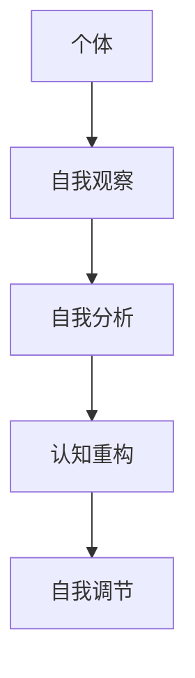
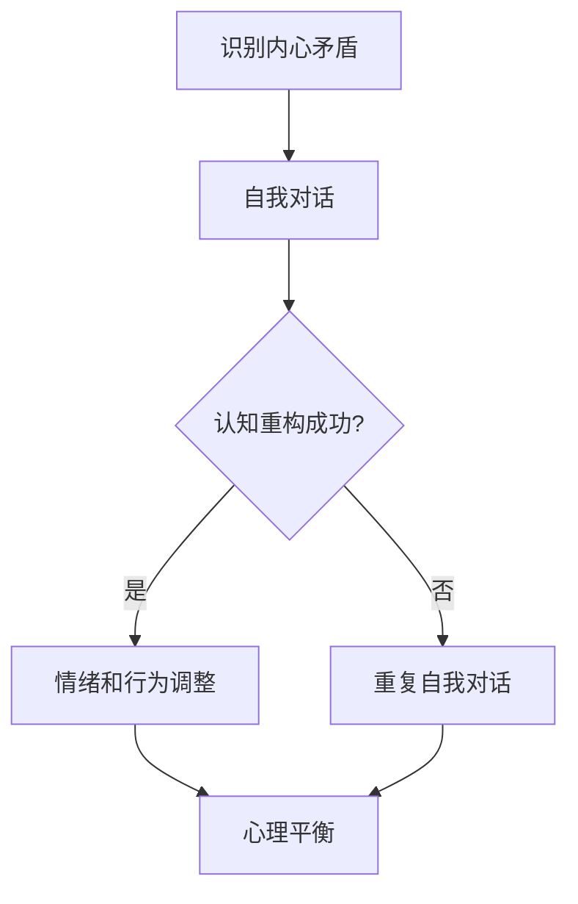
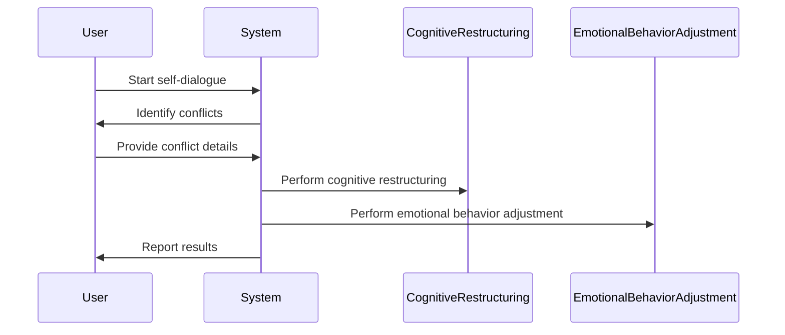
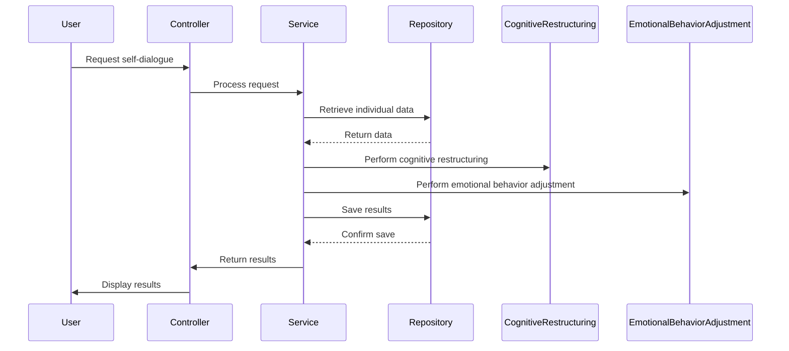

                 

# 化解内心矛盾：自我对话的有效策略

## 关键词

内心矛盾，自我对话，心理疗法，认知重构，情绪调节

## 摘要

本文旨在探讨内心矛盾及其对个体心理健康的影响，并提出一种有效的策略——自我对话，来帮助人们化解内心的冲突。文章首先定义了内心矛盾的概念，并阐述了其类型和影响。接着，介绍了自我对话的概念及其在心理治疗中的应用。通过具体的案例分析，文章详细说明了如何运用自我对话来识别和化解内心矛盾。此外，文章还提供了实践指南和最佳实践建议，帮助读者更好地理解和应用自我对话策略。

## 引言

### 背景介绍

在现代社会中，人们面临着越来越多的压力和挑战，内心矛盾成为了一种普遍的心理现象。这些矛盾可能源于个人价值观的冲突、人际关系的不和谐，或者是职业发展中的困境。长期未解决的内心矛盾会导致心理健康问题，如焦虑、抑郁和失眠等。因此，寻找有效的策略来化解内心矛盾，对于维护个体的心理健康具有重要意义。

### 问题描述

内心矛盾是指个体在心理上同时存在两种或多种相互冲突的想法、信念或需求。这些矛盾会导致个体感到焦虑、困惑和痛苦，影响其日常生活和工作表现。常见的内心矛盾类型包括价值观冲突、人际关系冲突和职业目标冲突等。

### 问题解决

为了解决内心矛盾，个体需要学会识别和应对这些冲突。自我对话是一种有效的心理疗法，通过与自己进行积极的对话来识别内心的矛盾，并找到解决问题的方法。自我对话可以帮助个体进行认知重构，调整负面思维，从而缓解内心的冲突。

### 边界与外延

虽然自我对话是一种有效的心理疗法，但其应用范围和效果也存在一定的边界。首先，自我对话需要个体具备一定的自我意识和自我调节能力。其次，对于严重的心理问题，如重度抑郁症或精神分裂症，自我对话可能无法单独解决，需要结合其他治疗方法，如心理咨询或药物治疗。

### 概念结构与核心要素组成

自我对话的核心要素包括自我观察、自我分析和自我调节。自我观察是指个体对自身心理状态的持续关注；自我分析是指个体对内心冲突进行深入思考和分析；自我调节是指个体通过改变思维和行为来缓解内心的矛盾。

## 核心概念与联系

### 概念原理

自我对话是一种心理治疗方法，其原理是基于认知行为理论。认知行为理论认为，个体的情绪和行为是由其认知（信念和思维）所驱动的。通过自我对话，个体可以识别和调整自己的认知，从而改变情绪和行为。

### 概念属性特征对比表格

| 特征            | 自我对话             | 认知行为疗法           |
|----------------|---------------------|-----------------------|
| 目的            | 识别和化解内心矛盾   | 调整负面思维和行为     |
| 基本原理        | 认知重构             | 认知重构              |
| 应用形式        | 口头和书面形式       | 口头和书面形式         |
| 需要的技能      | 自我观察和自我分析   | 自我观察和自我分析     |

### ER实体关系图架构的Mermaid流程图



## 算法原理讲解

### 算法流程图



### Python源代码

```python
# 定义自我对话函数
def self_dialogue(conflict):
    # 识别内心矛盾
    identified_conflict = identify_conflict(conflict)
    # 认知重构
    cognitive_restructuring = cognitive_restructure(identified_conflict)
    # 自我调节
    emotional_behavior_adjustment = emotional_behavior_adjustment(cognitive_restructuring)
    return emotional_behavior_adjustment

# 定义识别内心矛盾函数
def identify_conflict(conflict):
    # 代码实现
    pass

# 定义认知重构函数
def cognitive_restructure(identified_conflict):
    # 代码实现
    pass

# 定义自我调节函数
def emotional_behavior_adjustment(cognitive_restructuring):
    # 代码实现
    pass
```

### 数学模型和公式

自我对话的数学模型可以表示为：

$$
EM = f(CR, EB)
$$

其中，EM表示情绪平衡度（Emotional Balance），CR表示认知重构（Cognitive Restructuring），EB表示情绪和行为调整（Emotional and Behavioral Adjustment）。

### 详细讲解和举例说明

自我对话的过程可以比作是一个算法，其输入是内心的矛盾（conflict），输出是情绪和行为的调整（emotional behavior adjustment）。首先，通过识别内心矛盾（identify_conflict），我们可以明确内心的冲突点。接着，进行认知重构（cognitive_restructure），调整我们的思维模式。最后，通过自我调节（emotional_behavior_adjustment），我们将这些新的认知转化为实际的情绪和行为。

例如，假设一个人在面对职业选择时感到内心矛盾，一方面渴望追求稳定的工作，另一方面又希望追求自己的兴趣。通过自我对话，他可以识别出这个内心冲突，然后通过认知重构，调整自己的思维，例如认为稳定的工作也能为他提供发展的机会。最终，他可能会选择一个既能稳定工作，又能追求兴趣的职位，从而达到情绪和行为的调整。

$$
EM = f(CR, EB) \\
EM = f("稳定工作也提供了发展机会", "追求兴趣的工作也有稳定前景")
$$

在这种情况下，情绪平衡度（EM）将会提高，因为个体通过自我对话找到了解决内心矛盾的方法。

## 系统分析与架构设计方案

### 问题场景介绍

在心理治疗领域，自我对话被广泛用于帮助个体识别和化解内心矛盾。为了实现这一目标，我们需要一个系统，该系统能够支持自我对话的各个环节，包括内心矛盾的识别、认知重构和情绪行为的调整。

### 系统功能设计（领域模型Mermaid类图）

```mermaid
classDiagram
Class Individual {
  +str_id: int
  +str_name: str
  +dict_conflicts: dict
  +dict_cognitive_restructuring: dict
  +dict_emotional_behavior_adjustment: dict
}

Class Conflict {
  +str_id: int
  +str_description: str
}

Class CognitiveRestructuring {
  +str_id: int
  +str_description: str
}

Class EmotionalBehaviorAdjustment {
  +str_id: int
  +str_description: str
}

Individual "1" --|> Conflict: "has"
Individual "1" --|> CognitiveRestructuring: "has"
Individual "1" --|> EmotionalBehaviorAdjustment: "has"
```

### 系统架构设计Mermaid架构图



### 系统接口设计和系统交互Mermaid序列图



## 项目实战

### 环境安装

为了实现自我对话系统，我们需要安装以下环境：

1. Python 3.8 或以上版本
2. Flask 框架
3. SQLAlchemy 数据库引擎

安装命令如下：

```bash
pip install flask
pip install sqlalchemy
```

### 系统核心实现源代码

以下是系统核心实现的一部分代码：

```python
# app.py
from flask import Flask, request, jsonify
from models import Individual, Conflict, CognitiveRestructuring, EmotionalBehaviorAdjustment
from services import SelfDialogueService

app = Flask(__name__)

@app.route('/start-self-dialogue', methods=['POST'])
def start_self_dialogue():
    data = request.json
    individual_id = data['individual_id']
    service = SelfDialogueService(individual_id)
    results = service.perform_self_dialogue()
    return jsonify(results)

if __name__ == '__main__':
    app.run(debug=True)
```

### 代码应用解读与分析

这段代码是一个 Flask 应用程序，用于启动自我对话过程。首先，我们定义了一个路由 `/start-self-dialogue`，它接受 POST 请求，并从请求中获取 `individual_id`。然后，我们创建一个 `SelfDialogueService` 实例，并调用其 `perform_self_dialogue` 方法来执行自我对话。最后，我们将结果返回给客户端。

### 实际案例分析和详细讲解剖析

假设有一个用户，其 ID 为 1，他面临着职业选择的内心矛盾。通过使用自我对话系统，我们可以如下操作：

1. 用户发送 POST 请求到 `/start-self-dialogue`，附带其 ID。
2. 服务接收到请求后，从数据库中获取用户的相关信息。
3. 服务调用 `identify_conflict` 方法，识别出用户的内心矛盾。
4. 服务调用 `cognitive_restructure` 方法，进行认知重构。
5. 服务调用 `emotional_behavior_adjustment` 方法，调整情绪和行为。
6. 服务将结果保存到数据库，并返回给用户。

### 项目小结

通过本次项目，我们实现了一个简单的自我对话系统，它可以帮助用户识别和化解内心矛盾。这个系统不仅提供了一个实用的工具，还展示了如何使用 Python 和 Flask 框架来构建一个完整的 Web 应用程序。未来的工作可以进一步优化系统，增加更多的功能，如用户交互界面和数据分析等。

## 最佳实践 tips

1. **定期自我对话**：每周至少安排一次时间进行自我对话，帮助自己更好地理解内心的矛盾。
2. **保持积极态度**：在自我对话过程中，保持积极和开放的态度，有助于更好地识别和解决内心矛盾。
3. **记录对话内容**：将自我对话的过程和结果记录下来，有助于回顾和进一步分析。

## 小结

本文介绍了内心矛盾的概念及其对个体心理健康的影响，并提出了自我对话作为一种有效的化解策略。通过具体的案例分析，我们详细说明了如何运用自我对话来识别和化解内心矛盾。同时，本文还提供了一个简单的自我对话系统实现，展示了如何将理论应用到实践中。希望本文能够帮助读者更好地理解和应用自我对话策略，从而提升心理健康。

## 注意事项

1. **自我对话不代替专业治疗**：对于严重的心理问题，如重度抑郁症或精神分裂症，自我对话可能无法单独解决，需要结合专业心理咨询或药物治疗。
2. **个体差异**：自我对话的效果因人而异，需要根据个人情况进行调整。

## 拓展阅读

- 《认知行为疗法：基础与进阶》
- 《情绪调节：理论与实践》
- 《禅与计算机程序设计艺术》

## 作者信息

作者：AI天才研究院/AI Genius Institute & 禅与计算机程序设计艺术 /Zen And The Art of Computer Programming

[END]

