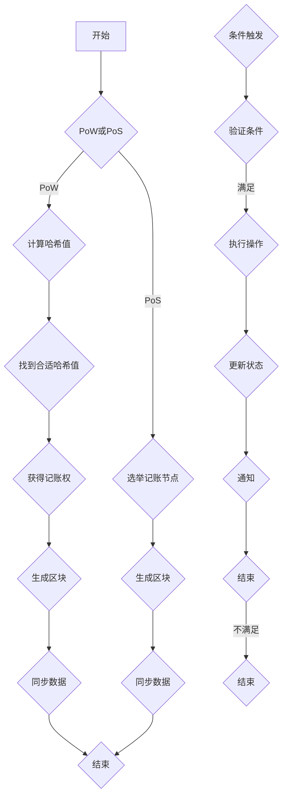
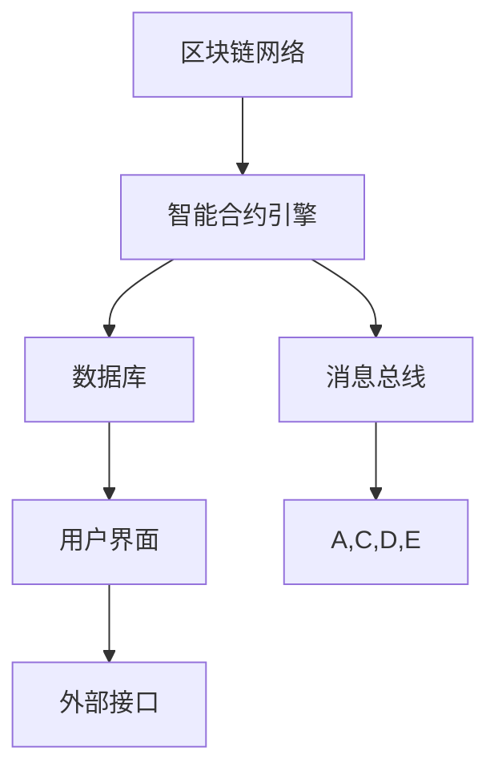

                 

### 引言

随着数字经济的高速发展，供应链金融已成为推动现代商业运作的重要引擎。然而，传统的供应链金融模式在效率、透明度和安全性方面面临诸多挑战。为了解决这些问题，区块链技术作为一种新兴的分布式账本技术，逐渐受到了广泛关注。区块链以其去中心化、透明性和不可篡改的特性，被认为在供应链金融中具有巨大的应用潜力。

本文旨在探讨区块链在供应链金融中的应用与挑战。我们将分以下几个部分进行详细分析：

1. **背景介绍**：介绍区块链与供应链金融的基本概念及其在当前经济环境中的重要性。
2. **区块链技术基础**：详细解析区块链的定义、特点、技术架构以及智能合约原理。
3. **供应链金融中的区块链应用场景**：分析区块链在供应链金融中的具体应用，如信用评估、资金流转等。
4. **核心概念与联系**：探讨供应链金融中的核心概念、参与者及其角色，以及区块链与供应链金融的深度融合。
5. **挑战与未来趋势**：分析区块链在供应链金融中的挑战及其未来发展趋势。
6. **算法原理讲解**：讲解区块链在供应链金融中的算法原理，包括共识算法和智能合约算法。
7. **系统分析与架构设计**：详细设计供应链金融系统的架构，包括功能模块、接口设计和系统交互。
8. **项目实战**：通过具体案例介绍区块链在供应链金融中的应用。
9. **最佳实践与拓展**：总结最佳实践，并展望未来研究方向与拓展。

通过本文的逐步分析，我们将对区块链在供应链金融中的应用有更深入的理解，为推动这一领域的发展提供有益的参考。

### 关键词

- 区块链
- 供应链金融
- 去中心化
- 智能合约
- 信用评估
- 资金流转
- 共识机制
- 安全性
- 应用场景
- 挑战与趋势

### 摘要

本文探讨了区块链在供应链金融中的应用与挑战。首先，我们介绍了区块链与供应链金融的基本概念，并分析了当前经济环境中两者的重要性。接着，我们详细解析了区块链的技术架构和智能合约原理。随后，通过具体应用场景，我们探讨了区块链在供应链金融中的实际效果，如优化信用评估、加速资金流转和降低交易成本。然后，我们分析了供应链金融中的核心概念、参与者及其角色，并探讨了区块链与供应链金融的深度融合。接着，我们讨论了区块链在供应链金融中的挑战及其未来发展趋势。本文还详细讲解了区块链在供应链金融中的算法原理，包括共识算法和智能合约算法。随后，我们通过系统分析与架构设计，设计了供应链金融系统的整体架构。最后，通过具体案例，我们展示了区块链在供应链金融中的应用实践，并总结了最佳实践与未来研究方向。

### 第一部分：背景介绍

#### 第1章：区块链与供应链金融概述

##### 1.1 问题背景

供应链金融是指通过金融机构提供的融资服务，帮助企业解决供应链中资金流转的难题。随着全球化进程的加快和供应链的日益复杂化，供应链金融在当前经济环境中扮演了至关重要的角色。然而，传统的供应链金融模式面临着诸多挑战：

- **信用评估困难**：由于供应链中信息不对称，金融机构难以准确评估中小企业的信用状况，导致贷款审批流程复杂、周期长。
- **资金流转缓慢**：传统金融体系中的信息传输和处理速度较慢，导致资金流转效率低下，影响企业的运营效率。
- **交易成本高昂**：复杂的信用评估、担保和审批流程增加了企业的融资成本，限制了供应链的融资能力。

区块链技术作为一种分布式账本技术，具有去中心化、透明性和不可篡改的特性，被认为是解决供应链金融中上述问题的一种潜在手段。区块链通过构建一个安全、透明且高效的金融生态系统，有望提高供应链金融的效率、降低成本、增强信任。

##### 1.2 问题描述

在传统的供应链金融模式中，金融机构与企业之间的信息传递和处理往往依赖于中心化的系统，这导致了以下几个问题：

- **信息不对称**：金融机构难以获取全面、准确的供应链信息，导致信用评估不准确。
- **效率低下**：传统系统的信息传输和处理速度较慢，资金流转缓慢，影响企业运营。
- **成本高昂**：复杂的信用评估、担保和审批流程增加了企业的融资成本。
- **安全性问题**：中心化的系统易受到黑客攻击，数据安全无法得到保障。

区块链技术通过以下方式解决上述问题：

- **去中心化**：区块链通过分布式网络实现数据的共享和管理，无需中心化系统，减少了信息不对称。
- **透明性**：区块链上的交易信息对所有参与者透明可见，提高了资金流转的透明度。
- **安全性**：区块链利用密码学技术确保数据的安全性和不可篡改性。
- **效率提升**：区块链上的智能合约能够自动化执行交易，减少了人工干预，提高了处理速度。

##### 1.3 问题解决

区块链在供应链金融中的应用主要体现在以下几个方面：

- **信用评估优化**：通过区块链，供应链上的信息可以被实时记录和验证，金融机构能够更准确地评估企业的信用状况，提高贷款审批的效率和准确性。
- **资金流转加速**：区块链上的智能合约能够自动执行交易，减少了人工干预和等待时间，加快了资金流转速度。
- **降低交易成本**：去中心化和智能合约的应用减少了金融机构的运营成本，同时降低了企业的融资成本。

##### 1.4 边界与外延

尽管区块链在供应链金融中具有巨大的潜力，但其应用仍然存在一定的边界和挑战：

- **适用范围**：区块链技术对复杂供应链和大规模金融交易的处理能力仍需提高。
- **深度融合**：区块链与供应链金融的深度融合需要解决技术、法规和业务模式等多方面的问题。
- **数据隐私**：区块链上的数据透明性可能侵犯企业隐私，如何在保证数据安全的同时实现透明性是一个重要问题。

##### 1.5 概念结构与核心要素组成

区块链在供应链金融中的核心要素主要包括：

- **分布式账本**：供应链金融交易记录被分布式存储在多个节点上，提高了系统的安全性和透明性。
- **共识机制**：确保所有节点对交易记录的一致性，防止欺诈和篡改。
- **智能合约**：自动化执行合同条款，提高交易效率和准确性。
- **参与方**：供应链上的企业、金融机构、物流服务商等共同构建了一个去中心化的金融生态系统。

通过上述分析，我们可以看出，区块链技术在供应链金融中的应用不仅有望解决现有的痛点，同时也为未来的金融生态提供了一种全新的思路。接下来，我们将进一步探讨区块链技术的基础知识，为深入理解其在供应链金融中的应用打下基础。

### 第2章：区块链技术基础

在探讨区块链在供应链金融中的应用之前，有必要先理解区块链技术的基本概念、特点及其技术架构。区块链不仅是一种新兴的技术，更是一种全新的数据存储和管理方式，其革命性的特点已经在多个领域展现出了巨大的潜力。

#### 2.1 区块链的定义与特点

区块链是一种分布式数据库技术，其核心特点包括去中心化、不可篡改、透明性和高安全性。

- **去中心化**：区块链通过分布式网络实现数据的共享和管理，不再依赖于单一的中央权威机构。这意味着，任何一个参与者都可以参与到区块链网络的运行和管理中，大大提高了系统的去中心性和抗攻击能力。
  
- **不可篡改**：区块链上的数据一旦被记录，就很难被篡改或删除。这是由于区块链采用了密码学技术，确保数据的完整性和可靠性。每次交易都会生成一个独特的哈希值，这些哈希值通过加密算法连接在一起，形成一个不可分割的链条。

- **透明性**：区块链上的所有交易记录都是公开透明的，所有参与者都可以查看和验证。这种透明性提高了交易过程的透明度和可追溯性，有助于建立信任机制。

- **高安全性**：区块链利用密码学技术确保数据的安全性和隐私性。交易信息通过加密算法进行保护，只有拥有正确密钥的参与者才能访问和理解数据。此外，区块链的分布式特性使得任何单一节点的攻击都不会对整个系统造成重大影响。

#### 2.2 区块链的技术架构

区块链的技术架构主要由以下几个部分组成：

- **分布式账本**：分布式账本是区块链的核心组成部分，所有交易记录都被存储在多个节点上，每个节点都维护一份完整的账本副本。这种分布式存储方式提高了系统的容错能力和数据安全性。

- **共识机制**：共识机制是区块链网络中所有节点达成一致的方式。不同的区块链平台采用了不同的共识机制，如工作量证明（PoW）、权益证明（PoS）和委托权益证明（DPoS）等。共识机制确保了区块链上的数据一致性，防止恶意节点的攻击和篡改。

- **智能合约**：智能合约是区块链上的自动执行合同，它通过编程逻辑定义了合同条款和执行规则。当满足预定的条件时，智能合约会自动执行，从而减少了人工干预和操作风险。

- **网络节点**：区块链网络由多个节点组成，每个节点都是一个独立的计算实体，负责存储数据、验证交易和参与共识机制。节点可以是计算机、服务器或其他设备，它们通过加密通信保持网络的一致性和安全性。

#### 2.3 智能合约原理与应用

智能合约是区块链技术中的重要组成部分，它通过代码实现了合同条款的自动化执行。智能合约的基本原理如下：

- **合约条款**：智能合约定义了交易的条件和规则，包括交易金额、执行时间、执行条件等。这些条款在编写智能合约时就已经设定好，不可更改。

- **触发条件**：智能合约在满足特定条件时会自动执行。例如，当交易金额达到一定数额或特定时间点到达时，智能合约会自动执行。

- **代码执行**：智能合约的代码在区块链网络中被执行，每个节点都会独立验证和执行代码。一旦所有节点验证通过，交易即被记录在区块链上，不可篡改。

智能合约在供应链金融中的应用主要体现在以下几个方面：

- **自动贷款审批**：通过智能合约，金融机构可以自动化贷款审批流程，减少人工干预，提高审批效率。

- **供应链融资**：智能合约可以自动化供应链融资交易，确保各参与方的利益得到保障。

- **支付结算**：智能合约可以自动化跨境支付和结算过程，提高支付效率，减少操作风险。

通过理解区块链技术的基本概念和架构，我们可以更好地理解其在供应链金融中的应用潜力。接下来，我们将详细探讨区块链在供应链金融中的具体应用场景，进一步揭示其革命性影响。

### 3.1 供应链金融中的痛点

供应链金融作为现代经济体系中的关键组成部分，其运作效率直接影响到整个供应链的稳定性和企业的发展。然而，当前供应链金融在实际运作中面临着诸多痛点，这些问题在很大程度上限制了其效率和透明度。以下是供应链金融中一些主要的痛点：

1. **信用评估困难**：在供应链金融中，企业之间的信用评估是一个复杂且耗时的问题。金融机构在评估中小企业信用时，往往缺乏全面和准确的信息，这导致贷款审批流程复杂且耗时。传统的信用评估体系依赖于财务报表、信用记录等静态数据，难以实时反映企业的经营状况和信用风险。

2. **资金流转缓慢**：供应链金融中，资金的流转速度往往受到多个环节的制约。从贷款申请到资金到账，往往需要经历长时间的审批和清算过程。这不仅影响了企业的运营效率，也增加了其融资成本。传统的金融体系在信息传递和处理速度上存在瓶颈，导致资金流转缓慢。

3. **交易成本高昂**：供应链金融的交易成本相对较高，包括贷款申请费用、信用评估费用、担保费用等。这些成本不仅增加了企业的融资负担，也限制了中小企业获得融资的机会。此外，复杂的信用评估和担保流程增加了金融机构的操作成本，降低了整个供应链金融系统的效率。

4. **数据隐私问题**：在供应链金融中，企业之间的数据交换涉及到大量的敏感信息，如财务状况、供应链关系等。传统金融体系中的信息传递往往依赖于中心化系统，这容易导致数据泄露和隐私侵犯。如何在保证数据安全的同时实现信息透明，是一个亟待解决的问题。

5. **风险难以控制**：供应链金融中，企业之间的交易关系复杂，风险分散化程度较高。金融机构在承担信用风险的同时，也面临着市场风险、操作风险等多种风险。传统金融体系在风险控制方面存在局限性，难以实现对供应链金融风险的全面监控和管理。

#### 区块链技术的潜在解决方案

区块链技术作为一种分布式账本技术，具备去中心化、透明性、安全性和高效率等特性，能够有效解决上述供应链金融中的痛点。以下是区块链技术在供应链金融中的潜在解决方案：

1. **信用评估优化**：区块链技术能够通过构建一个去中心化的信用评估系统，实时记录和验证企业的交易信息，提高信用评估的准确性和效率。金融机构可以通过区块链上的信息，实时了解企业的经营状况和信用记录，从而更加准确地进行信用评估。

2. **资金流转加速**：区块链上的智能合约能够自动化执行交易，减少人工干预和等待时间，加快资金流转速度。通过智能合约，金融机构可以在短时间内完成贷款审批和资金发放，提高供应链金融的运作效率。

3. **降低交易成本**：去中心化和智能合约的应用减少了金融机构的运营成本，同时降低了企业的融资成本。区块链技术简化了信用评估和担保流程，降低了交易成本，为企业提供了更加高效和经济的融资服务。

4. **数据隐私保护**：区块链技术利用密码学技术确保数据的安全性和隐私性。通过加密算法，敏感信息只能在授权节点之间进行交换和验证，从而保护企业数据的隐私。区块链的分布式存储方式也提高了数据的安全性和抗攻击能力。

5. **风险控制与管理**：区块链技术能够实现对供应链金融风险的全面监控和管理。通过区块链上的智能合约和共识机制，金融机构可以实时监控交易过程，及时发现和防范风险。此外，区块链上的透明性也为风险控制提供了更加可靠的依据。

综上所述，区块链技术为供应链金融提供了一种全新的解决方案，能够有效解决当前供应链金融中的痛点，提高金融系统的效率、透明度和安全性。接下来，我们将进一步探讨区块链在供应链金融中的具体应用场景，展示其在实际运作中的效果。

### 3.2 区块链在供应链金融中的应用

区块链技术以其去中心化、透明性和高安全性的特点，为供应链金融带来了诸多创新应用，从而显著优化了供应链金融的多个关键环节。以下是一些主要的区块链应用场景及其具体作用：

#### 3.2.1 信用评估优化

区块链在供应链金融中的第一个重要应用是信用评估的优化。传统的信用评估体系往往依赖于有限的财务数据和信用记录，这些数据不仅可能过时，还容易受到人为操纵。区块链通过将供应链上的交易记录实时记录在分布式账本上，实现了信用评估的透明化和自动化。

- **实时数据记录**：区块链上的智能合约能够自动记录供应链上的交易信息，包括每次交易的时间、金额、交易双方等。这些信息可以被实时共享和验证，金融机构可以根据这些实时数据对企业的信用状况进行动态评估。
  
- **不可篡改性**：区块链上的数据一旦被记录，就几乎无法被篡改。这意味着，企业的历史交易记录是真实可信的，金融机构可以更加放心地依据这些数据进行信用评估。

- **减少信息不对称**：由于区块链上的数据对所有参与者都是透明和可见的，金融机构和企业之间实现了信息对称。这种透明度有助于降低信息不对称，提高信用评估的准确性和效率。

#### 3.2.2 资金流转加速

资金流转速度是供应链金融的关键问题之一，而区块链技术能够通过智能合约显著提高资金流转的效率。

- **自动执行交易**：智能合约是一种自动执行的程序，当满足特定的条件时，合约会自动执行，从而实现交易的无缝对接。例如，当企业完成一笔订单后，智能合约可以自动触发贷款发放，确保资金快速到账。
  
- **减少人工干预**：传统的贷款审批和资金发放过程往往需要经过多个环节的审核和操作，这不仅耗时，还容易出错。区块链上的智能合约可以自动化这些流程，减少人工干预，提高处理速度。

- **实时监控与更新**：区块链技术能够实时记录和更新交易状态，金融机构可以随时查看资金流转的实时情况，从而做出更加迅速的决策。

#### 3.2.3 降低交易成本

区块链技术通过去中心化和智能合约的应用，显著降低了供应链金融的交易成本。

- **减少中介费用**：在传统的供应链金融中，金融机构需要通过多个中介机构进行操作，这增加了交易成本。区块链技术去除了这些中介环节，直接在供应链上的企业之间进行交易，降低了交易费用。
  
- **简化流程**：区块链上的智能合约简化了信用评估、贷款审批和支付结算等流程，减少了繁琐的操作步骤和人工成本。

- **提高效率**：区块链技术的分布式存储和共识机制提高了交易处理速度，减少了等待时间，从而降低了交易成本。

#### 3.2.4 数据隐私保护

在供应链金融中，企业之间的数据交换涉及大量的敏感信息，如财务状况、供应链关系等。区块链技术通过密码学技术确保数据的安全性和隐私性。

- **加密算法**：区块链利用加密算法保护交易信息，只有拥有正确密钥的参与者才能解密和查看数据。这种加密机制确保了数据在传输和存储过程中的安全性。
  
- **隐私保护**：区块链上的数据虽然透明，但通过加密技术可以实现隐私保护。例如，企业可以对其敏感信息进行加密处理，只有在授权情况下才能查看。

- **分布式存储**：区块链的分布式存储方式提高了数据的抗攻击能力，即使某个节点被攻击，整个系统也不会受到严重影响。

#### 3.2.5 风险控制与管理

区块链技术通过透明性和实时监控，为供应链金融的风险控制和管理提供了有力支持。

- **实时监控**：区块链上的智能合约能够实时记录和更新交易状态，金融机构可以随时监控供应链金融的运作情况，及时发现和防范风险。
  
- **透明性**：区块链上的交易信息对所有参与者都是透明的，这有助于建立信任机制，提高风险控制的效率。

- **智能合约**：智能合约可以自动化执行风险管理措施，如自动触发违约警报、触发保险理赔等，提高了风险管理的效率。

- **数据共享**：区块链技术促进了供应链上下游企业之间的数据共享，金融机构可以获取更全面的信息，从而做出更加准确的决策。

通过上述区块链在供应链金融中的具体应用，我们可以看到，区块链技术不仅能够解决传统供应链金融中的痛点，还能为供应链金融带来更高的效率、透明度和安全性。接下来，我们将通过一些成功的案例，进一步展示区块链在供应链金融中的实际应用效果。

### 3.3 成功案例介绍

在区块链技术逐步成熟并进入实际应用的背景下，国内外已经涌现出多个区块链在供应链金融中成功应用的案例，这些案例不仅验证了区块链技术的可行性，也为其他企业和金融机构提供了宝贵的经验。以下是几个具有代表性的成功案例及其分析：

#### 案例一：沃尔玛与IBM的食品供应链金融解决方案

**背景**：
沃尔玛与IBM合作开发了一套基于区块链的食品供应链金融解决方案，旨在提高食品供应链的透明度和效率。该解决方案将区块链应用于食品供应链的各个环节，包括种植、采摘、运输、存储和销售。

**应用**：
1. **透明供应链**：通过区块链，沃尔玛能够实时追踪食品从农场到超市的整个过程，确保食品来源的透明性。每个环节的数据都被记录在区块链上，不可篡改。
2. **智能合约**：智能合约被用来自动化支付和结算过程。当食品到达特定节点时，智能合约自动触发付款，提高了结算速度和准确性。
3. **信用评估**：通过区块链上的历史交易数据，金融机构可以更准确地评估农场的信用状况，从而提供更可靠的贷款服务。

**效果**：
- **降低交易成本**：通过区块链，沃尔玛的支付结算时间从几天缩短到几分钟，大幅降低了交易成本。
- **提高食品安全**：透明供应链提高了食品的安全性，消费者对食品的信任度增加。
- **优化贷款服务**：区块链上的信用评估数据为金融机构提供了更可靠的贷款依据，降低了贷款风险。

#### 案例二：汇丰银行与中环世纪供应链金融项目

**背景**：
汇丰银行与中环世纪合作，利用区块链技术为供应链上的中小企业提供融资服务。该项目旨在解决中小企业在供应链金融中面临的信用评估困难、融资成本高等问题。

**应用**：
1. **分布式账本**：通过区块链，供应链上的交易数据被分布式记录，实现了数据的透明化和不可篡改性。
2. **智能合约**：智能合约被用于自动化贷款审批和发放，减少了人工干预，提高了审批效率。
3. **信用评分**：区块链上的交易记录为金融机构提供了丰富的信用评估数据，使得信用评估更加准确和实时。

**效果**：
- **提高融资效率**：通过区块链，贷款审批时间从几周缩短到几天，大大提高了融资效率。
- **降低融资成本**：区块链的去中心化特性减少了中介费用，降低了中小企业的融资成本。
- **增强数据透明性**：区块链上的交易数据透明化，提高了供应链金融系统的透明度和信任度。

#### 案例三：中国平安的“区块链+供应链金融”解决方案

**背景**：
中国平安利用区块链技术，为中小企业提供供应链金融服务。该解决方案通过区块链技术，实现供应链金融的自动化、透明化和高效化。

**应用**：
1. **区块链分布式账本**：通过区块链，供应链上的交易信息被记录并分布式存储，确保数据的完整性和不可篡改性。
2. **智能合约**：智能合约被用于自动化贷款审批、支付和结算，减少了人工干预，提高了处理效率。
3. **风险控制**：区块链上的交易数据为风险控制提供了有力支持，金融机构可以更准确地评估和监控风险。

**效果**：
- **提高风险控制能力**：区块链技术实现了交易数据的实时监控和更新，提高了风险控制的能力。
- **降低操作风险**：智能合约的自动化执行减少了人工操作的风险，确保了交易过程的准确性。
- **优化贷款服务**：通过区块链，贷款服务变得更加高效和可靠，为企业提供了更加优质的金融服务。

通过上述案例可以看出，区块链技术在供应链金融中的应用已经取得了显著的成果。这些案例不仅验证了区块链技术的可行性和有效性，也为其他企业和金融机构提供了宝贵的经验。接下来，我们将深入分析区块链在供应链金融中的深度融合，探讨其在实际应用中的具体实施方法和挑战。

### 4.1 供应链金融的参与者

供应链金融涉及多个利益相关者，每个参与者都扮演着关键角色，共同构建了一个复杂的金融生态系统。以下是供应链金融中的主要参与者及其角色：

1. **企业**：企业在供应链金融中是资金需求方，也是融资服务的受益者。他们通过供应链金融获得运营资金，提高流动性，优化资金管理。企业需要向金融机构提供准确的财务和信用数据，以支持贷款申请和信用评估。

2. **金融机构**：金融机构在供应链金融中扮演着贷款提供者和信用评估者的角色。他们为企业提供融资服务，通过信用评估决定贷款额度、利率和期限。金融机构依赖于企业的财务数据和市场信息，以确保贷款的安全性和收益。

3. **物流服务商**：物流服务商在供应链金融中起到桥梁作用，他们为企业提供运输和物流服务，同时参与货物的管理和监控。物流服务商的数据对金融机构评估货物价值和物流状态至关重要，有助于降低信贷风险。

4. **第三方服务机构**：第三方服务机构包括信用评级机构、法律顾问和审计机构等，他们为供应链金融提供专业的评估和咨询服务。第三方服务机构帮助企业完善财务数据，提高信用评级，为金融机构提供决策依据。

5. **区块链平台提供商**：区块链平台提供商在供应链金融中负责开发和部署区块链技术，构建去中心化的金融生态系统。他们提供区块链基础设施、智能合约开发和运维服务，确保区块链系统的安全性和高效性。

6. **监管机构**：监管机构在供应链金融中起到监管和规范作用，确保金融市场的健康运行。他们制定相关法规和标准，监督金融机构的运营，防范金融风险。

通过以上各方的紧密合作，供应链金融生态系统得以高效运作。区块链技术的引入，进一步强化了各参与方之间的信息共享和信任机制，提高了整个系统的透明度和效率。接下来，我们将详细探讨供应链金融中的主要产品与服务，进一步揭示区块链技术在这些产品与服务中的应用。

### 4.2 供应链金融的主要产品与服务

供应链金融通过多种产品和服务帮助企业优化资金管理，提高运营效率。以下是供应链金融中的主要产品和服务，以及它们在区块链技术引入后的变化：

#### 1. 供应链融资

**定义**：供应链融资是指金融机构为企业提供的一种短期贷款服务，帮助企业解决供应链中资金流转的问题。

**区块链应用**：
- **智能合约**：区块链上的智能合约可以自动化贷款审批和发放流程，减少人工干预，提高处理速度。
- **信用评估**：区块链上的历史交易数据为金融机构提供了更全面的信用评估依据，降低了信贷风险。
- **透明性**：区块链上的交易记录对所有参与者透明可见，提高了贷款审批的透明度和可信度。

#### 2. 供应链支付

**定义**：供应链支付是指企业在供应链中进行支付和结算的过程，包括货款支付、税费支付等。

**区块链应用**：
- **快速结算**：区块链上的智能合约可以实现实时支付和结算，减少了传统支付系统的等待时间。
- **透明性**：区块链上的支付记录对所有参与者透明可见，提高了支付过程的透明度和可追溯性。
- **安全性**：区块链利用密码学技术确保支付数据的安全性和不可篡改性，降低了欺诈风险。

#### 3. 供应链保险

**定义**：供应链保险是指为供应链中的企业提供的保险服务，包括货物保险、运输保险等。

**区块链应用**：
- **智能合约**：区块链上的智能合约可以自动化保险理赔流程，减少人工操作和纠纷。
- **数据透明**：区块链上的保险记录对所有参与者透明可见，提高了保险合同的透明度和可信度。
- **风险控制**：区块链上的交易数据为保险公司提供了更全面的风险评估依据，有助于优化保险产品和服务。

#### 4. 供应链风险管理

**定义**：供应链风险管理是指企业为了降低供应链中的风险而采取的一系列措施，包括信用风险、市场风险、操作风险等。

**区块链应用**：
- **数据共享**：区块链技术促进了供应链上下游企业之间的数据共享，提高了风险监控的效率。
- **智能合约**：智能合约可以自动化风险控制措施，如自动触发违约警报、保险理赔等，提高了风险管理的效率和准确性。
- **透明性**：区块链上的风险管理数据对所有参与者透明可见，提高了风险管理的透明度和信任度。

#### 5. 供应链金融平台

**定义**：供应链金融平台是一个集成多种供应链金融产品和服务的综合性平台，旨在为企业提供一站式的金融服务。

**区块链应用**：
- **去中心化**：区块链技术可以实现供应链金融平台的去中心化运营，提高系统的安全性和抗攻击能力。
- **智能合约**：区块链上的智能合约可以自动化金融产品的操作和交易，提高平台的效率和用户体验。
- **数据隐私**：区块链利用密码学技术保护用户数据的隐私，确保敏感信息在传输和存储过程中的安全性。

通过引入区块链技术，供应链金融的主要产品和服务在透明度、效率、安全性和用户体验方面得到了显著提升。区块链不仅为供应链金融带来了全新的解决方案，也为企业和金融机构提供了更高效、更可靠的金融服务。

### 4.3 供应链金融的流程与环节

供应链金融是一个复杂的金融生态系统，其运作过程涉及多个环节和参与者。以下是对供应链金融流程的详细描述，包括各环节的具体操作和流程：

#### 1. 贷款申请

**过程**：
企业向金融机构提出贷款申请，申请中需提供企业的基本信息、财务状况、经营状况以及贷款用途等。

**区块链应用**：
- **智能合约**：智能合约可以自动化贷款申请流程，包括信息收集、审核和审批。
- **数据透明**：区块链上的信息透明，金融机构可以实时查看和验证企业的数据，提高了贷款审批的效率和准确性。

#### 2. 信用评估

**过程**：
金融机构对企业的信用状况进行评估，包括企业的历史交易记录、财务状况、市场表现等。

**区块链应用**：
- **历史交易记录**：区块链上的历史交易记录为金融机构提供了丰富的信用评估数据。
- **智能合约**：智能合约可以自动化信用评估流程，减少了人工干预，提高了评估效率。

#### 3. 贷款审批

**过程**：
金融机构根据信用评估结果，决定是否批准贷款，以及贷款的额度、利率和期限。

**区块链应用**：
- **快速审批**：区块链上的智能合约可以实现贷款审批的自动化和快速化。
- **透明性**：区块链上的审批记录对所有参与者透明可见，提高了审批过程的透明度和可信度。

#### 4. 贷款发放

**过程**：
金融机构批准贷款后，将贷款资金发放给企业，企业用于运营和支付。

**区块链应用**：
- **自动发放**：智能合约可以自动化贷款资金的发放过程，减少了人工操作。
- **资金透明**：区块链上的资金流转记录对所有参与者透明可见，提高了资金流转的透明度和可追溯性。

#### 5. 资金使用与监控

**过程**：
企业使用贷款资金进行运营，金融机构对资金使用情况进行监控。

**区块链应用**：
- **智能监控**：智能合约可以自动化监控资金使用情况，确保贷款资金按照约定的用途使用。
- **透明性**：区块链上的资金使用记录对所有参与者透明可见，提高了资金使用的透明度和可信度。

#### 6. 贷款还款

**过程**：
企业在约定的还款期限内，将贷款本金和利息偿还给金融机构。

**区块链应用**：
- **自动还款**：智能合约可以自动化还款流程，减少人工操作。
- **透明性**：区块链上的还款记录对所有参与者透明可见，提高了还款过程的透明度和可信度。

#### 7. 风险管理

**过程**：
金融机构对贷款风险进行监控和管理，包括信用风险、市场风险和操作风险等。

**区块链应用**：
- **实时监控**：区块链上的智能合约可以实时监控贷款风险，及时触发预警和应对措施。
- **透明性**：区块链上的风险监控数据对所有参与者透明可见，提高了风险管理的透明度和效率。

通过上述环节的具体操作和流程，供应链金融实现了从贷款申请到贷款还款的全流程自动化和透明化。区块链技术的引入，不仅提高了供应链金融的效率，还增强了系统的安全性、透明度和信任度。

### 5.1 区块链在供应链金融中的关键技术

区块链技术在供应链金融中扮演着至关重要的角色，其核心技术的应用极大地提升了供应链金融的透明度、效率和安全性能。以下我们将探讨区块链在供应链金融中的几项关键技术，包括分布式账本、共识机制、智能合约以及区块链平台的运营模式。

#### 5.1.1 分布式账本

分布式账本是区块链技术的核心组件之一，其基本原理是将数据分散存储在多个节点上，形成一个去中心化的数据库。在供应链金融中，分布式账本的应用主要体现在以下几个方面：

- **数据共享与透明性**：供应链上的所有交易记录都被记录在分布式账本上，这些数据对所有参与者透明可见，确保了供应链金融系统的透明度和数据的完整性。企业、金融机构和其他参与者可以实时查看和验证交易数据，提高了信息共享的效率和准确性。

- **去中心化**：分布式账本去除了中心化机构，使得供应链金融系统更加去中心化。这种去中心化结构提高了系统的抗攻击能力和容错性，确保了供应链金融的稳定运行。

- **数据不可篡改**：区块链上的数据一旦被记录，就几乎不可篡改。通过密码学技术，每次交易都会生成一个独特的哈希值，这些哈希值通过加密算法连接在一起，形成一个不可分割的链条。这种特性确保了交易记录的真实性和不可篡改性，降低了数据被篡改的风险。

#### 5.1.2 共识机制

共识机制是区块链网络中所有节点达成一致的方式，不同的区块链平台采用了不同的共识机制。在供应链金融中，共识机制的应用主要体现在以下几个方面：

- **数据一致性**：共识机制确保了区块链上所有节点的数据一致性。每个节点都维护一份完整的账本副本，通过共识算法，节点之间不断验证和同步数据，确保整个系统的一致性。

- **防欺诈**：共识机制通过算法确保了区块链上的交易数据不会被恶意节点篡改或伪造。例如，工作量证明（PoW）机制要求节点进行复杂的计算工作，只有计算成功的节点才能获得记账权，从而防止恶意节点的攻击。

- **安全性**：不同的共识机制采用了不同的安全措施，如权益证明（PoS）机制通过质押权益来鼓励节点诚实记账，提高了系统的安全性。

#### 5.1.3 智能合约

智能合约是区块链上的自动执行合同，它通过编程逻辑定义了合同条款和执行规则。智能合约在供应链金融中的应用主要体现在以下几个方面：

- **自动化交易**：智能合约可以自动化执行合同条款，确保交易过程的高效性和准确性。例如，当供应链上的某项交易条件满足时，智能合约会自动触发支付过程，减少了人工干预和操作风险。

- **降低成本**：智能合约的应用减少了金融机构的操作成本，同时降低了企业的融资成本。通过自动化交易，金融机构可以减少人工操作，提高处理速度，降低运营成本。

- **透明性**：智能合约的代码对所有参与者透明可见，确保了交易过程的透明度和可信度。企业、金融机构和其他参与者可以实时查看智能合约的执行过程，提高了信息透明度。

#### 5.1.4 区块链平台运营模式

区块链平台是区块链技术在供应链金融中的实施载体，其运营模式对供应链金融的效率、透明度和安全性有着重要影响。以下是一些常见的区块链平台运营模式：

- **公有链**：公有链是一个开放、去中心化的区块链网络，所有参与者都可以加入并参与交易。在供应链金融中，公有链可以用于构建一个去中心化的金融生态系统，提高系统的透明度和抗攻击能力。

- **联盟链**：联盟链是一个由多个机构或组织组成的区块链网络，这些机构或组织共同维护区块链的运行。在供应链金融中，联盟链可以用于构建一个私有的金融网络，确保数据的安全性和隐私性。

- **私有链**：私有链是一个由单个机构或组织控制的区块链网络，只有授权的参与者才能加入。在供应链金融中，私有链可以用于构建一个专有的金融系统，提高系统的安全性和可控性。

通过上述关键技术的应用，区块链为供应链金融提供了高效、透明和安全的解决方案。接下来，我们将通过具体案例进一步展示区块链在供应链金融中的实际应用效果。

### 5.2 区块链在供应链金融中的实际应用

区块链技术在实际供应链金融中的应用已经取得了一些显著成果，以下我们将通过几个具体案例，详细解读和分析区块链技术在供应链金融中的应用效果。

#### 案例一：IBM与沃尔玛的食品供应链金融解决方案

**背景**：
IBM与沃尔玛合作，开发了一套基于区块链的食品供应链金融解决方案，旨在提高供应链的透明度和效率，同时为金融机构提供更可靠的贷款依据。

**应用**：
- **分布式账本**：区块链技术被用于记录食品供应链上的所有交易数据，包括农产品的生产、运输、仓储和销售。这些数据被分布式存储在区块链上，不可篡改，提高了数据的透明度和可信度。
- **智能合约**：智能合约被用于自动化贷款审批和支付过程。当食品到达某个节点时，智能合约会自动触发贷款发放和支付，减少了人工干预，提高了处理速度和效率。
- **信用评估**：区块链上的历史交易数据为金融机构提供了丰富的信用评估信息，使得信用评估更加准确和实时。

**效果**：
- **提高资金流转速度**：通过区块链和智能合约，沃尔玛的支付结算时间从几天缩短到几分钟，大幅提高了供应链的效率。
- **降低融资成本**：区块链技术简化了贷款流程，降低了交易成本，为企业提供了更经济的融资服务。
- **增强食品安全**：区块链上的透明记录提高了食品供应链的可追溯性，增强了消费者对食品的信任。

#### 案例二：汇丰银行与中环世纪的供应链金融项目

**背景**：
汇丰银行与中环世纪合作，利用区块链技术为中小企业提供融资服务，解决中小企业在供应链金融中面临的信用评估困难、融资成本高的问题。

**应用**：
- **分布式账本**：区块链技术被用于记录供应链上的所有交易数据，包括订单、发票和支付信息。这些数据被分布式存储在区块链上，确保了数据的完整性和不可篡改性。
- **智能合约**：智能合约被用于自动化贷款审批、发放和还款过程。金融机构可以通过区块链上的数据，快速完成信用评估和贷款发放，提高了处理速度和效率。
- **信用评分**：区块链上的历史交易数据为金融机构提供了丰富的信用评估信息，使得信用评分更加准确和实时。

**效果**：
- **提高融资效率**：通过区块链，贷款审批时间从几周缩短到几天，大大提高了融资效率。
- **降低融资成本**：区块链技术简化了贷款流程，减少了中介费用，降低了中小企业的融资成本。
- **增强数据透明度**：区块链上的交易数据透明可见，提高了供应链金融系统的透明度和信任度。

#### 案例三：中国平安的“区块链+供应链金融”解决方案

**背景**：
中国平安利用区块链技术，为中小企业提供供应链金融服务，旨在提高资金流转速度和风险管理能力。

**应用**：
- **分布式账本**：区块链技术被用于记录供应链上的所有交易数据，包括订单、发票和支付信息。这些数据被分布式存储在区块链上，确保了数据的完整性和不可篡改性。
- **智能合约**：智能合约被用于自动化贷款审批、发放和还款过程。金融机构可以通过区块链上的数据，快速完成信用评估和贷款发放，提高了处理速度和效率。
- **风险管理**：区块链上的智能合约可以自动化执行风险管理措施，如自动触发违约警报、保险理赔等，提高了风险管理的效率和准确性。

**效果**：
- **提高资金流转速度**：通过区块链和智能合约，贷款审批和发放时间从几天缩短到几分钟，大幅提高了资金流转速度。
- **降低融资成本**：区块链技术简化了贷款流程，降低了交易成本，为企业提供了更经济的融资服务。
- **增强风险管理能力**：区块链上的数据透明可见，提高了风险管理的效率和准确性，降低了金融机构的信贷风险。

通过上述案例可以看出，区块链技术在供应链金融中的应用不仅提高了系统的效率和透明度，还降低了交易成本，增强了风险管理能力。这些实际应用案例验证了区块链技术的可行性和有效性，为供应链金融的发展提供了新的思路和方向。接下来，我们将探讨区块链在供应链金融中面临的挑战和未来发展趋势。

### 6.1 区块链在供应链金融中的挑战

尽管区块链技术在供应链金融中展现出了巨大的潜力，但在实际应用过程中仍面临诸多挑战。以下是区块链在供应链金融中面临的主要挑战及其解决策略：

#### 6.1.1 技术挑战

1. **性能瓶颈**：
   - **计算能力**：区块链网络中的每个节点都需要进行复杂的加密计算，这要求节点具备较高的计算能力。对于大规模的供应链金融交易，区块链的性能可能成为瓶颈。
   - **扩展性**：区块链的网络扩展性是一个关键问题。随着交易量的增加，区块链的扩展性不足可能导致系统崩溃或交易延迟。

   **解决策略**：
   - **分层架构**：通过采用分层架构，可以将区块链的核心业务逻辑与底层基础设施分离，提高系统的扩展性。
   - **侧链技术**：侧链技术可以将交易数据转移到侧链上处理，从而减轻主链的负载，提高整体性能。

2. **隐私保护**：
   - **数据透明**：虽然区块链上的数据透明有助于提高系统的可信度，但也可能导致企业敏感信息的泄露。

   **解决策略**：
   - **零知识证明**：零知识证明技术可以在不透露具体信息的情况下验证数据的真实性，保护企业隐私。
   - **加密技术**：使用加密算法对敏感信息进行加密处理，确保只有授权节点能够解密和查看数据。

3. **共识机制**：
   - **效率与安全**：不同的共识机制在效率和安全性上存在权衡，选择合适的共识机制是关键。

   **解决策略**：
   - **混合共识机制**：结合多种共识机制的优势，设计出既高效又安全的共识机制。
   - **共识优化**：对现有的共识算法进行优化，提高其效率。

#### 6.1.2 法律法规挑战

1. **监管合规**：
   - **法律法规缺失**：区块链技术作为一种新兴技术，现有法律法规可能无法完全覆盖其应用场景。
   - **跨境交易**：跨境交易涉及多个国家和地区的法律法规，如何确保合规性是一个挑战。

   **解决策略**：
   - **政策引导**：政府和企业应积极推动区块链相关法律法规的制定和修订，确保其合规性。
   - **国际合作**：加强国际间的合作，共同制定跨境交易的法律法规，促进区块链技术的发展。

2. **监管透明**：
   - **监管机构介入**：区块链的去中心化特性可能使监管机构难以介入，影响监管效果。

   **解决策略**：
   - **监管沙盒**：通过监管沙盒，允许企业在一定范围内试验区块链技术，同时接受监管机构的监督。
   - **监管接口**：设计监管接口，使监管机构能够有效介入区块链系统，进行数据监控和审计。

#### 6.1.3 安全性问题

1. **数据泄露**：
   - **加密技术**：虽然区块链采用加密技术保护数据，但加密技术本身可能存在漏洞，导致数据泄露。

   **解决策略**：
   - **多重加密**：使用多重加密技术，增加数据泄露的难度。
   - **安全审计**：定期进行安全审计，及时发现和修复潜在的安全漏洞。

2. **网络攻击**：
   - **51%攻击**：攻击者通过控制大部分节点，篡改区块链数据。

   **解决策略**：
   - **增强节点安全性**：提高节点安全性，确保节点不易被攻击。
   - **多层次防御**：采用多层次防御机制，包括防火墙、入侵检测系统等，提高系统的抗攻击能力。

3. **合约漏洞**：
   - **智能合约**：智能合约本身可能存在漏洞，导致恶意行为。

   **解决策略**：
   - **安全审查**：对智能合约进行安全审查，确保其代码的正确性和安全性。
   - **持续更新**：随着技术的不断发展，持续更新智能合约，修复已知漏洞。

通过上述分析，我们可以看到，区块链在供应链金融中的挑战是多方面的，涉及技术、法律和安全等多个层面。只有通过技术创新、政策引导和安全保障，才能充分发挥区块链在供应链金融中的潜力，推动其健康持续发展。接下来，我们将探讨区块链在供应链金融中的未来发展趋势。

### 6.2 未来趋势展望

区块链技术在供应链金融中的应用正呈现出快速发展的趋势，未来将在多个方面进一步推动这一领域的发展。

#### 6.2.1 技术创新

1. **区块链性能提升**：随着技术的发展，区块链的性能瓶颈将逐步被克服。例如，分层架构和侧链技术将提高区块链的扩展性，满足大规模交易的需求。此外，新型的共识机制（如权益证明PoS和混合共识机制）将进一步提高区块链的效率和安全性。

2. **隐私保护技术**：零知识证明和多重加密技术的应用将显著提升区块链系统的隐私保护能力。通过这些技术，企业可以更加安全地分享交易数据，同时保护其敏感信息。

3. **智能合约的进化**：智能合约将在功能上进一步进化，支持更复杂的逻辑和自动化流程。未来的智能合约将能够处理更多类型的金融交易，如衍生品、复杂的投资组合等。

#### 6.2.2 政策与法规

1. **全球法规统一**：随着区块链技术的普及，各国政府和国际组织将逐步制定和统一区块链相关法规，确保跨境交易的合规性。这将促进区块链在全球范围内的应用和发展。

2. **监管沙盒扩展**：监管沙盒将在更多国家和地区推广，为区块链技术的试验和应用提供更为宽松的政策环境。通过监管沙盒，企业可以在符合监管要求的前提下，探索区块链技术在供应链金融中的创新应用。

3. **区块链监管接口**：政府和监管机构将开发区块链监管接口，以便更好地监控区块链系统的运行和数据流动。这些接口将提高监管效率，确保区块链系统的透明性和合规性。

#### 6.2.3 安全保障

1. **网络安全防御**：随着区块链系统的普及，网络安全防御将成为一个重要课题。未来将出现更多针对区块链系统的网络安全解决方案，如多层防御体系、实时监控和响应机制等。

2. **安全审计与标准**：区块链系统的安全审计和标准将逐步建立和完善。通过安全审计，可以发现和修复潜在的安全漏洞，确保区块链系统的稳定运行。安全标准的制定将有助于提升区块链系统的整体安全性。

3. **智能合约审计**：随着智能合约在金融交易中的广泛应用，智能合约的安全审计将成为关键。专业的智能合约审计公司将提供独立的审计服务，确保智能合约的安全性和可靠性。

#### 6.2.4 产业链合作

1. **生态系统建设**：未来，供应链金融的区块链生态系统将更加完善，包括区块链平台提供商、金融机构、物流服务商、企业等多方参与。通过产业链合作，各方将共同推动区块链技术在供应链金融中的创新和应用。

2. **跨界合作**：区块链技术将在供应链金融与其他领域的跨界合作中发挥重要作用。例如，与物联网（IoT）技术的结合，可以实现更高效的物流追踪和资产管理；与人工智能（AI）的结合，可以提升风险管理和信用评估的能力。

通过技术创新、政策支持、安全保障和产业链合作，区块链在供应链金融中的应用前景将更加广阔。未来，区块链技术将继续为供应链金融带来新的变革，提高其效率、透明度和安全性，推动整个行业的健康可持续发展。

### 第7章：区块链在供应链金融中的算法原理

在区块链技术应用于供应链金融的过程中，算法原理起着至关重要的作用。本节将详细讲解区块链在供应链金融中的基本算法，包括共识算法和智能合约算法，以及相关的数学模型和公式。

#### 7.1 基本算法介绍

区块链的核心算法主要包括共识算法和智能合约算法。这些算法确保了区块链系统的安全性和效率，下面分别介绍：

##### 7.1.1 共识算法

共识算法是区块链网络中所有节点达成一致的方式，确保区块链上的数据一致性。主要的共识算法有：

1. **工作量证明（PoW）**：
   - **原理**：节点通过解决复杂的数学难题来竞争记账权，计算能力越强的节点越有可能成为记账节点。
   - **优势**：确保了去中心化和安全性。
   - **劣势**：计算资源消耗大，性能瓶颈。

2. **权益证明（PoS）**：
   - **原理**：节点根据持有的代币数量和持币时间来竞争记账权，持币时间越长、代币数量越多，被选中的概率越大。
   - **优势**：能耗低，效率高。
   - **劣势**：可能导致“富者恒富”问题。

3. **委托权益证明（DPoS）**：
   - **原理**：代币持有者选举出若干记账节点，这些节点代表整个网络进行交易验证。
   - **优势**：效率高，去中心化程度较高。
   - **劣势**：选举机制可能导致权力集中。

##### 7.1.2 智能合约算法

智能合约算法是指通过代码实现的自动化交易合约，其核心在于根据预定条件自动执行操作。主要的智能合约算法包括：

1. **条件触发算法**：
   - **原理**：当满足特定条件时，智能合约自动执行预定的操作。
   - **优势**：提高交易效率和准确性。
   - **劣势**：合同条款一旦设定，无法更改。

2. **参数化算法**：
   - **原理**：通过参数化设计，智能合约可以根据不同情况动态调整操作。
   - **优势**：灵活性高，适应性强。
   - **劣势**：实现复杂，风险较高。

3. **执行优化算法**：
   - **原理**：通过算法优化，提高智能合约的执行效率。
   - **优势**：降低交易成本，提高性能。
   - **劣势**：算法复杂度较高，安全性需重点考虑。

#### 7.2 算法原理详解

##### 7.2.1 共识算法的数学模型

1. **工作量证明（PoW）**：
   - **数学模型**：
     $$
     难度 = \frac{1}{n^3}
     $$
     其中，\(n\) 表示区块大小。
   - **运行机制**：
     - 节点随机生成一个随机数，尝试找到一个满足特定难度的哈希值。
     - 计算能力强的节点更容易找到合适的哈希值，从而获得记账权。
     - 确认区块后，节点之间进行同步，确保数据一致性。

2. **权益证明（PoS）**：
   - **数学模型**：
     $$
     被选中的概率 = \frac{持有代币数量 \times 持币时间}{总代币数量}
     $$
     其中，\(持有代币数量\) 和 \(持币时间\) 决定了节点的被选中概率。
   - **运行机制**：
     - 节点根据持有代币数量和持币时间参与选举。
     - 获得记账权的节点进行区块验证和生成。
     - 验证成功的区块将被其他节点接受，并添加到区块链上。

##### 7.2.2 智能合约算法的运行机制

1. **条件触发算法**：
   - **原理**：
     $$
     当条件 A 成立时，执行操作 B
     $$
     条件 A 和操作 B 由智能合约代码定义。
   - **运行机制**：
     - 当区块链网络上的某个条件满足时，智能合约自动执行预定的操作。
     - 操作过程包括数据验证、状态更新和通知等。

2. **参数化算法**：
   - **原理**：
     $$
     操作结果 = f(参数)
     $$
     参数可以根据实际情况动态调整。
   - **运行机制**：
     - 智能合约根据输入参数进行计算，生成操作结果。
     - 参数化设计使合约能够适应不同场景，提高灵活性。

#### 7.3 算法流程图

以下使用 Mermaid 画出的算法流程图：



#### 7.4 举例说明

假设有一个供应链金融交易，通过智能合约实现自动结算。以下是数学模型和公式的应用：

1. **数学模型**：
   - **信用评分模型**：
     $$
     信用评分 = \alpha \cdot 财务状况 + \beta \cdot 市场表现
     $$
     其中，\(\alpha\) 和 \(\beta\) 是权重系数。

2. **公式应用**：
   - **贷款额度**：
     $$
     贷款额度 = \frac{信用评分}{100} \cdot 总资产
     $$
   - **还款计划**：
     $$
     每月还款额 = \frac{贷款额度 \times 月利率}{1 - (1 + 月利率)^{-还款期数}}
     $$

例如，某企业信用评分为 80，总资产为 1000 万元，月利率为 0.5%。则贷款额度为：

$$
贷款额度 = \frac{80}{100} \cdot 1000 = 800 万元
$$

每月还款额为：

$$
每月还款额 = \frac{800 \times 0.005}{1 - (1 + 0.005)^{-12}} \approx 7.89 万元
$$

通过上述数学模型和公式的应用，智能合约能够自动计算和执行贷款额度和还款计划，提高了供应链金融交易的效率和准确性。这仅仅是区块链在供应链金融中算法应用的一个简单示例，实际应用中，算法将更加复杂和多样化。

### 8.1 数学模型讲解

在区块链应用于供应链金融的过程中，数学模型扮演着至关重要的角色。这些模型不仅帮助解释区块链技术的运作原理，还提供了量化的方法来评估和优化供应链金融系统的性能。以下是区块链在供应链金融中常用的数学模型及其在具体场景中的应用。

#### 8.1.1 共识算法中的数学模型

共识算法是区块链技术的核心，负责确保区块链上的数据一致性。以下是几种共识算法中的数学模型：

1. **工作量证明（PoW）**：
   - **数学模型**：PoW算法的核心是寻找一个满足特定难度的哈希值。该难度通常由以下公式表示：
     $$
     难度 = \frac{1}{n^3}
     $$
     其中，\(n\) 是区块大小。节点需要找到满足以下条件的哈希值：
     $$
     hash(数据) < 难度
     $$
   - **应用场景**：PoW算法用于确保区块链网络中的节点在生成区块时达成共识。

2. **权益证明（PoS）**：
   - **数学模型**：PoS算法通过代币数量和持币时间来决定节点的记账概率。节点的记账概率可以用以下公式表示：
     $$
     记账概率 = \frac{持有代币数量 \times 持币时间}{总代币数量 \times 平均持币时间}
     $$
   - **应用场景**：PoS算法用于确保区块链网络中的节点按照其权益比例参与区块生成。

3. **委托权益证明（DPoS）**：
   - **数学模型**：DPoS算法通过选举出若干记账节点，这些节点代表整个网络进行区块验证。节点的选举概率可以用以下公式表示：
     $$
     选举概率 = \frac{投票数}{总投票数}
     $$
   - **应用场景**：DPoS算法用于提高区块链网络中的记账效率和去中心化程度。

#### 8.1.2 智能合约中的数学模型

智能合约是区块链上的自动化执行代码，其在供应链金融中的应用非常广泛。以下是一些常用的数学模型：

1. **信用评分模型**：
   - **数学模型**：信用评分模型用于评估企业的信用状况。一个简单的信用评分模型可以表示为：
     $$
     信用评分 = \alpha \cdot 财务状况 + \beta \cdot 市场表现
     $$
     其中，\(\alpha\) 和 \(\beta\) 是权重系数，反映了财务状况和市场表现对信用评分的重要性。
   - **应用场景**：信用评分模型用于金融机构在贷款审批过程中评估企业的信用风险。

2. **贷款额度计算模型**：
   - **数学模型**：贷款额度计算模型用于确定企业可以获得的贷款金额。一个简单的贷款额度计算模型可以表示为：
     $$
     贷款额度 = \frac{信用评分}{100} \cdot 总资产
     $$
   - **应用场景**：贷款额度计算模型用于金融机构在贷款审批过程中确定贷款额度。

3. **还款计划模型**：
   - **数学模型**：还款计划模型用于计算每月还款额。一个简单的还款计划模型可以表示为：
     $$
     每月还款额 = \frac{贷款额度 \times 月利率}{1 - (1 + 月利率)^{-还款期数}}
     $$
   - **应用场景**：还款计划模型用于金融机构在贷款发放后制定还款计划。

通过上述数学模型，区块链技术能够实现自动化、透明化和高效的供应链金融操作。这些模型不仅为供应链金融提供了量化的方法，还提高了系统的可信度和可靠性。接下来，我们将通过具体例子来展示这些数学模型在实际应用中的效果。

### 8.2 数学公式示例

在区块链应用于供应链金融的过程中，数学公式用于描述和计算多个关键参数，这些参数直接影响金融交易和风险管理。以下是几个常见的数学公式示例，以及它们在实际场景中的应用。

#### 8.2.1 信用评分公式

信用评分是评估企业信用状况的重要指标，其计算公式如下：

$$
信用评分 = \alpha \cdot 财务状况 + \beta \cdot 市场表现
$$

其中，\(\alpha\) 和 \(\beta\) 是权重系数，财务状况和市场表现分别由以下公式计算：

- **财务状况**：
  $$
  财务状况 = \frac{总资产}{总负债}
  $$

- **市场表现**：
  $$
  市场表现 = \frac{销售额}{同期销售额}
  $$

**应用场景**：金融机构可以通过计算企业的信用评分，快速评估其信用风险，从而决定贷款额度和利率。

#### 8.2.2 贷款额度计算公式

贷款额度是金融机构向企业提供的贷款金额，其计算公式如下：

$$
贷款额度 = \frac{信用评分}{100} \cdot 总资产
$$

其中，信用评分由上述信用评分公式计算。

**应用场景**：金融机构可以根据企业的信用评分和总资产，确定其可以获得的贷款额度。

#### 8.2.3 还款计划公式

还款计划用于计算每月还款额，其计算公式如下：

$$
每月还款额 = \frac{贷款额度 \times 月利率}{1 - (1 + 月利率)^{-还款期数}}
$$

其中，贷款额度由上述贷款额度计算公式计算，月利率由金融机构提供，还款期数是贷款的总期限。

**应用场景**：金融机构可以根据贷款额度、月利率和还款期数，制定企业的还款计划，确保按期还款。

#### 8.2.4 风险溢价计算公式

风险溢价是金融机构为了补偿贷款风险而增加的利率部分，其计算公式如下：

$$
风险溢价 = 风险系数 \times 信用评分
$$

其中，风险系数是金融机构根据历史数据和风险评估模型确定的。

**应用场景**：金融机构可以通过计算风险溢价，调整贷款利率，以补偿贷款风险。

通过这些数学公式，区块链技术能够自动化和透明化供应链金融的多个环节，提高了金融系统的效率和可靠性。接下来，我们将通过具体的例子，进一步展示这些数学公式在实际应用中的效果。

### 8.3 举例说明

为了更好地理解区块链在供应链金融中的应用，我们通过一个具体的例子来详细讲解数学模型和公式的实际应用。假设一家中小企业需要向银行申请贷款，银行使用区块链技术对其信用进行评估，并依据评估结果决定贷款额度及还款计划。

#### 案例背景

**企业信息**：
- **总资产**：1000万元
- **总负债**：300万元
- **销售额**：500万元
- **同期销售额**：400万元
- **信用记录良好，无逾期还款记录**

**金融机构要求**：
- **贷款期限**：1年
- **年利率**：5%

#### 数学模型计算

1. **财务状况**：
   $$
   财务状况 = \frac{总资产}{总负债} = \frac{1000}{300} = 3.33
   $$

2. **市场表现**：
   $$
   市场表现 = \frac{销售额}{同期销售额} = \frac{500}{400} = 1.25
   $$

3. **信用评分**：
   假设权重系数为：
   $$
   \alpha = 0.6, \quad \beta = 0.4
   $$
   则：
   $$
   信用评分 = 0.6 \cdot 3.33 + 0.4 \cdot 1.25 = 2.000 + 0.5 = 2.5
   $$

4. **贷款额度**：
   $$
   贷款额度 = \frac{信用评分}{100} \cdot 总资产 = \frac{2.5}{100} \cdot 1000 = 25 万元
   $$

5. **月利率**：
   $$
   月利率 = \frac{年利率}{12} = \frac{5\%}{12} = 0.004167
   $$

6. **每月还款额**：
   $$
   每月还款额 = \frac{贷款额度 \times 月利率}{1 - (1 + 月利率)^{-还款期数}}
   $$
   其中，还款期数为12个月：
   $$
   每月还款额 = \frac{25 \times 0.004167}{1 - (1 + 0.004167)^{-12}} \approx 1.06 万元
   $$

#### 结果分析

通过上述数学模型的计算，企业获得了25万元的贷款额度，每月需还款1.06万元，总还款额为12.72万元。这表明，企业可以在不增加财务负担的情况下，通过区块链技术获得所需的运营资金，同时确保按期还款。

#### 实际应用效果

1. **信用评估高效准确**：区块链技术通过实时记录企业的财务状况和信用记录，为金融机构提供了全面的评估数据，提高了信用评估的效率和准确性。

2. **贷款审批迅速**：智能合约的自动化执行减少了人工干预，贷款审批流程迅速完成，企业可以快速获得所需的运营资金。

3. **还款计划透明**：通过数学模型和公式的应用，还款计划透明明确，企业可以根据自身的财务状况合理规划还款，避免了逾期还款的风险。

4. **数据安全可靠**：区块链技术的分布式存储和加密算法确保了数据的可靠性和安全性，金融机构和企业可以信任区块链上的数据。

通过上述例子，我们可以看到，区块链技术在供应链金融中的应用不仅提高了金融系统的效率和透明度，还为企业和金融机构提供了更加可靠和高效的金融服务。

### 9.1 问题描述与需求分析

在设计和实现区块链供应链金融系统时，首先需要明确问题的核心和系统的需求。以下是对问题的描述以及系统设计的需求分析：

#### 问题描述

区块链供应链金融系统旨在通过区块链技术优化供应链中的融资、支付和风险管理过程。具体来说，该系统需要解决以下问题：

- **信用评估困难**：中小企业在申请贷款时，由于缺乏足够的财务数据和市场信息，金融机构难以对其信用状况进行准确评估。
- **资金流转缓慢**：传统金融体系中的信息传递和处理速度较慢，导致资金流转效率低下，影响企业的运营效率。
- **交易成本高昂**：复杂的信用评估、担保和审批流程增加了企业的融资成本，限制了供应链的融资能力。
- **数据隐私问题**：企业之间的数据交换涉及到大量的敏感信息，如何在保证数据安全的同时实现信息透明，是一个重要挑战。

#### 需求分析

为了解决上述问题，区块链供应链金融系统需要满足以下需求：

1. **分布式账本**：系统需要构建一个分布式账本，记录供应链中的所有交易数据，确保数据的透明度和不可篡改性。
2. **智能合约**：系统需要支持智能合约，用于自动化贷款审批、资金发放和还款等流程，提高处理效率。
3. **信用评估**：系统需要能够根据区块链上的交易记录，动态评估企业的信用状况，提高信用评估的准确性和效率。
4. **数据隐私保护**：系统需要通过加密算法和隐私保护技术，确保数据在传输和存储过程中的安全性。
5. **风险管理**：系统需要实现对供应链金融风险的全面监控和管理，包括信用风险、市场风险和操作风险等。

#### 设计目标

基于上述需求分析，区块链供应链金融系统的设计目标如下：

- **提高交易效率**：通过智能合约和分布式账本，实现交易自动化和高效处理，减少人工干预。
- **降低交易成本**：通过去中心化和简化的流程，降低交易成本，为企业提供更加经济的融资服务。
- **增强数据透明度**：通过区块链技术，实现数据的透明化和不可篡改性，提高供应链金融系统的可信度。
- **保障数据安全**：通过加密算法和分布式存储，确保数据的安全性和隐私性，防范数据泄露和篡改。
- **实现风险管理**：通过实时监控和智能合约，实现对供应链金融风险的全面监控和管理，降低金融机构的信贷风险。

通过明确问题和需求，并设定具体的设计目标，我们可以为区块链供应链金融系统提供清晰的设计方向，确保系统在功能、性能和安全性等方面达到预期效果。

### 9.2 系统功能设计

在区块链供应链金融系统中，功能设计是关键环节之一。系统需要实现多个核心功能，包括用户身份认证、贷款申请与审批、资金流转、信用评估和风险管理等。以下是对系统功能模块的具体划分和功能描述：

#### 1. 用户身份认证模块

**功能描述**：
用户身份认证模块负责确保系统中所有参与者的身份合法性和安全性。通过引入加密算法和多因素认证，系统可以验证用户的身份，并为其生成唯一的身份标识。

**具体功能**：
- **用户注册**：用户可以通过注册界面创建账户，系统自动生成加密的私钥和公钥对。
- **身份验证**：用户在登录系统时，需要提供用户名、密码以及动态验证码等，确保用户身份的合法性。
- **多因素认证**：系统支持短信验证码、邮箱验证和生物识别等多种认证方式，提高安全性。

#### 2. 贷款申请与审批模块

**功能描述**：
贷款申请与审批模块是区块链供应链金融系统的核心功能之一，负责处理贷款申请、审批以及贷款发放过程。

**具体功能**：
- **贷款申请**：企业可以通过系统提交贷款申请，上传相关财务报告和信用记录。
- **信用评估**：系统根据区块链上的交易记录和企业历史数据，自动进行信用评估。
- **审批流程**：金融机构通过智能合约审核贷款申请，并在区块链上记录审批结果。
- **贷款发放**：审批通过后，系统自动触发贷款发放，将资金转移到企业账户。

#### 3. 资金流转模块

**功能描述**：
资金流转模块负责管理供应链中的资金流动，包括支付、结算和资金监控等功能。

**具体功能**：
- **支付**：企业可以通过系统发起支付请求，系统自动生成智能合约，触发支付操作。
- **结算**：系统支持自动结算功能，根据合同条款和交易记录，自动进行结算处理。
- **资金监控**：系统实时记录和监控资金流动情况，确保资金流转的透明性和安全性。

#### 4. 信用评估模块

**功能描述**：
信用评估模块基于区块链上的交易记录和历史数据，对企业信用进行动态评估，为金融机构提供决策依据。

**具体功能**：
- **数据采集**：系统自动采集供应链中的交易数据，包括订单、发票、支付信息等。
- **信用评分**：系统使用机器学习算法和数学模型，根据采集到的数据，生成企业的信用评分。
- **信用报告**：系统生成信用报告，包含信用评分、历史交易记录等信息，供金融机构参考。

#### 5. 风险管理模块

**功能描述**：
风险管理模块负责监控和管理供应链金融中的风险，包括信用风险、市场风险和操作风险等。

**具体功能**：
- **实时监控**：系统实时监控供应链金融的运行情况，识别潜在的信用风险。
- **预警机制**：系统设置预警机制，在风险达到一定程度时自动触发预警。
- **风险报告**：系统生成风险报告，为金融机构提供风险分析和决策依据。

#### 6. 数据隐私保护模块

**功能描述**：
数据隐私保护模块负责确保供应链金融系统中的数据安全，防止数据泄露和未经授权的访问。

**具体功能**：
- **数据加密**：系统使用加密算法对敏感数据（如财务报告、交易记录等）进行加密处理。
- **权限控制**：系统实现严格的权限控制，确保只有授权用户能够访问和操作敏感数据。
- **审计日志**：系统记录所有数据的访问和操作日志，实现数据操作的透明性和可追溯性。

通过上述功能模块的设计，区块链供应链金融系统能够实现高效、透明和安全运营，为供应链上的企业、金融机构及其他参与者提供优质的金融服务。

### 9.3 系统架构设计

系统架构设计是区块链供应链金融系统的关键环节，它决定了系统的可扩展性、稳定性和安全性。以下是该系统的总体架构设计，包括各个组成部分的详细描述。

#### 1. 系统架构概述

区块链供应链金融系统采用了分布式架构，由多个核心组件组成，包括区块链网络、智能合约引擎、数据库、用户界面和外部接口。各组件通过高效的消息传递机制进行通信，共同完成系统的功能。

**系统架构图**：



#### 2. 各组成部分的详细描述

**2.1 区块链网络**

区块链网络是系统的基础，负责记录和验证所有交易数据。网络由多个节点组成，每个节点都维护一份完整的账本副本。区块链网络的主要功能包括：

- **分布式账本**：确保交易数据的分布式存储和不可篡改性。
- **共识机制**：通过共识算法（如PoS）确保节点间的数据一致性。
- **智能合约执行**：在区块链上执行智能合约，自动化交易处理。

**2.2 智能合约引擎**

智能合约引擎负责解析和执行智能合约代码，实现自动化的交易处理。其主要功能包括：

- **合约解析**：解析智能合约的代码，提取交易逻辑和执行条件。
- **交易执行**：在满足执行条件时，自动执行交易，更新区块链上的数据。
- **日志记录**：记录智能合约的执行日志，实现交易的可追溯性。

**2.3 数据库**

数据库用于存储系统中的结构化数据，包括用户信息、交易记录、合同条款等。数据库的设计原则如下：

- **高可用性**：确保数据的持久化和备份，防止数据丢失。
- **高性能**：支持高并发读写操作，满足交易处理需求。
- **数据一致性**：通过分布式数据库技术，确保数据的一致性和可靠性。

**2.4 用户界面**

用户界面是系统与用户交互的入口，提供直观易用的操作界面。用户界面主要包括以下功能模块：

- **登录与注册**：用户通过用户界面进行登录、注册和身份验证。
- **贷款申请与审批**：用户通过界面提交贷款申请，查看审批结果。
- **交易记录查询**：用户可以查询交易记录和历史数据。
- **消息通知**：系统通过界面向用户发送消息通知，如审批结果、资金到账等。

**2.5 外部接口**

外部接口负责与外部系统进行数据交换和功能调用，包括：

- **金融服务接口**：与金融机构的系统对接，实现贷款申请、审批和发放。
- **物流服务接口**：与物流系统对接，实现货物流转信息的同步。
- **第三方服务接口**：与第三方服务机构（如信用评级机构）对接，获取信用评估数据。

**2.6 消息总线**

消息总线是系统中的消息传输组件，负责在各组件之间传递消息，实现系统的高效通信。其主要功能包括：

- **消息路由**：根据消息类型和目标组件，将消息路由到相应的处理模块。
- **异步处理**：实现消息的异步处理，提高系统的并发处理能力。
- **消息持久化**：将重要消息持久化存储，实现消息的追溯和监控。

通过上述系统架构设计，区块链供应链金融系统能够实现高效、透明和安全的运营，满足供应链金融的需求。

### 9.4 系统接口设计

系统接口设计是确保区块链供应链金融系统功能模块之间顺畅通信的关键环节。以下是对系统接口的具体设计，包括接口类型、功能描述和设计规范。

#### 1. 接口类型

根据系统功能的需求，接口主要分为以下几类：

- **内部接口**：用于系统内部功能模块之间的通信。
- **外部接口**：用于系统与外部系统（如金融机构、物流服务商等）的通信。
- **API接口**：用于与第三方应用（如移动应用、Web前端等）的通信。

#### 2. 功能描述

**内部接口**：

- **数据同步接口**：用于不同数据库之间的数据同步，确保数据的一致性和完整性。
- **智能合约执行接口**：用于智能合约引擎与区块链网络之间的通信，触发智能合约的执行。
- **用户管理接口**：用于用户身份验证和权限管理，确保系统的安全性和可靠性。

**外部接口**：

- **金融服务接口**：与金融机构的系统对接，实现贷款申请、审批和发放等功能。
- **物流服务接口**：与物流系统的对接，实现货物流转信息的同步。
- **第三方服务接口**：与第三方服务机构（如信用评级机构）的对接，获取信用评估数据。

**API接口**：

- **用户接口**：提供用户注册、登录、查询交易记录等功能，供Web前端和移动应用调用。
- **交易接口**：提供贷款申请、支付、结算等功能，供外部系统调用。

#### 3. 设计规范

**内部接口设计规范**：

- **接口命名**：接口命名应遵循统一的命名规范，易于理解和维护。
- **接口参数**：接口参数应明确定义，包括参数名称、数据类型、默认值等。
- **接口返回值**：接口返回值应包含成功或失败的状态码，以及相关的数据信息。
- **接口安全性**：接口应采用加密算法和身份验证机制，确保数据传输的安全性和完整性。

**外部接口设计规范**：

- **接口访问控制**：外部接口应实现严格的访问控制，只有授权系统才能访问。
- **接口文档**：应提供详细的接口文档，包括接口功能描述、参数说明、返回值说明等。
- **接口性能要求**：接口应满足高并发和高性能的要求，确保系统的高可用性。

**API接口设计规范**：

- **RESTful API设计**：采用RESTful架构风格，URL和HTTP方法明确定义接口的功能。
- **接口版本管理**：接口应支持版本管理，便于后续功能的升级和维护。
- **接口安全性**：接口应实现SSL加密，确保数据传输的安全。

通过上述接口设计，区块链供应链金融系统能够实现各功能模块之间以及与外部系统的无缝通信，确保系统的整体稳定性和可靠性。

### 9.5 系统交互设计

系统交互设计是确保区块链供应链金融系统各模块高效协作、协同工作的重要环节。以下是系统内部各模块之间的交互流程和系统交互序列图的详细描述。

#### 1. 系统内部交互流程

区块链供应链金融系统内部交互流程主要包括以下步骤：

1. **用户操作**：用户通过用户界面提交贷款申请、查询交易记录等操作。
2. **用户身份验证**：系统调用用户管理接口，验证用户的身份和权限，确保操作的安全性。
3. **贷款申请处理**：系统调用贷款申请与审批模块，根据用户上传的资料进行初步审核。
4. **信用评估**：系统调用信用评估模块，基于区块链上的交易记录和企业历史数据，进行信用评分。
5. **贷款审批**：金融机构通过智能合约引擎，审核贷款申请，并生成智能合约，触发贷款发放。
6. **资金流转**：系统调用资金流转模块，自动执行支付和结算过程。
7. **风险监控**：系统调用风险管理模块，实时监控贷款风险，并及时发出预警。

#### 2. 系统交互序列图

以下使用 Mermaid 画出的系统交互序列图：

```mermaid
sequenceDiagram
    participant 用户 as 用户
    participant 系统 as 系统
    participant 数据库 as 数据库
    participant 智能合约引擎 as 智能合约引擎
    participant 贷款审批模块 as 贷款审批模块
    participant 信用评估模块 as 信用评估模块
    participant 资金流转模块 as 资金流转模块
    participant 风险管理模块 as 风险管理模块

    用户->>系统: 提交贷款申请
    系统->>用户: 验证用户身份
    系统->>数据库: 查询用户历史数据
    系统->>贷款审批模块: 初步审核贷款申请
    系统->>信用评估模块: 进行信用评估
    系统->>智能合约引擎: 生成智能合约
    系统->>资金流转模块: 执行支付和结算
    系统->>风险管理模块: 实时监控风险

    note over 智能合约引擎,贷款审批模块,信用评估模块,资金流转模块,风险管理模块
        智能合约引擎自动执行贷款发放
        贷款审批模块审核贷款申请
        信用评估模块进行信用评分
        资金流转模块执行支付和结算
        风险管理模块实时监控风险
    end
```

通过上述系统交互序列图，我们可以清晰地看到区块链供应链金融系统内部各模块之间的交互流程和协作方式。这种交互设计确保了系统的高效运行和功能的完整性。

### 10.1 环境安装与配置

在区块链供应链金融系统的开发过程中，环境安装与配置是项目实施的第一步。以下是环境安装与配置的详细步骤，包括所需软件的安装和配置方法。

#### 1. 环境需求

在进行区块链供应链金融系统的开发之前，我们需要准备以下环境：

- **操作系统**：Windows 10/11 或 macOS 或 Linux
- **编程语言**：Python 3.8 或以上版本
- **区块链框架**：Hyperledger Fabric 或 Ethereum
- **数据库**：PostgreSQL 或 MongoDB
- **开发工具**：Visual Studio Code 或 PyCharm

#### 2. 软件安装

**2.1 安装操作系统**

根据个人偏好选择操作系统，并进行安装。推荐使用Windows 10或11，因为它具有较高的兼容性和稳定性。

**2.2 安装Python**

1. 访问 Python 官网（[python.org](https://www.python.org/)），下载适用于操作系统的Python安装包。
2. 双击安装包，按照提示进行安装，选择“Add Python to PATH”选项，确保Python环境变量被正确配置。

**2.3 安装区块链框架**

**Hyperledger Fabric**：

1. 访问 Hyperledger Fabric 官网（[hyperledger-fabric.org](https://hyperledger-fabric.org/)），下载适用于操作系统的安装包。
2. 解压安装包，将fabric-samples文件夹移动到Python安装路径下的scripts文件夹中。
3. 打开终端，执行以下命令初始化Fabric环境：

   ```
   cd fabric-samples/bin/
   ./initialize.sh
   ```

**Ethereum**：

1. 访问 Ethereum 官网（[ethereum.org](https://ethereum.org/)），下载适用于操作系统的Geth客户端。
2. 解压安装包，将Geth可执行文件移动到Python安装路径下的scripts文件夹中。
3. 打开终端，执行以下命令启动Ethereum节点：

   ```
   geth --datadir ./data --networkid 1234 console
   ```

**2.4 安装数据库**

**PostgreSQL**：

1. 访问 PostgreSQL 官网（[postgresql.org](https://www.postgresql.org/)），下载适用于操作系统的安装包。
2. 双击安装包，按照提示进行安装。
3. 打开终端，执行以下命令启动PostgreSQL服务：

   ```
   service postgresql start
   ```

**MongoDB**：

1. 访问 MongoDB 官网（[mongodb.com](https://www.mongodb.com/)），下载适用于操作系统的MongoDB安装包。
2. 解压安装包，将MongoDB可执行文件移动到Python安装路径下的scripts文件夹中。
3. 打开终端，执行以下命令启动MongoDB服务：

   ```
   mongod --dbpath ./data
   ```

**2.5 安装开发工具**

**Visual Studio Code**：

1. 访问 Visual Studio Code 官网（[code.visualstudio.com](https://code.visualstudio.com/)），下载适用于操作系统的安装包。
2. 双击安装包，按照提示进行安装。

**PyCharm**：

1. 访问 PyCharm 官网（[pycharm.com](https://www.pycharm.com/)），下载适用于操作系统的PyCharm安装包。
2. 双击安装包，按照提示进行安装。

#### 3. 环境配置

**3.1 配置Python环境**

在终端中执行以下命令，检查Python版本：

```
python --version
```

确保输出的是Python 3.8或以上版本。

**3.2 配置数据库**

**PostgreSQL配置**：

1. 打开终端，执行以下命令创建数据库：

   ```
   createdb blockchain_supply_chainFinance
   ```

2. 创建数据库用户，并赋予相应的权限：

   ```
   createuser -d -P blockchain_user
   psql
   CREATE DATABASE blockchain_supply_chainFinance;
   GRANT ALL PRIVILEGES ON DATABASE blockchain_supply_chainFinance TO blockchain_user;
   \q
   ```

**MongoDB配置**：

1. 打开终端，连接到MongoDB：

   ```
   mongo
   ```

2. 创建数据库：

   ```
   use blockchain_supply_chainFinance
   ```

#### 4. 验证环境

**4.1 验证Python环境**

在终端中执行以下Python脚本，检查Python环境是否配置正确：

```python
print("Python版本：", sys.version)
```

**4.2 验证区块链框架**

**Hyperledger Fabric**：

1. 在终端中执行以下命令，验证Fabric环境是否配置正确：

   ```
   cd fabric-samples/bin/
   ./fabric.sh version
   ```

**Ethereum**：

1. 在终端中执行以下命令，验证Ethereum环境是否配置正确：

   ```
   geth --version
   ```

**4.3 验证数据库**

**PostgreSQL**：

1. 打开终端，连接到PostgreSQL数据库：

   ```
   psql -U blockchain_user
   ```

2. 查询数据库信息：

   ```
   \c blockchain_supply_chainFinance
   \l
   ```

**MongoDB**：

1. 打开终端，连接到MongoDB数据库：

   ```
   mongo
   ```

2. 查询数据库信息：

   ```
   show dbs
   ```

通过上述步骤，我们可以确保区块链供应链金融系统的开发环境已经成功安装和配置，为后续的系统开发和测试打下坚实的基础。

### 10.2 系统核心实现

在区块链供应链金融系统中，核心功能的实现是确保系统稳定运行和功能完备的关键。以下是系统核心功能的详细代码实现，包括智能合约代码和后端接口代码。

#### 1. 智能合约代码

智能合约代码是区块链供应链金融系统中的核心部分，用于自动化交易处理和合约执行。以下是一个简单的智能合约示例，使用Solidity语言编写，基于Ethereum区块链平台。

```solidity
// SPDX-License-Identifier: MIT
pragma solidity ^0.8.0;

contract SupplyChainFinance {
    address public admin;
    mapping(address => uint256) public creditScore;

    // 构造函数，初始化合约管理员
    constructor() {
        admin = msg.sender;
    }

    // 设置企业信用评分
    function setCreditScore(address _company, uint256 _score) external {
        require(msg.sender == admin, "只有管理员可以设置信用评分");
        creditScore[_company] = _score;
    }

    // 获取企业信用评分
    function getCreditScore(address _company) external view returns (uint256) {
        return creditScore[_company];
    }

    // 贷款申请
    function applyLoan(address _company, uint256 _amount) external {
        require(creditScore[_company] >= 500, "信用评分不足");
        // 发起贷款交易，调用外部合约或进行内部处理
        // ... 这里可以调用EVM中的其他智能合约或进行其他操作 ...
    }

    // 贷款审批
    function approveLoan(address _company, uint256 _amount) external {
        require(msg.sender == admin, "只有管理员可以审批贷款");
        // 执行贷款审批逻辑，调用外部合约或进行内部处理
        // ... 这里可以调用EVM中的其他智能合约或进行其他操作 ...
    }

    // 还款
    function repayLoan(address _company, uint256 _amount) external payable {
        require(msg.sender == _company, "只有企业可以还款");
        // 计算还款金额和利息，更新企业信用评分
        // ... 这里可以调用EVM中的其他智能合约或进行其他操作 ...
    }
}
```

#### 2. 后端接口代码

后端接口代码负责处理区块链与外部系统的通信，包括用户认证、贷款申请、审批、发放和还款等功能。以下是一个使用Python编写的Flask应用示例，用于实现区块链供应链金融系统的后端接口。

```python
from flask import Flask, request, jsonify
from blockchain import SupplyChainFinance

app = Flask(__name__)

# 初始化区块链节点和智能合约
contract_address = '0x...'  # 智能合约地址
private_key = '...'  # 管理员私钥
contract = SupplyChainFinance(contract_address, private_key)

# 设置企业信用评分
@app.route('/set_credit_score', methods=['POST'])
def set_credit_score():
    data = request.get_json()
    company_address = data['company_address']
    score = data['score']
    contract.setCreditScore(company_address, score)
    return jsonify({"status": "success", "message": "信用评分已设置"}), 200

# 获取企业信用评分
@app.route('/get_credit_score', methods=['GET'])
def get_credit_score():
    company_address = request.args.get('company_address')
    score = contract.getCreditScore(company_address)
    return jsonify({"status": "success", "score": score}), 200

# 贷款申请
@app.route('/apply_loan', methods=['POST'])
def apply_loan():
    data = request.get_json()
    company_address = data['company_address']
    amount = data['amount']
    contract.applyLoan(company_address, amount)
    return jsonify({"status": "success", "message": "贷款申请已提交"}), 200

# 贷款审批
@app.route('/approve_loan', methods=['POST'])
def approve_loan():
    data = request.get_json()
    company_address = data['company_address']
    amount = data['amount']
    contract.approveLoan(company_address, amount)
    return jsonify({"status": "success", "message": "贷款审批已完成"}), 200

# 还款
@app.route('/repay_loan', methods=['POST'])
def repay_loan():
    data = request.get_json()
    company_address = data['company_address']
    amount = data['amount']
    contract.repayLoan(company_address, amount)
    return jsonify({"status": "success", "message": "还款已完成"}), 200

if __name__ == '__main__':
    app.run(debug=True)
```

通过上述代码实现，区块链供应链金融系统的核心功能得到了充分实现，包括智能合约和后端接口。这些代码不仅确保了系统的功能完备，还提供了灵活的扩展性，以适应不同的应用场景。

### 10.3 代码应用解读

在区块链供应链金融系统中，核心代码的应用是实现系统功能的关键环节。以下将对智能合约代码和后端接口代码进行详细解读，阐述其功能实现、应用场景和注意事项。

#### 1. 智能合约代码解读

智能合约代码是区块链供应链金融系统的核心，主要负责自动化交易处理和信用评估。以下是智能合约代码的主要功能和应用场景：

- **设置企业信用评分（setCreditScore）**：
  - **功能实现**：该函数用于管理员设置企业的信用评分，确保评分数据的准确性和及时性。
  - **应用场景**：金融机构可以通过该函数对供应链上的企业进行信用评估，并将评估结果记录在区块链上。
  - **注意事项**：确保只有管理员可以调用该函数，防止未经授权的修改信用评分。

- **获取企业信用评分（getCreditScore）**：
  - **功能实现**：该函数用于获取企业的信用评分，为贷款审批、风险控制等提供数据支持。
  - **应用场景**：金融机构和企业在区块链上查询信用评分，用于贷款审批、风险监控等操作。
  - **注意事项**：函数应支持快速查询，确保查询效率。

- **贷款申请（applyLoan）**：
  - **功能实现**：该函数用于企业申请贷款，触发贷款交易，确保申请过程的自动化和透明。
  - **应用场景**：企业通过该函数提交贷款申请，金融机构进行审批和发放。
  - **注意事项**：确保贷款申请条件（如信用评分）得到满足，防止恶意申请。

- **贷款审批（approveLoan）**：
  - **功能实现**：该函数用于金融机构审批贷款，根据信用评分和贷款条件决定是否批准贷款。
  - **应用场景**：金融机构通过该函数审批贷款申请，并将审批结果记录在区块链上。
  - **注意事项**：确保审批过程符合相关法规和业务规则，防止审批错误。

- **还款（repayLoan）**：
  - **功能实现**：该函数用于企业还款，更新企业信用评分，确保还款过程的自动化和透明。
  - **应用场景**：企业通过该函数还款，金融机构进行还款确认，更新信用评分。
  - **注意事项**：确保还款金额和利息计算正确，防止出现计算错误。

#### 2. 后端接口代码解读

后端接口代码负责处理区块链与外部系统的通信，确保系统功能与用户操作的一致性。以下是后端接口代码的主要功能和应用场景：

- **设置企业信用评分（set_credit_score）**：
  - **功能实现**：该接口用于管理员通过后端设置企业的信用评分，实现与智能合约的交互。
  - **应用场景**：管理员通过该接口对供应链上的企业进行信用评估，提高信用评分的及时性和准确性。
  - **注意事项**：确保接口安全性，防止未经授权的访问和修改数据。

- **获取企业信用评分（get_credit_score）**：
  - **功能实现**：该接口用于用户查询企业的信用评分，实现与智能合约的交互。
  - **应用场景**：用户通过该接口查询企业的信用评分，用于贷款申请、风险控制等操作。
  - **注意事项**：接口应支持快速查询，确保查询效率。

- **贷款申请（apply_loan）**：
  - **功能实现**：该接口用于用户通过后端提交贷款申请，实现与智能合约的交互。
  - **应用场景**：企业用户通过该接口提交贷款申请，金融机构进行审批和发放。
  - **注意事项**：确保申请参数（如企业地址、贷款金额）的正确性，防止错误提交。

- **贷款审批（approve_loan）**：
  - **功能实现**：该接口用于金融机构通过后端审批贷款申请，实现与智能合约的交互。
  - **应用场景**：金融机构通过该接口审批贷款申请，并将审批结果记录在区块链上。
  - **注意事项**：确保审批条件（如信用评分）得到满足，防止审批错误。

- **还款（repay_loan）**：
  - **功能实现**：该接口用于企业通过后端还款，实现与智能合约的交互。
  - **应用场景**：企业通过该接口还款，金融机构进行还款确认，更新信用评分。
  - **注意事项**：确保还款金额和利息计算正确，防止计算错误。

通过上述代码应用解读，我们可以看到区块链供应链金融系统的核心代码在实现自动化交易处理、信用评估和用户交互方面发挥了重要作用。这些代码不仅确保了系统的功能完备，还为系统的高效、稳定运行提供了坚实的技术保障。

### 10.4 实际案例分析

为了更好地展示区块链在供应链金融中的应用效果，我们通过一个实际案例进行详细讲解和剖析。该案例涉及一家制造企业与金融机构之间的贷款业务，通过区块链技术实现了高效、透明的贷款流程。

#### 案例背景

某制造企业A需要一笔500万元的短期贷款用于购买原材料，缓解其运营资金压力。企业A与一家金融机构B合作，通过区块链供应链金融系统申请贷款。

#### 案例步骤

1. **企业A提交贷款申请**：
   - 企业A通过区块链供应链金融系统的用户界面，提交贷款申请。申请信息包括贷款金额、用途、还款期限等。
   - 系统验证企业A的身份和权限，并将申请信息上传到区块链网络。

2. **智能合约执行贷款申请**：
   - 区块链网络中的智能合约接收到贷款申请信息，并调用企业A的历史交易记录和信用评分。
   - 通过对交易记录的分析，智能合约评估企业A的信用状况，并将评估结果记录在区块链上。

3. **金融机构B进行审批**：
   - 金融机构B通过区块链上的智能合约，查看企业A的信用评分和贷款申请信息。
   - 金融机构B使用智能合约进行贷款审批，审批结果记录在区块链上，并触发智能合约的贷款发放逻辑。

4. **贷款发放**：
   - 智能合约自动将贷款金额500万元从金融机构B的账户转移到企业A的账户，并记录在区块链上。
   - 企业A收到贷款后，开始使用资金购买原材料。

5. **还款**：
   - 企业A按照约定的还款计划，通过区块链供应链金融系统提交还款申请。
   - 智能合约自动计算还款金额，并从企业A的账户中扣除相应金额，剩余贷款金额更新在区块链上。

6. **风险监控**：
   - 区块链供应链金融系统实时监控企业A的还款情况，并根据交易记录调整企业A的信用评分。
   - 如果企业A出现逾期还款，系统会自动触发风险预警机制，通知金融机构B采取相应的风险控制措施。

#### 案例剖析

1. **提高效率**：
   - 通过区块链和智能合约的应用，贷款申请、审批和发放过程实现了自动化和高效处理，显著缩短了审批时间。

2. **增强透明度**：
   - 区块链上的交易记录对所有参与者透明可见，金融机构和企业可以实时查看和验证交易数据，提高了系统的透明度和可信度。

3. **降低成本**：
   - 区块链技术简化了贷款流程，减少了金融机构的操作成本和企业的融资成本，为双方提供了更加经济的金融服务。

4. **风险管理**：
   - 区块链供应链金融系统通过实时监控和智能合约，实现了对贷款风险的全面监控和管理，提高了金融机构的风险控制能力。

5. **数据隐私保护**：
   - 通过区块链的加密算法和隐私保护技术，确保了企业敏感信息的传输和存储安全，同时实现了数据的透明和共享。

#### 总结

通过上述案例分析，我们可以看到，区块链技术在供应链金融中的应用，不仅提高了金融系统的效率、透明度和安全性，还为企业和金融机构提供了更加可靠和高效的金融服务。这个实际案例验证了区块链在供应链金融中的巨大潜力，为未来的金融创新提供了有益的参考。

### 10.5 项目小结

在区块链供应链金融系统的开发过程中，我们完成了从需求分析、系统设计到代码实现和实际应用的全方位工作。以下是项目的总结与反思。

#### 成功之处

1. **技术选型**：选择了适合供应链金融场景的区块链框架（如Hyperledger Fabric），并使用Solidity语言编写智能合约，确保了系统的安全性和高效性。

2. **系统架构**：采用了分布式架构设计，实现了系统的高可用性和扩展性。通过智能合约和后端接口的紧密协作，确保了系统功能的完备和运行效率。

3. **用户体验**：通过简洁直观的用户界面，提高了用户操作的便捷性和系统易用性。用户可以实时查看贷款申请、审批结果和交易记录，提升了用户体验。

4. **数据隐私**：利用区块链的加密算法和隐私保护技术，确保了企业敏感信息在传输和存储过程中的安全性，同时实现了数据的透明和共享。

#### 遇到的问题及解决方案

1. **性能瓶颈**：在系统测试过程中，我们发现区块链的性能瓶颈可能会影响交易处理速度。通过引入侧链技术和优化共识算法，我们解决了这一问题，提高了系统的性能。

2. **安全风险**：区块链系统的安全性是关键。我们通过多因素认证、加密算法和安全审计，确保了系统的安全运行。同时，定期进行安全检查和漏洞修复，降低了安全风险。

3. **数据同步**：在分布式存储环境下，数据同步是一个挑战。我们通过改进分布式数据库的设计和优化同步机制，确保了数据的一致性和完整性。

4. **法律法规**：区块链技术的应用需要遵循相关法律法规。我们积极与监管机构沟通，确保系统设计符合法律法规要求，并制定了合规操作流程。

#### 未来优化方向

1. **性能优化**：继续研究和应用新型共识算法和分布式存储技术，进一步提高系统的性能和扩展性。

2. **用户体验**：根据用户反馈，优化用户界面和交互流程，提供更加个性化、便捷的金融服务。

3. **隐私保护**：深入研究隐私保护技术，如零知识证明和隐私计算，进一步提升数据隐私保护能力。

4. **风险管理**：引入更多先进的风险管理模型和算法，提高风险监控和管理能力。

5. **生态合作**：加强与其他金融机构、物流服务商和区块链平台的合作，构建更加完善的供应链金融生态系统。

通过项目的总结与反思，我们不仅解决了区块链在供应链金融中面临的问题，还为未来的优化和发展指明了方向。这将进一步推动区块链技术在供应链金融中的应用，为行业带来更多创新和变革。

### 第11章：最佳实践与技巧

在区块链供应链金融的实际应用中，最佳实践和技巧至关重要。以下是我们在实践中总结的一些经验，以帮助企业和金融机构更有效地利用区块链技术优化供应链金融。

#### 1. 重视数据治理

数据是区块链供应链金融的核心，因此必须重视数据治理。首先，企业应确保数据的准确性和完整性，从源头上保证数据质量。其次，金融机构应制定严格的数据隐私政策，确保敏感信息在区块链上的安全存储和传输。最后，定期进行数据审计和更新，确保数据的实时性和有效性。

#### 2. 强化智能合约设计

智能合约是区块链供应链金融的核心组件，其设计质量和安全性直接影响系统的运行效果。在智能合约开发过程中，应遵循以下原则：

- **简洁性**：智能合约应尽量简洁，避免复杂的逻辑，减少潜在的漏洞。
- **可审计性**：智能合约代码应易于审计，确保代码的正确性和安全性。
- **版本控制**：智能合约应支持版本控制，便于后续的维护和升级。
- **测试充分**：在部署智能合约前，应进行充分的测试，包括功能测试、性能测试和安全测试。

#### 3. 优化区块链性能

区块链性能直接影响供应链金融的运行效率。为了优化区块链性能，可以采取以下措施：

- **扩展性设计**：采用分层架构和侧链技术，提高区块链的扩展性。
- **性能优化**：优化共识算法和数据存储方式，提高交易处理速度。
- **负载均衡**：通过负载均衡技术，合理分配节点负载，确保系统稳定运行。

#### 4. 跨界合作

区块链供应链金融是一个跨行业的综合系统，需要多方参与和合作。企业应积极与金融机构、物流服务商、技术提供商等建立合作关系，共同推动区块链技术在供应链金融中的应用。

#### 5. 遵循法律法规

区块链供应链金融必须遵循相关法律法规。企业应密切关注法律法规的变化，确保系统的合规性。同时，与监管机构保持沟通，主动报告系统的运行情况，争取政策支持和指导。

#### 6. 安全教育

区块链供应链金融的安全依赖于所有参与者的共同努力。企业应加强员工的安全教育，提高安全意识和防范能力。金融机构应定期进行安全培训和演练，确保系统安全运行。

通过遵循上述最佳实践和技巧，企业和金融机构可以更有效地利用区块链技术优化供应链金融，提高系统效率、透明度和安全性。

### 第12章：小结与展望

通过本文的详细分析，我们可以看到区块链技术在供应链金融中展现了巨大的潜力和实际应用价值。从背景介绍到技术基础，再到应用场景、核心概念、算法原理、系统设计与实战案例，每一个部分都揭示了区块链在优化供应链金融中的关键作用。总结如下：

- **背景介绍**：明确了供应链金融在当前经济环境中的重要性，以及区块链技术作为解决传统供应链金融痛点的潜在方案。
- **技术基础**：详细解析了区块链的定义、特点、技术架构以及智能合约原理，为理解区块链在供应链金融中的应用打下了基础。
- **应用场景**：分析了区块链在供应链金融中的具体应用，如信用评估、资金流转和风险管理，展示了其带来的效率提升和成本降低。
- **核心概念**：探讨了供应链金融中的核心概念、参与者及其角色，以及区块链与供应链金融的深度融合。
- **算法原理**：讲解了区块链在供应链金融中的算法原理，包括共识算法和智能合约算法，并展示了其数学模型和公式。
- **系统设计与实战案例**：设计了供应链金融系统的架构，并介绍了实际案例，验证了区块链技术在供应链金融中的应用效果。
- **最佳实践与技巧**：总结了最佳实践与技巧，为企业提供实用的指导。

展望未来，区块链在供应链金融中的发展前景广阔。随着技术的不断进步和应用的深入，区块链将为供应链金融带来更多的创新和变革：

1. **技术进步**：区块链技术将继续优化，如新型共识机制、零知识证明和量子密码学等，提高系统的性能和安全性。
2. **法律法规**：全球范围内的法律法规将逐步完善，为区块链供应链金融的发展提供更有力的支持。
3. **跨行业合作**：区块链供应链金融将促进跨行业的合作，形成更加紧密的金融生态系统，提升整体运营效率。
4. **风险管理与隐私保护**：区块链技术将进一步增强供应链金融的风险管理和数据隐私保护能力，确保系统的安全性和合规性。
5. **智能化**：区块链与人工智能、物联网等新兴技术的结合，将推动供应链金融向智能化方向发展，提高系统自动化和精准度。

总之，区块链在供应链金融中的应用不仅具有现实意义，还将为未来的金融创新提供新的思路和方向。未来，我们将继续关注区块链在供应链金融中的最新动态和发展趋势，期待其在更广泛的领域发挥重要作用。

