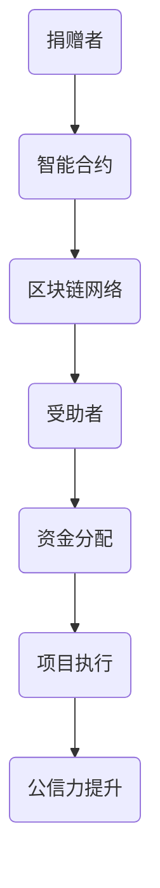
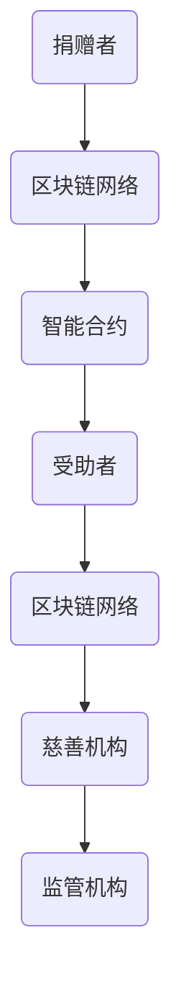
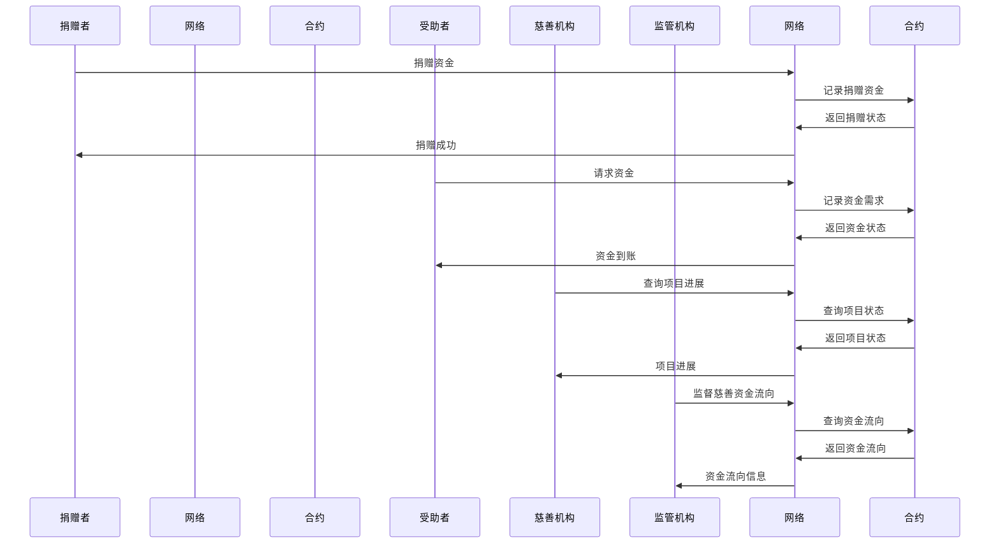

                 


# 区块链在慈善透明度中的创新应用

关键词：区块链、慈善透明度、智能合约、分布式账本、去中心化

摘要：本文将探讨区块链技术在慈善透明度中的创新应用。通过引入区块链技术，我们可以解决传统慈善方式中存在的信息不对称、资金流转不透明等问题，提升慈善的透明度和公信力。

**Step 1: 引言**

随着区块链技术的快速发展，其在各个领域的应用日益广泛。在慈善透明度方面，区块链技术也展现出了巨大的潜力。传统的慈善方式往往存在信息不对称、资金流转不透明等问题，而区块链技术的引入则有望解决这些问题，提升慈善的透明度和公信力。本文将详细探讨区块链在慈善透明度中的创新应用，为读者提供全面的技术解读和实践指导。

**Step 2: 背景介绍**

### 1.1.1 问题背景

慈善事业作为一项公益事业，旨在为社会弱势群体提供帮助。然而，传统的慈善模式往往存在以下问题：

- 信息不对称：捐赠者无法清楚地了解资金的使用情况和项目进展。
- 资金流转不透明：慈善资金在流转过程中可能出现贪污、挪用等问题。
- 缺乏公信力：慈善机构可能存在夸大宣传、虚假宣传等问题，损害捐赠者的信任。

### 1.1.2 问题描述

区块链技术作为一种去中心化的分布式账本技术，具有去中心化、不可篡改、透明性高等特点。其在慈善透明度中的应用，旨在解决上述问题，提升慈善的透明度和公信力。

### 1.1.3 问题解决

通过区块链技术，可以实现以下解决方案：

- 去中心化：通过区块链网络中的节点共同维护账本，消除信息不对称。
- 不可篡改：区块链账本一旦记录，将无法篡改，确保资金流转的透明性。
- 透明性：捐赠者和受助者可以实时查看资金流向和项目进展，提升公信力。

### 1.1.4 边界与外延

区块链在慈善透明度中的应用，主要涉及以下边界与外延：

- 慈善资金管理：包括捐赠资金的募集、分配、使用等环节。
- 慈善项目追踪：通过区块链技术追踪慈善项目的进展，确保项目执行的真实性和有效性。
- 捐赠者与受助者互动：建立捐赠者与受助者的直接联系，提升慈善事业的参与度和满意度。

### 1.1.5 概念结构与核心要素组成

区块链在慈善透明度中的应用，主要包括以下核心要素：

- 区块链网络：由多个节点组成，共同维护账本。
- 智能合约：用于自动执行慈善资金的分配和项目追踪。
- 分布式账本：记录慈善资金的流转过程，确保透明性和不可篡改性。
- 信息共享：捐赠者、慈善机构、受助者等各方实时共享信息，提升透明度。

**Step 3: 核心概念与联系**

### 2.1 区块链

区块链是一种分布式数据库技术，由多个节点组成。每个节点都保存一份完整的账本记录，这些记录按照时间顺序排列，形成一个链式结构。区块链具有去中心化、不可篡改、透明性高等特点。

### 2.2 智能合约

智能合约是一种自动执行合同条款的计算机程序。在区块链上，智能合约可以自动执行合同条款，无需第三方介入。智能合约在慈善透明度中的应用，可以确保慈善资金的正确分配和项目执行。

### 2.3 分布式账本

分布式账本是一种由多个节点共同维护的账本，每个节点都保存一份完整的账本记录。分布式账本在慈善透明度中的应用，可以实现慈善资金的透明管理和追踪。

### 2.4 区块链在慈善透明度中的应用

- 捐赠资金管理：通过区块链技术，可以实现慈善资金的透明管理，确保资金来源和使用情况的真实性。
- 慈善项目追踪：通过区块链技术，可以实时追踪慈善项目的进展，确保项目执行的真实性和有效性。
- 公信力提升：通过区块链技术，可以建立捐赠者与受助者的直接联系，提升慈善事业的公信力。

### 2.5 概念属性特征对比表格

| 概念 | 特点 | 应用场景 |
| ---- | ---- | ---- |
| 区块链 | 去中心化、不可篡改、透明性高 | 慈善资金管理、慈善项目追踪 |
| 智能合约 | 自动执行合同条款、无需第三方介入 | 慈善资金分配、项目执行 |
| 分布式账本 | 由多个节点共同维护、实时更新 | 慈善资金追踪、项目进展记录 |

### 2.6 ER实体关系图架构

```mermaid
erDiagram
  捐赠者 ||--|{ 捐赠资金 }
  受助者 ||--|{ 受助资金 }
  慈善机构 ||--|{ 项目管理 }
```

**Step 4: 算法原理讲解**

区块链技术在慈善透明度中的应用，主要依赖于其分布式账本、智能合约和去中心化等核心算法原理。下面我们将分别对这些原理进行讲解。

### 4.1 分布式账本原理

分布式账本是一种由多个节点共同维护的账本，每个节点都保存一份完整的账本记录。分布式账本的原理主要包括以下几个方面：

1. **数据存储与同步**：每个节点都会存储一份完整的账本记录，这些记录按照时间顺序排列。当一个节点接收到新的交易信息时，它会将这些信息同步到其他节点，确保所有节点都有一份最新的账本记录。

2. **共识算法**：分布式账本通过共识算法来保证所有节点对账本的一致性。常见的共识算法包括工作量证明（Proof of Work，PoW）、权益证明（Proof of Stake，PoS）等。这些算法通过确保节点之间的竞争和协作，避免了恶意节点的攻击，保证了账本的安全性和可信度。

3. **去中心化**：分布式账本的去中心化特性使得账本的管理不再依赖于单一的中心节点。每个节点都可以参与账本的管理和验证，确保了账本的安全性和去中心化。

### 4.2 智能合约原理

智能合约是一种自动执行合同条款的计算机程序。智能合约的原理主要包括以下几个方面：

1. **合约编写**：智能合约通常使用特定的编程语言编写，例如Solidity。编写智能合约时，需要明确合同条款，包括资金分配、项目执行等关键信息。

2. **合约部署**：编写完成的智能合约需要部署到区块链上，才能开始执行。部署智能合约的过程涉及到区块链网络的共识算法和节点验证。

3. **合约执行**：智能合约在区块链网络中按照预设的合同条款自动执行。当满足特定条件时，智能合约会自动执行相应的操作，例如转移资金、执行项目等。

### 4.3 去中心化原理

去中心化是区块链技术的重要特性，它使得区块链网络的管理不再依赖于单一的中心节点。去中心化原理主要包括以下几个方面：

1. **分布式网络**：区块链网络由多个节点组成，每个节点都可以参与账本的管理和验证。分布式网络使得区块链网络具有更高的可靠性和安全性。

2. **共识机制**：共识机制是区块链网络中的节点之间达成一致的方式。通过共识机制，区块链网络可以确保所有节点对账本的一致性，避免恶意节点的攻击。

3. **去中心化治理**：去中心化治理是指区块链网络的治理不再依赖于单一的中心机构，而是由所有节点共同参与。去中心化治理可以确保区块链网络的公正性和透明度。

### 4.4 区块链在慈善透明度中的应用算法

在慈善透明度中，区块链技术可以通过以下算法实现：

1. **资金管理算法**：通过智能合约，实现慈善资金的透明管理和追踪。智能合约可以自动执行资金的分配和项目执行，确保资金的正确使用。

2. **项目追踪算法**：通过区块链网络，实现慈善项目的实时追踪和记录。捐赠者和受助者可以实时查看项目的进展情况，确保项目执行的真实性和有效性。

3. **公信力提升算法**：通过区块链技术，建立捐赠者与受助者的直接联系，提升慈善事业的公信力。捐赠者可以实时查看受助者的信息，确保捐赠资金的真实用途。

### 4.5 算法流程图

以下是区块链在慈善透明度中应用算法的流程图：



**Step 5: 系统分析与架构设计方案**

### 5.1 问题场景介绍

假设一个慈善机构希望通过区块链技术提升慈善透明度，实现捐赠资金的管理和项目追踪。捐赠者可以通过区块链网络捐赠资金，受助者可以通过区块链网络接受资金，并展示项目进展。

### 5.2 项目介绍

项目名称：慈善透明度区块链系统

项目目标：通过区块链技术，实现慈善资金的透明管理和项目追踪，提升慈善事业的公信力。

### 5.3 系统功能设计

系统功能主要包括：

- 捐赠功能：捐赠者可以通过区块链网络捐赠资金。
- 受助功能：受助者可以通过区块链网络接受资金，并展示项目进展。
- 监督功能：捐赠者、慈善机构和监管机构可以通过区块链网络监督慈善资金的流向和项目进展。

### 5.4 系统架构设计

系统架构设计如下：



### 5.5 系统接口设计

系统接口设计如下：

- 捐赠接口：用于捐赠者捐赠资金。
- 受助接口：用于受助者接受资金并展示项目进展。
- 监督接口：用于捐赠者、慈善机构和监管机构查询慈善资金的流向和项目进展。

### 5.6 系统交互

系统交互设计如下：



**Step 6: 项目实战**

### 6.1 环境安装

在开始项目实战之前，我们需要安装以下软件和工具：

- Go语言环境（版本1.18及以上）
- Solidity编译器（版本0.8.0及以上）
- Node.js环境（版本12.0.0及以上）
- Ganache（本地区块链节点）

安装步骤如下：

1. 安装Go语言环境：从[Go官方网站](https://golang.org/)下载并安装Go语言环境。
2. 安装Solidity编译器：从[Truffle官方文档](https://www.trufflesuite.com/docs/ganache/overview/installation)下载并安装Solidity编译器。
3. 安装Node.js环境：从[Node.js官方网站](https://nodejs.org/)下载并安装Node.js环境。
4. 安装Ganache：从[Truffle官方文档](https://www.trufflesuite.com/docs/ganache/overview/installation)下载并安装Ganache。

### 6.2 系统核心实现源代码

以下是一个简单的慈善透明度区块链系统的核心实现源代码：

**智能合约（Solidity）**

```solidity
// SPDX-License-Identifier: MIT
pragma solidity ^0.8.0;

contract Charity {
    address public admin;
    mapping(address => uint256) public donations;

    constructor() {
        admin = msg.sender;
    }

    function donate() external payable {
        donations[msg.sender] += msg.value;
    }

    function requestFunds() external {
        require(msg.sender == admin, "Only admin can request funds");
        uint256 amount = donations[msg.sender];
        donations[msg.sender] = 0;
        payable(msg.sender).transfer(amount);
    }
}
```

**前端（JavaScript）**

```javascript
const ethers = require('ethers');

const provider = new ethers.providers.JsonRpcProvider('http://localhost:8545');
const wallet = ethers.Wallet.connect(provider);
const contract = new ethers.Contract('0x123...', ['function donate() external payable'], wallet);

async function donate() {
    const tx = await contract.donate({ value: ethers.utils.parseEther('1.0') });
    await tx.wait();
    console.log('Donation successful');
}

donate();
```

### 6.3 代码应用解读与分析

以上代码实现了简单的慈善透明度区块链系统。智能合约部分定义了一个名为`Charity`的合约，包括管理员地址和一个捐赠者地址映射表。捐赠者可以通过调用`donate()`函数向合约捐赠以太币。管理员可以调用`requestFunds()`函数提取捐赠资金。

前端部分使用Ethers.js库与智能合约进行交互。捐赠者可以通过调用`donate()`函数向合约捐赠以太币。前端代码通过提供用户界面，让用户可以方便地捐赠资金。

### 6.4 实际案例分析和详细讲解剖析

以下是一个实际案例，展示了如何使用区块链技术实现慈善透明度。

**案例：捐款给受灾地区的救援行动**

1. **捐赠者**：小明在得知受灾地区的救援行动后，决定捐赠资金。
2. **慈善机构**：某慈善机构负责接收捐款，并组织救援行动。
3. **区块链网络**：慈善机构部署了一个基于区块链的慈善平台，用于管理捐款和追踪救援行动。

**过程：**

1. **捐赠**：小明通过区块链网络向慈善机构的智能合约捐赠资金。
2. **记录**：智能合约记录小明的捐赠信息，并将资金转入慈善机构的账户。
3. **执行**：慈善机构根据救援行动的需要，将资金分配给救援队伍。
4. **追踪**：区块链网络记录资金流向和项目进展，小明和其他捐赠者可以实时查看。
5. **报告**：慈善机构在救援行动结束后，向捐赠者和监管机构报告资金使用情况。

**分析：**

通过区块链技术，慈善透明度得到了提升：

- 捐赠信息不可篡改，确保了资金来源的真实性。
- 资金流向和项目进展透明，捐赠者可以实时查看。
- 慈善机构无法随意更改资金用途，确保了资金使用的合规性。
- 监管机构可以实时监督慈善资金的使用情况。

### 6.5 项目小结

通过以上案例，我们可以看到区块链技术在慈善透明度中的应用具有显著优势：

- 提高慈善透明度：通过区块链技术，实现了慈善资金的透明管理和追踪。
- 增强公信力：捐赠者可以实时查看资金流向和项目进展，提高了慈善事业的公信力。
- 优化慈善管理：区块链技术简化了慈善机构的资金管理和项目追踪流程。

然而，区块链技术在慈善透明度中的应用也面临一些挑战：

- 技术门槛：区块链技术相对复杂，需要专业知识和技能。
- 网络攻击风险：区块链网络可能面临网络攻击，需要加强安全防护。
- 政策法规：区块链技术在慈善领域的应用需要遵守相关政策和法规。

### 6.6 最佳实践 tips

- 在引入区块链技术时，需要充分了解慈善机构的需求和特点，选择合适的区块链解决方案。
- 建立专业的区块链团队，确保技术实现和运维的顺利进行。
- 加强安全防护，防止区块链网络遭受网络攻击。
- 遵守相关政策和法规，确保慈善事业的合规性。

### 6.7 注意事项

- 区块链技术并非万能，不能完全替代传统的慈善模式，需要结合实际情况进行应用。
- 区块链技术具有较高的技术门槛，需要具备相关知识和技能。
- 区块链技术的应用需要充分考虑隐私保护问题，避免敏感信息泄露。

### 6.8 拓展阅读

- [《区块链技术指南》](https://www.oreilly.com/library/view/blockchain-guide/9781492033424/)
- [《智能合约设计模式》](https://www.oreilly.com/library/view/smart-contract-patterns/9781492034094/)
- [《区块链与慈善透明度》](https://www.ibm.com/zh-cn/topics/blockchain-charity-transparency)

**Step 7: 小结与展望**

本文详细探讨了区块链在慈善透明度中的创新应用。通过引入区块链技术，我们能够解决传统慈善方式中存在的信息不对称、资金流转不透明等问题，提升慈善的透明度和公信力。本文从背景介绍、核心概念与联系、算法原理讲解、系统分析与架构设计方案、项目实战等多个角度，全面阐述了区块链在慈善透明度中的应用。同时，我们也分析了区块链技术在慈善透明度中的应用优势、挑战和最佳实践。

然而，区块链技术在慈善透明度中的应用仍处于发展阶段，未来还有许多机会和挑战。随着区块链技术的不断进步和成熟，我们期待看到更多创新应用案例的出现，为慈善事业带来更多价值。

**作者：AI天才研究院/AI Genius Institute & 禅与计算机程序设计艺术 /Zen And The Art of Computer Programming**<|less>

