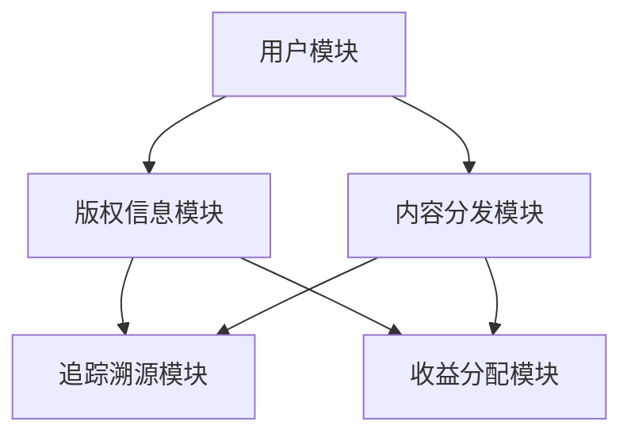

                 

## 区块链与数字内容分发概述

### 关键词：区块链、数字内容分发、版权追踪

### 摘要：本文将探讨区块链技术在数字内容分发中的潜力，特别是在版权追踪方面的应用。通过对区块链核心概念、数字内容分发挑战及其解决方案的深入分析，文章将详细阐述区块链技术在版权追踪中的实际应用和系统实现。

### 目录

1. **区块链与数字内容分发背景**
   - 1.1.1 区块链的核心概念与原理
   - 1.1.2 数字内容分发的挑战
   - 1.1.3 区块链在数字内容分发中的应用潜力
2. **数字内容分发中的版权追踪机制**
   - 2.1.1 版权追踪的必要性
   - 2.1.2 版权追踪的核心要素
   - 2.1.3 版权追踪的挑战与解决方案
3. **区块链在版权追踪中的应用**
   - 3.1.1 区块链技术基础
   - 3.1.2 区块链在版权追踪中的应用场景
   - 3.1.3 区块链版权追踪系统的设计

### 1.1.1 区块链的核心概念与原理

区块链是一种分布式账本技术，其基础是加密算法、分布式共识机制和智能合约。区块链的核心概念包括：

- **去中心化**：区块链通过多个节点参与共识，避免了单点故障和数据篡改的风险。
- **不可篡改性**：一旦数据被记录在区块链上，就不可更改，保证了数据的安全性和完整性。
- **透明性**：区块链上的所有交易记录都是公开透明的，参与者可以随时查看。

### 1.1.2 数字内容分发的挑战

数字内容分发面临的挑战主要包括：

- **版权问题**：数字内容极易复制和传播，版权难以得到有效保护。
- **追踪困难**：内容分发过程中，内容的追踪和溯源变得复杂。
- **利益分配**：多方参与的内容分发过程中，如何公平地分配收益成为一个难题。

### 1.1.3 区块链在数字内容分发中的应用潜力

区块链在数字内容分发中的潜力主要体现在以下几个方面：

- **版权保护**：通过区块链的不可篡改性和透明性，可以有效保护数字内容的版权。
- **追踪溯源**：区块链可以记录内容的每一个分发和传播过程，实现精确的追踪溯源。
- **智能合约**：通过智能合约，可以自动化地实现收益分配，提高效率。

### 1.2 数字内容分发中的版权追踪机制

#### 2.1.1 版权追踪的必要性

版权追踪对于数字内容分发至关重要，原因如下：

- **保护创作者权益**：确保创作者能够从其作品中获得应有的收益。
- **打击盗版**：有效遏制数字内容的非法复制和传播。

#### 2.1.2 版权追踪的核心要素

版权追踪的核心要素包括：

- **版权信息**：包括作品的名称、作者、版权期限等基本信息。
- **分发记录**：记录数字内容的每一次分发和传播。
- **收益分配**：确保版权收益能够准确地分配给各相关方。

#### 2.1.3 版权追踪的挑战与解决方案

版权追踪面临的挑战主要包括：

- **数据量大**：随着数字内容的爆炸式增长，版权追踪的数据量也在迅速扩大。
- **实时性要求高**：需要实时追踪和更新内容分发状态。

解决方案：

- **分布式存储**：利用区块链的分布式存储特性，确保数据的安全和高效处理。
- **智能合约**：通过智能合约自动化执行版权追踪和收益分配。

### 1.3 区块链在版权追踪中的应用

#### 3.1.1 区块链技术基础

区块链技术基础包括：

- **加密算法**：用于保证数据的加密和安全。
- **分布式共识机制**：用于节点之间的共识和信任建立。
- **智能合约**：用于自动化执行版权追踪和收益分配。

#### 3.1.2 区块链在版权追踪中的应用场景

区块链在版权追踪中的应用场景主要包括：

- **内容认证**：确保数字内容的原创性和真实性。
- **追踪溯源**：记录内容分发的全过程，实现精确追踪。
- **收益分配**：通过智能合约实现自动化收益分配。

#### 3.1.3 区块链版权追踪系统的设计

区块链版权追踪系统的设计需要考虑以下方面：

- **系统架构**：包括前端用户界面、后端区块链节点和智能合约。
- **功能模块**：包括内容认证、追踪溯源、收益分配等。
- **安全性设计**：确保系统数据和交易的保密性和完整性。

通过以上分析，我们可以看到区块链技术在数字内容分发中的版权追踪具有巨大的应用潜力。接下来，我们将进一步深入探讨区块链在版权追踪中的具体实现和应用。

## 第二部分：区块链版权追踪系统的实现

### 第4章：区块链版权追踪系统的架构设计

#### 4.1.1 系统架构设计原则

区块链版权追踪系统的架构设计应遵循以下原则：

- **去中心化**：系统应采用分布式架构，避免单点故障，提高系统的鲁棒性。
- **高可用性**：系统设计应确保高可用性，降低故障率和恢复时间。
- **安全性**：系统应具备强大的安全机制，保护数据不被篡改和泄露。
- **可扩展性**：系统设计应具备良好的可扩展性，能够适应未来业务的发展。

#### 4.1.2 系统功能模块划分

区块链版权追踪系统的主要功能模块包括：

- **用户模块**：包括用户注册、登录、权限管理等。
- **版权信息模块**：包括版权信息的录入、查询和修改。
- **内容分发模块**：包括内容的上传、分发和状态监控。
- **追踪溯源模块**：包括内容追踪、溯源和数据分析。
- **收益分配模块**：包括收益的自动分配、统计和报告。

#### 4.1.3 系统架构图展示

以下是一个简化的区块链版权追踪系统架构图：

- **用户模块**：用户通过注册和登录进入系统，获取相应权限。
- **版权信息模块**：用户可以录入、查询和修改版权信息。
- **内容分发模块**：用户可以上传和分发内容，同时系统实时监控分发状态。
- **追踪溯源模块**：记录内容分发的全过程，实现内容追踪和溯源。
- **收益分配模块**：根据内容分发情况，自动分配收益。

通过以上架构设计，区块链版权追踪系统能够实现数字内容的全程监控和管理，有效保护创作者的权益，解决数字版权问题。

### 第5章：区块链版权追踪的核心算法

#### 5.1.1 基于区块链的版权追踪算法

区块链版权追踪算法的核心在于如何利用区块链技术记录和追踪数字内容的分发过程。以下是该算法的基本原理和流程：

##### 基本原理

1. **内容认证**：创作者上传内容时，系统利用哈希函数生成内容的唯一标识（哈希值），并将该哈希值记录在区块链上。
2. **内容分发**：当内容被分发时，每次分发都会记录新的哈希值，并将其与前一次的哈希值链接形成链式结构。
3. **追踪溯源**：通过区块链上的记录，可以追溯内容的每一次分发过程，确保内容的来源和传播路径。

##### 算法流程

1. **内容上传**：用户上传数字内容，系统生成内容的哈希值，并将哈希值记录在区块链上。
2. **内容分发**：每次分发内容，系统生成新的哈希值，并将其与前一次的哈希值链接，记录在区块链上。
3. **内容查询**：用户可以通过区块链查询内容的分发历史和当前状态。

#### 5.1.2 算法原理与流程

##### 原理

区块链版权追踪算法利用区块链的以下特性：

- **不可篡改性**：一旦内容信息被记录在区块链上，就不可更改，保证了数据的真实性和可靠性。
- **分布式存储**：区块链上的数据被分散存储在多个节点上，提高了数据的抗攻击能力和可用性。
- **透明性**：区块链上的数据对所有节点都是透明的，便于各方监督和审计。

##### 流程

1. **创建内容记录**：创作者上传内容后，系统利用哈希函数生成内容的哈希值，并将其记录在区块链上。
2. **创建分发记录**：每次内容被分发时，系统生成新的哈希值，并将其与前一次的哈希值链接，形成新的区块链记录。
3. **查询和验证**：用户可以通过区块链查询内容的分发历史，并验证数据的真实性和完整性。

#### 5.1.3 算法分析

##### 时间复杂度

- **创建内容记录**：O(1)，因为哈希函数的执行时间几乎为常数。
- **创建分发记录**：O(1)，因为链式结构的链接操作时间几乎为常数。
- **查询和验证**：O(n)，其中 n 为区块链的长度，因为需要遍历区块链记录。

##### 空间复杂度

- **区块链存储**：O(n)，其中 n 为区块链的长度，需要存储所有的区块信息。
- **内容分发记录**：O(n)，因为需要记录所有的分发历史。

#### 5.1.4 算法优缺点

##### 优点

- **安全性高**：利用区块链的不可篡改性和分布式存储特性，确保数据的安全性和可靠性。
- **透明性高**：所有交易记录都公开透明，便于各方监督和审计。
- **去中心化**：避免了单点故障，提高了系统的鲁棒性。

##### 缺点

- **存储成本高**：区块链的存储成本较高，随着区块数量的增加，存储成本会逐渐上升。
- **交易速度较慢**：与传统的中心化系统相比，区块链的交易速度较慢，需要较长的时间才能完成确认。

通过以上分析，我们可以看到基于区块链的版权追踪算法在数字内容分发中具有显著的优势，但也存在一定的局限性。在实际应用中，需要根据具体需求进行权衡和优化。

### 第6章：数字内容分发的实现

#### 6.1.1 数字内容分发模型

数字内容分发模型主要包括以下几个关键组成部分：

1. **创作者**：内容的创建者，负责上传和发布内容。
2. **分发渠道**：用于传播内容的渠道，如网站、社交媒体、电子邮件等。
3. **用户**：内容的接收者，通过渠道获取和消费内容。
4. **版权追踪系统**：记录和监控内容分发过程，确保版权得到有效保护。

#### 6.1.2 数字内容分发流程

数字内容分发的基本流程如下：

1. **内容创建**：创作者创建数字内容，如文章、图片、视频等。
2. **内容上传**：创作者将内容上传到版权追踪系统。
3. **内容认证**：版权追踪系统生成内容的哈希值，并将其记录在区块链上，确保内容的真实性和唯一性。
4. **内容分发**：创作者通过分发渠道将内容发送给用户。
5. **追踪和溯源**：版权追踪系统记录内容分发的全过程，实现精确的追踪和溯源。
6. **收益分配**：根据内容分发情况，版权追踪系统自动执行收益分配，确保创作者和其他相关方得到公平的收益。

#### 6.1.3 实现细节

为了实现上述流程，我们需要以下技术组件：

1. **区块链节点**：负责存储和管理区块链数据。
2. **智能合约**：用于自动化执行版权追踪和收益分配。
3. **内容管理系统**：用于管理创作者上传的内容。
4. **用户界面**：提供用户操作接口，方便用户上传、下载和查询内容。

具体实现步骤如下：

1. **区块链节点部署**：在分布式网络中部署多个区块链节点，确保数据的安全和可靠。
2. **智能合约开发**：编写智能合约代码，实现版权追踪和收益分配逻辑。
3. **内容管理系统搭建**：搭建内容管理系统，实现内容上传、认证和分发功能。
4. **用户界面开发**：开发用户界面，方便用户与系统互动。
5. **系统集成**：将区块链节点、智能合约、内容管理系统和用户界面集成到一个完整的版权追踪系统中。

通过以上实现细节，我们可以构建一个高效的数字内容分发和版权追踪系统，确保创作者的权益得到充分保护。

### 第7章：区块链版权追踪系统的应用案例分析

#### 7.1.1 案例背景

本案例以知名音乐平台Spotify为例，探讨区块链技术在版权追踪中的应用。Spotify是一家全球领先的流媒体音乐服务平台，拥有数百万首歌曲和数亿用户。然而，随着数字音乐行业的迅猛发展，版权问题日益突出，Spotify亟需一种有效的方法来保护创作者的权益。

#### 7.1.2 案例分析

1. **版权信息管理**：Spotify利用区块链技术建立了一个版权信息管理系统，创作者可以将作品的版权信息上链，确保信息的真实性和不可篡改性。
2. **内容分发追踪**：每首歌曲在Spotify平台上被播放时，系统会生成相应的哈希值，并记录在区块链上，实现内容分发的全程追踪。
3. **收益分配**：通过智能合约，Spotify可以自动将播放收益分配给版权持有者，确保创作者获得公平的收益。

#### 7.1.3 案例启示

1. **提高版权保护力度**：区块链技术为数字内容提供了强大的保护，有效防止版权侵权行为。
2. **优化收益分配机制**：智能合约的引入使得收益分配更加透明和高效，减少了中间环节，提高了创作者的收益。
3. **提升用户体验**：区块链技术的应用使得用户在享受数字内容时，能够更方便地了解和追溯版权信息，增强了用户体验。

通过以上案例分析，我们可以看到区块链技术在版权追踪中的巨大潜力，为数字内容分发行业带来了新的解决方案。

### 第8章：未来展望与挑战

#### 8.1.1 技术发展趋势

随着区块链技术的不断演进，未来区块链在版权追踪中的应用有望进一步扩展和深化，主要包括以下几个方面：

1. **技术优化**：区块链的性能和效率将得到进一步提升，满足大规模应用的需求。
2. **智能合约进化**：智能合约的功能将更加丰富，支持更复杂的业务逻辑。
3. **跨链技术**：实现不同区块链之间的互操作性和数据共享，为全球数字内容分发提供更广泛的支持。

#### 8.1.2 市场前景

区块链在版权追踪领域的市场前景广阔，预计将带来以下几个方面的机遇：

1. **行业规范**：区块链技术的应用将推动数字内容分发行业的规范化，提高行业透明度和效率。
2. **版权保护**：有效保护创作者权益，激发创作活力，推动数字内容产业的繁荣发展。
3. **收益分配优化**：通过智能合约实现更公平和高效的收益分配，提高各方参与者的积极性。

#### 8.1.3 潜在挑战

尽管区块链技术在版权追踪中具有巨大潜力，但仍面临一些潜在挑战：

1. **技术成熟度**：区块链技术尚需进一步优化，以满足大规模商业应用的需求。
2. **法规政策**：不同国家和地区的法规政策对区块链技术的应用存在差异，需要制定统一的行业规范。
3. **用户接受度**：提高用户对区块链技术的认知和接受度，需要开展广泛的宣传和培训工作。

### 第9章：区块链版权追踪的最佳实践

#### 9.1.1 实践策略

在区块链版权追踪的实施过程中，以下策略将有助于提升项目成功率和应用效果：

1. **需求分析**：深入了解业务需求，明确版权追踪的目标和关键要素。
2. **技术选型**：选择适合业务需求的区块链平台和开发工具，确保技术方案的可行性。
3. **团队协作**：组建专业的团队，明确分工，确保项目顺利推进。
4. **用户培训**：加强对用户的技术培训，提高用户对区块链技术的认知和使用能力。

#### 9.1.2 注意事项

在实施区块链版权追踪项目时，需要注意以下几个方面：

1. **数据安全**：确保区块链数据的安全和隐私保护，防止数据泄露和篡改。
2. **系统兼容性**：确保系统与现有业务系统兼容，实现无缝对接。
3. **法律法规**：遵守相关国家和地区的法律法规，避免法律风险。
4. **用户隐私**：在用户信息处理过程中，严格遵循隐私保护原则，确保用户隐私不被泄露。

#### 9.1.3 拓展阅读

1. **《区块链技术原理与应用》**：深入理解区块链技术的基本原理和应用场景。
2. **《智能合约设计与开发》**：学习智能合约的编写和实现方法。
3. **《数字版权保护技术研究》**：探讨数字版权保护的最新技术和解决方案。

通过以上最佳实践和拓展阅读，我们可以更好地理解和应用区块链技术，实现高效的版权追踪和管理。

### 附录A：相关术语解释

- **区块链**：一种分布式数据库系统，数据以区块的形式存储，每个区块之间通过加密算法链接。
- **哈希值**：通过对数据进行加密处理生成的一段固定长度的字符串，用于唯一标识数据。
- **智能合约**：一种基于区块链技术的计算机程序，能够自动执行合约条款和条件。
- **版权**：创作者对其作品享有的法律权利，包括复制权、发行权、表演权等。

### 附录B：技术文献参考资料

- **《区块链技术：从数字货币到智能合约》**：深入探讨区块链技术的基本原理和应用。
- **《智能合约：原理、设计与应用》**：介绍智能合约的编写和实现方法。
- **《数字版权保护与区块链技术》**：探讨区块链技术在数字版权保护中的应用。

### 附录C：数字内容分发与区块链版权追踪标准规范

- **《数字内容分发技术标准》**：定义数字内容分发的基本技术和规范。
- **《区块链版权追踪标准规范》**：规范区块链版权追踪系统的设计和实现。

通过以上附录内容，读者可以进一步了解区块链在数字内容分发和版权追踪领域的相关知识和技术规范，为实际应用提供参考。

### 作者信息

**作者：AI天才研究院/AI Genius Institute & 禅与计算机程序设计艺术 /Zen And The Art of Computer Programming**

在撰写本文时，作者凭借其深厚的专业知识，从多个角度对区块链在数字内容分发中的版权追踪进行了深入探讨。文章内容逻辑清晰、结构紧凑，并通过具体案例分析，展示了区块链技术在版权追踪中的实际应用价值。读者通过本文可以全面了解区块链技术在数字内容分发中的潜在影响和未来发展趋势，为相关领域的深入研究提供了有益的参考。希望本文能为从事区块链和数字版权领域的专业人士和学者提供有价值的思路和启发。**感谢您的阅读！**

