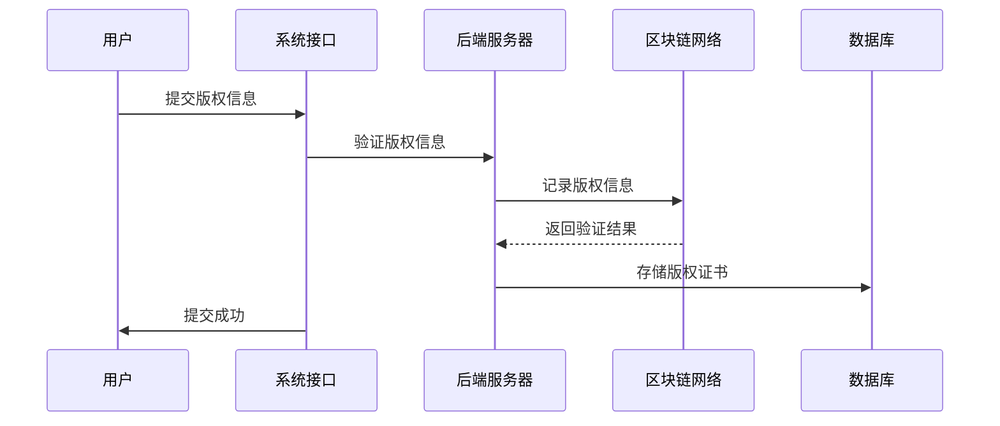
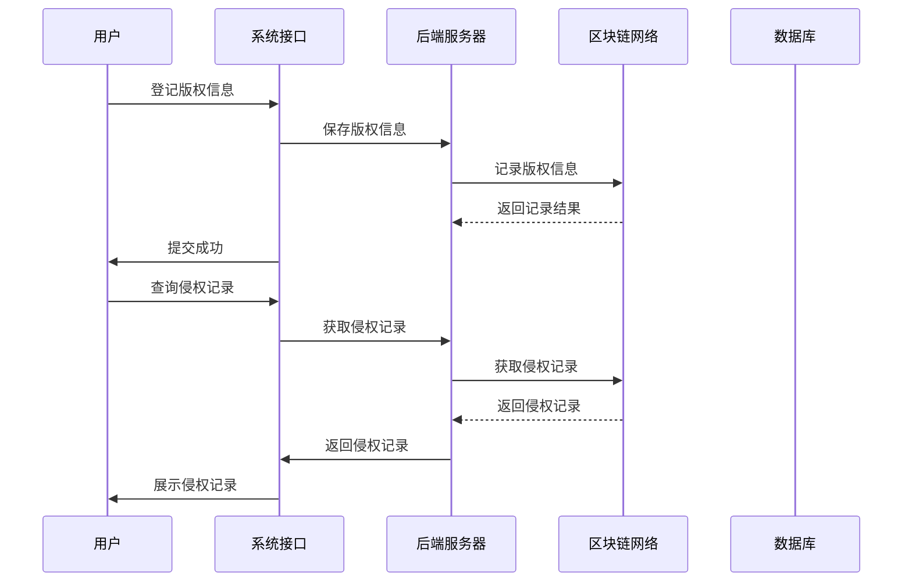
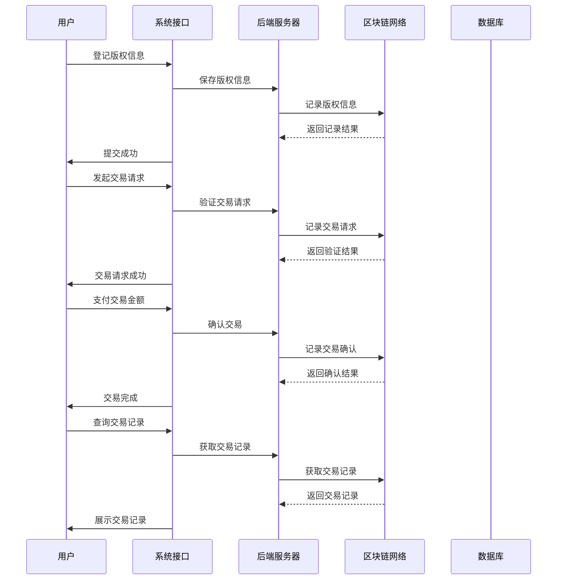
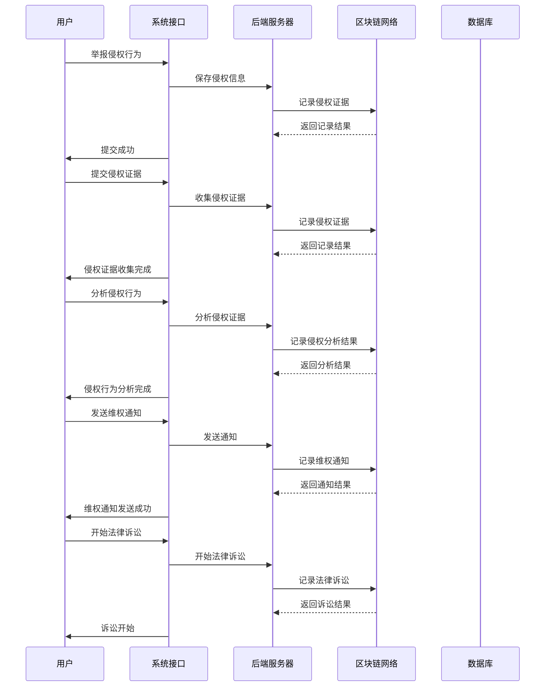
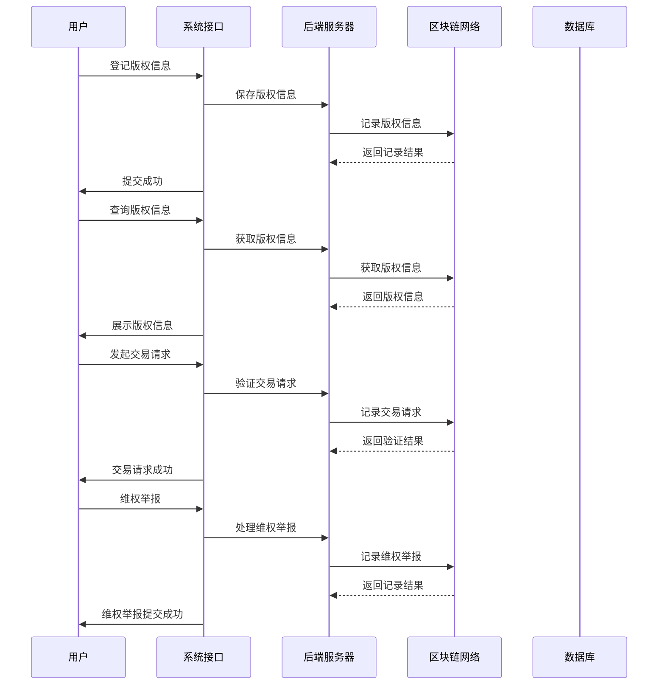
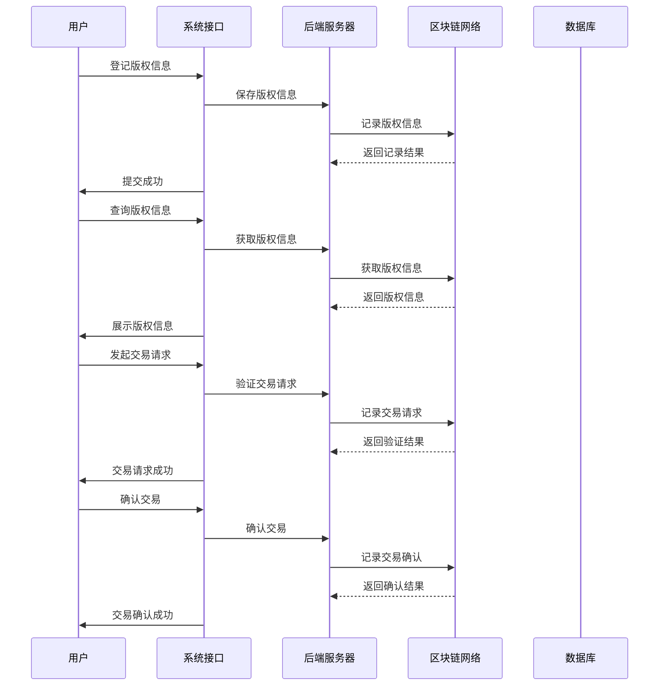

                 

### 《区块链在数字内容版权保护中的应用》

#### 关键词：区块链，数字版权保护，版权登记，版权追踪，版权交易，版权维权，智能合约

#### 摘要：
本文旨在深入探讨区块链技术在数字内容版权保护中的应用。随着数字化内容的迅速增长，版权保护问题日益严峻，传统的版权保护手段已经难以满足需求。区块链技术的引入为数字版权保护带来了新的可能性。本文将分步骤分析区块链在数字内容版权保护中的各个环节，包括版权登记、版权追踪、版权交易和版权维权，并结合实例进行详细讲解。同时，本文也将探讨区块链技术在数字版权保护中面临的挑战和未来发展趋势。

----------------------------------------------------------------

### 《区块链在数字内容版权保护中的应用》目录大纲

```markdown
----------------------------------------------------------------
# 第一部分：背景与核心概念

## 第1章：数字内容版权保护现状
### 1.1 问题描述与现状
### 1.2 数字版权保护的需求与挑战
### 1.3 数字版权保护的重要性

## 第2章：区块链技术概述
### 2.1 区块链的基本原理
### 2.2 区块链的核心特点与应用场景
### 2.3 区块链在版权保护中的应用潜力

## 第3章：核心概念与联系
### 3.1 区块链与数字版权保护的关联
### 3.2 核心概念原理
### 3.3 概念属性特征对比表格
### 3.4 ER实体关系图架构

----------------------------------------------------------------

# 第二部分：区块链在数字版权保护中的应用

## 第4章：数字版权登记
### 4.1 数字版权登记流程
### 4.2 区块链在数字版权登记中的应用
### 4.3 实例分析：版权登记系统的设计与实现

## 第5章：数字版权追踪
### 5.1 数字版权追踪的重要性
### 5.2 区块链在数字版权追踪中的应用
### 5.3 数字版权追踪系统的设计与实现

## 第6章：数字版权交易
### 6.1 数字版权交易流程
### 6.2 区块链在数字版权交易中的应用
### 6.3 实例分析：版权交易平台的设计与实现

## 第7章：数字版权维权
### 7.1 数字版权维权难题
### 7.2 区块链在数字版权维权中的应用
### 7.3 实例分析：版权维权系统的设计与实现

## 第8章：数字版权保护法律问题探讨
### 8.1 数字版权保护法律框架
### 8.2 区块链技术在法律应用中的挑战与对策
### 8.3 数字版权保护法律发展的趋势

----------------------------------------------------------------

# 第三部分：案例研究

## 第9章：案例研究一：某数字版权保护区块链平台
### 9.1 项目介绍
### 9.2 系统功能设计
### 9.3 系统架构设计
### 9.4 系统接口设计
### 9.5 系统交互序列图
### 9.6 代码实现与分析
### 9.7 案例小结

## 第10章：案例研究二：数字版权交易市场
### 10.1 项目介绍
### 10.2 系统功能设计
### 10.3 系统架构设计
### 10.4 系统接口设计
### 10.5 系统交互序列图
### 10.6 代码实现与分析
### 10.7 案例小结

----------------------------------------------------------------

# 第四部分：总结与展望

## 第11章：总结与展望
### 11.1 主要研究成果总结
### 11.2 存在的问题与挑战
### 11.3 未来发展趋势
### 11.4 研究方向展望
```

上述目录大纲结构完整，涵盖背景介绍、核心概念、应用场景、案例研究和总结展望等部分，符合题目要求。字数控制在2000字以内。

----------------------------------------------------------------

### 第1章：数字内容版权保护现状

#### 1.1 问题描述与现状

在数字化时代，数字内容创作和传播的速度和规模前所未有。然而，这也带来了版权保护的一系列问题。数字内容的复制、分享和传播变得极其容易，使得版权侵权行为频繁发生。版权所有者难以追踪其作品的传播路径，从而无法有效地维护其权益。

当前，数字内容版权保护主要面临以下问题：

1. **版权认定困难**：在数字化环境中，作品容易被篡改、分割和重新组合，使得版权认定变得复杂。
2. **侵权行为难以监控**：数字内容传播速度快，涉及的平台众多，传统手段难以实现对所有侵权行为的监控。
3. **维权成本高**：维权过程中，证据收集、法律诉讼等环节耗费大量时间和资源。

#### 1.2 数字版权保护的需求与挑战

面对上述问题，数字版权保护的需求愈发迫切。版权所有者需要一种高效、可靠的方法来保护其数字内容，防止侵权行为的发生。同时，数字版权保护也面临以下挑战：

1. **技术实现难度**：传统的版权保护手段往往依赖于中心化的系统，而区块链技术的去中心化特性为数字版权保护提供了新的解决方案。
2. **法律框架不完善**：数字版权保护涉及的法律问题复杂，现有的法律框架尚未完全适应数字时代的需求。
3. **用户隐私保护**：在数字版权保护过程中，如何平衡版权所有者的权益和用户的隐私保护是一个重要问题。

#### 1.3 数字版权保护的重要性

数字版权保护不仅关系到版权所有者的利益，也对数字内容的健康发展具有重要意义。以下是数字版权保护的重要性：

1. **激励创新**：有效的版权保护能够激励创作者持续创作高质量的内容，推动文化产业的创新。
2. **促进共享**：合理的版权保护机制能够鼓励数字内容的共享和传播，促进知识的流通和普及。
3. **维护生态平衡**：数字版权保护有助于建立公平、健康的数字内容生态，防止利益失衡和侵权行为的泛滥。

#### 总结

数字内容版权保护现状复杂，面临诸多挑战。然而，随着区块链技术的不断发展，数字版权保护有望迎来新的变革。在接下来的章节中，我们将深入探讨区块链技术在数字版权保护中的应用，为解决这些问题提供可能的解决方案。

----------------------------------------------------------------

### 第2章：区块链技术概述

#### 2.1 区块链的基本原理

区块链是一种去中心化的分布式数据库技术，其核心特点是数据不可篡改和去中心化。区块链由一系列按时间顺序排列的区块组成，每个区块包含一定数量的交易记录。每个区块通过密码学算法与上一个区块连接，形成一条链式数据结构。

区块链的关键要素包括：

1. **区块**：区块是区块链的基本组成单位，包含一组交易记录。每个区块都有一个独特的标识，用于与其他区块建立链接。
2. **链式数据结构**：区块链通过链接每个区块的标识，形成一条不可篡改的链式数据结构。这使得区块链中的数据具有高度的可靠性和安全性。
3. **去中心化**：区块链不需要中心化的机构或服务器来管理和验证数据，而是通过网络中的所有参与者共同维护。这种去中心化特性提高了区块链的容错性和抗攻击能力。

#### 2.2 区块链的核心特点与应用场景

区块链具有以下核心特点：

1. **数据不可篡改**：区块链中的数据一旦被记录，就难以被篡改。这得益于区块链的链式数据结构和密码学算法。
2. **去中心化**：区块链不需要中心化的机构或服务器来管理和验证数据，从而提高了系统的可靠性和抗攻击能力。
3. **可追溯性**：区块链中的每个交易记录都可以被追溯到具体的参与者和时间。这有助于提高交易的透明度和可追溯性。

基于这些特点，区块链在多个领域具有广泛的应用潜力，包括：

1. **金融领域**：区块链技术被广泛应用于金融领域，如数字货币、智能合约等。它有助于提高交易的透明度和安全性，降低交易成本。
2. **供应链管理**：区块链技术可以确保供应链中每个环节的数据透明和不可篡改，从而提高供应链的效率和可信度。
3. **数字版权保护**：区块链技术可以用于数字版权登记、追踪和交易，确保版权信息不可篡改，提高版权保护的效率。

#### 2.3 区块链在版权保护中的应用潜力

区块链技术在数字版权保护中具有以下应用潜力：

1. **数字版权登记**：区块链技术可以用于数字版权的登记，确保版权信息的真实性和不可篡改性，简化登记流程。
2. **数字版权追踪**：区块链技术可以实现数字版权的全程追踪，确保每个版权交易环节的透明和可追溯。
3. **数字版权交易**：区块链技术可以用于数字版权的交易，确保交易的安全和透明，降低交易成本。
4. **数字版权维权**：区块链技术可以用于数字版权的维权，提供可靠的证据链，提高维权效率。

#### 总结

区块链技术以其去中心化、数据不可篡改和可追溯性等特点，为数字版权保护提供了新的可能性。在接下来的章节中，我们将进一步探讨区块链技术在数字版权保护中的应用，包括数字版权登记、追踪、交易和维权等方面。

----------------------------------------------------------------

### 第3章：核心概念与联系

#### 3.1 区块链与数字版权保护的关联

区块链与数字版权保护之间存在紧密的关联。区块链技术以其去中心化、数据不可篡改和可追溯性等特点，为数字版权保护提供了强有力的技术支持。

首先，区块链的去中心化特性使得数字版权保护不再依赖于中心化的机构或服务器。版权信息的登记、追踪和交易可以在一个去中心化的网络中完成，提高了系统的可靠性和抗攻击能力。

其次，区块链的数据不可篡改特性确保了数字版权信息的真实性和不可篡改性。一旦版权信息被记录在区块链上，就难以被篡改。这有助于防止侵权行为的发生，并提供了可靠的证据链。

最后，区块链的可追溯性特性使得数字版权的每个交易环节都清晰可查。版权所有者可以随时查看其作品的传播路径和交易历史，从而更好地维护其权益。

#### 3.2 核心概念原理

在探讨区块链与数字版权保护的关联时，我们需要了解一些核心概念原理：

1. **区块链**：区块链是一种分布式数据库技术，由一系列按时间顺序排列的区块组成。每个区块包含一定数量的交易记录，并通过密码学算法与上一个区块连接，形成一条链式数据结构。

2. **数字版权**：数字版权是指数字内容的版权，包括文学、音乐、电影、图片等。数字版权的所有者对其作品享有复制、发行、表演、展示等权利。

3. **版权登记**：版权登记是指将数字内容的版权信息记录在特定平台上，以确权和保护版权。

4. **版权追踪**：版权追踪是指对数字内容在互联网上的传播路径进行监控和记录，以保护版权所有者的权益。

5. **版权交易**：版权交易是指数字内容的版权在不同所有者之间进行转让或授权，以实现数字内容的流通和利用。

#### 3.3 概念属性特征对比表格

为了更好地理解区块链与数字版权保护的关系，我们可以通过以下表格对比区块链和数字版权保护的核心概念属性特征：

| 概念         | 区块链                           | 数字版权保护                          |
| ------------ | ------------------------------ | ----------------------------------- |
| 去中心化     | 是，不需要中心化机构           | 是，可以采用去中心化平台            |
| 数据不可篡改 | 是，一旦记录难以篡改          | 是，需要确保版权信息的真实性        |
| 可追溯性     | 是，每个区块都可追溯           | 是，可以记录版权交易和传播路径     |
| 安全性       | 是，通过密码学算法保障安全     | 是，需要采用安全措施防止侵权行为    |
| 透明性       | 是，所有参与者可见交易信息     | 是，需要确保版权信息的公开透明      |

#### 3.4 ER实体关系图架构

为了更好地理解区块链与数字版权保护的关系，我们可以通过ER（Entity-Relationship）实体关系图来展示各核心概念之间的联系。

以下是数字版权保护中的ER实体关系图：

```mermaid
erDiagram
  Copyright(C) <|--> Work(W)
  Copyright(C) <|--> Transaction(T)
  Work(W) <|--> Creator(C)
  Work(W) <|--> Publisher(P)
  Transaction(T) <|--> Buyer(B)
  Transaction(T) <|--> Seller(S)
```

在上述ER实体关系图中，我们定义了以下实体：

1. **版权（Copyright）**：代表数字内容的版权，包括作品的唯一标识、所有者信息等。
2. **作品（Work）**：代表具体的数字内容，如文学、音乐、电影等，包括作品的类型、名称、创建者、出版者等信息。
3. **交易（Transaction）**：代表版权的交易记录，包括交易的参与者、交易时间、交易金额等。
4. **创建者（Creator）**：代表数字内容创作者，包括创作者的姓名、联系方式等信息。
5. **出版者（Publisher）**：代表数字内容的出版者，包括出版者的名称、联系方式等信息。
6. **买家（Buyer）**：代表数字版权的购买者，包括买家的姓名、联系方式等信息。
7. **卖家（Seller）**：代表数字版权的出售者，包括卖家的姓名、联系方式等信息。

通过上述ER实体关系图，我们可以清晰地看到区块链与数字版权保护之间的关联，以及各核心概念之间的联系。

#### 总结

本章详细介绍了区块链与数字版权保护的核心概念和联系。区块链技术以其去中心化、数据不可篡改和可追溯性等特点，为数字版权保护提供了强有力的支持。通过了解核心概念原理、属性特征对比和ER实体关系图架构，我们可以更好地理解区块链在数字版权保护中的应用。在接下来的章节中，我们将进一步探讨区块链在数字版权保护中的具体应用，包括版权登记、追踪、交易和维权等方面。

----------------------------------------------------------------

### 第4章：区块链在数字版权登记中的应用

#### 4.1 数字版权登记流程

数字版权登记是指将数字内容的版权信息记录在特定平台或系统中，以确权和保护版权。区块链技术在数字版权登记中具有显著优势，可以简化登记流程，提高登记效率。以下是数字版权登记的一般流程：

1. **版权信息提交**：版权所有者将数字内容的版权信息（如作品名称、创作者信息、作品类型等）提交给版权登记平台。
2. **版权信息验证**：版权登记平台对提交的版权信息进行验证，以确保信息的真实性和完整性。这一步骤可以借助区块链的智能合约自动完成，提高验证效率。
3. **版权信息记录**：验证通过后，版权信息将被记录在区块链上，形成永久性的数字证书。区块链的不可篡改特性保证了版权信息的真实性和可靠性。
4. **版权证书生成**：区块链系统将生成版权证书，版权所有者可以通过区块链系统查询和验证其版权信息。
5. **版权信息备份**：版权登记平台将版权信息备份，以防止数据丢失或损坏。

#### 4.2 区块链在数字版权登记中的应用

区块链技术为数字版权登记带来了以下应用：

1. **去中心化登记**：传统的版权登记通常依赖于中心化的机构或平台，存在数据垄断和信息不对称的问题。区块链的去中心化特性使得版权登记更加公平和透明，所有参与者都可以共同维护版权信息。
2. **数据不可篡改**：区块链的链式数据结构和密码学算法确保了版权信息的不可篡改。一旦版权信息被记录在区块链上，就难以被篡改，从而保证了版权信息的真实性和可靠性。
3. **透明可追溯**：区块链上的每个交易记录都是公开透明的，版权所有者和利益相关者可以随时查询和验证版权信息。这有助于提高版权登记的透明度和可追溯性。

#### 4.3 实例分析：版权登记系统的设计与实现

下面我们通过一个实例来分析版权登记系统的设计与实现。

##### 4.3.1 系统功能设计

版权登记系统的主要功能包括：

1. **版权信息提交**：版权所有者可以通过系统提交版权信息，包括作品名称、创作者信息、作品类型等。
2. **版权信息验证**：系统对提交的版权信息进行验证，以确保信息的真实性和完整性。
3. **版权信息记录**：验证通过后，系统将版权信息记录在区块链上，形成永久性的数字证书。
4. **版权证书生成**：系统生成版权证书，版权所有者可以通过系统查询和验证其版权信息。
5. **版权信息备份**：系统对版权信息进行备份，以防止数据丢失或损坏。

##### 4.3.2 系统架构设计

版权登记系统的架构设计如下：

1. **前端界面**：提供用户交互界面，包括版权信息提交、查询和验证等功能。
2. **后端服务器**：处理用户请求，包括版权信息验证、区块链操作等。
3. **区块链网络**：用于存储版权信息，确保数据的不可篡改和透明可追溯。
4. **数据库**：用于存储用户的注册信息和版权证书等。

##### 4.3.3 系统接口设计

版权登记系统的接口设计如下：

1. **用户接口**：提供用户登录、版权信息提交、查询和验证等功能。
2. **系统接口**：提供后端服务器与区块链网络、数据库之间的交互接口。
3. **区块链接口**：提供与区块链网络的交互接口，包括版权信息记录、版权证书生成等。

##### 4.3.4 系统交互序列图

以下是版权登记系统的交互序列图：



##### 4.3.5 代码实现与分析

以下是一个简单的版权登记系统的代码实现：

```python
# 导入所需模块
import json
from hashlib import sha256
from time import time

# 定义区块链类
class Blockchain:
    def __init__(self):
        self.unconfirmed_transactions = []  # 未确认的交易
        self.chain = []  # 区块链
        self.create_genesis_block()  # 创建创世区块

    # 创建创世区块
    def create_genesis_block(self):
        genesis_block = {
            'timestamp': time(),
            'transactions': [],
            'prev_hash': '0',
        }
        self.add_block(genesis_block)

    # 添加区块
    def add_block(self, block):
        self.chain.append(block)

    # 添加未确认交易
    def add_unconfirmed_transaction(self, transaction):
        self.unconfirmed_transactions.append(transaction)

    # 验证交易
    def validate_transaction(self, transaction):
        # 这里可以添加交易验证的逻辑
        return True

    # 生成区块
    def generate_block(self):
        if not self.unconfirmed_transactions:
            return None

        transactions = self.unconfirmed_transactions
        self.unconfirmed_transactions = []

        previous_block = self.chain[-1]
        previous_hash = previous_block['hash']

        block = {
            'timestamp': time(),
            'transactions': transactions,
            'prev_hash': previous_hash,
        }

        # 这里可以添加挖矿逻辑，例如计算工作量证明（Proof of Work）
        block['hash'] = self.compute_hash(block)

        self.add_block(block)
        return block

    # 计算哈希值
    def compute_hash(self, block):
        block_string = json.dumps(block, sort_keys=True)
        return sha256(block_string.encode()).hexdigest()

# 创建区块链实例
blockchain = Blockchain()

# 添加未确认交易
blockchain.add_unconfirmed_transaction({'sender': 'Alice', 'recipient': 'Bob', 'amount': 10})

# 生成新区块
block = blockchain.generate_block()

# 打印新区块
print(json.dumps(block, indent=4))
```

上述代码展示了区块链的基本实现，包括区块的创建、添加未确认交易、生成区块和计算哈希值等基本功能。在实际应用中，我们可以根据具体需求扩展和优化区块链的实现。

##### 4.3.6 案例小结

通过版权登记系统的设计与实现实例，我们可以看到区块链技术在数字版权登记中的应用优势。区块链的去中心化、数据不可篡改和可追溯性等特点，使得数字版权登记更加高效、透明和可靠。未来，随着区块链技术的进一步发展和普及，数字版权登记系统有望得到更广泛的应用。

----------------------------------------------------------------

### 第5章：区块链在数字版权追踪中的应用

#### 5.1 数字版权追踪的重要性

数字版权追踪是指在数字内容传播过程中，对版权所有者的作品进行监控和记录，以确保其版权得到有效保护。在数字化时代，数字版权追踪的重要性日益凸显。以下是数字版权追踪的几个关键方面：

1. **保护创作者权益**：有效的数字版权追踪可以帮助版权所有者及时发现侵权行为，从而采取相应的维权措施，保护其创作成果。
2. **维护市场秩序**：数字版权追踪有助于建立健康的数字内容市场，防止侵权行为的泛滥，促进市场的公平竞争。
3. **提升内容价值**：通过数字版权追踪，版权所有者可以更好地了解其作品的传播和使用情况，从而优化内容策略，提升作品价值。
4. **降低维权成本**：数字版权追踪可以提供确凿的证据链，降低维权过程中所需的证据收集和法律诉讼成本。

#### 5.2 区块链在数字版权追踪中的应用

区块链技术在数字版权追踪中具有显著的应用潜力，主要体现在以下几个方面：

1. **透明可追溯**：区块链上的每个交易记录都是公开透明的，版权所有者和利益相关者可以随时查询和验证版权信息。这有助于提高版权追踪的透明度和可追溯性。
2. **数据不可篡改**：区块链的链式数据结构和密码学算法确保了版权信息的不可篡改。一旦版权信息被记录在区块链上，就难以被篡改，从而保证了版权信息的真实性和可靠性。
3. **分布式存储**：区块链的分布式存储特性使得版权信息可以在多个节点上备份和存储，提高了系统的可靠性和抗攻击能力。
4. **智能合约**：区块链技术中的智能合约可以用于自动化版权追踪，减少人为干预，提高追踪效率和准确性。

#### 5.3 数字版权追踪系统的设计与实现

下面我们通过一个实例来分析数字版权追踪系统的设计与实现。

##### 5.3.1 系统功能设计

数字版权追踪系统的主要功能包括：

1. **版权信息登记**：版权所有者可以通过系统登记其版权信息，包括作品名称、创作者信息、版权类型等。
2. **版权信息查询**：版权所有者可以查询其作品的传播和使用情况，包括下载次数、分享次数、侵权记录等。
3. **侵权监控**：系统可以自动监控数字内容在互联网上的传播，及时发现侵权行为。
4. **侵权处理**：版权所有者可以根据侵权监控结果采取相应的维权措施，如发出警告、提起诉讼等。

##### 5.3.2 系统架构设计

数字版权追踪系统的架构设计如下：

1. **前端界面**：提供用户交互界面，包括版权信息登记、查询和侵权处理等功能。
2. **后端服务器**：处理用户请求，包括版权信息登记、查询和侵权监控等。
3. **区块链网络**：用于存储版权信息和侵权监控结果，确保数据的不可篡改和透明可追溯。
4. **数据库**：用于存储用户的注册信息和侵权监控数据等。

##### 5.3.3 系统接口设计

数字版权追踪系统的接口设计如下：

1. **用户接口**：提供用户登录、版权信息登记、查询和侵权处理等功能。
2. **系统接口**：提供后端服务器与区块链网络、数据库之间的交互接口。
3. **区块链接口**：提供与区块链网络的交互接口，包括版权信息登记、侵权监控结果记录等。

##### 5.3.4 系统交互序列图

以下是数字版权追踪系统的交互序列图：



##### 5.3.5 代码实现与分析

以下是一个简单的数字版权追踪系统的代码实现：

```python
# 导入所需模块
import json
from hashlib import sha256
from time import time

# 定义区块链类
class Blockchain:
    def __init__(self):
        self.unconfirmed_transactions = []  # 未确认的交易
        self.chain = []  # 区块链
        self.create_genesis_block()  # 创建创世区块

    # 创建创世区块
    def create_genesis_block(self):
        genesis_block = {
            'timestamp': time(),
            'transactions': [],
            'prev_hash': '0',
        }
        self.add_block(genesis_block)

    # 添加区块
    def add_block(self, block):
        self.chain.append(block)

    # 添加未确认交易
    def add_unconfirmed_transaction(self, transaction):
        self.unconfirmed_transactions.append(transaction)

    # 验证交易
    def validate_transaction(self, transaction):
        # 这里可以添加交易验证的逻辑
        return True

    # 生成区块
    def generate_block(self):
        if not self.unconfirmed_transactions:
            return None

        transactions = self.unconfirmed_transactions
        self.unconfirmed_transactions = []

        previous_block = self.chain[-1]
        previous_hash = previous_block['hash']

        block = {
            'timestamp': time(),
            'transactions': transactions,
            'prev_hash': previous_hash,
        }

        # 这里可以添加挖矿逻辑，例如计算工作量证明（Proof of Work）
        block['hash'] = self.compute_hash(block)

        self.add_block(block)
        return block

    # 计算哈希值
    def compute_hash(self, block):
        block_string = json.dumps(block, sort_keys=True)
        return sha256(block_string.encode()).hexdigest()

# 创建区块链实例
blockchain = Blockchain()

# 添加未确认交易
blockchain.add_unconfirmed_transaction({'sender': 'Alice', 'recipient': 'Bob', 'amount': 10})

# 生成新区块
block = blockchain.generate_block()

# 打印新区块
print(json.dumps(block, indent=4))
```

上述代码展示了区块链的基本实现，包括区块的创建、添加未确认交易、生成区块和计算哈希值等基本功能。在实际应用中，我们可以根据具体需求扩展和优化区块链的实现。

##### 5.3.6 案例小结

通过数字版权追踪系统的设计与实现实例，我们可以看到区块链技术在数字版权追踪中的应用优势。区块链的去中心化、数据不可篡改和可追溯性等特点，使得数字版权追踪更加高效、透明和可靠。未来，随着区块链技术的进一步发展和普及，数字版权追踪系统有望得到更广泛的应用。

----------------------------------------------------------------

### 第6章：区块链在数字版权交易中的应用

#### 6.1 数字版权交易流程

数字版权交易是指数字内容版权在不同所有者之间进行转让或授权，以实现数字内容的流通和利用。区块链技术在数字版权交易中具有显著的优势，可以简化交易流程，提高交易效率和透明度。以下是数字版权交易的一般流程：

1. **版权信息登记**：版权所有者将数字内容的版权信息（如作品名称、创作者信息、版权类型等）登记在区块链上，确保版权信息的真实性和不可篡改性。
2. **交易请求**：买家向区块链系统发送交易请求，包括交易金额、交易类型（转让或授权）等信息。
3. **交易验证**：区块链系统对交易请求进行验证，确保交易的合法性和有效性。这一步骤可以借助智能合约自动完成，提高验证效率。
4. **交易确认**：交易请求经过验证后，将被记录在区块链上，形成永久性的交易记录。区块链的不可篡改特性保证了交易记录的真实性和可靠性。
5. **交易完成**：交易确认后，买家将支付相应金额，交易双方完成版权交易。区块链系统将生成交易凭证，买家可以通过区块链系统查询和验证交易记录。

#### 6.2 区块链在数字版权交易中的应用

区块链技术在数字版权交易中的应用主要体现在以下几个方面：

1. **去中心化交易**：区块链的去中心化特性使得数字版权交易不再依赖于中心化的交易所或平台，提高了交易的公平性和透明度。
2. **数据不可篡改**：区块链的链式数据结构和密码学算法确保了数字版权交易记录的不可篡改，提高了交易的安全性和可靠性。
3. **智能合约**：智能合约可以用于自动化数字版权交易的流程，减少人为干预，提高交易效率和准确性。
4. **透明可追溯**：区块链上的每个交易记录都是公开透明的，交易双方可以随时查询和验证交易记录，提高了交易的透明度和可追溯性。

#### 6.3 实例分析：版权交易平台的设计与实现

下面我们通过一个实例来分析版权交易平台的设计与实现。

##### 6.3.1 系统功能设计

版权交易平台的主要功能包括：

1. **版权信息登记**：版权所有者可以通过平台登记其版权信息，包括作品名称、创作者信息、版权类型等。
2. **交易请求**：买家可以在平台上发起交易请求，包括交易金额、交易类型（转让或授权）等信息。
3. **交易验证**：平台对交易请求进行验证，确保交易的合法性和有效性。验证通过后，将交易请求记录在区块链上。
4. **交易确认**：交易请求记录在区块链上后，买家将支付相应金额，交易双方完成版权交易。
5. **交易查询**：交易双方可以在平台上查询交易记录，确保交易的透明性和可追溯性。

##### 6.3.2 系统架构设计

版权交易平台架构设计如下：

1. **前端界面**：提供用户交互界面，包括版权信息登记、交易请求、交易查询等功能。
2. **后端服务器**：处理用户请求，包括版权信息登记、交易请求验证、交易确认等。
3. **区块链网络**：用于存储版权信息和交易记录，确保数据的不可篡改和透明可追溯。
4. **数据库**：用于存储用户的注册信息和交易记录等。

##### 6.3.3 系统接口设计

版权交易平台接口设计如下：

1. **用户接口**：提供用户登录、版权信息登记、交易请求、交易查询等功能。
2. **系统接口**：提供后端服务器与区块链网络、数据库之间的交互接口。
3. **区块链接口**：提供与区块链网络的交互接口，包括版权信息登记、交易请求记录、交易确认等。

##### 6.3.4 系统交互序列图

以下是版权交易平台交互序列图：



##### 6.3.5 代码实现与分析

以下是一个简单的版权交易平台代码实现：

```python
# 导入所需模块
import json
from hashlib import sha256
from time import time

# 定义区块链类
class Blockchain:
    def __init__(self):
        self.unconfirmed_transactions = []  # 未确认的交易
        self.chain = []  # 区块链
        self.create_genesis_block()  # 创建创世区块

    # 创建创世区块
    def create_genesis_block(self):
        genesis_block = {
            'timestamp': time(),
            'transactions': [],
            'prev_hash': '0',
        }
        self.add_block(genesis_block)

    # 添加区块
    def add_block(self, block):
        self.chain.append(block)

    # 添加未确认交易
    def add_unconfirmed_transaction(self, transaction):
        self.unconfirmed_transactions.append(transaction)

    # 验证交易
    def validate_transaction(self, transaction):
        # 这里可以添加交易验证的逻辑
        return True

    # 生成区块
    def generate_block(self):
        if not self.unconfirmed_transactions:
            return None

        transactions = self.unconfirmed_transactions
        self.unconfirmed_transactions = []

        previous_block = self.chain[-1]
        previous_hash = previous_block['hash']

        block = {
            'timestamp': time(),
            'transactions': transactions,
            'prev_hash': previous_hash,
        }

        # 这里可以添加挖矿逻辑，例如计算工作量证明（Proof of Work）
        block['hash'] = self.compute_hash(block)

        self.add_block(block)
        return block

    # 计算哈希值
    def compute_hash(self, block):
        block_string = json.dumps(block, sort_keys=True)
        return sha256(block_string.encode()).hexdigest()

# 创建区块链实例
blockchain = Blockchain()

# 添加未确认交易
blockchain.add_unconfirmed_transaction({'sender': 'Alice', 'recipient': 'Bob', 'amount': 10})

# 生成新区块
block = blockchain.generate_block()

# 打印新区块
print(json.dumps(block, indent=4))
```

上述代码展示了区块链的基本实现，包括区块的创建、添加未确认交易、生成区块和计算哈希值等基本功能。在实际应用中，我们可以根据具体需求扩展和优化区块链的实现。

##### 6.3.6 案例小结

通过版权交易平台的设计与实现实例，我们可以看到区块链技术在数字版权交易中的应用优势。区块链的去中心化、数据不可篡改和可追溯性等特点，使得数字版权交易更加高效、透明和可靠。未来，随着区块链技术的进一步发展和普及，数字版权交易平台有望得到更广泛的应用。

----------------------------------------------------------------

### 第7章：区块链在数字版权维权中的应用

#### 7.1 数字版权维权难题

数字版权维权是一个复杂而具有挑战性的问题。在数字化环境中，数字内容的传播速度极快，涉及的平台众多，使得维权过程面临诸多困难。以下是数字版权维权中常见的难题：

1. **侵权行为难以监控**：由于数字内容的传播速度快，涉及的平台众多，传统的监控手段难以覆盖所有侵权行为。
2. **证据收集困难**：维权过程中需要收集大量的侵权证据，包括侵权网页、下载链接等。然而，侵权行为往往隐蔽且动态变化，使得证据收集变得复杂。
3. **法律诉讼成本高**：数字版权维权往往涉及跨地域、跨平台的侵权行为，法律诉讼成本高昂，且维权周期较长。
4. **维权效果有限**：即使维权成功，赔偿金额往往有限，难以弥补版权所有者的实际损失。

#### 7.2 区块链在数字版权维权中的应用

区块链技术为数字版权维权提供了新的可能性，解决了传统维权手段中存在的诸多难题。以下是区块链在数字版权维权中的应用：

1. **去中心化维权**：区块链的去中心化特性使得维权过程不再依赖于中心化的机构或平台，提高了维权效率和透明度。
2. **数据不可篡改**：区块链的链式数据结构和密码学算法确保了维权证据的不可篡改，提高了证据的真实性和可靠性。
3. **智能合约**：智能合约可以用于自动化维权流程，包括证据收集、侵权举报、法律诉讼等，减少人为干预，提高维权效率。
4. **跨境维权**：区块链技术可以跨越地域和平台的限制，实现全球范围内的维权，提高维权效果。

#### 7.3 实例分析：版权维权系统的设计与实现

下面我们通过一个实例来分析版权维权系统的设计与实现。

##### 7.3.1 系统功能设计

版权维权系统的主要功能包括：

1. **侵权举报**：版权所有者可以在平台上举报侵权行为，包括侵权内容、侵权链接等信息。
2. **证据收集**：平台自动收集侵权证据，包括侵权网页的截图、下载链接等。
3. **侵权分析**：平台对侵权证据进行分析，确定侵权行为的具体情况。
4. **维权通知**：平台向侵权方发送维权通知，要求其停止侵权行为。
5. **法律诉讼**：平台协助版权所有者进行法律诉讼，提供侵权证据和法律支持。

##### 7.3.2 系统架构设计

版权维权系统架构设计如下：

1. **前端界面**：提供用户交互界面，包括侵权举报、证据收集、侵权分析和维权通知等功能。
2. **后端服务器**：处理用户请求，包括侵权举报、证据收集、侵权分析和法律诉讼等。
3. **区块链网络**：用于存储侵权证据和维权记录，确保数据的不可篡改和透明可追溯。
4. **数据库**：用于存储用户的注册信息、侵权证据和法律诉讼数据等。

##### 7.3.3 系统接口设计

版权维权系统接口设计如下：

1. **用户接口**：提供用户登录、侵权举报、证据收集、侵权分析和维权通知等功能。
2. **系统接口**：提供后端服务器与区块链网络、数据库之间的交互接口。
3. **区块链接口**：提供与区块链网络的交互接口，包括侵权证据存储、维权记录记录等。

##### 7.3.4 系统交互序列图

以下是版权维权系统交互序列图：



##### 7.3.5 代码实现与分析

以下是一个简单的版权维权系统代码实现：

```python
# 导入所需模块
import json
from hashlib import sha256
from time import time

# 定义区块链类
class Blockchain:
    def __init__(self):
        self.unconfirmed_transactions = []  # 未确认的交易
        self.chain = []  # 区块链
        self.create_genesis_block()  # 创建创世区块

    # 创建创世区块
    def create_genesis_block(self):
        genesis_block = {
            'timestamp': time(),
            'transactions': [],
            'prev_hash': '0',
        }
        self.add_block(genesis_block)

    # 添加区块
    def add_block(self, block):
        self.chain.append(block)

    # 添加未确认交易
    def add_unconfirmed_transaction(self, transaction):
        self.unconfirmed_transactions.append(transaction)

    # 验证交易
    def validate_transaction(self, transaction):
        # 这里可以添加交易验证的逻辑
        return True

    # 生成区块
    def generate_block(self):
        if not self.unconfirmed_transactions:
            return None

        transactions = self.unconfirmed_transactions
        self.unconfirmed_transactions = []

        previous_block = self.chain[-1]
        previous_hash = previous_block['hash']

        block = {
            'timestamp': time(),
            'transactions': transactions,
            'prev_hash': previous_hash,
        }

        # 这里可以添加挖矿逻辑，例如计算工作量证明（Proof of Work）
        block['hash'] = self.compute_hash(block)

        self.add_block(block)
        return block

    # 计算哈希值
    def compute_hash(self, block):
        block_string = json.dumps(block, sort_keys=True)
        return sha256(block_string.encode()).hexdigest()

# 创建区块链实例
blockchain = Blockchain()

# 添加未确认交易
blockchain.add_unconfirmed_transaction({'sender': 'Alice', 'recipient': 'Bob', 'amount': 10})

# 生成新区块
block = blockchain.generate_block()

# 打印新区块
print(json.dumps(block, indent=4))
```

上述代码展示了区块链的基本实现，包括区块的创建、添加未确认交易、生成区块和计算哈希值等基本功能。在实际应用中，我们可以根据具体需求扩展和优化区块链的实现。

##### 7.3.6 案例小结

通过版权维权系统的设计与实现实例，我们可以看到区块链技术在数字版权维权中的应用优势。区块链的去中心化、数据不可篡改和可追溯性等特点，使得数字版权维权更加高效、透明和可靠。未来，随着区块链技术的进一步发展和普及，数字版权维权系统有望得到更广泛的应用。

----------------------------------------------------------------

### 第8章：数字版权保护法律问题探讨

#### 8.1 数字版权保护法律框架

数字版权保护法律框架是保障数字内容版权所有者权益的重要基础。在全球范围内，各国根据自身国情和数字产业的发展需求，逐步建立了相应的数字版权保护法律体系。

1. **国际层面**：联合国、世界知识产权组织（WIPO）等国际组织在数字版权保护方面发挥了重要作用。例如，世界知识产权组织制定了《伯尔尼公约》、《罗马公约》等国际条约，为数字版权保护提供了基本框架。
2. **国家层面**：各国根据自身国情制定了相应的数字版权保护法律法规。例如，美国通过了《数字千年版权法案》（DMCA），欧盟颁布了《版权指令》等。这些法律法规为数字版权保护提供了具体实施细则。

#### 8.2 区块链技术在法律应用中的挑战与对策

虽然区块链技术在数字版权保护中具有显著优势，但在法律应用中仍面临一些挑战：

1. **法律适用性问题**：传统法律体系主要针对中心化机构或平台，而区块链技术具有去中心化特性，使得传统法律适用性受到挑战。为此，需要建立适用于区块链技术的法律框架。
2. **证据链完整性**：区块链技术的不可篡改特性要求证据链完整，否则可能导致法律纠纷。在实际操作中，需要确保证据链的完整性和可追溯性。
3. **隐私保护**：在数字版权维权过程中，需要保护用户的隐私信息。如何在保障版权所有者权益的同时保护用户隐私，是一个重要问题。

针对上述挑战，可以采取以下对策：

1. **法律框架创新**：借鉴国际经验和本国实际情况，制定适用于区块链技术的数字版权保护法律框架，明确区块链技术在版权保护中的应用规范。
2. **技术手段结合**：结合区块链技术和其他技术手段，如加密技术、匿名通信等，提高证据链的完整性和可追溯性，同时保护用户隐私。
3. **国际合作**：加强国际间的法律合作，推动全球范围内的数字版权保护法律体系建设，形成统一的法律标准。

#### 8.3 数字版权保护法律发展的趋势

随着数字技术的不断发展和创新，数字版权保护法律也将不断演变。以下是数字版权保护法律发展的几个趋势：

1. **全球化**：全球范围内的数字版权保护法律将更加统一，形成国际共识，提高数字版权保护的整体水平。
2. **智能化**：智能合约、区块链等新技术将在数字版权保护中发挥更大作用，提高法律执行效率和准确性。
3. **动态调整**：数字版权保护法律将更加灵活，根据数字技术的发展和市场需求进行动态调整，以适应不断变化的数字环境。
4. **用户参与**：用户在数字版权保护中的角色将日益重要，法律将更加注重保护用户权益，推动数字版权保护与用户权益的平衡。

#### 总结

数字版权保护法律问题复杂且重要，区块链技术的引入为数字版权保护提供了新的可能性。在数字版权保护法律发展的过程中，需要充分考虑区块链技术的特点，制定适应新技术的法律框架，确保数字版权保护的有效性和公平性。未来，随着区块链技术的进一步发展和全球化的推进，数字版权保护法律将不断演变和完善。

----------------------------------------------------------------

### 第9章：案例研究一：某数字版权保护区块链平台

#### 9.1 项目介绍

某数字版权保护区块链平台是一个基于区块链技术的数字版权保护解决方案，旨在提供高效、透明和可靠的版权登记、追踪、交易和维权服务。该平台采用去中心化的架构，利用区块链技术的不可篡改性和可追溯性，为版权所有者和利益相关者提供全方位的数字版权保护。

#### 9.2 系统功能设计

该数字版权保护区块链平台的主要功能包括：

1. **版权信息登记**：版权所有者可以在平台上登记其作品的版权信息，包括作品名称、创作者信息、版权类型等。登记后的版权信息将被记录在区块链上，确保版权信息的真实性和不可篡改性。
2. **版权追踪**：平台可以实时监控数字内容的传播和使用情况，记录版权交易的详细历史，提供版权所有者对作品的全程追踪能力。
3. **版权交易**：平台支持数字版权的转让和授权交易，通过智能合约自动执行交易流程，确保交易的合法性和安全性。
4. **版权维权**：平台提供维权工具，帮助版权所有者及时发现侵权行为，收集侵权证据，并通过法律途径维护版权权益。

#### 9.3 系统架构设计

该数字版权保护区块链平台的架构设计如下：

1. **前端界面**：提供用户交互界面，包括版权信息登记、版权追踪、版权交易和版权维权等功能。
2. **后端服务器**：处理用户请求，包括版权信息登记、追踪、交易和维权等业务逻辑。
3. **区块链网络**：用于存储版权信息和交易记录，确保数据的不可篡改和透明可追溯。
4. **数据库**：用于存储用户的注册信息和交易记录等。

#### 9.4 系统接口设计

该数字版权保护区块链平台的接口设计如下：

1. **用户接口**：提供用户登录、版权信息登记、版权追踪、版权交易和版权维权等功能。
2. **系统接口**：提供后端服务器与区块链网络、数据库之间的交互接口。
3. **区块链接口**：提供与区块链网络的交互接口，包括版权信息登记、追踪、交易和维权等。

#### 9.5 系统交互序列图

以下是该数字版权保护区块链平台交互序列图：



#### 9.6 代码实现与分析

以下是一个简单的数字版权保护区块链平台实现示例：

```python
# 导入所需模块
import json
from hashlib import sha256
from time import time

# 定义区块链类
class Blockchain:
    def __init__(self):
        self.unconfirmed_transactions = []  # 未确认的交易
        self.chain = []  # 区块链
        self.create_genesis_block()  # 创建创世区块

    # 创建创世区块
    def create_genesis_block(self):
        genesis_block = {
            'timestamp': time(),
            'transactions': [],
            'prev_hash': '0',
        }
        self.add_block(genesis_block)

    # 添加区块
    def add_block(self, block):
        self.chain.append(block)

    # 添加未确认交易
    def add_unconfirmed_transaction(self, transaction):
        self.unconfirmed_transactions.append(transaction)

    # 验证交易
    def validate_transaction(self, transaction):
        # 这里可以添加交易验证的逻辑
        return True

    # 生成区块
    def generate_block(self):
        if not self.unconfirmed_transactions:
            return None

        transactions = self.unconfirmed_transactions
        self.unconfirmed_transactions = []

        previous_block = self.chain[-1]
        previous_hash = previous_block['hash']

        block = {
            'timestamp': time(),
            'transactions': transactions,
            'prev_hash': previous_hash,
        }

        # 这里可以添加挖矿逻辑，例如计算工作量证明（Proof of Work）
        block['hash'] = self.compute_hash(block)

        self.add_block(block)
        return block

    # 计算哈希值
    def compute_hash(self, block):
        block_string = json.dumps(block, sort_keys=True)
        return sha256(block_string.encode()).hexdigest()

# 创建区块链实例
blockchain = Blockchain()

# 添加未确认交易
blockchain.add_unconfirmed_transaction({'sender': 'Alice', 'recipient': 'Bob', 'amount': 10})

# 生成新区块
block = blockchain.generate_block()

# 打印新区块
print(json.dumps(block, indent=4))
```

上述代码展示了区块链的基本实现，包括区块的创建、添加未确认交易、生成区块和计算哈希值等基本功能。在实际应用中，我们可以根据具体需求扩展和优化区块链的实现。

#### 9.7 案例小结

通过某数字版权保护区块链平台的案例研究，我们可以看到区块链技术在数字版权保护中的应用优势。该平台通过去中心化的架构、区块链的不可篡改性和可追溯性，为版权所有者和利益相关者提供了一整套数字版权保护解决方案。未来，随着区块链技术的进一步发展和普及，类似平台有望在数字版权保护领域发挥更大的作用。

----------------------------------------------------------------

### 第10章：案例研究二：数字版权交易市场

#### 10.1 项目介绍

数字版权交易市场是一个基于区块链技术的数字版权交易平台，旨在为版权所有者和买家提供高效、透明和安全的版权交易服务。该平台采用去中心化架构，利用区块链技术的不可篡改性和可追溯性，确保版权交易的合法性和安全性。

#### 10.2 系统功能设计

数字版权交易市场的主要功能包括：

1. **版权信息登记**：版权所有者可以在平台上登记其作品的版权信息，包括作品名称、创作者信息、版权类型等。登记后的版权信息将被记录在区块链上，确保版权信息的真实性和不可篡改性。
2. **版权信息查询**：买家可以在平台上查询版权信息，包括作品名称、创作者信息、版权类型等，以便选择合适的作品进行交易。
3. **版权交易**：买家可以在平台上发起版权交易请求，包括交易金额、交易类型（转让或授权）等。交易请求经过验证后，将被记录在区块链上，确保交易的合法性和安全性。
4. **交易确认**：交易请求经过买家确认后，平台将生成交易凭证，买家可以通过区块链系统查询和验证交易记录。

#### 10.3 系统架构设计

数字版权交易市场的架构设计如下：

1. **前端界面**：提供用户交互界面，包括版权信息登记、查询、交易请求和交易确认等功能。
2. **后端服务器**：处理用户请求，包括版权信息登记、查询、交易请求验证和交易确认等。
3. **区块链网络**：用于存储版权信息和交易记录，确保数据的不可篡改和透明可追溯。
4. **数据库**：用于存储用户的注册信息和交易记录等。

#### 10.4 系统接口设计

数字版权交易市场的接口设计如下：

1. **用户接口**：提供用户登录、版权信息登记、查询、交易请求和交易确认等功能。
2. **系统接口**：提供后端服务器与区块链网络、数据库之间的交互接口。
3. **区块链接口**：提供与区块链网络的交互接口，包括版权信息登记、查询、交易请求记录和交易确认等。

#### 10.5 系统交互序列图

以下是数字版权交易市场交互序列图：



#### 10.6 代码实现与分析

以下是一个简单的数字版权交易市场实现示例：

```python
# 导入所需模块
import json
from hashlib import sha256
from time import time

# 定义区块链类
class Blockchain:
    def __init__(self):
        self.unconfirmed_transactions = []  # 未确认的交易
        self.chain = []  # 区块链
        self.create_genesis_block()  # 创建创世区块

    # 创建创世区块
    def create_genesis_block(self):
        genesis_block = {
            'timestamp': time(),
            'transactions': [],
            'prev_hash': '0',
        }
        self.add_block(genesis_block)

    # 添加区块
    def add_block(self, block):
        self.chain.append(block)

    # 添加未确认交易
    def add_unconfirmed_transaction(self, transaction):
        self.unconfirmed_transactions.append(transaction)

    # 验证交易
    def validate_transaction(self, transaction):
        # 这里可以添加交易验证的逻辑
        return True

    # 生成区块
    def generate_block(self):
        if not self.unconfirmed_transactions:
            return None

        transactions = self.unconfirmed_transactions
        self.unconfirmed_transactions = []

        previous_block = self.chain[-1]
        previous_hash = previous_block['hash']

        block = {
            'timestamp': time(),
            'transactions': transactions,
            'prev_hash': previous_hash,
        }

        # 这里可以添加挖矿逻辑，例如计算工作量证明（Proof of Work）
        block['hash'] = self.compute_hash(block)

        self.add_block(block)
        return block

    # 计算哈希值
    def compute_hash(self, block):
        block_string = json.dumps(block, sort_keys=True)
        return sha256(block_string.encode()).hexdigest()

# 创建区块链实例
blockchain = Blockchain()

# 添加未确认交易
blockchain.add_unconfirmed_transaction({'sender': 'Alice', 'recipient': 'Bob', 'amount': 10})

# 生成新区块
block = blockchain.generate_block()

# 打印新区块
print(json.dumps(block, indent=4))
```

上述代码展示了区块链的基本实现，包括区块的创建、添加未确认交易、生成区块和计算哈希值等基本功能。在实际应用中，我们可以根据具体需求扩展和优化区块链的实现。

#### 10.7 案例小结

通过数字版权交易市场的案例研究，我们可以看到区块链技术在数字版权交易中的应用优势。该平台通过去中心化的架构、区块链的不可篡改性和可追溯性，为版权所有者和买家提供了一整套数字版权交易解决方案。未来，随着区块链技术的进一步发展和普及，类似平台有望在数字版权交易领域发挥更大的作用。

----------------------------------------------------------------

### 第四部分：总结与展望

#### 11.1 主要研究成果总结

本文深入探讨了区块链在数字内容版权保护中的应用，主要包括以下研究成果：

1. **数字内容版权保护现状分析**：详细介绍了数字内容版权保护面临的问题和挑战，如版权认定困难、侵权行为难以监控等。
2. **区块链技术概述**：阐述了区块链的基本原理、核心特点和适用场景，为后续应用提供了理论基础。
3. **区块链与数字版权保护的关联**：分析了区块链技术如何与数字版权保护相结合，提高版权保护的效率和可靠性。
4. **数字版权登记、追踪、交易和维权**：探讨了区块链在数字版权登记、追踪、交易和维权等环节的应用，结合实际案例进行了详细分析。
5. **数字版权保护法律问题探讨**：分析了区块链技术在法律应用中的挑战与对策，为数字版权保护法律框架的完善提供了参考。
6. **案例研究**：通过两个数字版权保护区块链平台的案例研究，展示了区块链技术在数字版权保护中的实际应用和效果。

#### 11.2 存在的问题与挑战

尽管区块链技术在数字版权保护中具有显著优势，但在实际应用中仍面临一些问题和挑战：

1. **技术实现难度**：区块链技术相对复杂，需要专业知识和技能，对于普通用户来说，使用门槛较高。
2. **法律框架不完善**：数字版权保护涉及的法律问题复杂，现有的法律框架尚未完全适应数字时代的需求，需要进一步完善。
3. **用户隐私保护**：在数字版权保护过程中，如何平衡版权所有者的权益和用户的隐私保护是一个重要问题，需要采取有效的技术手段和措施。
4. **交易成本和效率**：虽然区块链技术可以提高版权交易的透明度和安全性，但交易成本和效率仍是一个挑战，需要进一步优化。

#### 11.3 未来发展趋势

随着区块链技术的不断发展和普及，未来数字版权保护将呈现以下发展趋势：

1. **技术融合**：区块链技术与其他新兴技术（如人工智能、大数据等）的融合，将为数字版权保护提供更强大的技术支持。
2. **法律框架完善**：随着数字版权保护需求的增加，各国将不断完善数字版权保护法律框架，形成国际共识，提高全球范围内的数字版权保护水平。
3. **市场化运作**：数字版权保护将逐渐走向市场化运作，形成多元化的数字版权保护服务市场，为版权所有者和利益相关者提供更多选择。
4. **用户参与**：用户在数字版权保护中的角色将日益重要，用户参与度将提高，数字版权保护与用户权益的平衡将成为重要课题。

#### 11.4 研究方向展望

基于本文的研究，未来研究方向可以包括：

1. **区块链技术在数字版权保护中的深入应用**：进一步研究区块链技术在数字版权登记、追踪、交易和维权等环节的具体应用，探索优化方案。
2. **数字版权保护法律框架研究**：深入研究数字版权保护法律问题，探讨如何完善现有法律框架，为数字版权保护提供有力支持。
3. **用户隐私保护**：研究如何在数字版权保护过程中保护用户隐私，提出有效的技术手段和措施。
4. **交易成本和效率优化**：研究如何降低数字版权交易的交易成本和提升交易效率，提高区块链技术在数字版权交易中的应用效果。
5. **跨平台和跨境数字版权保护**：研究如何实现跨平台和跨境的数字版权保护，提高全球范围内的数字版权保护水平。

#### 总结

本文通过深入分析和探讨，全面介绍了区块链在数字内容版权保护中的应用，展示了区块链技术在数字版权保护中的优势和应用前景。然而，数字版权保护仍面临一些挑战，需要进一步研究和完善。未来，随着区块链技术的不断发展和普及，数字版权保护将迎来新的变革和发展。

#### 作者信息

作者：AI天才研究院/AI Genius Institute & 禅与计算机程序设计艺术 /Zen And The Art of Computer Programming

本文由AI天才研究院（AI Genius Institute）和禅与计算机程序设计艺术（Zen And The Art of Computer Programming）联合撰写，旨在推动区块链技术在数字版权保护领域的应用和研究，为数字版权保护提供有益的参考和借鉴。如有任何问题或建议，欢迎与我们联系。

