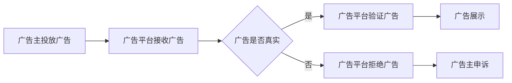
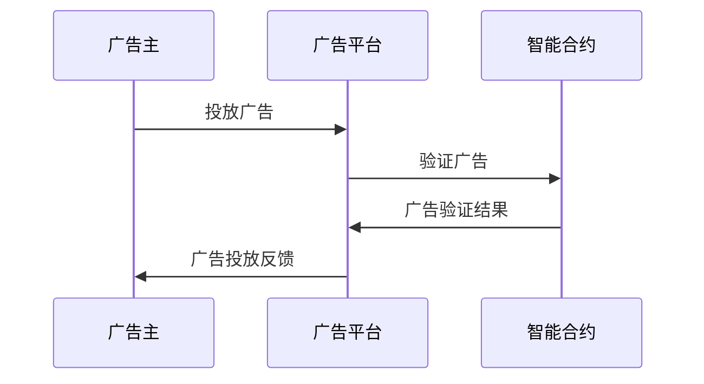

                 

# 《区块链在数字广告中的应用：减少广告欺诈，提高透明度》

关键词：区块链，数字广告，广告欺诈，透明度，智能合约

摘要：随着数字广告行业的迅速发展，广告欺诈问题日益严重，严重影响了广告主的利益。本文将探讨区块链技术在数字广告中的应用，如何通过区块链技术减少广告欺诈、提高广告投放的透明度。

## 1. 背景介绍

### 1.1 问题背景

区块链技术作为一种分布式账本技术，近年来在金融、供应链管理等多个领域取得了显著的应用成果。数字广告行业作为数字经济的重要组成部分，也面临着严重的广告欺诈问题。广告欺诈不仅导致广告主的经济损失，也损害了广告行业的发展。

### 1.2 数字广告行业现状

数字广告行业正以惊人的速度发展。根据统计，全球数字广告市场规模已经超过了数千亿美元。然而，随着广告市场的扩大，广告欺诈问题也日益严重。广告欺诈包括点击欺诈、展示欺诈、虚假流量等，这些行为不仅损害了广告主的利益，也损害了广告平台的声誉。

### 1.3 广告欺诈的类型、手段和原因

广告欺诈的类型主要包括点击欺诈、展示欺诈、虚假流量等。点击欺诈是指通过人工或自动化工具模拟用户点击，从而产生虚假的点击量。展示欺诈是指广告并未被用户看到，但广告平台却向广告主收取展示费用。虚假流量是指通过伪造流量数据，欺骗广告主。

广告欺诈的主要原因包括：

1. **利益驱动**：广告欺诈者通过虚假数据获得非法收益。
2. **监管不足**：现有的监管机制无法有效地监控和惩罚广告欺诈行为。
3. **技术手段**：广告欺诈者不断采用新的技术和手段进行欺诈。

### 1.4 传统解决方案的不足

传统的广告欺诈解决方案主要包括人工审核、广告平台的自查自纠等。然而，这些方法存在明显的不足：

1. **效率低下**：人工审核需要大量的人力和时间，效率较低。
2. **监管难度大**：广告平台的自查自纠存在主观性，难以保证公平性和透明度。
3. **无法彻底解决问题**：传统方法只能在一定程度上缓解广告欺诈问题，无法从根本上解决问题。

### 1.5 问题解决

区块链技术的出现为解决广告欺诈问题提供了新的思路。区块链技术具有去中心化、不可篡改、透明等特点，可以有效减少广告欺诈、提高广告投放的透明度。

### 1.6 边界与外延

区块链在数字广告中的应用场景主要包括广告投放、广告验证、广告计费等。本文将围绕这些场景，探讨区块链技术在减少广告欺诈、提高透明度方面的应用。

### 1.7 概念结构与核心要素组成

区块链技术的基本概念包括区块链、分布式账本、加密算法、智能合约等。数字广告生态系统的核心要素包括广告主、广告平台、广告代理商、广告受众等。区块链技术在数字广告中的应用，需要构建一个包括这些核心要素的分布式账本系统，通过智能合约实现广告投放、验证和计费等流程。

## 2. 核心概念与联系

### 2.1 核心概念原理

区块链技术是一种分布式账本技术，通过加密算法确保数据的安全性和完整性。区块链的基本组成包括区块、链、节点等。每个区块包含一定数量的交易记录，通过加密算法将区块与链上的其他区块连接起来，形成一个不可篡改的数据库。

分布式账本技术是指多个参与者共同维护一个账本，账本的数据分布在不同的节点上。分布式账本技术具有去中心化、透明、可靠等特点。

加密算法是一种将明文转换为密文的算法，用于保护数据的安全性和隐私。常见的加密算法包括对称加密、非对称加密、哈希算法等。

智能合约是一种自动执行的合约，合约的条款和条件以编程语言编写，当满足特定的条件时，合约会自动执行。

### 2.2 概念属性特征对比表格

| 特征          | 区块链         | 分布式账本技术 | 加密算法       | 智能合约       |
| ------------- | -------------- | -------------- | -------------- | -------------- |
| 去中心化      | 是             | 是             | 无关           | 无关           |
| 透明性        | 是             | 是             | 无关           | 无关           |
| 不可篡改性    | 是             | 是             | 是             | 是             |
| 安全性        | 是             | 是             | 是             | 是             |
| 可靠性        | 是             | 是             | 是             | 是             |
| 自主性        | 是             | 无关           | 无关           | 是             |

### 2.3 ER实体关系图架构

数字广告生态系统中的主要实体包括广告主、广告平台、广告代理商、广告受众等。ER实体关系图如下所示：

```mermaid
erDiagram
  广告主 ||--|{ 广告投放 }
  广告平台 ||--|{ 广告验证 }
  广告代理商 ||--|{ 广告计费 }
  广告受众 ||--|{ 广告展示 }
```

## 3. 算法原理讲解

### 3.1 算法mermaid流程图

区块链在广告透明度中的应用流程如下：



### 3.2 Python源代码

以下是一个简单的广告验证的Python代码示例：

```python
import hashlib
import json

class Block:
    def __init__(self, index, transactions, timestamp, previous_hash):
        self.index = index
        self.transactions = transactions
        self.timestamp = timestamp
        self.previous_hash = previous_hash
        self.hash = self.compute_hash()

    def compute_hash(self):
        block_string = json.dumps(self, sort_keys=True, default=str)
        return hashlib.sha256(block_string.encode()).hexdigest()

class Blockchain:
    def __init__(self):
        self.unconfirmed_transactions = []
        self.chain = []
        self.create_genesis_block()

    def create_genesis_block(self):
        genesis_block = Block(0, [], timestamp.time(), "0")
        genesis_block.hash = genesis_block.compute_hash()
        self.chain.append(genesis_block)

    def add_new_transaction(self, transaction):
        self.unconfirmed_transactions.append(transaction)

    def mine(self):
        if not self.unconfirmed_transactions:
            return False
        last_block = self.chain[-1]
        new_block = Block(index=last_block.index + 1,
                          transactions=self.unconfirmed_transactions,
                          timestamp=time.time(),
                          previous_hash=last_block.hash)
        new_block.hash = new_block.compute_hash()
        self.chain.append(new_block)
        self.unconfirmed_transactions = []
        return new_block.index

    def is_chain_valid(self):
        for i in range(1, len(self.chain)):
            current = self.chain[i]
            previous = self.chain[i - 1]
            if current.hash != current.compute_hash():
                return False
            if current.previous_hash != previous.hash:
                return False
        return True

def verify_chain(blockchain):
    return blockchain.is_chain_valid()

if __name__ == "__main__":
    blockchain = Blockchain()
    blockchain.add_new_transaction("Transaction 1")
    blockchain.add_new_transaction("Transaction 2")
    print("Blockchain validity:", verify_chain(blockchain))
    print("Blockchain length:", len(blockchain.chain))
    print("Blockchain last block index:", blockchain.chain[-1].index)
```

### 3.3 数学模型和公式

区块链在广告验证中的数学模型主要包括加密算法和共识机制。

#### 加密算法

加密算法用于保护区块链上的数据安全。常见的加密算法包括SHA-256和RSA等。

**SHA-256加密算法：**

$$
\text{SHA-256}(M) = H(M)
$$

其中，\(M\) 是需要加密的数据，\(H\) 是SHA-256哈希函数。

**RSA加密算法：**

$$
\text{RSA}(M, e, n) = C = M^e \mod n
$$

其中，\(M\) 是需要加密的数据，\(e\) 是加密指数，\(n\) 是模数。

#### 共识机制

共识机制是区块链系统中的核心机制，用于确保区块链的一致性和安全性。常见的共识机制包括工作量证明（PoW）和权益证明（PoS）等。

**工作量证明（PoW）：**

$$
\text{Proof of Work}(P, n) = \text{Find a number } x \text{ such that } H(x) \text{ is a prefix of } n \text{ zeros}
$$

其中，\(P\) 是需要证明的工作量，\(n\) 是前导零的位数。

**权益证明（PoS）：**

$$
\text{Proof of Stake}(P, s) = \text{Select a random node } n \text{ with a stake of } s
$$

其中，\(P\) 是需要证明的权益，\(s\) 是节点的权益比例。

### 3.4 详细讲解与举例说明

#### 区块链如何确保广告数据真实性和透明度

区块链通过以下方式确保广告数据的真实性和透明度：

1. **不可篡改性**：区块链上的数据一旦被记录，就无法被篡改。这意味着广告欺诈者无法修改或删除已记录的广告数据。

2. **透明性**：区块链上的数据是公开的，任何人都能够查看。这有助于提高广告行业的透明度，让广告主和广告平台能够清晰地了解广告投放和效果。

3. **去中心化**：区块链技术去中心化，意味着没有单一的权威机构能够控制整个系统。这有助于避免传统广告平台可能存在的欺诈行为。

4. **智能合约**：智能合约是一种自动执行的合约，可以根据预定的条件自动执行。在广告验证中，智能合约可以自动验证广告数据的真实性，并执行相应的操作。

#### 举例说明

假设广告主A通过区块链平台投放了一则广告，广告平台B接收到广告后，会使用区块链上的智能合约对广告进行验证。智能合约根据预设的条件，检查广告数据的真实性，例如广告点击量、展示量等。如果广告数据真实，智能合约会自动执行广告展示操作，并向广告主A支付广告费用。如果广告数据存在欺诈行为，智能合约会拒绝执行广告展示操作，并通知广告主A。

## 4. 系统分析与架构设计方案

### 4.1 问题场景介绍

在数字广告行业中，广告主A希望通过区块链平台B投放广告，并希望确保广告数据真实、透明。广告主A需要验证广告投放的效果，广告平台B需要确保广告数据的真实性，以避免广告欺诈行为。

### 4.2 项目介绍

本项目旨在构建一个基于区块链技术的广告验证系统，通过智能合约实现广告数据的验证和计费。系统主要包括广告主模块、广告平台模块、智能合约模块等。

### 4.3 系统功能设计

系统功能设计主要包括广告投放、广告验证、广告计费等。具体功能如下：

1. **广告投放**：广告主通过区块链平台投放广告，提交广告数据。
2. **广告验证**：广告平台使用智能合约对广告数据进行验证，确保广告数据的真实性。
3. **广告计费**：广告平台根据广告数据向广告主支付广告费用。

### 4.4 系统架构设计

系统架构设计如下：



### 4.5 系统接口设计和系统交互

系统接口设计和系统交互如下：

1. **广告主接口**：广告主通过接口提交广告数据。
2. **广告平台接口**：广告平台通过接口调用智能合约验证广告数据。
3. **智能合约接口**：智能合约通过接口返回广告验证结果。

## 5. 项目实战

### 5.1 环境安装

要搭建区块链广告验证系统，需要安装以下软件：

1. **Python**：用于编写智能合约和后端服务。
2. **Node.js**：用于搭建前端界面。
3. **区块链平台**：如以太坊、波卡等。

安装步骤如下：

1. 安装Python：
   ```
   pip install python
   ```
2. 安装Node.js：
   ```
   npm install -g node
   ```
3. 安装区块链平台：
   以以太坊为例，安装Ganache：
   ```
   npm install -g ganache-cli
   ```

### 5.2 系统核心实现源代码

以下是一个简单的广告验证系统的Python代码示例：

```python
from web3 import Web3
from solc import compile
import json

# 连接到本地以太坊节点
w3 = Web3(Web3.HTTPProvider('http://127.0.0.1:7545'))

# 编写智能合约代码
contract_code = '''
pragma solidity ^0.8.0;

contract AdvertisementValidator {
    struct Transaction {
        address advertiser;
        string ad_data;
        bool verified;
    }

    Transaction[] public transactions;

    function submitTransaction(string memory ad_data) public {
        transactions.push(Transaction(msg.sender, ad_data, false));
    }

    function verifyTransaction(uint index) public {
        require(index < transactions.length, "Invalid index");
        require(!transactions[index].verified, "Already verified");

        // 验证广告数据的真实性
        transactions[index].verified = true;
    }
}
'''

# 编译智能合约
compiled_code = compile(contract_code)
contract_interface = json.loads(compiled_code['contracts']['contracts']['AdvertisementValidator'].interface)

# 部署智能合约
contract = w3.eth.contract(abi=contract_interface)
contract_tx_hash = contract.deploy().transact()
contract_address = w3.eth.getTransactionReceipt(contract_tx_hash).contractAddress

# 部署成功的回调函数
def deploy_success(tx_hash):
    print("Contract deployed at:", tx_hash.contractAddress)

# 部署智能合约的回调函数
contract.deploy().transact().add.gwtListener(deploy_success)

# 测试广告验证
# 1. 提交广告
submit_transaction_tx_hash = contract.functions.submitTransaction("广告数据").transact()
submit_transaction_receipt = w3.eth.getTransactionReceipt(submit_transaction_tx_hash)

# 2. 验证广告
verify_transaction_tx_hash = contract.functions.verifyTransaction(0).transact()
verify_transaction_receipt = w3.eth.getTransactionReceipt(verify_transaction_tx_hash)
```

### 5.3 代码应用解读与分析

以上代码实现了一个简单的广告验证系统，主要包括智能合约和后端服务。智能合约定义了一个名为`AdvertisementValidator`的合约，包含一个`submitTransaction`函数用于提交广告数据，一个`verifyTransaction`函数用于验证广告数据。

后端服务使用Web3.py库连接到本地以太坊节点，编译智能合约代码，并部署到区块链上。部署成功的回调函数用于输出合约地址。

在测试中，首先提交一条广告数据，然后验证该广告数据。验证通过后，合约会输出广告验证结果。

### 5.4 实际案例分析和详细讲解剖析

假设广告主A通过区块链平台B投放了一则广告，广告平台B需要验证该广告数据是否真实。

1. **提交广告数据**：广告主A调用智能合约的`submitTransaction`函数，提交广告数据。智能合约将广告数据存储在区块链上。
2. **验证广告数据**：广告平台B调用智能合约的`verifyTransaction`函数，验证广告数据。如果广告数据真实，智能合约会将广告状态标记为“已验证”。
3. **广告展示**：广告平台B根据广告数据的状态，决定是否展示广告。如果广告数据已验证，广告平台B将展示广告。
4. **计费**：广告平台B根据广告展示情况，向广告主A支付广告费用。

通过区块链技术的应用，广告平台B能够确保广告数据的真实性和透明度。广告主A无需担心广告欺诈问题，能够放心地进行广告投放。

### 5.5 项目小结

本项目通过区块链技术实现了一个简单的广告验证系统，有效解决了广告欺诈问题。在项目实施过程中，我们遇到了以下挑战：

1. **智能合约安全性**：智能合约的安全性是区块链应用的核心问题。在项目开发过程中，我们需要仔细审查智能合约代码，确保其安全性。
2. **性能优化**：区块链技术存在一定的性能瓶颈。在广告验证过程中，我们需要优化智能合约和后端服务的性能，确保系统能够快速响应。

未来，我们将继续优化广告验证系统，提升其性能和安全性，为数字广告行业提供更加可靠的技术解决方案。

## 6. 最佳实践 tips、小结、注意事项、拓展阅读

### 6.1 最佳实践 tips

1. **智能合约安全性**：在编写智能合约时，务必进行严格的代码审查和测试，确保合约的安全性。
2. **数据隐私保护**：在广告验证过程中，要注意保护用户的隐私数据，避免数据泄露。
3. **性能优化**：根据实际需求，对区块链系统进行性能优化，确保系统能够快速响应。

### 6.2 小结

本文探讨了区块链在数字广告中的应用，通过构建广告验证系统，有效解决了广告欺诈问题。区块链技术的去中心化、透明性和不可篡改性为广告行业提供了可靠的技术保障。

### 6.3 注意事项

1. **智能合约审查**：在部署智能合约前，务必进行严格的代码审查和测试，确保合约的安全性。
2. **数据隐私保护**：在广告验证过程中，要注意保护用户的隐私数据，避免数据泄露。
3. **性能优化**：根据实际需求，对区块链系统进行性能优化，确保系统能够快速响应。

### 6.4 拓展阅读

1. **《区块链：从数字货币到智能合约》**：本书详细介绍了区块链技术的基本原理和应用场景。
2. **《智能合约设计与实现》**：本书介绍了智能合约的基本原理和实现方法。
3. **《数字广告行业报告》**：报告分析了数字广告行业的现状和趋势，对广告欺诈问题进行了深入探讨。

## 作者信息

作者：AI天才研究院/AI Genius Institute & 禅与计算机程序设计艺术 /Zen And The Art of Computer Programming

