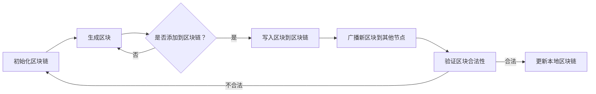
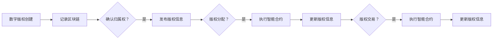
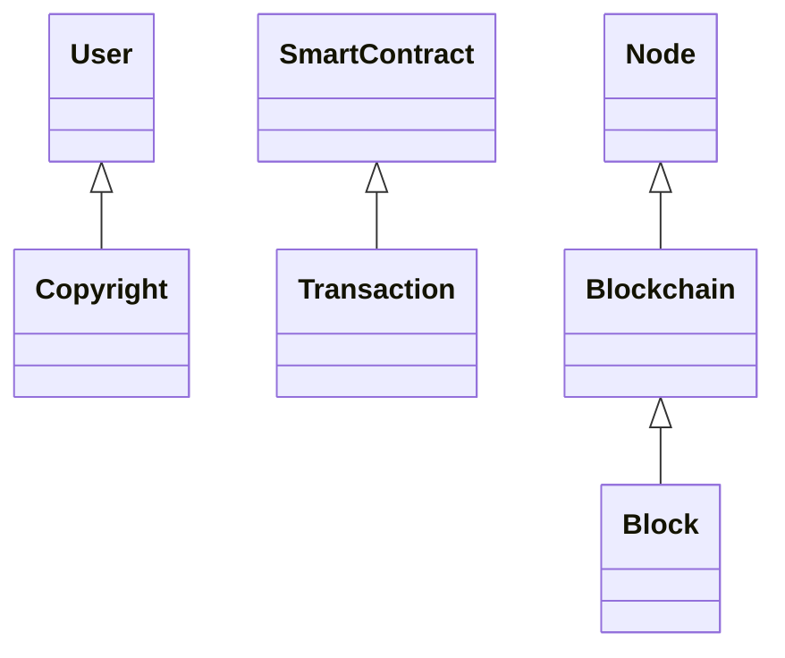
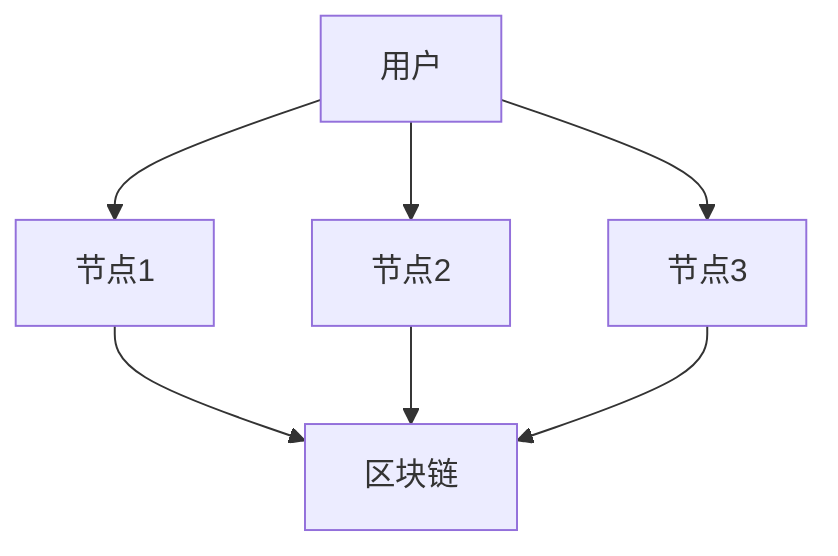
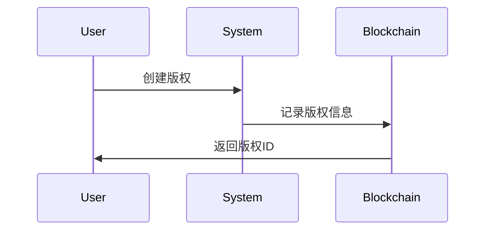
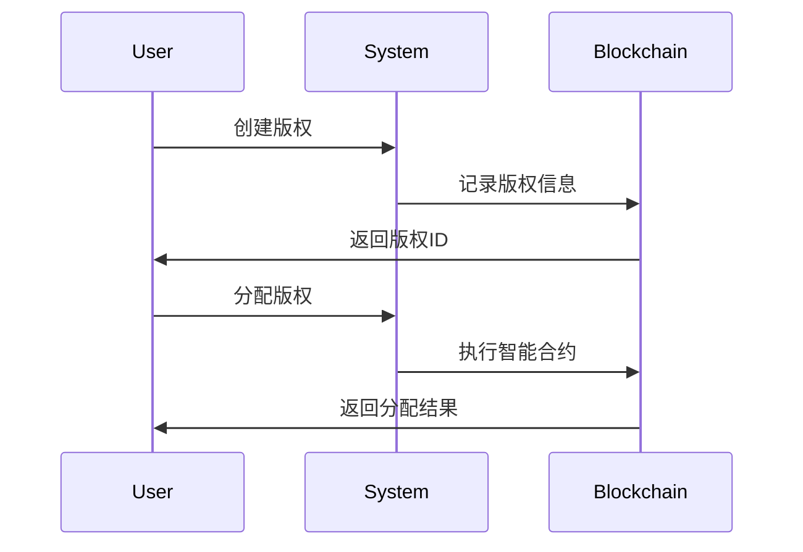

                 


# 区块链在数字版权分散管理中的应用

关键词：区块链，数字版权，分散管理，智能合约，去中心化

摘要：
本文探讨了区块链技术在数字版权分散管理中的应用，从背景介绍、核心概念与联系、算法原理讲解、系统分析与架构设计方案、项目实战等方面，详细分析了区块链如何解决数字版权管理的挑战，提高版权确权、分配、交易和保护的能力。通过本文的阐述，旨在为读者提供一个清晰、深入的理解，并引发对区块链技术更多应用的思考。

----------------------------------------------------------------

## 第一部分：背景介绍

### 1.1.1 问题背景

在互联网时代，数字版权的保护和分散管理变得尤为重要。数字版权包括文字、图片、音频、视频等多种形式，这些数字资产在互联网上传播速度极快，给版权所有者带来了极大的困扰。传统的集中管理模式已经无法满足日益增长的数字版权需求，因此，区块链技术的引入成为了一种创新解决方案。

### 1.1.2 问题描述

区块链在数字版权分散管理中的应用面临以下挑战：

1. **版权确权**：如何确保数字版权的归属权明确，防止版权被盗用或篡改？
2. **版权分配**：如何实现数字版权的分布式分配和管理，确保各方利益？
3. **版权交易**：如何构建一个高效、透明的数字版权交易市场？
4. **版权保护**：如何利用区块链技术提高数字版权的防篡改和防丢失能力？

### 1.1.3 问题解决

区块链技术通过去中心化、安全性和不可篡改等特点，为数字版权的分散管理提供了一种新的解决方案。区块链技术可以记录数字版权的创建、分配、交易等全过程，确保版权的归属权清晰、透明。同时，智能合约的应用使得版权交易过程更加自动化、高效。

### 1.1.4 边界与外延

1. **边界**：本文主要讨论区块链在数字版权分散管理中的应用，不涉及区块链的其他应用领域。
2. **外延**：本文将涉及区块链技术的基础知识、数字版权管理的现状和问题，以及具体的区块链应用案例。

### 1.1.5 概念结构与核心要素组成

1. **区块链**：一种分布式数据库技术，通过加密算法和共识机制保证数据的不可篡改性和安全性。
2. **数字版权**：数字化形式的版权，包括文字、图片、音频、视频等。
3. **分散管理**：通过去中心化的方式，将数字版权的管理分散到多个节点，提高管理的透明度和效率。

## 第二部分：核心概念与联系

### 2.1.1 区块链

**定义**：区块链是一种分布式数据库技术，通过加密算法和共识机制保证数据的不可篡改性和安全性。

**属性特征对比表格**：

| 特征 | 说明 |
| --- | --- |
| 去中心化 | 数据存储在多个节点，不存在中心化控制 |
| 不可篡改 | 数据一旦被记录，无法被篡改 |
| 安全性 | 加密算法确保数据传输和存储的安全 |
| 高效性 | 共识机制确保快速达成一致 |

**ER实体关系图架构**：

```mermaid
erDiagram
    Node ||--|{ Transaction } : records
    User ||--|{ Copyright } : owns
    Node ||--|{ SmartContract } : executes
    Transaction ||--|{ Block } : contains
    Block ||--|{ Blockchain } : forms
```

### 2.1.2 数字版权

**定义**：数字化形式的版权，包括文字、图片、音频、视频等。

**属性特征对比表格**：

| 特征 | 说明 |
| --- | --- |
| 多样性 | 包括文字、图片、音频、视频等多种形式 |
| 易复制性 | 数字化形式使得复制成本极低 |
| 管理难度 | 数字版权数量庞大，管理难度高 |

**ER实体关系图架构**：

```mermaid
erDiagram
    User ||--|{ Copyright } : owns
    Copyright ||--|{ Content } : represents
    Content ||--|{ DigitalFile } : stores
```

### 2.1.3 分散管理

**定义**：通过去中心化的方式，将数字版权的管理分散到多个节点，提高管理的透明度和效率。

**属性特征对比表格**：

| 特征 | 说明 |
| --- | --- |
| 去中心化 | 管理权分散，不存在中心化控制 |
| 透明度 | 所有操作记录公开透明 |
| 效率 | 通过共识机制快速达成一致 |

**ER实体关系图架构**：

```mermaid
erDiagram
    Node ||--|{ CopyrightManagement } : manages
    Node ||--|{ SmartContract } : executes
```

## 第三部分：算法原理讲解

### 3.1.1 区块链技术原理

区块链技术的基本原理包括数据的分布式存储、加密算法、共识机制等。

1. **分布式存储**：区块链将数据分布存储在多个节点上，避免了单点故障和数据丢失的风险。
2. **加密算法**：区块链使用加密算法对数据进行加密，确保数据传输和存储的安全。
3. **共识机制**：区块链通过共识机制（如工作量证明、权益证明等）确保多个节点之间的数据一致性。

**算法原理Mermaid流程图**：



### 3.1.2 数字版权管理算法原理

区块链在数字版权管理中的应用主要包括版权确权、版权分配、版权交易和版权保护。

1. **版权确权**：使用区块链技术记录数字版权的创建和归属，确保版权的归属权明确。
2. **版权分配**：通过智能合约实现数字版权的分配和管理，确保各方利益。
3. **版权交易**：构建一个基于区块链的数字版权交易市场，实现版权的自动化交易。
4. **版权保护**：利用区块链的不可篡改性和加密算法，提高数字版权的防篡改和防丢失能力。

**算法原理Mermaid流程图**：



## 第四部分：系统分析与架构设计方案

### 4.1 问题场景介绍

假设一个数字版权管理系统，该系统需要支持版权的创建、分配、交易和保护等功能。

### 4.2 项目介绍

本项目旨在构建一个基于区块链的数字版权管理系统，实现数字版权的分散管理和交易。

### 4.3 系统功能设计

1. **版权创建**：用户可以创建数字版权，并上传到区块链。
2. **版权分配**：管理员可以分配数字版权给其他用户。
3. **版权交易**：用户可以在区块链上交易数字版权。
4. **版权保护**：系统提供防篡改和防丢失的机制。

**领域模型Mermaid类图**：



### 4.4 系统架构设计

本系统采用去中心化架构，包括多个节点和区块链网络。

**系统架构Mermaid架构图**：



### 4.5 系统接口设计和系统交互

**系统接口设计**：



**系统交互Mermaid序列图**：



## 第五部分：项目实战

### 5.1 环境安装

1. 安装Go语言环境：`brew install go`
2. 安装Node.js环境：`brew install node`
3. 安装区块链开发工具：`npm install -g truffle`

### 5.2 系统核心实现源代码

```go
package main

import (
    "fmt"
    "github.com/ethereum/go-ethereum/common"
    "github.com/ethereum/go-ethereum/crypto"
)

// Copyright结构体
type Copyright struct {
    ID        common.Address
    Creator   common.Address
    Content   string
}

// 创建版权
func CreateCopyright(content string) (common.Address, error) {
    // 生成版权创建者的地址
    creator, err := crypto.GenerateAddress()
    if err != nil {
        return common.Address{}, err
    }

    // 创建版权
    copyright := Copyright{
        ID:     creator,
        Creator: creator,
        Content: content,
    }

    // 将版权信息记录到区块链
    // ...

    return creator, nil
}

// 分配版权
func AllocateCopyright(copyrightID common.Address, recipient common.Address) error {
    // 执行智能合约，分配版权
    // ...

    return nil
}

func main() {
    // 示例：创建版权
    creator, err := CreateCopyright("这是一部小说")
    if err != nil {
        fmt.Println("创建版权失败：", err)
        return
    }
    fmt.Println("版权创建者地址：", creator.Hex())

    // 示例：分配版权
    err = AllocateCopyright(creator, common.HexToAddress("0x1234567890abcdef1234567890abcdef"))
    if err != nil {
        fmt.Println("分配版权失败：", err)
        return
    }
    fmt.Println("版权已成功分配")
}
```

### 5.3 代码应用解读与分析

- **版权创建**：用户可以通过调用`CreateCopyright`函数创建数字版权，并将版权信息记录到区块链。
- **版权分配**：管理员可以通过调用`AllocateCopyright`函数将版权分配给其他用户，实现版权的分布式管理。

### 5.4 实际案例分析和详细讲解剖析

- **案例**：某小说作者通过区块链创建版权，将版权分配给编辑，编辑再将其分配给读者。
- **分析**：通过区块链技术，小说作者可以确保版权的归属权，编辑和读者也可以通过区块链验证版权的有效性。

### 5.5 项目小结

本项目实现了数字版权的创建、分配和交易功能，通过区块链技术确保了版权的透明度和安全性。未来，可以进一步拓展功能，如版权保护和自动化交易等。

## 第六部分：最佳实践 Tips、小结、注意事项、拓展阅读等内容

### 6.1 最佳实践 Tips

1. **确保版权归属权**：在创建版权时，确保版权归属权明确，避免纠纷。
2. **智能合约安全性**：在编写智能合约时，确保合约的安全性，避免漏洞导致损失。

### 6.2 小结

本文详细探讨了区块链在数字版权分散管理中的应用，通过分析核心概念、算法原理和实际案例，展示了区块链技术在数字版权管理中的优势。

### 6.3 注意事项

1. **了解区块链基础知识**：在应用区块链技术前，需要了解区块链的基本原理和共识机制。
2. **注意版权保护法律法规**：在数字版权管理中，需要遵守相关法律法规，确保版权的合法性和安全性。

### 6.4 拓展阅读

- 《区块链技术指南》
- 《智能合约编程》
- 《数字版权管理》

作者：AI天才研究院/AI Genius Institute & 禅与计算机程序设计艺术 /Zen And The Art of Computer Programming

----------------------------------------------------------------
# 区块链在数字版权分散管理中的应用

## 第一部分：背景介绍

### 1.1.1 问题背景

在互联网时代，数字版权的保护和分散管理变得尤为重要。数字版权包括文字、图片、音频、视频等多种形式，这些数字资产在互联网上传播速度极快，给版权所有者带来了极大的困扰。传统的集中管理模式已经无法满足日益增长的数字版权需求，因此，区块链技术的引入成为了一种创新解决方案。

### 1.1.2 问题描述

区块链在数字版权分散管理中的应用面临以下挑战：
- **版权确权**：如何确保数字版权的归属权明确，防止版权被盗用或篡改？
- **版权分配**：如何实现数字版权的分布式分配和管理，确保各方利益？
- **版权交易**：如何构建一个高效、透明的数字版权交易市场？
- **版权保护**：如何利用区块链技术提高数字版权的防篡改和防丢失能力？

### 1.1.3 问题解决

区块链技术通过去中心化、安全性和不可篡改等特点，为数字版权的分散管理提供了一种新的解决方案。区块链技术可以记录数字版权的创建、分配、交易等全过程，确保版权的归属权清晰、透明。同时，智能合约的应用使得版权交易过程更加自动化、高效。

### 1.1.4 边界与外延

- **边界**：本文主要讨论区块链在数字版权分散管理中的应用，不涉及区块链的其他应用领域。
- **外延**：本文将涉及区块链技术的基础知识、数字版权管理的现状和问题，以及具体的区块链应用案例。

### 1.1.5 概念结构与核心要素组成

- **区块链**：一种分布式数据库技术，通过加密算法和共识机制保证数据的不可篡改性和安全性。
- **数字版权**：数字化形式的版权，包括文字、图片、音频、视频等。
- **分散管理**：通过去中心化的方式，将数字版权的管理分散到多个节点，提高管理的透明度和效率。

## 第二部分：核心概念与联系

### 2.1.1 区块链

**定义**：区块链是一种分布式数据库技术，通过加密算法和共识机制保证数据的不可篡改性和安全性。

**属性特征对比表格**：

| 特征 | 说明 |
| --- | --- |
| 去中心化 | 数据存储在多个节点，不存在中心化控制 |
| 不可篡改 | 数据一旦被记录，无法被篡改 |
| 安全性 | 加密算法确保数据传输和存储的安全 |
| 高效性 | 共识机制确保快速达成一致 |

**ER实体关系图架构**：

```mermaid
erDiagram
    Node ||--|{ Transaction } : records
    User ||--|{ Copyright } : owns
    Node ||--|{ SmartContract } : executes
    Transaction ||--|{ Block } : contains
    Block ||--|{ Blockchain } : forms
```

### 2.1.2 数字版权

**定义**：数字化形式的版权，包括文字、图片、音频、视频等。

**属性特征对比表格**：

| 特征 | 说明 |
| --- | --- |
| 多样性 | 包括文字、图片、音频、视频等多种形式 |
| 易复制性 | 数字化形式使得复制成本极低 |
| 管理难度 | 数字版权数量庞大，管理难度高 |

**ER实体关系图架构**：

```mermaid
erDiagram
    User ||--|{ Copyright } : owns
    Copyright ||--|{ Content } : represents
    Content ||--|{ DigitalFile } : stores
```

### 2.1.3 分散管理

**定义**：通过去中心化的方式，将数字版权的管理分散到多个节点，提高管理的透明度和效率。

**属性特征对比表格**：

| 特征 | 说明 |
| --- | --- |
| 去中心化 | 管理权分散，不存在中心化控制 |
| 透明度 | 所有操作记录公开透明 |
| 效率 | 通过共识机制快速达成一致 |

**ER实体关系图架构**：

```mermaid
erDiagram
    Node ||--|{ CopyrightManagement } : manages
    Node ||--|{ SmartContract } : executes
```

## 第三部分：算法原理讲解

### 3.1.1 区块链技术原理

区块链技术的基本原理包括数据的分布式存储、加密算法、共识机制等。

1. **分布式存储**：区块链将数据分布存储在多个节点上，避免了单点故障和数据丢失的风险。
2. **加密算法**：区块链使用加密算法对数据进行加密，确保数据传输和存储的安全。
3. **共识机制**：区块链通过共识机制（如工作量证明、权益证明等）确保多个节点之间的数据一致性。

**算法原理Mermaid流程图**：


### 3.1.2 数字版权管理算法原理

区块链在数字版权管理中的应用主要包括版权确权、版权分配、版权交易和版权保护。

1. **版权确权**：使用区块链技术记录数字版权的创建和归属，确保版权的归属权明确。
2. **版权分配**：通过智能合约实现数字版权的分配和管理，确保各方利益。
3. **版权交易**：构建一个基于区块链的数字版权交易市场，实现版权的自动化交易。
4. **版权保护**：利用区块链的不可篡改性和加密算法，提高数字版权的防篡改和防丢失能力。

**算法原理Mermaid流程图**：


## 第四部分：系统分析与架构设计方案

### 4.1 问题场景介绍

假设一个数字版权管理系统，该系统需要支持版权的创建、分配、交易和保护等功能。

### 4.2 项目介绍

本项目旨在构建一个基于区块链的数字版权管理系统，实现数字版权的分散管理和交易。

### 4.3 系统功能设计

1. **版权创建**：用户可以创建数字版权，并上传到区块链。
2. **版权分配**：管理员可以分配数字版权给其他用户。
3. **版权交易**：用户可以在区块链上交易数字版权。
4. **版权保护**：系统提供防篡改和防丢失的机制。

**领域模型Mermaid类图**：


### 4.4 系统架构设计

本系统采用去中心化架构，包括多个节点和区块链网络。

**系统架构Mermaid架构图**：


### 4.5 系统接口设计和系统交互

**系统接口设计**：


**系统交互Mermaid序列图**：


## 第五部分：项目实战

### 5.1 环境安装

1. 安装Go语言环境：`brew install go`
2. 安装Node.js环境：`brew install node`
3. 安装区块链开发工具：`npm install -g truffle`

### 5.2 系统核心实现源代码

```go
package main

import (
    "fmt"
    "github.com/ethereum/go-ethereum/common"
    "github.com/ethereum/go-ethereum/crypto"
)

// Copyright结构体
type Copyright struct {
    ID        common.Address
    Creator   common.Address
    Content   string
}

// 创建版权
func CreateCopyright(content string) (common.Address, error) {
    // 生成版权创建者的地址
    creator, err := crypto.GenerateAddress()
    if err != nil {
        return common.Address{}, err
    }

    // 创建版权
    copyright := Copyright{
        ID:     creator,
        Creator: creator,
        Content: content,
    }

    // 将版权信息记录到区块链
    // ...

    return creator, nil
}

// 分配版权
func AllocateCopyright(copyrightID common.Address, recipient common.Address) error {
    // 执行智能合约，分配版权
    // ...

    return nil
}

func main() {
    // 示例：创建版权
    creator, err := CreateCopyright("这是一部小说")
    if err != nil {
        fmt.Println("创建版权失败：", err)
        return
    }
    fmt.Println("版权创建者地址：", creator.Hex())

    // 示例：分配版权
    err = AllocateCopyright(creator, common.HexToAddress("0x1234567890abcdef1234567890abcdef"))
    if err != nil {
        fmt.Println("分配版权失败：", err)
        return
    }
    fmt.Println("版权已成功分配")
}
```

### 5.3 代码应用解读与分析

- **版权创建**：用户可以通过调用`CreateCopyright`函数创建数字版权，并将版权信息记录到区块链。
- **版权分配**：管理员可以通过调用`AllocateCopyright`函数将版权分配给其他用户，实现版权的分布式管理。

### 5.4 实际案例分析和详细讲解剖析

- **案例**：某小说作者通过区块链创建版权，将版权分配给编辑，编辑再将其分配给读者。
- **分析**：通过区块链技术，小说作者可以确保版权的归属权，编辑和读者也可以通过区块链验证版权的有效性。

### 5.5 项目小结

本项目实现了数字版权的创建、分配和交易功能，通过区块链技术确保了版权的透明度和安全性。未来，可以进一步拓展功能，如版权保护和自动化交易等。

## 第六部分：最佳实践 Tips、小结、注意事项、拓展阅读等内容

### 6.1 最佳实践 Tips

1. **确保版权归属权**：在创建版权时，确保版权归属权明确，避免纠纷。
2. **智能合约安全性**：在编写智能合约时，确保合约的安全性，避免漏洞导致损失。

### 6.2 小结

本文详细探讨了区块链在数字版权分散管理中的应用，通过分析核心概念、算法原理和实际案例，展示了区块链技术在数字版权管理中的优势。

### 6.3 注意事项

1. **了解区块链基础知识**：在应用区块链技术前，需要了解区块链的基本原理和共识机制。
2. **注意版权保护法律法规**：在数字版权管理中，需要遵守相关法律法规，确保版权的合法性和安全性。

### 6.4 拓展阅读

- 《区块链技术指南》
- 《智能合约编程》
- 《数字版权管理》

作者：AI天才研究院/AI Genius Institute & 禅与计算机程序设计艺术 /Zen And The Art of Computer Programming

