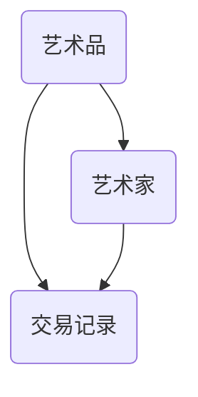

                 

### 引言

在数字时代，数字艺术品已经成为艺术界的一个重要组成部分。然而，随着数字技术的普及，数字艺术品面临着一系列挑战，如伪造、剽窃和版权纠纷等。为了解决这些问题，我们需要一种安全可靠的技术手段来确保数字艺术品的真实性和合法性。区块链技术作为一种革命性的分布式账本技术，其在数字艺术品溯源中的应用变得尤为重要。

区块链技术以其去中心化、不可篡改和安全透明的特性，为数字艺术品溯源提供了强有力的支持。本文将围绕区块链在数字艺术品溯源中的应用展开讨论。我们将首先介绍区块链技术的基本概念，包括其核心组成部分、工作机制和主要特性。随后，我们将详细探讨区块链在数字艺术品溯源中的具体应用，包括溯源流程、智能合约的作用以及去中心化存储的优势。此外，我们还将对比区块链技术与数字艺术品的属性特征，并利用ER实体关系图来展示其关系结构。通过这些分析，我们将深入理解区块链技术在数字艺术品溯源中的作用和优势。

**关键词**：区块链，数字艺术品，溯源，智能合约，去中心化存储，安全透明

**摘要**：本文旨在探讨区块链技术如何应用于数字艺术品溯源，解决数字艺术品领域面临的挑战。我们将详细分析区块链的基本原理、其在溯源中的应用场景，以及与传统艺术品溯源方式的对比。通过实例和对比表格，我们希望能够让读者更加清晰地理解区块链在数字艺术品溯源中的重要作用和优势。

## 第一部分：背景与概述

### 第1章：问题背景与区块链技术概述

#### 1.1 问题背景

数字艺术品的快速发展，给艺术界带来了前所未有的活力和创新。然而，随着数字技术的普及，数字艺术品也面临着一系列严峻的挑战。其中，伪造和剽窃问题是数字艺术品领域最为突出的两大难题。

**伪造问题**：数字艺术品可以通过简单的复制和修改来制造，这使得伪造艺术品变得容易。一旦伪造艺术品进入市场，就会对原创艺术家的声誉和利益造成严重影响。此外，伪造艺术品还可能导致消费者对艺术品市场的信任度下降，从而影响整个市场的健康发展。

**剽窃问题**：在数字时代，艺术品创作者的作品容易被未经授权的第三方复制和传播。这不仅侵犯了艺术家的版权，还可能导致艺术作品的原创性和独特性受到质疑。剽窃行为不仅损害了艺术家的利益，也影响了艺术市场的秩序和公平性。

为了解决这些问题，我们需要一种安全可靠的技术手段来确保数字艺术品的真实性和合法性。这也就是为什么区块链技术开始被广泛关注和应用的原因。

#### 1.2 区块链技术的核心概念

区块链技术是一种分布式数据库技术，它通过加密算法和数据结构来确保数据的安全和可靠。下面是区块链技术的一些核心概念：

**区块链的组成**：

- **区块**：区块链的基本单位，包含了一系列交易记录。
- **链**：连接多个区块的数据结构，保证了数据的连续性和完整性。
- **共识算法**：一种机制，用于验证和确认交易，确保区块链的运行安全和效率。

**区块链的工作机制**：

- **交易**：用户在区块链上进行交易，每个交易都会生成一个区块。
- **验证**：通过共识算法，其他用户验证交易的有效性和真实性。
- **记录**：一旦交易被验证，就会被记录在区块链上，成为永久记录。

**区块链的主要特性**：

- **去中心化**：区块链技术不依赖于中心化的机构或服务器，数据分布在全球各个节点上，提高了系统的安全性和可靠性。
- **不可篡改**：区块链上的数据一旦被记录，就无法被篡改，保证了数据的真实性和可靠性。
- **安全透明**：区块链上的交易记录公开透明，任何人都可以查看和验证。

通过这些核心概念和特性，我们可以看到区块链技术为解决数字艺术品溯源问题提供了强有力的支持。

#### 1.3 区块链在溯源中的应用

区块链技术在数字艺术品溯源中的应用主要体现在以下几个方面：

**去中心化特性**：区块链的去中心化特性可以确保艺术品交易过程的安全性和透明性，避免了中心化机构的信任问题。每个交易记录都会被多个节点验证和记录，从而提高了数据的安全性和可靠性。

**不可篡改性**：区块链上的数据一旦被记录，就无法被篡改。这确保了数字艺术品的真实性和合法性，防止了伪造和剽窃行为。

**智能合约的应用**：智能合约是一种自动执行合约条款的计算机程序，它可以确保艺术品交易过程的高效性和透明性。智能合约可以自动执行交易，确保艺术家的权益得到保护。

通过这些应用，我们可以看到区块链技术在数字艺术品溯源中的重要作用。它不仅解决了数字艺术品面临的伪造和剽窃问题，还提高了艺术品交易的安全性和透明度，为数字艺术市场的发展提供了有力支持。

#### 1.4 本章小结

本章首先介绍了数字艺术品溯源中面临的问题背景，包括伪造和剽窃等挑战。接着，我们详细阐述了区块链技术的核心概念和工作机制，包括区块链的组成、共识算法和主要特性。最后，我们讨论了区块链在数字艺术品溯源中的应用，包括去中心化特性、不可篡改性和智能合约的应用。通过本章的学习，我们可以初步了解区块链技术在数字艺术品溯源中的重要性和潜力。

## 第二部分：区块链在数字艺术品溯源中的应用

### 第2章：区块链技术在数字艺术品溯源中的角色与作用

区块链技术在数字艺术品溯源中扮演着至关重要的角色。其核心作用体现在确保艺术品信息的真实性和完整性，防止伪造和剽窃，以及提高交易过程的透明度和效率。在本章中，我们将详细探讨区块链技术在数字艺术品溯源中的具体应用。

#### 2.1 区块链技术在艺术品溯源中的作用

区块链技术为数字艺术品溯源提供了以下几个关键作用：

**溯源流程**：

数字艺术品的生产和交易过程可以被完整记录在区块链上。艺术家在创作艺术品时，可以将艺术品的元数据（如作者信息、创作时间、作品描述等）上传到区块链上。这些信息会被永久记录，并可以随时查看和验证。在艺术品交易时，买家可以通过区块链验证艺术品的真实性和历史交易记录。

**信息验证**：

区块链上的数据具有不可篡改性，这意味着一旦信息被记录，就无法被修改或删除。这确保了艺术品信息的真实性和完整性。买家可以通过查看区块链上的记录来验证艺术品的来源和交易历史，确保购买的数字艺术品是真实的。

**透明性**：

区块链上的交易记录是公开透明的，任何人都可以查看。这提高了艺术品交易过程的透明度，减少了交易中的欺诈行为。买家可以清晰地了解艺术品的交易历史，确保交易的公平性和合法性。

#### 2.2 智能合约在艺术品溯源中的应用

智能合约是区块链技术中的一个重要组成部分，它在数字艺术品溯源中发挥着重要作用。智能合约是一种自动执行合约条款的计算机程序，它可以确保艺术品交易的高效性和透明性。

**智能合约的基本概念**：

智能合约通过编程代码定义了合约条款和条件，一旦触发条件，合约就会自动执行。智能合约使得交易过程变得更加简单和高效，避免了人工干预和中介环节。

**智能合约在艺术品溯源中的应用**：

**交易自动化**：

智能合约可以自动化执行艺术品交易，确保交易过程的高效性和透明性。买家只需触发合约条件，合同条款就会自动执行，交易过程无需人工干预。

**权益保护**：

智能合约可以确保艺术家的权益得到保护。例如，艺术家可以在智能合约中设置收益分成比例，确保在艺术品出售后，艺术家可以及时获得相应的收益。

**透明性增强**：

智能合约的执行过程是公开透明的，所有参与者都可以查看和验证。这增强了交易过程的透明度，减少了交易中的欺诈行为。

#### 2.3 去中心化存储在艺术品信息保存中的作用

去中心化存储是区块链技术的一个重要组成部分，它在数字艺术品信息的保存和管理中发挥着关键作用。

**去中心化存储的基本概念**：

去中心化存储是指数据分散存储在多个节点上，而不是集中存储在一个中心化的服务器上。每个节点都存储了数据的副本，提高了数据的可靠性和安全性。

**去中心化存储在艺术品信息保存中的应用**：

**数据安全**：

去中心化存储确保了艺术品信息的存储安全。由于数据分散存储在多个节点上，即使某个节点遭到攻击或损坏，数据仍然可以被其他节点保存，从而保证了数据的安全性和完整性。

**数据不可篡改**：

去中心化存储的数据一旦被记录，就无法被篡改。这意味着艺术品信息的真实性和完整性得到了保障，防止了伪造和篡改行为。

**高效性**：

去中心化存储通过分布式网络实现了数据的快速访问和传输，提高了数据的管理效率。买家可以随时随地访问艺术品信息，无需担心数据丢失或延迟问题。

#### 2.4 本章小结

本章详细探讨了区块链技术在数字艺术品溯源中的角色与作用。首先，我们介绍了区块链技术在艺术品溯源中的作用，包括溯源流程、信息验证和透明性。接着，我们讨论了智能合约在艺术品溯源中的应用，包括交易自动化、权益保护和透明性增强。最后，我们阐述了去中心化存储在艺术品信息保存中的作用，包括数据安全、数据不可篡改和高效率。通过本章的学习，我们可以深入理解区块链技术在数字艺术品溯源中的重要性和应用价值。

### 第3章：区块链在数字艺术品溯源中的核心概念与联系

#### 3.1 核心概念

区块链技术在数字艺术品溯源中的应用涉及多个核心概念。以下是这些概念的定义和说明：

**区块链技术**：

区块链技术是一种分布式数据库技术，通过加密算法和数据结构确保数据的安全性和可靠性。区块链的基本组成包括区块和链，区块包含交易记录，链连接多个区块，形成了一个不可篡改的数据结构。区块链通过共识算法验证和确认交易，确保数据的真实性和完整性。

**数字艺术品**：

数字艺术品是指通过数字技术创作的艺术品，可以是数字绘画、数字雕塑、数字音乐等形式。数字艺术品具有可复制性强、易于传播的特点，同时也面临着伪造和剽窃等风险。

**智能合约**：

智能合约是一种自动执行合约条款的计算机程序，它通过区块链上的智能合约平台运行。智能合约可以定义和执行艺术品交易的规则和条款，确保交易的高效性和透明性。

**去中心化存储**：

去中心化存储是指数据分散存储在多个节点上，而不是集中存储在一个中心化的服务器上。去中心化存储通过分布式网络提高了数据的可靠性和安全性，确保艺术品信息的持久保存。

#### 3.2 概念属性特征对比表格

为了更清晰地展示区块链技术与数字艺术品属性特征的差异和联系，我们制作了以下对比表格：

| 特征           | 区块链技术                          | 数字艺术品                          |
| -------------- | --------------------------------- | --------------------------------- |
| 数据存储方式    | 分布式账本技术，数据多点备份       | 去中心化存储，易于复制和传播       |
| 数据安全       | 不可篡改，数据永久记录             | 加密技术，确保版权保护             |
| 透明性         | 交易记录公开透明，任何人可查看     | 交易记录透明，买家可验证艺术品真实性 |
| 版权保护       | 智能合约应用，自动执行版权条款     | 数字签名技术，确保艺术品原创性     |
| 交易效率       | 去中心化特性，减少中介环节         | 交易过程可能复杂，需要额外验证步骤 |

通过这个对比表格，我们可以看到区块链技术与数字艺术品在数据存储、数据安全、透明性和版权保护等方面存在显著差异，同时也存在着紧密的联系。

#### 3.3 ER实体关系图

为了更好地理解区块链技术与数字艺术品之间的关联，我们使用ER（实体关系）图来展示这些概念之间的关系。以下是区块链在数字艺术品溯源中的ER实体关系图：

在这个ER实体关系图中：

- **艺术品（A）**：数字艺术品的实体，包含作品的元数据和属性。
- **艺术家（B）**：创作数字艺术品的艺术家实体，与艺术品存在关联。
- **交易记录（C）**：记录艺术品交易历史的实体，包括购买者、交易时间和价格等信息。

通过这个ER实体关系图，我们可以清晰地看到区块链技术在数字艺术品溯源中的核心概念及其相互之间的联系。

#### 3.4 本章小结

本章详细介绍了区块链在数字艺术品溯源中的核心概念和联系。首先，我们定义了区块链技术、数字艺术品、智能合约和去中心化存储等核心概念。接着，通过对比表格展示了区块链技术与数字艺术品的属性特征差异和联系。最后，我们使用ER实体关系图展示了区块链技术与数字艺术品之间的实体关系。通过这些内容，我们深入理解了区块链在数字艺术品溯源中的应用和重要性。

## 第三部分：区块链在数字艺术品溯源中的实际应用

### 第4章：区块链在数字艺术品溯源中的实际应用案例

为了更好地理解区块链技术在数字艺术品溯源中的实际应用，我们将分析一些成功的案例，并探讨它们在解决数字艺术品溯源问题方面的具体实施过程和技术细节。

#### 4.1.1 案例背景

全球知名艺术家Beeple（Mike Winkelmann）的数字艺术品《Everydays: The First 5000 Days》在2021年以6900万美元的价格在佳士得拍卖行售出，这一交易震惊了艺术界。为了确保这一数字艺术品的真实性和合法性，Beeple决定采用区块链技术进行溯源。

#### 4.1.2 实施过程

**艺术品信息上链**：

在作品创作完成后，Beeple将数字艺术品的元数据（包括创作时间、艺术家信息、作品描述等）上传到一个区块链平台。这个平台采用以太坊区块链，利用智能合约技术确保数据的安全性和不可篡改性。

**交易记录上链**：

当《Everydays: The First 5000 Days》在佳士得拍卖行售出时，交易记录也被实时记录在区块链上。买家可以通过区块链查看交易的完整历史，确保艺术品的合法性。

**溯源验证**：

买家在购买艺术品后，可以通过区块链平台验证艺术品的来源和交易记录。区块链上的数据具有不可篡改性，买家可以确保他们购买的艺术品是真实的。

#### 4.1.3 技术细节

**区块链平台选择**：

Beeple选择了以太坊区块链平台，因为以太坊支持智能合约，可以自动执行交易条款。以太坊的去中心化特性和高安全性，确保了数据的安全和交易的透明性。

**智能合约应用**：

在拍卖过程中，智能合约用于自动执行交易条款。一旦买家支付了购买金额，智能合约会自动将艺术品的所有权转移到买家名下，并记录在区块链上。

**数据存储**：

艺术品信息和交易记录被存储在区块链上，通过分布式网络进行备份。即使某个节点出现故障，数据仍然可以被其他节点保存，确保数据的完整性和可靠性。

#### 4.2.1 案例背景

OpenSea是一家数字艺术品交易平台，提供NFT（非同质化代币）交易服务。为了解决数字艺术品溯源和版权问题，OpenSea在平台上引入了区块链技术。

#### 4.2.2 实施过程

**艺术品信息上链**：

艺术家在OpenSea平台上创建NFT时，需要将艺术品的元数据（包括创作时间、艺术家信息、作品描述等）上传到区块链。OpenSea使用以太坊区块链作为底层技术，确保数据的不可篡改性和安全性。

**交易记录上链**：

当艺术品在OpenSea平台上进行交易时，交易记录会被实时记录在区块链上。买家可以通过区块链查看交易的完整历史，确保艺术品的合法性和真实性。

**溯源验证**：

买家在购买NFT后，可以通过区块链平台验证NFT的来源和交易记录。区块链上的数据具有不可篡改性，买家可以确保他们购买的NFT是真实的。

#### 4.2.3 技术细节

**区块链平台选择**：

OpenSea选择了以太坊区块链平台，因为以太坊支持智能合约，可以自动执行交易条款。以太坊的去中心化特性和高安全性，确保了数据的安全和交易的透明性。

**智能合约应用**：

OpenSea使用智能合约来确保NFT交易的高效性和透明性。智能合约在交易过程中自动执行，确保艺术品的所有权在支付完成后转移到买家名下。

**数据存储**：

艺术品信息和交易记录被存储在区块链上，通过分布式网络进行备份。即使某个节点出现故障，数据仍然可以被其他节点保存，确保数据的完整性和可靠性。

### 第5章：区块链在数字艺术品溯源中的应用前景与挑战

#### 5.1 应用前景

区块链技术在数字艺术品溯源中的应用前景广阔。以下是一些可能的应用前景：

**提高艺术品市场透明度**：通过区块链技术，艺术品交易记录可以被公开透明地记录和验证，提高了市场的透明度和可信度。

**打击伪造与剽窃**：区块链技术的不可篡改特性确保了艺术品信息的真实性和完整性，有效打击了伪造和剽窃行为。

**促进艺术品交易**：区块链技术简化了交易过程，降低了交易成本，促进了艺术品交易的发展。

**保护艺术家权益**：通过区块链技术，艺术家可以更方便地管理自己的作品，并获得应有的收益。

**拓展数字艺术品类型**：区块链技术不仅适用于传统的数字艺术品，还可以应用于虚拟现实、增强现实等新兴领域。

#### 5.2 挑战

尽管区块链技术在数字艺术品溯源中具有巨大的潜力，但其应用仍面临一些挑战：

**技术复杂性**：区块链技术涉及复杂的算法和编程，对于普通用户来说可能难以理解和使用。

**安全性问题**：区块链技术虽然安全，但并非完全无懈可击。恶意攻击和漏洞可能会威胁区块链的安全性和数据完整性。

**法律与监管**：区块链技术的应用需要符合现有的法律法规，而一些国家和地区对于区块链技术的监管仍不明确。

**技术成本**：区块链技术的部署和维护需要较高的技术成本，这可能成为小型艺术家和初创企业的障碍。

#### 5.3 未来发展方向

为了克服这些挑战，未来区块链技术在数字艺术品溯源中可能朝以下几个方向发展：

**简化用户界面**：开发更友好的用户界面，降低用户的技术门槛，使更多用户能够方便地使用区块链技术。

**加强安全防护**：通过不断优化区块链技术，增强其安全性和抗攻击能力，确保数据的安全和可靠。

**完善法律监管**：建立和完善相关法律法规，明确区块链技术的应用规范，为区块链技术的发展提供法律保障。

**降低技术成本**：通过技术创新和规模化应用，降低区块链技术的部署和维护成本，使其更易于普及。

### 第6章：小结与展望

#### 6.1 小结

本文详细探讨了区块链技术在数字艺术品溯源中的应用。通过分析区块链技术的基本概念、在艺术品溯源中的具体应用，以及实际应用案例，我们展示了区块链技术在提高艺术品市场透明度、打击伪造与剽窃、促进艺术品交易和保护艺术家权益等方面的优势。同时，我们也指出了区块链技术在应用中面临的技术复杂性、安全性问题、法律与监管挑战以及技术成本等问题。

#### 6.2 展望

随着区块链技术的不断发展和完善，其在数字艺术品溯源中的应用前景将更加广阔。未来，通过简化用户界面、加强安全防护、完善法律监管和降低技术成本，区块链技术将为数字艺术品市场带来更多机遇和变革。我们期待区块链技术能够为数字艺术品行业提供更加安全、透明和高效的服务，推动艺术市场的健康发展。作者：AI天才研究院/AI Genius Institute & 禅与计算机程序设计艺术 /Zen And The Art of Computer Programming

