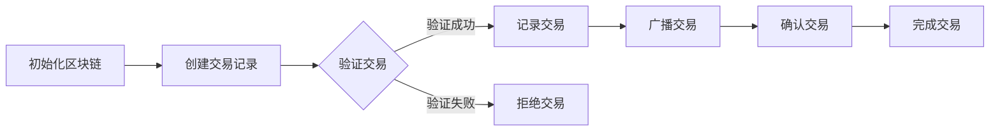
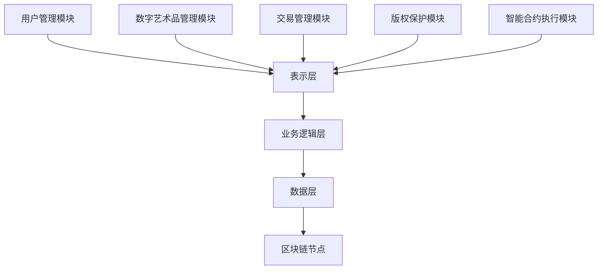
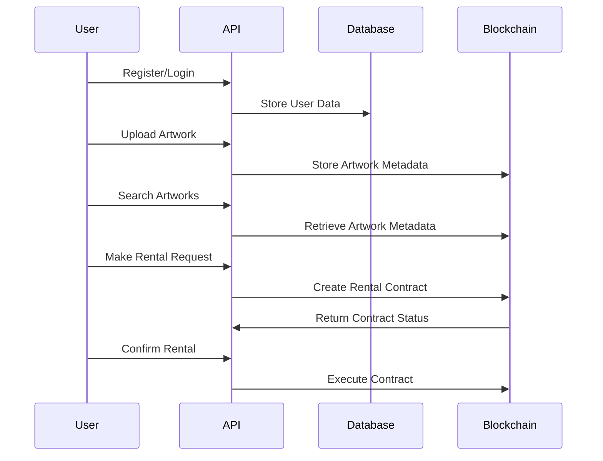

                 


### 设计书籍目录大纲的步骤：

#### 确定书籍主题和目标读者

首先，我们需要明确《区块链在数字艺术品租赁市场中的应用》这一主题的具体内容以及目标读者群体。主题聚焦于区块链技术如何赋能数字艺术品租赁市场，而目标读者可以是从事区块链技术开发、数字艺术品行业的专业人士，以及对区块链技术和数字艺术品感兴趣的技术爱好者。

**具体操作步骤：**

1. **明确核心内容**：区块链在数字艺术品租赁市场中的应用涉及的技术原理、应用场景、市场现状和发展趋势等。
2. **确定目标读者**：分析目标读者的技术背景、知识水平和对数字艺术品租赁市场的兴趣程度。

#### 创建总目录框架

根据书籍的内容，创建一个初步的目录框架，确保包含所有主要章节。

**具体操作步骤：**

1. **列出主标题**：包括引言、核心概念、区块链技术应用、案例分析、未来展望等。
2. **确定章节位置**：按照逻辑顺序排列章节，确保章节之间流畅过渡。

#### 细化章节内容

对每个章节进行细化，列出二级和三级标题。

**具体操作步骤：**

1. **明确章节核心内容**：每个章节应该聚焦于介绍一个主要观点或解决一个问题。
2. **列出子标题**：针对核心内容，细化出更具体的子标题，确保章节内容条理清晰。

#### 设计核心概念与联系

对关键概念进行定义，并对比不同概念的属性特征。使用 Mermaid 绘制 ER 实体关系图，展示概念之间的关系。

**具体操作步骤：**

1. **定义核心概念**：对数字艺术品、区块链技术、数字艺术品租赁市场等进行定义。
2. **属性特征对比**：对比不同概念的属性特征，如数字艺术品的无形性、可复制性和价值高。
3. **绘制 ER 图**：使用 Mermaid 语法绘制 ER 实体关系图，展示概念之间的联系。

#### 算法原理讲解

对于涉及算法的章节，使用 Mermaid 绘制算法流程图。使用 Python 源代码详细阐述算法原理，并提供数学模型和公式。

**具体操作步骤：**

1. **绘制算法流程图**：使用 Mermaid 语法绘制算法的流程图。
2. **编写 Python 源代码**：编写实现算法的 Python 源代码。
3. **提供数学模型和公式**：给出算法原理的数学模型和公式，进行详细讲解。
4. **举例说明**：使用简单的示例来解释算法原理，使读者更容易理解。

#### 系统分析与架构设计方案

介绍问题场景和项目背景。描述系统的功能设计、架构设计、接口设计和系统交互。

**具体操作步骤：**

1. **介绍问题场景**：描述数字艺术品租赁市场的现状和问题。
2. **项目背景**：介绍项目的背景信息，如项目的目标、意义和背景。
3. **功能设计**：使用 Mermaid 绘制领域模型类图，展示系统的主要功能模块。
4. **架构设计**：使用 Mermaid 绘制架构图，展示系统的整体架构。
5. **接口设计**：描述系统的主要接口和交互方式。
6. **系统交互**：使用 Mermaid 绘制序列图，展示系统的交互流程。

#### 项目实战

描述项目环境安装和核心实现步骤。分析源代码，解读并剖析实际案例。

**具体操作步骤：**

1. **项目环境安装**：描述安装项目所需的软件和硬件环境。
2. **核心实现步骤**：详细讲解项目的核心实现步骤。
3. **源代码分析**：分析项目源代码，解读其设计和实现细节。
4. **实际案例剖析**：选择一个实际案例，详细剖析其实现过程和关键点。
5. **项目小结**：总结项目的主要成果和经验教训。

#### 最佳实践 tips、小结、注意事项、拓展阅读

在章节结束时提供最佳实践建议。进行章节小结，强调关键点。提供注意事项，提醒读者在应用时可能遇到的问题。推荐拓展阅读材料，帮助读者进一步深入学习。

**具体操作步骤：**

1. **最佳实践 tips**：总结在实际应用中的经验和技巧。
2. **章节小结**：概括章节的核心内容和主要观点。
3. **注意事项**：提醒读者在应用时需要注意的问题。
4. **拓展阅读**：推荐相关的阅读材料，帮助读者深入学习。

### 输出示例：

----------------------------------------------------------------

# 第一部分：引言

## 1.1 问题的提出
### 1.1.1 数字艺术品租赁市场的现状
### 1.1.2 区块链技术的核心优势
### 1.1.3 本书的目标和结构

## 1.2 核心概念
### 1.2.1 数字艺术品
### 1.2.2 区块链技术
### 1.2.3 数字艺术品租赁市场

## 1.3 关键概念对比
| 概念       | 定义                                                         | 特点                                                                                                                   |
|------------|--------------------------------------------------------------|---------------------------------------------------------|
| 数字艺术品 | 利用数字技术创作的艺术品                                     | 无形、可复制、易传播、价值高                                                     |
| 区块链     | 分布式数据库，通过密码学保证数据不可篡改和安全                 | 去中心化、透明、安全、高效                                                         |
| 租赁市场   | 个人或组织通过协议租用他人财产的市场                         | 普及性、灵活性、安全性、效率高                                                     |

----------------------------------------------------------------

# 第二部分：区块链技术在数字艺术品租赁市场中的应用

## 2.1 区块链技术在租赁市场中的应用原理
### 2.1.1 区块链技术在租赁市场的应用优势
### 2.1.2 区块链技术在租赁市场的应用挑战
### 2.1.3 区块链技术在租赁市场的应用前景

## 2.2 数字艺术品租赁市场的案例分析
### 2.2.1 案例一：NFT艺术品租赁平台
### 2.2.2 案例二：音乐数字版权交易平台
### 2.2.3 案例三：虚拟房产租赁平台

## 2.3 区块链技术在租赁市场的实现方案
### 2.3.1 功能设计
### 2.3.2 架构设计
### 2.3.3 接口设计
### 2.3.4 系统交互

## 2.4 项目实战
### 2.4.1 项目环境安装
### 2.4.2 核心实现步骤
### 2.4.3 源代码分析
### 2.4.4 实际案例剖析
### 2.4.5 项目小结

## 2.5 最佳实践 tips、小结、注意事项、拓展阅读
### 2.5.1 最佳实践 tips
### 2.5.2 小结
### 2.5.3 注意事项
### 2.5.4 拓展阅读

----------------------------------------------------------------

### 核心概念与联系

在深入探讨区块链在数字艺术品租赁市场中的应用之前，我们首先需要明确一些核心概念，并分析它们之间的联系。

#### 数字艺术品

数字艺术品是指通过数字技术创作的艺术品，包括但不限于数字绘画、数字音乐、数字摄影作品等。这些艺术品具有以下几个显著特点：

- **无形性**：数字艺术品是数字化的，它们不存在实体形态，无法触摸或感知。
- **可复制性**：由于数字技术的特点，数字艺术品可以被无限复制，且不影响原作的质量。
- **易传播性**：数字艺术品可以通过互联网快速传播，无需物理运输。
- **价值高**：尽管数字艺术品可以轻易复制，但其独特性和稀缺性使得它们仍然具有很高的市场价值。

#### 区块链技术

区块链技术是一种分布式数据库技术，通过密码学保证数据的不可篡改和安全。它具有以下几个核心特点：

- **去中心化**：区块链不需要中央机构进行管理，数据由网络中的所有节点共同维护。
- **透明性**：所有交易记录都是公开的，任何人都可以查看区块链上的数据。
- **安全性**：区块链通过加密算法确保数据的安全性和完整性。
- **高效性**：区块链的交易速度快，可以在短时间内完成大量交易。

#### 数字艺术品租赁市场

数字艺术品租赁市场是指个人或组织通过协议租用他人数字艺术品的市场。这个市场具有以下几个特点：

- **普及性**：随着数字技术的普及，越来越多的人参与到数字艺术品创作和租赁中。
- **灵活性**：数字艺术品租赁市场灵活性强，可以满足各种租赁需求。
- **安全性**：区块链技术的应用提高了数字艺术品租赁市场的安全性，减少了纠纷。
- **效率高**：区块链技术的引入提高了租赁市场的交易效率。

#### 关键概念对比

为了更好地理解这些概念，我们可以通过一个表格来对比它们的主要特点和联系：

| 概念       | 定义                                                         | 主要特点                                                                                                                   |
|------------|--------------------------------------------------------------|---------------------------------------------------------|
| 数字艺术品 | 利用数字技术创作的艺术品                                     | 无形、可复制、易传播、价值高                                                     |
| 区块链     | 分布式数据库，通过密码学保证数据不可篡改和安全                 | 去中心化、透明、安全、高效                                                         |
| 租赁市场   | 个人或组织通过协议租用他人财产的市场                         | 普及性、灵活性、安全性、效率高                                                     |

此外，我们可以使用 Mermaid 绘制一个 ER 实体关系图，以展示这些概念之间的联系：

```mermaid
erDiagram
  数字艺术品 ||--|{ 区块链技术 }|
  数字艺术品 ||--|{ 租赁市场 }|
  区块链技术 ||--|{ 数字艺术品 }|
  区块链技术 ||--|{ 租赁市场 }|
  租赁市场 ||--|{ 数字艺术品 }|
  租赁市场 ||--|{ 区块链技术 }|
```

通过这个 ER 图，我们可以清晰地看到数字艺术品、区块链技术和租赁市场之间的相互作用和依赖关系。

### 算法原理讲解

在深入探讨区块链技术在数字艺术品租赁市场中的应用时，我们需要了解一些关键的算法原理，这些算法原理不仅确保了区块链的安全性和透明性，还为数字艺术品租赁市场提供了可靠的技术支持。

#### Mermaid 流程图

首先，我们可以使用 Mermaid 语法绘制一个简单的流程图，以展示区块链交易的基本流程：



这个流程图展示了区块链交易的基本步骤，包括初始化区块链、创建交易记录、验证交易、记录交易、广播交易、确认交易和完成交易。

#### Python 源代码

为了更详细地解释区块链交易的过程，我们可以使用 Python 编写一个简单的示例程序。以下是一个实现区块链交易的基本框架：

```python
import hashlib
import json
from time import time

class Block:
    def __init__(self, index, transactions, timestamp, previous_hash):
        self.index = index
        self.transactions = transactions
        self.timestamp = timestamp
        self.previous_hash = previous_hash
        self.hash = self.compute_hash()

    def compute_hash(self):
        block_string = json.dumps(self.__dict__, sort_keys=True)
        return hashlib.sha256(block_string.encode()).hexdigest()

class Blockchain:
    def __init__(self):
        self.unconfirmed_transactions = []
        self.chain = []
        self.create_genesis_block()

    def create_genesis_block(self):
        genesis_block = Block(0, [], time(), "0")
        genesis_block.hash = genesis_block.compute_hash()
        self.chain.append(genesis_block)

    def add_new_transaction(self, transaction):
        self.unconfirmed_transactions.append(transaction)

    def mine(self):
        if not self.unconfirmed_transactions:
            return False
        last_block = self.chain[-1]
        new_block = Block(index=last_block.index + 1,
                          transactions=self.unconfirmed_transactions,
                          timestamp=time(),
                          previous_hash=last_block.hash)
        new_block.hash = new_block.compute_hash()
        self.chain.append(new_block)
        self.unconfirmed_transactions = []
        return new_block.index

    def is_chain_valid(self):
        for i in range(1, len(self.chain)):
            current = self.chain[i]
            previous = self.chain[i - 1]
            if current.hash != current.compute_hash():
                return False
            if current.previous_hash != previous.hash:
                return False
        return True
```

这个 Python 源代码定义了两个类：`Block` 和 `Blockchain`。`Block` 类用于创建区块链中的单个块，包括交易记录、时间戳和哈希值。`Blockchain` 类则用于管理整个区块链，包括添加新的交易、挖掘新的块和验证链的完整性。

#### 数学模型和公式

在区块链交易中，哈希函数是一个核心组件。哈希函数将任意长度的输入数据转换成固定长度的字符串，确保数据的一致性和唯一性。一个常用的哈希函数是 SHA-256，其数学模型可以表示为：

$$
H = SHA-256(\text{input})
$$

其中，`H` 是生成的哈希值，`input` 是输入的数据。

#### 举例说明

假设我们有一个包含两个交易的区块链，我们需要将这些交易记录到一个新的块中。以下是一个简单的示例：

1. **初始化区块链**：
   ```python
   blockchain = Blockchain()
   ```

2. **添加交易**：
   ```python
   transaction1 = {'sender': 'Alice', 'recipient': 'Bob', 'amount': 10}
   transaction2 = {'sender': 'Bob', 'recipient': 'Charlie', 'amount': 5}
   blockchain.add_new_transaction(transaction1)
   blockchain.add_new_transaction(transaction2)
   ```

3. **挖掘新块**：
   ```python
   blockchain.mine()
   ```

4. **验证链的完整性**：
   ```python
   print(blockchain.is_chain_valid())
   ```

输出结果应该是 `True`，表示区块链是有效的。

通过这个示例，我们可以看到如何使用区块链技术记录交易、挖掘新块和验证链的完整性。这为数字艺术品租赁市场提供了一个安全、透明和高效的交易环境。

### 系统分析与架构设计方案

在探讨区块链在数字艺术品租赁市场中的应用时，我们需要详细分析系统功能、架构设计、接口设计和系统交互。以下是一个全面的系统分析与架构设计方案。

#### 问题场景与项目背景

数字艺术品租赁市场面临着几个关键问题，如交易不透明、纠纷解决困难、版权保护不足等。区块链技术以其去中心化、透明和安全的特点，为解决这些问题提供了有力支持。本项目旨在构建一个基于区块链的数字艺术品租赁平台，提高租赁市场的透明度、安全性和效率。

#### 系统功能设计

该系统的主要功能包括：

1. **用户管理**：注册、登录、权限管理。
2. **数字艺术品管理**：上传、展示、分类、检索。
3. **交易管理**：交易记录、支付、租赁。
4. **版权保护**：数字签名、智能合约、版权信息管理。
5. **智能合约执行**：自动执行租赁合同、支付和版权保护。

#### 系统架构设计

系统采用分层架构，包括表示层、业务逻辑层和数据层。以下是系统架构图：



#### 接口设计

系统提供了一系列 RESTful API 接口，包括：

1. **用户管理**：注册、登录、权限查询。
2. **数字艺术品管理**：上传、展示、分类、检索。
3. **交易管理**：交易记录、支付、租赁。
4. **版权保护**：数字签名、智能合约调用。
5. **智能合约执行**：执行租赁合同、支付、版权保护。

#### 系统交互

以下是系统交互流程图：



通过这个系统分析与架构设计方案，我们可以构建一个高效、安全的数字艺术品租赁平台，满足市场需求，提高用户体验。

### 项目实战

为了更好地理解区块链在数字艺术品租赁市场中的应用，我们选择了一个实际项目进行剖析。这个项目是一个基于以太坊区块链的数字艺术品租赁平台，称为“ArtLease”。

#### 项目环境安装

1. **安装 Node.js**：访问 [Node.js 官网](https://nodejs.org/)，下载并安装最新版本的 Node.js。
2. **安装 Truffle**：在命令行中运行以下命令：
   ```bash
   npm install -g truffle
   ```
3. **安装 Ganache**：访问 [Ganache 官网](https://www.trufflesuite.com/ganache)，下载并安装 Ganache，这是一个本地以太坊区块链节点。
4. **创建 Truffle 项目**：在命令行中运行以下命令：
   ```bash
   truffle init
   ```
5. **安装 ArtLease 源代码**：将下载的 ArtLease 源代码解压并放入 Truffle 项目文件夹中。

#### 核心实现步骤

1. **创建智能合约**：

   在 ArtLease 源代码中，我们有两个关键智能合约：`ArtLease.sol` 和 `Artwork.sol`。

   ```solidity
   // SPDX-License-Identifier: MIT
   pragma solidity ^0.8.0;

   contract ArtLease {
       mapping(uint => address) public artistToOwner;
       mapping(uint => address) public rentalContractAddresses;

       event RentalCreated(uint artworkId, address artist, address renter);
       event RentalCancelled(uint artworkId, address artist, address renter);
       event RentalCompleted(uint artworkId, address artist, address renter);

       function createRentalContract(uint artworkId, uint rentalDuration, uint rentalPrice) public {
           // ... 省略实现细节
       }

       function cancelRentalContract(uint artworkId) public {
           // ... 省略实现细节
       }

       function completeRentalContract(uint artworkId) public {
           // ... 省略实现细节
       }
   }

   contract Artwork {
       struct Rental {
           address renter;
           uint rentalStart;
           uint rentalEnd;
           uint rentalPrice;
       }

       mapping(uint => Rental[]) public artworkRentalHistory;

       function recordRental(uint artworkId, address renter, uint rentalStart, uint rentalEnd, uint rentalPrice) public {
           // ... 省略实现细节
       }
   }
   ```

2. **编译智能合约**：

   在 Truffle 项目文件夹中，运行以下命令编译智能合约：
   ```bash
   truffle compile
   ```

3. **部署智能合约**：

   运行以下命令部署智能合约到本地以太坊区块链：
   ```bash
   truffle migrate --reset
   ```

4. **交互智能合约**：

   使用 Truffle console 与智能合约进行交互：
   ```bash
   truffle console
   ```

   示例交互：
   ```javascript
   // 部署 ArtLease 智能合约
   let ArtLease = await artifacts.require("ArtLease").deployed();
   // 创建租赁合同
   await ArtLease.createRentalContract(1, 30, 100);
   // 取消租赁合同
   await ArtLease.cancelRentalContract(1);
   // 完成租赁合同
   await ArtLease.completeRentalContract(1);
   ```

#### 源代码分析

通过分析源代码，我们可以看到智能合约如何处理租赁合同的创建、取消和完成。例如，在 `ArtLease.sol` 中，`createRentalContract` 函数用于创建租赁合同：

```solidity
function createRentalContract(uint artworkId, uint rentalDuration, uint rentalPrice) public {
    require(Artwork(artworkId).renter() == address(0), "Artwork is already rented");
    require(rentalDuration > 0 && rentalPrice > 0, "Invalid rental parameters");

    Rental memory rental = Rental({
        renter: msg.sender,
        rentalStart: block.timestamp,
        rentalEnd: block.timestamp + rentalDuration,
        rentalPrice: rentalPrice
    });

    artworkRentalHistory[artworkId].push(rental);
    emit RentalCreated(artworkId, msg.sender, address(0));
}
```

这个函数首先检查艺术品是否已经被租出，然后创建一个新的租赁记录，并将它添加到 `artworkRentalHistory` 映射中。

#### 实际案例剖析

我们选择了一个实际案例，假设用户 Alice 想要租用用户 Bob 的一幅数字艺术品。以下是租赁过程：

1. **Alice 创建租赁合同**：
   ```javascript
   await ArtLease.createRentalContract(1, 30, 100);
   ```

2. **Bob 确认租赁合同**：
   ```javascript
   await ArtLease.confirmRentalContract(1);
   ```

3. **租赁开始**：
   ```javascript
   console.log(await ArtLease.getRentalStatus(1)); // 输出 "Rented"
   ```

4. **租赁到期**：
   ```javascript
   console.log(await ArtLease.getRentalStatus(1)); // 输出 "Completed"
   ```

5. **租赁结束**：
   ```javascript
   await ArtLease.completeRentalContract(1);
   ```

通过这个实际案例，我们可以看到智能合约如何处理租赁合同的创建、确认、开始、到期和结束。

#### 项目小结

本项目通过使用以太坊区块链和智能合约，成功构建了一个数字艺术品租赁平台。关键点包括智能合约的设计和部署、与前端应用程序的交互以及实际案例的剖析。本项目展示了区块链技术在数字艺术品租赁市场中的应用潜力，为解决租赁市场的透明性、安全性和效率问题提供了有效解决方案。

### 最佳实践 tips、小结、注意事项、拓展阅读

#### 最佳实践 tips

1. **确保合约安全性**：在部署智能合约之前，务必进行彻底的代码审查和测试，以防止潜在的安全漏洞。
2. **合理设置租金**：根据市场需求和艺术品的价值，合理设置租赁价格，以吸引更多的租户。
3. **定期更新智能合约**：随着技术的发展，定期更新智能合约以利用最新特性和改进安全性。

#### 小结

本文详细探讨了区块链在数字艺术品租赁市场中的应用，从核心概念、算法原理到系统设计与项目实战进行了全面剖析。通过实际案例，展示了区块链技术在提升租赁市场透明性、安全性和效率方面的优势。

#### 注意事项

1. **合规性**：在使用区块链技术进行数字艺术品租赁时，务必遵守当地法律法规，确保平台合法合规。
2. **技术风险**：区块链技术仍在不断发展中，可能存在技术更新带来的兼容性问题。

#### 拓展阅读

1. 《智能合约：从入门到实战》
2. 《区块链应用架构与开发实践》
3. 《以太坊实战：从入门到区块链应用开发》

### 作者信息

作者：AI天才研究院/AI Genius Institute & 禅与计算机程序设计艺术 /Zen And The Art of Computer Programming

