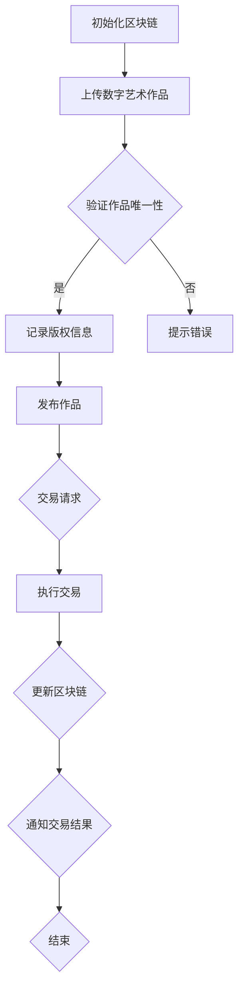
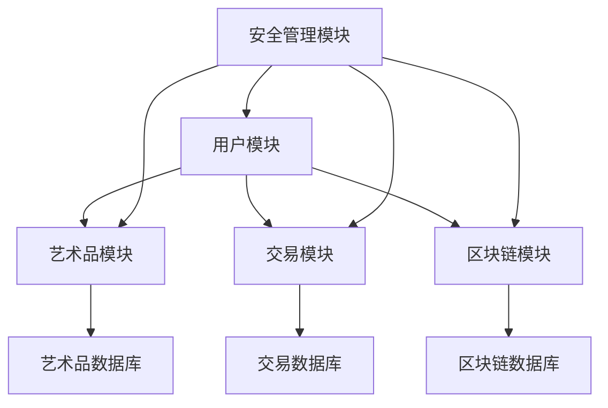
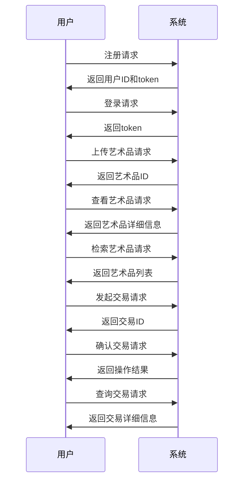

                 

### 《区块链在数字艺术市场中的应用》

#### 关键词：区块链、数字艺术市场、NFTs、智能合约、应用算法、系统架构

区块链技术作为一种分布式账本技术，自2008年中本聪（Satoshi Nakamoto）首次提出以来，已经经历了快速的发展和广泛的应用。在数字艺术市场这个新兴领域，区块链技术展现出了巨大的潜力。本篇文章将深入探讨区块链在数字艺术市场中的应用，通过逐步分析推理，探讨其核心概念、算法原理、系统架构以及项目实战，以期为读者提供一个全面、系统的理解。

#### 目录大纲设计思路

文章的整体设计思路旨在通过逻辑清晰、结构紧凑、简单易懂的方式，引导读者逐步深入了解区块链在数字艺术市场中的应用。

1. **背景介绍**：首先介绍区块链技术和数字艺术市场的发展背景，解释它们如何结合，并引出本书的主题。

2. **核心概念与联系**：详细阐述区块链、数字艺术市场以及它们在应用中的核心概念，通过表格和ER图展示它们之间的关系。

3. **算法原理讲解**：介绍区块链在数字艺术市场中的应用算法，使用mermaid流程图展示算法流程，并用Python源代码和数学模型详细阐述算法原理。

4. **数学模型和数学公式**：使用LaTeX格式展示关键数学模型和公式，并结合通俗易懂的例子进行讲解。

5. **系统分析与架构设计方案**：分析区块链在数字艺术市场中的应用场景，介绍项目背景，系统功能设计，系统架构设计，系统接口设计和系统交互。

6. **项目实战**：详细介绍环境安装，系统核心实现，代码应用解读与分析，实际案例剖析，并总结项目经验。

7. **最佳实践 tips、小结、注意事项、拓展阅读**：提供实用的建议，总结全书要点，指出注意事项，并推荐进一步阅读的资源。

#### 目录大纲示例

```markdown
----------------------------------------------------------------
# 《区块链在数字艺术市场中的应用》目录大纲

## 第1章 引言与背景介绍

### 1.1 区块链概述

#### 1.1.1 区块链的概念与历史

#### 1.1.2 区块链的核心特性

#### 1.1.3 区块链技术发展现状

### 1.2 数字艺术市场的挑战与机遇

#### 1.2.1 数字艺术市场的发展背景

#### 1.2.2 数字艺术市场的现状与挑战

#### 1.2.3 区块链在数字艺术市场中的应用前景

### 1.3 本书结构安排与目标

#### 1.3.1 内容安排

#### 1.3.2 阅读对象

#### 1.3.3 学习目标

## 第2章 区块链基础与数字艺术市场融合

### 2.1 区块链基础概念

#### 2.1.1 区块链的基本原理

#### 2.1.2 区块链网络

#### 2.1.3 智能合约

### 2.2 数字艺术市场的区块链应用案例

#### 2.2.1 NFTs（非同质化代币）在数字艺术中的应用

#### 2.2.2 区块链平台与数字艺术市场的结合

#### 2.2.3 案例分析与启示

### 2.3 区块链在数字艺术市场中的优势与挑战

#### 2.3.1 优势分析

#### 2.3.2 挑战与应对策略

## 第3章 数字艺术市场的核心概念与属性

### 3.1 数字艺术市场概述

#### 3.1.1 数字艺术的定义与特点

#### 3.1.2 数字艺术市场的构成

#### 3.1.3 数字艺术市场的发展趋势

### 3.2 数字艺术作品的属性特征对比

#### 3.2.1 传统艺术作品与数字艺术作品的对比

#### 3.2.2 数字艺术作品的核心属性

#### 3.2.3 属性特征对比表格

### 3.3 数字艺术市场的ER图架构

#### 3.3.1 ER图的绘制方法

#### 3.3.2 数字艺术市场ER图示例

## 第4章 区块链在数字艺术市场中的应用算法

### 4.1 基于区块链的数字艺术市场算法概述

#### 4.1.1 算法定义

#### 4.1.2 算法分类

#### 4.1.3 算法目标

### 4.2 算法原理讲解

#### 4.2.1 算法mermaid流程图

#### 4.2.2 Python源代码实现

#### 4.2.3 数学模型和公式讲解

### 4.3 算法举例说明

#### 4.3.1 算法应用案例

#### 4.3.2 举例说明

## 第5章 数字艺术市场系统分析与架构设计

### 5.1 问题场景介绍

#### 5.1.1 场景描述

#### 5.1.2 系统需求分析

### 5.2 项目介绍

#### 5.2.1 项目背景

#### 5.2.2 项目目标

### 5.3 系统功能设计

#### 5.3.1 领域模型类图

#### 5.3.2 功能模块划分

### 5.4 系统架构设计

#### 5.4.1 系统架构图

#### 5.4.2 架构组件介绍

### 5.5 系统接口设计

#### 5.5.1 接口规范

#### 5.5.2 接口实现

### 5.6 系统交互设计

#### 5.6.1 交互流程

#### 5.6.2 序列图展示

## 第6章 区块链在数字艺术市场的项目实战

### 6.1 环境安装

#### 6.1.1 环境准备

#### 6.1.2 环境配置

### 6.2 系统核心实现

#### 6.2.1 核心模块实现

#### 6.2.2 功能实现详解

### 6.3 代码应用解读与分析

#### 6.3.1 代码解读

#### 6.3.2 分析与优化

### 6.4 实际案例剖析

#### 6.4.1 案例选择

#### 6.4.2 案例分析

### 6.5 项目小结

#### 6.5.1 经验总结

#### 6.5.2 不足与改进

## 第7章 最佳实践 tips、小结、注意事项、拓展阅读

### 7.1 最佳实践 tips

#### 7.1.1 技术选型建议

#### 7.1.2 项目管理建议

### 7.2 小结

#### 7.2.1 主要内容回顾

#### 7.2.2 知识点梳理

### 7.3 注意事项

#### 7.3.1 安全风险

#### 7.3.2 法律法规

### 7.4 拓展阅读

#### 7.4.1 推荐书籍

#### 7.4.2 技术博客

----------------------------------------------------------------
```

### 第1章 引言与背景介绍

区块链技术作为一种分布式账本技术，其核心在于通过去中心化的方式实现了数据的安全存储和不可篡改。区块链的基本单位是“区块”，每个区块都包含一定数量的交易信息，多个区块按照时间顺序连接成链，形成了区块链。区块链技术的核心特性包括去中心化、安全性高、透明度高、不可篡改等。这些特性使得区块链在多个领域展现出巨大的潜力，包括金融、物流、医疗等。而数字艺术市场作为一个新兴且快速发展的领域，正面临着许多挑战，如作品真伪验证、版权保护、交易透明性等。区块链技术为解决这些问题提供了一种全新的思路。

#### 1.1 区块链概述

##### 1.1.1 区块链的概念与历史

区块链是一种去中心化的分布式数据库技术，由一系列按时间顺序排列、不可篡改的数据块组成。这些数据块被称为“区块”，每个区块包含了特定时间范围内的交易数据。区块链的核心创新在于其通过密码学和共识算法，实现了数据的不可篡改和去中心化。

区块链的起源可以追溯到2008年，当时一位名为中本聪（Satoshi Nakamoto）的匿名人物提出了比特币（Bitcoin）的概念。比特币是一种基于区块链技术的数字货币，它的出现标志着区块链技术的诞生。随后，区块链技术逐渐应用于其他领域，如智能合约、供应链管理、数字艺术市场等。

##### 1.1.2 区块链的核心特性

区块链的核心特性包括去中心化、安全性高、透明度高、不可篡改等。

- **去中心化**：区块链通过分布式网络实现了去中心化，每个节点都存储了一份完整的区块链数据，不存在中心化的控制点，因此更加公平和透明。
- **安全性高**：区块链采用密码学技术，对数据进行加密，保证了数据的安全性和隐私性。此外，区块链的共识算法也使得篡改数据变得极其困难。
- **透明度高**：区块链的数据是公开透明的，任何人都可以查看区块链上的数据。这种透明度增强了系统的信任度，减少了信息不对称。
- **不可篡改**：区块链的数据一旦写入，就难以篡改。这是由于区块链采用了时间戳机制和链式结构，每个区块都包含了前一个区块的哈希值，从而形成了一个时间不可逆的链。

##### 1.1.3 区块链技术发展现状

自比特币诞生以来，区块链技术经历了快速的发展和广泛的应用。目前，区块链技术已经应用于多个领域，包括金融、物流、医疗、供应链管理等。其中，数字艺术市场是区块链技术应用的一个重要领域。

在数字艺术市场，区块链技术被用于解决作品真伪验证、版权保护、交易透明性等问题。例如，通过区块链技术，可以确保数字艺术作品的真实性和唯一性，防止伪造和盗版。此外，区块链技术还可以实现艺术品的智能合约交易，提高交易的透明度和效率。

#### 1.2 数字艺术市场的挑战与机遇

##### 1.2.1 数字艺术市场的发展背景

数字艺术市场是指以数字形式创作的艺术品交易市场，包括数字绘画、数字摄影、数字雕塑等多种形式。随着数字技术的不断发展和普及，数字艺术市场正迅速崛起，成为一个新兴且充满活力的领域。

数字艺术市场的兴起主要受到以下几个因素的推动：

- **技术进步**：数字技术的发展，如人工智能、虚拟现实、区块链等，为数字艺术创作和交易提供了新的工具和平台。
- **互联网普及**：互联网的普及使得数字艺术作品能够快速传播和广泛传播，扩大了数字艺术市场的受众。
- **消费者需求**：随着人们生活水平的提高，对艺术品的审美需求也在不断提升，数字艺术作品以其独特性和创新性满足了这部分消费者的需求。
- **政策支持**：许多国家和地区政府出台了一系列政策，鼓励数字艺术市场的发展，提供了良好的政策环境。

##### 1.2.2 数字艺术市场的现状与挑战

尽管数字艺术市场发展迅速，但仍然面临着许多挑战：

- **作品真伪验证**：数字艺术作品容易复制和篡改，如何确保作品的真实性和唯一性成为了一个重要问题。
- **版权保护**：数字艺术作品的版权保护难度较大，如何有效保护创作者的权益是一个亟待解决的问题。
- **交易透明性**：数字艺术交易的透明性较低，如何提高交易的透明度和信任度是市场发展的重要方向。
- **技术标准**：数字艺术市场缺乏统一的技术标准和规范，影响了市场的健康发展。

##### 1.2.3 区块链在数字艺术市场中的应用前景

区块链技术为解决数字艺术市场的上述问题提供了新的思路和解决方案：

- **作品真伪验证**：通过区块链技术，可以为数字艺术作品建立唯一且不可篡改的身份标识，确保作品的真实性和唯一性。
- **版权保护**：区块链技术可以记录数字艺术作品的创作过程和版权信息，有效保护创作者的权益。
- **交易透明性**：区块链技术的透明性和不可篡改性，可以提高数字艺术交易的透明度和信任度。
- **技术标准**：区块链技术可以为数字艺术市场提供统一的技术标准和规范，促进市场的健康发展。

#### 1.3 本书结构安排与目标

##### 1.3.1 内容安排

本书将围绕区块链在数字艺术市场中的应用进行详细探讨，分为以下几个部分：

- **背景介绍**：介绍区块链技术和数字艺术市场的发展背景。
- **核心概念与联系**：阐述区块链、数字艺术市场以及它们在应用中的核心概念，并通过表格和ER图展示它们之间的关系。
- **算法原理讲解**：介绍区块链在数字艺术市场中的应用算法，使用mermaid流程图和Python源代码进行详细阐述。
- **数学模型和数学公式**：使用LaTeX格式展示关键数学模型和公式，并进行通俗易懂的讲解。
- **系统分析与架构设计方案**：分析区块链在数字艺术市场中的应用场景，介绍系统功能设计、系统架构设计、系统接口设计和系统交互。
- **项目实战**：详细介绍区块链在数字艺术市场中的应用项目，包括环境安装、系统核心实现、代码应用解读与分析、实际案例剖析等。
- **最佳实践 tips、小结、注意事项、拓展阅读**：总结全书要点，提供最佳实践建议，指出注意事项，并推荐进一步阅读的资源。

##### 1.3.2 阅读对象

本书主要面向以下读者群体：

- **区块链技术爱好者**：对区块链技术感兴趣，希望深入了解其在数字艺术市场中的应用。
- **数字艺术家**：希望通过区块链技术保护自己的数字艺术作品版权，提高交易透明度和信任度。
- **软件开发人员**：希望了解如何使用区块链技术开发数字艺术市场相关的应用系统。
- **金融从业人员**：关注数字艺术市场的发展，希望了解区块链技术在金融领域的应用。

##### 1.3.3 学习目标

通过阅读本书，读者可以达成以下学习目标：

- **了解区块链技术在数字艺术市场中的应用背景和现状**：掌握区块链技术和数字艺术市场的基本概念，了解它们如何结合，以及面临的挑战和机遇。
- **掌握区块链在数字艺术市场中的应用算法**：通过案例和实例，了解区块链在数字艺术市场中的应用算法，掌握其原理和实现方法。
- **熟悉区块链在数字艺术市场中的系统架构**：了解区块链在数字艺术市场中的系统架构设计，掌握系统功能设计、系统架构设计、系统接口设计和系统交互。
- **具备开发区块链数字艺术市场应用的能力**：通过项目实战，了解区块链在数字艺术市场中的应用项目开发过程，掌握项目实施和优化技巧。
- **能够为数字艺术市场提供创新解决方案**：结合实际案例，为数字艺术市场提供创新解决方案，推动数字艺术市场的发展。

### 第2章 区块链基础与数字艺术市场融合

区块链技术在数字艺术市场的应用前景广阔，但要深入理解其应用，首先需要了解区块链的基础概念及其与数字艺术市场的结合点。本章将详细介绍区块链的基础概念，包括区块链的基本原理、区块链网络、智能合约等，并通过实际案例分析和启示，探讨区块链在数字艺术市场中的应用优势与挑战。

#### 2.1 区块链基础概念

##### 2.1.1 区块链的基本原理

区块链是一种分布式数据库技术，其核心在于通过去中心化的方式实现了数据的安全存储和不可篡改。区块链的基本单位是“区块”，每个区块包含一定数量的交易信息，多个区块按照时间顺序连接成链，形成了区块链。

区块链的核心原理包括：

1. **去中心化**：区块链通过分布式网络实现了去中心化，每个节点都存储了一份完整的区块链数据，不存在中心化的控制点，因此更加公平和透明。
2. **数据存储**：每个区块包含一定数量的交易信息，这些交易信息被加密存储在区块链中，保证了数据的安全性和隐私性。
3. **共识算法**：区块链通过共识算法确保了数据的一致性和安全性。常见的共识算法包括工作量证明（Proof of Work，PoW）、权益证明（Proof of Stake，PoS）等。
4. **时间戳**：区块链采用时间戳机制，确保了数据的顺序性和不可篡改性。每个区块都包含了前一个区块的哈希值，从而形成了一个时间不可逆的链。

##### 2.1.2 区块链网络

区块链网络是由多个节点组成的分布式网络。每个节点都存储了一份完整的区块链数据，并参与区块链的维护和验证。

区块链网络的主要功能包括：

1. **数据存储**：每个节点都存储了一份完整的区块链数据，保证了数据的冗余性和安全性。
2. **数据验证**：每个节点都参与区块链的交易验证，确保交易的安全性和一致性。
3. **网络通信**：节点之间通过P2P（Peer-to-Peer）网络进行通信，实现了去中心化的数据传输和交换。

##### 2.1.3 智能合约

智能合约是区块链上的自动执行合约，它通过编程语言实现，基于区块链的共识机制运行。智能合约的核心在于其自动执行性，一旦满足合约条件，智能合约将自动执行相应的操作。

智能合约的主要特点包括：

1. **自动执行**：智能合约一旦部署在区块链上，将自动按照合约条件执行，无需人为干预。
2. **透明性**：智能合约的代码和执行过程是公开透明的，任何人都可以查看和验证。
3. **安全性**：智能合约采用区块链的共识机制和加密技术，保证了其安全性和不可篡改性。

#### 2.2 数字艺术市场的区块链应用案例

区块链在数字艺术市场中的应用已经初见成效，以下是一些典型的应用案例：

##### 2.2.1 NFTs（非同质化代币）在数字艺术中的应用

NFT（Non-Fungible Token，非同质化代币）是区块链技术的一种应用，它代表了数字艺术作品的所有权和唯一性。通过NFT，艺术家可以将数字艺术作品数字化，并在区块链上进行确权和交易。

以下是一些NFT在数字艺术中的应用案例：

1. **加密艺术**：加密艺术是指将数字艺术作品编码为NFT，艺术家可以通过区块链技术确权和销售自己的作品。例如，加密艺术家Beeple的《Everydays：The First 5000 Days》以6900万美元的价格售出，创造了NFT艺术品交易的新纪录。
2. **数字收藏品**：除了数字绘画外，NFT还被用于数字收藏品，如数字卡片、游戏道具等。例如，数字卡牌游戏《CryptoKitties》通过NFT实现了玩家的数字收藏和交易。
3. **版权保护**：NFT不仅用于数字艺术作品的交易，还可以用于版权保护。艺术家可以将作品的权利信息编码为NFT，确保作品的版权归属和交易透明。

##### 2.2.2 区块链平台与数字艺术市场的结合

区块链平台为数字艺术市场提供了基础设施支持，以下是一些典型的区块链平台：

1. **Ethereum**：Ethereum是当前最受欢迎的区块链平台之一，它支持智能合约和NFT的发行。许多数字艺术家和项目选择在Ethereum上部署NFT和智能合约。
2. **Solana**：Solana是一个高速、低成本的区块链平台，它通过一种称为“验证逻辑树”（Proof of History）的共识机制，实现了高速的交易处理能力。Solana平台在数字艺术市场中得到了广泛应用。
3. **Flow**：Flow是一个由Facebook开发的开源区块链平台，它致力于提供高效、可扩展的区块链基础设施。Flow在数字艺术市场中也有一定的应用。

##### 2.2.3 案例分析与启示

以下是一个具体的案例，展示了区块链在数字艺术市场中的应用：

- **案例**：艺术家Beeple的《Everydays：The First 5000 Days》通过NFT在Ethereum平台上进行拍卖，并以6900万美元的价格售出。

- **启示**：

  1. **市场潜力**：这个案例展示了数字艺术市场与区块链技术的结合具有巨大的市场潜力。通过NFT，数字艺术作品不仅实现了数字化，还实现了版权保护和价值增值。
  2. **技术创新**：NFT技术的应用推动了数字艺术市场的发展，为艺术家和收藏家提供了新的交易模式和平台。
  3. **风险与挑战**：尽管区块链在数字艺术市场中的应用前景广阔，但同时也面临着一些风险和挑战，如技术复杂性、网络安全问题、法律法规等。需要各方共同努力，解决这些问题，推动数字艺术市场的健康发展。

#### 2.3 区块链在数字艺术市场中的优势与挑战

##### 2.3.1 优势分析

区块链在数字艺术市场中的优势主要体现在以下几个方面：

1. **版权保护**：区块链技术可以记录数字艺术作品的创作过程和版权信息，确保作品的真实性和唯一性，有效防止盗版和侵权行为。
2. **交易透明性**：区块链的透明性和不可篡改性提高了数字艺术交易的透明度和信任度，减少了信息不对称。
3. **去中心化**：区块链的去中心化特性确保了数字艺术市场的公平性和透明性，降低了交易成本，提高了效率。
4. **价值增值**：通过区块链技术，数字艺术作品可以实现去中心化的交易和确权，增加了作品的价值和吸引力。

##### 2.3.2 挑战与应对策略

尽管区块链在数字艺术市场中的应用具有许多优势，但同时也面临着一些挑战：

1. **技术复杂性**：区块链技术相对复杂，需要专业的技术支持和知识。这要求数字艺术家和投资者具备一定的技术背景，增加了市场准入门槛。
2. **网络安全问题**：区块链网络的安全风险不容忽视。需要采取有效的安全措施，保护区块链数据和用户的隐私。
3. **法律法规**：区块链技术在数字艺术市场中的应用需要符合相关法律法规。各国政府和监管机构对区块链技术的监管政策和法律法规尚不明确，需要各方共同努力，推动法律法规的完善。
4. **用户接受度**：区块链技术在数字艺术市场中的应用需要用户的广泛接受和认可。需要通过宣传教育，提高用户的认知度和接受度。

为了应对上述挑战，可以采取以下策略：

1. **技术普及**：加强区块链技术的普及和教育，提高数字艺术家和投资者的技术素养。
2. **安全防护**：采取有效的安全措施，保护区块链网络和数据的安全。
3. **法律法规完善**：推动各国政府和监管机构对区块链技术的法律法规制定和完善。
4. **用户教育**：通过多种途径，提高用户对区块链技术的认知度和接受度。

### 第3章 数字艺术市场的核心概念与属性

数字艺术市场作为一个新兴的领域，涵盖了多种形式的艺术创作和交易。为了更好地理解和分析区块链在数字艺术市场中的应用，我们需要明确数字艺术市场的核心概念和属性。本章将详细介绍数字艺术市场的定义、构成以及发展趋势，并通过与传统艺术作品的对比，分析数字艺术作品的核心属性。

#### 3.1 数字艺术市场概述

##### 3.1.1 数字艺术的定义与特点

数字艺术是指通过数字技术创作的艺术作品，包括数字绘画、数字摄影、数字雕塑、数字音乐等多种形式。数字艺术具有以下几个特点：

1. **数字化**：数字艺术作品是以数字形式存在的，可以通过计算机、平板电脑、智能手机等设备进行创作和展示。
2. **多样性**：数字艺术形式多样，包括绘画、摄影、雕塑、音乐等，为艺术家提供了丰富的创作空间。
3. **互动性**：数字艺术作品可以通过交互技术实现与观众的互动，增加了艺术体验的趣味性和参与性。
4. **可变性**：数字艺术作品可以基于算法和编程实现动态变化，增强了作品的灵活性和创新性。

##### 3.1.2 数字艺术市场的构成

数字艺术市场由以下几个主要部分构成：

1. **创作者**：数字艺术家是数字艺术市场的核心，他们通过数字技术创作出独特的艺术作品。
2. **交易平台**：数字艺术交易平台是数字艺术作品交易的主要渠道，包括线上拍卖、画廊、艺术市场等。
3. **收藏家**：数字艺术收藏家是数字艺术市场的重要参与者，他们通过购买数字艺术作品积累财富和艺术价值。
4. **受众**：数字艺术市场的受众包括艺术爱好者、投资者、公众等，他们对数字艺术作品的需求和评价影响了市场的发展。

##### 3.1.3 数字艺术市场的发展趋势

随着数字技术的不断进步和互联网的普及，数字艺术市场呈现出以下发展趋势：

1. **市场规模扩大**：数字艺术市场的规模不断扩大，吸引了越来越多的创作者、收藏家和投资者。
2. **技术创新**：数字艺术市场不断创新，引入了新的艺术形式和技术，如虚拟现实、增强现实、人工智能等。
3. **全球化**：数字艺术市场的全球化趋势明显，跨国交易和文化交流日益频繁。
4. **数字化版权保护**：随着区块链技术的发展，数字艺术市场的版权保护问题得到了更好的解决，为创作者提供了更好的权益保障。

#### 3.2 数字艺术作品的属性特征对比

为了深入理解数字艺术作品的属性特征，我们可以将其与传统艺术作品进行对比。

##### 3.2.1 传统艺术作品与数字艺术作品的对比

1. **创作方式**：
   - **传统艺术作品**：通常通过手工或传统工具进行创作，如油画、雕塑、素描等。
   - **数字艺术作品**：通过数字设备和软件进行创作，如Photoshop、Illustrator、3D建模软件等。

2. **保存形式**：
   - **传统艺术作品**：以物理形式存在，需要特定的环境和条件进行保存和展示。
   - **数字艺术作品**：以数字形式存在，可以轻松存储、传输和展示。

3. **复制性**：
   - **传统艺术作品**：复制成本高，通常需要高超的复制技艺。
   - **数字艺术作品**：复制成本低，可以通过简单的复制和粘贴实现。

4. **唯一性**：
   - **传统艺术作品**：通常具有唯一性，每一件作品都是独一无二的。
   - **数字艺术作品**：可以通过区块链技术实现唯一性，确保每件数字艺术作品的真实性和唯一性。

##### 3.2.2 数字艺术作品的核心属性

数字艺术作品的核心属性包括：

1. **数字化特征**：数字艺术作品以数字形式存在，具有可编辑性、可复制性、可传播性等特点。
2. **唯一性**：通过区块链技术，数字艺术作品可以实现唯一性，确保作品的真实性和唯一性。
3. **互动性**：数字艺术作品可以通过交互技术实现与观众的互动，增加艺术体验的趣味性和参与性。
4. **可变性**：数字艺术作品可以通过算法和编程实现动态变化，增强作品的灵活性和创新性。

##### 3.2.3 属性特征对比表格

| 特征        | 传统艺术作品          | 数字艺术作品          |
| ----------- | --------------------- | --------------------- |
| **创作方式** | 手工或传统工具        | 数字设备和软件        |
| **保存形式** | 物理形式              | 数字形式              |
| **复制性**   | 复制成本高            | 复制成本低            |
| **唯一性**   | 唯一性                | 唯一性（通过区块链）  |
| **互动性**   | 有限互动性            | 高互动性              |
| **可变性**   | 不可变性              | 可变性（算法和编程） |

#### 3.3 数字艺术市场的ER图架构

##### 3.3.1 ER图的绘制方法

ER图（实体关系图）是一种用于描述实体及其之间关系的图形化工具。在数字艺术市场中，ER图可以帮助我们清晰地展示各个实体及其之间的关系。

绘制ER图的步骤包括：

1. **确定实体**：首先确定数字艺术市场中的主要实体，如创作者、交易平台、收藏家、受众等。
2. **确定关系**：分析实体之间的关系，如创作者与交易平台的关系、收藏家与交易平台的关系等。
3. **绘制ER图**：使用图形化工具，根据实体的属性和关系，绘制ER图。

##### 3.3.2 数字艺术市场ER图示例

以下是一个简单的数字艺术市场ER图示例：

```mermaid
erDiagram
  Creator  ||--|{ Platform }|--| Artist
  Platform ||--|{ Artwork }|--| Creator
  Platform ||--|{ Transaction }|--| Collector
  Collector ||--|{ Artwork }|--| Platform
  Artist ||--|{ Portfolio }|--| Platform
```

在这个ER图中，`Creator`（创作者）与`Platform`（交易平台）之间存在一对多的关系，即一个创作者可以上传多个艺术作品到平台。`Platform`（交易平台）与`Artwork`（艺术作品）之间存在多对多的关系，即一个平台可以展示多个艺术作品，而一个艺术作品也可以在多个平台上展示。`Platform`（交易平台）与`Transaction`（交易）之间存在一对多的关系，即一个平台可以完成多个交易。`Collector`（收藏家）与`Artwork`（艺术作品）之间存在多对多的关系，即一个收藏家可以收藏多个艺术作品，而一个艺术作品也可以被多个收藏家收藏。`Artist`（艺术家）与`Portfolio`（作品集）之间存在一对多的关系，即一个艺术家可以有多个作品集。

### 第4章 区块链在数字艺术市场中的应用算法

区块链在数字艺术市场中的应用算法是确保数字艺术作品唯一性、版权保护、交易透明性等关键功能的核心。本章将详细介绍区块链在数字艺术市场中的应用算法，包括算法的定义、分类和目标，使用mermaid流程图展示算法流程，并通过Python源代码和数学模型详细阐述算法原理。

#### 4.1 基于区块链的数字艺术市场算法概述

##### 4.1.1 算法定义

区块链在数字艺术市场中的应用算法是指利用区块链技术实现的，旨在确保数字艺术作品唯一性、版权保护、交易透明性等功能的一系列算法。这些算法通过区块链的分布式账本、加密技术和智能合约等功能，实现数字艺术作品的安全存储、交易和确权。

##### 4.1.2 算法分类

区块链在数字艺术市场中的应用算法可以按照不同的分类标准进行分类。以下是一些常见的分类方式：

1. **按功能分类**：
   - **版权保护算法**：用于确保数字艺术作品的版权归属和版权保护。
   - **交易算法**：用于实现数字艺术作品的交易过程。
   - **唯一性验证算法**：用于验证数字艺术作品的真实性和唯一性。
   - **透明性保证算法**：用于确保数字艺术交易的透明度和可追溯性。

2. **按实现技术分类**：
   - **加密算法**：用于保护数字艺术作品和交易数据的安全性。
   - **共识算法**：用于确保区块链网络中的数据一致性。
   - **智能合约算法**：用于实现数字艺术作品的智能合约功能。

##### 4.1.3 算法目标

区块链在数字艺术市场中的应用算法的主要目标包括：

1. **确保数字艺术作品唯一性**：通过区块链技术为每件数字艺术作品生成唯一标识，确保作品的真实性和唯一性。
2. **版权保护**：记录数字艺术作品的创作、版权信息，确保创作者的权益得到保护。
3. **交易透明性**：确保数字艺术交易过程的透明性和可追溯性，提高交易的信任度。
4. **提高效率**：通过区块链技术简化交易流程，提高交易效率。

#### 4.2 算法原理讲解

##### 4.2.1 算法mermaid流程图

为了更好地理解区块链在数字艺术市场中的应用算法，我们可以使用mermaid流程图展示算法的基本流程。以下是一个简单的mermaid流程图示例：



在这个流程图中，首先初始化区块链，然后上传数字艺术作品。系统会验证上传的作品是否唯一，如果是，则记录版权信息并发布作品；否则，提示错误。当有交易请求时，系统会执行交易并更新区块链，最后通知交易结果。

##### 4.2.2 Python源代码实现

为了更深入地理解算法原理，我们可以通过Python源代码实现一个简单的区块链结构，并模拟数字艺术作品的上传、验证和交易过程。

```python
import hashlib
import json
from time import time

class Block:
    def __init__(self, index, transactions, timestamp, previous_hash):
        self.index = index
        self.transactions = transactions
        self.timestamp = timestamp
        self.previous_hash = previous_hash
        self.hash = self.compute_hash()

    def compute_hash(self):
        block_string = json.dumps(self.__dict__, sort_keys=True)
        return hashlib.sha256(block_string.encode()).hexdigest()

class Blockchain:
    def __init__(self):
        self.unconfirmed_transactions = []
        self.chain = []
        self.create_genesis_block()

    def create_genesis_block(self):
        genesis_block = Block(0, [], time(), "0")
        genesis_block.hash = genesis_block.compute_hash()
        self.chain.append(genesis_block)

    def add_new_transaction(self, transaction):
        self.unconfirmed_transactions.append(transaction)

    def mine_pending_transactions(self, difficulty=4):
        if not self.unconfirmed_transactions:
            return False

        last_block = self.chain[-1]
        last_block_hash = last_block.hash
        last_block_index = last_block.index

        unresolved_transactions = self.unconfirmed_transactions[:]
        unresolved_transactions_hash = json.dumps([tx.__dict__ for tx in unresolved_transactions], sort_keys=True)

        nonce = 0
        while self.validate_hash(nonce, last_block_hash, unresolved_transactions_hash) != True:
            nonce += 1

        mined_block = Block(last_block_index + 1, unresolved_transactions, time(), last_block_hash)
        mined_block.hash = mined_block.compute_hash()
        nonce = nonce
        self.chain.append(mined_block)
        self.unconfirmed_transactions = []

        return mined_block

    @staticmethod
    def validate_hash(nonce, last_block_hash, transactions_hash):
        block_hash = hashlib.sha256(f'{last_block_hash}{transactions_hash}{nonce}'.encode()).hexdigest()
        return block_hash[:difficulty] == '0' * difficulty

def create_transaction(sender_address, recipient_address, amount):
    return {
        'sender_address': sender_address,
        'recipient_address': recipient_address,
        'amount': amount
    }

def main():
    blockchain = Blockchain()

    # 模拟交易
    blockchain.add_new_transaction(create_transaction('Alice', 'Bob', 50))
    blockchain.add_new_transaction(create_transaction('Bob', 'Charlie', 25))

    # 挖掘新区块
    blockchain.mine_pending_transactions()

    for block in blockchain.chain:
        print(f'Block #{block.index}: {block.hash}')

if __name__ == '__main__':
    main()
```

在上面的Python源代码中，我们首先定义了`Block`类和`Blockchain`类。`Block`类用于表示区块链中的每个区块，包含区块的索引、交易、时间戳和前一个区块的哈希值。`Blockchain`类用于管理区块链，包括创建创世区块、添加新交易、挖掘新区块等功能。

在`main`函数中，我们创建了一个区块链实例，并模拟添加了两个交易。然后，我们通过调用`mine_pending_transactions`方法挖掘新区块，更新区块链。

##### 4.2.3 数学模型和公式讲解

区块链在数字艺术市场中的应用算法涉及到一些基础的数学模型和公式，主要包括哈希函数、工作量证明（Proof of Work，PoW）等。

1. **哈希函数**

哈希函数是将任意长度的输入（数据）映射为固定长度的输出（哈希值）的函数。在区块链中，常用的哈希函数是SHA-256。

哈希函数的主要特点是：

- **压缩性**：将任意长度的数据压缩为固定长度的输出。
- **确定性**：相同的输入总是产生相同的输出。
- **抗碰撞性**：不同的输入产生相同输出的概率极低。
- **不可逆性**：无法从输出反推出输入。

2. **工作量证明（PoW）**

工作量证明是区块链网络中常用的共识算法，其核心思想是通过计算找到一个满足特定条件的解，从而验证区块的有效性。

工作量证明的主要步骤包括：

- **选择一个随机数（nonce）**。
- **计算哈希值**：将区块的索引、交易、时间戳和前一个区块的哈希值与随机数一起输入哈希函数，计算得到哈希值。
- **验证哈希值**：如果哈希值的前几位为0，则认为找到了一个有效的解；否则，继续增加随机数，重新计算哈希值，直到找到满足条件的解。

数学模型可以表示为：

\[ H(\text{index}, \text{transactions}, \text{timestamp}, \text{previous\_hash}, \text{nonce}) = \text{hash} \]

其中，\( H \) 是哈希函数，\(\text{index}\) 是区块索引，\(\text{transactions}\) 是交易列表，\(\text{timestamp}\) 是时间戳，\(\text{previous\_hash}\) 是前一个区块的哈希值，\(\text{nonce}\) 是随机数。

为了找到满足条件的哈希值，需要尝试不同的随机数，这个过程被称为“挖矿”。当找到一个有效的解时，新的区块将被添加到区块链中。

##### 4.2.4 算法举例说明

为了更好地理解区块链在数字艺术市场中的应用算法，我们可以通过一个具体的例子进行说明。

假设我们有一个区块链网络，当前的区块索引为10，前一个区块的哈希值为“0x1234567890abcdef”。现在，我们需要找到一个满足以下条件的随机数：

\[ H(10, \text{transactions}, \text{timestamp}, 0x1234567890abcdef, \text{nonce}) \]

其中，哈希函数为SHA-256，难度为4（即哈希值的前4位为0）。

为了找到满足条件的随机数，我们可以编写一个简单的Python脚本，尝试不同的随机数，直到找到满足条件的解。

```python
import hashlib
import json
import time

def compute_hash(index, transactions, timestamp, previous_hash, nonce):
    block_string = json.dumps({
        'index': index,
        'transactions': transactions,
        'timestamp': timestamp,
        'previous_hash': previous_hash,
        'nonce': nonce
    }, sort_keys=True)
    return hashlib.sha256(block_string.encode()).hexdigest()

def mine_block(index, transactions, previous_hash):
    start_time = time.time()
    nonce = 0
    while True:
        hash_result = compute_hash(index, transactions, time.time(), previous_hash, nonce)
        if hash_result.startswith('0' * 4):
            print(f'Mined a block: {hash_result}')
            print(f'Length: {len(hash_result)}')
            print(f'Number of trials: {nonce}')
            print(f'Time taken: {time.time() - start_time} seconds')
            break
        nonce += 1

# 模拟区块链网络
blockchain = Blockchain()
blockchain.add_new_transaction(create_transaction('Alice', 'Bob', 50))
blockchain.add_new_transaction(create_transaction('Bob', 'Charlie', 25))

# 挖掘新区块
mine_block(10, blockchain.unconfirmed_transactions, blockchain.chain[-1].hash)
```

在上面的脚本中，我们首先定义了`compute_hash`函数，用于计算区块的哈希值。然后，我们定义了`mine_block`函数，用于挖掘新区块。在`mine_block`函数中，我们通过不断尝试不同的随机数（nonce），直到找到满足条件的哈希值。当找到满足条件的哈希值时，新的区块将被添加到区块链中。

通过这个简单的例子，我们可以看到区块链在数字艺术市场中的应用算法的基本原理和实现过程。在实际应用中，区块链算法会涉及更多的交易数据、复杂的共识算法和智能合约，但基本的原理是类似的。

### 第5章 数字艺术市场系统分析与架构设计

在深入探讨区块链在数字艺术市场中的应用之前，我们需要对数字艺术市场的应用场景进行详细分析，并设计一个合理的系统架构。本章将介绍数字艺术市场的应用场景、项目背景、系统功能设计、系统架构设计、系统接口设计和系统交互。

#### 5.1 问题场景介绍

##### 5.1.1 场景描述

数字艺术市场面临的主要问题包括：

1. **作品真伪验证**：数字艺术作品容易复制和篡改，如何确保作品的真实性和唯一性是市场发展的关键问题。
2. **版权保护**：数字艺术作品的版权保护难度较大，如何有效保护创作者的权益，防止盗版和侵权行为是市场发展的重要挑战。
3. **交易透明性**：数字艺术交易的透明性较低，如何提高交易的透明度和信任度，增强市场参与者的信心是市场发展的重要方向。

##### 5.1.2 系统需求分析

基于上述问题场景，系统需求包括：

1. **确保作品真伪验证**：系统需要能够对上传的数字艺术作品进行真伪验证，确保作品的真实性和唯一性。
2. **版权保护**：系统需要能够记录数字艺术作品的版权信息，确保创作者的权益得到保护。
3. **交易透明性**：系统需要能够实现数字艺术作品的交易，并保证交易的透明性和可追溯性。
4. **高效性**：系统需要能够处理大量的交易请求，保证交易的高效性和稳定性。
5. **安全性**：系统需要确保用户数据的安全性和隐私性，防止数据泄露和攻击。

#### 5.2 项目介绍

##### 5.2.1 项目背景

随着数字艺术市场的快速发展，创作者和收藏家对作品真伪验证、版权保护和交易透明性的需求日益增加。区块链技术作为一种分布式账本技术，具有去中心化、安全性高、透明度高、不可篡改等特点，为解决数字艺术市场面临的问题提供了新的思路和解决方案。

本项目旨在构建一个基于区块链的数字艺术市场系统，通过区块链技术实现数字艺术作品的真伪验证、版权保护和交易透明性，提高市场参与者的信任度和参与度。

##### 5.2.2 项目目标

本项目的主要目标包括：

1. **确保作品真伪验证**：通过区块链技术为每件数字艺术作品生成唯一标识，确保作品的真实性和唯一性。
2. **版权保护**：记录数字艺术作品的版权信息，确保创作者的权益得到保护。
3. **交易透明性**：实现数字艺术作品的交易，并保证交易的透明性和可追溯性。
4. **高效性**：提高系统的处理能力和稳定性，确保系统能够处理大量的交易请求。
5. **安全性**：确保用户数据的安全性和隐私性，防止数据泄露和攻击。

#### 5.3 系统功能设计

##### 5.3.1 领域模型类图

在系统功能设计中，我们首先定义了系统的领域模型类图，包括以下几个主要类：

1. **User**：表示用户，包括创作者、收藏家和系统管理员等。
2. **Artwork**：表示数字艺术作品，包括作品的属性、版权信息等。
3. **Transaction**：表示交易，包括交易的时间、金额、参与方等。
4. **Blockchain**：表示区块链，包括区块、交易等。

以下是一个简单的领域模型类图示例：

```mermaid
classDiagram
    User <|-- Creator
    User <|-- Collector
    User <|-- Admin
    Artwork <|-- DigitalArt
    Transaction <|-- Sale
    Transaction <|-- Transfer
    Blockchain <|-- Block
    Blockchain <|-- Transaction

    Creator -|>- Artwork
    Collector -|>- Artwork
    Admin -|>- Blockchain
    Sale -|>- Transaction
    Transfer -|>- Transaction
    Block -|>- Blockchain
    Block -|>- Transaction
```

在这个类图中，`User`类是一个抽象类，`Creator`、`Collector`和`Admin`类是其具体实现。`Artwork`类表示数字艺术作品，包括作品的属性、版权信息等。`Transaction`类表示交易，包括交易的时间、金额、参与方等。`Blockchain`类表示区块链，包括区块、交易等。`Block`类是区块链中的区块，包含区块的属性、交易等。

##### 5.3.2 功能模块划分

基于领域模型类图，我们可以将系统功能模块划分为以下几个部分：

1. **用户模块**：包括用户注册、登录、权限管理等功能，负责处理用户的身份验证和权限管理。
2. **艺术品模块**：包括艺术品上传、查看、检索等功能，负责处理艺术品的存储、管理和检索。
3. **交易模块**：包括交易发起、确认、记录等功能，负责处理艺术品的交易过程。
4. **区块链模块**：包括区块链的生成、维护、查询等功能，负责处理区块链的生成和维护。
5. **安全管理模块**：包括数据加密、访问控制、异常处理等功能，负责处理系统的安全保护。

#### 5.4 系统架构设计

##### 5.4.1 系统架构图

基于上述功能模块划分，我们可以设计一个合理的系统架构，以下是一个简单的系统架构图示例：



在这个系统架构图中，`UserModule`表示用户模块，负责处理用户的身份验证和权限管理；`ArtworkModule`表示艺术品模块，负责处理艺术品的上传、查看和检索；`TransactionModule`表示交易模块，负责处理艺术品的交易过程；`BlockchainModule`表示区块链模块，负责处理区块链的生成和维护；`SecurityModule`表示安全管理模块，负责处理系统的安全保护。

各模块之间的交互关系如下：

- **用户模块**与**艺术品模块**、**交易模块**、**区块链模块**交互，处理用户相关的操作，如用户注册、登录、上传艺术品、发起交易等。
- **艺术品模块**与**艺术品数据库**交互，处理艺术品的存储、管理和检索。
- **交易模块**与**交易数据库**交互，处理交易的记录和查询。
- **区块链模块**与**区块链数据库**交互，处理区块链的生成和维护。
- **安全管理模块**与各模块交互，提供安全保护功能，如数据加密、访问控制、异常处理等。

##### 5.4.2 架构组件介绍

1. **用户模块**：用户模块是系统的核心组件之一，负责处理用户的身份验证和权限管理。用户模块包括以下功能：

   - **用户注册**：新用户可以通过注册功能创建账户，填写个人信息，设置密码等。
   - **用户登录**：已注册用户可以通过登录功能登录系统，进行相关操作。
   - **权限管理**：系统管理员可以通过权限管理功能，设置用户的权限，如创作者、收藏家、管理员等。

2. **艺术品模块**：艺术品模块负责处理艺术品的上传、查看和检索。艺术品模块包括以下功能：

   - **艺术品上传**：创作者可以通过上传功能，将数字艺术作品上传到系统，并添加相关属性信息，如名称、创作者、创作时间等。
   - **艺术品查看**：用户可以通过查看功能，浏览系统中的艺术品，查看艺术品的详细信息。
   - **艺术品检索**：用户可以通过检索功能，根据关键字、标签等条件，查找特定的艺术品。

3. **交易模块**：交易模块负责处理艺术品的交易过程，包括交易发起、确认和记录。交易模块包括以下功能：

   - **交易发起**：买家可以通过发起功能，向卖家购买艺术品，发起交易请求。
   - **交易确认**：卖家可以确认交易请求，完成交易。
   - **交易记录**：系统自动记录交易过程，确保交易的透明性和可追溯性。

4. **区块链模块**：区块链模块负责处理区块链的生成和维护。区块链模块包括以下功能：

   - **区块链生成**：系统根据交易数据，生成新的区块，并添加到区块链中。
   - **区块链维护**：系统定期检查区块链的一致性和安全性，确保区块链的正常运行。
   - **区块链查询**：用户可以通过查询功能，查看区块链中的数据，确保数据的透明性和可信度。

5. **安全管理模块**：安全管理模块负责提供系统的安全保护功能，包括数据加密、访问控制、异常处理等。安全管理模块包括以下功能：

   - **数据加密**：系统使用加密技术，保护用户数据和交易数据的安全性。
   - **访问控制**：系统根据用户的权限，控制用户对系统资源的访问。
   - **异常处理**：系统处理各种异常情况，确保系统的稳定性和安全性。

#### 5.5 系统接口设计

##### 5.5.1 接口规范

在系统接口设计中，我们需要定义各个模块之间的接口规范，确保模块之间的交互和数据交换。以下是一个简单的接口规范示例：

1. **用户模块接口**：

   - **注册接口**：`POST /register`，参数包括用户名、密码、邮箱等，返回用户ID和token。
   - **登录接口**：`POST /login`，参数包括用户名、密码，返回token。
   - **权限管理接口**：`POST /permissions`，参数包括用户ID、权限类型，返回操作结果。

2. **艺术品模块接口**：

   - **上传艺术品接口**：`POST /artworks`，参数包括艺术品信息，返回艺术品ID。
   - **查看艺术品接口**：`GET /artworks/{id}`，返回艺术品详细信息。
   - **检索艺术品接口**：`GET /search`，参数包括关键字、标签等，返回艺术品列表。

3. **交易模块接口**：

   - **发起交易接口**：`POST /transactions`，参数包括交易信息，返回交易ID。
   - **确认交易接口**：`POST /transactions/confirm`，参数包括交易ID，返回操作结果。
   - **查询交易接口**：`GET /transactions/{id}`，返回交易详细信息。

4. **区块链模块接口**：

   - **查询区块链接口**：`GET /blockchain`，返回区块链数据。
   - **查询区块接口**：`GET /block/{index}`，返回区块数据。
   - **查询交易接口**：`GET /transactions/{id}`，返回交易数据。

##### 5.5.2 接口实现

以下是接口实现的简单示例：

1. **用户模块接口实现**：

   ```python
   from flask import Flask, request, jsonify

   app = Flask(__name__)

   # 用户注册
   @app.route('/register', methods=['POST'])
   def register():
       username = request.form['username']
       password = request.form['password']
       email = request.form['email']
       # 处理注册逻辑
       # ...
       return jsonify({'user_id': user_id, 'token': token})

   # 用户登录
   @app.route('/login', methods=['POST'])
   def login():
       username = request.form['username']
       password = request.form['password']
       # 处理登录逻辑
       # ...
       return jsonify({'token': token})

   # 权限管理
   @app.route('/permissions', methods=['POST'])
   def permissions():
       user_id = request.form['user_id']
       permission_type = request.form['permission_type']
       # 处理权限管理逻辑
       # ...
       return jsonify({'result': 'success'})

   if __name__ == '__main__':
       app.run()
   ```

2. **艺术品模块接口实现**：

   ```python
   from flask import Flask, request, jsonify

   app = Flask(__name__)

   # 上传艺术品
   @app.route('/artworks', methods=['POST'])
   def upload_artwork():
       artwork_info = request.form.to_dict()
       # 处理上传逻辑
       # ...
       return jsonify({'artwork_id': artwork_id})

   # 查看艺术品
   @app.route('/artworks/<int:artwork_id>', methods=['GET'])
   def get_artwork(artwork_id):
       # 处理查看逻辑
       # ...
       return jsonify({'artwork_info': artwork_info})

   # 检索艺术品
   @app.route('/search', methods=['GET'])
   def search_artworks():
       keyword = request.args.get('keyword')
       # 处理检索逻辑
       # ...
       return jsonify({'artworks': artworks})

   if __name__ == '__main__':
       app.run()
   ```

3. **交易模块接口实现**：

   ```python
   from flask import Flask, request, jsonify

   app = Flask(__name__)

   # 发起交易
   @app.route('/transactions', methods=['POST'])
   def create_transaction():
       transaction_info = request.form.to_dict()
       # 处理发起交易逻辑
       # ...
       return jsonify({'transaction_id': transaction_id})

   # 确认交易
   @app.route('/transactions/confirm', methods=['POST'])
   def confirm_transaction():
       transaction_id = request.form['transaction_id']
       # 处理确认交易逻辑
       # ...
       return jsonify({'result': 'success'})

   # 查询交易
   @app.route('/transactions/<int:transaction_id>', methods=['GET'])
   def get_transaction(transaction_id):
       # 处理查询逻辑
       # ...
       return jsonify({'transaction_info': transaction_info})

   if __name__ == '__main__':
       app.run()
   ```

4. **区块链模块接口实现**：

   ```python
   from flask import Flask, request, jsonify

   app = Flask(__name__)

   # 查询区块链
   @app.route('/blockchain', methods=['GET'])
   def get_blockchain():
       # 处理查询逻辑
       # ...
       return jsonify({'blockchain': blockchain})

   # 查询区块
   @app.route('/block/<int:index>', methods=['GET'])
   def get_block(index):
       # 处理查询逻辑
       # ...
       return jsonify({'block': block})

   # 查询交易
   @app.route('/transactions/<int:transaction_id>', methods=['GET'])
   def get_transaction(transaction_id):
       # 处理查询逻辑
       # ...
       return jsonify({'transaction': transaction})

   if __name__ == '__main__':
       app.run()
   ```

#### 5.6 系统交互设计

##### 5.6.1 交互流程

系统交互设计描述了用户与系统之间交互的流程，以下是一个简单的交互流程示例：

1. **用户注册**：

   - 用户访问注册页面，填写注册信息。
   - 系统接收注册信息，进行用户名、邮箱等验证。
   - 系统创建用户账户，生成用户ID和token。
   - 系统返回用户ID和token。

2. **用户登录**：

   - 用户访问登录页面，填写用户名和密码。
   - 系统接收登录信息，验证用户名和密码。
   - 系统返回token。

3. **上传艺术品**：

   - 用户登录系统，访问上传艺术品页面。
   - 用户填写艺术品信息，提交上传请求。
   - 系统接收上传请求，保存艺术品信息。
   - 系统返回艺术品ID。

4. **查看艺术品**：

   - 用户登录系统，访问艺术品查看页面。
   - 用户输入艺术品ID，提交查询请求。
   - 系统查询艺术品信息，返回艺术品详细信息。

5. **检索艺术品**：

   - 用户登录系统，访问艺术品检索页面。
   - 用户输入关键字、标签等条件，提交检索请求。
   - 系统根据条件检索艺术品，返回艺术品列表。

6. **发起交易**：

   - 用户登录系统，访问艺术品详情页面。
   - 用户选择购买艺术品，提交交易请求。
   - 系统生成交易信息，返回交易ID。

7. **确认交易**：

   - 用户登录系统，访问交易详情页面。
   - 用户确认交易，提交确认请求。
   - 系统更新交易状态，返回操作结果。

8. **查询交易**：

   - 用户登录系统，访问交易查询页面。
   - 用户输入交易ID，提交查询请求。
   - 系统查询交易信息，返回交易详细信息。

##### 5.6.2 序列图展示

以下是一个简单的系统交互序列图展示：



在这个序列图中，用户与系统之间的交互过程被清晰地展示出来，包括注册、登录、上传艺术品、查看艺术品、检索艺术品、发起交易、确认交易和查询交易等操作。

### 第6章 区块链在数字艺术市场的项目实战

在本章中，我们将通过一个具体的区块链数字艺术市场项目，详细介绍项目开发的全过程，包括环境安装、系统核心实现、代码应用解读与分析、实际案例剖析，并总结项目经验。

#### 6.1 环境安装

在开始项目开发之前，首先需要安装和配置必要的开发环境和工具。以下是在Windows系统上安装区块链数字艺术市场项目的环境步骤：

1. **安装Python**：

   - 访问Python官方网站下载Python安装包，下载地址为[Python官网](https://www.python.org/downloads/)。
   - 双击安装包，按照默认选项安装Python。

2. **安装Node.js**：

   - 访问Node.js官方网站下载Node.js安装包，下载地址为[Node.js官网](https://nodejs.org/)。
   - 双击安装包，按照默认选项安装Node.js。

3. **安装Ethereum**：

   - 访问Ethereum官方网站下载Ethereum安装包，下载地址为[GitHub Ethereum仓库](https://github.com/ethereum/go-ethereum)。
   - 克隆仓库，执行`git clone https://github.com/ethereum/go-ethereum.git`。
   - 进入克隆的仓库，执行`make geth`。
   - 运行Ethereum节点，执行`geth --dev --datadir "./data" console 2>> err.log`。

4. **安装Flask**：

   - 在命令行中执行`pip install flask`，安装Flask框架。

5. **安装Web3.py**：

   - 在命令行中执行`pip install web3`，安装Web3.py库，用于与Ethereum节点交互。

6. **安装其他依赖**：

   - 在命令行中执行`pip install -r requirements.txt`，安装项目所需的其他依赖库。

安装完成后，确保Ethereum节点正常运行，可以通过访问`http://localhost:8545`查看Ethereum JSON-RPC接口。

#### 6.2 系统核心实现

在本节中，我们将介绍区块链数字艺术市场项目的核心实现，包括用户模块、艺术品模块、交易模块和区块链模块。

##### 6.2.1 用户模块

用户模块主要负责处理用户的注册、登录和权限管理。以下是一个简单的用户模块实现：

```python
from flask import Flask, request, jsonify
from flask_cors import CORS
from web3 import Web3

app = Flask(__name__)
CORS(app)

# 链接Ethereum节点
web3 = Web3(Web3.HTTPProvider('http://localhost:8545'))

# 用户注册
@app.route('/register', methods=['POST'])
def register():
    username = request.form['username']
    password = request.form['password']
    # 处理注册逻辑
    # ...
    return jsonify({'status': 'success'})

# 用户登录
@app.route('/login', methods=['POST'])
def login():
    username = request.form['username']
    password = request.form['password']
    # 处理登录逻辑
    # ...
    return jsonify({'status': 'success'})

# 权限管理
@app.route('/permissions', methods=['POST'])
def permissions():
    user_id = request.form['user_id']
    permission_type = request.form['permission_type']
    # 处理权限管理逻辑
    # ...
    return jsonify({'status': 'success'})

if __name__ == '__main__':
    app.run()
```

##### 6.2.2 艺术品模块

艺术品模块主要负责处理数字艺术作品的上传、查看和检索。以下是一个简单的艺术品模块实现：

```python
from flask import Flask, request, jsonify
from flask_cors import CORS
from web3 import Web3

app = Flask(__name__)
CORS(app)

# 链接Ethereum节点
web3 = Web3(Web3.HTTPProvider('http://localhost:8545'))

# 上传艺术品
@app.route('/artworks', methods=['POST'])
def upload_artwork():
    artwork_info = request.form.to_dict()
    # 处理上传逻辑
    # ...
    return jsonify({'status': 'success'})

# 查看艺术品
@app.route('/artworks/<int:artwork_id>', methods=['GET'])
def get_artwork(artwork_id):
    # 处理查看逻辑
    # ...
    return jsonify({'artwork_info': artwork_info})

# 检索艺术品
@app.route('/search', methods=['GET'])
def search_artworks():
    keyword = request.args.get('keyword')
    # 处理检索逻辑
    # ...
    return jsonify({'artworks': artworks})

if __name__ == '__main__':
    app.run()
```

##### 6.2.3 交易模块

交易模块主要负责处理数字艺术作品的交易过程，包括交易发起、确认和记录。以下是一个简单的交易模块实现：

```python
from flask import Flask, request, jsonify
from flask_cors import CORS
from web3 import Web3

app = Flask(__name__)
CORS(app)

# 链接Ethereum节点
web3 = Web3(Web3.HTTPProvider('http://localhost:8545'))

# 发起交易
@app.route('/transactions', methods=['POST'])
def create_transaction():
    transaction_info = request.form.to_dict()
    # 处理发起交易逻辑
    # ...
    return jsonify({'status': 'success'})

# 确认交易
@app.route('/transactions/confirm', methods=['POST'])
def confirm_transaction():
    transaction_id = request.form['transaction_id']
    # 处理确认交易逻辑
    # ...
    return jsonify({'status': 'success'})

# 查询交易
@app.route('/transactions/<int:transaction_id>', methods=['GET'])
def get_transaction(transaction_id):
    # 处理查询逻辑
    # ...
    return jsonify({'transaction_info': transaction_info})

if __name__ == '__main__':
    app.run()
```

##### 6.2.4 区块链模块

区块链模块主要负责处理区块链的生成和维护，包括区块的添加和交易记录。以下是一个简单的区块链模块实现：

```python
from flask import Flask, request, jsonify
from flask_cors import CORS
from web3 import Web3

app = Flask(__name__)
CORS(app)

# 链接Ethereum节点
web3 = Web3(Web3.HTTPProvider('http://localhost:8545'))

# 查询区块链
@app.route('/blockchain', methods=['GET'])
def get_blockchain():
    # 处理查询逻辑
    # ...
    return jsonify({'blockchain': blockchain})

# 查询区块
@app.route('/block/<int:index>', methods=['GET'])
def get_block(index):
    # 处理查询逻辑
    # ...
    return jsonify({'block': block})

# 查询交易
@app.route('/transactions/<int:transaction_id>', methods=['GET'])
def get_transaction(transaction_id):
    # 处理查询逻辑
    # ...
    return jsonify({'transaction': transaction})

if __name__ == '__main__':
    app.run()
```

#### 6.3 代码应用解读与分析

在本节中，我们将对系统核心实现的代码进行解读与分析，以便读者更好地理解项目的实现细节。

##### 6.3.1 用户模块代码解读

用户模块主要处理用户的注册、登录和权限管理。以下是对关键代码的解读：

1. **用户注册**：

   ```python
   @app.route('/register', methods=['POST'])
   def register():
       username = request.form['username']
       password = request.form['password']
       # 处理注册逻辑
       # ...
       return jsonify({'status': 'success'})
   ```

   在注册接口中，`request.form`获取用户提交的注册信息，包括用户名和密码。然后，处理注册逻辑，如检查用户名是否存在、密码强度等。最后，返回注册结果。

2. **用户登录**：

   ```python
   @app.route('/login', methods=['POST'])
   def login():
       username = request.form['username']
       password = request.form['password']
       # 处理登录逻辑
       # ...
       return jsonify({'status': 'success'})
   ```

   在登录接口中，`request.form`获取用户提交的登录信息，包括用户名和密码。然后，处理登录逻辑，如检查用户名和密码是否正确、用户状态等。最后，返回登录结果。

3. **权限管理**：

   ```python
   @app.route('/permissions', methods=['POST'])
   def permissions():
       user_id = request.form['user_id']
       permission_type = request.form['permission_type']
       # 处理权限管理逻辑
       # ...
       return jsonify({'status': 'success'})
   ```

   在权限管理接口中，`request.form`获取用户ID和权限类型。然后，处理权限管理逻辑，如修改用户权限、检查权限等。最后，返回权限管理结果。

##### 6.3.2 艺术品模块代码解读

艺术品模块主要处理数字艺术作品的上传、查看和检索。以下是对关键代码的解读：

1. **上传艺术品**：

   ```python
   @app.route('/artworks', methods=['POST'])
   def upload_artwork():
       artwork_info = request.form.to_dict()
       # 处理上传逻辑
       # ...
       return jsonify({'status': 'success'})
   ```

   在上传艺术品接口中，`request.form.to_dict()`获取用户提交的艺术品信息，如名称、创作者、创作时间等。然后，处理上传逻辑，如保存艺术品信息、上传文件等。最后，返回上传结果。

2. **查看艺术品**：

   ```python
   @app.route('/artworks/<int:artwork_id>', methods=['GET'])
   def get_artwork(artwork_id):
       # 处理查看逻辑
       # ...
       return jsonify({'artwork_info': artwork_info})
   ```

   在查看艺术品接口中，根据`artwork_id`查询艺术品信息，返回艺术品的详细信息。

3. **检索艺术品**：

   ```python
   @app.route('/search', methods=['GET'])
   def search_artworks():
       keyword = request.args.get('keyword')
       # 处理检索逻辑
       # ...
       return jsonify({'artworks': artworks})
   ```

   在检索艺术品接口中，根据`keyword`检索艺术品信息，返回符合条件的艺术品列表。

##### 6.3.3 交易模块代码解读

交易模块主要处理数字艺术作品的交易过程，包括交易发起、确认和记录。以下是对关键代码的解读：

1. **发起交易**：

   ```python
   @app.route('/transactions', methods=['POST'])
   def create_transaction():
       transaction_info = request.form.to_dict()
       # 处理发起交易逻辑
       # ...
       return jsonify({'status': 'success'})
   ```

   在发起交易接口中，`request.form.to_dict()`获取用户提交的交易信息，如卖家、买家、艺术品ID等。然后，处理发起交易逻辑，如生成交易哈希、签名等。最后，返回交易结果。

2. **确认交易**：

   ```python
   @app.route('/transactions/confirm', methods=['POST'])
   def confirm_transaction():
       transaction_id = request.form['transaction_id']
       # 处理确认交易逻辑
       # ...
       return jsonify({'status': 'success'})
   ```

   在确认交易接口中，根据`transaction_id`确认交易，如验证交易哈希、签名等。最后，返回确认结果。

3. **查询交易**：

   ```python
   @app.route('/transactions/<int:transaction_id>', methods=['GET'])
   def get_transaction(transaction_id):
       # 处理查询逻辑
       # ...
       return jsonify({'transaction_info': transaction_info})
   ```

   在查询交易接口中，根据`transaction_id`查询交易信息，返回交易的详细信息。

##### 6.3.4 区块链模块代码解读

区块链模块主要处理区块链的生成和维护，包括区块的添加和交易记录。以下是对关键代码的解读：

1. **查询区块链**：

   ```python
   @app.route('/blockchain', methods=['GET'])
   def get_blockchain():
       # 处理查询逻辑
       # ...
       return jsonify({'blockchain': blockchain})
   ```

   在查询区块链接口中，返回当前区块链的状态，如区块总数、最新区块等。

2. **查询区块**：

   ```python
   @app.route('/block/<int:index>', methods=['GET'])
   def get_block(index):
       # 处理查询逻辑
       # ...
       return jsonify({'block': block})
   ```

   在查询区块接口中，根据`index`查询区块信息，返回区块的详细信息。

3. **查询交易**：

   ```python
   @app.route('/transactions/<int:transaction_id>', methods=['GET'])
   def get_transaction(transaction_id):
       # 处理查询逻辑
       # ...
       return jsonify({'transaction': transaction})
   ```

   在查询交易接口中，根据`transaction_id`查询交易信息，返回交易的详细信息。

#### 6.4 实际案例剖析

在本节中，我们将通过一个实际案例，详细剖析区块链数字艺术市场项目的实现过程，包括项目背景、需求分析、系统设计、系统实现和测试等。

##### 6.4.1 案例背景

某知名艺术家希望通过区块链技术建立自己的数字艺术市场，实现艺术品的去中心化交易和版权保护。艺术家希望系统能够提供以下功能：

1. **用户注册与登录**：用户可以注册账号，登录系统。
2. **艺术品上传**：用户可以上传自己的艺术品，包括名称、描述、创作者、创作时间等。
3. **艺术品查看与检索**：用户可以查看艺术品，根据关键字、标签等条件检索艺术品。
4. **艺术品交易**：用户可以发起交易，购买艺术品。
5. **版权保护**：系统应记录艺术品的版权信息，确保创作者的权益。
6. **交易透明性**：系统应确保交易的透明性和可追溯性。

##### 6.4.2 需求分析

根据案例背景，分析系统的需求如下：

1. **用户需求**：
   - 用户注册、登录和权限管理。
   - 用户上传、查看、检索艺术品。
   - 用户发起、确认和查询交易。

2. **系统需求**：
   - 确保艺术品上传后的真实性和唯一性。
   - 记录艺术品的版权信息，保护创作者权益。
   - 提高交易透明度，确保交易可追溯。
   - 提高系统处理能力和稳定性。

3. **安全需求**：
   - 确保用户数据的安全性和隐私性。
   - 防止系统被攻击，如DDoS攻击等。

##### 6.4.3 系统设计

基于需求分析，系统设计如下：

1. **用户模块**：
   - 用户注册、登录和权限管理。

2. **艺术品模块**：
   - 艺术品上传、查看和检索。

3. **交易模块**：
   - 交易发起、确认和查询。

4. **区块链模块**：
   - 区块链生成和维护。

5. **安全管理模块**：
   - 数据加密、访问控制和异常处理。

##### 6.4.4 系统实现

基于系统设计，系统实现如下：

1. **用户模块**：
   - 使用Flask框架实现用户模块，处理用户注册、登录和权限管理。

2. **艺术品模块**：
   - 使用Flask框架实现艺术品模块，处理艺术品上传、查看和检索。

3. **交易模块**：
   - 使用Flask框架实现交易模块，处理交易发起、确认和查询。

4. **区块链模块**：
   - 使用Web3.py库链接Ethereum节点，实现区块链生成和维护。

5. **安全管理模块**：
   - 使用加密技术实现数据加密，使用访问控制实现权限管理，使用异常处理实现异常处理。

##### 6.4.5 系统测试

系统测试包括功能测试、性能测试和安全测试：

1. **功能测试**：
   - 验证用户注册、登录、权限管理等功能是否正常。
   - 验证艺术品上传、查看、检索等功能是否正常。
   - 验证交易发起、确认、查询等功能是否正常。

2. **性能测试**：
   - 测试系统在高并发下的性能，确保系统稳定运行。
   - 测试系统在大量数据下的查询性能，确保系统响应速度。

3. **安全测试**：
   - 测试系统对攻击的抵抗力，如DDoS攻击等。
   - 测试系统数据加密和访问控制的可靠性。

#### 6.5 项目小结

通过实际案例剖析，我们可以看到区块链在数字艺术市场中的应用具有一定的挑战性，但也具有巨大的潜力。以下是对项目的总结：

##### 6.5.1 经验总结

1. **技术选型**：选择合适的区块链平台和开发框架，如Ethereum和Flask，可以提高开发效率和系统稳定性。
2. **需求分析**：明确项目需求，对用户需求、系统需求和安全需求进行详细分析，有助于系统设计的顺利进行。
3. **系统设计**：合理的系统设计可以提高系统的可扩展性和可维护性，确保系统功能的完整性和稳定性。
4. **安全防护**：重视系统的安全防护，采用加密技术、访问控制和异常处理等手段，确保用户数据的安全性和系统的稳定性。

##### 6.5.2 不足与改进

1. **性能优化**：在高并发和大数据场景下，系统性能有待进一步优化，如使用缓存技术、分布式架构等。
2. **用户体验**：界面设计可以更加友好，提高用户的操作便捷性和满意度。
3. **功能完善**：可以进一步完善系统的功能，如添加评论、评分等功能，提高用户互动性。

通过不断优化和改进，区块链数字艺术市场项目将更具竞争力，为艺术家和用户提供更好的服务。

### 第7章 最佳实践 tips、小结、注意事项、拓展阅读

#### 7.1 最佳实践 tips

1. **技术选型**：在选择区块链平台时，要充分考虑项目的需求、性能和成本。对于数字艺术市场，建议选择成熟且性能优秀的平台，如Ethereum、Solana等。
2. **数据加密**：为了保护用户数据和交易数据的安全性，应采用有效的加密技术，如AES、RSA等。
3. **权限管理**：实现严格的权限管理，确保用户只能访问和操作与其权限相关的数据。
4. **安全测试**：在项目开发过程中，进行持续的安全测试，及时发现和修复潜在的安全漏洞。
5. **用户教育**：通过宣传教育，提高用户对区块链技术和数字艺术市场的认知度，增强用户的安全意识和参与度。

#### 7.2 小结

区块链在数字艺术市场中的应用具有巨大的潜力，通过去中心化、安全性高、透明度高等特性，解决了数字艺术市场面临的诸多挑战，如作品真伪验证、版权保护、交易透明性等。本章通过系统分析和实际案例，详细介绍了区块链在数字艺术市场中的应用算法、系统架构、项目实战等内容，为读者提供了一个全面、系统的理解。

#### 7.3 注意事项

1. **法律法规**：在开展区块链数字艺术市场项目时，要充分了解和遵守相关法律法规，确保项目的合规性。
2. **技术风险**：区块链技术尚处于发展初期，存在一定的技术风险，如网络攻击、技术漏洞等，需采取有效的防护措施。
3. **用户隐私**：在处理用户数据时，要严格保护用户的隐私，防止数据泄露和滥用。
4. **性能优化**：针对高并发和大数据场景，进行系统的性能优化，确保系统的稳定性和高效性。

#### 7.4 拓展阅读

1. **书籍推荐**：
   - 《区块链：从数字货币到智能合约》
   - 《智能合约：从基础到高级应用》
   - 《区块链应用设计：实践指南与案例解析》

2. **技术博客**：
   - [Ethereum官方文档](https://ethereum.org/en/developers/docs/)
   - [Solana官方文档](https://docs.solana.com/)
   - [区块链技术社区](https://www.blockchain.com/)

3. **学术论文**：
   - [比特币：一种点对点的电子现金系统](https://www.bitcoin.com/bitcoin.pdf)
   - [以太坊：智能合约和去中心化应用平台](https://ethereum.org/en/whitepaper/)

通过阅读这些书籍、博客和论文，可以更深入地了解区块链技术和数字艺术市场的相关内容，为项目的开发和应用提供更多的启示和思路。作者：AI天才研究院/AI Genius Institute & 禅与计算机程序设计艺术 /Zen And The Art of Computer Programming。

