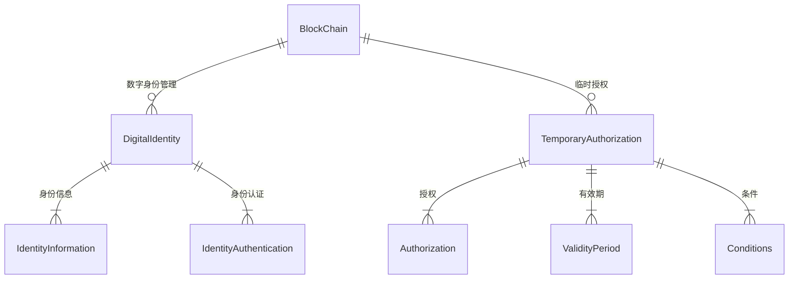
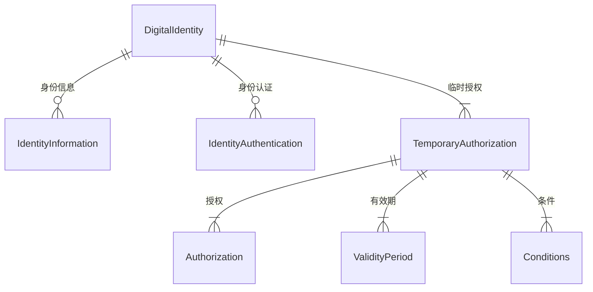

                 

### 文章标题

# 区块链在数字身份临时授权中的安全应用

### 关键词

- 区块链
- 数字身份
- 临时授权
- 安全应用
- 智能合约

### 摘要

本文探讨了区块链在数字身份临时授权中的应用及其安全性。首先，介绍了区块链技术和数字身份临时授权的背景，分析了当前面临的挑战与机遇。接着，详细讲解了区块链的基本原理、数字身份和临时授权的概念及其联系。随后，通过案例分析展示了区块链在具体应用中的效果，并讨论了设计区块链技术架构和实施策略的最佳实践。最后，展望了区块链在数字身份临时授权领域的未来发展趋势及面临的挑战。

## 第1章：区块链与数字身份临时授权概述

### 1.1 区块链技术概述

区块链技术，起源于2008年中本聪（Satoshi Nakamoto）发表的比特币白皮书，是一种分布式数据库系统，具有去中心化、不可篡改和透明化的特点。区块链通过密码学算法，将交易记录封装成区块，然后以时间顺序连接成链条，从而实现了数据的存储和传递。区块链技术的核心在于其共识机制，通过去中心化的方式确保数据的一致性和安全性。

区块链技术的应用场景广泛，包括金融、物流、医疗、供应链等多个领域。在金融领域，区块链技术已广泛应用于数字货币和智能合约；在物流领域，区块链技术可以用于记录商品的生产、运输和销售等全过程，确保信息的透明和可追溯；在医疗领域，区块链技术可以用于存储和管理病人的健康档案，保障数据的安全和隐私。

### 1.2 数字身份与临时授权背景

数字身份，是指在网络空间中，用户用于标识和认证自身身份的一系列信息和特征。随着互联网和物联网的快速发展，数字身份的应用越来越广泛，但同时也带来了诸多挑战。例如，如何确保数字身份的安全性、如何实现身份信息的隐私保护、如何防止身份被盗用等。

临时授权，是指在一定时间段内，授权某个人或系统对某个数字身份进行操作。在数字身份管理中，临时授权机制可以有效地减少安全隐患，防止未授权访问和数据泄露。例如，在金融交易中，用户可以通过临时授权机制授权银行或支付平台在特定时间内访问其账户信息。

### 1.3 区块链在数字身份临时授权中的优势

区块链技术适合用于数字身份临时授权，原因有以下几点：

1. **去中心化和分布式特性**：区块链的去中心化特性使得数字身份的授权和管理无需依赖单一中心化的机构，从而减少了信任风险。分布式特性则保证了数据的完整性和可追溯性。

2. **不可篡改性**：区块链上的数据一旦被记录，就无法被篡改或删除，确保了数字身份信息的真实性和完整性。

3. **智能合约**：智能合约是区块链上的自动化协议，可以根据预设的条件自动执行。在数字身份临时授权中，智能合约可以用于自动化处理授权过程，提高效率。

4. **隐私保护**：区块链技术可以采用零知识证明、同态加密等技术手段，实现对数字身份信息的隐私保护。

### 1.4 当前挑战与机遇

尽管区块链在数字身份临时授权中具有诸多优势，但实际应用中也面临着一些挑战：

1. **技术成熟度**：区块链技术尚处于发展初期，其性能、可扩展性和安全性等问题仍需进一步优化。

2. **法律法规**：不同国家和地区的法律法规对于区块链技术的应用有着不同的规定，需要制定相应的法律法规以保障数字身份临时授权的合法性和合规性。

3. **用户接受度**：区块链技术的普及度较低，用户对其认知和信任度有待提高。

4. **跨链互操作**：不同区块链平台之间的互操作性仍需加强，以实现不同系统之间的数据共享和协同。

然而，随着技术的不断发展和应用的深入，区块链在数字身份临时授权领域的机遇也日益显现。通过解决上述挑战，区块链有望在数字身份临时授权中发挥更大的作用。

## 第2章：核心概念与联系

### 2.1 区块链与数字身份

#### 区块链

区块链是一种分布式账本技术，通过密码学算法确保数据的存储和传递安全。其核心概念包括：

- **区块**：记录一系列交易数据的结构，包含一个时间戳、一个交易列表和一个哈希值。
- **链**：多个区块按照时间顺序连接而成的链条，每一个区块都包含前一个区块的哈希值。
- **共识机制**：确保分布式网络中所有节点对数据一致性达成一致的方法，如工作量证明（PoW）、权益证明（PoS）等。

#### 数字身份

数字身份是在网络空间中用于标识和认证个体的一系列信息和特征。其核心概念包括：

- **身份标识**：用于唯一标识个体的信息，如用户名、电子邮箱、手机号等。
- **身份认证**：验证个体身份的真实性，如密码、双因素认证、生物识别等。
- **身份信息**：与个体身份相关的个人信息，如姓名、出生日期、身份证号等。

#### 区块链与数字身份的联系

区块链技术可以用于数字身份管理，通过以下方式实现：

- **去中心化身份认证**：区块链的去中心化特性使得身份认证不再依赖于中心化机构，提高了安全性和效率。
- **不可篡改的身份记录**：区块链上的身份信息一旦记录，就无法被篡改，确保了身份信息的真实性和完整性。
- **智能合约**：智能合约可以用于自动化处理数字身份的授权和认证过程，减少了人为干预和错误。

### 2.2 临时授权机制

#### 临时授权

临时授权是一种在一定时间段内授权他人或系统访问特定资源的机制。其核心概念包括：

- **授权**：将特定权限临时赋予他人或系统的过程。
- **有效期**：授权的有效时间范围。
- **条件**：触发授权的特定条件，如时间、事件等。
- **撤销**：提前终止授权的过程。

#### 临时授权机制

临时授权机制可以采用以下方法实现：

- **基于时间的授权**：授权在特定时间段内生效，如临时授权他人访问账户30天。
- **基于事件的授权**：授权在特定事件发生后生效，如授权他人访问某个项目的权限。
- **权限范围**：明确授权的具体权限范围，如读取、写入、修改等。

### 2.3 安全应用与Mermaid ER图

为了更好地理解区块链、数字身份和临时授权之间的关系，我们可以使用Mermaid ER图来展示它们之间的联系。

在这个ER图中，区块链与数字身份、临时授权之间存在直接的关联关系。数字身份管理依赖于区块链技术，临时授权机制则基于数字身份进行实现。

### 第3章：区块链技术原理

#### 3.1 区块链基本原理

区块链是一种分布式数据结构，用于存储一系列按时间顺序排列的数据区块。每个区块都包含一定的交易数据，以及一个时间戳和一个指向前一个区块的哈希值。区块链的核心原理在于其去中心化的分布式共识机制，通过这种机制，区块链上的数据具有高度的安全性和不可篡改性。

区块链的基本组成部分包括：

- **区块**：记录一定时间内发生的交易数据，并包含一个时间戳和一个哈希值。
- **链**：多个区块按照时间顺序连接形成的链条。
- **共识机制**：分布式网络中节点通过共识机制达成数据一致性。
- **节点**：参与区块链网络的计算设备，负责验证和存储数据。

区块链的工作流程如下：

1. **交易发起**：用户发起交易请求，包括交易金额、接收方地址等。
2. **交易验证**：交易请求经过网络中多个节点的验证，确保交易合法。
3. **区块生成**：验证后的交易数据被添加到一个新的区块中。
4. **区块广播**：新的区块通过网络广播至其他节点。
5. **共识确认**：节点通过共识机制确认新区块的有效性，并将其添加到区块链上。

#### 3.2 分布式账本

分布式账本是区块链的核心特性之一，其通过去中心化的方式存储和管理数据，使得数据具有较高的安全性和可靠性。在分布式账本中，数据存储在多个节点上，每个节点都保留一份完整的账本副本。

分布式账本的特点包括：

- **去中心化**：数据存储不再依赖单一中心化机构，降低了信任风险。
- **高度可靠**：通过多个节点的备份，保证了数据的完整性和可靠性。
- **不可篡改**：一旦数据被记录到区块链上，就难以被篡改，确保了数据的真实性和完整性。

#### 3.3 智能合约

智能合约是一种自动执行的合约，其基于区块链技术实现。智能合约在区块链上执行，无需第三方介入，从而提高了效率和降低成本。智能合约的核心在于其自动化和不可篡改性，通过预先设定的规则和条件，智能合约可以自动执行相应的操作。

智能合约的特点包括：

- **自动化**：智能合约可以自动执行预设的操作，无需人工干预。
- **不可篡改**：智能合约一旦部署，就无法被修改，保证了执行的公正性和透明性。
- **高效性**：智能合约的执行速度远高于传统合约，降低了交易成本。

#### 3.4 区块链技术架构

区块链技术架构主要包括三个主要部分：节点、区块链网络和智能合约。

1. **节点**：节点是区块链网络中的计算设备，负责验证和存储数据。节点可以分为矿工节点和普通节点，矿工节点负责生成区块和验证交易，普通节点负责存储和维护区块链的完整副本。

2. **区块链网络**：区块链网络是由多个节点组成的分布式网络，节点通过通信和共识机制实现数据的同步和验证。区块链网络的特点是去中心化、安全性和高可靠性。

3. **智能合约**：智能合约是区块链上的自动化协议，其基于编程语言实现。智能合约在区块链上执行，可以用于实现去中心化的应用和服务。

在区块链技术架构中，节点、区块链网络和智能合约相互协作，共同实现了去中心化的数据存储和自动化执行。节点通过共识机制确保数据的一致性和安全性，智能合约则提供了灵活的编程接口，使得区块链可以用于实现各种应用场景。

### 第4章：数字身份与临时授权

#### 4.1 数字身份概念

数字身份是指在网络空间中用于标识和认证个体的一系列信息和特征。数字身份的特点包括：

- **唯一性**：每个数字身份都是唯一的，用于区分不同的个体。
- **可认证性**：数字身份可以通过各种认证手段进行验证，确保真实性和安全性。
- **可管理性**：数字身份可以由用户或管理员进行管理和修改。

数字身份的核心要素包括：

- **身份标识**：用于唯一标识个体的信息，如用户名、电子邮箱、手机号等。
- **身份认证**：验证个体身份的真实性，如密码、双因素认证、生物识别等。
- **身份信息**：与个体身份相关的个人信息，如姓名、出生日期、身份证号等。

#### 4.2 临时授权机制

临时授权机制是一种在一定时间段内授权他人或系统访问特定资源的机制。其核心概念包括：

- **授权**：将特定权限临时赋予他人或系统的过程。
- **有效期**：授权的有效时间范围。
- **条件**：触发授权的特定条件，如时间、事件等。
- **撤销**：提前终止授权的过程。

临时授权机制可以采用以下方法实现：

- **基于时间的授权**：授权在特定时间段内生效，如临时授权他人访问账户30天。
- **基于事件的授权**：授权在特定事件发生后生效，如授权他人访问某个项目的权限。
- **权限范围**：明确授权的具体权限范围，如读取、写入、修改等。

#### 4.3 数字身份安全

数字身份安全是数字身份管理的重要方面，其涉及到身份信息的保护、认证的安全性以及授权的合法性。数字身份安全的核心要素包括：

- **身份信息保护**：确保身份信息不被未经授权的实体访问，如采用加密算法、访问控制等技术手段。
- **身份认证安全**：确保身份认证过程的安全性，如采用多因素认证、生物识别等技术手段。
- **授权管理**：确保授权过程的合法性，如采用智能合约、权限控制等技术手段。

#### 4.4 Mermaid实体关系图

为了更好地理解数字身份与临时授权之间的关系，我们可以使用Mermaid实体关系图来展示它们之间的联系。

在这个ER图中，数字身份与身份信息、身份认证之间存在直接的关联关系。数字身份是身份信息和管理认证的基础，临时授权则是基于数字身份进行实现，包括授权、有效期和条件等。

### 第5章：安全应用案例分析

#### 5.1 案例一：数字身份临时授权在金融领域的应用

数字身份临时授权在金融领域有着广泛的应用，特别是在跨境支付、信用评估和反欺诈等方面。以下是一个具体的案例：

**场景**：某银行开发了一款跨境支付应用，用户可以通过该应用向海外账户发送资金。为了保证支付的安全性，银行采用了数字身份临时授权机制。

**解决方案**：

1. **用户注册**：用户在应用中注册时，需要提供个人信息进行身份认证，并生成唯一的数字身份标识。
2. **交易授权**：当用户发起跨境支付请求时，系统会根据用户的数字身份生成临时授权令牌，并设定有效期为30分钟。
3. **支付验证**：在支付过程中，银行系统会验证临时授权令牌的有效性，确保交易的安全性。
4. **授权撤销**：在支付完成后，系统会自动撤销临时授权令牌，防止未授权访问。

**成功因素**：

- **高安全性**：数字身份临时授权机制有效防止了未授权访问和数据泄露。
- **高效性**：临时授权令牌的生成和验证过程快速，提高了支付效率。
- **灵活性**：可以根据不同交易场景设置不同的临时授权有效期和权限范围。

**面临的挑战**：

- **技术成熟度**：区块链技术尚处于发展初期，其性能和稳定性需要进一步优化。
- **用户接受度**：用户对区块链技术的认知和信任度较低，需要加强宣传和培训。
- **法律法规**：不同国家和地区的法律法规对于区块链技术的应用有着不同的规定，需要制定相应的合规策略。

#### 5.2 案例二：数字身份临时授权在供应链管理中的应用

数字身份临时授权在供应链管理中也得到了广泛应用，特别是在供应商管理、订单执行和物流追踪等方面。以下是一个具体的案例：

**场景**：某大型零售企业采用区块链技术管理其供应链，为了保证供应链的透明性和安全性，企业引入了数字身份临时授权机制。

**解决方案**：

1. **供应商注册**：供应商在加入供应链时，需要提供相关信息进行身份认证，并生成唯一的数字身份标识。
2. **订单生成**：当零售企业向供应商下单时，系统会生成一个订单，并根据供应商的数字身份生成临时授权令牌。
3. **订单执行**：供应商在接收到订单后，根据临时授权令牌进行订单处理，如备货、发货等。
4. **物流追踪**：系统会记录物流信息，并根据临时授权令牌允许供应商查询订单状态。

**成功因素**：

- **透明性**：区块链技术确保了供应链信息的透明和可追溯，提高了供应链效率。
- **安全性**：数字身份临时授权机制有效防止了未授权访问和数据泄露。
- **协同性**：供应链各方可以通过区块链实现实时协同，降低了沟通成本和误差。

**面临的挑战**：

- **技术成熟度**：区块链技术尚处于发展初期，其性能和稳定性需要进一步优化。
- **数据隐私**：在供应链管理中，涉及大量的敏感数据，需要确保数据隐私和安全。
- **法律法规**：不同国家和地区的法律法规对于区块链技术的应用有着不同的规定，需要制定相应的合规策略。

### 第6章：技术架构与实施策略

#### 6.1 技术架构设计

为了实现数字身份临时授权在区块链上的安全应用，需要设计一个高效、稳定、可扩展的技术架构。以下是一个典型的技术架构设计：

1. **区块链网络**：采用分布式区块链网络，包括矿工节点、普通节点和智能合约节点。矿工节点负责生成区块和验证交易，普通节点负责存储区块链的完整副本，智能合约节点负责执行智能合约。

2. **数字身份管理系统**：包括用户注册、身份认证、授权管理等模块。用户注册时生成数字身份标识，并通过身份认证模块验证身份。授权管理模块负责生成和管理临时授权令牌。

3. **智能合约**：包括数字身份认证合约、临时授权合约和支付合约。数字身份认证合约用于验证用户身份，临时授权合约用于生成和管理临时授权令牌，支付合约用于处理支付请求。

4. **数据存储**：采用分布式数据库系统，存储用户信息、交易记录和智能合约代码。

5. **API接口**：提供RESTful API接口，供前端应用调用，实现用户注册、登录、身份认证、授权管理等操作。

#### 6.2 实施策略

1. **需求分析**：首先，明确数字身份临时授权的应用场景和需求，包括用户注册、身份认证、授权管理、支付处理等。

2. **技术选型**：选择合适的区块链平台和开发工具，如Hyperledger Fabric、Node.js等。

3. **架构设计**：根据需求分析，设计区块链网络、数字身份管理系统、智能合约、数据存储和API接口等模块。

4. **开发与测试**：根据架构设计，开发各个模块，并进行单元测试和集成测试，确保系统的稳定性和性能。

5. **部署与运维**：将系统部署到生产环境，并进行监控和运维，确保系统的正常运行。

#### 6.3 最佳实践

1. **身份认证**：采用多因素认证，如密码、双因素认证、生物识别等，确保身份认证的安全性。

2. **权限管理**：根据用户角色和权限，设置不同的授权范围和有效期，确保授权的合理性和安全性。

3. **数据加密**：对用户信息和交易数据进行加密存储，确保数据隐私和安全。

4. **智能合约**：采用模块化设计，将智能合约拆分为多个组件，提高代码的可维护性和可扩展性。

5. **监控与审计**：实时监控系统运行状态，定期进行审计，确保系统的安全性和合规性。

### 第7章：未来发展趋势与挑战

#### 7.1 发展趋势

随着区块链技术的不断成熟和应用场景的扩大，数字身份临时授权在未来将呈现出以下发展趋势：

1. **技术应用普及**：区块链技术将更加成熟，应用于数字身份临时授权的场景将更加广泛。
2. **跨链互操作**：不同区块链平台之间的互操作性将得到提升，实现不同系统之间的数据共享和协同。
3. **隐私保护**：随着隐私保护需求的增加，区块链技术将在数字身份临时授权中采用更加先进的隐私保护技术。
4. **标准化**：数字身份临时授权领域的标准化将得到推进，提高不同系统之间的兼容性和互操作性。

#### 7.2 挑战与解决方案

尽管区块链在数字身份临时授权中具有巨大的潜力，但实际应用中仍面临一些挑战：

1. **技术成熟度**：区块链技术尚处于发展初期，其性能、可扩展性和安全性等问题需要进一步优化。
2. **法律法规**：不同国家和地区的法律法规对于区块链技术的应用有着不同的规定，需要制定相应的法律法规以保障数字身份临时授权的合法性和合规性。
3. **用户接受度**：区块链技术的普及度较低，用户对其认知和信任度有待提高。
4. **跨链互操作**：不同区块链平台之间的互操作性仍需加强，以实现不同系统之间的数据共享和协同。

解决方案：

1. **技术优化**：持续优化区块链技术的性能、可扩展性和安全性，提高其在数字身份临时授权中的应用效果。
2. **法规制定**：加强国际合作，制定统一的法律法规，保障区块链技术的合法应用。
3. **用户教育**：通过宣传和培训，提高用户对区块链技术的认知和信任度。
4. **跨链互操作**：推动区块链平台之间的互操作性，实现不同系统之间的数据共享和协同。

### 总结

区块链在数字身份临时授权中具有巨大的潜力，通过去中心化、不可篡改和智能合约等特性，可以实现安全、高效和灵活的数字身份管理。然而，要实现这一目标，仍需要克服技术、法规和用户接受度等方面的挑战。未来，随着技术的不断发展和应用的深入，区块链在数字身份临时授权领域的应用将越来越广泛，为构建更加安全、透明和高效的数字世界提供有力支持。

### 作者信息

作者：AI天才研究院/AI Genius Institute & 禅与计算机程序设计艺术 /Zen And The Art of Computer Programming

