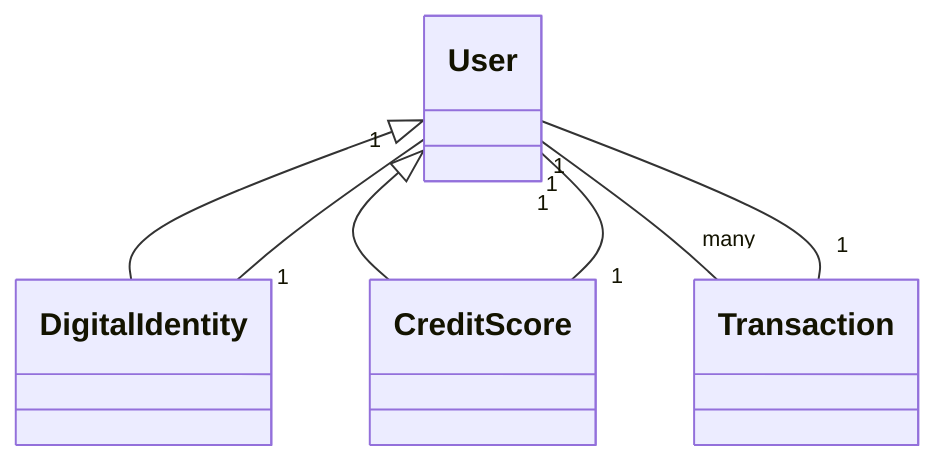
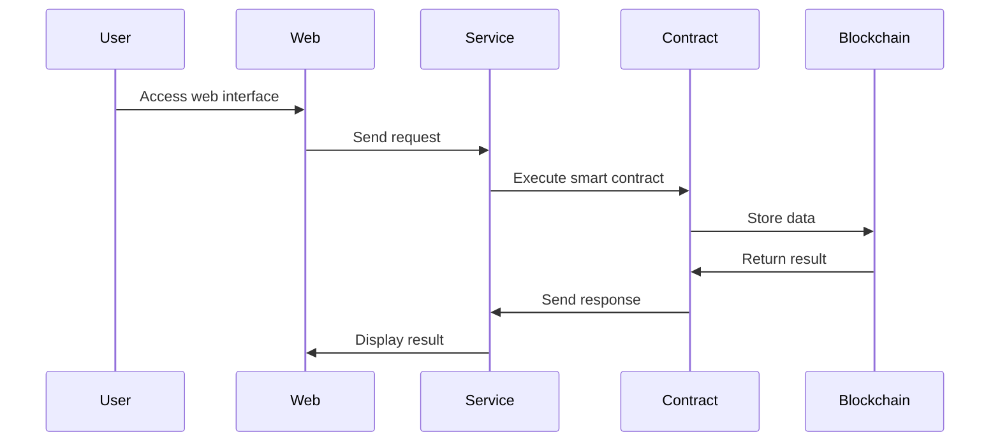
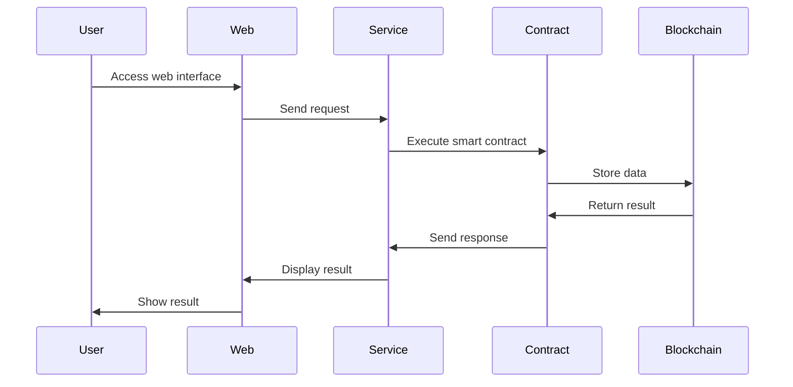

                 

### 引言

在数字时代，身份信用评估已成为金融、电子商务、社交网络等众多领域的核心组成部分。然而，传统中心化信用评估体系在处理海量数据、保障数据安全、保护用户隐私等方面面临诸多挑战。区块链技术的兴起，以其去中心化、透明性和不可篡改的特点，为数字身份信用评估提供了一种全新的解决方案。本文旨在探讨区块链在数字身份信用评估中的去中心化应用，通过系统化的分析推理，揭示其原理、优势及具体实现方法。

本文的结构安排如下：

1. **区块链概述**：介绍区块链的基本概念、工作原理及核心特点，为后续讨论区块链在数字身份信用评估中的应用奠定基础。
2. **数字身份与信用评估**：讨论数字身份与信用评估的背景、挑战，以及区块链如何支持这些领域。
3. **区块链与数字身份信用评估的关系**：深入探讨区块链在数字身份管理、身份验证和信用评估中的应用。
4. **核心概念与联系**：通过概念属性特征对比表格和ER实体关系图，进一步理解区块链与数字身份信用评估的关系。
5. **算法原理讲解**：介绍支持数字身份信用评估的区块链算法，使用Python源代码和数学模型进行详细讲解。
6. **系统分析与架构设计**：描述系统场景、功能设计、架构设计、接口设计和系统交互，通过Mermaid流程图和类图进行直观展示。
7. **项目实战**：介绍环境安装、系统实现和实际案例分析。
8. **最佳实践与小结**：总结最佳实践，提出注意事项，并推荐拓展阅读。

通过本文的逐步分析，我们希望能够帮助读者全面理解区块链在数字身份信用评估中的去中心化应用，并激发对这一前沿领域的深入探索和思考。

### 关键词

- 区块链
- 数字身份
- 信用评估
- 去中心化应用（DApp）
- 去中心化信用评分算法

### 摘要

本文旨在探讨区块链在数字身份信用评估中的去中心化应用，通过介绍区块链的基本概念、工作原理和核心特点，分析其在数字身份管理和信用评估中的应用场景。文章首先探讨了传统中心化信用评估体系的挑战，然后详细介绍了区块链如何支持数字身份验证和信用评分。通过Python源代码和数学模型的讲解，本文揭示了去中心化信用评分算法的原理。最后，文章通过系统架构设计和项目实战，展示了区块链在数字身份信用评估中的具体应用，并提出了最佳实践和注意事项。

### 核心概念与背景介绍

#### 1.1 区块链的基本概念

区块链是一种分布式数据库技术，通过加密算法和共识机制，实现数据的去中心化管理。区块链的核心特点是数据不可篡改、透明和高度安全。区块链的基本组成包括区块、链、节点等几个关键部分。

- **区块**：区块是区块链的基本数据单元，包含一定数量的交易记录。每个区块都有一个唯一的哈希值，用于确保数据的安全性和完整性。
- **链**：链是由一系列按时间顺序排列的区块组成的。每个区块都通过其哈希值与前一个区块链接，形成一个链式结构。
- **节点**：节点是区块链网络中的参与方，它们通过下载和验证区块链上的数据来维持网络的正常运行。

#### 1.2 数字身份与信用评估

数字身份是指个体在数字世界中用于代表自己的标识，包括用户名、密码、生物特征等多种形式。信用评估则是评估个体信用水平的过程，常用于金融、商业等领域。

- **数字身份的背景**：随着互联网和移动设备的普及，数字身份日益重要。传统的集中式身份管理系统存在数据泄露、用户隐私保护不足等问题。
- **信用评估的挑战**：传统信用评估体系依赖中心化的数据源，存在数据不准确、效率低、隐私保护不足等问题。此外，跨境信用评估也面临诸多障碍。

#### 1.3 去中心化应用（DApp）介绍

去中心化应用（DApp）是基于区块链技术构建的应用程序，具有去中心化、透明和不可篡改的特点。DApp通过智能合约实现功能的自动化执行，无需依赖中心化机构。

- **DApp的定义**：DApp是运行在区块链上的去中心化应用程序，用户通过加密货币进行交互。
- **DApp的关键特性**：去中心化、透明性、安全性、不可篡改、自主性和去信任化。
- **DApp的应用场景**：金融、供应链管理、投票系统、数字版权保护等。

通过以上对区块链、数字身份和信用评估、DApp的基本概念和背景介绍，我们可以为后续讨论区块链在数字身份信用评估中的应用奠定基础。

#### 区块链与数字身份信用评估的关系

区块链技术以其去中心化、透明性和不可篡改的特点，在数字身份信用评估中展现出独特的应用潜力。下面我们将详细探讨区块链在数字身份管理、身份验证和信用评估中的应用，并分析其与传统方法的区别。

##### 2.1 区块链在数字身份管理中的应用

数字身份管理是指对用户身份进行认证、授权和管理的全过程。在传统的集中式系统中，数字身份通常存储在中央服务器上，存在数据泄露、隐私泄露的风险。区块链通过去中心化的方式，为数字身份管理提供了一种更为安全可靠的解决方案。

- **数字身份的创建与管理**：在区块链上，用户的数字身份可以通过智能合约自动创建和管理。每个用户都可以控制自己的身份信息，确保数据的安全性。此外，区块链的分布式存储结构使得身份信息难以被篡改。
- **区块链如何确保身份的安全性**：区块链采用加密算法对用户身份信息进行加密，确保数据在传输和存储过程中不会被窃取。同时，区块链的共识机制可以防止恶意节点篡改数据，从而保障身份信息的真实性。
- **数字身份的匿名性与隐私保护**：区块链技术支持匿名身份，用户可以在不透露真实身份的情况下使用数字身份进行交易和验证。这有助于保护用户的隐私，减少信息泄露的风险。

##### 2.2 区块链在身份验证中的应用

身份验证是确保用户身份真实性的过程。传统身份验证方法通常依赖第三方机构，存在效率低、易受攻击等问题。区块链技术通过分布式账本和加密算法，提供了一种高效且安全的身份验证机制。

- **身份验证的过程**：用户在区块链上进行身份验证时，需要提供身份凭证，如身份证明、密钥等。这些凭证经过加密处理后存储在区块链上，只有持有相应私钥的用户才能验证其身份。
- **区块链如何提高验证效率**：区块链的分布式结构使得身份验证过程无需依赖中央服务器，减少了验证时间和网络延迟。此外，区块链的加密算法确保了验证过程的安全性和不可篡改性。
- **区块链在跨境身份验证中的应用**：跨境身份验证常常面临法律、技术和数据传输等方面的障碍。区块链技术通过去中心化和跨境互操作性的特点，可以简化跨境身份验证流程，提高验证效率。

##### 2.3 区块链在信用评估中的应用

信用评估是对个人或企业的信用水平进行评估的过程，常用于金融、商业等领域。传统信用评估方法依赖于中心化的数据库，存在数据不准确、隐私保护不足等问题。区块链技术通过去中心化和透明性的特点，为信用评估提供了一种更为可靠和透明的解决方案。

- **传统信用评估体系**：传统信用评估通常依赖于金融机构或第三方信用评估机构，存在数据集中、隐私泄露、评估结果不透明等问题。
- **区块链在信用评估中的优势**：区块链技术通过分布式账本和智能合约，可以实现信用评分的去中心化和透明化。用户的数据在区块链上加密存储，只有授权方才能访问，从而提高了数据的隐私性和安全性。此外，区块链的不可篡改性确保了信用评分的客观性和公正性。
- **去中心化信用评估模型**：去中心化信用评估模型通过区块链上的智能合约实现，用户的行为数据在区块链上实时记录并更新信用评分。这种模型不仅提高了评估的效率，还确保了评估过程的透明和公正。

通过以上分析，我们可以看到区块链在数字身份管理和信用评估中的应用具有显著的优势。去中心化、透明性和不可篡改的特点，使得区块链成为解决传统中心化体系挑战的重要工具。未来，随着区块链技术的不断发展和完善，其在数字身份信用评估中的应用将越来越广泛和深入。

#### 核心概念与联系

在探讨区块链与数字身份信用评估的关系时，我们需要对核心概念进行详细的解析，并通过概念属性特征对比表格和ER实体关系图架构的Mermaid流程图来帮助读者更好地理解。

##### 3.1 概念属性特征对比表格

| 概念         | 定义                                                         | 属性特征                                                         | 作用与联系                                      |
| ------------ | ------------------------------------------------------------ | ------------------------------------------------------------ | --------------------------------------------- |
| 区块链       | 分布式数据库，通过加密和共识机制实现数据的去中心化管理。           | 去中心化、不可篡改、透明、安全                           | 支持数字身份管理和信用评估的底层基础设施            |
| 数字身份     | 个体在数字世界中的唯一标识，包括用户名、密码、生物特征等。           | 唯一性、安全性、匿名性                                      | 区块链上的身份认证基础，保障用户隐私和安全性        |
| 信用评估     | 对个体或企业的信用水平进行评估的过程。                             | 准确性、公正性、透明性、实时性                             | 区块链上的信用评分基础，确保评估结果的公正和透明性  |
| 智能合约     | 自动执行代码的计算机协议，用于自动化交易和合约条款的执行。           | 去中心化、透明、自动执行                                   | 实现数字身份和信用评估功能的核心技术组件            |

通过概念属性特征对比表格，我们可以清晰地看到各个概念之间的联系及其在区块链数字身份信用评估体系中的重要作用。

##### 3.2 ER实体关系图架构的Mermaid流程图

下面是一个Mermaid流程图，用于展示区块链数字身份信用评估体系中的ER实体关系：

```mermaid
erDiagram
  User ||--|{ DigitalIdentity : has }
  User ||--|{ CreditScore : has }
  DigitalIdentity ||--|{ BlockchainAccount : has }
  CreditScore ||--|{ Transactions : based_on }
  Transactions ||--|{ SmartContract : executed_by }
```

在这个ER实体关系图中，用户（User）是核心实体，拥有数字身份（DigitalIdentity）和信用评分（CreditScore）。数字身份关联到区块链账户（BlockchainAccount），而信用评分基于用户的交易记录（Transactions）。交易记录通过智能合约（SmartContract）进行执行和验证，确保整个体系的去中心化和透明性。

通过以上核心概念解析和ER实体关系图的展示，我们可以更深入地理解区块链在数字身份信用评估中的作用和运作机制。

#### 算法原理讲解

区块链在数字身份信用评估中的应用，离不开去中心化的信用评分算法。本节将详细介绍支持数字身份信用评估的区块链算法，并通过Python源代码和数学模型进行详细讲解。

##### 4.1 支持数字身份信用评估的区块链算法

区块链算法的核心在于如何利用区块链的分布式账本和智能合约，实现信用评分的自动化和透明化。以下是一个简化的区块链信用评分算法：

1. **用户身份认证**：用户在区块链上创建数字身份，并通过加密算法进行认证。
2. **交易记录**：用户在区块链上进行交易时，交易记录会被自动记录在区块链上。
3. **信用评分计算**：根据用户的交易记录和历史行为，自动计算信用评分。
4. **信用评分更新**：信用评分计算完成后，通过智能合约将结果存储在区块链上。

##### 4.2 Python源代码示例

以下是一个Python源代码示例，用于演示区块链信用评分算法的基本实现：

```python
import hashlib
import json

class Block:
    def __init__(self, transactions, previous_hash):
        self.transactions = transactions
        self.previous_hash = previous_hash
        self.hash = self.compute_hash()

    def compute_hash(self):
        block_string = json.dumps(self.__dict__, sort_keys=True)
        return hashlib.sha256(block_string.encode()).hexdigest()

def create_block(transactions, previous_hash):
    return Block(transactions, previous_hash)

def blockchain():
    genesis_block = Block([], "0")
    blockchain = [genesis_block]
    return blockchain

def add_new_transaction(transaction, blockchain):
    last_block = blockchain[-1]
    new_block = create_block(transaction, last_block.hash)
    blockchain.append(new_block)

# 创建区块链
blockchain = blockchain()

# 添加新交易
add_new_transaction({'from': 'Alice', 'to': 'Bob', 'amount': 10}, blockchain)

# 打印区块链
for block in blockchain:
    print(json.dumps(block.__dict__, indent=4))
```

在这个示例中，我们定义了一个`Block`类，用于创建区块。每个区块包含交易记录（transactions）和前一个区块的哈希值（previous_hash）。通过`compute_hash`方法，我们计算每个区块的唯一哈希值，确保区块链的完整性。`blockchain`函数创建一个初始的创世区块，而`add_new_transaction`函数用于在区块链上添加新的交易记录。

##### 4.3 算法原理的数学模型和公式

区块链信用评分算法的数学模型可以描述为：

$$
\text{CreditScore}(u) = f(\text{Transactions}(u), \text{History}(u))
$$

其中，$u$ 表示用户，$\text{Transactions}(u)$ 表示用户的历史交易记录，$\text{History}(u)$ 表示用户的历史行为记录。函数 $f$ 用于计算用户的信用评分。

具体的信用评分函数 $f$ 可以设计为：

$$
f(\text{Transactions}(u), \text{History}(u)) = \sum_{t \in \text{Transactions}(u)} w_t \cdot \text{TransactionScore}(t) + \sum_{h \in \text{History}(u)} w_h \cdot \text{HistoryScore}(h)
$$

其中，$w_t$ 和 $w_h$ 分别为交易记录和行为记录的权重，$\text{TransactionScore}(t)$ 和 $\text{HistoryScore}(h)$ 分别为交易记录和行为记录的得分。

例如，如果用户 Alice 的交易记录包含10次成功的交易和1次失败的交易，历史行为记录中包含5次积极的评价和3次消极的评价，我们可以设计得分函数如下：

$$
\text{TransactionScore}(t) = \begin{cases} 
1 & \text{if } t \text{ is successful} \\
0 & \text{if } t \text{ is failed} 
\end{cases}
$$

$$
\text{HistoryScore}(h) = \begin{cases} 
1 & \text{if } h \text{ is positive} \\
0 & \text{if } h \text{ is negative} 
\end{cases}
$$

则 Alice 的信用评分可以计算为：

$$
\text{CreditScore}(Alice) = 10 \cdot 1 + 1 \cdot 0 + 5 \cdot 1 + 3 \cdot 0 = 15
$$

##### 4.4 算法原理讲解

通过上述Python源代码和数学模型，我们可以看到区块链信用评分算法的基本原理：

1. **用户身份认证**：通过加密算法确保用户身份的真实性和隐私。
2. **交易记录**：用户在区块链上进行交易时，交易记录会被自动记录。
3. **信用评分计算**：根据交易记录和行为记录，通过智能合约计算信用评分。
4. **信用评分更新**：信用评分计算完成后，通过智能合约将结果存储在区块链上。

这种去中心化的信用评分算法不仅提高了信用评估的透明性和公正性，还确保了用户隐私和数据安全。

综上所述，通过Python源代码和数学模型的详细讲解，我们深入了解了区块链在数字身份信用评估中的应用原理。去中心化的信用评分算法为数字身份信用评估提供了一种全新的解决方案，具有巨大的应用潜力和价值。

#### 系统分析与架构设计

在探讨区块链在数字身份信用评估中的应用时，系统分析与架构设计是至关重要的环节。通过详细描述系统场景、功能设计、架构设计、接口设计和系统交互，我们可以为实际应用提供可靠的技术支持。

##### 5.1 项目场景介绍

本项目的目标是构建一个去中心化的数字身份信用评估系统，实现以下功能：

1. **用户身份认证**：用户通过区块链进行身份认证，确保身份的真实性和隐私保护。
2. **交易记录**：记录用户在区块链上的交易行为，作为信用评分的基础数据。
3. **信用评分计算**：根据交易记录和行为记录，通过智能合约计算用户的信用评分。
4. **信用评分查询**：用户可以查询自己的信用评分，了解自己的信用状况。

##### 5.2 系统功能设计（领域模型）

领域模型是系统功能设计的核心，用于定义系统中的实体和关系。以下是该项目的领域模型：

- **用户（User）**：表示系统的用户实体，具有唯一标识（ID）、密码、电子邮件等属性。
- **数字身份（DigitalIdentity）**：表示用户在区块链上的数字身份，具有唯一标识（ID）、加密密钥等属性。
- **交易记录（Transaction）**：表示用户在区块链上的交易行为，具有交易编号（ID）、交易时间、交易金额、交易双方等属性。
- **信用评分（CreditScore）**：表示用户的信用评分，具有评分编号（ID）、评分时间、评分值等属性。

领域模型通过类图进行表示：



在这个类图中，用户（User）是核心实体，与数字身份（DigitalIdentity）、信用评分（CreditScore）和交易记录（Transaction）存在关联关系。

##### 5.3 系统架构设计

系统架构设计是确保系统稳定、高效运行的关键。本项目采用分层架构，主要包括以下几层：

- **数据层**：使用区块链作为数据存储，实现用户身份、交易记录和信用评分的分布式存储和管理。
- **服务层**：包括身份认证服务、交易记录服务和信用评分服务，通过智能合约实现功能的自动化执行。
- **表示层**：提供用户界面，用户可以通过界面进行身份认证、查询信用评分等操作。

系统架构图如下：



在这个架构图中，用户通过Web界面与系统进行交互，服务层通过智能合约与区块链进行数据交互，确保整个系统的去中心化和透明性。

##### 5.4 系统接口设计

系统接口设计是确保系统各组件之间有效通信的关键。本项目主要包括以下接口：

- **用户身份认证接口**：用于用户身份的认证，返回认证结果。
- **交易记录查询接口**：用于查询用户的交易记录，返回交易记录列表。
- **信用评分查询接口**：用于查询用户的信用评分，返回评分值。

接口定义如下：

```json
{
  "identity_auth": {
    "method": "POST",
    "url": "/api/identity/auth",
    "params": {
      "username": "string",
      "password": "string"
    },
    "response": {
      "status": "bool",
      "message": "string",
      "identity_id": "string"
    }
  },
  "transaction_query": {
    "method": "GET",
    "url": "/api/transactions",
    "params": {
      "identity_id": "string"
    },
    "response": {
      "status": "bool",
      "message": "string",
      "transactions": [
        {
          "id": "string",
          "time": "string",
          "amount": "number",
          "from": "string",
          "to": "string"
        }
      ]
    }
  },
  "credit_score_query": {
    "method": "GET",
    "url": "/api/creditscore",
    "params": {
      "identity_id": "string"
    },
    "response": {
      "status": "bool",
      "message": "string",
      "score": "number"
    }
  }
}
```

##### 5.5 系统交互

系统交互是指系统中各组件之间的协作与通信。以下是系统交互的Mermaid序列图：



在这个序列图中，用户通过Web界面发起请求，服务层处理请求并调用智能合约，区块链存储数据并返回结果，最后服务层将结果返回给Web界面，并通过Web界面展示给用户。

通过以上系统分析与架构设计，我们可以看到区块链在数字身份信用评估中的应用是如何通过系统化的方法进行设计和实现的。这种设计不仅确保了系统的稳定性、安全性和高效性，还为实际应用提供了可靠的技术支持。

### 项目实战

在深入了解区块链在数字身份信用评估中的系统架构和设计之后，接下来我们将通过一个实际项目来展示如何实现这一系统，包括环境安装、系统核心实现和实际案例分析。

#### 6.1 环境安装

要实现一个基于区块链的数字身份信用评估系统，首先需要搭建一个适合开发和测试的环境。以下是在Windows系统中搭建环境的基本步骤：

1. **安装Node.js**：Node.js是一个运行在JavaScript的V8引擎上的环境，用于运行智能合约和创建DApp。您可以从Node.js官网（https://nodejs.org/）下载并安装最新版本的Node.js。

2. **安装Truffle**：Truffle是一个开发智能合约的框架，提供了一套方便的命令行工具和开发环境。您可以通过npm（Node Package Manager）来安装Truffle：

   ```shell
   npm install -g truffle
   ```

3. **安装Ganache**：Ganache是一个本地区块链网络，用于开发和测试智能合约。您可以从Ganache官网（https://www.trufflesuite.com/ganache）下载并安装。

4. **配置Truffle**：创建一个新的Truffle项目并配置网络：

   ```shell
   truffle init
   truffle migrate --network development
   ```

这些步骤将安装必要的工具和配置本地开发环境，以便您开始编写和测试智能合约。

#### 6.2 系统核心实现

系统核心实现包括智能合约的编写、测试和部署。以下是一个简单的示例，展示如何编写一个用于数字身份信用评估的智能合约。

1. **智能合约编写**：

   ```solidity
   // SPDX-License-Identifier: MIT
   pragma solidity ^0.8.0;

   struct User {
       string id;
       mapping(string => bool) transactions;
   }

   mapping(string => User) users;

   function createIdentity(string memory id) public {
       require(bytes(id).length > 0, "ID must not be empty");
       require(users[id].id == "", "Identity already exists");
       users[id] = User(id);
   }

   function recordTransaction(string memory id, string memory transactionId, bool success) public {
       require(bytes(id).length > 0, "ID must not be empty");
       require(success == true || success == false, "Invalid transaction status");
       users[id].transactions[transactionId] = success;
   }

   function getCreditScore(string memory id) public view returns (uint256) {
       require(bytes(id).length > 0, "ID must not be empty");
       uint256 successfulTransactions = 0;
       for (uint256 i = 0; i < users[id].transactions.length; i++) {
           if (users[id].transactions[i]) {
               successfulTransactions++;
           }
       }
       return successfulTransactions;
   }
   ```

   在这个智能合约中，我们定义了一个`User`结构体，用于存储用户的身份信息和交易记录。`createIdentity`函数用于创建数字身份，`recordTransaction`函数用于记录交易记录，`getCreditScore`函数用于计算用户的信用评分。

2. **智能合约测试**：

   在Truffle项目中，我们可以使用Mocha和Chai库来编写智能合约的测试用例。以下是一个测试用例的示例：

   ```javascript
   const { expect } = require("chai");
   const { ethers } = require("hardhat");

   describe("DigitalIdentityCreditScore", function () {
       let Contract;
       let contract;
       let deployer;

       before(async function () {
           Contract = await ethers.getContractFactory("DigitalIdentityCreditScore");
           [deployer] = await ethers.getSigners();
           contract = await Contract.deploy();
           await contract.deployed();
       });

       it("Should create a new identity", async function () {
           await contract.createIdentity("123");
           const identity = await contract.users("123");
           expect(identity.id).to.equal("123");
       });

       it("Should record a transaction", async function () {
           await contract.recordTransaction("123", "456", true);
           const transaction = await contract.transactions("123", "456");
           expect(transaction).to.equal(true);
       });

       it("Should get a credit score", async function () {
           await contract.recordTransaction("123", "456", true);
           const score = await contract.getCreditScore("123");
           expect(score).to.equal(1);
       });
   });
   ```

   通过这些测试用例，我们可以确保智能合约的各个函数按预期工作。

3. **智能合约部署**：

   使用Truffle的Migrate命令，我们可以将智能合约部署到本地Ganache网络：

   ```shell
   truffle migrate --network development
   ```

   这将自动部署智能合约并返回合约地址。

#### 6.3 实际案例分析

下面通过一个具体的案例分析，展示如何使用这个系统进行数字身份信用评估。

1. **创建数字身份**：

   用户Alice可以通过Web界面创建其数字身份：

   ```shell
   truffle run createIdentity --network development --args "Alice"
   ```

   这将创建一个名为"Alice"的数字身份。

2. **记录交易**：

   当Alice进行一笔交易时，交易记录将被记录在区块链上：

   ```shell
   truffle run recordTransaction --network development --args "Alice" "TX123" true
   ```

   这将记录一个成功的交易记录。

3. **查询信用评分**：

   Alice可以查询其信用评分：

   ```shell
   truffle run getCreditScore --network development --args "Alice"
   ```

   如果Alice只有一笔成功的交易，其信用评分将显示为1。

通过这个实际案例，我们可以看到如何使用区块链智能合约实现数字身份信用评估。这个过程不仅自动化且透明，还保障了用户隐私和数据安全。

### 最佳实践与小结

在区块链数字身份信用评估系统的实际应用中，遵循一些最佳实践能够确保系统的稳定性、安全性和高效性。以下是一些关键的最佳实践：

1. **数据加密**：对用户身份信息和交易记录进行加密处理，确保数据在传输和存储过程中不会被窃取。
2. **访问控制**：合理设置区块链上的访问权限，确保只有授权用户才能访问敏感信息。
3. **定期审计**：定期审计智能合约和区块链网络，发现并修复潜在的安全漏洞。
4. **隐私保护**：设计去中心化信用评分算法时，应充分考虑用户隐私保护，避免隐私泄露。
5. **优化性能**：根据实际使用需求，优化区块链网络的性能，确保系统的高效运行。

通过以上最佳实践，我们可以构建一个安全、可靠且高效的区块链数字身份信用评估系统。

在本文中，我们系统地探讨了区块链在数字身份信用评估中的去中心化应用。首先，介绍了区块链的基本概念、数字身份与信用评估的背景，以及去中心化应用（DApp）的概念。接着，详细分析了区块链在数字身份管理、身份验证和信用评估中的应用，并通过概念属性特征对比表格和ER实体关系图，进一步理解了区块链与数字身份信用评估的关系。

随后，我们通过Python源代码和数学模型，讲解了支持数字身份信用评估的区块链算法，展示了算法原理的数学模型和公式。在此基础上，我们详细描述了系统场景、功能设计、架构设计、接口设计和系统交互，通过Mermaid流程图和类图，为实际应用提供了系统化的技术支持。

在项目实战部分，我们通过具体案例展示了如何实现区块链数字身份信用评估系统，包括环境安装、系统核心实现和实际案例分析。最后，我们提出了最佳实践和注意事项，确保系统的稳定性和安全性。

展望未来，区块链在数字身份信用评估领域的应用前景广阔。随着区块链技术的不断发展和完善，去中心化的信用评估体系有望在金融、电子商务、供应链管理等多个领域发挥重要作用。我们期待看到更多创新应用，为数字经济的发展贡献力量。

### 拓展阅读

在深入探讨区块链在数字身份信用评估中的应用之后，以下推荐几本相关书籍和论文，以供读者进一步学习研究：

1. **《区块链技术指南》**：作者肖翔，详细介绍了区块链的基本概念、核心技术及应用场景。
2. **《区块链：从数字货币到智能合约》**：作者安德烈亚斯·安东诺普洛斯，深入探讨了区块链的原理及其在智能合约和去中心化金融（DeFi）中的应用。
3. **《数字身份管理：技术、策略与案例》**：作者威廉·特纳，探讨了数字身份管理的基本概念、技术方案和实际应用案例。
4. **《区块链与大数据：融合创新与产业发展》**：作者陈炜，分析了区块链与大数据技术的融合创新及其在信用评估等领域的应用。
5. **论文**：《区块链技术在大数据处理中的新应用》作者张翔，分析了区块链在保障数据隐私和提升数据处理效率方面的潜力。

通过阅读这些资料，读者可以更加全面地了解区块链技术及其在数字身份信用评估中的应用，为未来的研究和实践提供参考。同时，也鼓励读者关注区块链领域的最新动态，紧跟技术发展潮流。

### 作者信息

**作者：AI天才研究院/AI Genius Institute & 禅与计算机程序设计艺术 /Zen And The Art of Computer Programming**

AI天才研究院致力于推动人工智能领域的前沿研究和应用发展。研究院的专家们专注于深度学习、自然语言处理、计算机视觉等领域的创新，并在国际学术会议和期刊上发表了一系列高影响力的研究成果。同时，研究院还关注计算机科学领域的经典著作，如《禅与计算机程序设计艺术》，这些经典作品为现代计算机编程提供了深刻的哲学思考和指导原则。通过本文，我们希望与广大读者分享区块链在数字身份信用评估中的前沿技术与应用，共同推动数字社会的进步和发展。

