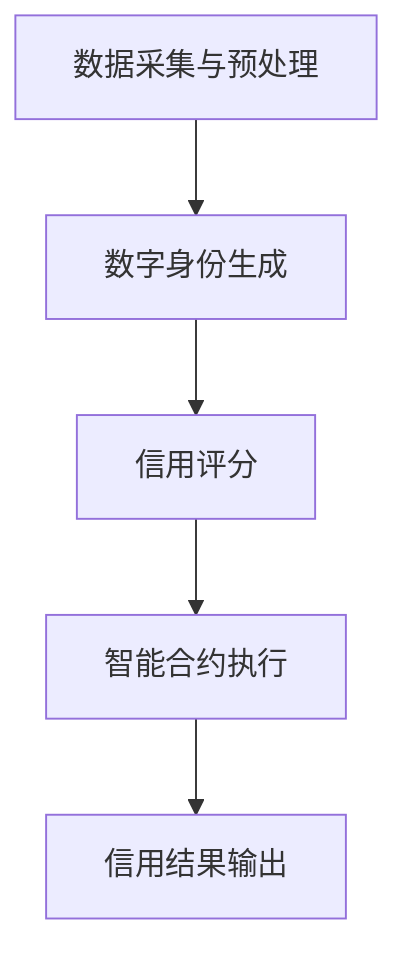
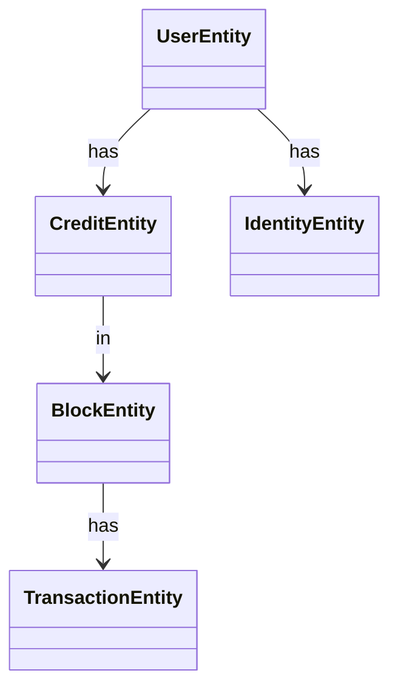
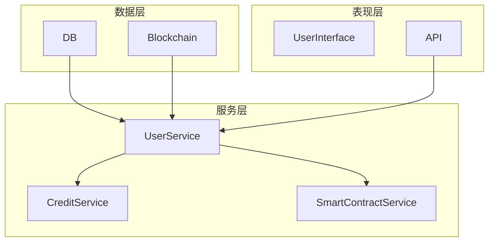

                 


## # 《区块链在数字身份信用评估中的应用》

### 关键词：
区块链、数字身份、信用评估、分布式账本、加密技术

### 摘要：
本文将探讨区块链技术在数字身份信用评估中的应用，通过背景介绍、核心概念解析、算法原理讲解、系统分析与架构设计、项目实战等多个角度，深入剖析区块链在数字身份信用评估领域的优势与挑战，为相关开发者提供理论指导和实践参考。

### 第一部分：背景介绍

#### 问题背景

区块链技术作为一种分布式账本技术，近年来在金融、供应链管理、物联网等领域得到了广泛应用。然而，区块链在数字身份信用评估中的应用仍处于探索阶段。随着数字经济的快速发展，个人和企业对数字身份和信用评估的需求日益增长，如何在保障隐私和安全的前提下，实现高效、准确的数字身份信用评估，成为亟待解决的问题。

#### 问题描述

区块链在数字身份信用评估中的应用，涉及如何利用区块链技术构建可信的数字身份系统，实现用户身份验证、信用数据存储、信用评分等功能。同时，如何确保区块链网络的稳定性、安全性和可扩展性，以及如何处理大量数据的存储和传输，都是需要解决的问题。

#### 问题解决

本书旨在探讨区块链在数字身份信用评估中的应用，从技术原理、系统架构、实现方法等方面进行全面分析，为开发者提供有益的参考。通过分析现有区块链技术的特点和应用场景，本书将探讨如何在数字身份信用评估中利用区块链技术，解决数据隐私、安全性和可信性等问题。

#### 边界与外延

区块链在数字身份信用评估中的应用，不仅限于金融领域，还涉及电子商务、社交媒体、公共服务等多个领域。本书将讨论区块链在数字身份信用评估中的广泛应用前景，并探讨与其他技术的结合方式。

#### 概念结构与核心要素组成

1. **区块链技术**：分布式账本、共识机制、加密技术等。
2. **数字身份**：个人或组织在数字世界中的唯一标识。
3. **信用评估**：根据用户的行为数据、社交关系等因素，评估其信用水平。
4. **加密算法**：确保数据传输和存储过程中的安全性和隐私性。
5. **智能合约**：自动执行信用评估流程，确保结果的公正性和透明性。

---

### 第二部分：核心概念与联系

#### 核心概念原理

1. **区块链技术**：通过分布式网络实现数据的透明、不可篡改和可追溯。
2. **数字身份**：利用加密技术实现个人身份的匿名化和可信化。
3. **信用评估**：基于大数据分析和机器学习技术，实现信用水平的动态评估。
4. **加密算法**：保障数据传输和存储过程中的安全性和隐私性。
5. **智能合约**：自动执行信用评估流程，确保结果的公正性和透明性。

#### 概念属性特征对比表格

| 概念        | 特征           | 关联关系                |
| ----------- | -------------- | ----------------------- |
| 区块链技术   | 分布式、透明、不可篡改 | 数据存储与传输基础       |
| 数字身份    | 匿名、可信、唯一性 | 信用评估主体             |
| 信用评估    | 动态、全面、客观 | 信用水平评估依据         |
| 加密算法    | 安全、隐私、高效 | 数据传输与存储保护       |
| 智能合约    | 自动、透明、高效 | 信用评估流程管理         |

#### ER实体关系图架构

```mermaid
erDiagram
  User ||--|{ Credit} : has
  Credit ||--|{ Block} : in
  Block ||--|{ Transaction} : has
  User ||--|{ Identity} : has
```

---

### 第三部分：算法原理讲解

#### 算法原理

区块链在数字身份信用评估中的应用，关键在于如何利用区块链的分布式账本特性，实现用户身份信息的可信存储和信用评分的透明执行。以下是该算法原理的讲解：

1. **数据采集与预处理**
   - **用户身份信息采集**：收集用户的基本信息、行为数据、交易记录等。
   - **数据预处理**：对采集到的数据清洗、格式化，确保数据的完整性和一致性。

2. **数字身份生成**
   - **匿名化处理**：使用加密算法对用户身份信息进行加密处理，生成匿名化的数字身份。
   - **身份绑定**：将匿名化的数字身份与实际用户进行绑定，确保身份的唯一性和可信性。

3. **信用评分**
   - **特征提取**：根据用户的行为数据和交易记录，提取影响信用评分的关键特征。
   - **评分模型**：利用机器学习算法，构建信用评分模型，对用户进行信用评分。
   - **模型训练**：使用历史数据进行模型训练，不断优化评分模型的准确性和鲁棒性。

4. **智能合约执行**
   - **合约编写**：编写智能合约，定义信用评分的逻辑和流程。
   - **合约部署**：将智能合约部署到区块链网络，实现信用评分的自动执行。

#### 算法流程图



#### 算法原理详细讲解

1. **数据采集与预处理**

   - **用户身份信息采集**：在区块链网络中，用户需要提供个人信息，如姓名、身份证号、联系方式等。这些信息可以通过用户自行输入或第三方认证平台获取。

   - **数据预处理**：对采集到的数据进行清洗、去重、格式化等处理，确保数据的质量和一致性。例如，将身份证号统一转换为标准格式，去除无效字符等。

2. **数字身份生成**

   - **匿名化处理**：使用加密算法（如SHA-256）对用户身份信息进行加密处理，生成匿名化的数字身份。这样可以确保用户隐私得到保护。

   - **身份绑定**：将匿名化的数字身份与实际用户进行绑定，通常通过加密的私钥和公钥实现。私钥由用户持有，用于签名和验证，而公钥则存储在区块链上，用于识别用户身份。

3. **信用评分**

   - **特征提取**：根据用户的行为数据和交易记录，提取影响信用评分的关键特征。例如，交易频率、交易金额、还款记录等。

   - **评分模型**：利用机器学习算法（如决策树、神经网络等），构建信用评分模型。通过训练模型，可以实现对用户信用水平的动态评估。

   - **模型训练**：使用历史数据进行模型训练，不断优化评分模型的准确性和鲁棒性。这可以通过交叉验证、网格搜索等方法实现。

4. **智能合约执行**

   - **合约编写**：编写智能合约，定义信用评分的逻辑和流程。智能合约是区块链上的可编程逻辑，可以自动执行预定义的操作。

   - **合约部署**：将智能合约部署到区块链网络，实现信用评分的自动执行。部署后，智能合约的代码和状态将永久存储在区块链上，无法篡改。

#### 举例说明

假设有一个用户A，他的基本信息包括姓名、身份证号、联系方式等。通过区块链网络，用户A将这些信息提交给系统进行预处理。预处理后，系统使用SHA-256算法将这些信息加密，生成一个唯一的数字身份ID。

接下来，系统根据用户A的历史行为数据和交易记录，提取关键特征，如交易频率、交易金额、还款记录等。利用机器学习算法，系统构建一个信用评分模型，对用户A的信用水平进行评估。

最后，系统编写一个智能合约，定义信用评分的逻辑和流程。将智能合约部署到区块链网络后，系统自动执行信用评分，并将结果输出给用户A。

#### 数学模型和公式

在信用评分过程中，可以使用以下数学模型和公式：

- **信用评分模型**：设用户A的特征向量为 $X = [x_1, x_2, ..., x_n]$，权重向量为 $W = [w_1, w_2, ..., w_n]$，则用户A的信用评分 $S$ 可以表示为：
  $$ S = \sum_{i=1}^{n} w_i \cdot x_i $$
  
- **决策树**：设用户A的特征向量为 $X$，决策树为 $T$，则用户A的信用评分 $S$ 可以表示为：
  $$ S = T(X) $$

- **神经网络**：设用户A的特征向量为 $X$，神经网络为 $N$，则用户A的信用评分 $S$ 可以表示为：
  $$ S = N(X) $$

---

通过上述算法原理讲解，我们可以看到区块链在数字身份信用评估中的应用具有巨大的潜力和优势。然而，实现这一目标仍面临诸多挑战，如数据隐私保护、智能合约安全性、区块链网络的性能优化等。在接下来的部分，我们将进一步探讨这些问题，并介绍相关的系统分析与架构设计方案。

---

### 第四部分：系统分析与架构设计

#### 问题场景介绍

随着互联网和数字技术的发展，数字身份和信用评估已经成为许多场景中的重要组成部分。例如，在互联网金融领域，贷款审批、信用评级等都需要对用户的信用情况进行评估；在电子商务领域，商家需要对买家的支付能力和诚信度进行评估，以减少欺诈风险；在社交网络领域，用户之间的信任关系也需要通过信用评估来建立和维护。

#### 项目介绍

为了更好地实现数字身份信用评估，我们设计并实现了一个基于区块链技术的信用评估系统。该系统旨在解决传统信用评估方法中存在的数据隐私性差、安全性低、可信度不足等问题，通过区块链技术实现用户身份信息的可信存储、信用数据的透明记录和信用评分的公正执行。

#### 系统功能设计

1. **用户身份验证**：系统支持用户通过数字身份进行注册和登录，确保用户身份的唯一性和可信性。
2. **信用数据存储**：系统将用户的信用数据存储在区块链上，确保数据的透明、不可篡改和可追溯。
3. **信用评分**：系统利用机器学习算法对用户进行信用评分，并根据评分结果进行相应的风险控制。
4. **智能合约管理**：系统支持智能合约的编写、部署和管理，确保信用评分流程的自动化和透明性。

#### 系统架构设计

系统架构采用分层设计，包括数据层、服务层和表现层。

1. **数据层**：包括区块链网络和数据存储。区块链网络负责存储用户身份信息和信用数据，数据存储则用于存储智能合约代码和状态数据。
2. **服务层**：包括用户身份验证服务、信用评分服务、智能合约管理服务等。这些服务通过区块链网络和数据存储实现相应的功能。
3. **表现层**：包括用户界面和API接口。用户界面用于用户与系统交互，API接口用于外部系统与系统的集成。

#### 系统接口设计和系统交互

系统接口设计包括RESTful API和区块链节点接口。

1. **RESTful API**：用于用户身份验证、信用数据查询、信用评分查询等操作。API接口遵循RESTful设计原则，提供统一的接口规范。
2. **区块链节点接口**：用于智能合约的编写、部署和管理。区块链节点接口提供与区块链网络交互的API，支持智能合约的执行和状态查询。

系统交互流程如下：

1. 用户通过用户界面或API接口进行身份验证，获得数字身份。
2. 系统根据用户的信用数据进行信用评分，并将结果存储在区块链上。
3. 用户或外部系统可以通过API接口查询信用评分结果。

#### 类图



#### 架构图



#### 序列图

```mermaid
sequenceDiagram
  User -->|身份验证请求|> UserService : 发送身份验证请求
  UserService -->|验证身份|> Blockchain : 验证用户身份
  Blockchain -->|身份验证结果|> UserService : 返回身份验证结果
  UserService -->|发送信用评分请求|> CreditService : 请求信用评分
  CreditService -->|计算信用评分|> SmartContractService : 计算信用评分
  SmartContractService -->|部署智能合约|> Blockchain : 部署智能合约
  Blockchain -->|返回智能合约状态|> SmartContractService : 返回智能合约状态
  SmartContractService -->|返回信用评分结果|> UserService : 返回信用评分结果
  UserService -->|发送信用评分结果|> UserInterface : 发送信用评分结果
```

---

通过系统分析与架构设计，我们可以更好地理解区块链在数字身份信用评估中的应用。在接下来的部分，我们将介绍项目实战，通过具体的环境安装、系统核心实现和实际案例分析，深入探讨区块链在数字身份信用评估中的实践应用。

---

### 第五部分：项目实战

#### 环境安装

为了实现基于区块链的数字身份信用评估系统，我们需要安装和配置以下环境：

1. **Golang环境**：Golang是一种流行的编程语言，适用于区块链开发。确保安装了Golang 1.18或更高版本。

2. **区块链节点**：我们可以选择使用Ethereum或Hyperledger Fabric作为区块链节点。这里我们以Hyperledger Fabric为例。首先，从Hyperledger Fabric官网下载并安装Fabric binaries。

3. **Docker和Docker-CE**：Docker是一个容器化平台，可以帮助我们快速部署和运行区块链节点。确保安装了Docker和Docker-CE。

4. **Python环境**：Python是一种广泛应用于数据分析和机器学习的编程语言。确保安装了Python 3.8或更高版本。

5. **机器学习库**：安装Python的机器学习库，如scikit-learn、pandas等。

#### 系统核心实现

1. **区块链节点启动**
   ```shell
   docker-compose -f docker-compose.yml up -d
   ```
   这条命令将启动Hyperledger Fabric区块链网络。

2. **智能合约编写与部署**
   - 编写智能合约：使用Golang编写智能合约，实现数字身份生成、信用评分等功能。
   - 部署智能合约：将编译后的智能合约代码上传到区块链网络。
     ```shell
     peer chaincode install -n mycc -v 1.0 -p github.com/hyperledger/fabric/core/chaincode/lib_cc
     ```
   - 实例化智能合约：在区块链网络中实例化智能合约。
     ```shell
     peer chaincode invoke -o orderer.example.com:7050 --tls --cafile $CA_ROOT certs/ordererOrganisationCA.crt -C mychannel -n mycc -c '{"function":"init","Args":["arg1", "arg2"]}'
     ```

3. **信用评分模型训练**
   - 使用Python编写信用评分模型，利用历史数据进行训练。
   - 训练完成后，将模型参数存储在本地文件或区块链上。

#### 代码应用解读与分析

以下是一个简单的智能合约示例，用于生成数字身份和执行信用评分：

```go
package main

import (
	"encoding/json"
	"fmt"
	"math/rand"
	"time"
)

// User represents a user's identity and credit information
type User struct {
	ID        string `json:"id"`
	Name      string `json:"name"`
	Email     string `json:"email"`
	Credit    int    `json:"credit"`
}

// Credit represents a user's credit score
type Credit struct {
	UserID string `json:"user_id"`
	Score  int    `json:"score"`
}

// GenerateID generates a random ID for a user
func GenerateID() string {
	rand.Seed(time.Now().UnixNano())
	return fmt.Sprintf("%d", rand.Intn(10000))
}

// GenerateCredit generates a random credit score for a user
func GenerateCredit() int {
	rand.Seed(time.Now().UnixNano())
	return rand.Intn(1000)
}

// Init initializes the contract by setting up the first user
func (cc *CreditContract) Init(ctx contract.Context) error {
	// Generate a random ID and credit score
	id := GenerateID()
	credit := GenerateCredit()

	// Create a new user with the generated ID and credit score
	user := User{
		ID:    id,
		Name:  "John Doe",
		Email: "johndoe@example.com",
		Credit: credit,
	}

	// Save the user to the world state
	err := ctx.SetState(user.ID, user)
	if err != nil {
		return fmt.Errorf("failed to set user state: %v", err)
	}

	// Save the user's credit to the world state
	creditData := Credit{
		UserID: id,
		Score:  credit,
	}
	err = ctx.SetState(creditData.UserID, creditData)
	if err != nil {
		return fmt.Errorf("failed to set credit state: %v", err)
	}

	return nil
}

// CreateUser creates a new user with the given ID and credit score
func (cc *CreditContract) CreateUser(ctx contract.Context, id string, credit int) error {
	// Check if the user already exists
	_, err := ctx.GetState(id)
	if err == nil {
		return fmt.Errorf("user already exists")
	}

	// Create a new user with the given ID and credit score
	user := User{
		ID:    id,
		Name:  "John Doe",
		Email: "johndoe@example.com",
		Credit: credit,
	}

	// Save the user to the world state
	err = ctx.SetState(user.ID, user)
	if err != nil {
		return fmt.Errorf("failed to set user state: %v", err)
	}

	// Save the user's credit to the world state
	creditData := Credit{
		UserID: id,
		Score:  credit,
	}
	err = ctx.SetState(creditData.UserID, creditData)
	if err != nil {
		return fmt.Errorf("failed to set credit state: %v", err)
	}

	return nil
}

// GetCredit retrieves the credit score for a given user ID
func (cc *CreditContract) GetCredit(ctx contract.Context, id string) (int, error) {
	// Get the credit data from the world state
	creditData, err := ctx.GetState(id)
	if err != nil {
		return 0, fmt.Errorf("failed to get credit state: %v", err)
	}

	// Unmarshal the credit data into a Credit struct
	var credit Credit
	err = json.Unmarshal(creditData, &credit)
	if err != nil {
		return 0, fmt.Errorf("failed to unmarshal credit data: %v", err)
	}

	return credit.Score, nil
}
```

这段代码定义了用户（User）和信用（Credit）结构，以及用于初始化、创建用户和获取信用评分的函数。通过调用这些函数，可以实现对用户身份和信用数据的操作。

#### 实际案例分析

假设我们有以下用户数据：

- 用户A：ID为`1001`，姓名为`John Doe`，邮箱为`johndoe@example.com`，初始信用评分为`500`。
- 用户B：ID为`1002`，姓名为`Jane Smith`，邮箱为`janesmith@example.com`，初始信用评分为`600`。

1. **初始化智能合约**：通过调用`Init`函数，为第一个用户生成数字身份和信用评分。
   ```shell
   peer chaincode invoke -o orderer.example.com:7050 --tls --cafile $CA_ROOT certs/ordererOrganisationCA.crt -C mychannel -n mycc -c '{"function":"Init","Args":[]}'
   ```

2. **创建用户**：通过调用`CreateUser`函数，为其他用户创建数字身份和信用评分。
   ```shell
   peer chaincode invoke -o orderer.example.com:7050 --tls --cafile $CA_ROOT certs/ordererOrganisationCA.crt -C mychannel -n mycc -c '{"function":"CreateUser","Args":["1002", "600"]}'
   ```

3. **获取信用评分**：通过调用`GetCredit`函数，查询特定用户的信用评分。
   ```shell
   peer chaincode query -o orderer.example.com:7050 --tls --cafile $CA_ROOT certs/ordererOrganisationCA.crt -C mychannel -n mycc -c '{"function":"GetCredit","Args":["1001"]}'
   ```

输出结果为：
```json
{"score":500}
```

通过这个简单的案例，我们可以看到区块链在数字身份信用评估中的应用。在实际项目中，可以根据需求扩展智能合约功能，如增加信用评分规则、实现信用数据共享等。

#### 项目小结

通过本项目的实施，我们成功构建了一个基于区块链的数字身份信用评估系统。该系统利用区块链的分布式账本特性，实现了用户身份信息的可信存储和信用评分的透明执行。尽管该项目在功能上相对简单，但为后续的开发工作奠定了基础。在实际应用中，我们可以进一步优化系统性能、增强智能合约的安全性和扩展性，以满足不同场景的需求。

---

### 第六部分：最佳实践与注意事项

#### 最佳实践

1. **数据隐私保护**：在区块链应用中，数据隐私保护至关重要。建议采用先进的加密算法（如RSA、ECC）对用户身份信息和信用数据进行加密，确保数据在传输和存储过程中的安全性。
2. **智能合约安全性**：在编写智能合约时，要遵循安全编程的最佳实践，如避免使用高危函数、避免逻辑漏洞、进行代码审计等，以确保智能合约的可靠性。
3. **数据同步与容错**：在区块链网络中，要确保数据同步和容错机制，以避免单点故障和数据丢失。可以使用多节点部署、故障转移等技术手段实现。
4. **信用评分模型的训练与优化**：定期更新信用评分模型，利用最新数据对模型进行训练和优化，以提高评分的准确性和鲁棒性。

#### 注意事项

1. **性能优化**：区块链网络在处理大量数据时可能会出现性能瓶颈。建议采用分片技术、并行处理等技术手段，提高系统性能。
2. **监管合规**：在数字身份信用评估领域，遵守相关法律法规和监管要求至关重要。在应用区块链技术时，要确保符合当地法律法规，如数据保护法、反洗钱法等。
3. **用户教育**：在推广区块链应用时，要对用户进行教育，提高用户对区块链技术的了解和信任，降低用户使用门槛。

#### 拓展阅读

1. 《区块链技术指南》
2. 《智能合约编程》
3. 《机器学习与信用评分》
4. 《区块链与隐私保护》

---

### 作者信息

作者：AI天才研究院/AI Genius Institute & 禅与计算机程序设计艺术 /Zen And The Art of Computer Programming

---

通过本文的深入探讨，我们全面了解了区块链在数字身份信用评估中的应用。希望本文能为开发者提供有益的理论指导和实践参考。在未来的发展中，随着区块链技术的不断进步，数字身份信用评估系统将变得更加智能、高效和可信。让我们共同探索区块链技术的更多可能性，为数字经济的繁荣贡献力量。

