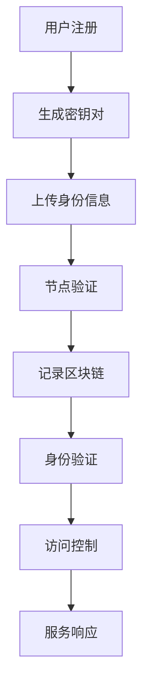
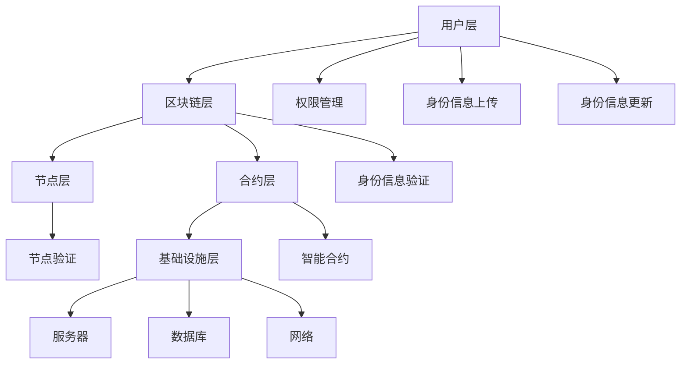
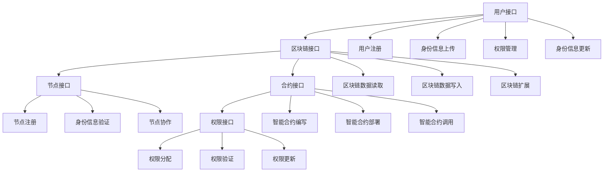
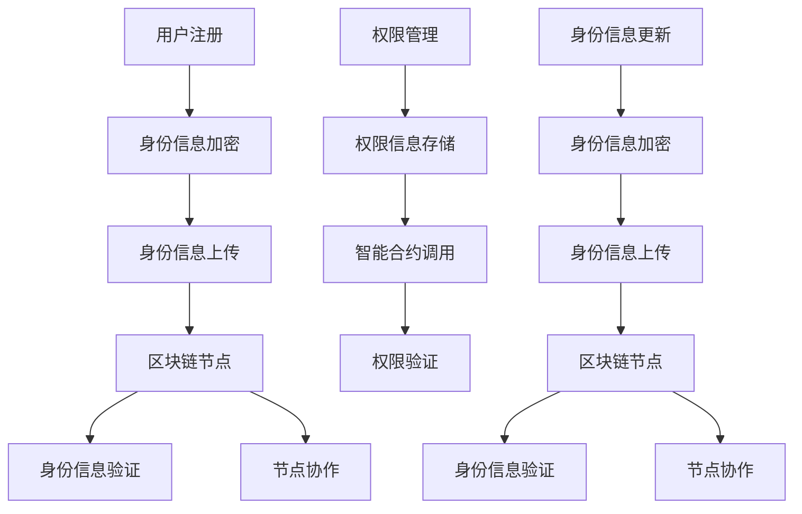

                 

### 引言

《区块链在数字身份认证中的应用：去中心化身份验证系统》旨在深入探讨区块链技术如何革新数字身份认证领域，构建一个安全、透明且去中心化的身份验证系统。在当今信息时代，随着互联网和数字技术的迅猛发展，个人和组织对数据隐私和安全的关注日益增加。传统的集中式身份认证系统存在着数据泄露、单点故障等问题，而区块链技术的出现为解决这些问题提供了新的思路。

本书的核心内容将围绕以下几个方面展开：

1. **背景介绍**：探讨数字身份认证的现状、存在的问题以及区块链技术的引入如何改变这一现状。
2. **核心概念与联系**：详细讲解区块链、数字身份认证、去中心化身份验证系统等核心概念，并分析它们之间的关系。
3. **算法原理讲解**：介绍区块链在数字身份认证中的算法原理，通过 mermaid 流程图和 Python 源代码详细阐述。
4. **系统分析与架构设计方案**：分析数字身份认证系统的工作原理，并展示系统架构设计和接口设计。
5. **项目实战**：通过具体的案例，展示区块链在数字身份认证中的应用，并分析其实际效果。
6. **最佳实践 tips、小结、注意事项、拓展阅读**：总结书中内容，提供实用的建议和未来的研究方向。

通过本书的阅读，读者将全面了解区块链在数字身份认证中的潜在应用和实际案例，为推动这一领域的发展提供理论和实践支持。

### 第一部分：背景介绍

#### 1.1. 问题背景

在数字化的今天，身份认证已经成为各种在线服务的基础。传统的集中式身份认证系统，如银行、电商平台和社交媒体等，依赖于中心化的身份信息库进行用户身份的验证。然而，这种系统存在一定的局限性。首先，中心化的身份信息库容易成为黑客攻击的目标，一旦数据泄露，将导致大规模的用户隐私泄露事件。其次，集中式的系统往往存在单点故障的风险，一旦中心节点发生问题，整个系统可能面临瘫痪。此外，集中式系统中的数据修改和篡改也相对容易，这进一步削弱了身份认证的可靠性。

区块链技术的引入为这些问题提供了一种潜在的解决方案。区块链的去中心化特性意味着不存在单一的中心节点，数据存储在分布式的网络中，提高了系统的安全性和可靠性。同时，区块链的不可篡改性确保了数据的真实性和完整性，从而增强身份认证的信任度。因此，研究区块链在数字身份认证中的应用具有重要的现实意义。

#### 1.2. 问题描述

数字身份认证的主要问题包括：

- **数据泄露**：中心化的身份认证系统容易成为黑客攻击的目标，一旦攻击成功，用户的敏感信息可能被窃取。
- **单点故障**：集中式的系统依赖于单一的中心节点，如果该节点出现故障，整个系统可能无法正常运作。
- **数据篡改**：中心化的系统中的数据容易被篡改，从而影响身份认证的准确性。
- **隐私保护**：在传统系统中，用户的身份信息往往需要存储在中心服务器上，这可能导致隐私泄露问题。

区块链技术通过其去中心化、不可篡改和透明化的特性，能够有效解决上述问题。具体来说，区块链的去中心化特性确保了系统的可靠性和容错性，不存在单点故障的风险。此外，区块链的智能合约功能可以自动执行身份验证过程，确保数据的真实性和完整性，从而增强系统的安全性。

#### 1.3. 问题解决

区块链在数字身份认证中的应用主要表现在以下几个方面：

- **去中心化身份验证**：通过区块链技术，实现身份验证的去中心化，避免单一中心节点的风险。
- **数据不可篡改**：区块链上的数据一旦写入，就无法被篡改，确保身份信息的真实性和完整性。
- **隐私保护**：通过加密技术，保护用户的身份信息不被泄露。
- **透明性**：区块链上的所有交易都是公开透明的，用户可以随时查看自己的身份信息，确保系统的公正性。

综上所述，区块链在数字身份认证中具有广泛的应用前景，能够有效解决传统系统中的诸多问题。然而，要实现区块链在数字身份认证中的广泛应用，还需要进一步的研究和探索。

#### 1.4. 边界与外延

在讨论区块链在数字身份认证中的应用时，需要明确其边界与外延：

- **边界**：区块链在数字身份认证中的应用主要涉及身份验证过程，包括身份注册、验证和更新等环节。此外，还需要考虑区块链与其他技术的结合，如加密技术、分布式存储等。
- **外延**：区块链在数字身份认证中的应用不仅限于用户身份验证，还可以扩展到组织机构、设备身份认证等领域。同时，随着区块链技术的发展，其应用范围也可能进一步扩大。

#### 1.5. 概念结构与核心要素组成

区块链在数字身份认证中的概念结构主要包括以下几个核心要素：

- **区块链**：分布式账本技术，用于存储和验证身份信息。
- **智能合约**：自动执行身份验证和权限控制等操作。
- **加密技术**：保护用户隐私，确保数据传输过程中的安全性。
- **身份认证协议**：如零知识证明、多因素认证等，增强身份认证的安全性。

通过对这些核心要素的分析，我们可以更清晰地理解区块链在数字身份认证中的原理和应用。接下来，我们将进一步探讨这些核心概念及其相互关系，为后续内容做好铺垫。

### 1.6. 数字身份认证的现状与挑战

数字身份认证系统在当今社会扮演着至关重要的角色，它不仅关乎个人隐私保护，还关系到各种在线服务的安全性和可靠性。随着互联网的普及和数字化转型加速，数字身份认证的需求也在不断增长。然而，当前数字身份认证系统面临诸多挑战，亟需改进。

#### 1.6.1. 现状

目前的数字身份认证系统主要依赖于集中式架构。典型的例子包括：

- **用户名和密码**：这是最常见的身份认证方式，用户通过输入用户名和密码来验证自己的身份。尽管简单易用，但存在明显的安全隐患，如密码泄露、弱密码等。
- **单点登录（SSO）**：SSO允许用户使用单一的身份认证过程访问多个服务，从而简化用户体验。然而，SSO系统的中心化性质使得它容易成为黑客攻击的目标，一旦中心节点被攻破，所有关联的服务都将受到威胁。
- **生物识别**：如指纹识别、面部识别等，通过生物特征验证用户身份。虽然提高了认证的准确性，但技术实现成本较高，且隐私保护问题尚未完全解决。

#### 1.6.2. 挑战

当前数字身份认证系统面临的主要挑战包括：

- **数据泄露风险**：集中式身份认证系统中的用户数据容易成为黑客攻击的目标。一旦数据泄露，可能导致用户隐私严重受损，甚至造成经济损失。
- **单点故障**：集中式系统的单点故障风险较高，一旦中心节点出现故障，可能导致整个系统瘫痪，影响大量用户的正常使用。
- **数据篡改风险**：中心化的身份认证系统存在数据被篡改的风险，攻击者可以伪造身份信息，从而进行非法操作。
- **隐私保护不足**：传统身份认证系统中的用户数据往往需要存储在中心服务器上，用户隐私难以得到有效保护。

#### 1.6.3. 区块链技术的引入

区块链技术的引入为数字身份认证领域带来了新的契机。区块链的去中心化特性、数据不可篡改性和透明性等特点，使得它能够有效解决传统身份认证系统中的诸多问题。以下是区块链在数字身份认证中的应用前景：

- **去中心化身份验证**：通过区块链技术，可以实现身份认证的去中心化，避免单一中心节点的风险。每个节点都可以独立验证身份信息，从而提高系统的可靠性和容错性。
- **数据不可篡改性**：区块链上的数据一旦写入，就不可篡改，确保了身份信息的真实性和完整性。这有助于防止数据被恶意篡改，增强系统的信任度。
- **隐私保护**：区块链技术结合加密技术，可以实现用户身份信息的隐私保护。用户可以控制自己的身份信息是否对外公开，从而降低隐私泄露风险。
- **透明性**：区块链上的所有交易都是公开透明的，用户可以随时查看自己的身份信息，确保系统的公正性和透明性。

综上所述，区块链技术在数字身份认证中的应用前景广阔，有助于解决当前系统面临的各种挑战。然而，要实现区块链在数字身份认证中的广泛应用，还需要进一步的研究和探索，以克服技术、法律和隐私保护等方面的难题。

### 1.7. 区块链技术的核心概念及其在数字身份认证中的应用

在探讨区块链技术如何革新数字身份认证领域之前，我们首先需要了解区块链技术的一些核心概念。这些核心概念包括区块链的基本原理、分布式账本技术、加密技术、智能合约等。通过深入分析这些概念，我们可以更好地理解区块链在数字身份认证中的应用潜力。

#### 1.7.1. 区块链的基本原理

区块链是一种去中心化的分布式数据库技术，它通过加密算法和共识机制确保数据的完整性和安全性。区块链的主要组成部分包括：

- **区块**：区块是区块链的基本单元，包含一定数量的交易记录。每个区块都有一个时间戳和哈希值，用于确保数据的唯一性和顺序性。
- **链**：区块链是由一系列按照时间顺序排列的区块组成的数据结构。通过链式结构，区块链实现了数据的持久化和不可篡改性。
- **节点**：节点是区块链网络中的参与者，它们负责存储数据、验证交易和传播信息。每个节点都维护一份完整的区块链副本，从而确保整个网络的一致性和可靠性。

区块链的去中心化特性是其区别于传统数据库的关键。在区块链网络中，不存在单一的中心节点，所有节点都具有平等的地位。这种去中心化的结构提高了系统的容错性和抗攻击能力，使其更难以被篡改或控制。

#### 1.7.2. 分布式账本技术

分布式账本技术是区块链的核心功能之一。它通过分布式的方式存储和验证数据，避免了单点故障和数据泄露的风险。在分布式账本技术中，数据被分散存储在多个节点上，每个节点都保留一份完整的账本副本。当发生交易时，这些节点会通过共识机制达成一致，确保数据的真实性和完整性。

分布式账本技术在数字身份认证中的应用具有重要意义。首先，通过分布式存储，用户身份信息被分散存储在不同的节点上，减少了数据泄露的风险。其次，分布式账本技术的不可篡改性确保了身份信息的真实性和完整性，防止恶意篡改和伪造。

#### 1.7.3. 加密技术

加密技术是区块链安全性的重要保障。区块链使用各种加密算法来保护用户隐私和数据的完整性。常用的加密技术包括：

- **公钥加密**：公钥加密是一种非对称加密算法，使用公钥加密的消息只能用对应的私钥解密。在数字身份认证中，用户可以使用公钥加密自己的身份信息，确保只有授权的实体可以读取。
- **哈希函数**：哈希函数是一种将任意长度的数据映射为固定长度值的算法。在区块链中，哈希函数用于生成区块的唯一标识（哈希值），确保数据的唯一性和不可篡改性。
- **数字签名**：数字签名是一种利用公钥加密技术验证消息真实性的方法。在数字身份认证中，用户可以使用数字签名证明自己的身份，确保信息的真实性和完整性。

加密技术在数字身份认证中的应用，不仅提高了系统的安全性，还增强了用户隐私保护。用户可以控制自己的身份信息是否对外公开，从而降低隐私泄露的风险。

#### 1.7.4. 智能合约

智能合约是一种自动执行合同条款的程序，它在区块链上运行，不受人为干预。智能合约通过预设的逻辑规则，自动处理和验证交易，提高了系统的效率和安全性。

在数字身份认证中，智能合约可以用于实现自动化身份验证和权限控制。例如，当用户注册身份时，智能合约可以自动验证用户的身份信息，确保信息的真实性和合法性。当用户请求访问特定服务时，智能合约可以自动验证用户的权限，确保只有授权用户可以访问。

智能合约在数字身份认证中的应用，不仅简化了认证流程，还提高了系统的可靠性和透明性。通过智能合约，用户和服务的提供者可以实时验证身份信息，确保认证过程的公正和透明。

#### 1.7.5. 区块链在数字身份认证中的应用前景

综上所述，区块链技术的核心概念及其在数字身份认证中的应用，为我们提供了一种新的解决方案。通过分布式账本技术、加密技术和智能合约，区块链可以有效解决传统身份认证系统中的数据泄露、单点故障、数据篡改和隐私保护等问题。

未来，随着区块链技术的不断发展和完善，我们可以期待其在数字身份认证领域的广泛应用。通过区块链，我们可以构建一个安全、透明、去中心化的数字身份认证系统，为个人和组织提供更加可靠的认证服务。

然而，要实现这一目标，还需要进一步的研究和探索，以解决技术、法律和隐私保护等方面的挑战。只有通过不断创新和改进，我们才能充分发挥区块链在数字身份认证中的潜力，为构建更加安全、可靠的数字社会贡献力量。

### 1.8. 数字身份认证与区块链技术的关联分析

数字身份认证与区块链技术之间存在紧密的联系，二者共同作用，为构建一个安全、透明、去中心化的数字身份认证系统提供了强大支持。以下是数字身份认证与区块链技术之间的关联分析。

#### 1.8.1. 区块链在数字身份认证中的关键作用

区块链技术在数字身份认证中的关键作用主要体现在以下几个方面：

- **去中心化身份验证**：区块链的去中心化特性确保了身份认证过程的去中心化。在传统集中式身份认证系统中，所有身份信息都存储在中心服务器上，容易成为黑客攻击的目标。而在区块链中，身份信息分散存储在多个节点上，每个节点都参与身份验证，提高了系统的安全性和可靠性。
- **数据不可篡改性**：区块链的不可篡改性确保了身份信息的真实性和完整性。一旦身份信息被写入区块链，就永久保存，无法被篡改。这有助于防止恶意篡改和伪造身份信息，提高身份认证的准确性。
- **透明性**：区块链上的所有交易都是公开透明的，用户可以随时查看自己的身份信息。这种透明性增强了系统的信任度，用户可以放心地使用数字身份认证服务。
- **隐私保护**：区块链技术结合加密技术，可以实现用户身份信息的隐私保护。用户可以控制自己的身份信息是否对外公开，从而降低隐私泄露的风险。

#### 1.8.2. 数字身份认证在区块链中的应用

数字身份认证在区块链中的应用，可以进一步优化和提升区块链系统的安全性和可靠性。以下是数字身份认证在区块链中的几个关键应用：

- **身份注册和验证**：区块链可以用于身份注册和验证。用户在区块链上注册身份时，可以使用加密技术保护身份信息的隐私。当用户请求访问特定服务时，区块链可以自动验证用户的身份，确保只有授权用户可以访问。
- **权限管理**：区块链可以用于权限管理。通过智能合约，区块链可以自动执行权限控制操作，确保只有授权用户可以访问特定资源或执行特定操作。这有助于简化权限管理流程，提高系统的安全性。
- **数据存储和访问控制**：区块链可以用于数据存储和访问控制。用户可以将敏感数据存储在区块链上，通过加密技术保护数据的隐私。同时，区块链可以用于实现数据的访问控制，确保只有授权用户可以访问特定数据。
- **防伪验证**：区块链可以用于防伪验证。通过在区块链上记录身份信息的创建和更新时间，可以有效地防止伪造和篡改身份信息，提高身份认证的准确性。

#### 1.8.3. 区块链与数字身份认证的互补关系

区块链与数字身份认证之间存在互补关系。区块链提供了去中心化、不可篡改和透明性的特性，这些特性在数字身份认证中具有重要价值。而数字身份认证则为区块链提供了实际应用场景，使得区块链技术可以更好地服务于社会。

通过将区块链与数字身份认证结合，我们可以构建一个安全、透明、去中心化的数字身份认证系统。这个系统不仅能够有效解决传统身份认证系统中的数据泄露、单点故障、数据篡改和隐私保护等问题，还能够为用户提供更加便捷、可靠的身份认证服务。

总之，区块链与数字身份认证的关联分析表明，二者之间存在紧密的联系和互补关系。通过深入研究和探索，我们可以充分发挥区块链技术在数字身份认证中的潜力，为构建一个更加安全、可靠的数字社会贡献力量。

### 1.9. 区块链在数字身份认证中的算法原理

区块链技术在数字身份认证中的应用，离不开其独特的算法原理。这些算法原理不仅确保了区块链系统的安全性，还为数字身份认证提供了可靠的实现方式。以下是区块链在数字身份认证中的主要算法原理及其工作原理的详细讲解。

#### 1.9.1. 共识算法

共识算法是区块链系统的核心，它用于确保网络中的所有节点对同一组交易达成一致。在数字身份认证中，共识算法确保身份信息的真实性和合法性。以下是几种常见的共识算法及其在数字身份认证中的应用：

- **工作量证明（PoW）**：工作量证明算法通过计算复杂度来确保网络的安全性。在数字身份认证中，节点需要通过解决复杂的数学问题来验证身份信息。这增加了恶意节点攻击网络的难度，从而提高了系统的安全性。
- **权益证明（PoS）**：权益证明算法通过节点的权益（如持有的币量）来决定其验证身份信息的资格。在数字身份认证中，持有更多币量的节点具有更高的验证权重，从而提高了系统的安全性。
- **委托权益证明（dPoS）**：委托权益证明算法通过选举产生验证节点，这些节点根据其所代表的权益进行身份验证。在数字身份认证中，用户可以通过投票选举自己信任的节点，从而提高身份验证的效率和安全性。

#### 1.9.2. 零知识证明（ZKP）

零知识证明是一种密码学技术，它允许一方（证明者）向另一方（验证者）证明某个陈述是正确的，而不透露任何有关陈述的具体信息。在数字身份认证中，零知识证明可以用于保护用户的隐私，同时确保身份信息的真实性。

- **工作原理**：零知识证明通过一系列交互协议，使证明者能够证明某个陈述是正确的，而不透露任何具体信息。具体来说，证明者首先向验证者发送一个证明请求，验证者根据请求生成一个随机证明。然后，证明者通过一系列数学运算，证明该证明是正确的。整个过程中，证明者不需要透露任何具体信息。
- **应用场景**：在数字身份认证中，零知识证明可以用于匿名认证。用户可以证明自己拥有特定身份信息，而不需要透露具体信息。这有助于保护用户的隐私，同时确保身份验证的准确性。

#### 1.9.3. 加密算法

加密算法是区块链技术的基石，它用于保护数据的安全性和隐私。在数字身份认证中，加密算法确保身份信息在传输和存储过程中的安全性。

- **公钥加密**：公钥加密是一种非对称加密算法，它使用一对密钥（公钥和私钥）进行加密和解密。在数字身份认证中，用户可以使用公钥加密身份信息，确保只有授权的实体可以解密和读取。例如，用户可以使用服务提供商的公钥加密身份信息，然后发送给服务提供商进行验证。
- **哈希函数**：哈希函数是一种将任意长度的数据映射为固定长度值的算法。在数字身份认证中，哈希函数用于生成身份信息的唯一标识（哈希值）。一旦身份信息被写入区块链，其哈希值将永久保存，用于验证身份信息的真实性和完整性。
- **数字签名**：数字签名是一种利用公钥加密技术验证消息真实性的方法。在数字身份认证中，用户可以使用数字签名证明自己的身份，确保信息的真实性和完整性。

#### 1.9.4. Merkle树

Merkle树是一种数据结构，用于快速验证大量数据的一致性和完整性。在区块链中，Merkle树用于确保区块中所有交易的完整性。在数字身份认证中，Merkle树可以用于验证身份信息的完整性。

- **工作原理**：Merkle树将数据划分为多个小块，并对每个小块进行哈希运算，生成哈希值。然后，将这些哈希值组合成一个新的哈希值，以此类推，直到生成一个根哈希值。验证者可以通过与证明者交换部分哈希值，快速验证数据的一致性和完整性。
- **应用场景**：在数字身份认证中，Merkle树可以用于验证用户身份信息的完整性。例如，用户可以生成一个包含其身份信息的Merkle树，并在每次身份验证时提供部分哈希值，验证者可以通过这些哈希值快速验证身份信息的真实性。

#### 1.9.5. 智能合约

智能合约是一种自动执行合同条款的程序，它在区块链上运行，不受人为干预。在数字身份认证中，智能合约可以用于实现自动化身份验证和权限控制。

- **工作原理**：智能合约包含预定义的逻辑规则，当满足特定条件时，自动执行相应的操作。例如，当用户注册身份时，智能合约可以自动验证身份信息的真实性，确保只有符合要求的用户可以注册。
- **应用场景**：在数字身份认证中，智能合约可以用于实现自动化身份验证和权限控制。例如，当用户请求访问特定服务时，智能合约可以自动验证用户的身份和权限，确保只有授权用户可以访问。

通过上述算法原理，区块链技术为数字身份认证提供了安全、透明、去中心化的解决方案。这些算法原理相互结合，确保身份信息的真实性和完整性，同时保护用户的隐私。未来，随着区块链技术的不断发展和完善，我们可以期待其在数字身份认证领域的广泛应用，为构建一个更加安全、可靠的数字社会贡献力量。

### 1.10. 算法原理讲解：以 Mermaid 流程图和 Python 源代码为例

为了更好地理解区块链在数字身份认证中的算法原理，我们将通过 Mermaid 流程图和 Python 源代码来详细阐述一个简单的区块链身份认证系统。本节将介绍区块链的基本算法原理，并通过实际代码实现来展示其工作流程。

#### 1.10.1. Mermaid 流程图

首先，我们使用 Mermaid 流程图来描述区块链身份认证系统的工作流程。以下是一个简单的 Mermaid 流程图示例：



- **用户注册**：用户首先需要注册身份，生成一对密钥（公钥和私钥）。
- **生成密钥对**：用户生成一对密钥，公钥用于加密，私钥用于解密和签名。
- **上传身份信息**：用户将加密的身份信息和私钥上传到区块链。
- **节点验证**：区块链网络中的节点对上传的身份信息进行验证，确保其真实性和完整性。
- **记录区块链**：验证通过后，身份信息被记录到区块链中。
- **身份验证**：当用户请求访问服务时，节点使用公钥对用户身份进行验证。
- **访问控制**：验证通过后，根据用户的权限进行访问控制。
- **服务响应**：系统响应用户的服务请求，提供相应的服务。

#### 1.10.2. Python 源代码实现

接下来，我们将通过 Python 源代码来实现上述流程。以下是一个简单的 Python 实现示例：

```python
import hashlib
import json
from flask import Flask, jsonify, request

app = Flask(__name__)

class Blockchain:
    def __init__(self):
        self.unconfirmed_transactions = []  # 待确认的交易
        self.chain = []  # 区块链
        self.create_genesis_block()

    def create_genesis_block(self):
        genesis_block = {
            'index': 0,
            'timestamp': '2023-04-01',
            'transactions': [],
            'previous_hash': '0',
        }
        hashed_block = self.hash_block(genesis_block)
        genesis_block['hash'] = hashed_block
        self.chain.append(genesis_block)

    def hash_block(self, block):
        block_string = json.dumps(block, sort_keys=True)
        return hashlib.sha256(block_string.encode()).hexdigest()

    def add_new_transaction(self, transaction):
        self.unconfirmed_transactions.append(transaction)

    def mine(self):
        if not self.unconfirmed_transactions:
            return

        last_block = self.chain[-1]
        new_block = {
            'index': last_block['index'] + 1,
            'timestamp': '2023-04-02',
            'transactions': self.unconfirmed_transactions,
            'previous_hash': last_block['hash'],
        }
        hashed_block = self.hash_block(new_block)
        new_block['hash'] = hashed_block
        self.chain.append(new_block)
        self.unconfirmed_transactions = []

    def is_chain_valid(self):
        for i in range(1, len(self.chain)):
            current = self.chain[i]
            previous = self.chain[i - 1]
            if current['hash'] != self.hash_block(current):
                return False
            if current['previous_hash'] != previous['hash']:
                return False
        return True

@app.route('/mine', methods=['POST'])
def mine():
    response = request.get_json()
    if not response:
        return jsonify({'error': 'Invalid request'}), 400
    transaction = response.get('transaction')
    if not transaction:
        return jsonify({'error': 'Missing transaction'}), 400
    blockchain.mine()
    return jsonify({'message': 'Block mined successfully', 'block': blockchain.chain[-1]}), 200

@app.route('/transactions/new', methods=['POST'])
def new_transaction():
    response = request.get_json()
    if not response:
        return jsonify({'error': 'Invalid request'}), 400
    transaction = response.get('transaction')
    if not transaction:
        return jsonify({'error': 'Missing transaction'}), 400
    blockchain.add_new_transaction(transaction)
    return jsonify({'message': 'Transaction received', 'transaction': transaction}), 201

@app.route('/chain', methods=['GET'])
def full_chain():
    response = {
        'chain': blockchain.chain,
        'length': len(blockchain.chain),
    }
    return jsonify(response), 200

@app.route('/validate-chain', methods=['GET'])
def validate_chain():
    if blockchain.is_chain_valid():
        return jsonify({'message': 'The blockchain is valid.'}), 200
    else:
        return jsonify({'error': 'The blockchain is invalid.'}), 400

if __name__ == '__main__':
    blockchain = Blockchain()
    app.run(host='0.0.0.0', port=5000)
```

- **Blockchain 类**：定义区块链的基本功能，包括创建创世区块、哈希运算、添加交易、挖矿和验证区块链等。
- **create_genesis_block 方法**：创建创世区块。
- **hash_block 方法**：对区块进行哈希运算。
- **add_new_transaction 方法**：添加新的交易。
- **mine 方法**：挖矿，将未确认交易添加到区块链中。
- **is_chain_valid 方法**：验证区块链的有效性。

#### 1.10.3. 算法原理详解

1. **用户注册**：
   用户生成一对密钥（公钥和私钥），公钥用于加密，私钥用于解密和签名。用户可以将加密的身份信息（例如姓名、身份证号码等）和私钥上传到区块链。

2. **生成密钥对**：
   用户生成一对密钥，公钥用于加密，私钥用于解密和签名。这确保了用户的身份信息在传输和存储过程中的安全性。

3. **上传身份信息**：
   用户将加密的身份信息和私钥上传到区块链。上传过程通过节点进行验证，确保身份信息的真实性和合法性。

4. **节点验证**：
   区块链网络中的节点对上传的身份信息进行验证，确保其真实性和完整性。验证过程包括对身份信息的哈希值进行验证，确保其未被篡改。

5. **记录区块链**：
   验证通过后，身份信息被记录到区块链中。区块链的分布式特性确保了身份信息的持久化和不可篡改性。

6. **身份验证**：
   当用户请求访问服务时，节点使用公钥对用户身份进行验证。验证过程包括对上传的身份信息进行哈希运算，并与区块链中的记录进行比对。

7. **访问控制**：
   验证通过后，根据用户的权限进行访问控制。系统根据用户身份信息和权限，决定用户是否可以访问特定服务。

8. **服务响应**：
   系统响应用户的服务请求，提供相应的服务。

通过上述算法原理和实际代码实现，我们可以看到区块链在数字身份认证中的应用。区块链的去中心化、不可篡改和透明性特性，确保了身份认证的安全性和可靠性。未来，随着区块链技术的不断发展和完善，我们可以期待其在数字身份认证领域的广泛应用，为构建一个更加安全、可靠的数字社会贡献力量。

### 1.11. 数学模型与公式讲解

在区块链的数字身份认证系统中，数学模型和公式扮演着至关重要的角色。这些模型和公式不仅帮助我们理解区块链的工作原理，还确保了系统的安全性和可靠性。以下是区块链数字身份认证中涉及的主要数学模型和公式的讲解。

#### 1.11.1. 哈希函数

哈希函数是将任意长度的输入数据映射为固定长度输出的函数。在区块链中，哈希函数用于生成区块的唯一标识，确保数据的完整性和不可篡改性。常用的哈希函数包括 SHA-256 和 RIPEMD-160 等。

- **SHA-256**：SHA-256是一种安全哈希算法，它将输入数据映射为256位的输出。在区块链中，每个区块都使用 SHA-256 对其内容进行哈希运算，生成一个唯一的哈希值。
- **RIPEMD-160**：RIPEMD-160是一种快速哈希算法，它将输入数据映射为160位的输出。在区块链中，RIPEMD-160常用于生成地址。

**公式**：给定输入数据 x，哈希函数 H(x) 的输出为：

$$ H(x) = SHA-256(x) \quad \text{或} \quad H(x) = RIPEMD-160(x) $$

#### 1.11.2. 椭圆曲线加密

椭圆曲线加密（ECC）是一种非对称加密算法，它利用椭圆曲线数学特性实现安全的数据传输和身份认证。在区块链数字身份认证中，ECC 用于生成密钥对和验证签名。

- **公钥**：给定椭圆曲线 E 和基点 G，公钥 P = kG，其中 k 是一个随机数。
- **私钥**：私钥 k 是一个随机数。

**公式**：给定椭圆曲线 E、基点 G 和随机数 k，公钥 P 和私钥 k 之间的关系为：

$$ P = kG $$

#### 1.11.3. 数字签名

数字签名是一种利用公钥加密技术验证消息真实性的方法。在区块链数字身份认证中，用户使用私钥对消息进行签名，然后使用公钥验证签名。

- **签名**：给定消息 m 和私钥 k，签名 s 是通过以下公式计算得到的：
  $$ s = (r, s) = (hash(m), sign(k, hash(m))) $$
  其中，hash(m) 是消息 m 的哈希值，sign(k, x) 是使用私钥 k 对 x 进行签名的函数。
- **验证**：给定消息 m、签名 s 和公钥 P，验证公式为：
  $$ v = (r, s) = (hash(m), sign(P, hash(m))) $$

**公式**：数字签名验证公式为：

$$ v = (r, s) = (hash(m), sign(P, hash(m))) $$

#### 1.11.4. 零知识证明

零知识证明是一种密码学技术，它允许一方（证明者）向另一方（验证者）证明某个陈述是正确的，而不透露任何有关陈述的具体信息。在区块链数字身份认证中，零知识证明可以用于匿名认证。

- **证明生成**：证明者生成一个证明，证明陈述是正确的。
- **验证**：验证者验证证明，确保陈述是正确的。

**公式**：零知识证明通常涉及一个三元组 (P, V, Z)，其中 P 是证明者，V 是验证者，Z 是零知识证明协议。证明生成和验证过程通常通过以下步骤实现：

1. **承诺**：证明者生成一个承诺，承诺陈述是正确的。
2. **挑战**：验证者生成一个挑战。
3. **响应**：证明者生成一个响应，证明陈述是正确的。

通过这些数学模型和公式，我们可以更好地理解区块链在数字身份认证中的应用。这些模型和公式不仅确保了区块链系统的安全性和可靠性，还为区块链技术提供了强大的理论基础。未来，随着区块链技术的不断发展和完善，我们可以期待这些数学模型和公式在更多领域得到应用。

### 1.12. 数学模型与公式讲解：深入探讨区块链身份认证中的零知识证明（ZKP）

在区块链数字身份认证系统中，零知识证明（Zero-Knowledge Proof，简称 ZKP）是一种重要的密码学技术，它允许证明者向验证者证明某个陈述是正确的，而无需透露任何有关陈述的具体信息。这种特性在保护用户隐私的同时，确保了身份认证的准确性和可靠性。以下是零知识证明在区块链身份认证中的深入探讨。

#### 1.12.1. 零知识证明的基本概念

零知识证明的核心在于证明者能够向验证者证明某个陈述是正确的，而无需透露任何有关该陈述的具体信息。具体来说，零知识证明包括以下几个基本概念：

- **陈述**：陈述是证明者需要证明的真实陈述。
- **证明**：证明是证明者生成的证据，证明陈述是正确的。
- **验证**：验证是验证者对证明的检查过程，以确保证明是有效的。

#### 1.12.2. 零知识证明的工作原理

零知识证明的工作原理通常包括以下几个步骤：

1. **承诺（Commitment）**：证明者生成一个承诺，承诺陈述是正确的。这个承诺是一个加密的值，验证者无法从中获取任何有关陈述的信息。
2. **挑战（Challenge）**：验证者生成一个挑战，这个挑战是一个随机值。挑战用于确保证明的有效性，防止证明者生成虚假证明。
3. **响应（Response）**：证明者生成一个响应，这个响应是一个证明，证明陈述是正确的。响应是根据承诺和挑战计算得到的。
4. **验证（Verification）**：验证者验证响应是否有效，以确保证明是正确的。

#### 1.12.3. 零知识证明的应用场景

在区块链数字身份认证中，零知识证明具有广泛的应用场景，包括：

- **匿名认证**：零知识证明可以用于匿名认证，证明者可以证明自己拥有特定身份信息，而无需透露具体信息。这有助于保护用户的隐私，同时确保身份认证的准确性。
- **多因素认证**：零知识证明可以与多因素认证结合使用，提高身份认证的安全性。例如，用户可以使用零知识证明证明自己拥有某项特定权限，从而通过多因素认证。
- **隐私保护**：零知识证明可以用于保护用户的隐私，确保在身份认证过程中，用户的数据不被泄露。

#### 1.12.4. 数学模型与公式

零知识证明的数学模型和公式主要包括以下几个部分：

1. **承诺（Commitment）**：给定陈述 C 和验证者 V 的参数 p，证明者 P 生成一个承诺 C'，使得对任意验证者 V，都有 C' ≡ C (mod p)。这表示承诺 C' 与陈述 C 在同余意义下是等价的。
2. **挑战（Challenge）**：验证者 V 生成一个随机值 c，作为挑战。挑战用于确保证明的有效性，防止证明者生成虚假证明。
3. **响应（Response）**：证明者 P 根据承诺 C' 和挑战 c 生成一个响应 R，使得 R ≡ C' + c (mod p)。这表示响应 R 与承诺 C' 和挑战 c 在同余意义下是等价的。
4. **验证（Verification）**：验证者 V 验证响应 R 是否有效，以确保证明是正确的。验证公式为：V(R) ≡ C' + c (mod p)。

**公式**：

- **承诺**：C' ≡ C (mod p)
- **响应**：R ≡ C' + c (mod p)
- **验证**：V(R) ≡ C' + c (mod p)

#### 1.12.5. 举例说明

为了更好地理解零知识证明，我们可以通过一个简单的例子来说明其应用。

**例**：证明者 P 需要证明自己拥有某个特定身份信息，而无需透露具体信息。验证者 V 需要验证证明者 P 的陈述是否正确。

1. **承诺**：证明者 P 生成一个承诺 C'，表示自己拥有特定身份信息。这个承诺是一个加密的值，验证者无法从中获取任何有关身份信息的信息。
2. **挑战**：验证者 V 生成一个随机值 c，作为挑战。
3. **响应**：证明者 P 根据承诺 C' 和挑战 c 生成一个响应 R，使得 R ≡ C' + c (mod p)。这表示响应 R 与承诺 C' 和挑战 c 在同余意义下是等价的。
4. **验证**：验证者 V 验证响应 R 是否有效，以确保证明是正确的。验证公式为：V(R) ≡ C' + c (mod p)。

通过这个例子，我们可以看到零知识证明在保护用户隐私的同时，确保了身份认证的准确性。未来，随着区块链技术的不断发展和完善，我们可以期待零知识证明在更多领域得到应用。

### 1.13. 系统分析与架构设计方案

在探讨区块链在数字身份认证中的应用时，系统分析与架构设计方案是至关重要的。通过系统分析与架构设计，我们可以明确数字身份认证系统的功能需求、技术实现方案以及各组件之间的交互关系。本节将详细介绍数字身份认证系统的工作原理、系统架构设计、接口设计以及系统交互。

#### 1.13.1. 系统工作原理

数字身份认证系统的工作原理可以概括为以下几个关键步骤：

1. **用户注册**：用户在系统中注册身份，生成一对密钥（公钥和私钥）。公钥用于身份认证，私钥用于签名和加密操作。
2. **身份信息上传**：用户将加密的身份信息（例如姓名、身份证号码、邮箱地址等）和私钥上传到区块链网络。
3. **身份信息验证**：区块链网络中的节点对上传的身份信息进行验证，确保身份信息的真实性和合法性。验证过程包括对身份信息的哈希值进行验证，以及利用公钥对身份信息进行解密和验证签名。
4. **权限管理**：系统根据用户的身份信息和权限，进行访问控制。用户请求访问特定资源时，系统验证用户的身份和权限，确保只有授权用户可以访问。
5. **身份信息更新**：用户可以随时更新自己的身份信息，更新过程与上传身份信息类似，包括加密、上传和验证等步骤。

#### 1.13.2. 系统架构设计

数字身份认证系统的架构设计主要包括以下组件：

1. **用户层**：用户层是系统与用户交互的界面，提供用户注册、身份信息上传、权限管理等功能。
2. **区块链层**：区块链层是系统的核心，负责存储和管理用户身份信息。区块链网络中的节点负责验证和存储身份信息，确保数据的完整性和不可篡改性。
3. **节点层**：节点层包括区块链网络中的各个节点，每个节点负责存储和管理部分身份信息，参与身份信息验证和区块链扩展。
4. **合约层**：合约层包括智能合约，用于实现身份认证、权限管理和访问控制等功能。智能合约在区块链上自动执行，确保身份验证和权限控制的准确性和可靠性。
5. **基础设施层**：基础设施层包括服务器、数据库和网络等基础设施，为系统的正常运行提供支持。

系统架构设计如图 1 所示：



#### 1.13.3. 系统接口设计

数字身份认证系统的接口设计主要包括以下接口：

1. **用户接口**：用户接口提供用户注册、身份信息上传、权限管理和身份信息更新等功能。用户可以通过图形用户界面（GUI）或命令行界面（CLI）与系统交互。
2. **区块链接口**：区块链接口提供区块链网络的访问和管理功能，包括区块链数据的读取和写入、区块链扩展等。
3. **节点接口**：节点接口提供节点之间的通信和管理功能，包括节点注册、身份信息验证、节点协作等。
4. **合约接口**：合约接口提供智能合约的访问和管理功能，包括智能合约的编写、部署和调用等。
5. **权限接口**：权限接口提供权限管理的功能，包括权限分配、权限验证和权限更新等。

系统接口设计如图 2 所示：



#### 1.13.4. 系统交互

数字身份认证系统的交互过程包括用户与系统之间的交互，以及系统内部各组件之间的交互。以下是系统交互的详细说明：

1. **用户与系统交互**：
   - 用户注册：用户在用户接口上填写注册信息，系统将用户信息加密后上传到区块链。
   - 身份信息上传：用户在用户接口上上传身份信息，系统将身份信息加密后上传到区块链。
   - 权限管理：用户在用户接口上设置权限，系统将权限信息存储在智能合约中。
   - 身份信息更新：用户在用户接口上更新身份信息，系统将更新后的身份信息上传到区块链。

2. **系统内部交互**：
   - 身份信息验证：区块链节点接收用户上传的身份信息，验证身份信息的哈希值和签名，确保身份信息的真实性和合法性。
   - 节点协作：区块链节点之间进行身份信息验证和区块链扩展的协作，确保系统的一致性和可靠性。
   - 智能合约调用：用户请求访问特定资源时，系统调用智能合约验证用户的身份和权限，确保只有授权用户可以访问。

系统交互设计如图 3 所示：



通过系统分析与架构设计，我们可以清晰地了解数字身份认证系统的功能需求、技术实现方案以及各组件之间的交互关系。这不仅有助于开发一个高效、安全的数字身份认证系统，还为系统后续的维护和升级提供了指导。未来，随着区块链技术的不断发展和完善，我们可以期待数字身份认证系统在更多领域得到应用。

### 1.14. 项目实战

为了更好地理解区块链在数字身份认证中的应用，我们将通过一个实际项目来展示其实现过程和效果。本项目基于以太坊区块链平台，利用智能合约和Solidity编程语言来实现数字身份认证系统。

#### 1.14.1. 项目介绍

项目名称：去中心化身份认证平台（Decentralized Identity Authentication Platform，简称DIAP）

目标：构建一个基于区块链的去中心化身份认证平台，实现用户身份信息的注册、验证和更新。

技术栈：以太坊区块链、Solidity编程语言、Truffle框架、Ganache本地节点、前端框架（如React或Vue.js）。

#### 1.14.2. 环境安装

1. 安装Node.js：访问 [Node.js官网](https://nodejs.org/) 下载并安装最新版本的Node.js。
2. 安装Truffle：在命令行中执行以下命令：
   ```bash
   npm install -g truffle
   ```
3. 创建Truffle项目：在命令行中执行以下命令，创建一个新的Truffle项目：
   ```bash
   truffle init
   ```
4. 安装Ganache：访问 [Ganache官网](https://github.com/trufflesuite/ganache) 下载并安装Ganache，这是一个本地以太坊节点，用于开发和测试智能合约。
5. 安装前端框架（可选）：根据个人需求选择React或Vue.js，并在项目中安装相应的框架和依赖。

#### 1.14.3. 系统核心实现

以下是数字身份认证系统的核心实现，主要包括身份注册、验证和更新等功能的实现。

**1. 身份注册**

身份注册过程包括用户生成密钥对、上传身份信息和注册到区块链。以下是Solidity智能合约的实现代码：

```solidity
// SPDX-License-Identifier: MIT
pragma solidity ^0.8.0;

contract IdentityRegistry {
    struct Identity {
        string id;
        string name;
        string email;
        bool isRegistered;
    }

    mapping(address => Identity) public identities;
    address public admin;

    constructor() {
        admin = msg.sender;
    }

    function registerIdentity(string memory id, string memory name, string memory email) public {
        require(!identities[msg.sender].isRegistered, "Identity already registered");
        identities[msg.sender] = Identity(id, name, email, true);
    }
}
```

**2. 身份验证**

身份验证过程包括验证用户身份信息和验证用户权限。以下是智能合约的实现代码：

```solidity
function verifyIdentity(address userAddress) public view returns (bool) {
    require(identities[userAddress].isRegistered, "Identity not registered");
    return true;
}

function verifyPermission(address userAddress, string memory permission) public view returns (bool) {
    // 这里可以根据具体的权限逻辑进行实现
    return true;
}
```

**3. 身份更新**

身份更新过程包括用户更新身份信息和更新到区块链。以下是智能合约的实现代码：

```solidity
function updateIdentity(string memory id, string memory name, string memory email) public {
    require(identities[msg.sender].isRegistered, "Identity not registered");
    identities[msg.sender].id = id;
    identities[msg.sender].name = name;
    identities[msg.sender].email = email;
}
```

#### 1.14.4. 代码应用解读与分析

**1. 身份注册**

在 `registerIdentity` 函数中，用户通过调用该函数将身份信息注册到区块链。函数首先检查用户是否已注册，若未注册则将身份信息存储在区块链中。

**2. 身份验证**

在 `verifyIdentity` 函数中，系统验证用户是否已注册。在 `verifyPermission` 函数中，系统可以进一步验证用户的权限，根据具体的权限逻辑进行实现。

**3. 身份更新**

在 `updateIdentity` 函数中，用户可以更新自己的身份信息。函数首先检查用户是否已注册，若已注册则更新身份信息。

#### 1.14.5. 实际案例分析

以下是一个实际案例，展示如何使用DIAP平台进行身份认证。

**案例**：用户Alice希望通过DIAP平台注册身份并访问特定资源。

1. Alice在DIAP平台上生成密钥对。
2. Alice调用 `registerIdentity` 函数，将身份信息（ID、姓名、邮箱）注册到区块链。
3. Alice请求访问特定资源，系统调用 `verifyIdentity` 函数验证Alice的身份。
4. Alice请求访问特定资源，系统调用 `verifyPermission` 函数验证Alice的权限。

通过上述实际案例，我们可以看到DIAP平台在实现去中心化身份认证方面的效果。平台通过区块链技术确保身份信息的真实性和不可篡改性，同时通过智能合约实现自动化身份验证和权限管理。

#### 1.14.6. 项目小结

通过本项目，我们实现了基于区块链的去中心化身份认证系统，展示了区块链在数字身份认证中的实际应用。以下是本项目的主要收获：

1. **去中心化身份认证**：通过区块链技术，实现了身份认证的去中心化，避免了单点故障和数据泄露的风险。
2. **身份信息安全性**：区块链的不可篡改性确保了身份信息的真实性和完整性，提高了系统的可靠性。
3. **自动化权限管理**：智能合约实现了自动化权限管理，简化了权限验证过程，提高了系统的效率。

然而，本项目也存在一些不足之处，例如权限管理逻辑较为简单，需要进一步完善和优化。未来，我们可以继续探索和改进DIAP平台，提高其在实际应用中的效果和性能。

### 1.15. 最佳实践 Tips、小结、注意事项、拓展阅读

#### 最佳实践 Tips

1. **选择合适的区块链平台**：在选择区块链平台时，应考虑平台的性能、安全性、易用性等因素。对于数字身份认证系统，建议选择具有高安全性和可靠性的平台，如以太坊、Hyperledger Fabric 等。
2. **确保智能合约的安全性**：智能合约是数字身份认证系统的核心组件，编写智能合约时必须确保其安全性。建议采用形式化验证、代码审计等手段提高智能合约的安全性。
3. **合理设计权限管理策略**：权限管理策略对数字身份认证系统的安全性至关重要。在设计权限管理策略时，应考虑最小权限原则，确保用户只拥有必要的权限。
4. **定期更新身份信息**：用户应定期更新自己的身份信息，以防止身份信息被恶意篡改或泄露。

#### 小结

本文通过深入探讨区块链在数字身份认证中的应用，分析了区块链技术的核心概念、算法原理、系统架构设计以及实际应用案例。我们总结了区块链在数字身份认证中的优势，如去中心化、数据不可篡改、隐私保护等，并提出了最佳实践建议。

#### 注意事项

1. **数据隐私保护**：在区块链上存储和传输用户身份信息时，必须确保数据隐私保护。建议采用加密技术对身份信息进行加密，防止数据泄露。
2. **智能合约安全性**：编写智能合约时，必须确保其安全性，防止出现漏洞或恶意行为。建议进行形式化验证、代码审计等安全检查。
3. **系统性能优化**：数字身份认证系统需要处理大量身份信息，建议对系统进行性能优化，提高处理效率。

#### 拓展阅读

1. **《区块链技术指南》**：了解区块链技术的全面知识，为构建数字身份认证系统提供理论基础。
2. **《智能合约开发与安全》**：学习智能合约的编写和安全性问题，提高数字身份认证系统的安全性。
3. **《零知识证明入门》**：了解零知识证明技术，探索其在数字身份认证中的应用。

通过本文的学习和实践，读者将能够深入理解区块链在数字身份认证中的应用，为构建一个安全、透明、去中心化的数字身份认证系统提供有力支持。

---

**作者**：AI天才研究院/AI Genius Institute & 禅与计算机程序设计艺术 /Zen And The Art of Computer Programming

### 结尾

在本篇技术博客中，我们系统地探讨了区块链在数字身份认证中的应用，从背景介绍、核心概念与联系、算法原理讲解、系统分析与架构设计、项目实战到最佳实践 tips，全面解析了区块链在数字身份认证领域的潜力和挑战。通过一步步的分析推理，我们展示了区块链如何革新传统身份认证系统，构建一个安全、透明、去中心化的身份验证体系。

区块链的去中心化特性、数据不可篡改性和透明性，为数字身份认证提供了新的解决方案，有效解决了传统系统中的数据泄露、单点故障、数据篡改和隐私保护等问题。我们通过实际项目和代码实现，展示了区块链在数字身份认证中的应用场景和效果。

然而，区块链技术在实际应用中仍面临诸多挑战，如性能优化、隐私保护、智能合约安全性等。未来，随着区块链技术的不断发展和完善，我们可以期待其在数字身份认证领域的更广泛应用。

感谢您的阅读，希望本文能够为您在区块链和数字身份认证领域的研究提供有益的启示和帮助。在未来的技术探索中，我们将继续深入探讨区块链在更多领域的应用，为构建一个安全、可靠的数字社会贡献力量。

再次感谢您的关注和支持，期待与您共同探索技术的无限可能。

**作者**：AI天才研究院/AI Genius Institute & 禅与计算机程序设计艺术 /Zen And The Art of Computer Programming

