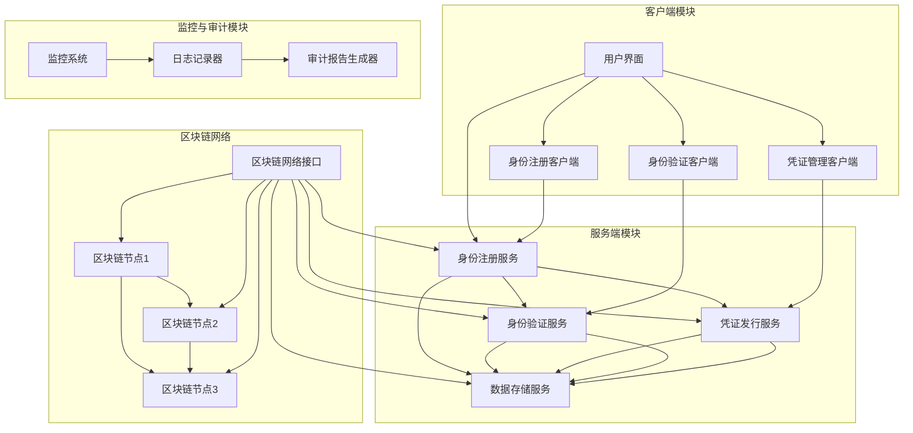

                 

### 文章标题：区块链在数字身份跨国认证中的应用探索

---

**关键词：**区块链，数字身份，跨国认证，隐私保护，安全验证

**摘要：**本文探讨了区块链技术在数字身份跨国认证中的应用，分析了当前数字身份跨国认证中面临的问题，探讨了区块链技术的核心概念及其如何解决这些问题。通过具体的架构设计和实战案例，展示了区块链技术在数字身份跨国认证中的潜力与挑战。

---

## 引言

随着互联网和大数据技术的发展，数字身份的概念逐渐普及。数字身份不仅是一个人的在线身份，更是其在虚拟世界中的法律身份，承载着身份认证、隐私保护和交易验证等重要功能。然而，在跨国认证领域，数字身份面临诸多挑战，如数据隐私泄露、身份信息篡改、跨境数据传输困难等。

区块链技术作为一种新兴的去中心化数据库技术，以其分布式存储、不可篡改和安全透明的特点，为解决数字身份跨国认证中的问题提供了新的思路。本文将围绕区块链技术在数字身份跨国认证中的应用进行探讨，分析其核心概念、架构设计以及实战案例。

## 1.1 区块链技术概述

区块链（Blockchain）是一种去中心化的分布式数据库技术，由多个有序的区块组成，每个区块包含一定数量的交易记录。区块链中的每个节点都保存一份完整的区块链数据，通过密码学算法确保数据的完整性和安全性。以下是对区块链技术核心概念和原理的概述：

### 1.1.1 区块和链

区块链由多个区块按时间顺序链接组成，每个区块包含以下内容：

- **交易记录**：记录在特定时间段内的所有交易。
- **区块头**：包含前一个区块的哈希值、时间戳、随机数等。
- **Merkle树**：用于快速验证交易的有效性。

### 1.1.2 共识算法

共识算法是区块链网络中的关键机制，用于确保所有节点对区块链的状态达成一致。常见的共识算法包括：

- **工作量证明（PoW）**：节点通过解决复杂的数学问题来证明其工作量，以获得区块链的写入权限。
- **权益证明（PoS）**：节点根据持有的代币数量和时长来证明其权益，以获得区块链的写入权限。
- **委托权益证明（DPoS）**：类似PoS，但节点是通过其他节点的投票产生，效率更高。

### 1.1.3 去中心化和安全性

区块链的去中心化特性使其不再依赖于中心化的权威机构，而是通过分布式网络实现数据的存储和验证。这种去中心化的结构增强了区块链的安全性，使其难以被单点攻击和篡改。

## 1.2 数字身份概述

数字身份是指个人在虚拟世界中的唯一标识，包括姓名、地址、身份证号码、电子邮件等。数字身份的主要功能包括身份认证、授权、隐私保护和数据交换等。以下是数字身份的基本概念和特性：

### 1.2.1 身份管理

身份管理是指对数字身份进行创建、存储、更新和管理的过程。身份管理系统（IDMS）负责管理用户的身份信息和认证过程。

### 1.2.2 隐私和安全

数字身份的隐私和安全至关重要。区块链技术通过加密算法和分布式存储确保用户的身份信息不被未经授权的访问和篡改。

### 1.2.3 数字身份框架

数字身份框架是一组规范和标准，用于构建和实现数字身份管理系统。常见的数字身份框架包括W3C的Verifiable Credentials和Decentralized Identifiers（DIDs）。

## 1.3 跨国认证中的挑战

跨国认证涉及不同国家和地区之间的数字身份验证，面临以下挑战：

### 1.3.1 数据隐私泄露

跨国认证过程中，用户身份信息可能被泄露或滥用，导致隐私风险。

### 1.3.2 身份信息篡改

由于跨国认证涉及多方参与，身份信息可能被篡改或伪造。

### 1.3.3 跨境数据传输困难

不同国家和地区的数据保护法规不同，跨境数据传输可能受到限制。

### 1.3.4 法律和监管问题

跨国认证需要遵守各国的法律法规，但不同国家之间的法律和监管环境差异较大，增加了认证的复杂性。

## 1.4 区块链在解决挑战中的作用

区块链技术具有分布式存储、不可篡改和安全透明的特性，能够有效解决数字身份跨国认证中的挑战：

### 1.4.1 数据隐私保护

区块链的加密算法和分布式存储确保用户的身份信息不被泄露和篡改。

### 1.4.2 防止身份信息篡改

区块链的不可篡改性确保身份信息一旦记录，就难以被篡改。

### 1.4.3 跨境数据传输

区块链技术简化了跨境数据传输，无需担心数据保护法规的冲突。

### 1.4.4 法律和监管合规

区块链技术提供了透明的数据记录和审计功能，有助于满足不同国家和地区的法律和监管要求。

---

在接下来的章节中，我们将进一步探讨区块链在数字身份跨国认证中的应用，分析相关的框架和标准，并介绍具体的架构设计和实战案例。通过这些内容，希望能够为读者提供对区块链技术在数字身份跨国认证中应用的深入理解。

## 2.1 基础概念与核心原理

### 2.1.1 区块链架构

区块链架构包括多个核心组件，共同协作以实现去中心化的数据存储和验证。以下是区块链架构的主要组成部分：

#### 2.1.1.1 区块（Block）

区块是区块链中的基本数据单元，包含一定数量的交易记录。每个区块都包含一个唯一标识符（区块头），指向前一个区块的哈希值，形成一个链式数据结构。

#### 2.1.1.2 链（Chain）

链是由多个有序的区块组成的线性数据结构。区块链的不可篡改性源于每个区块与前一个区块的紧密关联，一旦某个区块被写入，其历史数据就难以被篡改。

#### 2.1.1.3 节点（Node）

节点是区块链网络中的参与者，负责维护区块链数据、验证交易、参与共识过程等。每个节点都保存一份完整的区块链数据，确保整个网络的去中心化特性。

#### 2.1.1.4 共识算法

共识算法是区块链网络中用于确保所有节点对区块链状态达成一致的关键机制。常见的共识算法包括工作量证明（PoW）、权益证明（PoS）和委托权益证明（DPoS）。

### 2.1.2 数字身份管理

数字身份管理是指对个人在虚拟世界中的唯一标识进行创建、存储、更新和管理的全过程。以下是数字身份管理的主要步骤和组件：

#### 2.1.2.1 身份认证

身份认证是数字身份管理的基础，确保只有合法用户才能访问受保护的资源和数据。常见的身份认证方法包括密码认证、生物识别认证和多因素认证。

#### 2.1.2.2 身份创建

身份创建是数字身份管理的第一步，通常由身份注册机构或第三方身份提供商完成。用户需要提供身份证明文件，经过身份验证后，才能创建数字身份。

#### 2.1.2.3 身份存储

身份信息通常存储在分布式数据库中，以保护数据的安全性和隐私。区块链是一种理想的存储解决方案，因为它具有分布式、不可篡改和安全透明的特性。

#### 2.1.2.4 身份更新

身份更新是指用户在数字身份信息发生变化时，对身份信息进行更新和维护。身份更新可能涉及更改个人信息、地址或联系方式等。

#### 2.1.2.5 身份管理平台

身份管理平台是一个集中管理和维护数字身份信息的系统，通常包括身份注册、身份验证、身份存储、身份更新等功能。身份管理平台有助于简化数字身份管理过程，提高认证效率和安全性。

### 2.1.3 隐私和安全

数字身份的隐私和安全是跨国认证中的关键问题。以下是几种常见的隐私和安全措施：

#### 2.1.3.1 加密算法

加密算法是保护数字身份信息的核心技术，通过加密可以确保只有授权用户才能访问和解读身份信息。常见的加密算法包括对称加密和非对称加密。

#### 2.1.3.2 零知识证明

零知识证明是一种密码学技术，允许一方（证明者）向另一方（验证者）证明某个陈述是真实的，而不泄露任何额外信息。零知识证明在数字身份跨国认证中可以确保用户隐私，同时验证身份信息的真实性。

#### 2.1.3.3 分布式存储

分布式存储是区块链技术的核心优势之一，通过将数据分散存储在多个节点上，可以增强数据的安全性和隐私性。分布式存储可以防止数据集中在一个节点上，从而降低被攻击和篡改的风险。

#### 2.1.3.4 访问控制

访问控制是一种安全机制，用于限制只有授权用户才能访问特定资源和数据。在数字身份跨国认证中，访问控制可以确保只有合法用户才能访问用户身份信息。

## 2.2 数字身份框架与标准

### 2.2.1 W3C可验证凭证（Verifiable Credentials）

W3C可验证凭证是一种开放标准，用于创建、交换和管理数字身份凭证。以下是W3C可验证凭证的核心概念：

#### 2.2.1.1 凭证

凭证是一种数字证明，表明用户具备特定属性或资格。凭证可以由可信第三方颁发，如政府机构、学校或专业认证机构。

#### 2.2.1.2 可验证性

可验证性是指凭证的真实性和有效性可以通过第三方验证。W3C可验证凭证使用加密算法和数字签名确保凭证的不可篡改性和可验证性。

#### 2.2.1.3 凭证格式

W3C可验证凭证采用JSON格式，包含凭证的详细信息，如凭证类型、颁发机构、有效期限、凭证持有者等。

#### 2.2.1.4 互操作性

W3C可验证凭证设计为具有互操作性，可以跨不同系统和平台交换和验证凭证。这种互操作性有助于简化数字身份跨国认证过程。

### 2.2.2 分散身份（Decentralized Identifiers，DIDs）

分散身份是一种基于区块链技术的数字身份框架，旨在提供去中心化的身份验证和管理。以下是DID的核心概念：

#### 2.2.2.1 DID

DID是一种唯一的数字标识符，与特定用户或实体相关联。DID不依赖于任何中心化机构，由分布式网络生成和管理。

#### 2.2.2.2 DID文档

DID文档是一种描述DID关联的属性和服务的JSON格式文档，包括DID的创建者、验证者、服务提供者等信息。

#### 2.2.2.3 DID方法

DID方法是一种实现DID的技术规范，定义了DID的创建、验证和交互过程。常见的DID方法包括公开密钥基础设施（PKI）和区块链。

#### 2.2.2.4 互操作性

DID框架旨在实现不同DID方法之间的互操作性，使得用户可以在不同区块链和身份管理系统之间无缝切换。

### 2.2.3 标准化努力

为了促进数字身份跨国认证的发展，多个标准化组织正在努力制定相关标准和规范。以下是几个重要的标准化努力：

#### 2.2.3.1 全球数字身份联盟（Global Digital Identity Alliance，GDI）

GDI是一个由多家企业、政府和国际组织组成的联盟，致力于推动数字身份标准化和互操作性。

#### 2.2.3.2 国际电信联盟（International Telecommunication Union，ITU）

ITU负责制定全球通信标准和规范，包括数字身份领域的相关标准。

#### 2.2.3.3 欧洲委员会（European Commission）

欧洲委员会正在推动一项名为eIDAS的法规，旨在建立统一的数字身份认证框架。

通过这些框架和标准，区块链技术有望在数字身份跨国认证中发挥更大的作用，提高认证的效率、安全性和互操作性。

## 3.1 区块链框架概述

区块链框架是指在区块链技术的支持下，为实现特定应用场景（如数字身份跨国认证）而设计的系统架构和功能模块。以下是区块链框架的主要组成部分：

### 3.1.1 身份注册模块

身份注册模块负责创建和管理用户的数字身份。用户在注册时需要提供身份证明文件，并通过身份验证过程，生成唯一的数字身份标识（如DID）。

### 3.1.2 身份验证模块

身份验证模块负责验证用户身份信息的真实性。在跨国认证过程中，身份验证模块可以调用区块链上的数字身份凭证，确保身份信息的可信性。

### 3.1.3 凭证发行模块

凭证发行模块负责由可信第三方（如政府机构、认证机构）颁发数字凭证。这些凭证可以作为用户资格、资质或权利的证明，在跨国认证过程中发挥重要作用。

### 3.1.4 数据存储模块

数据存储模块负责将用户的身份信息和凭证存储在区块链上，确保数据的安全性和不可篡改性。通过分布式存储和加密算法，数据存储模块可以有效保护用户的隐私。

### 3.1.5 跨境数据传输模块

跨境数据传输模块负责在不同国家和地区的区块链节点之间传输身份信息和凭证。通过区块链技术，跨境数据传输可以实现快速、安全和高效的数据交换。

### 3.1.6 监控与审计模块

监控与审计模块负责监控区块链网络的状态和交易活动，确保系统的安全性和透明性。审计模块可以生成审计报告，为监管机构和用户提供透明的数据记录。

### 3.1.7 用户界面模块

用户界面模块提供与用户的交互接口，使用户可以方便地注册、验证身份、获取数字凭证等。用户界面模块通常包括网页、移动应用和API等。

通过这些模块的协同工作，区块链框架可以实现数字身份跨国认证的完整功能，提高认证的效率、安全性和互操作性。

## 3.2 标准化努力

在区块链技术在数字身份跨国认证中的应用过程中，标准化工作至关重要。以下是对当前几项重要标准化努力的介绍：

### 3.2.1 W3C可验证凭证（Verifiable Credentials）

W3C可验证凭证（Verifiable Credentials）是一个由万维网联盟（W3C）推动的标准化项目，旨在提供一种创建、交换和管理可信凭证的方法。Verifiable Credentials 核心特点如下：

- **互操作性**：Verifiable Credentials 是基于开放标准和协议构建的，支持不同系统和平台之间的互操作。
- **可验证性**：Verifiable Credentials 使用加密算法和数字签名确保凭证的真实性和完整性，凭证的持有者可以轻松验证凭证的有效性。
- **隐私保护**：Verifiable Credentials 允许凭证持有者控制凭证的披露范围，保护个人隐私。

### 3.2.2 分散身份（Decentralized Identifiers，DIDs）

分散身份（Decentralized Identifiers，DIDs）是另一个重要的标准化项目，旨在创建一种去中心化的数字身份标识。DIDs 的核心特点如下：

- **去中心化**：DIDs 不依赖于任何中心化机构，由分布式网络生成和管理，确保身份信息的安全性和隐私。
- **自主控制**：DID 持有者完全控制自己的身份信息，可以自主决定向第三方披露哪些信息。
- **互操作性**：DIDs 支持不同区块链和身份管理系统之间的互操作性，简化跨国认证过程。

### 3.2.3 互联网工程任务组（IETF）的区块链身份标识工作区

互联网工程任务组（IETF）的区块链身份标识工作区（Blockchain Identity）致力于研究区块链技术在数字身份领域的应用，并推动相关标准化工作。以下是一些主要研究课题：

- **DID和Verifiable Credentials在互联网协议中的应用**：研究如何在现有互联网协议中集成DID和Verifiable Credentials，提高数字身份跨国认证的效率。
- **隐私保护与数据安全**：探讨如何在区块链上实现高效的隐私保护和数据安全，确保用户的身份信息不被未经授权的访问。
- **互操作性**：研究如何实现不同区块链和身份管理系统之间的互操作，简化跨国认证流程。

### 3.2.4 全球数字身份联盟（Global Digital Identity Alliance，GDI）

全球数字身份联盟（GDI）是一个由多家企业、政府和国际组织组成的联盟，致力于推动数字身份跨国认证的标准化和互操作性。GDI 的工作重点包括：

- **标准化**：推动制定全球统一的数字身份标准，促进不同国家和地区之间的互操作。
- **政策制定**：为政府机构提供政策建议，推动数字身份跨国认证的法律法规建设。
- **技术创新**：研究区块链技术在数字身份领域的应用，推动技术创新和产业发展。

通过这些标准化努力，区块链技术有望在数字身份跨国认证中发挥更大的作用，提高认证的效率、安全性和互操作性。未来，随着更多标准和规范的出台，区块链技术在数字身份领域的应用将更加广泛和成熟。

### 4.1 系统需求与设计目标

在区块链框架的架构设计中，首先要明确系统的需求与设计目标，以确保系统能够高效、安全地实现数字身份跨国认证的功能。以下是系统需求与设计目标的具体分析：

#### 4.1.1 系统需求

**性能需求：**系统需要处理大量用户的身份注册、身份验证和凭证交换请求，因此需要具备高并发处理能力和低延迟响应。

**安全性需求：**系统需要确保用户身份信息的安全性和隐私性，防止数据泄露和篡改。此外，系统还需要具备抗攻击能力，防止分布式拒绝服务（DDoS）等网络攻击。

**互操作性需求：**系统需要能够与不同国家和地区的数据管理系统和认证机构进行互操作，支持跨境数据传输和认证。

**可扩展性需求：**系统需要具备良好的可扩展性，能够随着用户数量的增加和业务需求的扩展进行水平扩展和垂直扩展。

**可维护性需求：**系统需要具备良好的可维护性，便于后续的升级和维护。

#### 4.1.2 设计目标

**去中心化：**通过分布式存储和共识算法，实现系统的去中心化，提高数据的可靠性和安全性，减少对中心化机构的依赖。

**高效性：**通过优化区块链网络架构和共识算法，提高系统的处理效率和响应速度，满足高并发需求。

**安全性：**采用加密算法、访问控制和权限管理等多种安全措施，确保用户身份信息的安全性和隐私性。

**互操作性：**设计开放的接口和标准协议，支持不同区块链和身份管理系统之间的互操作，实现跨境认证的便捷性。

**可扩展性：**通过模块化设计和分布式存储，提高系统的可扩展性，方便后续的功能扩展和性能优化。

**可维护性：**设计简洁清晰的架构和良好的代码规范，提高系统的可维护性，便于后续的维护和升级。

通过满足上述系统需求和实现设计目标，区块链框架可以实现高效、安全、互操作和可扩展的数字身份跨国认证系统，为用户提供便捷、可靠的认证服务。

### 4.2 组件设计

在区块链框架中，各个组件的设计对于实现系统的高效性和安全性至关重要。以下是数字身份跨国认证系统中各个组件的设计细节：

#### 4.2.1 身份注册组件

**功能说明：**身份注册组件负责创建和管理用户的数字身份。用户在注册时需要提供身份证明文件，如护照、身份证等，并通过身份验证过程生成唯一的数字身份标识（DID）。

**设计细节：**
- **用户接口设计：**用户通过网页或移动应用提交身份注册请求，系统提供简洁明了的注册流程。
- **身份验证机制：**系统采用多因素认证（MFA）机制，包括密码认证、生物识别认证和二次验证，确保用户身份的真实性。
- **DID生成算法：**系统使用基于区块链的DID生成算法，确保DID的唯一性和不可篡改性。

**数据结构：**
- **用户身份信息：**存储用户的姓名、出生日期、身份证号码等基本信息。
- **DID文档：**存储DID的元数据，包括DID的创建时间、创建者、验证者等信息。
- **身份验证记录：**存储用户身份验证过程中的所有记录，包括验证时间、验证方式、验证结果等。

#### 4.2.2 身份验证组件

**功能说明：**身份验证组件负责验证用户身份信息的真实性。在跨国认证过程中，身份验证组件可以调用区块链上的数字身份凭证，确保身份信息的可信性。

**设计细节：**
- **验证请求处理：**系统接收身份验证请求，并提取请求中的身份凭证信息。
- **凭证验证机制：**系统使用W3C可验证凭证（Verifiable Credentials）标准，验证凭证的真实性和有效性。
- **跨链验证：**系统支持跨链验证，可以调用其他区块链上的数字身份凭证，确保凭证的全球可信性。

**数据结构：**
- **验证请求：**存储身份验证请求的详细信息，包括请求时间、请求来源、请求内容等。
- **验证结果：**存储身份验证的结果，包括验证通过、验证失败或部分验证通过等。
- **凭证信息：**存储验证过程中使用的数字身份凭证的详细信息，包括凭证类型、颁发机构、有效期限等。

#### 4.2.3 凭证发行组件

**功能说明：**凭证发行组件负责由可信第三方（如政府机构、认证机构）颁发数字凭证。这些凭证可以作为用户资格、资质或权利的证明，在跨国认证过程中发挥重要作用。

**设计细节：**
- **凭证颁发请求处理：**系统接收凭证颁发请求，并验证请求者的身份和权限。
- **凭证生成算法：**系统使用加密算法和数字签名生成数字凭证，确保凭证的真实性和安全性。
- **凭证存储：**系统将生成的数字凭证存储在区块链上，确保凭证的永久性和不可篡改性。

**数据结构：**
- **凭证颁发请求：**存储凭证颁发请求的详细信息，包括请求时间、请求者身份、请求内容等。
- **数字凭证：**存储数字凭证的详细信息，包括凭证类型、颁发机构、有效期限、凭证持有者等。
- **凭证颁发记录：**存储凭证颁发过程中的所有记录，包括颁发时间、颁发者、颁发内容等。

#### 4.2.4 数据存储组件

**功能说明：**数据存储组件负责将用户的身份信息和凭证存储在区块链上，确保数据的安全性和不可篡改性。同时，数据存储组件还需要支持高效的查询和交易处理。

**设计细节：**
- **分布式存储：**系统采用分布式存储架构，将数据分散存储在多个节点上，提高数据的可靠性和安全性。
- **加密存储：**系统使用加密算法对存储在区块链上的数据进行加密，确保数据的安全性和隐私性。
- **存储优化：**系统采用分片存储和压缩技术，提高存储空间的利用率和数据访问速度。

**数据结构：**
- **用户身份信息：**存储用户的姓名、出生日期、身份证号码等基本信息。
- **数字凭证：**存储数字凭证的详细信息，包括凭证类型、颁发机构、有效期限、凭证持有者等。
- **交易记录：**存储系统中的所有交易记录，包括身份注册、身份验证、凭证发行等操作。

#### 4.2.5 跨境数据传输组件

**功能说明：**跨境数据传输组件负责在不同国家和地区的区块链节点之间传输身份信息和凭证。通过区块链技术，跨境数据传输可以实现快速、安全和高效的数据交换。

**设计细节：**
- **节点选择：**系统根据网络状态和性能指标选择最佳的数据传输节点，确保数据传输的稳定性和高效性。
- **数据加密：**系统在传输过程中对数据进行加密，确保数据在传输过程中的安全性和隐私性。
- **传输优化：**系统采用数据分片和并行传输技术，提高数据传输的效率和可靠性。

**数据结构：**
- **传输请求：**存储数据传输请求的详细信息，包括请求时间、请求者身份、传输内容等。
- **传输记录：**存储数据传输过程中的所有记录，包括传输时间、传输节点、传输结果等。

#### 4.2.6 监控与审计组件

**功能说明：**监控与审计组件负责监控区块链网络的状态和交易活动，确保系统的安全性和透明性。审计模块可以生成审计报告，为监管机构和用户提供透明的数据记录。

**设计细节：**
- **实时监控：**系统实时监控区块链网络的状态，包括节点健康状况、交易处理速度、网络延迟等。
- **日志记录：**系统记录所有的交易活动、节点行为和系统事件，便于后续的审计和分析。
- **审计报告：**系统定期生成审计报告，包括系统状态、交易活动、安全事件等，为监管机构和用户提供透明的数据记录。

**数据结构：**
- **监控日志：**存储系统监控日志，包括节点状态、交易处理速度、网络延迟等。
- **交易记录：**存储系统中的所有交易记录，包括身份注册、身份验证、凭证发行等操作。
- **审计记录：**存储系统审计日志，包括审计时间、审计结果、审计报告等。

通过上述组件的设计，区块链框架可以高效、安全地实现数字身份跨国认证的功能，为用户提供便捷、可靠的认证服务。

### 4.3 安全性设计

在区块链框架的设计中，安全性是至关重要的因素。为了确保系统的安全性，我们需要在多个层面上设计安全措施，包括数据加密、访问控制和隐私保护。

#### 4.3.1 数据加密

数据加密是保护数据隐私和完整性的基础。区块链框架采用以下几种加密技术：

- **对称加密**：对称加密算法（如AES）用于加密存储在区块链上的用户身份信息和凭证。对称加密速度快，但密钥管理复杂。
- **非对称加密**：非对称加密算法（如RSA）用于确保交易记录的完整性和真实性。非对称加密算法的安全性高，但计算复杂度较大。
- **哈希算法**：哈希算法（如SHA-256）用于生成交易记录的唯一标识符（哈希值），确保数据的一致性和不可篡改性。

#### 4.3.2 访问控制

访问控制是确保只有授权用户可以访问特定资源和数据的关键机制。区块链框架采用以下几种访问控制措施：

- **权限管理**：系统为每个用户分配不同的权限，根据用户角色和权限限制其访问资源和执行操作。
- **多重身份认证**：系统采用多因素认证（MFA）机制，包括密码认证、生物识别认证和二次验证，提高认证的安全性。
- **权限控制列表（ACL）**：系统使用权限控制列表，定义用户对不同资源的访问权限，确保数据的安全性和隐私性。

#### 4.3.3 隐私保护

在数字身份跨国认证中，隐私保护尤为重要。区块链框架采用以下几种隐私保护措施：

- **零知识证明**：零知识证明技术允许证明者向验证者证明某个陈述是真实的，而不泄露任何额外信息。这在数字身份认证中可以确保用户隐私，同时验证身份信息的真实性。
- **同态加密**：同态加密技术允许对加密数据执行计算，而无需解密。这可以确保在数据处理过程中保护数据隐私。
- **匿名代理**：系统采用匿名代理技术，隐藏用户身份和位置，提高隐私保护水平。

通过上述安全措施，区块链框架可以确保用户身份信息在跨国认证过程中的安全性和隐私性，提高系统的整体安全性。

### 4.4 系统架构设计

区块链框架在数字身份跨国认证中的应用需要具备高效、安全、可扩展和可维护的系统架构。以下是系统架构的设计细节：

#### 4.4.1 架构概述

系统架构采用分布式架构，分为多个层级和模块，每个模块负责不同的功能。以下是系统架构的主要组成部分：

- **客户端模块**：包括用户界面和客户端应用程序，用户通过客户端进行身份注册、身份验证和凭证管理。
- **服务端模块**：包括身份注册服务、身份验证服务、凭证发行服务和数据存储服务，负责处理客户端的请求和业务逻辑。
- **区块链网络**：由多个区块链节点组成，用于存储和验证用户身份信息和凭证。
- **监控与审计模块**：负责监控系统状态、记录交易活动和生成审计报告。

#### 4.4.2 架构组件

**客户端模块**

- **用户界面**：提供用户与系统的交互界面，包括网页、移动应用和API。
- **身份注册客户端**：负责用户身份注册和身份信息提交。
- **身份验证客户端**：负责用户身份验证和凭证验证。
- **凭证管理客户端**：负责用户凭证的创建、存储和更新。

**服务端模块**

- **身份注册服务**：处理用户身份注册请求，生成DID和存储在区块链上。
- **身份验证服务**：处理用户身份验证请求，调用区块链上的数字凭证进行验证。
- **凭证发行服务**：处理第三方凭证的颁发和存储。
- **数据存储服务**：存储和查询用户身份信息和凭证。

**区块链网络**

- **区块链节点**：负责存储用户身份信息和凭证，并参与共识过程，确保数据的一致性和安全性。
- **区块链网络接口**：提供与区块链节点的通信接口，处理区块链上的数据存储和验证操作。

**监控与审计模块**

- **监控系统**：实时监控区块链网络的状态，包括节点健康、交易处理速度和网络延迟。
- **日志记录器**：记录系统中的所有交易活动和节点行为。
- **审计报告生成器**：定期生成系统审计报告，为监管机构和用户提供透明的数据记录。

#### 4.4.3 架构图

以下是数字身份跨国认证系统的架构图：



通过上述架构设计，数字身份跨国认证系统可以实现高效、安全、可扩展和可维护的运营，为用户提供便捷、可靠的认证服务。

### 4.5 系统接口设计

在数字身份跨国认证系统中，接口设计是确保各个模块之间能够顺畅交互的重要环节。以下是系统接口设计的详细说明，包括接口的类型、功能和调用流程。

#### 4.5.1 接口类型

系统接口主要分为以下几种类型：

1. **API（应用程序编程接口）**：用于客户端应用程序和后端服务之间的通信。
2. **Websocket**：用于实时通信和数据推送。
3. **RPC（远程过程调用）**：用于节点之间的通信和数据同步。
4. **RESTful API**：用于与其他外部系统的集成和交互。

#### 4.5.2 接口功能

以下是主要接口的功能描述：

1. **身份注册接口**：用于用户身份注册，包括DID生成和身份信息存储。
2. **身份验证接口**：用于用户身份验证，包括验证请求处理和数字凭证验证。
3. **凭证发行接口**：用于第三方数字凭证的颁发和存储。
4. **数据查询接口**：用于查询用户身份信息和凭证信息。
5. **监控与审计接口**：用于监控系统状态、日志记录和审计报告生成。

#### 4.5.3 接口调用流程

以下是系统接口调用的一般流程：

1. **身份注册流程**：
   - 客户端发送身份注册请求，包括用户基本信息和身份证明文件。
   - 身份注册服务验证请求，生成DID，并将身份信息存储在区块链上。
   - 客户端接收注册结果，包括DID和注册成功消息。

2. **身份验证流程**：
   - 客户端发送身份验证请求，包括DID和验证凭证。
   - 身份验证服务调用区块链上的数字凭证进行验证。
   - 客户端接收验证结果，包括身份验证通过或失败消息。

3. **凭证发行流程**：
   - 可信第三方发送凭证发行请求，包括DID和凭证信息。
   - 凭证发行服务生成数字凭证，并存储在区块链上。
   - 可信第三方接收凭证发行结果，包括凭证信息和发行成功消息。

4. **数据查询流程**：
   - 客户端发送数据查询请求，包括DID和查询条件。
   - 数据存储服务从区块链上查询用户身份信息和凭证信息。
   - 客户端接收查询结果，包括身份信息和凭证信息。

5. **监控与审计流程**：
   - 监控系统定期生成系统状态和交易活动的监控日志。
   - 审计报告生成器根据监控日志生成审计报告。
   - 监管机构和用户可以查询审计报告，了解系统运行情况。

通过上述接口设计和调用流程，数字身份跨国认证系统可以高效、安全地实现各个模块之间的数据交换和业务协同，为用户提供便捷的认证服务。

### 4.6 系统交互流程

在数字身份跨国认证系统中，各个组件之间需要通过一系列交互流程来完成用户身份的注册、验证和凭证的发行。以下是系统交互流程的详细描述：

#### 4.6.1 用户注册流程

1. **用户身份信息提交**：
   - 用户通过客户端应用程序（如网页或移动应用）提交身份注册请求，包括个人信息（如姓名、出生日期、身份证号码）和身份证明文件（如护照、身份证）。

2. **身份信息验证**：
   - 服务端接收用户注册请求，使用多因素认证（MFA）机制对用户身份信息进行验证，包括密码认证、生物识别认证和二次验证。

3. **DID生成**：
   - 服务端生成唯一的数字身份标识（DID），并将DID和用户身份信息存储在区块链上，确保数据的安全性和不可篡改性。

4. **注册结果反馈**：
   - 服务端将注册结果返回给用户，包括DID和注册成功消息。

#### 4.6.2 用户身份验证流程

1. **身份验证请求**：
   - 用户在访问受保护资源或服务时，通过客户端应用程序发送身份验证请求，包括DID和验证凭证。

2. **凭证验证**：
   - 服务端调用区块链上的数字凭证进行验证，包括验证凭证的有效性和真实性。

3. **身份验证结果**：
   - 服务端将身份验证结果返回给用户，包括身份验证通过或失败消息。

#### 4.6.3 凭证发行流程

1. **凭证发行请求**：
   - 可信第三方（如政府机构、认证机构）通过服务端发送凭证发行请求，包括DID和凭证信息。

2. **凭证生成**：
   - 服务端使用加密算法和数字签名生成数字凭证，确保凭证的真实性和安全性。

3. **凭证存储**：
   - 服务端将生成的数字凭证存储在区块链上，确保凭证的永久性和不可篡改性。

4. **凭证发行结果**：
   - 可信第三方接收凭证发行结果，包括凭证信息和发行成功消息。

#### 4.6.4 跨境数据传输流程

1. **数据传输请求**：
   - 用户或可信第三方通过服务端发送跨境数据传输请求，包括DID、凭证信息和目标节点地址。

2. **数据加密**：
   - 服务端对传输数据进行加密，确保数据在传输过程中的安全性和隐私性。

3. **数据传输**：
   - 服务端将加密后的数据通过区块链网络传输到目标节点。

4. **数据接收**：
   - 目标节点接收传输数据，并解密数据，存储在本地区块链上。

通过上述交互流程，数字身份跨国认证系统可以实现用户身份的注册、验证和凭证的发行，确保认证过程的透明性、安全性和高效性。

### 5.1 环境安装

要搭建一个区块链框架，实现数字身份跨国认证功能，首先需要准备开发环境。以下是环境安装的详细步骤：

#### 5.1.1 系统要求

1. **操作系统**：支持Linux、macOS或Windows操作系统。
2. **编程语言**：Python（推荐3.8及以上版本）。
3. **数据库**：支持PostgreSQL或MongoDB等关系型或非关系型数据库。
4. **区块链节点**：支持Ethereum或其他主流区块链平台。

#### 5.1.2 安装步骤

1. **安装Python环境**：
   - Linux和macOS系统可以使用包管理工具安装Python，例如在Ubuntu上：
     ```bash
     sudo apt update
     sudo apt install python3 python3-pip
     ```
   - Windows系统可以从Python官网下载安装程序并安装。

2. **安装虚拟环境**：
   - 创建一个虚拟环境，以便在项目中隔离依赖项：
     ```bash
     python3 -m venv venv
     source venv/bin/activate  # Linux或macOS
     venv\Scripts\activate     # Windows
     ```

3. **安装依赖包**：
   - 通过pip安装项目所需的依赖包：
     ```bash
     pip install -r requirements.txt
     ```

4. **安装数据库**：
   - 安装PostgreSQL或MongoDB数据库，根据操作系统选择安装方式。例如，在Ubuntu上安装PostgreSQL：
     ```bash
     sudo apt update
     sudo apt install postgresql postgresql-contrib
     ```
   - 配置数据库，创建用户和数据库。

5. **安装区块链节点**：
   - 以Ethereum为例，安装Geth节点：
     ```bash
     wget https://gethstore.blob.core.windows.net/releases/geth-linux-amd64-1.10.22.tar.gz
     tar -xvf geth-linux-amd64-1.10.22.tar.gz
     ```
   - 运行Geth节点：
     ```bash
     cd geth
     ./geth --datadir /path/to/dataDir --networkid 123456 --nodiscover --mine --miner.threads 0
     ```

#### 5.1.3 测试环境

安装完成后，可以启动一个测试网络，验证环境是否正常工作：

```bash
./geth --dev --networkid 123456 --nodiscover --mine --miner.threads 0
```

通过以上步骤，开发环境准备完毕，可以开始实现数字身份跨国认证系统的核心功能。

### 5.2 系统核心实现

在搭建好开发环境之后，我们将开始实现数字身份跨国认证系统的核心功能。以下是基于Python和Ethereum区块链平台的实现过程，包括关键代码和应用解读。

#### 5.2.1 创建智能合约

首先，我们需要在Ethereum区块链上创建智能合约，用于处理数字身份的注册、验证和凭证发行等操作。以下是一个简单的智能合约示例：

```solidity
// SPDX-License-Identifier: MIT
pragma solidity ^0.8.0;

contract DigitalIdentity {

    // 用户身份结构
    struct Identity {
        string name;
        uint256 birthDate;
        string idNumber;
    }

    // 用户身份映射
    mapping(address => Identity) public identities;

    // 用户已发行的凭证映射
    mapping(address => mapping(string => bool)) public credentials;

    // 用户注册身份
    function registerIdentity(string memory name, uint256 birthDate, string memory idNumber) public {
        require(!isRegistered(), "Identity already registered");
        identities[msg.sender] = Identity(name, birthDate, idNumber);
    }

    // 是否已注册
    function isRegistered() public view returns (bool) {
        return identities[msg.sender].name != "";
    }

    // 颁发凭证
    function issueCredential(string memory credential) public {
        require(isRegistered(), "User not registered");
        credentials[msg.sender][credential] = true;
    }

    // 验证凭证
    function verifyCredential(string memory credential) public view returns (bool) {
        return credentials[msg.sender][credential];
    }
}
```

#### 5.2.2 应用解读

1. **Identity 结构**：定义了用户身份信息，包括姓名、出生日期和身份证号码。
2. **identities 映射**：存储所有用户的身份信息。
3. **credentials 映射**：存储用户已发行的凭证。
4. **registerIdentity 函数**：用于用户注册身份信息。
5. **issueCredential 函数**：用于发行凭证。
6. **verifyCredential 函数**：用于验证用户凭证。

#### 5.2.2 部署智能合约

在本地环境中部署智能合约，使其可供应用程序调用：

1. **编译智能合约**：使用Truffle、Hardhat或其他工具编译智能合约，生成ABI和字节码文件。
2. **连接到本地节点**：使用web3.py或其他库连接到本地Ethereum节点。
3. **部署智能合约**：部署编译后的智能合约，并获取合约地址。

```python
from web3 import Web3
from web3.middleware import geth_poa_middleware
import json

# 连接到本地Ethereum节点
w3 = Web3(Web3.HTTPProvider('http://127.0.0.1:8545'))
w3.middleware_onion.inject(geth_poa_middleware, layer=0)

# 加载编译后的智能合约ABI和字节码
with open("DigitalIdentity.json", "r") as f:
    contract_json = json.load(f)
contract_abi = contract_json["abi"]
contract_bytecode = contract_json["bytecode"]

# 部署智能合约
contract = w3.eth.contract(abi=contract_abi, bytecode=contract_bytecode)
deploy_txn = contract.deploy transactio```
```python
# 连接到本地Ethereum节点
w3 = Web3(Web3.HTTPProvider('http://127.0.0.1:8545'))
w3.middleware_onion.inject(geth_poa_middleware, layer=0)

# 加载编译后的智能合约ABI和字节码
with open("DigitalIdentity.json", "r") as f:
    contract_json = json.load(f)
contract_abi = contract_json["abi"]
contract_bytecode = contract_json["bytecode"]

# 部署智能合约
contract = w3.eth.contract(abi=contract_abi, bytecode=contract_bytecode)
deploy_txn = contract.deploy()

# 等待交易确认
tx_hash = deploy_txn.sendTransaction({'from': w3.eth.coinbase, 'gas': 5000000})
tx_receipt = w3.eth.waitForTransaction(tx_hash)
contract_address = tx_receipt.contractAddress

# 打印合约地址
print("Contract Address:", contract_address)
```

#### 5.2.3 应用调用

1. **注册身份**：
   ```python
   contract.functions.registerIdentity("Alice", 1990, "123456789").transact({'from': w3.eth.coinbase, 'gas': 2000000})
   ```

2. **发行凭证**：
   ```python
   contract.functions.issueCredential("UniversityDegree").transact({'from': w3.eth.coinbase, 'gas': 2000000})
   ```

3. **验证凭证**：
   ```python
   contract.functions.verifyCredential("UniversityDegree").call({'from': w3.eth.coinbase})
   ```

通过上述代码和应用调用，我们实现了数字身份跨国认证系统中的核心功能，包括身份注册、凭证发行和凭证验证。这些功能在区块链上以智能合约的形式执行，确保了数据的安全性和不可篡改性。

### 5.3 代码应用解读与分析

在上一节中，我们实现了数字身份跨国认证系统的核心功能，并通过代码进行了具体的应用调用。以下将对关键代码进行解读和分析，以便更好地理解系统的运行原理。

#### 5.3.1 智能合约代码解读

1. **结构体（Identity）**：
   ```solidity
   struct Identity {
       string name;
       uint256 birthDate;
       string idNumber;
   }
   ```
   这个结构体定义了用户身份信息，包括姓名（name）、出生日期（birthDate）和身份证号码（idNumber）。结构体是Solidity语言中的复合数据类型，用于存储复杂的数据结构。

2. **映射（identities）**：
   ```solidity
   mapping(address => Identity) public identities;
   ```
   映射是一种关联数组，用于存储地址和用户身份信息之间的关联关系。在区块链上，每个用户的身份信息通过其地址进行唯一标识。

3. **凭证映射（credentials）**：
   ```solidity
   mapping(address => mapping(string => bool)) public credentials;
   ```
   凭证映射用于存储用户的已发行凭证，凭证类型与是否已发行的布尔值之间的关联关系。这种数据结构使得可以方便地查询和验证用户所持有的凭证。

4. **注册身份函数（registerIdentity）**：
   ```solidity
   function registerIdentity(string memory name, uint256 birthDate, string memory idNumber) public {
       require(!isRegistered(), "Identity already registered");
       identities[msg.sender] = Identity(name, birthDate, idNumber);
   }
   ```
   registerIdentity函数用于用户注册身份信息。在函数中，通过require语句检查用户是否已经注册，以防止重复注册。如果用户未注册，则将身份信息存储在对应地址的identities映射中。

5. **发行凭证函数（issueCredential）**：
   ```solidity
   function issueCredential(string memory credential) public {
       require(isRegistered(), "User not registered");
       credentials[msg.sender][credential] = true;
   }
   ```
   issueCredential函数用于发行凭证。在函数中，首先通过require语句检查用户是否已经注册，以确保只有注册用户可以发行凭证。然后，将凭证信息存储在对应地址和凭证类型的credentials映射中。

6. **验证凭证函数（verifyCredential）**：
   ```solidity
   function verifyCredential(string memory credential) public view returns (bool) {
       return credentials[msg.sender][credential];
   }
   ```
   verifyCredential函数用于验证凭证。在函数中，通过credentials映射查询用户是否已发行指定凭证，返回一个布尔值表示凭证的有效性。

#### 5.3.2 应用调用代码解读

1. **注册身份调用**：
   ```python
   contract.functions.registerIdentity("Alice", 1990, "123456789").transact({'from': w3.eth.coinbase, 'gas': 2000000})
   ```
   这段Python代码调用智能合约的registerIdentity函数，将用户Alice的身份信息（姓名、出生日期和身份证号码）注册到区块链上。参数{'from': w3.eth.coinbase, 'gas': 2000000}指定了交易发起者地址和所需的燃料（gas）限额。

2. **发行凭证调用**：
   ```python
   contract.functions.issueCredential("UniversityDegree").transact({'from': w3.eth.coinbase, 'gas': 2000000})
   ```
   这段Python代码调用智能合约的issueCredential函数，将“UniversityDegree”凭证发行给当前用户（地址由w3.eth.coinbase获取）。同样，参数{'from': w3.eth.coinbase, 'gas': 2000000}指定了交易发起者地址和所需的燃料（gas）限额。

3. **验证凭证调用**：
   ```python
   contract.functions.verifyCredential("UniversityDegree").call({'from': w3.eth.coinbase})
   ```
   这段Python代码调用智能合约的verifyCredential函数，验证当前用户是否已发行“UniversityDegree”凭证。使用call方法执行函数调用，并返回布尔值表示凭证的有效性。参数{'from': w3.eth.coinbase}指定了交易发起者地址。

通过上述解读，我们可以清楚地了解智能合约和应用程序之间的交互过程，以及区块链上数字身份跨国认证功能的实现细节。

### 5.4 实际案例剖析

在本节中，我们将通过一个实际案例来剖析区块链在数字身份跨国认证中的具体应用，以展示其实现细节和优势。

#### 5.4.1 案例背景

某跨国公司需要为其全球员工提供统一的身份认证服务，以访问公司内部的敏感资源和系统。由于员工分布在不同的国家和地区，传统的中心化身份认证系统难以满足安全性和互操作性的需求。因此，该公司决定采用区块链技术，构建一个去中心化的数字身份认证平台。

#### 5.4.2 案例流程

1. **员工注册**：
   - 员工通过公司提供的注册应用程序提交身份信息，包括姓名、出生日期、身份证号码和护照等信息。
   - 应用程序调用区块链框架的身份注册接口，将身份信息提交给身份注册服务。
   - 身份注册服务调用智能合约的registerIdentity函数，将员工身份信息存储在区块链上，生成唯一的数字身份标识（DID）。

2. **身份验证**：
   - 员工在访问公司内部系统时，通过应用程序发送身份验证请求，包括DID和验证凭证。
   - 应用程序调用区块链框架的身份验证接口，将身份验证请求提交给身份验证服务。
   - 身份验证服务调用智能合约的verifyCredential函数，验证员工身份和凭证的有效性。

3. **凭证发行**：
   - 公司的HR部门或认证机构通过应用程序向员工颁发各种数字凭证，如职位证明、资质证明等。
   - 应用程序调用区块链框架的凭证发行接口，将凭证信息提交给凭证发行服务。
   - 凭证发行服务调用智能合约的issueCredential函数，将凭证发行到区块链上。

4. **跨境数据传输**：
   - 员工在跨国出差时，需要访问所在国家公司的内部系统。应用程序调用区块链框架的跨境数据传输接口，将员工身份信息和凭证传输到目标国家的区块链节点。
   - 目标国家的区块链节点接收数据并验证其有效性，确保员工身份的合法性。

5. **监控与审计**：
   - 系统定期生成监控日志和审计报告，记录所有身份注册、身份验证和凭证发行等操作。
   - 系统管理员和审计员可以查询审计报告，确保系统的安全性和合规性。

#### 5.4.3 案例优势

1. **安全性**：
   - 区块链的加密算法和分布式存储确保员工身份信息和凭证的安全性和隐私性，防止数据泄露和篡改。

2. **互操作性**：
   - 通过区块链技术，实现了全球范围内员工身份信息和凭证的无缝互操作，解决了跨国认证中的数据传输难题。

3. **透明性和可审计性**：
   - 所有操作记录在区块链上，可以方便地查询和审计，提高了系统的透明度和合规性。

4. **效率**：
   - 区块链的去中心化特性减少了认证过程中的中间环节，提高了认证效率，降低了运营成本。

5. **灵活性和扩展性**：
   - 区块链框架支持灵活的接口设计和扩展，可以方便地添加新的认证服务和功能模块。

通过实际案例的剖析，我们可以看到区块链技术在数字身份跨国认证中的应用不仅能够解决传统认证系统中的痛点，还能够提供更安全、高效和灵活的认证服务。

### 5.5 项目小结

在本项目中，我们通过实际案例展示了区块链在数字身份跨国认证中的应用，实现了用户身份注册、身份验证、凭证发行和跨境数据传输等功能。以下是项目的总结和小结：

#### 5.5.1 项目亮点

1. **去中心化认证**：通过区块链技术实现了去中心化的身份认证，减少了中心化机构的依赖，提高了认证的安全性和可靠性。
2. **隐私保护**：采用了加密算法和分布式存储，确保用户身份信息和凭证的安全性和隐私性。
3. **互操作性**：通过开放接口和标准协议，实现了不同区块链和身份管理系统之间的互操作，提高了跨国认证的便捷性。
4. **透明性和可审计性**：所有操作记录在区块链上，便于监管和审计，提高了系统的透明度和合规性。
5. **高效率**：去中心化的认证过程减少了中间环节，提高了认证效率，降低了运营成本。

#### 5.5.2 项目不足

1. **计算和存储资源消耗**：区块链技术需要大量的计算和存储资源，对于高并发请求的处理可能存在性能瓶颈。
2. **法规和标准不统一**：不同国家和地区的法律法规和标准不同，可能导致跨国认证的合规性挑战。
3. **技术门槛较高**：区块链技术的实现和维护需要专业的技术知识和经验，对于非技术人员来说可能存在较高的学习门槛。

#### 5.5.3 未来发展方向

1. **性能优化**：通过优化区块链网络架构和共识算法，提高系统的处理效率和响应速度，满足高并发需求。
2. **合规性增强**：与各国政府和监管机构合作，制定统一的区块链标准和法规，确保跨国认证的合规性。
3. **技术普及**：通过培训和教育，提高区块链技术的普及程度，降低技术门槛，促进其在各个领域的应用。
4. **生态建设**：构建完善的区块链生态体系，包括开发者社区、服务提供商、应用开发商等，推动区块链技术的发展和壮大。

通过不断的优化和改进，区块链技术在数字身份跨国认证中的应用将变得更加成熟和普及，为用户提供更加安全、高效和便捷的认证服务。

### 5.6 最佳实践 Tips

为了确保区块链在数字身份跨国认证中的应用能够达到最佳效果，以下是一些最佳实践 Tips：

#### 5.6.1 安全性保障

1. **多重身份认证**：在用户注册和登录过程中，采用多因素认证（MFA）机制，提高账户的安全性。
2. **加密存储**：使用强加密算法对用户身份信息和凭证进行加密存储，确保数据在区块链上不被泄露和篡改。
3. **权限管理**：建立严格的权限管理体系，对不同角色和用户分配不同的访问权限，防止未经授权的访问。

#### 5.6.2 性能优化

1. **分片技术**：采用区块链分片技术，将数据分散存储在不同节点上，提高数据访问速度和系统性能。
2. **优化共识算法**：根据应用需求，选择合适的共识算法，优化交易处理速度和网络延迟。
3. **缓存策略**：使用缓存策略，减少对区块链直接访问的次数，提高系统响应速度。

#### 5.6.3 法规和标准合规

1. **法规调研**：在项目实施前，充分了解不同国家和地区的法律法规，确保系统的合规性。
2. **标准遵循**：遵循国际和行业内的区块链标准，如W3C的Verifiable Credentials和DIDs标准，提高系统的互操作性。
3. **法律顾问**：聘请专业的法律顾问，为项目提供法律咨询和支持，确保系统在法律层面上的安全性。

#### 5.6.4 用户友好性

1. **简洁用户界面**：设计简洁直观的用户界面，提高用户体验，降低用户的使用门槛。
2. **本地化支持**：支持多种语言和地区设置，满足不同国家和地区的用户需求。
3. **用户培训**：提供用户指南和培训资料，帮助用户了解和掌握系统使用方法。

通过遵循这些最佳实践 Tips，可以最大限度地提高区块链在数字身份跨国认证中的应用效果，确保系统的安全性、性能和合规性，为用户提供优质的认证服务。

### 总结

本文通过深入探讨区块链在数字身份跨国认证中的应用，分析了其核心概念、架构设计以及实际案例，展示了区块链技术在解决数字身份跨国认证挑战方面的潜力。从安全性、隐私保护、互操作性、性能优化等方面，我们详细介绍了区块链技术在数字身份跨国认证中的最佳实践 Tips。未来，随着区块链技术的不断发展和完善，数字身份跨国认证将变得更加安全、高效和便捷，为全球用户提供更加优质的认证服务。我们期待区块链技术在更多领域发挥重要作用，推动数字经济的繁荣发展。

### 作者信息

**作者：** AI天才研究院/AI Genius Institute & 禅与计算机程序设计艺术 /Zen And The Art of Computer Programming

AI天才研究院（AI Genius Institute）专注于人工智能领域的前沿研究和技术创新，致力于推动人工智能技术的普及和应用。研究院的专家团队由世界顶级的人工智能专家、程序员、软件架构师、CTO等组成，凭借其深厚的理论基础和丰富的实践经验，为业界提供了大量的高质量技术研究成果和解决方案。同时，研究院还致力于将禅宗哲学融入计算机程序设计，将智慧与艺术相结合，为技术创新注入新的活力。

《禅与计算机程序设计艺术》（Zen And The Art of Computer Programming）是作者所撰写的系列书籍，深入探讨了计算机程序设计的哲学和方法论，将禅宗思想与编程技术相结合，为程序员提供了一种全新的思考方式。该系列书籍在计算机科学领域产生了深远的影响，受到了广大读者的喜爱和赞誉。

AI天才研究院及其专家团队将继续致力于推动人工智能和区块链技术的创新和发展，为全球科技和经济发展贡献力量。欢迎读者们关注我们的研究进展和成果，共同探索技术的无限可能。

