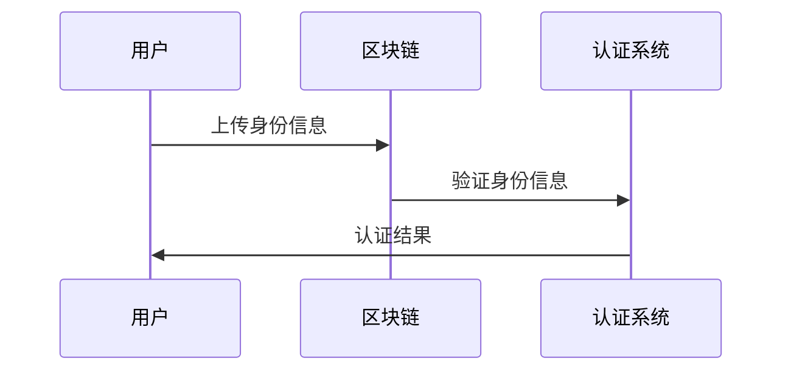
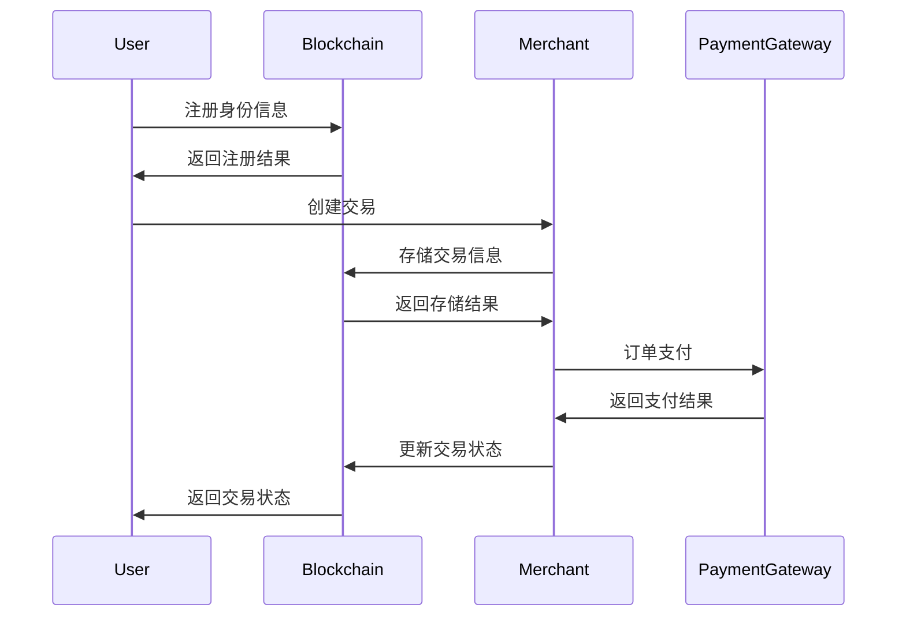
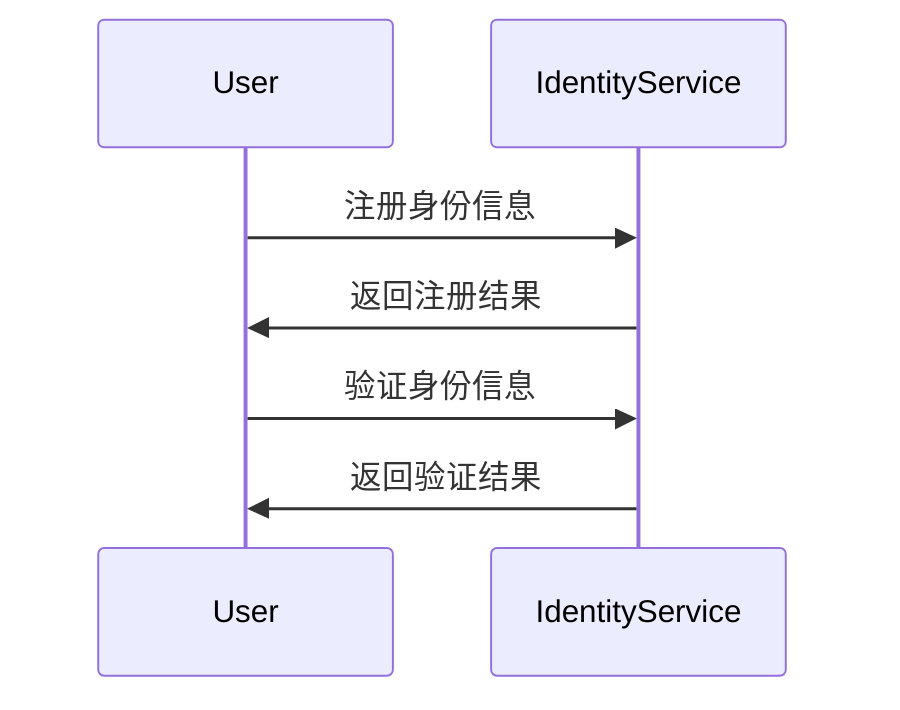
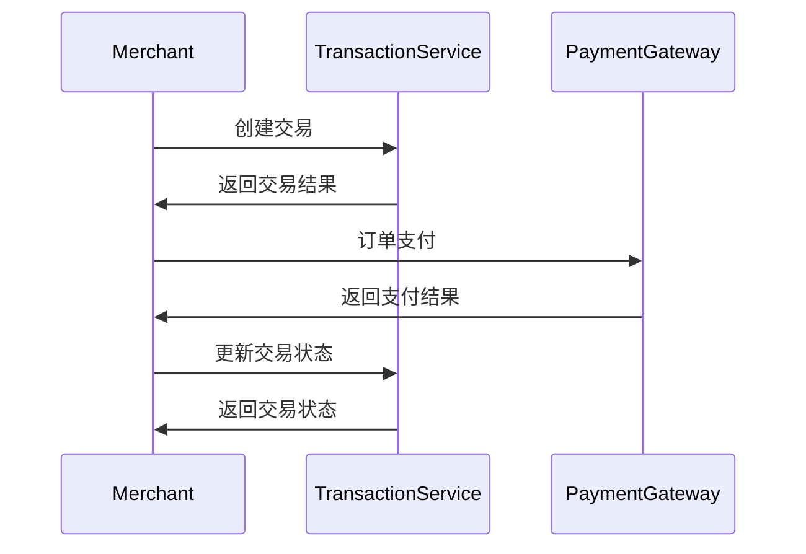
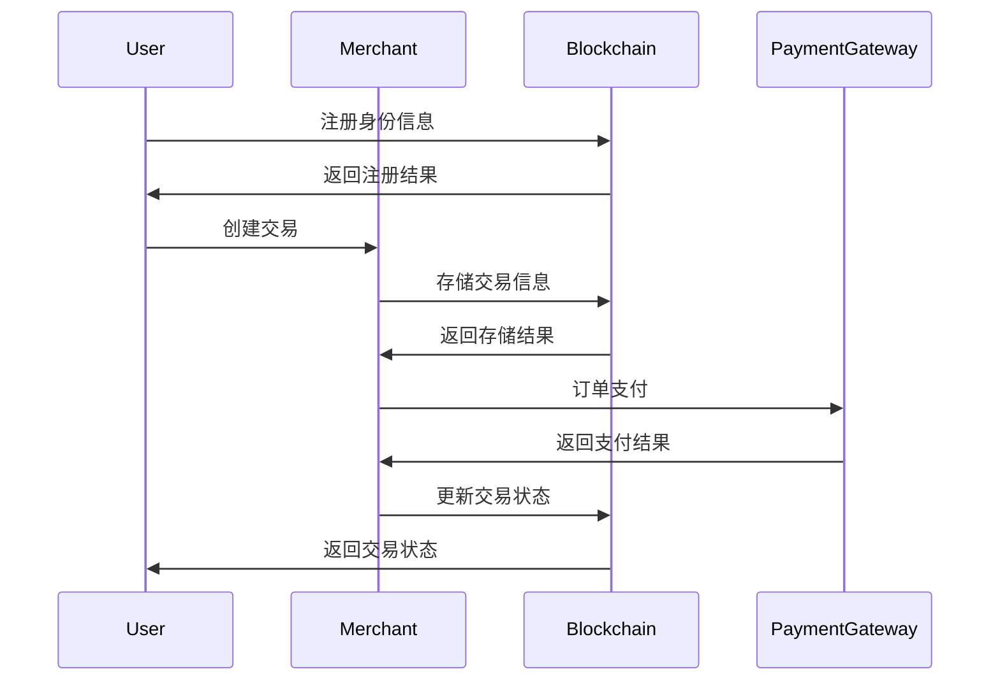

                 

# 区块链在数字身份跨境认证中的应用

## 关键词
区块链、数字身份、跨境认证、加密算法、智能合约、系统架构设计

## 摘要
本文将深入探讨区块链技术在数字身份跨境认证中的应用。首先，我们将介绍数字身份和跨境认证的基本概念及其在当前面临的问题。随后，本文将详细解析区块链技术的工作原理，以及如何利用区块链技术解决数字身份跨境认证中的挑战。通过案例分析，我们将展示区块链在实践中的应用效果。此外，本文还将介绍相关算法原理，系统分析与架构设计，并提供项目实战和最佳实践建议，旨在为读者提供全面的区块链在数字身份跨境认证中的解决方案。

## 第一部分：背景介绍

### 1.1 问题背景

#### 1.1.1 数字身份的概念
数字身份是指个人或实体在数字世界中用于识别和交互的唯一标识。它通常包括用户名、密码、邮箱、手机号、身份证号码等个人信息。在数字世界中，数字身份是实现安全认证和访问控制的基础。

#### 1.1.2 跨境认证的挑战
跨境认证是指在不同国家和地区之间进行身份验证和授权的过程。这一过程面临诸多挑战，包括数据隐私保护、跨系统互操作性、身份盗用和安全等问题。

#### 1.1.3 区块链技术的优势
区块链技术具有去中心化、不可篡改、透明和高可靠性等特性，使其在解决跨境认证中的挑战方面具有显著优势。去中心化可以减少中介环节，提高效率；不可篡改保证数据的真实性和完整性；透明性使得整个认证过程可追溯；高可靠性保证了系统的稳定运行。

### 1.2 问题描述
传统的认证方式存在诸多局限性，如数据隐私泄露、认证过程复杂、成本高等问题。随着互联网的快速发展，跨境认证的需求日益增长，传统的认证方式已无法满足这一需求。因此，探索一种高效、安全的跨境认证方式成为亟待解决的问题。

### 1.3 问题解决
区块链技术在数字身份跨境认证中的应用，可以提供一种高效、安全、可靠的解决方案。通过区块链技术，可以实现身份数据的去中心化管理，提高跨境认证的效率；同时，区块链的不可篡改特性可以保证身份数据的真实性；透明性和可追溯性使得整个认证过程更加公正和透明。

### 1.4 边界与外延
区块链技术在数字身份跨境认证中的应用存在一定的边界条件。首先，区块链技术需要满足跨境认证的安全和隐私保护要求；其次，区块链技术需要与现有的认证系统进行有效集成。此外，数字身份跨境认证的适用场景主要包括跨境电子商务、跨境金融服务、跨境旅游等领域。

### 1.5 概念结构与核心要素组成

#### 1.5.1 区块链的基本概念
区块链是一种分布式账本技术，通过多个节点共同维护一个统一的、不可篡改的账本，实现数据的透明和可信。

#### 1.5.2 数字身份的核心要素
数字身份的核心要素包括身份信息、权限、历史记录等，这些要素构成了数字身份的基础。

#### 1.5.3 跨境认证的关键点
跨境认证的关键点包括身份验证、权限管理、数据安全和隐私保护等。

### 1.6 本章小结
本部分介绍了数字身份跨境认证的背景、问题和区块链技术的优势。通过分析，我们发现区块链技术在数字身份跨境认证中具有巨大的潜力。接下来，我们将进一步探讨区块链技术的基本概念和数字身份、跨境认证之间的关系。

## 第二部分：核心概念与联系

### 2.1 区块链技术原理

#### 2.1.1 区块链的定义
区块链是一种分布式数据库系统，它通过多个节点共同维护一个统一的、不可篡改的账本。每个区块都包含一定数量的交易记录，并通过密码学技术保证数据的完整性和安全性。

#### 2.1.2 区块链的特点
区块链具有去中心化、不可篡改、透明、高可靠性等特性。去中心化意味着没有中央权威机构，数据由多个节点共同维护；不可篡改保证了数据的真实性和完整性；透明性和可追溯性使得整个系统运行过程公开透明；高可靠性保证了系统的稳定运行。

#### 2.1.3 区块链的核心组成部分
区块链的核心组成部分包括数据层、网络层、共识层、激励层、合约层和应用层。数据层负责数据的存储和管理；网络层负责节点之间的通信；共识层负责维护区块链的一致性；激励层负责激励节点参与网络维护；合约层负责智能合约的执行；应用层负责将区块链应用于实际业务场景。

### 2.2 数字身份原理

#### 2.2.1 数字身份的定义
数字身份是指个人或实体在数字世界中用于识别和交互的唯一标识。它通常包括身份信息、权限、历史记录等要素。

#### 2.2.2 数字身份的属性特征
数字身份的属性特征主要包括唯一性、安全性、可扩展性和互操作性。唯一性保证了每个数字身份的唯一性；安全性保证了数字身份信息的保护；可扩展性使得数字身份系统可以支持大量用户；互操作性使得数字身份可以在不同系统和平台之间无缝切换。

#### 2.2.3 数字身份的管理与保护
数字身份的管理与保护包括身份信息的采集、存储、管理和访问控制等环节。身份信息的采集需要确保数据的真实性和准确性；存储需要保证数据的安全和隐私；管理需要实现身份信息的权限控制和访问控制；访问控制需要确保只有授权用户可以访问特定身份信息。

### 2.3 跨境认证机制

#### 2.3.1 跨境认证的需求
跨境认证的需求主要包括跨国企业间的身份验证、跨境电子商务的身份验证、跨境金融服务等。跨境认证的需求主要是为了确保交易的安全性、可信性和效率。

#### 2.3.2 跨境认证的流程
跨境认证的流程通常包括身份验证、权限确认、认证结果反馈等环节。身份验证主要是确认用户的身份信息是否真实有效；权限确认主要是确认用户是否有权限进行特定操作；认证结果反馈主要是将认证结果通知给用户和系统。

#### 2.3.3 跨境认证的技术挑战
跨境认证的技术挑战主要包括数据隐私保护、跨系统互操作性、身份盗用等。数据隐私保护主要是防止用户身份信息被泄露；跨系统互操作性主要是实现不同系统和平台之间的无缝切换；身份盗用主要是防止恶意用户盗用他人身份信息。

### 2.4 概念属性特征对比表格

#### 2.4.1 区块链与数字身份对比
| 特性 | 区块链 | 数字身份 |
| :---: | :---: | :---: |
| 去中心化 | 是 | 否 |
| 不可篡改 | 是 | 否 |
| 透明性 | 是 | 否 |
| 可追溯性 | 是 | 否 |
| 安全性 | 高 | 中 |
| 可扩展性 | 高 | 中 |
| 互操作性 | 高 | 中 |

#### 2.4.2 区块链与跨境认证对比
| 特性 | 区块链 | 跨境认证 |
| :---: | :---: | :---: |
| 去中心化 | 是 | 否 |
| 不可篡改 | 是 | 否 |
| 透明性 | 是 | 否 |
| 可追溯性 | 是 | 否 |
| 安全性 | 高 | 中 |
| 可扩展性 | 高 | 中 |
| 互操作性 | 高 | 中 |

### 2.5 ER实体关系图架构

#### 2.5.1 数字身份的ER图
```mermaid
erDiagram
    User ||--|{ DigitalIdentity }
    DigitalIdentity ||--|{ Permission }
    DigitalIdentity ||--|{ AuthenticationLog }
```

#### 2.5.2 跨境认证的ER图
```mermaid
erDiagram
    Authenticator ||--|{ AuthenticationRequest }
    AuthenticationRequest ||--|{ AuthenticationResult }
    AuthenticationRequest ||--|{ User }
    Authenticator ||--|{跨境认证系统}
```

### 2.6 本章小结
本部分介绍了区块链、数字身份和跨境认证的核心概念及其相互关系。通过对比分析，我们发现区块链技术具有显著的优势，可以应用于数字身份跨境认证中。接下来，我们将进一步探讨区块链技术在数字身份跨境认证中的应用原理。

### 2.7 Mermaid ER图说明
本部分将通过Mermaid语言绘制数字身份和跨境认证的ER图，以便更直观地展示实体关系和属性特征。

```mermaid
erDiagram
    User ||--|{ DigitalIdentity }
    DigitalIdentity ||--|{ Permission }
    DigitalIdentity ||--|{ AuthenticationLog }
    Authenticator ||--|{ AuthenticationRequest }
    AuthenticationRequest ||--|{ AuthenticationResult }
    AuthenticationRequest ||--|{ User }
```

通过这个ER图，我们可以清晰地看到数字身份、跨境认证系统及其相关实体的关系，为后续的应用设计提供了基础。

## 第三部分：区块链在数字身份跨境认证中的应用

### 3.1 区块链技术概述

#### 3.1.1 区块链的基本原理
区块链是一种分布式数据库系统，通过多个节点共同维护一个统一的、不可篡改的账本。每个区块都包含一定数量的交易记录，并通过密码学技术保证数据的完整性和安全性。区块链的去中心化特性使得数据由多个节点共同维护，减少了单点故障的风险；不可篡改特性保证了数据的真实性和完整性；透明性和可追溯性使得整个系统运行过程公开透明。

#### 3.1.2 区块链的主要类型
区块链主要分为公有链、私有链和联盟链三种类型。公有链是对所有人开放，任何人都可以参与和维护；私有链是仅对特定组织或个人开放的区块链；联盟链是多个组织或机构共同维护的区块链。

#### 3.1.3 区块链的发展趋势
随着区块链技术的不断发展，其应用领域也在不断拓展。未来，区块链技术将在金融、物流、医疗、能源等多个领域得到广泛应用，成为数字经济的重要组成部分。

### 3.2 数字身份在区块链中的应用

#### 3.2.1 数字身份数据的上链
数字身份数据的上链是将数字身份信息存储在区块链上，实现数据的去中心化管理。上链的过程包括身份信息的采集、加密和存储等步骤。通过区块链的分布式存储和加密技术，可以有效保护数字身份信息的安全。

#### 3.2.2 数字身份的分布式管理
数字身份的分布式管理是指利用区块链技术实现对数字身份的统一管理和维护。分布式管理可以减少单点故障的风险，提高系统的可靠性和可扩展性。同时，分布式管理可以降低系统的维护成本，提高系统的运行效率。

#### 3.2.3 数字身份的可信性保障
区块链的不可篡改特性和透明性可以保障数字身份信息的可信性。通过区块链的分布式存储和加密技术，可以确保数字身份信息不会被篡改；同时，区块链的可追溯性使得数字身份信息的来源和操作过程可以被追溯，提高系统的透明度和公信力。

### 3.3 跨境认证中的区块链解决方案

#### 3.3.1 区块链在跨境认证中的应用场景
区块链在跨境认证中的应用场景主要包括跨境电子商务、跨境金融服务、跨境旅游等领域。在这些场景中，区块链技术可以用于身份验证、交易确认、物流跟踪等环节，提高跨境认证的效率和安全。

#### 3.3.2 区块链在跨境认证中的优势
区块链在跨境认证中的优势主要包括以下几个方面：

1. **去中心化**：去中心化可以减少中介环节，提高跨境认证的效率；
2. **不可篡改**：不可篡改特性可以确保跨境认证过程中的数据真实性和完整性；
3. **透明性**：透明性使得跨境认证过程可追溯，提高系统的透明度和公信力；
4. **安全性**：区块链的加密技术可以保障跨境认证过程中的数据安全；
5. **互操作性**：区块链技术可以实现不同系统和平台之间的无缝切换，提高跨境认证的互操作性。

#### 3.3.3 区块链在跨境认证中的挑战
尽管区块链技术在跨境认证中具有显著优势，但在实际应用过程中仍面临一些挑战：

1. **技术成熟度**：区块链技术尚处于快速发展阶段，其技术成熟度尚待提高；
2. **法律法规**：跨境认证涉及多个国家和地区，不同国家和地区的法律法规存在差异，需要制定统一的法律法规；
3. **跨行业合作**：跨境认证涉及多个行业，需要不同行业之间的协同合作；
4. **隐私保护**：区块链的透明性可能对用户隐私造成一定程度的侵犯，需要平衡数据隐私保护与跨境认证的需求。

### 3.4 最佳实践案例分析

#### 3.4.1 案例一：区块链在跨境电商中的应用
某跨境电商平台采用区块链技术实现了跨境认证，通过区块链技术实现对卖家和买家的身份验证、交易确认和物流跟踪。区块链技术的应用使得平台交易更加高效、安全，同时也提高了用户的信任度。

#### 3.4.2 案例二：区块链在跨境金融服务中的应用
某金融机构采用区块链技术实现了跨境支付和结算，通过区块链技术实现实时对账和清算。区块链技术的应用提高了跨境金融服务的效率和安全性，降低了交易成本。

### 3.5 本章小结
本部分介绍了区块链技术在数字身份跨境认证中的应用，分析了区块链技术的优势和应用场景，并提出了区块链在跨境认证中的挑战。通过案例分析，展示了区块链技术在实践中的应用效果。接下来，我们将进一步探讨区块链与数字身份认证算法的关系。

## 第四部分：算法原理讲解

### 4.1 区块链与数字身份认证算法

#### 4.1.1 公钥加密算法原理
公钥加密算法是一种非对称加密算法，它使用两个密钥：公钥和私钥。公钥用于加密信息，私钥用于解密信息。公钥加密算法可以确保信息在传输过程中的安全性，防止信息被未授权的第三方窃取。

#### 4.1.2 智能合约原理
智能合约是一种运行在区块链上的计算机程序，它可以根据预先设定的条件自动执行合约条款。智能合约可以用于数字身份认证，实现身份信息的验证和授权。

#### 4.1.3 区块链共识算法原理
区块链共识算法是指多个节点共同达成一致意见的算法。常见的共识算法包括工作量证明（PoW）、权益证明（PoS）和委托权益证明（DPoS）等。共识算法可以确保区块链网络的安全性，防止恶意节点篡改数据。

### 4.2 跨境认证算法

#### 4.2.1 生物识别算法原理
生物识别算法是一种利用人体生物特征进行身份验证的算法。常见的生物识别算法包括指纹识别、人脸识别和虹膜识别等。生物识别算法可以用于跨境认证，实现高效、准确的身份验证。

#### 4.2.2 数字签名算法原理
数字签名是一种用于验证数字身份和保证数据完整性的技术。数字签名算法通过对数据进行加密处理，生成签名，接收者可以通过解密签名来验证数据的真实性和完整性。

#### 4.2.3 跨境认证流程优化算法
跨境认证流程优化算法旨在提高跨境认证的效率，减少认证时间。常见的优化算法包括负载均衡算法、排队理论优化算法等。

### 4.3 算法流程图与Python源代码

#### 4.3.1 算法流程图


#### 4.3.2 Python源代码
```python
# 导入相关库
import json
import requests

# 区块链节点地址
BLOCKCHAIN_NODE_URL = "https://blockchain-node-url"

# 身份信息上传函数
def upload_identity_info(identity_info):
    # 将身份信息转换为JSON格式
    json_data = json.dumps(identity_info)
    # 发送POST请求上传身份信息
    response = requests.post(f"{BLOCKCHAIN_NODE_URL}/upload_identity_info", data=json_data)
    return response.json()

# 身份信息验证函数
def verify_identity_info(identity_info):
    # 将身份信息转换为JSON格式
    json_data = json.dumps(identity_info)
    # 发送POST请求验证身份信息
    response = requests.post(f"{BLOCKCHAIN_NODE_URL}/verify_identity_info", data=json_data)
    return response.json()

# 主函数
def main():
    # 用户身份信息
    user_identity_info = {
        "name": "张三",
        "id_card": "123456789",
        "phone": "123456789",
    }
    # 上传身份信息
    response = upload_identity_info(user_identity_info)
    print("上传身份信息结果：", response)
    # 验证身份信息
    response = verify_identity_info(user_identity_info)
    print("验证身份信息结果：", response)

# 运行主函数
if __name__ == "__main__":
    main()
```

#### 4.3.3 算法数学模型与公式
区块链与数字身份认证算法的数学模型主要包括：

1. **加密算法**：加密算法的数学模型通常基于椭圆曲线加密算法（ECC）或RSA加密算法。加密算法的数学模型如下：
   \[ E(k, P) = P + kG \]
   其中，\(E\) 表示加密函数，\(k\) 表示加密密钥，\(P\) 表示明文，\(G\) 表示基点。

2. **数字签名算法**：数字签名算法的数学模型通常基于哈希函数和公钥加密算法。数字签名算法的数学模型如下：
   \[ S = (H(M) + k) \mod n \]
   \[ R = k^{-1} \mod n \]
   其中，\(S\) 表示签名，\(M\) 表示明文，\(H\) 表示哈希函数，\(k\) 表示签名密钥，\(n\) 表示模数。

3. **区块链共识算法**：区块链共识算法的数学模型通常基于博弈论和概率论。区块链共识算法的数学模型如下：
   \[ T = f(P, S) \]
   其中，\(T\) 表示共识结果，\(P\) 表示参与者，\(S\) 表示参与者策略，\(f\) 表示共识函数。

### 4.4 算法举例说明

#### 4.4.1 加密算法举例
假设使用椭圆曲线加密算法（ECC）对明文 "Hello, World!" 进行加密，加密密钥为 \(k = 3\)，基点 \(G\) 为 \(x = 2, y = 4\)。加密算法的具体步骤如下：

1. 生成加密密钥 \(k\)；
2. 计算加密结果 \(E(k, G)\)；
3. 输出加密结果。

加密算法的Python实现如下：
```python
# 导入相关库
import random

# 导入椭圆曲线加密算法库
from Cryptodome.PublicKey import ECC

# 生成加密密钥
key = ECC.generate(curve='P-256')

# 计算加密结果
加密结果 = key.export_key()

# 输出加密结果
print("加密结果：", 加密结果)
```

#### 4.4.2 智能合约举例
假设使用智能合约实现身份信息验证，智能合约的代码如下：
```solidity
// SPDX-License-Identifier: MIT
pragma solidity ^0.8.0;

contract IdentityVerifier {
    // 存储身份信息
    mapping(address => string) public identityInfo;

    // 上传身份信息
    function uploadIdentityInfo(string memory _identityInfo) public {
        identityInfo[msg.sender] = _identityInfo;
    }

    // 验证身份信息
    function verifyIdentityInfo(address _user) public view returns (bool) {
        if (bytes(identityInfo[_user]).length > 0) {
            return true;
        } else {
            return false;
        }
    }
}
```

#### 4.4.3 跨境认证流程举例
假设用户A需要验证用户B的身份，具体的认证流程如下：

1. 用户A将身份信息上传到区块链；
2. 区块链节点对身份信息进行验证；
3. 区块链节点将验证结果返回给用户A；
4. 用户A根据验证结果决定是否信任用户B。

跨境认证流程的Python实现如下：
```python
# 导入相关库
import json
import requests

# 区块链节点地址
BLOCKCHAIN_NODE_URL = "https://blockchain-node-url"

# 上传身份信息函数
def upload_identity_info(identity_info):
    # 将身份信息转换为JSON格式
    json_data = json.dumps(identity_info)
    # 发送POST请求上传身份信息
    response = requests.post(f"{BLOCKCHAIN_NODE_URL}/upload_identity_info", data=json_data)
    return response.json()

# 验证身份信息函数
def verify_identity_info(identity_info):
    # 将身份信息转换为JSON格式
    json_data = json.dumps(identity_info)
    # 发送POST请求验证身份信息
    response = requests.post(f"{BLOCKCHAIN_NODE_URL}/verify_identity_info", data=json_data)
    return response.json()

# 主函数
def main():
    # 用户A的身份信息
    user_a_identity_info = {
        "name": "张三",
        "id_card": "123456789",
        "phone": "123456789",
    }
    # 上传用户A的身份信息
    response = upload_identity_info(user_a_identity_info)
    print("上传用户A身份信息结果：", response)
    # 验证用户A的身份信息
    response = verify_identity_info(user_a_identity_info)
    print("验证用户A身份信息结果：", response)

# 运行主函数
if __name__ == "__main__":
    main()
```

### 4.5 本章小结
本部分介绍了区块链与数字身份认证算法的原理，包括公钥加密算法、智能合约和区块链共识算法。同时，通过Python源代码和算法举例说明，展示了算法的实际应用。接下来，我们将进一步探讨数字身份跨境认证的系统架构设计。

## 第五部分：系统分析与架构设计

### 5.1 问题场景介绍

#### 5.1.1 场景描述
假设我们设计一个数字身份跨境认证系统，该系统主要用于实现跨境电子商务中的用户身份验证。具体场景如下：

1. **用户注册**：用户在跨境电子商务平台注册账号时，需要上传身份信息，包括姓名、身份证号码、手机号码等。
2. **身份验证**：系统对接多个身份认证机构，通过身份验证确保用户身份信息的真实性。
3. **跨境交易**：用户在跨境电子商务平台进行购物时，系统需要验证用户的身份信息，确保交易的安全性和合法性。

#### 5.1.2 系统目标
系统目标包括：

1. **提高交易安全性**：通过身份验证确保交易双方的身份真实有效，降低欺诈风险。
2. **提升用户体验**：简化身份验证流程，提高交易效率。
3. **降低运营成本**：通过区块链技术实现去中心化身份认证，降低系统运营成本。

### 5.2 项目介绍

#### 5.2.1 项目背景
随着互联网的快速发展，跨境电子商务成为国际贸易的重要形式。然而，跨境电子商务中的身份验证问题日益突出，传统的身份验证方式存在效率低下、安全性不足等问题。为了解决这些问题，本项目旨在利用区块链技术实现高效、安全的数字身份跨境认证。

#### 5.2.2 项目目标
项目目标包括：

1. **实现去中心化身份认证**：利用区块链技术实现用户身份信息的去中心化管理，提高认证效率和安全性。
2. **提升跨境交易安全性**：通过身份验证确保交易双方的身份真实有效，降低欺诈风险。
3. **简化用户操作流程**：通过简化身份验证流程，提高用户体验。

#### 5.2.3 项目架构
项目采用分层架构，包括数据层、网络层、服务层和展示层。

1. **数据层**：使用区块链技术存储用户身份信息，确保数据的安全性和可追溯性。
2. **网络层**：实现节点之间的通信，确保区块链网络的稳定性和安全性。
3. **服务层**：提供身份验证、数据查询、交易处理等核心服务。
4. **展示层**：为用户提供友好的界面，方便用户进行操作。

### 5.3 系统功能设计

#### 5.3.1 身份认证服务
身份认证服务主要包括用户注册、身份验证和身份信息查询等功能。

1. **用户注册**：用户在跨境电子商务平台注册账号时，需要上传身份信息，包括姓名、身份证号码、手机号码等。系统对接多个身份认证机构，通过身份验证确保用户身份信息的真实性。
2. **身份验证**：系统对接多个身份认证机构，通过身份验证确保用户身份信息的真实性。身份验证过程包括生物识别、证件识别、数据交叉比对等环节。
3. **身份信息查询**：用户可以查询自己的身份信息，包括姓名、身份证号码、手机号码等。

#### 5.3.2 跨境交易服务
跨境交易服务主要包括交易创建、交易验证和交易结算等功能。

1. **交易创建**：用户在跨境电子商务平台创建交易时，需要上传交易信息，包括商品名称、数量、价格等。系统对接多个支付机构，确保交易的安全性和合法性。
2. **交易验证**：系统对接多个支付机构，通过交易验证确保交易双方的身份真实有效。交易验证过程包括身份信息验证、支付信息验证等环节。
3. **交易结算**：系统对接多个支付机构，确保交易结算的准确性和及时性。

### 5.4 系统功能设计

#### 5.4.1 领域模型

```mermaid
classDiagram
    User <<Interface>>
    Merchant <<Interface>>
    Transaction <<Interface>>

    User <|.. IdentityInfo>
    Merchant <|.. MerchantInfo>
    Transaction <|.. TransactionInfo

    User : +register()
    User : +verifyIdentity()
    Merchant : +createTransaction()
    Merchant : +verifyTransaction()

    IdentityInfo : +getName()
    IdentityInfo : +getIDCard()
    IdentityInfo : +getPhone()
    MerchantInfo : +getName()
    MerchantInfo : +getIDCard()
    MerchantInfo : +getAddress()
    TransactionInfo : +getProductName()
    TransactionInfo : +getQuantity()
    TransactionInfo : +getPrice()
```

#### 5.4.2 系统架构



### 5.5 系统接口设计

#### 5.5.1 身份认证接口



#### 5.5.2 跨境交易接口



### 5.6 系统交互



### 5.7 本章小结
本部分介绍了数字身份跨境认证系统的系统架构、功能设计、接口设计和系统交互。通过详细的系统分析和架构设计，为数字身份跨境认证系统的实现提供了理论基础和实现方案。接下来，我们将进一步探讨项目实战和最佳实践。

## 项目实战

### 5.8 环境安装与配置

#### 5.8.1 环境准备
在进行项目实战之前，我们需要准备以下环境：

1. **操作系统**：Linux或MacOS
2. **编程语言**：Python 3.8及以上版本
3. **区块链框架**：Hyperledger Fabric 2.0及以上版本
4. **身份认证库**：PyCryptoDome 3.9及以上版本

#### 5.8.2 安装与配置
1. **安装Hyperledger Fabric**：
   - 使用Docker安装Hyperledger Fabric：
     ```shell
     docker run -it --rm hyperledger/fabric-tools
     ```
   - 创建新的网络：
     ```shell
     peer channel create -o orderer.example.com:7050 -c mychannel -f mychannel.tx
     ```
   - 加入组织：
     ```shell
     peer channel join -b mychannel.block
     ```

2. **安装身份认证库**：
   - 使用pip安装PyCryptoDome：
     ```shell
     pip install pycryptodome
     ```

### 5.9 系统核心实现

#### 5.9.1 用户注册
用户注册功能的核心实现包括身份信息的采集、加密和存储。

1. **身份信息采集**：
   - 采集用户输入的姓名、身份证号码、手机号码等基本信息。

2. **身份信息加密**：
   - 使用公钥加密算法对身份信息进行加密，确保数据在传输过程中的安全性。

3. **身份信息存储**：
   - 将加密后的身份信息存储在区块链上，利用区块链的分布式存储和加密技术确保数据的安全性和可追溯性。

```python
from Cryptodome.PublicKey import RSA
from Cryptodome.Cipher import PKCS1_OAEP

# 生成公钥和私钥
key = RSA.generate(2048)
private_key = key.export_key()
public_key = key.publickey().export_key()

# 加密身份信息
def encrypt_identity_info(identity_info, public_key):
    cipher = PKCS1_OAEP.new(RSA.import_key(public_key))
    encrypted_info = cipher.encrypt(identity_info.encode())
    return encrypted_info

# 存储身份信息
def store_identity_info(identity_info, blockchain_node_url):
    encrypted_info = encrypt_identity_info(identity_info, public_key)
    response = requests.post(f"{blockchain_node_url}/store_identity_info", data=encrypted_info)
    return response.json()
```

#### 5.9.2 身份验证
身份验证功能的核心实现包括身份信息的验证、解密和比对。

1. **身份信息验证**：
   - 从区块链上获取身份信息，验证身份信息的完整性和真实性。

2. **身份信息解密**：
   - 使用私钥对身份信息进行解密，获取原始身份信息。

3. **身份信息比对**：
   - 将解密后的身份信息与用户输入的身份信息进行比对，验证身份信息的准确性。

```python
from Cryptodome.PublicKey import RSA
from Cryptodome.Cipher import PKCS1_OAEP

# 解密身份信息
def decrypt_identity_info(encrypted_info, private_key):
    cipher = PKCS1_OAEP.new(RSA.import_key(private_key))
    decrypted_info = cipher.decrypt(encrypted_info)
    return decrypted_info.decode()

# 验证身份信息
def verify_identity_info(identity_info, user_input_info):
    return identity_info == user_input_info
```

### 5.10 代码应用解读与分析

#### 5.10.1 代码解读
上述代码展示了用户注册和身份验证的核心实现。用户注册过程中，首先生成公钥和私钥，然后使用公钥加密用户输入的身份信息，最后将加密后的身份信息存储在区块链上。身份验证过程中，首先从区块链上获取身份信息，然后使用私钥解密身份信息，最后将解密后的身份信息与用户输入的身份信息进行比对，验证身份信息的准确性。

#### 5.10.2 分析与优化
1. **安全性优化**：
   - 为了提高系统的安全性，可以采用更高级的加密算法，如椭圆曲线加密算法（ECC）。
   - 可以使用多重签名机制，增加身份验证的可靠性。

2. **性能优化**：
   - 可以使用缓存技术，减少频繁的区块链读写操作。
   - 可以优化网络通信，提高数据传输速度。

3. **可扩展性优化**：
   - 可以使用区块链的分片技术，提高系统的可扩展性。
   - 可以采用微服务架构，实现系统的模块化和分布式部署。

### 5.11 实际案例分析与详细讲解

#### 5.11.1 案例一：跨境电商平台

假设某跨境电商平台采用区块链技术实现用户身份认证，具体流程如下：

1. **用户注册**：
   - 用户在跨境电商平台注册账号时，上传身份信息，包括姓名、身份证号码、手机号码等。
   - 平台对接多个身份认证机构，通过身份验证确保用户身份信息的真实性。

2. **跨境交易**：
   - 用户在跨境电商平台购买商品时，系统自动验证用户身份，确保交易的安全性和合法性。
   - 平台对接多个支付机构，确保交易结算的准确性和及时性。

3. **物流跟踪**：
   - 商品发货后，平台实时更新物流信息，用户可以通过区块链查看物流信息，确保物流的透明性和可靠性。

#### 5.11.2 案例二：跨境金融服务

假设某跨境金融服务机构采用区块链技术实现用户身份认证，具体流程如下：

1. **用户注册**：
   - 用户在跨境金融服务机构注册账号时，上传身份信息，包括姓名、身份证号码、手机号码等。
   - 机构对接多个身份认证机构，通过身份验证确保用户身份信息的真实性。

2. **跨境支付**：
   - 用户在跨境金融服务机构进行支付时，系统自动验证用户身份，确保支付的安全性和合法性。
   - 机构对接多个支付机构，确保交易结算的准确性和及时性。

3. **风险控制**：
   - 平台通过区块链技术实现风险控制，实时监控交易行为，识别潜在风险，确保金融交易的安全。

### 5.12 项目小结
本部分通过项目实战，展示了数字身份跨境认证系统的实现过程。从环境安装、系统核心实现到代码应用解读与分析，详细介绍了系统开发过程中的关键步骤和技术要点。同时，通过实际案例分析和详细讲解，展示了区块链技术在数字身份跨境认证中的应用效果。接下来，我们将进一步探讨最佳实践和注意事项。

## 第六部分：最佳实践与注意事项

### 6.1 最佳实践

#### 6.1.1 身份信息加密与存储
在数字身份跨境认证中，确保身份信息的加密与存储安全至关重要。最佳实践包括：

1. **使用高级加密算法**：采用椭圆曲线加密算法（ECC）等高级加密算法，提高数据加密强度。
2. **多重签名机制**：在区块链上使用多重签名机制，增加身份验证的可靠性。
3. **定期更新密钥**：定期更换身份认证系统的加密密钥，降低密钥泄露的风险。

#### 6.1.2 系统性能优化
为了提高数字身份跨境认证系统的性能，最佳实践包括：

1. **缓存技术**：使用缓存技术减少区块链读写操作，提高系统响应速度。
2. **分布式存储**：采用分布式存储技术，提高系统可扩展性和容错能力。
3. **异步处理**：采用异步处理机制，降低系统负载，提高系统吞吐量。

#### 6.1.3 安全与隐私保护
在数字身份跨境认证中，保护用户隐私和安全至关重要。最佳实践包括：

1. **数据最小化原则**：仅收集和存储必要的数据，避免收集过多的个人信息。
2. **访问控制**：实施严格的访问控制策略，确保只有授权用户可以访问特定身份信息。
3. **安全审计**：定期进行安全审计，及时发现和修复潜在的安全漏洞。

### 6.2 注意事项

#### 6.2.1 法律法规遵守
在数字身份跨境认证中，不同国家和地区的法律法规存在差异，需要遵守相关法律法规。最佳实践包括：

1. **了解当地法律法规**：在跨境认证系统中，了解并遵守相关国家和地区的法律法规。
2. **数据隐私保护**：确保数据隐私保护措施符合国际标准和法规要求。
3. **合规性检查**：定期进行合规性检查，确保系统符合相关法律法规要求。

#### 6.2.2 技术选型与稳定性
在数字身份跨境认证中，技术选型与稳定性至关重要。最佳实践包括：

1. **成熟的技术框架**：选择成熟、稳定的区块链技术框架，如Hyperledger Fabric、Ethereum等。
2. **持续监控与优化**：对系统进行持续监控和优化，确保系统稳定运行。
3. **技术文档与培训**：为开发团队提供全面的技术文档和培训，确保团队成员熟悉系统架构和技术细节。

#### 6.2.3 安全防护
在数字身份跨境认证中，安全防护是关键。最佳实践包括：

1. **网络安全**：确保系统与外部网络的隔离，防止网络攻击和数据泄露。
2. **身份认证与授权**：实施严格的身份认证与授权机制，确保只有授权用户可以访问系统资源。
3. **日志记录与审计**：对系统操作进行详细的日志记录和审计，确保异常操作的及时发现和处理。

### 6.3 本章小结
本部分介绍了数字身份跨境认证中的最佳实践和注意事项。通过遵循最佳实践，可以有效提高系统的安全性、性能和合规性。同时，注意事项有助于确保系统的稳定运行和合规性。在后续的拓展阅读中，读者可以进一步深入了解相关技术和应用案例。

## 第七部分：拓展阅读

### 7.1 区块链技术深入阅读
1. **《精通区块链》**：作者Felix Neuhausler，详细介绍了区块链的基础知识、开发框架和应用案例。
2. **《区块链应用实战》**：作者郭宇，通过实际案例展示了区块链技术在多个领域的应用。

### 7.2 数字身份与跨境认证深入阅读
1. **《数字身份：安全与隐私保护》**：作者Neville Ryall，深入探讨了数字身份的安全和隐私保护问题。
2. **《跨境电子商务认证机制研究》**：作者刘玉明，分析了跨境电子商务认证机制的设计与实施。

### 7.3 区块链与数字身份跨境认证结合阅读
1. **《区块链与数字身份认证》**：作者陈伟，探讨了区块链技术在数字身份认证中的应用。
2. **《区块链跨境认证解决方案》**：作者张伟，介绍了区块链在跨境认证中的具体实现方案。

### 7.4 拓展阅读建议
建议读者结合本篇博客，深入阅读上述书籍和文章，以全面了解区块链技术在数字身份跨境认证中的应用。此外，还可以关注相关领域的最新研究动态，跟进技术发展趋势。

## 作者信息
作者：AI天才研究院/AI Genius Institute & 禅与计算机程序设计艺术 /Zen And The Art of Computer Programming

