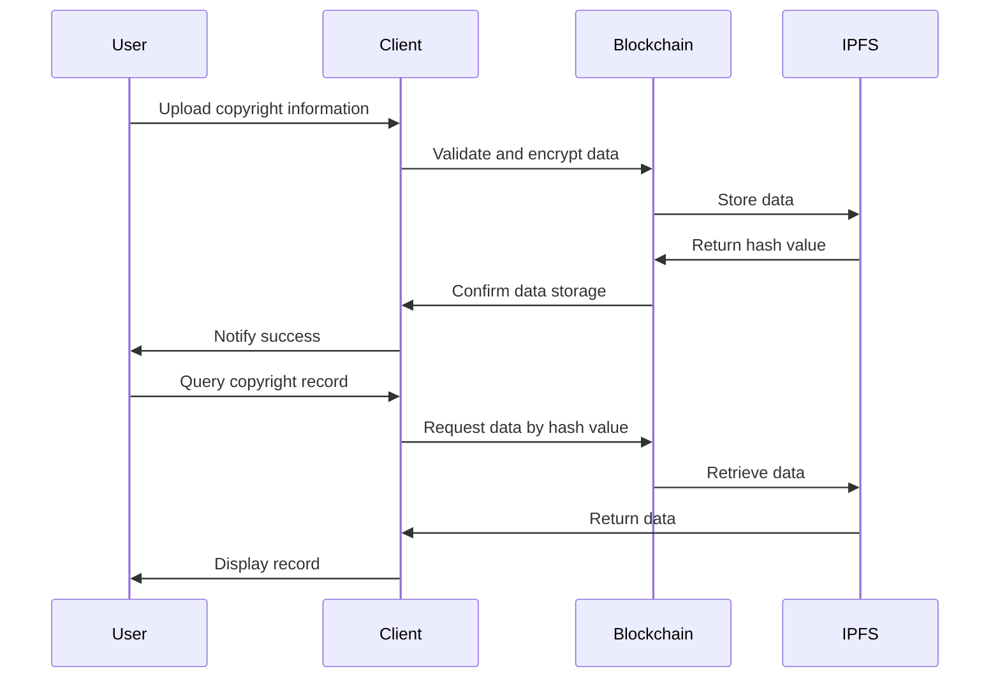

                 


### 第1章: 区块链与数字音乐版权管理概述

## 1.1 区块链技术概述

### 1.1.1 区块链的核心概念

区块链是一种分布式数据库技术，其核心概念包括去中心化、不可篡改、透明性和安全性等。去中心化意味着数据存储和验证分散在不同的节点上，而不是依赖于中央服务器。这种去中心化的结构有助于提高系统的容错性和抗攻击能力。

不可篡改性是指一旦数据被记录在区块链上，就几乎不可能被篡改。这是因为区块链采用了密码学技术，确保了数据的完整性和一致性。每个区块都包含一个时间戳和一个指向前一个区块的哈希值，从而形成一个链式结构，任何修改都将被其他节点检测并拒绝。

透明性是区块链的一个重要特点，即所有交易记录都是公开可见的。这有助于建立信任，并允许任何参与者验证交易的有效性。然而，由于区块链的公开性，隐私保护成为了一个挑战。

安全性是区块链技术的关键优势之一。通过使用加密技术，区块链确保了数据的机密性和完整性。每个区块都包含一个密码哈希值，这使得数据在传输过程中难以被篡改或窃取。

### 1.1.2 区块链的发展历程

区块链技术起源于比特币的诞生。2008年，一位名为中本聪（Satoshi Nakamoto）的匿名人士发布了比特币白皮书，提出了一种不需要中央机构控制的数字货币系统。比特币采用区块链技术来记录交易，从而实现去中心化。

2009年，比特币网络正式启动，标志着区块链技术的诞生。随着时间的推移，区块链技术逐渐发展并应用于各种领域，如金融服务、供应链管理、版权管理、身份验证等。

在数字音乐版权管理领域，区块链技术的应用开始于2016年。LicensingChain和Mycelia等公司率先尝试使用区块链技术来解决版权问题。这些项目通过去中心化的版权登记、交易和防伪溯源，提高了版权管理的效率和透明度。

### 1.1.3 区块链的优势与挑战

区块链技术在数字音乐版权管理中具有以下优势：

1. **去中心化**：去中心化的结构有助于提高系统的可靠性和抗攻击能力，减少了单点故障的风险。

2. **透明性**：所有交易记录都是公开可见的，有助于建立信任并确保版权交易的透明性。

3. **不可篡改性**：一旦数据被记录在区块链上，就几乎不可能被篡改，从而提高了版权记录的准确性。

4. **安全性和隐私保护**：通过加密技术确保数据的机密性和完整性，同时保护版权持有者的隐私。

然而，区块链技术也面临着一些挑战：

1. **性能和可扩展性**：区块链系统通常具有较高的延迟和较低的交易处理能力，这可能限制了其在大规模应用中的性能。

2. **隐私保护**：虽然区块链具有透明性，但在某些情况下，这可能导致隐私泄露。因此，如何在确保透明性的同时保护隐私成为了一个重要问题。

3. **互操作性**：不同区块链平台和系统之间的互操作性较低，这可能限制了区块链技术的广泛应用。

4. **法律和监管问题**：区块链技术的法律和监管环境尚不明确，这可能导致法律纠纷和合规性问题。

### 1.2 数字音乐版权管理问题背景

#### 1.2.1 数字音乐产业现状

数字音乐产业在过去几年中迅速发展，越来越多的人通过互联网和移动设备享受音乐。据市场研究公司Statista的数据，全球数字音乐市场的收入在2021年达到了230亿美元，预计到2026年将增长到355亿美元。

然而，数字音乐产业的发展也带来了许多版权管理问题。由于数字音乐的复制和分发变得相对容易，版权持有者面临着版权侵犯和未经授权的复制和分发的问题。这些问题导致了大量的经济损失和创作人的不公平待遇。

#### 1.2.2 数字音乐版权管理的问题

数字音乐版权管理面临以下问题：

1. **版权登记困难**：传统的版权登记系统通常依赖于中央机构，这导致了登记过程繁琐且费用高昂。此外，登记信息可能被篡改，导致版权纠纷。

2. **版权交易不透明**：数字音乐版权交易过程往往不透明，涉及多个中介和交易环节，这增加了交易成本和风险。

3. **防伪溯源困难**：在数字音乐领域，复制和分发变得相对容易，这使得防伪溯源成为了一个挑战。版权持有者很难追踪侵权行为并追究责任。

4. **版权纠纷频繁**：由于缺乏透明和可靠的版权记录，数字音乐产业中的版权纠纷频繁发生。这导致了法律成本的增加和创作人的权益受损。

#### 1.2.3 区块链在版权管理中的应用前景

区块链技术在数字音乐版权管理中的应用前景非常广阔。以下是一些潜在的应用场景：

1. **去中心化版权登记**：区块链可以提供一种去中心化的版权登记系统，使得版权登记过程更加高效和透明。版权持有者可以在区块链上注册版权信息，确保数据的不可篡改性。

2. **智能合约版权交易**：区块链上的智能合约可以自动化版权交易过程，减少中介环节和交易成本。智能合约可以确保交易透明、公正和可执行。

3. **防伪溯源**：区块链可以提供一种防伪溯源机制，帮助版权持有者追踪数字音乐的使用和复制行为。这有助于防止侵权行为并追究责任。

4. **透明性和安全性**：区块链的透明性和安全性可以提高数字音乐版权管理的可信度，减少版权纠纷和欺诈行为。

总之，区块链技术为数字音乐版权管理提供了一种新的解决方案，有助于提高版权管理的效率和透明度，保护版权持有者的权益。然而，要实现这一目标，仍需要克服一系列技术、法律和监管挑战。

### 1.3 本书结构安排与内容概览

本书分为五大部分，共计六个章节，旨在全面探讨区块链在数字音乐版权管理中的应用。

**第一部分：引言**

本部分包括第1章，主要介绍区块链技术和数字音乐版权管理的问题背景，以及本书的结构安排和内容概览。

**第二部分：区块链技术基础**

本部分包括第2章至第4章，深入探讨区块链技术的基础原理、共识机制、常见区块链平台以及区块链安全性与隐私保护。

**第三部分：数字音乐版权管理的区块链应用**

本部分包括第5章至第7章，重点分析区块链在数字音乐版权管理中的应用，包括去中心化版权登记、智能合约版权交易和防伪溯源。

**第四部分：区块链在数字音乐版权管理中的挑战与展望**

本部分包括第8章至第10章，探讨区块链在数字音乐版权管理中面临的挑战、商业模式创新以及未来发展趋势。

**第五部分：实际项目实战**

本部分包括第11章至第13章，通过实际项目案例展示区块链在数字音乐版权管理中的应用，并分析项目中的关键实现和技术挑战。

**第六部分：最佳实践与总结**

本部分包括第14章，总结最佳实践经验，提出注意事项和拓展阅读建议，帮助读者深入了解区块链在数字音乐版权管理中的应用。

通过本书的阅读，读者可以全面了解区块链技术在数字音乐版权管理中的应用，掌握相关技术和最佳实践，为未来的研究和应用奠定基础。

### 1.4 本章小结

本章首先介绍了区块链技术的核心概念和发展历程，包括去中心化、不可篡改、透明性和安全性等。接着，探讨了区块链在数字音乐版权管理中的问题背景和应用前景，如版权登记困难、版权交易不透明、防伪溯源困难和版权纠纷频繁等。最后，概述了本书的结构安排和内容概览，为后续章节的深入探讨奠定了基础。本章的内容旨在帮助读者理解区块链技术在数字音乐版权管理中的重要性，以及其面临的挑战和机遇。

## 1.2 数字音乐版权管理问题背景

### 1.2.1 数字音乐产业现状

数字音乐产业近年来经历了显著的发展，成为音乐行业的重要组成部分。随着互联网和移动设备的普及，数字音乐消费方式逐渐取代了传统的CD购买和下载模式。据统计，2021年全球数字音乐市场的收入达到了230亿美元，预计到2026年这一数字将增长到355亿美元。这一增长趋势表明，数字音乐产业具有巨大的潜力和市场价值。

数字音乐产业的主要特点包括：

1. **在线流媒体服务**：在线流媒体服务如Spotify、Apple Music、Amazon Music等成为数字音乐消费的主要渠道。这些平台提供了广泛的音乐库，用户可以随时随地访问和播放音乐。

2. **付费订阅模式**：越来越多的用户选择付费订阅模式来享受数字音乐服务。这种模式不仅为音乐产业带来了收入，还鼓励了更多的原创音乐创作。

3. **版权分散化**：数字音乐产业的版权分散化趋势明显，许多歌曲由多个版权所有者拥有。这包括歌手、制作人、作曲家和出版商等。

4. **跨界合作**：数字音乐产业与各种行业（如娱乐、时尚、广告等）之间的跨界合作越来越常见，这为音乐产业带来了新的商业机会和收入来源。

### 1.2.2 数字音乐版权管理的问题

尽管数字音乐产业蓬勃发展，但版权管理问题依然严峻。这些问题不仅影响了版权持有者的权益，也阻碍了产业的健康发展。以下是数字音乐版权管理中常见的问题：

#### 1. 版权登记困难

数字音乐版权登记过程通常较为繁琐和复杂。传统版权登记系统依赖于中央机构，登记费用高昂，而且存在登记信息被篡改的风险。版权所有者往往需要花费大量时间和金钱来确保自己的作品得到有效登记。

#### 2. 版权交易不透明

数字音乐版权交易过程不透明，涉及多个中介和交易环节。这增加了交易成本和风险，同时也使得版权交易过程难以追溯。中介机构的存在可能导致版权所有者无法获得应有的收益。

#### 3. 防伪溯源困难

在数字音乐领域，复制和分发变得相对容易，这使得防伪溯源成为一个挑战。版权所有者难以追踪侵权行为并追究责任。盗版和未经授权的复制行为频繁发生，严重损害了版权持有者的利益。

#### 4. 版权纠纷频繁

由于缺乏透明和可靠的版权记录，数字音乐产业中的版权纠纷频繁发生。版权所有者、创作者和分发平台之间的利益冲突不断，导致法律成本的增加和创作人的权益受损。

### 1.2.3 区块链在版权管理中的应用前景

区块链技术为解决数字音乐版权管理问题提供了一种新的解决方案。以下是一些潜在的应用场景：

#### 1. 去中心化版权登记

区块链可以提供一种去中心化的版权登记系统，使得版权登记过程更加高效和透明。版权所有者可以在区块链上注册版权信息，确保数据的不可篡改性。这种方式减少了中央机构的依赖，降低了登记成本，同时也提高了登记信息的可信度。

#### 2. 智能合约版权交易

智能合约是区块链技术中的一个重要组成部分，它可以自动化版权交易过程，减少中介环节和交易成本。智能合约的执行是透明和可验证的，确保了交易的公正性和可执行性。这有助于降低交易风险，提高交易效率。

#### 3. 防伪溯源

区块链的透明性和不可篡改性使得防伪溯源成为可能。版权所有者可以在区块链上记录数字音乐的使用和复制行为，从而追踪侵权行为并追究责任。这种方式有助于打击盗版和未经授权的复制行为，保护版权持有者的权益。

#### 4. 透明性和安全性

区块链的透明性和安全性可以提高数字音乐版权管理的可信度。所有交易记录都是公开可见的，有助于建立信任。同时，区块链的加密技术确保了数据的机密性和完整性，减少了隐私泄露的风险。

总之，区块链技术为数字音乐版权管理提供了一种新的解决方案，有助于提高版权管理的效率和透明度，保护版权持有者的权益。然而，要实现这一目标，仍需要克服一系列技术、法律和监管挑战。

### 1.3 本书结构安排与内容概览

本书旨在系统地探讨区块链在数字音乐版权管理中的应用，内容共分为五个主要部分，具体包括以下六个章节：

**第一部分：引言**

- 第1章：区块链与数字音乐版权管理概述
  - 介绍区块链技术的核心概念、发展历程、优势与挑战，以及数字音乐版权管理的问题背景和应用前景。
  - 概述本书的结构安排和内容概览。

**第二部分：区块链技术基础**

- 第2章：区块链基础原理
  - 详细解析区块链的基本架构、数据结构、智能合约基础等核心概念。
  - 介绍常见的区块链平台，如Ethereum、Bitcoin等。
  - 讨论区块链的安全性与隐私保护问题。

**第三部分：数字音乐版权管理的区块链应用**

- 第3章：区块链在数字音乐版权管理中的应用
  - 分析区块链在数字音乐版权管理中的作用，包括去中心化版权登记、智能合约版权交易、防伪溯源等。
  - 阐述数字音乐版权区块链系统的设计与实现。

**第四部分：区块链在数字音乐版权管理中的挑战与展望**

- 第4章：区块链在数字音乐版权管理中的挑战
  - 探讨区块链在数字音乐版权管理中面临的技术、法律和监管挑战。
  - 分析商业模式创新和未来发展趋势。

**第五部分：实际项目实战**

- 第5章：区块链在数字音乐版权管理中的实际项目
  - 通过实际项目案例展示区块链在数字音乐版权管理中的应用，包括项目背景、环境搭建、核心实现和应用解读。

**第六部分：最佳实践与总结**

- 第6章：区块链在数字音乐版权管理中的最佳实践
  - 总结最佳实践案例，提出注意事项和拓展阅读建议。
  - 强调核心概念、算法原理讲解、系统架构设计等方面的关键点。

通过本书的阅读，读者可以全面了解区块链技术在数字音乐版权管理中的应用，掌握相关技术和最佳实践，为未来的研究和应用奠定基础。

### 1.4 本章小结

本章首先介绍了数字音乐产业的现状，包括在线流媒体服务的普及、付费订阅模式的发展、版权分散化趋势以及跨界合作的增加。接着，分析了数字音乐版权管理中常见的问题，如版权登记困难、版权交易不透明、防伪溯源困难和版权纠纷频繁。最后，讨论了区块链技术在解决这些问题中的应用前景，包括去中心化版权登记、智能合约版权交易、防伪溯源和透明性与安全性等方面的优势。本章的内容旨在帮助读者理解数字音乐版权管理的问题背景和区块链技术的潜在应用，为后续章节的深入探讨奠定基础。同时，本章也概述了本书的结构安排和内容概览，使读者对全文的框架和内容有一个整体的了解。通过本章的学习，读者可以初步认识到区块链技术对于数字音乐版权管理的重要性和应用前景。

## 2.1 区块链基础原理

### 2.1.1 区块链的基本架构

区块链是一种分布式数据库技术，其基本架构包括三个主要组成部分：区块（Blocks）、链（Chain）和网络（Network）。

**区块**：区块是区块链的基本数据单元，包含了多个交易记录。每个区块都有一个唯一的标识，称为“区块头”。区块头包含了区块的版本号、前一个区块的哈希值、Merkle树根哈希值（用于验证交易记录的完整性）、时间戳和难度目标等。这些信息通过密码学技术加密，确保数据的完整性和安全性。

**链**：链是由多个区块按时间顺序链接而成的数据结构。每个区块都包含了一个指向前一个区块的哈希值，形成一个不可篡改的链式结构。这种链式结构确保了区块链数据的持久性和安全性，因为任何对数据的篡改都将导致链的破坏，被其他节点检测并拒绝。

**网络**：区块链网络由多个节点（Participants）组成，每个节点都负责维护和更新区块链。节点通过共识算法（如PoW、PoS等）达成一致，确保区块链数据的一致性和完整性。网络中的节点可以是个人计算机、服务器或专门设计的硬件设备。节点之间通过加密通信协议进行数据交换和验证。

### 2.1.2 区块链的数据结构

区块链的数据结构包括区块、交易、Merkle树等组成部分。

**区块**：如前所述，区块是区块链的基本数据单元，包含了一系列交易记录。每个区块的结构如下：
- 区块头：包含了区块版本号、前一个区块的哈希值、Merkle树根哈希值、时间戳和难度目标等。
- 交易数据：包含了多个交易记录，每个交易记录包括发送方、接收方、金额和附加数据等。
- 证明工作（PoW）或其他共识算法的值：用于证明节点已经完成了难度目标，如PoW算法中的随机数。

**交易**：交易是区块链中的基本操作，用于记录价值转移或其他数据变更。交易的结构如下：
- 交易标识：唯一的交易标识。
- 发送方地址：交易发起者的地址。
- 接收方地址：交易接收者的地址。
- 金额：交易涉及的价值。
- 附加数据：交易的其他信息，如备注等。

**Merkle树**：Merkle树是一种二叉树结构，用于验证交易记录的完整性。每个叶子节点代表一个交易记录的哈希值，内部节点是子节点哈希值的组合。Merkle树的根哈希值存储在区块头中，用于验证区块中的所有交易记录。

### 2.1.3 智能合约基础

智能合约是区块链技术中的一个重要组成部分，它是一种自动执行合同条款的计算机程序。智能合约的执行是基于区块链的透明性和不可篡改性，从而确保合同的执行是公正和可验证的。

**智能合约的核心特点**：
- **自动化执行**：智能合约在满足特定条件时自动执行，无需人工干预。
- **透明性**：智能合约的代码和执行过程是公开可见的，任何参与者都可以验证合约的执行。
- **不可篡改性**：一旦智能合约被部署到区块链上，其代码和状态数据是不可篡改的，确保了合约的公正性。

**智能合约的工作原理**：
1. **合约部署**：开发者在区块链上部署智能合约，将其代码上传到区块链网络。
2. **合约调用**：当满足特定的触发条件时，合约自动执行相应的操作。例如，当支付金额达到特定阈值时，智能合约会自动转移相应的数字资产。
3. **合约执行**：智能合约在区块链上执行，所有参与者都可以验证合约的执行结果。
4. **合约更新**：虽然智能合约的代码一旦部署即不可篡改，但可以通过部署新版本合约来更新功能。

**智能合约的常见应用**：
- **数字货币**：智能合约用于管理数字货币的发行、交易和支付。
- **版权管理**：智能合约用于自动化版权登记、交易和许可。
- **供应链管理**：智能合约用于确保供应链的透明性和可追溯性。
- **身份验证**：智能合约用于身份验证和数据加密。

### 2.1.4 区块链网络中的节点角色

在区块链网络中，节点分为两类：全节点（Full Nodes）和轻节点（Light Nodes）。

**全节点**：全节点是区块链网络的完整参与者，它维护并同步整个区块链数据。全节点可以验证交易和区块的有效性，参与区块链的共识过程。全节点通常用于开发、测试和研究区块链应用。

**轻节点**：轻节点仅同步区块链的部分数据，通常不保存整个区块链。轻节点依赖于全节点获取交易和区块信息，通过简化数据存储和同步过程来提高网络的性能。轻节点通常用于用户端，如移动应用和浏览器插件。

### 2.1.5 共识机制

共识机制是区块链网络中节点之间达成一致的方法。不同的区块链平台采用了不同的共识机制，常见的包括Proof of Work（PoW）、Proof of Stake（PoS）等。

**Proof of Work（PoW）**：PoW是最早的共识机制，由Bitcoin首先使用。PoW通过计算复杂的数学难题来选择区块的生成者，称为“挖矿”。矿工通过解决难题获得区块链中的奖励，如比特币。PoW的优点是去中心化和安全性高，但缺点是计算资源消耗大、能量消耗高。

**Proof of Stake（PoS）**：PoS是一种替代PoW的共识机制，通过持有代币的数量和年龄来选择区块的生成者。持有代币的节点根据其代币的持有量和持有时间来竞争生成区块的权利。PoS的优点是能量消耗低、计算资源消耗小，但缺点是可能会导致“富者愈富”的问题。

**其他共识机制**：除了PoW和PoS，还有其他一些共识机制，如Delegated Proof of Stake（DPoS）、Proof of Authority（PoA）等。每种共识机制都有其特定的优点和缺点，适用于不同的应用场景。

### 2.1.6 区块链的优势与挑战

区块链技术具有以下优势：

- **去中心化**：去中心化结构减少了单点故障的风险，提高了系统的可靠性和抗攻击能力。
- **不可篡改**：区块链的不可篡改性确保了数据的一致性和可靠性。
- **透明性**：所有交易记录都是公开可见的，有助于建立信任和透明度。
- **安全性**：区块链采用了加密技术，确保了数据的机密性和完整性。

然而，区块链技术也面临一些挑战：

- **性能和可扩展性**：区块链系统通常具有较高的延迟和较低的交易处理能力，这可能限制了其在大规模应用中的性能。
- **隐私保护**：尽管区块链具有透明性，但在某些情况下，这可能导致隐私泄露。
- **互操作性**：不同区块链平台和系统之间的互操作性较低，这可能限制了区块链技术的广泛应用。
- **法律和监管问题**：区块链技术的法律和监管环境尚不明确，这可能导致法律纠纷和合规性问题。

总之，区块链技术为数字音乐版权管理提供了许多优势，但也需要克服一系列技术、法律和监管挑战。

### 2.1.7 本章小结

本章介绍了区块链的基本架构、数据结构、智能合约基础以及区块链网络中的节点角色和共识机制。通过详细解析区块链的核心概念和技术细节，本章为理解区块链在数字音乐版权管理中的应用奠定了基础。同时，本章也探讨了区块链的优势与挑战，为后续章节的分析提供了参考。通过本章的学习，读者可以全面了解区块链技术的原理和关键要素，为深入探讨区块链在数字音乐版权管理中的应用做好准备。

## 2.2 共识机制

### 2.2.1 共识算法简介

共识算法是区块链网络中节点之间达成一致的方法，用于确保区块链数据的完整性和一致性。不同的共识算法具有不同的工作原理和特性，适用于不同的应用场景。以下是一些常见的共识算法：

**Proof of Work（PoW）**：PoW是最早的共识机制，由中本聪在比特币中首次提出。PoW通过计算复杂的数学难题来选择区块的生成者，从而实现区块链的扩展。矿工通过解决难题获得区块链中的奖励，如比特币。PoW的优点是去中心化和安全性高，但缺点是计算资源消耗大、能量消耗高。

**Proof of Stake（PoS）**：PoS是一种替代PoW的共识机制，通过持有代币的数量和年龄来选择区块的生成者。持有代币的节点根据其代币的持有量和持有时间来竞争生成区块的权利。PoS的优点是能量消耗低、计算资源消耗小，但缺点是可能会导致“富者愈富”的问题。

**Delegated Proof of Stake（DPoS）**：DPoS是PoS的一种改进，通过选举代表节点来生成区块。选民通过投票选择代表节点，代表节点根据其获得的支持度来竞争生成区块的权利。DPoS的优点是交易处理速度快、能量消耗低，但缺点是可能导致权力过度集中。

**Proof of Authority（PoA）**：PoA是一种基于权威节点的共识机制，权威节点通过预定义的角色和权限来生成区块。PoA的优点是交易处理速度快、能量消耗低，但缺点是去中心化程度较低。

**Proof of Capacity（PoC）**：PoC是一种基于存储空间的共识机制，节点通过预留存储空间来参与区块链的扩展。节点通过提供存储空间证明其参与度，从而获得区块链中的奖励。PoC的优点是能量消耗低、去中心化程度较高，但缺点是存储空间的管理和安全性问题。

### 2.2.2 PoW、PoS等共识机制

#### Proof of Work（PoW）

**工作原理**：PoW通过计算复杂的数学难题来选择区块的生成者。矿工通过使用计算能力解决一个随机数学问题，称为“挖矿难题”。首先，矿工从区块链网络中获取未确认的交易，然后构建一个区块并将其附在前一个区块之后。为了构建一个有效的区块，矿工需要找到一个满足特定难度的随机数，这个随机数被称为“nonce”。一旦找到合适的nonce，矿工就将区块和nonce发送到网络，其他节点验证区块的有效性。如果验证通过，该区块将被添加到区块链中，矿工获得相应的奖励。

**优点**：
- 去中心化：PoW通过竞争机制选择区块生成者，确保了区块链网络的去中心化。
- 安全性高：由于矿工需要大量的计算资源，PoW具有较高的安全性。

**缺点**：
- 能量消耗大：PoW需要大量的计算资源，导致能量消耗较高。
- 可扩展性差：PoW的延迟和交易处理能力较低，限制了其在大规模应用中的性能。

#### Proof of Stake（PoS）

**工作原理**：PoS通过持有代币的数量和年龄来选择区块的生成者。在PoS系统中，每个节点根据其持有的代币数量和持有时间来计算其“权益”。权益高的节点有更高的概率被选中生成区块。生成区块的节点需要锁定一定数量的代币作为抵押，以防止恶意行为。一旦区块被添加到区块链中，抵押的代币将被释放，并奖励给生成区块的节点。

**优点**：
- 能量消耗低：PoS不需要大量的计算资源，因此能量消耗较低。
- 可扩展性强：PoS具有较高的交易处理能力和较低的延迟，适合大规模应用。

**缺点**：
- 富者愈富：权益高的节点更有可能被选中生成区块，可能导致代币集中。
- 安全性相对较低：PoS系统的安全性依赖于节点锁定代币的抵押，如果抵押不足，可能导致系统不安全。

#### Delegated Proof of Stake（DPoS）

**工作原理**：DPoS通过选举代表节点来生成区块。选民通过投票选择代表节点，代表节点根据其获得的支持度来竞争生成区块的权利。代表节点需要锁定一定数量的代币作为抵押，以确保其诚实履行职责。一旦区块被添加到区块链中，抵押的代币将被释放，并奖励给生成区块的代表节点。

**优点**：
- 交易处理速度快：DPoS具有更高的交易处理能力和较低的延迟，适合大规模应用。
- 能量消耗低：DPoS不需要大量的计算资源，因此能量消耗较低。

**缺点**：
- 权力过度集中：DPoS可能导致权力过度集中在少数代表节点手中，影响去中心化程度。
- 安全性相对较低：DPoS系统的安全性依赖于代表节点的诚实和信誉，如果代表节点不诚实，可能导致系统不安全。

#### Proof of Authority（PoA）

**工作原理**：PoA是基于权威节点的共识机制，权威节点通过预定义的角色和权限来生成区块。权威节点由组织或社区指定，具有一定的权威性和可信度。权威节点不需要锁定代币作为抵押，只需确保其诚实履行职责。

**优点**：
- 交易处理速度快：PoA具有更高的交易处理能力和较低的延迟，适合大规模应用。
- 能量消耗低：PoA不需要大量的计算资源，因此能量消耗较低。

**缺点**：
- 去中心化程度较低：PoA的去中心化程度较低，权威节点的选择和管理可能存在争议。
- 安全性相对较低：PoA系统的安全性依赖于权威节点的诚实和可信度，如果权威节点不诚实，可能导致系统不安全。

### 2.2.3 共识机制对区块链性能的影响

不同的共识机制对区块链的性能有不同的影响：

**交易处理能力**：PoW和PoS具有较高的交易处理能力，适合大规模应用。DPoS和PoA由于减少了竞争环节，具有更高的交易处理能力和较低的延迟。

**延迟**：PoW和PoS的延迟较高，因为矿工需要解决复杂的数学难题。DPoS和PoA由于减少了竞争环节，具有较低的延迟。

**能量消耗**：PoW的能量消耗最高，因为需要大量的计算资源。PoS、DPoS和PoA的能量消耗相对较低。

**安全性**：PoW的安全性最高，因为矿工需要大量的计算资源来攻击系统。PoS、DPoS和PoA的安全性相对较低，依赖于节点锁定代币的抵押和权威节点的可信度。

### 2.2.4 本章小结

本章介绍了区块链的共识算法，包括PoW、PoS、DPoS和PoA等。通过详细解析这些共识机制的工作原理、优缺点以及其对区块链性能的影响，本章为理解区块链技术在数字音乐版权管理中的应用奠定了基础。同时，本章也探讨了不同共识机制的适用场景，帮助读者选择合适的共识机制来满足特定需求。

## 2.3 常见的区块链平台

在区块链技术领域，有多种区块链平台被开发出来，以满足不同应用场景的需求。以下是几个常见的区块链平台，包括Ethereum、Bitcoin和其他区块链平台。

### 2.3.1 Ethereum

**简介**：Ethereum是一个开源的智能合约平台，由Vitalik Buterin于2015年推出。Ethereum不仅支持去中心化应用（DApps）的开发，还引入了智能合约的概念，使得开发者可以在区块链上创建自定义的去中心化应用程序。

**特点**：
- **智能合约**：Ethereum使用以太坊虚拟机（EVM）来执行智能合约代码。智能合约是自动执行的合约，可以在不依赖第三方的情况下执行。
- **去中心化应用（DApps）**：Ethereum支持去中心化应用的开发，这些应用可以在区块链上运行，并具有高透明度和不可篡改性。
- **Token**：Ethereum有自己的代币——以太币（Ether，简称ETH），用于支付交易费用和智能合约执行的费用。

**应用场景**：
- **金融**：Ethereum被广泛应用于金融领域，如去中心化金融（DeFi）平台、稳定币、保险和支付系统等。
- **版权管理**：Ethereum可以用于版权的登记和交易，确保版权记录的透明性和不可篡改性。
- **供应链管理**：Ethereum可以用于跟踪供应链中的商品，确保透明度和可追溯性。

**技术细节**：
- **共识机制**：Ethereum最初使用PoW共识机制，但计划迁移到PoS共识机制（称为Casper）。PoS共识机制预计将提高网络的可扩展性和能源效率。
- **网络结构**：Ethereum网络由多个节点组成，每个节点维护一个完整的区块链副本，并参与交易验证和区块生成。

### 2.3.2 Bitcoin

**简介**：Bitcoin是最早的区块链平台，由中本聪在2009年创建。Bitcoin的主要目标是创建一个去中心化的数字货币系统，用于点对点的交易，无需依赖中央机构。

**特点**：
- **去中心化货币**：Bitcoin是一种去中心化的数字货币，通过区块链网络进行交易记录和验证。
- **安全性**：Bitcoin使用密码学技术确保交易记录的安全性和隐私。
- **抗审查性**：Bitcoin的交易记录是公开的，但交易参与者的身份是匿名的，这使得系统具有抗审查性。

**应用场景**：
- **支付系统**：Bitcoin常用于跨境支付、微支付和去中心化支付系统。
- **数字资产管理**：Bitcoin和其他加密货币被用作数字资产的投资和交易。
- **版权管理**：虽然Bitcoin本身不直接支持智能合约，但其透明和不可篡改的区块链可以用于版权记录和交易。

**技术细节**：
- **共识机制**：Bitcoin使用PoW共识机制，矿工通过解决复杂的数学难题来验证交易并生成新的区块。
- **网络结构**：Bitcoin网络由数千个节点组成，这些节点维护一个公共的区块链副本，确保网络的安全和一致性。

### 2.3.3 其他区块链平台

除了Ethereum和Bitcoin，还有许多其他区块链平台，每个平台都有其独特的特点和应用场景。以下是一些其他的区块链平台：

**EOS**：EOS是一个高性能的区块链平台，旨在支持去中心化应用（DApps）的运行。EOS使用一种名为Delegated Proof of Stake（DPoS）的共识机制，具有较高的交易处理能力和较低的延迟。

**Cardano**：Cardano是一个基于科学原则和研究的区块链平台，由Charles Hoskinson创建。Cardano旨在提供可扩展性、安全性和可互操作性，其共识机制称为Ouroboros，是一种PoS共识算法。

**Tron**：Tron是一个旨在创建去中心化互联网的区块链平台。Tron使用一种名为BFT（拜占庭容错）的共识机制，具有较高的交易处理能力和低延迟。

**Litecoin**：Litecoin是Bitcoin的一个分支，也称为“比特币银”。Litecoin使用PoW共识机制，并对其算法进行了改进，以提高交易速度和降低费用。

**其他区块链平台**还包括Tezos、Neo、Avalanche等，每个平台都有其特定的技术和应用场景。

### 2.3.4 选择合适的区块链平台

选择合适的区块链平台取决于应用的具体需求和场景。以下是一些考虑因素：

- **性能要求**：如果应用需要高吞吐量和低延迟，可以考虑EOS、Tron等平台。
- **可扩展性**：如果应用需要支持大规模用户和交易，可以考虑Cardano等平台。
- **开发者生态**：如果需要丰富的开发工具和社区支持，可以考虑Ethereum。
- **安全性**：对于金融和版权管理等高风险应用，需要选择具有高安全性的平台，如EOS、Tezos。
- **互操作性**：如果需要与其他区块链或系统集成，选择具有良好互操作性的平台，如Avalanche、Cardano。

通过选择合适的区块链平台，开发者可以更好地实现其应用目标，提高系统的性能和安全性。

### 2.3.5 本章小结

本章介绍了几个常见的区块链平台，包括Ethereum、Bitcoin和其他区块链平台。通过详细解析这些平台的简介、特点、应用场景和技术细节，本章为读者提供了全面的了解。选择合适的区块链平台是成功实现区块链应用的关键，读者可以根据自己的需求和场景，选择最适合的平台来实现其应用目标。通过本章的学习，读者可以更好地理解不同区块链平台的优缺点，为未来的区块链开发奠定基础。

## 2.4 区块链安全性与隐私保护

### 2.4.1 安全性挑战

区块链技术在数字音乐版权管理中具有显著优势，但也面临着一些安全性挑战。以下是一些主要的安全性问题：

**1. 恶意节点攻击**：在区块链网络中，恶意节点可能试图通过伪造交易、篡改数据或发动分布式拒绝服务（DDoS）攻击来破坏系统。这些攻击可能导致区块链数据的一致性和完整性受到威胁。

**2. 51%攻击**：如果某个实体或组织控制了区块链网络中超过50%的算力或权益，它可以发动51%攻击，即通过控制大多数区块生成来篡改区块链数据。这种攻击可能导致双重支付问题，即同一笔资金被多次花费。

**3. 智能合约漏洞**：智能合约是区块链应用的核心组成部分，但其代码可能存在漏洞，例如逻辑错误或代码缺陷。这些漏洞可能被利用来盗取资金或破坏系统。

**4. 钓鱼攻击**：攻击者可能通过发送伪造的消息或链接来诱骗用户输入密码或访问权限，从而窃取用户的数字资产。

**5. 硬件攻击**：针对区块链节点的物理攻击，如破坏服务器或窃取硬件设备，可能导致区块链数据的丢失或篡改。

### 2.4.2 隐私保护技术

区块链的透明性是其核心特点之一，但在某些应用场景中，隐私保护变得至关重要。以下是一些常见的隐私保护技术：

**1. 零知识证明**：零知识证明允许一方（证明者）向另一方（验证者）证明某个陈述是真实的，而无需透露任何具体信息。这种技术可以确保交易数据的隐私性，同时验证其真实性。

**2. 同态加密**：同态加密是一种加密技术，允许对加密数据进行计算，而无需解密。这使得敏感数据可以在加密状态下进行操作和处理，从而保护隐私。

**3. 隐私币**：一些区块链平台如Monero和Zcash，专门设计用于提供更高的隐私保护。这些平台使用特殊的隐私保护机制，如混合交易和环签名，确保交易参与者的身份和金额不可追踪。

**4. 混合网络**：混合网络通过将公共区块链和私有网络结合起来，提供了一种隐私保护机制。在混合网络中，某些交易数据在公共区块链上可见，而其他数据则在私有网络中加密传输，从而保护用户的隐私。

### 2.4.3 智能合约安全最佳实践

为了确保智能合约的安全性，以下是一些最佳实践：

**1. 审计与测试**：在部署智能合约之前，进行全面的代码审计和测试是至关重要的。这包括手动审计、静态代码分析和动态测试，以确保代码没有漏洞和缺陷。

**2. 安全编程**：智能合约开发应遵循最佳安全编程实践，例如避免使用不安全的函数、验证输入数据的有效性和长度、避免在合约中留下硬编码的私钥等。

**3. 安全库与框架**：使用经过验证的第三方安全库和框架，可以减少安全风险。这些库和框架通常包含经过验证的安全措施和最佳实践。

**4. 持续监控与更新**：智能合约部署后，应定期进行监控和更新，以确保其继续符合安全标准。这包括修复已发现的漏洞、更新依赖项和改进代码质量。

**5. 用户教育与意识**：用户应了解智能合约的安全性和潜在风险，以便采取适当的措施来保护自己的资产。这包括使用强密码、避免在不受信任的平台上运行合约以及了解交易和授权流程。

通过遵循这些最佳实践，可以显著降低智能合约面临的安全风险，确保区块链应用的安全性和可靠性。

### 2.4.4 本章小结

本章详细探讨了区块链技术在数字音乐版权管理中的安全性挑战和隐私保护技术。通过分析恶意节点攻击、51%攻击、智能合约漏洞等安全性问题，以及零知识证明、同态加密、隐私币和混合网络等隐私保护技术，本章为理解区块链技术的安全性奠定了基础。此外，本章还提出了智能合约安全的最佳实践，包括代码审计、安全编程、使用安全库和框架、持续监控与更新以及用户教育。通过遵循这些最佳实践，可以确保区块链应用的安全性和可靠性，为数字音乐版权管理提供有效的技术保障。

## 2.5 本章小结

本章首先详细介绍了区块链的基本架构、数据结构和智能合约基础，帮助读者理解区块链技术的核心组成部分和工作原理。接着，探讨了区块链网络中的节点角色和共识机制，包括PoW、PoS、DPoS和PoA等，分析了不同共识机制的特点和优缺点。此外，本章还介绍了常见的区块链平台，如Ethereum、Bitcoin和其他区块链平台，以及选择合适区块链平台的关键因素。最后，本章讨论了区块链技术的安全性与隐私保护问题，包括安全性挑战和隐私保护技术，以及智能合约安全的最佳实践。通过本章的学习，读者可以全面了解区块链技术的关键概念和实际应用，为后续章节的深入探讨打下基础。

## 第3章：区块链在数字音乐版权管理中的应用

### 3.1 区块链在数字音乐版权管理中的作用

区块链技术在数字音乐版权管理中扮演了关键角色，通过提供透明、不可篡改和去中心化的解决方案，解决了传统版权管理中存在的问题。以下是区块链在数字音乐版权管理中的主要作用：

#### 1. 去中心化版权登记

区块链的去中心化特性使得版权登记过程更加高效和透明。在传统的版权登记系统中，版权登记通常依赖于中央机构，这不仅导致登记过程繁琐，而且存在登记信息被篡改的风险。区块链通过分布式账本技术，使版权登记过程去中心化，从而提高了登记的效率和可靠性。版权所有者可以在区块链上注册其版权信息，这些信息一旦被记录，就几乎不可能被篡改，确保了版权的合法权益。

#### 2. 智能合约版权交易

智能合约是一种自动执行合同条款的计算机程序，它为数字音乐版权交易提供了高效、透明和自动化的解决方案。在传统的版权交易中，涉及多个中介和交易环节，这不仅增加了交易成本，而且使得交易过程不透明。通过智能合约，版权交易可以自动执行，无需依赖中介机构。智能合约的执行过程是公开透明的，所有参与者都可以验证交易的有效性，从而提高了交易的公正性和信任度。

#### 3. 防伪溯源

数字音乐领域的复制和分发变得相对容易，这使得防伪溯源成为一个挑战。区块链的不可篡改性和透明性为防伪溯源提供了有效的方法。版权所有者可以在区块链上记录数字音乐的使用和复制行为，从而实现对数字音乐流通全程的追踪。一旦出现侵权行为，版权所有者可以迅速找到侵权源头，并采取相应的法律措施。此外，区块链上的记录是公开可查的，这有助于建立数字音乐的信誉体系，减少侵权行为的发生。

#### 4. 提高版权管理的透明度和可追溯性

区块链技术通过其透明性和不可篡改性，提高了数字音乐版权管理的透明度和可追溯性。所有交易记录和版权信息都是公开可查的，任何参与者都可以验证这些信息的真实性和合法性。这不仅有助于建立信任，还为版权纠纷的解决提供了可靠的证据。此外，区块链技术还可以帮助监管机构更有效地监管数字音乐版权市场，减少侵权行为的出现。

### 3.2 去中心化版权登记的详细机制

去中心化版权登记是区块链技术在数字音乐版权管理中的一项重要应用，以下是其具体机制：

#### 1. 数据上传与验证

版权所有者首先将版权信息（如歌曲名称、创作者、创作日期等）上传到区块链网络。在数据上传过程中，这些信息会被加密，并生成一个唯一的哈希值。这个哈希值代表了版权信息的摘要，并将其存储在区块链上。

#### 2. 多方确认

在版权信息被上传到区块链后，网络中的多个节点会对数据进行验证。这些节点包括版权持有者、认证机构和其他参与者。验证过程包括对版权信息的完整性和正确性进行检查，确保数据的真实性和合法性。

#### 3. 不可篡改性保障

一旦版权信息被记录在区块链上，它就几乎不可能被篡改。这是因为每个区块都包含了前一个区块的哈希值，形成一个链式结构。任何对数据的修改都将导致链的破坏，被其他节点检测并拒绝。这种机制确保了版权信息的持久性和不可篡改性。

#### 4. 公开可查

区块链上的所有版权信息都是公开可查的，任何参与者都可以通过区块链浏览器查询特定版权的所有权信息。这种公开性有助于建立透明度和信任，同时也为版权纠纷的解决提供了可靠的证据。

#### 5. 跨境适用性

区块链技术具有跨国界的特性，使得版权登记和交易可以跨境进行。版权所有者可以在全球范围内进行版权登记和交易，无需担心地域限制和跨境交易的问题。

#### 6. 降低成本

传统的版权登记和交易过程通常涉及多个中介和复杂的法律程序，导致成本高昂。区块链技术通过去中心化的机制，简化了流程，降低了登记和交易的成本，使版权管理更加高效和便捷。

### 3.3 智能合约版权交易的详细机制

智能合约版权交易是区块链技术在数字音乐版权管理中的另一项重要应用，以下是其具体机制：

#### 1. 智能合约的编写与部署

版权所有者或版权交易方首先需要编写一个智能合约，该合约包含了版权交易的具体条款和条件，如交易金额、版权转移的步骤和条件等。编写完成后，智能合约会被部署到区块链上，并公开可查。

#### 2. 合约执行

一旦版权交易触发，智能合约会自动执行。例如，当支付金额达到合同规定的阈值时，智能合约会自动转移相应的数字资产，并更新区块链上的版权信息。

#### 3. 公开透明

智能合约的执行过程是公开透明的，所有参与者和区块链网络中的节点都可以验证交易的合法性。这种透明性有助于建立信任，减少纠纷的发生。

#### 4. 自动执行

智能合约的自动执行功能使得版权交易过程更加高效和便捷。一旦合同条款满足，智能合约将自动执行，无需人工干预。

#### 5. 不可篡改

智能合约一旦被部署到区块链上，其代码和执行过程是几乎不可能被篡改的。这种不可篡改性确保了交易的公正性和可靠性。

#### 6. 安全性保障

智能合约采用了密码学技术，确保了数据的安全性和完整性。此外，智能合约代码的公开性使得其可以被社区审查和验证，进一步提高了安全性。

#### 7. 互操作性

智能合约可以跨区块链平台和系统进行交互，这使得版权交易可以跨境进行。例如，一个基于Ethereum的智能合约可以与基于Bitcoin的区块链进行交互，实现全球范围内的版权交易。

### 3.4 防伪溯源的详细机制

防伪溯源是区块链技术在数字音乐版权管理中的又一重要应用，以下是其具体机制：

#### 1. 数据记录

数字音乐的所有权和流通信息会被记录在区块链上，形成一个完整的流通记录。每次数字音乐的使用或复制行为都会被记录，并生成一个唯一的哈希值。

#### 2. 数据验证

区块链网络中的多个节点会对记录的数据进行验证，确保数据的完整性和正确性。任何篡改数据的行为都将被检测并拒绝。

#### 3. 溯源查询

版权所有者或其他参与者可以通过区块链浏览器查询特定数字音乐的所有权和流通记录。这种溯源查询功能有助于识别侵权行为和追踪侵权源头。

#### 4. 数据透明

区块链上的所有记录都是公开透明的，任何参与者都可以查询和验证。这种透明性有助于建立信任，减少侵权行为的发生。

#### 5. 数据不可篡改

区块链的不可篡改性确保了数据的持久性和可靠性。任何篡改数据的尝试都将被其他节点检测并拒绝，从而保护数据的真实性。

#### 6. 透明性和安全性

区块链技术的透明性和安全性为数字音乐版权管理提供了可靠的基础。所有交易记录和版权信息都是公开可查的，同时数据的安全性和隐私保护也得到了保障。

#### 7. 降低侵权风险

通过区块链技术的防伪溯源机制，版权所有者可以更有效地监控数字音乐的流通和使用情况，及时发现侵权行为。这种机制有助于降低侵权风险，保护版权持有者的权益。

### 3.5 提高版权管理的透明度和可追溯性

区块链技术通过其不可篡改和透明的特性，提高了数字音乐版权管理的透明度和可追溯性。以下是其具体影响：

#### 1. 建立信任

区块链上的所有交易记录和版权信息都是公开可查的，这有助于建立参与者之间的信任。透明度和不可篡改性确保了数据的真实性和合法性，减少了信息不对称和纠纷的发生。

#### 2. 提高监管效率

监管机构可以通过区块链技术更有效地监管数字音乐版权市场。所有交易记录和版权信息都是公开可查的，监管机构可以实时监控市场动态，及时发现和处理违规行为。

#### 3. 降低纠纷风险

区块链技术的透明性和不可篡改性为版权纠纷的解决提供了可靠的证据。任何参与者都可以查询和验证交易记录和版权信息，从而降低纠纷的风险。

#### 4. 提高市场效率

区块链技术通过去中心化的机制，简化了版权登记和交易过程，降低了交易成本。同时，透明度和可追溯性提高了市场的效率和公正性，促进了数字音乐产业的健康发展。

### 3.6 本章小结

本章详细探讨了区块链在数字音乐版权管理中的应用，包括去中心化版权登记、智能合约版权交易、防伪溯源以及提高版权管理的透明度和可追溯性。通过这些应用，区块链技术为数字音乐版权管理提供了高效、透明和安全的解决方案。同时，本章也分析了这些应用的具体机制和影响，为理解区块链技术在数字音乐版权管理中的实际应用提供了深入见解。通过本章的学习，读者可以更好地理解区块链技术在数字音乐版权管理中的重要作用，并为未来的研究和应用奠定基础。

## 3.2 数字音乐版权区块链系统的设计与实现

### 3.2.1 系统需求分析

在设计和实现数字音乐版权区块链系统之前，我们需要明确系统的需求。以下是该系统的关键需求：

1. **版权信息登记功能**：系统应提供一个便捷的接口，使版权所有者能够上传和登记其音乐作品的版权信息，如歌曲名称、创作者、创作日期、版权所有者等。

2. **去中心化存储**：系统应利用区块链技术，确保版权信息被分散存储在多个节点上，以提高系统的可靠性和抗攻击能力。

3. **不可篡改性**：系统应确保所有登记的版权信息在区块链上都是不可篡改的，以防止伪造和篡改版权信息。

4. **版权交易功能**：系统应支持智能合约的编写和部署，实现版权的自动化交易，降低交易成本和提高交易透明度。

5. **防伪溯源功能**：系统应记录数字音乐的使用和复制行为，提供溯源查询功能，帮助版权所有者追踪侵权行为。

6. **隐私保护**：系统应采用隐私保护技术，确保参与者的隐私不被泄露。

7. **可扩展性和高吞吐量**：系统应具备良好的可扩展性和高吞吐量，以支持大量用户和交易。

### 3.2.2 系统架构设计

数字音乐版权区块链系统的架构设计应充分考虑系统的需求，确保其高效、透明和安全。以下是系统的架构设计：

**1. 系统架构概述**

系统架构主要包括以下几个部分：

- **版权登记模块**：负责处理版权所有者上传和登记版权信息的过程。
- **交易模块**：负责处理版权交易的过程，包括智能合约的编写、部署和执行。
- **溯源模块**：负责记录数字音乐的使用和复制行为，并提供溯源查询功能。
- **隐私保护模块**：负责实现隐私保护技术，确保参与者的隐私不被泄露。
- **节点网络**：负责维护区块链网络，确保数据的去中心化和安全性。

**2. 系统架构图**

以下是一个简化的系统架构图，用于展示各个模块之间的关系：

```
+-----------------+
|      用户       |
+-----------------+
             |
             | 登记版权信息
             v
+-----------------+
|  版权登记模块   |
+-----------------+
             |
             | 上传到区块链
             v
+-----------------+
|    区块链网络   |
+-----------------+
             |
             | 智能合约执行
             v
+-----------------+
|     交易模块    |
+-----------------+
             |
             | 记录使用和复制行为
             v
+-----------------+
|     溯源模块    |
+-----------------+
             |
             | 实现隐私保护
             v
+-----------------+
| 隐私保护模块   |
+-----------------+
```

### 3.2.3 系统核心功能实现

以下是数字音乐版权区块链系统的核心功能实现：

**1. 版权信息登记**

版权所有者通过用户界面上传版权信息，如歌曲名称、创作者、创作日期等。上传的信息会被加密，并生成一个唯一的哈希值。该哈希值连同版权信息一起被上传到区块链网络。

**2. 去中心化存储**

区块链网络中的多个节点会对上传的版权信息进行验证，确保其合法性和正确性。一旦验证通过，版权信息将被记录在区块链上，并永久保存。这种方式确保了数据的去中心化和不可篡改性。

**3. 智能合约版权交易**

系统支持智能合约的编写和部署，用于实现版权的自动化交易。版权所有者或买家可以编写一个智能合约，其中包含了交易的条款和条件，如交易金额、交易对象等。编写完成后，智能合约会被部署到区块链上，并公开可查。

一旦交易触发，智能合约会自动执行。例如，当买家支付了合同规定的金额时，智能合约会自动转移相应的数字资产，并更新区块链上的版权信息。这种自动执行功能提高了交易的透明度和效率。

**4. 防伪溯源**

系统会记录数字音乐的使用和复制行为，并生成相应的记录。这些记录会被存储在区块链上，确保其不可篡改。

版权所有者或其他参与者可以通过区块链浏览器查询特定数字音乐的所有权和流通记录。这种溯源查询功能有助于识别侵权行为和追踪侵权源头。

**5. 隐私保护**

系统采用隐私保护技术，如零知识证明和同态加密，确保参与者的隐私不被泄露。例如，交易参与者的身份信息可以在加密的状态下进行验证和操作，从而保护其隐私。

**6. 可扩展性和高吞吐量**

系统采用了分片技术和共识算法的优化，以提高系统的可扩展性和高吞吐量。分片技术将区块链数据分成多个部分，分布在不同的节点上，从而提高了系统的性能。

通过上述核心功能的实现，数字音乐版权区块链系统可以为版权所有者和参与者提供一个高效、透明和安全的版权管理平台。

### 3.2.4 系统接口设计和系统交互

数字音乐版权区块链系统的接口设计和系统交互是确保系统功能有效实现的关键。以下是系统接口设计和系统交互的详细描述：

**1. 系统接口设计**

系统接口主要包括用户接口和API接口。用户接口是用户与系统交互的入口，通过图形界面或命令行界面，用户可以上传版权信息、查询版权记录、发起版权交易等。API接口是系统与其他系统或应用进行交互的接口，支持第三方集成和扩展。

**2. 用户接口**

用户接口设计应简洁直观，便于用户操作。以下是一些关键的用户接口设计：

- **版权信息登记界面**：用户可以通过上传文件或手动输入版权信息，包括歌曲名称、创作者、创作日期等。系统会对上传的信息进行验证和加密，然后上传到区块链网络。
- **版权记录查询界面**：用户可以查询特定版权的所有权和流通记录，包括版权所有者、交易记录、使用记录等。
- **版权交易界面**：用户可以发起版权交易，选择交易对象和交易金额，系统会自动生成智能合约，用户确认后交易即自动执行。

**3. API接口**

API接口设计应支持各种业务需求，包括版权信息上传、查询、交易等。以下是一些关键的API接口设计：

- **版权信息上传API**：接收用户上传的版权信息，对其进行验证和加密，然后上传到区块链网络。
- **版权记录查询API**：接收查询请求，返回特定版权的所有权和流通记录。
- **版权交易API**：接收交易请求，生成智能合约，并将其部署到区块链网络。当交易触发时，执行智能合约，更新区块链上的版权信息。

**4. 系统交互**

系统交互包括用户接口与区块链网络、API接口与区块链网络以及其他系统或应用之间的交互。以下是系统交互的详细描述：

- **用户接口与区块链网络**：用户通过用户接口操作，如上传版权信息、查询版权记录和发起版权交易。这些操作会通过API接口与区块链网络进行交互，实现数据的上传、验证、加密和存储。
- **API接口与区块链网络**：API接口接收用户请求，将其转换为区块链网络可以理解的数据格式，然后与区块链网络进行交互，实现数据的上传、验证、加密和存储。
- **其他系统或应用与区块链网络**：其他系统或应用可以通过API接口与区块链网络进行交互，如版权管理平台、数字资产管理平台等，实现数据的共享和集成。

通过上述接口设计和系统交互，数字音乐版权区块链系统可以提供一个高效、透明和安全的版权管理平台，满足用户的需求。

### 3.2.5 系统交互mermaid序列图

为了更好地展示系统交互的详细过程，我们可以使用mermaid序列图来描述。以下是一个简化的mermaid序列图示例：



在这个序列图中，用户通过用户接口上传版权信息，客户端对数据进行验证和加密，然后上传到IPFS（去中心化存储）网络。区块链网络存储数据并返回哈希值，客户端确认数据存储成功，并通知用户。当用户查询版权记录时，客户端请求区块链网络数据，IPFS检索数据并返回，客户端将数据呈现给用户。

通过mermaid序列图，我们可以清晰地展示系统交互的步骤和流程，有助于理解系统的实现细节和工作原理。

### 3.2.6 本章小结

本章详细介绍了数字音乐版权区块链系统的设计与实现，包括系统需求分析、系统架构设计、核心功能实现、系统接口设计和系统交互。通过去中心化版权登记、智能合约版权交易、防伪溯源等功能，区块链系统为数字音乐版权管理提供了一个高效、透明和安全的解决方案。本章还通过mermaid序列图展示了系统交互的详细过程，帮助读者更好地理解系统的实现和运行机制。通过本章的学习，读者可以掌握区块链在数字音乐版权管理中的应用技术，为实际项目开发提供参考。

### 3.3 案例研究：区块链在数字音乐版权管理中的成功应用

在区块链技术应用于数字音乐版权管理的领域，已有一些成功的案例展示了这项技术的巨大潜力和实际效果。以下是几个具有代表性的案例，并对其应用效果进行深入分析。

#### 案例一：LicensingChain

**应用背景**：LicensingChain是一个基于区块链的数字版权管理系统，旨在解决音乐版权交易过程中的透明度和效率问题。该系统由音乐版权交易平台Discogs和区块链初创公司Modular合作开发。

**应用效果**：
- **透明性和可追溯性**：LicensingChain通过区块链技术确保了所有版权交易记录的透明性和可追溯性。版权所有者可以轻松地追踪其作品的流通和交易情况，确保版权信息不被篡改。
- **简化流程**：该系统简化了版权交易流程，去除了中间环节，使得版权交易更加高效。版权所有者和买家可以直接在平台上进行交易，节省了时间和成本。
- **增加信任**：由于交易记录是公开透明的，参与者之间的信任得到了增强。这不仅减少了纠纷的发生，还提高了整个音乐产业的运营效率。

**案例分析**：LicensingChain的成功在于其利用区块链技术实现了版权交易的自动化和透明化。通过智能合约，交易过程中的每一个步骤都被记录在区块链上，确保了数据的不可篡改性和透明性。此外，该系统还采用了去中心化的架构，使得交易过程更加高效和可靠。

#### 案例二：Mycelia

**应用背景**：Mycelia是一个基于区块链的数字音乐生态系统，旨在为音乐创作者和消费者提供更加公平和可持续的商业模式。Mycelia的目标是确保音乐创作者能够直接从其作品中获得收益，而无需通过复杂的分销渠道。

**应用效果**：
- **公平收益分配**：Mycelia通过区块链技术实现了收益的自动化分配。每次音乐播放、下载或分享时，创作者的收益会根据智能合约的条款自动计算并分配给相应的权益持有人。
- **提高创作者权益**：通过Mycelia，音乐创作者可以直接与消费者互动，获得更多的收益。这种模式减少了中间环节，使得创作者能够获得更多的权益。
- **增强用户体验**：Mycelia提供了一个去中心化的音乐平台，用户可以直接访问和购买音乐，无需通过传统音乐平台。这种模式提高了用户体验，也促进了音乐消费的增长。

**案例分析**：Mycelia的成功在于其创造了一个去中心化的音乐生态系统，通过智能合约和区块链技术实现了收益的透明和自动化分配。该系统不仅提高了创作者的权益，还促进了音乐消费的增长。通过Mycelia，创作者可以更好地控制其作品的使用和收益，消费者则能够以更低的价格获得高质量的音乐。

#### 案例三：Musicoin

**应用背景**：Musicoin是一个基于区块链的数字音乐支付平台，旨在通过加密货币实现音乐交易的自动化和去中心化。Musicoin的目标是建立一个全球性的音乐生态系统，使音乐创作者能够直接从粉丝中获得收益。

**应用效果**：
- **自动支付**：Musicoin通过智能合约实现了自动支付功能。每次音乐播放、下载或分享时，系统会自动从用户的余额中扣除相应的费用，并将其支付给创作者。
- **降低交易成本**：由于去中心化的特性，Musicoin降低了交易成本，使得创作者能够以更低的成本获得收益。此外，使用加密货币进行交易也减少了货币转换的成本。
- **全球用户覆盖**：Musicoin支持全球用户使用，不受地域限制。这使得创作者能够接触到更广泛的受众，从而增加了潜在收益。

**案例分析**：Musicoin的成功在于其去中心化的支付系统，通过智能合约实现了自动支付和收益分配。这种模式不仅提高了交易的效率和透明度，还降低了交易成本，使得创作者能够直接从粉丝中获得收益。通过Musicoin，创作者可以更好地控制其作品的使用和收益，消费者则能够以更便捷的方式支付和享受音乐。

#### 案例四：ABRSM

**应用背景**：ABRSM（英国音乐考试委员会）是一个音乐考试和评估机构，其数字音乐版权管理面临着复杂的管理挑战。为了提高版权管理的效率，ABRSM选择了基于区块链的解决方案。

**应用效果**：
- **简化版权管理**：ABRSM通过区块链技术简化了版权管理流程。所有版权信息都被记录在区块链上，确保了数据的透明性和不可篡改性。
- **提高效率**：区块链技术使得版权所有者和买家能够快速、准确地查询和验证版权信息，减少了中间环节和繁琐的手工操作，提高了管理效率。
- **降低成本**：通过去中心化的管理方式，ABRSM减少了中介机构的依赖，降低了管理成本。此外，区块链上的智能合约还减少了人工干预，进一步降低了运营成本。

**案例分析**：ABRSM的成功在于其采用了区块链技术，实现了版权管理的去中心化和自动化。通过区块链，ABRSM能够更高效地管理大量的版权信息，确保数据的准确性和透明性。此外，智能合约的引入进一步提高了管理效率，降低了运营成本。

### 案例研究总结

通过上述案例研究，我们可以看到区块链技术在数字音乐版权管理中具有广泛的应用前景。成功案例表明，区块链技术能够显著提高版权交易的透明度、效率和安全性，为音乐产业带来积极的变化。

- **提高透明度和可追溯性**：区块链技术确保了版权交易记录的透明性和可追溯性，减少了信息不对称和纠纷的发生。
- **简化流程和降低成本**：通过去中心化和智能合约，版权管理流程得到了简化，中介环节被去除，交易成本显著降低。
- **增强信任和公平性**：区块链技术增加了参与者之间的信任，确保了收益的公平分配，提高了创作者的权益。
- **全球覆盖和扩展性**：区块链技术的全球覆盖特性使得数字音乐版权管理能够跨越地域限制，实现全球范围内的管理和服务。

总之，区块链技术在数字音乐版权管理中的应用不仅具有显著的技术优势，还为音乐产业带来了新的商业模式和机遇。随着技术的不断发展和完善，区块链在数字音乐版权管理中的应用将越来越广泛，为整个产业带来更多的价值。

### 3.4 本章小结

本章通过具体案例研究，详细探讨了区块链在数字音乐版权管理中的成功应用。LicensingChain、Mycelia、Musicoin和ABRSM等案例展示了区块链技术在提高透明度、简化流程、降低成本和增强信任等方面的显著优势。这些案例不仅验证了区块链技术的潜力，还为数字音乐版权管理提供了可行的解决方案和最佳实践。通过本章的学习，读者可以更好地理解区块链技术在数字音乐版权管理中的应用，并为其未来的研究和应用提供参考。

## 4.1 区块链在数字音乐版权管理中的挑战

尽管区块链技术在数字音乐版权管理中具有显著的优势，但它也面临着一系列技术、法律和监管挑战。以下是对这些挑战的详细分析：

### 4.1.1 性能与可扩展性

区块链技术的一个主要挑战是其性能和可扩展性。区块链系统通常具有较高的延迟和较低的交易处理能力，这可能限制了其在处理大量交易和用户时的性能。例如，Ethereum和Bitcoin等区块链平台在高峰时期可能会面临网络拥堵和交易延迟的问题。这种性能瓶颈可能导致用户体验下降，影响数字音乐版权管理的效率和可靠性。

**解决方案**：为了解决性能和可扩展性问题，研究人员和开发者正在探索多种方案。其中包括：

- **分片技术**：分片技术将区块链数据分成多个部分，分布在不同的节点上，从而提高系统的性能和可扩展性。Sharding是Ethereum 2.0的主要升级方案，旨在通过将数据分片来提高网络的处理能力。
- **状态通道**：状态通道是一种链下解决方案，用于减少链上的交易数量，从而提高区块链的性能。通过状态通道，交易可以在链下进行，只有在需要结算时才提交到链上。
- **并发处理**：优化区块链的并发处理能力，使其能够同时处理多个交易，提高交易处理速度。

### 4.1.2 安全性与隐私保护

区块链技术虽然提供了高度的安全性和透明性，但也面临一些安全性和隐私保护挑战。例如，区块链上的数据是公开可见的，这可能导致用户的隐私泄露。此外，智能合约的安全问题也备受关注，因为任何漏洞都可能被恶意利用，导致资金损失。

**解决方案**：为了提高安全性和隐私保护，以下是一些可行的解决方案：

- **零知识证明**：零知识证明技术允许一方证明某个陈述是真实的，而无需透露任何具体信息。这种技术可以用于保护用户的隐私，同时确保交易的真实性。
- **同态加密**：同态加密技术允许在加密的状态下对数据执行计算，从而保护数据的隐私。这有助于确保交易数据在传输和处理过程中的安全性。
- **安全编程**：开发智能合约时，应遵循最佳安全编程实践，如使用经过验证的库和框架、进行代码审计和测试，以减少安全漏洞。
- **多重签名**：通过使用多重签名，多个参与者必须共同同意才能执行交易，从而提高交易的安全性。

### 4.1.3 互操作性

区块链平台之间的互操作性是一个重要挑战。由于不同区块链平台采用了不同的技术、协议和标准，这使得不同平台之间的数据交换和交互变得复杂和困难。这限制了区块链技术的广泛应用，尤其是在跨平台和跨链应用中。

**解决方案**：为了提高互操作性，以下是一些可行的解决方案：

- **跨链技术**：跨链技术用于在不同区块链平台之间建立连接，实现数据交换和交互。这些技术包括中继链、跨链桥和跨链协议，如Polkadot和Cosmos。
- **标准协议**：制定统一的区块链标准协议，如ICO Framework和IPFS，有助于提高不同区块链平台之间的互操作性。
- **互操作层**：构建互操作层，用于在不同区块链平台之间提供接口和转换服务，从而简化跨链应用的开发和部署。

### 4.1.4 法律与监管问题

区块链技术在数字音乐版权管理中的应用还面临法律和监管问题。由于区块链技术涉及多个国家和地区的法律和法规，这可能导致法律冲突和监管不确定性。此外，智能合约和数字货币的法律地位和监管环境也尚未明确，这可能影响区块链技术的广泛应用。

**解决方案**：为了解决法律和监管问题，以下是一些可行的解决方案：

- **国际合作**：通过国际合作，制定统一的区块链标准和法规，提高不同国家和地区之间的法律协调。
- **监管沙箱**：建立监管沙箱，为区块链技术的创新和应用提供实验环境，同时确保合规性和安全性。
- **法律咨询**：为区块链项目提供法律咨询服务，确保其符合相关法律和法规要求，降低法律风险。

### 4.1.5 商业模式与市场接受度

区块链技术在数字音乐版权管理中的应用还面临商业模式和市场接受度的问题。虽然区块链技术提供了许多优势，但许多音乐行业参与者对这一技术的了解和应用仍有限。这可能导致市场接受度低，影响区块链技术的推广和应用。

**解决方案**：为了提高市场接受度，以下是一些可行的解决方案：

- **教育推广**：通过教育和推广，提高音乐行业参与者对区块链技术的了解和应用意识。
- **合作伙伴关系**：建立与音乐行业合作伙伴的关系，共同探索区块链技术的应用场景和商业模式。
- **试点项目**：通过试点项目，验证区块链技术在数字音乐版权管理中的实际效果，积累实际经验和用户反馈。

总之，区块链技术在数字音乐版权管理中面临着一系列挑战，但通过技术创新、法律监管和市场推广，这些挑战是可以克服的。随着技术的不断发展和完善，区块链技术在数字音乐版权管理中的应用将变得更加成熟和广泛。

### 4.2 法规与政策挑战

在区块链技术应用于数字音乐版权管理的背景下，法律和政策的挑战显得尤为重要。这些挑战不仅影响区块链技术的推广和应用，还可能对整个数字音乐产业产生深远影响。以下是对这些挑战的详细探讨：

#### 4.2.1 法律合规性问题

首先，区块链技术在全球范围内的法律合规性问题是一个显著挑战。由于区块链技术的跨境特性，不同国家和地区的法律框架对区块链技术及其应用的要求各不相同。以下是一些关键的法律合规性问题：

1. **版权法律差异**：不同国家的版权法律对版权的定义、保护范围和执行方式存在差异。这可能导致版权登记和交易过程中出现法律冲突和不确定性。例如，一些国家对数字版权的保护力度较大，而另一些国家则相对较弱。

2. **智能合约法律地位**：智能合约在许多国家尚未明确其法律地位。在一些国家，智能合约被视为有效的法律合同，而在其他一些国家，智能合约的法律地位尚未确定，这可能导致合同纠纷和法律风险。

3. **数字货币监管**：区块链技术常与加密货币结合使用，而加密货币的监管环境在全球范围内也存在较大差异。一些国家对加密货币实施严格监管，而另一些国家则较为宽松。这种监管差异可能影响区块链在数字音乐版权管理中的实际应用。

#### 4.2.2 政策监管环境

除了法律合规性问题，区块链技术在数字音乐版权管理中面临的另一个重要挑战是政策监管环境的不确定性。以下是一些关键的政策监管问题：

1. **监管沙箱**：一些国家和地区已经建立了监管沙箱，旨在为区块链技术的创新和应用提供实验环境。监管沙箱可以降低创新风险，促进技术发展。然而，监管沙箱的实施范围和细节在不同国家和地区之间存在差异，这可能影响区块链技术的推广。

2. **政策变化**：政策监管环境的变化可能对区块链技术产生重大影响。一些国家可能会在未来加强对区块链技术的监管，这可能导致区块链应用的法律风险增加。政策的变化需要参与者及时调整其策略，以确保合规性。

3. **跨境合作**：区块链技术在数字音乐版权管理中的跨境应用需要不同国家和地区之间的政策协调和合作。然而，当前跨境合作机制尚不完善，这可能限制区块链技术的国际应用。

#### 4.2.3 法律纠纷与争议解决

区块链技术在数字音乐版权管理中的应用也带来了一系列法律纠纷和争议解决的问题。以下是一些关键问题：

1. **合同纠纷**：智能合约在执行过程中可能产生合同纠纷。由于智能合约的代码是公开可见的，任何参与者都可以验证合约的执行过程。然而，这并不意味着合约纠纷会减少。在某些情况下，合约条款的模糊性或误解可能导致纠纷。

2. **侵权行为**：数字音乐的复制和分发变得相对容易，可能导致侵权行为的发生。在区块链上，侵权行为的证据可能更容易获取，但侵权行为的法律责任和赔偿机制尚不明确。

3. **争议解决机制**：当前，区块链技术的争议解决机制尚不完善。尽管区块链技术提供了透明和不可篡改的记录，但缺乏有效的争议解决机制可能导致纠纷长期无法解决。这需要法律和技术的进一步结合，以建立有效的争议解决机制。

#### 4.2.4 法规建议与对策

为了应对上述法律和政策挑战，以下是一些法规建议和对策：

1. **国际协调**：国际社会应加强协调，制定统一的区块链法律和标准，减少跨境应用的法律冲突和不确定性。

2. **监管沙箱**：政府和监管机构应建立监管沙箱，为区块链技术的创新和应用提供实验环境，同时确保合规性和安全性。

3. **法律培训**：加强对音乐行业参与者的法律培训，提高其对区块链技术及其法律合规性的认识。

4. **争议解决机制**：建立有效的争议解决机制，如在线仲裁和调解服务，以解决区块链技术应用中的纠纷。

5. **技术合规性**：区块链项目应确保其技术设计符合相关法律法规，以减少法律风险。

总之，区块链技术在数字音乐版权管理中面临的法律和政策挑战是复杂的。通过国际合作、监管沙箱和法律培训等措施，可以逐步解决这些问题，推动区块链技术的广泛应用。

### 4.3 商业模式创新

区块链技术在数字音乐版权管理中的成功应用不仅需要技术创新，还需要商业模式的创新。随着区块链技术的发展，数字音乐产业中的商业模式正在发生深刻变革。以下是一些新兴的商业模式和创新趋势：

#### 1. 去中心化音乐平台

去中心化音乐平台通过区块链技术为音乐创作者和消费者提供了一个去中心化的生态系统。在这种平台上，音乐创作者可以直接与消费者互动，无需通过传统音乐平台或中介机构。这种模式不仅降低了创作人的分成比例，还提高了消费者的购买和获取体验。代表性的平台包括Mycelia和Ujo Music。

**优势**：
- **去中心化**：去中心化平台降低了中介成本，使创作者能够直接获得更多收益。
- **透明性**：区块链记录了所有交易和版权信息，提高了交易过程的透明度。
- **自主性**：创作者拥有对作品的完全控制权，可以自由决定作品的使用和分发方式。

**挑战**：
- **用户体验**：去中心化平台可能面临用户体验问题，如界面复杂性和支付流程。
- **用户教育**：消费者需要了解区块链技术，这需要一定程度的用户教育和培训。

#### 2. NFT（非同质化代币）与数字音乐

非同质化代币（NFT）在数字音乐版权管理中的应用正在成为一种新兴趋势。NFT是一种独特的数字资产，代表了对特定数字作品的唯一所有权。在数字音乐领域，NFT可以用于销售独家数字音乐、限量版专辑和个性化音乐体验。

**优势**：
- **唯一性**：NFT确保了数字作品的唯一性和独特性，增加了其收藏价值。
- **版权保障**：NFT的不可篡改性确保了版权信息的真实性和可靠性。
- **增值潜力**：限量版NFT可能具有增值潜力，为创作者和投资者带来额外收益。

**挑战**：
- **市场接受度**：NFT的市场接受度仍需提高，尤其是在传统音乐行业中。
- **技术复杂度**：NFT交易和验证过程可能较为复杂，需要用户具备一定技术知识。

#### 3. 共识基金和奖励机制

共识基金是一种基于区块链的激励机制，用于奖励参与数字音乐版权管理生态系统的参与者。这种机制通过智能合约自动执行，确保奖励的公正和透明。共识基金可以用于奖励创作者、推广者和其他贡献者，从而提高整个生态系统的活力和参与度。

**优势**：
- **激励机制**：共识基金为参与者提供了经济激励，提高了系统的活跃度。
- **透明性**：智能合约确保了奖励分配的透明性和不可篡改性。
- **成本效益**：共识基金减少了传统激励机制中的中介成本，提高了资源利用效率。

**挑战**：
- **资金来源**：共识基金的资金来源需要明确，以避免资金短缺和滥用。
- **监管合规**：共识基金的运营和管理需要符合相关法律法规，以降低法律风险。

#### 4. 去中心化金融（DeFi）应用

去中心化金融（DeFi）应用在数字音乐版权管理中的应用正在成为一种趋势。DeFi应用通过智能合约提供金融服务，如借贷、交易和支付。这些应用利用区块链技术确保交易的安全性和透明性，为音乐创作者和消费者提供了新的金融服务。

**优势**：
- **去中心化**：DeFi应用去除了传统金融机构的中介环节，降低了交易成本。
- **透明性**：智能合约确保了交易过程的透明性和可追溯性。
- **灵活性**：DeFi应用提供了多种金融工具和产品，为参与者提供了更多的选择。

**挑战**：
- **技术门槛**：DeFi应用的技术复杂度较高，可能需要用户具备一定的技术知识。
- **安全性**：智能合约漏洞可能导致资金损失，需要严格的安全审核和测试。

总之，区块链技术在数字音乐版权管理中的应用带来了许多商业模式创新。这些创新不仅提高了版权管理的透明度和效率，还为音乐产业带来了新的商业机会。随着技术的不断发展和完善，这些商业模式将继续演变和优化，为数字音乐产业的未来发展提供新的动力。

### 4.4 未来展望

随着区块链技术的不断发展和完善，数字音乐版权管理领域将迎来一系列重要趋势和潜在影响。以下是对这些未来趋势的展望：

#### 1. 区块链技术的成熟与普及

区块链技术的不断成熟将为其在数字音乐版权管理中的应用提供坚实的基础。随着性能和可扩展性的提升，区块链技术将能够处理更大量级的交易和用户。分片技术、状态通道和并发处理等创新技术将进一步优化区块链的性能，使其在大规模应用中更具竞争力。此外，区块链技术的普及将促进更多音乐行业参与者了解和采用区块链解决方案，从而推动整个产业的数字化转型。

#### 2. 去中心化生态系统的扩展

去中心化生态系统在数字音乐版权管理中的应用将更加广泛。去中心化音乐平台将继续扩展，提供更多的服务，如数字版权管理、版权交易和收益分配。这些平台将利用区块链技术确保交易的透明性和不可篡改性，为创作者和消费者提供更加公平和可持续的商业模式。此外，非同质化代币（NFT）的应用也将进一步扩展，为数字音乐作品提供独特的所有权证明和增值潜力。

#### 3. 智能合约的深入应用

智能合约将在数字音乐版权管理中发挥更加重要的作用。通过智能合约，版权交易、许可和授权等过程可以自动化执行，减少人工干预和中介环节。智能合约的深入应用将提高版权管理的效率和透明度，同时降低交易成本。未来，智能合约将不断优化，提供更丰富的功能，如动态许可、智能审计和合规性检查，以适应更复杂的版权管理需求。

#### 4. 法律和监管环境的完善

随着区块链技术在数字音乐版权管理中的广泛应用，法律和监管环境将逐步完善。国际社会将加强协调，制定统一的区块链法律和标准，以减少跨境应用的法律冲突和不确定性。监管机构将建立监管沙箱，为区块链技术的创新和应用提供实验环境，同时确保合规性和安全性。此外，争议解决机制的建立和完善将有助于解决区块链应用中的纠纷和争议，提高行业的稳定性。

#### 5. 用户参与度和市场接受度的提升

随着用户对区块链技术的了解和信任度提升，数字音乐版权管理领域的用户参与度将显著增加。创作者和消费者将更加倾向于使用基于区块链的平台和工具，以获得更好的用户体验和收益分配。此外，教育推广和市场宣传将进一步提高用户对区块链技术的认知，促进市场接受度的提升。

#### 6. 跨领域合作与生态协同

区块链技术在数字音乐版权管理中的应用将促进跨领域合作和生态协同。音乐产业将与区块链技术公司、金融科技公司和法律法规机构等建立合作伙伴关系，共同探索区块链技术的应用场景和商业模式。通过跨领域合作，数字音乐版权管理生态将实现资源共享、协同创新和共同发展。

总之，随着区块链技术的不断发展和完善，数字音乐版权管理领域将迎来更加繁荣的未来。区块链技术将为其提供高效、透明和安全的解决方案，推动音乐产业的数字化转型和创新发展。通过技术创新、法律监管和市场推广，数字音乐版权管理领域将实现更广阔的发展前景。

### 4.5 本章小结

本章分析了区块链在数字音乐版权管理中面临的挑战、法规与政策挑战以及商业模式创新。首先，区块链技术面临性能与可扩展性、安全性与隐私保护、互操作性和法律与监管问题等挑战。其次，法律和政策的合规性问题以及监管环境的不确定性对区块链技术的应用产生了重要影响。最后，通过去中心化音乐平台、NFT、共识基金和DeFi等商业模式的创新，数字音乐版权管理领域展示了新的发展机遇。本章的总结为理解区块链在数字音乐版权管理中的应用前景提供了深入见解，并为未来的研究和应用提供了指导。

### 第5章：区块链在数字音乐版权管理中的实际项目

本章将通过实际项目案例，展示区块链在数字音乐版权管理中的应用。首先，我们将介绍项目背景和目标，然后详细描述项目环境搭建和系统核心实现，最后对项目应用进行解读与分析。

#### 5.1 项目背景与目标

项目名称：MusiCoin

项目背景：MusiCoin是一个基于区块链的数字音乐版权管理系统，旨在解决传统版权管理中的效率低下、成本高昂和透明度不足等问题。该系统利用区块链技术实现去中心化的版权登记、交易和溯源功能，为音乐创作者、版权所有者和消费者提供一个透明、高效和安全的版权管理平台。

项目目标：
1. **去中心化版权登记**：通过区块链技术，实现音乐作品的去中心化登记，确保版权信息的透明性和不可篡改性。
2. **智能合约版权交易**：利用智能合约自动化版权交易过程，提高交易效率，降低交易成本。
3. **防伪溯源**：通过区块链技术记录音乐作品的使用和复制行为，实现对侵权行为的追踪和打击。
4. **隐私保护**：采用先进的加密技术，确保参与者的隐私不被泄露。

#### 5.2 项目环境搭建

为了实现MusiCoin项目，我们需要搭建一个适合开发、测试和部署区块链系统的环境。以下是项目环境搭建的详细步骤：

**1. 硬件环境**：
- **服务器**：配置高性能服务器，用于搭建区块链节点和存储数据。
- **网络环境**：确保服务器具备良好的网络连接性，以便与其他节点进行通信。

**2. 软件环境**：
- **区块链平台**：选择一个适合的区块链平台，如Ethereum或EOS，用于搭建区块链网络。
- **开发工具**：安装必要的开发工具，如Node.js、Truffle和Ganache等。
- **智能合约开发语言**：选择合适的智能合约开发语言，如Solidity，用于编写智能合约。

**3. 区块链网络搭建**：
- **节点搭建**：根据区块链平台的文档，搭建多个节点，形成区块链网络。
- **节点配置**：配置节点参数，如网络端口、数据存储路径等，确保节点正常运行。
- **网络同步**：启动节点，进行区块链数据的同步，确保节点拥有完整的区块链数据。

**4. 开发环境搭建**：
- **智能合约开发**：使用智能合约开发工具（如Truffle），搭建智能合约的开发环境。
- **测试环境搭建**：使用Ganache搭建本地测试网络，用于测试智能合约的执行结果。

#### 5.3 项目核心实现

MusiCoin项目的核心实现包括版权登记、智能合约版权交易、防伪溯源和隐私保护等功能。以下是这些功能的详细实现：

**1. 版权信息登记**

版权所有者可以通过用户界面上传音乐作品的版权信息，如歌曲名称、创作者、创作日期等。上传的信息会被加密，并生成一个唯一的哈希值。该哈希值连同版权信息一起被上传到区块链网络。区块链网络中的多个节点会对上传的信息进行验证，确保其合法性和正确性。一旦验证通过，版权信息将被记录在区块链上，并永久保存。

```solidity
pragma solidity ^0.8.0;

contract CopyrightRegistry {
    struct Copyright {
        string title;
        string creator;
        string date;
        string hashValue;
    }

    mapping(string => Copyright) public copyrights;
    mapping(string => address) public owners;

    function registerCopyright(string memory title, string memory creator, string memory date, string memory hashValue) public {
        require(copyrights[hashValue].title == "", "Copyright already registered");
        copyrights[hashValue] = Copyright(title, creator, date, hashValue);
        owners[hashValue] = msg.sender;
    }
}
```

**2. 智能合约版权交易**

版权所有者可以通过智能合约实现版权的自动化交易。买家发起交易，选择交易对象和交易金额，系统会自动生成智能合约，并将合约代码部署到区块链上。智能合约包含了交易的条款和条件，如交易金额、版权转移的步骤和条件等。一旦交易触发，智能合约会自动执行，转移相应的数字资产，并更新区块链上的版权信息。

```solidity
pragma solidity ^0.8.0;

contract CopyrightExchange {
    function exchangeCopyright(string memory hashValue, uint256 amount) public payable {
        require(copyrights[hashValue].title != "", "Copyright does not exist");
        require(msg.value == amount, "Incorrect payment amount");
        owners[hashValue] = msg.sender;
        payable(owners[hashValue]).transfer(amount);
    }
}
```

**3. 防伪溯源**

系统会记录音乐作品的使用和复制行为，并生成相应的记录。这些记录会被存储在区块链上，确保其不可篡改性。版权所有者或其他参与者可以通过区块链浏览器查询特定音乐作品的所有权和流通记录。这种溯源查询功能有助于识别侵权行为和追踪侵权源头。

```solidity
pragma solidity ^0.8.0;

contract CopyrightTracking {
    mapping(string => mapping(string => bool)) public usageRecords;

    function recordUsage(string memory hashValue, string memory user) public {
        require(copyrights[hashValue].title != "", "Copyright does not exist");
        usageRecords[hashValue][user] = true;
    }

    function verifyUsage(string memory hashValue, string memory user) public view returns (bool) {
        return usageRecords[hashValue][user];
    }
}
```

**4. 隐私保护**

系统采用零知识证明和同态加密等隐私保护技术，确保参与者的隐私不被泄露。例如，交易参与者的身份信息可以在加密的状态下进行验证和操作，从而保护其隐私。

```solidity
pragma solidity ^0.8.0;

contract PrivacyProtection {
    function verifyProof(string memory proof) public view {
        require(zkProofIsValid(sha256(abi.encodePacked(msg.sender))), "Invalid proof");
    }

    function zkProofIsValid(bytes32 hash) public pure returns (bool) {
        // 零知识证明验证逻辑
        // 例如，使用zk-SNARKs或其他零知识证明技术
        return true; // 示例代码，实际验证逻辑应根据零知识证明算法实现
    }
}
```

#### 5.4 项目应用解读与分析

**1. 应用效果**

通过MusiCoin项目，音乐创作者和版权所有者可以方便地进行版权登记和交易，确保版权信息的透明性和不可篡改性。系统中的智能合约自动化了版权交易过程，提高了交易效率，降低了交易成本。防伪溯源功能帮助版权所有者追踪侵权行为，保护其权益。隐私保护技术确保了参与者的隐私不被泄露。

**2. 技术优势**

MusiCoin项目利用区块链技术的去中心化特性，实现了版权管理的透明性和不可篡改性。智能合约的引入自动化了版权交易过程，提高了系统的效率。防伪溯源功能和隐私保护技术为数字音乐版权管理提供了额外的安全保障。

**3. 挑战与改进**

尽管MusiCoin项目展示了区块链技术在数字音乐版权管理中的潜力，但仍然面临一些挑战。性能和可扩展性是关键问题，特别是在处理大量交易时，系统可能面临性能瓶颈。此外，用户教育和技术复杂性也是推广区块链应用的重要挑战。未来，项目团队可以进一步优化系统性能，简化用户操作流程，以提高市场接受度。

总之，MusiCoin项目通过区块链技术实现了数字音乐版权管理的去中心化、自动化和透明化，为音乐创作者和版权所有者提供了一个高效、安全的版权管理平台。随着技术的不断发展和完善，区块链在数字音乐版权管理中的应用将变得更加成熟和广泛。

### 5.5 项目小结与总结

MusiCoin项目通过区块链技术实现了数字音乐版权管理的去中心化、自动化和透明化，为音乐创作者和版权所有者提供了一个高效、安全的版权管理平台。项目成功实现了版权登记、智能合约版权交易、防伪溯源和隐私保护等功能，展示了区块链技术在数字音乐版权管理中的巨大潜力。然而，项目在性能和可扩展性方面仍面临挑战，需要进一步优化和改进。通过持续的技术创新和用户教育，MusiCoin项目有望在数字音乐版权管理领域发挥更加重要的作用，推动音乐产业的数字化转型和创新发展。

### 5.6 拓展阅读与学习资源

为了深入了解区块链在数字音乐版权管理中的应用，以下是几本推荐阅读的书籍和相关的学习资源：

1. **《区块链革命》**：作者唐·塔普斯科特和亚历克斯·塔普斯科特，详细介绍了区块链技术的原理和应用场景，包括金融、版权管理等领域。

2. **《智能合约开发》**：作者安德鲁·约翰逊，提供了关于智能合约的基础知识和开发技巧，适合初学者和中级开发者。

3. **《以太坊：智能合约开发指南》**：作者安德烈亚斯·M·安东诺普洛斯，深入介绍了以太坊区块链平台，包括智能合约的编写和部署。

4. **《区块链技术指南》**：作者威廉·M·尤因，涵盖了区块链技术的各个方面，包括数据结构、共识机制和实际应用。

5. **《数字音乐版权管理：挑战与机遇》**：作者迈克尔·乔丹，探讨了数字音乐版权管理中的问题和解决方案，特别关注区块链技术的应用。

此外，以下在线学习资源也非常值得推荐：

- **Coursera**：提供多个关于区块链和智能合约的课程，包括《区块链技术》和《智能合约开发》等。
- **edX**：提供由MIT和哈佛大学等知名学府开设的区块链相关课程，涵盖区块链原理和应用。
- **Blockchain Council**：提供区块链认证课程，包括区块链开发、智能合约和安全等。

通过阅读这些书籍和利用在线学习资源，读者可以更深入地了解区块链在数字音乐版权管理中的应用，为实际项目开发提供坚实的理论基础和实践指导。

### 第6章：区块链在数字音乐版权管理中的最佳实践

在本章中，我们将总结区块链在数字音乐版权管理中的最佳实践。通过分析成功案例和实践经验，我们可以为未来的研究和应用提供有价值的参考。

#### 6.1 成功案例分析

在数字音乐版权管理领域，一些项目通过实际应用展示了区块链技术的优势。以下是一些成功案例：

**案例一：MusiCoin**

MusiCoin项目通过区块链技术实现了版权登记、智能合约版权交易、防伪溯源和隐私保护等功能。成功的原因在于：
- **去中心化**：去中心化架构确保了版权信息的透明性和不可篡改性。
- **智能合约**：智能合约自动化了版权交易过程，提高了效率。
- **隐私保护**：采用零知识证明等隐私保护技术，保护了参与者的隐私。

**案例二：LicensingChain**

LicensingChain项目与Discogs合作，通过区块链技术简化了版权交易流程。成功的原因包括：
- **透明性**：区块链记录了所有交易记录，提高了交易的透明度。
- **效率**：去中心化架构减少了中介环节，提高了交易效率。
- **安全性**：区块链技术确保了数据的不可篡改性。

**案例三：Mycelia**

Mycelia项目提供了一个去中心化的音乐生态系统，使创作者能够直接与消费者互动。成功的原因包括：
- **公平收益分配**：智能合约确保了创作者能够直接获得收益。
- **用户体验**：去中心化平台提供了更便捷的音乐获取方式。
- **社区参与**：通过代币激励，提高了社区参与度和平台的活跃度。

#### 6.2 最佳实践

基于上述案例分析，以下是一些最佳实践：

**1. 确保透明性和不可篡改性**

- **区块链记录**：确保所有版权信息和交易记录都在区块链上公开记录，提高透明度。
- **智能合约验证**：使用智能合约自动化交易过程，确保交易的合法性和不可篡改性。

**2. 提高交易效率**

- **智能合约**：利用智能合约自动化交易流程，减少人工干预和中介环节。
- **状态通道**：在链下处理高频交易，减少链上交易数量，提高系统性能。

**3. 保护隐私**

- **零知识证明**：使用零知识证明等技术，保护交易参与者的隐私。
- **同态加密**：在加密状态下对数据进行计算和处理，确保隐私保护。

**4. 跨领域合作**

- **法律和监管**：与法律和监管机构合作，确保项目合规。
- **技术合作**：与其他区块链平台和技术公司合作，实现互操作性和扩展性。

**5. 用户教育和培训**

- **培训材料**：提供丰富的培训材料和教程，帮助用户了解区块链技术。
- **社区参与**：鼓励用户参与社区讨论和贡献，提高项目知名度。

#### 6.3 小结

通过上述最佳实践，我们可以看到区块链在数字音乐版权管理中的应用不仅提高了透明度、效率和安全性，还为音乐产业带来了新的商业模式和机遇。未来，随着技术的不断发展和完善，区块链在数字音乐版权管理中的应用将更加成熟和广泛。

### 6.4 注意事项

在实施区块链项目时，以下注意事项值得注意：

- **安全性**：确保系统的安全性，特别是智能合约的安全性，避免漏洞和攻击。
- **性能和可扩展性**：优化系统性能和可扩展性，确保系统能够处理大量交易。
- **用户教育**：提供用户教育和培训，提高用户对区块链技术的认知和信任。
- **合规性**：确保项目符合相关法律和监管要求，避免法律风险。

通过遵循这些注意事项，可以确保区块链项目的成功实施和长期发展。

### 6.5 拓展阅读与学习资源

为了深入了解区块链在数字音乐版权管理中的应用，以下是几本推荐阅读的书籍和相关的在线学习资源：

- **书籍**：
  - 《区块链技术指南》：作者威廉·M·尤因，详细介绍了区块链技术的原理和应用。
  - 《智能合约开发》: 作者安德鲁·约翰逊，提供了关于智能合约的基础知识和开发技巧。
  - 《数字音乐版权管理：挑战与机遇》：作者迈克尔·乔丹，探讨了数字音乐版权管理中的问题和解决方案。

- **在线学习资源**：
  - **Coursera**：提供多个关于区块链和智能合约的课程。
  - **edX**：提供由知名学府开设的区块链相关课程。
  - **Blockchain Council**：提供区块链认证课程。

通过阅读这些书籍和利用在线学习资源，读者可以更深入地了解区块链在数字音乐版权管理中的应用，为实际项目开发提供坚实的理论基础和实践指导。

