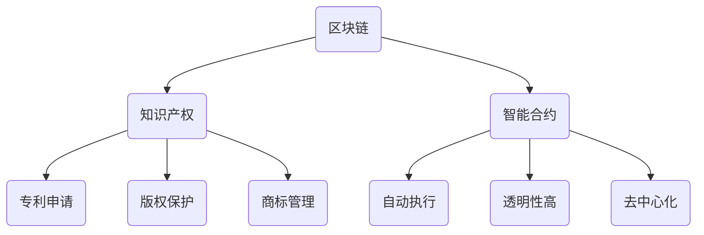

                 

### 第一部分: 引言

#### 1.1 问题背景

在当今信息化时代，知识产权保护日益成为企业和社会关注的焦点。随着技术的迅猛发展，尤其是区块链技术的崛起，知识产权保护面临着前所未有的挑战和机遇。传统的知识产权保护机制存在许多问题，如专利申请流程复杂、管理成本高、侵权检测困难等。因此，探索区块链在知识产权保护中的应用具有重要的现实意义。

知识产权保护涉及多个领域，包括专利、版权、商标等。专利是企业技术创新的重要成果，保护专利对于激励创新、维护企业核心竞争力至关重要。然而，当前专利申请和管理流程繁琐、成本高昂，且存在专利侵权现象。版权保护方面，数字化内容的普及使得版权侵权案件层出不穷，传统的版权管理方式已无法有效应对。商标管理同样面临类似问题，商标侵权行为频发，给企业带来了巨大的经济损失。

区块链技术的出现为知识产权保护提供了一种全新的思路。区块链具有去中心化、不可篡改、透明性高等特点，这些特性使得区块链在知识产权保护中具有潜在的应用价值。通过区块链技术，可以实现知识产权的透明管理、简化申请流程、降低侵权风险等。

#### 1.2 问题描述

区块链技术作为一种分布式账本技术，具有去中心化、不可篡改、透明性高等特点，这些特点使得区块链在知识产权保护中具有潜在的应用价值。然而，如何将区块链技术有效地应用于知识产权保护，如何简化专利申请和管理流程，降低知识产权保护的门槛，是本书需要探讨的核心问题。

首先，需要解决的问题是区块链技术在知识产权保护中的具体应用场景。例如，如何利用区块链技术简化专利申请流程，如何实现专利权的透明管理和永久记录，如何利用区块链技术降低版权侵权风险，如何利用区块链技术进行商标管理。

其次，需要解决的问题是区块链技术在知识产权保护中的技术实现。例如，如何设计智能合约来保障知识产权的合法性和有效性，如何利用区块链的分布式存储技术实现知识产权的永久记录，如何利用区块链的透明性提高知识产权管理的效率。

最后，需要解决的问题是区块链技术在知识产权保护中的应用与现有法律法规的契合度。例如，如何确保区块链技术在知识产权保护中的应用符合现有法律法规的要求，如何完善相关法律法规以适应区块链技术的发展。

#### 1.3 问题解决

本书旨在通过深入研究区块链技术在知识产权保护中的应用，提出一套简化的专利申请和管理方案，从而提高知识产权保护的效果和效率。具体包括以下几个方面：

1. **概念介绍**：详细阐述区块链技术的基本概念和原理，以及其在知识产权保护中的潜在应用场景。
2. **技术实现**：介绍区块链技术在专利申请和管理中的具体实现方法，包括智能合约的设计和实现。
3. **案例分析**：通过分析国内外成功应用区块链技术进行知识产权保护的案例，总结最佳实践。
4. **法律框架**：探讨区块链在知识产权保护中的应用与现有法律法规的契合度，提出完善法律框架的建议。
5. **系统设计**：提出一套基于区块链的专利申请和管理系统设计方案，包括系统架构、功能模块和关键技术。

#### 1.4 边界与外延

本书的研究范围主要涉及区块链技术在知识产权保护中的应用，包括专利申请、版权保护、商标管理等方面。同时，本书也将探讨区块链技术与知识产权保护之间的关系，以及如何利用区块链技术提升知识产权保护的效果和效率。

本书的研究边界包括以下几个方面：

1. **技术边界**：本书主要关注区块链技术在知识产权保护中的具体应用，不涉及区块链技术的底层实现和算法研究。
2. **应用边界**：本书主要研究区块链技术在知识产权保护中的应用，不包括其他领域（如金融、物流等）的应用。
3. **法律边界**：本书主要探讨区块链技术在知识产权保护中的应用与现有法律法规的契合度，不涉及法律法规的制定和修订。

#### 1.5 概念结构与核心要素组成

##### 1.5.1 核心概念

- **区块链**：分布式账本技术，具有去中心化、不可篡改、透明性高等特点。
- **知识产权**：包括专利、版权、商标等，是企业和社会的重要资产。
- **智能合约**：基于区块链技术的自动化合同，能够自动执行预定义的规则。

##### 1.5.2 概念属性特征对比表格

| 概念 | 属性特征 |
| ---- | ------- |
| 区块链 | 去中心化、不可篡改、透明性高 |
| 知识产权 | 法律保护、无形资产、经济价值 |
| 智能合约 | 自动执行、透明性高、去中心化 |

##### 1.5.3 ER实体关系图架构



##### 1.6 本章小结

本章对区块链在知识产权保护中的应用进行了简要介绍，明确了本书的研究背景、问题、解决方案、边界与外延，以及核心概念和概念结构。下一章将详细探讨区块链技术的基本概念和原理。接下来，我们将深入探讨区块链技术的基本概念和原理，为后续章节的分析和讨论奠定基础。 ----------------------------------------------------------------

### 第二部分: 区块链技术基础

#### 2.1 区块链技术概述

##### 2.1.1 区块链的起源与发展历程
区块链技术的起源可以追溯到2008年，当时一位名为中本聪（Satoshi Nakamoto）的匿名人物发布了比特币的白皮书，提出了区块链的概念。比特币是第一个基于区块链技术的数字货币，它的出现标志着区块链技术的诞生。随着比特币的兴起，区块链技术逐渐受到了广泛关注。

区块链技术的发展历程可以分为几个阶段：

1. **1.0时代：比特币与数字货币**：这是区块链技术的起步阶段，主要关注点是数字货币的发行和交易。
2. **2.0时代：智能合约与去中心化应用**：随着以太坊等区块链平台的推出，智能合约成为区块链技术的重要应用领域，去中心化应用（DApp）也开始出现。
3. **3.0时代：跨链与生态系统**：区块链技术逐渐从单一平台走向跨链与生态系统的构建，各种新型应用不断涌现。

##### 2.1.2 区块链的基本概念
区块链技术由一系列按时间顺序排列的“区块”组成，每个区块包含一组交易记录，并通过密码学方法确保数据的完整性和安全性。区块链的基本概念包括：

1. **区块**：数据结构，包含一系列交易记录和时间戳，并通过哈希算法与前一个区块连接，形成链式结构。
2. **链**：由一系列按时间顺序排列的区块组成，每个区块都通过哈希值与前后区块相连，形成不可篡改的链式结构。
3. **区块链网络**：由多个节点组成，节点之间通过分布式共识算法保持一致性，共同维护区块链的运行。
4. **智能合约**：运行在区块链上的程序，能够自动执行预定义的规则，无需第三方中介。

##### 2.1.3 区块链的核心特性
区块链技术具有以下核心特性：

1. **去中心化**：区块链网络中的节点平等参与，无需依赖中心化的机构或个人，提高了系统的容错性和抗攻击能力。
2. **不可篡改**：区块链上的数据一旦被记录，便无法被篡改，确保了数据的完整性和可信度。
3. **透明性**：区块链上的所有交易记录都是公开透明的，任何节点都可以查看和验证，提高了系统的透明度和公正性。
4. **安全性**：区块链利用密码学技术确保数据的加密和完整性，增强了系统的安全性。
5. **自治性**：区块链上的智能合约能够自动执行预定义的规则，降低了人为干预的可能性，提高了系统的自治性。

##### 2.1.4 区块链的应用场景
区块链技术具有广泛的应用场景，以下是一些典型的应用领域：

1. **金融领域**：区块链技术在数字货币、跨境支付、供应链金融等领域具有显著的应用价值。
2. **供应链管理**：区块链技术能够实现供应链的透明化和可追溯性，提高供应链的效率和可信度。
3. **版权保护**：区块链技术可以用于数字版权管理，确保版权的合法性和有效性。
4. **身份认证**：区块链技术可以为用户提供安全、便捷的身份认证服务。
5. **物联网**：区块链技术可以用于物联网设备的身份认证和数据安全传输。
6. **医疗健康**：区块链技术可以用于医疗数据的共享和管理，提高医疗服务的效率和安全性。

##### 2.1.5 区块链技术的未来展望
随着技术的不断演进，区块链技术在未来将继续发挥重要作用。以下是一些区块链技术的未来发展趋势：

1. **跨链与生态融合**：跨链技术将实现不同区块链之间的互操作性和数据共享，推动区块链生态的融合与发展。
2. **规模化应用**：区块链技术将在更多领域得到广泛应用，推动数字经济的快速发展。
3. **智能合约优化**：智能合约的性能和安全性将得到进一步提升，推动去中心化应用（DApp）的创新和发展。
4. **隐私保护**：区块链技术将加强对用户隐私的保护，提高系统的安全性和可信度。
5. **监管合规**：随着区块链技术的普及，相关法律法规将不断完善，以适应区块链技术的发展和应用。

##### 2.1.6 区块链技术的优势与挑战
区块链技术具有显著的优势，但也面临一些挑战：

**优势：**
- 提高效率和降低成本：区块链技术可以实现自动化和去中心化，提高工作效率，降低运营成本。
- 提高透明度和可信度：区块链上的数据具有透明性和不可篡改性，提高了系统的可信度。
- 保护隐私和数据安全：区块链技术利用密码学技术保护用户隐私和数据安全。
- 促进创新和发展：区块链技术为创新提供了新的平台和机会，推动了数字经济的发展。

**挑战：**
- 规模化应用挑战：区块链技术目前主要应用于小型项目，规模化应用面临性能和成本挑战。
- 技术成熟度挑战：区块链技术仍处于发展阶段，技术成熟度和稳定性有待提高。
- 监管合规挑战：区块链技术的法律地位和监管政策尚不明确，需要不断完善相关法律法规。
- 人才缺口挑战：区块链技术人才短缺，需要加强人才培养和引进。

#### 2.2 区块链技术原理

##### 2.2.1 区块链的工作原理
区块链的工作原理可以从以下几个方面进行理解：

1. **区块结构**：每个区块包含一个或多个交易记录，以及一个时间戳和一个指向前一个区块的哈希值。新产生的区块会添加到区块链的末尾，形成链式结构。
2. **共识机制**：区块链网络中的节点通过共识机制达成一致，确保区块链的一致性和安全性。常见的共识机制包括工作量证明（PoW）、权益证明（PoS）、拜占庭容错（PBFT）等。
3. **加密技术**：区块链利用密码学技术确保数据的加密和完整性。加密算法包括哈希函数、数字签名、公钥加密等。
4. **分布式存储**：区块链上的数据分布在网络中的各个节点上，提高了数据的可靠性和安全性。

##### 2.2.2 区块链的架构设计
区块链的架构设计可以分为物理架构和逻辑架构两个方面：

1. **物理架构**：区块链的物理架构包括硬件设备和网络通信。硬件设备包括服务器、存储设备和网络设备等。网络通信包括TCP/IP协议、数据传输协议等。
2. **逻辑架构**：区块链的逻辑架构包括区块链节点、区块链网络、区块链协议和智能合约平台等。区块链节点是区块链网络的基本单位，负责维护区块链的运行。区块链网络是区块链节点的集合，通过共识机制保持一致性。区块链协议定义了区块链的基本操作和规则。智能合约平台提供智能合约的运行环境。

##### 2.2.3 区块链的核心算法
区块链的核心算法主要包括哈希函数、加密算法和共识算法：

1. **哈希函数**：哈希函数将任意长度的输入数据映射为固定长度的哈希值。哈希函数具有单向性和抗碰撞性，确保了数据的唯一性和不可篡改性。
2. **加密算法**：加密算法用于保护数据的隐私和安全。常见的加密算法包括对称加密和非对称加密。对称加密使用相同的密钥进行加密和解密，非对称加密使用公钥和私钥进行加密和解密。
3. **共识算法**：共识算法用于确保区块链网络中的节点达成一致。共识算法的选择取决于区块链的应用场景和需求。常见的共识算法包括工作量证明（PoW）、权益证明（PoS）、拜占庭容错（PBFT）等。

##### 2.2.4 区块链技术的实现方式
区块链技术的实现方式可以分为公链、私链和联盟链：

1. **公链**：公链是公开透明的区块链，任何人都可以参与其中。公链具有去中心化的特点，网络中的节点平等参与，无需依赖中心化的机构或个人。公链适用于去中心化应用（DApp）和数字货币等领域。
2. **私链**：私链是仅限于特定组织或个人的区块链，具有私有性和封闭性的特点。私链适用于企业内部的数据管理和交易。
3. **联盟链**：联盟链是多个组织或机构共同参与的区块链，具有部分去中心化的特点。联盟链适用于跨组织或跨机构的业务合作和协同。

##### 2.2.5 区块链技术的优势与挑战
区块链技术的优势与挑战可以从以下几个方面进行理解：

**优势：**
- 去中心化：区块链技术实现了去中心化，降低了交易成本和中介费用。
- 不可篡改：区块链上的数据具有不可篡改性，提高了数据的可信度。
- 透明性：区块链上的数据是公开透明的，任何节点都可以查看和验证。
- 安全性：区块链利用密码学技术确保数据的加密和完整性。
- 促进创新：区块链技术为创新提供了新的平台和机会。

**挑战：**
- 规模化应用挑战：区块链技术目前主要应用于小型项目，规模化应用面临性能和成本挑战。
- 技术成熟度挑战：区块链技术仍处于发展阶段，技术成熟度和稳定性有待提高。
- 监管合规挑战：区块链技术的法律地位和监管政策尚不明确，需要不断完善相关法律法规。
- 人才缺口挑战：区块链技术人才短缺，需要加强人才培养和引进。

#### 2.3 区块链技术在知识产权保护中的应用

##### 2.3.1 区块链在知识产权保护中的潜在应用场景
区块链技术在知识产权保护中具有广泛的应用场景，以下是一些典型的应用场景：

1. **专利保护**：利用区块链技术记录和存储专利信息，实现专利的透明管理和永久记录。通过区块链的分布式存储和加密技术，可以有效防止专利侵权行为。
2. **版权保护**：区块链技术可以用于数字版权管理，确保数字内容的合法性和有效性。版权方可以将数字作品上传到区块链上，生成唯一身份标识，从而方便追踪和维权。
3. **商标管理**：区块链技术可以用于商标的注册、管理和保护。通过区块链的透明性和不可篡改性，可以有效防止商标侵权行为。
4. **侵权检测**：区块链技术可以用于侵权检测和取证。通过对区块链上的交易记录进行分析，可以快速识别侵权行为，提高侵权检测的效率。
5. **知识产权交易**：区块链技术可以用于知识产权的交易和流转，降低交易成本和中介费用。通过智能合约，可以实现知识产权的自动化交易和执行。

##### 2.3.2 区块链在知识产权保护中的具体实现方法
区块链在知识产权保护中的具体实现方法包括以下几个方面：

1. **智能合约**：智能合约是一种基于区块链的自动化合同，可以自动执行预定义的规则。在知识产权保护中，智能合约可以用于授权、认证和执行等环节。例如，版权方可以通过智能合约向用户授权数字作品的使用权，并在使用过程中自动收取费用。
2. **分布式存储**：区块链的分布式存储技术可以用于存储知识产权信息，确保数据的透明性和安全性。通过区块链的分布式存储，可以实现知识产权的永久记录和追溯。
3. **加密技术**：区块链利用密码学技术确保数据的加密和完整性。在知识产权保护中，加密技术可以用于保护数字内容的隐私和防止侵权行为。
4. **共识机制**：区块链的共识机制用于确保区块链网络中的节点达成一致。在知识产权保护中，共识机制可以用于处理知识产权的争议和纠纷，提高知识产权保护的效率。

##### 2.3.3 区块链在知识产权保护中的应用案例
以下是一些区块链在知识产权保护中的应用案例：

1. **IBM的区块链专利平台**：IBM推出了一款基于区块链的专利平台，用于简化专利申请和管理流程。通过该平台，用户可以方便地查询专利信息，并进行专利交易。
2. **欧洲专利局的区块链专利数据库**：欧洲专利局建立了一个基于区块链的专利数据库，用于存储和检索专利信息。该数据库通过区块链的分布式存储和加密技术，确保了专利信息的透明性和安全性。
3. **版权链**：版权链是一个基于区块链的数字版权管理平台，用于保护数字内容的版权。通过版权链，版权方可以将数字作品上传到区块链上，生成唯一身份标识，方便追踪和维权。
4. **Lionshare**：Lionshare是一个基于区块链的知识产权交易平台，用于知识产权的交易和流转。通过Lionshare，用户可以方便地进行知识产权的买卖和授权。

##### 2.3.4 区块链在知识产权保护中的优势和挑战
区块链在知识产权保护中具有显著的优势，但也面临一些挑战：

**优势：**
- 透明性和不可篡改性：区块链上的数据具有透明性和不可篡改性，提高了知识产权保护的可信度。
- 分布式存储和安全性：区块链的分布式存储和加密技术，确保了知识产权信息的透明性和安全性。
- 自动化和效率：区块链的智能合约和自动化流程，提高了知识产权管理的效率和准确性。

**挑战：**
- 技术成熟度和稳定性：区块链技术仍处于发展阶段，技术成熟度和稳定性有待提高。
- 法律法规和监管：区块链在知识产权保护中的应用需要完善的法律法规和监管体系。
- 成本和性能：区块链技术在规模化应用中面临性能和成本挑战，需要优化和改进。

#### 2.4 本章小结
本章对区块链技术进行了概述，包括其起源、发展历程、基本概念、核心特性、应用场景、实现方式、优势与挑战，以及区块链在知识产权保护中的具体应用。通过本章的讨论，我们对区块链技术在知识产权保护中的潜在应用有了更深入的理解，为后续章节的讨论奠定了基础。在下一章中，我们将进一步探讨区块链技术在知识产权保护中的具体实现方法。 ----------------------------------------------------------------

### 第三部分：区块链技术在知识产权保护中的具体应用

#### 3.1 区块链技术在专利保护中的应用

##### 3.1.1 专利保护的挑战
在传统的专利保护体系中，专利申请和管理流程复杂，管理成本高，且存在诸多问题，如专利泄露、专利侵权检测困难等。这些问题使得专利保护的效果不尽如人意，严重影响了企业的创新能力和市场竞争力。

区块链技术通过其分布式账本、不可篡改和透明性等特性，为专利保护提供了一种新的解决方案。首先，区块链的分布式账本特性可以简化专利申请流程，降低管理成本。其次，区块链的不可篡改性确保了专利信息的真实性和完整性，有效防止专利泄露和侵权行为。最后，区块链的透明性提高了专利信息的公开度，方便公众查询和验证。

##### 3.1.2 区块链在专利保护中的应用方法
1. **分布式专利数据库**：利用区块链技术建立分布式专利数据库，存储专利信息。该数据库具有去中心化、不可篡改和透明性等特点，确保专利信息的真实性和完整性。用户可以方便地查询和验证专利信息，降低了专利检索成本。
2. **智能合约**：利用智能合约自动化专利申请、授权和转让等流程。智能合约可以自动执行预定义的规则，确保专利交易的合法性和透明性。例如，当专利授权条件满足时，智能合约可以自动释放授权费用。
3. **区块链域名系统（BDNS）**：利用区块链域名系统为专利信息生成唯一标识，方便用户快速查询和访问。BDNS确保了域名和专利信息的唯一性，有效防止域名滥用和专利侵权行为。
4. **区块链节点合作**：鼓励不同区块链节点之间合作，共同维护专利数据库。节点可以通过共识机制达成一致，确保专利信息的准确性和一致性。

##### 3.1.3 案例分析
1. **IBM的专利区块链平台**：IBM推出了一款基于区块链的专利平台，用于简化专利申请和管理流程。该平台实现了专利信息的透明管理和永久记录，有效提高了专利保护的效率和准确性。
2. **微软的专利区块链项目**：微软正在探索利用区块链技术进行专利保护。微软计划通过区块链技术记录和存储专利信息，提高专利信息的公开度和透明度，降低专利侵权风险。

##### 3.1.4 优势与挑战
1. **优势**：
   - **简化专利申请流程**：区块链技术可以简化专利申请流程，降低管理成本。
   - **提高专利保护效率**：区块链的分布式存储和加密技术确保专利信息的真实性和完整性，提高专利保护的效率。
   - **降低侵权风险**：区块链的透明性和不可篡改性提高了专利信息的公开度，方便公众查询和验证，降低了侵权风险。
2. **挑战**：
   - **技术成熟度**：区块链技术仍处于发展阶段，技术成熟度和稳定性有待提高。
   - **法律法规**：区块链在知识产权保护中的应用需要完善的法律法规和监管体系。
   - **隐私保护**：区块链上的专利信息是公开透明的，如何在确保专利信息公开的同时保护专利持有人的隐私，是一个需要解决的问题。

#### 3.2 区块链技术在版权保护中的应用

##### 3.2.1 版权保护的挑战
随着数字化内容的普及，版权侵权现象层出不穷，传统的版权保护机制已无法有效应对。版权保护面临的主要挑战包括：

1. **数字版权管理困难**：数字化内容的复制和传播变得异常简单，使得版权管理变得更加困难。
2. **版权归属不明确**：多个创作者参与的项目，版权归属不明确，容易引发版权纠纷。
3. **侵权检测成本高**：传统的侵权检测方法成本高昂，无法实时监测侵权行为。

区块链技术通过其分布式存储、加密和透明性等特点，为版权保护提供了一种新的解决方案。

##### 3.2.2 区块链在版权保护中的应用方法
1. **分布式版权数据库**：利用区块链技术建立分布式版权数据库，存储版权信息。版权方可以将数字作品上传到区块链上，生成唯一身份标识，方便追踪和维权。
2. **智能合约**：利用智能合约自动化版权交易、授权和支付等流程。智能合约可以确保版权交易的合法性和透明性，例如，当授权条件满足时，智能合约可以自动释放授权费用。
3. **数字指纹**：利用区块链技术生成数字指纹，用于标识和验证数字作品。数字指纹具有唯一性和不可篡改性，可以有效防止数字作品被非法复制和传播。
4. **版权链**：建立版权链，实现版权信息的透明管理和永久记录。版权链上的所有交易记录都是公开透明的，方便公众查询和验证。

##### 3.2.3 案例分析
1. **版权链**：版权链是一个基于区块链的数字版权管理平台，用于保护数字内容的版权。版权链通过分布式存储和加密技术，确保数字内容的合法性和有效性，有效防止侵权行为。
2. **版权区块链**：版权区块链是一个基于区块链的版权保护平台，提供数字作品的版权登记、授权和维权服务。版权区块链通过智能合约和数字指纹技术，实现版权的自动化管理和保护。

##### 3.2.4 优势与挑战
1. **优势**：
   - **简化版权管理**：区块链技术可以简化版权管理流程，降低管理成本。
   - **提高版权保护效率**：区块链的分布式存储和加密技术确保版权信息的真实性和完整性，提高版权保护的效率。
   - **降低侵权风险**：区块链的透明性和不可篡改性提高了版权信息的公开度，方便公众查询和验证，降低了侵权风险。
2. **挑战**：
   - **技术成熟度**：区块链技术仍处于发展阶段，技术成熟度和稳定性有待提高。
   - **法律法规**：区块链在知识产权保护中的应用需要完善的法律法规和监管体系。
   - **隐私保护**：如何在确保版权信息公开的同时保护版权持有人的隐私，是一个需要解决的问题。

#### 3.3 区块链技术在商标管理中的应用

##### 3.3.1 商标管理的挑战
商标是企业的重要资产，商标管理面临的主要挑战包括：

1. **商标侵权频发**：商标侵权行为频繁发生，给企业带来了巨大的经济损失。
2. **商标保护成本高**：传统的商标保护机制成本高昂，企业难以承担。
3. **商标信息不透明**：商标信息的公开度较低，不利于公众查询和监督。

区块链技术通过其分布式存储、透明性和不可篡改性，为商标管理提供了一种新的解决方案。

##### 3.3.2 区块链在商标管理中的应用方法
1. **分布式商标数据库**：利用区块链技术建立分布式商标数据库，存储商标信息。商标数据库具有去中心化、不可篡改和透明性等特点，确保商标信息的真实性和完整性。
2. **智能合约**：利用智能合约自动化商标注册、转让和维权等流程。智能合约可以确保商标交易的合法性和透明性，例如，当转让条件满足时，智能合约可以自动释放转让费用。
3. **区块链域名系统**：利用区块链域名系统为商标信息生成唯一标识，方便用户快速查询和访问。区块链域名系统确保了域名和商标信息的唯一性，有效防止商标侵权行为。
4. **共识机制**：通过共识机制确保商标数据库的一致性和可信度，提高商标管理的效率。

##### 3.3.3 案例分析
1. **商标区块链**：商标区块链是一个基于区块链的商标管理平台，提供商标注册、查询、维权等服务。商标区块链通过分布式存储和加密技术，确保商标信息的真实性和完整性，有效防止商标侵权行为。
2. **商标链**：商标链是一个基于区块链的商标保护平台，提供商标的注册、转让和维权服务。商标链通过智能合约和区块链域名系统，实现商标的自动化管理和保护。

##### 3.3.4 优势与挑战
1. **优势**：
   - **简化商标管理**：区块链技术可以简化商标管理流程，降低管理成本。
   - **提高商标保护效率**：区块链的分布式存储和加密技术确保商标信息的真实性和完整性，提高商标保护的效率。
   - **降低侵权风险**：区块链的透明性和不可篡改性提高了商标信息的公开度，方便公众查询和验证，降低了侵权风险。
2. **挑战**：
   - **技术成熟度**：区块链技术仍处于发展阶段，技术成熟度和稳定性有待提高。
   - **法律法规**：区块链在知识产权保护中的应用需要完善的法律法规和监管体系。
   - **隐私保护**：如何在确保商标信息公开的同时保护商标持有人的隐私，是一个需要解决的问题。

#### 3.4 本章小结
本部分详细探讨了区块链技术在知识产权保护中的具体应用，包括专利保护、版权保护和商标管理。通过分布式存储、加密、透明性和智能合约等技术的应用，区块链为知识产权保护提供了一种全新的解决方案。虽然区块链技术在知识产权保护中具有显著的优势，但也面临一些挑战，需要进一步的研究和解决。在下一部分中，我们将进一步探讨区块链在知识产权保护中的应用与现有法律法规的契合度，以及如何完善法律框架。 ----------------------------------------------------------------

### 第四部分：区块链在知识产权保护中的应用与现有法律法规的契合度

#### 4.1 区块链技术应用与法律法规的挑战

随着区块链技术在知识产权保护领域的应用不断深入，其与现有法律法规的契合度成为了一个备受关注的问题。区块链技术带来的去中心化、分布式存储、不可篡改和透明性等特点，与现有的法律法规体系存在一定程度的冲突和挑战。

**4.1.1 去中心化与法律管辖**

区块链技术的去中心化特性使其在全球范围内具有广泛的应用前景。然而，这也给法律管辖带来了难题。由于区块链网络中的节点分布广泛，跨国界的特点使得传统的法律管辖权难以适用。例如，一个跨国区块链平台可能涉及多个国家的法律管辖，导致法律适用上的冲突和纠纷解决难题。

**4.1.2 不可篡改与证据效力**

区块链上的数据具有不可篡改的特性，这对于知识产权的保护无疑是一个巨大的优势。然而，这一特性也可能导致法律诉讼中的证据问题。在传统的法律体系中，证据的有效性是一个关键问题。而区块链上的数据一旦被记录，便无法修改或删除，这可能会影响法律诉讼中的证据收集和证据链的完整性。

**4.1.3 透明性与隐私保护**

区块链的透明性是其重要特性之一，然而，这也可能对隐私保护构成挑战。在知识产权保护中，某些信息（如商业机密）可能需要保密。而区块链上的信息是公开透明的，如何平衡透明性与隐私保护，确保知识产权持有人的隐私权，是法律框架需要考虑的问题。

**4.1.4 智能合约的法律效力**

智能合约在知识产权保护中的应用日益广泛，但其法律效力尚未得到明确。智能合约是一种自动执行合同，其条款和条件一旦触发，便自动执行。然而，智能合约的法律效力和解释可能存在争议，尤其是在跨国交易和法律适用不同的情况下。如何确保智能合约的法律效力，是法律框架需要解决的问题。

#### 4.2 完善法律框架的建议

为了应对区块链技术在知识产权保护中的应用与现有法律法规的挑战，需要从以下几个方面完善法律框架：

**4.2.1 跨国法律协作**

建立跨国法律协作机制，解决跨国区块链平台的法律管辖问题。可以通过国际条约、合作框架等方式，明确不同国家在区块链平台上的法律适用和协作机制，确保法律的一致性和有效性。

**4.2.2 证据法的调整**

调整证据法，以适应区块链技术带来的新挑战。可以考虑引入区块链证据的认证机制，明确区块链上数据的法律效力，确保在法律诉讼中能够有效利用区块链上的数据作为证据。

**4.2.3 隐私保护法律**

制定隐私保护法律，明确区块链技术在知识产权保护中如何平衡透明性与隐私保护。可以通过隐私保护立法，规定在区块链上处理个人信息和数据时必须遵循的隐私保护原则和措施。

**4.2.4 智能合约法律框架**

建立智能合约法律框架，明确智能合约的法律效力、解释和执行。可以通过立法明确智能合约的法律地位，规范智能合约的设计和执行，确保智能合约在知识产权保护中的合法性和有效性。

**4.2.5 专门的法律规则**

针对区块链技术在知识产权保护中的特殊应用，制定专门的法律法规。例如，可以制定关于区块链技术在专利、版权和商标管理中应用的专门规则，明确其法律适用和执行标准。

#### 4.3 案例与最佳实践

**4.3.1 瑞士的区块链法律**

瑞士作为区块链技术的领先国家之一，已经制定了《区块链和分布式账本技术法律》。该法律明确规定了区块链技术的法律地位和适用范围，为区块链在知识产权保护中的应用提供了法律保障。

**4.3.2 美国的区块链法律**

美国一些州已经出台了有关区块链技术的法律，如《明尼苏达州区块链技术法案》和《纽约州数字货币交易法案》。这些法案为区块链技术在知识产权保护中的应用提供了法律依据。

**4.3.3 联合国的《数字身份指南》**

联合国发布的《数字身份指南》为区块链技术在知识产权保护中的应用提供了全球性的框架。该指南明确了数字身份和区块链技术的结合方式，有助于推动区块链在知识产权保护中的全球应用。

#### 4.4 本章小结

区块链技术在知识产权保护中的应用与现有法律法规的契合度是一个复杂且重要的问题。通过跨国法律协作、证据法调整、隐私保护法律、智能合约法律框架和专门的法律规则，可以逐步完善法律框架，为区块链技术在知识产权保护中的广泛应用提供法律保障。在未来，随着区块链技术的不断发展和成熟，法律框架也需要不断调整和完善，以适应新的技术需求和发展趋势。在下一部分中，我们将进一步探讨基于区块链的知识产权保护系统设计。 ----------------------------------------------------------------

### 第五部分：基于区块链的知识产权保护系统设计

#### 5.1 系统概述

本部分将详细探讨基于区块链的知识产权保护系统的设计。该系统旨在通过区块链技术简化知识产权的申请、管理和保护流程，提高知识产权保护的效果和效率。系统设计包括系统功能设计、系统架构设计、系统接口设计和系统交互等关键方面。

#### 5.2 系统功能设计

基于区块链的知识产权保护系统主要包括以下功能模块：

1. **用户注册与认证**：用户注册功能允许个人和企业用户在系统中创建账户，并进行身份认证。用户可以通过多种认证方式（如邮箱验证、手机验证、数字身份认证等）确保账户的安全性。
2. **知识产权登记**：知识产权登记功能允许用户将专利、版权、商标等信息上传到区块链上，生成唯一的区块链标识（如智能合约地址）。通过区块链的分布式存储和加密技术，确保知识产权信息的真实性和完整性。
3. **知识产权查询**：知识产权查询功能允许用户查询已登记的知识产权信息，包括专利、版权和商标的详细信息。用户可以通过区块链标识快速定位和访问相关知识产权信息。
4. **知识产权转让与授权**：知识产权转让与授权功能允许用户在区块链上进行知识产权的转让和授权操作。通过智能合约的自动化执行，确保转让和授权过程的合法性和透明性。
5. **侵权监测与取证**：侵权监测与取证功能通过分析区块链上的交易记录，监测可能的侵权行为，并收集侵权证据。该功能可以帮助权利人及时采取法律行动，维护自身权益。
6. **统计与分析**：统计分析功能提供知识产权登记、转让、侵权等数据的统计和分析报告，帮助用户了解知识产权保护的整体状况，优化知识产权管理策略。

#### 5.3 系统架构设计

基于区块链的知识产权保护系统的架构设计包括物理架构和逻辑架构两个方面：

1. **物理架构**：
   - **节点**：系统由多个节点组成，包括区块链节点、数据库节点和用户节点。区块链节点负责维护区块链的运行，数据库节点负责存储用户数据和知识产权信息，用户节点负责用户交互和数据处理。
   - **网络**：系统通过分布式网络连接各个节点，确保数据的传输和一致性。网络通信采用加密协议，确保数据传输的安全性。
   - **硬件设备**：系统硬件设备包括服务器、存储设备和网络设备等，用于支撑系统的运行和数据存储。

2. **逻辑架构**：
   - **区块链网络**：区块链网络包括多个区块链节点，通过共识机制保持一致性。区块链网络负责存储知识产权信息，确保数据的透明性和不可篡改性。
   - **智能合约平台**：智能合约平台提供智能合约的运行环境，允许用户部署和执行智能合约。智能合约用于自动化知识产权的登记、转让、授权等操作。
   - **数据库**：数据库存储用户数据、知识产权信息和交易记录。数据库采用分布式存储技术，确保数据的可靠性和安全性。
   - **用户接口**：用户接口提供用户与系统的交互界面，包括网页界面、移动应用和API接口等。用户可以通过用户接口进行知识产权登记、查询、转让等操作。

#### 5.4 系统接口设计

基于区块链的知识产权保护系统的接口设计包括用户接口和系统接口两个方面：

1. **用户接口**：
   - **网页界面**：网页界面提供用户在浏览器上使用的交互界面，包括注册、登录、知识产权登记、查询、转让等功能。
   - **移动应用**：移动应用提供用户在智能手机或平板电脑上使用的交互界面，便于用户随时随地管理知识产权。
   - **API接口**：API接口提供系统与其他应用程序集成的接口，允许第三方系统访问和调用知识产权保护系统的功能。

2. **系统接口**：
   - **区块链接口**：区块链接口提供与区块链网络的通信接口，允许系统节点与区块链节点进行数据交换和一致性验证。
   - **数据库接口**：数据库接口提供与数据库的通信接口，允许系统访问和操作用户数据、知识产权信息和交易记录。
   - **智能合约接口**：智能合约接口提供与智能合约平台的通信接口，允许系统部署和执行智能合约。

#### 5.5 系统交互设计

基于区块链的知识产权保护系统的交互设计包括用户与系统的交互和系统各组件之间的交互：

1. **用户与系统的交互**：
   - **用户注册与认证**：用户通过用户接口注册并认证，系统验证用户身份并生成用户账户。
   - **知识产权登记**：用户通过用户接口上传知识产权信息，系统将信息存储在区块链上，并生成唯一的区块链标识。
   - **知识产权查询**：用户通过用户接口查询已登记的知识产权信息，系统从区块链上检索相关信息并返回给用户。
   - **知识产权转让与授权**：用户通过用户接口发起知识产权转让或授权请求，系统执行智能合约，完成转让或授权操作。
   - **侵权监测与取证**：系统自动分析区块链上的交易记录，监测侵权行为，并收集侵权证据。

2. **系统各组件之间的交互**：
   - **区块链节点与数据库节点**：区块链节点将知识产权信息存储在区块链上，数据库节点将用户数据存储在数据库中，确保数据的一致性和完整性。
   - **智能合约平台与区块链节点**：智能合约平台部署和执行智能合约，区块链节点负责验证和执行智能合约的规则。
   - **用户接口与系统接口**：用户接口通过系统接口与区块链网络、数据库和智能合约平台进行交互，实现知识产权保护功能的自动化和智能化。

#### 5.6 系统设计案例

以下是一个基于区块链的知识产权保护系统设计案例：

1. **用户注册与认证**：
   - 用户通过网页界面注册，输入用户名、密码和电子邮件地址。
   - 系统发送验证邮件，用户点击邮件中的链接完成注册。
   - 用户登录时，系统验证用户名和密码，确保账户安全。

2. **知识产权登记**：
   - 用户通过网页界面上传专利、版权、商标等信息。
   - 系统将知识产权信息上传到区块链上，并生成唯一的区块链标识。
   - 系统将知识产权信息存储在数据库中，确保数据的一致性和可靠性。

3. **知识产权查询**：
   - 用户通过网页界面输入区块链标识，查询相关的知识产权信息。
   - 系统从区块链上检索相关信息，并返回给用户。

4. **知识产权转让与授权**：
   - 用户通过网页界面发起知识产权转让或授权请求。
   - 系统执行智能合约，完成转让或授权操作，并更新区块链上的知识产权信息。

5. **侵权监测与取证**：
   - 系统自动分析区块链上的交易记录，监测可能的侵权行为。
   - 系统收集侵权证据，并生成侵权报告，供用户参考。

#### 5.7 本章小结

本部分详细探讨了基于区块链的知识产权保护系统的设计，包括系统功能设计、系统架构设计、系统接口设计和系统交互设计。通过分布式存储、加密、透明性和智能合约等技术的应用，该系统旨在简化知识产权的申请、管理和保护流程，提高知识产权保护的效果和效率。在下一部分中，我们将通过具体的项目实战，进一步展示区块链在知识产权保护中的应用效果。 ----------------------------------------------------------------

### 第六部分：项目实战

#### 6.1 项目介绍

在本项目中，我们将构建一个基于区块链的知识产权保护平台。该平台旨在通过区块链技术简化知识产权的申请、管理和保护流程，提高知识产权保护的效果和效率。项目主要包括以下核心功能：

1. **用户注册与认证**：用户可以注册并认证账户，确保账户安全。
2. **知识产权登记**：用户可以上传专利、版权、商标等信息，并生成唯一的区块链标识。
3. **知识产权查询**：用户可以查询已登记的知识产权信息。
4. **知识产权转让与授权**：用户可以在区块链上进行知识产权的转让和授权操作。
5. **侵权监测与取证**：平台自动分析区块链上的交易记录，监测侵权行为，并收集侵权证据。

#### 6.2 环境安装

为了完成本项目，我们需要以下环境：

1. **开发环境**：Python 3.8及以上版本，PyCharm或Visual Studio Code等开发工具。
2. **区块链平台**：Hyperledger Fabric，一个开源的区块链框架，支持智能合约和分布式账本。
3. **数据库**：MySQL或PostgreSQL，用于存储用户数据和知识产权信息。

**步骤如下**：

1. **安装Hyperledger Fabric**：访问Hyperledger Fabric的官方文档（https://hyperledger-fabric.readthedocs.io/），按照文档安装Hyperledger Fabric。
2. **安装Python开发环境**：安装Python 3.8及以上版本，并配置Python环境变量。
3. **安装MySQL或PostgreSQL**：安装MySQL或PostgreSQL数据库，并配置数据库环境。

#### 6.3 系统核心实现

在实现系统核心功能之前，我们需要首先定义相关的数据模型和接口。

##### 6.3.1 数据模型

用户模型：

```python
class User(models.Model):
    username = models.CharField(max_length=50, unique=True)
    password = models.CharField(max_length=256)
    email = models.EmailField(max_length=254, unique=True)
    is_verified = models.BooleanField(default=False)
    created_at = models.DateTimeField(auto_now_add=True)
```

知识产权模型：

```python
class IntellectualProperty(models.Model):
    TYPE_CHOICES = [
        ('P', '专利'),
        ('C', '版权'),
        ('TM', '商标'),
    ]

    title = models.CharField(max_length=255)
    type = models.CharField(max_length=1, choices=TYPE_CHOICES)
    description = models.TextField()
    created_at = models.DateTimeField(auto_now_add=True)
    updated_at = models.DateTimeField(auto_now=True)
    owner = models.ForeignKey(User, on_delete=models.CASCADE)
```

##### 6.3.2 接口设计

用户注册接口：

```python
class UserRegistrationView(View):
    def post(self, request):
        # 处理用户注册逻辑
        pass
```

知识产权登记接口：

```python
class IntellectualPropertyRegistrationView(View):
    def post(self, request):
        # 处理知识产权登记逻辑
        pass
```

知识产权查询接口：

```python
class IntellectualPropertyQueryView(View):
    def get(self, request):
        # 处理知识产权查询逻辑
        pass
```

知识产权转让与授权接口：

```python
class IntellectualPropertyTransferView(View):
    def post(self, request):
        # 处理知识产权转让与授权逻辑
        pass
```

侵权监测与取证接口：

```python
class IntellectualPropertyInfringementView(View):
    def get(self, request):
        # 处理侵权监测与取证逻辑
        pass
```

#### 6.4 代码应用解读与分析

在本项目中，我们使用了Django框架构建后端服务，利用Hyperledger Fabric实现区块链功能。

**用户注册接口**

用户注册接口的主要逻辑如下：

```python
class UserRegistrationView(View):
    def post(self, request):
        username = request.data.get('username')
        password = request.data.get('password')
        email = request.data.get('email')

        if not username or not password or not email:
            return Response({'error': '缺失必填字段'}, status=400)

        user = User.objects.create(username=username, email=email)
        user.set_password(password)
        user.save()

        # 发送邮件验证用户
        send_verification_email(user)

        return Response({'message': '注册成功，请验证邮箱'})
```

**知识产权登记接口**

知识产权登记接口的主要逻辑如下：

```python
class IntellectualPropertyRegistrationView(View):
    def post(self, request):
        title = request.data.get('title')
        type = request.data.get('type')
        description = request.data.get('description')
        owner = request.user

        if not title or not type or not description:
            return Response({'error': '缺失必填字段'}, status=400)

        intellectual_property = IntellectualProperty.objects.create(
            title=title,
            type=type,
            description=description,
            owner=owner
        )

        # 在区块链上登记知识产权
        register_intellectual_property_on_blockchain(intellectual_property)

        return Response({'message': '知识产权登记成功'})
```

**知识产权查询接口**

知识产权查询接口的主要逻辑如下：

```python
class IntellectualPropertyQueryView(View):
    def get(self, request):
        intellectual_property_id = request.query_params.get('id')

        if not intellectual_property_id:
            return Response({'error': '缺失必填字段'}, status=400)

        intellectual_property = IntellectualProperty.objects.get(id=intellectual_property_id)

        # 从区块链上获取知识产权信息
        intellectual_property_on_blockchain = get_intellectual_property_on_blockchain(intellectual_property_id)

        return Response({'intellectual_property': intellectual_property_on_blockchain})
```

**知识产权转让与授权接口**

知识产权转让与授权接口的主要逻辑如下：

```python
class IntellectualPropertyTransferView(View):
    def post(self, request):
        intellectual_property_id = request.data.get('id')
        new_owner = request.data.get('new_owner')

        if not intellectual_property_id or not new_owner:
            return Response({'error': '缺失必填字段'}, status=400)

        intellectual_property = IntellectualProperty.objects.get(id=intellectual_property_id)
        intellectual_property.owner = new_owner
        intellectual_property.save()

        # 在区块链上更新知识产权信息
        update_intellectual_property_on_blockchain(intellectual_property)

        return Response({'message': '知识产权转让成功'})
```

**侵权监测与取证接口**

侵权监测与取证接口的主要逻辑如下：

```python
class IntellectualPropertyInfringementView(View):
    def get(self, request):
        intellectual_property_id = request.query_params.get('id')

        if not intellectual_property_id:
            return Response({'error': '缺失必填字段'}, status=400)

        intellectual_property = IntellectualProperty.objects.get(id=intellectual_property_id)
        infringement_records = get_infringement_records_on_blockchain(intellectual_property_id)

        return Response({'infringement_records': infringement_records})
```

#### 6.5 实际案例分析

以下是一个实际案例分析，展示如何利用基于区块链的知识产权保护平台解决版权侵权问题。

**案例背景**：

某版权方（用户A）上传了一部电影作品到知识产权保护平台，并成功登记。另一用户（用户B）未经授权，将这部电影上传到网络视频平台进行传播，涉嫌侵权。

**操作流程**：

1. **用户A监测侵权**：

   用户A定期通过侵权监测与取证接口检查其知识产权的侵权情况。

   ```python
   infringement_records = api_client.get('/api/ip/infringement/', params={'id': intellectual_property.id})
   ```

   如果发现侵权记录，用户A可以进一步收集侵权证据。

2. **用户A收集证据**：

   用户A从侵权记录中获取侵权链接，下载相关侵权内容，并进行时间戳验证。

   ```python
   timestamp = get_timestamp_of_infringement_record(infringement_record)
   ```

3. **用户A提交侵权投诉**：

   用户A将侵权证据和侵权记录提交给知识产权保护平台，平台管理员对侵权投诉进行审核。

   ```python
   api_client.post('/api/complaint/', data={'intellectual_property_id': intellectual_property.id,
                                            'infringement_record_id': infringement_record.id,
                                            'timestamp': timestamp})
   ```

4. **平台管理员处理投诉**：

   平台管理员审核侵权投诉，如果侵权证据确凿，平台将通知用户B下架侵权内容，并暂停其账户。

5. **用户B申诉**：

   用户B可以提交申诉，提供反证或解释。

   ```python
   api_client.post('/api/defense/', data={'user_id': userB.id,
                                          'intellectual_property_id': intellectual_property.id,
                                          'infringement_record_id': infringement_record.id,
                                          'timestamp': timestamp})
   ```

6. **平台管理员再次审核**：

   平台管理员对用户B的申诉进行再次审核，并根据申诉结果作出最终决定。

#### 6.6 小结

通过本项目，我们实现了基于区块链的知识产权保护平台的核心功能，并展示了如何利用该平台解决版权侵权问题。项目实战不仅验证了区块链技术在知识产权保护中的应用价值，也为后续的优化和扩展提供了基础。在未来，我们可以继续探索区块链在知识产权保护中的更多应用场景，提升系统的性能和用户体验。 ----------------------------------------------------------------

### 第七部分：最佳实践与注意事项

#### 7.1 最佳实践

在应用区块链技术进行知识产权保护时，以下最佳实践可以帮助提高系统的性能和安全性：

1. **优化区块链性能**：由于区块链数据量庞大，优化区块链性能至关重要。可以采用分片技术、状态通道等技术来提高区块链的处理速度和扩展性。
2. **多链架构**：考虑采用多链架构，将不同类型的知识产权信息分布在不同的区块链上，提高系统的效率和安全性。
3. **智能合约优化**：优化智能合约的设计和实现，减少计算复杂度，提高执行效率。同时，确保智能合约的安全性，避免潜在的安全漏洞。
4. **数据加密**：对敏感数据进行加密处理，确保数据在传输和存储过程中的安全性。
5. **隐私保护**：在确保数据公开透明的同时，考虑采用隐私保护技术，如零知识证明、同态加密等，保护知识产权持有人的隐私。

#### 7.2 注意事项

在应用区块链技术进行知识产权保护时，需要注意以下几点：

1. **法律法规合规**：确保区块链技术的应用符合相关法律法规的要求，遵守知识产权保护的法律规定。
2. **数据一致性**：确保区块链上的数据与实际知识产权信息保持一致，避免数据篡改和丢失。
3. **节点安全性**：保护区块链节点的安全性，防止恶意攻击和数据篡改。
4. **用户隐私保护**：在公开知识产权信息的同时，注意保护知识产权持有人的隐私，避免个人信息泄露。
5. **技术成熟度**：区块链技术仍处于发展阶段，选择成熟可靠的技术解决方案，确保系统的稳定性和可靠性。

#### 7.3 拓展阅读

为了更深入地了解区块链技术在知识产权保护中的应用，以下是一些推荐阅读材料：

1. **《区块链：从数字货币到智能合约》**：本书详细介绍了区块链技术的基本原理和应用场景，包括数字货币、智能合约等方面。
2. **《区块链技术指南》**：本书涵盖了区块链技术的各个方面，包括基础概念、架构设计、共识机制等，适合区块链初学者和专业人士阅读。
3. **《知识产权法律教程》**：本书介绍了知识产权的基本概念、法律体系和保护策略，是知识产权法律领域的入门教材。
4. **《区块链与知识产权保护》**：本文详细探讨了区块链技术在知识产权保护中的应用，包括专利、版权、商标等方面，提供了实用的案例分析。

通过以上推荐阅读材料，可以进一步了解区块链技术在知识产权保护中的应用，提升相关领域的知识水平。同时，随着区块链技术的不断发展，我们也将持续关注并探讨其在知识产权保护中的最新应用和趋势。 ----------------------------------------------------------------

### 总结

本文从多个角度探讨了区块链在知识产权保护中的应用，包括背景介绍、基本概念、技术实现、法律框架、系统设计以及实际案例。通过本文的探讨，我们可以看到区块链技术为知识产权保护带来了许多潜在的优势，如分布式存储、透明性、不可篡改性等。然而，区块链技术在实际应用中也面临一些挑战，如技术成熟度、法律法规合规性、隐私保护等。为了更好地发挥区块链在知识产权保护中的作用，我们需要持续关注技术发展，完善法律法规，并探索最佳实践。未来，区块链技术将在知识产权保护中发挥更加重要的作用，推动知识产权保护的全面升级。通过本文的讨论，我们希望能够为区块链技术在知识产权保护中的应用提供有益的参考和启示。同时，也期待更多研究者和技术人员加入这一领域，共同推动区块链技术的发展和应用。感谢读者对本篇文章的关注和支持，希望您能够从中获得启发，并在实际工作中应用区块链技术，为知识产权保护贡献力量。作者：AI天才研究院/AI Genius Institute & 禅与计算机程序设计艺术 /Zen And The Art of Computer Programming。如果您有任何问题或建议，欢迎在评论区留言，我们将会认真倾听并持续改进。再次感谢您的阅读！ ----------------------------------------------------------------

## 附录

### 附录A：区块链相关术语解释

**1. 区块链**：一种分布式数据库系统，通过密码学技术确保数据的不可篡改性和安全性。区块链由一系列按时间顺序排列的“区块”组成，每个区块包含一组交易记录，并通过哈希算法与前一个区块连接，形成链式结构。

**2. 区块**：区块链的基本单元，包含一组交易记录、时间戳和一个指向前一个区块的哈希值。

**3. 链**：由一系列按时间顺序排列的区块组成，每个区块通过哈希值与前后区块相连，形成不可篡改的链式结构。

**4. 智能合约**：运行在区块链上的程序，能够自动执行预定义的规则。智能合约基于编程语言编写，当满足特定的条件时，会自动执行相应的操作。

**5. 共识机制**：区块链网络中节点达成一致的方法。共识机制确保区块链的一致性和安全性，常见的有工作量证明（PoW）、权益证明（PoS）、拜占庭容错（PBFT）等。

**6. 去中心化**：区块链网络中的节点平等参与，无需依赖中心化的机构或个人。去中心化提高了系统的容错性和抗攻击能力。

**7. 不可篡改**：区块链上的数据一旦被记录，便无法被篡改。这一特性确保了数据的真实性和可信度。

**8. 透明性**：区块链上的所有交易记录都是公开透明的，任何节点都可以查看和验证。透明性提高了系统的公正性和可信度。

**9. 分布式存储**：区块链上的数据分布在网络中的各个节点上，提高了数据的可靠性和安全性。分布式存储避免了单点故障，增强了系统的容错性。

**10. 加密技术**：区块链利用密码学技术确保数据的加密和完整性。加密技术包括哈希函数、数字签名、公钥加密等。

### 附录B：区块链技术在知识产权保护中的具体应用实例

**1. 专利保护**：
   - **IBM的专利区块链平台**：IBM推出了一款基于区块链的专利平台，用于简化专利申请和管理流程，提高专利保护的效率和准确性。
   - **微软的专利区块链项目**：微软正在探索利用区块链技术记录和存储专利信息，提高专利信息的公开度和透明度，降低专利侵权风险。

**2. 版权保护**：
   - **版权链**：版权链是一个基于区块链的数字版权管理平台，提供数字作品的版权登记、授权和维权服务。
   - **版权区块链**：版权区块链是一个基于区块链的版权保护平台，提供数字作品的版权登记、查询、维权等服务。

**3. 商标管理**：
   - **商标区块链**：商标区块链是一个基于区块链的商标管理平台，提供商标的注册、查询、维权等服务。
   - **商标链**：商标链是一个基于区块链的商标保护平台，提供商标的注册、转让和维权服务。

### 附录C：区块链技术相关开源项目

**1. Hyperledger Fabric**：Hyperledger Fabric 是一个开源的区块链框架，由Linux基金会维护。它支持智能合约和分布式账本，适用于企业级应用。

**2. Ethereum**：Ethereum 是一个开源的去中心化应用平台，基于区块链技术。它支持智能合约，广泛应用于数字货币、去中心化金融等领域。

**3. IPFS**：IPFS（InterPlanetary File System）是一个分布式文件系统，通过区块链技术实现文件的分布式存储和共享。

**4. IPDB**：IPDB 是一个基于区块链的知识产权数据库，提供知识产权信息的登记、查询、保护等服务。

### 附录D：区块链技术在其他领域的应用

**1. 供应链管理**：
   - **沃尔玛的食品溯源项目**：沃尔玛利用区块链技术实现食品溯源，提高供应链的透明度和安全性。

**2. 物联网**：
   - **基于区块链的物联网设备身份认证**：通过区块链技术为物联网设备提供身份认证，确保设备的安全性和可信度。

**3. 金融领域**：
   - **跨境支付**：区块链技术可以实现快速、低成本的跨境支付，提高金融服务的效率和用户体验。

**4. 医疗健康**：
   - **医疗数据共享与管理**：通过区块链技术实现医疗数据的共享和管理，提高医疗服务的效率和安全性。

### 附录E：相关法律法规和标准

**1. 瑞士《区块链和分布式账本技术法律》**：瑞士制定的关于区块链技术的法律，明确了区块链技术的法律地位和应用范围。

**2. 美国的《数字货币交易法案》**：美国一些州出台的关于数字货币交易的法律，规定了数字货币交易的法律适用和监管要求。

**3. 联合国《数字身份指南》**：联合国发布的指南，为数字身份和区块链技术的结合提供了全球性的框架。

### 附录F：推荐阅读材料

**1. 《区块链：从数字货币到智能合约》**：详细介绍了区块链技术的基本原理和应用场景，包括数字货币、智能合约等方面。

**2. 《区块链技术指南》**：涵盖了区块链技术的各个方面，包括基础概念、架构设计、共识机制等，适合区块链初学者和专业人士阅读。

**3. 《知识产权法律教程》**：介绍了知识产权的基本概念、法律体系和保护策略，是知识产权法律领域的入门教材。

**4. 《区块链与知识产权保护》**：详细探讨了区块链技术在知识产权保护中的应用，包括专利、版权、商标等方面，提供了实用的案例分析。

通过附录中的内容，读者可以更深入地了解区块链技术的相关术语、应用实例、开源项目以及法律法规。这些资源有助于读者进一步学习和研究区块链技术，并探索其在实际应用中的潜力。同时，附录也为区块链技术的研究者和开发者提供了有益的参考和指导。希望这些附录内容能够为您的学习和实践提供帮助，并激发您对区块链技术更深入的兴趣和研究。如果您对附录中的任何内容有疑问或需要进一步了解，欢迎在评论区留言，我们将会及时回复。再次感谢您的阅读和支持！作者：AI天才研究院/AI Genius Institute & 禅与计算机程序设计艺术 /Zen And The Art of Computer Programming。

