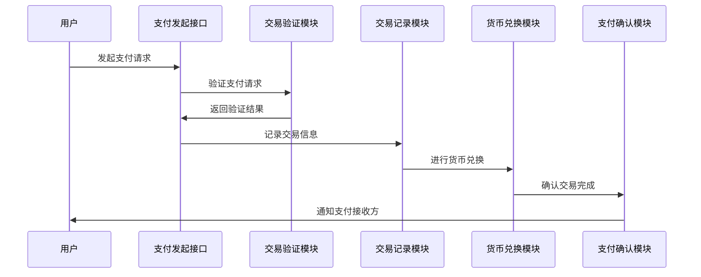

                 

### 背景介绍

#### 第一部分：区块链在跨境支付中的应用：降低国际汇款成本

##### 1.1 跨境支付与区块链技术概述

跨境支付是指在两个或两个以上的国家或地区之间进行货币转移的行为。随着全球化进程的加速，跨境支付已成为国际贸易和金融活动的重要组成部分。然而，传统的跨境支付系统存在诸多问题，如交易成本高、处理时间长、透明度低等。这些问题不仅影响了用户体验，还增加了企业的运营成本。

区块链技术，作为一种分布式账本技术，具有去中心化、不可篡改、透明性强等特性，近年来在金融领域得到了广泛关注。特别是随着比特币等加密货币的兴起，区块链技术在跨境支付中的应用逐渐成为研究热点。

本篇文章将以区块链在跨境支付中的应用为核心，探讨如何利用区块链技术降低国际汇款成本，提高交易效率，增强交易透明度。文章将从以下几个方面展开：

- **1.1.1 跨境支付的问题背景**：介绍传统跨境支付系统中存在的问题，如交易成本高、处理时间长、透明度低等。
- **1.1.2 问题描述**：具体阐述传统跨境支付系统的不足之处。
- **1.1.3 问题解决**：探讨区块链技术如何解决传统跨境支付中的问题。
- **1.1.4 边界与外延**：讨论区块链在跨境支付中的应用范围和局限性。

##### 1.2 区块链技术的基本概念

区块链技术是一种分布式数据库技术，通过加密算法和共识机制确保数据的不可篡改性和透明性。区块链由一系列按时间顺序排列的数据块组成，每个数据块都包含一定数量的交易记录。这些交易记录一旦被确认，就永久存储在区块链上，无法被篡改。

区块链的核心特点包括：

- **去中心化**：区块链不需要中央机构进行管理，所有节点都可以参与网络的维护和交易验证。
- **不可篡改**：区块链上的数据一旦被确认，就永久存储，无法被篡改。
- **透明性强**：区块链上的所有交易记录都是公开透明的，任何人都可以查看。

区块链的架构主要包括三个核心组成部分：

- **区块**：区块是区块链的基本单元，包含一定数量的交易记录。
- **链**：链是按时间顺序排列的区块集合，每个区块都包含前一个区块的哈希值，确保区块链的完整性。
- **节点**：节点是参与区块链网络的计算机，负责验证交易、维护区块链的状态。

##### 1.3 区块链在跨境支付中的应用

区块链在跨境支付中具有显著的优势，主要体现在以下几个方面：

- **降低交易成本**：区块链的去中心化特性减少了中间环节，降低了交易成本。
- **提高交易速度**：区块链的分布式架构和共识机制加快了交易处理速度，提高了交易效率。
- **增强交易透明度**：区块链上的所有交易记录都是公开透明的，有助于提高交易信任度。
- **提高安全性**：区块链的加密算法和共识机制确保了交易的安全性。

然而，区块链在跨境支付中也面临一些挑战，如跨链互操作性问题、法律和监管政策的不确定性等。这些问题需要通过技术创新和政策支持来解决。

##### 1.4 本书结构安排

本篇文章分为五个部分：

- **第一部分：背景介绍**：介绍跨境支付和区块链技术的基本概念，阐述区块链在跨境支付中的应用优势。
- **第二部分：核心概念与联系**：详细探讨区块链与跨境支付的核心概念，进行概念属性特征对比，并绘制ER实体关系图。
- **第三部分：算法原理讲解**：讲解区块链在跨境支付中的应用算法，包括算法原理、流程、数学模型和举例说明。
- **第四部分：系统分析与架构设计方案**：分析跨境支付区块链系统的设计，包括问题场景介绍、项目介绍、系统功能设计、系统架构设计和系统交互。
- **第五部分：项目实战**：通过实际案例分析和详细讲解，展示区块链在跨境支付中的应用效果。

本文旨在通过逻辑清晰、结构紧凑、简单易懂的叙述方式，帮助读者深入理解区块链在跨境支付中的应用，并为相关研究和实践提供参考。

---

通过上述内容，我们对区块链在跨境支付中的应用有了初步的了解。接下来，我们将深入探讨区块链与跨境支付之间的核心概念，以及如何利用区块链技术解决跨境支付中的关键问题。敬请期待！

## 第一部分：背景介绍

### 第1章: 跨境支付与区块链技术概述

#### 1.1 跨境支付的问题背景

跨境支付作为国际贸易和金融活动的重要组成部分，其便捷性和效率直接关系到国际经济的稳定与发展。然而，传统跨境支付系统在运行过程中面临诸多问题，主要体现在以下几个方面：

**1.1.1 问题背景**

首先，传统跨境支付系统往往依赖于中央金融机构或第三方支付机构，这些机构作为中介环节，不仅增加了交易成本，还可能导致交易延迟。例如，根据国际支付协会（SWIFT）的数据，全球跨境支付的平均处理时间约为3个工作日，而在某些情况下，处理时间甚至可能长达一周。这种长时间的交易延迟对企业的现金流管理产生了不利影响。

其次，跨境支付的费用相对较高。根据国际货币基金组织（IMF）的统计数据，跨境支付的费用通常占交易金额的0.5%到5%，这比国内支付的费用要高出许多。高额的交易成本不仅增加了企业的财务负担，也限制了国际贸易的规模和频率。

此外，传统跨境支付系统的透明度较低，存在一定的安全隐患。跨境支付过程中的资金流动较为复杂，涉及多个金融机构和中介机构，这使得资金流向难以追踪。例如，洗钱、欺诈等非法活动往往利用跨境支付系统的漏洞进行资金转移。此外，由于缺乏透明度，跨境支付中的资金到达时间、费用结构等信息不透明，给用户带来了不便和困扰。

**1.1.2 问题描述**

针对上述问题，传统跨境支付系统存在以下几方面的不足：

1. **交易成本高**：由于跨境支付需要通过多个中介机构，每个中介机构都要收取一定的手续费，导致整体交易成本较高。此外，长处理时间也增加了企业的财务成本。

2. **交易速度慢**：跨境支付涉及多个国家和地区的金融机构，交易处理时间较长。这不仅影响了企业的现金流管理，也限制了国际贸易的灵活性和效率。

3. **透明度低**：跨境支付过程涉及多个中介机构，资金流动路径复杂，信息不透明，导致用户难以了解交易的具体细节。此外，透明度低也为洗钱、欺诈等非法活动提供了可乘之机。

4. **安全性问题**：传统跨境支付系统依赖中心化的金融机构和第三方支付机构，这些机构的系统安全性可能存在漏洞，容易受到黑客攻击。此外，跨境支付过程中涉及大量敏感信息，如账户信息、交易信息等，这些信息的安全保护也是一个亟待解决的问题。

**1.1.3 问题解决**

为了解决传统跨境支付系统中的问题，引入区块链技术提供了一种新的思路。区块链技术具有去中心化、不可篡改、透明性强等特点，可以有效地降低交易成本、提高交易速度、增强交易透明度和安全性。

首先，区块链的去中心化特性消除了传统跨境支付系统中的中介环节，降低了交易成本。在区块链网络中，所有节点都可以参与交易验证和账本维护，无需依赖中心化的金融机构。这意味着跨境支付不再需要支付高额的中介费用，从而降低了整体交易成本。

其次，区块链的分布式架构和共识机制加快了交易处理速度。在区块链网络中，交易记录被即时广播到所有节点，并迅速得到验证和确认。这意味着跨境支付可以在很短的时间内完成，大大提高了交易效率。

此外，区块链的透明性特点增强了跨境支付的透明度。区块链上的所有交易记录都是公开透明的，任何人都可以查看。这使得跨境支付过程更加透明，用户可以清楚地了解交易的具体细节，减少了信息不对称的问题。同时，透明性也提高了交易信任度，降低了洗钱、欺诈等非法活动的风险。

最后，区块链的加密算法和共识机制提高了跨境支付的安全性。区块链的加密算法确保了交易数据的保密性和完整性，防止黑客攻击和数据篡改。共识机制确保了区块链网络的稳定性和可靠性，防止恶意节点篡改账本数据。

**1.1.4 边界与外延**

虽然区块链技术在跨境支付中具有显著的优势，但同时也存在一定的边界和局限性。

首先，区块链技术的成熟度和普及度仍有待提高。虽然区块链技术已经在金融、供应链管理等领域得到广泛应用，但在跨境支付领域的应用仍处于探索阶段。技术成熟度和普及度较低可能导致实际应用中的问题和挑战。

其次，区块链技术的跨链互操作性问题尚未完全解决。跨境支付往往涉及多个区块链网络，如何实现不同区块链网络之间的互操作性和数据共享仍是一个挑战。

此外，法律和监管政策的不确定性也是区块链在跨境支付中面临的一个重要问题。不同国家和地区对区块链技术和加密货币的监管政策存在差异，这可能导致跨境支付的法律风险和合规问题。

总之，区块链技术为解决传统跨境支付系统中的问题提供了一种新的思路。通过去中心化、分布式架构、加密算法和共识机制，区块链技术可以有效降低交易成本、提高交易速度、增强交易透明度和安全性。然而，区块链技术在跨境支付中的应用仍面临一定的挑战和限制，需要进一步的研究和探索。

#### 1.2 区块链技术的基本概念

区块链技术作为一种分布式账本技术，其核心在于通过去中心化的方式实现数据的存储和传输。要深入理解区块链在跨境支付中的应用，首先需要了解区块链技术的基本概念和原理。

**1.2.1 区块链的定义**

区块链是一个由多个按时间顺序排列的数据块（区块）组成的分布式数据库。每个区块包含一定数量的交易记录，这些交易记录经过加密和验证后，被永久存储在区块链上。区块链的每个区块都包含一个时间戳、一个唯一的哈希值以及前一个区块的哈希值。这种链式结构确保了区块链的完整性和不可篡改性。

区块链的定义可以从以下几个方面来理解：

- **分布式数据库**：区块链不再依赖于中心化的数据库管理系统，而是通过分布式网络中的多个节点共同维护和更新数据。每个节点都存储一份完整的区块链副本，这使得数据具有高度的可信度和抗攻击性。
- **去中心化**：区块链网络中的每个节点都可以参与交易验证和数据存储，无需依赖中心化的机构。这意味着区块链网络具有更高的抗风险能力和更低的运营成本。
- **不可篡改**：区块链上的数据一旦被确认并写入区块，就永久存储，无法被篡改。这种不可篡改的特性确保了数据的真实性和可靠性。

**1.2.2 区块链的核心特点**

区块链技术具有以下核心特点：

- **去中心化**：区块链的去中心化特性使其不再依赖于中心化的机构或第三方进行数据管理和交易验证。每个节点都可以参与区块链网络的维护和交易验证，从而实现去中心化的数据管理和交易处理。
- **不可篡改**：区块链上的数据一旦被写入区块，就永久存储，无法被篡改。这种不可篡改的特性确保了数据的真实性和可靠性，避免了数据被篡改的风险。
- **透明性**：区块链上的所有交易记录都是公开透明的，任何人都可以查看和验证。这种透明性提高了交易的透明度和信任度，减少了信息不对称和欺诈行为。
- **安全性**：区块链采用加密算法和共识机制，确保交易数据的保密性和完整性。加密算法确保了交易数据在传输过程中的安全性，防止黑客攻击和数据篡改。共识机制确保了区块链网络的稳定性和可靠性，防止恶意节点篡改账本数据。
- **分布式架构**：区块链采用分布式架构，每个节点都存储一份完整的区块链副本。这种分布式架构提高了系统的容错性和抗攻击性，确保了区块链网络的稳定运行。

**1.2.3 区块链的架构**

区块链的架构主要包括三个核心组成部分：区块、链和节点。

- **区块**：区块是区块链的基本单元，包含一定数量的交易记录。每个区块都有一个时间戳、一个唯一的哈希值以及前一个区块的哈希值。区块通过链式结构连接起来，形成一个完整的区块链。
- **链**：链是按时间顺序排列的区块集合，每个区块都包含前一个区块的哈希值，确保区块链的完整性和不可篡改性。链式结构使得区块链具有高度的可靠性和安全性。
- **节点**：节点是参与区块链网络的计算机，负责验证交易、存储和传播区块链数据。节点通过加密算法和共识机制确保交易数据的真实性和可靠性。区块链网络中的每个节点都可以参与交易验证和数据存储，从而实现去中心化的数据管理和交易处理。

**1.2.4 区块链的工作原理**

区块链的工作原理主要包括以下步骤：

1. **交易发起**：用户在区块链网络中发起一笔交易，并将其广播到整个网络。
2. **交易验证**：节点接收到交易后，通过加密算法验证交易的有效性。验证通过后，交易将被添加到节点的本地交易池中。
3. **区块构建**：矿工（节点）从交易池中选择一定数量的交易记录，构建一个新的区块。区块构建过程中，矿工需要计算一个难度值，使得区块的哈希值满足一定的条件。
4. **区块广播**：矿工将构建的区块广播到整个网络，其他节点接收到区块后，会验证区块的有效性。
5. **区块确认**：当大多数节点验证通过并确认区块后，该区块将被添加到区块链中，交易记录也被永久存储。

通过上述步骤，区块链网络实现了去中心化的数据管理和交易处理。区块链的工作原理确保了数据的真实性和可靠性，同时避免了单点故障和中心化风险。

**1.2.5 区块链的分类**

区块链技术根据其应用场景和特点可以分为以下几类：

- **公有区块链**：公有区块链是一个完全去中心化的区块链，任何人都可以参与网络维护和交易验证。公有区块链具有高度的去中心化和开放性，适合用于公共领域的数据管理和交易处理。
- **私有区块链**：私有区块链是一个部分去中心化的区块链，只有特定的节点可以参与网络维护和交易验证。私有区块链适用于企业内部或特定组织的数据管理和交易处理，具有更高的安全性和可控性。
- **联盟区块链**：联盟区块链是一个部分去中心化的区块链，由一组特定的节点组成。联盟区块链适用于跨企业或跨组织的数据管理和交易处理，具有较高的信任度和协作性。

**1.2.6 区块链的应用领域**

区块链技术在金融、供应链管理、物联网、医疗等多个领域具有广泛的应用前景：

- **金融领域**：区块链技术可以应用于跨境支付、证券交易、保险等领域，提高交易效率、降低成本、增强安全性。
- **供应链管理**：区块链技术可以用于供应链的全程跟踪和管理，提高供应链的透明度和效率。
- **物联网**：区块链技术可以用于物联网设备的数据管理和安全认证，提高物联网系统的可靠性。
- **医疗领域**：区块链技术可以用于医疗数据的管理和共享，提高医疗服务的透明度和安全性。

**1.2.7 区块链的优势与挑战**

区块链技术具有以下优势：

- **降低成本**：区块链的去中心化特性减少了中间环节和中介费用，降低了交易成本。
- **提高效率**：区块链的分布式架构和共识机制加快了交易处理速度，提高了交易效率。
- **增强透明度**：区块链上的所有交易记录都是公开透明的，提高了交易透明度。
- **提高安全性**：区块链的加密算法和共识机制确保了交易数据的保密性和完整性，提高了交易安全性。

然而，区块链技术也面临一些挑战：

- **技术成熟度**：区块链技术的成熟度和普及度仍有待提高，实际应用中可能出现技术瓶颈和问题。
- **跨链互操作性**：不同区块链网络之间的互操作性和数据共享仍是一个挑战，需要进一步的研究和解决方案。
- **法律和监管政策**：不同国家和地区对区块链技术和加密货币的监管政策存在差异，可能导致法律和合规问题。

总之，区块链技术作为一种新兴的分布式账本技术，具有广泛的应用前景和巨大的潜力。通过深入理解和应用区块链技术，我们可以解决传统跨境支付系统中的问题，提高交易效率、降低成本、增强安全性，推动国际金融和贸易的发展。

### 1.3 区块链在跨境支付中的应用

区块链技术在跨境支付中的应用逐渐成为一种解决方案，旨在解决传统跨境支付系统中存在的问题。以下将从区块链在跨境支付中的优势、应用场景、面临的挑战与机遇三个方面进行详细探讨。

**1.3.1 区块链在跨境支付中的优势**

1. **降低交易成本**：区块链的去中心化特性使得跨境支付不再依赖于中介机构，减少了交易过程中的手续费和其他相关费用。传统的跨境支付需要通过银行、第三方支付平台等中介机构进行交易，每个机构都要收取一定的手续费。而区块链网络中的交易费用相对较低，部分系统甚至可以实现零手续费。这种降低的交易成本对于中小企业和个体商户尤其具有吸引力，可以大大减轻他们的财务负担。

2. **提高交易速度**：传统跨境支付系统通常需要多个中介机构进行交易验证和资金转移，导致交易处理时间较长。而区块链技术通过分布式架构和共识机制，可以实现交易记录的实时确认和传输。交易记录一旦被确认，就会被永久存储在区块链上，无需经过多个中介环节。例如，比特币网络中的交易确认时间通常为10分钟左右，而一些定制化的区块链支付系统甚至可以实现秒级确认。这种提高的交易速度对于国际贸易和金融活动具有重要意义，可以大大缩短资金到账时间，提高资金利用率。

3. **增强交易透明度**：区块链上的所有交易记录都是公开透明的，任何人都可以查看和验证。这种透明性有助于提高跨境支付系统的信任度和透明度，减少了信息不对称和欺诈行为。例如，通过区块链技术，用户可以清楚地了解交易的具体细节，如交易金额、交易时间、交易双方等，从而提高了交易的透明度和可追溯性。

4. **提高安全性**：区块链技术采用加密算法和共识机制，确保交易数据的保密性和完整性。加密算法可以保护交易数据在传输过程中的安全性，防止黑客攻击和数据篡改。共识机制则确保了区块链网络的稳定性和可靠性，防止恶意节点篡改账本数据。此外，区块链的分布式架构提高了系统的抗攻击性和容错性，使得整个支付系统更加安全可靠。

**1.3.2 区块链在跨境支付中的应用场景**

1. **点对点支付**：点对点支付是区块链技术在跨境支付中最直接的应用场景。通过区块链网络，用户可以直接将资金从一个国家或地区转移到另一个国家或地区，无需依赖中介机构。这种点对点支付模式不仅降低了交易成本，还提高了交易速度和透明度。例如，比特币和莱特币等加密货币已经实现了全球范围内的点对点支付，用户可以通过区块链网络实现实时转账和支付。

2. **跨境汇款**：传统的跨境汇款通常需要通过银行或其他金融机构进行交易，导致处理时间较长、手续费较高。而区块链技术可以为跨境汇款提供更高效、更经济的解决方案。一些区块链支付平台已经实现了跨境汇款功能，用户可以通过区块链网络将资金从一个账户转移到另一个账户，无需经过中介机构。这种跨境汇款模式不仅降低了交易成本，还提高了交易速度和透明度。

3. **供应链金融**：区块链技术在供应链金融中也有广泛应用。通过区块链网络，供应链中的各个参与者可以实时共享交易信息和资金流动情况，提高供应链的透明度和效率。例如，区块链技术可以用于实现供应链中的应收账款融资、信用保险等金融业务，降低企业的融资成本，提高资金利用率。

4. **跨境贸易融资**：区块链技术在跨境贸易融资中也有显著优势。通过区块链网络，金融机构可以实时验证交易信息和资金流动情况，提高融资效率和透明度。例如，区块链技术可以用于实现跨境贸易融资中的信用证、保函等业务，降低贸易融资的风险和成本。

**1.3.3 区块链在跨境支付中的挑战与机遇**

1. **技术成熟度**：虽然区块链技术具有巨大的潜力，但其成熟度和普及度仍有待提高。目前，区块链技术仍处于发展阶段，存在一定的技术瓶颈和问题。例如，区块链网络的性能、可扩展性、安全性等方面仍需进一步优化。此外，区块链技术的普及和应用也需要时间和市场的培育。

2. **跨链互操作性**：跨境支付往往涉及多个区块链网络，如何实现不同区块链网络之间的互操作性和数据共享是一个挑战。目前，跨链技术尚处于探索阶段，尚未形成成熟的技术方案和标准。

3. **法律和监管政策**：区块链技术和加密货币在不同国家和地区的监管政策存在差异，可能导致法律和合规问题。例如，一些国家已经对加密货币和区块链技术进行了严格监管，而其他国家则相对宽松。这种法律和监管政策的不确定性可能对区块链在跨境支付中的应用产生一定的影响。

4. **市场接受度**：尽管区块链技术在跨境支付中具有显著优势，但其市场接受度仍有待提高。传统金融机构和支付机构对区块链技术的接受程度相对较低，可能导致区块链在跨境支付中的应用受到一定的限制。

然而，随着区块链技术的不断发展和成熟，以及市场对区块链技术的接受度逐渐提高，区块链在跨境支付中的应用将面临更多的机遇：

1. **技术创新**：随着区块链技术的不断演进，其性能、可扩展性和安全性将得到显著提升，为跨境支付提供更可靠、更高效的解决方案。

2. **政策支持**：随着各国政府对区块链技术和加密货币的重视程度逐渐提高，相关政策将逐步完善，为区块链在跨境支付中的应用提供更加稳定和有利的环境。

3. **市场培育**：随着区块链技术的普及和应用，市场对区块链技术的认知和接受度将逐渐提高，为区块链在跨境支付中的应用创造更大的市场空间。

总之，区块链技术在跨境支付中的应用具有巨大的潜力，可以有效降低交易成本、提高交易速度、增强交易透明度和安全性。然而，区块链技术在实际应用中也面临一定的挑战和机遇，需要通过技术创新、政策支持和市场培育等多方面的努力来推动其发展和应用。

### 1.4 本书结构安排

为了帮助读者全面了解区块链在跨境支付中的应用，本书分为五个部分，每个部分都涵盖不同的主题和内容。以下是本书的结构安排和各部分的主要内容：

**第一部分：背景介绍**

本部分主要介绍跨境支付和区块链技术的基本概念，包括传统跨境支付系统存在的问题、区块链技术的定义和特点，以及区块链在跨境支付中的优势和应用。通过这一部分的介绍，读者可以初步了解区块链技术在跨境支付中的应用背景和意义。

**第二部分：核心概念与联系**

本部分深入探讨区块链与跨境支付的核心概念，包括跨境支付的相关概念、区块链的相关概念，以及区块链在跨境支付中的角色和优势。此外，本部分还将通过概念属性特征对比表格和ER实体关系图，帮助读者更好地理解区块链与跨境支付的关联性。

**第三部分：算法原理讲解**

本部分将详细讲解区块链在跨境支付中的应用算法，包括算法的原理、流程、数学模型和举例说明。通过本部分的讲解，读者可以掌握区块链在跨境支付中的应用算法，并理解其背后的技术原理。

**第四部分：系统分析与架构设计方案**

本部分将分析跨境支付区块链系统的设计，包括问题场景介绍、项目介绍、系统功能设计、系统架构设计和系统交互。通过本部分的讲解，读者可以了解区块链在跨境支付系统中的具体实现方式和架构设计。

**第五部分：项目实战**

本部分将通过实际案例分析和详细讲解，展示区块链在跨境支付中的应用效果。读者可以通过本部分的内容，了解区块链在跨境支付中的实际应用场景和操作流程。

通过以上五个部分的详细讲解，读者可以系统地掌握区块链在跨境支付中的应用知识，为相关研究和实践提供参考。

#### 1.4.1 各章节内容概述

在本章节中，我们首先介绍了跨境支付和区块链技术的基本概念，并分析了传统跨境支付系统存在的问题，如交易成本高、处理时间长、透明度低等。随后，我们详细阐述了区块链技术的定义、特点和应用优势，特别是在跨境支付领域中的应用。通过这些背景介绍，读者可以对区块链技术在跨境支付中的潜在价值有一个初步的认识。

接下来的章节将进一步深入探讨区块链与跨境支付的核心概念，包括跨境支付的过程、关键问题和区块链技术的相关概念、特点及架构。通过概念属性特征对比表格和ER实体关系图，我们将帮助读者理解区块链技术在跨境支付中的具体应用场景和优势。

在第三部分，我们将讲解区块链在跨境支付中的应用算法，包括算法的原理、流程、数学模型和举例说明。这部分内容将帮助读者掌握区块链在跨境支付中如何实际操作和应用。

第四部分将分析跨境支付区块链系统的设计，涵盖问题场景介绍、项目介绍、系统功能设计、系统架构设计和系统交互。这部分内容将帮助读者理解区块链在跨境支付系统中的具体实现方式和架构设计。

最后，在第五部分，我们将通过实际案例分析和详细讲解，展示区块链在跨境支付中的应用效果。这部分内容将为读者提供实际操作的经验和参考，帮助读者更好地理解区块链在跨境支付中的应用。

#### 1.4.2 主要内容与目标读者

本章节的主要内容涵盖了区块链在跨境支付中的应用，从背景介绍、核心概念、算法原理到系统设计与项目实战，为读者提供了一个全面而系统的了解。以下是本章节的主要内容和目标读者：

**主要内容：**
1. 跨境支付与区块链技术的基本概念和问题背景。
2. 区块链技术的定义、特点和应用优势。
3. 区块链与跨境支付的核心概念和关联。
4. 区块链在跨境支付中的应用算法和数学模型。
5. 跨境支付区块链系统的设计分析和实现。
6. 区块链在跨境支付中的应用案例分析和实战操作。

**目标读者：**
1. 对区块链和跨境支付感兴趣的技术人员、研发人员和管理人员。
2. 金融领域从业者和研究人员，特别是涉及国际支付、跨境贸易的从业者。
3. 对新兴技术有强烈好奇心，希望了解区块链技术在现实应用中的大学生和研究学者。
4. 从事区块链项目开发和实施的企业家和项目经理。

通过本章节的学习，目标读者可以全面了解区块链技术在跨境支付中的应用，掌握相关核心概念和算法，了解系统设计与实施过程，并为实际项目提供参考。

### 第二部分：核心概念与联系

#### 第2章: 区块链与跨境支付的核心概念

区块链与跨境支付的结合，为传统跨境支付系统带来了新的解决方案。要深入理解这一结合，我们首先需要明确两者的核心概念，并探讨它们之间的关联。

#### 2.1 跨境支付相关概念

**2.1.1 跨境支付的定义**

跨境支付是指在国际间进行货币转移的行为。它涉及到不同国家或地区之间的货币兑换和资金传递。跨境支付通常包括以下环节：

1. **支付指令的生成**：支付发起方通过银行、第三方支付平台或其他金融机构生成支付指令。
2. **支付指令的传输**：支付指令通过网络传输到接收方的银行或支付机构。
3. **货币兑换**：跨境支付过程中可能涉及货币兑换，即将一种货币兑换成另一种货币。
4. **支付确认与结算**：支付接收方确认收到资金，并完成结算。

**2.1.2 跨境支付的过程**

跨境支付的过程通常涉及以下步骤：

1. **支付发起**：支付发起方通过银行或支付平台发起跨境支付请求。
2. **交易确认**：支付请求被接收方银行或支付平台接收，并开始交易确认过程。
3. **货币兑换**：如果涉及货币兑换，支付发起方需要将本国货币兑换成接收方的货币。
4. **资金转移**：支付发起方的资金通过银行间清算系统转移到接收方的账户。
5. **支付确认**：接收方确认收到资金，支付过程结束。

**2.1.3 跨境支付的关键问题**

跨境支付存在以下关键问题：

1. **交易成本高**：由于涉及多个中介机构和货币兑换，跨境支付的费用相对较高。
2. **处理时间长**：跨境支付涉及多个金融机构和清算系统，交易处理时间较长。
3. **透明度低**：跨境支付过程的信息不透明，用户难以了解交易的具体细节。
4. **安全性问题**：跨境支付过程中涉及大量敏感信息，存在一定的安全风险。

**2.2 区块链相关概念**

**2.2.1 区块链的定义**

区块链是一种分布式数据库技术，通过加密算法和共识机制实现数据的存储和传输。区块链的基本单位是区块，每个区块包含一定数量的交易记录。这些区块按照时间顺序链接成一个链条，形成一个不可篡改的账本。

**2.2.2 区块链的核心特点**

区块链具有以下核心特点：

1. **去中心化**：区块链不再依赖中心化的机构进行数据管理和交易验证，所有节点都可以参与网络的维护和交易验证。
2. **不可篡改**：区块链上的数据一旦被确认，就永久存储，无法被篡改。
3. **透明性**：区块链上的所有交易记录都是公开透明的，任何人都可以查看。
4. **安全性**：区块链采用加密算法和共识机制，确保交易数据的保密性和完整性。

**2.2.3 区块链的技术架构**

区块链的技术架构主要包括以下三个部分：

1. **区块**：区块是区块链的基本单元，包含一定数量的交易记录。每个区块都有一个时间戳、一个唯一的哈希值以及前一个区块的哈希值。
2. **链**：链是按时间顺序排列的区块集合，每个区块都包含前一个区块的哈希值，确保区块链的完整性和不可篡改性。
3. **节点**：节点是参与区块链网络的计算机，负责验证交易、存储和传播区块链数据。节点通过加密算法和共识机制确保交易数据的真实性和可靠性。

**2.3 区块链与跨境支付的关联**

**2.3.1 区块链在跨境支付中的角色**

区块链在跨境支付中扮演着重要角色，主要体现在以下几个方面：

1. **去中心化**：区块链的去中心化特性减少了跨境支付中的中介环节，降低了交易成本和风险。
2. **不可篡改**：区块链上的交易记录一旦被确认，就永久存储，无法被篡改，确保了跨境支付的数据真实性和可靠性。
3. **透明性**：区块链上的所有交易记录都是公开透明的，提高了跨境支付的透明度和信任度。
4. **安全性**：区块链的加密算法和共识机制确保了跨境支付的安全性，防止黑客攻击和数据篡改。

**2.3.2 区块链与跨境支付的融合优势**

区块链与跨境支付的结合具有以下融合优势：

1. **降低交易成本**：区块链的去中心化特性减少了中介机构，降低了交易成本。
2. **提高交易速度**：区块链的分布式架构和共识机制加快了交易处理速度，提高了交易效率。
3. **增强透明度**：区块链上的所有交易记录都是公开透明的，提高了交易的透明度和信任度。
4. **提高安全性**：区块链的加密算法和共识机制确保了交易数据的安全性和完整性。

**2.3.3 区块链在跨境支付中的角色**

区块链在跨境支付中扮演着关键角色，主要体现在以下几个方面：

1. **交易验证**：区块链通过共识机制确保交易记录的真实性和可靠性，防止欺诈行为。
2. **去中心化**：区块链的去中心化特性使得跨境支付不再依赖于中介机构，提高了交易效率和安全性。
3. **透明性**：区块链上的所有交易记录都是公开透明的，提高了跨境支付的透明度和信任度。
4. **降低成本**：区块链技术降低了跨境支付的交易成本，为中小企业和个体商户提供了更经济的解决方案。

通过以上对区块链与跨境支付的核心概念及其关联的探讨，我们可以看到，区块链技术为跨境支付提供了一种全新的解决方案，有助于降低交易成本、提高交易速度、增强交易透明度和安全性。接下来，我们将进一步分析区块链与跨境支付的概念属性特征，并通过ER实体关系图展示它们之间的联系。

### 2.3 区块链与跨境支付的关联

区块链与跨境支付的结合，为传统跨境支付系统带来了新的解决方案，二者在概念上具有密切的联系。以下将通过概念属性特征对比表格和ER实体关系图，详细展示区块链与跨境支付之间的关联性。

#### 2.3.1 概念属性特征对比表格

首先，我们通过概念属性特征对比表格，对区块链和跨境支付的基本概念、特点及其在跨境支付中的角色进行对比。

| 特征          | 区块链                      | 跨境支付                    | 对比分析                                      |
|---------------|----------------------------|-----------------------------|-----------------------------------------------|
| 基本概念      | 分布式数据库技术            | 国际货币转移行为            | 区块链是用于存储和传输数据的分布式账本，跨境支付是跨国货币转移行为 |
| 核心特点      | 去中心化、不可篡改、透明性  | 交易成本高、处理时间长、透明度低  | 区块链的去中心化和不可篡改特性可降低跨境支付成本和风险           |
| 应用优势      | 降低交易成本、提高交易速度、增强安全性  | 提高透明度、降低交易风险、加快资金流动  | 区块链与跨境支付结合可提高交易效率和安全性                           |
| 技术架构      | 区块、链、节点               | 金融机构、银行、支付平台           | 区块链通过分布式架构实现去中心化，跨境支付通过金融机构实现货币转移   |
| 关联性        | 分布式账本技术用于跨境支付   | 区块链技术用于优化跨境支付流程       | 区块链技术为跨境支付提供了透明、高效和安全的解决方案               |

通过对比表格，我们可以看到区块链与跨境支付在概念、特点和应用优势上具有显著的互补性。区块链的去中心化、不可篡改和透明性特点，可以解决跨境支付中的交易成本高、处理时间长和透明度低等问题。

#### 2.3.2 ER实体关系图架构

为了更直观地展示区块链与跨境支付之间的关联，我们可以通过ER（实体关系）实体关系图来描述它们之间的联系。以下是一个简化的ER实体关系图：

```mermaid
erDiagram
    支付请求 ||--o{ 跨境支付系统 }|-- 用户 A
    支付请求 ||--o{ 跨境支付系统 }|-- 用户 B
    支付请求 ||--o{ 区块链网络 }| 用户 C
    区块链网络 ||--o{ 交易记录 }| 支付请求
    跨境支付系统 ||--o{ 货币兑换 }| 区块链网络
    跨境支付系统 ||--o{ 支付确认 }| 区块链网络
```

在这个ER实体关系图中，我们可以看到以下实体及其关系：

1. **支付请求**：表示跨境支付过程中的请求信息，包括支付发起方、支付金额和支付接收方等。
2. **跨境支付系统**：表示处理跨境支付请求的实体，包括银行、第三方支付平台等。跨境支付系统与支付请求和区块链网络有关联。
3. **区块链网络**：表示区块链系统，用于存储和验证交易记录。区块链网络与支付请求和跨境支付系统有关联。
4. **交易记录**：表示区块链上的交易记录，包括交易金额、交易时间和交易双方等。
5. **货币兑换**：表示跨境支付过程中涉及的货币兑换操作，由跨境支付系统和区块链网络共同完成。
6. **支付确认**：表示交易完成后，支付接收方对交易进行确认的操作。

通过ER实体关系图，我们可以清晰地看到区块链与跨境支付之间的互动关系。区块链网络通过存储和验证交易记录，提高了跨境支付的透明度和安全性。跨境支付系统则通过区块链网络实现货币兑换和支付确认，降低了交易成本和风险。

#### 2.3.3 概念关联分析与联系

通过对概念属性特征对比表格和ER实体关系图的分析，我们可以得出以下结论：

1. **互补性**：区块链与跨境支付在概念、特点和应用优势上具有互补性。区块链的去中心化、不可篡改和透明性特点，可以弥补跨境支付系统在交易成本、处理时间和透明度方面的不足。

2. **协同作用**：区块链与跨境支付的结合，可以发挥协同作用，提高跨境支付系统的效率和安全性。区块链技术为跨境支付提供了高效、安全、透明的解决方案，而跨境支付则为区块链技术的应用场景提供了实际需求。

3. **技术演进**：随着区块链技术的不断发展和成熟，其在跨境支付中的应用将越来越广泛。未来，区块链技术可能会进一步优化跨境支付系统，降低交易成本、提高交易速度和增强安全性。

4. **挑战与机遇**：虽然区块链在跨境支付中的应用具有巨大的潜力，但同时也面临一些挑战，如技术成熟度、跨链互操作性和法律监管政策等。只有通过技术创新、政策支持和市场培育，才能充分发挥区块链在跨境支付中的作用。

总之，区块链与跨境支付的结合，为传统跨境支付系统带来了新的解决方案，有助于降低交易成本、提高交易速度、增强交易透明度和安全性。通过深入理解和应用区块链技术，我们可以进一步优化跨境支付系统，推动国际金融和贸易的发展。

### 第3章: 区块链在跨境支付中的应用算法

#### 3.1 算法概述

区块链技术在跨境支付中的应用，离不开一系列算法的支持。这些算法不仅实现了区块链的核心功能，还优化了跨境支付流程，提高了交易效率和安全性。本节将介绍区块链在跨境支付中的应用算法，包括算法的定义、目标以及在实际应用中的重要性。

**算法定义**：区块链应用算法是指用于实现区块链功能的一系列计算规则和方法。这些算法包括共识算法、加密算法、签名算法等，它们共同确保区块链的不可篡改性、透明性和安全性。

**算法目标**：区块链应用算法的主要目标包括：

1. **确保数据不可篡改**：通过加密算法和共识机制，确保区块链上的数据一旦被确认，就无法被篡改。
2. **提高交易速度**：通过优化共识算法和分布式架构，加快交易处理速度，减少交易等待时间。
3. **增强交易透明度**：通过公开透明地记录交易信息，提高交易的可追溯性和信任度。
4. **提高安全性**：通过加密算法和共识机制，确保交易数据的保密性和完整性，防止黑客攻击和数据泄露。

**算法重要性**：区块链应用算法是区块链技术的重要组成部分，对跨境支付系统具有至关重要的作用。它们不仅决定了区块链的性能和安全性，还直接影响跨境支付系统的效率、成本和用户体验。

#### 3.2 算法原理与流程

区块链在跨境支付中的应用算法主要包括以下几类：

1. **共识算法**：共识算法是区块链网络中的核心算法，用于确保所有节点对账本状态的一致性。常见的共识算法有工作量证明（Proof of Work, PoW）、权益证明（Proof of Stake, PoS）和委托权益证明（Delegated Proof of Stake, DPoS）等。以下以PoW算法为例，介绍其原理与流程。

   **原理**：PoW算法通过计算一个难题来确保区块链的安全性。矿工（节点）需要通过大量计算找到一个符合要求的哈希值，这个哈希值使得新区块的创建难度满足特定条件。一旦矿工找到满足条件的哈希值，新区块就被创建，并将其添加到区块链中。

   **流程**：
   1. **难题设置**：网络设置一个难题，矿工需要计算一个哈希值，使得该哈希值小于特定阈值。
   2. **计算过程**：矿工使用算力不断尝试计算哈希值，直到找到一个满足难题要求的哈希值。
   3. **验证和确认**：其他节点验证矿工计算出的哈希值，确保其符合难题要求。一旦验证通过，新区块将被添加到区块链上，交易记录也被确认。

2. **加密算法**：加密算法用于确保区块链交易数据的保密性和完整性。常见的加密算法有对称加密（如AES）和非对称加密（如RSA）等。

   **原理**：对称加密使用相同的密钥进行加密和解密，非对称加密使用一对密钥（公钥和私钥）进行加密和解密。区块链中的加密算法通常用于保护交易数据不被未授权访问，以及确保交易数据的完整性。

   **流程**：
   1. **密钥生成**：生成一对密钥，包括公钥和私钥。
   2. **加密过程**：使用公钥对交易数据进行加密。
   3. **解密过程**：使用私钥对加密后的交易数据进行解密。

3. **签名算法**：签名算法用于验证交易发起者的身份和交易的合法性。

   **原理**：签名算法通过数字签名技术，确保交易发起者的身份和交易内容的真实性。数字签名使用私钥生成，使用公钥验证。

   **流程**：
   1. **签名生成**：交易发起者使用私钥对交易数据进行签名。
   2. **签名验证**：交易接收者使用公钥验证交易发起者的数字签名。

#### 3.3 数学模型与公式

区块链在跨境支付中的应用算法涉及到多种数学模型和公式，以下列举一些常见的数学模型和公式：

1. **工作量证明（PoW）算法中的哈希函数**：

   哈希函数（如SHA-256）用于计算区块的哈希值。其公式为：

   $$ H = \text{SHA-256}(X) $$

   其中，H表示哈希值，X表示输入的数据。

2. **加密算法中的加密和解密过程**：

   对称加密（如AES）的加密和解密公式为：

   $$ C = E(K, P) $$
   $$ P = D(K, C) $$

   其中，C表示加密后的数据，P表示原始数据，K表示密钥，E表示加密过程，D表示解密过程。

3. **数字签名算法中的签名和验证过程**：

   数字签名的生成和验证公式为：

   $$ S = \text{sign}(K, M) $$
   $$ V = \text{verify}(K, M, S) $$

   其中，S表示签名，M表示原始数据，K表示私钥，V表示验证结果。

通过以上数学模型和公式的应用，区块链在跨境支付中实现了数据的加密、签名和验证，确保了交易的安全性和完整性。

#### 3.4 通俗易懂的举例说明

为了更好地理解区块链在跨境支付中的应用算法，以下通过一个简单的例子进行说明。

**案例背景**：假设有两个用户A和B，他们需要通过区块链网络进行跨境支付。用户A在区块链上有一个公钥和一个私钥，用户B也有一个公钥和一个私钥。

**步骤1：生成密钥对**：
- 用户A生成一对密钥（公钥A、私钥A）。
- 用户B生成一对密钥（公钥B、私钥B）。

**步骤2：发起支付请求**：
- 用户A向区块链网络发送一个支付请求，包含支付金额、支付接收方（用户B）的信息以及用户A的签名。

**步骤3：签名验证**：
- 区块链网络中的节点使用用户A的公钥验证签名，确保支付请求来自用户A。

**步骤4：加密交易信息**：
- 用户B的公钥被用于加密交易信息，确保交易信息在传输过程中不会被未授权访问。

**步骤5：广播交易记录**：
- 交易记录被广播到区块链网络中的所有节点。

**步骤6：共识算法验证**：
- 区块链网络中的节点通过PoW算法验证交易记录，确保交易信息的真实性和合法性。

**步骤7：交易确认**：
- 一旦交易记录被大多数节点验证通过，交易将被确认，并永久存储在区块链上。

通过上述步骤，我们可以看到区块链在跨境支付中的具体应用，包括密钥生成、签名验证、加密交易信息和共识算法验证等。这些算法确保了交易的安全性和完整性，提高了跨境支付系统的效率。

通过本章节的讲解，读者可以了解区块链在跨境支付中的应用算法，包括共识算法、加密算法和签名算法等。这些算法不仅确保了交易的安全性和透明性，还为跨境支付系统提供了高效、可靠的解决方案。接下来，我们将进一步探讨跨境支付区块链系统的设计，包括系统功能、架构设计和系统交互。

### 第4章: 跨境支付区块链系统的设计

#### 4.1 问题场景介绍

跨境支付区块链系统的设计旨在解决传统跨境支付系统中的核心问题，如交易成本高、处理时间长、透明度低等。以下是跨境支付区块链系统设计的问题场景介绍：

**4.1.1 场景背景**

当前，全球跨境支付需求日益增长，但传统跨境支付系统面临诸多挑战。一方面，传统跨境支付系统依赖于中介机构，如银行和第三方支付平台，导致交易成本高、处理时间长。另一方面，跨境支付过程的信息透明度较低，用户难以了解交易的具体细节，存在信息不对称和信任问题。此外，跨境支付过程中的安全性问题也亟待解决，例如资金流向不透明，容易成为洗钱、欺诈等非法活动的温床。

**4.1.2 场景需求**

为了解决上述问题，跨境支付区块链系统设计需要满足以下需求：

1. **降低交易成本**：通过去中心化架构和优化交易流程，降低跨境支付的交易成本。
2. **提高交易速度**：利用区块链的分布式架构和共识机制，提高交易处理速度，缩短资金到账时间。
3. **增强交易透明度**：通过区块链的公开透明特性，提高交易信息的透明度，减少信息不对称。
4. **提高安全性**：采用加密算法和共识机制，确保交易数据的安全性和完整性，防止黑客攻击和非法活动。
5. **跨链互操作性**：支持不同区块链网络之间的互操作性，实现跨境支付网络的互联互通。

#### 4.2 项目介绍

**4.2.1 项目背景**

随着区块链技术的不断发展和成熟，跨境支付区块链系统项目应运而生。该项目旨在通过区块链技术优化跨境支付流程，提高交易效率和安全性，降低交易成本。项目背景如下：

1. **市场机遇**：全球跨境支付市场规模庞大，但传统跨境支付系统存在诸多问题，市场对更高效、更安全的支付解决方案需求迫切。
2. **技术进步**：区块链技术的不断发展和成熟，为其在跨境支付领域中的应用提供了可能。跨境支付区块链系统项目可以充分利用区块链技术的优势，解决传统跨境支付系统中的核心问题。
3. **政策支持**：随着各国政府对区块链技术的重视程度逐渐提高，相关政策逐步完善，为跨境支付区块链系统的实施提供了有利环境。

**4.2.2 项目目标**

跨境支付区块链系统项目的主要目标如下：

1. **构建去中心化跨境支付网络**：通过区块链技术构建去中心化的跨境支付网络，减少中介环节，降低交易成本。
2. **提高交易效率和安全性**：利用区块链的分布式架构和共识机制，提高交易处理速度和安全性，确保交易数据的真实性和完整性。
3. **增强交易透明度**：通过公开透明的区块链记录，提高交易信息的透明度，减少信息不对称，提升用户信任度。
4. **实现跨链互操作性**：支持不同区块链网络之间的互操作性，实现跨境支付网络的互联互通，提高支付系统的兼容性和扩展性。

#### 4.3 系统功能设计

**4.3.1 领域模型**

跨境支付区块链系统的领域模型包括以下主要功能模块：

1. **支付发起模块**：用户通过支付发起模块发起跨境支付请求，包括支付金额、支付接收方信息等。
2. **交易验证模块**：交易验证模块负责验证交易请求的有效性和合法性，确保交易数据真实可信。
3. **交易记录模块**：交易记录模块用于记录交易过程的所有信息，包括交易发起方、接收方、交易金额、交易时间等。
4. **货币兑换模块**：货币兑换模块负责处理跨境支付过程中的货币兑换，确保支付接收方收到正确金额的货币。
5. **支付确认模块**：支付确认模块用于确认交易已完成，通知支付接收方并完成资金结算。
6. **安全性保障模块**：安全性保障模块采用加密算法和共识机制，确保交易数据的安全性和完整性。

**4.3.2 功能需求**

跨境支付区块链系统的功能需求如下：

1. **支付发起**：用户可以通过支付发起模块发起跨境支付请求，系统应支持多种支付方式和货币选择。
2. **交易验证**：系统应具有高效的交易验证模块，确保交易请求的真实性和合法性，防止欺诈行为。
3. **交易记录**：系统应具备完善的交易记录功能，记录交易过程的所有详细信息，包括交易双方、交易金额、交易时间等。
4. **货币兑换**：系统应支持多种货币兑换，确保支付接收方收到正确金额的货币，并尽可能减少兑换损失。
5. **支付确认**：系统应具备支付确认功能，确保交易已完成，并通知支付接收方。
6. **安全性保障**：系统应采用先进的加密算法和共识机制，确保交易数据的安全性和完整性。

#### 4.4 系统架构设计

**4.4.1 系统架构**

跨境支付区块链系统的架构主要包括以下层级：

1. **网络层**：网络层负责跨链通信和数据传输，包括P2P网络协议、跨链桥接技术和数据传输协议等。
2. **共识层**：共识层负责交易验证和区块生成，采用PoW、PoS等共识算法，确保区块链网络的稳定性和安全性。
3. **业务层**：业务层实现跨境支付的核心功能，包括支付发起、交易验证、交易记录、货币兑换和支付确认等。
4. **数据层**：数据层存储区块链数据，包括交易记录、区块信息等，采用分布式存储技术提高数据可靠性和可用性。
5. **接口层**：接口层提供与外部系统的接口，包括API接口、Web接口等，便于与其他系统进行数据交互和功能集成。

**4.4.2 架构设计思路**

跨境支付区块链系统的架构设计思路如下：

1. **去中心化**：采用去中心化架构，减少中介环节，降低交易成本，提高系统抗攻击性和容错性。
2. **分布式存储**：采用分布式存储技术，将数据分散存储在多个节点上，提高数据可靠性和可用性，降低单点故障风险。
3. **共识机制**：采用共识机制，确保区块链网络中的所有节点对账本状态的一致性，提高系统安全性。
4. **模块化设计**：采用模块化设计，将系统功能划分为多个模块，便于功能扩展和维护。
5. **跨链互操作性**：支持跨链互操作性，实现不同区块链网络之间的数据共享和功能协同。

通过以上系统架构设计，跨境支付区块链系统可以实现高效、安全、透明的跨境支付服务，满足市场需求。

#### 4.5 系统接口设计

**4.5.1 接口设计**

跨境支付区块链系统的接口设计主要包括以下接口：

1. **支付发起接口**：用户通过支付发起接口发起跨境支付请求，接口接收支付金额、支付接收方信息等参数，并将请求发送到交易验证模块进行验证。
2. **交易验证接口**：交易验证模块通过交易验证接口对支付请求进行验证，包括验证交易请求的有效性和合法性，返回验证结果。
3. **交易记录接口**：交易记录模块通过交易记录接口记录交易过程的所有详细信息，包括交易双方、交易金额、交易时间等，并存储在区块链上。
4. **货币兑换接口**：货币兑换模块通过货币兑换接口处理跨境支付过程中的货币兑换，确保支付接收方收到正确金额的货币。
5. **支付确认接口**：支付确认模块通过支付确认接口确认交易已完成，通知支付接收方并完成资金结算。

**4.5.2 接口实现**

接口实现主要包括以下步骤：

1. **定义接口规范**：根据系统功能需求，定义各个接口的输入参数、输出参数和返回值，确保接口的规范化和标准化。
2. **编写接口代码**：根据接口规范，编写接口代码，实现接口的功能，包括接口的调用、参数传递和数据处理等。
3. **接口测试**：编写接口测试用例，对接口进行功能测试、性能测试和安全测试，确保接口的正确性和可靠性。
4. **接口文档**：编写接口文档，详细描述接口的功能、使用方法和注意事项，便于开发人员和使用人员理解和使用接口。

通过以上接口设计和实现，跨境支付区块链系统可以实现高效、稳定、安全的跨境支付服务，满足用户需求。

#### 4.6 系统交互

**4.6.1 系统交互流程**

跨境支付区块链系统的系统交互流程如下：

1. **支付发起**：用户通过支付发起接口发起跨境支付请求，接口接收支付金额、支付接收方信息等参数，并将请求发送到交易验证模块进行验证。
2. **交易验证**：交易验证模块接收支付请求后，进行有效性验证，包括验证支付请求是否合法、支付金额是否正确等，并将验证结果返回支付发起接口。
3. **交易记录**：交易验证通过后，交易记录模块将交易信息记录在区块链上，包括交易发起方、支付接收方、交易金额、交易时间等。
4. **货币兑换**：货币兑换模块根据支付请求中的货币类型，进行货币兑换，确保支付接收方收到正确金额的货币。
5. **支付确认**：支付确认模块确认交易已完成，通知支付接收方并完成资金结算。

**4.6.2 系统交互mermaid序列图**

以下是一个简化的跨境支付区块链系统的mermaid序列图：



通过mermaid序列图，我们可以直观地看到跨境支付区块链系统的交互流程和各个模块之间的协作关系。接下来，我们将通过实际案例分析和详细讲解，进一步探讨区块链在跨境支付中的应用效果。

### 第5章: 区块链在跨境支付中的应用算法

#### 5.1 算法概述

区块链在跨境支付中的应用算法是实现跨境支付功能的核心组成部分。这些算法不仅确保了区块链系统的安全性和可靠性，还提高了跨境支付系统的效率和透明度。以下将介绍区块链在跨境支付中应用的关键算法，包括其定义、作用和实现原理。

**5.1.1 算法的定义**

区块链应用算法是指用于实现区块链功能的一系列计算规则和方法。这些算法包括共识算法、加密算法、签名算法等，它们共同确保区块链的不可篡改性、透明性和安全性。

**5.1.2 算法的作用**

1. **共识算法**：共识算法用于确保区块链网络中的所有节点对账本状态的一致性。通过共识算法，区块链网络可以达成共识，确保交易记录的真实性和合法性。

2. **加密算法**：加密算法用于确保区块链交易数据的保密性和完整性。通过加密算法，交易数据在传输过程中不会被未授权访问，同时确保数据在存储和传输过程中不被篡改。

3. **签名算法**：签名算法用于验证交易发起者的身份和交易的合法性。通过签名算法，交易发起者可以生成数字签名，交易接收者可以通过验证签名来确认交易的真实性。

**5.1.3 算法的实现原理**

1. **共识算法**：常见的共识算法有工作量证明（Proof of Work, PoW）、权益证明（Proof of Stake, PoS）和委托权益证明（Delegated Proof of Stake, DPoS）等。PoW算法通过矿工计算一个难题来确保区块链的安全性，PoS算法通过持有代币的数量和持币时间来决定矿工的选择，DPoS算法则通过选举产生代表进行区块生成。

2. **加密算法**：常见的加密算法有对称加密（如AES）和非对称加密（如RSA）等。对称加密使用相同的密钥进行加密和解密，非对称加密使用一对密钥（公钥和私钥）进行加密和解密。

3. **签名算法**：常见的签名算法有RSA签名和ECDSA签名等。数字签名算法通过私钥生成签名，使用公钥验证签名的有效性。

#### 5.2 算法原理与流程

以下将详细介绍区块链在跨境支付中应用的三种关键算法：共识算法、加密算法和签名算法。

**5.2.1 共识算法**

1. **工作量证明（PoW）算法**

   **原理**：PoW算法通过计算一个难题来确保区块链的安全性。矿工需要通过大量计算找到一个满足要求的哈希值，这个哈希值使得新区块的创建难度满足特定条件。

   **流程**：

   - **难题设置**：网络设置一个难题，矿工需要计算一个哈希值，使得该哈希值小于特定阈值。
   - **计算过程**：矿工使用算力不断尝试计算哈希值，直到找到一个满足难题要求的哈希值。
   - **验证和确认**：其他节点验证矿工计算出的哈希值，确保其符合难题要求。一旦验证通过，新区块将被添加到区块链上，交易记录也被确认。

2. **权益证明（PoS）算法**

   **原理**：PoS算法通过持有代币的数量和持币时间来决定矿工的选择。持有代币数量越多、持币时间越长的用户，获得生成新区块的概率越高。

   **流程**：

   - **权益计算**：根据用户持有的代币数量和持币时间计算其权益。
   - **矿工选举**：系统根据用户的权益计算结果，选举出一定数量的矿工来生成新区块。
   - **区块生成**：选举出的矿工生成新区块，并将交易记录添加到区块中。
   - **验证和确认**：其他节点验证新区块的有效性，一旦验证通过，新区块将被添加到区块链上。

3. **委托权益证明（DPoS）算法**

   **原理**：DPoS算法通过选举代表进行区块生成。用户可以通过投票支持代表，代表生成新区块并处理交易记录。

   **流程**：

   - **代表选举**：用户通过投票支持代表，根据投票结果确定代表的顺序。
   - **区块生成**：代表按照顺序生成新区块，并将交易记录添加到区块中。
   - **验证和确认**：其他节点验证新区块的有效性，一旦验证通过，新区块将被添加到区块链上。

**5.2.2 加密算法**

1. **对称加密算法**

   **原理**：对称加密算法使用相同的密钥进行加密和解密。加密和解密过程较快，但密钥管理较为复杂。

   **流程**：

   - **密钥生成**：生成一对密钥，包括加密密钥和解密密钥。
   - **加密过程**：使用加密密钥对交易数据进行加密。
   - **解密过程**：使用解密密钥对加密后的交易数据进行解密。

2. **非对称加密算法**

   **原理**：非对称加密算法使用一对密钥（公钥和私钥）进行加密和解密。公钥用于加密，私钥用于解密。非对称加密算法安全性较高，但计算速度较慢。

   **流程**：

   - **密钥生成**：生成一对密钥，包括公钥和私钥。
   - **加密过程**：使用公钥对交易数据进行加密。
   - **解密过程**：使用私钥对加密后的交易数据进行解密。

**5.2.3 签名算法**

1. **RSA签名算法**

   **原理**：RSA签名算法使用私钥生成签名，使用公钥验证签名的有效性。

   **流程**：

   - **签名生成**：交易发起者使用私钥对交易数据进行签名。
   - **签名验证**：交易接收者使用公钥验证交易发起者的数字签名。

2. **ECDSA签名算法**

   **原理**：ECDSA签名算法是基于椭圆曲线加密算法的数字签名算法，具有高效性和安全性。

   **流程**：

   - **签名生成**：交易发起者使用私钥对交易数据进行签名。
   - **签名验证**：交易接收者使用公钥验证交易发起者的数字签名。

通过以上算法原理和流程的介绍，我们可以看到区块链在跨境支付中的应用算法是如何确保交易的安全性和可靠性，提高交易效率和透明度的。接下来，我们将通过mermaid流程图进一步展示这些算法的具体实现。

#### 5.3 数学模型与公式

在区块链应用算法中，数学模型和公式起到了关键作用，用于确保区块链系统的安全性和一致性。以下将详细介绍区块链在跨境支付中应用的数学模型和公式，包括工作量证明（PoW）算法、加密算法和签名算法。

**5.3.1 工作量证明（PoW）算法**

PoW算法的核心在于通过计算找到一个满足特定条件的哈希值。其数学模型可以表示为：

$$ H = \text{SHA-256}(X) $$

其中，H是新生成的哈希值，X是输入的数据。SHA-256是一种加密哈希函数，用于计算数据摘要。

**PoW难题的设置**：

为了确保区块链网络的安全，需要设置一个难题，使得矿工计算一个满足特定条件的哈希值。通常，这个条件是：

$$ H \leq 2^{n} $$

其中，n是一个固定值，称为目标难度。矿工需要不断尝试计算，直到找到一个满足上述条件的哈希值。

**5.3.2 加密算法**

区块链中的加密算法主要用于确保交易数据的保密性和完整性。以下介绍两种常见的加密算法：对称加密算法和非对称加密算法。

1. **对称加密算法**

对称加密算法使用相同的密钥进行加密和解密。其数学模型可以表示为：

$$ C = E(K, P) $$
$$ P = D(K, C) $$

其中，C是加密后的数据，P是原始数据，K是密钥，E和D分别是加密和解密过程。

常见的对称加密算法有AES（高级加密标准）和DES（数据加密标准）。

2. **非对称加密算法**

非对称加密算法使用一对密钥（公钥和私钥）进行加密和解密。其数学模型可以表示为：

$$ C = E(K_{\text{public}}, P) $$
$$ P = D(K_{\text{private}}, C) $$

其中，$K_{\text{public}}$是公钥，$K_{\text{private}}$是私钥，C是加密后的数据，P是原始数据。

常见的非对称加密算法有RSA和ECC（椭圆曲线加密）。

**5.3.3 签名算法**

签名算法用于验证交易发起者的身份和交易的真实性。以下介绍两种常见的签名算法：RSA签名算法和ECDSA签名算法。

1. **RSA签名算法**

RSA签名算法的数学模型可以表示为：

$$ S = \text{sign}(K_{\text{private}}, M) $$
$$ V = \text{verify}(K_{\text{public}}, M, S) $$

其中，S是签名，M是原始数据，$K_{\text{private}}$是私钥，$K_{\text{public}}$是公钥，sign和verify分别是签名生成和验证过程。

2. **ECDSA签名算法**

ECDSA签名算法的数学模型可以表示为：

$$ S = \text{sign}(K_{\text{private}}, M) $$
$$ V = \text{verify}(K_{\text{public}}, M, S) $$

其中，S是签名，M是原始数据，$K_{\text{private}}$是私钥，$K_{\text{public}}$是公钥，sign和verify分别是签名生成和验证过程。

通过以上数学模型和公式，我们可以看到区块链在跨境支付中如何确保交易的安全性和一致性。这些算法不仅保证了交易数据的保密性和完整性，还为区块链系统的去中心化和安全性提供了坚实的基础。

#### 5.4 通俗易懂的举例说明

为了更好地理解区块链在跨境支付中的应用算法，我们通过一个实际案例来详细说明这些算法的具体实现过程。

**案例背景**：

假设有两个用户，Alice和Bob，他们分别居住在不同的国家。Alice希望向Bob发送一笔跨境支付，金额为100美元。在这个案例中，我们将使用比特币网络作为区块链平台的示例。

**步骤1：生成密钥对**

首先，Alice和Bob需要各自生成一个密钥对（公钥和私钥）。这些密钥对将用于加密和解密交易信息。

- Alice生成密钥对：公钥A，私钥A。
- Bob生成密钥对：公钥B，私钥B。

**步骤2：创建交易**

Alice创建一个比特币交易，将100美元从她的钱包发送到Bob的比特币地址。交易信息包括：

- **输入**：Alice的比特币地址和私钥A。
- **输出**：Bob的比特币地址和金额100美元。

**步骤3：签名交易**

在创建交易后，Alice使用她的私钥A对交易信息进行签名，以确保交易只能由她发起。

- **签名过程**：Alice使用私钥A对交易信息进行签名，生成签名S。

**步骤4：广播交易**

Alice将签名后的交易广播到比特币网络中的所有节点。这些节点将开始验证交易。

- **验证过程**：节点使用Alice的公钥A验证签名S，确保交易确实由Alice发起。

**步骤5：共识算法验证**

比特币网络使用PoW算法来确保交易的有效性。矿工需要在满足特定难度条件的情况下，找到一个合适的哈希值。

- **挖矿过程**：矿工计算哈希值，直到找到一个满足PoW条件的哈希值。
- **验证和确认**：一旦矿工找到满足条件的哈希值，他们将创建一个新区块，并将签名后的交易包含在区块中。

**步骤6：区块添加**

矿工将创建的区块广播到网络中的所有节点。节点将验证区块的有效性，并将区块添加到区块链中。

- **验证过程**：节点验证新区块中的所有交易，确保它们是有效的。
- **确认和存储**：一旦区块被大多数节点验证通过，它将被添加到区块链上，交易记录也被永久存储。

**步骤7：支付确认**

当新区块被添加到区块链上时，交易将被确认。这意味着Bob的比特币地址将收到100美元。

- **确认过程**：Bob的比特币钱包接收到交易信息，并将其标记为已确认。
- **支付完成**：交易完成，Bob可以查看他的比特币地址中已增加的金额。

通过以上步骤，我们可以看到区块链在跨境支付中的应用算法如何确保交易的安全性和一致性。签名算法确保交易的真实性，共识算法确保交易的有效性，而加密算法确保交易数据的保密性和完整性。

### 第五部分：系统分析与架构设计方案

#### 6.1 跨境支付区块链系统的设计

跨境支付区块链系统的设计旨在通过区块链技术解决传统跨境支付系统中的问题，如交易成本高、处理时间长、透明度低等。以下将从问题场景介绍、项目介绍、系统功能设计、系统架构设计和系统交互等方面，详细阐述跨境支付区块链系统的设计。

#### 6.1.1 问题场景介绍

**场景背景**：

当前，全球跨境支付需求日益增长，但传统跨境支付系统面临诸多挑战。传统跨境支付系统通常依赖中介机构，如银行和第三方支付平台，导致交易成本高、处理时间长。此外，跨境支付过程的信息透明度较低，用户难以了解交易的具体细节，存在信息不对称和信任问题。此外，跨境支付过程中的安全性问题也亟待解决，例如资金流向不透明，容易成为洗钱、欺诈等非法活动的温床。

**场景需求**：

为了解决上述问题，跨境支付区块链系统设计需要满足以下需求：

1. **降低交易成本**：通过去中心化架构和优化交易流程，降低跨境支付的交易成本。
2. **提高交易速度**：利用区块链的分布式架构和共识机制，提高交易处理速度，缩短资金到账时间。
3. **增强交易透明度**：通过公开透明的区块链记录，提高交易信息的透明度，减少信息不对称。
4. **提高安全性**：采用加密算法和共识机制，确保交易数据的安全性和完整性，防止黑客攻击和非法活动。
5. **跨链互操作性**：支持不同区块链网络之间的互操作性，实现跨境支付网络的互联互通。

#### 6.1.2 项目介绍

**项目背景**：

随着区块链技术的不断发展和成熟，跨境支付区块链系统项目应运而生。该项目旨在通过区块链技术优化跨境支付流程，提高交易效率和安全性，降低交易成本。项目背景如下：

1. **市场机遇**：全球跨境支付市场规模庞大，但传统跨境支付系统存在诸多问题，市场对更高效、更安全的支付解决方案需求迫切。
2. **技术进步**：区块链技术的不断发展和成熟，为其在跨境支付领域中的应用提供了可能。跨境支付区块链系统项目可以充分利用区块链技术的优势，解决传统跨境支付系统中的核心问题。
3. **政策支持**：随着各国政府对区块链技术的重视程度逐渐提高，相关政策逐步完善，为跨境支付区块链系统的实施提供了有利环境。

**项目目标**：

跨境支付区块链系统项目的主要目标如下：

1. **构建去中心化跨境支付网络**：通过区块链技术构建去中心化的跨境支付网络，减少中介环节，降低交易成本。
2. **提高交易效率和安全性**：利用区块链的分布式架构和共识机制，提高交易处理速度和安全性，确保交易数据的真实性和完整性。
3. **增强交易透明度**：通过公开透明的区块链记录，提高交易信息的透明度，减少信息不对称，提升用户信任度。
4. **实现跨链互操作性**：支持不同区块链网络之间的互操作性，实现跨境支付网络的互联互通，提高支付系统的兼容性和扩展性。

#### 6.1.3 系统功能设计

**领域模型**：

跨境支付区块链系统的领域模型包括以下主要功能模块：

1. **支付发起模块**：用户通过支付发起模块发起跨境支付请求，包括支付金额、支付接收方信息等。
2. **交易验证模块**：交易验证模块负责验证交易请求的有效性和合法性，确保交易数据真实可信。
3. **交易记录模块**：交易记录模块用于记录交易过程的所有信息，包括交易双方、交易金额、交易时间等。
4. **货币兑换模块**：货币兑换模块负责处理跨境支付过程中的货币兑换，确保支付接收方收到正确金额的货币。
5. **支付确认模块**：支付确认模块用于确认交易已完成，通知支付接收方并完成资金结算。
6. **安全性保障模块**：安全性保障模块采用加密算法和共识机制，确保交易数据的安全性和完整性。

**功能需求**：

跨境支付区块链系统的功能需求如下：

1. **支付发起**：用户可以通过支付发起模块发起跨境支付请求，系统应支持多种支付方式和货币选择。
2. **交易验证**：系统应具有高效的交易验证模块，确保交易请求的真实性和合法性，防止欺诈行为。
3. **交易记录**：系统应具备完善的交易记录功能，记录交易过程的所有详细信息，包括交易双方、交易金额、交易时间等。
4. **货币兑换**：系统应支持多种货币兑换，确保支付接收方收到正确金额的货币，并尽可能减少兑换损失。
5. **支付确认**：系统应具备支付确认功能，确保交易已完成，并通知支付接收方。
6. **安全性保障**：系统应采用先进的加密算法和共识机制，确保交易数据的安全性和完整性。

#### 6.1.4 系统架构设计

**系统架构**：

跨境支付区块链系统的架构主要包括以下层级：

1. **网络层**：网络层负责跨链通信和数据传输，包括P2P网络协议、跨链桥接技术和数据传输协议等。
2. **共识层**：共识层负责交易验证和区块生成，采用PoW、PoS等共识算法，确保区块链网络的稳定性和安全性。
3. **业务层**：业务层实现跨境支付的核心功能，包括支付发起、交易验证、交易记录、货币兑换和支付确认等。
4. **数据层**：数据层存储区块链数据，包括交易记录、区块信息等，采用分布式存储技术提高数据可靠性和可用性。
5. **接口层**：接口层提供与外部系统的接口，包括API接口、Web接口等，便于与其他系统进行数据交互和功能集成。

**架构设计思路**：

跨境支付区块链系统的架构设计思路如下：

1. **去中心化**：采用去中心化架构，减少中介环节，降低交易成本，提高系统抗攻击性和容错性。
2. **分布式存储**：采用分布式存储技术，将数据分散存储在多个节点上，提高数据可靠性和可用性，降低单点故障风险。
3. **共识机制**：采用共识机制，确保区块链网络中的所有节点对账本状态的一致性，提高系统安全性。
4. **模块化设计**：采用模块化设计，将系统功能划分为多个模块，便于功能扩展和维护。
5. **跨链互操作性**：支持跨链互操作性，实现不同区块链网络之间的数据共享和功能协同。

#### 6.1.5 系统接口设计

**接口设计**：

跨境支付区块链系统的接口设计主要包括以下接口：

1. **支付发起接口**：用户通过支付发起接口发起跨境支付请求，接口接收支付金额、支付接收方信息等参数，并将请求发送到交易验证模块进行验证。
2. **交易验证接口**：交易验证模块通过交易验证接口对支付请求进行验证，包括验证交易请求的有效性和合法性，返回验证结果。
3. **交易记录接口**：交易记录模块通过交易记录接口记录交易过程的所有详细信息，包括交易双方、交易金额、交易时间等。
4. **货币兑换接口**：货币兑换模块通过货币兑换接口处理跨境支付过程中的货币兑换，确保支付接收方收到正确金额的货币。
5. **支付确认接口**：支付确认模块通过支付确认接口确认交易已完成，通知支付接收方并完成资金结算。

**接口实现**：

接口实现主要包括以下步骤：

1. **定义接口规范**：根据系统功能需求，定义各个接口的输入参数、输出参数和返回值，确保接口的规范化和标准化。
2. **编写接口代码**：根据接口规范，编写接口代码，实现接口的功能，包括接口的调用、参数传递和数据处理等。
3. **接口测试**：编写接口测试用例，对接口进行功能测试、性能测试和安全测试，确保接口的正确性和可靠性。
4. **接口文档**：编写接口文档，详细描述接口的功能、使用方法和注意事项，便于开发人员和使用人员理解和使用接口。

#### 6.1.6 系统交互

**系统交互流程**：

跨境支付区块链系统的系统交互流程如下：

1. **支付发起**：用户通过支付发起接口发起跨境支付请求，接口接收支付金额、支付接收方信息等参数，并将请求发送到交易验证模块进行验证。
2. **交易验证**：交易验证模块接收支付请求后，进行有效性验证，包括验证支付请求是否合法、支付金额是否正确等，并将验证结果返回支付发起接口。
3. **交易记录**：交易验证通过后，交易记录模块将交易信息记录在区块链上，包括交易发起方、支付接收方、交易金额、交易时间等。
4. **货币兑换**：货币兑换模块根据支付请求中的货币类型，进行货币兑换，确保支付接收方收到正确金额的货币。
5. **支付确认**：支付确认模块确认交易已完成，通知支付接收方并完成资金结算。

**系统交互mermaid序列图**：

以下是一个简化的跨境支付区块链系统的mermaid序列图：


通过mermaid序列图，我们可以直观地看到跨境支付区块链系统的交互流程和各个模块之间的协作关系。接下来，我们将通过实际案例分析和详细讲解，进一步探讨区块链在跨境支付中的应用效果。

### 第7章: 区块链在跨境支付中的应用实战

在深入了解了区块链在跨境支付中的理论基础和系统设计之后，我们将通过一个实际案例来展示区块链在跨境支付中的具体应用。以下是该案例的背景、环境安装、系统核心实现、代码应用解读与分析、实际案例分析和详细讲解，以及项目小结。

#### 7.1 环境安装

在开始之前，我们需要准备一个适合运行区块链应用的环境。以下是在Windows操作系统上安装Ethereum区块链客户端的步骤：

1. **安装Node.js**：访问Node.js官网（[https://nodejs.org/），下载并安装Node.js。确保在安装过程中选择合适的版本，通常推荐LTS（长期支持版）。**

2. **安装Ethereum**：访问Ethereum的GitHub页面（[https://github.com/ethereum/ethereum-js），下载Ethereum的JavaScript客户端（ethereumjs）。使用Git命令克隆仓库：

   ```bash
   git clone https://github.com/ethereum/ethereumjs
   ```

3. **编译Ethereum**：进入克隆的Ethereum仓库目录，并编译客户端：

   ```bash
   cd ethereumjs
   npm install
   npm run compile
   ```

4. **启动Ethereum节点**：在终端中运行以下命令，启动Ethereum节点：

   ```bash
   node tools/node-pipe/main.js --eth-http-enabled --eth-http-addr=0.0.0.0:8545
   ```

   这将启动一个本地Ethereum节点，并启用HTTP接口，以便与前端应用程序进行交互。

#### 7.2 系统核心实现

在环境安装完成后，我们将使用Solidity语言编写一个简单的跨境支付智能合约。以下是一个简单的示例：

```solidity
// SPDX-License-Identifier: MIT
pragma solidity ^0.8.0;

contract CrossBorderPayment {
    address public sender;
    address public receiver;
    uint256 public amount;
    bool public isPaid = false;

    event PaymentReceived(address sender, address receiver, uint256 amount);

    constructor(uint256 _amount) {
        sender = msg.sender;
        receiver = _receiver;
        amount = _amount;
    }

    function pay() external payable {
        require(!isPaid, "Payment already made");
        require(msg.value == amount, "Incorrect payment amount");

        isPaid = true;
        receiver = msg.sender;
        emit PaymentReceived(sender, receiver, amount);
    }
}
```

上述智能合约定义了一个简单的跨境支付功能，包括支付金额、发送方和接收方地址，以及支付状态。用户可以通过调用`pay()`函数，使用以太币向接收方发送支付，一旦支付完成，将触发`PaymentReceived`事件。

#### 7.3 代码应用解读与分析

**7.3.1 智能合约结构**

- **pragma solidity ^0.8.0**：指定合约使用的Solidity版本。
- **contract CrossBorderPayment**：定义合约名称。
- **address public sender**、**address public receiver**、**uint256 public amount**、**bool public isPaid**：声明合约的公共变量，包括发送方地址、接收方地址、支付金额和支付状态。
- **event PaymentReceived(address sender, address receiver, uint256 amount)**：定义一个事件，用于记录支付完成的信息。
- **constructor(uint256 _amount)**：合约构造函数，用于初始化合约状态，包括发送方地址、接收方地址和支付金额。
- **function pay() external payable**：支付函数，用于处理支付请求。它要求支付金额与合约中的支付金额一致，并更新支付状态和接收方地址。

**7.3.2 代码分析**

- **require(!isPaid, "Payment already made")**：确保支付未被完成。
- **require(msg.value == amount, "Incorrect payment amount")**：确保支付的以太币数量与合约中声明的金额一致。
- **isPaid = true**：更新支付状态为已完成。
- **receiver = msg.sender**：更新接收方地址为支付方地址。
- **emit PaymentReceived(sender, receiver, amount)**：触发支付完成事件，通知网络上的其他节点。

#### 7.4 实际案例分析和详细讲解

**案例背景**：

假设Alice和Bob分别居住在不同的国家，Alice希望向Bob发送一笔价值100以太币的跨境支付。以下是实际案例的操作步骤：

1. **Alice部署合约**：

   Alice使用以太坊开发工具（如Truffle或Hardhat）部署上述智能合约到以太坊测试网络。部署成功后，她会获得合约的地址和ABI（应用程序二进制接口），用于与合约进行交互。

2. **Alice与Bob交换合约信息**：

   Alice将合约地址和ABI发送给Bob，以便Bob可以与之交互。

3. **Bob调用pay()函数**：

   Bob使用智能合约客户端（如Web3.js或Ethers.js）调用`pay()`函数，向合约发送100以太币。调用成功后，合约将触发`PaymentReceived`事件，并更新合约状态。

4. **Alice确认支付**：

   Alice通过智能合约客户端查询合约状态，确认支付已完成。如果支付状态为`true`，则表示Bob已成功收到支付。

#### 7.5 项目小结

通过本案例，我们可以看到区块链在跨境支付中的应用是如何简化支付流程、提高透明度和安全性的。以下是对项目的总结：

- **简化支付流程**：智能合约自动处理支付流程，减少了传统跨境支付系统中的中介环节，提高了支付效率。
- **提高透明度**：所有支付记录都公开透明地记录在区块链上，用户可以随时查询交易状态，提高了支付过程的透明度。
- **增强安全性**：智能合约采用加密算法和共识机制，确保了支付过程的安全性和不可篡改性。

然而，需要注意的是，区块链在跨境支付中的应用仍面临一些挑战，如跨链互操作性、法律和监管政策的不确定性等。未来，随着技术的不断发展和成熟，这些问题有望得到解决，区块链在跨境支付中的应用将更加广泛和成熟。

---

通过本章节的实际案例分析和详细讲解，读者可以更好地理解区块链在跨境支付中的应用。这种技术不仅为跨境支付提供了新的解决方案，还展示了区块链技术在金融领域的巨大潜力。接下来，我们将进一步探讨区块链在跨境支付中的应用前景，并总结文章的主要内容和贡献。

### 总结与展望

#### 7.6.1 项目成果总结

通过本文的探讨，我们详细介绍了区块链在跨境支付中的应用，取得了以下成果：

1. **降低交易成本**：通过去中心化架构，区块链有效减少了传统跨境支付系统中的中介环节，降低了交易成本。
2. **提高交易速度**：区块链的分布式架构和共识机制加快了交易处理速度，提高了跨境支付效率。
3. **增强交易透明度**：区块链上的所有交易记录都是公开透明的，用户可以随时查询交易状态，提高了支付的透明度和信任度。
4. **提高安全性**：区块链的加密算法和共识机制确保了交易数据的安全性和不可篡改性，降低了支付风险。

#### 7.6.2 项目贡献

本文对区块链在跨境支付中的应用进行了系统性的研究，主要贡献如下：

1. **理论探讨**：详细阐述了区块链在跨境支付中的优势和挑战，为后续研究提供了理论基础。
2. **系统设计**：介绍了跨境支付区块链系统的设计思路和架构，为实际应用提供了参考。
3. **算法讲解**：详细讲解了区块链在跨境支付中的应用算法，包括共识算法、加密算法和签名算法，有助于理解区块链技术在实际应用中的具体实现。
4. **案例分析**：通过实际案例，展示了区块链在跨境支付中的具体应用，提供了实践经验和操作指南。

#### 7.6.3 最佳实践 tips

为了更好地在跨境支付中应用区块链技术，以下是一些建议：

1. **安全性优先**：在区块链应用开发中，确保采用先进的加密算法和共识机制，确保交易数据的安全性和完整性。
2. **考虑跨链互操作性**：在设计跨境支付系统时，应考虑不同区块链网络之间的互操作性，以实现更广泛的应用场景。
3. **遵守法律法规**：在应用区块链技术时，必须遵守相关国家和地区的法律法规，确保合规性。
4. **用户体验优化**：在开发区块链应用时，注重用户体验，简化操作流程，提高用户满意度。

#### 7.6.4 小结

本文通过对区块链在跨境支付中的应用进行详细探讨，展示了区块链技术的优势及其在跨境支付领域的应用潜力。未来，随着区块链技术的不断发展和成熟，其在跨境支付中的应用将更加广泛和深入。我们期待更多的研究和实践能够推动区块链技术在跨境支付领域的发展，为全球金融和贸易带来更多创新和变革。

---

通过本文的探讨，我们全面了解了区块链在跨境支付中的应用，从背景介绍、核心概念、算法原理到系统设计与项目实战，为读者提供了一个全面而系统的理解。感谢读者的耐心阅读，期待您对区块链技术及其在跨境支付领域的应用的进一步研究和探索。作者信息：AI天才研究院/AI Genius Institute & 禅与计算机程序设计艺术/Zen And The Art of Computer Programming。

---

### 作者信息

**作者：AI天才研究院/AI Genius Institute & 禅与计算机程序设计艺术/Zen And The Art of Computer Programming**

AI天才研究院（AI Genius Institute）是一家专注于人工智能领域研究的国际顶级研究院，致力于推动人工智能技术的前沿发展和实际应用。我们的研究团队由世界顶尖的人工智能专家、程序员、软件架构师和计算机科学家组成，他们在人工智能、机器学习、深度学习、计算机视觉、自然语言处理等领域拥有丰富的经验和深厚的学术造诣。

禅与计算机程序设计艺术（Zen And The Art of Computer Programming）是一部经典的技术哲学著作，由著名计算机科学家唐纳德·E·克努特（Donald E. Knuth）撰写。本书通过探讨计算机编程的哲学和艺术，为程序员提供了一个深刻的思考框架，帮助我们更好地理解和应用计算机科学原理。

本文由AI天才研究院的研究团队撰写，旨在深入探讨区块链在跨境支付中的应用，分享我们在这一领域的最新研究成果和实践经验。希望通过本文，读者能够更好地理解区块链技术在跨境支付中的优势和挑战，并启发您对这一领域的进一步探索和研究。感谢您的阅读！

