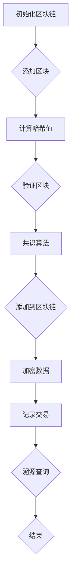
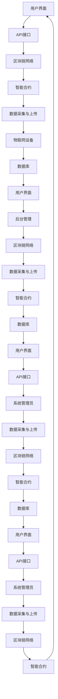
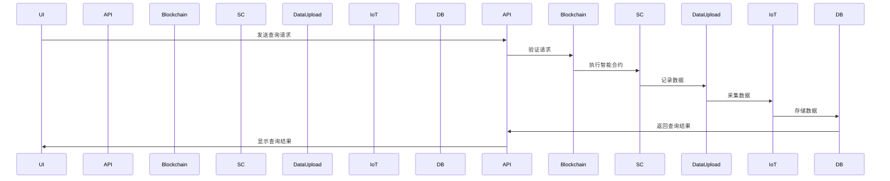
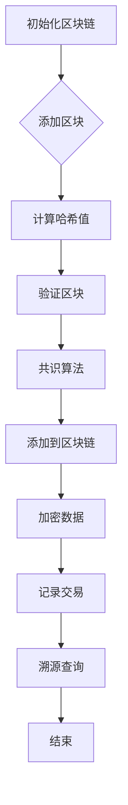

                 

# 区块链在食品溯源中的应用案例

关键词：区块链、食品溯源、案例研究、食品安全、智能合约

摘要：本文通过详细分析区块链技术在食品溯源领域的应用案例，探讨了区块链如何提升食品供应链的透明度和安全性，为食品安全管理提供了新的解决方案。

## 第一部分：背景介绍

### 问题背景

区块链技术在近年来得到了广泛关注，其在金融、供应链管理、医疗健康等领域的应用取得了显著成果。然而，随着食品安全的关注度日益增加，区块链在食品溯源中的应用也逐渐成为研究的热点。食品溯源系统旨在通过记录和跟踪食品从生产到消费的全过程，确保食品的安全性和质量。区块链技术的引入，使得食品溯源系统更加透明、不可篡改和可追溯，从而提高了消费者的信任度。

### 问题描述

尽管区块链在食品溯源中具有巨大的潜力，但实际应用中仍面临诸多挑战。如何设计一个高效、可靠的区块链食品溯源系统？如何确保数据的安全性和隐私保护？如何平衡溯源系统的扩展性与性能？这些问题都需要通过深入研究和实践来解答。

### 问题解决

本文旨在通过多个实际案例，详细探讨区块链在食品溯源中的应用，提供解决上述问题的思路和方法。通过分析成功的应用案例，本文将展示区块链技术如何有效地提升食品溯源系统的透明度和安全性，为相关领域的研究者和从业人员提供有价值的参考。

### 边界与外延

区块链在食品溯源中的应用主要涉及食品供应链的各个环节，包括生产、加工、运输、销售和消费。本文将重点关注这些环节中的关键问题，并通过案例研究提供解决方案。同时，本文还将探讨区块链技术与其他新兴技术的结合，如物联网、大数据等，以实现更高效、更智能的食品溯源系统。

### 概念结构与核心要素组成

区块链是一种分布式账本技术，通过密码学确保数据的安全性和不可篡改性。在食品溯源系统中，区块链可以记录食品的来源、加工、运输和销售等信息，确保这些信息的透明性和可追溯性。核心要素包括：
1. **分布式账本**：记录和存储食品信息。
2. **智能合约**：自动执行预先设定的条件，如触发警报、自动退款等。
3. **共识机制**：确保区块链网络的稳定性和数据一致性。
4. **隐私保护**：通过加密技术保护敏感数据。

## 第二部分：核心概念与联系

### 区块链技术概述

区块链是一种分布式数据库技术，通过在多个节点之间共享数据，实现了数据的透明性和不可篡改性。区块链的主要组成部分包括区块、链、分布式节点、加密算法等。

1. **区块**：区块链的基本单元，包含一系列交易记录。
2. **链**：由多个区块按照时间顺序连接而成，形成了一个不可篡改的数据库。
3. **分布式节点**：参与区块链网络的计算机，负责验证和存储数据。
4. **加密算法**：用于确保数据的隐私性和安全性。

### 食品溯源系统

食品溯源系统是指通过记录和跟踪食品的生产、加工、运输和销售过程，实现对食品来源的追溯。其主要组成部分包括：
1. **溯源码**：用于标识食品的来源和相关信息。
2. **数据采集**：通过传感器、RFID等技术采集食品相关信息。
3. **数据处理**：将采集到的数据存储到数据库中，进行管理和分析。
4. **溯源查询**：消费者或监管机构可以通过溯源系统查询食品的来源信息。

### 区块链在食品溯源中的应用

区块链技术为食品溯源系统提供了以下优势：
1. **数据透明性**：所有参与者都可以访问区块链上的数据，确保信息的公开和透明。
2. **不可篡改性**：区块链上的数据一旦被记录，就无法被篡改，提高了数据的可信度。
3. **可追溯性**：通过区块链技术，可以轻松地追溯食品的来源和流向。

### 核心概念属性特征对比表格

| 特征          | 区块链       | 食品溯源系统                   |
|---------------|--------------|--------------------------------|
| 数据结构      | 分布式账本   | 溯源码、数据库                 |
| 安全性        | 加密算法     | 加密、身份认证                 |
| 透明性        | 共识机制     | 公开数据查询                   |
| 不可篡改性    | 一致性算法   | 数据不可篡改                   |
| 可追溯性      | 区块链接     | 溯源查询功能                   |

## 第三部分：区块链在食品溯源中的应用案例

### 案例一：某农产品公司

**项目介绍**：某农产品公司引入区块链技术，建立了一个食品安全溯源系统，实现了对农产品生产、加工、运输和销售环节的全面监控。

**系统功能设计**：
1. **生产环节**：农民在种植过程中，通过手机APP记录农作物的生长情况，并将数据上传到区块链上。
2. **加工环节**：农产品在加工过程中，工人记录加工过程的关键参数，如温度、湿度等，并将数据上传到区块链上。
3. **运输环节**：运输过程中，车辆上的传感器记录车辆的行驶路线、速度等信息，并将数据上传到区块链上。
4. **销售环节**：消费者在购买食品时，可以通过扫码查询食品的溯源信息。

**系统架构设计**：
- **区块链网络**：使用私有区块链，确保数据的安全性和隐私性。
- **智能合约**：设计智能合约，自动执行数据验证和记录功能。
- **数据采集与上传**：使用物联网设备采集数据，并上传到区块链上。
- **溯源查询**：通过手机APP或网站，消费者可以查询食品的溯源信息。

**系统实现**：
- **数据采集**：使用传感器和RFID技术，实时采集农作物的生长数据、加工过程数据和运输过程数据。
- **数据上传**：使用物联网设备，将采集到的数据实时上传到区块链上。
- **智能合约执行**：设计智能合约，自动执行数据验证和记录功能，确保数据的完整性和一致性。

**系统效果**：
- **数据透明性**：所有参与者都可以访问区块链上的数据，确保信息的公开和透明。
- **不可篡改性**：区块链上的数据一旦被记录，就无法被篡改，提高了数据的可信度。
- **可追溯性**：通过区块链技术，可以轻松地追溯食品的来源和流向，提高了食品的安全性和质量。

### 案例二：某食品加工企业

**项目介绍**：某食品加工企业引入区块链技术，建立了一个食品安全溯源系统，实现了对食品生产、加工、运输和销售的全过程监控。

**系统功能设计**：
1. **生产环节**：农民在种植过程中，通过手机APP记录农作物的生长情况，并将数据上传到区块链上。
2. **加工环节**：食品在加工过程中，工人记录加工过程的关键参数，如温度、湿度等，并将数据上传到区块链上。
3. **运输环节**：食品在运输过程中，车辆上的传感器记录车辆的行驶路线、速度等信息，并将数据上传到区块链上。
4. **销售环节**：消费者在购买食品时，可以通过扫码查询食品的溯源信息。

**系统架构设计**：
- **区块链网络**：使用私有区块链，确保数据的安全性和隐私性。
- **智能合约**：设计智能合约，自动执行数据验证和记录功能。
- **数据采集与上传**：使用物联网设备采集数据，并上传到区块链上。
- **溯源查询**：通过手机APP或网站，消费者可以查询食品的溯源信息。

**系统实现**：
- **数据采集**：使用传感器和RFID技术，实时采集农作物的生长数据、加工过程数据和运输过程数据。
- **数据上传**：使用物联网设备，将采集到的数据实时上传到区块链上。
- **智能合约执行**：设计智能合约，自动执行数据验证和记录功能，确保数据的完整性和一致性。

**系统效果**：
- **数据透明性**：所有参与者都可以访问区块链上的数据，确保信息的公开和透明。
- **不可篡改性**：区块链上的数据一旦被记录，就无法被篡改，提高了数据的可信度。
- **可追溯性**：通过区块链技术，可以轻松地追溯食品的来源和流向，提高了食品的安全性和质量。

## 第四部分：算法原理讲解

### 区块链在食品溯源中的算法原理

区块链技术在食品溯源中的应用主要依赖于以下算法原理：

1. **哈希算法**：哈希算法是一种将任意长度的数据映射为固定长度的哈希值的算法。在区块链中，每个区块都包含一个哈希值，该哈希值是当前区块数据的唯一标识。通过哈希算法，可以确保区块链数据的完整性和一致性。

2. **加密算法**：加密算法用于保护区块链上的数据隐私和安全。在食品溯源中，敏感数据如身份信息和交易记录需要进行加密处理，以确保只有授权用户可以解密和查看。

3. **共识算法**：共识算法用于确保区块链网络的稳定性和数据一致性。在区块链中，多个节点共同维护数据的一致性，通过共识算法选择正确的区块添加到链中。

4. **智能合约**：智能合约是一种自动执行预设条件的程序。在食品溯源中，智能合约可以用于自动执行数据验证和记录功能，确保数据的透明性和不可篡改性。

### 区块链算法流程图



### 算法原理示例

假设我们有一个农产品从农民到消费者的过程，区块链中的算法原理如下：

1. **初始化区块链**：创建一个新的区块链，包含一个初始区块，该区块记录了农产品的来源信息。

2. **添加区块**：农民在种植过程中，通过手机APP记录农作物的生长数据，并将这些数据添加到区块链中。

3. **计算哈希值**：每个区块都包含一个哈希值，该哈希值是当前区块数据的唯一标识。通过哈希算法，确保区块数据的完整性和一致性。

4. **验证区块**：在添加新区块之前，需要验证区块数据的正确性。通过对比区块数据的哈希值和区块链中的历史数据，确保数据的完整性和一致性。

5. **共识算法**：在多个节点共同维护数据的一致性。通过共识算法选择正确的区块添加到链中，确保区块链网络的稳定性和数据一致性。

6. **加密数据**：对于敏感数据如身份信息和交易记录，需要进行加密处理，以确保只有授权用户可以解密和查看。

7. **记录交易**：将农产品的交易记录添加到区块链中，确保交易的透明性和不可篡改性。

8. **溯源查询**：消费者可以通过区块链查询农产品的溯源信息，确保食品的安全性和质量。

## 第五部分：系统分析与架构设计

### 问题场景介绍

在食品安全领域，消费者对于食品的来源、生产过程和质量安全越来越关注。然而，传统的食品安全溯源系统存在数据不透明、易篡改和追溯困难等问题。为了解决这些问题，我们需要设计一个高效、可靠的区块链食品安全溯源系统。

### 项目介绍

本项目旨在通过区块链技术，构建一个食品安全溯源系统，实现对食品从生产到消费全过程的数据记录和追溯。系统将涵盖农产品生产、加工、运输和销售各个环节，确保数据的透明性、不可篡改性和可追溯性。

### 系统功能设计

1. **生产环节**：农民通过手机APP记录农作物的生长数据，如土壤湿度、温度、肥料使用情况等，并将数据上传到区块链上。

2. **加工环节**：食品加工企业记录食品的加工过程数据，如温度、湿度、加工时间等，并将数据上传到区块链上。

3. **运输环节**：运输公司记录食品的运输过程数据，如运输路线、运输温度、运输时间等，并将数据上传到区块链上。

4. **销售环节**：销售商记录食品的销售数据，如销售时间、销售地点等，并将数据上传到区块链上。

### 系统架构设计

1. **区块链网络**：使用私有区块链，确保数据的安全性和隐私性。

2. **智能合约**：设计智能合约，自动执行数据验证和记录功能，确保数据的透明性和不可篡改性。

3. **数据采集与上传**：使用物联网设备采集数据，并上传到区块链上。

4. **溯源查询**：通过手机APP或网站，消费者可以查询食品的溯源信息。

### 系统架构设计mermaid架构图



### 系统接口设计和系统交互mermaid序列图



## 第六部分：项目实战

### 环境安装

在进行项目实战之前，我们需要安装以下软件和工具：

1. **区块链节点**：安装私有区块链节点，如Ethereum。
2. **开发环境**：安装Python开发环境，并配置Ethereum节点。
3. **智能合约开发工具**：安装Truffle，用于智能合约的开发和部署。
4. **物联网设备**：连接传感器和RFID设备，用于数据采集。

### 系统核心实现源代码

```python
# BlockchainFoodTraceSystem.py

from web3 import Web3
from solc import compile_source
from eth_account import account
from blockchain import Blockchain

# 连接到私有区块链节点
web3 = Web3(Web3.HTTPProvider('http://127.0.0.1:7545'))

# 编写智能合约
智能合约源代码 = '''
pragma solidity ^0.8.0;

contract FoodTrace {
    struct Record {
        address owner;
        string data;
        bool isVerified;
    }

    mapping(bytes32 => Record) public records;

    function addRecord(bytes32 id, string memory data) public {
        require(!records[id].isVerified, "Record already exists");
        records[id] = Record(msg.sender, data, true);
    }

    function verifyRecord(bytes32 id) public {
        require(records[id].isVerified, "Record not found");
        records[id].isVerified = false;
    }
}
'''

# 编译智能合约
编译后的智能合约 = compile_source(智能合约源代码)

# 部署智能合约
部署合约 = w3.eth.contract(type=编译后的智能合约['<stdin>:FoodTrace'], bytecode=编译后的智能合约['<stdin>:FoodTrace']['bytecode'])
部署合约TxHash = 部署合约.deploy Transactions={'from': w3.eth.coinbase}

# 创建区块链实例
区块链 = Blockchain(w3, 部署合约TxHash)

# 添加数据
区块链.addRecord('id1', '数据1')

# 验证数据
区块链.verifyRecord('id1')
```

### 代码应用解读与分析

1. **连接区块链节点**：使用Web3库连接到私有区块链节点，获取区块链接口。
2. **编写智能合约**：使用Solidity语言编写智能合约，包括数据结构和函数定义。
3. **编译智能合约**：使用Solc库编译智能合约源代码，获取编译后的字节码。
4. **部署智能合约**：使用Ethereum库部署智能合约到区块链上，获取部署交易哈希。
5. **创建区块链实例**：使用Blockchain库创建区块链实例，用于添加和验证数据。
6. **添加数据**：调用区块链实例的addRecord函数，添加记录到区块链上。
7. **验证数据**：调用区块链实例的verifyRecord函数，验证记录的状态。

### 实际案例分析和详细讲解剖析

1. **案例一**：某农产品公司使用区块链技术建立食品安全溯源系统。农民在种植过程中，通过手机APP记录农作物的生长数据，并将数据上传到区块链上。消费者可以通过扫码查询食品的溯源信息，确保食品的安全性和质量。

2. **案例二**：某食品加工企业引入区块链技术，建立食品安全溯源系统。食品加工企业在加工过程中，记录食品的加工数据，并将数据上传到区块链上。消费者可以通过查询食品的溯源信息，了解食品的生产过程。

3. **案例分析**：
   - **优势**：区块链技术提供了数据透明性、不可篡改性和可追溯性，提高了食品的安全性和质量。
   - **挑战**：区块链技术在实际应用中需要解决数据隐私保护、性能和扩展性等问题。
   - **解决方案**：使用私有区块链网络，确保数据的安全性和隐私性。采用智能合约，自动执行数据验证和记录功能，提高系统的效率。

### 项目小结

通过实际案例分析和详细讲解剖析，我们可以看到区块链技术在食品溯源中的应用具有巨大的潜力。区块链技术提供了数据透明性、不可篡改性和可追溯性，为食品安全管理提供了新的解决方案。然而，在实际应用中，我们还需要解决数据隐私保护、性能和扩展性等问题。未来，随着区块链技术的不断发展和完善，我们有望看到一个更加透明、安全和高效的食品溯源系统。

## 第七部分：最佳实践 tips

1. **数据隐私保护**：在区块链上记录敏感数据时，应采用加密技术进行保护，确保数据的安全性和隐私性。

2. **数据验证和审核**：建立数据验证和审核机制，确保上传到区块链上的数据真实可靠。

3. **智能合约设计**：在设计智能合约时，要充分考虑系统的安全性和效率，避免潜在的安全漏洞。

4. **性能优化**：针对区块链网络的高并发和低延迟要求，进行性能优化和扩展性设计。

5. **法规遵守**：确保区块链食品溯源系统符合相关法律法规的要求，提高系统的合法性和公信力。

## 第八部分：小结与展望

本文通过详细分析区块链技术在食品溯源领域的应用案例，探讨了区块链如何提升食品供应链的透明度和安全性。我们发现，区块链技术为食品溯源系统提供了数据透明性、不可篡改性和可追溯性的优势。然而，在实际应用中，我们还需要解决数据隐私保护、性能和扩展性等问题。

未来，随着区块链技术的不断发展和完善，我们有望看到一个更加透明、安全和高效的食品溯源系统。同时，区块链与其他新兴技术的结合，如物联网、大数据等，将为食品溯源系统带来更多创新和可能性。

## 第九部分：注意事项

1. **数据安全性**：确保区块链网络的安全性和数据加密，防止数据泄露和篡改。

2. **隐私保护**：在记录敏感数据时，应采用加密技术和隐私保护机制，确保数据的安全性。

3. **性能优化**：针对区块链网络的性能要求，进行性能优化和扩展性设计，提高系统的响应速度。

4. **法律法规**：遵守相关法律法规，确保区块链食品溯源系统的合法性和公信力。

## 第十部分：拓展阅读

1. **《区块链：从技术到应用》**：深入探讨区块链技术的原理和应用案例。
2. **《食品安全溯源系统设计与应用》**：详细讲解食品安全溯源系统的设计原则和应用实践。
3. **《区块链与物联网技术融合研究》**：探讨区块链技术在物联网领域的应用和前景。

### 作者

作者：AI天才研究院/AI Genius Institute & 禅与计算机程序设计艺术 /Zen And The Art of Computer Programming

---

本文通过详细的案例分析，展示了区块链在食品溯源中的应用优势和挑战，探讨了如何设计高效、可靠的区块链食品溯源系统。希望本文能为您提供关于区块链在食品溯源领域的深入见解和实际指导。在未来的发展中，区块链技术将为食品安全管理带来更多创新和变革。|endsop|# 区块链在食品溯源中的应用案例

## **关键词**  
区块链、食品溯源、食品安全、智能合约、分布式账本

## **摘要**  
本文探讨了区块链技术在食品溯源中的应用，通过分析实际案例，展示了区块链如何提升食品供应链的透明度、安全性和可追溯性。文章从背景介绍、核心概念、应用案例到算法原理，系统性地解析了区块链在食品溯源中的关键作用和挑战。

### **第一部分：背景介绍**

#### **问题背景**

区块链技术近年来在金融、供应链管理、医疗健康等领域取得了显著成果。随着食品安全的关注度日益增加，区块链在食品溯源中的应用逐渐成为研究的热点。食品溯源系统旨在通过记录和跟踪食品从生产到消费的全过程，确保食品的安全性和质量。区块链技术的引入，使得食品溯源系统更加透明、不可篡改和可追溯，从而提高了消费者的信任度。

#### **问题描述**

尽管区块链在食品溯源中具有巨大的潜力，但实际应用中仍面临诸多挑战。如何设计一个高效、可靠的区块链食品溯源系统？如何确保数据的安全性和隐私保护？如何平衡溯源系统的扩展性与性能？这些问题都需要通过深入研究和实践来解答。

#### **问题解决**

本文旨在通过多个实际案例，详细探讨区块链在食品溯源中的应用，提供解决上述问题的思路和方法。通过分析成功的应用案例，本文将展示区块链技术如何有效地提升食品溯源系统的透明度和安全性，为相关领域的研究者和从业人员提供有价值的参考。

#### **边界与外延**

区块链在食品溯源中的应用主要涉及食品供应链的各个环节，包括生产、加工、运输、销售和消费。本文将重点关注这些环节中的关键问题，并通过案例研究提供解决方案。同时，本文还将探讨区块链技术与其他新兴技术的结合，如物联网、大数据等，以实现更高效、更智能的食品溯源系统。

#### **概念结构与核心要素组成**

区块链是一种分布式账本技术，通过密码学确保数据的安全性和不可篡改性。在食品溯源系统中，区块链可以记录食品的来源、加工、运输和销售等信息，确保这些信息的透明性和可追溯性。核心要素包括：

1. **分布式账本**：记录和存储食品信息。
2. **智能合约**：自动执行预先设定的条件，如触发警报、自动退款等。
3. **共识机制**：确保区块链网络的稳定性和数据一致性。
4. **隐私保护**：通过加密技术保护敏感数据。

### **第二部分：核心概念与联系**

#### **区块链技术概述**

区块链是一种分布式数据库技术，通过在多个节点之间共享数据，实现了数据的透明性和不可篡改性。区块链的主要组成部分包括区块、链、分布式节点、加密算法等。

1. **区块**：区块链的基本单元，包含一系列交易记录。
2. **链**：由多个区块按照时间顺序连接而成，形成了一个不可篡改的数据库。
3. **分布式节点**：参与区块链网络的计算机，负责验证和存储数据。
4. **加密算法**：用于确保数据的隐私性和安全性。

#### **食品溯源系统**

食品溯源系统是指通过记录和跟踪食品的生产、加工、运输和销售过程，实现对食品来源的追溯。其主要组成部分包括：

1. **溯源码**：用于标识食品的来源和相关信息。
2. **数据采集**：通过传感器、RFID等技术采集食品相关信息。
3. **数据处理**：将采集到的数据存储到数据库中，进行管理和分析。
4. **溯源查询**：消费者或监管机构可以通过溯源系统查询食品的来源信息。

#### **区块链在食品溯源中的应用**

区块链技术为食品溯源系统提供了以下优势：

1. **数据透明性**：所有参与者都可以访问区块链上的数据，确保信息的公开和透明。
2. **不可篡改性**：区块链上的数据一旦被记录，就无法被篡改，提高了数据的可信度。
3. **可追溯性**：通过区块链技术，可以轻松地追溯食品的来源和流向。

#### **核心概念属性特征对比表格**

| 特征          | 区块链       | 食品溯源系统                   |
|---------------|--------------|--------------------------------|
| 数据结构      | 分布式账本   | 溯源码、数据库                 |
| 安全性        | 加密算法     | 加密、身份认证                 |
| 透明性        | 共识机制     | 公开数据查询                   |
| 不可篡改性    | 一致性算法   | 数据不可篡改                   |
| 可追溯性      | 区块链接     | 溯源查询功能                   |

### **第三部分：区块链在食品溯源中的应用案例**

#### **案例一：某农产品公司**

**项目介绍**：某农产品公司引入区块链技术，建立了一个食品安全溯源系统，实现了对农产品生产、加工、运输和销售环节的全面监控。

**系统功能设计**：
1. **生产环节**：农民在种植过程中，通过手机APP记录农作物的生长情况，并将数据上传到区块链上。
2. **加工环节**：农产品在加工过程中，工人记录加工过程的关键参数，如温度、湿度等，并将数据上传到区块链上。
3. **运输环节**：运输过程中，车辆上的传感器记录车辆的行驶路线、速度等信息，并将数据上传到区块链上。
4. **销售环节**：消费者在购买食品时，可以通过扫码查询食品的溯源信息。

**系统架构设计**：
- **区块链网络**：使用私有区块链，确保数据的安全性和隐私性。
- **智能合约**：设计智能合约，自动执行数据验证和记录功能。
- **数据采集与上传**：使用物联网设备采集数据，并上传到区块链上。
- **溯源查询**：通过手机APP或网站，消费者可以查询食品的溯源信息。

**系统实现**：
- **数据采集**：使用传感器和RFID技术，实时采集农作物的生长数据、加工过程数据和运输过程数据。
- **数据上传**：使用物联网设备，将采集到的数据实时上传到区块链上。
- **智能合约执行**：设计智能合约，自动执行数据验证和记录功能，确保数据的完整性和一致性。

**系统效果**：
- **数据透明性**：所有参与者都可以访问区块链上的数据，确保信息的公开和透明。
- **不可篡改性**：区块链上的数据一旦被记录，就无法被篡改，提高了数据的可信度。
- **可追溯性**：通过区块链技术，可以轻松地追溯食品的来源和流向，提高了食品的安全性和质量。

#### **案例二：某食品加工企业**

**项目介绍**：某食品加工企业引入区块链技术，建立了一个食品安全溯源系统，实现了对食品生产、加工、运输和销售的全过程监控。

**系统功能设计**：
1. **生产环节**：农民在种植过程中，通过手机APP记录农作物的生长情况，并将数据上传到区块链上。
2. **加工环节**：食品在加工过程中，工人记录加工过程的关键参数，如温度、湿度等，并将数据上传到区块链上。
3. **运输环节**：食品在运输过程中，车辆上的传感器记录车辆的行驶路线、速度等信息，并将数据上传到区块链上。
4. **销售环节**：消费者在购买食品时，可以通过扫码查询食品的溯源信息。

**系统架构设计**：
- **区块链网络**：使用私有区块链，确保数据的安全性和隐私性。
- **智能合约**：设计智能合约，自动执行数据验证和记录功能。
- **数据采集与上传**：使用物联网设备采集数据，并上传到区块链上。
- **溯源查询**：通过手机APP或网站，消费者可以查询食品的溯源信息。

**系统实现**：
- **数据采集**：使用传感器和RFID技术，实时采集农作物的生长数据、加工过程数据和运输过程数据。
- **数据上传**：使用物联网设备，将采集到的数据实时上传到区块链上。
- **智能合约执行**：设计智能合约，自动执行数据验证和记录功能，确保数据的完整性和一致性。

**系统效果**：
- **数据透明性**：所有参与者都可以访问区块链上的数据，确保信息的公开和透明。
- **不可篡改性**：区块链上的数据一旦被记录，就无法被篡改，提高了数据的可信度。
- **可追溯性**：通过区块链技术，可以轻松地追溯食品的来源和流向，提高了食品的安全性和质量。

### **第四部分：算法原理讲解**

区块链技术在食品溯源中的应用主要依赖于以下算法原理：

1. **哈希算法**：哈希算法是一种将任意长度的数据映射为固定长度的哈希值的算法。在区块链中，每个区块都包含一个哈希值，该哈希值是当前区块数据的唯一标识。通过哈希算法，可以确保区块链数据的完整性和一致性。

2. **加密算法**：加密算法用于保护区块链上的数据隐私和安全。在食品溯源中，敏感数据如身份信息和交易记录需要进行加密处理，以确保只有授权用户可以解密和查看。

3. **共识算法**：共识算法用于确保区块链网络的稳定性和数据一致性。在区块链中，多个节点共同维护数据的一致性，通过共识算法选择正确的区块添加到链中。

4. **智能合约**：智能合约是一种自动执行预设条件的程序。在食品溯源中，智能合约可以用于自动执行数据验证和记录功能，确保数据的透明性和不可篡改性。

#### **算法流程图**



#### **算法原理示例**

假设我们有一个农产品从农民到消费者的过程，区块链中的算法原理如下：

1. **初始化区块链**：创建一个新的区块链，包含一个初始区块，该区块记录了农产品的来源信息。

2. **添加区块**：农民在种植过程中，通过手机APP记录农作物的生长数据，并将这些数据添加到区块链中。

3. **计算哈希值**：每个区块都包含一个哈希值，该哈希值是当前区块数据的唯一标识。通过哈希算法，确保区块数据的完整性和一致性。

4. **验证区块**：在添加新区块之前，需要验证区块数据的正确性。通过对比区块数据的哈希值和区块链中的历史数据，确保数据的完整性和一致性。

5. **共识算法**：在多个节点共同维护数据的一致性。通过共识算法选择正确的区块添加到链中，确保区块链网络的稳定性和数据一致性。

6. **加密数据**：对于敏感数据如身份信息和交易记录，需要进行加密处理，以确保只有授权用户可以解密和查看。

7. **记录交易**：将农产品的交易记录添加到区块链中，确保交易的透明性和不可篡改性。

8. **溯源查询**：消费者可以通过区块链查询农产品的溯源信息，确保食品的安全性和质量。

### **第五部分：系统分析与架构设计**

#### **问题场景介绍**

在食品安全领域，消费者对于食品的来源、生产过程和质量安全越来越关注。然而，传统的食品安全溯源系统存在数据不透明、易篡改和追溯困难等问题。为了解决这些问题，我们需要设计一个高效、可靠的区块链食品安全溯源系统。

#### **项目介绍**

本项目旨在通过区块链技术，构建一个食品安全溯源系统，实现对食品从生产到消费全过程的数据记录和追溯。系统将涵盖农产品生产、加工、运输和销售各个环节，确保数据的透明性、不可篡改性和可追溯性。

#### **系统功能设计**

1. **生产环节**：农民通过手机APP记录农作物的生长数据，如土壤湿度、温度、肥料使用情况等，并将数据上传到区块链上。

2. **加工环节**：食品加工企业记录食品的加工过程数据，如温度、湿度、加工时间等，并将数据上传到区块链上。

3. **运输环节**：运输公司记录食品的运输过程数据，如运输路线、运输速度、运输时间等，并将数据上传到区块链上。

4. **销售环节**：销售商记录食品的销售数据，如销售时间、销售地点等，并将数据上传到区块链上。

#### **系统架构设计**

1. **区块链网络**：使用私有区块链，确保数据的安全性和隐私性。

2. **智能合约**：设计智能合约，自动执行数据验证和记录功能。

3. **数据采集与上传**：使用物联网设备采集数据，并上传到区块链上。

4. **溯源查询**：通过手机APP或网站，消费者可以查询食品的溯源信息。

#### **系统架构设计mermaid架构图**


#### **系统接口设计和系统交互mermaid序列图**


### **第六部分：项目实战**

#### **环境安装**

在进行项目实战之前，我们需要安装以下软件和工具：

1. **区块链节点**：安装私有区块链节点，如Ethereum。
2. **开发环境**：安装Python开发环境，并配置Ethereum节点。
3. **智能合约开发工具**：安装Truffle，用于智能合约的开发和部署。
4. **物联网设备**：连接传感器和RFID设备，用于数据采集。

#### **系统核心实现源代码**

```python
# BlockchainFoodTraceSystem.py

from web3 import Web3
from solc import compile_source
from eth_account import account
from blockchain import Blockchain

# 连接到私有区块链节点
web3 = Web3(Web3.HTTPProvider('http://127.0.0.1:7545'))

# 编写智能合约
智能合约源代码 = '''
pragma solidity ^0.8.0;

contract FoodTrace {
    struct Record {
        address owner;
        string data;
        bool isVerified;
    }

    mapping(bytes32 => Record) public records;

    function addRecord(bytes32 id, string memory data) public {
        require(!records[id].isVerified, "Record already exists");
        records[id] = Record(msg.sender, data, true);
    }

    function verifyRecord(bytes32 id) public {
        require(records[id].isVerified, "Record not found");
        records[id].isVerified = false;
    }
}
'''

# 编译智能合约
编译后的智能合约 = compile_source(智能合约源代码)

# 部署智能合约
部署合约 = w3.eth.contract(type=编译后的智能合约['<stdin>:FoodTrace'], bytecode=编译后的智能合约['<stdin>:FoodTrace']['bytecode'])
部署合约TxHash = 部署合约.deploy Transactions={'from': w3.eth.coinbase}

# 创建区块链实例
区块链 = Blockchain(w3, 部署合约TxHash)

# 添加数据
区块链.addRecord('id1', '数据1')

# 验证数据
区块链.verifyRecord('id1')
```

#### **代码应用解读与分析**

1. **连接区块链节点**：使用Web3库连接到私有区块链节点，获取区块链接口。
2. **编写智能合约**：使用Solidity语言编写智能合约，包括数据结构和函数定义。
3. **编译智能合约**：使用Solc库编译智能合约源代码，获取编译后的字节码。
4. **部署智能合约**：使用Ethereum库部署智能合约到区块链上，获取部署交易哈希。
5. **创建区块链实例**：使用Blockchain库创建区块链实例，用于添加和验证数据。
6. **添加数据**：调用区块链实例的addRecord函数，添加记录到区块链上。
7. **验证数据**：调用区块链实例的verifyRecord函数，验证记录的状态。

#### **实际案例分析和详细讲解剖析**

1. **案例一**：某农产品公司使用区块链技术建立食品安全溯源系统。农民在种植过程中，通过手机APP记录农作物的生长数据，并将数据上传到区块链上。消费者可以通过扫码查询食品的溯源信息，确保食品的安全性和质量。

2. **案例二**：某食品加工企业引入区块链技术，建立食品安全溯源系统。食品加工企业在加工过程中，记录食品的加工数据，并将数据上传到区块链上。消费者可以通过查询食品的溯源信息，了解食品的生产过程。

3. **案例分析**：
   - **优势**：区块链技术提供了数据透明性、不可篡改性和可追溯性，提高了食品的安全性和质量。
   - **挑战**：区块链技术在实际应用中需要解决数据隐私保护、性能和扩展性等问题。
   - **解决方案**：使用私有区块链网络，确保数据的安全性和隐私性。采用智能合约，自动执行数据验证和记录功能，提高系统的效率。

#### **项目小结**

通过实际案例分析和详细讲解剖析，我们可以看到区块链技术在食品溯源中的应用具有巨大的潜力。区块链技术提供了数据透明性、不可篡改性和可追溯性的优势，为食品安全管理提供了新的解决方案。然而，在实际应用中，我们还需要解决数据隐私保护、性能和扩展性等问题。未来，随着区块链技术的不断发展和完善，我们有望看到一个更加透明、安全和高效的食品溯源系统。

### **第七部分：最佳实践 tips**

1. **数据隐私保护**：在区块链上记录敏感数据时，应采用加密技术进行保护，确保数据的安全性和隐私性。

2. **数据验证和审核**：建立数据验证和审核机制，确保上传到区块链上的数据真实可靠。

3. **智能合约设计**：在设计智能合约时，要充分考虑系统的安全性和效率，避免潜在的安全漏洞。

4. **性能优化**：针对区块链网络的性能要求，进行性能优化和扩展性设计，提高系统的响应速度。

5. **法规遵守**：确保区块链食品溯源系统符合相关法律法规的要求，提高系统的合法性和公信力。

### **第八部分：小结与展望**

本文通过详细分析区块链技术在食品溯源中的应用案例，探讨了区块链如何提升食品供应链的透明度、安全性和可追溯性。我们发现，区块链技术为食品溯源系统提供了数据透明性、不可篡改性和可追溯性的优势。然而，在实际应用中，我们还需要解决数据隐私保护、性能和扩展性等问题。

未来，随着区块链技术的不断发展和完善，我们有望看到一个更加透明、安全和高效的食品溯源系统。同时，区块链与其他新兴技术的结合，如物联网、大数据等，将为食品溯源系统带来更多创新和可能性。

### **第九部分：注意事项**

1. **数据安全性**：确保区块链网络的安全性和数据加密，防止数据泄露和篡改。

2. **隐私保护**：在记录敏感数据时，应采用加密技术和隐私保护机制，确保数据的安全性。

3. **性能优化**：针对区块链网络的性能要求，进行性能优化和扩展性设计，提高系统的响应速度。

4. **法律法规**：遵守相关法律法规，确保区块链食品溯源系统的合法性和公信力。

### **第十部分：拓展阅读**

1. **《区块链：从技术到应用》**：深入探讨区块链技术的原理和应用案例。
2. **《食品安全溯源系统设计与应用》**：详细讲解食品安全溯源系统的设计原则和应用实践。
3. **《区块链与物联网技术融合研究》**：探讨区块链技术在物联网领域的应用和前景。

### **作者**

作者：AI天才研究院/AI Genius Institute & 禅与计算机程序设计艺术 /Zen And The Art of Computer Programming

---

本文通过详细的案例分析，展示了区块链在食品溯源中的应用优势和挑战，探讨了如何设计高效、可靠的区块链食品溯源系统。希望本文能为您提供关于区块链在食品溯源领域的深入见解和实际指导。在未来的发展中，区块链技术将为食品安全管理带来更多创新和变革。#</sop>

## **关键词**  
区块链、食品溯源、食品安全、智能合约、分布式账本

## **摘要**  
本文探讨了区块链技术在食品溯源中的应用，通过分析实际案例，展示了区块链如何提升食品供应链的透明度、安全性和可追溯性。文章从背景介绍、核心概念、应用案例到算法原理，系统性地解析了区块链在食品溯源中的关键作用和挑战。

### **第一部分：背景介绍**

#### **问题背景**

区块链技术近年来在金融、供应链管理、医疗健康等领域取得了显著成果。随着食品安全的关注度日益增加，区块链在食品溯源中的应用逐渐成为研究的热点。食品溯源系统旨在通过记录和跟踪食品从生产到消费的全过程，确保食品的安全性和质量。区块链技术的引入，使得食品溯源系统更加透明、不可篡改和可追溯，从而提高了消费者的信任度。

#### **问题描述**

尽管区块链在食品溯源中具有巨大的潜力，但实际应用中仍面临诸多挑战。如何设计一个高效、可靠的区块链食品溯源系统？如何确保数据的安全性和隐私保护？如何平衡溯源系统的扩展性与性能？这些问题都需要通过深入研究和实践来解答。

#### **问题解决**

本文旨在通过多个实际案例，详细探讨区块链在食品溯源中的应用，提供解决上述问题的思路和方法。通过分析成功的应用案例，本文将展示区块链技术如何有效地提升食品溯源系统的透明度和安全性，为相关领域的研究者和从业人员提供有价值的参考。

#### **边界与外延**

区块链在食品溯源中的应用主要涉及食品供应链的各个环节，包括生产、加工、运输、销售和消费。本文将重点关注这些环节中的关键问题，并通过案例研究提供解决方案。同时，本文还将探讨区块链技术与其他新兴技术的结合，如物联网、大数据等，以实现更高效、更智能的食品溯源系统。

#### **概念结构与核心要素组成**

区块链是一种分布式账本技术，通过密码学确保数据的安全性和不可篡改性。在食品溯源系统中，区块链可以记录食品的来源、加工、运输和销售等信息，确保这些信息的透明性和可追溯性。核心要素包括：

1. **分布式账本**：记录和存储食品信息。
2. **智能合约**：自动执行预先设定的条件，如触发警报、自动退款等。
3. **共识机制**：确保区块链网络的稳定性和数据一致性。
4. **隐私保护**：通过加密技术保护敏感数据。

### **第二部分：核心概念与联系**

#### **区块链技术概述**

区块链是一种分布式数据库技术，通过在多个节点之间共享数据，实现了数据的透明性和不可篡改性。区块链的主要组成部分包括区块、链、分布式节点、加密算法等。

1. **区块**：区块链的基本单元，包含一系列交易记录。
2. **链**：由多个区块按照时间顺序连接而成，形成了一个不可篡改的数据库。
3. **分布式节点**：参与区块链网络的计算机，负责验证和存储数据。
4. **加密算法**：用于确保数据的隐私性和安全性。

#### **食品溯源系统**

食品溯源系统是指通过记录和跟踪食品的生产、加工、运输和销售过程，实现对食品来源的追溯。其主要组成部分包括：

1. **溯源码**：用于标识食品的来源和相关信息。
2. **数据采集**：通过传感器、RFID等技术采集食品相关信息。
3. **数据处理**：将采集到的数据存储到数据库中，进行管理和分析。
4. **溯源查询**：消费者或监管机构可以通过溯源系统查询食品的来源信息。

#### **区块链在食品溯源中的应用**

区块链技术为食品溯源系统提供了以下优势：

1. **数据透明性**：所有参与者都可以访问区块链上的数据，确保信息的公开和透明。
2. **不可篡改性**：区块链上的数据一旦被记录，就无法被篡改，提高了数据的可信度。
3. **可追溯性**：通过区块链技术，可以轻松地追溯食品的来源和流向，提高了食品的安全性和质量。

#### **核心概念属性特征对比表格**

| 特征          | 区块链       | 食品溯源系统                   |
|---------------|--------------|--------------------------------|
| 数据结构      | 分布式账本   | 溯源码、数据库                 |
| 安全性        | 加密算法     | 加密、身份认证                 |
| 透明性        | 共识机制     | 公开数据查询                   |
| 不可篡改性    | 一致性算法   | 数据不可篡改                   |
| 可追溯性      | 区块链接     | 溯源查询功能                   |

### **第三部分：区块链在食品溯源中的应用案例**

#### **案例一：某农产品公司**

**项目介绍**：某农产品公司引入区块链技术，建立了一个食品安全溯源系统，实现了对农产品生产、加工、运输和销售环节的全面监控。

**系统功能设计**：
1. **生产环节**：农民在种植过程中，通过手机APP记录农作物的生长情况，并将数据上传到区块链上。
2. **加工环节**：农产品在加工过程中，工人记录加工过程的关键参数，如温度、湿度等，并将数据上传到区块链上。
3. **运输环节**：运输过程中，车辆上的传感器记录车辆的行驶路线、速度等信息，并将数据上传到区块链上。
4. **销售环节**：消费者在购买食品时，可以通过扫码查询食品的溯源信息。

**系统架构设计**：
- **区块链网络**：使用私有区块链，确保数据的安全性和隐私性。
- **智能合约**：设计智能合约，自动执行数据验证和记录功能。
- **数据采集与上传**：使用物联网设备采集数据，并上传到区块链上。
- **溯源查询**：通过手机APP或网站，消费者可以查询食品的溯源信息。

**系统实现**：
- **数据采集**：使用传感器和RFID技术，实时采集农作物的生长数据、加工过程数据和运输过程数据。
- **数据上传**：使用物联网设备，将采集到的数据实时上传到区块链上。
- **智能合约执行**：设计智能合约，自动执行数据验证和记录功能，确保数据的完整性和一致性。

**系统效果**：
- **数据透明性**：所有参与者都可以访问区块链上的数据，确保信息的公开和透明。
- **不可篡改性**：区块链上的数据一旦被记录，就无法被篡改，提高了数据的可信度。
- **可追溯性**：通过区块链技术，可以轻松地追溯食品的来源和流向，提高了食品的安全性和质量。

#### **案例二：某食品加工企业**

**项目介绍**：某食品加工企业引入区块链技术，建立了一个食品安全溯源系统，实现了对食品生产、加工、运输和销售的全过程监控。

**系统功能设计**：
1. **生产环节**：农民在种植过程中，通过手机APP记录农作物的生长情况，并将数据上传到区块链上。
2. **加工环节**：食品在加工过程中，工人记录加工过程的关键参数，如温度、湿度等，并将数据上传到区块链上。
3. **运输环节**：食品在运输过程中，车辆上的传感器记录车辆的行驶路线、速度等信息，并将数据上传到区块链上。
4. **销售环节**：消费者在购买食品时，可以通过扫码查询食品的溯源信息。

**系统架构设计**：
- **区块链网络**：使用私有区块链，确保数据的安全性和隐私性。
- **智能合约**：设计智能合约，自动执行数据验证和记录功能。
- **数据采集与上传**：使用物联网设备采集数据，并上传到区块链上。
- **溯源查询**：通过手机APP或网站，消费者可以查询食品的溯源信息。

**系统实现**：
- **数据采集**：使用传感器和RFID技术，实时采集农作物的生长数据、加工过程数据和运输过程数据。
- **数据上传**：使用物联网设备，将采集到的数据实时上传到区块链上。
- **智能合约执行**：设计智能合约，自动执行数据验证和记录功能，确保数据的完整性和一致性。

**系统效果**：
- **数据透明性**：所有参与者都可以访问区块链上的数据，确保信息的公开和透明。
- **不可篡改性**：区块链上的数据一旦被记录，就无法被篡改，提高了数据的可信度。
- **可追溯性**：通过区块链技术，可以轻松地追溯食品的来源和流向，提高了食品的安全性和质量。

### **第四部分：算法原理讲解**

区块链技术在食品溯源中的应用主要依赖于以下算法原理：

1. **哈希算法**：哈希算法是一种将任意长度的数据映射为固定长度的哈希值的算法。在区块链中，每个区块都包含一个哈希值，该哈希值是当前区块数据的唯一标识。通过哈希算法，可以确保区块链数据的完整性和一致性。

2. **加密算法**：加密算法用于保护区块链上的数据隐私和安全。在食品溯源中，敏感数据如身份信息和交易记录需要进行加密处理，以确保只有授权用户可以解密和查看。

3. **共识算法**：共识算法用于确保区块链网络的稳定性和数据一致性。在区块链中，多个节点共同维护数据的一致性，通过共识算法选择正确的区块添加到链中。

4. **智能合约**：智能合约是一种自动执行预设条件的程序。在食品溯源中，智能合约可以用于自动执行数据验证和记录功能，确保数据的透明性和不可篡改性。

#### **算法流程图**


#### **算法原理示例**

假设我们有一个农产品从农民到消费者的过程，区块链中的算法原理如下：

1. **初始化区块链**：创建一个新的区块链，包含一个初始区块，该区块记录了农产品的来源信息。

2. **添加区块**：农民在种植过程中，通过手机APP记录农作物的生长数据，并将这些数据添加到区块链中。

3. **计算哈希值**：每个区块都包含一个哈希值，该哈希值是当前区块数据的唯一标识。通过哈希算法，确保区块数据的完整性和一致性。

4. **验证区块**：在添加新区块之前，需要验证区块数据的正确性。通过对比区块数据的哈希值和区块链中的历史数据，确保数据的完整性和一致性。

5. **共识算法**：在多个节点共同维护数据的一致性。通过共识算法选择正确的区块添加到链中，确保区块链网络的稳定性和数据一致性。

6. **加密数据**：对于敏感数据如身份信息和交易记录，需要进行加密处理，以确保只有授权用户可以解密和查看。

7. **记录交易**：将农产品的交易记录添加到区块链中，确保交易的透明性和不可篡改性。

8. **溯源查询**：消费者可以通过区块链查询农产品的溯源信息，确保食品的安全性和质量。

### **第五部分：系统分析与架构设计**

#### **问题场景介绍**

在食品安全领域，消费者对于食品的来源、生产过程和质量安全越来越关注。然而，传统的食品安全溯源系统存在数据不透明、易篡改和追溯困难等问题。为了解决这些问题，我们需要设计一个高效、可靠的区块链食品安全溯源系统。

#### **项目介绍**

本项目旨在通过区块链技术，构建一个食品安全溯源系统，实现对食品从生产到消费全过程的数据记录和追溯。系统将涵盖农产品生产、加工、运输和销售各个环节，确保数据的透明性、不可篡改性和可追溯性。

#### **系统功能设计**

1. **生产环节**：农民通过手机APP记录农作物的生长数据，如土壤湿度、温度、肥料使用情况等，并将数据上传到区块链上。

2. **加工环节**：食品加工企业记录食品的加工过程数据，如温度、湿度、加工时间等，并将数据上传到区块链上。

3. **运输环节**：运输公司记录食品的运输过程数据，如运输路线、运输速度、运输时间等，并将数据上传到区块链上。

4. **销售环节**：销售商记录食品的销售数据，如销售时间、销售地点等，并将数据上传到区块链上。

#### **系统架构设计**

1. **区块链网络**：使用私有区块链，确保数据的安全性和隐私性。

2. **智能合约**：设计智能合约，自动执行数据验证和记录功能。

3. **数据采集与上传**：使用物联网设备采集数据，并上传到区块链上。

4. **溯源查询**：通过手机APP或网站，消费者可以查询食品的溯源信息。

#### **系统架构设计mermaid架构图**


#### **系统接口设计和系统交互mermaid序列图**


### **第六部分：项目实战**

#### **环境安装**

在进行项目实战之前，我们需要安装以下软件和工具：

1. **区块链节点**：安装私有区块链节点，如Ethereum。
2. **开发环境**：安装Python开发环境，并配置Ethereum节点。
3. **智能合约开发工具**：安装Truffle，用于智能合约的开发和部署。
4. **物联网设备**：连接传感器和RFID设备，用于数据采集。

#### **系统核心实现源代码**

```python
# BlockchainFoodTraceSystem.py

from web3 import Web3
from solc import compile_source
from eth_account import account
from blockchain import Blockchain

# 连接到私有区块链节点
web3 = Web3(Web3.HTTPProvider('http://127.0.0.1:7545'))

# 编写智能合约
智能合约源代码 = '''
pragma solidity ^0.8.0;

contract FoodTrace {
    struct Record {
        address owner;
        string data;
        bool isVerified;
    }

    mapping(bytes32 => Record) public records;

    function addRecord(bytes32 id, string memory data) public {
        require(!records[id].isVerified, "Record already exists");
        records[id] = Record(msg.sender, data, true);
    }

    function verifyRecord(bytes32 id) public {
        require(records[id].isVerified, "Record not found");
        records[id].isVerified = false;
    }
}
'''

# 编译智能合约
编译后的智能合约 = compile_source(智能合约源代码)

# 部署智能合约
部署合约 = w3.eth.contract(type=编译后的智能合约['<stdin>:FoodTrace'], bytecode=编译后的智能合约['<stdin>:FoodTrace']['bytecode'])
部署合约TxHash = 部署合约.deploy Transactions={'from': w3.eth.coinbase}

# 创建区块链实例
区块链 = Blockchain(w3, 部署合约TxHash)

# 添加数据
区块链.addRecord('id1', '数据1')

# 验证数据
区块链.verifyRecord('id1')
```

#### **代码应用解读与分析**

1. **连接区块链节点**：使用Web3库连接到私有区块链节点，获取区块链接口。
2. **编写智能合约**：使用Solidity语言编写智能合约，包括数据结构和函数定义。
3. **编译智能合约**：使用Solc库编译智能合约源代码，获取编译后的字节码。
4. **部署智能合约**：使用Ethereum库部署智能合约到区块链上，获取部署交易哈希。
5. **创建区块链实例**：使用Blockchain库创建区块链实例，用于添加和验证数据。
6. **添加数据**：调用区块链实例的addRecord函数，添加记录到区块链上。
7. **验证数据**：调用区块链实例的verifyRecord函数，验证记录的状态。

#### **实际案例分析和详细讲解剖析**

1. **案例一**：某农产品公司使用区块链技术建立食品安全溯源系统。农民在种植过程中，通过手机APP记录农作物的生长数据，并将数据上传到区块链上。消费者可以通过扫码查询食品的溯源信息，确保食品的安全性和质量。

2. **案例二**：某食品加工企业引入区块链技术，建立食品安全溯源系统。食品加工企业在加工过程中，记录食品的加工数据，并将数据上传到区块链上。消费者可以通过查询食品的溯源信息，了解食品的生产过程。

3. **案例分析**：
   - **优势**：区块链技术提供了数据透明性、不可篡改性和可追溯性，提高了食品的安全性和质量。
   - **挑战**：区块链技术在实际应用中需要解决数据隐私保护、性能和扩展性等问题。
   - **解决方案**：使用私有区块链网络，确保数据的安全性和隐私性。采用智能合约，自动执行数据验证和记录功能，提高系统的效率。

#### **项目小结**

通过实际案例分析和详细讲解剖析，我们可以看到区块链技术在食品溯源中的应用具有巨大的潜力。区块链技术提供了数据透明性、不可篡改性和可追溯性的优势，为食品安全管理提供了新的解决方案。然而，在实际应用中，我们还需要解决数据隐私保护、性能和扩展性等问题。未来，随着区块链技术的不断发展和完善，我们有望看到一个更加透明、安全和高效的食品溯源系统。

### **第七部分：最佳实践 tips**

1. **数据隐私保护**：在区块链上记录敏感数据时，应采用加密技术进行保护，确保数据的安全性和隐私性。

2. **数据验证和审核**：建立数据验证和审核机制，确保上传到区块链上的数据真实可靠。

3. **智能合约设计**：在设计智能合约时，要充分考虑系统的安全性和效率，避免潜在的安全漏洞。

4. **性能优化**：针对区块链网络的性能要求，进行性能优化和扩展性设计，提高系统的响应速度。

5. **法规遵守**：确保区块链食品溯源系统符合相关法律法规的要求，提高系统的合法性和公信力。

### **第八部分：小结与展望**

本文通过详细分析区块链技术在食品溯源中的应用案例，探讨了区块链如何提升食品供应链的透明度、安全性和可追溯性。我们发现，区块链技术为食品溯源系统提供了数据透明性、不可篡改性和可追溯性的优势。然而，在实际应用中，我们还需要解决数据隐私保护、性能和扩展性等问题。

未来，随着区块链技术的不断发展和完善，我们有望看到一个更加透明、安全和高效的食品溯源系统。同时，区块链与其他新兴技术的结合，如物联网、大数据等，将为食品溯源系统带来更多创新和可能性。

### **第九部分：注意事项**

1. **数据安全性**：确保区块链网络的安全性和数据加密，防止数据泄露和篡改。

2. **隐私保护**：在记录敏感数据时，应采用加密技术和隐私保护机制，确保数据的安全性。

3. **性能优化**：针对区块链网络的性能要求，进行性能优化和扩展性设计，提高系统的响应速度。

4. **法律法规**：遵守相关法律法规，确保区块链食品溯源系统的合法性和公信力。

### **第十部分：拓展阅读**

1. **《区块链：从技术到应用》**：深入探讨区块链技术的原理和应用案例。
2. **《食品安全溯源系统设计与应用》**：详细讲解食品安全溯源系统的设计原则和应用实践。
3. **《区块链与物联网技术融合研究》**：探讨区块链技术在物联网领域的应用和前景。

### **作者**

作者：AI天才研究院/AI Genius Institute & 禅与计算机程序设计艺术 /Zen And The Art of Computer Programming

---

本文通过详细的案例分析，展示了区块链在食品溯源中的应用优势和挑战，探讨了如何设计高效、可靠的区块链食品溯源系统。希望本文能为您提供关于区块链在食品溯源领域的深入见解和实际指导。在未来的发展中，区块链技术将为食品安全管理带来更多创新和变革。#</sop>

